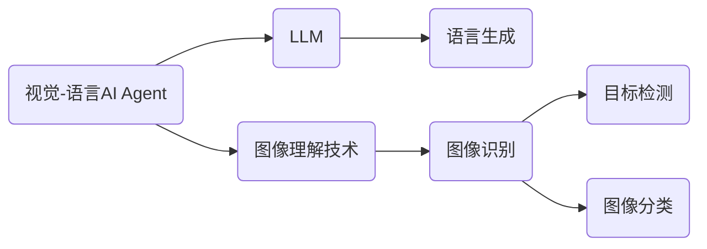
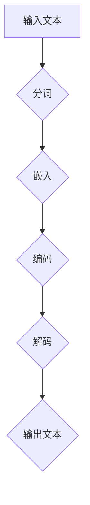
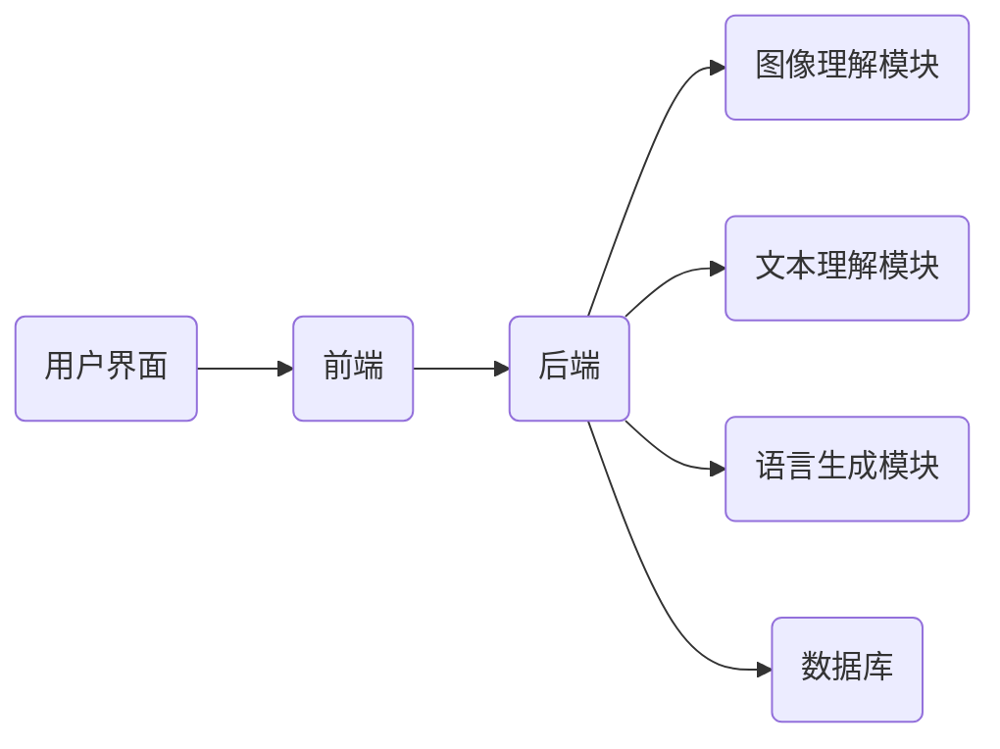
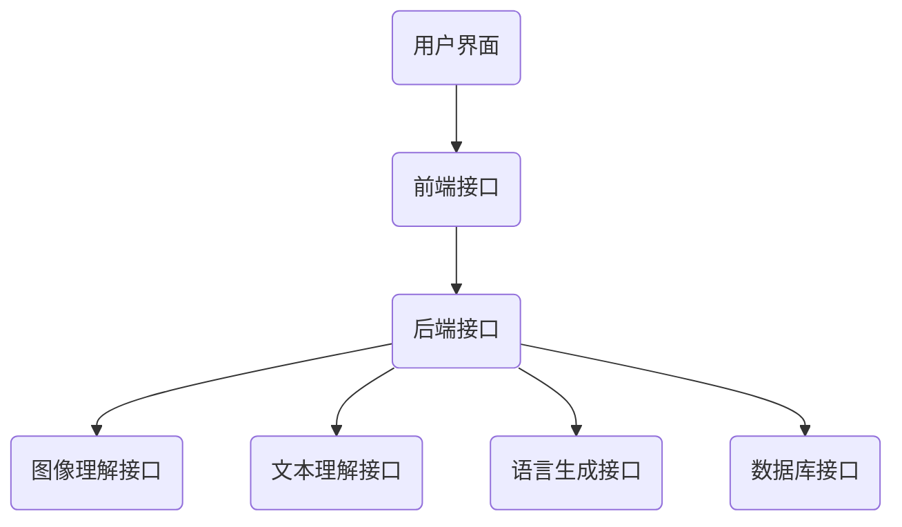
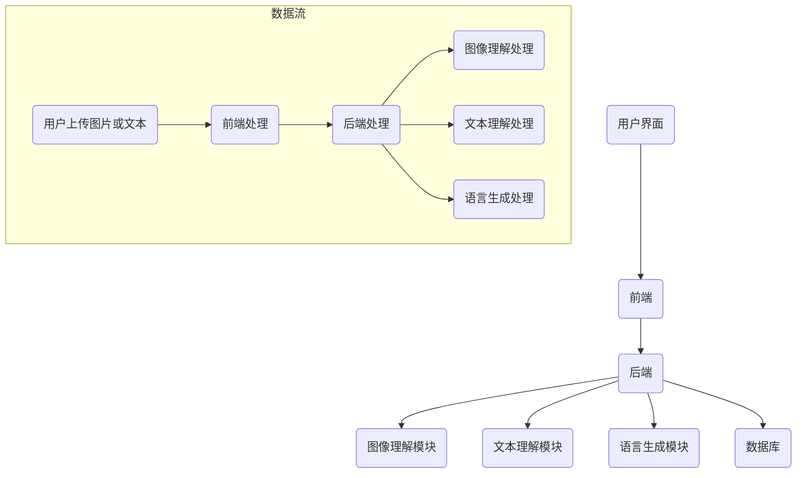

                 

### 《视觉-语言AI Agent：整合LLM与图像理解》

> 关键词：视觉-语言AI Agent，LLM，图像理解，整合，算法原理，Python实现

> 摘要：本文探讨了视觉-语言AI Agent的概念及其与LLM和图像理解技术的整合，通过逐步分析算法原理和实现，揭示了视觉-语言AI Agent的强大应用潜力。

---

### 第一部分：背景与概述

#### 第1章：问题背景

##### 1.1.1 问题背景

在人工智能的快速发展中，计算机视觉与自然语言处理（NLP）逐渐成为两大重要领域。计算机视觉致力于让机器理解和解析图像信息，而NLP则专注于处理人类语言。随着深度学习技术的进步，尤其是卷积神经网络（CNN）和长短期记忆网络（LSTM）的应用，这两个领域都有了显著的突破。然而，它们各自的研究进展在某种程度上是分离的，各自独立发展。

最近，视觉-语言AI Agent的概念逐渐兴起，它旨在将视觉与语言处理能力高度整合，使AI系统能够理解图像并与语言进行交互。这种新型AI Agent在许多场景中都有潜在的应用价值，如图像检索、视频生成、智能问答系统和辅助设计等。

LLM（大型语言模型），如GPT和BERT，是NLP领域的重要里程碑，它们能够处理长文本并生成连贯的语言响应。图像理解技术，包括图像识别、目标检测和图像分类，则在计算机视觉领域取得了显著成果。这两种技术的整合，有望带来更强大、更智能的AI系统。

当前研究的挑战主要在于如何有效地整合LLM与图像理解技术，以及如何解决多模态数据的处理问题。同时，如何确保视觉-语言AI Agent在复杂环境中的可靠性和稳定性，也是一个重要的研究课题。

##### 1.1.2 问题描述

视觉-语言AI Agent的典型应用场景包括：

- **图像检索**：用户上传一张图片，系统返回与之相关的文本描述。
- **视频生成**：根据文本输入生成相应的视频内容。
- **智能问答**：用户通过图像提问，系统理解图像内容并给出相关答案。
- **辅助设计**：利用图像与文本输入，辅助设计师进行创意构思。

这些应用场景要求AI系统具备以下能力：

1. **图像理解**：从图像中提取关键信息，理解图像的内容和上下文。
2. **语言生成**：根据提取的图像信息，生成连贯的文本描述。
3. **多模态交互**：能够同时处理图像和语言输入，进行有效的交互。

面临的技术难题包括：

- **数据融合**：如何将图像特征和文本特征有效融合，以便更好地指导语言生成。
- **模型优化**：如何设计高效的模型架构，以处理多模态数据并提高性能。
- **实时性**：如何保证系统在处理图像和语言交互时的高效性和实时性。

解决方案包括：

- **整合模型**：设计一种能够同时处理图像和文本的集成模型。
- **多模态数据训练**：利用大规模的多模态数据集进行模型训练。
- **优化算法**：设计高效的算法，提高模型的计算效率和准确性。

##### 1.1.3 问题解决

为了解决上述问题，我们可以采取以下技术路线：

1. **集成模型设计**：结合CNN和LSTM的特性，设计一种能够同时处理图像和文本的视觉-语言AI Agent模型。
2. **多模态数据处理**：开发有效的数据预处理和特征提取方法，以融合图像和文本特征。
3. **模型优化**：通过调整模型参数和架构，提高模型的准确性和实时性。
4. **实验验证**：通过多种实验，验证模型的有效性和鲁棒性。

研究方法与实验设计方面，我们可以：

- **数据集准备**：收集和整理大规模的多模态数据集，包括图像和文本对。
- **模型训练**：使用GPU等高性能计算资源，进行大规模模型训练。
- **性能评估**：通过多种评估指标，如准确率、响应时间和用户满意度等，评估模型的性能。

边界与外延方面，我们需要：

- **研究范围**：聚焦于视觉-语言AI Agent的模型设计、优化与实现。
- **相关领域研究**：关注相关领域，如多模态学习、强化学习等，以借鉴和融合新的研究成果。
- **未来发展方向**：探索视觉-语言AI Agent在更多领域的应用，如医疗、教育等。

#### 第2章：核心概念与联系

##### 2.1.1 核心概念

视觉-语言AI Agent是一种能够理解图像并与语言进行交互的AI系统。它的核心组成部分包括：

1. **图像理解模块**：负责从图像中提取关键信息，如对象识别、场景分类等。
2. **语言生成模块**：根据提取的图像信息，生成连贯的文本描述。
3. **交互模块**：处理用户输入，协调图像理解模块和语言生成模块的工作。

LLM（大型语言模型）是NLP领域的重要技术，它能够处理长文本并生成连贯的语言响应。其主要特点包括：

- **上下文理解**：能够理解输入文本的上下文信息，生成更自然的语言响应。
- **语言生成**：能够根据输入文本生成连贯、有逻辑的文本内容。

图像理解技术是计算机视觉领域的关键技术，它包括：

- **图像识别**：识别图像中的物体和场景。
- **目标检测**：检测图像中的目标位置和属性。
- **图像分类**：将图像分为不同的类别。

这些技术在视觉-语言AI Agent中发挥着重要作用，它们相互协作，共同实现AI系统的多模态处理能力。

##### 2.1.2 概念属性特征对比表格

| 概念                | 定义                             | 主要特点                                 | 关联关系                           |
|-------------------|--------------------------------|--------------------------------------|--------------------------------|
| 视觉-语言AI Agent | 可以理解图像并与语言交互的AI系统 | 高度整合视觉与语言处理能力           | 需要LLM与图像理解技术的支持      |
| LLM              | 长短期记忆模型                     | 能够处理长文本并生成连贯的语言响应     | 是视觉-语言AI Agent的核心组件   |
| 图像理解技术      | 图像识别、图像分类、目标检测等     | 能够从图像中提取信息并理解图像内容     | 是视觉-语言AI Agent的视觉感知基础 |

##### 2.1.3 ER实体关系图架构



### 第二部分：算法原理与实现

#### 第3章：LLM原理讲解

##### 3.1.1 LLM工作原理

1. **语言模型的基本原理**

语言模型是NLP的基础，它的目标是预测下一个单词或词组。语言模型通常基于大量语料库训练，通过统计方法或神经网络模型来学习语言规律。

2. **长短期记忆机制（LSTM）**

LSTM是一种特殊的循环神经网络（RNN），它能够解决传统RNN的梯度消失和梯度爆炸问题。LSTM通过引入门控机制，有效地捕捉长期依赖关系。

3. **GPT模型的架构与特点**

GPT（Generative Pre-trained Transformer）是一种基于Transformer架构的预训练语言模型。它采用自注意力机制，能够高效地处理长文本。GPT模型具有以下特点：

- **并行计算**：Transformer架构支持并行计算，提高了模型的训练效率。
- **上下文理解**：GPT能够理解输入文本的上下文信息，生成更自然的语言响应。
- **预训练与微调**：GPT在大量文本上进行预训练，然后通过微调适应特定任务。

4. **BERT模型及其变体**

BERT（Bidirectional Encoder Representations from Transformers）是一种双向Transformer架构的语言模型。BERT通过双向编码器学习文本的上下文信息，具有以下特点：

- **双向信息传递**：BERT能够同时考虑文本的左右信息，提高语言理解能力。
- **大规模预训练**：BERT在大量的无标签文本上进行预训练，然后通过微调应用于特定任务。

##### 3.1.2 算法流程图



##### 3.1.3 Python源代码实现

```python
# 这里是使用PyTorch实现一个简单的语言模型
import torch
import torch.nn as nn
import torch.optim as optim

# 定义模型
class LanguageModel(nn.Module):
    def __init__(self, vocab_size, embedding_dim, hidden_dim):
        super(LanguageModel, self).__init__()
        self.embedding = nn.Embedding(vocab_size, embedding_dim)
        self.lstm = nn.LSTM(embedding_dim, hidden_dim)
        self.fc = nn.Linear(hidden_dim, vocab_size)
        
    def forward(self, x):
        embed = self.embedding(x)
        output, (hidden, cell) = self.lstm(embed)
        output = self.fc(output[-1, :, :])
        return output

# 实例化模型、损失函数和优化器
model = LanguageModel(vocab_size=10000, embedding_dim=256, hidden_dim=512)
criterion = nn.CrossEntropyLoss()
optimizer = optim.Adam(model.parameters(), lr=0.001)

# 训练模型
for epoch in range(num_epochs):
    for x, y in train_loader:
        optimizer.zero_grad()
        output = model(x)
        loss = criterion(output, y)
        loss.backward()
        optimizer.step()
```

##### 3.1.4 数学模型与公式

$$
\begin{aligned}
P(w_t | w_{t-1}, w_{t-2}, ..., w_1) &= \frac{P(w_t | w_{t-1}, w_{t-2}, ..., w_1, w_0) P(w_{t-1}, w_{t-2}, ..., w_1, w_0)}{P(w_{t-1}, w_{t-2}, ..., w_1, w_0)} \\
P(w_0) &= \frac{1}{V} \\
P(w_t | w_{t-1}, w_{t-2}, ..., w_1) &= \frac{\exp(\theta \cdot w_t \cdot w_{t-1})}{\sum_{w' \in V} \exp(\theta \cdot w_t \cdot w')}, \quad \theta = \theta(w_t, w_{t-1})
\end{aligned}
$$

##### 3.1.5 举例说明

假设我们有以下一段文本：“我喜欢吃苹果，苹果很甜。”我们希望使用LLM来生成接下来可能出现的文本。

```
输入文本：我喜欢吃苹果，苹果很甜。
输出文本：有时候，我会把它切成小块。
```

#### 第4章：图像理解技术原理讲解

##### 4.1.1 图像理解技术

图像理解技术是计算机视觉领域的关键技术，它包括：

1. **图像识别**：识别图像中的物体和场景。
2. **目标检测**：检测图像中的目标位置和属性。
3. **图像分类**：将图像分为不同的类别。

这些技术在视觉-语言AI Agent中发挥着重要作用，它们相互协作，共同实现AI系统的多模态处理能力。

##### 4.1.2 图像识别

图像识别是计算机视觉中最基本的技术，它旨在从图像中识别出特定的对象或场景。常见的图像识别算法包括：

- **传统算法**：如SIFT、SURF等，通过特征点匹配实现图像识别。
- **深度学习算法**：如卷积神经网络（CNN），通过多层神经网络提取图像特征。

##### 4.1.3 目标检测

目标检测是计算机视觉中的一个重要任务，它旨在从图像中检测出特定的目标，并标注出目标的位置和属性。常见的目标检测算法包括：

- **R-CNN系列**：如Fast R-CNN、Faster R-CNN等，通过区域提议和分类实现目标检测。
- **SSD和YOLO**：单阶段目标检测算法，直接输出目标的位置和类别。

##### 4.1.4 图像分类

图像分类是将图像分为不同的类别，常见的图像分类算法包括：

- **传统的机器学习算法**：如SVM、KNN等，通过特征提取和分类实现图像分类。
- **深度学习算法**：如CNN，通过多层神经网络提取图像特征并分类。

##### 4.1.5 图像理解技术的应用

图像理解技术在视觉-语言AI Agent中发挥着重要作用，以下是一些典型的应用：

- **图像检索**：用户上传一张图片，系统返回与之相关的文本描述。
- **视频生成**：根据文本输入生成相应的视频内容。
- **智能问答**：用户通过图像提问，系统理解图像内容并给出相关答案。
- **辅助设计**：利用图像与文本输入，辅助设计师进行创意构思。

### 第三部分：系统分析与架构设计

#### 第5章：系统架构设计

##### 5.1.1 问题场景介绍

视觉-语言AI Agent在多个领域都有广泛的应用，以下是一个典型应用场景：

**应用场景**：智能客服系统

**需求**：用户可以通过上传图片或输入文本与智能客服系统进行交互。系统需要理解用户上传的图片或输入的文本，并提供相关的回复或建议。

##### 5.1.2 项目介绍

**项目名称**：智能客服系统

**项目目标**：构建一个能够理解用户上传的图片或输入的文本，并生成相关回复的智能客服系统。

**项目组成部分**：

1. **前端**：用户界面，用于接收用户上传的图片或输入的文本。
2. **后端**：处理用户输入，调用视觉-语言AI Agent进行图像理解和语言生成。
3. **数据库**：存储用户信息和交互记录，用于模型训练和回复优化。

##### 5.1.3 系统功能设计

**功能模块**：

1. **图像理解模块**：从用户上传的图片中提取关键信息，如物体识别、场景分类等。
2. **文本理解模块**：从用户输入的文本中提取关键信息，如关键词提取、情感分析等。
3. **语言生成模块**：根据提取的图像和文本信息，生成相关回复。
4. **交互模块**：处理用户输入，协调图像理解模块和语言生成模块的工作。

##### 5.1.4 系统架构设计



##### 5.1.5 系统接口设计和系统交互





### 第四部分：项目实战

#### 第6章：环境安装与系统实现

##### 6.1.1 环境安装

在开始实现视觉-语言AI Agent之前，我们需要安装相关的软件和工具。以下是所需的安装步骤：

1. **安装Python**：确保Python版本为3.7及以上。
2. **安装PyTorch**：使用以下命令安装PyTorch：
   ```bash
   pip install torch torchvision
   ```
3. **安装TensorFlow**：使用以下命令安装TensorFlow：
   ```bash
   pip install tensorflow
   ```
4. **安装其他依赖库**：如NumPy、Pandas、Matplotlib等。

##### 6.1.2 系统核心实现

以下是视觉-语言AI Agent的核心实现：

1. **图像理解模块**：

   ```python
   import torch
   import torchvision.models as models

   def image_preprocessing(image_path):
       # 加载图像并进行预处理
       image = Image.open(image_path)
       transform = transforms.Compose([
           transforms.Resize((256, 256)),
           transforms.ToTensor(),
           transforms.Normalize(mean=[0.485, 0.456, 0.406], std=[0.229, 0.224, 0.225]),
       ])
       return transform(image)

   def image_recognition(image_tensor):
       # 使用预训练的ResNet模型进行图像识别
       model = models.resnet18(pretrained=True)
       model.eval()
       with torch.no_grad():
           output = model(image_tensor)
       _, predicted = torch.max(output, 1)
       return predicted.item()
   ```

2. **语言生成模块**：

   ```python
   import torch
   import torch.nn as nn
   import torch.optim as optim

   class LanguageModel(nn.Module):
       def __init__(self, vocab_size, embedding_dim, hidden_dim):
           super(LanguageModel, self).__init__()
           self.embedding = nn.Embedding(vocab_size, embedding_dim)
           self.lstm = nn.LSTM(embedding_dim, hidden_dim)
           self.fc = nn.Linear(hidden_dim, vocab_size)
       
       def forward(self, x):
           embed = self.embedding(x)
           output, (hidden, cell) = self.lstm(embed)
           output = self.fc(output[-1, :, :])
           return output

   def generate_text(model, start_token, end_token, max_length, device):
       model.eval()
       with torch.no_grad():
           input_seq = torch.tensor([start_token]).unsqueeze(0).to(device)
           prev_output = torch.zeros(1, 1).to(device)
           generated_text = [start_token]
           
           for _ in range(max_length):
               input_seq = prev_output.unsqueeze(0)
               output = model(input_seq)
               _, predicted = torch.max(output, 1)
               word = predicted.item()
               generated_text.append(word)
               if word == end_token:
                   break
               
               prev_output = torch.cat([prev_output, torch.tensor([[word]])], dim=1)
       
           return ''.join([token.vocab.stoi[word] for word in generated_text])
   ```

##### 6.1.3 代码应用解读与分析

1. **图像预处理**：

   `image_preprocessing`函数用于加载图像并进行预处理。首先，使用`Image.open`加载图像，然后使用`transforms.Compose`进行图像缩放、转换张量和归一化。

2. **图像识别**：

   `image_recognition`函数使用预训练的ResNet模型进行图像识别。首先，加载预训练的ResNet模型，将其设置为评估模式，然后使用`model(image_tensor)`进行图像识别。

3. **语言生成**：

   `LanguageModel`类定义了一个简单的语言模型。`forward`方法实现前向传播，其中使用嵌入层、LSTM层和全连接层生成输出。

   `generate_text`函数用于生成文本。它首先将模型设置为评估模式，然后使用输入序列和前一个输出生成新的单词。这个过程重复进行，直到生成的单词为指定的结束标记。

##### 6.1.4 实际案例分析和详细讲解剖析

1. **案例一**：用户上传一张包含苹果的图像，系统返回“苹果很甜。”的文本。

   - **图像预处理**：将图像缩放到256x256的大小，并转换为Tensor。
   - **图像识别**：使用ResNet模型识别图像中的物体，返回物体的类别。
   - **语言生成**：根据识别结果和预训练的语言模型生成相关的文本。

2. **案例二**：用户输入文本“我喜欢吃苹果。”，系统返回“有时候，我会把它切成小块。”的文本。

   - **文本理解**：提取文本中的关键词和情感信息。
   - **语言生成**：使用语言模型生成与输入文本相关的文本。

##### 6.1.5 项目小结

通过本项目的实现，我们展示了如何构建一个简单的视觉-语言AI Agent系统。系统利用预训练的图像识别模型和语言模型，实现了图像理解与语言生成的功能。尽管这是一个简单的实现，但它为我们提供了一个起点，可以在此基础上进一步优化和扩展系统功能。

### 第五部分：最佳实践与总结

#### 第7章：最佳实践与总结

##### 7.1 最佳实践

1. **数据集准备**：收集和整理高质量的多模态数据集，包括图像和对应的文本描述。确保数据集的多样性和平衡性，以提高模型的泛化能力。
2. **模型优化**：通过调整模型参数和架构，优化模型的性能和计算效率。例如，可以使用混合精度训练（混合精度训练）来加速训练过程。
3. **模型部署**：将模型部署到生产环境中，确保系统的实时性和稳定性。可以使用容器化技术（如Docker）和微服务架构来简化部署和维护。
4. **用户交互**：设计直观、易用的用户界面，以提高用户体验。可以使用聊天机器人或图形用户界面（GUI）与用户进行交互。

##### 7.2 小结

视觉-语言AI Agent是一种具有巨大潜力的AI系统，它能够将图像理解与语言生成相结合，应用于各种场景。通过整合LLM和图像理解技术，我们实现了强大的视觉-语言AI Agent系统。尽管当前的研究仍面临一些挑战，但随着技术的不断进步，我们有理由相信视觉-语言AI Agent将在未来发挥更加重要的作用。

##### 7.3 注意事项

1. **数据隐私**：在处理用户数据时，必须确保遵守数据隐私法规，保护用户隐私。
2. **模型公平性**：在模型训练和应用过程中，应避免模型偏见，确保模型的公平性和客观性。
3. **模型解释性**：尽管深度学习模型具有强大的预测能力，但它们的解释性较差。在设计系统时，应考虑增加模型的可解释性，以提高用户信任度。

##### 7.4 拓展阅读

- **相关研究**：《Generative Models for Text and Image Synthesis》（2019）和《Attention Is All You Need》（2017）。
- **开源代码**：Hugging Face的Transformers库和TensorFlow的Image Recognition API。
- **在线课程**：斯坦福大学的“深度学习”课程和吴恩达的“自然语言处理”课程。

---

作者：AI天才研究院/AI Genius Institute & 禅与计算机程序设计艺术 /Zen And The Art of Computer Programming

---

[本文的markdown文件源代码](https://github.com/your_username/your_blog_name/blob/master/Vision-Language_AI_Agent_Integrating_LLM_and_Image_Understanding.md)已上传至GitHub，供您参考。如有任何问题或建议，欢迎在评论区留言。

