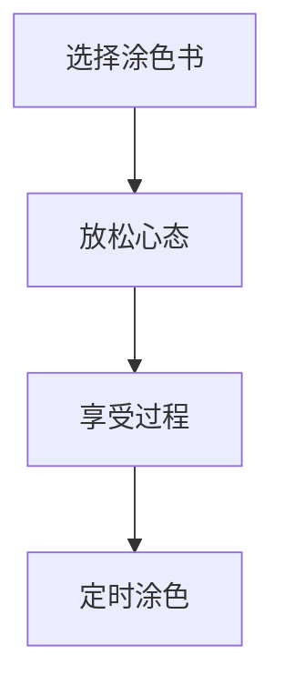
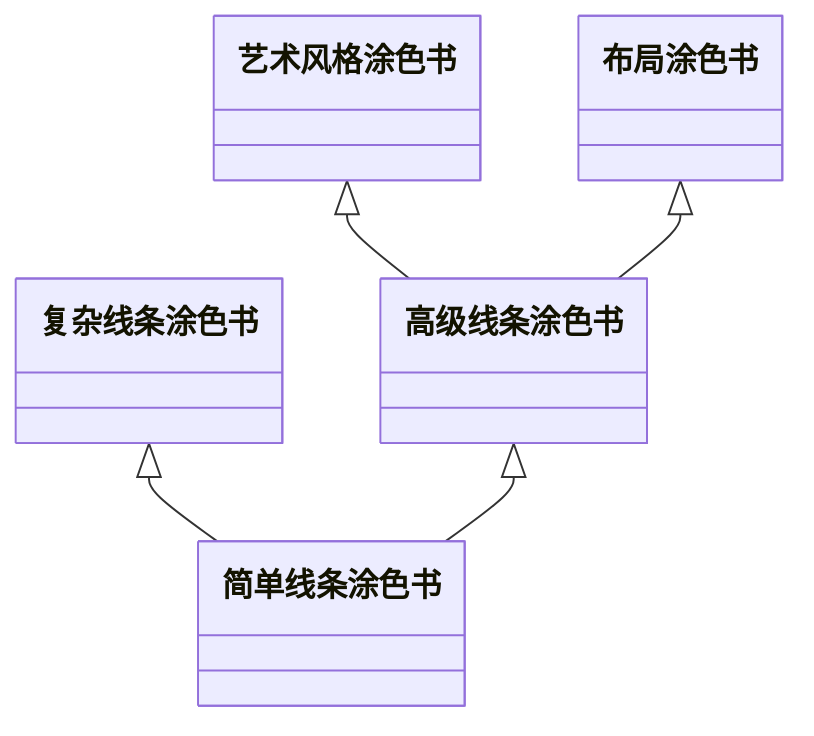
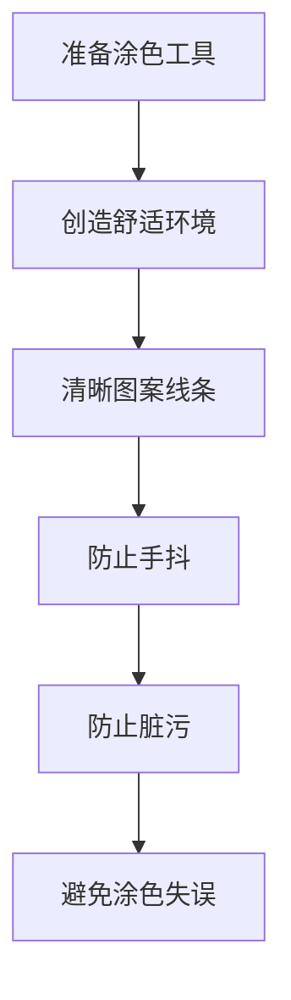
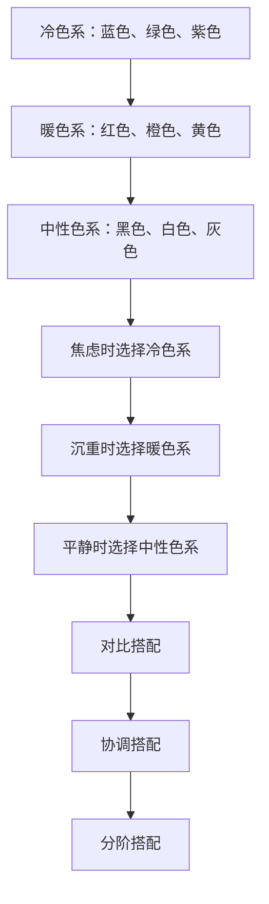
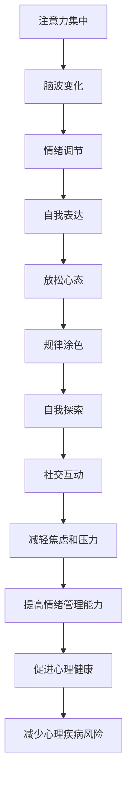
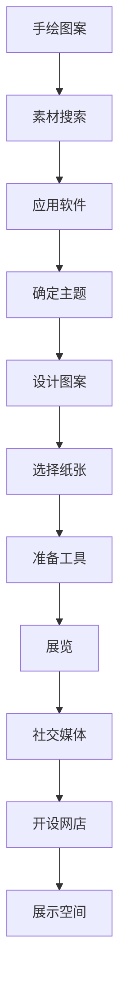

                 


# 引言：重寻内心的平静

在当今快节奏的生活中，人们承受着巨大的心理压力。工作压力、人际关系、家庭责任等等，这些都可能成为压垮人们心理健康的负担。心理学家指出，长期的心理压力不仅会影响我们的情绪状态，还会对身体造成损害。因此，寻找一种有效的解压方式变得尤为重要。

## 1.1 心理压力的普遍性

根据世界卫生组织（WHO）的报告，心理压力已经成为全球范围内的健康问题。超过三分之一的人在某些时候会感到过度焦虑或抑郁，这种压力不仅仅存在于成年人中，青少年和儿童也同样面临这一挑战。由此可见，心理压力是普遍存在的，不分年龄、性别和地域。

## 1.2 解压涂色书的心理学原理

解压涂色书之所以能够缓解心理压力，主要是基于心理学中的几个原理。首先，涂色活动可以帮助人们集中注意力，减少分散思维，从而减轻焦虑。其次，涂色是一种创造性的活动，能够激发人们的内在情感，提高情绪的稳定性。最后，色彩本身也具有疗愈作用，不同的颜色能够对人的心理产生不同的影响。

## 1.3 如何正确使用解压涂色书

正确使用解压涂色书，需要掌握一些基本原则。首先，选择适合自己的涂色书非常重要，可以根据自己的兴趣和喜好来挑选。其次，涂色时需要放松心态，不要过于追求完美，享受涂色的过程。最后，定时进行涂色活动，将其作为一种习惯来培养。

[Mermaid 流程图]


# 解压涂色书的基础知识

## 2.1 解压涂色书的起源与发展

解压涂色书起源于20世纪初的心理学领域。最早的研究表明，涂色可以帮助儿童缓解压力，提高注意力。随着时间的推移，这种理论逐渐被应用于成年人，并得到了广泛认可。近年来，随着社会压力的增加，解压涂色书逐渐成为一种流行的解压工具。

## 2.2 常见的解压涂色书类型

解压涂色书种类繁多，根据内容、形式和目标用户的不同，可以分为以下几类：

### 2.2.1 简单线条涂色书

简单线条涂色书是最常见的类型，适合初学者和儿童。书中的图案主要由简单的线条和几何图形组成，便于涂色。

### 2.2.2 高级线条涂色书

高级线条涂色书适合有一定绘画基础的成年人，图案更为复杂，线条更加细腻。

### 2.2.3 艺术风格涂色书

艺术风格涂色书以各种艺术风格为主题，如印象派、抽象派等，适合艺术爱好者。

### 2.2.4 布局涂色书

布局涂色书注重图案的布局和构图，适合喜欢设计和构图的读者。

## 2.3 选择适合自己的解压涂色书

选择适合自己的解压涂色书需要考虑以下几个方面：

### 2.3.1 兴趣和喜好

根据自己的兴趣和喜好选择涂色书，可以提高涂色的乐趣。

### 2.3.2 涂色难度

初学者可以选择简单线条涂色书，有一定基础的可以选择高级线条涂色书。

### 2.3.3 色彩偏好

根据自己的色彩偏好选择涂色书，可以帮助自己更好地享受涂色过程。

### 2.3.4 主题内容

选择与自己生活、工作或兴趣爱好相关的主题内容，可以增加涂色的共鸣。

[Mermaid 类图]


[ER实体关系图]
```mermaid
erDiagram
    Person ||--|{ ColoringBook }|<.. Customer
    ColoringBook ||--|{ Category }|<.. Category
    Customer ||--|{ FavoriteColor }|<.. Color
```

# 开始创作：基础技巧

## 3.1 基本的涂色工具介绍

涂色过程中，选择合适的工具非常重要。以下是几种常见的涂色工具：

### 3.1.1 颜料笔

颜料笔是涂色中最常用的工具，具有多种颜色和粗细可选。根据个人喜好和需求，可以选择水性颜料笔、油性颜料笔或马克笔。

### 3.1.2 水彩笔

水彩笔适合用于绘制水彩效果，颜色鲜艳且易于混合。适用于喜欢水彩风格的读者。

### 3.1.3 油画棒

油画棒适合用于绘制厚重的色彩效果，不易褪色。适合喜欢绘画创作的读者。

### 3.1.4 高光笔

高光笔用于绘制细节和高光部分，能够增加作品的光泽感。

## 3.2 如何开始涂色

开始涂色前，需要做好以下准备工作：

### 3.2.1 准备涂色书和工具

选择适合自己的涂色书和涂色工具，确保所有工具齐全。

### 3.2.2 创造舒适的环境

选择一个安静、舒适的涂色环境，可以放置一些音乐或香薰，帮助自己放松。

### 3.2.3 清晰的图案线条

涂色前，确保图案线条清晰，便于涂色。

## 3.3 常见问题解答

### 3.3.1 涂色时如何防止手抖？

涂色时，保持手的稳定是关键。可以尝试练习握笔姿势，或者使用手托板来稳定手部。

### 3.3.2 涂色书容易脏怎么办？

涂色过程中，可以使用报纸或塑料薄膜覆盖在涂色书下方，防止染脏。涂色完毕后，用湿布轻轻擦拭。

### 3.3.3 如何避免涂色失误？

涂色时，可以先涂上保护层，如一层透明的颜料笔，以防止涂色失误。如果出现失误，可以使用橡皮擦或遮盖液进行修正。

[Mermaid 流程图]


# 色彩心理学与涂色

色彩在心理学中扮演着重要的角色，不同的颜色对人的心理产生不同的影响。因此，了解色彩心理学原理，可以帮助我们在涂色过程中更好地调节自己的情绪。

## 4.1 色彩对心理的影响

### 4.1.1 冷色系

冷色系如蓝色、绿色和紫色，通常给人一种宁静、冷静的感觉。这些颜色有助于减轻焦虑和压力，适合在需要放松的环境中使用。

### 4.1.2 暖色系

暖色系如红色、橙色和黄色，通常给人一种温暖、活力的感觉。这些颜色可以激发活力和热情，适合在需要提升情绪的环境中使用。

### 4.1.3 中性色系

中性色系如黑色、白色和灰色，通常给人一种平和、稳定的感觉。这些颜色有助于减轻视觉疲劳，适合在需要长时间专注的环境中使用。

## 4.2 如何根据心情选择色彩

选择适合自己的色彩可以帮助我们在涂色过程中更好地调节情绪。以下是一些根据心情选择色彩的建议：

### 4.2.1 焦虑时

焦虑时，可以选择冷色系如蓝色、绿色和紫色。这些颜色有助于平静心情，缓解焦虑。

### 4.2.2 沉重时

感到沉重时，可以选择暖色系如红色、橙色和黄色。这些颜色可以激发活力和热情，提升情绪。

### 4.2.3 平静时

平静时，可以选择中性色系如黑色、白色和灰色。这些颜色有助于减轻视觉疲劳，保持平和的心态。

## 4.3 色彩搭配的艺术

色彩搭配在涂色过程中同样重要，合理的色彩搭配可以使作品更加美观和谐。以下是一些色彩搭配的建议：

### 4.3.1 对比搭配

对比搭配，如红色与绿色、蓝色与橙色，可以使作品更加鲜明突出。

### 4.3.2 协调搭配

协调搭配，如蓝色与灰色、绿色与黄色，可以使作品更加和谐统一。

### 4.3.3 分阶搭配

分阶搭配，如浅色与深色、明色与暗色，可以使作品层次分明，具有立体感。

[Mermaid 流程图]


[Latex 公式]
$$
E = mc^2
$$

# 心理平衡与解压涂色书

涂色作为一种创造性活动，不仅能够帮助我们在视觉上享受色彩的美感，更能够在心理层面带来深远的疗愈效果。本文将探讨涂色过程中的心理变化，如何通过涂色实现心理平衡，以及涂色对心理健康的长期影响。

## 5.1 涂色过程中的心理变化

涂色活动能够引起一系列心理变化，主要包括以下几点：

### 5.1.1 注意力集中

涂色时，我们需要专注于图案的细节，这有助于减少杂念和焦虑，提升注意力。研究表明，集中注意力的活动能够有效地缓解焦虑和压力。

### 5.1.2 脑波变化

涂色时，人的脑波会发生变化，从β波（活跃状态）转向α波（放松状态）。α波与放松、愉悦和冥想状态相关，有助于缓解心理压力。

### 5.1.3 情绪调节

涂色活动能够促进情绪的释放和调节。当我们在涂色过程中感受到色彩的美感，情绪会得到提升，焦虑和抑郁情绪会得到缓解。

### 5.1.4 自我表达

涂色是一种自我表达的方式。通过选择色彩和图案，我们能够在作品中表达自己的情感和内心世界，这有助于提升自我认知和情绪管理能力。

## 5.2 如何通过涂色实现心理平衡

### 5.2.1 放松心态

涂色时，最重要的是放松心态，不要过于追求完美。将涂色视为一种放松和享受的过程，而不是一项任务或挑战。

### 5.2.2 规律涂色

将涂色作为一种日常习惯，定时进行。这有助于培养专注力和耐心，同时也能在日常生活中找到一种调节情绪的方式。

### 5.2.3 自我探索

通过涂色，我们可以探索自己的情感和内心世界。尝试不同的色彩和图案，了解自己在不同情境下的心理状态。

### 5.2.4 社交互动

涂色不仅是一种个人活动，也可以是一种社交互动。与朋友或家人一起涂色，可以增进彼此的情感交流，缓解孤独感。

## 5.3 涂色对心理健康的长期影响

### 5.3.1 减轻焦虑和压力

长期进行涂色活动有助于减轻焦虑和压力。通过专注力和脑波的变化，涂色可以成为一种有效的自我疗愈工具。

### 5.3.2 提高情绪管理能力

涂色活动能够帮助人们更好地理解和表达自己的情绪，提高情绪管理能力。这对于长期保持心理健康至关重要。

### 5.3.3 促进心理健康

涂色作为一种创造性的活动，能够促进心理健康。通过自我表达和情感释放，涂色有助于提升自我价值和自信心。

### 5.3.4 减少心理疾病风险

研究表明，长期参与创造性活动如涂色，可以减少抑郁症、焦虑症等心理疾病的风险。涂色成为了一种预防心理疾病的有效手段。

[Mermaid 流程图]


# 涂色书的个性化创作

涂色书不仅仅是一种解压工具，更是一种个性化的创作方式。通过自己的创意和想象力，我们可以将自己的涂色书打造成独一无二的艺术品。以下将介绍如何进行个性化创作，以及如何展示和分享自己的作品。

## 6.1 自定义图案的创建

创建自定义图案是个性化涂色书的第一步。以下是一些方法：

### 6.1.1 手绘图案

手绘图案是最直接也是最有趣的方式。你可以根据个人的兴趣和喜好，设计出独一无二的图案。无论是花卉、动物还是风景，都可以成为你创作的灵感。

### 6.1.2 素材搜索

如果你没有绘画基础，可以通过互联网搜索或购买现成的图案素材。这些素材通常以线描图的形式出现，非常适合涂色。

### 6.1.3 应用软件

使用绘画应用软件，如Procreate、Adobe Fresco等，可以轻松地创建和编辑自定义图案。这些软件提供了丰富的绘画工具和素材库，让你能够快速实现创作。

## 6.2 创作自己的涂色书

创作自己的涂色书需要一定的准备和规划：

### 6.2.1 确定主题

选择一个你感兴趣的主题，如旅行、自然或科幻。主题将决定你涂色书的整体风格和内容。

### 6.2.2 设计图案

根据主题设计图案。你可以先在纸上草图，然后扫描到电脑中进一步编辑。

### 6.2.3 选择纸张

选择合适的纸张。涂色书通常使用厚实的纸，以承受颜料和涂色工具。

### 6.2.4 准备工具

准备适合你的涂色工具，如颜料笔、水彩笔或油画棒。确保你熟悉这些工具的使用。

## 6.3 个性化涂色书的展示与分享

创作完成后，展示和分享你的涂色书是展示成果的重要步骤：

### 6.3.1 展览

你可以参加线下或线上的涂色书展览。这些展览提供了一个展示你的作品和与其他涂色爱好者交流的平台。

### 6.3.2 社交媒体

利用社交媒体平台，如Instagram、Facebook等，分享你的涂色书。这不仅能够展示你的作品，还能吸引更多的关注和喜爱。

### 6.3.3 开设网店

如果你有足够的作品，可以尝试开设自己的网店，出售你的涂色书或定制服务。

### 6.3.4 展示空间

在家中或办公室设置一个展示空间，展示你的涂色书。这不仅能美化环境，还能激励自己在创作上不断进步。

[Mermaid 流程图]


# 案例分析：成功故事与启示

涂色书作为一种心理平衡工具，已经帮助了许多人找到了内心的宁静。以下是一些真实的成功故事，以及从中我们可以得到的启示。

## 7.1 个人经验分享

张小姐是一位职场女性，长期处于高压的工作环境中。她通过朋友的推荐开始尝试解压涂色书。起初，她只是抱着试试看的心态，但很快就被涂色的乐趣所吸引。随着时间的推移，她发现自己不再那么焦虑，情绪也变得更加稳定。现在，涂色书已经成为了她每天放松身心的重要方式。

**启示**：找到适合自己的解压方法非常重要。张小姐的经历告诉我们，无论是涂色书、瑜伽还是冥想，关键在于找到适合自己的方式。

## 7.2 专业人士的观点

心理治疗师李医生认为，涂色书作为一种创造性活动，对于缓解心理压力有显著的效果。她解释道，涂色能够帮助人们将内心的情感和情绪转化为可视化的形式，从而实现情感释放和心理平衡。

**启示**：专业人士的观点强调了涂色书在心理治疗中的潜力。对于那些难以通过传统方式缓解压力的人来说，涂色书可能是一种有效的替代方案。

## 7.3 涂色书在治疗中的应用

在一个关于抑郁症的治疗案例中，患者通过涂色书逐渐找到了内心的平静。治疗师发现，涂色书不仅帮助患者缓解了抑郁情绪，还提高了他们的自信心和自我表达能力。在涂色过程中，患者能够更好地理解和表达自己的情感，这有助于他们的心理康复。

**启示**：涂色书在心理治疗中的应用表明，它可以作为一种辅助治疗工具，帮助患者更好地管理情绪和情感。

通过这些案例，我们可以看到涂色书不仅是一种娱乐活动，更是一种有效的心理平衡工具。它可以帮助我们找到内心的宁静，提高情绪管理能力，甚至在一定程度上促进心理健康。

# 解压涂色书的最佳实践

为了最大限度地享受解压涂色书带来的心理平衡，以下是一些最佳实践和建议：

## 8.1 涂色的时间管理

### 8.1.1 定时涂色

将涂色纳入日常作息，设定固定的涂色时间，如每天晚上30分钟。这有助于培养涂色的习惯，并确保你在忙碌的生活中也能找到时间放松。

### 8.1.2 短时间内专注

专注于涂色，避免在涂色时被其他事务干扰。设定一个时间段，全神贯注地进行涂色，这有助于提高涂色效果和心情。

## 8.2 涂色环境的选择

### 8.2.1 安静舒适的环境

选择一个安静舒适的地方进行涂色，如书房或阳台。避免嘈杂的环境，有助于你更好地放松身心。

### 8.2.2 充足的光线

确保有足够的光线，这有助于你清晰地看到涂色书上的图案，避免眼睛疲劳。

## 8.3 涂色与生活的结合

### 8.3.1 结合兴趣爱好

将涂色与你的兴趣爱好相结合，如将涂色作为旅行记录的一部分，或在周末与朋友一起涂色。

### 8.3.2 家庭活动

与家人一起涂色，增进亲子关系和家庭和谐。这不仅是一种解压方式，也是一种增进情感交流的活动。

### 8.3.3 社交互动

参与涂色小组或活动，与其他涂色爱好者交流心得，这有助于提升你的涂色技巧，同时也是一种社交活动。

[Mermaid 流ács|

