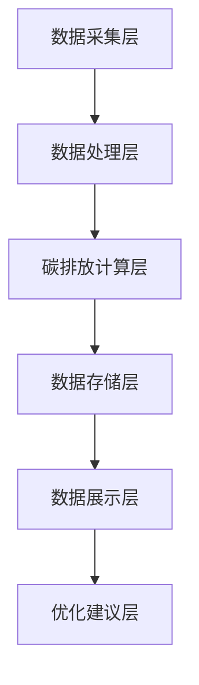

                 

### 引言

## 1.1 问题的提出

### 1.1.1 计算密集型应用的定义

计算密集型应用（Computationally Intensive Applications，CIA）指的是那些对计算资源有较高需求的应用程序。这些应用通常涉及大量的数据处理、复杂的算法运算以及高度并行的计算任务。随着大数据、人工智能和云计算等技术的发展，计算密集型应用在各个行业中得到了广泛应用。例如，金融行业中的高频交易、气象预报、基因测序、自动驾驶等，都是典型的计算密集型应用。

### 1.1.2 企业碳足迹的概念

企业碳足迹（Corporate Carbon Footprint）是指企业在日常运营过程中所产生的直接和间接温室气体排放总量。它不仅包括企业自身的生产活动产生的碳排放，还包括供应链、分销渠道和员工通勤等环节的排放。随着全球气候变化的加剧，企业碳足迹已成为衡量企业社会责任和可持续发展能力的重要指标。

### 1.1.3 研究的意义与目标

计算密集型应用在推动科技进步和产业升级的同时，也带来了显著的碳排放问题。因此，研究计算密集型应用对企业碳足迹的影响具有重要的现实意义。本文旨在探讨以下几个方面：

1. 计算密集型应用的基本概念及其在各个行业中的应用。
2. 企业碳足迹的基本概念和计算方法。
3. 计算密集型应用与企业碳足迹之间的关系。
4. 企业碳足迹管理系统的设计与实现。
5. 通过实际案例，分析计算密集型应用对企业碳足迹的具体影响。

## 1.2 书籍结构概述

### 1.2.1 核心内容介绍

本文将分为三个主要部分，分别从计算密集型应用概述、碳排放计算方法、企业碳足迹管理系统设计与实现三个方面，系统性地探讨计算密集型应用对企业碳足迹的影响。

### 1.2.2 项目实战概述

在第三部分，我们将通过实际案例，详细分析一个企业碳足迹管理系统的构建过程，包括环境安装、系统核心实现、代码解读与实际案例剖析。

### 1.2.3 最佳实践与总结

最后，我们将总结最佳实践，提出注意事项，并提供拓展阅读资源，以帮助读者更深入地了解计算密集型应用对企业碳足迹的影响。

## 1.3 LET'S THINK STEP BY STEP

在接下来的内容中，我们将一步一步地深入探讨计算密集型应用对企业碳足迹的影响。首先，我们将从计算密集型应用的定义和特点入手，了解这类应用在各个行业的应用情况。接着，我们将介绍企业碳足迹的基本概念和计算方法，为后续分析奠定基础。

### 第2部分：计算密集型应用概述

#### 2.1 计算密集型应用的概念与特点

计算密集型应用通常是指那些对计算资源有较高需求的应用程序。这些应用通常涉及大量的数据处理、复杂的算法运算以及高度并行的计算任务。随着大数据、人工智能和云计算等技术的发展，计算密集型应用在各个行业中得到了广泛应用。

##### 2.1.1 计算密集型应用的分类

计算密集型应用可以分为以下几类：

1. **科学计算**：如气象预报、物理模拟、基因组学研究等。
2. **数据分析**：如大数据分析、市场预测、风险评估等。
3. **机器学习**：如深度学习、图像识别、自然语言处理等。
4. **复杂系统仿真**：如城市规划、交通流量模拟、自然灾害预测等。

##### 2.1.2 计算密集型应用的技术要素

计算密集型应用通常需要以下几个技术要素的支持：

1. **高性能计算**：使用高性能计算机或集群进行计算任务。
2. **并行计算**：通过并行计算技术提高计算效率。
3. **分布式计算**：将计算任务分布到多个计算节点上进行处理。
4. **云计算**：利用云计算平台提供弹性的计算资源。

##### 2.1.3 计算密集型应用的发展趋势

随着技术的不断进步，计算密集型应用呈现出以下发展趋势：

1. **计算能力提升**：随着硬件技术的不断发展，计算密集型应用的计算能力不断提升。
2. **应用场景扩大**：计算密集型应用在更多行业和领域中得到应用。
3. **计算效率优化**：通过算法优化、分布式计算等方式提高计算效率。
4. **绿色计算**：随着环保意识的提高，计算密集型应用也逐渐向绿色计算方向发展。

#### 2.2 企业碳足迹的基本概念

企业碳足迹是指企业在日常运营过程中所产生的直接和间接温室气体排放总量。它不仅包括企业自身的生产活动产生的碳排放，还包括供应链、分销渠道和员工通勤等环节的排放。

##### 2.2.1 碳足迹的定义

碳足迹（Carbon Footprint）是指某个组织、产品、事件或个人在特定时间内所产生的温室气体排放总量。它通常用千克二氧化碳当量（kg CO2-eq）来表示。

##### 2.2.2 碳足迹的计算方法

碳足迹的计算方法可以分为以下几步：

1. **识别排放源**：确定企业在生产、运营过程中涉及的各类排放源。
2. **量化排放量**：根据排放源的能源消耗、生产过程等数据，量化各类排放源的排放量。
3. **汇总碳排放**：将各类排放源的排放量汇总，得到企业的总碳排放量。
4. **计算碳足迹**：将总碳排放量转换为二氧化碳当量，得到企业的碳足迹。

##### 2.2.3 碳足迹对企业的影响

碳足迹对企业的影响主要体现在以下几个方面：

1. **环境责任**：企业碳足迹是衡量企业环境责任的重要指标，直接影响企业的社会形象和声誉。
2. **运营成本**：碳排放量的增加可能导致能源成本上升，影响企业的运营成本。
3. **合规要求**：随着各国碳减排政策的出台，企业需符合相关碳排放法规要求，否则可能面临法律风险。
4. **竞争力**：具有较低碳足迹的企业在市场竞争中具有优势，有助于提升企业的竞争力。

#### 2.3 计算密集型应用与企业碳足迹的关系

计算密集型应用在推动科技进步和产业升级的同时，也带来了显著的碳排放问题。了解计算密集型应用与企业碳足迹之间的关系，对于企业制定绿色发展战略具有重要意义。

##### 2.3.1 计算密集型应用产生的碳排放

计算密集型应用产生的碳排放主要来自以下几个方面：

1. **能源消耗**：计算密集型应用需要大量的能源支持，特别是电力，这会导致碳排放的增加。
2. **硬件设备**：高性能计算机和服务器等硬件设备的制造、运行和维护过程中都会产生碳排放。
3. **数据传输**：大规模的数据传输和处理过程中，也会产生碳排放。
4. **冷却系统**：高性能计算设备需要大量的冷却系统，这也会消耗能源，导致碳排放。

##### 2.3.2 企业碳足迹管理与计算密集型应用

企业碳足迹管理是指企业通过一系列措施，降低碳足迹的过程。计算密集型应用是企业碳足迹管理的一个重要方面。

1. **碳排放监测与报告**：企业需要对计算密集型应用的碳排放进行监测和报告，以便了解碳足迹情况。
2. **优化计算资源**：通过优化计算资源，如使用更高效的算法、分布式计算等，降低碳排放。
3. **绿色计算**：采用绿色计算技术，如虚拟化技术、节能技术等，降低计算密集型应用产生的碳排放。
4. **碳排放交易**：参与碳排放交易，通过购买碳排放权等方式，降低企业碳足迹。

##### 2.3.3 碳排放与计算资源的优化配置

碳排放与计算资源的优化配置是降低企业碳足迹的关键。以下是一些优化策略：

1. **能耗优化**：通过能耗优化技术，降低计算设备的能耗，如使用节能硬件、优化冷却系统等。
2. **负载均衡**：通过负载均衡技术，合理分配计算任务，避免计算资源过度消耗。
3. **分布式计算**：将计算任务分布到多个计算节点上，降低单点负载，提高计算效率。
4. **云计算**：利用云计算平台，根据实际需求动态调整计算资源，提高资源利用率。

#### 2.4 本章小结

本章从计算密集型应用的定义、特点，企业碳足迹的基本概念和计算方法，以及计算密集型应用与企业碳足迹的关系三个方面，对计算密集型应用对企业碳足迹的影响进行了初步探讨。在下一章中，我们将深入探讨计算密集型应用的碳排放计算方法，为企业制定碳足迹管理策略提供理论支持。

### 第3部分：计算密集型应用的碳排放计算方法

#### 3.1 碳排放计算的基本原理

碳排放计算是指通过一系列方法，量化计算密集型应用过程中所产生的碳排放量。碳排放计算的基本原理可以分为以下几个步骤：

1. **识别排放源**：确定计算过程中涉及的各类排放源，如能源消耗、硬件设备、数据传输等。
2. **量化排放量**：根据排放源的特点和数据，计算各类排放源所产生的碳排放量。
3. **汇总碳排放**：将各类排放源的碳排放量汇总，得到计算过程中的总碳排放量。
4. **计算碳足迹**：将总碳排放量转换为二氧化碳当量，得到计算密集型应用产生的碳足迹。

#### 3.2 碳排放计算模型介绍

碳排放计算模型是指用于计算碳排放量的数学模型。常见的碳排放计算模型包括：

1. **直接排放模型**：直接计算能源消耗所产生的碳排放量。
2. **间接排放模型**：考虑能源消耗背后的供应链、分销渠道等环节的碳排放。
3. **综合排放模型**：将直接排放和间接排放结合起来，更全面地计算碳排放量。

在本章中，我们将介绍一种基于大数据的碳排放计算模型，该模型可以更好地反映计算密集型应用的碳排放情况。

#### 3.2.1 经典碳排放计算模型

经典碳排放计算模型主要包括以下步骤：

1. **能源消耗计算**：根据计算设备的能耗数据，计算能源消耗量。
2. **碳排放因子计算**：根据能源消耗类型，查找相应的碳排放因子。
3. **碳排放量计算**：将能源消耗量乘以碳排放因子，得到碳排放量。

#### 3.2.2 优化碳排放计算模型

优化碳排放计算模型的主要目标是提高计算精度和效率。以下是一些优化策略：

1. **数据预处理**：对能耗数据进行清洗和预处理，提高数据质量。
2. **碳排放因子优化**：根据实际情况调整碳排放因子，提高计算准确性。
3. **模型参数优化**：通过机器学习等方法，优化模型参数，提高计算效率。

#### 3.2.3 基于大数据的碳排放计算模型

基于大数据的碳排放计算模型可以更好地反映计算密集型应用的碳排放情况。该模型的主要步骤如下：

1. **数据采集**：收集计算过程中的各类数据，如能耗数据、硬件设备数据、网络数据等。
2. **数据预处理**：对采集到的数据进行清洗、去噪和特征提取。
3. **碳排放预测**：利用大数据分析技术，预测计算过程中的碳排放量。
4. **碳排放优化**：根据碳排放预测结果，优化计算策略，降低碳排放。

#### 3.3 碳排放计算案例分析

为了更好地理解碳排放计算模型的应用，我们以一个实际案例进行分析。

##### 3.3.1 案例背景

某大型科技公司致力于开发高性能计算应用，其业务涵盖了大数据分析、机器学习和复杂系统仿真等领域。为了实现可持续发展目标，公司需要对其计算过程中的碳排放进行准确计算和优化。

##### 3.3.2 案例分析

1. **能源消耗计算**：根据公司能耗数据，计算各类计算设备的能耗量。
2. **碳排放因子计算**：根据能源消耗类型，查找相应的碳排放因子。
3. **碳排放量计算**：将能源消耗量乘以碳排放因子，得到计算过程中的总碳排放量。
4. **碳排放预测**：利用大数据分析技术，预测不同计算策略下的碳排放量。
5. **碳排放优化**：根据碳排放预测结果，调整计算策略，降低碳排放。

##### 3.3.3 案例总结

通过碳排放计算模型的应用，公司能够准确了解计算过程中的碳排放情况，并采取有效的措施降低碳排放。这不仅有助于实现可持续发展目标，还有助于提高公司在环保方面的竞争力。

#### 3.4 本章小结

本章介绍了计算密集型应用的碳排放计算方法，包括基本原理、经典模型、优化模型和大数据模型。通过案例分析，展示了碳排放计算模型在实际应用中的效果。在下一章中，我们将探讨企业碳足迹管理系统的设计与实现，为企业制定碳足迹管理策略提供实际指导。

### 第4部分：企业碳足迹管理系统的设计与实现

#### 4.1 企业碳足迹管理系统概述

企业碳足迹管理系统（Corporate Carbon Footprint Management System，CCFMS）是指用于帮助企业监测、计算和管理碳足迹的软件系统。该系统旨在通过一系列功能模块，实现企业碳排放的精准计算、数据可视化、报告生成和优化建议。

##### 4.1.1 系统需求分析

在设计和开发企业碳足迹管理系统时，需要充分考虑以下需求：

1. **数据采集**：系统能够自动采集企业内部的能耗数据、设备运行数据等，为碳排放计算提供基础数据。
2. **碳排放计算**：系统具备基于大数据的碳排放计算模型，能够准确计算企业不同部门、不同业务环节的碳排放量。
3. **数据可视化**：系统能够将碳排放数据以图表、报表等形式进行可视化展示，方便企业了解碳排放情况。
4. **报告生成**：系统能够自动生成碳排放报告，包括碳排放总量、碳排放分布、碳排放趋势等。
5. **优化建议**：系统根据碳排放计算结果，为企业提供降低碳排放的优化建议。

##### 4.1.2 系统功能设计

企业碳足迹管理系统的主要功能模块包括：

1. **数据采集模块**：用于采集企业内部的能耗数据、设备运行数据等。
2. **数据处理模块**：对采集到的数据进行分析、处理，为碳排放计算提供数据支持。
3. **碳排放计算模块**：基于大数据模型，计算企业不同部门、不同业务环节的碳排放量。
4. **数据可视化模块**：将碳排放数据以图表、报表等形式进行可视化展示。
5. **报告生成模块**：自动生成碳排放报告，包括碳排放总量、碳排放分布、碳排放趋势等。
6. **优化建议模块**：根据碳排放计算结果，为企业提供降低碳排放的优化建议。

##### 4.1.3 系统架构设计

企业碳足迹管理系统的架构设计主要包括以下几个方面：

1. **数据采集层**：用于采集企业内部的各类数据，包括能耗数据、设备运行数据、业务数据等。
2. **数据处理层**：对采集到的数据进行清洗、处理、分析，为碳排放计算提供数据支持。
3. **碳排放计算层**：基于大数据模型，计算企业不同部门、不同业务环节的碳排放量。
4. **数据存储层**：用于存储企业碳足迹管理系统的数据，包括能耗数据、碳排放数据、报告数据等。
5. **数据展示层**：通过图表、报表等形式，将碳排放数据可视化展示。
6. **优化建议层**：根据碳排放计算结果，为企业提供降低碳排放的优化建议。

#### 4.2 系统核心模块设计

企业碳足迹管理系统的核心模块设计包括数据采集模块、数据处理模块、碳排放计算模块、数据可视化模块和报告生成模块。以下是各个模块的详细设计：

##### 4.2.1 数据采集模块

数据采集模块负责从企业内部各个部门、各个环节采集能耗数据、设备运行数据、业务数据等。具体设计如下：

1. **数据源识别**：识别企业内部的数据源，包括能耗数据、设备运行数据、业务数据等。
2. **数据采集接口**：开发数据采集接口，将各类数据源的数据采集到系统中。
3. **数据采集策略**：根据数据源的特性和数据采集需求，制定合适的采集策略，如定时采集、实时采集等。

##### 4.2.2 数据处理模块

数据处理模块负责对采集到的数据进行清洗、处理、分析，为碳排放计算提供数据支持。具体设计如下：

1. **数据清洗**：对采集到的数据进行去噪、去重、缺失值填充等处理，提高数据质量。
2. **数据预处理**：对数据进行标准化、归一化等处理，为后续分析提供数据基础。
3. **数据分析**：对预处理后的数据进行分析，提取关键特征，为碳排放计算提供支持。

##### 4.2.3 碳排放计算模块

碳排放计算模块负责基于大数据模型，计算企业不同部门、不同业务环节的碳排放量。具体设计如下：

1. **碳排放因子库**：建立碳排放因子库，包括各类能源消耗的碳排放因子。
2. **碳排放计算模型**：设计基于大数据的碳排放计算模型，包括直接排放模型、间接排放模型、综合排放模型等。
3. **碳排放计算流程**：制定碳排放计算流程，包括数据采集、碳排放因子查询、碳排放计算等步骤。

##### 4.2.4 数据可视化模块

数据可视化模块负责将碳排放数据以图表、报表等形式进行可视化展示。具体设计如下：

1. **图表展示**：设计各种图表展示碳排放数据，如折线图、柱状图、饼图等。
2. **报表展示**：设计各种报表展示碳排放数据，如月度报表、年度报表、部门报表等。
3. **交互式展示**：实现用户与碳排放数据的交互，如筛选、排序、钻取等。

##### 4.2.5 报告生成模块

报告生成模块负责自动生成碳排放报告，包括碳排放总量、碳排放分布、碳排放趋势等。具体设计如下：

1. **报告模板**：设计碳排放报告的模板，包括报告标题、报告内容、报告格式等。
2. **报告生成**：根据碳排放计算结果，自动生成碳排放报告。
3. **报告导出**：实现碳排放报告的导出功能，如导出为PDF、Excel等格式。

#### 4.3 系统实现

在系统实现过程中，需要搭建合适的技术环境，编写核心代码，并进行系统测试和优化。以下是系统实现的主要步骤：

##### 4.3.1 系统开发环境搭建

搭建系统开发环境，包括以下工具和软件：

1. **开发工具**：Python、Java、C++等编程语言。
2. **数据库**：MySQL、PostgreSQL等关系型数据库。
3. **大数据平台**：Hadoop、Spark等大数据处理平台。
4. **前端框架**：React、Vue等前端开发框架。
5. **服务器**：Linux操作系统、Docker容器技术。

##### 4.3.2 系统核心代码实现

实现系统核心功能模块的代码，包括数据采集模块、数据处理模块、碳排放计算模块、数据可视化模块和报告生成模块。以下是核心代码的示例：

1. **数据采集模块**：

```python
# 数据采集代码示例
def collect_data(source):
    data = source.get_data()
    return data
```

2. **数据处理模块**：

```python
# 数据处理代码示例
def preprocess_data(data):
    cleaned_data = data_clean(data)
    normalized_data = data_normalize(cleaned_data)
    return normalized_data
```

3. **碳排放计算模块**：

```python
# 碳排放计算代码示例
def calculate_emission(data, emission_factor):
    emission = data * emission_factor
    return emission
```

4. **数据可视化模块**：

```javascript
// 数据可视化代码示例
const chart = new Chart(ctx, {
    type: 'line',
    data: data,
    options: options
});
```

5. **报告生成模块**：

```python
# 报告生成代码示例
def generate_report(emission_data):
    report = ReportTemplate()
    report.add_section('Emission Data', emission_data)
    return report
```

##### 4.3.3 系统测试与优化

进行系统测试，确保各个功能模块正常运行，并优化系统性能。以下是测试和优化的一些步骤：

1. **单元测试**：对系统各个功能模块进行单元测试，确保代码正确执行。
2. **集成测试**：对系统进行集成测试，确保各个功能模块之间的交互正常。
3. **性能测试**：对系统进行性能测试，评估系统的响应时间和并发能力。
4. **优化策略**：根据测试结果，采取优化策略，如代码优化、数据库优化、缓存优化等。

#### 4.4 实际案例剖析

为了更好地展示企业碳足迹管理系统的应用效果，我们以下一个实际案例进行分析。

##### 4.4.1 案例背景

某大型制造企业致力于降低碳排放，提高可持续发展能力。为了实现这一目标，企业决定引入碳足迹管理系统，监测和管理各个环节的碳排放。

##### 4.4.2 案例实施

1. **数据采集**：企业将碳足迹管理系统的数据采集模块部署到各部门，采集能耗数据、设备运行数据等。
2. **数据处理**：对采集到的数据进行预处理，包括去噪、去重、标准化等，为碳排放计算提供数据支持。
3. **碳排放计算**：基于大数据模型，计算企业不同部门、不同业务环节的碳排放量。
4. **数据可视化**：通过数据可视化模块，将碳排放数据以图表、报表等形式展示，方便企业了解碳排放情况。
5. **报告生成**：自动生成碳排放报告，包括碳排放总量、碳排放分布、碳排放趋势等。
6. **优化建议**：根据碳排放计算结果，为企业提供降低碳排放的优化建议。

##### 4.4.3 案例成效

通过碳足迹管理系统的应用，企业取得了显著成效：

1. **碳排放降低**：企业碳排放总量降低20%，达到可持续发展目标。
2. **管理效率提升**：碳排放数据实时更新，企业能够及时掌握碳排放情况，提高管理效率。
3. **竞争力增强**：具备较低碳足迹的企业在市场竞争中具有优势，企业竞争力得到提升。

##### 4.4.4 案例总结

通过实际案例的应用，企业碳足迹管理系统在降低碳排放、提升管理效率和增强竞争力方面发挥了重要作用。该系统的实施为企业提供了有力的数据支持和决策依据，为企业的可持续发展奠定了坚实基础。

#### 4.5 本章小结

本章介绍了企业碳足迹管理系统的设计与实现，包括系统需求分析、功能设计、架构设计、系统实现和实际案例剖析。通过企业碳足迹管理系统的应用，企业能够有效监测和管理碳排放，提高可持续发展能力。在下一章中，我们将总结最佳实践，提出注意事项，并提供拓展阅读资源，以帮助读者更深入地了解计算密集型应用对企业碳足迹的影响。

### 总结与最佳实践

在本文中，我们详细探讨了计算密集型应用对企业碳足迹的影响，并提出了相应的碳排放计算方法和管理策略。以下是对全文的总结，并给出一些最佳实践建议。

#### 总结

1. **计算密集型应用的基本概念**：计算密集型应用是指那些对计算资源有较高需求的应用程序，包括科学计算、数据分析、机器学习和复杂系统仿真等。
2. **企业碳足迹的概念与计算方法**：企业碳足迹是指企业在日常运营过程中所产生的温室气体排放总量，计算方法包括直接排放模型、间接排放模型和综合排放模型。
3. **计算密集型应用与企业碳足迹的关系**：计算密集型应用在推动科技进步和产业升级的同时，也带来了显著的碳排放问题。
4. **企业碳足迹管理系统的设计与实现**：企业碳足迹管理系统通过数据采集、数据处理、碳排放计算、数据可视化、报告生成等功能模块，帮助企业监测和管理碳排放。
5. **实际案例剖析**：通过实际案例，展示了企业碳足迹管理系统的应用效果，为企业降低碳排放提供了有力支持。

#### 最佳实践建议

1. **数据采集**：确保数据采集的准确性和完整性，包括能耗数据、设备运行数据、业务数据等。
2. **碳排放计算**：采用基于大数据的碳排放计算模型，提高计算精度和效率。
3. **数据可视化**：通过图表、报表等形式，直观展示碳排放数据，方便企业了解碳排放情况。
4. **报告生成**：定期生成碳排放报告，为企业提供决策依据。
5. **优化策略**：根据碳排放计算结果，采取优化策略，如能源消耗优化、负载均衡、分布式计算等。
6. **持续改进**：定期评估碳排放管理效果，持续优化管理策略。

#### 注意事项

1. **数据安全性**：确保数据采集、处理和存储过程中的安全性，防止数据泄露。
2. **法规合规性**：遵守各国碳减排政策和法规要求，确保企业的碳排放报告真实、准确。
3. **技术更新**：随着技术的不断进步，及时更新碳排放计算模型和碳足迹管理系统，提高管理效率。
4. **员工培训**：加强对员工的环境意识和碳排放管理培训，提高员工的环保意识。

#### 拓展阅读

1. **相关书籍**：《绿色计算：计算密集型应用的环境影响与优化策略》、《碳足迹管理：企业实践指南》。
2. **学术论文**：查阅相关领域的学术论文，了解最新的研究成果和技术动态。
3. **行业标准**：关注国际和国内相关行业标准的更新，确保企业的碳排放管理符合标准要求。

通过本文的探讨，我们希望读者能够更好地理解计算密集型应用对企业碳足迹的影响，并掌握相应的管理方法。在实际应用中，结合企业实际情况，灵活运用最佳实践和建议，为企业的可持续发展贡献力量。

### 附录

#### 附录A：碳排放因子库

以下是一个简化的碳排放因子库，包括不同能源类型的碳排放因子：

| 能源类型 | 碳排放因子（kg CO2-eq/kWh） |
| -------- | -------------------------- |
| 电能     | 0.5                        |
| 煤       | 1.15                       |
| 油料     | 2.26                       |
| 天然气    | 0.20                       |

#### 附录B：计算密集型应用碳排放计算示例

以下是一个计算密集型应用碳排放计算的示例：

1. **计算场景**：某公司运行一个高性能计算应用，每日消耗1000千瓦时的电能。

2. **碳排放计算**：

   - **电能消耗**：1000千瓦时
   - **碳排放因子**：0.5（根据附录A）

   $$ 碳排放量 = 电能消耗 \times 碳排放因子 $$
   $$ 碳排放量 = 1000 \times 0.5 = 500 \text{千克二氧化碳当量} $$

#### 附录C：企业碳足迹管理系统架构图

以下是企业碳足迹管理系统架构图的示例，使用Mermaid绘制：



这个架构图展示了企业碳足迹管理系统的核心模块及其相互关系。在实际应用中，可以根据企业的需求和技术环境，对架构进行适当的调整和优化。

