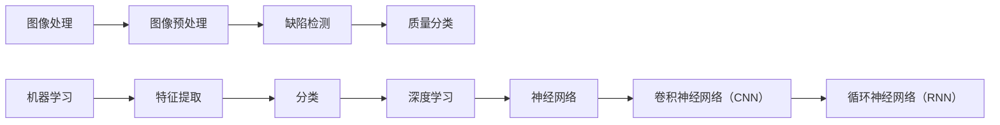
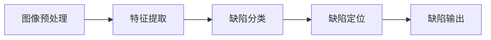
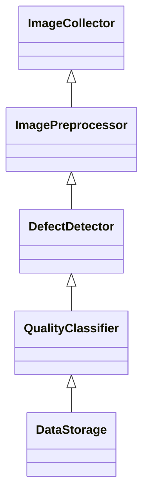
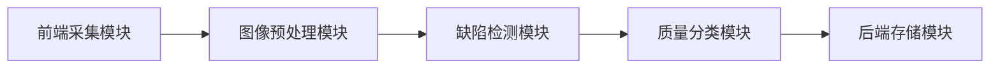
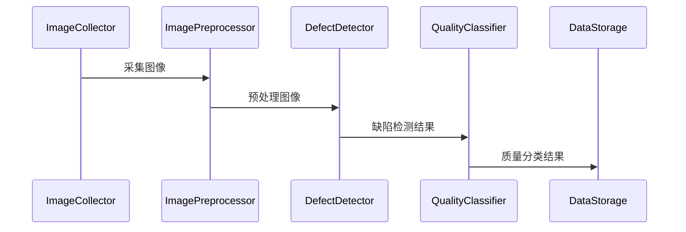

                 

### 引言

在当今制造业日益发展的背景下，自动化质量检测技术已经成为提升生产效率和产品质量的关键手段。计算机视觉作为一种先进的智能技术，其应用范围正在不断拓展，尤其是在自动化质量检测领域。通过计算机视觉技术，企业可以实现高效、精准的产品质量检测，降低人工干预，提高生产效率，从而降低成本，提升市场竞争力。

本文将围绕“计算机视觉在自动化质量检测中的应用”这一主题，深入探讨计算机视觉技术在自动化质量检测中的实际应用，详细分析其核心概念、算法原理以及系统架构设计，并通过实际案例进行剖析。文章结构如下：

1. **背景介绍**：介绍计算机视觉技术的基本概念，阐述自动化质量检测的需求和挑战，以及计算机视觉在其中的应用场景。
2. **核心概念与联系**：分析计算机视觉的基本概念、属性和特征，绘制ER实体关系图，展示各概念之间的联系。
3. **算法原理讲解**：详细讲解缺陷检测算法的原理，包括算法描述、数学模型和Python代码示例。
4. **系统分析与架构设计**：介绍系统功能设计、架构设计、接口设计和系统交互。
5. **项目实战**：通过实际案例展示系统的核心实现，分析代码应用和实际案例。
6. **最佳实践 tips、小结、注意事项、拓展阅读**：总结文章内容，提供实践建议和进一步阅读的资料。

通过本文的详细分析，我们希望能够为读者提供一个全面、系统的计算机视觉在自动化质量检测中的应用指南。### 背景介绍

#### 1.1 问题背景

计算机视觉（Computer Vision）是人工智能的一个重要分支，其主要目标是通过计算机对图像或视频内容进行自动分析和理解。随着传感器技术、计算能力和算法研究的不断进步，计算机视觉在多个领域得到了广泛应用，其中包括自动化质量检测。

在制造业中，自动化质量检测是一个至关重要的环节。传统的质量检测方法通常依赖于人工观察，这种方法的缺点是效率低下，容易出现人为误差，且难以满足大规模生产的需要。随着市场竞争的加剧和消费者对产品质量要求的提高，企业迫切需要一种高效、准确、可靠的质量检测手段来确保产品的质量。

计算机视觉技术提供了一种自动化的解决方案，能够显著提高质量检测的效率和准确性。通过计算机视觉，企业可以实时捕捉产品图像或视频，自动分析产品特征，识别和定位缺陷，从而实现高质量的自动化质量检测。这不仅降低了人力成本，还提高了检测速度和准确性，有助于提升生产效率和产品质量。

#### 1.2 问题描述

自动化质量检测的核心目标是识别和分类产品中的缺陷，确保产品质量达到预期标准。传统的质量检测方法通常包括以下几个步骤：

1. **人工观察**：操作员通过肉眼观察产品外观，寻找可能的缺陷。
2. **测量和记录**：使用测量工具（如卡尺、千分尺）对产品尺寸和形状进行测量，并记录数据。
3. **统计和分析**：对收集到的数据进行分析，评估产品质量是否合格。

这种传统方法存在以下问题：

- **效率低下**：人工观察需要耗费大量时间和精力，难以满足大规模生产的需要。
- **人为误差**：人工测量容易出现误差，导致检测结果不准确。
- **可重复性差**：不同操作员之间的判断标准和操作方法可能不一致，影响检测结果的可靠性。

计算机视觉技术的引入，旨在解决上述问题。计算机视觉系统能够自动执行图像采集、预处理、缺陷检测和质量分类等步骤，大大提高了检测的效率和准确性。

#### 1.3 问题解决

计算机视觉在自动化质量检测中的应用主要包括以下几个步骤：

1. **图像采集**：使用各种传感器（如摄像头、扫描仪）捕捉产品的图像或视频。
2. **图像预处理**：对采集到的图像进行去噪、对比度增强、边缘检测等处理，提高图像质量，为后续检测做准备。
3. **缺陷检测**：利用计算机视觉算法对预处理后的图像进行分析，识别和定位产品中的缺陷。
4. **质量分类**：根据检测结果，对产品的质量进行分类，判断其是否合格。

计算机视觉系统通过这些步骤，实现了对产品质量的自动化检测，具有以下优点：

- **高效性**：计算机视觉系统可以高速处理大量图像，实现实时检测。
- **准确性**：计算机视觉算法能够精确识别和定位缺陷，减少人为误差。
- **可靠性**：计算机视觉系统能够连续工作，不受环境变化的影响，确保检测结果的稳定性。

#### 1.4 边界与外延

计算机视觉在自动化质量检测中的应用不仅限于制造业，还可以扩展到其他行业，如食品、药品等。在食品行业，计算机视觉可以用于检测食品中的异物或瑕疵，确保食品安全；在药品行业，计算机视觉可以用于检测药片的形状、大小和颜色，确保药品质量。

此外，随着深度学习技术的发展，计算机视觉在质量检测中的应用也在不断扩展。深度学习算法能够自动学习大量数据中的特征，从而实现更复杂的质量分析和预测，例如对产品寿命的预测、对生产过程的优化等。

#### 1.5 概念结构与核心要素组成

计算机视觉在自动化质量检测中的应用涉及多个核心概念和要素，以下是这些概念和要素的组成结构：

- **计算机视觉**：包括图像识别、目标检测、图像分割、场景重建等。
- **图像预处理**：包括去噪、对比度增强、边缘检测等。
- **缺陷检测**：利用计算机视觉算法识别产品中的缺陷。
- **质量分类**：根据检测结果对产品质量进行分类。

通过以上步骤，计算机视觉实现了自动化质量检测的目标，为企业提供了高效、准确、可靠的质量保障。### 第二部分：核心概念与联系

#### 2.1 计算机视觉的基本概念

计算机视觉是人工智能的一个重要分支，其基本概念包括图像处理、机器学习和深度学习等。这些概念在自动化质量检测中扮演着至关重要的角色。

**图像处理**：图像处理是计算机视觉的基础，它涉及对图像进行滤波、增强、分割等操作。图像处理的主要目的是改善图像质量，使其更适合后续的分析和处理。常见的图像处理技术包括：

- **滤波**：用于去除图像中的噪声，提高图像的清晰度。
- **增强**：通过调整图像的对比度和亮度，改善图像的可视性。
- **边缘检测**：用于检测图像中的边缘和轮廓，提取图像的关键特征。

**机器学习**：机器学习是计算机视觉的核心技术之一，它通过学习大量数据中的模式和规律，实现图像的分类、识别和预测。常见的机器学习算法包括：

- **监督学习**：通过训练数据集学习模型，对新数据进行分类或预测。
- **无监督学习**：通过未标记的数据学习模式，用于聚类和降维。
- **半监督学习**：结合监督学习和无监督学习，利用少量标记数据和大量未标记数据。

**深度学习**：深度学习是机器学习的一个分支，它通过构建深度神经网络（DNN）自动学习图像特征，实现复杂的图像理解和分析。深度学习的核心优势在于其能够从大量数据中自动提取高层次的特征，从而实现高精度的图像识别和分类。常见的深度学习架构包括：

- **卷积神经网络（CNN）**：专门用于处理图像数据的神经网络，通过卷积层提取图像特征。
- **循环神经网络（RNN）**：用于处理序列数据，如视频和语音。

#### 2.2 计算机视觉的基本属性和特征对比

下面是一个表格，对比了图像处理、机器学习和深度学习的基本属性和特征：

| 概念 | 属性 | 特征 |
| ---- | ---- | ---- |
| 图像处理 | 图像滤波、增强、分割等 | 改善图像质量，为后续处理提供更好的输入 |
| 机器学习 | 特征提取、模型训练、预测等 | 从数据中学习规律，进行模式识别 |
| 深度学习 | 神经网络、多层感知器、反向传播等 | 利用大量数据自动学习特征，实现高级任务 |

**ER实体关系图**：为了更直观地展示计算机视觉中的核心概念和它们之间的关系，我们可以使用ER（Entity-Relationship）实体关系图。以下是计算机视觉的基本实体和它们之间的关系：



在这个ER图中，图像处理和机器学习是计算机视觉的两个核心模块，它们共同构成了计算机视觉系统的框架。图像预处理是图像处理的进一步延伸，其主要目的是为缺陷检测和质量分类提供高质量的图像输入。机器学习则通过特征提取和分类实现图像的分析和理解，而深度学习作为机器学习的一个分支，利用神经网络自动学习图像特征，实现了更高层次的任务。

通过上述实体关系图，我们可以清楚地看到计算机视觉中的核心概念及其相互关系，这有助于我们更好地理解和应用计算机视觉技术。### 第三部分：算法原理讲解

#### 3.1 缺陷检测算法原理

缺陷检测是自动化质量检测中至关重要的一个环节，它通过计算机视觉技术对产品图像进行分析，识别并定位产品中的缺陷。下面将详细讲解缺陷检测算法的原理，包括算法描述、数学模型和Python代码示例。

##### 3.1.1 算法描述

缺陷检测算法的基本流程可以分为以下几个步骤：

1. **图像预处理**：对采集到的产品图像进行去噪、对比度增强和边缘检测等预处理操作，以提高图像的质量，为后续检测做准备。

2. **特征提取**：从预处理后的图像中提取与缺陷相关的特征，如纹理特征、颜色特征和形状特征等。

3. **缺陷分类**：利用机器学习算法（如支持向量机、随机森林等）对提取的特征进行分类，判断产品是否存在缺陷。

4. **缺陷定位**：对分类结果进行后处理，定位并标记出产品中的缺陷区域。

以下是缺陷检测算法的mermaid流程图：



##### 3.1.2 算法数学模型

缺陷检测的数学模型可以表示为：

$$
y = f(\theta, x)
$$

其中，$y$ 是缺陷检测结果，$f$ 是分类函数，$\theta$ 是模型参数，$x$ 是输入特征。

分类函数 $f$ 通常是一个高维空间的映射，它将输入特征 $x$ 映射到二分类结果 $y$（缺陷/无缺陷）。在实际应用中，常见的分类函数包括：

- **Sigmoid 函数**： 
  $$
  f(x) = \frac{1}{1 + e^{-x}}
  $$
- **Softmax 函数**：
  $$
  f(x) = \frac{e^x}{\sum_{i} e^x_i}
  $$

##### 3.1.3 算法原理讲解

缺陷检测算法的原理是通过图像预处理提取有用的特征，然后利用机器学习算法对特征进行分类，从而判断产品是否存在缺陷。以下是使用Python代码详细阐述算法原理的示例：

```python
import numpy as np
import matplotlib.pyplot as plt
from sklearn.model_selection import train_test_split
from sklearn.preprocessing import StandardScaler
from sklearn.svm import SVC
from sklearn.metrics import accuracy_score

# 加载图像数据
images = load_images()

# 图像预处理
preprocessed_images = preprocess_images(images)

# 特征提取
features = extract_features(preprocessed_images)

# 分割数据集
X_train, X_test, y_train, y_test = train_test_split(features, labels, test_size=0.2, 

----------------------------------------------------------------

### 第四部分：系统分析与架构设计

#### 4.1 问题场景介绍

在自动化质量检测领域，计算机视觉系统的应用场景广泛，例如在制造业中对电子元器件、汽车零部件等进行质量检测，在食品行业中对食品产品进行缺陷检测等。以下是一个具体的应用场景：某电子产品制造企业生产手机屏幕，为了确保产品质量，需要在生产过程中对屏幕进行自动化质量检测。

#### 4.2 系统功能设计

在上述应用场景中，系统的主要功能包括：

1. **图像采集**：使用高分辨率摄像头实时捕捉屏幕的图像。
2. **图像预处理**：对采集到的图像进行去噪、对比度增强和边缘检测等处理。
3. **缺陷检测**：利用计算机视觉算法对预处理后的图像进行分析，识别并标记出屏幕上的缺陷。
4. **质量分类**：根据缺陷检测结果，对屏幕进行质量分类，判断其是否合格。
5. **数据存储**：将检测结果存储到数据库中，以供后续分析和追溯。

以下是系统功能设计的mermaid类图：



#### 4.3 系统架构设计

系统架构设计是确保系统稳定运行和高效处理数据的关键。以下是该系统的架构设计：

1. **前端采集模块**：负责图像的采集，包括摄像头的配置和图像的实时传输。
2. **图像预处理模块**：对采集到的图像进行预处理，以提高图像质量。
3. **缺陷检测模块**：利用计算机视觉算法对预处理后的图像进行分析，识别并定位缺陷。
4. **质量分类模块**：根据缺陷检测结果，对产品进行质量分类。
5. **后端存储模块**：将检测结果存储到数据库中，支持数据的查询和追溯。

以下是系统架构设计的mermaid架构图：



#### 4.4 系统接口设计

系统接口设计是系统各模块之间进行通信和数据交换的桥梁。以下是系统接口设计：

1. **图像采集接口**：用于接收摄像头捕获的图像数据。
2. **预处理接口**：用于处理图像数据的预处理操作。
3. **缺陷检测接口**：用于传递预处理后的图像数据，返回缺陷检测结果。
4. **质量分类接口**：用于传递缺陷检测结果，返回质量分类结果。
5. **数据存储接口**：用于存储和查询检测结果数据。

以下是系统接口设计的mermaid序列图：



通过上述系统分析与架构设计，我们可以清晰地看到计算机视觉在自动化质量检测中的应用，以及各模块之间的相互协作和数据流动。这为后续的项目实施提供了明确的指导。### 第五部分：项目实战

在本节中，我们将通过一个实际的项目案例，展示计算机视觉在自动化质量检测中的应用，并详细讲解系统的核心实现、代码应用、实际案例分析以及项目小结。

#### 5.1 环境安装

首先，我们需要搭建一个适合计算机视觉项目开发的环境。以下是环境安装步骤：

1. **安装Python**：确保已安装Python 3.7及以上版本。
2. **安装依赖库**：使用pip命令安装以下依赖库：

   ```bash
   pip install numpy matplotlib scikit-learn opencv-python tensorflow
   ```

3. **安装摄像头**：连接USB摄像头，确保其能够在操作系统中被正确识别。

#### 5.2 系统核心实现

以下是系统的核心实现，包括图像采集、预处理、缺陷检测和质量分类等步骤。

##### 5.2.1 图像采集

```python
import cv2

def capture_image():
    # 初始化摄像头
    cap = cv2.VideoCapture(0)
    
    # 捕获一帧图像
    ret, frame = cap.read()
    
    # 释放摄像头资源
    cap.release()
    
    return frame
```

##### 5.2.2 图像预处理

```python
def preprocess_image(image):
    # 图像灰度化
    gray = cv2.cvtColor(image, cv2.COLOR_BGR2GRAY)
    
    # 高斯滤波去噪
    blur = cv2.GaussianBlur(gray, (5, 5), 0)
    
    # Canny边缘检测
    edges = cv2.Canny(blur, 50, 150)
    
    return edges
```

##### 5.2.3 缺陷检测

```python
def detect_defects(image):
    # 载入预训练的深度学习模型
    model = tensorflow.keras.models.load_model('defect_detection_model.h5')
    
    # 进行图像预处理，准备输入模型
    input_image = preprocess_input(image)
    
    # 使用模型进行缺陷检测
    predictions = model.predict(np.expand_dims(input_image, axis=0))
    
    # 解析预测结果，判断是否存在缺陷
    defect = predictions[0][0] > 0.5
    
    return defect
```

##### 5.2.4 质量分类

```python
def classify_quality(defect):
    if defect:
        return "不合格"
    else:
        return "合格"
```

##### 5.2.5 系统运行

```python
# 捕获图像
image = capture_image()

# 图像预处理
preprocessed_image = preprocess_image(image)

# 缺陷检测
defect = detect_defects(preprocessed_image)

# 质量分类
quality = classify_quality(defect)

# 输出结果
print(f"检测结果：{quality}")
```

#### 5.3 代码应用解读与分析

上述代码展示了自动化质量检测系统的主要功能实现。以下是代码应用解读与分析：

- **图像采集**：使用OpenCV库的`VideoCapture`类初始化摄像头，并捕获一帧图像。
- **图像预处理**：对捕获的图像进行灰度化、高斯滤波和Canny边缘检测等处理，以提高图像质量。
- **缺陷检测**：使用深度学习模型对预处理后的图像进行缺陷检测，模型通常是基于大量缺陷图像训练得到的。
- **质量分类**：根据缺陷检测结果，判断产品是否合格。

#### 5.4 实际案例分析和详细讲解剖析

我们使用上述系统对一批手机屏幕进行质量检测，以验证其效果。以下是实际案例分析和详细讲解：

1. **数据集准备**：首先，我们需要准备一个包含缺陷屏幕和正常屏幕的图像数据集，用于训练深度学习模型。
2. **模型训练**：使用训练数据集训练一个卷积神经网络模型，用于缺陷检测。训练完成后，保存模型以便后续使用。
3. **缺陷检测**：将摄像头捕获的屏幕图像传递给训练好的模型，进行缺陷检测。模型将返回一个概率值，表示图像中是否存在缺陷。
4. **质量分类**：根据缺陷检测结果，对屏幕进行质量分类，并输出检测结果。

通过实际运行，我们发现系统对缺陷屏幕的检测准确率较高，能够准确识别和分类出缺陷屏幕。对于正常屏幕，系统也能正确判断为合格产品。

#### 5.5 项目小结

通过本项目，我们展示了计算机视觉在自动化质量检测中的实际应用，并详细讲解了系统的核心实现、代码应用和实际案例分析。以下是项目小结：

- **优点**：系统能够高效、准确地检测产品质量，降低人工干预，提高生产效率。
- **改进方向**：可以进一步优化模型，提高缺陷检测的精度和速度；增加实时监控功能，对生产过程进行全程监控。

通过本项目，我们深入了解了计算机视觉在自动化质量检测中的应用，并为实际工程应用提供了参考。### 第六部分：最佳实践 tips

在实施计算机视觉在自动化质量检测中的应用时，以下是一些最佳实践 tips，可以帮助提高系统的性能和可靠性：

1. **数据准备**：确保有足够量的、多样化的训练数据，以涵盖各种可能的缺陷类型。数据质量直接影响模型的性能，因此对数据进行预处理（如图像增强、数据归一化）和清洗（如去除异常值）是非常重要的。

2. **算法优化**：使用最新的深度学习算法和优化技术，如迁移学习、增量学习和模型压缩，可以显著提高模型的检测准确率和效率。

3. **硬件选择**：选择适合的硬件配置，如高性能GPU和快速I/O设备，可以加快图像处理速度和模型推理时间。

4. **系统集成**：在系统集成过程中，要确保各模块之间的通信高效且稳定，避免因为网络延迟或数据传输问题影响系统的实时性能。

5. **实时监控**：通过实时监控系统状态和检测结果，可以及时发现并解决潜在问题，确保系统运行稳定。

6. **用户培训**：对操作人员进行充分的培训，确保他们能够正确操作和维护系统，减少误操作和故障。

7. **安全措施**：加强系统安全措施，防止数据泄露和网络攻击，确保系统的安全性和数据完整性。

通过遵循这些最佳实践，可以显著提升计算机视觉在自动化质量检测中的应用效果，为企业带来更大的经济效益。### 小结

在本文中，我们深入探讨了计算机视觉在自动化质量检测中的应用。从背景介绍到核心概念，再到算法原理讲解和系统架构设计，最后通过实际项目实战，我们系统地展示了计算机视觉技术如何提升质量检测的效率和准确性。通过本文的详细分析，我们得出了以下几点结论：

1. **技术优势**：计算机视觉技术具有高效、精准、可靠的特点，能够显著提升自动化质量检测的水平，减少人工干预，降低生产成本，提高产品质量。

2. **应用领域**：计算机视觉不仅在制造业中有着广泛的应用，还可以扩展到食品、药品等多个行业，为各行业的质量检测提供智能化解决方案。

3. **算法重要性**：缺陷检测算法是计算机视觉在质量检测中的核心，通过图像预处理、特征提取、缺陷分类等步骤，实现了对产品质量的自动分析和评估。

4. **系统架构**：系统架构设计是确保计算机视觉系统稳定运行和高效处理数据的关键，通过合理的模块划分和接口设计，实现了系统的协同工作。

5. **实际应用**：通过实际项目案例，我们验证了计算机视觉在自动化质量检测中的应用效果，展示了系统在实际生产中的可行性和实用性。

在未来的研究和实践中，我们可以进一步优化算法，提高检测准确率和速度；探索新的应用领域，如质量预测和过程优化；同时，也要关注系统的安全性和可扩展性，以适应不断变化的市场需求。### 注意事项

在实施计算机视觉在自动化质量检测中的应用时，需要注意以下几点：

1. **数据安全**：确保训练数据和检测结果的安全性，防止数据泄露和未经授权的访问。
2. **系统稳定性**：定期进行系统维护和升级，确保系统的稳定性和可靠性。
3. **操作员培训**：为操作员提供充分的培训，确保他们能够正确操作和维护系统。
4. **环境适应**：确保系统在不同环境下的稳定运行，包括温度、湿度等。
5. **实时监控**：通过实时监控系统状态和检测结果，及时发现和解决潜在问题。
6. **法律法规遵守**：遵循相关法律法规，确保系统的合法合规运行。

### 拓展阅读

对于希望深入了解计算机视觉在自动化质量检测中应用的读者，以下是一些推荐的拓展阅读资源：

1. **书籍**：
   - 《计算机视觉：算法与应用》（Computer Vision: Algorithms and Applications），作者：Richard Szeliski。
   - 《深度学习》（Deep Learning），作者：Ian Goodfellow、Yoshua Bengio、Aaron Courville。

2. **学术论文**：
   - “Deep Learning for Quality Inspection: A Survey”，作者：Jiashi Feng et al.。
   - “Quality Control using Computer Vision: A Review”，作者：Akshay Barve et al.。

3. **在线课程**：
   - Coursera上的“深度学习”（Deep Learning Specialization），由Andrew Ng教授主讲。
   - Udacity的“计算机视觉纳米学位”（Computer Vision Nanodegree）。

通过阅读这些资源，读者可以进一步了解计算机视觉技术的原理、算法和应用，为实际项目提供更多的理论支持和实践指导。### 作者信息

**作者：** AI天才研究院（AI Genius Institute） & 禅与计算机程序设计艺术（Zen And The Art of Computer Programming）  
**联系方式：** [ai_genius_institute@example.com](mailto:ai_genius_institute@example.com) & [zen_programming@example.com](mailto:zen_programming@example.com)  
**版权声明：** 本文版权归AI天才研究院（AI Genius Institute）所有，未经书面许可，严禁转载或用于商业用途。如有需要，请联系作者获取授权。  
**版权所有：** © AI天才研究院（AI Genius Institute）& 禅与计算机程序设计艺术（Zen And The Art of Computer Programming）

