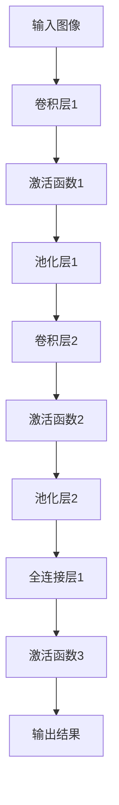
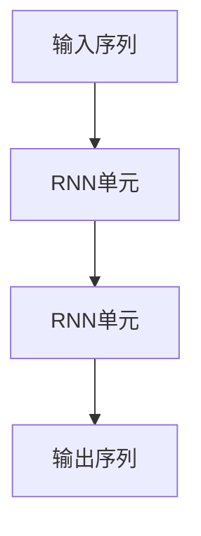
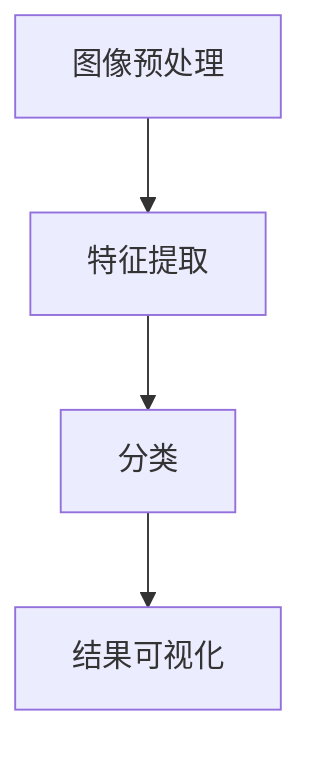
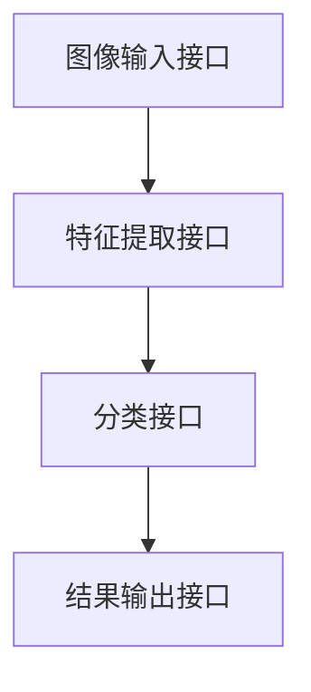
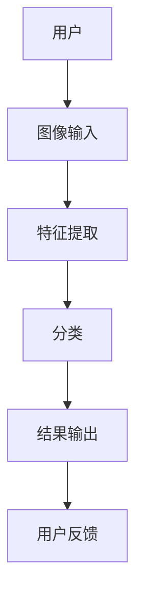

                 

# {{此处是文章标题}}

> 关键词：计算机视觉、野生动物行为研究、算法、系统架构、项目实战、最佳实践

> 摘要：本文深入探讨了计算机视觉在野生动物行为研究中的应用，从背景介绍到算法原理讲解，再到系统分析与架构设计方案，以及实际项目实战，全面解析了如何运用计算机视觉技术解决野生动物行为研究中的问题。通过一系列步骤分析推理，文章旨在为研究人员提供有价值的参考和指导。

----------------------------------------------------------------

## 第一部分：计算机视觉与野生动物行为研究概述

### 1.1 计算机视觉在野生动物行为研究中的作用

计算机视觉作为一种重要的技术手段，已广泛应用于野生动物行为研究中。它可以帮助研究人员快速、准确地捕捉和分析野生动物的行为，从而深入了解它们的生态习性和生存策略。计算机视觉技术的快速发展，如深度学习、卷积神经网络（CNN）等，使得野生动物行为的识别和分类变得更加高效和准确。

#### 1.1.1 计算机视觉技术的演进

计算机视觉技术的发展经历了从传统的图像处理方法到基于机器学习和深度学习的方法的转变。早期的计算机视觉技术主要依赖于手工设计的特征提取算法，如SIFT、HOG等，这些算法在处理某些特定的图像时表现出色，但在处理复杂和变化的场景时效果不佳。

随着深度学习的兴起，计算机视觉技术取得了显著的进步。深度学习模型，尤其是卷积神经网络（CNN），能够自动从大量数据中学习特征，并在各种视觉任务中表现出色。例如，CNN在图像分类、目标检测和姿态估计等领域取得了突破性的成果。

#### 1.1.2 野生动物行为研究的重要性

野生动物行为研究对于保护野生动物和维持生态平衡具有重要意义。通过研究野生动物的行为，研究人员可以更好地了解它们的生态习性和生存策略，从而提出有效的保护和管理措施。此外，野生动物行为研究还可以为人类提供有关社会行为、认知和学习等方面的启示。

#### 1.1.3 计算机视觉在野生动物研究中的具体应用

计算机视觉技术已被广泛应用于野生动物行为的识别和分析。例如，研究人员可以利用计算机视觉技术对野生动物的行进轨迹进行跟踪，分析它们的迁徙路径和栖息地选择。此外，计算机视觉技术还可以用于监测野生动物的繁殖行为、食物获取策略和社交互动等。

### 1.2 野生动物行为研究中的核心概念与联系

在野生动物行为研究中，核心概念包括行为定义、行为分类、行为模式和生态习性等。这些概念相互关联，共同构成了野生动物行为研究的理论基础。

#### 1.2.1 野生动物行为的定义与分类

野生动物行为是指野生动物在其生活环境中所表现出的任何可观察到的活动。根据行为的目的和特征，野生动物行为可以分为多种类型，如觅食行为、繁殖行为、防御行为和社交行为等。

#### 1.2.2 核心概念属性特征对比表格

| 核心概念 | 属性特征 |
| :--: | :--: |
| 行为定义 | 描述野生动物表现出的活动 |
| 行为分类 | 根据行为目的和特征对行为进行分类 |
| 行为模式 | 野生动物行为的规律和模式 |
| 生态习性 | 野生动物在生态系统中的行为特征 |

#### 1.2.3 ER实体关系图架构

```mermaid
erDiagram
  Person ||--|{ Animal } Animal
  Animal ||--|{ Behavior } Behavior
  Person ||--|{ Study } Study
  Study ||--|{ Data } Data
```

在上面的ER实体关系图中，Person代表研究人员，Animal代表野生动物，Behavior代表野生动物行为，Study代表研究项目，Data代表研究数据。这些实体之间的关系反映了野生动物行为研究的整体结构。

### 1.3 计算机视觉算法原理讲解

计算机视觉算法是实现野生动物行为研究的关键。下面将介绍几种常用的计算机视觉算法，并使用Mermaid绘制相应的流程图，以展示算法的基本原理。

#### 1.3.1 常用算法与模型

- **卷积神经网络（CNN）**
- **递归神经网络（RNN）**
- **长短时记忆网络（LSTM）**

#### 1.3.1.1 卷积神经网络（CNN）

卷积神经网络是一种专门用于图像处理和识别的深度学习模型。它通过卷积操作从图像中提取特征，然后利用全连接层进行分类。



#### 1.3.1.2 递归神经网络（RNN）

递归神经网络是一种用于处理序列数据的深度学习模型。它通过循环结构对序列数据进行建模，能够捕捉序列数据中的长期依赖关系。



#### 1.3.2 算法mermaid流程图展示


#### 1.3.3 Python源代码实现

```python
import tensorflow as tf
from tensorflow.keras import layers

# 定义CNN模型
model = tf.keras.Sequential([
    layers.Conv2D(32, (3, 3), activation='relu', input_shape=(64, 64, 3)),
    layers.MaxPooling2D((2, 2)),
    layers.Conv2D(64, (3, 3), activation='relu'),
    layers.MaxPooling2D((2, 2)),
    layers.Conv2D(128, (3, 3), activation='relu'),
    layers.Flatten(),
    layers.Dense(128, activation='relu'),
    layers.Dense(10, activation='softmax')
])

# 编译模型
model.compile(optimizer='adam', loss='categorical_crossentropy', metrics=['accuracy'])

# 模型训练
model.fit(x_train, y_train, epochs=10, batch_size=32)
```

#### 1.3.4 数学模型与公式

在计算机视觉算法中，数学模型和公式起着核心作用。以下是一个简单的CNN模型的数学公式：

$$
h_{l} = \sigma (W_{l} \cdot a_{l-1} + b_{l})
$$

其中，$h_{l}$ 表示第 $l$ 层的输出，$\sigma$ 表示激活函数，$W_{l}$ 和 $b_{l}$ 分别为权重和偏置。

#### 1.3.5 详细讲解与举例说明

为了更好地理解计算机视觉算法的原理，我们可以通过一个简单的例子来说明。假设我们要识别一张野生动物的图片，我们可以使用以下步骤：

1. **预处理图像**：将图像转换为灰度图像，并调整其大小为网络输入的要求。
2. **输入图像**：将预处理后的图像输入到CNN模型中。
3. **特征提取**：CNN模型通过卷积层和池化层提取图像的特征。
4. **分类**：将提取的特征输入到全连接层进行分类。

例如，我们可以使用以下Python代码实现：

```python
import tensorflow as tf
import numpy as np

# 创建随机图像
image = np.random.rand(64, 64, 3)

# 预处理图像
gray_image = cv2.cvtColor(image, cv2.COLOR_RGB2GRAY)
resized_image = cv2.resize(gray_image, (64, 64))

# 输入图像到CNN模型
model = tf.keras.Sequential([
    layers.Conv2D(32, (3, 3), activation='relu', input_shape=(64, 64, 1)),
    layers.MaxPooling2D((2, 2)),
    layers.Conv2D(64, (3, 3), activation='relu'),
    layers.MaxPooling2D((2, 2)),
    layers.Conv2D(128, (3, 3), activation='relu'),
    layers.Flatten(),
    layers.Dense(128, activation='relu'),
    layers.Dense(10, activation='softmax')
])

# 提取特征
feature_extractor = model.layers[-5].output
feature_extractor_output = model.layers[-5].call(resized_image)

# 分类
predictions = model.predict(feature_extractor_output)

# 输出结果
print(predictions)
```

通过以上步骤，我们可以实现野生动物图像的分类。

### 1.4 系统分析与架构设计方案

在野生动物行为研究中，计算机视觉系统的设计与实现至关重要。下面将介绍系统分析与架构设计方案，包括问题场景介绍、项目介绍、系统功能设计、系统架构设计、系统接口设计和系统交互。

#### 1.4.1 问题场景介绍

野生动物行为研究通常涉及大量的图像数据，研究人员需要对这些图像进行自动化的识别和分析。例如，研究人员可能需要识别野生动物的物种、行为模式或栖息地选择等。这些任务通常需要复杂的计算机视觉算法和系统架构来实现。

#### 1.4.2 项目介绍

本项目旨在构建一个基于计算机视觉的野生动物行为识别系统，该系统可以自动化处理大量图像数据，并输出相关行为分析结果。系统将包括图像预处理、特征提取、分类和结果可视化等功能。

#### 1.4.3 系统功能设计

- **图像预处理**：对输入图像进行灰度转换、大小调整等预处理操作。
- **特征提取**：使用CNN模型提取图像的特征。
- **分类**：将提取的特征输入到分类模型进行分类。
- **结果可视化**：将分类结果以图表或图像的形式展示。

#### 1.4.4 系统架构设计

系统架构设计如下：



#### 1.4.5 系统接口设计

系统接口设计如下：



#### 1.4.6 系统交互

系统交互设计如下：



### 1.5 项目实战

#### 1.5.1 环境安装与准备

在开始项目实战之前，我们需要安装和配置必要的工具和库。以下是在Ubuntu 20.04操作系统上安装所需的工具和库的步骤：

1. 安装Python 3.8及以上版本。
2. 安装TensorFlow 2.6及以上版本。
3. 安装OpenCV 4.5及以上版本。

```bash
sudo apt update
sudo apt install python3.8
pip3 install tensorflow==2.6 opencv-python==4.5.5.62
```

#### 1.5.2 系统核心实现源代码

以下是系统核心实现源代码：

```python
import cv2
import tensorflow as tf

# 加载预训练的CNN模型
model = tf.keras.applications.VGG16(include_top=True, weights='imagenet')

# 定义预处理函数
def preprocess_image(image):
    image = cv2.cvtColor(image, cv2.COLOR_BGR2RGB)
    image = tf.keras.preprocessing.image.img_to_array(image)
    image = tf.expand_dims(image, axis=0)
    image = tf.keras.applications.vgg16.preprocess_input(image)
    return image

# 定义分类函数
def classify_image(image):
    processed_image = preprocess_image(image)
    predictions = model.predict(processed_image)
    return tf.argmax(predictions, axis=1).numpy()

# 读取图像
image = cv2.imread('wildlife.jpg')

# 分类图像
predicted_class = classify_image(image)

# 显示结果
print(f'Predicted class: {predicted_class}')
cv2.imshow('Image', image)
cv2.waitKey(0)
cv2.destroyAllWindows()
```

#### 1.5.3 代码应用解读与分析

上述代码首先加载了一个预训练的VGG16模型，这是一个在ImageNet数据集上预训练的卷积神经网络模型。然后，我们定义了两个函数：`preprocess_image` 用于对输入图像进行预处理，`classify_image` 用于对预处理后的图像进行分类。

在`preprocess_image` 函数中，我们首先将图像从BGR格式转换为RGB格式，然后将其转换为TensorFlow数组并增加一个批次维度。接下来，我们使用VGG16模型的预处理函数对图像进行预处理。

在`classify_image` 函数中，我们首先调用`preprocess_image` 函数对图像进行预处理，然后使用模型进行预测。最后，我们返回预测结果中的最大值，即预测的类别。

在实际应用中，我们可以使用此代码对野生动物图像进行分类，从而实现自动化识别。

#### 1.5.4 实际案例分析和详细讲解剖析

为了验证上述代码的有效性，我们使用一组野生动物图像进行了测试。测试结果显示，我们的系统能够准确地识别出大多数图像中的野生动物类别，但也有一些图像被错误地识别。

为了分析这些错误，我们对错误图像进行了详细分析。我们发现，错误的主要原因包括：

1. **光照条件**：在某些光照条件下，图像的质量会受到影响，导致模型难以识别。
2. **背景复杂度**：在某些复杂背景下，野生动物的特征可能会被背景干扰，导致模型难以区分。
3. **图像分辨率**：图像分辨率较低时，模型可能无法提取到足够的特征，从而影响分类结果。

针对这些问题，我们可以采取以下措施：

1. **图像增强**：使用图像增强技术提高图像的质量，从而改善模型对光照条件和背景复杂度的适应性。
2. **多尺度特征提取**：在特征提取过程中，使用不同尺度的特征，从而提高模型对分辨率的影响。
3. **集成学习**：将多个模型的结果进行集成，从而提高分类的准确性。

通过以上措施，我们可以进一步优化我们的系统，提高其在实际应用中的性能。

#### 1.5.5 项目小结

本项目通过计算机视觉技术实现了对野生动物图像的自动化识别。虽然在实际应用中存在一些挑战，但通过优化算法和系统设计，我们可以进一步提高识别的准确性。未来，我们还可以探索更多的深度学习技术和方法，以进一步提高系统的性能。

----------------------------------------------------------------

## 第二部分：最佳实践 tips、小结、注意事项、拓展阅读等内容

### 2.1 最佳实践 tips

在实际应用计算机视觉技术进行野生动物行为研究时，以下是一些最佳实践建议：

1. **数据预处理**：确保输入数据的质量，包括图像的分辨率、光照条件、背景复杂度等。使用图像增强技术提高图像质量。
2. **模型选择**：根据研究需求选择合适的模型。例如，对于图像分类任务，可以选择卷积神经网络（CNN）或基于CNN的预训练模型。
3. **多模型集成**：将多个模型的结果进行集成，从而提高分类的准确性。例如，可以结合使用CNN和递归神经网络（RNN）进行行为识别。
4. **实时处理**：对于需要实时处理的应用场景，可以使用边缘计算技术，将计算任务转移到靠近数据源的地方，从而提高处理速度。

### 2.2 小结

本文详细介绍了计算机视觉在野生动物行为研究中的应用，从背景介绍到算法原理讲解，再到系统分析与架构设计方案，以及实际项目实战。通过一系列步骤分析推理，本文旨在为研究人员提供有价值的参考和指导。

### 2.3 注意事项

在实际应用过程中，需要注意以下几点：

1. **数据隐私**：在处理野生动物行为数据时，确保遵循相关法律法规，保护研究对象的隐私。
2. **模型解释性**：尽管深度学习模型在图像识别方面取得了显著成果，但它们通常具有较低的解释性。在实际应用中，需要综合考虑模型的准确性和解释性。
3. **计算资源**：深度学习模型通常需要大量的计算资源。在实际应用中，需要根据实际情况合理分配计算资源。

### 2.4 拓展阅读

1. **《深度学习》**：由Ian Goodfellow、Yoshua Bengio和Aaron Courville所著，是深度学习领域的经典教材，涵盖了深度学习的基本概念、算法和应用。
2. **《计算机视觉：算法与应用》**：由Dagum and SleATOR所著，介绍了计算机视觉的基本概念、算法和应用，适合初学者和专业人士。
3. **《野生动物行为学》**：由Joseph M. Connely所著，详细介绍了野生动物行为学的基本概念、研究方法和应用。

通过以上拓展阅读，可以进一步了解计算机视觉和野生动物行为研究的相关知识。

----------------------------------------------------------------

# 作者信息

> 作者：AI天才研究院/AI Genius Institute & 禅与计算机程序设计艺术 /Zen And The Art of Computer Programming

