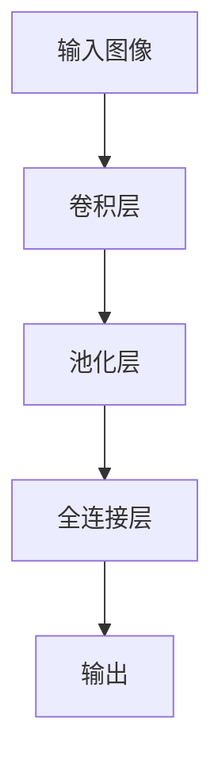
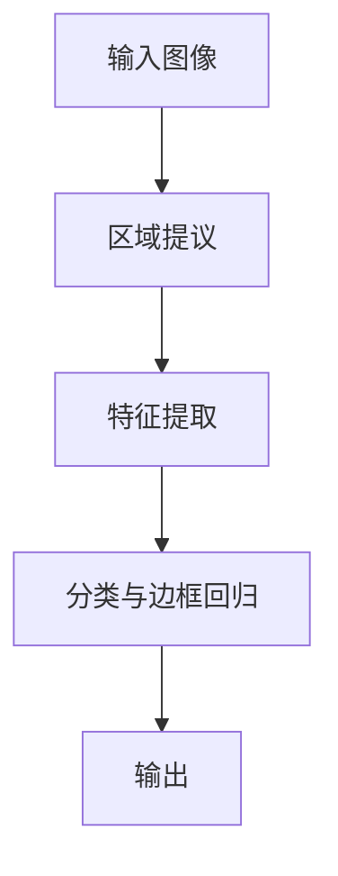
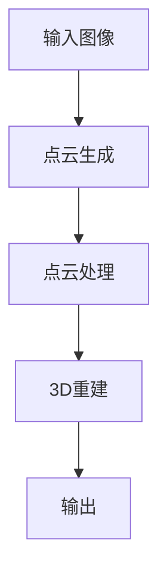
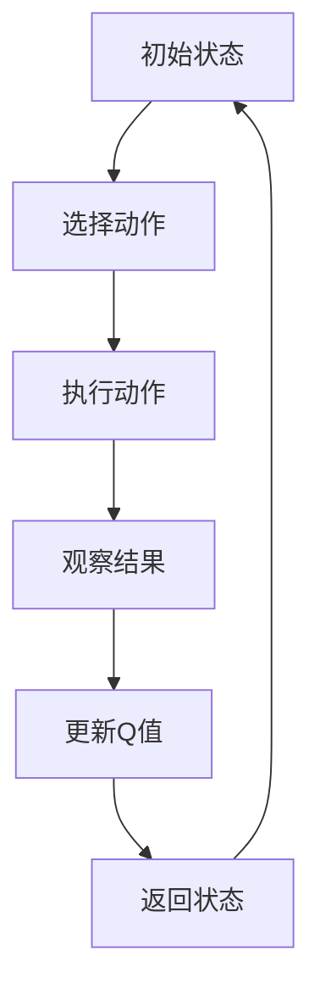
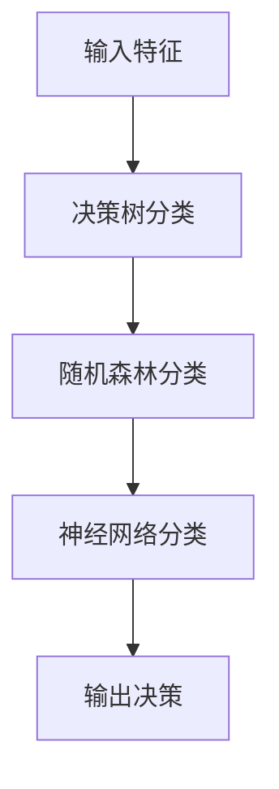
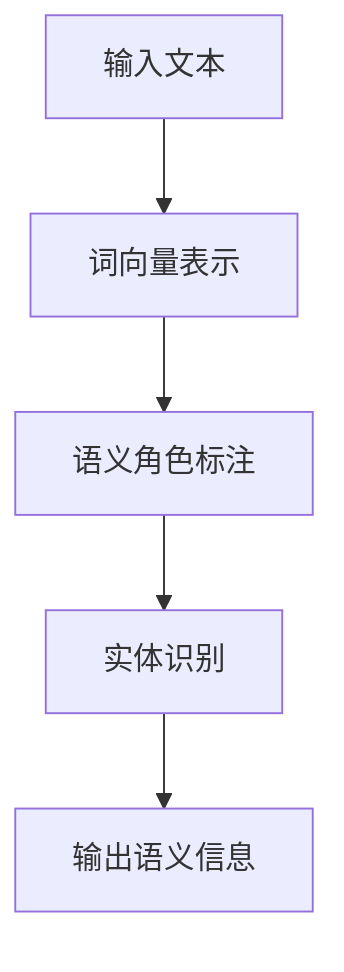
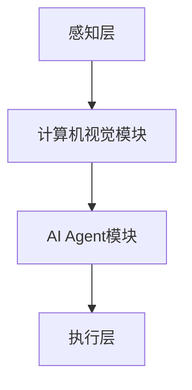
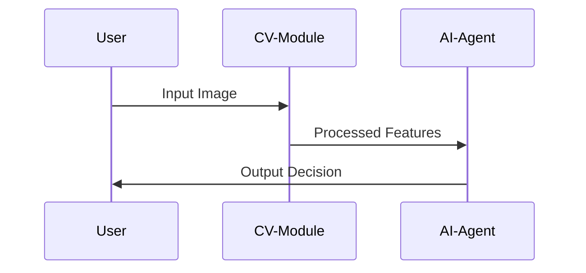

                 

# 计算机视觉集成：扩展AI Agent的感知能力

> 关键词：计算机视觉，AI Agent，集成技术，感知能力，系统架构，算法原理

> 摘要：本文深入探讨了计算机视觉与AI Agent的集成技术，从背景介绍、核心概念联系、算法原理讲解、系统架构设计到项目实战，全面解析了如何扩展AI Agent的感知能力。文章旨在为读者提供清晰的思路和实用的技巧，帮助他们在实际项目中成功应用这一前沿技术。

## 第一部分：问题背景与核心概念

### 第1章：计算机视觉与AI Agent概述

#### 1.1 计算机视觉的背景与重要性

计算机视觉是人工智能的一个重要分支，旨在使计算机能够像人类一样理解和解析视觉信息。其发展历程可以追溯到20世纪60年代，早期以图像处理和模式识别为基础。随着深度学习的兴起，计算机视觉取得了巨大的进步，其在图像识别、目标检测、图像生成等领域的应用越来越广泛。

计算机视觉的重要性在于它能够赋予计算机更高层次的感知能力，使得机器能够更好地理解和交互世界。这种能力在自动驾驶、智能监控、医疗影像分析等领域具有广泛的应用前景。

#### 1.2 AI Agent的概念与演进

AI Agent，即人工智能代理，是具有自主性和主动性的智能实体。它可以感知环境、制定计划并采取行动，以实现特定目标。AI Agent的发展经历了从规则基础到基于数据的学习，再到现在的强化学习和深度学习的演进。

AI Agent的关键技术包括感知、决策、行动和交互。感知能力是AI Agent的核心，而计算机视觉则是其感知能力的重要组成部分。

#### 1.3 计算机视觉与AI Agent的融合

计算机视觉与AI Agent的融合具有显著的优势。通过计算机视觉，AI Agent可以获得更丰富的感知信息，从而提高其决策能力和反应速度。同时，计算机视觉的发展也为AI Agent提供了更强大的数据处理和分析工具。

然而，融合也面临诸多挑战，如数据处理的高效性、算法的实时性、系统的复杂性和可解释性等。这些挑战需要通过技术创新和系统优化来逐步解决。

### 第2章：核心概念与联系

#### 2.1 计算机视觉核心概念

计算机视觉的核心概念包括图像处理、特征提取、图像分类和目标检测。图像处理是计算机视觉的基础，它涉及图像的预处理、增强和变换。特征提取则是从图像中提取具有区分性的特征，用于后续的图像分析和识别。图像分类和目标检测则是计算机视觉的两个主要任务，前者旨在将图像分类到预定的类别中，后者则是识别和定位图像中的特定目标。

#### 2.2 AI Agent核心概念

AI Agent的核心概念包括感知、决策、行动和交互。感知是指AI Agent通过传感器获取环境信息，包括视觉、听觉、触觉等。决策是指AI Agent根据感知到的信息，制定合适的行动策略。行动是指AI Agent执行决策方案，以实现目标。交互是指AI Agent与其他实体（如人类、其他机器）进行信息交换和协同工作。

#### 2.3 计算机视觉与AI Agent的联系

计算机视觉与AI Agent的联系主要体现在以下几个方面：

1. **感知能力**：计算机视觉为AI Agent提供了强大的视觉感知能力，使其能够更好地理解和交互环境。
2. **数据处理**：计算机视觉技术可以高效地处理大量的视觉数据，为AI Agent提供丰富的信息来源。
3. **决策支持**：计算机视觉提取的特征和结果可以用于AI Agent的决策过程，提高其决策的准确性和效率。
4. **交互能力**：计算机视觉使得AI Agent能够更自然地与人类进行交互，提升其人机交互体验。

通过上述联系，计算机视觉与AI Agent相互补充，共同推动人工智能技术的发展。

## 第二部分：算法原理与系统架构

### 第3章：计算机视觉算法原理讲解

#### 3.1 图像识别算法

图像识别是计算机视觉的核心任务之一。目前，深度学习算法在图像识别领域取得了显著的成果。

1. **卷积神经网络（CNN）**：CNN是一种前馈神经网络，特别适合处理图像数据。其基本结构包括卷积层、池化层和全连接层。卷积层用于提取图像特征，池化层用于降低特征的空间分辨率，全连接层用于分类。

2. **深度卷积神经网络（Deep CNN）**：Deep CNN是CNN的扩展，通过增加网络深度来提高特征提取能力。VGG和ResNet是两个著名的Deep CNN模型。

3. **算法mermaid流程图**：



#### 3.2 目标检测算法

目标检测是计算机视觉的另一个重要任务，旨在识别图像中的特定目标并定位其位置。

1. **R-CNN系列算法**：R-CNN是一种基于区域提议的目标检测算法。它包括区域提议、特征提取、分类和边框回归四个步骤。

2. **Faster R-CNN算法**：Faster R-CNN在R-CNN的基础上引入了区域提议网络（RPN），显著提高了检测速度。

3. **算法mermaid流程图**：



#### 3.3 3D视觉算法

3D视觉是计算机视觉的另一个重要研究方向，旨在从2D图像中恢复出三维信息。

1. **点云处理与SLAM**：点云处理是3D视觉的基础，SLAM（同时定位与地图构建）是一种在未知环境中同时进行定位和地图构建的技术。

2. **3D重建算法**：3D重建是从2D图像中恢复出三维模型的过程，包括基于结构光、激光扫描和深度学习等方法。

3. **算法mermaid流程图**：



### 第4章：AI Agent算法原理讲解

#### 4.1 强化学习算法

强化学习是AI Agent的核心算法之一，旨在通过不断尝试和反馈来学习最优策略。

1. **Q-learning算法**：Q-learning是一种基于值函数的强化学习算法，通过更新Q值来学习策略。

2. **SARSA算法**：SARSA是一种基于策略的强化学习算法，通过更新状态-动作值函数来学习策略。

3. **DQN与DDPG算法**：DQN和DDPG是深度强化学习算法，通过神经网络来近似Q值函数。

4. **算法mermaid流程图**：



#### 4.2 决策模型算法

决策模型是AI Agent进行决策的重要工具，包括决策树、随机森林和神经网络决策模型。

1. **决策树**：决策树是一种基于规则的知识表示方法，通过递归划分特征空间来生成决策规则。

2. **随机森林**：随机森林是一种基于集成学习的决策模型，通过构建多个决策树并投票来生成预测。

3. **神经网络决策模型**：神经网络决策模型是一种基于神经网络的决策模型，通过学习输入特征和输出决策之间的关系。

4. **算法mermaid流程图**：



#### 4.3 语义理解算法

语义理解是AI Agent进行智能交互和理解的关键，包括词向量、语义角色标注和实体识别。

1. **词向量**：词向量是一种将单词映射到高维向量空间的方法，用于表示单词的语义信息。

2. **语义角色标注**：语义角色标注是一种将句子中的词映射到对应的语义角色的方法，用于理解句子的语义结构。

3. **实体识别**：实体识别是一种从文本中识别出实体（如人名、地名、组织名等）的方法，用于构建知识图谱。

4. **算法mermaid流程图**：



### 第5章：计算机视觉与AI Agent集成系统架构设计

#### 5.1 系统功能设计（领域模型类图）

系统功能设计包括计算机视觉模块和AI Agent模块，分别表示为两个类图。

1. **计算机视觉模块**：包括图像预处理、特征提取、图像分类和目标检测等功能类。
2. **AI Agent模块**：包括感知、决策、行动和交互等功能类。

3. **领域模型mermaid类图**：

```mermaid
classDiagram
ClassDef ComputerVision {
  +ImagePreprocessing
  +FeatureExtraction
  +ImageClassification
  +ObjectDetection
}
ClassDef AI-Agent {
  +Perception
  +Decision
  +Action
  +Interaction
}
ComputerVision --|> AI-Agent
```

#### 5.2 系统架构设计（架构图）

系统架构设计包括整体架构、模块划分、数据流和处理流程。

1. **整体架构**：包括感知层、决策层和执行层，分别对应计算机视觉模块、AI Agent模块和外部环境。
2. **模块划分**：计算机视觉模块分为图像预处理、特征提取、图像分类和目标检测四个子模块；AI Agent模块分为感知、决策、行动和交互四个子模块。
3. **数据流与处理流程**：数据从感知层进入系统，经过计算机视觉模块处理，生成特征和结果，然后输入到AI Agent模块进行决策和行动。

4. **系统架构mermaid架构图**：



#### 5.3 系统接口设计与交互（序列图）

系统接口设计包括输入输出接口、模块间交互和外部环境交互。

1. **输入输出接口**：计算机视觉模块和AI Agent模块分别具有输入和输出接口，用于接收和发送数据。
2. **模块间交互**：计算机视觉模块和AI Agent模块通过接口进行数据交换和协同工作。
3. **外部环境交互**：系统与外部环境通过接口进行信息交换和指令执行。

4. **系统交互mermaid序列图**：



## 第三部分：项目实战与最佳实践

### 第6章：环境安装与系统核心实现

#### 6.1 环境安装

环境安装是项目实施的第一步，包括计算机视觉和AI Agent相关软件的安装。

1. **Python环境**：安装Python 3.7及以上版本。
2. **计算机视觉库**：安装OpenCV、TensorFlow、PyTorch等。
3. **AI Agent库**：安装Keras、Scikit-learn、Gym等。
4. **环境配置与调试**：确保各库版本兼容，并进行调试。

#### 6.2 系统核心实现

系统核心实现包括计算机视觉模块和AI Agent模块的源代码编写。

1. **计算机视觉模块**：实现图像预处理、特征提取、图像分类和目标检测等功能。
2. **AI Agent模块**：实现感知、决策、行动和交互等功能。
3. **代码应用解读与分析**：对源代码进行解读，分析其功能实现和原理。

### 第7章：实际案例分析与详细讲解

#### 7.1 实际案例展示

选择具有代表性的案例进行展示，如自动驾驶车辆的目标检测与路径规划。

1. **案例背景与目标**：介绍自动驾驶车辆的目标检测和路径规划任务，明确案例的目标和挑战。
2. **计算机视觉与AI Agent融合的应用场景**：分析案例中计算机视觉与AI Agent的融合应用场景，如目标检测用于感知环境，路径规划用于决策和行动。

#### 7.2 案例分析与详细讲解

1. **计算机视觉与AI Agent融合的技术实现**：详细讲解计算机视觉算法（如YOLOv5）和AI Agent算法（如DQN）在案例中的应用，包括算法原理、代码实现和效果分析。
2. **案例的技术实现与效果分析**：展示案例的实验结果，分析技术实现的可行性和效果，提出改进建议。

### 第8章：最佳实践与注意事项

#### 8.1 最佳实践

1. **总结项目中的成功经验与技巧**：如算法优化、模型训练技巧、系统集成策略等。
2. **提供优化建议和改进方向**：如提高检测速度、降低计算资源消耗、增强系统鲁棒性等。

#### 8.2 注意事项

1. **项目实施过程中需要注意的问题**：如数据质量、算法稳定性、系统安全性等。
2. **常见问题与解决方案**：如算法过拟合、系统崩溃、数据处理效率低下等。

#### 8.3 拓展阅读

1. **推荐进一步学习的资源与文献**：如经典教材、论文、在线课程等，帮助读者深入学习和实践。

## 结束语

本文系统地介绍了计算机视觉与AI Agent的集成技术，从核心概念、算法原理到系统架构和项目实战，全面解析了如何扩展AI Agent的感知能力。通过本文的阅读，读者可以掌握计算机视觉与AI Agent的融合技术，并在实际项目中成功应用。作者希望本文能为大家的研究和开发工作提供有益的参考和指导。感谢大家的阅读！

---

**作者：AI天才研究院/AI Genius Institute & 禅与计算机程序设计艺术 /Zen And The Art of Computer Programming**

