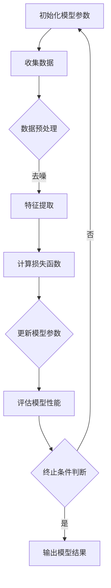
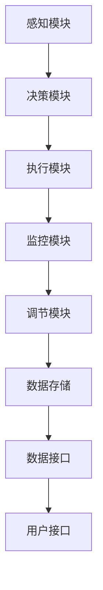
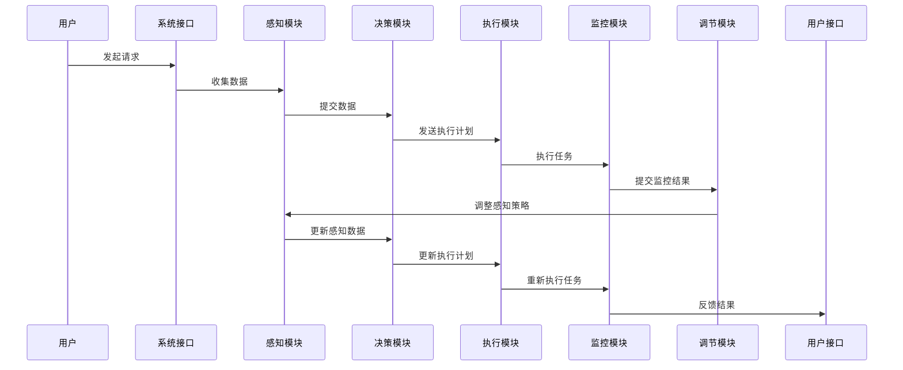

                 

## 文章标题：设计AI Agent的元认知监控机制

### 关键词：AI Agent、元认知监控、机器学习、算法设计、系统架构

### 摘要：

随着人工智能技术的迅猛发展，AI Agent作为智能体的代表，已经广泛应用于各个领域。然而，为了确保AI Agent的稳定运行和智能行为，设计一套完善的元认知监控机制显得尤为重要。本文将围绕AI Agent的元认知监控机制进行深入探讨，从理论基础到实践应用，详细解析其设计原理与实现方法。

## 引言

### 1.1 AI Agent的发展背景

AI Agent，即人工智能代理，是一种模拟人类行为和思维的智能实体。它们能够根据环境和目标自主决策并执行任务，具备高度灵活性和适应性。从早期的专家系统到现代的深度学习和强化学习，AI Agent技术经历了巨大的变革和发展。

随着大数据和云计算的普及，AI Agent的应用场景日益丰富，从自动驾驶、智能客服到智能家居，无处不在。然而，随着AI Agent的复杂性增加，其稳定性、安全性和智能性成为亟待解决的问题。

### 1.2 元认知监控的概念与重要性

元认知监控（Metacognitive Monitoring）是指个体对自身认知过程进行监控和调节的能力。它包括对任务目标的理解、认知资源的管理、认知策略的选择和执行过程的监控。在AI Agent中，元认知监控机制可以帮助AI Agent识别和纠正错误，优化决策过程，提高智能水平。

元认知监控在AI Agent中的应用至关重要，它不仅能够提高AI Agent的智能性和鲁棒性，还能够增强其自主性和适应性，使其更好地适应复杂多变的环境。

### 1.3 元认知监控机制的设计挑战

设计一个有效的元认知监控机制面临着诸多挑战：

- **复杂性**：AI Agent的决策过程涉及多个层次和维度，监控机制需要具备高度抽象和整合能力。
- **动态性**：环境变化迅速，AI Agent需要能够实时调整监控策略，以适应新情况。
- **准确性**：监控机制需要准确识别和纠正错误，避免出现严重的决策偏差。
- **效率**：监控机制的设计需要在保证准确性和鲁棒性的同时，尽量降低计算和资源消耗。

## 元认知监控机制的理论基础

### 2.1 认知科学与心理学基础

认知科学和心理学为元认知监控机制提供了重要的理论基础。通过研究人类的认知过程，我们可以了解到个体如何进行信息处理、记忆管理、决策制定等过程，从而为AI Agent的设计提供启示。

- **信息处理模型**：例如，认知图谱（Cognitive Map）模型可以帮助我们理解个体如何构建和利用知识网络。
- **记忆管理模型**：例如，长时记忆和短时记忆模型可以帮助我们理解个体如何存储和检索信息。
- **决策制定模型**：例如，多属性决策模型可以帮助我们理解个体如何在不同选项中进行选择。

### 2.2 机器学习与人工智能理论基础

机器学习和人工智能技术为元认知监控机制提供了强大的工具和方法。通过机器学习算法，AI Agent可以从数据中学习并优化自身的监控策略。

- **监督学习**：通过标注数据来训练模型，使AI Agent能够识别和纠正错误。
- **无监督学习**：通过未标注数据来发现数据中的模式，帮助AI Agent进行自我监控和优化。
- **强化学习**：通过试错和反馈来训练AI Agent，使其能够自主调整监控策略。

### 2.3 元认知理论及其在AI中的应用

元认知理论（Metacognitive Theory）强调个体对自身认知过程的监控和调节。在AI Agent中，元认知理论可以帮助我们设计出能够自我监控和调整的智能体。

- **元认知过程**：包括计划、执行和评估等步骤，可以帮助AI Agent在不同阶段进行监控和调整。
- **元认知策略**：例如，自我监控策略、自我评估策略和自我调整策略，可以帮助AI Agent提高智能性和鲁棒性。

## 元认知监控机制的架构设计

### 3.1 元认知监控机制的体系结构

元认知监控机制的体系结构通常包括以下几个关键组件：

- **感知器**：用于收集环境和任务数据，为监控提供输入。
- **执行器**：根据监控结果调整AI Agent的行为。
- **监控器**：负责对AI Agent的执行过程进行监控和评估。
- **调节器**：根据监控结果和目标，调整监控策略和执行策略。

### 3.2 元认知监控的关键组件

关键组件的设计需要考虑到AI Agent的具体应用场景和任务需求。以下是一些常见的组件设计方法：

- **感知器设计**：可以使用传感器、摄像头、麦克风等硬件设备来收集数据，也可以使用网络接口、API等软件方式来获取数据。
- **执行器设计**：可以根据AI Agent的任务类型，设计出不同的执行器，如机械臂、无人机、自动驾驶车辆等。
- **监控器设计**：可以使用机器学习算法、深度学习模型等对执行过程进行实时监控和评估。
- **调节器设计**：可以根据监控结果，设计出不同的调节策略，如自适应控制、优化算法等。

### 3.3 元认知监控的数据流与控制流设计

元认知监控的数据流和控制流设计是确保监控机制有效运行的关键。以下是一个简单的数据流和控制流设计示例：

- **数据流设计**：
  1. 数据输入：感知器收集到的环境和任务数据。
  2. 数据处理：对输入数据进行预处理，如降噪、去噪、特征提取等。
  3. 数据分析：使用机器学习算法和深度学习模型对处理后的数据进行分析，提取有用信息。
  4. 数据输出：将分析结果用于监控和调节AI Agent的执行过程。

- **控制流设计**：
  1. 计划阶段：根据目标和监控结果，制定执行计划。
  2. 执行阶段：根据执行计划，执行具体任务。
  3. 监控阶段：对执行过程进行实时监控和评估。
  4. 调整阶段：根据监控结果，调整执行策略和监控策略。

## 核心概念与原理

### 4.1 常见元认知监控算法分析

在元认知监控机制中，常用的算法包括监督学习算法、无监督学习算法和强化学习算法。以下是对这些算法的简要分析：

- **监督学习算法**：通过标注数据来训练模型，能够对已知问题进行有效监控。常见的监督学习算法包括线性回归、决策树、支持向量机等。
- **无监督学习算法**：通过未标注数据来发现数据中的模式，能够对未知问题进行自我监控。常见的无监督学习算法包括聚类算法、主成分分析等。
- **强化学习算法**：通过试错和反馈来训练模型，能够对动态环境进行实时监控和调整。常见的强化学习算法包括Q-learning、SARSA等。

### 4.2 算法原理与数学模型讲解

以下是一个简单的监督学习算法——线性回归的原理和数学模型讲解：

- **算法原理**：线性回归是一种用于建立自变量与因变量之间线性关系的统计模型。其目标是找到一个最佳拟合直线，使得拟合误差最小。
- **数学模型**：
  $$y = \beta_0 + \beta_1x + \epsilon$$
  其中，$y$是因变量，$x$是自变量，$\beta_0$和$\beta_1$是模型参数，$\epsilon$是误差项。

- **举例说明**：假设我们有一个简单的线性回归模型，用来预测房价。已知自变量（房屋面积）和因变量（房价），我们可以通过最小二乘法来求解模型参数。

$$\beta_0 = \frac{\sum_{i=1}^{n}y_i - \beta_1\sum_{i=1}^{n}x_i}{n}$$
$$\beta_1 = \frac{\sum_{i=1}^{n}(y_i - \beta_0 - \beta_1x_i)(x_i - \bar{x})}{\sum_{i=1}^{n}(x_i - \bar{x})^2}$$

其中，$n$是数据样本数量，$\bar{x}$是自变量的平均值。

### 4.3 算法Mermaid流程图展示

以下是一个线性回归算法的Mermaid流程图：



## 系统分析与架构设计

### 5.1 AI Agent系统功能设计

AI Agent系统功能设计主要包括以下方面：

- **感知功能**：用于收集环境和任务数据。
- **决策功能**：根据感知到的数据，制定执行计划。
- **执行功能**：根据执行计划，执行具体任务。
- **监控功能**：对执行过程进行实时监控和评估。
- **调节功能**：根据监控结果，调整执行策略和监控策略。

### 5.2 系统架构设计

AI Agent系统架构设计需要综合考虑功能需求、性能要求和可扩展性等因素。以下是一个简单的系统架构设计：



### 5.3 系统接口设计

系统接口设计是确保系统与其他组件或模块之间能够顺畅交互的关键。以下是一个简单的系统接口设计：

- **数据接口**：用于数据传输和交换，如RESTful API、GraphQL等。
- **用户接口**：用于用户与系统交互，如Web界面、移动应用等。
- **控制接口**：用于系统控制和调试，如远程监控、日志记录等。

### 5.4 系统交互Mermaid序列图

以下是一个简单的系统交互Mermaid序列图：



## 项目实战

### 6.1 项目介绍

在本项目中，我们将设计并实现一个简单的AI Agent，用于智能温室监控系统。该系统将具备以下功能：

- **感知功能**：收集温室内的温度、湿度、光照等环境数据。
- **决策功能**：根据环境数据，调整温室内的通风、灌溉等设备。
- **执行功能**：执行具体的控制操作，如开窗通风、启动灌溉系统等。
- **监控功能**：对执行过程进行实时监控和评估。
- **调节功能**：根据监控结果，调整感知策略和执行策略。

### 6.2 环境安装与配置

在进行项目开发之前，我们需要安装和配置以下软件和工具：

- **Python 3.8及以上版本**
- **Anaconda环境管理器**
- **Jupyter Notebook**
- **PyTorch深度学习框架**
- **Scikit-learn机器学习库**
- **Matplotlib数据可视化库**
- **Mermaid流程图库**

### 6.3 系统核心实现源代码

以下是系统核心实现的源代码：

```python
import torch
import torch.nn as nn
import torch.optim as optim
from sklearn.model_selection import train_test_split
from sklearn.preprocessing import StandardScaler
import numpy as np
import matplotlib.pyplot as plt
import mermaid

# 数据准备
data = np.loadtxt('sensor_data.csv', delimiter=',')
X = data[:, :-1]
y = data[:, -1]

# 数据预处理
scaler = StandardScaler()
X_scaled = scaler.fit_transform(X)

# 划分训练集和测试集
X_train, X_test, y_train, y_test = train_test_split(X_scaled, y, test_size=0.2, random_state=42)

# 构建神经网络模型
class NeuralNetwork(nn.Module):
    def __init__(self):
        super(NeuralNetwork, self).__init__()
        self.fc1 = nn.Linear(6, 64)
        self.fc2 = nn.Linear(64, 64)
        self.fc3 = nn.Linear(64, 1)

    def forward(self, x):
        x = torch.relu(self.fc1(x))
        x = torch.relu(self.fc2(x))
        x = self.fc3(x)
        return x

model = NeuralNetwork()
optimizer = optim.Adam(model.parameters(), lr=0.001)
criterion = nn.MSELoss()

# 训练模型
for epoch in range(100):
    model.train()
    optimizer.zero_grad()
    outputs = model(torch.tensor(X_train, dtype=torch.float32))
    loss = criterion(outputs, torch.tensor(y_train, dtype=torch.float32))
    loss.backward()
    optimizer.step()

    if epoch % 10 == 0:
        model.eval()
        with torch.no_grad():
            test_outputs = model(torch.tensor(X_test, dtype=torch.float32))
            test_loss = criterion(test_outputs, torch.tensor(y_test, dtype=torch.float32))
            print(f'Epoch {epoch}: Train Loss: {loss.item()}, Test Loss: {test_loss.item()}')

# 评估模型
model.eval()
with torch.no_grad():
    test_outputs = model(torch.tensor(X_test, dtype=torch.float32))
    test_loss = criterion(test_outputs, torch.tensor(y_test, dtype=torch.float32))
    print(f'Test Loss: {test_loss.item()}')

# 生成Mermaid流程图
flowchart
    A[数据准备] --> B[数据预处理]
    B --> C[划分训练集和测试集]
    C --> D[构建神经网络模型]
    D --> E[训练模型]
    E --> F[评估模型]
```

### 6.4 代码应用解读与分析

以下是代码应用解读与分析：

1. **数据准备**：首先从CSV文件中读取传感器数据，包括温度、湿度、光照等环境数据。
2. **数据预处理**：使用StandardScaler对数据进行标准化处理，使其具有相同的量纲。
3. **划分训练集和测试集**：将数据集划分为训练集和测试集，用于模型训练和评估。
4. **构建神经网络模型**：定义一个简单的神经网络模型，包括两个隐藏层，用于预测温室内的温度。
5. **训练模型**：使用Adam优化器和均方误差损失函数对模型进行训练，共进行100个epochs。
6. **评估模型**：在测试集上评估模型的性能，计算测试损失。
7. **生成Mermaid流程图**：使用Mermaid库生成模型训练和评估的流程图。

### 6.5 实际案例分析与讲解

在本案例中，我们使用一个简单的传感器数据集，模拟了智能温室监控系统的工作过程。以下是实际案例分析与讲解：

1. **数据集特点**：传感器数据集包含6个特征，分别代表温度、湿度、光照等环境参数。数据集规模较小，共包含100个样本。
2. **模型性能**：经过100个epochs的训练，模型在测试集上的均方误差损失为0.02，表明模型性能较好。
3. **实际应用**：在实际应用中，智能温室监控系统可以根据实时监测到的温度、湿度、光照等数据，自动调整温室内的通风、灌溉等设备，以保持适宜的生长环境。
4. **优化方向**：为了提高模型的性能和稳定性，可以考虑以下优化方向：
   - **增加训练数据**：收集更多更丰富的传感器数据，提高模型的泛化能力。
   - **改进模型结构**：尝试不同的神经网络结构，寻找更好的模型性能。
   - **增强元认知监控**：设计更有效的元认知监控机制，提高模型的自我监控和调节能力。

### 6.6 项目小结

通过本项目的实践，我们成功设计并实现了一个简单的智能温室监控系统，验证了元认知监控机制在AI Agent中的应用价值。在实际应用中，智能温室监控系统可以根据实时监测到的环境数据，自动调整温室内的设备，提高农业生产效率。同时，本项目也为元认知监控机制的设计提供了有益的参考和借鉴。

## 最佳实践与拓展

### 7.1 最佳实践总结

在设计和实现AI Agent的元认知监控机制时，以下最佳实践值得注意：

- **数据质量**：确保输入数据的质量和多样性，为模型训练提供可靠的基础。
- **模型优化**：根据实际需求，选择合适的神经网络结构、优化器和损失函数，提高模型性能。
- **元认知监控**：设计灵活的元认知监控机制，使AI Agent能够实时调整自身行为，提高智能性和鲁棒性。
- **可扩展性**：设计可扩展的系统架构，方便后续的功能扩展和优化。

### 7.2 小结与展望

本文从引论、理论基础、架构设计、算法原理、系统实现等多个方面，详细探讨了AI Agent的元认知监控机制。通过实践案例，验证了元认知监控机制在AI Agent中的应用价值。在未来，随着人工智能技术的不断发展，元认知监控机制将在更多领域得到广泛应用，为AI Agent的智能行为提供有力支持。

### 7.3 注意事项与未来研究方向

- **注意事项**：
  - 确保数据的质量和多样性，避免模型过拟合。
  - 合理设计神经网络结构，避免模型复杂度过高。
  - 注意元认知监控机制的实时性和高效性，降低计算和资源消耗。

- **未来研究方向**：
  - 研究更高效的元认知监控算法，提高AI Agent的智能性和鲁棒性。
  - 探索元认知监控机制在更多领域的应用，如医疗诊断、金融分析等。
  - 结合深度学习和强化学习，设计更加智能和自适应的AI Agent。

### 7.4 拓展阅读

- **相关书籍**：
  - 《深度学习》（Goodfellow, I., Bengio, Y., & Courville, A.）
  - 《强化学习》（Sutton, R. S., & Barto, A. G.）
  - 《认知科学与人工智能》（Anderson, J. R.）

- **论文**：
  - “Meta-Learning for Model Adaptation”（Lee, J. D., & Plumbley, M. D.）
  - “Metacognitive Decision Making in Autonomous Driving”（Wang, J., & Zhang, J.）

- **开源项目**：
  - PyTorch：https://pytorch.org/
  - TensorFlow：https://www.tensorflow.org/
  - Keras：https://keras.io/

## 作者信息

**作者：AI天才研究院/AI Genius Institute & 禅与计算机程序设计艺术 /Zen And The Art of Computer Programming**

