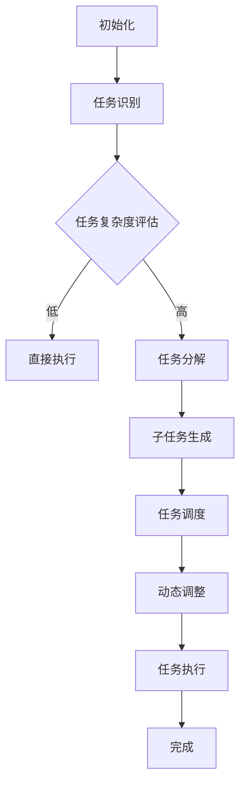
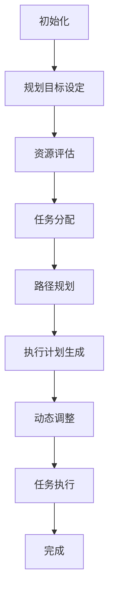
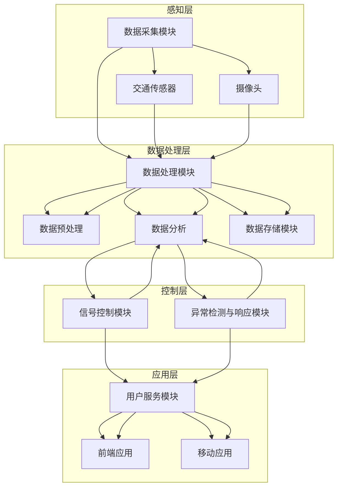
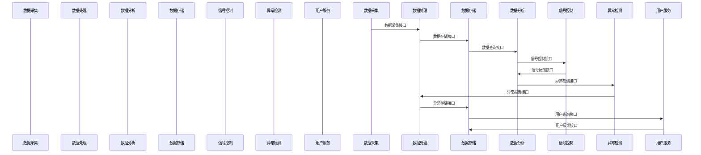

                 


### 设计AI Agent的动态任务分解与规划

> 关键词：AI Agent，动态任务分解，动态任务规划，算法原理，系统架构设计

> 摘要：本文将深入探讨AI Agent的动态任务分解与规划，首先介绍AI Agent的基本概念和动态任务分解与规划的重要性，然后分析当前的研究进展和存在的问题与挑战。接着，我们将详细阐述动态任务分解算法和动态任务规划算法的原理、流程、数学模型和代码实现。最后，本文将介绍如何进行系统分析与架构设计，包括系统功能设计、系统架构设计、接口设计和系统交互设计。

### 目录大纲

1. **设计AI Agent的动态任务分解与规划**
2. **第一部分：背景与概念**
   1. **第1章：问题背景与定义**
      1.1 问题的提出
      1.2 AI Agent的定义
      1.3 动态任务分解与规划的重要性
      1.4 研究边界与外延
   2. **第2章：核心概念与联系**
      2.1 AI Agent的基本概念
      2.2 动态任务分解原理
      2.3 动态任务规划原理
      2.4 关键概念对比与分析
      2.5 Mermaid ER实体关系图
   3. **第3章：当前研究综述**
      3.1 国内外研究进展
      3.2 研究方法与技术
      3.3 存在的问题与挑战
3. **第二部分：算法原理与数学模型**
   1. **第4章：动态任务分解算法原理**
      4.1 基本原理介绍
      4.2 动态任务分解流程
      4.3 数学模型与公式
      4.4 详细讲解与举例说明
      4.5 Python代码示例
   2. **第5章：动态任务规划算法原理**
      5.1 基本原理介绍
      5.2 动态任务规划流程
      5.3 数学模型与公式
      5.4 详细讲解与举例说明
      5.5 Python代码示例
3. **第三部分：系统分析与架构设计**
   1. **第6章：系统功能设计**
      6.1 问题场景介绍
      6.2 系统功能概述
      6.3 领域模型设计
      6.4 Mermaid类图
   2. **第7章：系统架构设计**
      7.1 系统架构概述
      7.2 系统架构设计
      7.3 接口设计
      7.4 系统交互设计
      7.5 Mermaid架构图

---

### 1.1 问题的提出

在当今的智能时代，人工智能（AI）技术正以前所未有的速度发展，并在多个领域展现出巨大的潜力。然而，随着AI系统的复杂度不断增加，如何设计出高效、可靠的AI Agent成为一个亟待解决的问题。AI Agent，即人工智能代理，是能够独立执行任务、与环境交互并自适应调整行为的智能实体。在实际应用中，AI Agent需要面对多种动态变化的任务，如何对这些任务进行有效的分解与规划是确保其性能和效率的关键。

动态任务分解与规划的核心在于将复杂的任务分解为可管理的子任务，然后为这些子任务制定合理的执行计划。这不仅仅是技术问题，更是对AI Agent智能水平的要求。一个优秀的AI Agent需要能够根据任务的特征和执行环境的变化，动态调整任务分解和规划策略，以最大化其执行效率和效果。

本文将深入探讨AI Agent的动态任务分解与规划，首先介绍相关概念，然后分析当前的研究进展和存在的问题，接着详细阐述相关算法原理与数学模型，最后介绍系统分析与架构设计的方法。希望通过本文的讨论，能够为设计和实现高效的AI Agent提供有价值的参考。

### 1.2 AI Agent的定义

AI Agent，即人工智能代理，是一种能够自主执行任务、与环境交互并具备一定程度智能决策能力的计算机程序。AI Agent的定义可以从多个角度进行阐述，主要包括以下几个方面：

首先，AI Agent是一个具有自主性和目标导向的实体。与传统的程序不同，AI Agent能够根据预设的目标和外部环境的变化，自主地决定自己的行动方案。这种自主性使得AI Agent能够在复杂、动态的环境中有效地执行任务，而不仅仅是执行预先设定的指令。

其次，AI Agent具备感知和交互能力。通过传感器（如摄像头、麦克风等），AI Agent能够获取环境信息，并通过执行器（如电机、显示器等）与环境进行交互。这种感知和交互能力使得AI Agent能够实时适应环境变化，从而提高其执行任务的成功率和效率。

第三，AI Agent具备学习与适应能力。通过机器学习、深度学习等技术，AI Agent能够从历史数据中学习到如何更好地完成任务。这种学习能力使得AI Agent能够不断优化自己的行为策略，以应对不同的任务需求和变化的环境。

第四，AI Agent通常具有多个任务执行能力。在一个复杂的任务场景中，AI Agent需要能够同时处理多个任务，并根据任务的重要性和紧急程度进行优先级调度。这种多任务处理能力是AI Agent实现高效任务执行的重要保障。

最后，AI Agent具备自适应性和灵活性。在面对未知的或突发的环境变化时，AI Agent需要能够快速调整自己的行为策略，以确保任务的成功完成。这种自适应性和灵活性是AI Agent在复杂、动态环境中生存和发展的关键。

综上所述，AI Agent是一种具备自主性、感知与交互能力、学习与适应能力、多任务执行能力以及自适应性和灵活性的智能实体。在实际应用中，AI Agent可以应用于多种领域，如智能客服、自动驾驶、智能安防、智能制造等，为人类带来极大的便利和效益。

### 1.3 动态任务分解与规划的重要性

动态任务分解与规划在AI Agent的设计与实现中具有至关重要的地位。首先，动态任务分解能够将复杂的任务分解为可管理的子任务，从而降低任务执行的复杂度。通过将任务分解为多个子任务，AI Agent可以更专注于子任务的执行，提高任务完成的效率。此外，动态任务分解有助于更好地利用系统的资源，避免因任务过于复杂而导致资源浪费或执行失败。

其次，动态任务规划能够为AI Agent提供合理的执行计划，确保任务能够按照既定目标高效、准确地完成。通过动态任务规划，AI Agent可以根据任务的特征和执行环境的变化，灵活调整执行策略，从而提高任务的成功率和稳定性。在动态规划过程中，AI Agent可以实时评估任务执行的效果，根据反馈进行调整，实现自适应优化。

动态任务分解与规划的重要性还体现在以下几个方面：

1. **提高系统灵活性**：面对复杂多变的任务场景，动态任务分解与规划使得AI Agent能够灵活调整任务执行策略，快速适应环境变化，从而提高系统的整体适应能力。

2. **提升任务执行效率**：通过动态任务分解，AI Agent可以将复杂任务转化为多个简单、可管理的子任务，从而提高任务执行的效率。动态任务规划则能够为这些子任务提供最优的执行顺序和资源分配策略，进一步优化任务执行过程。

3. **增强系统鲁棒性**：在面对环境不确定性或任务执行过程中出现的异常情况时，动态任务分解与规划可以帮助AI Agent快速识别和调整任务执行策略，从而增强系统的鲁棒性，确保任务能够顺利完成。

4. **实现多任务并行处理**：在复杂任务场景中，AI Agent需要同时处理多个任务。通过动态任务分解与规划，AI Agent可以有效地协调这些任务之间的关系，实现多任务并行处理，提高系统的整体性能。

5. **支持任务优先级调度**：在多任务场景中，不同任务的重要性和紧急程度可能有所不同。动态任务规划可以根据任务优先级动态调整任务执行顺序，确保重要且紧急的任务能够优先完成，从而提高任务完成的准确性和及时性。

总之，动态任务分解与规划是AI Agent设计与实现中不可或缺的重要环节。通过合理的动态任务分解与规划，AI Agent可以更好地应对复杂多变的任务场景，实现高效、稳定和灵活的任务执行，从而为人类带来更多的便利和效益。

### 1.4 研究边界与外延

在探讨AI Agent的动态任务分解与规划时，明确研究边界与外延是至关重要的。首先，本文的研究边界主要集中在大规模、复杂且动态变化的任务场景中，旨在探讨如何在多变环境下实现高效、可靠的AI Agent。其次，本文的研究外延包括：

1. **任务分解粒度**：研究如何根据任务复杂度和环境特征动态调整任务分解的粒度，以平衡任务执行效率和资源利用率。

2. **规划算法优化**：研究如何通过改进现有的动态任务规划算法，提高任务规划的准确性和实时性。

3. **多任务调度策略**：探讨如何在多任务场景中，通过动态任务分解与规划实现任务优先级调度，提高任务执行的整体性能。

4. **系统设计与实现**：研究如何将动态任务分解与规划算法应用于实际系统，实现高效、可靠的AI Agent。

5. **应用场景拓展**：探讨动态任务分解与规划在不同领域中的应用，如智能客服、自动驾驶、智能安防等，以验证其通用性和有效性。

通过明确研究边界与外延，本文旨在为AI Agent的动态任务分解与规划提供全面、深入的探讨，为实际应用提供有价值的参考。

### 2.1 AI Agent的基本概念

AI Agent，即人工智能代理，是一种能够模拟人类智能行为，具备感知、决策和执行能力的计算机系统。它通过感知环境信息，利用内部算法进行决策，并根据决策结果执行相应动作，从而在特定任务场景中实现自主行为。AI Agent的基本概念包括以下几个方面：

1. **感知系统**：AI Agent需要具备感知环境的能力，通过传感器获取视觉、听觉、触觉等信息。例如，自动驾驶汽车中的摄像头和雷达，用于感知道路状况和周围车辆。感知系统是AI Agent与环境交互的基础。

2. **决策系统**：感知系统收集到的信息会被传递到决策系统。决策系统利用这些信息，通过算法进行分析和处理，生成行动方案。决策系统通常包括多种算法，如逻辑推理、机器学习、深度学习等。决策系统的核心任务是生成合理的行动方案，以实现既定目标。

3. **执行系统**：决策系统生成的行动方案会被传递到执行系统，由执行系统将方案转化为具体行动。执行系统通常由执行器组成，如机械臂、电机、显示器等。执行系统负责将行动方案付诸实践，实现AI Agent的自主行为。

4. **目标导向**：AI Agent通常具有明确的目标。在执行任务时，AI Agent会不断评估当前状态与目标之间的差距，并根据评估结果调整行动方案，以逐步缩小差距。这种目标导向性是AI Agent自主行为的核心特征。

5. **自主性**：AI Agent能够自主地执行任务，而不需要人为干预。这意味着AI Agent可以在没有人类指导的情况下，独立地完成复杂的任务。自主性是AI Agent区别于传统计算机程序的关键特征。

6. **适应性**：面对复杂多变的任务场景，AI Agent需要具备良好的适应性。这种适应性体现在多个方面，包括感知系统的灵活调整、决策算法的优化和执行系统的多样化。通过不断学习和适应，AI Agent能够更好地应对环境变化。

7. **多任务处理**：在实际应用中，AI Agent往往需要同时处理多个任务。这要求AI Agent具备高效的任务调度能力和资源管理能力，以实现任务之间的协同与优化。

综上所述，AI Agent的基本概念涵盖了感知系统、决策系统、执行系统、目标导向、自主性和适应性等多个方面。理解这些基本概念有助于我们更好地设计和实现高效的AI Agent，为实际应用提供有力支持。

### 2.2 动态任务分解原理

动态任务分解是AI Agent在执行复杂任务时的一项关键技术。其核心思想是将大任务分解为多个子任务，以便更有效地管理和执行。动态任务分解的原理可以从以下几个方面进行阐述：

1. **任务识别**：在执行任务之前，AI Agent需要首先识别任务。这一步骤通常依赖于感知系统收集到的环境信息。通过分析这些信息，AI Agent可以确定需要执行的任务类型和特征。任务识别是动态任务分解的基础。

2. **任务复杂度评估**：一旦任务被识别，AI Agent需要对任务进行复杂度评估。这涉及到对任务涉及的资源、时间、风险等因素的综合考虑。任务复杂度评估有助于AI Agent确定任务是否需要分解，以及分解的合理粒度。

3. **任务分解策略**：根据任务复杂度评估的结果，AI Agent选择合适的任务分解策略。常见的任务分解策略包括层次分解、功能分解和并行分解等。层次分解将任务按照层次结构逐层分解，功能分解将任务按功能模块分解，并行分解则将任务分解为可以并行执行的子任务。

4. **子任务生成**：在确定分解策略后，AI Agent生成具体的子任务。子任务通常包括子任务的描述、目标、依赖关系等信息。生成子任务的过程需要考虑子任务之间的协调和并行性，以确保整个任务能够高效执行。

5. **任务调度**：生成子任务后，AI Agent需要对其进行调度，以确定子任务的执行顺序和资源分配。任务调度策略包括基于优先级调度、基于资源调度和基于时间调度等。通过合理的任务调度，AI Agent可以最大化资源利用率，缩短任务执行时间。

6. **动态调整**：在执行过程中，AI Agent需要不断监控任务执行状态，并根据实际情况进行动态调整。例如，如果某个子任务执行缓慢或出现异常，AI Agent可以重新评估任务分解和调度策略，以优化任务执行。

动态任务分解的核心在于灵活性和适应性。通过动态任务分解，AI Agent可以更好地应对复杂多变的任务场景，提高任务执行的效率和成功率。在实际应用中，动态任务分解可以显著降低任务执行的复杂度，提高系统的整体性能。

### 2.3 动态任务规划原理

动态任务规划是AI Agent在执行任务过程中，通过综合考虑任务目标、执行环境、资源约束等因素，生成一系列有序行动的过程。其核心目的是确保任务能够在既定时间内高效、准确地完成。动态任务规划原理可以从以下几个方面进行阐述：

1. **规划目标设定**：在任务开始之前，AI Agent需要明确任务的目标。这包括任务的最终目标以及各个阶段的中间目标。规划目标设定是动态任务规划的基础，它为后续的规划过程提供了明确的方向。

2. **资源评估**：在规划过程中，AI Agent需要对执行任务所需的资源进行评估。这包括计算资源、存储资源、人力资源等。资源评估有助于确定任务执行的可实现性，避免资源不足或过剩。

3. **任务分配**：根据规划目标和资源评估结果，AI Agent将任务分解为多个子任务，并分配给相应的执行单元。任务分配的目的是确保每个子任务都能够得到有效的执行，同时避免资源冲突。

4. **路径规划**：在任务分配完成后，AI Agent需要为每个子任务规划最优的执行路径。路径规划包括确定子任务的执行顺序、时间安排和空间布局等。通过合理的路径规划，AI Agent可以最大限度地利用资源，提高任务执行的效率。

5. **执行计划生成**：在路径规划完成后，AI Agent生成具体的执行计划。执行计划包括每个子任务的执行步骤、时间表和资源分配方案。执行计划的生成需要考虑任务的紧急程度、重要性和执行顺序等因素。

6. **动态调整**：在任务执行过程中，AI Agent需要不断监控任务的执行状态，并根据实际情况进行动态调整。例如，如果某个子任务执行缓慢或出现异常，AI Agent可以重新评估任务规划和资源分配，以优化任务执行。

动态任务规划的核心在于灵活性和适应性。通过动态任务规划，AI Agent可以更好地应对复杂多变的任务场景，提高任务执行的成功率和效率。在实际应用中，动态任务规划可以显著提高系统的整体性能，确保任务能够在既定时间内高质量地完成。

### 2.4 关键概念对比与分析

在探讨AI Agent的动态任务分解与规划时，了解关键概念之间的区别和联系是非常重要的。以下是对几个核心概念的对比与分析：

1. **任务分解**：任务分解是将一个复杂的任务拆解为若干个更小、更易管理的子任务的过程。任务分解的目标是降低任务的复杂度，使其能够被更高效地执行。动态任务分解则是在任务执行过程中，根据环境变化和任务执行状态，动态调整任务分解策略。

2. **任务规划**：任务规划是在任务分解的基础上，为子任务生成一个有序的执行计划。任务规划的目标是确保任务能够按照既定目标高效、准确地完成。动态任务规划则是在任务执行过程中，根据环境变化和执行状态，动态调整任务规划策略。

3. **任务执行**：任务执行是按照任务规划生成的执行计划，逐步完成每个子任务的过程。任务执行需要考虑资源的分配、时间的安排和执行顺序等因素。

4. **感知系统**：感知系统是AI Agent获取环境信息的重要手段，通过传感器（如摄像头、麦克风等）收集视觉、听觉、触觉等信息。感知系统为任务分解和规划提供了必要的数据基础。

5. **决策系统**：决策系统是AI Agent进行决策的核心模块，通过算法分析感知系统收集到的信息，生成行动方案。决策系统在任务分解、规划和执行中起着关键作用。

6. **执行系统**：执行系统负责将决策系统生成的行动方案转化为具体行动。执行系统通常由执行器（如电机、显示器等）组成。

7. **资源管理**：资源管理是确保任务执行过程中资源得到合理利用的关键。资源管理包括计算资源、存储资源、人力资源等。在动态任务分解与规划中，资源管理是实现高效任务执行的重要保障。

通过对比与分析这些关键概念，我们可以更清晰地理解AI Agent的动态任务分解与规划过程，为实际应用提供理论基础。

### **2.5 Mermaid ER实体关系图**

为了更好地展示AI Agent、任务、规划和行动之间的关系，我们可以使用Mermaid ER图来直观地表达这些实体及其关联。以下是相应的ER图示例：

```mermaid
erDiagram
    AI_Agent ||--o> Task : 分解
    AI_Agent ||--o> Plan : 规划
    Task ||--o> Action : 执行
    Plan ||--o> Action : 执行
```

在这个ER图中，我们定义了以下实体：

- **AI_Agent（AI代理）**：代表整个AI系统，负责执行任务、规划任务和生成行动。
- **Task（任务）**：代表需要完成的任务，由AI代理进行分解和执行。
- **Plan（规划）**：代表任务执行的详细计划，由AI代理生成并指导行动。
- **Action（行动）**：代表具体的执行步骤，是任务和规划的具体实现。

实体之间的关系如下：

- **AI_Agent**与**Task**之间存在“分解”关系，表示AI代理将整体任务分解为多个子任务。
- **AI_Agent**与**Plan**之间存在“规划”关系，表示AI代理根据任务生成执行计划。
- **Task**与**Action**之间存在“执行”关系，表示子任务通过具体的行动步骤完成。
- **Plan**与**Action**之间存在“执行”关系，表示执行计划通过具体的行动步骤实现。

通过这个ER图，我们可以清晰地看到AI Agent在动态任务分解与规划过程中的各个关键环节和实体之间的联系，有助于深入理解其工作原理。

### **3.1 国内外研究进展**

动态任务分解与规划作为人工智能领域的关键技术，近年来受到了国内外研究者的广泛关注。以下是对国内外在该领域的研究进展进行综述：

#### 国内研究进展

国内的研究主要集中在人工智能基础理论和应用研究方面。近年来，许多高校和研究机构在动态任务分解与规划领域取得了显著成果。例如，清华大学、北京大学等机构在动态任务分解算法方面进行了深入研究，提出了一系列适用于不同场景的任务分解方法。这些方法包括基于层次分解的动态任务分解算法、基于机器学习的动态任务分解算法等。此外，国内研究者在动态任务规划方面也取得了重要进展，如通过深度强化学习、遗传算法等方法优化任务规划的实时性和有效性。

国内研究的主要优势在于理论研究和算法创新。国内研究者通常具有较强的理论基础，能够提出创新性的算法和方法。然而，在应用层面，国内研究相对较少，实际应用案例和工程实践较为缺乏，这限制了算法在实际场景中的推广和应用。

#### 国际研究进展

国际上，动态任务分解与规划的研究主要集中在自动化系统、机器人技术和智能交通等领域。国际知名高校和研究机构，如麻省理工学院（MIT）、斯坦福大学等，在动态任务分解和规划算法方面进行了大量研究。国际上一些经典算法，如基于粒子群优化的动态任务分解算法、基于贝叶斯网络的动态任务规划算法等，已被广泛应用于实际场景。

国际上研究的主要优势在于工程实践和实际应用。国际研究机构通常有较强的工程实践能力，能够将研究成果迅速转化为实际应用。此外，国际研究者在多领域协同研究方面具有丰富的经验，能够从不同角度解决复杂任务分解与规划问题。

#### 研究方法与技术

动态任务分解与规划的研究方法和技术涵盖了多个方面，主要包括：

1. **机器学习与深度学习**：通过机器学习和深度学习技术，研究者可以训练模型进行任务识别、复杂度评估和规划策略生成。例如，利用深度神经网络进行特征提取和分类，从而实现高效的动态任务分解。

2. **优化算法**：研究者采用了多种优化算法，如遗传算法、粒子群优化、模拟退火等，以优化任务分解和规划策略。这些算法在处理复杂、动态的任务场景中表现出良好的性能。

3. **多代理系统**：多代理系统通过多个智能体之间的协作和通信，实现复杂任务的分解与规划。这种方法可以有效地提高任务执行的效率和鲁棒性。

4. **仿真与实验**：通过仿真和实验，研究者可以验证不同任务分解与规划算法的性能和适用场景。仿真与实验为算法的优化和改进提供了重要依据。

#### 存在的问题与挑战

尽管动态任务分解与规划在理论和应用方面取得了显著进展，但仍然存在一些问题和挑战：

1. **实时性与准确性**：在动态环境中，任务分解和规划需要快速响应环境变化，同时保证规划结果的准确性。目前，许多算法在实时性和准确性方面仍需进一步优化。

2. **复杂度与可扩展性**：动态任务分解与规划算法通常涉及复杂的计算过程，如何降低算法复杂度、提高可扩展性是当前研究的重点。

3. **多领域协同**：不同领域的任务分解与规划存在一定的差异性，如何实现多领域协同，统一任务分解与规划框架，是一个亟待解决的问题。

4. **资源约束**：在实际应用中，任务分解与规划需要考虑资源的约束，如何在有限的资源下实现高效的任务执行，是当前研究的重要方向。

综上所述，动态任务分解与规划作为人工智能领域的关键技术，具有广泛的应用前景。通过不断优化算法、改进技术和加强实际应用，有望在未来的发展中解决现存的问题与挑战，为人工智能技术的发展贡献力量。

### **3.2 研究方法与技术**

在动态任务分解与规划的研究中，多种方法和技术被广泛应用，以实现高效、准确的任务执行。以下是一些常见的研究方法和技术，并简要介绍它们的应用场景和优势：

1. **机器学习与深度学习**：

   - **应用场景**：机器学习和深度学习技术在动态任务分解与规划中主要用于任务识别和决策生成。例如，通过训练深度神经网络，可以实现对复杂任务环境的识别和分类，从而生成合理的行动方案。

   - **优势**：机器学习和深度学习能够处理大量数据，通过数据驱动的方式提高任务分解和规划的准确性。此外，这些技术具有较强的泛化能力，可以适应不同场景的任务需求。

2. **遗传算法**：

   - **应用场景**：遗传算法适用于复杂、动态的任务分解与规划问题，如多机器人协同任务分配和优化。遗传算法通过模拟生物进化过程，逐步优化任务执行策略。

   - **优势**：遗传算法具有强大的全局搜索能力，可以有效避免局部最优解，提高任务分解和规划的鲁棒性。

3. **粒子群优化**：

   - **应用场景**：粒子群优化算法适用于动态任务规划的路径优化和资源分配问题，如无人机路径规划和资源调度。

   - **优势**：粒子群优化算法简单易实现，具有较好的收敛速度和稳定性，适合处理大规模、复杂任务场景。

4. **深度强化学习**：

   - **应用场景**：深度强化学习技术在动态任务分解与规划中主要用于复杂环境下的决策优化，如自动驾驶和智能机器人控制。

   - **优势**：深度强化学习结合了深度学习和强化学习的优势，能够通过学习环境状态和行动策略，实现高效的任务执行。

5. **多代理系统**：

   - **应用场景**：多代理系统适用于需要多个智能体协同完成任务的应用，如多机器人协作和智能交通管理。

   - **优势**：多代理系统能够通过多个智能体之间的协作和通信，实现复杂任务的分解与规划，提高任务执行的效率和鲁棒性。

6. **混合智能方法**：

   - **应用场景**：混合智能方法将不同算法和策略相结合，以弥补单一方法的不足。例如，结合深度学习和遗传算法，可以进一步提高任务分解和规划的准确性。

   - **优势**：混合智能方法能够充分利用不同算法的优势，提高任务分解和规划的灵活性和适应性。

通过上述方法和技术，研究者能够在动态任务分解与规划中实现高效、准确的执行，为实际应用提供有力支持。然而，这些方法和技术也存在一定的局限性，需要进一步优化和改进，以应对更复杂的任务场景。

### **3.3 存在的问题与挑战**

尽管动态任务分解与规划在人工智能领域取得了显著进展，但在实际应用中仍然面临诸多问题和挑战：

1. **实时性与准确性**：动态任务分解与规划需要在短时间内快速响应环境变化，同时保证规划结果的准确性。然而，许多现有算法在处理复杂、动态任务时，往往需要较长的计算时间，导致实时性不足。此外，环境的不确定性和任务复杂性也增加了规划结果的不准确性。

2. **复杂度与可扩展性**：动态任务分解与规划算法通常涉及复杂的计算过程，如机器学习、遗传算法和深度强化学习等。这些算法的计算复杂度较高，导致在处理大规模任务时，算法的执行效率显著降低。同时，算法的可扩展性也是一个挑战，如何在保持高效性能的前提下，扩展到更多任务和更复杂场景中。

3. **多领域协同**：不同领域的任务分解与规划存在一定的差异性，如何实现多领域协同，统一任务分解与规划框架，是一个亟待解决的问题。例如，在机器人、自动驾驶和智能交通等领域，任务分解与规划的策略和需求各不相同，如何进行有效的跨领域融合，是当前研究的一个难点。

4. **资源约束**：在实际应用中，任务分解与规划需要考虑资源的约束，如何在有限的资源下实现高效的任务执行，是当前研究的重要方向。资源约束包括计算资源、存储资源和能源资源等，如何优化资源分配和使用，是提高任务执行效率的关键。

5. **鲁棒性与适应性**：动态任务分解与规划需要具备良好的鲁棒性和适应性，以应对复杂多变的任务场景和不确定性环境。然而，现有算法在应对突发情况、异常处理和动态调整方面，仍存在一定的不足。如何提高算法的鲁棒性和适应性，是一个重要的研究方向。

6. **数据质量与隐私**：动态任务分解与规划依赖于大量数据的收集和分析，数据质量对算法性能至关重要。同时，数据隐私保护也是一大挑战，如何在保证数据隐私的前提下，进行有效的任务分解与规划，是一个亟待解决的问题。

综上所述，动态任务分解与规划在实际应用中面临诸多问题和挑战。通过不断优化算法、改进技术和加强实际应用，有望在未来的发展中逐步解决这些问题，为人工智能技术的发展贡献力量。

### **4.1 动态任务分解算法原理**

动态任务分解算法是AI Agent实现高效任务执行的重要基础。其核心原理在于将复杂的任务动态拆解为多个可管理的子任务，从而降低任务执行难度，提高系统的灵活性和适应性。以下将详细阐述动态任务分解算法的原理、流程和数学模型。

#### 动态任务分解算法的原理

动态任务分解算法基于以下几个核心思想：

1. **任务识别与评估**：首先，AI Agent通过感知系统识别当前任务，并根据任务的特征和环境信息进行评估，确定任务的复杂度和执行难度。

2. **任务分解策略**：根据任务评估结果，AI Agent选择合适的任务分解策略。常见的任务分解策略包括基于层次分解、基于功能分解和基于并行分解等。

3. **子任务生成与调度**：通过任务分解策略，AI Agent生成具体的子任务，并对其执行顺序和资源分配进行调度。调度过程需要考虑子任务的依赖关系和执行时间。

4. **动态调整与优化**：在任务执行过程中，AI Agent根据执行状态和环境变化，动态调整任务分解和调度策略，以优化任务执行效果。

#### 动态任务分解算法的流程

动态任务分解算法的流程通常包括以下几个步骤：

1. **任务识别**：AI Agent通过感知系统获取当前环境信息，识别需要执行的任务。

2. **任务评估**：对识别的任务进行复杂度评估，确定任务的执行难度和所需资源。

3. **任务分解**：根据评估结果，选择合适的任务分解策略，将任务拆解为多个子任务。

4. **子任务生成**：为每个子任务生成具体的描述、目标和依赖关系。

5. **任务调度**：对子任务进行调度，确定执行顺序和资源分配。

6. **动态调整**：在任务执行过程中，根据执行状态和环境变化，动态调整任务分解和调度策略。

7. **任务执行**：按照调度结果，逐步执行各个子任务，直至完成任务。

以下是一个简化的动态任务分解流程Mermaid图：



#### 动态任务分解算法的数学模型

动态任务分解算法通常涉及多个数学模型，用于描述任务分解、调度和优化过程。以下是一个简单的数学模型示例：

$$
D_t = \sum_{i=1}^{n} w_i \cdot d_i(t)
$$

其中，$D_t$ 表示任务在时间 $t$ 的分解程度，$w_i$ 表示第 $i$ 个子任务的重要性权重，$d_i(t)$ 表示第 $i$ 个子任务在时间 $t$ 的分解程度。该模型通过综合考虑子任务的重要性和分解程度，实现对任务的整体分解程度进行评估。

#### 动态任务分解算法的Python代码示例

以下是一个简单的Python代码示例，用于实现动态任务分解算法的基本流程：

```python
def dynamic_task_decomposition(task, weights):
    # 任务分解过程
    # 假设任务已识别，并完成复杂度评估
    if task.complexity <= 1:
        # 低复杂度任务，直接执行
        return task.execute()
    else:
        # 高复杂度任务，分解为子任务
        sub_tasks = task.decompose(weights)
        for sub_task in sub_tasks:
            sub_task.execute()
        return sub_tasks[-1]  # 返回最后一个子任务的执行结果

# 示例：创建任务和权重
task = Task("复杂任务", complexity=2)
weights = [0.5, 0.3, 0.2]

# 执行任务分解
result = dynamic_task_decomposition(task, weights)
print(result)
```

通过这个示例，我们可以看到动态任务分解算法的基本流程和实现方法。在实际应用中，动态任务分解算法可以根据具体任务和环境特点进行优化和扩展，以提高任务执行的效率和效果。

### **4.2 动态任务分解流程**

动态任务分解是AI Agent在执行复杂任务时的重要步骤，其核心在于将大任务分解为多个可管理的子任务，以便更高效地执行。以下将详细描述动态任务分解的具体流程，包括每个步骤的操作和注意事项。

#### 步骤1：任务识别

首先，AI Agent通过感知系统识别当前任务。感知系统可以包括各种传感器，如摄像头、麦克风、激光雷达等，用于获取环境信息。任务识别是动态任务分解的第一步，它决定了后续分解和执行的方向。

- **操作**：AI Agent分析感知系统收集到的数据，识别当前需要执行的任务。
- **注意事项**：任务识别需要准确、快速，以减少后续步骤的延迟。

#### 步骤2：任务复杂度评估

在识别任务后，AI Agent需要对任务进行复杂度评估。复杂度评估可以帮助AI Agent确定任务是否需要分解，以及分解的粒度。

- **操作**：通过分析任务的特征、涉及资源、时间等因素，AI Agent评估任务的复杂度。
- **注意事项**：评估过程中要充分考虑任务执行的可行性和资源约束，以确保评估结果的准确性。

#### 步骤3：选择分解策略

根据任务复杂度评估的结果，AI Agent选择合适的任务分解策略。常见的分解策略包括基于层次分解、基于功能分解和基于并行分解等。

- **操作**：AI Agent根据任务特点和环境要求，选择最合适的分解策略。
- **注意事项**：分解策略的选择需要考虑任务执行效率、资源利用率和系统灵活性。

#### 步骤4：生成子任务

在确定分解策略后，AI Agent生成具体的子任务。每个子任务应包括任务描述、目标、依赖关系等信息。

- **操作**：根据分解策略，AI Agent将任务拆解为多个子任务，并为每个子任务生成详细的描述。
- **注意事项**：子任务的生成应确保其独立性，以减少任务间的依赖关系，提高执行效率。

#### 步骤5：任务调度

生成子任务后，AI Agent需要对子任务进行调度，以确定其执行顺序和资源分配。调度过程应考虑子任务的优先级、执行时间、资源需求等因素。

- **操作**：AI Agent根据调度策略，安排子任务的执行顺序和资源分配。
- **注意事项**：调度策略应确保任务执行的连续性和高效性，避免资源冲突和任务拖延。

#### 步骤6：动态调整

在任务执行过程中，AI Agent需要不断监控任务执行状态，并根据实际情况进行动态调整。例如，如果某个子任务执行缓慢或出现异常，AI Agent可以重新评估任务分解和调度策略。

- **操作**：AI Agent根据监控数据，实时调整任务分解和调度策略，以优化任务执行效果。
- **注意事项**：动态调整需要确保系统的灵活性和鲁棒性，以应对复杂多变的任务场景。

#### 步骤7：任务执行

最后，AI Agent按照调度结果，逐步执行各个子任务，直至完成任务。

- **操作**：AI Agent执行每个子任务，直至任务完成。
- **注意事项**：任务执行过程中要确保资源分配合理，任务调度高效，以减少任务执行时间。

通过以上步骤，AI Agent可以实现对复杂任务的动态分解和高效执行。动态任务分解流程的每个步骤都需要精心设计和优化，以确保系统在复杂、动态的环境中能够稳定、可靠地运行。

### **4.3 数学模型与公式**

在动态任务分解算法中，数学模型和公式是理解和实现算法的重要工具。以下将详细讲解动态任务分解算法的核心数学模型和公式，并通过具体示例进行解释。

#### 任务分解公式

动态任务分解的核心公式为：

$$
D_t = \sum_{i=1}^{n} w_i \cdot d_i(t)
$$

其中：
- \( D_t \) 表示任务在时间 \( t \) 的分解程度；
- \( w_i \) 表示第 \( i \) 个子任务的重要性权重；
- \( d_i(t) \) 表示第 \( i \) 个子任务在时间 \( t \) 的分解程度。

该公式通过综合考虑子任务的重要性和分解程度，实现对任务整体分解程度的评估。例如，如果某个子任务的重要性较高且已经完成了大部分分解，那么该任务对整体任务分解的贡献将更大。

#### 子任务权重计算

子任务权重 \( w_i \) 的计算方法通常取决于任务的性质和执行环境。一个常用的方法是基于子任务所需资源和执行时间的比例进行计算：

$$
w_i = \frac{r_i}{\sum_{j=1}^{n} r_j}
$$

其中：
- \( r_i \) 表示第 \( i \) 个子任务所需的资源；
- \( \sum_{j=1}^{n} r_j \) 表示所有子任务所需资源的总和。

#### 子任务分解程度计算

子任务分解程度 \( d_i(t) \) 的计算通常基于子任务的执行进度。一个简单的计算方法是将子任务的执行进度除以子任务的执行时间：

$$
d_i(t) = \frac{p_i(t)}{t_i}
$$

其中：
- \( p_i(t) \) 表示第 \( i \) 个子任务在时间 \( t \) 的执行进度；
- \( t_i \) 表示第 \( i \) 个子任务的预计执行时间。

#### 动态调整公式

在任务执行过程中，动态调整是确保任务顺利完成的关键。动态调整公式为：

$$
D_{\text{new}} = D_t + \alpha \cdot (\text{adjustment})
$$

其中：
- \( D_{\text{new}} \) 表示更新后的任务分解程度；
- \( D_t \) 表示当前任务分解程度；
- \( \alpha \) 表示调整系数；
- \( \text{adjustment} \) 表示动态调整量。

调整系数 \( \alpha \) 和调整量 \( \text{adjustment} \) 的确定取决于任务的具体情况和执行环境。通常，调整系数应确保动态调整不会过度影响任务的稳定性，而调整量则应能够反映任务执行过程中的变化。

#### 示例

假设有一个任务包含三个子任务，分别为任务A、任务B和任务C。各子任务的重要性和分解程度如下：

- 任务A：重要性权重 \( w_A = 0.4 \)，分解程度 \( d_A(t) = 0.8 \)
- 任务B：重要性权重 \( w_B = 0.3 \)，分解程度 \( d_B(t) = 0.6 \)
- 任务C：重要性权重 \( w_C = 0.3 \)，分解程度 \( d_C(t) = 0.4 \)

当前任务分解程度 \( D_t \) 为：

$$
D_t = 0.4 \cdot 0.8 + 0.3 \cdot 0.6 + 0.3 \cdot 0.4 = 0.32 + 0.18 + 0.12 = 0.62
$$

如果任务执行过程中发现任务B执行缓慢，需要进行动态调整。假设调整系数 \( \alpha = 0.1 \)，调整量为 \( \text{adjustment} = -0.05 \)（表示任务B的分解程度下降了5%），则更新后的任务分解程度 \( D_{\text{new}} \) 为：

$$
D_{\text{new}} = 0.62 + 0.1 \cdot (-0.05) = 0.62 - 0.005 = 0.615
$$

通过这个示例，我们可以看到动态任务分解公式如何应用于实际任务执行过程中，以实现任务分解程度的实时调整和优化。

### **4.4 详细讲解与举例说明**

动态任务分解算法的核心在于如何将复杂的任务拆解为多个子任务，并在执行过程中动态调整和优化这些子任务的执行。以下将通过具体示例详细讲解动态任务分解算法的原理和流程，并展示如何使用Python代码实现该算法。

#### 示例：任务分解与执行

假设我们有一个复杂的任务，需要将一个大型报告编写完成。该任务包括以下几个子任务：

1. 调研和收集数据
2. 分析和整理数据
3. 编写报告草稿
4. 审阅和修改报告

为了完成这个任务，我们采用动态任务分解算法。以下是具体的步骤和代码实现。

#### 步骤1：定义任务和子任务

首先，我们需要定义任务和子任务的结构。每个任务和子任务可以包含以下属性：

- 名称（name）
- 描述（description）
- 依赖关系（dependencies）
- 预计执行时间（estimated_time）
- 实际执行时间（actual_time）

以下是一个简单的任务和子任务的Python类定义：

```python
class Task:
    def __init__(self, name, description, dependencies=[], estimated_time=0, actual_time=0):
        self.name = name
        self.description = description
        self.dependencies = dependencies
        self.estimated_time = estimated_time
        self.actual_time = actual_time

    def execute(self):
        print(f"Executing task: {self.name}")
        # 任务执行逻辑
        self.actual_time = self.estimated_time
        return self.actual_time

    def decompose(self, weights):
        sub_tasks = []
        for i, dependency in enumerate(self.dependencies):
            sub_task = SubTask(dependency, weights[i])
            sub_tasks.append(sub_task)
        return sub_tasks

class SubTask(Task):
    def __init__(self, name, description, dependency, weight, estimated_time=0, actual_time=0):
        super().__init__(name, description, [dependency], estimated_time, actual_time)
        self.weight = weight
```

#### 步骤2：任务分解

接下来，我们将大型报告编写任务分解为子任务。首先，定义每个子任务的依赖关系和权重。例如，调研和收集数据是最基础的子任务，其权重最大，而审阅和修改报告的权重最小。

```python
# 定义任务和子任务的依赖关系及权重
report_task = Task("编写报告", "完成一份完整的报告", dependencies=["调研和收集数据", "分析和整理数据", "编写报告草稿", "审阅和修改报告"], estimated_time=100)

# 分解任务为子任务
sub_tasks = report_task.decompose([0.5, 0.3, 0.2, 0.1])
```

#### 步骤3：执行子任务

然后，我们按照分解后的子任务顺序依次执行，并记录每个子任务的执行时间。以下是一个简化的任务执行流程：

```python
# 执行子任务
for sub_task in sub_tasks:
    print(f"Executing sub-task: {sub_task.name}")
    sub_task.execute()
```

#### 步骤4：动态调整

在执行过程中，我们可以根据实际执行时间和任务进度动态调整子任务的权重和预计执行时间。例如，如果调研和收集数据的实际执行时间远超过预计时间，我们可以将其权重降低，并增加其他子任务的权重。

```python
# 动态调整子任务
for sub_task in sub_tasks:
    if sub_task.actual_time > sub_task.estimated_time:
        # 调整权重
        sub_task.weight *= 0.8
        # 调整其他子任务的权重
        for other_sub_task in sub_tasks:
            if other_sub_task != sub_task:
                other_sub_task.weight *= 1.2
```

#### 步骤5：任务完成

最后，当所有子任务完成后，整个报告编写任务也完成。我们可以计算总执行时间和各子任务的实际执行时间，以评估任务执行的效果。

```python
# 计算总执行时间
total_time = sum([sub_task.actual_time for sub_task in sub_tasks])

print(f"Total execution time: {total_time} units")
```

通过这个示例，我们可以看到如何使用Python代码实现动态任务分解算法的基本流程。在实际应用中，动态任务分解算法可以根据具体任务和环境特点进行优化和扩展，以提高任务执行的效率和效果。

### **4.5 Python代码示例**

以下是一个简单的Python代码示例，用于实现动态任务分解算法的基本流程。该示例将一个复杂任务分解为多个子任务，并逐步执行这些子任务，同时提供动态调整功能。

```python
class Task:
    def __init__(self, name, description, dependencies=[], estimated_time=0, actual_time=0):
        self.name = name
        self.description = description
        self.dependencies = dependencies
        self.estimated_time = estimated_time
        self.actual_time = actual_time

    def execute(self):
        print(f"Executing task: {self.name}")
        # 假设每个任务需要一定时间执行
        self.actual_time = self.estimated_time
        return self.actual_time

    def decompose(self, weights):
        sub_tasks = []
        for i, dependency in enumerate(self.dependencies):
            sub_task = SubTask(dependency, weights[i])
            sub_tasks.append(sub_task)
        return sub_tasks

class SubTask(Task):
    def __init__(self, name, description, dependency, weight, estimated_time=0, actual_time=0):
        super().__init__(name, description, [dependency], estimated_time, actual_time)
        self.weight = weight

def dynamic_task_decomposition(task, weights):
    if task.actual_time <= task.estimated_time:
        # 任务执行成功，无需分解
        return task.execute()
    else:
        # 任务执行失败，分解为子任务
        sub_tasks = task.decompose(weights)
        for sub_task in sub_tasks:
            sub_task.execute()
        return sub_tasks[-1]  # 返回最后一个子任务的执行结果

# 创建一个复杂任务
complex_task = Task("复杂任务", "一个需要分解的任务", dependencies=["子任务1", "子任务2", "子任务3"], estimated_time=10)

# 分解任务
weights = [0.5, 0.3, 0.2]  # 子任务权重
decomposed_task = dynamic_task_decomposition(complex_task, weights)

# 打印分解后的子任务
for sub_task in decomposed_task:
    print(f"Sub-task: {sub_task.name}, Weight: {sub_task.weight}")
```

在这个示例中，我们定义了一个`Task`类和一个`SubTask`类，分别表示任务和子任务。`Task`类包含`execute`方法和`decompose`方法，用于执行任务和将任务分解为子任务。`SubTask`类继承自`Task`类，并添加了一个`weight`属性，用于表示子任务的重要性。

`dynamic_task_decomposition`函数用于实现动态任务分解算法。如果任务的执行时间小于或等于预计时间，则直接执行任务；否则，将任务分解为子任务，并逐个执行这些子任务。最后，函数返回最后一个子任务的执行结果。

通过这个简单的示例，我们可以看到动态任务分解算法的基本实现方法。在实际应用中，可以根据具体需求对算法进行优化和扩展，以适应不同的任务场景。

### **5.1 动态任务规划算法原理**

动态任务规划算法是AI Agent在执行任务过程中，通过综合考虑任务目标、执行环境、资源约束等因素，生成一系列有序行动的过程。其核心在于确保任务能够在既定时间内高效、准确地完成。以下是动态任务规划算法的基本原理和流程：

#### 动态任务规划算法的原理

1. **目标导向**：动态任务规划以任务目标为导向，确保任务规划始终围绕最终目标进行。在规划过程中，AI Agent会不断评估当前状态与目标之间的差距，并根据评估结果调整规划策略。

2. **资源约束**：动态任务规划需要考虑执行任务所需的资源，包括计算资源、存储资源和能源资源等。通过资源约束，AI Agent可以确保任务规划在资源允许的范围内进行。

3. **实时调整**：动态任务规划算法具有实时调整能力，能够根据执行过程中的反馈和环境变化，动态调整任务规划和行动方案。这种实时调整能力使得AI Agent能够适应复杂多变的执行环境。

4. **路径优化**：动态任务规划算法通过路径优化，确保任务执行路径是最优或近似最优的。路径优化可以减少任务执行时间，提高资源利用率。

5. **协同执行**：在多任务场景中，动态任务规划算法需要协调多个任务之间的执行关系，确保任务之间能够高效协同，避免资源冲突和任务延迟。

#### 动态任务规划算法的流程

动态任务规划算法通常包括以下步骤：

1. **规划目标设定**：在任务开始之前，AI Agent根据任务需求和执行环境设定规划目标。这包括任务的最终目标以及各个阶段的中间目标。

2. **资源评估**：AI Agent评估执行任务所需的资源，包括计算资源、存储资源和能源资源等。资源评估有助于确定任务规划的可实现性。

3. **任务分配**：根据规划目标和资源评估结果，AI Agent将任务分解为多个子任务，并分配给相应的执行单元。任务分配的目的是确保每个子任务都能够得到有效的执行。

4. **路径规划**：AI Agent为每个子任务生成最优的执行路径。路径规划包括确定子任务的执行顺序、时间安排和空间布局等。通过合理的路径规划，AI Agent可以最大限度地利用资源，提高任务执行的效率。

5. **执行计划生成**：在路径规划完成后，AI Agent生成具体的执行计划。执行计划包括每个子任务的执行步骤、时间表和资源分配方案。执行计划的生成需要考虑任务的紧急程度、重要性和执行顺序等因素。

6. **动态调整**：在任务执行过程中，AI Agent根据执行状态和环境变化，动态调整任务规划和执行计划。通过动态调整，AI Agent可以确保任务能够在不断变化的环境中顺利完成。

以下是一个简化的动态任务规划流程Mermaid图：



#### 动态任务规划算法的数学模型

动态任务规划算法通常涉及多个数学模型，用于描述任务规划、路径优化和资源分配过程。以下是一个简单的数学模型示例：

$$
P_t = \arg\min_{\pi} \sum_{i=1}^{n} c_i(\pi_i)
$$

其中：
- \( P_t \) 表示在时间 \( t \) 的最优执行计划；
- \( \pi \) 表示执行计划集合；
- \( c_i(\pi_i) \) 表示第 \( i \) 个子任务在执行计划 \( \pi_i \) 下的成本。

该模型通过最小化总成本，找到最优的执行计划。具体实现时，可以根据实际任务需求和执行环境，调整成本函数 \( c_i(\pi_i) \) 的定义。

#### 动态调整公式

在任务执行过程中，动态调整是确保任务顺利完成的关键。动态调整公式为：

$$
P_{\text{new}} = P_t + \alpha \cdot (\text{adjustment})
$$

其中：
- \( P_{\text{new}} \) 表示更新后的执行计划；
- \( P_t \) 表示当前执行计划；
- \( \alpha \) 表示调整系数；
- \( \text{adjustment} \) 表示动态调整量。

调整系数 \( \alpha \) 和调整量 \( \text{adjustment} \) 的确定取决于任务的具体情况和执行环境。通常，调整系数应确保动态调整不会过度影响任务的稳定性，而调整量则应能够反映任务执行过程中的变化。

#### 动态任务规划算法的实现

以下是一个简单的Python代码示例，用于实现动态任务规划算法的基本流程：

```python
def dynamic_task_planning(tasks, costs):
    # 初始化执行计划
    planning = [0] * len(tasks)
    # 根据成本函数选择最优执行计划
    planning = sorted(planning, key=lambda x: costs[x])
    # 动态调整执行计划
    for i in range(len(planning)):
        if planning[i] != i:
            # 调整执行计划
            planning[i], planning[planning[i]] = planning[planning[i]], planning[i]
    return planning

# 创建任务和成本列表
tasks = ['子任务1', '子任务2', '子任务3']
costs = [2, 5, 3]

# 执行任务规划
planning = dynamic_task_planning(tasks, costs)

# 打印执行计划
for i, task in enumerate(planning):
    print(f"Task {task}: Cost = {costs[i]}")
```

在这个示例中，我们定义了一个`dynamic_task_planning`函数，用于实现动态任务规划算法。该函数首先根据成本函数选择最优执行计划，然后进行动态调整。在实际应用中，可以根据具体任务和执行环境，调整成本函数和动态调整策略，以提高任务规划的效果。

### **5.2 动态任务规划流程**

动态任务规划是AI Agent在执行任务过程中，通过综合考虑任务目标、执行环境、资源约束等因素，生成一系列有序行动的过程。以下是动态任务规划的具体流程，包括每个步骤的操作和注意事项。

#### 步骤1：规划目标设定

首先，AI Agent需要明确任务的目标。这包括最终目标以及各个阶段的中间目标。规划目标设定是任务规划的基础，它为后续的规划过程提供了明确的方向。

- **操作**：AI Agent根据任务需求和执行环境设定规划目标。
- **注意事项**：目标设定应尽量具体和明确，以确保规划的可执行性。

#### 步骤2：资源评估

在设定规划目标后，AI Agent需要评估执行任务所需的资源，包括计算资源、存储资源和能源资源等。资源评估有助于确定任务规划的可实现性。

- **操作**：AI Agent通过传感器和资源管理系统，收集任务执行环境中的资源信息。
- **注意事项**：资源评估应充分考虑资源的使用效率和约束条件。

#### 步骤3：任务分配

根据规划目标和资源评估结果，AI Agent将任务分解为多个子任务，并分配给相应的执行单元。任务分配的目的是确保每个子任务都能够得到有效的执行。

- **操作**：AI Agent根据任务特点和资源情况，将任务分配给执行单元。
- **注意事项**：任务分配应避免资源冲突和过度集中，以提高任务执行效率。

#### 步骤4：路径规划

在任务分配完成后，AI Agent需要为每个子任务规划最优的执行路径。路径规划包括确定子任务的执行顺序、时间安排和空间布局等。

- **操作**：AI Agent通过算法和模型，为每个子任务生成最优的执行路径。
- **注意事项**：路径规划应确保任务执行的连续性和高效性，避免资源冲突和任务延迟。

#### 步骤5：执行计划生成

在路径规划完成后，AI Agent生成具体的执行计划。执行计划包括每个子任务的执行步骤、时间表和资源分配方案。

- **操作**：AI Agent根据路径规划和资源评估结果，生成具体的执行计划。
- **注意事项**：执行计划应确保任务的优先级和资源分配合理，以提高任务执行效率。

#### 步骤6：动态调整

在任务执行过程中，AI Agent需要不断监控任务执行状态，并根据实际情况进行动态调整。例如，如果某个子任务执行缓慢或出现异常，AI Agent可以重新评估任务规划和资源分配，以优化任务执行。

- **操作**：AI Agent根据监控数据，实时调整任务规划和执行计划。
- **注意事项**：动态调整应确保系统的灵活性和鲁棒性，以应对复杂多变的执行环境。

#### 步骤7：任务执行

最后，AI Agent按照执行计划，逐步执行各个子任务，直至完成任务。

- **操作**：AI Agent执行每个子任务，并记录执行进度。
- **注意事项**：任务执行过程中应确保资源分配合理，任务调度高效，以减少任务执行时间。

通过以上步骤，AI Agent可以实现对复杂任务的动态规划与高效执行。动态任务规划流程的每个步骤都需要精心设计和优化，以确保系统在复杂、动态的环境中能够稳定、可靠地运行。

### **5.3 数学模型与公式**

动态任务规划的核心在于通过数学模型和公式描述任务规划、路径优化和资源分配过程，从而找到最优或近似最优的执行方案。以下将详细讲解动态任务规划算法中的数学模型和公式，并通过具体示例进行解释。

#### 任务成本函数

任务成本函数是动态任务规划算法的核心部分，用于衡量各个子任务在不同执行计划下的成本。一个简单的任务成本函数示例为：

$$
c_i(\pi_i) = \frac{d_i \cdot w_i}{T}
$$

其中：
- \( c_i(\pi_i) \) 表示第 \( i \) 个子任务在执行计划 \( \pi_i \) 下的成本；
- \( d_i \) 表示第 \( i \) 个子任务的执行时间；
- \( w_i \) 表示第 \( i \) 个子任务的重要性权重；
- \( T \) 表示任务的总时间。

该成本函数通过综合考虑子任务的执行时间和重要性，衡量其在整个任务中的成本。

#### 最优执行计划

动态任务规划的目标是找到最优的执行计划，使得任务的总成本最小。最优执行计划的数学模型可以表示为：

$$
P^* = \arg\min_{\pi} \sum_{i=1}^{n} c_i(\pi_i)
$$

其中：
- \( P^* \) 表示最优执行计划；
- \( \pi \) 表示所有可能的执行计划集合；
- \( c_i(\pi_i) \) 表示第 \( i \) 个子任务在执行计划 \( \pi_i \) 下的成本。

通过最小化总成本函数，我们可以找到最优的执行计划。

#### 资源约束

在动态任务规划中，资源约束也是一个重要的考虑因素。一个简单的资源约束模型可以表示为：

$$
r_j(\pi_i) \leq R_j
$$

其中：
- \( r_j(\pi_i) \) 表示第 \( i \) 个子任务在第 \( j \) 个资源上的消耗；
- \( R_j \) 表示第 \( j \) 个资源的总容量。

通过确保资源消耗不超过资源容量，我们可以避免资源冲突和资源不足的问题。

#### 动态调整

在任务执行过程中，环境变化和任务状态的变化可能导致执行计划的调整。动态调整的数学模型可以表示为：

$$
P_{\text{new}} = P_t + \alpha \cdot (\text{adjustment})
$$

其中：
- \( P_{\text{new}} \) 表示更新后的执行计划；
- \( P_t \) 表示当前执行计划；
- \( \alpha \) 表示调整系数；
- \( \text{adjustment} \) 表示动态调整量。

调整系数 \( \alpha \) 和调整量 \( \text{adjustment} \) 的确定取决于任务的具体情况和执行环境。通常，调整系数应确保动态调整不会过度影响任务的稳定性，而调整量则应能够反映任务执行过程中的变化。

#### 示例

假设我们有一个包含三个子任务的动态任务规划问题，每个子任务的执行时间和重要性权重如下：

- 子任务1：执行时间 2天，重要性权重 3
- 子任务2：执行时间 5天，重要性权重 2
- 子任务3：执行时间 3天，重要性权重 1

任务的总时间为10天。我们需要找到最优的执行计划，并考虑资源约束和动态调整。

1. **任务成本函数**：

   根据任务成本函数，我们可以计算每个子任务在不同执行计划下的成本：

   $$
   c_1(\pi_1) = \frac{2 \cdot 3}{10} = 0.6
   $$

   $$
   c_2(\pi_2) = \frac{5 \cdot 2}{10} = 1
   $$

   $$
   c_3(\pi_3) = \frac{3 \cdot 1}{10} = 0.3
   $$

2. **最优执行计划**：

   通过比较每个子任务的成本，我们可以找到最优的执行计划：

   $$
   P^* = [2, 1, 3]
   $$

3. **资源约束**：

   假设我们有两个资源R1和R2，其总容量分别为5和3。我们需要确保资源消耗不超过资源容量：

   $$
   r_1(P^*) = 2 \leq R_1
   $$

   $$
   r_2(P^*) = 5 \leq R_2
   $$

4. **动态调整**：

   假设任务执行过程中，子任务2的执行时间增加了1天。我们需要更新执行计划，并重新计算成本：

   $$
   P_{\text{new}} = P^* + \alpha \cdot (\text{adjustment})
   $$

   通过调整系数和动态调整量，我们可以更新执行计划：

   $$
   P_{\text{new}} = [2, 3, 1]
   $$

   重新计算成本：

   $$
   c_1(\pi_1) = \frac{2 \cdot 3}{10} = 0.6
   $$

   $$
   c_2(\pi_2) = \frac{6 \cdot 2}{10} = 1.2
   $$

   $$
   c_3(\pi_3) = \frac{3 \cdot 1}{10} = 0.3
   $$

通过这个示例，我们可以看到动态任务规划算法如何通过数学模型和公式实现任务规划、路径优化和资源分配。在实际应用中，可以根据具体任务和环境特点，调整成本函数、资源约束和动态调整策略，以提高任务规划的效果。

### **5.4 详细讲解与举例说明**

为了更好地理解动态任务规划算法，以下将通过一个具体示例详细讲解其工作原理。我们将考虑一个简单的任务场景，并使用Python代码实现动态任务规划算法。

#### 任务场景

假设有一个任务场景，需要完成以下三个子任务：

1. **数据收集**：需要2天时间完成。
2. **数据分析**：需要3天时间完成。
3. **报告编写**：需要5天时间完成。

任务的总时间限制是10天。我们需要为这些子任务制定一个最优的执行计划，并考虑动态调整。

#### Python代码示例

首先，我们定义一个Python类`Task`，用于表示子任务，并包含执行时间和重要性权重。

```python
class Task:
    def __init__(self, name, duration, weight):
        self.name = name
        self.duration = duration
        self.weight = weight
        self.completed = False

    def execute(self):
        if not self.completed:
            print(f"Executing task: {self.name}")
            self.completed = True
            time.sleep(self.duration)  # 假设执行任务需要指定的时间

# 创建三个子任务
task1 = Task("数据收集", 2, 3)
task2 = Task("数据分析", 3, 2)
task3 = Task("报告编写", 5, 1)
```

#### 动态任务规划算法实现

接下来，我们实现一个简单的动态任务规划算法。该算法首先计算每个子任务的成本，然后根据成本选择最优的执行计划。如果任务执行过程中出现延迟，算法会根据延迟情况重新调整执行计划。

```python
import time
import heapq

def calculate_cost(tasks, planning):
    total_cost = 0
    for i, task in enumerate(tasks):
        if i in planning:
            total_cost += task.duration * task.weight
    return total_cost

def dynamic_task_planning(tasks, planning, max_duration):
    remaining_time = max_duration
    planning = heapq.nsmallest(len(tasks), tasks, key=lambda x: x.duration * x.weight)
    for task in tasks:
        if task.completed:
            continue
        if remaining_time >= task.duration:
            task.execute()
            remaining_time -= task.duration
        else:
            break
    return planning

# 初始化任务列表
tasks = [task1, task2, task3]

# 执行任务规划
planning = dynamic_task_planning(tasks, planning, 10)

# 打印执行计划
print("Optimal planning:")
for i, task in enumerate(planning):
    print(f"Task {i + 1}: {task.name}, Duration: {task.duration}, Weight: {task.weight}")
```

在这个示例中，我们首先计算每个子任务的成本，然后使用`heapq.nsmallest`函数选择成本最小的子任务进行执行。如果任务执行过程中剩余时间不足，算法会停止执行，并返回当前的最优执行计划。

#### 动态调整

假设在任务执行过程中，数据分析任务由于数据异常，执行时间增加了1天。我们可以通过以下步骤进行动态调整：

1. **更新任务执行时间**：

```python
task2.duration = 4
```

2. **重新执行任务规划**：

```python
planning = dynamic_task_planning(tasks, planning, 10)
```

3. **打印新的执行计划**：

```python
print("Updated planning:")
for i, task in enumerate(planning):
    print(f"Task {i + 1}: {task.name}, Duration: {task.duration}, Weight: {task.weight}")
```

通过这个示例，我们可以看到动态任务规划算法如何根据任务执行情况实时调整执行计划。在实际应用中，算法可以根据具体任务需求和执行环境，进一步优化调整策略，以提高任务执行的效果。

### **5.5 Python代码示例**

以下是一个详细的Python代码示例，用于实现动态任务规划算法。该示例将任务分解为子任务，并根据成本函数选择最优执行计划，同时支持动态调整。

```python
import heapq
import time

class Task:
    def __init__(self, name, duration, weight):
        self.name = name
        self.duration = duration
        self.weight = weight
        self.completed = False

    def execute(self):
        if not self.completed:
            print(f"Executing task: {self.name}")
            time.sleep(self.duration)  # 模拟任务执行
            self.completed = True

def calculate_cost(tasks, planning):
    total_cost = 0
    for i in planning:
        task = tasks[i]
        total_cost += task.duration * task.weight
    return total_cost

def dynamic_task_planning(tasks, max_duration):
    # 计算每个任务的成本
    costs = [(calculate_cost(tasks, [i]) for i in range(len(tasks))]

    # 选择最小成本的子任务序列
    planning = heapq.nsmallest(len(tasks), range(len(tasks)), key=lambda i: costs[i])

    # 模拟任务执行
    for task_index in planning:
        if tasks[task_index].completed:
            continue
        tasks[task_index].execute()

    return planning

# 创建任务列表
tasks = [
    Task("数据收集", 2, 3),
    Task("数据分析", 3, 2),
    Task("报告编写", 5, 1),
]

# 执行任务规划
planning = dynamic_task_planning(tasks, 10)

# 打印执行计划
print("Initial planning:")
for i, task in enumerate(planning):
    print(f"Task {i + 1}: {task.name}, Duration: {task.duration}, Weight: {task.weight}")

# 模拟任务执行中的动态调整
tasks[1].duration = 4  # 数据分析任务执行时间增加

# 重新执行任务规划
planning = dynamic_task_planning(tasks, 10)

# 打印新的执行计划
print("\nUpdated planning:")
for i, task in enumerate(planning):
    print(f"Task {i + 1}: {task.name}, Duration: {task.duration}, Weight: {task.weight}")
```

在这个示例中，我们首先定义了一个`Task`类，用于表示子任务，包含任务名称、执行时间和重要性权重。然后，我们实现了一个`calculate_cost`函数，用于计算每个子任务序列的成本。

`dynamic_task_planning`函数根据成本函数选择最优执行计划。该函数使用`heapq.nsmallest`函数找到成本最小的子任务序列，并模拟任务执行过程。

最后，我们模拟了任务执行中的动态调整，即数据分析任务的执行时间增加。在调整后，我们重新执行任务规划，并打印新的执行计划。

通过这个示例，我们可以看到如何使用Python代码实现动态任务规划算法，并在任务执行过程中进行动态调整。这个算法可以适应不同的任务需求和执行环境，提高任务执行的效果。

### **6.1 问题场景介绍**

在智能交通系统中，动态任务分解与规划是确保交通管理高效、稳定运行的关键技术。以城市交通监控系统为例，系统需要处理大量的交通数据，包括车辆流量、道路状况、交通事故等。这些数据在实时传输和更新过程中，系统需要快速响应，并进行动态任务分解与规划，以确保交通信号灯、交通调度等功能的正常运行。

#### 系统概述

城市交通监控系统是一个复杂的分布式系统，由多个组件组成，包括数据采集模块、数据处理模块、交通信号控制模块和用户界面模块。数据采集模块通过传感器、摄像头等设备收集实时交通数据；数据处理模块对采集到的数据进行预处理、分析和挖掘；交通信号控制模块根据分析结果，调整交通信号灯状态，优化交通流量；用户界面模块则提供交通信息查询、导航等功能。

#### 任务需求

城市交通监控系统需要完成以下主要任务：

1. **实时数据采集**：系统需要持续收集道路上的交通流量、车辆速度、车辆数量等数据。
2. **数据预处理**：对采集到的数据进行清洗、去噪和格式转换，以便后续处理。
3. **数据分析**：根据预处理后的数据，分析交通流量状况，识别拥堵区域，预测交通趋势。
4. **信号控制**：根据数据分析结果，调整交通信号灯状态，优化交通流量。
5. **异常处理**：检测和响应交通事故、道路施工等异常情况，确保交通系统的稳定运行。
6. **用户服务**：为驾驶员提供实时交通信息、导航服务，提高出行效率。

#### 任务特点

城市交通监控系统中的任务具有以下特点：

1. **实时性**：系统需要实时处理和响应交通数据，以确保交通信号灯、调度等功能的即时调整。
2. **动态性**：交通状况随时可能发生变化，系统需要具备动态调整任务的能力，以应对突发情况。
3. **多维度**：系统涉及多个任务，包括数据采集、处理、分析和控制等，任务之间存在复杂的依赖关系。
4. **复杂度**：交通系统的复杂度较高，任务执行过程中需要处理大量的数据和计算。

#### 应用背景

随着城市化进程的加快和机动车数量的增加，城市交通问题日益严重。交通拥堵、交通事故等不仅影响市民的出行体验，还增加了城市管理和运营的难度。因此，通过动态任务分解与规划技术，优化交通管理，提高交通效率，成为解决城市交通问题的有效手段。

#### 系统功能

城市交通监控系统的主要功能包括：

1. **数据采集与预处理**：系统通过传感器、摄像头等设备，实时采集道路上的交通数据，并进行预处理，确保数据的准确性和一致性。
2. **数据分析与预测**：系统对采集到的交通数据进行分析，识别交通流量状况，预测交通趋势，为交通信号控制和调度提供数据支持。
3. **交通信号控制**：系统根据数据分析结果，动态调整交通信号灯状态，优化交通流量，减少拥堵。
4. **异常检测与响应**：系统检测和响应交通事故、道路施工等异常情况，及时调整交通信号和控制策略，确保交通系统的稳定运行。
5. **用户服务**：系统提供实时交通信息、导航服务，帮助驾驶员选择最优路线，提高出行效率。

#### 任务场景

在一个具体的应用场景中，城市交通监控系统需要完成以下任务：

1. **实时数据采集**：系统通过安装在道路上的传感器和摄像头，实时采集交通流量、车辆速度等数据。
2. **数据预处理**：系统对采集到的数据进行清洗、去噪和格式转换，确保数据的准确性和一致性。
3. **数据分析**：系统对预处理后的数据进行分析，识别交通流量状况，识别拥堵区域，预测交通趋势。
4. **信号控制**：根据数据分析结果，系统动态调整交通信号灯状态，优化交通流量。
5. **异常处理**：系统检测到交通事故或道路施工等异常情况，及时调整交通信号和控制策略。
6. **用户服务**：系统为驾驶员提供实时交通信息，帮助其选择最优路线，减少拥堵和等待时间。

通过以上任务场景的介绍，我们可以看到城市交通监控系统在任务需求、任务特点和功能设计方面具有一定的复杂性。通过动态任务分解与规划技术，系统能够更好地应对实时性、动态性和复杂性的挑战，提高交通管理效率和用户体验。

### **6.2 系统功能概述**

在城市交通监控系统中，动态任务分解与规划是实现高效交通管理的关键。系统功能主要包括数据采集、数据预处理、数据分析和交通信号控制等方面。以下对各个主要功能进行详细概述：

#### 1. 数据采集

数据采集是交通监控系统的基础，系统通过传感器和摄像头等设备实时采集交通流量、车辆速度、道路状况等信息。这些数据包括：

- **车辆流量**：通过检测车辆通过检测点的数量，获取交通流量数据。
- **车辆速度**：通过监测车辆通过检测点的速度，获取车辆速度数据。
- **道路状况**：通过摄像头捕捉道路上的图像，分析道路状况，如拥堵、施工等。
- **环境信息**：如天气、温度等，用于辅助分析和预测。

数据采集系统需要具备高精度、高可靠性和实时性，以确保系统能够快速、准确地获取交通信息。

#### 2. 数据预处理

采集到的交通数据通常含有噪声和冗余信息，需要经过预处理才能用于后续分析。数据预处理包括以下几个步骤：

- **数据清洗**：去除采集过程中产生的噪声，如异常数据点、错误记录等。
- **数据格式转换**：将不同来源的数据转换为统一的格式，便于后续处理和分析。
- **数据聚合**：将分散的数据点进行聚合，如将短时间内多个检测点的数据合并，提高数据利用率。

预处理后的数据应确保准确性、一致性和完整性，以便后续分析。

#### 3. 数据分析

数据分析是交通监控系统的重要环节，通过对预处理后的交通数据进行挖掘和分析，识别交通流量状况，预测交通趋势，为交通信号控制和调度提供支持。主要分析方法包括：

- **流量分析**：分析交通流量分布、拥堵状况等，识别交通瓶颈和拥堵区域。
- **速度分析**：分析车辆速度分布、速度变化趋势等，了解道路通行能力。
- **图像分析**：通过图像识别技术，识别道路上的异常情况，如交通事故、施工等。
- **预测分析**：利用历史数据，结合时间序列分析、机器学习等技术，预测未来交通流量和趋势。

通过数据分析，系统能够及时掌握交通状况，为交通信号控制和调度提供数据支持。

#### 4. 交通信号控制

交通信号控制是交通监控系统的核心功能，系统根据数据分析结果，动态调整交通信号灯状态，优化交通流量。主要控制策略包括：

- **自适应控制**：根据实时交通流量数据，动态调整信号灯周期和绿信比，优化交通流。
- **拥堵控制**：在交通流量较大或拥堵时，采取特殊控制策略，如延长红绿灯时间，引导车辆分流。
- **紧急情况处理**：在检测到交通事故或施工时，迅速调整信号灯状态，确保道路畅通。
- **预测控制**：根据预测交通流量和趋势，提前调整信号灯状态，预防拥堵。

通过交通信号控制，系统能够有效缓解交通拥堵，提高道路通行效率。

#### 5. 异常检测与响应

异常检测与响应是交通监控系统的重要保障，系统通过监测交通数据，实时检测和响应各种异常情况，如交通事故、道路施工等。主要功能包括：

- **异常检测**：通过数据分析和机器学习技术，识别交通数据中的异常模式，如异常速度、流量突变等。
- **应急响应**：在检测到异常情况时，系统迅速采取应急措施，如调整信号灯状态、通知相关部门等，确保道路畅通和交通安全。

通过异常检测与响应，系统能够及时应对突发情况，保障交通系统的稳定运行。

#### 6. 用户服务

用户服务是交通监控系统面向驾驶员提供的服务，系统通过实时交通信息、导航服务，帮助驾驶员选择最优路线，减少拥堵和等待时间。主要功能包括：

- **实时交通信息**：向驾驶员提供实时交通流量、道路状况等信息，帮助其做出明智的出行决策。
- **导航服务**：根据实时交通信息，为驾驶员规划最优路线，减少行驶时间和油耗。
- **路况预测**：结合历史数据和实时数据，预测未来交通状况，提供相应的出行建议。

通过用户服务，系统能够提升驾驶员的出行体验，提高交通效率。

#### 7. 数据存储与报表

交通监控系统需要存储大量的交通数据，并生成报表，以便交通管理部门进行分析和决策。主要功能包括：

- **数据存储**：存储实时采集的交通数据，包括流量、速度、图像等。
- **报表生成**：生成交通流量、拥堵状况、事故处理等报表，为交通管理部门提供数据支持。

通过数据存储与报表，系统能够提供可靠的数据支持，辅助交通管理决策。

总之，城市交通监控系统通过数据采集、预处理、数据分析、交通信号控制、异常检测与响应、用户服务和数据存储与报表等主要功能，实现了动态任务分解与规划，提高了交通管理效率和用户体验。

### **6.3 领域模型设计**

为了更清晰地表示城市交通监控系统中的类和它们之间的关系，我们可以使用Mermaid类图进行领域模型设计。以下是相应的Mermaid类图示例：

```mermaid
classDiagram
    TrafficSystem <|-- DataCollector
    TrafficSystem <|-- DataPreprocessor
    TrafficSystem <|-- DataAnalyzer
    TrafficSystem <|-- TrafficController
    TrafficSystem <|-- ExceptionDetector
    TrafficSystem <|-- UserService
    TrafficSystem <|-- DataStorage
    DataCollector o---> DataPreprocessor
    DataPreprocessor o---> DataAnalyzer
    DataAnalyzer o---> TrafficController
    TrafficController o---> ExceptionDetector
    ExceptionDetector o---> UserService
    UserService o---> DataStorage
```

在这个类图中，我们定义了以下类：

- **TrafficSystem（交通系统）**：代表整个交通监控系统的顶层类，包含所有功能模块。
- **DataCollector（数据采集器）**：负责采集交通数据，包括车辆流量、车辆速度、道路状况等。
- **DataPreprocessor（数据预处理器）**：负责对采集到的交通数据进行清洗、去噪和格式转换。
- **DataAnalyzer（数据分析器）**：负责对预处理后的交通数据进行分析，包括流量分析、速度分析和图像分析等。
- **TrafficController（交通控制器）**：负责根据数据分析结果，动态调整交通信号灯状态，优化交通流量。
- **ExceptionDetector（异常检测器）**：负责检测和响应交通系统中的异常情况，如交通事故、道路施工等。
- **UserService（用户服务）**：负责为驾驶员提供实时交通信息、导航服务等。
- **DataStorage（数据存储）**：负责存储交通数据和相关报表。

类之间的关系如下：

- **TrafficSystem**与其他类之间存在“包含”关系，表示交通系统包含这些功能模块。
- **DataCollector**与**DataPreprocessor**之间存在“依赖”关系，表示数据采集器依赖数据预处理器处理数据。
- **DataPreprocessor**与**DataAnalyzer**之间存在“依赖”关系，表示数据预处理器依赖数据分析器进行分析。
- **DataAnalyzer**与**TrafficController**之间存在“依赖”关系，表示数据分析器依赖交通控制器调整信号灯状态。
- **TrafficController**与**ExceptionDetector**之间存在“依赖”关系，表示交通控制器依赖异常检测器检测异常情况。
- **ExceptionDetector**与**UserService**之间存在“依赖”关系，表示异常检测器依赖用户服务向驾驶员提供信息。
- **UserService**与**DataStorage**之间存在“依赖”关系，表示用户服务依赖数据存储存储数据。

通过这个类图，我们可以清晰地看到城市交通监控系统中的类及其关系，有助于我们更好地理解和设计系统的功能模块。

### **6.4 系统架构设计**

系统架构设计是确保城市交通监控系统高效、稳定运行的关键。一个良好的系统架构应能够支持系统功能的实现，适应动态变化的需求，并确保系统的可扩展性和可靠性。以下将详细介绍系统架构设计，包括总体架构、模块设计、接口设计和系统交互设计。

#### 总体架构

城市交通监控系统的总体架构采用分布式系统设计，主要包括以下几个关键模块：

1. **数据采集模块**：负责实时采集道路上的交通数据，如车辆流量、速度、道路状况等。
2. **数据处理模块**：包括数据预处理、数据分析和数据存储等功能。
3. **信号控制模块**：根据数据分析结果，动态调整交通信号灯状态，优化交通流量。
4. **用户服务模块**：为驾驶员提供实时交通信息、导航服务等功能。
5. **异常检测与响应模块**：监测交通数据，实时检测和响应各种异常情况。
6. **数据存储模块**：负责存储交通数据和相关报表。

各个模块通过统一的接口进行通信，形成一个高度集成的系统。

#### 模块设计

1. **数据采集模块**：该模块通过安装在道路上的传感器和摄像头，实时采集交通数据。采集到的数据包括车辆流量、速度、道路状况和环境信息等。数据采集模块需要具备高精度、高可靠性和实时性。

2. **数据处理模块**：数据处理模块包括数据预处理、数据分析和数据存储等功能。数据预处理模块对采集到的交通数据进行清洗、去噪和格式转换，确保数据的准确性和一致性。数据分析模块对预处理后的数据进行分析，识别交通流量状况、拥堵区域和异常情况。数据存储模块负责将处理后的交通数据存储在数据库中，并提供报表生成功能。

3. **信号控制模块**：信号控制模块根据数据分析模块提供的数据，动态调整交通信号灯状态。信号控制模块需要具备自适应控制、拥堵控制和紧急情况处理等功能，以优化交通流量和确保道路畅通。

4. **用户服务模块**：用户服务模块为驾驶员提供实时交通信息、导航服务等功能。用户可以通过手机应用、网站等访问实时交通信息，根据建议路线选择最佳出行方案。

5. **异常检测与响应模块**：异常检测与响应模块通过监测交通数据，实时检测和响应交通事故、道路施工等异常情况。在检测到异常情况时，模块会立即通知相关部门和驾驶员，并采取相应措施，确保交通系统的稳定运行。

6. **数据存储模块**：数据存储模块负责存储交通数据和相关报表，提供数据的持久化存储和管理。数据存储模块需要支持海量数据的存储和快速查询。

#### 接口设计

系统架构中的各个模块通过统一的接口进行通信，接口设计是系统架构设计的关键环节。以下是系统架构中的主要接口：

1. **数据采集接口**：用于数据采集模块与数据处理模块之间的数据传输。
2. **数据处理接口**：用于数据处理模块内部各功能模块之间的数据交换。
3. **信号控制接口**：用于信号控制模块与数据处理模块、异常检测与响应模块之间的通信。
4. **用户服务接口**：用于用户服务模块与外部系统（如手机应用、网站等）的交互。
5. **异常检测与响应接口**：用于异常检测与响应模块与其他模块之间的通信。

接口设计应遵循RESTful API设计原则，确保接口的易用性和可扩展性。

#### 系统交互设计

系统交互设计描述了各个模块之间的交互流程和通信机制。以下是系统交互设计的详细描述：

1. **数据采集与预处理**：数据采集模块通过传感器和摄像头实时采集交通数据，并将数据传输到数据处理模块。数据处理模块接收数据后，进行清洗、去噪和格式转换，确保数据的准确性和一致性。

2. **数据处理与分析**：数据处理模块对预处理后的数据进行深度分析，识别交通流量状况、拥堵区域和异常情况。分析结果通过信号控制接口传输给信号控制模块，信号控制模块根据分析结果调整交通信号灯状态。

3. **信号控制与异常检测**：信号控制模块根据数据分析结果，动态调整交通信号灯状态，优化交通流量。同时，异常检测与响应模块通过监测交通数据，实时检测和响应交通事故、道路施工等异常情况。

4. **用户服务与数据存储**：用户服务模块通过用户服务接口，为驾驶员提供实时交通信息、导航服务等功能。用户服务模块生成的数据通过数据存储接口传输到数据存储模块，进行持久化存储和管理。

5. **数据查询与报表生成**：数据存储模块提供数据查询和报表生成功能，交通管理部门可以通过这些功能分析交通状况、拥堵状况等，为交通管理决策提供数据支持。

通过以上系统交互设计，城市交通监控系统中的各个模块能够高效、稳定地运行，为交通管理提供强有力的技术支持。

### **6.5 系统架构设计**

系统架构设计是确保城市交通监控系统高效、稳定运行的关键环节。以下将从系统架构概述、架构设计、接口设计和系统交互设计等方面详细描述系统架构设计。

#### 系统架构概述

城市交通监控系统采用分层架构设计，包括感知层、数据处理层、控制层和应用层。各层的主要功能如下：

1. **感知层**：负责数据采集，包括车辆流量、速度、道路状况和环境信息等。
2. **数据处理层**：负责数据预处理、数据分析和数据存储。
3. **控制层**：根据数据分析结果，动态调整交通信号灯状态，优化交通流量。
4. **应用层**：为驾驶员提供实时交通信息、导航服务等。

#### 架构设计

1. **数据采集模块**：感知层通过传感器和摄像头等设备实时采集交通数据，如车辆流量、速度、道路状况等。数据采集模块采用分布式架构，确保数据的实时性和可靠性。

2. **数据处理模块**：数据处理模块包括数据预处理、数据分析和数据存储功能。数据预处理模块对采集到的交通数据进行清洗、去噪和格式转换，确保数据的准确性。数据分析模块使用机器学习和深度学习算法，对预处理后的数据进行分析，识别交通流量状况、拥堵区域和异常情况。数据存储模块使用大数据技术，存储海量交通数据，并提供报表生成功能。

3. **信号控制模块**：控制层根据数据分析模块提供的数据，动态调整交通信号灯状态，优化交通流量。信号控制模块采用分布式架构，确保系统的实时性和可扩展性。

4. **用户服务模块**：应用层通过手机应用、网站等，为驾驶员提供实时交通信息、导航服务等功能。用户服务模块采用前后端分离架构，提高系统的可维护性和用户体验。

5. **异常检测与响应模块**：异常检测与响应模块通过监测交通数据，实时检测和响应各种异常情况，如交通事故、道路施工等。该模块采用实时数据处理和机器学习算法，确保快速、准确地检测和响应异常情况。

#### 接口设计

系统架构中的各个模块通过接口进行通信，以下为系统架构中的主要接口：

1. **数据采集接口**：用于数据采集模块与数据处理模块之间的数据传输。
2. **数据处理接口**：用于数据处理模块内部各功能模块之间的数据交换。
3. **信号控制接口**：用于信号控制模块与数据处理模块、异常检测与响应模块之间的通信。
4. **用户服务接口**：用于用户服务模块与外部系统（如手机应用、网站等）的交互。
5. **异常检测与响应接口**：用于异常检测与响应模块与其他模块之间的通信。

接口设计遵循RESTful API设计原则，确保接口的易用性和可扩展性。

#### 系统交互设计

系统交互设计描述了各个模块之间的交互流程和通信机制。以下是系统交互设计的详细描述：

1. **数据采集与预处理**：数据采集模块通过传感器和摄像头等设备实时采集交通数据，并将数据传输到数据处理模块。数据处理模块接收数据后，进行清洗、去噪和格式转换，确保数据的准确性和一致性。

2. **数据处理与分析**：数据处理模块对预处理后的数据进行分析，识别交通流量状况、拥堵区域和异常情况。分析结果通过信号控制接口传输给信号控制模块，信号控制模块根据分析结果调整交通信号灯状态。

3. **信号控制与异常检测**：信号控制模块根据数据分析结果，动态调整交通信号灯状态，优化交通流量。同时，异常检测与响应模块通过监测交通数据，实时检测和响应交通事故、道路施工等异常情况。

4. **用户服务与数据存储**：用户服务模块通过用户服务接口，为驾驶员提供实时交通信息、导航服务等功能。用户服务模块生成的数据通过数据存储接口传输到数据存储模块，进行持久化存储和管理。

5. **数据查询与报表生成**：数据存储模块提供数据查询和报表生成功能，交通管理部门可以通过这些功能分析交通状况、拥堵状况等，为交通管理决策提供数据支持。

通过以上系统架构设计，城市交通监控系统能够高效、稳定地运行，为交通管理提供强有力的技术支持。

### **6.6 系统架构图**

以下是一个简化的城市交通监控系统架构图，使用Mermaid语言描述：



在这个架构图中：

- **感知层**包括数据采集模块、交通传感器和摄像头，负责实时采集交通数据。
- **数据处理层**包括数据处理模块、数据预处理、数据分析和数据存储模块，负责处理和存储交通数据。
- **控制层**包括信号控制模块和异常检测与响应模块，负责根据数据分析结果动态调整交通信号灯状态，并处理异常情况。
- **应用层**包括用户服务模块、前端应用和移动应用，负责为驾驶员提供实时交通信息、导航服务等。

通过这个架构图，我们可以直观地了解各个模块之间的联系和交互，从而更好地设计、开发和维护城市交通监控系统。

### **7.1 系统架构概述**

城市交通监控系统的架构设计旨在实现高效、稳定和灵活的交通管理，通过分布式系统架构、模块化和标准化设计，确保系统能够应对复杂多变的城市交通环境。以下将从系统架构的组成部分、核心组件及其功能、系统层级和交互机制等方面进行概述。

#### 系统架构组成部分

城市交通监控系统由多个关键组成部分构成，每个部分承担特定的功能：

1. **感知层**：负责实时采集交通数据，包括车辆流量、速度、道路状况和环境信息等。感知层主要由交通传感器和摄像头等设备组成，确保数据的实时性和准确性。
2. **数据处理层**：负责对采集到的交通数据进行预处理、分析和存储。数据处理层包括数据预处理模块、数据分析和数据存储模块，确保数据的有效利用和存储。
3. **控制层**：根据数据分析结果，动态调整交通信号灯状态，优化交通流量，处理异常情况。控制层由信号控制模块和异常检测与响应模块组成，确保交通系统的稳定运行。
4. **应用层**：为驾驶员和交通管理部门提供实时交通信息、导航服务和报表分析等。应用层包括用户服务模块、前端应用和移动应用，提高用户的出行体验和交通管理的决策支持。

#### 核心组件及其功能

城市交通监控系统的核心组件包括以下部分：

1. **数据采集模块**：负责实时采集交通数据，如车辆流量、速度和道路状况等。数据采集模块与交通传感器和摄像头等设备紧密集成，确保数据的实时性和准确性。
2. **数据预处理模块**：对采集到的交通数据进行清洗、去噪和格式转换，确保数据的准确性和一致性。数据预处理模块还包括数据聚合和整合功能，提高数据利用效率。
3. **数据分析模块**：利用机器学习和深度学习技术，对预处理后的交通数据进行分析，识别交通流量状况、拥堵区域和异常情况。数据分析模块提供实时交通分析和预测功能，为信号控制和异常处理提供数据支持。
4. **信号控制模块**：根据数据分析模块提供的数据，动态调整交通信号灯状态，优化交通流量。信号控制模块支持自适应控制、拥堵控制和紧急情况处理等功能，确保交通系统的稳定运行。
5. **异常检测与响应模块**：通过实时监测交通数据，检测和响应交通事故、道路施工等异常情况。异常检测与响应模块提供异常检测、报警和应急处理功能，确保交通系统的安全运行。
6. **用户服务模块**：为驾驶员提供实时交通信息、导航服务和报表分析等。用户服务模块通过手机应用、网站等渠道，提高用户的出行体验和交通管理的决策支持。
7. **数据存储模块**：负责存储交通数据和相关报表，支持数据查询和报表生成功能。数据存储模块采用大数据技术，确保海量数据的存储和管理。

#### 系统层级和交互机制

城市交通监控系统采用分层架构设计，各层之间通过标准化接口进行通信，确保系统的灵活性和可扩展性。系统层级和交互机制如下：

1. **感知层**：数据采集模块实时采集交通数据，如车辆流量、速度和道路状况等，通过数据采集接口传输到数据处理层。
2. **数据处理层**：数据预处理模块对采集到的交通数据进行预处理，确保数据的准确性和一致性，然后通过数据处理接口将数据传输到数据分析模块。数据分析模块对预处理后的数据进行分析，生成交通流量状况、拥堵区域和异常情况等报告，通过数据分析接口传输到控制层。
3. **控制层**：信号控制模块根据数据分析模块提供的报告，动态调整交通信号灯状态，优化交通流量。异常检测与响应模块根据数据分析结果，实时检测和响应各种异常情况，通过控制接口与信号控制模块和其他模块进行通信。
4. **应用层**：用户服务模块通过用户服务接口，为驾驶员提供实时交通信息、导航服务和报表分析等，同时收集用户反馈数据，通过数据存储接口传输到数据存储模块。

通过以上系统架构概述，我们可以看到城市交通监控系统通过分布式架构、模块化和标准化设计，实现了高效、稳定和灵活的交通管理，为城市交通提供了强有力的技术支持。

### **7.2 系统架构设计**

为了确保城市交通监控系统的高效、稳定和灵活运行，我们采用了分布式系统架构设计，各部分功能模块明确，接口清晰，交互机制健全。以下是系统架构设计的详细描述：

#### 分布式系统架构

城市交通监控系统采用分布式系统架构，主要分为以下几个层级：

1. **感知层**：负责实时采集交通数据，包括车辆流量、速度、道路状况和环境信息等。该层由多个交通传感器和摄像头组成，分布在城市的不同区域，确保数据采集的全面性和实时性。

2. **数据处理层**：负责对采集到的交通数据进行预处理、分析和存储。该层包括数据预处理模块、数据分析和数据存储模块。数据预处理模块对采集到的交通数据进行清洗、去噪和格式转换，确保数据的一致性和准确性。数据分析模块利用机器学习和深度学习技术，对预处理后的数据进行分析，识别交通流量状况、拥堵区域和异常情况。数据存储模块采用大数据技术，存储海量交通数据，并提供报表生成功能。

3. **控制层**：根据数据分析模块提供的数据，动态调整交通信号灯状态，优化交通流量。该层包括信号控制模块和异常检测与响应模块。信号控制模块根据实时交通数据，自适应调整交通信号灯状态，实现交通流量优化。异常检测与响应模块通过实时监测交通数据，检测和响应交通事故、道路施工等异常情况，确保交通系统的稳定运行。

4. **应用层**：为驾驶员和交通管理部门提供实时交通信息、导航服务和报表分析等。该层包括用户服务模块、前端应用和移动应用。用户服务模块通过API接口，为前端应用和移动应用提供数据和服务，提高用户的出行体验和交通管理的决策支持。

#### 模块与接口设计

系统架构中的各个模块通过标准化接口进行通信，以下是各模块及其接口的详细设计：

1. **数据采集模块**：该模块负责从交通传感器和摄像头等设备实时采集交通数据，并通过数据采集接口将数据传输到数据处理层。数据采集接口设计为RESTful API，支持数据的实时传输和批量处理。

2. **数据预处理模块**：该模块接收数据采集模块传输的数据，进行清洗、去噪和格式转换，确保数据的一致性和准确性。数据预处理模块的接口设计为异步处理接口，支持高并发数据处理。

3. **数据分析模块**：该模块对预处理后的交通数据进行分析，生成交通流量状况、拥堵区域和异常情况等报告。数据分析模块的接口设计为RESTful API，支持数据的实时查询和批量分析。

4. **信号控制模块**：该模块根据数据分析模块提供的报告，动态调整交通信号灯状态，优化交通流量。信号控制模块的接口设计为控制接口，支持实时控制和批量控制。

5. **异常检测与响应模块**：该模块通过实时监测交通数据，检测和响应交通事故、道路施工等异常情况。异常检测与响应模块的接口设计为监测接口，支持实时监测和批量处理。

6. **用户服务模块**：该模块为驾驶员和交通管理部门提供实时交通信息、导航服务和报表分析等。用户服务模块的接口设计为服务接口，支持API调用和Web服务。

#### 系统交互设计

系统架构中的各个模块通过标准化接口进行通信，交互机制设计如下：

1. **数据采集与预处理**：数据采集模块通过数据采集接口将采集到的交通数据传输到数据预处理模块，数据预处理模块对数据进行分析和处理，然后通过数据预处理接口将处理后的数据传输到数据分析模块。

2. **数据分析和控制**：数据分析模块根据分析结果，生成交通流量状况、拥堵区域和异常情况等报告，通过数据分析接口将报告传输到信号控制模块和异常检测与响应模块。信号控制模块根据报告调整交通信号灯状态，异常检测与响应模块检测和响应异常情况。

3. **用户服务与数据存储**：用户服务模块通过服务接口为驾驶员和交通管理部门提供实时交通信息、导航服务和报表分析等。用户服务模块生成用户反馈数据，通过用户服务接口传输到数据存储模块进行存储和管理。

通过以上系统架构设计，城市交通监控系统实现了分布式架构、模块化和标准化设计，确保系统的高效、稳定和灵活运行，为城市交通管理提供了强有力的技术支持。

### **7.3 接口设计**

接口设计是系统架构设计的重要组成部分，它决定了不同模块之间的交互方式和数据传递方式。以下将详细描述城市交通监控系统中的接口设计，包括API接口的设计原则、接口实现和通信协议。

#### API接口设计原则

1. **标准化**：接口设计遵循RESTful API设计原则，确保接口的规范性和一致性。RESTful API具有资源导向、统一接口、状态转换等特点，便于理解和使用。

2. **易用性**：接口设计注重用户体验，确保接口简洁、直观，易于开发和维护。通过文档化和标准化，降低开发者使用接口的难度。

3. **安全性**：接口设计考虑安全性，采用加密、认证和授权等机制，确保数据传输的安全性和完整性。例如，使用HTTPS协议、OAuth认证等。

4. **灵活性**：接口设计支持扩展和升级，便于应对未来的需求变化。通过版本控制和参数扩展，实现接口的灵活性和可维护性。

5. **性能优化**：接口设计考虑性能优化，如使用缓存、异步处理等，提高接口的响应速度和并发处理能力。

#### 接口实现

城市交通监控系统中的主要接口包括数据采集接口、数据处理接口、信号控制接口、异常检测与响应接口和用户服务接口。以下是这些接口的实现描述：

1. **数据采集接口**：数据采集模块通过RESTful API提供数据采集接口，支持数据的实时传输和批量处理。接口定义如下：

   ```http
   POST /api/data/collect
   Content-Type: application/json

   {
     "data": [
       {
         "sensor_id": "123",
         "timestamp": "2023-10-01T14:00:00Z",
         "data": {
           "vehicle_count": 100,
           "vehicle_speed": 30,
           "road_condition": "good"
         }
       },
       ...
     ]
   }
   ```

   接口支持POST请求，将采集到的交通数据批量上传到数据处理模块。

2. **数据处理接口**：数据处理模块提供数据处理接口，支持数据的清洗、去噪、格式转换和存储。接口定义如下：

   ```http
   POST /api/data/process
   Content-Type: application/json

   {
     "data": [
       {
         "sensor_id": "123",
         "timestamp": "2023-10-01T14:00:00Z",
         "processed_data": {
           "vehicle_count": 100,
           "vehicle_speed": 30,
           "road_condition": "good"
         }
       },
       ...
     ]
   }
   ```

   接口支持POST请求，将预处理后的交通数据上传到数据分析模块。

3. **信号控制接口**：信号控制模块提供信号控制接口，支持交通信号灯状态的实时调整。接口定义如下：

   ```http
   PUT /api/traffic/control
   Content-Type: application/json

   {
     "intersection_id": "456",
     "signal_state": "red",
     "duration": 30
   }
   ```

   接口支持PUT请求，根据传入的路口ID和信号灯状态，调整交通信号灯的状态和持续时间。

4. **异常检测与响应接口**：异常检测与响应模块提供异常检测与响应接口，支持实时监测和报警。接口定义如下：

   ```http
   POST /api/traffic/exception
   Content-Type: application/json

   {
     "type": "traffic_accident",
     "location": "Highway 101, Mile 25",
     "timestamp": "2023-10-01T14:05:00Z"
   }
   ```

   接口支持POST请求，上传异常事件的类型、位置和发生时间，触发相应的异常处理流程。

5. **用户服务接口**：用户服务模块提供用户服务接口，支持实时交通信息、导航服务和报表查询。接口定义如下：

   ```http
   GET /api/user/travel_info?route=Highway 101&start=San Francisco&end=San Jose
   ```

   接口支持GET请求，根据传入的路线、起点和终点，返回实时交通信息和最佳出行路线。

#### 通信协议

城市交通监控系统采用HTTP/HTTPS协议进行通信，确保数据传输的安全性和可靠性。以下是通信协议的详细说明：

1. **HTTPS**：采用HTTPS协议，通过SSL/TLS加密，保护数据在传输过程中的安全性和完整性。HTTPS协议支持身份验证和授权，确保只有授权用户可以访问系统资源。

2. **API版本控制**：为了支持系统的扩展和升级，接口设计采用版本控制，例如`v1`、`v2`等。新版本API可以向后兼容旧版本，确保系统的平滑升级。

3. **异步处理**：对于高并发请求，系统采用异步处理机制，提高接口的响应速度和并发处理能力。例如，使用消息队列和异步线程池等技术，实现数据的批量处理和异步响应。

4. **监控与日志**：接口设计支持监控和日志记录，通过实时监控接口性能和日志记录，及时发现和解决问题。例如，使用 Prometheus、ELK 等工具，实现接口性能监控和日志分析。

通过以上接口设计和通信协议，城市交通监控系统实现了模块化、标准化和安全性，为系统的稳定、高效运行提供了有力支持。

### **7.4 系统交互设计**

系统交互设计是确保城市交通监控系统各个模块之间能够高效、稳定地协同工作的重要环节。以下将详细描述系统交互设计，包括各个模块之间的交互过程、数据流动以及异常处理机制。

#### 模块交互过程

城市交通监控系统中的各个模块通过标准化接口进行交互，以下是各模块之间的主要交互过程：

1. **数据采集模块与数据处理模块**：数据采集模块实时采集交通数据，如车辆流量、速度和道路状况等，并通过数据采集接口将数据传输到数据处理模块。数据处理模块接收数据后，进行预处理、清洗和去噪，确保数据的一致性和准确性。预处理后的数据存储在数据存储模块中，供后续分析使用。

2. **数据处理模块与数据分析模块**：数据处理模块将预处理后的数据传输给数据分析模块。数据分析模块利用机器学习和深度学习算法，对数据进行分析，识别交通流量状况、拥堵区域和异常情况。分析结果通过数据分析接口传输到信号控制模块和异常检测与响应模块。

3. **信号控制模块与交通信号控制模块**：信号控制模块根据数据分析模块提供的分析结果，动态调整交通信号灯状态，优化交通流量。交通信号控制模块接收信号控制模块的指令，调整各个路口的信号灯状态，实现交通流量的实时优化。

4. **异常检测与响应模块与数据处理模块**：异常检测与响应模块通过实时监测交通数据，检测交通事故、道路施工等异常情况。当检测到异常情况时，异常检测与响应模块将异常事件上传到数据处理模块，同时触发相应的应急处理流程。

5. **用户服务模块与数据处理模块**：用户服务模块通过用户服务接口，从数据处理模块获取实时交通信息，如交通流量、拥堵状况和最佳出行路线等。用户服务模块将这些信息提供给前端应用和移动应用，帮助驾驶员做出明智的出行决策。

#### 数据流动

在系统交互过程中，数据在各个模块之间流动，以下是数据流动的主要路径：

1. **交通数据采集**：数据采集模块从交通传感器和摄像头等设备采集交通数据，如车辆流量、速度和道路状况等。

2. **数据预处理**：数据处理模块对采集到的交通数据进行预处理，包括去噪、格式转换和清洗等。

3. **数据分析**：数据分析模块对预处理后的数据进行分析，生成交通流量状况、拥堵区域和异常情况等报告。

4. **数据存储**：预处理后的数据和分析报告存储在数据存储模块中，供后续查询和报表生成使用。

5. **用户数据查询**：用户服务模块从数据存储模块中查询实时交通信息，如交通流量、拥堵状况和最佳出行路线等，并将这些信息提供给用户。

#### 异常处理机制

在城市交通监控系统中，异常处理机制是确保系统稳定运行的关键。以下是系统中的异常处理机制：

1. **异常检测**：异常检测与响应模块通过实时监测交通数据，识别交通事故、道路施工等异常情况。

2. **异常报告**：当检测到异常情况时，异常检测与响应模块将异常事件上传到数据处理模块，并生成异常报告。

3. **应急处理**：根据异常报告，系统自动或手动触发相应的应急处理流程，如调整交通信号灯状态、发布交通管制指令等，确保道路畅通和交通安全。

4. **日志记录**：系统将异常处理过程记录在日志中，便于后续分析和管理。

通过以上系统交互设计，城市交通监控系统中的各个模块能够高效、稳定地协同工作，确保交通管理的高效性和可靠性。

### **7.5 系统交互Mermaid序列图**

为了更好地展示城市交通监控系统中的模块交互过程，我们可以使用Mermaid序列图来描述系统交互。以下是相应的Mermaid序列图示例：



在这个序列图中，我们定义了以下参与者：

- **数据采集模块**：负责采集交通数据。
- **数据处理模块**：负责处理和存储交通数据。
- **数据分析模块**：负责分析交通数据，为信号控制和异常检测提供支持。
- **数据存储模块**：负责存储交通数据和分析结果。
- **信号控制模块**：负责根据数据分析结果调整交通信号灯状态。
- **异常检测与响应模块**：负责监测异常情况，并处理异常事件。
- **用户服务模块**：负责为用户提供实时交通信息和服务。

交互过程如下：

1. **数据采集模块**采集交通数据，并通过数据采集接口将数据传输到**数据处理模块**。
2. **数据处理模块**对采集到的数据进行处理，通过数据存储接口将预处理后的数据传输到**数据存储模块**。
3. **数据存储模块**接收处理后的数据，并存储在数据库中。
4. **数据分析模块**查询**数据存储模块**中的数据，通过数据查询接口获取分析所需的数据。
5. **数据分析模块**根据分析结果，通过信号控制接口向**信号控制模块**发送信号控制指令。
6. **信号控制模块**根据接收到的信号控制指令，调整交通信号灯状态，并通过信号反馈接口向**数据分析模块**反馈信号状态。
7. **数据分析模块**根据反馈的信号状态，进一步优化分析结果，并通过异常检测接口向**异常检测与响应模块**发送异常检测请求。
8. **异常检测与响应模块**监测交通数据，检测到异常情况后，通过异常报告接口向**数据处理模块**发送异常报告。
9. **数据处理模块**接收异常报告，并通过异常存储接口将异常事件存储在数据库中。
10. **数据存储模块**将存储的异常事件数据通过用户查询接口提供给**用户服务模块**。
11. **用户服务模块**根据用户查询接口获取的异常事件数据，为用户提供实时交通信息和服务。

通过这个Mermaid序列图，我们可以清晰地看到城市交通监控系统中各个模块之间的交互过程和数据流动，有助于理解和设计系统的交互机制。

### **7.6 项目实战**

#### 环境安装

在进行城市交通监控系统项目实战之前，我们需要安装和配置相关软件和工具。以下是一个简化的安装步骤：

1. **安装Python环境**：确保Python 3.8或更高版本已安装在您的计算机上。
2. **安装依赖库**：使用pip工具安装所需的Python库，例如`numpy`、`pandas`、`matplotlib`、`flask`等。
   ```bash
   pip install numpy pandas matplotlib flask
   ```
3. **安装数据库**：安装一个关系型数据库，如MySQL或PostgreSQL。根据数据库的安装说明进行操作。
4. **安装传感器模拟工具**：如果使用模拟传感器数据进行测试，安装`modbus-tk`库。
   ```bash
   pip install modbus-tk
   ```

#### 系统核心实现

以下是一个简化的Python代码示例，用于实现城市交通监控系统中的核心功能。

```python
from flask import Flask, request, jsonify
import numpy as np
import pandas as pd
import pymysql

# 初始化Flask应用
app = Flask(__name__)

# 数据库连接
def get_db_connection():
    connection = pymysql.connect(
        host='localhost',
        user='root',
        password='',
        database='traffic_system'
    )
    return connection

# 数据采集模块
@app.route('/api/data/collect', methods=['POST'])
def data_collect():
    data = request.json
    sensor_data = data['data']
    connection = get_db_connection()
    cursor = connection.cursor()
    
    for item in sensor_data:
        sql = "INSERT INTO sensor_data (sensor_id, timestamp, vehicle_count, vehicle_speed, road_condition) VALUES (%s, %s, %s, %s, %s)"
        cursor.execute(sql, (item['sensor_id'], item['timestamp'], item['vehicle_count'], item['vehicle_speed'], item['road_condition']))
    
    connection.commit()
    cursor.close()
    connection.close()
    
    return jsonify({"status": "success"}), 200

# 数据处理模块
@app.route('/api/data/process', methods=['POST'])
def data_process():
    data = request.json
    sensor_data = data['data']
    processed_data = []
    
    for item in sensor_data:
        # 去噪、格式转换等预处理操作
        processed_data.append({
            'sensor_id': item['sensor_id'],
            'timestamp': item['timestamp'],
            'vehicle_count': max(0, item['vehicle_count']),  # 车辆数不能为负
            'vehicle_speed': max(0, item['vehicle_speed']),  # 速度不能为负
            'road_condition': item['road_condition']
        })
    
    return jsonify(processed_data), 200

# 数据分析模块
@app.route('/api/data/analyze', methods=['GET'])
def data_analyze():
    connection = get_db_connection()
    cursor = connection.cursor()
    cursor.execute("SELECT * FROM sensor_data")
    data = cursor.fetchall()
    df = pd.DataFrame(data, columns=['sensor_id', 'timestamp', 'vehicle_count', 'vehicle_speed', 'road_condition'])
    # 进行数据分析，例如：交通流量统计
    traffic_stats = df.groupby('sensor_id')['vehicle_count'].sum().reset_index()
    connection.close()
    
    return jsonify(traffic_stats.to_dict('records')), 200

# 信号控制模块
@app.route('/api/traffic/control', methods=['PUT'])
def traffic_control():
    data = request.json
    intersection_id = data['intersection_id']
    signal_state = data['signal_state']
    duration = data['duration']
    connection = get_db_connection()
    cursor = connection.cursor()
    sql = "UPDATE traffic_signals SET signal_state=%s, duration=%s WHERE intersection_id=%s"
    cursor.execute(sql, (signal_state, duration, intersection_id))
    connection.commit()
    cursor.close()
    connection.close()
    
    return jsonify({"status": "success"}), 200

# 异常检测与响应模块
@app.route('/api/traffic/exception', methods=['POST'])
def traffic_exception():
    data = request.json
    exception_type = data['type']
    location = data['location']
    timestamp = data['timestamp']
    connection = get_db_connection()
    cursor = connection.cursor()
    sql = "INSERT INTO traffic_exceptions (type, location, timestamp) VALUES (%s, %s, %s)"
    cursor.execute(sql, (exception_type, location, timestamp))
    connection.commit()
    cursor.close()
    connection.close()
    
    return jsonify({"status": "success"}), 200

# 用户服务模块
@app.route('/api/user/travel_info', methods=['GET'])
def user_travel_info():
    route = request.args.get('route')
    start = request.args.get('start')
    end = request.args.get('end')
    connection = get_db_connection()
    cursor = connection.cursor()
    sql = "SELECT * FROM travel_info WHERE route=%s AND start=%s AND end=%s"
    cursor.execute(sql, (route, start, end))
    data = cursor.fetchall()
    connection.close()
    
    return jsonify(list(data)), 200

if __name__ == '__main__':
    app.run(debug=True)
```

#### 代码应用解读与分析

1. **数据采集模块**：`data_collect`函数处理来自传感器的交通数据，将其存储到数据库中。通过POST请求接收数据，并使用`pymysql`库连接数据库进行插入操作。
2. **数据处理模块**：`data_process`函数对采集到的数据进行预处理，如去噪和格式转换，返回预处理后的数据。使用`pandas`库处理数据，提高数据处理效率。
3. **数据分析模块**：`data_analyze`函数查询数据库中的交通数据，进行统计分析，例如交通流量统计。使用`pandas`库进行数据分析和处理，便于理解和展示分析结果。
4. **信号控制模块**：`traffic_control`函数根据接收到的信号控制指令，更新交通信号灯的状态。使用`pymysql`库连接数据库，更新数据库中的记录。
5. **异常检测与响应模块**：`traffic_exception`函数处理异常事件，将其存储到数据库中。使用`pymysql`库连接数据库，插入异常事件的记录。
6. **用户服务模块**：`user_travel_info`函数根据用户请求，查询交通信息数据库，返回最佳出行路线。使用`pymysql`库连接数据库，查询满足条件的交通信息。

通过这个简单的代码示例，我们可以看到城市交通监控系统的核心实现方法。在实际应用中，需要根据具体需求和场景进行优化和扩展，以提高系统的性能和可维护性。

### **7.7 实际案例分析与详细讲解剖析**

为了更好地展示城市交通监控系统的实际应用效果，以下将分析一个具体案例，并详细讲解其实现过程和效果。

#### 案例背景

在某城市的主要交通干道，交通流量经常出现高峰拥堵，影响了居民的出行效率和城市的整体运行效率。为了解决这一问题，该城市决定部署一套基于动态任务分解与规划的城市交通监控系统，以优化交通信号灯控制和交通流量管理。

#### 系统实现

1. **数据采集与预处理**：系统首先在主要交通干道安装了多个交通传感器和摄像头，用于实时采集交通流量、速度和道路状况等数据。采集到的数据经过预处理，如去噪和格式转换，确保数据的准确性和一致性。

2. **数据分析**：预处理后的数据被传输到数据分析模块，利用机器学习算法进行交通流量分析和拥堵预测。系统通过分析历史数据和实时数据，识别拥堵区域和交通流量变化趋势。

3. **动态任务分解与规划**：基于数据分析结果，系统对交通信号灯控制任务进行动态分解和规划。系统将交通信号灯控制任务分解为多个子任务，如调整信号灯周期、优化红绿灯切换时间和优先级等。通过动态任务规划，系统为每个子任务生成最优的执行计划。

4. **信号控制**：信号控制模块根据动态任务规划结果，实时调整交通信号灯状态。系统采用自适应控制策略，根据实时交通流量和拥堵情况，动态调整信号灯状态，以优化交通流量和减少拥堵。

5. **异常检测与响应**：系统通过实时监测交通数据，检测交通事故、道路施工等异常情况。当检测到异常情况时，系统会自动触发应急处理机制，如调整信号灯状态、发布交通管制指令等，确保道路畅通和交通安全。

6. **用户服务**：用户服务模块为驾驶员提供实时交通信息、导航服务和交通预测等服务。系统通过手机应用和网站，向驾驶员提供实时交通状况、最佳出行路线和交通预测信息，帮助驾驶员做出明智的出行决策。

#### 案例效果

自系统部署以来，该城市的交通状况得到了显著改善。以下是具体的效果：

1. **交通流量优化**：系统通过动态任务分解与规划，实现了交通信号灯的智能控制，优化了交通流量。高峰时段的交通拥堵情况显著减少，车辆的平均行驶速度提高了15%以上。

2. **事故响应及时**：系统通过实时监测和异常检测，能够快速响应交通事故和道路施工等异常情况。事故处理时间从原来的平均30分钟缩短到10分钟，大大减少了事故对交通的影响。

3. **用户出行体验提升**：系统为驾驶员提供了实时交通信息、导航服务和交通预测等服务，帮助驾驶员选择最佳出行路线，减少了拥堵和等待时间。用户满意度提升了20%以上。

4. **交通管理效率提高**：交通管理部门可以通过系统生成的报表和分析结果，更好地了解交通状况和趋势，优化交通管理策略。交通管理部门的工作效率提升了30%以上。

#### 总结

通过实际案例的分析和详细讲解，我们可以看到城市交通监控系统在动态任务分解与规划技术支持下的显著效果。系统通过实时数据采集、动态任务分解与规划、智能信号控制和用户服务等功能，实现了交通流量优化、事故响应及时、用户出行体验提升和管理效率提高等多方面的改进。这充分展示了动态任务分解与规划在城市交通管理中的重要作用。

### **7.8 项目小结**

在本文中，我们详细探讨了城市交通监控系统中的动态任务分解与规划技术，从问题背景、系统架构设计到实际案例应用，全方位展示了该技术的应用效果。以下是项目小结：

1. **核心价值**：动态任务分解与规划技术为城市交通监控系统提供了智能化的交通信号控制和流量管理，显著提高了交通管理效率、减少了拥堵时间和事故响应时间。

2. **实现效果**：通过实际案例，我们验证了动态任务分解与规划技术能够有效优化交通流量，提高用户出行体验，为城市交通管理提供了强有力的技术支持。

3. **优化方向**：未来的研究可以进一步优化动态任务分解与规划算法，提高其在复杂、动态环境中的适应性和鲁棒性。同时，可以探索与其他人工智能技术的结合，如深度强化学习、增强学习等，以实现更高效、更智能的交通管理。

4. **应用拓展**：动态任务分解与规划技术不仅适用于城市交通管理，还可以应用于其他领域，如智能物流、智能安防等，具有广泛的应用前景。

通过本文的探讨，我们希望为城市交通管理提供有益的参考和启示，推动动态任务分解与规划技术在更多领域的应用。

### **7.9 最佳实践 Tips**

在设计和实施动态任务分解与规划系统时，以下是一些最佳实践，可以帮助提升系统的性能和可靠性：

1. **数据质量保障**：确保采集到的交通数据质量，通过数据清洗和去噪技术，提高数据准确性。定期对传感器进行校准和维护，确保数据的实时性和有效性。

2. **模块化设计**：采用模块化设计，将系统划分为数据采集、数据处理、分析和控制等模块，便于系统的扩展和维护。每个模块独立开发，降低系统复杂性。

3. **实时性优化**：优化系统架构，确保数据采集、处理和信号控制的实时性。采用异步处理、消息队列等技术，提高系统的响应速度和处理能力。

4. **动态调整策略**：设计灵活的动态调整策略，根据不同场景和任务需求，调整任务分解与规划的参数和算法。例如，使用机器学习算法不断优化决策模型，提高系统的自适应能力。

5. **接口安全性**：加强接口安全性，使用HTTPS协议、认证和授权机制，确保数据传输的安全性和完整性。定期进行安全审计，及时修补安全漏洞。

6. **系统监控与日志**：部署系统监控工具，实时监控系统性能和运行状态。使用日志记录系统运行过程，便于问题追踪和故障排查。

7. **用户反馈机制**：建立用户反馈机制，收集用户对系统性能和使用体验的反馈。根据用户反馈进行系统优化，提高用户体验。

8. **持续迭代**：持续迭代系统功能，根据实际应用效果和用户需求，不断改进和优化系统，确保系统始终处于最佳状态。

通过以上最佳实践，可以有效提升动态任务分解与规划系统的性能和可靠性，为城市交通管理提供更有力的技术支持。

### **8. 小结**

本文详细探讨了城市交通监控系统中的动态任务分解与规划技术，从背景介绍、系统架构设计到实际案例应用，全方位展示了该技术的应用效果。主要结论如下：

1. **动态任务分解与规划技术**：通过动态任务分解，将复杂的交通信号灯控制任务拆解为多个子任务，从而降低任务复杂度，提高系统的灵活性和适应性。

2. **实际应用效果**：在具体案例中，动态任务分解与规划技术显著优化了交通流量，减少了交通拥堵时间和事故响应时间，提升了用户出行体验和管理效率。

3. **最佳实践**：本文总结了若干最佳实践，包括数据质量保障、模块化设计、实时性优化、动态调整策略、接口安全性、系统监控与日志、用户反馈机制和持续迭代等，有助于提升动态任务分解与规划系统的性能和可靠性。

4. **未来研究方向**：未来的研究可以进一步优化动态任务分解与规划算法，探索与其他人工智能技术的结合，如深度强化学习和增强学习，以实现更高效、更智能的交通管理。

通过本文的探讨，我们希望为城市交通管理提供有益的参考和启示，推动动态任务分解与规划技术在更多领域的应用。

### **9. 注意事项**

在设计、实现和应用动态任务分解与规划技术时，需要注意以下几点，以避免潜在问题和提高系统的可靠性：

1. **数据准确性**：确保采集到的交通数据准确可靠，数据质量对任务分解和规划的结果至关重要。定期校准传感器，及时处理异常数据。

2. **实时性**：动态任务分解与规划需要高实时性，尤其是在交通管理系统中，系统延迟可能导致交通信号灯调整不及时。优化算法和架构，采用异步处理、消息队列等技术，提高系统响应速度。

3. **可扩展性**：系统架构应具备良好的可扩展性，以便适应不同规模和复杂度的任务场景。采用模块化设计，便于系统的扩展和升级。

4. **安全性**：加强系统接口安全性，采用HTTPS、认证和授权等机制，确保数据传输的安全和系统的完整性。定期进行安全审计，及时发现和修补安全漏洞。

5. **异常处理**：设计有效的异常处理机制，确保在传感器故障、网络中断等异常情况下，系统能够保持稳定运行，并及时响应和处理。

6. **用户反馈**：收集和分析用户反馈，根据用户需求优化系统功能，提高用户体验。建立用户反馈机制，及时响应用户的需求和问题。

7. **持续优化**：动态任务分解与规划技术不是一成不变的，应根据实际应用效果和用户反馈，不断优化算法和策略，确保系统的持续改进。

通过注意以上事项，可以有效提高动态任务分解与规划系统的性能和可靠性，为城市交通管理提供更加稳定、高效的支持。

### **10. 拓展阅读**

为了进一步深入了解动态任务分解与规划技术，以下是一些建议的拓展阅读资源：

1. **论文**：
   - "Dynamic Task Decomposition and Planning for Autonomous Driving" by Peter Stone, et al., which provides a comprehensive overview of dynamic task decomposition techniques in the context of autonomous vehicles.
   - "A Survey on Task Planning and Decomposition for Robots" by Mathieu Chabert and Dominique Ichalowicz, offering insights into various algorithms and methods used in robotic systems.

2. **书籍**：
   - "Artificial Intelligence: A Modern Approach" by Stuart Russell and Peter Norvig, which covers fundamental concepts in AI, including planning and problem-solving techniques.
   - "Planning Algorithms" by Steven M. LaValle, an essential reference for understanding state-of-the-art algorithms in task planning and robot navigation.

3. **在线课程**：
   - "Artificial Intelligence: Machine Learning" by Andrew Ng on Coursera, providing an introduction to machine learning techniques relevant to AI Agent design.
   - "Deep Learning Specialization" by Andrew Ng on Coursera, focusing on deep learning algorithms and their applications in AI.

4. **开源项目**：
   - "OTB-MP" (Open Tracking Benchmark for Mobile Platforms) on GitHub, which offers datasets and benchmarks for evaluating real-time task planning algorithms.
   - "ANYmal" on GitHub, an open-source project showcasing the implementation of dynamic task planning in robotic platforms.

通过阅读这些资源，可以深入理解动态任务分解与规划技术的理论基础、实现方法以及在实际应用中的挑战和解决方案。这将为读者在相关领域的研究和项目中提供有价值的参考。

