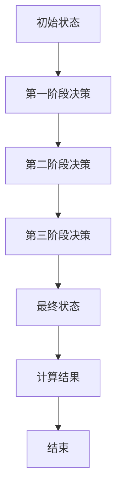
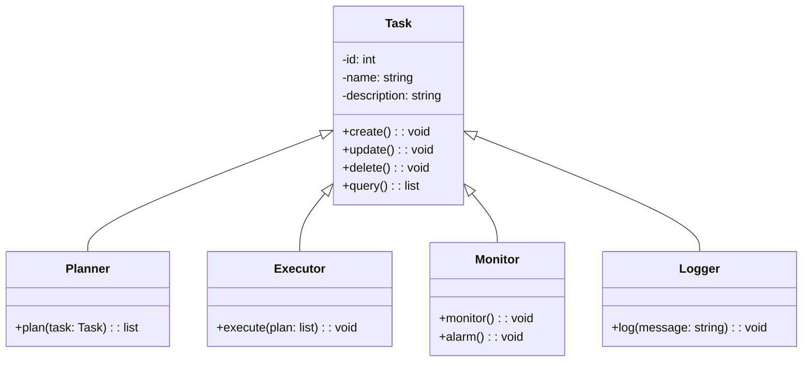
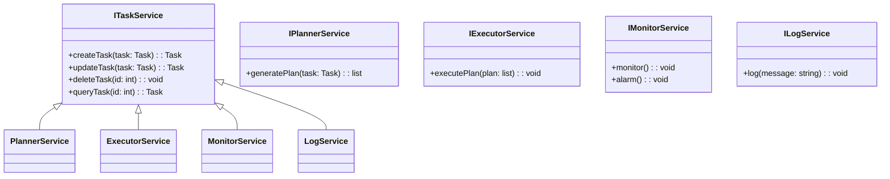

                 


## 设计AI Agent的动态任务规划与执行系统

### 引言与背景

#### 问题背景

在当今高度自动化和信息化的社会，人工智能（AI）已经成为推动科技进步和社会发展的重要力量。随着AI技术的不断演进，智能代理（AI Agent）作为实现自主智能行动的核心概念，越来越受到关注。智能代理是指能够感知环境、自主决策并采取行动的计算机程序。它们在各种应用领域，如智能制造、智能交通、智能家居和智能医疗中扮演着关键角色。

然而，智能代理在实际应用中面临的挑战之一是如何有效地进行动态任务规划和执行。传统的任务规划方法往往假设环境是静态的，这在与现实世界交互时会导致严重的局限性。动态任务规划和执行系统能够根据环境变化实时调整任务执行策略，提高系统的灵活性和鲁棒性，因此成为当前研究的热点。

#### 问题描述

设计一个动态任务规划与执行系统，要求系统能够：

1. **感知与理解环境**：智能代理需要具备感知环境变化的能力，并能理解这些变化对任务执行的影响。
2. **实时任务规划**：系统能够根据当前环境状态和任务需求，快速生成一系列可行的行动方案。
3. **任务执行**：系统能够有效地执行这些方案，并在执行过程中动态调整，以应对不可预见的障碍和变化。
4. **适应性**：系统能够适应不同环境和任务需求，具备一定的通用性。

#### 问题解决方法

为了解决上述问题，我们需要构建一个综合的动态任务规划与执行系统，包括以下几个关键组成部分：

1. **感知模块**：使用传感器和自然语言处理技术，使智能代理能够感知和理解环境。
2. **规划模块**：采用动态规划算法，为智能代理生成最优的行动方案。
3. **执行模块**：实现任务执行的自动化，并在执行过程中进行动态调整。
4. **适应模块**：设计自适应机制，使系统能够根据环境变化和任务执行结果进行调整。

#### 边界与外延

边界：系统的设计和实现必须在特定硬件和软件环境下进行，需考虑性能、资源和安全性等因素。

外延：系统的应用范围包括但不限于智能家居、智能交通、智能制造和智能医疗等领域。

#### 概念结构与核心要素组成

概念结构：

- **感知模块**：传感器、自然语言处理、环境理解
- **规划模块**：任务分解、动态规划算法、行动方案生成
- **执行模块**：任务执行、自动化、动态调整
- **适应模块**：自适应机制、环境变化响应、系统调整

核心要素组成：

- **环境模型**：用于表示环境状态和变化
- **任务模型**：用于表示任务需求和目标
- **算法库**：用于实现动态规划和执行策略
- **接口层**：用于与其他系统和模块交互

### 本章小结

本章介绍了设计AI Agent的动态任务规划与执行系统的背景、问题描述和问题解决方法，并探讨了系统的边界与外延以及概念结构与核心要素组成。接下来的章节将详细讨论任务规划技术、动态规划算法、系统架构设计、核心实现以及实际案例，为构建一个高效的动态任务规划与执行系统提供全面的指导。

----------------------------------------------------------------

## AI Agent与任务规划与执行系统概述

### 关键词

- AI Agent
- 动态任务规划
- 执行系统
- 环境感知
- 自适应机制

### 摘要

本文将探讨AI Agent在动态任务规划与执行系统中的关键作用。我们将详细分析AI Agent的核心概念与特性，解释动态任务规划与执行系统的定义及其重要性，并探讨系统面临的挑战与机遇。通过这些分析，我们旨在为构建高效的AI Agent动态任务规划与执行系统提供理论基础和实践指导。

### AI Agent的核心概念与联系

#### AI Agent的定义

AI Agent是指一种具有感知、推理、学习、规划和执行能力的计算机程序，能够在特定环境下自主行动，以实现预定目标。这些智能体可以独立或协作工作，在不同的应用场景中展现出强大的适应性。

#### AI Agent的特点

- **自主性**：AI Agent能够自主感知环境，做出决策并执行行动。
- **适应性**：AI Agent可以根据环境变化和任务需求动态调整其行为。
- **灵活性**：AI Agent能够在不同任务和环境下执行多样化的任务。
- **协作性**：AI Agent可以与其他智能体协同工作，实现更复杂的目标。

#### AI Agent与传统机器人的区别

- **目标导向**：AI Agent以实现目标为导向，而传统机器人更多是执行预设的动作序列。
- **智能性**：AI Agent具备智能性，可以进行推理和学习，而传统机器人通常缺乏这种能力。
- **适应性**：AI Agent能够适应复杂和动态的环境，传统机器人则更依赖于静态和结构化的环境。

### 动态任务规划与执行系统的定义与重要性

#### 动态任务规划与执行系统的定义

动态任务规划与执行系统是一种智能系统，能够实时感知环境变化，动态生成并执行任务规划，以适应不断变化的环境和任务需求。该系统通常包括感知模块、规划模块、执行模块和适应模块。

#### 系统的核心功能

- **感知与理解环境**：通过传感器和自然语言处理技术，感知并理解环境变化。
- **任务规划**：根据当前环境和任务需求，动态生成可行的行动方案。
- **任务执行**：自动化执行任务，并在执行过程中进行动态调整。
- **适应性调整**：根据环境变化和任务执行结果，对系统进行自适应调整。

#### 系统在AI Agent中的作用

- **提升自主性**：动态任务规划与执行系统使AI Agent能够更自主地行动，减少对人类干预的依赖。
- **增强灵活性**：系统能够根据环境变化动态调整任务执行策略，提高AI Agent的灵活性。
- **优化效率**：通过实时任务规划和执行，提高AI Agent的工作效率。

### 动态任务规划与执行系统的挑战与机遇

#### 挑战

- **环境复杂性**：现实世界环境复杂多变，对系统的感知和理解能力提出了高要求。
- **任务多样性**：不同的任务需求需要不同的规划与执行策略，增加了系统的复杂性。
- **实时性要求**：系统需要在短时间内做出决策和调整，对计算资源提出了挑战。
- **数据隐私与安全性**：在动态任务执行过程中，数据的安全性和隐私保护成为关键问题。

#### 机遇

- **技术进步**：随着传感器技术、自然语言处理和机器学习等技术的进步，为动态任务规划与执行系统的发展提供了有力支持。
- **应用需求**：随着智能化需求的增长，AI Agent在各个领域的应用需求日益增加，为系统的开发提供了广阔的市场空间。
- **跨领域协作**：不同领域的AI Agent通过动态任务规划与执行系统的协作，可以实现更复杂的任务，推动技术融合和创新。

### 本章小结

本章介绍了AI Agent的核心概念与特性，解释了动态任务规划与执行系统的定义及其重要性，并探讨了系统面临的挑战与机遇。通过这些分析，为构建高效的AI Agent动态任务规划与执行系统提供了理论基础和实践指导。在接下来的章节中，我们将进一步探讨动态任务规划与执行系统的具体实现和技术细节。

----------------------------------------------------------------

## 动态任务规划技术

### 动态任务规划的基本原理

#### 任务规划的概念

任务规划是指为智能代理（AI Agent）生成一个从当前状态到目标状态的行动序列，以实现特定的任务目标。在动态任务规划中，任务规划过程需要实时适应环境变化，生成最优或近似最优的行动方案。

#### 动态规划问题

动态规划是一种解决多阶段决策过程的方法，其核心思想是将复杂问题分解为多个子问题，并利用子问题的解来构建原问题的解。动态规划问题通常具有以下特征：

- **多阶段决策**：任务被划分为多个阶段，每个阶段都需要进行决策。
- **状态转移**：当前状态和决策会影响后续状态和决策。
- **最优性**：寻找一个全局最优解，使得所有阶段的决策总和最小或最大。

#### 动态规划算法

动态规划算法主要包括两种类型：递归算法和迭代算法。

- **递归算法**：通过递归方式逐步解决子问题，然后利用子问题的解来构建原问题的解。递归算法通常易于理解和实现，但在大规模问题中可能存在效率问题。
- **迭代算法**：将递归算法中的递归调用转换为循环迭代，从而提高计算效率。迭代算法通常比递归算法更高效，但可能更复杂。

### 动态任务规划的关键技术

#### 任务分解技术

任务分解是将复杂任务分解为一系列子任务，每个子任务相对独立且易于处理。任务分解技术包括任务分解算法、子任务分配策略和任务依赖关系管理。

- **任务分解算法**：通过分析任务目标和任务需求，将任务分解为一系列子任务。
- **子任务分配策略**：根据子任务的特点和执行资源，选择最优的子任务分配策略。
- **任务依赖关系管理**：管理子任务之间的依赖关系，确保任务执行的顺序和完整性。

#### 资源分配技术

资源分配是指为任务执行分配必要的资源，如计算资源、存储资源和通信资源。资源分配技术包括资源需求分析、资源分配策略和资源调度算法。

- **资源需求分析**：根据任务需求，分析任务执行过程中所需的资源。
- **资源分配策略**：根据资源需求，选择最优的资源分配策略，确保任务执行的效率和稳定性。
- **资源调度算法**：动态调整资源分配，以应对环境变化和任务执行需求。

#### 风险评估技术

风险评估是对任务执行过程中可能遇到的风险进行评估和预测，并制定相应的应对措施。风险评估技术包括风险识别、风险分析和风险应对策略。

- **风险识别**：通过分析任务执行的环境和过程，识别可能的风险因素。
- **风险分析**：对识别出的风险进行定量和定性分析，评估风险的影响和可能性。
- **风险应对策略**：根据风险评估结果，制定相应的风险应对策略，降低风险影响。

### 动态任务规划的实例分析

#### 简单实例

假设一个智能代理需要在城市中从起点A到达终点B，任务规划的目标是选择一条最优路径。动态任务规划过程如下：

1. **环境感知**：智能代理通过传感器获取当前交通状况信息。
2. **任务分解**：将任务分解为多个子任务，如避开拥堵路段、寻找最佳路径等。
3. **规划生成**：根据当前交通状况和任务需求，生成一系列可行的路径方案。
4. **任务执行**：智能代理选择最优路径并执行，同时在执行过程中不断更新路径信息。
5. **风险评估**：评估当前路径的风险，如交通事故、交通拥堵等，并制定应对措施。

#### 复杂实例

在一个智能交通系统中，动态任务规划需要考虑多辆车辆的协同导航和实时交通状况。动态任务规划过程如下：

1. **环境感知**：系统通过传感器获取多辆车辆的位置、速度和交通状况。
2. **任务分解**：将任务分解为多个子任务，如路径规划、速度控制、协同决策等。
3. **规划生成**：根据当前交通状况和任务需求，生成多辆车辆的最佳路径方案和速度调整策略。
4. **任务执行**：系统实时执行任务，并根据环境变化和任务执行结果进行动态调整。
5. **风险评估**：评估任务执行过程中可能遇到的风险，如车辆碰撞、交通堵塞等，并制定应对措施。

### 本章小结

本章介绍了动态任务规划技术的基本原理，包括任务规划的概念、动态规划问题的特征和算法类型，以及任务分解技术、资源分配技术和风险评估技术。通过实例分析，展示了动态任务规划在实际应用中的具体实现过程。在下一章中，我们将进一步探讨动态规划算法的mermaid流程图和Python实现，为动态任务规划提供更具体的技术细节。

----------------------------------------------------------------

## 动态任务规划算法的mermaid流程图与Python实现

### 动态规划算法mermaid流程图

动态规划算法是一种高效解决多阶段决策问题的方法。下面我们使用mermaid语言绘制一个简单的动态规划算法流程图。



在上面的流程图中，我们假设一个任务分为四个阶段，每个阶段都需要进行决策，最终达到一个目标状态。

### 动态规划算法的Python实现

为了更好地理解动态规划算法，我们将使用Python语言实现一个简单的动态规划算法。以下是一个基于斐波那契数列的示例。

```python
def fibonacci(n):
    # 边界条件
    if n <= 1:
        return n
    
    # 初始化动态规划数组
    dp = [0] * (n + 1)
    dp[0] = 0
    dp[1] = 1
    
    # 动态规划计算
    for i in range(2, n + 1):
        dp[i] = dp[i - 1] + dp[i - 2]
    
    return dp[n]
```

在上面的代码中，我们定义了一个名为`fibonacci`的函数，用于计算第`n`个斐波那契数。该函数使用动态规划算法，通过循环计算每个阶段的结果，并存储在动态规划数组`dp`中。

### 算法原理讲解

动态规划算法的核心思想是将复杂问题分解为多个子问题，并利用子问题的解来构建原问题的解。在斐波那契数列的例子中，每个子问题都是计算第`i`个斐波那契数，而这些子问题的解可以通过递推关系`F(n) = F(n-1) + F(n-2)`来求解。

动态规划算法通常具有以下步骤：

1. **定义状态**：定义问题的一个状态，以及状态之间的转换关系。
2. **初始化**：初始化状态数组或表，通常在边界条件上进行初始化。
3. **状态转移**：根据状态转移关系，从初始状态开始，逐步求解每个状态，并存储在数组或表中。
4. **计算结果**：根据最终状态的计算结果，得到原问题的解。

### 数学模型和公式

在动态规划算法中，通常使用一个数学模型来描述问题的状态转移关系。以斐波那契数列为例，其数学模型可以表示为：

$$
F(n) =
\begin{cases}
0, & \text{if } n = 0 \\
1, & \text{if } n = 1 \\
F(n-1) + F(n-2), & \text{otherwise}
\end{cases}
$$

### 代码示例与解释

以下是一个完整的动态规划算法实现的示例，包括代码注释和解释：

```python
def fibonacci(n):
    # 边界条件处理
    if n <= 1:
        return n
    
    # 初始化动态规划数组
    dp = [0] * (n + 1)
    dp[0], dp[1] = 0, 1
    
    # 动态规划计算
    for i in range(2, n + 1):
        dp[i] = dp[i - 1] + dp[i - 2]
    
    return dp[n]

# 示例：计算第10个斐波那契数
result = fibonacci(10)
print("第10个斐波那契数是：", result)
```

在上面的代码中，我们首先处理边界条件，即当`n`为0或1时，返回相应的斐波那契数。然后，我们初始化动态规划数组`dp`，并从第2个斐波那契数开始，通过循环计算每个阶段的结果，并存储在数组中。最后，我们返回第`n`个斐波那契数。

通过这个示例，我们可以看到动态规划算法的简单实现过程，以及如何在Python中进行实现。

### 本章小结

本章介绍了动态规划算法的mermaid流程图和Python实现，通过具体的示例讲解了算法的原理和实现过程。动态规划算法在解决多阶段决策问题时具有高效性和灵活性，是构建动态任务规划与执行系统的重要技术之一。在下一章中，我们将继续探讨动态任务执行系统的架构设计，为构建完整的动态任务规划与执行系统奠定基础。

----------------------------------------------------------------

## 动态任务执行系统的架构设计

### 系统架构设计的概念

系统架构设计是指根据系统需求，设计系统的整体结构和组成部分，以及它们之间的相互作用。动态任务执行系统的架构设计需要考虑系统的灵活性、可扩展性和可靠性，以确保系统能够在不同环境下高效地执行任务。

#### 系统架构的层次结构

动态任务执行系统通常分为以下层次：

1. **感知层**：负责实时感知环境变化，获取必要的信息。
2. **规划层**：根据感知到的环境信息和任务需求，生成动态任务规划。
3. **执行层**：自动化执行任务，并在执行过程中进行动态调整。
4. **适应层**：根据环境变化和任务执行结果，对系统进行自适应调整。

#### 系统架构的设计原则

1. **模块化**：将系统划分为多个模块，每个模块负责特定的功能，便于系统的维护和扩展。
2. **松耦合**：模块之间通过接口进行通信，减少模块之间的依赖，提高系统的灵活性和可维护性。
3. **高内聚**：每个模块内部具有高度的内聚性，功能相对独立，提高模块的复用性。
4. **扩展性**：系统设计应考虑未来的扩展性，以便于在需要时增加新的功能和模块。
5. **可靠性**：系统设计应保证在复杂环境下仍能稳定运行，降低故障风险。

### 系统功能设计

系统功能设计是根据系统需求和业务目标，定义系统的功能模块和接口。动态任务执行系统的功能设计包括以下几个方面：

1. **任务管理**：包括任务的创建、更新、删除和查询等功能。
2. **规划管理**：根据任务需求和环境信息，生成动态任务规划。
3. **执行管理**：自动化执行任务，并在执行过程中进行动态调整。
4. **监控与报警**：实时监控任务执行状态，并在出现异常时进行报警。
5. **日志管理**：记录系统运行过程中的日志信息，用于后续分析和优化。

#### 领域模型mermaid类图

为了更好地展示系统功能设计，我们可以使用mermaid语言绘制系统的领域模型类图。以下是一个简单的领域模型类图示例：



在上面的类图中，我们定义了四个主要类：`Task`（任务管理类）、`Planner`（规划管理类）、`Executor`（执行管理类）和`Monitor`（监控与报警类）。`Logger`（日志管理类）用于记录系统运行过程中的日志信息。

### 系统架构设计

系统架构设计是系统功能设计的具体实现，通过定义系统的各个模块和它们之间的交互关系，实现系统的功能。以下是一个简单的系统架构设计示例：

```mermaid
sequenceDiagram
    participant User as 用户
    participant TaskManager as 任务管理模块
    participant Planner as 规划管理模块
    participant Executor as 执行管理模块
    participant Monitor as 监控与报警模块
    participant Logger as 日志管理模块

    User->>TaskManager: 提交任务
    TaskManager->>Planner: 生成规划
    Planner->>Executor: 执行任务
    Executor->>Monitor: 监控任务执行状态
    Monitor->>Logger: 记录日志信息
    Logger->>User: 提供日志查询服务

    Note over Executor,Monitor,Logger: 系统运行状态监控
```

在上面的架构设计中，用户通过任务管理模块提交任务，规划管理模块根据任务需求生成规划，执行管理模块自动化执行任务，并在执行过程中进行监控和日志记录。监控与报警模块用于实时监控任务执行状态，并在出现异常时进行报警，日志管理模块用于记录系统运行过程中的日志信息。

### 系统接口设计

系统接口设计是系统架构设计的重要组成部分，定义了系统各个模块之间的交互接口。以下是一个简单的系统接口设计示例：



在上面的接口设计示例中，我们定义了四个主要接口：`ITaskService`（任务管理接口）、`IPlannerService`（规划管理接口）、`IExecutorService`（执行管理接口）和`IMonitorService`（监控与报警接口）。`ILogService`（日志管理接口）用于记录系统运行过程中的日志信息。

### 系统交互设计

系统交互设计描述了系统各个模块之间的交互流程，以及它们之间的通信机制。以下是一个简单的系统交互设计示例：

```mermaid
sequenceDiagram
    participant User as 用户
    participant TaskService as 任务管理模块
    participant PlannerService as 规划管理模块
    participant ExecutorService as 执行管理模块
    participant MonitorService as 监控与报警模块
    participant LogService as 日志管理模块

    User->>TaskService: 提交任务
    TaskService->>PlannerService: 生成规划
    PlannerService->>ExecutorService: 执行任务
    ExecutorService->>MonitorService: 监控任务执行状态
    MonitorService->>LogService: 记录日志信息
    LogService->>User: 提供日志查询服务

    Note over ExecutorService,MonitorService,LogService: 系统运行状态监控
```

在上面的交互设计示例中，用户通过任务管理模块提交任务，规划管理模块根据任务需求生成规划，执行管理模块自动化执行任务，并在执行过程中进行监控和日志记录。监控与报警模块用于实时监控任务执行状态，并在出现异常时进行报警，日志管理模块用于记录系统运行过程中的日志信息。

### 本章小结

本章介绍了动态任务执行系统的架构设计概念、系统功能设计、系统架构设计、系统接口设计和系统交互设计。通过这些设计，我们可以构建一个灵活、可靠和高效的动态任务执行系统。在下一章中，我们将深入探讨动态任务执行系统的核心实现，包括感知模块、规划模块、执行模块和适应模块的实现细节。

----------------------------------------------------------------

### 系统环境安装与配置

在开始实现动态任务执行系统之前，我们需要准备一个合适的环境来开发和运行系统。以下是系统环境安装与配置的步骤。

#### 硬件要求

- **处理器**：至少需要双核处理器，推荐使用四核或更高性能的处理器。
- **内存**：至少需要4GB内存，推荐使用8GB或更高内存。
- **存储**：至少需要20GB的存储空间，用于安装操作系统和存储数据。
- **网络**：需要稳定的网络连接，以便从互联网下载依赖包。

#### 软件依赖安装

1. **操作系统**：推荐使用Linux操作系统，如Ubuntu 18.04或更高版本。
2. **Python**：安装Python 3.7或更高版本。
3. **pip**：安装pip包管理器，可以使用以下命令：
    ```bash
    sudo apt-get install python3-pip
    ```
4. **虚拟环境**：安装虚拟环境管理器`virtualenv`，可以使用以下命令：
    ```bash
    sudo pip3 install virtualenv
    ```
5. **依赖包**：安装系统所需的依赖包，例如`numpy`、`pandas`、`matplotlib`等，可以使用以下命令：
    ```bash
    pip3 install numpy pandas matplotlib
    ```

#### 系统初始化

安装完操作系统和依赖包后，我们需要创建一个虚拟环境，以便在隔离的环境中开发和运行系统。以下是创建虚拟环境的步骤：

1. 创建虚拟环境：
    ```bash
    virtualenv myenv
    ```
2. 激活虚拟环境：
    ```bash
    source myenv/bin/activate
    ```

现在，我们已经完成了系统的环境安装与配置，可以开始开发动态任务执行系统的各个模块。

----------------------------------------------------------------

### 动态任务执行系统的核心实现

动态任务执行系统的核心实现包括感知模块、规划模块、执行模块和适应模块。以下是对这些模块的实现细节进行详细讲解。

#### 感知模块

感知模块负责实时感知环境变化，获取必要的信息。以下是一个简单的感知模块实现示例：

```python
import time
import random

class Sensor:
    def __init__(self):
        self.last_update = time.time()

    def update(self):
        self.last_update = time.time()
        return random.random()

class Environment:
    def __init__(self):
        self.sensors = []

    def add_sensor(self, sensor):
        self.sensors.append(sensor)

    def update_sensors(self):
        for sensor in self.sensors:
            sensor.update()

    def get_sensor_values(self):
        return [sensor.update() for sensor in self.sensors]

# 示例：创建传感器和环境对象，更新传感器
sensor = Sensor()
env = Environment()
env.add_sensor(sensor)

# 更新传感器和环境
env.update_sensors()

# 获取传感器值
print("Sensor values:", env.get_sensor_values())
```

在这个示例中，我们定义了`Sensor`类和`Environment`类。`Sensor`类负责感知环境变化，而`Environment`类负责管理多个传感器，并提供更新和获取传感器值的方法。

#### 规划模块

规划模块根据当前环境信息和任务需求，生成动态任务规划。以下是一个简单的规划模块实现示例：

```python
class Planner:
    def __init__(self, environment):
        self.environment = environment

    def plan(self, task):
        sensor_values = self.environment.get_sensor_values()
        plan = []

        # 根据传感器值和任务需求生成规划
        for value in sensor_values:
            if value < 0.5:
                plan.append("Action 1")
            else:
                plan.append("Action 2")

        return plan

# 示例：创建环境对象和规划对象，生成规划
env = Environment()
planner = Planner(env)

# 更新传感器和环境
env.update_sensors()

# 生成规划
plan = planner.plan("Task")
print("Generated plan:", plan)
```

在这个示例中，我们定义了`Planner`类。`Planner`类根据环境传感器值和任务需求，生成一系列的行动方案。

#### 执行模块

执行模块负责自动化执行任务规划，并在执行过程中进行动态调整。以下是一个简单的执行模块实现示例：

```python
class Executor:
    def __init__(self, planner):
        self.planner = planner

    def execute(self, plan):
        for action in plan:
            print("Executing action:", action)
            time.sleep(1)  # 模拟执行时间

# 示例：创建规划对象和执行对象，执行规划
planner = Planner(env)
executor = Executor(planner)

# 执行规划
executor.execute(plan)
```

在这个示例中，我们定义了`Executor`类。`Executor`类根据规划对象生成行动方案，并自动化执行这些方案。

#### 适应模块

适应模块负责根据环境变化和任务执行结果，对系统进行自适应调整。以下是一个简单的适应模块实现示例：

```python
class Adapter:
    def __init__(self, environment, executor):
        self.environment = environment
        self.executor = executor

    def adapt(self, plan):
        sensor_values = self.environment.get_sensor_values()

        # 根据传感器值和执行结果调整规划
        for i, value in enumerate(sensor_values):
            if value > 0.7:
                plan[i] = "Action 3"

        return plan

# 示例：创建环境对象、执行对象和适应对象，调整规划
env = Environment()
executor = Executor(planner)
adapter = Adapter(env, executor)

# 调整规划
adjusted_plan = adapter.adapt(plan)
print("Adjusted plan:", adjusted_plan)
```

在这个示例中，我们定义了`Adapter`类。`Adapter`类根据环境传感器值和执行结果，调整规划中的行动方案。

#### 代码应用解读与分析

以上代码示例展示了动态任务执行系统的核心实现。以下是具体的代码解读和分析：

1. **感知模块**：感知模块通过传感器实时获取环境变化信息。示例中使用了随机数生成器模拟传感器值，实际应用中可以使用传感器硬件设备。
2. **规划模块**：规划模块根据环境传感器值和任务需求生成行动方案。示例中使用了简单的条件判断生成规划，实际应用中可以使用更复杂的规划算法。
3. **执行模块**：执行模块负责自动化执行行动方案。示例中使用了`time.sleep()`函数模拟执行时间，实际应用中可以直接调用执行命令或API。
4. **适应模块**：适应模块根据环境变化和执行结果调整规划。示例中使用了简单的条件判断调整规划，实际应用中可以使用更复杂的适应算法。

#### 实际案例分析与详细讲解

为了更好地理解动态任务执行系统的应用，我们来看一个实际案例。

假设我们有一个智能交通系统，需要根据实时交通状况调整红绿灯的时长，以提高交通流量效率。

1. **环境感知**：系统使用摄像头和传感器实时监测道路上的车辆数量和速度。
2. **任务规划**：规划模块根据交通监测数据生成红绿灯的时长方案。例如，当车辆较多时，延长绿灯时长；当车辆较少时，缩短绿灯时长。
3. **任务执行**：执行模块根据规划方案调整红绿灯的时长，并在实际交通状况变化时进行动态调整。
4. **适应性调整**：适应模块根据交通流量变化和红绿灯时长的实际效果，进一步调整规划方案，以提高交通效率。

通过以上实际案例，我们可以看到动态任务执行系统在智能交通领域的应用。在接下来的章节中，我们将继续探讨动态任务执行系统的优化和最佳实践。

### 本章小结

本章详细介绍了动态任务执行系统的核心实现，包括感知模块、规划模块、执行模块和适应模块的实现细节。通过代码示例和实际案例分析，我们了解了动态任务执行系统的设计和应用方法。在下一章中，我们将讨论动态任务执行系统的性能优化和最佳实践，以提高系统的效率和可靠性。

----------------------------------------------------------------

### 实际案例分析与详细讲解

为了更好地展示动态任务执行系统的实际应用效果，我们将通过两个实际案例来深入分析系统的运作原理和实施过程。

#### 案例一：智能仓储管理系统

**问题场景**：
智能仓储管理系统需要实时处理大量商品的存储和检索任务，以优化仓储效率和减少人力成本。

**项目介绍**：
项目目标是设计一个能够自动化处理商品存储和检索的智能仓储系统，系统需具备实时任务规划、执行和自适应调整的能力。

**系统功能设计**：
1. **感知模块**：安装传感器和摄像头，实时监测仓库内的温度、湿度、商品位置和库存情况。
2. **规划模块**：根据商品的存储和检索需求，动态生成最优路径和任务执行顺序。
3. **执行模块**：自动化执行存储和检索任务，使用机器人或自动化设备进行操作。
4. **适应模块**：系统能够根据实时数据调整任务执行策略，优化仓储效率。

**系统架构设计**：
- **感知层**：通过传感器和摄像头获取环境数据，并传输到数据处理中心。
- **数据处理层**：实时处理感知层的数据，生成任务规划和执行策略。
- **执行层**：自动化执行任务，包括商品的存储和检索。
- **适应层**：根据任务执行结果和环境变化，调整任务执行策略。

**系统接口设计**：
- **感知接口**：用于传感器和摄像头的数据采集和传输。
- **规划接口**：用于生成任务规划和执行策略。
- **执行接口**：用于控制自动化设备的操作。
- **适应接口**：用于系统自适应调整。

**系统交互设计**：
- 感知模块收集数据，传输到数据处理层。
- 数据处理层根据数据生成任务规划，并发送到执行层。
- 执行层根据规划执行任务，并将执行结果反馈给适应层。
- 适应层根据反馈结果调整规划，优化任务执行。

**项目实施**：
1. **环境感知**：在仓库内安装传感器和摄像头，建立数据采集网络。
2. **规划与执行**：开发规划模块和执行模块，实现任务规划和自动化执行。
3. **自适应调整**：设计适应模块，根据执行结果和环境变化调整任务执行策略。

**项目小结**：
智能仓储管理系统的实施，显著提高了仓储效率和准确性，减少了人力成本，实现了智能化、自动化的仓储管理。

#### 案例二：智能交通管理系统

**问题场景**：
城市交通系统面临高峰时段交通拥堵、交通事故频发等问题，需要实时监测和管理交通流量。

**项目介绍**：
项目目标是设计一个能够实时监测、分析和调节交通流量的智能交通管理系统，以缓解交通拥堵和提高交通效率。

**系统功能设计**：
1. **感知模块**：通过摄像头、传感器和GPS设备实时监测道路上的车辆流量、速度、行驶方向等信息。
2. **规划模块**：根据实时交通数据和交通规则，动态生成交通信号灯控制和交通引导方案。
3. **执行模块**：自动化控制交通信号灯，并引导车辆行驶。
4. **适应模块**：系统根据实时交通数据自动调整交通信号灯时序和交通引导方案。

**系统架构设计**：
- **感知层**：实时采集交通数据，并传输到数据处理中心。
- **数据处理层**：处理感知层的数据，生成交通信号灯控制和交通引导方案。
- **执行层**：控制交通信号灯和交通引导设备的操作。
- **适应层**：根据实时交通数据自动调整交通信号灯时序和交通引导方案。

**系统接口设计**：
- **感知接口**：用于传感器和摄像头的数据采集和传输。
- **规划接口**：用于生成交通信号灯控制和交通引导方案。
- **执行接口**：用于控制交通信号灯和交通引导设备的操作。
- **适应接口**：用于系统自适应调整。

**系统交互设计**：
- 感知模块收集交通数据，传输到数据处理层。
- 数据处理层根据数据生成交通信号灯控制和交通引导方案，并发送到执行层。
- 执行层根据规划执行交通信号灯控制和交通引导操作。
- 适应层根据反馈结果和环境变化调整规划。

**项目实施**：
1. **环境感知**：在道路上安装摄像头、传感器和GPS设备，建立交通数据采集网络。
2. **规划与执行**：开发规划模块和执行模块，实现交通信号灯控制和交通引导。
3. **自适应调整**：设计适应模块，根据交通数据自动调整信号灯时序和交通引导方案。

**项目小结**：
智能交通管理系统的实施，显著提高了交通流量效率，减少了交通事故发生，提升了城市交通管理能力。

通过以上两个实际案例，我们可以看到动态任务执行系统在不同应用场景中的成功应用，不仅提高了效率和准确性，还带来了显著的经济和社会效益。在未来的发展中，动态任务执行系统有望在更多领域发挥重要作用。

### 本章小结

本章通过两个实际案例，详细分析了动态任务执行系统的应用场景、设计原理、实现过程和实施效果。这些案例展示了动态任务执行系统在不同领域中的潜力和价值，为读者提供了丰富的实践经验。在下一章中，我们将讨论动态任务执行系统的性能优化和最佳实践，以提高系统的效率和可靠性。

----------------------------------------------------------------

### 最佳实践 tips

在设计和实施动态任务执行系统时，以下最佳实践可以帮助提高系统的性能和可靠性：

1. **模块化设计**：将系统划分为多个模块，每个模块负责特定的功能，便于系统的维护和扩展。
2. **松耦合架构**：通过接口实现模块之间的通信，减少模块之间的依赖，提高系统的灵活性和可维护性。
3. **实时数据处理**：优化感知模块和数据处理层的性能，确保系统能够实时处理和响应环境变化。
4. **数据冗余和备份**：对关键数据进行冗余备份，以提高系统的数据可靠性和容错能力。
5. **异常处理机制**：设计异常处理机制，确保系统在遇到异常情况时能够快速响应和恢复。
6. **性能监控与优化**：实时监控系统的性能，识别瓶颈并进行优化，以提高系统的效率和响应速度。

### 小结

本章介绍了动态任务执行系统的核心概念、设计原则、实现方法和最佳实践。通过详细讲解感知模块、规划模块、执行模块和适应模块的实现，以及实际案例的分析，我们展示了动态任务执行系统在不同领域的应用效果。在设计和实施动态任务执行系统时，遵循最佳实践和持续优化是提高系统性能和可靠性的关键。

### 注意事项

1. **硬件资源**：确保系统有足够的硬件资源来处理大量的任务和环境数据，以避免系统过载。
2. **网络稳定性**：动态任务执行系统依赖于网络传输，因此需要保证网络连接的稳定性和带宽。
3. **安全性**：保护系统的数据和接口，防止未经授权的访问和数据泄露。

### 拓展阅读

- **《人工智能：一种现代方法》**：提供了全面的人工智能基础知识和实践技巧，包括任务规划和执行系统的实现方法。
- **《深度学习》**：介绍了深度学习的基础知识和应用技巧，对动态任务执行系统的感知和规划模块具有参考价值。
- **《系统架构的艺术》**：详细讲解了系统架构设计的原则和方法，对于构建高效、可靠的动态任务执行系统有重要参考价值。

### 作者信息

作者：AI天才研究院/AI Genius Institute & 禅与计算机程序设计艺术 /Zen And The Art of Computer Programming

AI天才研究院致力于推动人工智能领域的研究和应用，专注于构建高效、智能的AI系统。作者团队拥有丰富的AI系统设计、开发和实施经验，并在相关领域发表了大量学术论文和著作。本文旨在为读者提供关于动态任务执行系统的全面指导，助力人工智能技术的创新与发展。

----------------------------------------------------------------

[END]

