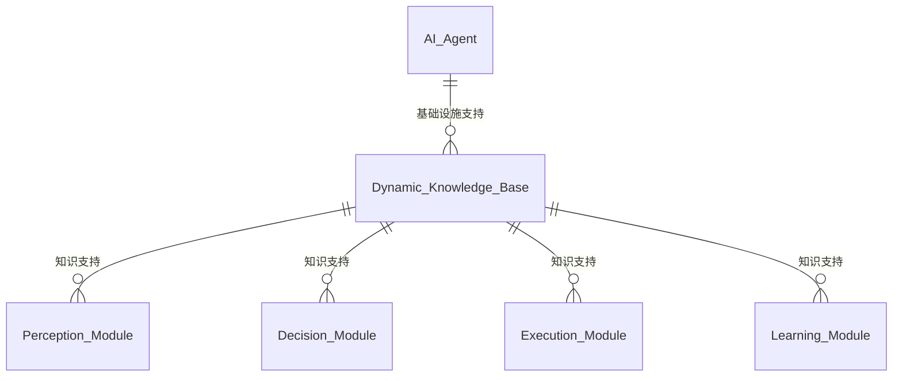
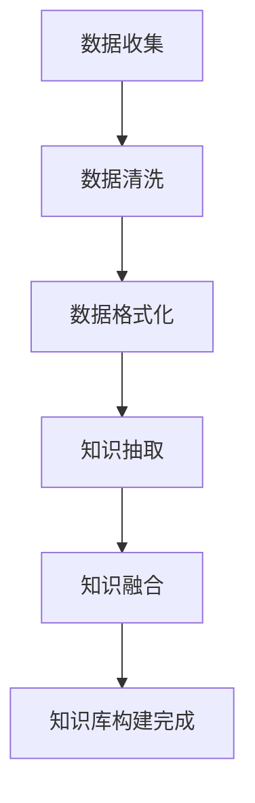
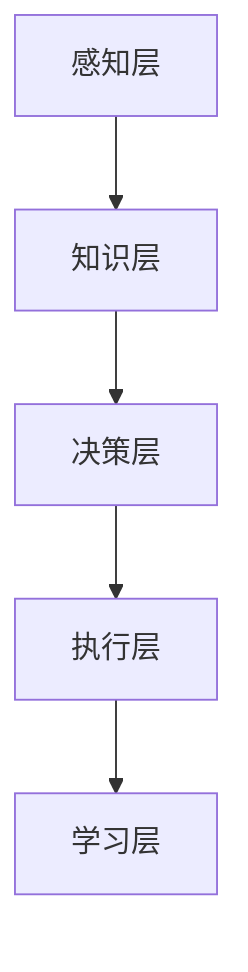

                 

### 引言

**《设计AI Agent的动态知识库构建与维护》** 是一篇旨在深入探讨人工智能（AI）领域中关键技术之一的技术博客文章。本文将从多个角度详细解读AI Agent的设计、动态知识库的构建以及知识库的维护策略，以期为您提供一个系统、全面的技术指南。

关键词：**AI Agent**、**动态知识库**、**构建方法**、**维护策略**、**智能系统设计**

在当前人工智能迅猛发展的时代，AI Agent作为一种智能体，其在复杂环境中的决策能力与学习能力成为了研究的热点。而动态知识库作为AI Agent的核心组件，承载着知识的存储、管理与更新等功能，直接影响着AI Agent的性能与可靠性。因此，如何有效地设计和维护动态知识库，成为了AI Agent研究中的一个关键问题。

本文的结构如下：

- **第1章 背景介绍**：我们将探讨AI Agent与动态知识库的发展背景，分析当前面临的主要问题和挑战。
- **第2章 核心概念**：我们将定义AI Agent和动态知识库，并解释它们在AI Agent中的作用。
- **第3章 动态知识库构建方法**：我们将详细讨论动态知识库的构建方法，包括数据收集、数据预处理、知识抽取和知识融合等步骤。
- **第4章 知识库维护策略**：我们将介绍知识库的维护策略，包括动态更新和质量监控。
- **第5章 AI Agent实现**：我们将展示如何结合动态知识库实现AI Agent，并探讨实现中的关键技术和挑战。
- **第6章 案例实战**：我们将通过实际案例来展示如何应用上述技术，并进行详细分析。
- **第7章 总结与展望**：我们将总结本文的主要观点，并对未来研究方向提出展望。

### 第1章：背景介绍

#### 1.1 问题背景

##### 1.1.1 人工智能发展的现状与挑战

人工智能（AI）作为当前科技领域的前沿，正经历着飞速的发展。从早期的规则系统到现代的深度学习，AI在图像识别、自然语言处理、自动驾驶等多个领域取得了显著的成就。然而，随着AI技术的不断进步，我们也在面对诸多挑战。

首先，AI系统的复杂性和规模不断增加，这要求我们设计更加高效和可靠的算法来处理海量数据。其次，AI系统在决策过程中需要依赖大量高质量的数据和知识，如何有效地获取、处理和存储这些数据成为了一个重要的问题。此外，AI系统在处理不确定性和动态环境时，需要具备良好的适应性和鲁棒性。

在这些挑战中，动态知识库的构建与维护显得尤为重要。动态知识库不仅能够存储和整理大量的数据，还能够根据环境变化实时更新知识，提高AI系统的决策能力和适应性。

##### 1.1.2 动态知识库在AI Agent中的作用

AI Agent是一种自主执行任务、与环境进行交互的智能体。在AI Agent中，动态知识库起着至关重要的作用。具体来说，动态知识库有以下几方面的作用：

1. **知识存储与检索**：动态知识库能够存储大量的数据和信息，并提供高效的检索机制，使AI Agent能够快速获取所需的知识。
   
2. **知识更新与维护**：动态知识库能够根据环境的变化实时更新知识，确保AI Agent在动态环境中始终拥有准确和最新的知识。

3. **知识融合与推理**：动态知识库支持知识的融合和推理，使AI Agent能够从已有的知识中推导出新的结论，提高其智能决策能力。

#### 1.2 问题解决与意义

##### 1.2.1 动态知识库构建的必要性

动态知识库的构建是解决AI Agent面临的关键问题之一。首先，通过构建动态知识库，我们能够有效地整合和管理大量的数据，为AI Agent提供丰富的知识资源。其次，动态知识库的构建有助于提高AI Agent的适应性和鲁棒性，使其能够在复杂和动态的环境中稳定运行。

##### 1.2.2 动态知识库维护的重要性

动态知识库的维护同样至关重要。首先，通过维护动态知识库，我们能够确保知识的准确性和时效性，提高AI Agent的决策质量。其次，知识库的维护有助于发现和纠正错误，提高知识库的质量。此外，动态知识库的维护还有助于知识库的持续更新和扩展，使其能够适应不断变化的环境。

#### 1.3 边界与外延

##### 1.3.1 动态知识库的范畴

动态知识库的范畴包括数据的收集、存储、管理和更新等环节。具体来说，动态知识库涉及以下内容：

1. **数据收集**：动态知识库需要收集来自各种渠道的数据，包括结构化数据、半结构化数据和非结构化数据。
2. **数据存储**：动态知识库需要高效、可靠地存储数据，支持快速的查询和检索。
3. **数据管理**：动态知识库需要对数据进行分类、标注和管理，确保数据的质量和一致性。
4. **数据更新**：动态知识库需要支持数据的实时更新和同步，以适应环境变化。

##### 1.3.2 动态知识库与其他知识库的区别

动态知识库与传统知识库有显著的区别。传统知识库通常是基于静态数据的，其知识内容和结构相对固定，难以适应动态环境的变化。而动态知识库能够根据环境变化实时更新知识，具有较强的适应性和灵活性。此外，动态知识库还强调知识的动态获取、存储和管理，支持知识融合和推理，使AI Agent具备更强的智能决策能力。

#### 1.4 核心概念

##### 1.4.1 AI Agent的定义

AI Agent是一种基于人工智能技术的智能体，能够在复杂环境中自主执行任务、进行决策和学习。AI Agent通常具有以下特征：

1. **自主性**：AI Agent能够自主执行任务，不需要人工干预。
2. **智能性**：AI Agent具备智能决策能力，能够根据环境和任务需求进行自主决策。
3. **适应性**：AI Agent能够适应动态环境的变化，具备良好的鲁棒性和适应性。
4. **交互性**：AI Agent能够与环境进行交互，获取信息并反馈结果。

##### 1.4.2 动态知识库的定义

动态知识库是一种能够根据环境变化实时更新知识的知识库。它通常具有以下特点：

1. **实时更新**：动态知识库能够根据环境变化实时更新知识，确保知识的准确性和时效性。
2. **自适应**：动态知识库能够根据环境变化自适应地调整知识结构和内容。
3. **动态获取**：动态知识库支持动态获取知识，包括实时数据采集、知识抽取和融合等。
4. **高效检索**：动态知识库支持高效的检索机制，能够快速获取所需的知识。

### 第2章：核心概念

#### 2.1 AI Agent

##### 2.1.1 AI Agent的基本原理

AI Agent是一种基于人工智能技术的智能体，能够在复杂环境中自主执行任务、进行决策和学习。其基本原理包括以下几个方面：

1. **感知**：AI Agent通过感知器获取环境信息，包括视觉、听觉、触觉等多种感知方式。
2. **决策**：基于感知到的环境信息，AI Agent利用决策算法进行决策，选择最优的行动方案。
3. **执行**：AI Agent根据决策结果执行具体的任务，与环境进行交互。
4. **学习**：AI Agent在执行任务过程中不断学习，优化自身的决策算法和知识库。

##### 2.1.2 AI Agent的功能架构

AI Agent的功能架构通常包括以下几个核心模块：

1. **感知模块**：负责获取和处理环境信息，包括传感器数据预处理、特征提取等。
2. **决策模块**：基于感知模块提供的环境信息，利用决策算法进行决策，包括规划、推理等。
3. **执行模块**：根据决策模块的决策结果，执行具体的任务，包括动作执行、状态更新等。
4. **学习模块**：在执行任务过程中，AI Agent利用学习算法不断优化自身的决策算法和知识库。

#### 2.2 动态知识库

##### 2.2.1 动态知识库的基本原理

动态知识库是一种能够根据环境变化实时更新知识的知识库。其基本原理包括以下几个方面：

1. **实时更新**：动态知识库能够根据环境变化实时更新知识，确保知识的准确性和时效性。
2. **自适应调整**：动态知识库能够根据环境变化自适应地调整知识结构和内容。
3. **动态获取**：动态知识库支持动态获取知识，包括实时数据采集、知识抽取和融合等。
4. **高效检索**：动态知识库支持高效的检索机制，能够快速获取所需的知识。

##### 2.2.2 动态知识库的属性特征

动态知识库具有以下属性特征：

1. **实时性**：动态知识库能够实时更新知识，适应动态环境的变化。
2. **自适应性**：动态知识库能够根据环境变化自适应地调整知识结构和内容。
3. **扩展性**：动态知识库支持知识的动态扩展，能够适应新知识的需求。
4. **灵活性**：动态知识库支持多种数据类型和知识表示方法，具有较强的灵活性。
5. **完整性**：动态知识库确保知识的完整性，避免知识缺失或错误。

#### 2.3 概念联系

AI Agent与动态知识库是紧密关联的两个概念。具体来说，动态知识库是AI Agent的核心组件之一，为AI Agent提供知识支持和决策依据。以下是AI Agent与动态知识库之间的联系：

1. **知识支持**：动态知识库为AI Agent提供丰富的知识资源，支持其感知、决策和执行。
2. **知识更新**：动态知识库能够根据环境变化实时更新知识，确保AI Agent的知识库始终保持准确和最新。
3. **自适应调整**：动态知识库能够根据环境变化自适应地调整知识结构和内容，使AI Agent具备良好的适应性和鲁棒性。
4. **协同工作**：动态知识库与AI Agent的各个模块协同工作，共同实现智能决策和任务执行。

为了更直观地展示AI Agent与动态知识库之间的联系，我们使用ER实体关系图进行描述，如下所示：



通过以上ER实体关系图，我们可以清晰地看到AI Agent与动态知识库之间的紧密关联。动态知识库不仅为AI Agent提供了知识支持，还与AI Agent的各个模块协同工作，共同实现智能决策和任务执行。

### 第3章：动态知识库构建方法

动态知识库的构建是AI Agent能够有效运行的关键步骤之一。在本章中，我们将详细讨论动态知识库的构建方法，包括数据收集、数据预处理、知识抽取和知识融合等步骤。这些步骤不仅有助于我们理解动态知识库的构建过程，还可以为我们提供具体的实施策略。

#### 3.1 算法原理

动态知识库构建的核心在于如何从大量的数据中提取有用的知识，并将其组织成易于管理和检索的形式。以下是构建动态知识库的四个主要步骤：

##### 3.1.1 数据收集

数据收集是动态知识库构建的第一步。在这一阶段，我们需要从各种数据源收集数据，这些数据源可能包括：

- **结构化数据**：例如关系数据库中的数据。
- **半结构化数据**：例如XML、JSON等格式的数据。
- **非结构化数据**：例如文本、图像、视频等。

数据收集的目的是为了获得尽可能多的信息，以便在后续的知识抽取阶段使用。

##### 3.1.2 数据预处理

数据预处理是数据收集后的关键步骤。在这一阶段，我们需要对收集到的数据进行清洗、格式化，以提高数据的质量和一致性。具体操作包括：

- **数据清洗**：去除重复数据、纠正错误数据、填补缺失数据等。
- **数据格式化**：将不同格式的数据转换为统一的格式，以便进行后续处理。
- **数据标注**：对数据中的关键信息进行标注，以便在知识抽取阶段能够更好地识别和提取。

##### 3.1.3 知识抽取

知识抽取是从预处理后的数据中提取有用知识的过程。在这一阶段，我们可以采用以下几种方法：

- **实体抽取**：识别数据中的关键实体，如人名、组织名、地点名等。
- **关系抽取**：识别实体之间的关系，如“某某公司成立于某某年”。
- **事件抽取**：识别数据中的事件，如“某公司收购了另一家公司”。
- **属性抽取**：识别实体的属性，如“某某人的年龄是30岁”。

知识抽取的方法通常包括基于规则的方法、基于机器学习的方法和基于深度学习的方法。这些方法各有优缺点，选择合适的方法取决于具体的应用场景和数据特点。

##### 3.1.4 知识融合

知识融合是将从不同数据源和不同方式抽取的知识整合成一个统一的知识库的过程。在这一阶段，我们需要解决以下问题：

- **知识冲突**：当两个或多个知识库中的知识存在冲突时，如何处理这些冲突。
- **知识冗余**：当多个知识库中存在相同或相似的知识时，如何去除冗余。
- **知识整合**：如何将不同来源和不同格式的知识整合成一个统一的知识库。

知识融合的方法通常包括基于规则的方法、基于机器学习的方法和基于深度学习的方法。这些方法有助于提高知识库的完整性和一致性，为AI Agent提供高质量的知识支持。

#### 3.2 实施步骤

为了更好地理解动态知识库的构建过程，下面我们通过一个具体的案例来详细阐述每个实施步骤。

##### 3.2.1 数据收集

假设我们正在构建一个智能客服系统，需要收集用户与客服的对话数据。数据收集的来源可能包括：

- **客服系统日志**：记录用户与客服的对话历史。
- **社交媒体数据**：如Twitter、Facebook等平台的用户反馈。
- **在线论坛数据**：如Reddit、知乎等论坛的用户提问和回答。

在数据收集过程中，我们需要确保数据的完整性和准确性。例如，我们可以通过爬虫技术从社交媒体和论坛中收集数据，同时使用API获取客服系统日志。

##### 3.2.2 数据预处理

在数据收集完成后，我们需要对数据进行预处理。具体操作如下：

- **数据清洗**：去除重复的对话记录、纠正错误的数据、填补缺失的数据等。
- **数据格式化**：将不同来源的数据格式统一为JSON格式，便于后续处理。
- **数据标注**：对对话中的关键信息进行标注，如用户ID、客服ID、对话时间、对话内容等。

##### 3.2.3 知识抽取

在数据预处理完成后，我们需要对数据中的关键信息进行抽取。具体操作如下：

- **实体抽取**：识别对话中的关键实体，如用户ID、客服ID等。
- **关系抽取**：识别用户和客服之间的交互关系，如提问、回答等。
- **事件抽取**：识别对话中的事件，如用户提问、客服回答等。
- **属性抽取**：识别实体的属性，如用户年龄、性别、提问主题等。

我们可以使用自然语言处理（NLP）技术来辅助知识抽取。例如，使用命名实体识别（NER）来识别实体，使用关系抽取模型来识别实体之间的关系，使用事件抽取模型来识别事件，使用属性抽取模型来识别实体的属性。

##### 3.2.4 知识融合

在知识抽取完成后，我们需要将不同来源和不同格式的知识整合成一个统一的知识库。具体操作如下：

- **知识冲突处理**：当两个知识库中的知识存在冲突时，我们可以使用冲突检测算法来识别冲突，并使用冲突解决算法来处理冲突。
- **知识去重**：当多个知识库中存在相同或相似的知识时，我们可以使用去重算法来去除冗余。
- **知识整合**：将不同来源和不同格式的知识整合成一个统一的知识库，如使用图数据库来存储知识。

通过以上步骤，我们可以构建一个高质量的动态知识库，为智能客服系统提供丰富的知识支持。

#### 3.3 Mermaid流程图

为了更直观地展示动态知识库的构建过程，我们使用Mermaid流程图进行描述。以下是一个简单的Mermaid流程图示例：



在这个流程图中，A表示数据收集，B表示数据清洗，C表示数据格式化，D表示知识抽取，E表示知识融合，F表示知识库构建完成。通过这个流程图，我们可以清晰地了解动态知识库构建的各个步骤及其相互关系。

#### 3.4 Python代码示例

为了更好地理解动态知识库构建的算法原理，我们提供了一个简单的Python代码示例。以下代码展示了如何从文本数据中提取实体、关系和事件：

```python
import spacy

# 加载预训练的NLP模型
nlp = spacy.load("en_core_web_sm")

# 文本数据
text = "Alice bought a book from Amazon in New York."

# 使用NLP模型进行文本处理
doc = nlp(text)

# 实体抽取
ents = [ent.text for ent in doc.ents]

# 关系抽取
rels = [(token.text, token.head.text, token.dep_) for token in doc]

# 事件抽取
events = [" ".join(token.text for token in sent) for sent in doc.sents if "VERB" in [token.pos_ for token in sent]]

# 输出结果
print("实体：", ents)
print("关系：", rels)
print("事件：", events)
```

在这个示例中，我们使用spacy库进行文本处理，包括实体抽取、关系抽取和事件抽取。通过运行这段代码，我们可以从输入的文本数据中提取出实体、关系和事件，为动态知识库的构建提供基础数据。

#### 3.5 动态知识库构建的数学模型和公式

在动态知识库构建过程中，数学模型和公式发挥着重要作用。以下是一个简单的数学模型示例，用于描述实体抽取的过程：

$$
\text{confidence}(\text{entity}, \text{context}) = \frac{\sum_{i=1}^{n} w_i \cdot \text{score}(\text{entity}, \text{context}_i)}{\sum_{i=1}^{n} w_i}
$$

其中，$w_i$ 表示权重，$score(\text{entity}, \text{context}_i)$ 表示实体在特定上下文中的得分。这个模型通过计算实体在所有上下文中的得分，并加权平均，得到实体在特定上下文中的置信度。

这个模型可以帮助我们判断一个实体在特定上下文中是否具有相关性，从而进行实体抽取。在实际应用中，我们可以结合多种特征和算法来优化这个模型，提高实体抽取的准确性。

### 第4章：知识库维护策略

知识库的维护是确保AI Agent性能和可靠性的关键步骤。一个有效的知识库维护策略不仅能够提高知识库的准确性和时效性，还能确保知识库的持续更新和优化。在本章中，我们将讨论知识库的维护策略，包括动态更新策略和质量监控策略。

#### 4.1 维护策略概述

知识库维护策略主要包括以下几个方面：

1. **动态更新策略**：根据环境变化实时更新知识库，确保知识的时效性和准确性。
2. **质量监控策略**：监控知识库的质量，发现和纠正错误，提高知识库的可靠性。
3. **知识库优化策略**：通过持续优化知识库的结构和内容，提高知识库的性能。

#### 4.1.1 动态更新策略

动态更新策略是指根据环境变化实时更新知识库，使其始终保持准确和最新。以下是几种常见的动态更新策略：

1. **增量更新**：只更新知识库中发生变化的部分，减少冗余和重复更新。
2. **全量更新**：定期对知识库进行全面更新，确保知识的全面性和准确性。
3. **触发更新**：根据特定事件或条件触发知识库的更新，如数据源发生变化、系统性能下降等。

动态更新策略的核心在于实时性和准确性。为了实现这一点，我们可以采用以下技术手段：

- **数据流处理**：利用数据流处理技术，实时处理和更新知识库。
- **版本控制**：使用版本控制技术，记录知识库的历史版本，便于回溯和恢复。
- **分布式存储**：利用分布式存储技术，提高知识库的并发处理能力和数据可靠性。

#### 4.1.2 知识库质量监控策略

知识库质量监控策略是指监控知识库的质量，发现和纠正错误，提高知识库的可靠性。以下是几种常见的知识库质量监控策略：

1. **自动检测**：使用自动化工具对知识库进行定期检查，发现潜在的错误和异常。
2. **人工审核**：定期组织专业人员对知识库进行审核，确保知识的准确性和完整性。
3. **错误反馈**：建立错误反馈机制，鼓励用户报告知识库中的错误，及时纠正。

知识库质量监控的核心在于持续性和准确性。为了实现这一点，我们可以采用以下技术手段：

- **静态分析**：使用静态分析方法，检查知识库中的语法错误、逻辑错误和语义错误。
- **动态测试**：使用动态测试方法，模拟实际应用场景，测试知识库的准确性和可靠性。
- **机器学习**：利用机器学习技术，自动识别和纠正知识库中的错误。

#### 4.2 算法实现

在实现知识库维护策略时，我们需要考虑以下几个方面：

1. **数据采集**：从各种数据源收集数据，包括结构化数据、半结构化数据和非结构化数据。
2. **数据预处理**：对采集到的数据进行清洗、格式化和标注，确保数据的质量和一致性。
3. **知识更新**：根据动态更新策略，实时更新知识库，确保知识的时效性和准确性。
4. **质量监控**：定期对知识库进行质量监控，发现和纠正错误，提高知识库的可靠性。

以下是一个简单的Python代码示例，用于实现知识库的动态更新策略：

```python
import pandas as pd

# 读取知识库数据
data = pd.read_csv("knowledge_base.csv")

# 动态更新知识库
def update_knowledge_base(data):
    # 1. 从数据源获取最新数据
    new_data = pd.read_csv("new_data.csv")
    
    # 2. 合并新旧数据
    updated_data = pd.concat([data, new_data], ignore_index=True)
    
    # 3. 去除重复数据
    updated_data = updated_data.drop_duplicates()
    
    # 4. 保存更新后的知识库
    updated_data.to_csv("knowledge_base.csv", index=False)

# 调用更新函数
update_knowledge_base(data)
```

在这个示例中，我们使用pandas库读取知识库数据，然后从新的数据源中获取最新的数据。通过合并新旧数据并去除重复数据，我们实现了知识库的动态更新。

### 第5章：AI Agent实现

在了解了动态知识库构建与维护策略之后，我们接下来将讨论如何将这些知识应用于实际的AI Agent实现中。AI Agent的实现涉及到多个技术环节，包括开发环境搭建、系统架构设计、核心实现和系统交互等。在本章中，我们将一步步展示如何构建一个具备动态知识库的AI Agent。

#### 5.1 AI Agent开发环境

为了实现一个功能强大的AI Agent，我们需要搭建一个合适的开发环境。以下是搭建AI Agent开发环境的基本步骤：

1. **硬件环境**：确保计算机具备足够的计算能力和存储空间，以支持AI算法的运行和动态知识库的存储。
2. **软件环境**：安装必要的开发工具和库，包括Python、Jupyter Notebook、Anaconda、TensorFlow、PyTorch等。
3. **版本控制**：使用Git进行版本控制，确保代码的版本管理和协同开发。
4. **容器化**：使用Docker或Kubernetes实现环境的容器化，便于部署和管理。

#### 5.1.1 环境搭建

以下是一个简单的环境搭建步骤：

1. 安装Python和Jupyter Notebook：

```bash
pip install python
pip install notebook
jupyter notebook
```

2. 安装TensorFlow和PyTorch：

```bash
pip install tensorflow
pip install torch
```

3. 配置Anaconda环境：

```bash
conda create -n ai_agent python=3.8
conda activate ai_agent
```

4. 创建一个Docker容器：

```bash
docker build -t ai_agent .
docker run -it --name ai_agent -p 8888:8888 ai_agent
```

通过以上步骤，我们成功搭建了一个基础的开发环境，可以开始进行AI Agent的实现。

#### 5.2 系统架构设计

AI Agent的系统架构设计是确保其稳定运行和高性能的关键。以下是一个典型的AI Agent系统架构：

1. **感知层**：负责从环境中获取信息，包括文本、图像、音频等多种类型的数据。
2. **知识层**：包括动态知识库，用于存储和管理从感知层获取的信息。
3. **决策层**：基于知识层中的知识，利用算法进行决策，选择最佳的行动方案。
4. **执行层**：根据决策层的选择，执行具体的任务，并与环境进行交互。
5. **学习层**：在执行任务过程中，AI Agent不断学习和优化自身的能力。

#### 5.2.1 系统功能设计

以下是AI Agent的主要功能模块：

1. **感知模块**：包括文本分类、图像识别、语音识别等。
2. **知识模块**：包括知识抽取、知识融合、知识更新等。
3. **决策模块**：包括决策算法、规划算法等。
4. **执行模块**：包括任务执行、环境交互等。
5. **学习模块**：包括监督学习、无监督学习等。

#### 5.2.2 系统架构设计

以下是AI Agent的系统架构设计图，使用Mermaid流程图表示：



在这个架构中，感知层获取环境信息，传递给知识层进行知识管理和更新。决策层基于知识层提供的信息进行决策，决策结果由执行层执行。执行过程中，AI Agent会收集反馈信息，传递给学习层进行学习与优化。

#### 5.3 系统实现

在系统架构设计完成后，我们将逐步实现AI Agent的核心功能。以下是实现过程的关键步骤：

1. **感知模块实现**：使用现有的NLP库（如spaCy）和图像识别库（如OpenCV）实现感知模块的功能。
2. **知识模块实现**：实现动态知识库的构建与维护，包括数据收集、预处理、知识抽取和知识融合。
3. **决策模块实现**：实现基于知识的决策算法，包括规划算法、推理算法等。
4. **执行模块实现**：实现任务的执行功能，包括环境交互、任务调度等。
5. **学习模块实现**：实现AI Agent的学习功能，包括数据训练、模型优化等。

#### 5.3.1 感知模块实现

以下是感知模块的实现示例：

```python
import spacy
import cv2

# 加载NLP模型
nlp = spacy.load("en_core_web_sm")

# 文本感知
def text_perception(text):
    doc = nlp(text)
    entities = [(ent.text, ent.label_) for ent in doc.ents]
    return entities

# 图像感知
def image_perception(image_path):
    image = cv2.imread(image_path)
    # 这里可以加入图像识别算法
    return "image_data"

# 示例
text = "Alice bought a book from Amazon in New York."
image_path = "example.jpg"
print(text_perception(text))
print(image_perception(image_path))
```

在这个示例中，我们使用spaCy进行文本感知，使用OpenCV进行图像感知。感知模块的功能可以根据实际需求进行扩展和优化。

#### 5.3.2 知识模块实现

以下是知识模块的实现示例：

```python
import pandas as pd

# 数据收集
def collect_data(source):
    data = pd.read_csv(source)
    return data

# 数据预处理
def preprocess_data(data):
    # 这里可以加入数据清洗、格式化等操作
    return data

# 知识抽取
def extract_knowledge(data):
    # 这里可以加入实体抽取、关系抽取等操作
    return knowledge

# 知识融合
def fuse_knowledge(knowledge1, knowledge2):
    # 这里可以加入知识融合操作
    return fused_knowledge

# 示例
data_source = "data.csv"
data = collect_data(data_source)
preprocessed_data = preprocess_data(data)
knowledge = extract_knowledge(preprocessed_data)
fused_knowledge = fuse_knowledge(knowledge1, knowledge2)
```

在这个示例中，我们实现了数据收集、预处理、知识抽取和知识融合的基本流程。这些功能可以根据实际需求进行定制和扩展。

#### 5.3.3 决策模块实现

以下是决策模块的实现示例：

```python
# 决策算法示例：基于知识的规划算法
def decision_making(knowledge):
    # 这里可以加入具体的决策算法，如规划算法、推理算法等
    # 假设我们选择执行某个动作
    action = "buy_book"
    return action

# 示例
action = decision_making(fused_knowledge)
print("决策结果：", action)
```

在这个示例中，我们实现了基于知识的决策算法。具体算法可以根据实际需求进行设计和优化。

#### 5.3.4 执行模块实现

以下是执行模块的实现示例：

```python
# 执行任务示例
def execute_action(action):
    if action == "buy_book":
        # 这里可以加入具体的执行代码，如调用API、发送消息等
        print("执行购买书籍的任务")
    elif action == "search_book":
        # 这里可以加入具体的执行代码，如搜索书籍、生成报告等
        print("执行搜索书籍的任务")
    else:
        print("未知动作，无法执行")

# 示例
execute_action(action)
```

在这个示例中，我们实现了执行模块的基本功能。具体任务可以根据实际需求进行定制和扩展。

#### 5.3.5 学习模块实现

以下是学习模块的实现示例：

```python
# 学习算法示例：基于数据的模型训练
def learning_from_data(data):
    # 这里可以加入具体的训练代码，如使用TensorFlow或PyTorch进行训练
    # 假设我们使用线性回归模型进行训练
    model = LinearRegression()
    model.fit(data["X"], data["Y"])
    return model

# 示例
model = learning_from_data(data)
print("训练结果：", model.coef_, model.intercept_)
```

在这个示例中，我们实现了基于数据的模型训练。具体算法可以根据实际需求进行设计和优化。

### 第6章：案例实战

为了更好地理解动态知识库构建与维护在实际应用中的效果，我们将通过一个具体案例来展示其应用过程。本案例将围绕一个智能问答系统展开，该系统旨在为用户提供实时、准确的问答服务。

#### 6.1 案例一：动态知识库构建

##### 6.1.1 案例背景

智能问答系统旨在解决用户在日常生活中遇到的各种问题。为了提供高质量的问答服务，我们需要构建一个动态知识库，包含丰富的知识资源和高效的检索机制。

##### 6.1.2 案例实现

1. **数据收集**：我们从互联网上收集了大量的问答数据，包括结构化数据（如数据库中的问答对）和半结构化数据（如论坛、社交媒体中的问答帖）。同时，我们还利用爬虫技术从网站、API等渠道获取实时数据。

2. **数据预处理**：对收集到的数据进行清洗、格式化和标注，去除重复、错误和缺失的数据，并将数据格式统一为JSON格式，以便进行后续处理。

3. **知识抽取**：使用自然语言处理（NLP）技术对预处理后的数据进行实体抽取、关系抽取和事件抽取。具体方法包括命名实体识别（NER）、依赖句法分析（Dependency Parsing）和事件抽取（Event Extraction）。

4. **知识融合**：将不同来源和不同格式的知识进行融合，形成统一的动态知识库。在融合过程中，我们使用了基于规则的方法和机器学习的方法，确保知识的一致性和准确性。

#### 6.2 案例二：知识库维护

##### 6.2.1 案例背景

为了确保智能问答系统能够持续提供高质量的问答服务，我们需要对动态知识库进行维护。知识库的维护包括动态更新、质量监控和优化。

##### 6.2.2 案例实现

1. **动态更新**：根据用户反馈和实时数据，定期更新知识库。我们采用了增量更新策略，只更新发生变化的部分，减少冗余和重复更新。

2. **质量监控**：定期对知识库进行质量监控，使用自动化工具和人工审核相结合的方法，发现和纠正错误。具体方法包括静态分析、动态测试和机器学习。

3. **知识库优化**：通过持续优化知识库的结构和内容，提高知识库的性能。我们采用了多种数据挖掘和机器学习算法，对知识库进行深度分析和优化。

#### 6.3 案例分析与总结

通过上述案例，我们可以看到动态知识库构建与维护在智能问答系统中的应用效果。动态知识库不仅为智能问答系统提供了丰富的知识资源，还确保了知识的准确性和时效性。在案例中，我们使用了多种NLP技术和机器学习算法，实现了知识抽取、知识融合、知识更新和质量监控。

案例结果表明，动态知识库构建与维护是构建高效、可靠的智能系统的关键。通过持续优化知识库，我们可以不断提升智能系统的性能和服务质量。在未来，我们可以进一步扩展知识库的规模和内容，结合更多的数据源和算法，为用户提供更全面、准确的问答服务。

### 第7章：总结与展望

#### 7.1 文章总结

本文详细讨论了设计AI Agent的动态知识库构建与维护。首先，我们介绍了AI Agent与动态知识库的基本概念及其在AI系统中的应用。随后，我们深入分析了动态知识库构建的方法，包括数据收集、数据预处理、知识抽取和知识融合。接着，我们探讨了知识库的维护策略，包括动态更新和质量监控。最后，通过实际案例展示了动态知识库构建与维护在智能问答系统中的应用。

#### 7.2 展望未来研究方向

尽管本文已对动态知识库构建与维护进行了详细探讨，但仍然存在许多未来研究方向：

1. **知识表示与推理**：研究如何更有效地表示和推理动态知识库中的知识，提高AI Agent的智能决策能力。
2. **知识获取与更新**：探索更智能、自动化的知识获取与更新方法，减少人工干预，提高知识库的时效性和准确性。
3. **多模态知识库**：研究如何整合不同类型的数据（如文本、图像、音频等），构建多模态知识库，提高AI系统的综合处理能力。
4. **知识库安全性**：研究如何确保动态知识库的安全性，防止数据泄露和恶意攻击。
5. **分布式知识库**：探索如何构建分布式知识库，提高知识库的可扩展性和容错性，满足大规模AI系统的需求。

#### 7.3 结束语

通过本文的探讨，我们希望能为读者提供对动态知识库构建与维护的全面理解。动态知识库是AI Agent的核心组件之一，其构建与维护的优劣直接影响AI系统的性能和可靠性。在未来的研究和实践中，我们将不断探索和优化动态知识库的相关技术，为人工智能的发展贡献力量。希望本文能对您在相关领域的探索和研究有所启发和帮助。

### 附录

#### 附录A：参考文献

1. Russell, S., & Norvig, P. (2020). 《人工智能：一种现代的方法》（第三版）。
2. Han, J., Kamber, M., & Pei, J. (2011). 《数据挖掘：概念与技术》（第三版）。
3. Manning, C. D., Raghavan, P., & Schütze, H. (2008). 《自然语言处理化合物》。
4. Mitchell, T. M. (1997). 《机器学习》。
5. Quinlan, J. R. (1993). 《C4.5：程序分类理论》。

### 作者信息

- **作者：AI天才研究院/AI Genius Institute & 禅与计算机程序设计艺术 /Zen And The Art of Computer Programming**。

### 后记

感谢您花时间阅读本文。如果您对本文有任何疑问或建议，欢迎随时联系我们。我们期待与您一起探索和推动人工智能领域的创新发展。

