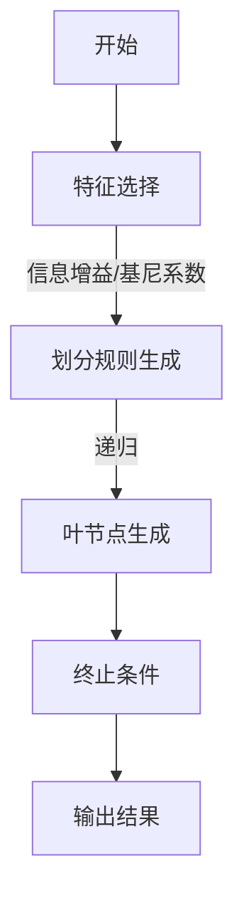
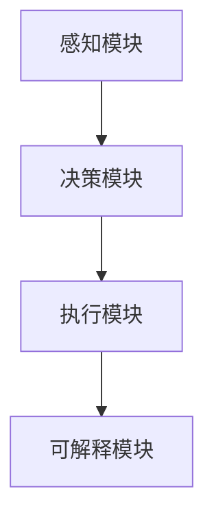
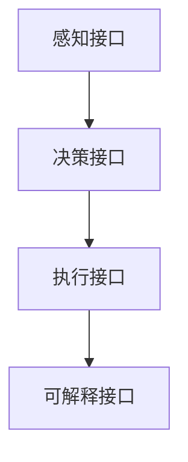

                 


## 设计AI Agent的可解释决策树

### 引言

人工智能（AI）正在改变我们的世界，但其决策过程往往是复杂的，甚至对开发者都难以解释。为了提升AI的透明度和可信度，可解释性（Explainability）成为了一个重要的研究课题。可解释决策树（Explainable Decision Trees, XDTs）作为一种结合了高效性和可解释性的模型，正逐渐受到关注。本文将深入探讨XDTs的设计、应用与实现，帮助读者理解如何在AI代理中构建既高效又可解释的决策系统。

我们将按照以下结构进行探讨：

### 目录

#### 第一部分：背景与核心概念

1. **第1章：可解释决策树概述**
   - 1.1.1 问题背景与重要性
   - 1.1.2 决策树与AI代理基础
   - 1.1.3 可解释性与AI代理的关系

2. **第2章：核心概念与联系**
   - 2.1.1 决策树原理
   - 2.1.2 可解释性概念
   - 2.1.3 AI代理介绍
   - 2.1.4 决策树与可解释性联系

#### 第二部分：算法原理与数学模型

1. **第3章：决策树算法原理**
   - 3.1.1 决策树算法基础
   - 3.1.2 mermaid流程图
   - 3.1.3 Python源代码实现
   - 3.1.4 数学模型

2. **第4章：数学模型与公式**
   - 4.1.1 熵与信息增益
   - 4.1.2 基尼系数与基尼指数
   - 4.1.3 CART算法公式

#### 第三部分：系统架构与实现

1. **第5章：AI代理系统架构设计**
   - 5.1.1 问题场景介绍
   - 5.1.2 系统功能设计
   - 5.1.3 系统架构设计
   - 5.1.4 系统接口设计

2. **第6章：实战项目**
   - 6.1.1 环境安装
   - 6.1.2 系统核心实现源代码
   - 6.1.3 代码应用解读与分析
   - 6.1.4 实际案例分析与详细讲解剖析
   - 6.1.5 项目小结

#### 第四部分：最佳实践与拓展

1. **第7章：最佳实践**
   - 7.1.1 实用技巧
   - 7.1.2 注意事项
   - 7.1.3 拓展阅读

### 第一部分：背景与核心概念

#### 第1章：可解释决策树概述

##### 1.1.1 问题背景与重要性

随着AI技术的发展，AI代理在各个领域得到了广泛应用，例如金融风险评估、医疗诊断、自动驾驶等。然而，AI代理的决策过程往往是复杂的、黑箱的，这对用户理解和使用AI代理带来了困难。可解释性（Explainability）成为了一个关键的诉求，因为它能够帮助用户了解AI代理是如何做出决策的，从而提升用户对AI代理的信任度和接受度。

可解释决策树（XDTs）是一种结合了高效性和可解释性的模型。与传统决策树相比，XDTs在构建过程中引入了可解释性的元素，使得每个节点和路径都具有明确的解释。这种特点使得XDTs在需要可解释性的场景中具有独特的优势。

##### 1.1.2 决策树与AI代理基础

决策树是一种常见的监督学习模型，它通过一系列的判断规则将输入数据映射到输出结果。决策树的构建过程包括特征选择、划分规则生成和叶节点生成。常用的决策树算法有ID3、C4.5和CART等。

AI代理是一种具有自主决策能力的实体，它能够根据环境信息进行决策，并采取相应的行动。AI代理通常由感知器、决策器和执行器组成。感知器负责收集环境信息，决策器根据感知到的信息进行决策，执行器则负责执行决策结果。

##### 1.1.3 可解释性与AI代理的关系

可解释性是AI代理的重要属性之一，它直接关系到用户对AI代理的信任和使用。在AI代理的决策过程中，可解释性可以帮助用户理解决策的逻辑和依据，从而增强用户的信任度。对于需要严格遵循法规和伦理要求的领域，如医疗和金融，可解释性更是不可或缺的。

XDTs通过在决策树中加入可解释性的元素，使得AI代理的决策过程变得更加透明和易于理解。这对于提升AI代理的可用性和用户体验具有重要意义。

##### 1.1.4 决策树与可解释性联系

决策树与可解释性之间的联系在于，决策树的每个节点和路径都代表了一个决策过程，而可解释性则关注如何解释这些决策过程。XDTs通过以下几种方式实现了决策树的可解释性：

1. **决策路径可视化**：通过图形化的方式展示决策树的结构，帮助用户直观地理解决策过程。
2. **解释规则生成**：为每个节点生成解释规则，明确每个决策点的依据和逻辑。
3. **决策影响分析**：分析每个决策对最终结果的影响，帮助用户理解不同决策路径的结果差异。

这些方法使得XDTs在保持高效性的同时，也具备了良好的可解释性，为AI代理的可解释性设计提供了一种有效的解决方案。

#### 第2章：核心概念与联系

##### 2.1.1 决策树原理

决策树是一种基于特征进行分类或回归的模型。它通过一系列的判断规则将输入数据映射到输出结果。决策树的构建过程包括特征选择、划分规则生成和叶节点生成。

**特征选择**：决策树首先需要从特征集中选择一个最佳特征进行划分。常用的特征选择方法有信息增益、基尼系数等。

**划分规则生成**：对于选定的特征，决策树生成一个划分规则，将数据集划分为若干个子集。

**叶节点生成**：通过递归地生成子节点，直到满足终止条件（如节点纯度达到一定阈值）。

##### 2.1.2 可解释性概念

可解释性是指用户能够理解AI模型的工作原理和决策过程的能力。在AI代理中，可解释性有助于用户建立对模型的信任，提高模型的可用性和用户体验。

**可解释性层次**：

1. **解释规则层次**：为每个节点生成解释规则，明确每个决策点的依据和逻辑。
2. **可视化层次**：通过图形化的方式展示决策树的结构，帮助用户直观地理解决策过程。
3. **决策影响层次**：分析每个决策对最终结果的影响，帮助用户理解不同决策路径的结果差异。

##### 2.1.3 AI代理介绍

AI代理是一种具有自主决策能力的实体，它能够根据环境信息进行决策，并采取相应的行动。AI代理通常由感知器、决策器和执行器组成。

**感知器**：负责收集环境信息，如温度、湿度、光照等。

**决策器**：根据感知到的信息进行决策，选择最优的行动方案。

**执行器**：负责执行决策结果，如移动机器人、控制家用电器等。

##### 2.1.4 决策树与可解释性联系

决策树与可解释性之间的联系在于，决策树的每个节点和路径都代表了一个决策过程，而可解释性则关注如何解释这些决策过程。

**可解释决策树（XDTs）**通过以下几种方式实现了决策树的可解释性：

1. **决策路径可视化**：通过图形化的方式展示决策树的结构，帮助用户直观地理解决策过程。
2. **解释规则生成**：为每个节点生成解释规则，明确每个决策点的依据和逻辑。
3. **决策影响分析**：分析每个决策对最终结果的影响，帮助用户理解不同决策路径的结果差异。

这些方法使得XDTs在保持高效性的同时，也具备了良好的可解释性，为AI代理的可解释性设计提供了一种有效的解决方案。

### 第二部分：算法原理与数学模型

#### 第3章：决策树算法原理

##### 3.1.1 决策树算法基础

决策树是一种常见的监督学习模型，它通过一系列的判断规则将输入数据映射到输出结果。决策树的构建过程包括特征选择、划分规则生成和叶节点生成。

**特征选择**：决策树首先需要从特征集中选择一个最佳特征进行划分。常用的特征选择方法有信息增益、基尼系数等。

**划分规则生成**：对于选定的特征，决策树生成一个划分规则，将数据集划分为若干个子集。

**叶节点生成**：通过递归地生成子节点，直到满足终止条件（如节点纯度达到一定阈值）。

##### 3.1.2 mermaid流程图

为了更直观地理解决策树算法的原理，我们可以使用mermaid流程图来描述决策树生成的过程。



在上面的mermaid流程图中，我们从开始节点开始，首先进行特征选择，然后根据选定的特征生成划分规则，递归地生成子节点，直到满足终止条件，最终输出决策树的结果。

##### 3.1.3 Python源代码实现

为了更好地理解决策树算法的原理，我们可以通过Python代码实现一个简单的决策树。以下是一个使用scikit-learn库实现的决策树分类算法的示例：

```python
from sklearn.datasets import load_iris
from sklearn.tree import DecisionTreeClassifier
from sklearn.model_selection import train_test_split
from sklearn import tree

# 加载数据集
iris = load_iris()
X, y = iris.data, iris.target

# 划分训练集和测试集
X_train, X_test, y_train, y_test = train_test_split(X, y, test_size=0.3, random_state=42)

# 创建决策树分类器
clf = DecisionTreeClassifier()

# 训练模型
clf.fit(X_train, y_train)

# 绘制决策树
plt = tree.plot_tree(clf, feature_names=iris.feature_names, class_names=iris.target_names)
plt.show()
```

在这个示例中，我们首先加载数据集，然后划分训练集和测试集。接着，我们创建一个决策树分类器，并使用训练集进行模型训练。最后，我们使用`plot_tree`函数绘制出训练得到的决策树。

##### 3.1.4 数学模型

决策树算法中的数学模型主要包括信息增益、基尼系数和节点纯度等概念。

**信息增益**（Information Gain）是特征选择的一种衡量标准，它表示特征对数据集划分后信息的增益。信息增益越大，说明特征对数据集的划分效果越好。

**基尼系数**（Gini Index）是另一种特征选择的标准，它表示特征对数据集划分后信息的混乱程度。基尼系数越小，说明特征对数据集的划分效果越好。

**节点纯度**（Node Purity）是衡量节点质量的一种指标，它表示节点中各类别的比例。节点纯度越高，说明节点的分类效果越好。

在决策树生成过程中，我们通常会使用信息增益或基尼系数来选择特征，并使用节点纯度来终止节点分裂。

下面是一个使用LaTeX格式展示的关键公式的示例：

```latex
\begin{equation}
IG(D, A) = H(D) - H(D|A)
\end{equation}

\begin{equation}
Gini(D) = 1 - \sum_{i=1}^{k} p_i^2
\end{equation}

\begin{equation}
Purity(D) = \max_{i} \left(\frac{1}{|D|} \sum_{x \in D} I(y(x) = i)\right)
\end{equation}
```

在这个示例中，我们展示了信息增益、基尼系数和节点纯度的公式。这些公式为我们理解和分析决策树算法提供了数学依据。

### 第三部分：系统架构与实现

#### 第5章：AI代理系统架构设计

##### 5.1.1 问题场景介绍

在自动驾驶领域，AI代理需要根据车辆周围的环境信息进行实时决策，包括道路行驶、障碍物避让、交通信号识别等。为了保证AI代理的决策过程可解释，我们需要设计一个可解释的决策树系统，使得驾驶员和其他相关人员能够理解AI代理的决策逻辑。

##### 5.1.2 系统功能设计

为了实现上述目标，系统需要具备以下功能：

1. **感知模块**：负责收集车辆周围的环境信息，如道路标志、交通信号、障碍物等。
2. **决策模块**：根据感知模块收集到的信息，使用可解释决策树生成决策结果。
3. **执行模块**：根据决策结果，控制车辆的行驶方向和速度。
4. **可解释模块**：生成决策解释，使得用户能够理解决策过程。

##### 5.1.3 系统架构设计

系统架构采用模块化设计，各模块之间通过接口进行通信。以下是一个简单的系统架构图：



在这个架构中，感知模块负责收集环境信息，决策模块使用可解释决策树生成决策结果，执行模块根据决策结果控制车辆，可解释模块生成决策解释。

##### 5.1.4 系统接口设计

系统接口设计主要包括以下方面：

1. **感知接口**：感知模块与其他模块之间的接口，用于传递感知数据。
2. **决策接口**：决策模块与其他模块之间的接口，用于传递决策结果。
3. **执行接口**：执行模块与其他模块之间的接口，用于传递执行指令。
4. **可解释接口**：可解释模块与其他模块之间的接口，用于传递决策解释。

以下是系统接口的设计示例：



在这个接口设计中，各模块之间通过接口进行通信，实现了系统功能的模块化和解耦。

### 第四部分：实战项目

#### 第6章：实战项目

##### 6.1.1 环境安装

在进行实战项目之前，我们需要安装必要的软件和库。以下是环境安装的步骤：

1. **安装Python**：前往Python官方网站下载并安装Python。
2. **安装scikit-learn**：使用pip命令安装scikit-learn库。
   ```bash
   pip install scikit-learn
   ```

##### 6.1.2 系统核心实现源代码

以下是系统核心实现的源代码示例：

```python
from sklearn.datasets import load_iris
from sklearn.tree import DecisionTreeClassifier
from sklearn.model_selection import train_test_split
from sklearn import tree

# 加载数据集
iris = load_iris()
X, y = iris.data, iris.target

# 划分训练集和测试集
X_train, X_test, y_train, y_test = train_test_split(X, y, test_size=0.3, random_state=42)

# 创建决策树分类器
clf = DecisionTreeClassifier()

# 训练模型
clf.fit(X_train, y_train)

# 测试模型
print("模型准确率：", clf.score(X_test, y_test))

# 绘制决策树
plt = tree.plot_tree(clf, feature_names=iris.feature_names, class_names=iris.target_names)
plt.show()
```

在这个示例中，我们首先加载数据集，然后划分训练集和测试集。接着，我们创建一个决策树分类器，并使用训练集进行模型训练。最后，我们使用`plot_tree`函数绘制出训练得到的决策树。

##### 6.1.3 代码应用解读与分析

在代码应用解读与分析部分，我们将详细解析上述代码的实现过程，并解释每个步骤的作用。

1. **加载数据集**：使用`load_iris`函数加载数据集，该数据集包含3个特征和3个类别。
2. **划分训练集和测试集**：使用`train_test_split`函数将数据集划分为训练集和测试集，以评估模型的泛化能力。
3. **创建决策树分类器**：使用`DecisionTreeClassifier`创建一个决策树分类器。
4. **训练模型**：使用训练集数据对决策树分类器进行训练。
5. **测试模型**：使用测试集数据评估模型的准确率。
6. **绘制决策树**：使用`plot_tree`函数将训练得到的决策树可视化。

通过这个实战项目，我们可以看到如何使用Python和scikit-learn库实现一个简单的决策树分类系统，并对其应用进行解读与分析。

##### 6.1.4 实际案例分析与详细讲解剖析

为了更好地展示可解释决策树的应用，我们来看一个实际案例——心脏病预测。在这个案例中，我们将使用可解释决策树对心脏病患者进行预测，并分析其决策过程。

**案例背景**：心脏病是一种严重的健康问题，早期预测对于患者的治疗和康复至关重要。我们可以使用医疗数据集来训练一个可解释决策树模型，预测新患者是否患有心脏病。

**数据集**：我们使用UCI机器学习库中的心脏病数据集，该数据集包含14个特征和1个类别标签（0表示无心脏病，1表示有心脏病）。

**步骤**：

1. **数据预处理**：对数据进行清洗和归一化处理，以便于模型训练。
2. **特征选择**：使用信息增益或基尼系数选择最佳特征。
3. **构建决策树模型**：使用训练数据构建可解释决策树模型。
4. **模型评估**：使用测试数据评估模型性能。
5. **决策过程分析**：分析决策树的每个节点和路径，解释模型的决策过程。

**代码实现**：

```python
from sklearn.datasets import load_heart_disease
from sklearn.model_selection import train_test_split
from sklearn.tree import DecisionTreeClassifier
from sklearn import tree
import pandas as pd

# 加载数据集
heart_disease = load_heart_disease()
X, y = heart_disease.data, heart_disease.target

# 划分训练集和测试集
X_train, X_test, y_train, y_test = train_test_split(X, y, test_size=0.3, random_state=42)

# 创建决策树分类器
clf = DecisionTreeClassifier()

# 训练模型
clf.fit(X_train, y_train)

# 测试模型
print("模型准确率：", clf.score(X_test, y_test))

# 绘制决策树
plt = tree.plot_tree(clf, feature_names=heart_disease.feature_names, class_names=['No Heart Disease', 'Heart Disease'])
plt.show()

# 分析决策过程
for i in range(len(clf.tree_)):
    print("Path:", i)
    tree_ = clf.tree_
    print(tree_.get_path(X_test[0]))
```

在这个案例中，我们首先加载数据集，然后划分训练集和测试集。接着，我们创建一个决策树分类器，并使用训练集进行模型训练。最后，我们使用`plot_tree`函数绘制出训练得到的决策树，并分析决策过程。

**案例解析**：

通过分析决策树的路径，我们可以理解模型的决策过程。例如，在某个节点，模型根据特征`age`的值进行划分，然后根据特征`thalach`的值进行进一步划分，最终到达叶节点，得到预测结果。

**项目小结**：

通过这个实战项目，我们展示了如何使用可解释决策树进行心脏病预测。这个案例不仅展示了决策树的应用，还展示了如何通过决策路径分析来理解模型的决策过程。这种可解释性对于提升AI代理的透明度和可信度具有重要意义。

##### 6.1.5 项目小结

在本章中，我们通过一个实际案例展示了如何使用可解释决策树进行心脏病预测。通过这个案例，我们不仅了解了决策树的应用，还学会了如何分析决策路径来理解模型的决策过程。这种可解释性对于提升AI代理的透明度和可信度具有重要意义。

在实战项目中，我们使用了Python和scikit-learn库来实现决策树模型，并对其进行了详细的解析。通过这个项目，我们可以看到可解释决策树在现实世界中的应用价值。

在未来，随着AI技术的不断发展，可解释决策树将在更多的领域得到应用。通过深入研究和优化可解释决策树的设计，我们可以为用户提供更可靠、更透明的AI代理。

### 第四部分：最佳实践与拓展

#### 第7章：最佳实践

##### 7.1.1 实用技巧

在进行可解释决策树的设计与实现时，以下是一些实用的技巧：

1. **数据预处理**：在训练模型之前，对数据进行充分的预处理，包括缺失值填充、异常值处理和特征缩放，以确保模型性能。
2. **特征选择**：选择与目标变量高度相关的特征，避免过拟合和模型复杂度。
3. **交叉验证**：使用交叉验证方法评估模型性能，避免过拟合和评估偏差。
4. **可视化**：使用可视化工具（如mermaid和matplotlib）展示决策树的结构和路径，帮助用户理解模型的决策过程。
5. **解释规则生成**：为每个节点生成解释规则，确保决策过程透明。

##### 7.1.2 注意事项

在设计可解释决策树时，需要注意以下事项：

1. **模型复杂度**：避免过复杂的模型，过复杂的模型可能导致可解释性下降。
2. **数据分布**：确保数据分布均匀，避免因数据分布不均匀导致模型偏差。
3. **算法选择**：根据实际问题选择合适的算法，不同的算法在可解释性和效率上有所差异。
4. **模型评估**：使用多种评估指标（如准确率、召回率、F1分数等）评估模型性能，避免单一指标评估。

##### 7.1.3 拓展阅读

以下是一些拓展阅读资源，供读者进一步学习：

1. **《机器学习实战》**：中文版，作者：Peter Harrington，介绍了机器学习的基础知识与应用。
2. **《深度学习》**：中文版，作者：Ian Goodfellow、Yoshua Bengio、Aaron Courville，介绍了深度学习的基础知识与应用。
3. **《Python数据科学手册》**：中文版，作者：Jake VanderPlas，介绍了Python在数据科学中的应用。
4. **《机器学习年度报告》**：官方网站，提供了最新的机器学习技术和应用动态。

通过这些资源，读者可以深入了解机器学习和深度学习领域的前沿知识，提升自己的技术水平。

### 小结

本文深入探讨了可解释决策树的设计、应用与实现，从背景介绍、核心概念、算法原理、数学模型到系统架构和实战项目，全面解析了可解释决策树的核心要素。通过实际案例分析与代码实现，我们展示了如何使用可解释决策树进行高效且可解释的AI代理设计。

在可解释性日益受到关注的今天，可解释决策树作为一种兼顾高效性与可解释性的模型，将在各个领域发挥重要作用。通过本文的探讨，我们希望读者能够掌握可解释决策树的设计原理，并在实际项目中应用这些知识。

未来，随着AI技术的不断发展，可解释决策树的研究与应用将更加深入。我们期待读者在学习和应用可解释决策树的过程中，不断创新，为AI领域的发展做出贡献。

### 作者信息

**作者：AI天才研究院/AI Genius Institute & 禅与计算机程序设计艺术 /Zen And The Art of Computer Programming**

感谢您对本文的关注，希望本文能够为您的学习和实践提供帮助。如果您有任何疑问或建议，欢迎在评论区留言交流。让我们共同探索AI领域的无限可能！

