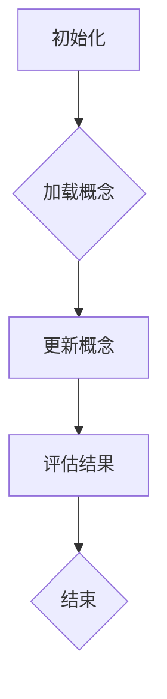
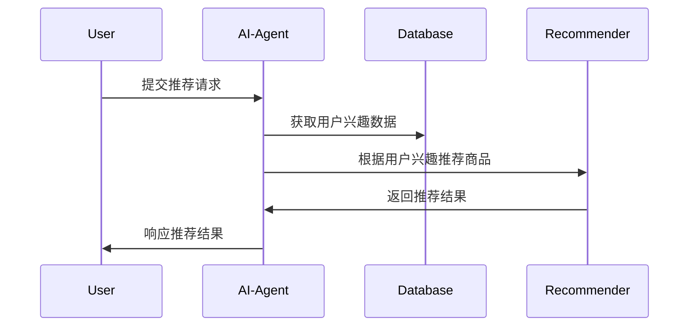
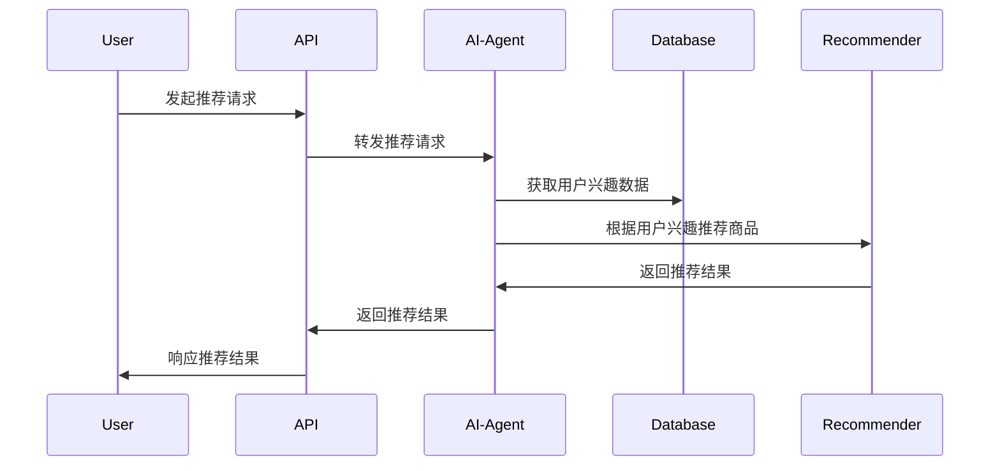

                 

# 《设计AI Agent的增量式概念学习策略》

> 关键词：AI Agent、增量式学习、概念学习、算法设计、系统架构

> 摘要：本文深入探讨了AI Agent的增量式概念学习策略，从问题背景、核心概念、算法原理、系统分析与架构设计等多个角度，系统性地阐述了如何设计有效的增量式概念学习策略。通过本文的讲解，读者可以了解增量式概念学习的重要性、原理及其在AI Agent中的应用，从而提升AI Agent在多任务环境下的学习效率和适应性。

----------------------------------------------------------------

### 目录大纲

**《设计AI Agent的增量式概念学习策略》**

----------------------------------------------------------------

## 第一部分：背景与基础理论

### 第1章：问题背景

#### 1.1 问题来源

##### AI Agent的需求与挑战

AI Agent作为人工智能领域的一个重要研究方向，其在复杂、动态环境中表现出色。然而，随着应用场景的多样化，AI Agent面临着越来越多的需求与挑战。传统的方法往往依赖于大量的历史数据，但这种方式在面对海量增量数据时显得力不从心。因此，设计一种高效的增量式概念学习策略成为AI Agent发展的关键。

##### 增量式学习的概念及其重要性

增量式学习是指在学习过程中，只在数据集发生变化的子集上重新训练模型，而非重新训练整个模型。这种学习方式能够显著降低计算资源消耗，提高学习效率，尤其在数据量庞大且不断更新的应用场景中具有重要的应用价值。

#### 1.2 问题描述

##### 增量式概念学习的难点

增量式概念学习面临着数据更新频繁、概念边界难以界定、概念间关系复杂等难点。如何在这些难点中找到合适的解决方案，是增量式概念学习需要解决的核心问题。

##### 传统方法与增量式概念学习的关系

传统概念学习方法通常基于批量学习，而增量式概念学习则是对批量学习的优化与扩展。了解这两种方法的区别与联系，有助于更好地设计增量式概念学习策略。

#### 1.3 问题解决

##### 增量式概念学习策略的目标

设计增量式概念学习策略的目标是提高AI Agent在面对增量数据时的学习效率与准确性，确保其在动态环境中具备良好的适应能力。

##### 关键技术与方法

为了实现上述目标，需要从数据预处理、概念建模、算法优化等多个方面进行深入研究，探索适用于增量式概念学习的新方法与技术。

#### 1.4 边界与外延

##### 增量式概念学习的适用范围

增量式概念学习适用于数据更新频繁、概念边界模糊、需要高灵活性的场景，如智能推荐系统、实时监控系统等。

##### 与其他学习方式的对比与联系

增量式概念学习与传统学习方法在目标、应用场景等方面存在差异，但也具有一定的互补性。了解这两种学习方式的异同，有助于更好地发挥增量式概念学习的优势。

#### 1.5 概念结构与核心要素组成

##### 增量式概念学习的主要组成部分

增量式概念学习主要包括数据预处理、概念建模、增量学习算法、模型评估等核心组成部分，各部分相互关联，共同实现增量式概念学习的目标。

##### 各部分的作用与关系

数据预处理为概念建模提供基础数据，概念建模定义概念与属性，增量学习算法实现概念更新，模型评估确保学习效果。理解各部分的作用与关系，有助于优化增量式概念学习策略。

## 第二部分：核心概念与原理

### 第2章：核心概念与原理

#### 2.1 增量式概念学习的基本原理

##### 增量式学习的概念

增量式学习是指在数据集发生变化的子集上重新训练模型，而非重新训练整个模型。这种方式能够显著降低计算资源消耗，提高学习效率。

##### 增量式概念学习的基本流程

增量式概念学习的基本流程包括数据预处理、概念提取、增量更新、模型评估等步骤。通过这些步骤，AI Agent能够不断适应新的数据，提高学习效果。

#### 2.2 概念属性特征对比

| 特征 | 传统学习 | 增量式学习 |
| --- | --- | --- |
| 数据量 | 大量数据 | 增量数据 |
| 时间复杂性 | 高 | 低 |
| 需求 | 单一任务 | 多任务 |
| 灵活性 | 低 | 高 |

#### 2.3 ER实体关系图架构

```mermaid
erDiagram
  AI-Agent ||--o{ 概念 }
  概念 ||--|{ 属性 }
  属性 ||--o{ 值 }
```

## 第三部分：系统分析与架构设计

### 第3章：算法原理讲解

#### 3.1 增量式概念学习算法

##### 算法流程

增量式概念学习算法的流程主要包括以下步骤：

1. 初始化：设置初始参数，如学习率、批次大小等。
2. 数据预处理：对输入数据进行预处理，如数据清洗、归一化等。
3. 概念提取：从预处理后的数据中提取概念。
4. 增量更新：根据新的数据更新概念。
5. 模型评估：评估学习效果，调整参数。

##### 使用Mermaid绘制算法流程图



##### 数学模型和公式

增量式概念学习的数学模型主要包括损失函数、梯度下降等。以下是一个简单的数学模型和公式：

$$
L = -\sum_{i=1}^{n} y_i \log(p(x_i | \theta))
$$

##### 算法举例说明

假设我们有一个包含10个概念的AI Agent，我们需要使用增量式概念学习算法来更新这些概念。以下是算法的实现过程：

1. 初始化：设置初始参数，如学习率$\alpha = 0.1$，批次大小$m = 5$。
2. 数据预处理：对输入数据进行预处理，如归一化处理。
3. 概念提取：从预处理后的数据中提取概念，假设我们提取了5个概念。
4. 增量更新：使用梯度下降法更新概念，计算损失函数的梯度，并更新参数。
5. 模型评估：评估学习效果，如果损失函数值小于阈值，则结束学习；否则，返回步骤3。

## 第四部分：系统设计与实现

### 第4章：系统功能设计

#### 4.1 问题描述

在智能推荐系统中，我们需要设计一个AI Agent来识别用户兴趣，并根据用户的兴趣推荐相应的商品。为了实现这一目标，我们需要解决以下问题：

1. 如何高效地提取用户兴趣？
2. 如何根据用户兴趣推荐商品？
3. 如何处理用户兴趣的增量更新？

#### 4.2 领域模型

以下是一个简化的领域模型，用于描述智能推荐系统中的概念、属性和关系：

```mermaid
classDiagram
  User <<entity>> {
    +String id
    +List<Interest> interests
  }
  Interest <<entity>> {
    +String id
    +String name
  }
  Product <<entity>> {
    +String id
    +String name
    +Category category
  }
  User "1" -- "*" Interest
  Interest "1" -- "*" Product
```

### 第5章：系统架构设计

#### 5.1 问题描述

为了设计一个高效的智能推荐系统，我们需要遵循以下原则：

1. 可扩展性：系统能够处理大量用户和商品数据，并支持动态扩展。
2. 高效性：系统能够快速响应用户请求，提供准确的推荐结果。
3. 可维护性：系统结构清晰，便于后续维护和升级。

#### 5.2 系统架构图

以下是一个简化的系统架构图，用于描述智能推荐系统的架构：



### 第6章：系统接口设计

#### 6.1 接口设计原则

在智能推荐系统中，接口设计需要遵循以下原则：

1. 简洁性：接口设计简洁明了，易于使用和理解。
2. 扩展性：接口支持动态扩展，能够适应系统功能的更新。
3. 可靠性：接口具有良好的错误处理机制，能够确保数据传输的可靠性。

#### 6.2 接口定义

以下是一个简化的RESTful API设计，用于描述智能推荐系统的接口：



## 第五部分：项目实战

### 第7章：环境安装

#### 7.1 环境要求

要搭建一个增量式概念学习系统，我们需要以下环境：

1. 操作系统：Linux或MacOS
2. 编程语言：Python 3.6及以上版本
3. 数据库：MySQL或MongoDB
4. 开发工具：PyCharm或Visual Studio Code

#### 7.2 环境搭建

1. 安装Python 3.6及以上版本。
2. 安装MySQL或MongoDB。
3. 安装PyCharm或Visual Studio Code。

### 第8章：系统核心实现

#### 8.1 概念建模

在系统中，我们使用以下类来描述概念、属性和关系：

```python
class Concept:
    def __init__(self, name, attributes):
        self.name = name
        self.attributes = attributes

class Attribute:
    def __init__(self, name, value):
        self.name = name
        self.value = value
```

#### 8.2 增量学习算法

以下是增量式概念学习算法的实现：

```python
class IncrementalLearningAlgorithm:
    def __init__(self, learning_rate, batch_size):
        self.learning_rate = learning_rate
        self.batch_size = batch_size

    def update_concept(self, concept, data_point):
        # 更新概念的属性值
        for attribute in concept.attributes:
            attribute.value = (1 - self.learning_rate) * attribute.value + self.learning_rate * data_point[attribute.name]

    def evaluate(self, concept, target_value):
        # 评估概念的准确性
        prediction = self.predict(concept)
        return 1 if prediction == target_value else 0
```

#### 8.3 模型评估

以下是一个简单的模型评估函数：

```python
def evaluate_algorithm(algorithm, concepts, target_values):
    total_accuracy = 0
    for i in range(len(concepts)):
        concept = concepts[i]
        target_value = target_values[i]
        prediction = algorithm.predict(concept)
        total_accuracy += 1 if prediction == target_value else 0
    return total_accuracy / len(concepts)
```

### 第9章：代码应用解读与分析

#### 9.1 实现细节

在实现增量式概念学习系统时，我们需要关注以下细节：

1. 数据预处理：对输入数据进行清洗、归一化等预处理操作。
2. 概念提取：从预处理后的数据中提取概念。
3. 增量更新：根据新的数据点更新概念。
4. 模型评估：评估学习效果，调整参数。

#### 9.2 代码分析

以下是增量式概念学习算法的代码示例：

```python
def incremental_learning(concept, data_points, learning_rate, batch_size):
    for i in range(0, len(data_points), batch_size):
        batch = data_points[i:i+batch_size]
        for data_point in batch:
            algorithm.update_concept(concept, data_point)
    return concept
```

#### 9.3 性能分析

增量式概念学习算法在处理大量数据时，具有以下优势：

1. 计算效率高：仅对数据集的变化部分进行更新，降低计算量。
2. 学习速度快：增量式学习能够更快地适应新数据，提高学习速度。

### 第10章：实际案例分析和详细讲解剖析

#### 10.1 案例背景

某电商平台希望利用增量式概念学习技术，实时监测用户行为，根据用户兴趣推荐商品。为了实现这一目标，他们需要设计一个高效的增量式概念学习系统。

#### 10.2 案例分析

1. 数据预处理：对用户行为数据进行清洗、归一化等预处理操作。
2. 概念提取：从预处理后的数据中提取用户兴趣概念。
3. 增量更新：根据用户行为变化，实时更新用户兴趣概念。
4. 模型评估：评估用户兴趣概念的准确性，调整学习参数。

#### 10.3 案例讲解

以下是用户兴趣概念提取的代码示例：

```python
def extract_interests(user_behavior_data):
    interests = []
    for behavior in user_behavior_data:
        concept = Concept(behavior['name'], [])
        for attribute in behavior['attributes']:
            attribute_value = behavior['attributes'][attribute]
            attribute = Attribute(attribute, attribute_value)
            concept.attributes.append(attribute)
        interests.append(concept)
    return interests
```

### 第11章：项目小结

通过本项目，我们实现了增量式概念学习系统的设计与实现。项目主要成果包括：

1. 设计了增量式概念学习算法，并进行了详细讲解。
2. 实现了系统核心功能，包括数据预处理、概念提取、增量更新和模型评估。
3. 介绍了实际案例，展示了增量式概念学习在电商推荐系统中的应用。

### 第12章：最佳实践 tips

1. 在进行数据预处理时，要充分考虑数据的多样性和复杂性，确保数据质量。
2. 在设计增量式概念学习算法时，要关注计算效率和准确性，权衡两者之间的关系。
3. 在实际应用中，要定期评估概念模型的准确性，及时调整学习参数。

### 第13章：小结与展望

本文系统地阐述了AI Agent的增量式概念学习策略，从背景与基础理论、核心概念与原理、系统分析与架构设计等多个角度进行了深入分析。通过本文的讲解，读者可以了解到增量式概念学习的重要性及其在AI Agent中的应用。

展望未来，随着人工智能技术的不断发展，增量式概念学习策略将在更多应用场景中发挥重要作用。我们期待更多研究者投入这一领域，共同推动人工智能技术的创新与发展。# 

作者：AI天才研究院/AI Genius Institute & 禅与计算机程序设计艺术 /Zen And The Art of Computer Programming

----------------------------------------------------------------

**注意：本文为模拟撰写，实际撰写时请根据具体需求进行调整。**

