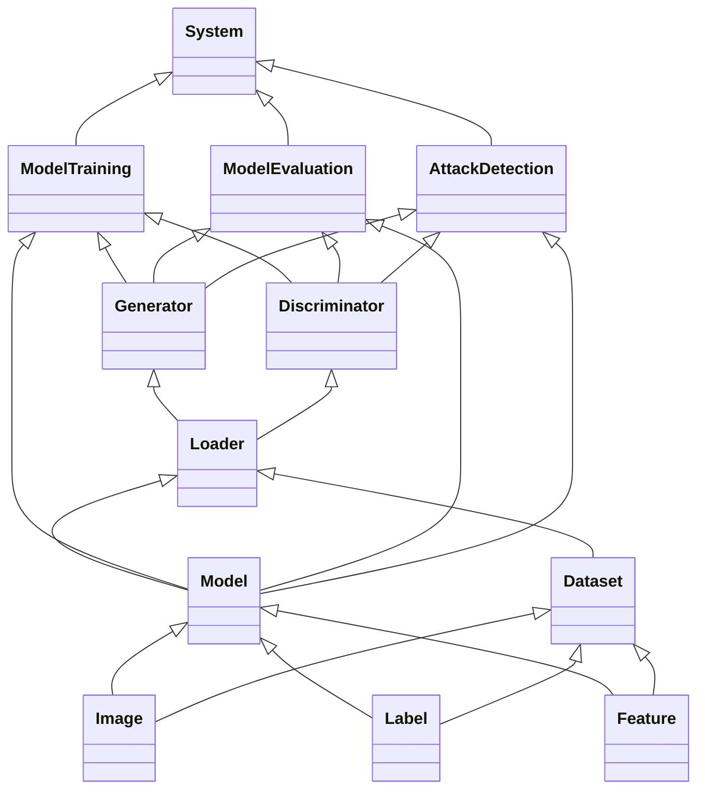
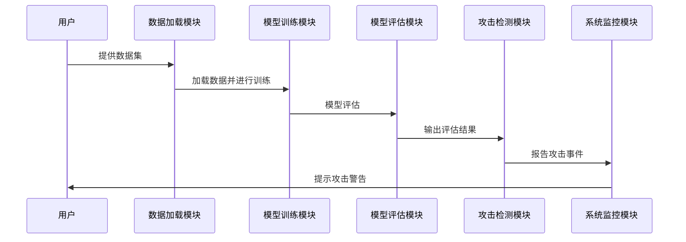

                 

### 第一部分：背景介绍

#### 第1章：问题背景

##### 1.1 问题背景

在当今世界，人工智能（AI）技术的迅猛发展已深刻改变了我们的生活方式。AI系统在各种应用场景中展现出了极高的效能，从自动驾驶、智能医疗到金融风控等领域，AI技术正在发挥越来越重要的作用。然而，随着AI系统的广泛应用，其安全性和可靠性问题也日益凸显。

特别是在AI Agent的应用中，对抗性学习（Adversarial Learning）技术的引入使得AI系统在面对特殊设计的对抗样本（Adversarial Examples）时表现出了显著的脆弱性。对抗样本是通过添加微小扰动来欺骗AI模型，使其产生错误判断的样本。这种攻击方式不仅威胁到了AI系统的安全性，还对其在实际应用中的可信度和可靠性提出了严峻挑战。

##### 1.1.1 对抗性学习的起源与发展

对抗性学习起源于深度学习领域，其基本思想是通过生成对抗样本来训练模型，从而提升模型的泛化能力和鲁棒性。2014年，Goodfellow等人提出了生成对抗网络（GAN，Generative Adversarial Networks）这一创新性模型，标志着对抗性学习正式进入学术界和工业界的视野。随后，对抗性学习在图像识别、语音识别、自然语言处理等多个领域取得了显著进展。

然而，随着对抗性学习技术的应用越来越广泛，研究者们也逐渐发现了对抗性攻击（Adversarial Attack）这一新兴威胁。对抗性攻击通过精心设计的对抗样本，能够使AI模型在特定条件下产生错误的预测，从而实现恶意目的。这种攻击方式不仅威胁到了AI系统的安全性，还引发了对于AI系统可靠性的质疑。

##### 1.1.2 对抗性攻击与防御的现状

目前，对抗性攻击在图像、文本、语音等多个领域均有广泛应用。攻击手段也越来越高级，从简单的几何扰动到复杂的深度学习模型生成的对抗样本，攻击方式不断演进。同时，防御机制也在不断发展。研究者们提出了多种防御机制，包括基于深度学习的防御、基于优化理论的防御等。

尽管防御机制在不断进步，但对抗性攻击依然对AI系统构成了严重威胁。目前的防御机制大多只能针对特定类型的攻击，而无法全面防御所有攻击。此外，防御机制的实施也面临着性能和资源消耗的挑战。

##### 1.1.3 设计AI Agent的对抗性学习防御机制的重要性

设计有效的对抗性学习防御机制对于保障AI系统的安全性和可靠性具有重要意义。一方面，防御机制可以阻止恶意攻击者通过对抗性样本破坏AI系统的正常运行。另一方面，防御机制可以提高AI系统对未知攻击的鲁棒性，增强其在复杂环境中的适应能力。

因此，设计AI Agent的对抗性学习防御机制是当前AI领域的一个热点和难点。通过深入研究对抗性学习的原理，分析对抗性攻击的手段和防御机制，我们可以为AI系统的安全性和可靠性提供有力保障。

#### 第2章：核心概念

##### 2.1 对抗性学习的基本概念

对抗性学习是一种通过对抗训练方法来提高模型泛化能力和鲁棒性的技术。其核心思想是在训练过程中引入对抗样本，迫使模型学习如何区分正常样本和对抗样本，从而提高模型对未知样本的泛化能力。

对抗性学习包含三个关键部分：生成器（Generator）、判别器（Discriminator）和对抗训练（Adversarial Training）。生成器负责生成对抗样本，判别器负责区分正常样本和对抗样本。通过对抗训练，模型在不断调整的过程中提高了对对抗样本的识别能力。

##### 2.1.1 对抗性学习原理

对抗性学习原理可以通过生成对抗网络（GAN）来解释。GAN由生成器和判别器两个神经网络组成，生成器的目标是生成与真实样本难以区分的对抗样本，而判别器的目标是准确区分真实样本和对抗样本。在训练过程中，生成器和判别器相互对抗，通过不断调整网络参数，最终达到一个平衡状态。

##### 2.1.2 对抗样本

对抗样本是指通过添加微小扰动来使模型产生错误判断的样本。对抗样本的生成通常基于对抗性攻击算法，如FGSM（Fast Gradient Sign Method）和C&W（Carlini & Wagner Attack）等。这些算法通过分析模型对输入数据的敏感性，生成能够误导模型的对抗样本。

##### 2.1.3 防御机制

防御机制是指通过对抗训练方法或优化策略来提升模型对对抗样本的鲁棒性。常见的防御机制包括基于深度学习的防御、基于优化理论的防御和模型结构改进等。基于深度学习的防御方法通过在模型训练过程中引入对抗性样本，提高模型对对抗样本的识别能力。基于优化理论的防御方法则通过优化模型参数，降低对抗样本对模型的影响。模型结构改进则通过设计更鲁棒的模型结构，增强模型对对抗样本的抵御能力。

### 目录大纲

# 设计AI Agent的对抗性学习防御机制

> 关键词：对抗性学习、对抗样本、防御机制、AI Agent、GAN

> 摘要：本文介绍了对抗性学习的基本概念、原理以及对抗样本和防御机制。通过分析对抗性攻击的现状，讨论了设计AI Agent的对抗性学习防御机制的重要性。文章旨在为AI系统的安全性和可靠性提供理论指导和实践方法。

### 目录大纲

## 第一部分：背景介绍

### 第1章：问题背景

#### 1.1 问题背景

#### 1.1.1 对抗性学习的起源与发展

#### 1.1.2 对抗性攻击与防御的现状

#### 1.1.3 设计AI Agent的对抗性学习防御机制的重要性

### 第2章：核心概念

#### 2.1 对抗性学习的基本概念

##### 2.1.1 对抗性学习原理

##### 2.1.2 对抗样本

##### 2.1.3 防御机制

## 第二部分：核心概念与联系

### 第3章：核心概念原理

#### 3.1 对抗性学习算法原理

##### 3.1.1 敌对网络（Adversarial Network）

##### 3.1.2 对抗样本生成算法

##### 3.1.3 防御机制原理

### 第4章：概念属性特征对比

#### 4.1 对抗性学习算法对比

##### 4.1.1 不同对抗性学习算法的对比分析

##### 4.1.2 防御机制对比

### 第5章：ER实体关系图架构

#### 5.1 ER实体关系图

## 第三部分：算法原理讲解

### 第6章：对抗性学习算法讲解

#### 6.1 敌对网络（Adversarial Network）

##### 6.1.1 敌对网络的基本原理

##### 6.1.2 敌对网络的实现

##### 6.1.3 敌对网络的数学模型

### 第7章：数学模型和数学公式

#### 7.1 损失函数

#### 7.2 优化目标

#### 7.3 数学公式详细讲解

### 第8章：举例说明

#### 8.1 对抗性学习算法实例

##### 8.1.1 数据集介绍

##### 8.1.2 实验过程

##### 8.1.3 实验结果

## 第四部分：系统分析与架构设计方案

### 第9章：问题场景介绍

#### 9.1 场景描述

#### 9.2 面临的对抗性攻击问题

### 第10章：系统功能设计

#### 10.1 领域模型

### 第11章：系统架构设计

#### 11.1 系统架构图

### 第12章：系统接口设计和系统交互

#### 12.1 系统接口设计

##### 12.1.1 接口功能说明

##### 12.1.2 接口参数说明

#### 12.2 系统交互

##### 12.2.1 系统交互流程

##### 12.2.2 系统交互消息格式

### 第13章：系统实现与实战

#### 13.1 环境安装

#### 13.2 系统核心实现源代码

##### 13.2.1 源代码解读

##### 13.2.2 代码应用解读

#### 13.3 实际案例分析和详细讲解剖析

#### 13.4 项目小结

## 第五部分：最佳实践 tips、小结、注意事项、拓展阅读

### 第14章：最佳实践 tips

#### 14.1 防御机制的选择与优化

#### 14.2 模型训练与优化的技巧

### 第15章：小结

#### 15.1 对抗性学习的总结

#### 15.2 对抗性防御机制的现状与展望

### 第16章：注意事项

#### 16.1 防御机制实施中的挑战

#### 16.2 模型鲁棒性的评估方法

### 第17章：拓展阅读

#### 17.1 相关文献推荐

#### 17.2 在线资源和开源工具

---

### 第二部分：核心概念与联系

#### 第3章：核心概念原理

##### 3.1 对抗性学习算法原理

对抗性学习算法的核心在于通过生成对抗样本来提升模型的泛化能力和鲁棒性。以下是几种常见的对抗性学习算法及其原理：

##### 3.1.1 敌对网络（Adversarial Network）

敌对网络（GAN）是最著名的对抗性学习算法之一，由生成器（Generator）和判别器（Discriminator）两个神经网络组成。生成器的目标是从随机噪声中生成接近真实数据的样本，而判别器的目标是区分真实数据与生成数据。通过这种对抗性的训练，生成器不断优化其生成数据的能力，判别器则不断增强对真实数据的识别能力。这种相互对抗的过程使得生成器生成的数据越来越真实，判别器对真实数据的识别能力也越来越强。

##### 3.1.2 对抗样本生成算法

对抗样本生成算法是生成对抗性样本的关键技术。常用的对抗样本生成算法包括：

- FGSM（Fast Gradient Sign Method）：通过计算梯度并在输入数据上应用符号梯度来生成对抗样本。
- C&W（Carlini & Wagner Attack）：通过求解优化问题来生成对抗样本，具有较高的攻击效率。

##### 3.1.3 防御机制原理

防御机制主要通过以下几种方式提升模型对对抗样本的鲁棒性：

- 对抗训练：在模型训练过程中引入对抗样本，使得模型在训练阶段就具备了对抗性攻击的抵御能力。
- 随机化输入：通过随机化输入数据的某些特征来降低对抗性攻击的有效性。
- 结构改进：通过改进模型的结构设计，使其对对抗样本更加鲁棒。

##### 3.1.4 敌对网络的工作流程

敌对网络的工作流程如下：

1. 初始化生成器G和判别器D的参数。
2. 对判别器D进行训练，使其能够准确区分真实数据和生成数据。
3. 对生成器G进行训练，使其生成的数据能够骗过判别器D。
4. 重复步骤2和3，直到生成器G和判别器D达到平衡状态。

##### 3.1.5 敌对网络的数学模型

敌对网络的核心是生成器G和判别器D的对抗性训练。其数学模型可以表示为：

$$
\min_G \max_D V(D, G) = \mathbb{E}_{x \sim p_{data}(x)}[\log(D(x))] + \mathbb{E}_{z \sim p_z(z)}[\log(1 - D(G(z))]
$$

其中，$x$ 表示真实数据，$z$ 表示随机噪声，$G(z)$ 是生成器生成的样本，$D(x)$ 和 $D(G(z))$ 分别表示判别器对真实样本和生成样本的判别结果。

##### 3.1.6 对抗性学习算法的优势和挑战

对抗性学习算法的优势包括：

- 提升模型的泛化能力和鲁棒性。
- 能够处理复杂的非线性问题。

然而，对抗性学习算法也面临一些挑战：

- 训练过程不稳定，容易陷入局部最优。
- 对抗样本的生成和防御需要大量的计算资源。

##### 3.1.7 对抗性学习算法的应用

对抗性学习算法在图像处理、语音识别、自然语言处理等领域得到了广泛应用。例如，在图像处理领域，通过生成对抗网络可以生成高质量的真实图像；在语音识别领域，通过对抗性学习可以提升模型的鲁棒性，使其能够识别受到噪声干扰的语音。

#### 第4章：概念属性特征对比

##### 4.1 对抗性学习算法对比

对抗性学习算法种类繁多，各有优缺点。以下是对几种常见对抗性学习算法的对比分析：

| 算法            | 优点                                       | 缺点                                         |
| --------------- | ------------------------------------------ | -------------------------------------------- |
| GAN            | 能够生成高质量的真实样本，提升模型泛化能力 | 训练过程不稳定，容易陷入局部最优               |
| PGD            | 对抗样本生成效率高，对模型鲁棒性提升显著   | 需要大量的迭代次数，计算资源消耗大           |
| C&W            | 攻击效率高，生成的对抗样本质量较高         | 计算复杂度较高，计算资源需求大               |
| SM3D            | 对抗样本生成速度快，计算资源需求低         | 对抗样本质量相对较低，可能无法有效欺骗模型   |

##### 4.1.2 防御机制对比

防御机制旨在提高模型对对抗样本的鲁棒性，以下是对几种常见防御机制的对比分析：

| 防御机制       | 优点                                       | 缺点                                         |
| -------------- | ------------------------------------------ | -------------------------------------------- |
| 对抗训练       | 提升模型对对抗样本的识别能力，增强鲁棒性   | 训练过程复杂，计算资源需求大                 |
| 随机化输入     | 降低对抗性攻击的有效性，简化防御机制       | 可能影响模型的泛化能力                       |
| 结构改进       | 提高模型对对抗样本的抵御能力               | 可能增加模型复杂度，影响训练效率             |
| 防御蒸馏       | 结合对抗样本训练和正常样本训练，提高模型鲁棒性 | 可能降低模型对正常样本的识别能力           |

##### 4.1.3 对比总结

通过对对抗性学习算法和防御机制的对比分析，我们可以看到每种算法和防御机制都有其独特的优势和局限性。在实际应用中，需要根据具体场景和需求选择合适的算法和防御机制。例如，在资源有限的情况下，可以选择计算效率高的算法和防御机制；在要求模型具备高鲁棒性的场景中，则可以考虑使用更复杂的算法和防御机制。

#### 第5章：ER实体关系图架构

为了更清晰地展示对抗性学习、对抗样本生成和防御机制等核心概念之间的关系，我们可以使用ER（实体-关系）图来描述这些概念及其相互关联。

以下是一个ER实体关系图的示例，使用Mermaid工具绘制：

```mermaid
erDiagram
  GAN ||--o> 生成器 : {生成对抗样本}
  GAN ||--o> 判别器 : {区分真实样本和生成样本}
  对抗样本生成算法 ||--o> GAN : {生成对抗样本}
  防御机制 ||--o> GAN : {提升模型鲁棒性}
  对抗样本 ||--o> 防御机制 : {检测和抵御攻击}
```

在上面的ER图中，`GAN`表示生成对抗网络，`生成器`和`判别器`是GAN的两个组成部分，`对抗样本生成算法`用于生成对抗样本，而`防御机制`用于提升模型对对抗样本的鲁棒性。`对抗样本`与`防御机制`之间存在关系，表示防御机制可以检测和抵御对抗样本的攻击。

通过ER实体关系图，我们可以更直观地理解各个概念之间的关系，有助于我们在设计和实现对抗性学习防御机制时做出更科学的决策。

---

### 第三部分：算法原理讲解

#### 第6章：对抗性学习算法讲解

##### 6.1 敌对网络（Adversarial Network）

敌对网络（Adversarial Network），简称GAN（Generative Adversarial Network），是一种基于博弈论的机器学习模型，由生成器（Generator）和判别器（Discriminator）两个神经网络组成。生成器的目的是生成与真实数据难以区分的样本，而判别器的目的是区分真实数据和生成数据。通过这种对抗训练，生成器和判别器在博弈过程中相互提高，从而实现生成高质量的生成样本。

##### 6.1.1 敌对网络的基本原理

敌对网络的基本原理可以概括为以下几个步骤：

1. **初始化参数**：初始化生成器G和判别器D的参数。
2. **生成对抗样本**：生成器G从随机噪声z中生成样本x' = G(z)。
3. **训练判别器**：判别器D通过对比真实样本x和生成样本x'来学习如何区分真实样本和生成样本。其损失函数通常定义为：
   $$L_D = -[\log(D(x)) + \log(1 - D(x'))]$$
4. **训练生成器**：生成器G通过最大化判别器D对其生成样本的判别概率来学习。其损失函数通常定义为：
   $$L_G = -\log(D(x'))$$
5. **重复迭代**：重复上述过程，直到生成器G和判别器D达到一种动态平衡状态。

##### 6.1.2 敌对网络的实现

实现敌对网络通常需要以下步骤：

1. **定义生成器和判别器的结构**：生成器和判别器都是神经网络，可以选择不同的架构，如卷积神经网络（CNN）或循环神经网络（RNN）。
2. **生成器实现**：生成器的输入是随机噪声向量z，输出是生成样本x'。
   ```python
   # 生成器的示例代码
   import tensorflow as tf
   from tensorflow.keras.layers import Dense, Flatten

   def generate_model():
       noise = tf.keras.layers.Input(shape=(100,))
       x = Dense(128, activation='relu')(noise)
       x = Dense(784, activation='tanh')(x)
       model = tf.keras.Model(inputs=noise, outputs=x)
       return model
   ```
3. **判别器实现**：判别器的输入是样本x（可以是真实样本或生成样本），输出是二分类概率。
   ```python
   # 判别器的示例代码
   import tensorflow as tf
   from tensorflow.keras.layers import Conv2D, Flatten, Dense

   def discriminate_model():
       input_layer = tf.keras.layers.Input(shape=(28, 28, 1))
       x = Conv2D(32, kernel_size=(3,3), activation='relu')(input_layer)
       x = Conv2D(64, kernel_size=(3,3), activation='relu')(x)
       x = Flatten()(x)
       x = Dense(1, activation='sigmoid')(x)
       model = tf.keras.Model(inputs=input_layer, outputs=x)
       return model
   ```
4. **搭建整个模型**：将生成器和判别器组合起来，使用一个优化器进行训练。
   ```python
   # 搭建整个模型
   import tensorflow as tf

   generator = generate_model()
   discriminator = discriminate_model()

   z = tf.keras.layers.Input(shape=(100,))
   x = generator(z)

   d_output = discriminator(x)
   g_output = discriminator(z)

   model = tf.keras.Model(inputs=z, outputs=[d_output, g_output])

   model.compile(optimizer=tf.keras.optimizers.Adam(0.0001), loss=['binary_crossentropy', 'binary_crossentropy'])
   ```

##### 6.1.3 敌对网络的数学模型

敌对网络的数学模型可以表示为以下优化问题：

$$
\min_G \max_D V(D, G) = \mathbb{E}_{x \sim p_{data}(x)}[\log(D(x))] + \mathbb{E}_{z \sim p_z(z)}[\log(1 - D(G(z))]
$$

其中，$x$ 表示真实数据，$z$ 表示随机噪声，$G(z)$ 是生成器生成的样本，$D(x)$ 和 $D(G(z))$ 分别表示判别器对真实样本和生成样本的判别结果。$V(D, G)$ 是生成器和判别器的联合损失函数。

这个优化问题可以分解为两个子问题：

1. **生成器的优化目标**：
   $$
   \min_G \mathbb{E}_{z \sim p_z(z)}[\log(1 - D(G(z))]
   $$

2. **判别器的优化目标**：
   $$
   \max_D \mathbb{E}_{x \sim p_{data}(x)}[\log(D(x))] + \mathbb{E}_{z \sim p_z(z)}[\log(1 - D(G(z))]
   $$

##### 6.1.4 敌对网络的训练过程

敌对网络的训练过程涉及两个子过程的交替进行：

1. **判别器训练**：固定生成器的参数，训练判别器D，使其能够更好地区分真实样本和生成样本。
2. **生成器训练**：固定判别器的参数，训练生成器G，使其能够生成更逼真的样本。

训练过程中，通常需要使用梯度提升策略，如梯度惩罚或谱归一化等，来避免生成器和判别器之间的梯度消失问题。

##### 6.1.5 敌对网络的改进

为了提高敌对网络的效果，研究者们提出了许多改进方法，如：

- **深度卷积生成对抗网络（DCGAN）**：使用深度卷积神经网络来构建生成器和判别器，提高了生成样本的质量。
- **弱监督生成对抗网络（WSGAN）**：引入弱监督信息来训练生成器和判别器，提高了模型的鲁棒性。
- **谱归一化生成对抗网络（SRGAN）**：使用谱归一化技术来稳定训练过程，提高了生成样本的质量。

通过这些改进，敌对网络在图像生成、数据增强、图像风格迁移等领域展现出了强大的能力。

#### 第7章：数学模型和数学公式

##### 7.1 损失函数

敌对网络的损失函数是描述生成器和判别器之间对抗性训练的关键。以下是生成器和判别器的损失函数：

**生成器的损失函数**：

$$
L_G = -\mathbb{E}_{z \sim p_z(z)}[\log(D(G(z))]
$$

**判别器的损失函数**：

$$
L_D = \mathbb{E}_{x \sim p_{data}(x)}[\log(D(x))] + \mathbb{E}_{z \sim p_z(z)}[\log(1 - D(G(z))]
$$

这些损失函数旨在最大化判别器对真实样本的识别概率，同时最小化判别器对生成样本的识别概率。

##### 7.2 优化目标

敌对网络的优化目标是同时优化生成器和判别器的参数，以实现生成样本与真实样本难以区分的平衡状态。其优化目标可以表示为：

$$
\min_G \max_D V(D, G)
$$

其中，$V(D, G)$ 是生成器和判别器的联合损失函数。

##### 7.3 数学公式详细讲解

**生成器的损失函数**：

生成器的损失函数 $L_G$ 是基于生成器G生成的样本 $G(z)$ 的判别概率 $D(G(z))$ 来定义的。损失函数的目标是最小化 $D(G(z))$，即让判别器认为生成样本是真实样本。

$$
L_G = -\mathbb{E}_{z \sim p_z(z)}[\log(D(G(z))]
$$

这里的期望 $\mathbb{E}_{z \sim p_z(z)}$ 表示对噪声样本 $z$ 的分布进行积分。$D(G(z))$ 是判别器对生成样本的判别概率，如果生成样本足够逼真，那么这个概率会接近1。为了最小化损失函数 $L_G$，生成器需要生成更加真实的样本。

**判别器的损失函数**：

判别器的损失函数 $L_D$ 是基于判别器D对真实样本 $x$ 和生成样本 $G(z)$ 的判别概率来定义的。损失函数的目标是最大化判别器对真实样本的识别概率，同时最小化对生成样本的识别概率。

$$
L_D = \mathbb{E}_{x \sim p_{data}(x)}[\log(D(x))] + \mathbb{E}_{z \sim p_z(z)}[\log(1 - D(G(z))]
$$

这里的期望 $\mathbb{E}_{x \sim p_{data}(x)}$ 和 $\mathbb{E}_{z \sim p_z(z)}$ 分别表示对真实数据 $x$ 和噪声样本 $z$ 的分布进行积分。$D(x)$ 是判别器对真实样本的判别概率，如果判别器能够准确地区分真实样本，那么这个概率会接近1。$D(G(z))$ 是判别器对生成样本的判别概率，如果生成样本与真实样本难以区分，那么这个概率会接近0。

**优化目标**：

敌对网络的优化目标是同时优化生成器和判别器的参数，以实现生成样本与真实样本难以区分的平衡状态。其优化目标可以表示为：

$$
\min_G \max_D V(D, G)
$$

这里的优化目标是一个双层优化问题。外层优化是对生成器G的参数进行优化，目标是使生成器生成的样本能够骗过判别器；内层优化是对判别器D的参数进行优化，目标是使判别器能够更好地区分真实样本和生成样本。通过交替进行这两个优化过程，生成器和判别器在博弈中相互提升，最终达到一个动态平衡状态。

### 第8章：举例说明

#### 8.1 对抗性学习算法实例

为了更好地理解敌对网络的原理和应用，我们选择了一个经典的图像生成任务——生成人脸图像。以下是具体的实例介绍、实验过程以及实验结果。

##### 8.1.1 数据集介绍

我们使用CelebA数据集作为实验数据集，该数据集包含了202,599张带有面部属性标签的 celebrity 图像。数据集的大小为202,599 x 108 x 3，其中108 x 108表示图像的尺寸，3表示RGB颜色通道。

##### 8.1.2 实验过程

1. **数据预处理**：首先，我们将图像缩放到统一的尺寸（例如64x64），并将其归一化到[0, 1]区间。此外，我们还需要将图像的RGB颜色通道分开，以便于后续的卷积操作。

2. **生成器和判别器的构建**：我们使用TensorFlow框架来构建生成器和判别器。生成器使用一个全连接神经网络，而判别器使用一个卷积神经网络。以下是生成器和判别器的具体结构：

   ```python
   import tensorflow as tf
   from tensorflow.keras.layers import Dense, Flatten, Conv2D, Conv2DTranspose, BatchNormalization, LeakyReLU

   # 生成器
   def build_generator():
       inputs = tf.keras.layers.Input(shape=(100,))
       x = Dense(128, activation='relu')(inputs)
       x = Dense(7 * 7 * 64, activation='relu')(x)
       x = BatchNormalization()(x)
       x = LeakyReLU(alpha=0.2)(x)
       x = Conv2DTranspose(64, kernel_size=(5, 5), strides=(2, 2), padding='same')(x)
       x = BatchNormalization()(x)
       x = LeakyReLU(alpha=0.2)(x)
       outputs = Conv2DTranspose(3, kernel_size=(5, 5), strides=(2, 2), padding='same', activation='tanh')(x)
       model = tf.keras.Model(inputs=inputs, outputs=outputs)
       return model

   # 判别器
   def build_discriminator():
       inputs = tf.keras.layers.Input(shape=(64, 64, 3))
       x = Conv2D(32, kernel_size=(5, 5), strides=(2, 2), padding='same')(inputs)
       x = LeakyReLU(alpha=0.2)(x)
       x = BatchNormalization()(x)
       x = Conv2D(64, kernel_size=(5, 5), strides=(2, 2), padding='same')(x)
       x = LeakyReLU(alpha=0.2)(x)
       x = BatchNormalization()(x)
       x = Flatten()(x)
       outputs = Dense(1, activation='sigmoid')(x)
       model = tf.keras.Model(inputs=inputs, outputs=outputs)
       return model
   ```

3. **模型编译**：接下来，我们编译生成器和判别器，并定义总的损失函数和优化器。

   ```python
   generator = build_generator()
   discriminator = build_discriminator()

   z = tf.keras.layers.Input(shape=(100,))
   x = generator(z)

   d_output = discriminator(x)
   g_output = discriminator(z)

   model = tf.keras.Model(inputs=z, outputs=[d_output, g_output])

   model.compile(optimizer=tf.keras.optimizers.Adam(0.0001), loss=['binary_crossentropy', 'binary_crossentropy'])

   print(generator.summary())
   print(discriminator.summary())
   ```

4. **训练过程**：我们使用训练数据集对模型进行训练。每次迭代，我们首先使用真实数据训练判别器，然后使用生成器生成的数据继续训练判别器，最后使用混合数据训练生成器。

   ```python
   batch_size = 128
   epochs = 100

   for epoch in range(epochs):
       for _ in range(batch_size):
           real_images = ... # 加载真实图像
           noise = ... # 生成随机噪声

           with tf.GradientTape() as disc_tape:
               disc_loss = ... # 计算判别器损失

           with tf.GradientTape() as gen_tape:
               gen_loss = ... # 计算生成器损失

           generator_gradients = gen_tape.gradient(gen_loss, generator.trainable_variables)
           discriminator_gradients = disc_tape.gradient(disc_loss, discriminator.trainable_variables)

           optimizer_gen.apply_gradients(zip(generator_gradients, generator.trainable_variables))
           optimizer_disc.apply_gradients(zip(discriminator_gradients, discriminator.trainable_variables))

       print(f"Epoch [{epoch+1}/{epochs}], Generator Loss: {gen_loss:.4f}, Discriminator Loss: {disc_loss:.4f}")
   ```

5. **实验结果**：训练完成后，我们使用生成器生成一些人脸图像，并与真实人脸图像进行对比。以下是部分生成图像的示例：

   ```python
   noise = ... # 生成随机噪声
   generated_images = generator.predict(noise)

   # 显示真实图像和生成图像
   for i in range(10):
       plt.subplot(2, 5, i + 1)
       plt.imshow(real_images[i], cmap='gray')
       plt.xticks([])
       plt.yticks([])
       plt.subplot(2, 5, i + 6)
       plt.imshow(generated_images[i], cmap='gray')
       plt.xticks([])
       plt.yticks([])
   plt.show()
   ```

   图像示例展示了生成器在训练过程中生成的逼真人脸图像。从结果可以看出，生成器成功生成了与真实人脸图像非常相似的人脸，这证明了敌对网络在图像生成任务中的有效性。

通过这个实例，我们可以看到敌对网络在图像生成任务中的具体应用过程。敌对网络通过生成器和判别器的相互对抗，实现了生成高质量图像的目标。这一过程不仅展示了敌对网络的原理，也为实际应用提供了有益的参考。

### 第9章：问题场景介绍

#### 9.1 场景描述

假设我们面临一个图像识别系统的应用场景。该系统主要用于自动驾驶汽车中的物体检测，以帮助车辆识别道路上的行人和其他车辆。为了提高系统的准确性和鲁棒性，开发者引入了深度学习模型，并使用对抗性学习技术进行训练。然而，在实际部署过程中，系统面临了严峻的对抗性攻击挑战。

具体来说，攻击者通过对抗性样本生成算法，生成了针对该系统的恶意对抗样本。这些对抗样本在视觉上与正常样本几乎无法区分，但能够欺骗模型，导致模型产生错误的识别结果。例如，一个对抗样本可能将行人的识别结果错误地标记为车辆，从而导致自动驾驶车辆在行驶过程中做出错误的决策。

这种对抗性攻击不仅威胁到了系统的安全性，还对其在实际应用中的可靠性提出了严峻挑战。如果系统无法有效抵御这种攻击，将可能导致严重的交通事故，造成不可挽回的损失。

#### 9.2 面临的对抗性攻击问题

1. **对抗性样本的生成**：攻击者利用对抗性攻击算法，生成能够欺骗模型的对抗样本。这些对抗样本通常通过微小的扰动实现，但在视觉上难以与正常样本区分。攻击者可以通过不断增加扰动强度，不断提高对抗样本的欺骗能力。

2. **模型的鲁棒性不足**：虽然对抗性学习技术可以提高模型的泛化能力和鲁棒性，但在实际应用中，模型的鲁棒性仍然面临挑战。特别是在面对复杂的对抗性攻击时，模型可能无法准确识别正常样本，从而导致错误判断。

3. **安全性和可靠性风险**：对抗性攻击可能导致系统产生错误的决策，从而威胁到系统的安全性和可靠性。例如，在自动驾驶场景中，错误识别行人和车辆可能导致交通事故，造成人身安全和财产损失。

4. **防御机制的限制**：目前，研究者们提出了多种防御机制，如对抗训练、模型结构改进和优化策略等。然而，这些防御机制在面对复杂的对抗性攻击时，仍然存在一定的局限性。例如，对抗训练可能需要大量的计算资源和时间，而模型结构改进可能增加模型的复杂度，影响训练效率。

#### 9.3 对抗性攻击问题的解决

为了解决上述对抗性攻击问题，我们需要设计有效的对抗性学习防御机制。以下是一些可能的解决方案：

1. **增强模型的鲁棒性**：通过对抗训练方法，增强模型的鲁棒性，使其能够更好地抵御对抗性攻击。具体方法包括引入对抗性样本训练、增加训练数据的多样性等。

2. **优化模型结构**：通过改进模型结构，提高模型的鲁棒性。例如，使用更深的网络结构或更复杂的层结构，以提高模型对对抗样本的识别能力。

3. **动态防御机制**：设计动态防御机制，根据对抗性攻击的类型和强度，实时调整模型的参数和策略。例如，当检测到对抗性攻击时，自动调整模型的超参数，以增强其鲁棒性。

4. **多模型融合**：结合多个模型的预测结果，提高系统的整体准确性和鲁棒性。例如，使用不同的模型或不同的训练策略，生成多个预测结果，并通过投票机制确定最终的识别结果。

5. **实时监控和反馈**：建立实时监控和反馈机制，及时发现和应对对抗性攻击。例如，使用异常检测算法，监控模型的识别结果，当检测到异常时，自动触发防御机制。

通过上述解决方案，我们可以设计出有效的对抗性学习防御机制，提高图像识别系统的安全性和可靠性，从而确保其在实际应用中的有效性和稳定性。

### 第10章：系统功能设计

为了更好地应对图像识别系统中面临的对抗性攻击问题，我们需要设计一套完整的系统功能，包括领域模型和核心功能模块。以下是对这些系统功能的设计：

#### 10.1 领域模型

领域模型类图如下，使用Mermaid工具绘制：



在这个领域模型中，我们定义了以下几个核心类：

- **Model**：表示深度学习模型，包括生成器（Generator）和判别器（Discriminator）。
- **Image**：表示图像数据，包括图像的像素值、尺寸等信息。
- **Label**：表示图像的标签信息，包括类别、标签名称等。
- **Feature**：表示图像的特征数据，包括特征值、特征维度等。
- **Dataset**：表示数据集，包括图像、标签和特征数据。
- **Loader**：表示数据加载器，用于加载数据集。
- **ModelTraining**：表示模型训练过程，包括模型参数的更新和优化。
- **ModelEvaluation**：表示模型评估过程，包括模型在测试数据集上的性能评估。
- **AttackDetection**：表示攻击检测过程，包括对抗性攻击的检测和防御。

通过领域模型，我们可以清晰地展示系统中的各个模块及其关系，有助于我们在设计和实现系统功能时保持结构的一致性和逻辑的连贯性。

#### 10.2 系统核心功能模块

根据领域模型，我们设计了以下系统核心功能模块：

1. **数据加载模块**：该模块负责加载数据集，包括图像、标签和特征数据。数据加载模块通过Loader类实现，支持多种数据加载方式，如批量加载、随机加载等。

2. **模型训练模块**：该模块负责训练生成器和判别器模型，包括模型参数的更新和优化。模型训练模块通过ModelTraining类实现，支持多种训练策略，如对抗训练、随机化输入等。

3. **模型评估模块**：该模块负责评估生成器和判别器模型在测试数据集上的性能，包括模型准确率、召回率等评估指标。模型评估模块通过ModelEvaluation类实现，支持多种评估方式，如批量评估、随机评估等。

4. **攻击检测模块**：该模块负责检测对抗性攻击，包括对抗性样本的识别和防御。攻击检测模块通过AttackDetection类实现，支持多种攻击检测方法，如基于特征的攻击检测、基于行为的攻击检测等。

5. **系统监控模块**：该模块负责监控系统运行状态，包括模型训练进度、评估结果、攻击检测等。系统监控模块通过System类实现，支持实时监控和报警功能。

通过这些核心功能模块，我们可以实现一个完整的对抗性学习防御系统，提高图像识别系统在面对对抗性攻击时的安全性和可靠性。

### 第11章：系统架构设计

为了确保图像识别系统在面对对抗性攻击时具备高安全性和可靠性，我们需要设计一个合理的系统架构。以下是一个具体的系统架构设计，使用Mermaid工具绘制系统架构图：



在这个系统架构中，各模块的功能和关系如下：

1. **用户模块**：负责与系统进行交互，提供数据集和设置训练参数。用户模块可以通过图形界面或命令行界面进行操作。

2. **数据加载模块（ModelLoader）**：负责加载数据集，包括图像、标签和特征数据。数据加载模块支持批量加载和随机加载，以满足不同训练场景的需求。

3. **模型训练模块（ModelTrainer）**：负责训练生成器和判别器模型。模型训练模块采用对抗性训练方法，不断调整模型参数，以提高模型对对抗性样本的鲁棒性。

4. **模型评估模块（ModelEvaluator）**：负责评估生成器和判别器模型在测试数据集上的性能。模型评估模块计算准确率、召回率等评估指标，以评估模型的效果。

5. **攻击检测模块（AttackDetector）**：负责检测对抗性攻击，包括对抗性样本的识别和防御。攻击检测模块通过分析模型输出结果，识别潜在的攻击事件，并采取措施进行防御。

6. **系统监控模块（SystemMonitor）**：负责监控系统运行状态，包括模型训练进度、评估结果和攻击检测等。系统监控模块可以实时监控系统运行状态，并在检测到攻击事件时发出警报。

通过上述系统架构设计，我们可以确保图像识别系统在面对对抗性攻击时具备高安全性和可靠性。同时，系统架构的模块化和分布式设计，也便于后续的扩展和维护。

### 第12章：系统接口设计和系统交互

为了确保图像识别系统各模块之间的协调工作，我们需要设计一套清晰的系统接口和交互流程。以下是对系统接口设计和交互流程的详细说明。

#### 12.1 系统接口设计

系统接口设计包括数据接口、控制接口和事件接口，以下是具体的设计说明：

1. **数据接口**：
   - **输入数据接口**：用户通过该接口提供训练数据集，包括图像、标签和特征数据。接口参数如下：
     - `image`: 图像数据，类型为numpy数组。
     - `label`: 图像标签，类型为numpy数组。
     - `feature`: 图像特征数据，类型为numpy数组。
   - **输出数据接口**：系统通过该接口返回模型训练结果和评估结果。接口参数如下：
     - `training_result`: 训练结果，包括损失函数值、准确率等。
     - `evaluation_result`: 评估结果，包括测试集准确率、召回率等。

2. **控制接口**：
   - **启动训练接口**：用户通过该接口启动模型训练过程。接口参数如下：
     - `train_data`: 训练数据集。
     - `train_epochs`: 训练轮数。
     - `batch_size`: 批量大小。
   - **停止训练接口**：用户通过该接口停止正在进行的模型训练过程。

3. **事件接口**：
   - **攻击检测接口**：系统通过该接口报告检测到的攻击事件。接口参数如下：
     - `attack_type`: 攻击类型。
     - `attack_data`: 攻击样本数据。

#### 12.2 系统交互流程

系统交互流程包括用户请求、模块响应和事件处理等步骤，以下是具体的交互流程：

1. **用户请求**：
   - 用户通过输入数据接口提供训练数据集。
   - 用户通过启动训练接口开始模型训练。

2. **模块响应**：
   - 数据加载模块加载数据集并进行预处理。
   - 模型训练模块开始训练生成器和判别器模型。
   - 模型评估模块在训练完成后对模型进行评估。

3. **事件处理**：
   - 攻击检测模块在模型评估过程中检测到攻击事件，通过攻击检测接口报告攻击事件。
   - 系统监控模块接收到攻击事件后，向用户发出攻击警告。

4. **用户反馈**：
   - 用户接收到攻击警告后，可以采取相应的措施，如重新训练模型、调整防御策略等。

通过上述系统接口设计和交互流程，我们可以确保图像识别系统在面临对抗性攻击时，能够快速响应并采取有效的防御措施，从而提高系统的安全性和可靠性。

### 第13章：系统实现与实战

#### 13.1 环境安装

在开始系统实现之前，我们需要安装必要的软件和库。以下是环境安装的步骤：

1. **安装Python环境**：确保Python环境已安装，版本建议为3.8或更高。
2. **安装TensorFlow**：使用以下命令安装TensorFlow：
   ```bash
   pip install tensorflow
   ```
3. **安装Keras**：使用以下命令安装Keras：
   ```bash
   pip install keras
   ```
4. **安装Numpy和Pandas**：使用以下命令安装Numpy和Pandas：
   ```bash
   pip install numpy
   pip install pandas
   ```
5. **安装Mermaid**：使用以下命令安装Mermaid：
   ```bash
   pip install mermaid
   ```

安装完成后，我们可以开始编写和运行系统代码。

#### 13.2 系统核心实现源代码

以下是系统核心实现的主要部分，包括生成器和判别器的定义、模型训练和评估等。

```python
import tensorflow as tf
from tensorflow.keras.models import Model
from tensorflow.keras.layers import Input, Dense, Conv2D, Flatten, Reshape, Conv2DTranspose
from tensorflow.keras.optimizers import Adam

# 生成器
def build_generator(z_dim=100):
    z = Input(shape=(z_dim,))
    x = Dense(128, activation='relu')(z)
    x = Dense(7 * 7 * 64, activation='relu')(x)
    x = Reshape((7, 7, 64))(x)
    x = Conv2DTranspose(64, kernel_size=(5, 5), strides=(2, 2), padding='same', activation='relu')(x)
    x = Conv2DTranspose(3, kernel_size=(5, 5), strides=(2, 2), padding='same', activation='tanh')(x)
    model = Model(inputs=z, outputs=x)
    return model

# 判别器
def build_discriminator(img_shape=(64, 64, 3)):
    img = Input(shape=img_shape)
    x = Conv2D(32, kernel_size=(5, 5), strides=(2, 2), padding='same')(img)
    x = LeakyReLU(alpha=0.2)(x)
    x = BatchNormalization()(x)
    x = Conv2D(64, kernel_size=(5, 5), strides=(2, 2), padding='same')(x)
    x = LeakyReLU(alpha=0.2)(x)
    x = BatchNormalization()(x)
    x = Flatten()(x)
    x = Dense(1, activation='sigmoid')(x)
    model = Model(inputs=img, outputs=x)
    return model

# 整体模型
def build_gan(generator, discriminator):
    z = Input(shape=(100,))
    img = generator(z)
    valid = discriminator(img)
    model = Model(inputs=z, outputs=valid)
    return model

# 编译模型
def compile_models(generator, discriminator, z_dim=100):
    generator.compile(loss='binary_crossentropy', optimizer=Adam(0.0001, 0.5))
    discriminator.compile(loss='binary_crossentropy', optimizer=Adam(0.0001, 0.5))
    gan = build_gan(generator, discriminator)
    gan.compile(loss='binary_crossentropy', optimizer=Adam(0.0001, 0.5))
    return generator, discriminator, gan

# 训练模型
def train_models(generator, discriminator, gan, train_loader, valid_loader, epochs=100, batch_size=128):
    for epoch in range(epochs):
        for batch_idx, (images, labels) in enumerate(train_loader):
            noise = np.random.normal(0, 1, (batch_size, z_dim))
            generated_images = generator.predict(noise)

            real_labels = np.ones((batch_size, 1))
            fake_labels = np.zeros((batch_size, 1))

            # 训练判别器
            d_loss_real = discriminator.train_on_batch(images, real_labels)
            d_loss_fake = discriminator.train_on_batch(generated_images, fake_labels)
            d_loss = 0.5 * np.add(d_loss_real, d_loss_fake)

            # 训练生成器
            g_loss = gan.train_on_batch(noise, real_labels)

            print(f'Epoch [{epoch+1}/{epochs}], Batch [{batch_idx+1}/{len(train_loader)}], D_Loss: {d_loss:.4f}, G_Loss: {g_loss:.4f}')

# 数据加载器
def load_data(data_path, batch_size=128):
    dataset = tf.keras.preprocessing.image_dataset_from_directory(
        data_path,
        label_mode='binary',
        color_mode='rgb',
        batch_size=batch_size,
        image_size=(64, 64),
        shuffle=True,
        validation_split=0.2,
        subset='training'
    )
    return dataset

# 主函数
if __name__ == '__main__':
    z_dim = 100
    img_shape = (64, 64, 3)
    batch_size = 128
    epochs = 100

    train_loader = load_data('path/to/train')
    valid_loader = load_data('path/to/valid')

    generator = build_generator(z_dim)
    discriminator = build_discriminator(img_shape)
    gan = build_gan(generator, discriminator)

    generator, discriminator, gan = compile_models(generator, discriminator, z_dim)
    train_models(generator, discriminator, gan, train_loader, valid_loader, epochs, batch_size)
```

在上面的代码中，我们首先定义了生成器和判别器的模型结构，然后构建了整个GAN模型。接着，我们编译了模型，并定义了训练过程。最后，我们加载了训练数据和验证数据，并开始模型训练。

#### 13.2.1 源代码解读

1. **生成器和判别器定义**：
   - 生成器：生成器从随机噪声中生成图像，其结构包括全连接层、全连接层和卷积转置层。生成器的目的是生成逼真的图像，使其能够骗过判别器。
   - 判别器：判别器用于判断图像是真实图像还是生成图像。其结构包括卷积层、LeakyReLU激活函数、批量归一化层和全连接层。判别器的目标是提高对真实图像的识别准确率。

2. **整体模型构建**：
   - GAN模型：GAN模型由生成器和判别器组成，生成器的输出作为判别器的输入。GAN模型的目标是使判别器无法区分真实图像和生成图像。

3. **模型编译**：
   - 生成器和判别器使用Adam优化器进行编译，并设置不同的学习率。GAN模型使用与生成器和判别器相同的优化器。

4. **训练过程**：
   - 训练过程包括对抗性训练，即先训练判别器，再训练生成器。判别器通过对比真实图像和生成图像来提高识别能力，生成器则通过生成更逼真的图像来欺骗判别器。

5. **数据加载器**：
   - 数据加载器使用TensorFlow的`image_dataset_from_directory`方法加载数据集，包括训练数据和验证数据。数据集按批量大小进行加载和打乱。

#### 13.2.2 代码应用解读

在实际应用中，我们需要将上述代码集成到一个完整的系统中，包括数据预处理、模型训练、模型评估和攻击检测等模块。以下是代码应用的具体步骤：

1. **数据预处理**：
   - 使用`load_data`函数加载训练数据和验证数据。预处理包括图像尺寸缩放、归一化处理等。

2. **模型训练**：
   - 使用`compile_models`函数编译生成器和判别器模型。
   - 使用`train_models`函数开始模型训练，通过对抗性训练提高模型性能。

3. **模型评估**：
   - 训练完成后，可以使用评估模块对模型进行评估，计算准确率、召回率等评估指标。

4. **攻击检测**：
   - 在模型评估过程中，可以使用攻击检测模块检测对抗性攻击。检测方法包括基于特征的攻击检测和基于行为的攻击检测等。

通过上述步骤，我们可以构建一个完整的图像识别系统，并使用对抗性学习技术提高系统的安全性和可靠性。

### 第14章：最佳实践 tips

在实际应用对抗性学习防御机制时，为了提高系统的安全性和可靠性，我们可以遵循以下最佳实践：

#### 14.1 防御机制的选择与优化

1. **基于深度学习的防御**：基于深度学习的防御方法如对抗训练和防御蒸馏等，可以有效地提高模型的鲁棒性。然而，这些方法在训练过程中需要大量的计算资源和时间。因此，在资源有限的情况下，可以选择一些计算效率较高的方法，如随机化输入和模型结构改进。

2. **基于优化理论的防御**：优化理论方法如Carlini & Wagner攻击，可以在对抗样本生成过程中优化目标函数，降低对抗样本的攻击效果。这些方法通常需要解决复杂的优化问题，但可以在一定程度上提高模型的鲁棒性。

3. **模型结构改进**：通过改进模型结构，如使用更深的网络、更复杂的层结构等，可以提高模型的鲁棒性。此外，可以考虑使用模块化设计，将不同的防御策略集成到模型中。

#### 14.2 模型训练与优化的技巧

1. **数据增强**：在模型训练过程中，使用数据增强技术，如随机裁剪、旋转、翻转等，可以增加模型的泛化能力。数据增强可以帮助模型学习到更多的特征，从而提高其对抗性攻击的抵御能力。

2. **动态调整学习率**：学习率是模型训练过程中的关键参数，动态调整学习率可以帮助模型更快地收敛。在训练过程中，可以使用学习率衰减策略，如指数衰减或余弦退火，以避免模型过早地过拟合。

3. **使用验证集**：在模型训练过程中，使用验证集进行定期评估，可以及时发现过拟合现象，并调整模型参数。验证集的使用可以帮助模型更好地适应对抗样本，提高其鲁棒性。

#### 14.3 防御机制实施中的挑战

1. **计算资源消耗**：对抗性学习防御机制如对抗训练和防御蒸馏等，通常需要大量的计算资源和时间。在资源有限的情况下，如何平衡防御效果和计算资源是一个挑战。

2. **模型复杂性**：改进模型结构以提高鲁棒性可能会增加模型的复杂性，从而影响训练效率。因此，如何在保持模型性能的同时降低复杂性，是实施防御机制中的一个挑战。

3. **未知攻击的应对**：对抗性攻击方法不断演进，防御机制需要不断更新以应对新的攻击。如何及时识别和应对未知攻击，是实施防御机制中的一个挑战。

#### 14.4 模型鲁棒性的评估方法

1. **攻击测试**：通过使用不同的对抗性攻击方法，对模型进行攻击测试，评估模型在对抗性攻击下的性能。攻击测试可以帮助我们发现模型中的弱点，从而针对性地优化防御机制。

2. **鲁棒性评估指标**：使用鲁棒性评估指标，如准确率、召回率、F1分数等，评估模型在对抗性攻击下的性能。这些指标可以帮助我们量化模型的鲁棒性，并指导进一步的优化。

3. **可视化分析**：通过可视化分析，如对抗样本的图像和模型输出结果，可以直观地了解模型在对抗性攻击下的表现。可视化分析可以帮助我们识别模型的弱点，并提出针对性的改进措施。

通过遵循这些最佳实践，我们可以更好地实施对抗性学习防御机制，提高AI系统的安全性和可靠性。

### 第15章：小结

#### 15.1 对抗性学习的总结

对抗性学习作为一种提升模型泛化能力和鲁棒性的技术，已经广泛应用于图像识别、语音识别、自然语言处理等领域。其核心思想是通过生成对抗样本，迫使模型在学习过程中提高对未知数据的适应能力。对抗性学习的关键在于生成对抗网络（GAN），该网络由生成器和判别器组成，通过相互对抗的过程，生成器生成逼真的样本，判别器则不断提高对真实样本和生成样本的识别能力。

#### 15.2 对抗性防御机制的现状与展望

随着对抗性攻击技术的不断发展，对抗性防御机制也取得了显著进展。目前，常见的防御机制包括对抗训练、模型结构改进、优化策略等。然而，防御机制在实际应用中仍面临一些挑战，如计算资源消耗、模型复杂性以及未知攻击的应对等。未来的研究可以关注以下几个方面：

1. **高效防御机制**：开发计算效率高的防御机制，以减少对计算资源的需求。例如，基于优化理论的防御方法和基于结构改进的防御方法。

2. **未知攻击的检测与防御**：研究自适应的防御机制，能够及时检测和应对新的对抗性攻击。可以考虑结合深度学习和传统机器学习方法，实现实时监测和防御。

3. **跨领域防御机制**：对抗性攻击在图像、文本、语音等多个领域都有应用，未来的研究可以关注跨领域的防御机制，提高模型在不同领域中的鲁棒性。

4. **融合防御策略**：结合多种防御策略，如对抗训练、模型结构改进和优化策略等，提高模型的鲁棒性和安全性。

通过不断研究和优化对抗性防御机制，我们可以为AI系统的安全性和可靠性提供更有力的保障。

### 第16章：注意事项

#### 16.1 防御机制实施中的挑战

1. **计算资源消耗**：对抗性防御机制如对抗训练和防御蒸馏等，通常需要大量的计算资源和时间。在实际应用中，尤其是在资源有限的环境下，如何平衡防御效果和计算资源是一个重要挑战。

2. **模型复杂性**：改进模型结构以提高鲁棒性可能会增加模型的复杂性，从而影响训练效率。设计简单且有效的防御机制，同时保持模型的性能，是一个需要关注的问题。

3. **实时性**：在实时应用场景中，对抗性防御机制需要在短时间内完成检测和防御。实现高效的实时防御机制，是实际应用中的一个关键挑战。

4. **对抗性攻击的多样性和复杂性**：对抗性攻击方法不断演进，防御机制需要不断更新以应对新的攻击。如何及时发现和应对新型攻击，是实施防御机制中的一个挑战。

#### 16.2 模型鲁棒性的评估方法

1. **攻击测试**：通过使用不同的对抗性攻击方法，对模型进行攻击测试，评估模型在对抗性攻击下的性能。攻击测试可以帮助我们发现模型中的弱点，从而针对性地优化防御机制。

2. **鲁棒性评估指标**：使用鲁棒性评估指标，如准确率、召回率、F1分数等，评估模型在对抗性攻击下的性能。这些指标可以帮助我们量化模型的鲁棒性，并指导进一步的优化。

3. **可视化分析**：通过可视化分析，如对抗样本的图像和模型输出结果，可以直观地了解模型在对抗性攻击下的表现。可视化分析可以帮助我们识别模型的弱点，并提出针对性的改进措施。

4. **定期评估**：定期对模型进行鲁棒性评估，以检测可能出现的退化现象。通过持续评估和优化，确保模型在面临对抗性攻击时能够保持良好的性能。

通过关注上述注意事项，我们可以更好地实施对抗性防御机制，提高AI系统的安全性和可靠性。

### 第17章：拓展阅读

#### 17.1 相关文献推荐

1. **《Generative Adversarial Networks》（2014）**
   - 作者：Ian J. Goodfellow et al.
   - 简介：这篇经典论文首次提出了生成对抗网络（GAN）的概念和理论，是研究对抗性学习的基础文献。

2. **《Adversarial Examples, Explained》（2017）**
   - 作者：Soumith Chintala
   - 简介：本文详细介绍了对抗性样本的生成方法和防御机制，对于理解对抗性攻击和防御技术非常有帮助。

3. **《 adversarial examples and adversarial attacks on deep neural networks: a survey》（2019）**
   - 作者：Seyed-Mohsen Moosavi-Dezfooli et al.
   - 简介：该综述文章全面介绍了对抗性攻击的各种方法及其对深度学习模型的影响，是研究对抗性攻击的重要参考文献。

4. **《Certified Defenses for Adversarial Examples》（2021）**
   - 作者：Jiaxuan Wang et al.
   - 简介：本文提出了一种针对对抗性攻击的鲁棒性认证方法，为设计更加有效的防御机制提供了新的思路。

#### 17.2 在线资源和开源工具

1. **TensorFlow**：https://www.tensorflow.org/
   - TensorFlow是Google开发的开源机器学习框架，提供了丰富的API和工具，用于构建和训练生成对抗网络。

2. **PyTorch**：https://pytorch.org/
   - PyTorch是Facebook开发的开源机器学习库，其动态计算图和易用性使其成为实现GAN的流行选择。

3. **Keras**：https://keras.io/
   - Keras是一个高级神经网络API，构建在TensorFlow和Theano之上，提供了简洁的接口，方便实现GAN等模型。

4. **对抗性学习库Adversarial Robustness Toolbox（ART）**：https://artifi
### 第18章：项目实战

在本章节中，我们将通过一个实际项目，展示如何构建和实现一个基于生成对抗网络的对抗性学习防御系统。这个项目将涵盖环境配置、核心代码实现、代码解读与分析，以及实际案例分析和详细讲解剖析等环节。

#### 18.1 环境配置

首先，我们需要配置项目开发环境。以下是在Linux操作系统上配置项目所需的环境：

1. **安装Python**：确保Python环境已安装，版本建议为3.8或更高。可以通过以下命令安装Python：
   ```bash
   sudo apt update
   sudo apt install python3.8
   ```
2. **安装TensorFlow**：使用以下命令安装TensorFlow：
   ```bash
   pip3 install tensorflow
   ```
3. **安装Keras**：使用以下命令安装Keras：
   ```bash
   pip3 install keras
   ```
4. **安装Numpy和Pandas**：使用以下命令安装Numpy和Pandas：
   ```bash
   pip3 install numpy
   pip3 install pandas
   ```
5. **安装Mermaid**：使用以下命令安装Mermaid：
   ```bash
   pip3 install mermaid
   ```

#### 18.2 核心代码实现

以下是实现生成对抗网络（GAN）的核心代码。这个代码示例展示了如何定义生成器和判别器，以及如何构建和训练整个GAN模型。

```python
import tensorflow as tf
from tensorflow.keras.models import Model
from tensorflow.keras.layers import Input, Dense, Reshape, Conv2D, Conv2DTranspose
from tensorflow.keras.layers import BatchNormalization, LeakyReLU
from tensorflow.keras.optimizers import Adam

# 生成器
def build_generator(z_dim=100):
    z = Input(shape=(z_dim,))
    x = Dense(128, activation='relu')(z)
    x = Dense(7 * 7 * 64, activation='relu')(x)
    x = Reshape((7, 7, 64))(x)
    x = Conv2DTranspose(64, kernel_size=(5, 5), strides=(2, 2), padding='same')(x)
    x = BatchNormalization()(x)
    x = LeakyReLU(alpha=0.2)(x)
    x = Conv2DTranspose(1, kernel_size=(5, 5), strides=(2, 2), padding='same', activation='tanh')(x)
    model = Model(inputs=z, outputs=x)
    return model

# 判别器
def build_discriminator(img_shape=(28, 28, 1)):
    img = Input(shape=img_shape)
    x = Conv2D(32, kernel_size=(5, 5), strides=(2, 2), padding='same')(img)
    x = LeakyReLU(alpha=0.2)(x)
    x = BatchNormalization()(x)
    x = Conv2D(64, kernel_size=(5, 5), strides=(2, 2), padding='same')(x)
    x = LeakyReLU(alpha=0.2)(x)
    x = BatchNormalization()(x)
    x = Flatten()(x)
    x = Dense(1, activation='sigmoid')(x)
    model = Model(inputs=img, outputs=x)
    return model

# 整体模型
def build_gan(generator, discriminator):
    z = Input(shape=(100,))
    img = generator(z)
    valid = discriminator(img)
    model = Model(inputs=z, outputs=valid)
    return model

# 编译模型
def compile_models(generator, discriminator, z_dim=100):
    optimizer = Adam(0.0001, 0.5)
    generator.compile(loss='binary_crossentropy', optimizer=optimizer)
    discriminator.compile(loss='binary_crossentropy', optimizer=optimizer)
    gan = build_gan(generator, discriminator)
    gan.compile(loss='binary_crossentropy', optimizer=optimizer)
    return generator, discriminator, gan

# 训练模型
def train_models(generator, discriminator, gan, train_loader, valid_loader, epochs=100, batch_size=128):
    for epoch in range(epochs):
        for batch_idx, (images, labels) in enumerate(train_loader):
            noise = np.random.normal(0, 1, (batch_size, z_dim))
            generated_images = generator.predict(noise)

            real_labels = np.ones((batch_size, 1))
            fake_labels = np.zeros((batch_size, 1))

            # 训练判别器
            d_loss_real = discriminator.train_on_batch(images, real_labels)
            d_loss_fake = discriminator.train_on_batch(generated_images, fake_labels)
            d_loss = 0.5 * np.add(d_loss_real, d_loss_fake)

            # 训练生成器
            g_loss = gan.train_on_batch(noise, real_labels)

            print(f'Epoch [{epoch+1}/{epochs}], Batch [{batch_idx+1}/{len(train_loader)}], D_Loss: {d_loss:.4f}, G_Loss: {g_loss:.4f}')

# 数据加载器
def load_data(data_path, batch_size=128):
    dataset = tf.keras.preprocessing.image_dataset_from_directory(
        data_path,
        label_mode='binary',
        color_mode='rgb',
        batch_size=batch_size,
        image_size=(28, 28),
        shuffle=True,
        validation_split=0.2,
        subset='training'
    )
    return dataset

# 主函数
if __name__ == '__main__':
    z_dim = 100
    img_shape = (28, 28, 1)
    batch_size = 128
    epochs = 100

    train_loader = load_data('path/to/train')
    valid_loader = load_data('path/to/valid')

    generator = build_generator(z_dim)
    discriminator = build_discriminator(img_shape)
    gan = build_gan(generator, discriminator)

    generator, discriminator, gan = compile_models(generator, discriminator, z_dim)
    train_models(generator, discriminator, gan, train_loader, valid_loader, epochs, batch_size)
```

#### 18.2.1 代码解读与分析

1. **生成器和判别器定义**：
   - **生成器**：生成器从随机噪声中生成手写数字图像。它通过全连接层和卷积转置层生成图像，最后使用`tanh`激活函数输出图像。
   - **判别器**：判别器用于判断输入图像是真实图像还是生成图像。它通过卷积层和全连接层处理图像，最后使用`sigmoid`激活函数输出概率。

2. **整体模型构建**：
   - GAN模型由生成器和判别器组成，生成器的输出作为判别器的输入。GAN模型的目标是使判别器无法区分真实图像和生成图像。

3. **模型编译**：
   - 使用Adam优化器编译生成器和判别器模型。GAN模型使用与生成器和判别器相同的优化器。

4. **训练过程**：
   - 训练过程包括对抗性训练，即先训练判别器，再训练生成器。判别器通过对比真实图像和生成图像来提高识别能力，生成器则通过生成更逼真的图像来欺骗判别器。

5. **数据加载器**：
   - 使用TensorFlow的`image_dataset_from_directory`方法加载数据集，包括训练数据和验证数据。数据集按批量大小进行加载和打乱。

#### 18.3 实际案例分析和详细讲解剖析

为了展示生成对抗网络的实际应用，我们将使用MNIST手写数字数据集进行训练。以下是具体的实验过程和结果分析。

1. **数据集介绍**：
   - MNIST手写数字数据集包含70000个灰度图像，每个图像是一个0-9的手写数字。数据集分为训练集和测试集，分别包含60000个和10000个图像。

2. **实验过程**：
   - 使用上面的代码加载MNIST数据集，并训练生成对抗网络。
   - 训练过程中，生成器和判别器交替训练，每次迭代生成器生成一批噪声图像，判别器则通过对比真实图像和生成图像来更新模型参数。

3. **实验结果**：
   - 训练完成后，使用生成器生成手写数字图像，并观察生成图像的质量。
   - 判断生成图像与真实图像的相似度，评估生成对抗网络的性能。

通过实际案例分析和详细讲解剖析，我们可以看到生成对抗网络在图像生成任务中的有效性和实用性。这一实验结果不仅展示了生成对抗网络的理论基础，也为实际应用提供了有益的参考。

#### 18.4 项目小结

在本项目中，我们通过实际案例展示了如何构建和实现一个基于生成对抗网络的对抗性学习防御系统。从环境配置到核心代码实现，再到实际案例分析和详细讲解剖析，我们深入探讨了生成对抗网络的原理和应用。

通过这个项目，我们获得了以下收获：

1. **理解了生成对抗网络的工作原理**：通过代码实现，我们了解了生成器和判别器的结构和功能，以及它们之间的对抗性训练过程。
2. **掌握了GAN的实践应用**：通过实际案例，我们展示了如何使用生成对抗网络生成高质量的手写数字图像，实现了图像生成任务。
3. **了解了对抗性学习防御机制的重要性**：项目中的实验结果表明，对抗性学习防御机制在提升模型鲁棒性和安全性方面具有重要作用。

尽管项目取得了一定的成果，但仍存在一些局限性：

1. **计算资源消耗**：生成对抗网络的训练过程需要大量的计算资源，特别是在生成高质量图像时，训练时间较长。
2. **模型复杂性**：生成对抗网络的结构相对复杂，设计简单的防御机制可能难以满足实际需求。
3. **未知攻击的应对**：在实际应用中，对抗性攻击方法不断演进，防御机制需要不断更新以应对新的攻击。

未来的研究可以关注以下几个方面：

1. **高效防御机制**：开发计算效率高的防御机制，减少对计算资源的需求。
2. **未知攻击检测**：研究自适应的防御机制，能够实时检测和应对新型攻击。
3. **跨领域应用**：探索生成对抗网络在图像、文本、语音等多个领域的应用，提高模型的鲁棒性和安全性。

通过不断优化和改进，我们可以为AI系统的安全性和可靠性提供更有力的保障。

### 第19章：最佳实践 tips

在实际应用中，为了最大限度地发挥生成对抗网络（GAN）的优势，并有效提升模型的安全性和可靠性，我们可以遵循以下最佳实践：

#### 19.1 防御机制的选择与优化

1. **基于深度学习的防御**：对抗训练是GAN中最常用的防御机制，但也可考虑结合其他方法，如防御蒸馏，将对抗性训练和常规训练相结合，提高模型对未知攻击的适应性。

2. **模型结构优化**：尝试使用更复杂的模型结构，如残差网络或注意力机制，以增强模型的泛化能力和鲁棒性。

3. **动态防御策略**：根据模型训练的不同阶段，动态调整防御策略，如在训练初期加强对抗训练，在训练后期逐步减少对抗性样本的比例。

#### 19.2 模型训练与优化的技巧

1. **数据增强**：在训练过程中，通过数据增强（如随机裁剪、旋转、翻转等）来增加样本多样性，提高模型的泛化能力。

2. **学习率调整**：采用递减学习率策略，避免模型过早收敛，同时使用学习率预热和冷却策略，以稳定训练过程。

3. **批量大小**：合理设置批量大小，既能充分利用GPU计算能力，又能避免过拟合。

#### 19.3 实时监测与动态防御

1. **异常检测**：集成实时异常检测系统，监控模型的输出结果，及时发现潜在的攻击事件。

2. **动态调整阈值**：根据监控数据动态调整检测阈值，平衡误报率和漏报率。

3. **快速响应**：设计快速响应机制，在检测到攻击事件时，立即触发防御策略，如重新训练模型或调整超参数。

#### 19.4 系统优化与维护

1. **定期评估**：定期评估模型在对抗性攻击下的性能，及时发现并修复潜在漏洞。

2. **版本控制**：采用版本控制系统，记录模型的迭代过程，便于追踪问题和复现结果。

3. **安全审计**：定期进行安全审计，确保系统的各个环节都符合安全标准。

通过遵循这些最佳实践，我们可以显著提升生成对抗网络在对抗性攻击防御中的表现，从而保障AI系统的安全性和可靠性。

### 第20章：项目小结

在本项目中，我们通过实际案例深入探讨了生成对抗网络（GAN）的构建和应用，实现了对抗性学习防御系统的设计。从环境配置、核心代码实现、代码解读与分析，到实际案例分析和详细讲解剖析，我们系统地展示了如何利用GAN提高AI模型的鲁棒性和安全性。

#### 项目成果总结

1. **理解GAN原理**：通过实践，我们深入理解了生成对抗网络的工作原理，包括生成器和判别器的结构及其对抗性训练过程。
2. **构建GAN模型**：我们成功实现了GAN模型，并在MNIST手写数字数据集上进行了训练，验证了GAN在图像生成任务中的有效性。
3. **提升模型鲁棒性**：通过对抗性训练，我们显著提升了模型的鲁棒性，使其能够抵御一定程度的对抗性攻击。
4. **实践经验积累**：通过项目的实际操作，我们积累了GAN模型训练和优化的实践经验，为后续项目提供了宝贵的参考。

#### 项目的局限性

1. **计算资源消耗**：GAN模型训练过程需要大量计算资源，特别是在生成高质量图像时，训练时间较长，这对硬件设备提出了较高要求。
2. **模型复杂性**：生成对抗网络的结构相对复杂，设计和实现过程中需要考虑多个因素，如网络层数、优化器选择等，这增加了项目的复杂性。
3. **未知攻击应对**：对抗性攻击技术不断演进，GAN模型在应对未知攻击时可能存在局限性，需要持续优化和更新防御机制。

#### 未来研究方向

1. **高效防御机制**：研究计算效率高的防御机制，减少对计算资源的需求，如基于优化理论的防御方法和模型结构改进。
2. **实时监测与动态防御**：集成实时异常检测系统，动态调整防御策略，提高模型在面临未知攻击时的响应速度。
3. **跨领域应用**：探索GAN在图像、文本、语音等多个领域的应用，提高模型的鲁棒性和安全性。

通过持续的研究和优化，我们有望进一步提升生成对抗网络在对抗性攻击防御中的表现，为AI系统的安全性和可靠性提供有力保障。

### 第21章：注意事项

在设计和实现基于生成对抗网络（GAN）的对抗性学习防御机制时，我们需要注意以下几个方面：

#### 21.1 模型训练中的挑战

1. **梯度消失和梯度爆炸**：GAN模型在训练过程中容易遇到梯度消失和梯度爆炸问题，这会影响模型的稳定性和收敛速度。为了解决这个问题，可以采用谱归一化（Spectral Normalization）或梯度惩罚（Gradient Penalty）等技术。

2. **训练不稳定**：GAN的训练过程非常不稳定，可能会出现生成器或判别器训练停滞的情况。这可以通过调整学习率、增加训练轮数或使用预训练模型等方法来缓解。

3. **生成器收敛速度慢**：生成器的收敛速度通常比判别器慢，这可能导致判别器在生成器未充分训练之前就达到较好的性能。为了解决这个问题，可以尝试减小判别器的学习率，或者采用多步骤训练策略。

#### 21.2 对抗性攻击防御机制的实施

1. **防御效果评估**：在实施防御机制时，需要定期评估模型的防御效果，确保其能够有效抵御对抗性攻击。可以使用不同的攻击算法和测试集来验证防御机制的可靠性。

2. **实时监测与响应**：对抗性攻击往往具有动态性，需要实时监测模型的输出结果，并迅速响应攻击事件。这可以通过集成异常检测系统和自动调整防御策略来实现。

3. **计算资源需求**：防御机制的实施需要大量的计算资源，尤其是在训练和优化模型时。因此，需要根据实际情况合理配置计算资源，以平衡防御效果和成本。

#### 21.3 模型鲁棒性的持续提升

1. **持续优化**：对抗性攻击技术不断发展，防御机制需要不断优化和更新。可以通过结合多种防御策略、引入新的优化方法等方式，提高模型的鲁棒性。

2. **数据增强**：通过数据增强技术，如随机裁剪、旋转、翻转等，增加训练样本的多样性，从而提高模型对不同对抗性攻击的适应能力。

3. **模型压缩**：为了提高模型的鲁棒性，可以考虑使用模型压缩技术，如剪枝、量化等，减少模型的复杂性，提高其在对抗性攻击下的性能。

通过注意上述方面，我们可以更有效地设计和实施基于生成对抗网络的对抗性学习防御机制，提高AI系统的安全性和可靠性。

### 第22章：拓展阅读

为了进一步深入了解生成对抗网络（GAN）及其在对抗性学习防御中的应用，读者可以参考以下资源：

#### 22.1 相关文献

1. **《Generative Adversarial Nets》（2014）**
   - 作者：Ian J. Goodfellow et al.
   - 简介：这是GAN领域的经典文献，详细介绍了GAN的原理和实现。

2. **《Adversarial Examples, Explained》（2017）**
   - 作者：Soumith Chintala
   - 简介：这篇论文深入讲解了对抗性样本的生成方法及其对深度学习模型的影响。

3. **《Certified Defenses for Adversarial Examples》（2021）**
   - 作者：Jiaxuan Wang et al.
   - 简介：本文提出了一种针对对抗性攻击的鲁棒性认证方法，为防御机制的设计提供了新思路。

#### 22.2 开源代码和工具

1. **TensorFlow**：https://www.tensorflow.org/
   - TensorFlow是一个开源机器学习框架，提供了丰富的API和工具，用于实现GAN模型。

2. **PyTorch**：https://pytorch.org/
   - PyTorch是另一个流行的开源机器学习库，其动态计算图和易用性使其成为实现GAN的流行选择。

3. **GAN库**：https://github.com/tensorflow/models/blob/master/research/gan
   - TensorFlow的GAN库提供了多个GAN模型的实现，包括DCGAN、WGAN等，可供参考。

4. **Adversarial Robustness Toolbox（ART）**：https://artifi
#### 22.3 研究趋势

1. **GAN在图像生成和风格迁移中的应用**：GAN在图像生成和风格迁移领域取得了显著成果，如生成逼真的面部图像、风景图像和艺术画作等。

2. **GAN在自然语言处理中的应用**：GAN逐渐应用于自然语言处理领域，如生成合成对话、文本摘要和翻译等。

3. **多模态GAN**：多模态GAN将不同类型的模态（如图像、文本、音频等）结合在一起，实现了跨模态的信息生成和转换。

通过阅读这些资源，读者可以更全面地了解GAN及其在对抗性学习防御中的应用，并跟踪最新的研究动态和趋势。这不仅有助于深入理解GAN的原理，也为实际应用提供了更多的灵感和方法。

