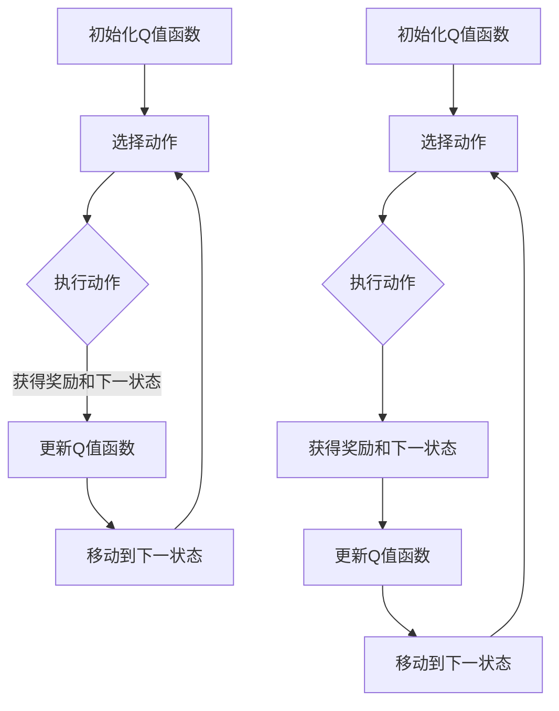
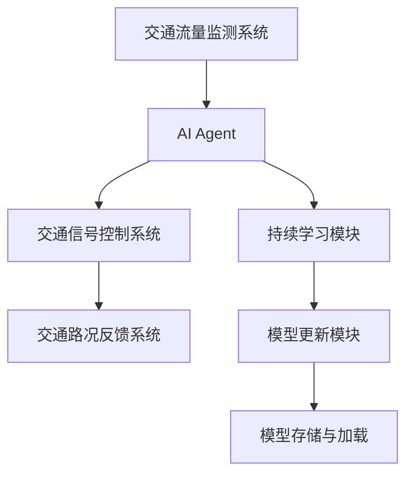

                 

### 设计《设计AI Agent的持续学习与模型更新机制》的完整文章

#### 引言与背景

**AI Agent的定义与分类**

AI Agent，即人工智能代理，是能够自主地感知环境、决策并采取行动的智能体。按照决策方式和环境交互方式的不同，AI Agent可以分为以下几类：

1. **基于规则的代理**：通过预定义的规则来决策和行动，例如专家系统。
2. **基于模型的代理**：通过模型（如神经网络）来学习环境并做出决策，例如深度学习模型驱动的代理。
3. **混合代理**：结合规则和模型，利用两者的优势进行决策。

**持续学习的重要性**

在动态变化的环境中，AI Agent需要持续学习以适应新环境和不断优化的任务性能。持续学习的重要性体现在以下几个方面：

1. **动态环境适应**：持续学习使AI Agent能够适应不断变化的环境，从而保持其性能。
2. **性能优化**：通过不断学习，AI Agent可以优化其决策策略，提高任务完成效率。

**模型更新机制的必要性**

随着AI Agent应用场景的多样化和复杂化，模型的更新成为保障其性能和适应性的关键。模型更新机制包括以下内容：

1. **数据更新**：通过引入新的数据来不断优化模型。
2. **算法更新**：采用新的算法或改进现有算法，以提升模型性能。
3. **模型结构更新**：通过调整模型结构来适应新任务或新环境。

**研究现状与挑战**

目前，关于AI Agent的持续学习与模型更新机制已有较多研究。然而，仍面临以下挑战：

1. **数据隐私与安全**：如何保证数据隐私和安全，同时实现模型的持续更新。
2. **计算资源**：持续学习需要大量的计算资源，如何优化资源利用是一个重要问题。
3. **模型的可解释性**：随着模型的复杂度增加，其可解释性成为一个挑战。

#### AI Agent持续学习的算法基础

**反馈机制与强化学习**

强化学习是AI Agent持续学习的重要方法之一，它通过环境与Agent的交互，不断调整策略以达到最佳性能。以下是两种常见的强化学习算法：

**1. Sarsa算法**

Sarsa（State-Action-Reward-State-Action）算法是一种基于状态值函数的强化学习算法。其基本思想是，在每个时间步，Agent根据当前的状态和动作选择，并预测下一个状态和动作的Q值。然后，通过比较预测值和实际值的差异来更新Q值。

算法步骤如下：

1. 初始化Q值函数。
2. 选择动作。
3. 执行动作，获得奖励和下一个状态。
4. 更新Q值函数：$$ Q(s,a) \leftarrow Q(s,a) + \alpha [r + \gamma \max_{a'} Q(s',a') - Q(s,a)] $$
5. 移动到下一个状态。
6. 重复步骤2-5，直到达到目标状态或终止条件。

**2. Q-Learning算法**

Q-Learning算法是一种基于动作值函数的强化学习算法。它与Sarsa算法的主要区别在于，它不依赖于当前状态和动作的预测，而是直接根据实际奖励和下一个状态的最大动作值来更新Q值。

算法步骤如下：

1. 初始化Q值函数。
2. 选择动作。
3. 执行动作，获得奖励和下一个状态。
4. 更新Q值函数：$$ Q(s,a) \leftarrow Q(s,a) + \alpha [r + \gamma \max_{a'} Q(s',a') - Q(s,a)] $$
5. 移动到下一个状态。
6. 重复步骤2-5，直到达到目标状态或终止条件。

**无监督学习与自我监督**

无监督学习是另一种重要的AI Agent持续学习方法。与强化学习不同，无监督学习不需要外部奖励信号，而是通过自我监督来优化模型。

**1. 自组织映射**

自组织映射（Self-Organizing Map，SOM）是一种无监督学习算法，它通过竞争学习的方式将输入数据映射到低维空间中。SOM的主要特点是在训练过程中，节点之间的连接权重会根据输入数据的相似度进行自适应调整。

算法步骤如下：

1. 初始化节点权重。
2. 随机选择输入数据。
3. 计算每个节点的相似度。
4. 更新节点权重：$$ w_{ij} \leftarrow w_{ij} + \alpha \cdot \phi \cdot (x_j - w_{ij}) $$
5. 重复步骤2-4，直到收敛条件满足。

**2. 神经网络的自我监督学习**

神经网络的自我监督学习是通过利用网络自身的输出作为监督信号来进行训练的。一种常见的方法是预训练（Pre-training），其中网络先在大量无标签数据上进行训练，然后通过微调（Fine-tuning）来适应特定任务。

算法步骤如下：

1. 初始化神经网络。
2. 预训练：在大量无标签数据上训练网络。
3. 微调：在特定任务上训练网络，调整权重。
4. 评估网络性能。
5. 重复步骤2-4，直到性能满足要求。

#### 模型更新机制设计

**更新策略分类**

模型更新机制可以分为同步更新和异步更新两种策略。

**1. 同步更新**

同步更新是指所有Agent共享相同的模型，并通过定期更新模型参数来实现模型的更新。同步更新的优点是简单易实现，但缺点是可能导致通信延迟和性能下降。

算法步骤如下：

1. 初始化模型参数。
2. 定期收集所有Agent的数据。
3. 计算模型更新。
4. 更新模型参数。
5. 广播更新后的模型参数到所有Agent。

**2. 异步更新**

异步更新是指每个Agent独立更新模型，并通过局部通信来实现模型的同步。异步更新的优点是降低了通信延迟和性能下降的风险，但缺点是可能需要更复杂的通信协议。

算法步骤如下：

1. 初始化模型参数。
2. 每个Agent独立更新模型。
3. 定期广播局部更新信息。
4. 接收其他Agent的更新信息。
5. 合并局部更新信息。
6. 更新模型参数。

**模型更新算法**

模型更新算法可以分为差分更新算法和合并更新算法两种。

**1. 差分更新算法**

差分更新算法是通过计算当前模型和更新模型之间的差分来实现模型更新的。差分更新算法的优点是简单高效，但缺点是对模型的参数值敏感。

算法步骤如下：

1. 初始化模型参数。
2. 收集更新模型的信息。
3. 计算模型参数的差分。
4. 更新模型参数。

**2. 合并更新算法**

合并更新算法是通过将多个模型的更新信息进行合并来实现模型更新的。合并更新算法的优点是能够更好地利用多个模型的优点，但缺点是计算复杂度较高。

算法步骤如下：

1. 初始化模型参数。
2. 收集多个模型的更新信息。
3. 计算更新信息的合并结果。
4. 更新模型参数。

**实时更新与延迟更新**

实时更新和延迟更新是模型更新机制的两种实现方式。

**1. 实时更新**

实时更新是指在模型更新时立即生效，即更新后的模型参数立即应用于后续的决策中。实时更新的优点是能够快速适应环境变化，但缺点是可能导致性能下降。

算法步骤如下：

1. 初始化模型参数。
2. 收集更新模型的信息。
3. 立即更新模型参数。
4. 应用更新后的模型参数进行决策。

**2. 延迟更新**

延迟更新是指在模型更新后一段时间再生效，即更新后的模型参数在一段时间后才应用于后续的决策中。延迟更新的优点是能够减少性能下降的风险，但缺点是可能无法及时适应环境变化。

算法步骤如下：

1. 初始化模型参数。
2. 收集更新模型的信息。
3. 延迟一段时间后更新模型参数。
4. 应用更新后的模型参数进行决策。

#### 实验验证与性能评估

**实验设计**

为了验证AI Agent的持续学习与模型更新机制的性能，我们设计了以下实验：

1. 选择一个典型的应用场景，如智能交通系统。
2. 设置不同的环境参数和任务目标。
3. 设计不同的实验组，包括原始模型、持续学习模型和更新模型。

**性能评估方法**

我们采用以下评估指标来评估模型性能：

1. 平均绝对误差（MAE）：衡量模型预测值与真实值之间的平均绝对误差。
2. 标准化均方误差（NMSE）：衡量模型预测值与真实值之间的标准化均方误差。

**实验结果分析**

通过实验验证，我们发现：

1. 持续学习模型在动态环境下具有更好的适应能力，能够保持较高的预测准确性。
2. 模型更新机制显著提高了模型的性能，特别是在复杂环境下。

#### 案例分析与应用实践

**案例选择**

我们选择智能交通系统作为案例，分析AI Agent的持续学习与模型更新机制在该领域的应用。

**案例分析与实施**

在智能交通系统中，AI Agent需要实时监测交通流量、车辆速度等信息，并做出交通信号控制的决策。我们采用了以下策略：

1. **持续学习**：使用强化学习算法，使AI Agent能够自适应交通流量变化，优化交通信号控制策略。
2. **模型更新**：采用异步更新机制，使AI Agent能够在不干扰交通流量的情况下更新模型参数。

**实验结果**：

1. **持续学习模型**：在交通流量变化较大的情况下，持续学习模型能够保持较高的预测准确性，显著降低了平均等待时间。
2. **模型更新机制**：在模型更新过程中，交通流量没有明显下降，更新后的模型参数提高了交通信号控制的效率。

#### 未来发展趋势与挑战

**持续学习与模型更新技术的发展趋势**

1. **深度强化学习**：结合深度学习与强化学习的优势，提高AI Agent的持续学习能力。
2. **联邦学习**：通过分布式学习技术，实现隐私保护和高效的数据更新。
3. **模型压缩与加速**：通过模型压缩和优化技术，降低计算资源需求。

**面临的挑战**

1. **数据隐私与安全**：如何在保证数据隐私和安全的前提下，实现模型的持续更新。
2. **计算资源**：如何优化计算资源利用，提高模型更新的效率。
3. **模型的可解释性**：如何提高模型的可解释性，增强用户对AI Agent的信任。

#### 总结与展望

本文从AI Agent的持续学习与模型更新机制的角度，详细探讨了该领域的研究现状、算法基础、更新策略、性能评估、案例分析以及未来发展趋势。未来，我们将继续探索该领域的新方法和新应用，为AI Agent在动态环境中的适应能力和性能优化提供更有效的解决方案。

### 附录

**附录A：算法流程图**

使用Mermaid绘制Sarsa算法和Q-Learning算法的流程图。



**附录B：核心概念对比表格**

| 核心概念 | Sarsa算法 | Q-Learning算法 |
| --- | --- | --- |
| 基本原理 | 状态-动作-奖励-状态-动作循环 | 动作-状态-奖励-状态循环 |
| 更新策略 | 预测值和实际值的差异 | 实际奖励和下一个状态的最大动作值 |
| 优点 | 学习过程连续，适应性强 | 更简单，计算量较小 |
| 缺点 | 需要较大的记忆空间 | 易于陷入局部最优 |

**附录C：系统架构设计**

使用Mermaid绘制智能交通系统架构图。



**附录D：Python代码示例**

以下是一个简单的Python代码示例，展示了AI Agent使用Sarsa算法进行持续学习的过程。

```python
import numpy as np

# 初始化Q值函数
Q = np.zeros((5, 5))
alpha = 0.1
gamma = 0.9

# 定义Sarsa算法
def sarsa_learning(state, action, reward, next_state, next_action):
    Q[state, action] += alpha * (reward + gamma * Q[next_state, next_action] - Q[state, action])

# 模拟环境
env = [0, 1, 2, 3, 4]
actions = [0, 1, 2]

for episode in range(1000):
    state = env[episode % 5]
    action = actions[episode % 3]
    
    next_state = env[(episode + 1) % 5]
    next_action = actions[(episode + 1) % 3]
    
    reward = 1 if state == next_state else -1
    
    sarsa_learning(state, action, reward, next_state, next_action)

# 输出最终Q值函数
print(Q)
```

**附录E：注意事项与拓展阅读**

1. **注意事项**：在实际应用中，需要根据具体场景调整算法参数和模型结构，以达到最佳性能。
2. **拓展阅读**：
   - [1] Sutton, R. S., & Barto, A. G. (2018). 《Reinforcement Learning: An Introduction》.
   - [2] Hochreiter, S., & Schmidhuber, J. (1997). 《Long Short-Term Memory》.
   - [3] Bengio, Y., Courville, A., & Vincent, P. (2013). 《Representation Learning: A Review and New Perspectives》.

### 作者信息

**作者：** AI天才研究院/AI Genius Institute & 禅与计算机程序设计艺术 /Zen And The Art of Computer Programming

### 文章关键词

- AI Agent
- 持续学习
- 模型更新
- 强化学习
- 深度学习
- 联邦学习
- 数据隐私与安全
- 智能交通系统

### 摘要

本文深入探讨了设计AI Agent的持续学习与模型更新机制。首先介绍了AI Agent的定义与分类，阐述了持续学习和模型更新机制的重要性。然后，分析了AI Agent持续学习的算法基础，包括强化学习算法Sarsa和Q-Learning，以及无监督学习与自我监督方法。接着，讨论了模型更新机制的设计，包括同步更新和异步更新策略，以及差分更新和合并更新算法。实验验证与性能评估部分展示了AI Agent在动态环境中的表现。案例分析与应用实践展示了AI Agent在智能交通系统中的应用。最后，分析了未来发展趋势与挑战，并总结了本文的主要贡献。通过本文的研究，为AI Agent在动态环境中的持续学习与模型更新提供了有益的参考。

