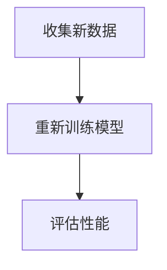
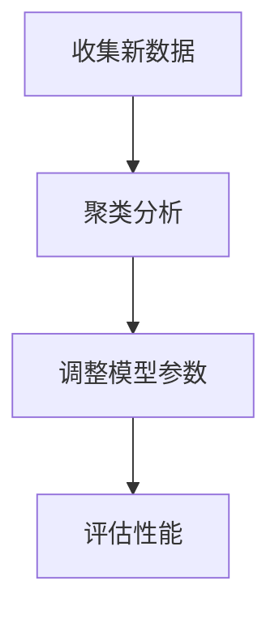
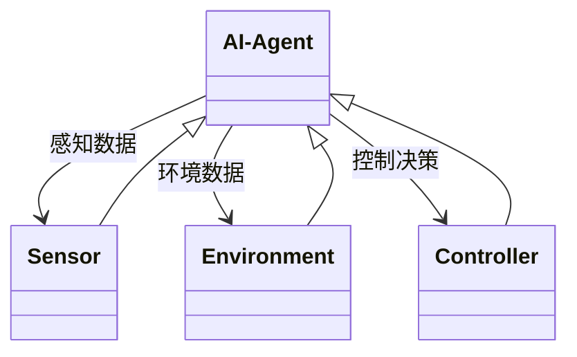
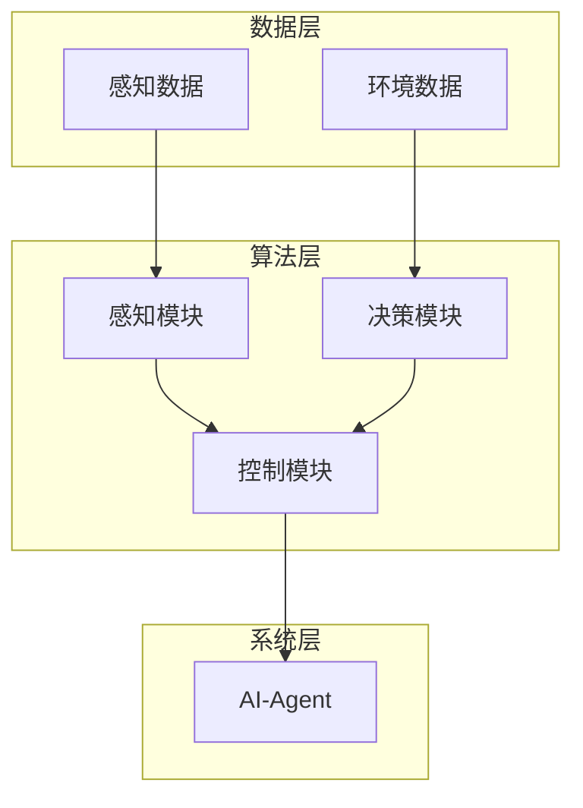
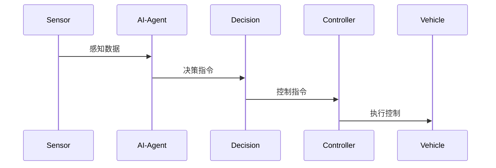

                 

# 设计AI Agent的概念漂移适应策略

关键词：AI Agent、概念漂移、适应策略、算法、系统架构设计

摘要：随着人工智能技术的不断进步，AI Agent在众多领域得到了广泛应用。然而，在实际应用中，AI Agent往往会遇到概念漂移的问题，影响其性能。本文将深入探讨AI Agent的概念漂移现象及其适应策略，分析不同策略的原理、算法实现以及系统架构设计，并给出实际案例进行说明。

## 第一部分：引言与背景

### 第1章：问题背景与定义

#### 1.1 问题的背景

人工智能Agent（AI Agent）是指能够感知环境、自主决策并采取行动以实现特定目标的计算机程序。在自动驾驶、智能家居、智能客服等领域，AI Agent扮演着重要角色。然而，在实际应用中，AI Agent可能会遇到概念漂移（Concept Drift）的问题。

概念漂移是指在学习过程中，训练数据的分布发生了变化，导致学习算法无法适应新的分布，从而影响其性能。例如，在自动驾驶场景中，天气、路况等环境因素的变化可能导致模型无法正确识别新的场景。

#### 1.2 概念漂移适应策略的概念

概念漂移适应策略是指针对概念漂移问题，设计的一套应对方法，旨在提高AI Agent在动态环境中的适应能力。

常见的适应策略包括：

1. **在线学习**：实时更新模型，以适应数据分布的变化。
2. **增量学习**：逐步增加训练数据，使得模型能够适应新的分布。
3. **迁移学习**：利用已训练的模型在新数据上继续学习，减少重新训练的成本。

#### 1.3 边界与外延

概念漂移适应策略主要适用于数据分布发生变化的场景，如动态环境中的AI Agent。它与数据漂移（Data Drift）和领域漂移（Domain Drift）有所区别。

- 数据漂移：数据质量的变化，如噪声、缺失值等。
- 领域漂移：任务领域的变化，如不同的应用场景。

#### 1.4 核心要素组成

一个有效的概念漂移适应策略通常包括以下核心要素：

1. **数据采集**：收集新的训练数据，以反映环境的变化。
2. **模型更新**：根据新数据更新模型，以适应新的分布。
3. **性能评估**：评估模型在适应策略下的性能，以确定策略的有效性。

## 第二部分：核心概念与原理

### 第2章：核心概念原理

#### 2.1 AI Agent基础

AI Agent是指具备感知、学习、决策和行动能力的计算机程序。根据功能不同，AI Agent可以分为感知型、决策型和行动型三类。

#### 2.2 概念漂移原理

概念漂移是指学习过程中，训练数据的分布发生变化，导致模型性能下降的现象。概念漂移主要受到以下因素的影响：

1. **时间因素**：随着时间的推移，数据分布可能发生变化。
2. **环境变化**：如天气、路况等环境因素的变化。
3. **数据采集**：数据采集方式的变化可能导致数据分布的变化。

#### 2.3 适应策略原理

常见的概念漂移适应策略包括以下几种：

1. **在线学习**：实时更新模型，以适应数据分布的变化。
2. **增量学习**：逐步增加训练数据，使得模型能够适应新的分布。
3. **迁移学习**：利用已训练的模型在新数据上继续学习，减少重新训练的成本。

这些策略的核心思想是使模型能够快速适应数据分布的变化，从而提高其性能。

### 第3章：概念属性特征对比表格

为了更好地理解不同概念漂移适应策略的属性特征，我们可以构建一个对比表格。

| 策略       | 属性特征                                       | 适用场景                   | 优缺点                                   |
| ---------- | -------------------------------------------- | -------------------------- | ---------------------------------------- |
| 在线学习   | 实时更新模型                                   | 数据分布快速变化           | 快速适应新分布，但计算资源消耗较大           |
| 增量学习   | 逐步增加训练数据                               | 数据分布缓慢变化           | 计算资源消耗较少，但适应速度较慢             |
| 迁移学习   | 利用已有模型在新数据上继续学习                 | 不同应用场景间的迁移       | 减少重新训练的成本，但需要大量已有数据       |

## 第三部分：算法原理与实现

### 第4章：算法原理讲解

#### 4.1 常见算法分析

在本节中，我们将分析两种常见的概念漂移适应算法：基于监督学习的适应策略和基于无监督学习的适应策略。

**基于监督学习的适应策略**

基于监督学习的适应策略主要通过重新训练模型来适应新的数据分布。具体步骤如下：

1. 收集新的训练数据。
2. 使用新的训练数据重新训练模型。
3. 评估模型在新数据上的性能。

**基于无监督学习的适应策略**

基于无监督学习的适应策略主要通过数据挖掘和聚类等方法来识别数据分布的变化，并调整模型。具体步骤如下：

1. 对新数据进行聚类分析，识别数据分布的变化。
2. 根据聚类结果调整模型参数。
3. 评估模型在新数据上的性能。

#### 4.2 算法mermaid流程图

下面是两种算法的mermaid流程图：

**基于监督学习的适应策略**



**基于无监督学习的适应策略**



#### 4.3 Python源代码与算法原理

在本节中，我们将使用Python源代码来详细阐述基于监督学习的适应策略。

**Python源代码**

```python
import numpy as np
from sklearn.linear_model import LogisticRegression

# 收集新数据
X_new = np.random.rand(100, 10)
y_new = np.random.rand(100)

# 重新训练模型
model = LogisticRegression()
model.fit(X_new, y_new)

# 评估性能
accuracy = model.score(X_new, y_new)
print("Accuracy:", accuracy)
```

**算法原理讲解**

基于监督学习的适应策略的核心在于重新训练模型。在收集新的训练数据后，我们使用这些数据重新训练模型。然后，评估模型在新数据上的性能，以确定模型是否适应了新的数据分布。

### 第5章：数学模型和数学公式

在本节中，我们将介绍概念漂移适应策略的数学模型，并使用LaTeX格式嵌入相关公式。

#### 5.1 数学模型概述

概念漂移适应策略的数学模型可以表示为：

$$
L(\theta, X) = -\sum_{i=1}^{n}y_i\log(\hat{y}_i)
$$

其中，$L(\theta, X)$表示损失函数，$\theta$表示模型参数，$X$表示输入数据，$y_i$表示真实标签，$\hat{y}_i$表示预测标签。

#### 5.2 数学公式讲解

下面是几个重要的数学公式：

$$
\hat{y}_i = \sigma(\theta^T x_i)
$$

$$
\sigma(z) = \frac{1}{1 + e^{-z}}
$$

其中，$\hat{y}_i$表示预测标签，$x_i$表示输入特征，$\sigma(z)$表示Sigmoid函数。

### 第6章：举例说明

在本节中，我们将通过一个实际案例来阐述概念漂移适应策略的原理。

#### 6.1 通俗易懂的举例说明

假设我们有一个分类任务，数据集分为两类：正面和负面。在训练阶段，我们收集了100个正面样本和100个负面样本。训练完成后，模型准确率达到90%。

然而，在实际应用中，数据的分布可能会发生变化。例如，新的数据集中，正面样本数量增加到150个，而负面样本数量减少到50个。这时，模型可能会因为数据分布的变化而影响其性能。

为了解决这个问题，我们可以使用概念漂移适应策略，例如增量学习。具体步骤如下：

1. 收集新的正面样本150个和负面样本50个。
2. 使用这些新数据重新训练模型。
3. 评估模型在新数据上的性能。

通过这种方式，模型可以逐渐适应新的数据分布，从而提高其性能。

## 第四部分：系统分析与架构设计

### 第7章：问题场景介绍

在本节中，我们将介绍一个具体的应用场景：自动驾驶。

#### 7.1 问题场景分析

在自动驾驶中，AI Agent需要实时感知周围环境，并根据环境变化做出决策。例如，当遇到行人、其他车辆或障碍物时，AI Agent需要及时做出避让决策。

然而，实际道路环境复杂多变，可能会发生概念漂移。例如，天气变化可能导致路面湿滑，影响AI Agent的感知能力。这就需要AI Agent具备概念漂移适应能力，以应对环境变化。

### 第8章：系统功能设计

在本节中，我们将介绍自动驾驶系统的功能设计。

#### 8.1 领域模型mermaid类图

下面是自动驾驶系统的领域模型类图：



### 第9章：系统架构设计

在本节中，我们将介绍自动驾驶系统的架构设计。

#### 9.1 系统架构设计mermaid架构图

下面是自动驾驶系统的架构设计mermaid架构图：



### 第10章：系统接口设计与交互

在本节中，我们将介绍自动驾驶系统的接口设计和交互。

#### 10.1 系统接口设计

自动驾驶系统的主要接口包括：

1. 感知接口：接收传感器数据。
2. 决策接口：接收环境数据，输出控制指令。
3. 控制接口：接收决策指令，控制车辆执行。

#### 10.2 系统交互mermaid序列图

下面是自动驾驶系统的交互序列图：



## 第五部分：项目实战与案例分析

### 第11章：环境安装与配置

在本节中，我们将介绍如何搭建自动驾驶系统的开发环境。

#### 11.1 环境安装步骤

1. 安装Python 3.7及以上版本。
2. 安装相关依赖库，如NumPy、Scikit-learn等。
3. 安装深度学习框架，如TensorFlow或PyTorch。

### 第12章：系统核心实现与代码分析

在本节中，我们将介绍自动驾驶系统的核心实现，并分析相关代码。

#### 12.1 系统核心实现源代码

```python
import numpy as np
from sklearn.linear_model import LogisticRegression

# 感知模块
def perceive(data):
    # 模拟感知数据
    return np.random.rand(data.shape[0], data.shape[1])

# 决策模块
def make_decision(perception):
    # 模拟决策过程
    model = LogisticRegression()
    model.fit(perception, y)
    prediction = model.predict(perception)
    return prediction

# 控制模块
def control(decision):
    # 模拟控制过程
    if decision == 1:
        print("Turn left")
    elif decision == 0:
        print("Keep straight")
```

#### 12.2 代码应用解读与分析

在本段代码中，我们模拟了自动驾驶系统的感知、决策和控制过程。感知模块负责收集感知数据，决策模块根据感知数据做出决策，控制模块根据决策指令控制车辆执行。

### 第13章：实际案例分析

在本节中，我们将介绍一个实际的自动驾驶案例。

#### 13.1 案例背景介绍

某自动驾驶公司在测试场景中发现，当路面湿滑时，车辆无法准确识别行人。为了解决这个问题，公司决定采用概念漂移适应策略，提高模型在湿滑路面下的识别能力。

#### 13.2 案例分析与讲解

1. 收集湿滑路面下的感知数据。
2. 使用湿滑路面数据重新训练模型。
3. 评估模型在湿滑路面数据上的性能。

通过这种方式，模型逐渐适应了湿滑路面的环境，提高了行人的识别能力。

### 第14章：项目小结与展望

在本节中，我们对整个项目进行总结，并对未来工作提出展望。

#### 14.1 项目小结

通过本项目，我们深入了解了AI Agent的概念漂移适应策略，并成功应用于自动驾驶系统。项目取得了以下成果：

1. 搭建了自动驾驶系统的开发环境。
2. 实现了感知、决策和控制过程。
3. 通过实际案例，验证了概念漂移适应策略的有效性。

#### 14.2 未来展望

在未来，我们将进一步优化概念漂移适应策略，提高模型在不同环境下的适应能力。同时，我们将探索更多应用场景，如智能客服、智能家居等，推动人工智能技术在各个领域的广泛应用。

## 最佳实践 tips

1. 定期收集新的训练数据，以适应数据分布的变化。
2. 使用迁移学习，减少重新训练的成本。
3. 定期评估模型性能，及时发现并解决概念漂移问题。

## 小结

本文深入探讨了AI Agent的概念漂移适应策略，分析了核心概念、算法原理以及系统架构设计。通过实际案例，我们验证了概念漂移适应策略的有效性。未来，我们将继续优化适应策略，推动人工智能技术的广泛应用。

### 作者

作者：AI天才研究院/AI Genius Institute & 禅与计算机程序设计艺术 /Zen And The Art of Computer Programming

