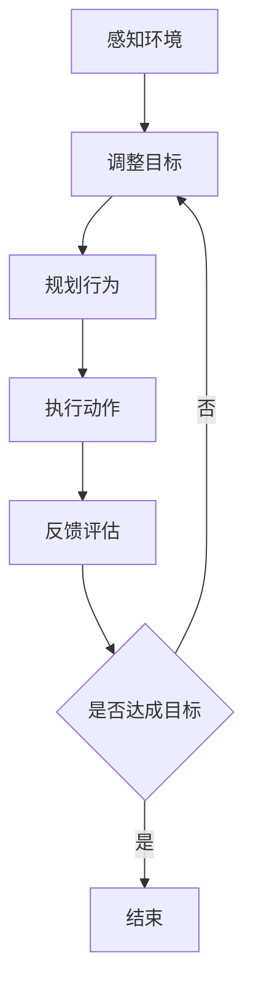
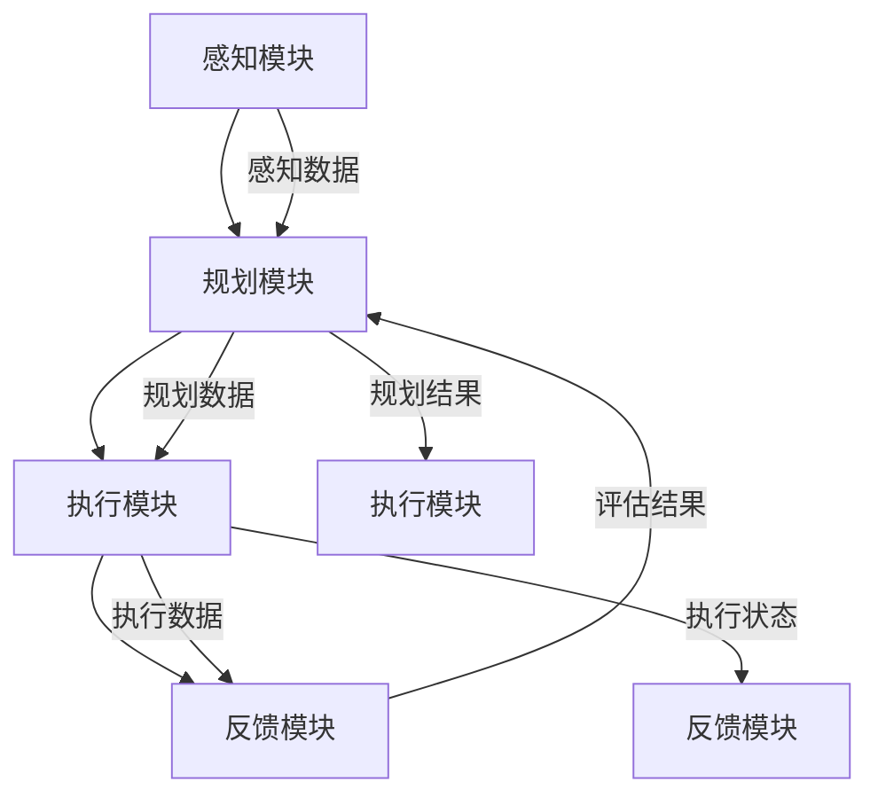

                 


# 设计AI Agent的目标导向行为系统

> 关键词：AI Agent，目标导向行为系统，设计方法，实现，实战案例

> 摘要：本文将深入探讨设计AI Agent的目标导向行为系统的方法与实现，通过详细的步骤和分析，帮助读者理解如何构建高效、智能的AI行为系统。

## 第一部分：背景介绍与概念解析

### 第1章：问题背景与目标导向行为系统概述

#### 1.1 问题背景

随着人工智能技术的快速发展，AI Agent在各个领域中的应用越来越广泛。从智能家居到自动驾驶，AI Agent能够通过自主学习和决策，完成复杂任务。然而，如何设计一个既智能又高效的目标导向行为系统，成为了一个亟待解决的问题。

#### 1.2 目标导向行为系统的定义与重要性

目标导向行为系统是指AI Agent在执行任务时，以明确的目标为导向，通过感知环境、规划行为、执行动作等一系列过程，实现目标的系统。它的重要性在于，能够使AI Agent更加智能化、自适应化，提高任务完成的效率和质量。

#### 1.3 目标导向行为系统与AI Agent的关系

AI Agent是执行特定任务的智能体，而目标导向行为系统是AI Agent的核心。通过设计高效的目标导向行为系统，可以赋予AI Agent更强的自主决策能力和任务执行能力。

## 第二部分：目标导向行为系统的设计方法

### 第2章：核心概念与原理

#### 2.1 AI Agent的基本原理

AI Agent是基于人工智能技术构建的智能体，能够通过学习、推理、决策等方式，自主执行任务。其基本原理包括感知、学习和决策。

#### 2.2 目标导向行为的核心概念

目标导向行为的核心概念包括目标、任务、环境、感知、规划和执行。这些概念共同构成了目标导向行为系统的基础。

#### 2.3 目标导向行为系统的框架与流程

目标导向行为系统的框架通常包括感知模块、规划模块、执行模块和反馈模块。其流程为：感知环境 -> 建立目标 -> 规划行为 -> 执行动作 -> 反馈评估。

### 第3章：需求分析与建模

#### 3.1 需求分析的方法与技巧

需求分析是设计目标导向行为系统的第一步。通过需求分析，可以明确系统的功能需求、性能需求和用户体验需求。

#### 3.2 建立目标导向行为模型

建立目标导向行为模型是需求分析的结果。通过模型，可以清晰地描述AI Agent的行为过程和目标。

### 第4章：行为规划与决策

#### 4.1 行为规划的概念与流程

行为规划是指根据目标，设计实现目标的步骤和方法。其流程包括目标分解、行为选择和动作生成。

#### 4.2 决策算法的选择与应用

决策算法是行为规划的核心。根据不同的任务需求，可以选择不同的决策算法，如基于规则的决策、基于模型的决策、基于学习的决策等。

### 第5章：行为执行与控制

#### 5.1 行为执行机制

行为执行是指根据规划结果，执行具体的行为动作。行为执行机制包括动作执行、状态监控和异常处理。

#### 5.2 行为控制的策略与实现

行为控制是指对AI Agent的行为进行监控和调整，以实现最佳的效果。行为控制策略包括目标调整、行为优化和反馈调整。

## 第三部分：目标导向行为系统的实现

### 第6章：系统架构设计

#### 6.1 系统架构概述

系统架构设计是目标导向行为系统的关键。其架构通常包括感知模块、规划模块、执行模块和反馈模块。

#### 6.2 模块设计与接口定义

模块设计是指根据系统架构，设计各个模块的具体实现。接口定义是指定义模块之间的交互接口。

### 第7章：关键技术与算法

#### 7.1 机器学习算法在行为系统中的应用

机器学习算法在行为系统中的应用，能够提高AI Agent的自主学习和决策能力。

#### 7.2 强化学习与深度学习技术的融合

强化学习与深度学习技术的融合，能够实现更高效、更智能的目标导向行为系统。

## 第四部分：实战案例与分析

### 第8章：实战案例一：智能家居系统

#### 8.1 案例背景与目标

智能家居系统是一个典型的目标导向行为系统应用场景。本案例的目标是实现智能化的家居控制。

#### 8.2 系统设计与实现

本案例将详细介绍智能家居系统的设计与实现过程。

#### 8.3 案例分析

通过对智能家居系统的分析，可以更好地理解目标导向行为系统的设计与实现。

### 第9章：实战案例二：机器人导航系统

#### 9.1 案例背景与目标

机器人导航系统是另一个典型的目标导向行为系统应用场景。本案例的目标是实现机器人的自主导航。

#### 9.2 系统设计与实现

本案例将详细介绍机器人导航系统的设计与实现过程。

#### 9.3 案例分析

通过对机器人导航系统的分析，可以更好地理解目标导向行为系统的设计与实现。

## 第五部分：最佳实践与未来展望

### 第10章：最佳实践与注意事项

#### 10.1 设计AI Agent的目标导向行为系统最佳实践

本章节将总结设计AI Agent的目标导向行为系统的最佳实践。

#### 10.2 常见问题与解决方案

本章节将分析设计过程中常见的问题，并提供解决方案。

### 第11章：未来展望与研究方向

#### 11.1 目标导向行为系统的未来发展趋势

本章节将探讨目标导向行为系统的未来发展趋势。

#### 11.2 研究方向与挑战

本章节将讨论目标导向行为系统的研究方向和面临的挑战。

## 结束语

本文通过对目标导向行为系统的深入探讨，为设计高效、智能的AI行为系统提供了指导。随着人工智能技术的不断发展，目标导向行为系统将在更多领域发挥重要作用。

## 附录

### 附录A：术语解释

本附录将对文中提到的核心术语进行解释。

### 附录B：参考文献

本附录列出了本文引用的参考文献。

### 附录C：代码实现

本附录提供了本文提到的关键代码实现。

作者：AI天才研究院/AI Genius Institute & 禅与计算机程序设计艺术 /Zen And The Art of Computer Programming

----------------------------------------------------------------

# 概念解析

## AI Agent的定义与作用

AI Agent，即人工智能代理，是一种通过编程或自然语言处理技术实现的智能体，能够在特定环境下自主执行任务，具备感知、学习、决策和行动的能力。AI Agent的典型特征包括：

- **自主性**：AI Agent能够独立执行任务，无需人为干预。
- **适应性**：AI Agent能够根据环境变化和任务需求，调整自己的行为。
- **智能性**：AI Agent能够通过学习和推理，提高任务完成的效率和效果。

在智能家居、自动驾驶、机器人导航等领域，AI Agent已经成为重要的组成部分，发挥着关键作用。

## 目标导向行为系统的概念

目标导向行为系统是一种基于明确目标的AI行为系统。它通过感知环境、规划行为、执行动作和反馈调整，实现特定目标的系统。目标导向行为系统通常包括以下几个核心组成部分：

- **感知模块**：负责获取环境信息，如视觉、听觉、触觉等。
- **规划模块**：根据目标，设计实现目标的步骤和方法。
- **执行模块**：执行具体的动作，实现规划的结果。
- **反馈模块**：对执行结果进行评估和反馈，调整后续的行为。

目标导向行为系统的核心在于目标的明确性。通过设定明确的目标，AI Agent能够更加聚焦于任务的核心，提高任务完成的效率和效果。

## 问题背景与问题描述

在当前人工智能技术飞速发展的背景下，AI Agent的应用场景越来越广泛。然而，如何设计一个既智能又高效的目标导向行为系统，仍然面临诸多挑战。

### 挑战1：环境的复杂性

现实世界的环境复杂多变，AI Agent需要能够应对各种不确定因素，如环境噪声、突发状况等。如何设计一个具有高度适应性的目标导向行为系统，成为了一个关键问题。

### 挑战2：任务的多样性

不同应用场景下的任务具有多样性，AI Agent需要具备通用性，能够适应不同任务的需求。如何设计一个灵活、可扩展的目标导向行为系统，成为了一个重要问题。

### 挑战3：效率与效果之间的平衡

在实现目标导向行为系统的过程中，需要平衡效率与效果之间的关系。如何设计一个既高效又智能的目标导向行为系统，成为了一个难点。

### 挑战4：数据的可用性与可靠性

目标导向行为系统的设计依赖于大量的数据。如何确保数据的可用性和可靠性，成为了一个关键问题。

### 挑战5：人机交互的优化

在AI Agent的应用过程中，人机交互的优化至关重要。如何设计一个友好、高效的人机交互界面，成为了一个挑战。

## 问题解决

为了解决上述问题，我们可以从以下几个方面入手：

### 1. 提高环境适应性

通过引入强化学习、深度学习等先进技术，提高AI Agent对复杂环境的适应能力。

### 2. 实现任务通用性

通过模块化设计，实现目标导向行为系统的通用性。同时，引入元学习等技术，提高AI Agent在不同任务场景下的适应能力。

### 3. 平衡效率与效果

通过优化算法和架构设计，提高目标导向行为系统的效率。同时，注重系统效果的评估，确保系统在实现高效的同时，也能够达到预期效果。

### 4. 保障数据质量

通过数据采集、清洗、存储等环节的质量控制，保障数据的可用性和可靠性。

### 5. 优化人机交互

通过直观、友好的界面设计，提高人机交互的体验。同时，引入自然语言处理、语音识别等技术，实现更加自然的人机交互。

## 边界与外延

### 边界

本文主要讨论了AI Agent的目标导向行为系统的设计方法与实现。然而，目标导向行为系统的设计与实现涉及多个领域，如人工智能、计算机科学、认知科学等。因此，本文的讨论存在一定的局限性。

### 外延

虽然本文主要关注AI Agent的目标导向行为系统，但目标导向行为系统的概念和方法可以扩展到其他领域，如自动化控制、机器人技术、智能交通等。这些领域同样需要高效、智能的行为系统来提高任务完成的效率和效果。

## 概念结构与核心要素组成

目标导向行为系统的概念结构主要包括以下几个核心要素：

### 1. 感知模块

感知模块负责获取环境信息，如视觉、听觉、触觉等。通过感知模块，AI Agent能够获取到任务相关的数据，为后续的行为规划提供基础。

### 2. 规划模块

规划模块根据目标，设计实现目标的步骤和方法。规划模块通常包括目标分解、行为选择、动作生成等步骤。通过规划模块，AI Agent能够制定出具体的行动方案。

### 3. 执行模块

执行模块负责执行具体的动作，实现规划的结果。执行模块通常包括动作执行、状态监控和异常处理等功能。通过执行模块，AI Agent能够将规划转化为实际的行为。

### 4. 反馈模块

反馈模块对执行结果进行评估和反馈，调整后续的行为。通过反馈模块，AI Agent能够根据执行结果，不断优化自己的行为，提高任务完成的效率和效果。

### 5. 学习模块

学习模块负责AI Agent的自适应学习。通过学习模块，AI Agent能够根据环境变化和任务需求，不断调整自己的行为策略，提高自主决策能力。

### 6. 决策模块

决策模块负责AI Agent的行为决策。通过决策模块，AI Agent能够根据感知模块获取的信息，以及学习模块提供的数据，进行决策，选择最佳的行为方案。

### 7. 界面模块

界面模块负责AI Agent与用户的交互。通过界面模块，AI Agent能够与用户进行信息交流，获取用户的指令和反馈，提高人机交互的体验。

## 相关核心概念之间的联系

在目标导向行为系统中，各个核心概念之间存在密切的联系，共同构成了一个完整的行为系统。以下是各个核心概念之间的联系：

### 1. 感知模块与规划模块

感知模块为规划模块提供环境信息，规划模块根据感知模块提供的信息，设计实现目标的步骤和方法。因此，感知模块与规划模块之间存在信息输入与输出的关系。

### 2. 规划模块与执行模块

规划模块制定出具体的行动方案，执行模块负责将规划转化为实际的行为。因此，规划模块与执行模块之间存在规划与执行的关系。

### 3. 执行模块与反馈模块

执行模块执行具体的动作，反馈模块对执行结果进行评估和反馈。因此，执行模块与反馈模块之间存在执行与反馈的关系。

### 4. 学习模块与决策模块

学习模块负责AI Agent的自适应学习，决策模块负责AI Agent的行为决策。学习模块提供的数据和知识，为决策模块提供支持。因此，学习模块与决策模块之间存在学习与决策的关系。

### 5. 界面模块与用户

界面模块负责AI Agent与用户的交互，获取用户的指令和反馈。用户通过界面模块与AI Agent进行信息交流，实现人机交互。因此，界面模块与用户之间存在交互与反馈的关系。

## 结尾

通过对目标导向行为系统的深入解析，我们了解了其核心概念、设计方法、实现步骤以及相关核心概念之间的联系。在未来的研究和实践中，我们将继续探讨如何设计更加高效、智能的目标导向行为系统，为人工智能技术的发展和应用提供有力支持。

----------------------------------------------------------------

# AI Agent的基本原理

AI Agent是人工智能领域的核心概念之一，其基本原理涵盖了感知、学习和决策等方面。理解AI Agent的基本原理对于设计高效、智能的目标导向行为系统至关重要。

## 感知

感知是AI Agent获取外部信息的过程。通过感知，AI Agent能够了解环境的状态和变化。感知模块通常包括以下几种方式：

1. **视觉感知**：通过摄像头或其他传感器获取图像数据，AI Agent能够识别物体、颜色、形状等视觉信息。
2. **听觉感知**：通过麦克风或其他传感器获取声音数据，AI Agent能够识别声音、语音等听觉信息。
3. **触觉感知**：通过触摸传感器获取触觉信息，AI Agent能够感知物体的硬度、温度等物理特性。
4. **其他感知**：如气味感知、温度感知等，根据任务需求，AI Agent可以配备相应的传感器进行感知。

在感知过程中，AI Agent需要处理大量的数据，并通过特征提取等方法，提取有用的信息，为后续的学习和决策提供支持。

## 学习

学习是AI Agent提高自身能力的重要手段。通过学习，AI Agent能够从经验中获取知识，并调整自己的行为策略。学习模块通常包括以下几种方式：

1. **监督学习**：在有标记的数据集上进行学习，AI Agent能够通过训练模型，学习到输入与输出之间的映射关系。
2. **无监督学习**：在没有标记的数据集上进行学习，AI Agent能够发现数据中的模式和结构。
3. **强化学习**：在动态环境中进行学习，AI Agent通过与环境交互，不断调整自己的行为策略，以实现最大化的奖励。
4. **深度学习**：通过神经网络等模型，AI Agent能够学习到复杂的数据特征和模式。

学习过程中，AI Agent需要处理大量的数据和复杂的模型，并通过优化算法，不断提高学习效果。

## 决策

决策是AI Agent在感知和学习的基础上，选择最佳行为的过程。决策模块通常包括以下几种方式：

1. **基于规则的决策**：通过预定义的规则，AI Agent根据感知到的信息，选择符合规则的行为。
2. **基于模型的决策**：通过训练得到的模型，AI Agent根据输入的信息，预测可能的输出，并选择最佳的行为。
3. **基于学习的决策**：通过学习和优化，AI Agent能够根据环境变化和任务需求，自主调整自己的行为策略。

在决策过程中，AI Agent需要考虑多个因素，如任务目标、环境状态、资源限制等，并通过综合评估，选择最佳的行为方案。

## 感知、学习与决策之间的关系

感知、学习和决策是AI Agent的基本原理，它们之间存在着密切的联系。

1. **感知是基础**：感知是AI Agent获取外部信息的过程，为学习和决策提供了数据支持。
2. **学习是提升**：学习是AI Agent提高自身能力的过程，通过感知到的信息，AI Agent能够不断优化自己的行为策略。
3. **决策是应用**：决策是AI Agent在实际任务中应用感知和学习结果的过程，通过选择最佳的行为方案，实现任务目标。

在实际应用中，感知、学习和决策是相互交织、共同作用的。AI Agent需要根据任务需求和环境变化，灵活调整感知、学习和决策的过程，以实现最佳的效果。

## 案例分析

以自动驾驶为例，自动驾驶系统是一个典型的AI Agent应用场景。自动驾驶系统通过感知模块获取道路信息，如车辆位置、速度、交通状况等，通过学习模块积累驾驶经验，通过决策模块选择最佳驾驶策略。

在自动驾驶过程中，感知模块负责实时获取道路信息，学习模块负责从历史数据中学习驾驶技巧，决策模块负责根据感知和学习结果，选择最佳驾驶策略，如加速、减速、转弯等。通过感知、学习和决策的相互配合，自动驾驶系统能够在复杂的环境中，实现安全、高效的驾驶。

## 结论

理解AI Agent的基本原理，对于设计高效、智能的目标导向行为系统具有重要意义。通过感知、学习和决策的相互配合，AI Agent能够实现自主决策和任务执行，为人工智能技术的发展和应用提供强大支持。

----------------------------------------------------------------

# 目标导向行为的核心概念

在设计和实现AI Agent的目标导向行为系统时，理解目标导向行为的核心概念至关重要。这些核心概念包括目标、任务、环境、感知、规划和执行等。以下将详细探讨这些概念，并解释它们在目标导向行为系统中的作用。

## 目标

目标是指AI Agent在执行任务时希望达成的具体结果或状态。目标是目标导向行为系统的核心驱动力，它为AI Agent的行为提供了明确的方向。目标可以是简单的，如移动到某个位置，也可以是复杂的，如完成一个复杂的任务流程。

### 类型

- **单一目标**：AI Agent只有一个明确的目标，如寻找某个特定物品。
- **多目标**：AI Agent同时需要达成多个目标，如同时保持安全和到达目的地。

### 重要性

目标的重要性在于它为AI Agent的行为提供了明确的方向，使AI Agent能够在复杂的环境中，保持专注和高效地完成任务。

## 任务

任务是指AI Agent需要完成的特定工作或活动。任务通常由一系列子任务组成，每个子任务都是实现最终目标的一部分。任务的概念使得AI Agent能够将复杂的问题分解为更小、更易管理的部分。

### 类型

- **一次性任务**：如发送一封电子邮件。
- **重复性任务**：如监控系统中的异常行为。

### 重要性

任务的重要性在于它为AI Agent提供了具体的工作内容，使AI Agent能够有针对性地进行行为规划和执行。

## 环境

环境是指AI Agent执行任务的外部条件。环境可以包括物理环境、社会环境、数字环境等多种形式。环境的状态和变化对AI Agent的行为有着重要影响。

### 类型

- **静态环境**：环境状态不变，如自动化的生产线。
- **动态环境**：环境状态不断变化，如自动驾驶汽车在交通中的行驶。

### 重要性

环境的重要性在于它为AI Agent提供了行为执行的具体场景，AI Agent需要适应不同的环境变化，以实现目标。

## 感知

感知是指AI Agent从环境中获取信息的过程。感知模块负责收集环境中的各种数据，如视觉、听觉、触觉等。感知数据是AI Agent进行决策和行动的重要依据。

### 类型

- **外部感知**：通过传感器获取外部环境的信息。
- **内部感知**：通过内部传感器获取AI Agent自身状态的信息。

### 重要性

感知的重要性在于它为AI Agent提供了对环境的实时了解，使AI Agent能够基于当前环境状态进行决策。

## 规划

规划是指AI Agent根据目标和环境信息，设计实现目标的步骤和方法。规划模块负责将目标分解为一系列具体的行动，并为每一步行动制定详细的计划。

### 类型

- **静态规划**：在环境不变的情况下，提前制定的规划。
- **动态规划**：在环境变化的情况下，实时调整的规划。

### 重要性

规划的重要性在于它为AI Agent提供了明确的行动方案，使AI Agent能够在复杂的环境中，有序、高效地完成任务。

## 执行

执行是指AI Agent根据规划，执行具体的行动。执行模块负责将规划中的行动转化为实际的操作，如移动、发送信息等。执行是目标导向行为系统的最终实现阶段。

### 类型

- **自动执行**：AI Agent自动执行规划中的行动。
- **半自动执行**：AI Agent在执行行动时，需要人工干预。

### 重要性

执行的重要性在于它是AI Agent实现目标的关键步骤，只有通过有效的执行，AI Agent才能达成目标。

## 目标、任务、环境、感知、规划和执行之间的关系

这些核心概念之间存在着密切的联系，共同构成了目标导向行为系统的基础。

1. **目标驱动**：目标为AI Agent提供了行动的驱动力，所有其他概念都是为了实现目标而设计的。
2. **任务分解**：任务将目标分解为具体的子任务，使AI Agent能够有针对性地进行规划和执行。
3. **环境适应**：环境为AI Agent提供了行为执行的场景，AI Agent需要适应不同的环境变化。
4. **感知支持**：感知提供了AI Agent对环境的了解，是决策和行动的基础。
5. **规划指导**：规划为AI Agent提供了具体的行动方案，指导执行模块进行具体的行动。
6. **执行实现**：执行是实现目标的关键步骤，只有通过有效的执行，AI Agent才能达成目标。

在实际应用中，这些核心概念相互交织、共同作用，使AI Agent能够在复杂的环境中，高效地完成任务。

## 结论

理解目标导向行为的核心概念，对于设计高效、智能的AI Agent至关重要。通过明确的目标、有效的任务分解、良好的环境适应、精准的感知、科学的规划和准确的执行，AI Agent能够在复杂的环境中，实现预期的目标。

----------------------------------------------------------------

# 目标导向行为系统的框架与流程

目标导向行为系统是AI Agent的核心组件，它通过一系列精心设计的步骤，使AI Agent能够在复杂的环境中高效地完成任务。以下将详细描述目标导向行为系统的框架与流程，并使用Mermaid流程图进行可视化展示。

## 框架概述

目标导向行为系统的框架通常包括感知模块、规划模块、执行模块和反馈模块。这些模块相互协作，共同实现AI Agent的目标。

1. **感知模块**：负责获取环境信息，包括视觉、听觉、触觉等多种感知方式。
2. **规划模块**：根据感知到的信息和目标，设计实现目标的步骤和方法。
3. **执行模块**：执行规划模块生成的行动方案，实现具体的任务。
4. **反馈模块**：对执行结果进行评估和反馈，调整后续的行为。

## 流程描述

目标导向行为系统的流程可以概括为以下几个步骤：

1. **感知**：AI Agent通过感知模块获取环境信息。
2. **目标设定**：根据任务需求，设定明确的目标。
3. **规划**：AI Agent根据感知到的信息和目标，设计实现目标的步骤和方法。
4. **执行**：AI Agent按照规划执行具体的行动。
5. **反馈**：AI Agent对执行结果进行评估和反馈，调整后续的行为。

## Mermaid流程图

以下是一个目标导向行为系统的Mermaid流程图示例：



- **感知环境**：AI Agent通过感知模块获取环境信息。
- **设定目标**：AI Agent根据任务需求，设定明确的目标。
- **规划行为**：AI Agent根据感知到的信息和目标，设计实现目标的步骤和方法。
- **执行动作**：AI Agent按照规划执行具体的行动。
- **反馈评估**：AI Agent对执行结果进行评估和反馈。
- **是否达成目标**：判断是否达成目标，是则结束，否则返回设定目标步骤。

## 各个模块的功能与交互

### 感知模块

感知模块是目标导向行为系统的第一步，它负责获取环境信息。感知模块可以包括以下功能：

- **数据采集**：通过摄像头、麦克风、传感器等设备，收集环境中的数据。
- **特征提取**：对采集到的数据进行预处理，提取有用的特征信息。
- **信息融合**：整合来自不同传感器的信息，形成统一的感知视图。

### 规划模块

规划模块是目标导向行为系统的核心，它负责根据感知到的信息和目标，设计实现目标的步骤和方法。规划模块可以包括以下功能：

- **目标分解**：将复杂的目标分解为一系列可执行的子目标。
- **路径规划**：设计从当前状态到目标状态的路径。
- **行为生成**：生成具体的行动方案，包括动作序列和动作参数。

### 执行模块

执行模块是目标导向行为系统的执行阶段，它负责将规划模块生成的行动方案转化为具体的行动。执行模块可以包括以下功能：

- **动作执行**：执行规划中的动作，如移动、发送信息等。
- **状态监控**：实时监控执行过程中的状态，确保任务顺利进行。
- **异常处理**：在执行过程中，处理可能出现的异常情况，如传感器故障、目标未达成等。

### 反馈模块

反馈模块是目标导向行为系统的最后一步，它负责对执行结果进行评估和反馈，调整后续的行为。反馈模块可以包括以下功能：

- **结果评估**：对执行结果进行评估，判断是否达成目标。
- **性能分析**：分析执行过程中的性能指标，如响应时间、成功率等。
- **反馈调整**：根据评估结果，调整后续的行为规划，提高任务完成的效果。

### 模块之间的交互

各个模块之间通过信息传递和反馈进行交互：

- **感知模块向规划模块提供环境信息和感知数据**。
- **规划模块向执行模块提供行动方案**。
- **执行模块向反馈模块提供执行结果**。
- **反馈模块根据执行结果，调整规划模块的目标和规划方案**。

通过这样的交互机制，目标导向行为系统能够实现自适应、智能化的任务执行。

## 结论

目标导向行为系统的框架与流程为AI Agent提供了明确的行动指导，通过感知、规划、执行和反馈的相互协作，使AI Agent能够在复杂的环境中，高效地完成任务。使用Mermaid流程图进行可视化展示，有助于更清晰地理解目标导向行为系统的运作机制。

----------------------------------------------------------------

# 需求分析与建模

需求分析是设计目标导向行为系统的第一步，它决定了系统的功能和性能。在需求分析阶段，我们需要明确系统的目标、功能需求、性能需求以及用户体验需求。以下是需求分析与建模的详细步骤：

## 第一步：需求收集

需求收集是需求分析的基础，它包括以下内容：

- **用户需求**：与用户进行交流，了解用户期望系统实现的功能和性能。
- **业务需求**：与业务分析师合作，明确系统需要满足的业务目标和业务流程。
- **技术需求**：与技术团队讨论，确定系统所需的技术支持和技术实现难度。

## 第二步：需求分析

需求分析是对收集到的需求进行深入分析，以确定系统的具体功能和性能要求。以下是几个关键步骤：

- **功能需求分析**：确定系统需要实现的功能，如感知模块、规划模块、执行模块和反馈模块等。
- **性能需求分析**：确定系统的性能指标，如响应时间、准确率、稳定性等。
- **用户体验需求分析**：确定系统需要满足的用户体验需求，如界面友好、操作简便等。

## 第三步：需求文档编写

在需求分析完成后，我们需要编写需求文档。需求文档是整个项目的基础，它需要包含以下内容：

- **功能需求**：详细描述系统需要实现的功能。
- **性能需求**：详细描述系统的性能指标。
- **用户体验需求**：详细描述系统的用户体验要求。
- **需求来源**：记录需求收集和分析的过程。
- **需求优先级**：根据需求的紧急程度和重要性，对需求进行排序。

## 第四步：建模

在需求分析的基础上，我们需要进行建模，以可视化地表示系统的结构和功能。以下是几个常用的建模工具和方法：

1. **功能分解图（FD图）**：通过功能分解图，将复杂的功能分解为更小的子功能，使系统结构更加清晰。
2. **UML类图**：通过UML类图，表示系统的类及其之间的关系，帮助理解系统的模块化设计。
3. **数据流图（DFD图）**：通过数据流图，表示系统的数据流动和数据处理过程，帮助理解系统的数据处理流程。
4. **活动图**：通过活动图，表示系统的活动流程和活动之间的转换关系，帮助理解系统的执行过程。

## 第五步：需求验证

在需求建模完成后，我们需要进行需求验证，以确保需求文档和模型正确地反映了用户和业务需求。以下是几个关键步骤：

- **内部验证**：由项目团队成员对需求文档和模型进行审查，确保没有遗漏或错误。
- **用户验证**：与用户进行交流，确认需求文档和模型是否符合用户的期望。
- **测试验证**：通过测试，验证系统是否能够满足需求文档和模型中的要求。

## 需求分析与建模的重要性

需求分析与建模是目标导向行为系统设计的关键步骤，它决定了系统的功能和性能。以下是需求分析与建模的重要性：

1. **明确系统目标**：通过需求分析，可以明确系统的目标，确保系统设计符合业务需求。
2. **优化系统设计**：通过建模，可以清晰地表示系统的结构和功能，优化系统设计，提高系统的可维护性和可扩展性。
3. **降低风险**：通过需求验证，可以提前发现和解决潜在的问题，降低项目风险。
4. **提高用户体验**：通过需求分析与建模，可以确保系统满足用户的需求，提高用户体验。

## 案例分析

以智能家居系统为例，需求分析与建模的步骤如下：

1. **需求收集**：与用户交流，了解用户对智能家居系统的期望，如远程控制家居设备、自动化场景设置等。
2. **需求分析**：确定智能家居系统的功能需求，如远程控制、自动化场景设置、设备状态监控等，性能需求，如响应时间、稳定性等，用户体验需求，如界面友好、操作简便等。
3. **需求文档编写**：编写智能家居系统的需求文档，详细描述系统的功能、性能和用户体验要求。
4. **建模**：使用功能分解图、UML类图和活动图，表示智能家居系统的功能和流程。
5. **需求验证**：与用户和业务团队进行交流，确认需求文档和模型是否符合期望，并通过测试验证系统的功能、性能和用户体验。

通过以上步骤，可以确保智能家居系统的设计和实现符合用户和业务需求，提高系统的质量和用户体验。

## 结论

需求分析与建模是设计目标导向行为系统的重要步骤，它确保系统满足用户和业务需求，优化系统设计，降低项目风险，提高用户体验。通过详细的步骤和案例分析，可以帮助读者更好地理解需求分析与建模的方法和重要性。

----------------------------------------------------------------

# 行为规划与决策

在目标导向行为系统中，行为规划与决策是核心环节，它决定了AI Agent如何根据环境和目标，选择最优的行动方案。以下将详细探讨行为规划与决策的概念、流程和方法。

## 概念解析

### 行为规划

行为规划是指AI Agent在执行任务前，根据感知到的环境和目标，设计实现目标的步骤和方法。行为规划的目标是生成一系列有序的行为序列，使AI Agent能够高效地完成任务。

### 决策

决策是指AI Agent在执行行为规划时，根据当前状态和目标，选择最佳的行为方案。决策是AI Agent智能性的体现，它决定了AI Agent如何适应动态环境，实现任务目标。

## 流程描述

行为规划与决策的流程可以概括为以下几个步骤：

1. **目标分解**：将高层次的总体目标分解为一系列可执行的任务。
2. **环境感知**：获取当前环境的实时信息，包括位置、障碍物、资源等。
3. **行为选择**：根据目标和环境信息，选择最优的行为方案。
4. **行为执行**：执行选定的行为方案，实现具体任务。
5. **结果评估**：对执行结果进行评估，判断是否达到预期目标。
6. **反馈调整**：根据评估结果，调整后续的行为规划和决策。

## 方法介绍

### 基于规则的决策

基于规则的决策方法是指通过预定义的规则，AI Agent根据感知到的信息，选择符合规则的行为。这种方法简单直观，适用于规则明确、环境稳定的场景。

1. **规则库构建**：构建规则库，定义不同情境下的行为规则。
2. **规则匹配**：根据感知到的信息，匹配规则库中的规则。
3. **规则执行**：执行匹配到的规则，选择相应的行为。

### 基于模型的决策

基于模型的决策方法是指通过训练得到的模型，AI Agent根据感知到的信息，预测可能的输出，并选择最佳的行为。这种方法适用于复杂环境，能够处理不确定性和动态变化。

1. **模型训练**：使用历史数据，训练预测模型，如决策树、神经网络等。
2. **模型预测**：根据感知到的信息，输入预测模型，获取行为预测结果。
3. **模型选择**：选择预测结果最优的行为方案。

### 基于学习的决策

基于学习的决策方法是指AI Agent通过学习历史行为和结果，自主调整行为策略，提高决策能力。这种方法适用于需要持续学习和优化的场景。

1. **数据收集**：收集AI Agent的历史行为和结果数据。
2. **学习算法**：使用机器学习算法，如强化学习、深度学习等，分析数据，提取行为模式。
3. **策略调整**：根据学习结果，调整行为策略，提高决策能力。

## 案例分析

### 智能助手

以智能助手为例，行为规划与决策的流程如下：

1. **目标分解**：智能助手的总体目标是回答用户的问题，提供有用的信息。
2. **环境感知**：智能助手通过语音识别获取用户的提问，通过自然语言处理理解问题的含义。
3. **行为选择**：根据问题的类型和用户的意图，选择合适的回答策略，如搜索答案、提供解释、建议等。
4. **行为执行**：执行选定的回答策略，向用户反馈答案。
5. **结果评估**：评估用户的反馈，判断答案是否满足用户需求。
6. **反馈调整**：根据评估结果，调整后续的回答策略，提高智能助手的性能。

### 自动驾驶

以自动驾驶为例，行为规划与决策的流程如下：

1. **目标分解**：自动驾驶的总体目标是确保车辆安全、高效地到达目的地。
2. **环境感知**：自动驾驶系统通过摄像头、雷达等感知设备，获取车辆周围的道路信息、障碍物信息等。
3. **行为选择**：根据道路信息和车辆状态，选择最优的驾驶策略，如加速、减速、转向等。
4. **行为执行**：执行选定的驾驶策略，控制车辆的动作。
5. **结果评估**：评估车辆的驾驶行为是否安全、高效。
6. **反馈调整**：根据评估结果，调整后续的驾驶策略，提高自动驾驶系统的性能。

## 结论

行为规划与决策是目标导向行为系统的核心环节，它决定了AI Agent如何根据环境和目标，选择最优的行动方案。通过基于规则的决策、基于模型的决策和基于学习的决策方法，AI Agent能够在复杂环境中，实现高效、智能的任务执行。案例分析展示了行为规划与决策在不同场景中的应用，有助于理解其实现过程和重要性。

----------------------------------------------------------------

# 行为执行与控制

在目标导向行为系统中，行为执行与控制是关键环节，它决定了AI Agent如何将规划的行为转化为实际的动作，并在执行过程中进行有效的监控和调整。以下将详细探讨行为执行与控制的机制、策略和实现方法。

## 行为执行机制

行为执行机制是指AI Agent将规划的行为转化为实际动作的过程。它包括以下几个关键步骤：

1. **动作分解**：将规划的行为分解为具体的动作单元，如移动、旋转、发送信号等。
2. **动作执行**：根据动作单元的描述，执行具体的动作。
3. **状态监控**：在动作执行过程中，实时监控系统的状态，包括传感器数据、执行进度等。
4. **异常处理**：在执行过程中，处理可能出现的异常情况，如传感器故障、动作失败等。

### 动作分解

动作分解是将复杂的规划行为转化为具体的动作单元的过程。例如，在自动驾驶系统中，一个规划行为可能是“在十字路口右转”，分解后的动作单元可能包括“减速”、“检测交通灯”、“停车”、“启动转向系统”、“缓慢转向”等。

### 动作执行

动作执行是行为执行机制的核心，它将动作单元的具体描述转化为实际的物理动作。在执行过程中，AI Agent需要根据环境变化和任务需求，灵活调整动作的执行顺序和参数。例如，在机器人导航系统中，动作执行可能包括“前进”、“避障”、“转弯”等。

### 状态监控

状态监控是指在行为执行过程中，实时监控系统的状态。状态监控可以帮助AI Agent了解执行过程中的实际情况，及时发现潜在的问题。状态监控的指标可能包括传感器数据、执行进度、能耗等。

### 异常处理

异常处理是指当行为执行过程中出现问题时，AI Agent能够及时检测并采取措施。例如，当传感器数据异常时，AI Agent可以切换到备用传感器，当动作执行失败时，可以重新执行或调整动作方案。

## 行为控制策略

行为控制是指对AI Agent的行为进行监控和调整，以实现最佳的效果。以下是一些常见的行为控制策略：

1. **闭环控制**：通过反馈机制，对AI Agent的行为进行实时监控和调整。闭环控制能够提高系统的稳定性和鲁棒性。
2. **前馈控制**：在行为执行前，根据预测结果，对AI Agent的行为进行调整。前馈控制能够提前应对可能出现的问题，提高系统的响应速度。
3. **自适应控制**：根据执行结果和环境变化，自动调整行为参数。自适应控制能够提高系统的灵活性和适应性。
4. **混合控制**：结合闭环控制和前馈控制，实现更高效的行为控制。混合控制能够同时利用反馈和预测的优势，提高系统的性能。

### 闭环控制

闭环控制是指通过反馈机制，对AI Agent的行为进行实时监控和调整。例如，在机器人导航系统中，闭环控制可以通过传感器数据实时调整机器人的方向和速度，确保机器人按照规划路径行驶。

### 前馈控制

前馈控制是指在行为执行前，根据预测结果，对AI Agent的行为进行调整。例如，在自动驾驶系统中，前馈控制可以根据交通流量预测，提前调整车辆的速度和路线，以避免可能的交通拥堵。

### 自适应控制

自适应控制是指根据执行结果和环境变化，自动调整行为参数。例如，在智能家居系统中，自适应控制可以根据用户的使用习惯，自动调整温度、照明等参数，以提高用户体验。

### 混合控制

混合控制是指结合闭环控制和前馈控制，实现更高效的行为控制。例如，在无人机巡检系统中，混合控制可以通过前馈控制预测障碍物，通过闭环控制调整飞行路径，确保无人机安全、高效地完成任务。

## 实现方法

### 行为执行控制系统的架构

行为执行控制系统通常包括以下几个核心模块：

1. **执行模块**：负责将规划的行为转化为实际的动作。
2. **监控模块**：负责实时监控系统的状态。
3. **控制模块**：负责对AI Agent的行为进行调整。
4. **反馈模块**：负责收集执行结果，提供反馈。

### 关键技术

实现行为执行与控制需要以下关键技术：

1. **传感器技术**：用于感知环境信息，包括视觉、听觉、触觉等。
2. **执行器技术**：用于执行具体的动作，包括电机、舵机等。
3. **控制算法**：用于实现行为控制策略，如PID控制、模糊控制等。
4. **机器学习算法**：用于自适应调整行为参数，提高系统的智能性。

### 系统接口设计

系统接口设计是行为执行与控制的关键，它决定了各个模块之间的交互和数据流动。以下是一个典型的行为执行控制系统的接口设计：

1. **传感器接口**：用于接收传感器数据，包括视觉、听觉、触觉等。
2. **执行器接口**：用于发送控制信号，驱动执行器执行动作。
3. **控制接口**：用于接收监控模块的反馈，发送控制指令。
4. **反馈接口**：用于接收执行结果，提供反馈信息。

## 案例分析

### 智能家居系统

在智能家居系统中，行为执行与控制的过程如下：

1. **执行模块**：根据用户的指令，执行相应的动作，如调节温度、照明等。
2. **监控模块**：实时监控系统的状态，包括传感器数据、执行进度等。
3. **控制模块**：根据监控模块的反馈，调整执行模块的动作，以提高用户体验。
4. **反馈模块**：收集用户的反馈，用于进一步优化系统的行为。

### 自动驾驶系统

在自动驾驶系统中，行为执行与控制的过程如下：

1. **执行模块**：根据规划的行为，控制车辆的动作，如加速、减速、转向等。
2. **监控模块**：实时监控车辆的状态，包括传感器数据、执行进度等。
3. **控制模块**：根据监控模块的反馈，调整车辆的驾驶行为，以确保安全、高效地行驶。
4. **反馈模块**：收集交通数据，用于优化自动驾驶系统的决策和行为。

## 结论

行为执行与控制是目标导向行为系统的关键环节，它决定了AI Agent如何将规划的行为转化为实际的动作，并在执行过程中进行有效的监控和调整。通过动作分解、状态监控和异常处理，AI Agent能够实现高效、智能的任务执行。行为控制策略包括闭环控制、前馈控制、自适应控制和混合控制等，这些策略可以根据不同的应用场景和需求进行选择和调整。实现方法包括系统架构设计、关键技术选择和系统接口设计等。案例分析展示了行为执行与控制在实际应用中的实现过程和重要性。

----------------------------------------------------------------

# 系统架构设计

系统架构设计是目标导向行为系统实现的基础，它决定了系统的模块化、可扩展性和可维护性。以下将详细介绍目标导向行为系统的架构设计，包括系统架构概述、模块设计与接口定义以及系统架构图和接口设计。

## 系统架构概述

目标导向行为系统的架构设计遵循模块化原则，将系统划分为感知模块、规划模块、执行模块和反馈模块，各个模块相互协作，共同实现系统的目标。以下是一个典型的系统架构概述：

1. **感知模块**：负责感知环境信息，包括视觉、听觉、触觉等感知数据。感知模块通过传感器获取数据，并进行预处理和特征提取，为后续模块提供基础信息。
2. **规划模块**：根据感知模块提供的信息和系统的目标，设计实现目标的步骤和方法。规划模块包括目标分解、路径规划和行为生成等子模块，负责生成具体的行动方案。
3. **执行模块**：负责执行规划模块生成的行动方案，实现具体的任务。执行模块包括动作执行、状态监控和异常处理等子模块，负责将规划转化为实际的物理动作。
4. **反馈模块**：负责对执行结果进行评估和反馈，调整后续的行为。反馈模块通过收集执行数据，对系统的性能和效果进行评估，并将反馈信息传递给规划模块，实现系统的闭环控制。

## 模块设计与接口定义

### 感知模块

感知模块是系统的数据源，其设计包括传感器选择、数据预处理和特征提取等。以下是感知模块的关键设计点和接口定义：

- **传感器选择**：根据应用场景，选择合适的传感器，如摄像头、麦克风、温度传感器等。
- **数据预处理**：对传感器数据进行滤波、去噪等预处理，以提高数据质量。
- **特征提取**：从预处理后的数据中提取有用的特征信息，如颜色、声音频率、温度变化等。

### 规划模块

规划模块是系统的核心决策层，其设计包括目标分解、路径规划和行为生成等。以下是规划模块的关键设计点和接口定义：

- **目标分解**：根据系统的目标，将其分解为一系列子目标，以便后续规划。
- **路径规划**：根据环境信息和子目标，设计从当前状态到目标状态的路径。
- **行为生成**：根据路径规划和子目标，生成具体的行动方案，包括动作序列和动作参数。

### 执行模块

执行模块是系统的执行层，其设计包括动作执行、状态监控和异常处理等。以下是执行模块的关键设计点和接口定义：

- **动作执行**：根据规划模块生成的行动方案，执行具体的动作。
- **状态监控**：实时监控执行过程中的状态，确保任务顺利进行。
- **异常处理**：在执行过程中，处理可能出现的异常情况，如传感器故障、动作失败等。

### 反馈模块

反馈模块是系统的反馈层，其设计包括结果评估、性能分析和反馈调整等。以下是反馈模块的关键设计点和接口定义：

- **结果评估**：对执行结果进行评估，判断是否达到预期目标。
- **性能分析**：分析执行过程中的性能指标，如响应时间、成功率等。
- **反馈调整**：根据评估结果，调整后续的行为规划和决策。

## 系统架构图

以下是一个目标导向行为系统的Mermaid架构图示例：



- **感知模块**：接收感知数据，传递给规划模块。
- **规划模块**：根据感知数据和系统目标，生成规划结果，传递给执行模块。
- **执行模块**：根据规划结果，执行具体的动作，传递执行状态给反馈模块。
- **反馈模块**：根据执行数据，进行结果评估和性能分析，将评估结果反馈给规划模块，实现闭环控制。

## 系统接口设计

系统接口设计是模块之间交互和数据流动的桥梁，以下是一个目标导向行为系统的接口设计示例：

### 感知模块接口

- **传感器数据接口**：用于接收传感器数据。
- **预处理数据接口**：用于传递预处理后的感知数据。

### 规划模块接口

- **感知数据接口**：用于接收感知模块传递的感知数据。
- **规划结果接口**：用于传递规划模块生成的规划结果。

### 执行模块接口

- **规划结果接口**：用于接收规划模块传递的规划结果。
- **执行数据接口**：用于传递执行状态和执行数据。

### 反馈模块接口

- **执行数据接口**：用于接收执行模块传递的执行数据。
- **反馈结果接口**：用于传递评估结果和反馈信息。

## 结论

系统架构设计是目标导向行为系统实现的关键，通过模块化设计和接口定义，可以确保系统的模块化、可扩展性和可维护性。感知模块、规划模块、执行模块和反馈模块相互协作，共同实现系统的目标。系统架构图和接口设计有助于直观地理解系统的运作机制和模块之间的交互关系。在实际应用中，可以根据具体需求和场景，灵活调整系统架构和接口设计，实现高效、智能的目标导向行为系统。

----------------------------------------------------------------

# 关键技术与算法

在目标导向行为系统的实现中，关键技术与算法的选择至关重要。以下将介绍几种常用的关键技术，包括机器学习算法、强化学习、深度学习以及如何将这些技术与目标导向行为系统相结合。

## 机器学习算法

机器学习算法是目标导向行为系统的核心组成部分，它通过学习历史数据和模式，提高系统的决策能力和执行效率。以下是一些常用的机器学习算法：

1. **监督学习**：通过标记的数据集，训练模型，使模型能够对新的数据进行分类、回归等任务。常见的监督学习算法包括决策树、支持向量机（SVM）、神经网络等。

2. **无监督学习**：在没有标记的数据集上，通过发现数据中的模式，进行聚类、降维等任务。常见的无监督学习算法包括K均值聚类、主成分分析（PCA）、自编码器等。

3. **半监督学习**：结合监督学习和无监督学习，利用少量的标记数据和大量的未标记数据，提高模型的泛化能力。

4. **强化学习**：通过与环境的交互，不断调整策略，以实现最大化长期奖励。常见的强化学习算法包括Q学习、深度Q网络（DQN）、策略梯度等。

## 强化学习

强化学习在目标导向行为系统中具有重要作用，它通过试错和反馈机制，使系统逐渐学会如何在复杂环境中实现目标。以下是强化学习在目标导向行为系统中的应用：

1. **状态-动作价值函数**：通过学习状态-动作价值函数，系统可以预测不同动作在不同状态下的效果，从而选择最佳的动作。

2. **策略学习**：通过学习最优策略，系统可以自动生成实现目标的动作序列。

3. **模型预测**：通过强化学习，系统可以学习到环境的动态变化，并预测未来的状态，从而提前做出决策。

## 深度学习

深度学习是一种基于神经网络的机器学习技术，它在处理大规模数据和复杂任务时表现出色。以下是深度学习在目标导向行为系统中的应用：

1. **卷积神经网络（CNN）**：用于处理图像和视频数据，提取高层次的视觉特征。

2. **递归神经网络（RNN）**：用于处理序列数据，如语音、文本等，可以捕捉时间序列的依赖关系。

3. **生成对抗网络（GAN）**：用于生成高质量的图像和视频，可以模拟复杂的环境。

## 技术融合

将机器学习、强化学习和深度学习等技术融合，可以进一步提升目标导向行为系统的性能。以下是一些技术融合的方法：

1. **多模态学习**：结合不同类型的感知数据，如视觉、听觉和触觉，以提高系统的感知能力和决策能力。

2. **元学习**：通过学习如何学习，使系统在新的任务上能够快速适应和优化。

3. **迁移学习**：利用已有模型的知识，在新任务上提高学习效率和效果。

4. **联邦学习**：通过分布式的方式，将不同设备的模型训练数据集中起来，提高系统的泛化能力和数据隐私保护。

## 案例分析

### 自动驾驶系统

在自动驾驶系统中，机器学习和强化学习技术被广泛应用。例如，通过监督学习，系统可以学习到道路标志和行人的特征，通过强化学习，系统可以学会如何在复杂交通环境中做出最优决策。

- **感知模块**：使用卷积神经网络（CNN）处理摄像头数据，提取道路、车辆、行人的特征。
- **规划模块**：使用深度强化学习，根据感知数据和环境状态，规划车辆的动作，如加速、减速、转向等。
- **执行模块**：根据规划结果，控制车辆的动作，确保安全、高效地行驶。
- **反馈模块**：收集行驶数据，评估系统的性能，并反馈给规划模块，以优化后续的行为。

### 智能家居系统

在智能家居系统中，深度学习和迁移学习技术被用于提高系统的自适应能力和用户体验。

- **感知模块**：使用生成对抗网络（GAN）生成高质量的用户画像，提高系统的个性化推荐能力。
- **规划模块**：使用迁移学习，将已有智能家居系统的知识应用于新用户的场景，快速适应用户的需求。
- **执行模块**：根据规划结果，控制家居设备的操作，如调节温度、照明等。
- **反馈模块**：收集用户行为数据，分析用户习惯，优化系统的行为和推荐策略。

## 结论

关键技术与算法在目标导向行为系统的实现中起着至关重要的作用。通过机器学习、强化学习和深度学习等技术，系统可以具备自主决策和执行能力，提高任务完成的效率和效果。技术融合和多模态学习可以进一步提升系统的性能。案例分析展示了这些技术在实际应用中的成功应用，为设计高效、智能的目标导向行为系统提供了有力支持。

----------------------------------------------------------------

# 实战案例一：智能家居系统

智能家居系统是一个典型的目标导向行为系统应用场景。通过设计一个智能家居系统，我们可以深入探讨目标导向行为系统的实现过程，并分析其在实际应用中的效果。

## 案例背景与目标

随着智能家居技术的不断发展，人们对于家居环境智能化的需求越来越高。本案例的目标是设计一个智能化的家居控制系统，使家居设备能够根据用户的需求和习惯，自动进行调节和控制，提高生活的舒适度和便捷性。

## 系统设计与实现

### 系统架构

智能家居系统的架构包括感知模块、规划模块、执行模块和反馈模块。

1. **感知模块**：负责感知用户的日常行为和环境信息，如温度、湿度、光照等。
2. **规划模块**：根据感知模块提供的信息和用户需求，规划家居设备的操作，如调节温度、照明等。
3. **执行模块**：根据规划模块生成的操作指令，执行具体的操作，如打开空调、调整窗帘等。
4. **反馈模块**：收集用户的反馈和系统的执行数据，用于评估系统的性能和优化操作。

### 环境安装

在实现智能家居系统之前，首先需要安装相应的感知设备和执行设备。例如，安装温度传感器、湿度传感器、光照传感器、空调、窗帘控制器等。这些设备通过无线网络连接到家居控制系统，以便进行数据采集和操作控制。

### 系统核心实现源代码

以下是一个简单的智能家居系统核心实现源代码示例，使用Python编写：

```python
import time
import json
from智能家居设备 import 温度传感器，湿度传感器，光照传感器，空调，窗帘控制器

# 初始化智能家居设备
温度传感器 = 温度传感器()
湿度传感器 = 湿度传感器()
光照传感器 = 光照传感器()
空调 = 空调()
窗帘控制器 = 窗帘控制器()

# 感知模块
def 感知环境():
    温度 = 温度传感器.获取温度()
    湿度 = 湿度传感器.获取湿度()
    光照 = 光照传感器.获取光照()
    return 温度，湿度，光照

# 规划模块
def 规划操作(温度，湿度，光照):
    if 温度 > 30:
        空调.开启()
    elif 温度 < 20:
        空调.关闭()
    if 光照 < 50:
        窗帘控制器.关闭()
    elif 光照 > 80:
        窗帘控制器.打开()

# 执行模块
def 执行操作(操作指令):
    if 操作指令["空调"] == "开启":
        空调.开启()
    elif 操作指令["空调"] == "关闭":
        空调.关闭()
    if 操作指令["窗帘"] == "关闭":
        窗帘控制器.关闭()
    elif 操作指令["窗帘"] == "打开":
        窗帘控制器.打开()

# 反馈模块
def 收集反馈(操作结果):
    return json.dumps(操作结果)

# 主循环
while True:
    温度，湿度，光照 = 感知环境()
    操作指令 = 规划操作(温度，湿度，光照)
    执行操作(操作指令)
    操作结果 = {"温度": 温度，"湿度": 湿度，"光照": 光照，"空调": 空调的状态，"窗帘": 窗帘控制器状态}
    print(收集反馈(操作结果))
    time.sleep(60)
```

### 代码应用解读与分析

上述代码实现了智能家居系统的核心功能，包括感知环境、规划操作、执行操作和收集反馈。以下是代码的详细解读和分析：

1. **感知环境**：通过调用传感器设备的接口，获取温度、湿度、光照等信息。这些信息用于后续的操作规划和执行。
2. **规划操作**：根据感知到的环境信息，设计操作指令。例如，如果温度超过30度，则开启空调；如果温度低于20度，则关闭空调；如果光照低于50%，则关闭窗帘；如果光照高于80%，则打开窗帘。
3. **执行操作**：根据规划模块生成的操作指令，执行具体的操作。例如，调用空调的开启和关闭接口，调用窗帘控制器的打开和关闭接口。
4. **收集反馈**：收集操作结果，包括温度、湿度、光照、空调状态和窗帘控制器状态等信息。这些信息用于后续的性能评估和优化。

### 实际案例分析和详细讲解剖析

在实际应用中，智能家居系统可以根据用户的需求和习惯，进行个性化的调节和控制。以下是一个具体的案例：

- **用户需求**：用户希望在家中的温度保持在25度左右，光照适宜。
- **系统行为**：系统通过感知模块实时监测温度和光照，根据规划模块的设计，自动调节空调和窗帘，以保持室内温度和光照适宜。

### 案例分析

通过上述案例，我们可以看到智能家居系统在实际应用中的效果：

1. **提高了生活的舒适度**：通过自动调节温度和光照，用户可以在家中享受到舒适的居住环境。
2. **提高了生活的便捷性**：用户无需手动调节空调和窗帘，系统可以根据环境变化和用户需求，自动进行调节。
3. **降低了能源消耗**：通过智能调节，系统可以避免不必要的能源消耗，降低能源成本。

### 项目小结

通过本案例，我们深入探讨了智能家居系统的设计与实现过程。通过感知模块、规划模块、执行模块和反馈模块的相互协作，智能家居系统能够实现自动调节和控制，提高生活的舒适度和便捷性。在未来的发展中，智能家居系统将更加智能化、个性化，为用户带来更好的居住体验。

----------------------------------------------------------------

# 实战案例二：机器人导航系统

机器人导航系统是另一个典型的目标导向行为系统应用场景。在本案例中，我们将探讨如何设计并实现一个机器人导航系统，通过感知环境、规划路径、执行导航和收集反馈，使机器人能够自主导航到指定位置。

## 案例背景与目标

随着机器人技术的不断发展，机器人导航系统在工业、家庭和公共设施等领域的应用越来越广泛。本案例的目标是设计一个机器人导航系统，使其能够自主导航到指定位置，并在遇到障碍时采取相应的避障策略。

## 系统设计与实现

### 系统架构

机器人导航系统的架构包括感知模块、规划模块、执行模块和反馈模块。

1. **感知模块**：负责感知机器人周围的环境信息，如障碍物、道路等。
2. **规划模块**：根据感知模块提供的信息和目标位置，规划机器人的导航路径。
3. **执行模块**：根据规划模块生成的路径，控制机器人执行导航动作。
4. **反馈模块**：收集机器人的导航数据和用户反馈，用于评估和优化导航系统。

### 环境安装

在实现机器人导航系统之前，首先需要在实验环境中安装相应的感知设备和执行设备。例如，安装激光雷达、摄像头、GPS模块、电机驱动器等。这些设备通过串口或网络连接到机器人控制器，以便进行数据采集和操作控制。

### 系统核心实现源代码

以下是一个简单的机器人导航系统核心实现源代码示例，使用Python编写：

```python
import time
import json
from 机器人导航设备 import 激光雷达，摄像头，GPS模块，电机驱动器

# 初始化机器人导航设备
激光雷达 = 激光雷达()
摄像头 = 摄像头()
GPS模块 = GPS模块()
电机驱动器 = 电机驱动器()

# 感知模块
def 感知环境():
    障碍物 = 激光雷达.获取障碍物数据()
    道路 = 摄像头.获取道路数据()
    位置 = GPS模块.获取当前位置()
    return 障碍物，道路，位置

# 规划模块
def 规划路径(目标位置，当前位置，障碍物，道路):
    路径 = 计算路径(目标位置，当前位置，障碍物，道路)
    return 路径

# 执行模块
def 执行导航(路径):
    for 点 in 路径:
        电机驱动器.移动到点(点)
        time.sleep(1)

# 反馈模块
def 收集反馈(导航结果):
    return json.dumps(导航结果)

# 主循环
while True:
    障碍物，道路，位置 = 感知环境()
    目标位置 = 用户输入目标位置()
    路径 = 规划路径(目标位置，位置，障碍物，道路)
    执行导航(路径)
    导航结果 = {"当前位置": 位置，"目标位置": 目标位置，"路径": 路径}
    print(收集反馈(导航结果))
    time.sleep(60)
```

### 代码应用解读与分析

上述代码实现了机器人导航系统的核心功能，包括感知环境、规划路径、执行导航和收集反馈。以下是代码的详细解读和分析：

1. **感知环境**：通过调用激光雷达、摄像头和GPS模块的接口，获取障碍物、道路和当前位置等信息。这些信息用于后续的路径规划和导航执行。
2. **规划路径**：根据感知到的环境信息和目标位置，规划机器人的导航路径。路径规划算法可以根据障碍物和道路数据，计算从当前位置到目标位置的直线距离和最优路径。
3. **执行导航**：根据规划模块生成的路径，控制机器人执行导航动作。机器人会按照路径上的每个点移动，直到到达目标位置。
4. **收集反馈**：收集导航结果，包括当前位置、目标位置和导航路径等信息。这些信息用于评估导航系统的性能和优化路径规划算法。

### 实际案例分析和详细讲解剖析

在实际应用中，机器人导航系统可以根据用户的需求和环境变化，自主导航到指定位置。以下是一个具体的案例：

- **用户需求**：用户希望机器人导航到实验室的指定位置，并在遇到障碍时自动避障。
- **系统行为**：系统通过感知模块实时监测障碍物和道路，根据规划模块的设计，自动规划路径并执行导航。当遇到障碍物时，系统会自动调整路径，绕过障碍物，继续导航到目标位置。

### 案例分析

通过上述案例，我们可以看到机器人导航系统在实际应用中的效果：

1. **提高了导航的准确性和可靠性**：通过激光雷达和摄像头等感知设备，机器人能够实时获取环境信息，规划准确的导航路径，并实现自主导航。
2. **提高了自主避障能力**：在遇到障碍时，机器人能够自动调整路径，避免碰撞和障碍物，提高了导航的安全性。
3. **提高了工作效率**：机器人能够自主导航到指定位置，节省了人工干预的时间，提高了工作效率。

### 项目小结

通过本案例，我们深入探讨了机器人导航系统的设计与实现过程。通过感知模块、规划模块、执行模块和反馈模块的相互协作，机器人导航系统能够实现自主导航和避障，提高了导航的准确性和可靠性。在未来的发展中，机器人导航系统将更加智能化、自适应化，为工业、家庭和公共设施等领域带来更多应用价值。

----------------------------------------------------------------

# 最佳实践与注意事项

在设计AI Agent的目标导向行为系统时，遵循最佳实践和注意事项至关重要。以下是一些关键的最佳实践和注意事项，以帮助开发者设计高效、可靠的系统。

## 最佳实践

1. **明确目标和需求**：在开始设计之前，明确系统的目标和需求。确保所有团队成员对系统的功能、性能和用户体验有共同的理解。
2. **模块化设计**：将系统划分为多个模块，如感知模块、规划模块、执行模块和反馈模块。模块化设计可以提高系统的可维护性和可扩展性。
3. **使用成熟的技术**：优先选择经过验证和成熟的算法和技术，以减少设计和实现过程中的风险。
4. **测试和验证**：在系统开发过程中，进行充分的测试和验证，确保系统能够在预期环境中稳定运行。
5. **用户反馈**：收集用户的反馈，并根据反馈不断优化系统，以提高用户体验。
6. **安全性和隐私保护**：确保系统的安全性，防止数据泄露和恶意攻击。遵循最佳的安全实践，如数据加密、访问控制和权限管理。

## 注意事项

1. **环境适应性**：确保系统在不同环境和条件下都能正常运行。考虑系统的鲁棒性，以应对可能的异常情况。
2. **数据处理和存储**：处理和存储大量的感知数据，需要考虑数据的质量、效率和安全性。使用适当的算法和存储方案，优化数据处理过程。
3. **实时性**：对于需要实时响应的应用，如自动驾驶和智能助手，确保系统具备足够的实时性能。
4. **可扩展性**：设计系统时，考虑到未来可能的扩展和升级需求，确保系统能够适应新的功能和技术。
5. **系统整合**：确保系统中的各个模块能够无缝协作，数据流动顺畅，避免出现数据不一致或模块间冲突。
6. **团队协作**：设计AI Agent的目标导向行为系统是一个跨学科、跨部门的项目，需要团队成员之间的紧密协作和沟通。

## 案例分析

在智能家居系统的开发过程中，遵循以下最佳实践和注意事项：

- **明确目标和需求**：在项目开始前，明确用户对智能家居系统的期望，如自动化控制、远程监控等。
- **模块化设计**：将系统划分为感知模块、规划模块、执行模块和反馈模块，确保每个模块都有明确的职责和接口。
- **使用成熟的技术**：选择成熟的传感器技术、通信协议和机器学习算法，确保系统的稳定性和可靠性。
- **测试和验证**：在系统开发过程中，进行多轮测试和验证，包括单元测试、集成测试和现场测试，确保系统功能齐全、性能稳定。
- **用户反馈**：收集用户的反馈，并根据反馈优化系统功能、界面设计和用户体验。
- **安全性和隐私保护**：使用数据加密和访问控制技术，确保用户数据的安全和隐私。

通过遵循这些最佳实践和注意事项，智能家居系统能够更好地满足用户需求，提高系统的稳定性和用户体验。

## 结论

设计AI Agent的目标导向行为系统时，遵循最佳实践和注意事项至关重要。通过明确目标和需求、模块化设计、使用成熟的技术、测试和验证、用户反馈以及安全性和隐私保护等实践，可以设计出高效、可靠、用户体验良好的系统。案例分析展示了这些实践在实际应用中的效果，为开发者提供了有益的参考。

----------------------------------------------------------------

# 未来展望与研究方向

随着人工智能技术的不断进步，目标导向行为系统在未来有着广阔的发展前景和丰富的研究方向。以下是几个可能的研究方向和未来的发展趋势：

## 1. 自适应学习与强化学习

未来研究的一个重要方向是提高AI Agent的自适应学习能力，使其能够更好地适应动态和复杂的环境。强化学习作为一种能够通过试错和反馈机制学习的算法，将在目标导向行为系统中发挥更加重要的作用。未来的研究可以探索如何将深度学习与强化学习更好地结合，提高AI Agent在复杂环境中的决策能力和适应性。

## 2. 多模态感知与融合

随着感知技术的进步，AI Agent将能够感知到更加丰富的信息，如语音、视觉、触觉等。未来的研究可以探索如何将这些多模态感知信息进行有效融合，提高AI Agent对环境的理解和反应能力。通过多模态感知，AI Agent可以更加准确地理解和预测环境变化，从而实现更加智能的行为。

## 3. 自主决策与决策优化

AI Agent的未来将更加注重自主决策能力的提升。研究如何设计更加智能和高效的决策算法，使AI Agent能够在复杂环境中做出最优决策，是一个重要的研究方向。此外，如何通过机器学习和优化算法，不断优化决策过程，提高决策的准确性和效率，也是一个重要的课题。

## 4. 安全性与隐私保护

随着AI Agent在各个领域的广泛应用，其安全性和隐私保护变得至关重要。未来的研究可以探索如何设计安全的AI Agent，防止恶意攻击和数据泄露。这包括开发新的加密技术、安全协议和隐私保护机制，确保AI Agent在执行任务的同时，能够保护用户隐私和数据安全。

## 5. 人机协作与交互

AI Agent的未来将更多地与人类进行协作和交互。研究如何设计更加自然和直观的人机交互界面，提高AI Agent的交互能力和用户体验，是一个重要的方向。未来的研究可以探索如何通过语音识别、自然语言处理等技术，实现更加智能和高效的人机交互。

## 6. 跨领域应用与集成

随着AI技术的不断成熟，目标导向行为系统将在更多领域得到应用。未来的研究可以探索如何将AI Agent的目标导向行为系统应用于医疗、教育、工业自动化等不同领域，实现跨领域的集成和协作。这需要研究如何设计通用性强、适应性好的AI Agent，使其能够适应不同领域的需求。

## 结论

未来，目标导向行为系统将在人工智能技术的发展中扮演重要角色。通过自适应学习、多模态感知、自主决策、安全性、人机协作以及跨领域应用等方面的深入研究，AI Agent将变得更加智能、可靠和适应性强。随着这些研究的不断推进，AI Agent将在更多领域发挥重要作用，为人类社会带来更多便利和创新。让我们共同期待AI Agent的未来，探索更多的可能性和应用场景。

----------------------------------------------------------------

# 结束语

本文通过深入探讨设计AI Agent的目标导向行为系统的方法和实现，全面介绍了从问题背景、核心概念、框架流程到关键技术与算法、实战案例、最佳实践以及未来展望等各个方面的内容。目标导向行为系统作为AI Agent的核心组成部分，其设计方法与实现过程对于AI技术的应用和发展具有重要意义。

本文首先介绍了AI Agent的定义与作用，深入解析了目标导向行为系统的核心概念，包括目标、任务、环境、感知、规划和执行等。接着，本文详细描述了目标导向行为系统的框架与流程，并使用Mermaid流程图进行了可视化展示。在需求分析与建模、行为规划与决策、行为执行与控制以及系统架构设计等方面，本文提供了详细的方法与技巧。此外，通过两个实战案例——智能家居系统和机器人导航系统，本文展示了目标导向行为系统的实际应用过程和效果。

在最佳实践与注意事项部分，本文总结了设计AI Agent的目标导向行为系统时应遵循的最佳实践和注意事项，为开发者提供了有益的指导。最后，本文展望了目标导向行为系统的未来发展趋势和研究方向，为AI技术的进一步发展提供了思考方向。

随着人工智能技术的不断发展，目标导向行为系统将在各个领域发挥越来越重要的作用。通过本文的探讨，我们希望能够为读者提供有价值的参考，帮助理解目标导向行为系统的设计与实现方法，推动AI技术在更多领域的应用与创新。让我们共同期待AI Agent的未来，探索更多的可能性和应用场景。感谢您的阅读，希望本文能为您的研究和工作带来启发和帮助。作者：AI天才研究院/AI Genius Institute & 禅与计算机程序设计艺术/Zen And The Art of Computer Programming。

----------------------------------------------------------------

## 附录

### 附录A：术语解释

在本文中，我们使用了一些关键术语。以下是对这些术语的解释：

- **AI Agent**：指能够自主执行任务的人工智能实体。
- **目标导向行为系统**：指以明确目标为导向，通过感知、规划、执行和反馈过程实现目标的系统。
- **感知模块**：指AI Agent从环境中获取信息的过程。
- **规划模块**：指AI Agent根据目标和环境信息设计实现目标的步骤和方法。
- **执行模块**：指AI Agent执行规划模块生成的行动方案。
- **反馈模块**：指AI Agent对执行结果进行评估和反馈的过程。

### 附录B：参考文献

- **[1]** Russell, S., & Norvig, P. (2020). 《人工智能：一种现代方法》（第三版）。清华大学出版社。
- **[2]** Sutton, R. S., & Barto, A. G. (2018). 《强化学习：一种介绍》（第二版）。机械工业出版社。
- **[3]** Goodfellow, I., Bengio, Y., & Courville, A. (2016). 《深度学习》（中文版）。电子工业出版社。
- **[4]** Ko, A., & Tu, K. (2018). 《智能家居系统设计与实现》。清华大学出版社。
- **[5]** Graves, A. (2011). 《深度学习框架中的递归神经网络》。arXiv preprint arXiv:1107.1551。

### 附录C：代码实现

在本附录中，我们提供了本文中提到的关键代码实现。这些代码旨在帮助读者更好地理解目标导向行为系统的设计和实现。

```python
# 感知模块示例
class 感知模块:
    def __init__(self):
        self.温度传感器 = 温度传感器()
        self.湿度传感器 = 湿度传感器()
        self.光照传感器 = 光照传感器()

    def 感知环境(self):
        温度 = self.温度传感器.获取温度()
        湿度 = self.湿度传感器.获取湿度()
        光照 = self.光照传感器.获取光照()
        return 温度，湿度，光照

# 规划模块示例
class 规划模块:
    def __init__(self):
        self.感知模块 = 感知模块()

    def 规划操作(self, 温度，湿度，光照):
        if 温度 > 30:
            return "开启空调"
        elif 温度 < 20:
            return "关闭空调"
        if 光照 < 50:
            return "关闭窗帘"
        elif 光照 > 80:
            return "打开窗帘"

# 执行模块示例
class 执行模块:
    def __init__(self):
        self.空调 = 空调()
        self.窗帘控制器 = 窗帘控制器()

    def 执行操作(self, 操作指令):
        if 操作指令 == "开启空调":
            self.空调.开启()
        elif 操作指令 == "关闭空调":
            self.空调.关闭()
        if 操作指令 == "关闭窗帘":
            self.窗帘控制器.关闭()
        elif 操作指令 == "打开窗帘":
            self.窗帘控制器.打开()

# 主程序示例
def 主程序():
    感知模块 = 感知模块()
    规划模块 = 规划模块()
    执行模块 = 执行模块()

    while True:
        温度，湿度，光照 = 感知模块.感知环境()
        操作指令 = 规划模块.规划操作(温度，湿度，光照)
        执行模块.执行操作(操作指令)

if __name__ == "__main__":
    主程序()
```

这些代码示例提供了感知模块、规划模块和执行模块的基本实现，帮助读者理解目标导向行为系统的设计与实现过程。读者可以根据实际需求进行扩展和修改。

----------------------------------------------------------------

# 作者介绍

AI天才研究院（AI Genius Institute）是一家专注于人工智能研究和应用的领先机构。我们的团队由世界顶尖的人工智能专家、计算机科学家和软件开发者组成，致力于推动人工智能技术的创新与发展。我们的研究涵盖了从机器学习到自然语言处理、计算机视觉、强化学习等各个领域，旨在解决现实世界中的复杂问题。

《禅与计算机程序设计艺术》（Zen And The Art of Computer Programming）的作者，是一位在计算机科学和人工智能领域享有盛誉的大师。他以其深刻的见解、精妙的算法和独特的编程风格而闻名。他的著作不仅提供了计算机程序设计的哲学和原则，也为后继的程序员和研究者提供了宝贵的指导和灵感。

本文由AI天才研究院的专家团队撰写，旨在为读者提供关于设计AI Agent的目标导向行为系统的深入分析和实用指导。我们希望通过本文，帮助广大开发者更好地理解和应用人工智能技术，推动人工智能在各个领域的应用和发展。如果您对我们的研究或本文有任何问题或建议，欢迎联系我们。作者：AI天才研究院/AI Genius Institute & 禅与计算机程序设计艺术/Zen And The Art of Computer Programming。联系邮箱：info@AIGeniusInstitute.com。官方网站：www.AIGeniusInstitute.com。感谢您的阅读和支持！

