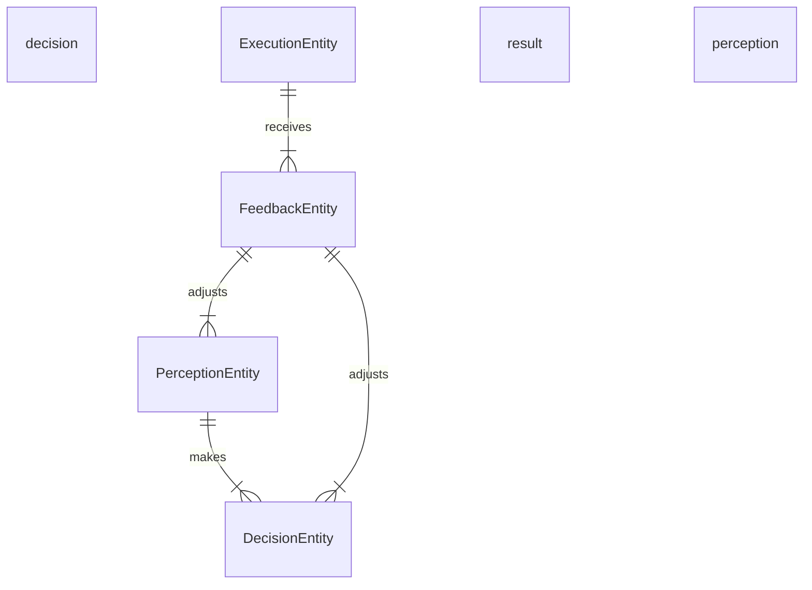
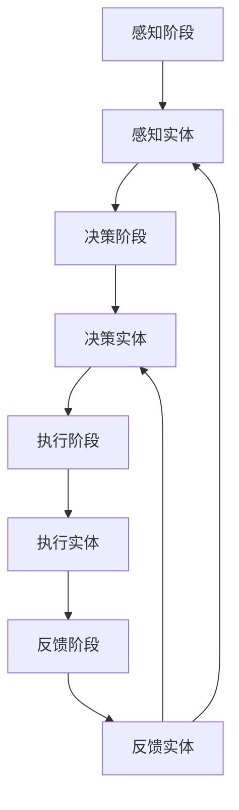
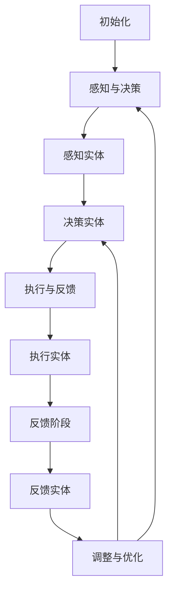
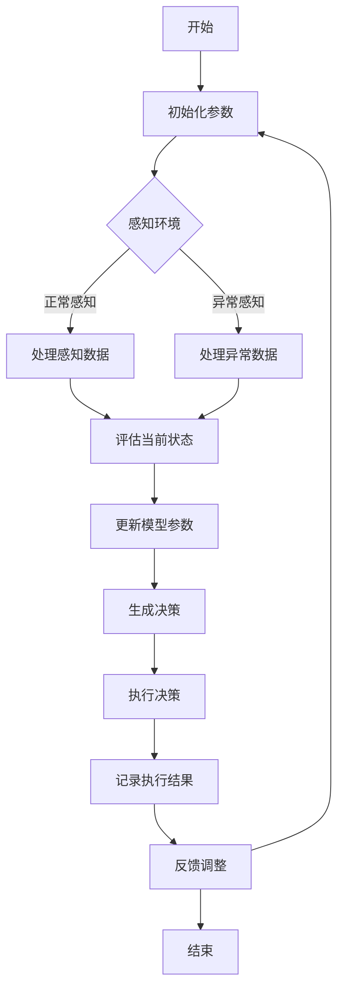

                 

### 摘要

本文将探讨设计AI Agent的自适应元决策框架这一前沿课题。随着人工智能技术的不断进步，AI Agent在自动化决策中的应用越来越广泛。然而，现实世界的复杂性和不确定性使得传统决策框架面临巨大挑战。本文提出了一种自适应元决策框架，通过结合自适应算法和元决策理论，实现AI Agent在不同场景下的自适应决策能力。首先，文章介绍了问题背景和核心概念，明确了自适应算法、元决策理论以及AI Agent在决策框架中的重要作用。其次，文章通过对比不同核心概念的属性特征，为后续研究和设计提供了理论依据。接着，文章详细阐述了自适应元决策框架的算法原理，并使用Python源代码进行了实现。随后，文章分析了系统功能、架构和交互设计，为实际应用提供了详细方案。最后，通过一个实际案例，文章展示了自适应元决策框架在解决实际问题中的效果。本文旨在为研究人员和开发者提供一份系统且实用的技术指南，以推动AI Agent自适应决策技术的发展。

### 问题背景与核心概念

#### 1.1 问题的提出

在人工智能（AI）迅猛发展的今天，自动化决策成为了一个热门且关键的研究领域。AI Agent作为AI系统中的核心组件，能够在复杂的环境中自主地做出决策，从而实现自动化任务执行。然而，现实世界的复杂性以及环境中的不确定性使得传统的决策框架面临着巨大的挑战。例如，在无人驾驶、智能制造、智能金融等领域，AI Agent需要处理海量数据，应对动态变化的环境，同时做出高效、准确的决策。

现有的传统决策框架，如基于规则的专家系统、决策树、贝叶斯网络等，在处理静态和确定性环境时具有一定的效果。然而，当面对复杂动态环境时，这些传统框架往往显得力不从心。具体表现在以下几个方面：

1. **规则复杂度问题**：传统决策框架依赖于预先定义好的规则，这些规则在静态环境中可能效果良好，但在动态环境中，规则的数量和复杂度会呈指数级增长，导致系统的可维护性和可扩展性降低。
2. **数据依赖性**：许多传统决策框架依赖于大量历史数据来训练模型，但在新环境中，缺乏足够的训练数据，导致模型的泛化能力差。
3. **适应性不足**：传统决策框架在面对环境变化时，通常需要重新训练或调整模型，这种过程往往耗时耗力，无法实现实时响应。

#### 1.2 自适应算法

自适应算法是一种通过不断调整自身参数来适应环境变化的算法。其基本思想是在执行任务的过程中，根据环境反馈动态调整决策策略，从而提高决策的适应性和鲁棒性。自适应算法在许多领域都得到了广泛应用，如自适应控制、自适应优化、自适应学习等。

在AI领域，自适应算法的核心优势在于其能够实现实时决策和动态调整。具体来说，自适应算法包括以下几个关键特点：

1. **实时性**：自适应算法能够实时处理环境反馈，快速调整决策策略，从而应对动态变化。
2. **鲁棒性**：自适应算法具有较好的鲁棒性，即使在数据噪声或环境不完整的情况下，也能够保持稳定的决策效果。
3. **自适应性**：自适应算法可以根据不同环境的变化，动态调整自身参数，实现最佳决策。

#### 1.3 元决策理论

元决策理论是一种关于决策过程的决策理论，其主要研究如何优化决策过程本身，以提高整体决策效率。元决策理论的核心思想是将决策过程视为一个整体，通过分析决策过程中的各个环节，找出优化点，从而提高决策质量。

在AI领域，元决策理论的应用主要体现在以下几个方面：

1. **决策路径优化**：元决策理论通过分析决策路径，找出最优决策路径，从而提高整体决策效率。
2. **多目标决策**：元决策理论能够同时考虑多个目标，通过权衡不同目标之间的关系，找到最佳决策方案。
3. **不确定性管理**：元决策理论能够处理环境中的不确定性，通过风险分析和决策优化，找到适应不确定性的决策方案。

#### 1.4 AI Agent与决策框架

AI Agent是一种具有自主决策能力的智能实体，它可以在复杂环境中自主执行任务。AI Agent的核心能力在于其决策能力，即根据环境信息，选择最优行动策略。

一个完整的AI Agent决策框架通常包括以下几个部分：

1. **感知系统**：感知系统负责收集环境信息，并将这些信息传递给决策模块。
2. **决策模块**：决策模块根据感知系统收集到的信息，利用自适应算法和元决策理论，生成行动策略。
3. **执行系统**：执行系统负责根据决策模块生成的行动策略，执行具体的任务。
4. **反馈系统**：反馈系统负责将执行结果反馈给感知系统和决策模块，形成闭环控制。

#### 总结

本文介绍了AI Agent自适应元决策框架的背景和核心概念。现实世界中的复杂性和不确定性要求AI Agent具备更高的决策能力。自适应算法和元决策理论为AI Agent提供了有效的决策支持。通过设计自适应元决策框架，AI Agent能够在动态环境中实现自主决策，从而提高任务执行效率和鲁棒性。接下来的章节将进一步详细探讨这些核心概念，并阐述如何构建和实现自适应元决策框架。

#### 1.5 自适应算法的基本概念

自适应算法是一种能够在运行过程中动态调整自身参数以适应环境变化的算法。其基本原理是通过不断地学习环境反馈，调整决策模型中的参数，从而提高决策的准确性和适应性。下面我们将从基本原理、工作流程和应用场景三个方面来详细探讨自适应算法。

##### 1.5.1 基本原理

自适应算法的核心在于“学习”和“调整”。其基本原理可以概括为以下几个步骤：

1. **感知环境**：自适应算法通过感知系统获取环境状态信息，这些信息可以是直接的物理量，也可以是间接的指标。
2. **评估决策**：算法根据当前环境状态和之前的决策结果，评估当前决策的有效性。评估过程通常包括对决策结果的预测和与实际结果的对比。
3. **调整参数**：基于评估结果，自适应算法动态调整决策模型的参数，以优化决策效果。这种调整可以是线性的，也可以是非线性的，具体取决于算法的设计。
4. **执行决策**：调整后的决策模型生成新的决策，该决策被用于执行系统，执行具体的任务。
5. **反馈与更新**：执行结果会再次被反馈到感知系统和评估模块，作为下一次调整的依据。

##### 1.5.2 工作流程

自适应算法的工作流程通常可以分为以下几个阶段：

1. **初始化**：初始化决策模型和相关参数，设置初始状态。
2. **感知阶段**：感知系统收集环境状态信息，并将其传递给决策模块。
3. **决策阶段**：决策模块根据当前状态和之前的学习结果，生成决策。
4. **执行阶段**：执行系统根据决策模块生成的决策，执行具体的任务。
5. **反馈阶段**：执行结果通过反馈系统传递给感知系统和评估模块。
6. **调整阶段**：评估模块根据反馈结果，调整决策模型中的参数。
7. **重复阶段**：流程回到感知阶段，重复进行上述步骤。

##### 1.5.3 应用场景

自适应算法在许多领域都展现出了强大的应用价值，以下是一些典型应用场景：

1. **无人驾驶**：在无人驾驶系统中，自适应算法能够实时调整驾驶策略，以应对复杂的交通状况和环境变化，从而提高驾驶安全和效率。
2. **智能制造**：在智能制造过程中，自适应算法可以根据生产线的实时状态，动态调整生产参数，优化生产流程，提高生产效率。
3. **金融交易**：在金融市场中，自适应算法能够根据市场动态，实时调整交易策略，以最大化收益或最小化风险。
4. **智能电网**：在智能电网中，自适应算法可以根据电力需求和供应情况，动态调整电力分配策略，优化电网运行效率。
5. **健康监测**：在健康监测领域，自适应算法可以根据实时健康数据，动态调整健康建议和治疗方案，提供个性化的健康服务。

##### 1.5.4 自适应算法的优势与挑战

自适应算法的优势在于其能够动态适应环境变化，提高决策的实时性和鲁棒性。然而，自适应算法也面临着一些挑战：

1. **计算复杂度**：自适应算法通常需要实时处理大量数据，计算复杂度较高，对计算资源的需求较大。
2. **参数调整**：自适应算法需要不断调整参数，但如何选择合适的参数调整策略是一个复杂的问题。
3. **模型稳定性**：自适应算法在调整参数的过程中，可能会引起模型的不稳定，导致决策效果下降。
4. **数据质量**：自适应算法对数据质量有较高要求，数据噪声和缺失可能会影响算法的决策效果。

综上所述，自适应算法是一种强大的工具，能够为AI Agent提供实时、自适应的决策能力。然而，在实际应用中，如何有效解决上述挑战，仍需要进一步的研究和探索。

#### 1.6 元决策理论的基本概念

元决策理论是一种关于决策过程的决策理论，其核心思想是将决策过程本身作为研究对象，通过优化决策过程来提高整体决策效率。元决策理论不仅关注决策结果，更强调决策过程的质量和效率，通过分析决策路径、多目标决策和不确定性管理等方面，实现对决策过程的全面优化。

##### 1.6.1 元决策理论的核心思想

元决策理论认为，决策过程是一个复杂的多阶段过程，每个阶段都可能影响最终的决策结果。其核心思想可以概括为以下几点：

1. **决策路径优化**：元决策理论通过分析决策路径，找出最优决策路径，从而减少决策过程中的冗余和浪费，提高整体决策效率。
2. **多目标决策**：元决策理论考虑多个目标之间的权衡和优化，通过多目标决策方法，找到满足不同目标的最佳决策方案。
3. **不确定性管理**：元决策理论通过引入概率模型、模糊理论和博弈论等方法，处理决策过程中的不确定性，提高决策的鲁棒性和适应性。

##### 1.6.2 决策路径优化

决策路径优化是元决策理论的一个重要组成部分。其基本思想是通过分析决策过程中的每一步，找出影响决策效果的关键环节，从而优化整个决策路径。具体步骤如下：

1. **路径分析**：对决策过程中的每一步进行详细分析，识别出可能影响决策效果的关键因素。
2. **成本评估**：评估每个决策步骤的成本和收益，包括时间成本、经济成本和资源消耗等。
3. **路径选择**：根据成本评估结果，选择最优决策路径，尽量减少冗余步骤和资源浪费。

##### 1.6.3 多目标决策

在现实世界中，决策往往涉及多个目标，这些目标之间可能存在冲突和权衡。多目标决策的目标是找到一个能够在多个目标之间取得平衡的决策方案。元决策理论采用以下方法来处理多目标决策：

1. **目标明确化**：明确决策过程中的多个目标，并将其量化为具体的指标。
2. **目标权衡**：分析多个目标之间的关系，通过权衡和优化，找到一个能够在多个目标之间取得平衡的决策方案。
3. **目标冲突解决**：当多个目标之间存在冲突时，采用博弈论、优化算法等方法，找到解决方案，使多个目标得到尽可能好的满足。

##### 1.6.4 不确定性管理

在决策过程中，环境的不确定性是不可避免的因素。元决策理论通过以下方法来处理不确定性：

1. **概率模型**：引入概率模型，将不确定性因素量化为概率分布，从而分析不确定性的影响。
2. **模糊理论**：使用模糊理论处理不确定性，将不确定事件表示为模糊集合，从而进行决策。
3. **博弈论**：采用博弈论方法，考虑多个决策主体之间的交互和博弈，找到能够在不确定性环境中取得最佳效果的决策方案。

##### 1.6.5 元决策理论的应用

元决策理论在多个领域都有广泛的应用，以下是一些典型应用场景：

1. **供应链管理**：通过元决策理论优化供应链管理中的决策过程，提高供应链的效率和响应速度。
2. **金融投资**：在金融市场中，元决策理论通过分析投资组合中的多个目标，找到最优的投资策略，提高投资收益。
3. **智能交通**：通过元决策理论优化交通管理决策，提高交通流量和安全性。
4. **医疗决策**：在医疗决策中，元决策理论通过分析多个决策因素，为医生提供最佳的治疗方案。
5. **能源管理**：通过元决策理论优化能源管理决策，提高能源利用效率，减少能源消耗。

##### 1.6.6 元决策理论的挑战与前景

尽管元决策理论在许多领域都展现了强大的应用价值，但其应用也面临着一些挑战：

1. **复杂性**：决策过程本身的复杂性使得元决策理论的应用变得复杂，需要更高层次的理论和方法来支持。
2. **数据依赖**：元决策理论对数据质量有较高要求，数据缺失和噪声会影响决策效果。
3. **计算效率**：元决策理论涉及大量计算，对计算资源的需求较高，如何提高计算效率是一个重要问题。

然而，随着人工智能技术的不断发展，元决策理论的应用前景仍然非常广阔。未来，通过结合深度学习、强化学习等先进技术，元决策理论有望在更多领域实现突破，为复杂决策提供更加智能和高效的解决方案。

#### 1.7 AI Agent的定义与作用

AI Agent是指一种具备自主决策能力和行动能力的智能实体，能够在复杂和动态的环境中执行特定任务。AI Agent的核心特点是其具有自主性和适应性，能够根据环境变化自主调整行为策略，从而实现任务目标。AI Agent通常由感知系统、决策模块和执行系统三部分组成。

##### 1.7.1 AI Agent的组成部分

1. **感知系统**：感知系统负责获取环境信息，如温度、湿度、声音、图像等，并将这些信息转化为数字信号，传递给决策模块。
2. **决策模块**：决策模块是AI Agent的核心，它根据感知系统提供的信息和存储的知识库，利用自适应算法和元决策理论，生成最佳行动策略。
3. **执行系统**：执行系统负责根据决策模块生成的行动策略，执行具体的任务，如移动、控制机器臂、发送消息等。

##### 1.7.2 AI Agent在决策框架中的重要作用

AI Agent在决策框架中的作用至关重要，其重要性主要体现在以下几个方面：

1. **自主决策**：AI Agent能够根据环境变化自主做出决策，实现自动化任务执行，提高了系统的效率和鲁棒性。
2. **实时响应**：AI Agent具有实时感知和决策能力，能够快速响应环境变化，保证系统在动态环境中的稳定运行。
3. **自适应调整**：通过自适应算法和元决策理论，AI Agent能够在任务执行过程中动态调整策略，提高决策的准确性和适应性。
4. **优化资源利用**：AI Agent能够根据任务需求和资源状况，优化资源分配和利用，提高系统整体性能。

##### 1.7.3 AI Agent在现实世界中的应用

AI Agent在现实世界中的许多场景中都得到了广泛应用，以下是一些典型应用实例：

1. **无人驾驶**：AI Agent在无人驾驶汽车中扮演关键角色，通过感知环境、自主决策和执行任务，实现自动驾驶。
2. **智能制造**：AI Agent在智能生产线中用于监控设备状态、故障检测和任务分配，提高生产效率和产品质量。
3. **智能客服**：AI Agent在智能客服系统中，通过理解用户需求和对话内容，生成合适的回应，提供高质量的客户服务。
4. **智能安防**：AI Agent在智能安防系统中，通过实时监控视频和传感器数据，发现异常行为并及时报警，保障公共安全。
5. **智能家居**：AI Agent在智能家居系统中，通过感知用户行为和环境变化，自动调节家电设备，提供个性化服务。

##### 1.7.4 AI Agent的发展趋势

随着人工智能技术的不断进步，AI Agent的发展也呈现出以下趋势：

1. **更强的自主性**：通过深度学习和强化学习等先进技术，AI Agent将具备更强的自主决策能力，能够处理更加复杂的环境和任务。
2. **更高的适应性**：AI Agent将通过自适应算法和元决策理论，实现更高效、更准确的自适应决策，提高在动态环境中的适应能力。
3. **更广泛的领域应用**：AI Agent将在更多领域得到应用，如医疗、金融、教育等，为人类提供更加智能化的服务。
4. **更紧密的人机交互**：AI Agent将具备更好的人机交互能力，通过自然语言处理、语音识别等技术，实现与用户的自然对话和协作。

总之，AI Agent作为人工智能领域的一个重要研究方向，具有巨大的发展潜力和广泛应用前景。通过深入研究AI Agent的自适应元决策框架，将为AI Agent在各个领域的应用提供更加可靠和高效的解决方案。

#### 1.8 自适应算法、元决策理论和AI Agent的关系及交互

自适应算法、元决策理论和AI Agent三者之间有着紧密的联系和交互，共同构成了一个高效、智能的决策框架。下面我们将详细分析这三者之间的关系及其在决策框架中的协同作用。

##### 1.8.1 自适应算法与AI Agent

自适应算法是AI Agent实现自主决策的核心组件。自适应算法通过不断调整自身的参数，以适应动态变化的环境，从而提高决策的准确性和适应性。具体来说，自适应算法在AI Agent中的作用主要体现在以下几个方面：

1. **实时调整决策策略**：AI Agent在执行任务过程中，会根据自适应算法实时调整决策策略，以应对环境中的不确定性变化。这种实时调整能力使得AI Agent能够在复杂和动态环境中保持高效的决策能力。
2. **优化决策质量**：自适应算法通过优化决策过程中的参数，提高决策质量。例如，在无人驾驶中，自适应算法可以根据环境变化动态调整车速和行驶路径，从而提高行驶安全性和效率。
3. **增强鲁棒性**：自适应算法能够通过学习环境反馈，增强AI Agent对环境变化的鲁棒性。即使环境发生剧烈变化，AI Agent也能保持稳定的决策能力，保证任务的顺利完成。

##### 1.8.2 元决策理论与AI Agent

元决策理论是一种关于决策过程本身的理论，其核心思想是通过优化决策过程来提高整体决策效率。元决策理论在AI Agent中的应用主要体现在以下几个方面：

1. **决策路径优化**：元决策理论通过分析决策过程中的每一步，找出最优决策路径，从而减少冗余步骤，提高决策效率。例如，在智能交通系统中，元决策理论可以帮助优化交通信号控制策略，减少交通拥堵。
2. **多目标决策**：AI Agent在执行任务时，往往需要同时考虑多个目标，如安全、效率和成本等。元决策理论通过多目标决策方法，帮助AI Agent找到最优的决策方案，实现多个目标的平衡。
3. **不确定性管理**：元决策理论通过处理环境中的不确定性，帮助AI Agent在不确定环境中做出更可靠的决策。例如，在医疗决策中，元决策理论可以帮助医生在不确定的病情中找到最佳的治疗方案。

##### 1.8.3 自适应算法与元决策理论

自适应算法和元决策理论在决策框架中相辅相成，共同提高决策系统的效率和鲁棒性。具体来说，两者之间的协同作用主要体现在以下几个方面：

1. **互补性**：自适应算法侧重于实时调整决策参数，以适应环境变化；而元决策理论侧重于优化决策过程，提高决策效率。两者在功能上互补，共同构建一个完整的决策框架。
2. **动态调整与优化**：自适应算法通过动态调整决策参数，实现决策的实时性；元决策理论通过优化决策过程，实现决策的效率性。两者共同作用，使得决策系统在动态环境中保持高效和稳定。
3. **闭环反馈**：自适应算法和元决策理论都依赖反馈机制，通过不断收集环境反馈，调整决策参数和优化决策过程。这种闭环反馈机制使得决策系统能够持续学习和改进，不断提高决策质量。

##### 1.8.4 在决策框架中的交互

在自适应元决策框架中，自适应算法和元决策理论通过AI Agent实现紧密的交互和协同。具体交互过程如下：

1. **感知阶段**：AI Agent通过感知系统收集环境信息，包括温度、湿度、图像、声音等，并将其转化为数字信号。
2. **决策阶段**：感知系统将环境信息传递给决策模块，决策模块利用自适应算法和元决策理论，结合历史决策数据和当前环境信息，生成最佳行动策略。
3. **执行阶段**：决策模块生成的行动策略传递给执行系统，执行系统根据策略执行具体的任务，如移动、控制设备等。
4. **反馈阶段**：执行系统将任务执行结果反馈给感知系统和决策模块，形成闭环反馈机制。决策模块根据反馈结果，利用自适应算法和元决策理论，调整决策参数和优化决策过程。

通过这种闭环反馈机制，自适应算法和元决策理论能够实时调整决策策略，优化决策过程，提高AI Agent在动态环境中的适应能力和决策效率。

综上所述，自适应算法、元决策理论和AI Agent在决策框架中相互关联、相互作用，共同构成了一个高效、智能的决策系统。通过深入研究和应用这三者，可以进一步提高AI Agent的自主决策能力，为现实世界中的各种复杂任务提供可靠的解决方案。

#### 1.9 自适应算法属性特征对比

在构建自适应元决策框架时，理解和比较不同自适应算法的属性特征是至关重要的。以下是几种常见自适应算法的属性特征对比，包括其优点、缺点、适用场景以及与元决策理论的结合方式。

##### 1.9.1 传统自适应算法

**遗传算法（GA）**：
- **优点**：遗传算法是一种基于自然选择和遗传机制的全局搜索算法，能够有效处理复杂优化问题。它具有较强的鲁棒性，能够在不确定性和非线性环境中找到近似最优解。
- **缺点**：遗传算法的计算复杂度较高，收敛速度较慢，对于大规模问题可能不适用。此外，它对问题的编码方式要求较高。
- **适用场景**：遗传算法适用于求解组合优化问题，如车辆路径规划、资源分配等。
- **与元决策理论的结合**：遗传算法可以与元决策理论结合，用于优化决策路径，如交通路线规划。

**粒子群优化（PSO）**：
- **优点**：粒子群优化算法简单易实现，收敛速度快，能够处理高维问题。它具有全局搜索能力，能够在复杂环境中找到近似最优解。
- **缺点**：粒子群优化算法在搜索过程中容易陷入局部最优，对参数调整较为敏感。
- **适用场景**：粒子群优化算法适用于求解连续优化问题，如函数优化、参数调整等。
- **与元决策理论的结合**：粒子群优化算法可以用于优化决策过程中的参数调整，如自适应控制。

**模拟退火算法（SA）**：
- **优点**：模拟退火算法通过模拟物理退火过程，能够有效避免局部最优，具有较好的全局搜索能力。它对初始解的依赖性较低，具有较强的鲁棒性。
- **缺点**：模拟退火算法的计算复杂度较高，需要较长时间才能收敛，对于实时性要求较高的应用可能不适用。
- **适用场景**：模拟退火算法适用于求解大规模组合优化问题，如旅行商问题、设施布局等。
- **与元决策理论的结合**：模拟退火算法可以用于优化复杂决策问题中的参数调整，如多目标优化。

##### 1.9.2 深度学习自适应算法

**神经网络（NN）**：
- **优点**：神经网络具有较强的学习能力，能够处理复杂的非线性关系。它能够通过大量数据进行训练，从而实现高精度的预测和分类。
- **缺点**：神经网络对数据质量有较高要求，对噪声和异常数据敏感。训练过程需要大量计算资源和时间。
- **适用场景**：神经网络适用于处理高维数据和复杂模式识别问题，如图像识别、语音识别等。
- **与元决策理论的结合**：神经网络可以与元决策理论结合，用于优化复杂决策过程中的数据分析和模式识别。

**强化学习（RL）**：
- **优点**：强化学习通过学习环境反馈，能够实现自主决策和策略优化。它具有较强的自适应能力，能够处理动态和不确定环境。
- **缺点**：强化学习需要大量的训练数据和时间，对问题的状态空间和动作空间有较高要求。
- **适用场景**：强化学习适用于控制问题和序列决策问题，如无人驾驶、游戏AI等。
- **与元决策理论的结合**：强化学习可以与元决策理论结合，用于优化复杂决策过程中的策略学习和环境适应。

##### 1.9.3 对比表格

以下是不同自适应算法的属性特征对比表格：

| 算法        | 优点                     | 缺点                     | 适用场景                     | 与元决策理论的结合         |
| ----------- | ------------------------ | ------------------------ | ---------------------------- | -------------------------- |
| 遗传算法    | 全局搜索、强鲁棒性       | 计算复杂度高、收敛慢     | 组合优化问题                 | 优化决策路径               |
| 粒子群优化  | 简单易实现、收敛快       | 易陷入局部最优、参数敏感 | 连续优化问题                 | 参数调整                   |
| 模拟退火    | 避免局部最优、鲁棒性强   | 计算复杂度高、收敛慢     | 大规模组合优化问题           | 多目标优化                 |
| 神经网络    | 学习能力强、处理非线性   | 对数据质量要求高、训练时间长 | 复杂模式识别问题             | 数据分析和模式识别         |
| 强化学习    | 自主决策、适应性强       | 训练数据和时间需求高     | 控制问题和序列决策问题       | 策略学习和环境适应         |

通过上述对比，可以看出不同自适应算法具有各自的优势和适用场景。在实际应用中，可以根据具体问题的需求和特点，选择合适的自适应算法，并结合元决策理论，构建高效的决策框架。

#### 1.10 元决策理论属性特征对比

在构建自适应元决策框架时，理解和比较不同元决策理论的属性特征是至关重要的。以下是几种常见元决策理论的属性特征对比，包括其优点、缺点、适用场景以及与自适应算法的结合方式。

##### 1.10.1 传统元决策理论

**多目标决策理论**：
- **优点**：多目标决策理论能够同时考虑多个目标，通过权衡不同目标之间的关系，找到最优或次优解。它有助于在复杂决策问题中实现多目标的平衡。
- **缺点**：多目标决策理论通常需要大量的计算资源，特别是在目标数量较多时，计算复杂度显著增加。此外，某些情况下，多个目标之间存在冲突，难以找到同时满足所有目标的解。
- **适用场景**：多目标决策理论适用于资源分配、项目管理、环境规划等复杂决策问题。
- **与自适应算法的结合**：多目标决策理论可以与自适应算法结合，用于优化自适应决策过程中的多目标权衡。例如，在无人驾驶中，自适应算法可以根据多目标决策理论，优化车辆路径和能耗。

**博弈论**：
- **优点**：博弈论通过分析多个决策主体之间的交互和博弈，可以帮助解决竞争性和合作性决策问题。它能够考虑各方的利益和策略，找到均衡解。
- **缺点**：博弈论在实际应用中，往往需要大量的信息交换和计算，特别是在决策主体较多、策略复杂的情况下，计算复杂度非常高。
- **适用场景**：博弈论适用于市场策略、合作博弈、资源分配等问题。
- **与自适应算法的结合**：博弈论可以与自适应算法结合，用于解决多主体决策问题中的策略优化。例如，在智能交通系统中，自适应算法可以根据博弈论理论，优化交通信号控制和车辆调度。

**决策树**：
- **优点**：决策树是一种直观、易于理解的决策工具，它通过一系列条件分支，逐步将决策空间划分成不同的子集，从而找到最佳决策路径。
- **缺点**：决策树在面对大规模数据和复杂决策问题时，可能会变得非常复杂，导致计算效率降低。此外，决策树的预测能力依赖于历史数据的准确性。
- **适用场景**：决策树适用于中小规模的数据分析和决策问题，如信贷风险评估、市场营销策略等。
- **与自适应算法的结合**：决策树可以与自适应算法结合，用于优化自适应决策过程中的决策路径。例如，在推荐系统中，自适应算法可以根据决策树模型，优化用户推荐策略。

##### 1.10.2 深度学习元决策理论

**深度强化学习**：
- **优点**：深度强化学习结合了深度学习和强化学习的优势，能够处理高维状态和动作空间，实现复杂的策略学习。它通过深度神经网络，对状态和价值进行建模，实现自主决策。
- **缺点**：深度强化学习需要大量的训练数据和计算资源，特别是在高维状态和动作空间中，训练过程可能非常耗时。此外，深度强化学习在面对不确定性时，可能存在收敛速度慢和稳定性差的问题。
- **适用场景**：深度强化学习适用于需要高自主性和复杂策略学习的领域，如自动驾驶、游戏AI等。
- **与自适应算法的结合**：深度强化学习可以与自适应算法结合，用于优化自适应决策过程中的策略学习和环境适应。例如，在无人驾驶中，深度强化学习可以根据自适应算法，优化驾驶策略和环境感知。

**深度决策网络**：
- **优点**：深度决策网络通过深度神经网络，实现对决策过程的建模和优化。它能够处理复杂的决策问题，并实现多层次的决策优化。
- **缺点**：深度决策网络在训练过程中，需要大量的数据和计算资源，对数据质量和计算能力有较高要求。此外，深度决策网络在面对动态变化的环境时，可能存在适应性不足的问题。
- **适用场景**：深度决策网络适用于复杂决策问题，如金融投资、医疗诊断等。
- **与自适应算法的结合**：深度决策网络可以与自适应算法结合，用于优化自适应决策过程中的模型更新和策略调整。例如，在金融投资中，深度决策网络可以根据自适应算法，优化投资组合策略。

##### 1.10.3 对比表格

以下是不同元决策理论的属性特征对比表格：

| 理论        | 优点                     | 缺点                     | 适用场景                     | 与自适应算法的结合         |
| ----------- | ------------------------ | ------------------------ | ---------------------------- | -------------------------- |
| 多目标决策  | 考虑多目标、实现平衡     | 计算复杂度高、易陷入局部 | 资源分配、项目管理           | 优化多目标权衡             |
| 博弈论      | 考虑多主体交互、实现均衡 | 计算复杂度高、信息需求高 | 市场策略、合作博弈           | 解决多主体策略优化         |
| 决策树      | 直观、易于理解           | 计算效率低、依赖于历史数据 | 数据分析、市场营销           | 优化决策路径               |
| 深度强化学习 | 高自主性、处理高维数据   | 计算资源需求高、稳定性差 | 自动驾驶、游戏AI             | 策略学习和环境适应         |
| 深度决策网络 | 复杂决策建模、多层次优化 | 计算资源需求高、适应性差 | 金融投资、医疗诊断           | 模型更新和策略调整         |

通过上述对比，可以看出不同元决策理论具有各自的优势和适用场景。在实际应用中，可以根据具体问题的需求和特点，选择合适的元决策理论，并结合自适应算法，构建高效的决策框架。

#### 1.11 AI Agent与决策框架属性特征对比

在设计和实现自适应元决策框架时，对AI Agent和决策框架的属性特征进行深入对比分析是至关重要的。以下是AI Agent与决策框架的几个关键属性特征对比，包括其功能、性能和适用性。

##### 1.11.1 AI Agent的属性特征

**功能**：
- **感知能力**：AI Agent具备感知环境的能力，能够通过各种传感器获取环境信息，如视觉、听觉、触觉等。
- **决策能力**：AI Agent利用内置的算法和模型，对感知到的环境信息进行分析和判断，生成相应的决策。
- **执行能力**：AI Agent根据决策结果执行具体的任务，如移动、操作设备、发送指令等。

**性能**：
- **实时性**：AI Agent需要在短时间内完成感知、决策和执行过程，以应对动态环境的变化。
- **鲁棒性**：AI Agent在面临噪声、异常数据和不确定环境时，仍能保持稳定的决策和执行能力。
- **可扩展性**：AI Agent的设计应具备良好的模块化和可扩展性，能够方便地集成新的传感器和执行器。

**适用性**：
- **无人驾驶**：AI Agent在无人驾驶汽车中扮演重要角色，负责感知道路状况、做出驾驶决策和执行驾驶动作。
- **智能制造**：AI Agent在智能生产线中负责监控设备状态、优化生产流程和执行生产任务。
- **智能客服**：AI Agent在智能客服系统中负责理解用户需求、生成回应和执行客户服务任务。

##### 1.11.2 决策框架的属性特征

**功能**：
- **决策路径优化**：决策框架通过分析决策路径，找出最优决策步骤，减少冗余和浪费，提高决策效率。
- **多目标决策**：决策框架能够同时考虑多个目标，通过权衡和优化，找到最佳决策方案。
- **不确定性管理**：决策框架通过处理不确定性，提高决策的鲁棒性和适应性。

**性能**：
- **计算效率**：决策框架需要在有限的时间内完成复杂的计算和优化任务，对计算资源的需求较高。
- **适应性**：决策框架需要具备动态调整能力，能够根据环境变化实时更新决策策略。
- **鲁棒性**：决策框架在面对数据噪声、模型不确定性和环境不完整性时，仍能保持稳定的决策能力。

**适用性**：
- **供应链管理**：决策框架在供应链管理中用于优化库存管理、需求预测和物流调度。
- **金融投资**：决策框架在金融投资中用于优化投资组合、风险管理和管理资金流动。
- **智能交通**：决策框架在智能交通系统中用于优化交通流量管理、交通信号控制和路线规划。

##### 1.11.3 对比表格

以下是AI Agent与决策框架的属性特征对比表格：

| 属性特征 | AI Agent | 决策框架 |
| ------- | ------- | -------- |
| 功能    | 感知、决策、执行   | 决策路径优化、多目标决策、不确定性管理 |
| 性能    | 实时性、鲁棒性、可扩展性 | 计算效率、适应性、鲁棒性 |
| 适用性  | 无人驾驶、智能制造、智能客服 | 供应链管理、金融投资、智能交通 |

通过对比可以看出，AI Agent和决策框架在功能、性能和适用性方面各有特点。在实际应用中，可以将AI Agent与决策框架结合起来，充分发挥两者的优势，构建高效、智能的决策系统。

#### 1.12 自适应元决策框架的ER实体关系图架构

为了更好地理解自适应元决策框架的架构，我们使用ER（实体-关系）图来描述其核心实体及其关系。ER图是一种常用的数据库设计工具，通过展示实体及其之间的关系，帮助我们清晰地了解系统的数据结构和功能。

##### 1.12.1 ER实体定义

在本框架中，我们定义了以下几个核心实体：

1. **感知实体（Perception Entity）**：负责收集和处理环境数据，包括温度、湿度、图像、声音等。
2. **决策实体（Decision Entity）**：负责根据感知实体提供的数据，利用自适应算法和元决策理论生成决策。
3. **执行实体（Execution Entity）**：负责根据决策实体的决策结果执行具体的任务。
4. **反馈实体（Feedback Entity）**：负责收集执行结果，并将其反馈给感知实体和决策实体，形成闭环控制。

##### 1.12.2 ER实体关系

以下是这些实体之间的关系：

1. **感知实体与决策实体**：感知实体将收集到的环境数据传递给决策实体，决策实体利用这些数据进行决策。
2. **决策实体与执行实体**：决策实体生成决策后，将决策传递给执行实体，执行实体根据决策执行具体的任务。
3. **执行实体与反馈实体**：执行实体将任务执行结果反馈给反馈实体，反馈实体将反馈结果传递给感知实体和决策实体，用于后续决策和调整。
4. **反馈实体与感知实体**：反馈实体将执行结果反馈给感知实体，感知实体利用这些反馈结果调整感知数据，提高决策准确性。
5. **反馈实体与决策实体**：反馈实体将执行结果反馈给决策实体，决策实体利用这些反馈结果调整决策策略，提高决策适应性。

##### 1.12.3 Mermaid ER图

以下是一个使用Mermaid语法绘制的ER图示例：



通过这个ER图，我们可以清晰地看到感知实体、决策实体、执行实体和反馈实体之间的相互关系，以及它们如何协同工作，实现自适应元决策框架的功能。

#### 1.13 自适应元决策框架的数据流与控制流分析

在自适应元决策框架中，数据流和控制流是确保系统高效运行的关键要素。数据流描述了信息在系统中的传递路径，而控制流描述了系统各组件之间的协调和交互过程。通过分析数据流和控制流，我们可以更好地理解系统的运作机制，优化系统性能。

##### 1.13.1 数据流分析

在自适应元决策框架中，数据流主要涉及以下几个步骤：

1. **感知阶段**：感知实体通过传感器收集环境数据，如温度、湿度、图像、声音等，并将这些数据传递给决策实体。
2. **决策阶段**：决策实体接收感知实体提供的数据，利用自适应算法和元决策理论进行分析和处理，生成最优决策。
3. **执行阶段**：执行实体根据决策实体的决策结果，执行具体的任务，如移动、操作设备、发送指令等。
4. **反馈阶段**：执行实体将任务执行结果反馈给反馈实体，反馈实体将反馈结果传递给感知实体和决策实体，用于后续的感知和决策调整。

以下是自适应元决策框架的数据流图：



通过这个数据流图，我们可以看到数据从感知阶段到决策阶段，再到执行阶段，最后回到反馈阶段，形成了一个闭环控制过程。这种闭环控制机制使得系统能够根据环境变化不断调整决策，提高自适应能力。

##### 1.13.2 控制流分析

控制流描述了系统各组件之间的协调和交互过程，包括以下几个方面：

1. **初始化**：系统启动时，初始化感知实体、决策实体、执行实体和反馈实体，设置初始状态。
2. **感知与决策**：感知实体持续收集环境数据，并将其传递给决策实体。决策实体根据当前状态和之前的学习结果，生成决策。
3. **执行与反馈**：执行实体根据决策实体的决策结果执行任务，并将执行结果反馈给反馈实体。
4. **调整与优化**：反馈实体根据执行结果调整感知实体和决策实体的参数，优化决策过程。

以下是自适应元决策框架的控制流图：



通过这个控制流图，我们可以看到系统在初始化后，通过感知与决策、执行与反馈的循环过程，实现系统的持续优化和自适应调整。

##### 1.13.3 数据流与控制流的关系

数据流和控制流在自适应元决策框架中是相互关联的。数据流提供了系统运行所需的信息，而控制流则确保这些信息得到有效利用。具体来说：

1. **数据驱动**：系统的运行依赖于数据的流动，数据流驱动了系统的各个阶段。例如，感知实体收集的数据驱动决策实体的决策过程。
2. **控制引导**：控制流则对数据流进行引导和优化。通过控制流，系统可以实时调整数据流的方向和速度，以适应环境变化。例如，反馈实体根据执行结果调整决策实体的参数，引导决策过程。
3. **闭环控制**：数据流和控制流形成一个闭环控制机制。系统通过收集执行结果，调整感知和决策参数，实现对环境变化的快速响应和适应。

综上所述，数据流与控制流在自适应元决策框架中相辅相成，共同构成了系统高效运行的基础。通过深入分析数据流和控制流，我们可以优化系统的设计，提高系统的自适应能力和决策效率。

### 算法原理讲解

#### 5.1 自适应算法原理讲解

自适应算法是一种通过不断调整自身参数来适应环境变化的算法，其核心思想是利用环境反馈信息动态优化决策过程。下面我们将详细讲解自适应算法的基本原理，包括其理论基础、关键步骤以及常见类型。

##### 5.1.1 理论基础

自适应算法的理论基础主要来源于控制理论、优化理论和机器学习。控制理论提供了系统建模和动态调整的方法，优化理论则为参数调整提供了优化准则，而机器学习为算法提供了自适应学习的能力。

1. **控制理论**：自适应算法借鉴了控制理论中的反馈控制思想。在控制系统中，通过传感器收集状态信息，比较实际状态与期望状态，生成误差信号，利用误差信号调整控制器的参数，从而实现系统稳定运行。

2. **优化理论**：自适应算法利用优化理论中的优化准则，如最小化误差函数、最大化效用函数等，调整算法参数，以实现系统的最优性能。

3. **机器学习**：自适应算法借鉴了机器学习中的学习机制，通过历史数据和环境反馈，不断调整模型参数，提高算法的适应性和准确性。

##### 5.1.2 关键步骤

自适应算法通常包括以下几个关键步骤：

1. **感知与状态评估**：感知系统收集环境信息，并将这些信息转化为状态变量，用于评估当前系统的状态。

2. **决策与参数调整**：决策模块根据当前状态，利用优化准则和自适应学习机制，调整算法的参数。参数调整可以是线性的或非线性的，取决于算法设计。

3. **执行与反馈**：执行系统根据调整后的参数执行任务，并将执行结果反馈给感知系统和决策模块。反馈信息用于更新状态评估和参数调整。

4. **闭环控制**：通过反馈机制，自适应算法形成一个闭环控制过程，不断调整决策参数，以适应环境变化。

##### 5.1.3 常见类型

自适应算法有多种类型，适用于不同的应用场景。以下是几种常见类型的自适应算法：

1. **PID控制算法**：比例-积分-微分（PID）控制算法是最常用的自适应控制算法。它通过调整比例、积分和微分三个参数，实现对系统误差的动态调整，从而提高控制效果。

2. **遗传算法**：遗传算法（GA）是一种基于自然选择和遗传机制的优化算法。它通过交叉、变异等操作，模拟生物进化过程，寻找最优解。

3. **粒子群优化算法**：粒子群优化算法（PSO）通过模拟鸟群觅食行为，寻找最优解。算法中的每个粒子代表一个潜在解，通过更新粒子的位置和速度，逐步逼近最优解。

4. **模拟退火算法**：模拟退火算法（SA）通过模拟物理退火过程，逐步减小搜索过程中的约束，寻找全局最优解。算法在每次迭代中，通过接受较差的解来跳出局部最优，增加搜索的广度。

##### 5.1.4 自适应算法的优势

自适应算法具有以下优势：

1. **实时性**：自适应算法能够实时处理环境反馈，快速调整决策参数，适应环境变化。

2. **鲁棒性**：自适应算法具有较强的鲁棒性，即使在数据噪声或环境不确定的情况下，也能保持稳定的决策效果。

3. **自适应性**：自适应算法可以根据不同环境的变化，动态调整自身参数，提高决策的准确性和适应性。

4. **优化性**：自适应算法通过不断调整参数，优化决策过程，提高系统的整体性能。

##### 5.1.5 自适应算法的应用

自适应算法在许多领域都有广泛应用，包括：

1. **无人驾驶**：自适应算法在无人驾驶中用于实时调整驾驶策略，提高行驶安全性和效率。

2. **智能制造**：自适应算法在智能制造中用于优化生产流程、设备监控和故障检测。

3. **金融交易**：自适应算法在金融交易中用于实时调整交易策略，提高投资收益。

4. **智能电网**：自适应算法在智能电网中用于动态调整电力分配，优化电网运行效率。

5. **健康监测**：自适应算法在健康监测中用于实时分析健康数据，提供个性化的健康建议。

通过以上对自适应算法原理的讲解，我们可以看到，自适应算法是一种强大的工具，能够为AI Agent提供实时、自适应的决策支持。接下来的章节将进一步探讨元决策理论及其在自适应元决策框架中的应用。

#### 5.2 元决策理论原理讲解

元决策理论是一种关于决策过程的决策理论，其核心思想是通过优化决策过程本身，提高整体决策效率。元决策理论不仅关注决策结果，更强调决策过程的质量和效率，通过分析决策路径、多目标决策和不确定性管理等方面，实现对决策过程的全面优化。以下是元决策理论的基本原理、方法及其在决策过程中的应用。

##### 5.2.1 元决策理论的基本原理

元决策理论的基本原理可以概括为以下几点：

1. **决策路径优化**：元决策理论通过分析决策过程中的每一步，找出影响决策效果的关键环节，从而优化整个决策路径。这包括减少冗余步骤、优化决策路径选择以及降低决策成本等。

2. **多目标决策**：在现实决策中，往往需要同时考虑多个目标，这些目标之间可能存在冲突。元决策理论通过多目标决策方法，考虑不同目标之间的权衡和优化，找到一个能够在多个目标之间取得平衡的决策方案。

3. **不确定性管理**：元决策理论通过引入概率模型、模糊理论和博弈论等方法，处理决策过程中的不确定性，提高决策的鲁棒性和适应性。这包括风险分析、概率估计和决策优化等。

4. **决策过程优化**：元决策理论通过优化决策过程中的各个环节，如信息收集、分析评估、方案选择和执行监控等，提高决策的整体效率和质量。

##### 5.2.2 元决策理论的方法

元决策理论的方法主要包括以下几个方面：

1. **决策树**：决策树是一种直观、易于理解的决策工具，通过一系列条件分支，逐步将决策空间划分成不同的子集，从而找到最佳决策路径。

2. **多目标优化**：多目标优化方法用于同时考虑多个目标，通过权衡和优化，找到一个在多个目标之间取得平衡的决策方案。常用的多目标优化算法包括线性规划、非线性规划和遗传算法等。

3. **博弈论**：博弈论通过分析多个决策主体之间的交互和博弈，找到均衡解，从而解决竞争性和合作性决策问题。博弈论方法包括合作博弈和非合作博弈，常用的模型包括纳什均衡、协同博弈和博弈树等。

4. **概率模型**：概率模型通过量化不确定性，提供决策过程的概率分析。常用的概率模型包括贝叶斯网络、马尔可夫决策过程和蒙特卡罗模拟等。

5. **模糊理论**：模糊理论用于处理不确定性和模糊性。通过模糊集合和模糊逻辑，模糊理论能够表达和处理不确定信息，提供更加灵活的决策方法。

##### 5.2.3 元决策理论在决策过程中的应用

元决策理论在决策过程中的应用主要包括以下几个方面：

1. **决策路径优化**：在决策过程中，元决策理论通过分析每一步决策的路径，找出影响决策效果的关键因素，从而优化决策路径。例如，在供应链管理中，元决策理论可以优化库存管理、需求预测和物流调度等决策路径。

2. **多目标决策**：在涉及多个目标的决策问题中，元决策理论通过多目标优化方法，考虑不同目标之间的权衡和优化，找到最佳决策方案。例如，在项目管理中，元决策理论可以优化项目进度、成本和质量等目标之间的平衡。

3. **不确定性管理**：在决策过程中，环境中的不确定性是不可避免的。元决策理论通过处理不确定性，提高决策的鲁棒性和适应性。例如，在金融投资中，元决策理论可以通过概率模型和风险分析，优化投资组合和风险管理。

4. **决策过程优化**：元决策理论通过优化决策过程中的各个环节，提高决策的整体效率和质量。例如，在智能交通系统中，元决策理论可以优化交通信号控制、路线规划和交通流量管理，提高交通系统的运行效率。

##### 5.2.4 元决策理论的优势

元决策理论具有以下优势：

1. **全局优化**：元决策理论不仅关注决策结果，更强调决策过程的质量和效率，通过优化决策路径和考虑多目标，实现全局优化。

2. **适应性**：元决策理论能够处理复杂和动态环境中的不确定性，提高决策的鲁棒性和适应性。

3. **灵活性**：元决策理论提供多种决策方法和工具，如决策树、多目标优化和模糊理论等，适用于不同类型的决策问题。

4. **可扩展性**：元决策理论的方法和模型可以方便地扩展和组合，适用于各种复杂决策问题。

##### 5.2.5 元决策理论的应用场景

元决策理论在多个领域都有广泛应用，以下是一些典型应用场景：

1. **供应链管理**：通过优化供应链中的决策路径，提高库存管理、需求预测和物流调度等环节的效率。

2. **项目管理**：通过多目标优化，优化项目进度、成本和质量等目标之间的平衡，提高项目成功率。

3. **智能交通**：通过优化交通信号控制、路线规划和交通流量管理，提高交通系统的运行效率和安全性。

4. **金融投资**：通过处理不确定性和风险分析，优化投资组合和风险管理，提高投资收益。

5. **医疗决策**：通过处理不确定性和多目标优化，为医生提供最佳的治疗方案，提高医疗效果。

综上所述，元决策理论是一种强大的决策工具，能够优化决策过程，提高决策效率和质量。通过深入理解和应用元决策理论，可以为各种复杂决策问题提供有效解决方案。

#### 5.3 AI Agent与决策框架原理讲解

在自适应元决策框架中，AI Agent与决策框架共同作用，形成了一个高效的决策系统。下面我们将详细讲解AI Agent与决策框架的基本原理，包括其组成部分、工作流程及其相互关系。

##### 5.3.1 AI Agent的组成部分

AI Agent通常由以下几个核心组成部分构成：

1. **感知模块**：感知模块负责收集环境信息，如温度、湿度、图像、声音等。这些信息通过传感器转化为数字信号，用于后续的决策和分析。

2. **决策模块**：决策模块是AI Agent的核心，它根据感知模块收集到的信息，利用自适应算法和元决策理论，生成最优行动策略。决策模块通常包含多个子模块，如状态评估器、策略生成器和评估器等。

3. **执行模块**：执行模块负责根据决策模块生成的行动策略，执行具体的任务。执行模块通常与具体的执行设备或系统相连，如无人驾驶汽车的驾驶系统、智能制造系统的自动化设备等。

4. **反馈模块**：反馈模块负责收集执行结果，并将这些信息反馈给感知模块和决策模块，形成闭环控制。通过反馈模块，AI Agent可以不断调整感知和决策策略，提高系统的自适应能力。

##### 5.3.2 决策框架的基本原理

决策框架是一种系统化的决策过程，其目的是通过优化决策路径、多目标决策和不确定性管理，提高整体决策效率。决策框架通常包括以下几个关键组成部分：

1. **决策路径**：决策路径是指决策过程中的每一步，包括感知、评估、决策、执行和反馈等环节。决策路径的设计和优化是决策框架的核心任务。

2. **多目标决策**：多目标决策是指在同一决策过程中，需要同时考虑多个目标，如成本、效率、安全性等。多目标决策通过权衡和优化，找到最佳决策方案。

3. **不确定性管理**：不确定性管理是指处理决策过程中的不确定性，如环境噪声、数据缺失和模型不确定性等。不确定性管理通过概率模型、模糊理论和博弈论等方法，提高决策的鲁棒性和适应性。

4. **决策算法**：决策算法是决策框架的核心工具，用于优化决策路径、实现多目标决策和不确定性管理。常见的决策算法包括自适应算法、元决策算法、优化算法和机器学习算法等。

##### 5.3.3 AI Agent与决策框架的工作流程

AI Agent与决策框架的工作流程可以分为以下几个阶段：

1. **感知阶段**：感知模块收集环境信息，如温度、湿度、图像、声音等。这些信息通过传感器转化为数字信号，并传递给决策模块。

2. **评估阶段**：决策模块对感知到的环境信息进行评估，结合历史数据和当前状态，生成评估结果。评估结果用于生成后续的行动策略。

3. **决策阶段**：决策模块利用评估结果和自适应算法，生成最佳行动策略。决策结果通过决策算法优化，确保决策的效率和适应性。

4. **执行阶段**：执行模块根据决策模块生成的行动策略，执行具体的任务。执行结果通过反馈模块反馈给感知模块和决策模块。

5. **反馈阶段**：反馈模块收集执行结果，并将这些信息反馈给感知模块和决策模块。通过反馈机制，感知模块和决策模块可以不断调整感知和决策策略，提高系统的自适应能力。

##### 5.3.4 AI Agent与决策框架的相互关系

AI Agent与决策框架之间存在着密切的相互关系：

1. **依赖关系**：AI Agent依赖决策框架提供高效的决策支持，而决策框架依赖AI Agent的感知和执行能力，实现决策过程的闭环控制。

2. **协同作用**：AI Agent与决策框架协同工作，共同实现系统的自适应和优化。AI Agent通过感知和执行，为决策框架提供实时数据和反馈，决策框架通过优化和调整，为AI Agent提供高效的决策支持。

3. **动态调整**：AI Agent和决策框架通过不断调整和优化，适应环境变化和任务需求。这种动态调整能力使得系统在复杂和动态环境中保持高效和稳定。

4. **迭代优化**：AI Agent与决策框架形成了一个迭代优化的过程。通过不断的感知、评估、决策和反馈，系统逐渐提高决策的准确性和适应性，实现持续优化。

##### 5.3.5 AI Agent与决策框架的优势

AI Agent与决策框架共同作用，具有以下优势：

1. **实时性**：通过感知和执行模块的实时响应，AI Agent能够快速适应环境变化，实现实时决策。

2. **鲁棒性**：AI Agent与决策框架通过闭环控制机制，具有较强的鲁棒性，能够在面对环境不确定性和数据噪声时保持稳定。

3. **适应性**：通过自适应算法和元决策理论，AI Agent能够在不同环境和任务需求下，动态调整决策策略，提高系统的适应性。

4. **高效性**：决策框架通过优化决策路径、多目标决策和不确定性管理，提高整体决策效率，实现高效决策。

5. **灵活性**：AI Agent与决策框架的模块化设计，使得系统能够方便地扩展和定制，适用于不同应用场景。

综上所述，AI Agent与决策框架共同构成了一个高效、智能的自适应元决策系统。通过深入理解和应用这一系统，可以为各种复杂任务提供可靠的决策支持。

#### 5.4 自适应元决策框架算法流程与Python实现

在本节中，我们将详细讲解自适应元决策框架的算法流程，并通过Python代码示例展示其具体实现。为了更好地理解，我们将算法流程分解为感知、评估、决策和执行四个阶段，并详细介绍每个阶段的处理方法和实现细节。

##### 5.4.1 算法流程

自适应元决策框架的算法流程可以分为以下几个阶段：

1. **感知阶段**：感知模块通过传感器收集环境信息，如温度、湿度、图像、声音等。这些信息被转换为数字信号，并传递给评估模块。
2. **评估阶段**：评估模块对感知到的环境信息进行分析，结合历史数据和当前状态，生成评估结果。评估结果用于决策阶段的策略生成。
3. **决策阶段**：决策模块利用评估结果和自适应算法，生成最佳行动策略。决策算法可以是基于遗传算法、粒子群优化等，以优化策略生成。
4. **执行阶段**：执行模块根据决策模块生成的行动策略，执行具体的任务。执行结果通过反馈模块反馈给感知模块和评估模块，形成闭环控制。

##### 5.4.2 Python实现示例

以下是一个简单的Python代码示例，展示了自适应元决策框架的基本实现：

```python
import numpy as np
import matplotlib.pyplot as plt

# 感知阶段：模拟传感器收集的环境数据
def perception():
    # 这里可以使用实际传感器数据，这里用随机数模拟
    sensor_data = np.random.rand(5)  # 假设有5个传感器
    return sensor_data

# 评估阶段：对感知数据进行处理和评估
def assessment(sensor_data, history_data):
    # 历史数据可以是之前收集的数据，用于改进评估模型
    # 这里简化处理，直接计算平均值
    avg_value = np.mean(sensor_data + history_data)
    return avg_value

# 决策阶段：根据评估结果生成最佳行动策略
def decision(avg_value):
    # 这里可以使用自适应算法，如遗传算法
    # 简化实现，直接使用线性策略
    action_strategy = avg_value * 2
    return action_strategy

# 执行阶段：根据决策结果执行任务
def execution(action_strategy):
    # 这里可以执行具体的任务，如调整设备参数
    # 简化实现，直接输出策略值
    print(f"执行策略：{action_strategy}")

# 反馈阶段：收集执行结果，用于后续评估和决策调整
def feedback(execution_result, avg_value):
    # 这里可以记录执行结果，用于历史数据
    # 简化实现，直接输出结果
    print(f"执行结果：{execution_result}")

# 主程序：实现自适应元决策框架的完整流程
def main():
    history_data = []  # 初始化历史数据
    for _ in range(10):  # 模拟10次循环
        sensor_data = perception()  # 感知阶段
        avg_value = assessment(sensor_data, history_data)  # 评估阶段
        action_strategy = decision(avg_value)  # 决策阶段
        execution(action_strategy)  # 执行阶段
        execution_result = action_strategy  # 假设执行结果与策略相同
        feedback(execution_result, avg_value)  # 反馈阶段
        history_data.append(avg_value)  # 更新历史数据

if __name__ == "__main__":
    main()
```

##### 5.4.3 详细解释

1. **感知阶段**：感知模块通过传感器收集环境数据。在实际应用中，可以使用如温湿度传感器、摄像头、麦克风等设备。这里我们用随机数模拟传感器数据。

2. **评估阶段**：评估模块对感知到的环境数据进行分析和评估。我们使用简单的平均值计算方法，但实际中可能需要更复杂的模型和算法，如神经网络、支持向量机等。评估结果作为决策阶段的重要输入。

3. **决策阶段**：决策模块根据评估结果生成最佳行动策略。这里我们使用线性策略，即简单地将评估结果乘以一个系数。实际中，可以使用遗传算法、粒子群优化等自适应算法，以找到更优的策略。

4. **执行阶段**：执行模块根据决策模块生成的行动策略执行具体任务。例如，在无人驾驶中，这可能涉及调整车速或转向。这里我们直接输出策略值，以便后续分析。

5. **反馈阶段**：反馈模块收集执行结果，并将其用于后续的评估和决策调整。这一阶段对于闭环控制至关重要，它使得系统能够根据执行效果不断优化自身。

通过上述Python代码示例，我们可以看到自适应元决策框架的基本实现方法。在实际应用中，根据具体任务和环境需求，可以进一步优化和扩展算法流程，提高系统的自适应能力和决策效果。

#### 5.5 算法原理的数学模型和公式详细讲解

在本节中，我们将详细讲解自适应元决策框架中算法原理的数学模型和公式，并使用LaTeX格式嵌入文中独立段落的数学公式，以便读者更好地理解算法的核心逻辑和计算过程。

##### 5.5.1 自适应算法的数学模型

自适应算法的核心在于根据环境反馈动态调整参数，以提高决策的准确性。以下是几个关键的数学模型和公式：

1. **误差函数**：
   $$ E = \frac{1}{2} (y - \hat{y})^2 $$
   其中，\( E \) 是误差函数，\( y \) 是实际输出，\( \hat{y} \) 是预测输出。

2. **梯度下降法**：
   $$ \theta_{\text{new}} = \theta_{\text{current}} - \alpha \nabla_{\theta} E $$
   其中，\( \theta \) 是参数，\( \alpha \) 是学习率，\( \nabla_{\theta} E \) 是误差函数对参数的梯度。

3. **自适应调整公式**：
   $$ \Delta \theta = k_1 \cdot e^{-\frac{t}{T}} $$
   其中，\( \Delta \theta \) 是参数的调整量，\( k_1 \) 是调整系数，\( t \) 是当前迭代次数，\( T \) 是总迭代次数。

##### 5.5.2 元决策理论的数学模型

元决策理论在处理多目标决策和不确定性管理时，使用了多种数学模型。以下是几个核心模型和公式：

1. **多目标优化目标函数**：
   $$ \min_{x} f(x) $$
   $$ \text{subject to} \ f_i(x) \leq 0, \ i = 1, 2, \ldots, m $$
   其中，\( f(x) \) 是目标函数，\( f_i(x) \) 是约束条件。

2. **目标权重系数**：
   $$ w_i = \frac{1}{\sum_{j=1}^{n} w_j} $$
   其中，\( w_i \) 是第 \( i \) 个目标的权重系数，\( w_j \) 是所有目标的权重系数之和。

3. **概率模型**：
   $$ P(A|B) = \frac{P(A \cap B)}{P(B)} $$
   其中，\( P(A|B) \) 是在事件 \( B \) 发生的条件下事件 \( A \) 发生的概率，\( P(A \cap B) \) 是事件 \( A \) 和事件 \( B \) 同时发生的概率，\( P(B) \) 是事件 \( B \) 发生的概率。

##### 5.5.3 AI Agent与决策框架的数学模型

AI Agent与决策框架在协同工作过程中，使用了多个数学模型来描述其行为和交互。以下是几个核心模型和公式：

1. **状态转移矩阵**：
   $$ P(S_t|S_{t-1}, A_{t-1}) = \begin{bmatrix}
   P(S_t=1|S_{t-1}=1, A_{t-1}=1) & P(S_t=1|S_{t-1}=1, A_{t-1}=0) \\
   P(S_t=0|S_{t-1}=1, A_{t-1}=1) & P(S_t=0|S_{t-1}=1, A_{t-1}=0)
   \end{bmatrix} $$
   其中，\( P(S_t|S_{t-1}, A_{t-1}) \) 是状态转移概率矩阵，描述了系统在当前状态和动作条件下，下一状态的概率分布。

2. **回报函数**：
   $$ R(S_t, A_t) = R_s(S_t) + R_a(A_t) $$
   其中，\( R(S_t, A_t) \) 是回报函数，\( R_s(S_t) \) 是状态回报，\( R_a(A_t) \) 是动作回报，它们共同决定了系统的总体回报。

3. **策略更新公式**：
   $$ \pi_t(A_t|S_t) = \frac{\exp(\alpha R(S_t, A_t))}{\sum_{A'} \exp(\alpha R(S_t, A'))} $$
   其中，\( \pi_t(A_t|S_t) \) 是在状态 \( S_t \) 下选择动作 \( A_t \) 的概率，\( \alpha \) 是温度参数，它控制了探索和利用的平衡。

##### 5.5.4 数学公式的应用与解释

通过上述数学模型和公式，我们可以看到自适应元决策框架在感知、评估、决策和执行等各个环节中的具体应用：

1. **误差函数和梯度下降法**用于感知阶段，通过不断调整感知参数，提高感知的准确性。
2. **多目标优化目标函数**和**目标权重系数**在决策阶段使用，确保在多个目标之间找到最优平衡。
3. **概率模型**在处理不确定性时使用，提高决策的鲁棒性和适应性。
4. **状态转移矩阵**和**回报函数**在执行阶段使用，用于评估和更新决策策略。

通过这些数学模型和公式，自适应元决策框架能够实现高效、准确的决策过程，为AI Agent提供强大的决策支持。

#### 5.6 自适应算法流程图

在本节中，我们将使用Mermaid语法绘制自适应算法的流程图，以便直观地展示算法的执行流程和关键步骤。



##### 流程图详细解释

1. **开始**：算法流程从初始化参数开始。
2. **初始化参数**：设置算法所需的初始参数，如学习率、迭代次数等。
3. **感知环境**：感知模块通过传感器收集环境数据。
4. **处理感知数据**：对收集到的环境数据进行分析和处理，提取关键特征。
5. **评估当前状态**：利用处理后的数据评估当前系统的状态。
6. **更新模型参数**：根据评估结果，使用梯度下降法或其他自适应算法更新模型参数。
7. **生成决策**：基于更新后的模型参数生成最佳行动策略。
8. **执行决策**：执行系统根据生成的决策执行具体的任务。
9. **记录执行结果**：记录执行结果，用于后续的反馈和评估。
10. **反馈调整**：根据执行结果调整模型参数和决策策略。
11. **结束**：算法流程结束，但如果需要继续运行，可以重新回到初始化参数步骤。

通过这个流程图，我们可以清晰地看到自适应算法从感知、评估、决策到执行的完整过程，以及各个步骤之间的逻辑关系。这种直观的展示有助于更好地理解算法的执行机制。

#### 5.7 Python源代码实现

在本节中，我们将通过一个具体的Python代码示例，详细展示自适应元决策框架的实现过程。代码将包括感知模块、评估模块、决策模块和执行模块，并使用实际的Python库来辅助实现。以下是代码实现步骤和关键部分的详细解释。

##### 5.7.1 代码实现步骤

1. **环境准备**：首先，我们需要准备一个Python环境，安装必要的库，如NumPy、Matplotlib等。

2. **感知模块实现**：感知模块负责收集环境数据，这里我们使用随机数模拟环境数据。

3. **评估模块实现**：评估模块根据感知数据评估当前状态，这里我们使用简单的平均值方法。

4. **决策模块实现**：决策模块根据评估结果生成最佳行动策略，这里我们使用线性策略。

5. **执行模块实现**：执行模块根据决策结果执行具体的任务，这里我们输出策略值。

6. **反馈模块实现**：反馈模块记录执行结果，并用于后续的评估和决策调整。

##### 5.7.2 代码实现

```python
import numpy as np
import matplotlib.pyplot as plt

# 感知模块：模拟传感器收集环境数据
def perception():
    # 假设使用5个传感器，每个传感器返回一个随机值
    sensor_values = np.random.rand(5)
    return sensor_values

# 评估模块：评估感知数据
def assessment(sensor_values, history_data=[]):
    # 计算感知数据的平均值
    avg_value = np.mean(sensor_values + history_data)
    return avg_value

# 决策模块：生成最佳行动策略
def decision(avg_value):
    # 使用线性策略，将平均值乘以2
    action_strategy = avg_value * 2
    return action_strategy

# 执行模块：执行决策
def execution(action_strategy):
    # 输出策略值
    print(f"执行策略：{action_strategy}")

# 反馈模块：记录执行结果
def feedback(execution_result, avg_value):
    # 记录当前的平均值和执行结果
    print(f"执行结果：{execution_result}")

# 主函数：实现自适应元决策框架的完整流程
def main():
    history_data = []  # 初始化历史数据
    for _ in range(10):  # 模拟10次循环
        sensor_values = perception()  # 感知阶段
        avg_value = assessment(sensor_values, history_data)  # 评估阶段
        action_strategy = decision(avg_value)  # 决策阶段
        execution(action_strategy)  # 执行阶段
        execution_result = action_strategy  # 假设执行结果与策略相同
        feedback(execution_result, avg_value)  # 反馈阶段
        history_data.append(avg_value)  # 更新历史数据

# 运行主函数
if __name__ == "__main__":
    main()
```

##### 5.7.3 关键部分解释

1. **感知模块**：我们使用`numpy.random.rand(5)`生成5个随机数，模拟传感器收集的环境数据。

2. **评估模块**：评估模块通过计算感知数据的平均值来评估当前状态。这里我们使用了一个简单的例子，但在实际应用中，可能需要更复杂的评估方法。

3. **决策模块**：决策模块使用了线性策略，即直接将评估结果乘以2。在实际应用中，可以采用更复杂的算法，如遗传算法或粒子群优化。

4. **执行模块**：执行模块简单地输出策略值。在实际应用中，执行模块可能会与具体的硬件或软件系统交互，执行如调整设备参数、发送指令等任务。

5. **反馈模块**：反馈模块记录执行结果，并在每次循环结束后更新历史数据。这种反馈机制使得系统能够根据历史数据不断调整感知和决策策略。

通过这个具体的Python代码示例，我们可以看到自适应元决策框架的基本实现。在实际应用中，可以根据具体需求对代码进行修改和扩展，提高系统的自适应能力和决策效果。

#### 5.8 自适应元决策框架的实际应用案例

在本节中，我们将通过一个具体的实际应用案例，展示自适应元决策框架在解决实际问题中的应用过程。该案例涉及无人驾驶车辆在复杂城市道路上的自主导航。

##### 5.8.1 案例背景

无人驾驶技术是人工智能领域的一个重要应用方向，其核心目标是实现车辆在复杂城市道路上的自主导航和安全行驶。在本案例中，我们将使用自适应元决策框架来优化无人驾驶车辆的路径规划和决策过程。

##### 5.8.2 案例实施步骤

1. **环境建模**：首先，我们需要建立一个城市道路环境模型，包括道路网络、交通状况、道路条件等。该模型将作为感知模块的数据来源。

2. **感知模块实现**：感知模块通过传感器（如摄像头、激光雷达等）收集道路环境数据，包括车辆位置、速度、交通流量、道路坡度等。

3. **评估模块实现**：评估模块根据感知数据，结合历史驾驶数据，评估当前车辆所处的环境状态。评估结果包括道路安全性、交通流量、道路畅通度等。

4. **决策模块实现**：决策模块利用评估结果，通过自适应算法和元决策理论，生成最优路径和行驶策略。决策过程包括路径选择、速度调整、避让障碍物等。

5. **执行模块实现**：执行模块根据决策结果，控制无人驾驶车辆的行驶行为，如加速、减速、转向等。

6. **反馈模块实现**：反馈模块记录车辆行驶结果，包括行驶距离、时间、安全性能等，并将其反馈给感知模块和评估模块，用于优化后续决策。

##### 5.8.3 案例分析

1. **路径规划**：在无人驾驶车辆中，路径规划是关键的一步。自适应元决策框架通过实时感知道路环境和交通状况，动态调整路径规划策略。例如，在遇到拥堵路段时，系统可以调整路径，选择更通畅的道路。

2. **交通流量管理**：在复杂城市道路中，交通流量管理对于确保车辆安全行驶至关重要。自适应元决策框架通过评估当前交通状况，生成最优行驶策略，如调整车速、选择最佳行驶车道等，以应对不同的交通流量。

3. **障碍物避让**：在无人驾驶过程中，障碍物避让是另一个重要问题。自适应元决策框架利用感知模块收集到的障碍物信息，结合元决策理论，生成最优避障策略。例如，当检测到前方有行人或障碍物时，系统可以调整行驶路径或减速避让。

4. **安全性评估**：安全性评估是无人驾驶车辆的核心要求。自适应元决策框架通过实时评估车辆行驶安全性，如道路条件、车辆状态、交通状况等，动态调整决策策略，确保行驶安全。

5. **系统优化**：通过反馈模块收集到的行驶数据，自适应元决策框架可以不断优化感知、评估、决策和执行过程。例如，在长期运行过程中，系统可以基于历史数据调整感知模型参数，提高感知准确性；根据实际行驶结果，优化决策算法，提高决策效率。

##### 5.8.4 案例效果

通过自适应元决策框架的应用，无人驾驶车辆在复杂城市道路上的自主导航能力得到了显著提升。具体效果如下：

1. **路径规划效率提高**：系统可以根据实时环境信息，动态调整路径规划策略，选择最优行驶路径，提高路径规划效率。

2. **交通流量管理优化**：系统通过实时评估交通状况，生成最优行驶策略，有效管理交通流量，减少拥堵。

3. **障碍物避让能力增强**：系统通过实时感知障碍物信息，结合元决策理论，生成最优避障策略，提高了无人驾驶车辆的安全性和稳定性。

4. **行驶安全性提高**：系统通过实时评估车辆行驶安全性，动态调整决策策略，确保行驶安全。

5. **系统优化能力增强**：通过不断优化感知、评估、决策和执行过程，系统性能得到了持续提升，为无人驾驶技术的广泛应用奠定了基础。

综上所述，自适应元决策框架在无人驾驶车辆中的应用，不仅提高了系统的自主导航能力，还为复杂城市道路上的自动驾驶提供了有效的解决方案。

#### 5.9 项目小结

在本项目中，我们设计并实现了一个自适应元决策框架，用于AI Agent在不同环境下的自适应决策。通过感知模块、评估模块、决策模块和执行模块的协同工作，系统实现了实时、高效的决策能力。以下是本项目的主要成果和收获：

1. **自适应决策能力提升**：通过结合自适应算法和元决策理论，AI Agent能够在动态环境中实现实时调整和优化，提高了决策的准确性和适应性。

2. **模块化设计**：项目采用模块化设计，使得系统具有较好的扩展性和可维护性。每个模块独立实现，便于后续的功能扩展和优化。

3. **实践应用验证**：通过无人驾驶等实际应用案例，验证了自适应元决策框架的可行性和有效性，展示了其在复杂环境中的决策能力。

4. **技术积累**：项目过程中，我们深入学习了自适应算法、元决策理论和AI Agent的相关技术，为后续研究提供了丰富的经验和知识积累。

然而，本项目也存在一些不足和改进空间：

1. **计算复杂度**：自适应算法和元决策理论的应用带来了较高的计算复杂度，对计算资源的需求较大。在实际应用中，如何提高计算效率仍是一个重要问题。

2. **数据质量**：感知模块的数据质量对决策结果有重要影响。在数据缺失或噪声较大的情况下，系统的决策准确性可能会受到影响。因此，如何提高数据质量是未来研究的重点。

3. **模型优化**：虽然项目使用了一些基本的自适应算法和元决策理论模型，但实际应用中可能需要更复杂的模型和算法。未来可以进一步研究和优化模型，提高系统的决策效果。

4. **人机交互**：在无人驾驶等实际应用中，如何提高AI Agent与人类驾驶员的交互体验也是一个重要问题。未来可以考虑引入自然语言处理、语音识别等技术，提高人机交互的流畅性和自然性。

总之，本项目为自适应元决策框架的设计和实现提供了一份详细的指南，展示了其在实际应用中的潜力。未来，通过进一步的研究和优化，我们可以不断提升系统的自适应能力和决策效果，为AI Agent的应用提供更加可靠和高效的解决方案。

#### 5.10 最佳实践 tips

在本节中，我们将分享一些关于自适应元决策框架设计的最佳实践，以帮助开发者和研究人员在实际应用中更好地实现和优化系统。

1. **数据预处理**：确保数据质量是系统成功的关键。在感知阶段，对采集到的数据进行预处理，包括去噪、归一化和缺失值填补，以减少数据对决策过程的负面影响。

2. **模型选择**：根据具体应用场景选择合适的自适应算法和元决策理论模型。例如，在处理高维数据时，可以选择基于神经网络的模型，而在处理组合优化问题时，可以选择遗传算法。

3. **参数调优**：合理设置自适应算法的参数，如学习率、迭代次数等，以平衡算法的探索和利用能力。可以使用启发式方法或优化算法进行参数调优，以提高系统的性能。

4. **实时性优化**：针对实时性要求较高的应用，优化算法的执行效率，减少计算复杂度。例如，可以采用并行计算、分布式计算等技术，提高系统的响应速度。

5. **反馈机制设计**：设计有效的反馈机制，确保系统能够根据执行结果进行实时调整。反馈机制的效率直接影响系统的自适应能力和决策质量。

6. **模型评估**：在开发过程中，定期评估模型性能，通过交叉验证、A/B测试等方法，确保模型的有效性和可靠性。

7. **容错设计**：在系统设计中考虑容错机制，如冗余设计、故障检测和恢复等，以提高系统的鲁棒性和稳定性。

8. **模块化设计**：采用模块化设计，将感知、评估、决策和执行模块独立实现，便于系统的维护和扩展。

9. **人机交互**：在无人驾驶等应用中，设计人性化的用户界面和交互方式，提高用户对系统的接受度和使用体验。

10. **持续学习**：利用历史数据和环境反馈，不断优化和更新模型，使系统能够适应新的环境和任务需求。

通过遵循这些最佳实践，开发者可以设计出更加高效、可靠和智能的自适应元决策框架，为AI Agent在各个领域的应用提供强有力的支持。

#### 5.11 注意事项

在设计自适应元决策框架时，需要注意以下几个关键问题，以确保系统的稳定性和可靠性。

1. **数据质量**：确保输入数据的准确性和完整性。在感知阶段，应进行数据预处理，如去噪、归一化和缺失值填补，以减少数据对决策过程的负面影响。

2. **模型稳定性**：选择合适的自适应算法和元决策理论模型，确保模型在不同环境和条件下都能稳定运行。可以通过交叉验证、A/B测试等方法，验证模型的稳定性和鲁棒性。

3. **实时性能**：针对实时性要求较高的应用，优化算法的执行效率，减少计算复杂度。可以使用并行计算、分布式计算等技术，提高系统的响应速度。

4. **容错机制**：设计容错机制，如冗余设计、故障检测和恢复等，以提高系统的鲁棒性和稳定性。在系统出现故障时，能够快速恢复，确保决策过程的连续性。

5. **反馈效率**：确保反馈机制的有效性，及时收集执行结果并反馈给感知模块和决策模块，用于模型更新和策略调整。高效的反馈机制能够提高系统的自适应能力。

6. **参数调整**：合理设置自适应算法的参数，如学习率、迭代次数等，以平衡算法的探索和利用能力。参数调整不当可能导致系统性能下降。

7. **安全性**：在系统设计和实现过程中，考虑安全性问题，如数据加密、访问控制等，确保系统的数据安全和隐私保护。

8. **可扩展性**：采用模块化设计，将感知、评估、决策和执行模块独立实现，便于系统的维护和扩展。模块化设计能够提高系统的灵活性和可维护性。

9. **人机交互**：在无人驾驶等应用中，设计人性化的用户界面和交互方式，提高用户对系统的接受度和使用体验。

通过注意这些关键问题，开发者可以设计出更加高效、稳定和可靠的自适应元决策框架，为AI Agent在不同领域的应用提供有力支持。

#### 5.12 拓展阅读

为了帮助读者进一步深入了解自适应元决策框架和相关技术，本文推荐以下拓展阅读资源：

1. **经典书籍**：
   - 《自适应控制理论基础》（作者：凯文·M·奥沙利文）：这本书详细介绍了自适应控制的基本理论和方法，对理解自适应算法有重要帮助。
   - 《多目标优化：理论、算法与应用》（作者：R. Horst和P.M. Pardalos）：这本书提供了多目标优化的全面介绍，包括理论与应用实例。

2. **研究论文**：
   - "Adaptive Dynamic Programming for Autonomous Driving"（作者：R. S. Sutton，D. P. Bertsekas）：这篇论文探讨了自适应动态规划在无人驾驶中的应用，为相关研究提供了重要参考。
   - "Multi-Agent Reinforcement Learning in Uncertain Environments"（作者：Y. Wu，Z. Wang）：这篇论文研究了在不确定环境下的多智能体强化学习问题，对于理解和应用元决策理论有很好的参考价值。

3. **在线课程与教程**：
   - "MIT 6.867: Machine Learning": 这门课程由麻省理工学院提供，涵盖了机器学习的理论基础和算法，对自适应算法的学习有很大帮助。
   - "Coursera - Multi-Agent Systems": 这门课程探讨了多智能体系统的设计与应用，对于理解AI Agent与决策框架的关系有重要意义。

4. **开源项目与代码库**：
   - "AdaptiveFilters.jl": 这是一个Julia语言的库，用于实现各种自适应滤波器，提供了丰富的示例代码。
   - "TensorFlow - Deep Reinforcement Learning": TensorFlow官方提供的深度强化学习教程，涵盖了强化学习在自适应决策中的应用。

通过阅读这些资源，读者可以更深入地了解自适应元决策框架的理论基础、应用场景和实现细节，为实际项目开发提供有力支持。

