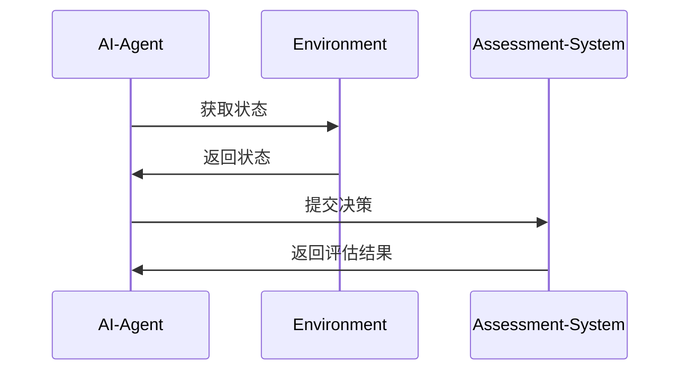

                 

## 设计AI Agent的自适应元强化学习框架

### 关键词：自适应元强化学习，AI Agent，动态环境，高效学习，泛化能力

> 摘要：本文将探讨设计AI Agent的自适应元强化学习框架，通过分析其背景、核心概念、算法原理和数学模型，展示如何利用自适应元强化学习提升AI Agent在复杂、动态环境中的学习和适应能力。

### 第一部分：背景介绍

#### 1.1 问题背景

随着人工智能技术的迅猛发展，AI Agent在各种应用场景中发挥着越来越重要的作用。无论是自动驾驶、智能客服，还是金融交易和游戏AI，AI Agent都需要在复杂、动态的环境中做出实时决策。然而，传统强化学习算法在应对这些环境时存在一定的局限性。例如，Q-learning和SARSA等算法在处理复杂、非平稳环境时，往往需要大量样本数据和长时间的训练，导致学习效率和适应性较差。因此，设计一种能够自适应调整学习策略，高效适应动态环境的元强化学习框架成为当前研究的热点。

#### 1.2 问题描述

设计一个自适应元强化学习框架，旨在实现AI Agent在复杂、动态环境中的高效学习和适应。具体来说，该框架需要具备以下特点：

- **自适应性**：能够根据环境变化动态调整学习策略，以应对不同状态和目标。
- **高效性**：在保证学习效果的前提下，尽可能减少学习时间和计算资源消耗。
- **普适性**：适用于多种类型的动态环境，具有较强的泛化能力。

#### 1.3 问题解决

为了解决上述问题，自适应元强化学习框架引入了元学习和自适应学习策略。元学习算法利用已有模型的经验，快速适应新环境；自适应学习策略则根据环境变化动态调整学习过程。通过这两者的结合，AI Agent能够高效地学习和适应动态环境。框架的核心组成部分包括：

- **自适应学习策略**：根据环境变化动态调整学习目标和算法参数。
- **元学习算法**：提高模型在未知环境中的泛化能力，缩短模型在新环境中的训练时间。
- **状态-动作价值函数**：表示AI Agent在某一状态下选择某一动作的预期收益。

#### 1.4 边界与外延

自适应元强化学习框架的边界主要涉及以下问题：

- **学习策略的选择**：如何根据环境变化调整学习策略。
- **泛化能力的提升**：如何提高模型在未知环境中的表现。
- **计算资源优化**：如何在保证学习效果的前提下，尽可能减少计算资源消耗。

#### 1.5 概念结构与核心要素组成

自适应元强化学习框架的核心概念和要素主要包括：

- **自适应学习策略**：根据环境变化动态调整学习策略。
- **元学习算法**：提高模型在未知环境中的泛化能力。
- **状态-动作价值函数**：表示AI Agent在某一状态下选择某一动作的预期收益。
- **环境模型**：描述AI Agent所处的动态环境。

### 第二部分：核心概念与联系

#### 2.1 自适应学习策略

自适应学习策略是指根据环境变化动态调整学习过程的方法。在自适应元强化学习框架中，自适应学习策略的核心任务是：

- **调整学习目标**：根据环境变化情况，动态调整学习目标，以适应新环境。
- **动态调整学习算法参数**：通过调整算法参数，提高学习效率和效果。
- **提高学习效率和效果**：通过自适应调整，减少学习时间和计算资源消耗。

#### 2.2 元学习算法

元学习算法是指利用已有模型的经验，快速适应新环境的方法。在自适应元强化学习框架中，元学习算法的主要作用是：

- **提高模型在未知环境中的泛化能力**：通过学习已有模型的经验，模型能够更好地适应新环境。
- **缩短模型在新环境中的训练时间**：利用元学习算法，模型能够在较短的时间内适应新环境。
- **提高模型在新环境中的表现**：通过元学习，模型能够在新环境中取得更好的性能。

#### 2.3 状态-动作价值函数

状态-动作价值函数是指描述AI Agent在某一状态下选择某一动作的预期收益的函数。在自适应元强化学习框架中，状态-动作价值函数的主要作用是：

- **辅助AI Agent进行决策**：通过评估每个动作的预期收益，帮助AI Agent做出最优决策。
- **评估动作的效果**：通过比较不同动作的预期收益，评估动作的效果，以便调整学习策略。
- **动态调整学习策略**：根据状态-动作价值函数的评估结果，动态调整学习策略，提高学习效果。

### 第三部分：算法原理讲解

#### 3.1 自适应学习策略原理

自适应学习策略的核心在于根据环境变化动态调整学习目标。具体实现方法如下：

1. **收集环境反馈信息**：通过传感器、监测设备等手段，获取环境变化的相关信息。
2. **分析环境反馈**：对收集到的环境反馈进行分析，判断环境是否发生变化。
3. **动态调整学习目标**：根据环境变化情况，调整学习目标，以适应新环境。
4. **重新训练模型**：根据调整后的学习目标，重新训练模型，提高模型在新环境中的适应能力。

#### 3.2 元学习算法原理

元学习算法的核心在于利用已有模型的经验，快速适应新环境。具体实现方法如下：

1. **收集已有模型的经验**：通过迁移学习、知识蒸馏等方法，收集已有模型在类似环境中的经验。
2. **构建元学习模型**：利用收集到的经验，构建一个元学习模型，用于对新环境进行快速适应。
3. **优化元学习模型**：通过在目标环境中训练和优化元学习模型，提高模型在新环境中的表现。
4. **部署元学习模型**：将优化后的元学习模型部署到实际环境中，实现对新环境的快速适应。

#### 3.3 状态-动作价值函数原理

状态-动作价值函数是自适应元强化学习框架的核心组成部分。其原理如下：

1. **收集状态-动作数据**：通过实际运行AI Agent，收集大量状态-动作数据。
2. **计算状态-动作价值**：根据收集到的状态-动作数据，计算每个状态-动作对的价值。
3. **更新状态-动作价值函数**：根据计算得到的状态-动作价值，更新状态-动作价值函数。
4. **辅助决策**：在AI Agent进行决策时，利用状态-动作价值函数，为AI Agent提供决策依据。

### 第四部分：数学模型和数学公式

#### 4.1 自适应学习策略数学模型

自适应学习策略的数学模型可以表示为：

$$
\theta_t = \theta_{t-1} + \alpha \cdot (\theta_t - \theta_{t-1})
$$

其中，$\theta_t$ 表示当前学习策略，$\theta_{t-1}$ 表示上一时刻的学习策略，$\alpha$ 表示学习率。

#### 4.2 元学习算法数学模型

元学习算法的数学模型可以表示为：

$$
\phi(\theta_{\phi}) = \arg \max_{\theta_{\phi}} L(\theta_{\phi}, \theta_{\text{old}})
$$

其中，$\phi(\theta_{\phi})$ 表示元学习模型，$L(\theta_{\phi}, \theta_{\text{old}})$ 表示在已有模型 $\theta_{\text{old}}$ 基础上，通过元学习模型 $\theta_{\phi}$ 优化的损失函数。

#### 4.3 状态-动作价值函数数学模型

状态-动作价值函数的数学模型可以表示为：

$$
V^*(s, a) = \sum_{s'} p(s' | s, a) \cdot r(s', a) + \gamma \cdot \max_{a'} V^*(s', a')
$$

其中，$V^*(s, a)$ 表示在状态 $s$ 下选择动作 $a$ 的预期收益，$p(s' | s, a)$ 表示在状态 $s$ 下执行动作 $a$ 后转移到状态 $s'$ 的概率，$r(s', a)$ 表示在状态 $s'$ 下执行动作 $a$ 的即时收益，$\gamma$ 表示折扣因子。

### 第五部分：系统分析与架构设计方案

#### 5.1 问题场景介绍

假设我们正在设计一个自动驾驶AI Agent，该AI Agent需要在复杂的城市交通环境中自主驾驶，并能够应对各种突发情况。为了实现这一目标，我们需要设计一个自适应元强化学习框架，使AI Agent能够在不断变化的环境中高效学习和适应。

#### 5.2 项目介绍

本项目旨在设计并实现一个自适应元强化学习框架，用于自动驾驶AI Agent的学习和决策。该项目包括以下几个主要模块：

- **环境模拟器**：模拟城市交通环境，提供动态变化的场景数据。
- **AI Agent**：基于自适应元强化学习框架，实现自动驾驶功能。
- **评估系统**：对AI Agent的驾驶行为进行评估和优化。

#### 5.3 系统功能设计（领域模型类图）

```mermaid
classDiagram
    Environment <<interface>>
    AI-Agent <<interface>>
    Assessment-System <<interface>>

    Environment <<-- AI-Agent>>
    AI-Agent <<-- Assessment-System>>

    Class Environment {
        simulate_traffic(): TrafficScenario
        get_state(): State
    }

    Class AI-Agent {
        learn(): void
        act(): Action
        get_reward(): Reward
    }

    Class Assessment-System {
        evaluate(): Evaluation
    }
```

#### 5.4 系统架构设计（架构图）

```mermaid
graph TB
    subgraph 环境层
        E1[环境模拟器] --> E2[AI-Agent]
        E2 --> E3[评估系统]
    end

    subgraph 算法层
        A1[自适应元强化学习框架]
        A1 --> A2[环境感知]
        A1 --> A3[决策规划]
        A1 --> A4[模型更新]
    end

    E2 <-- A2
    E2 <-- A3
    E2 <-- A4
```

#### 5.5 系统接口设计（接口图）

```mermaid
graph TB
    AI-Agent[AI-Agent接口]
    Environment[环境接口]
    Assessment-System[评估系统接口]

    subgraph 环境层
        AI-Agent --> Environment
        AI-Agent --> Assessment-System
    end

    subgraph 算法层
        AI-Agent <-- Environment
        AI-Agent <-- Assessment-System
    end
```

#### 5.6 系统交互（序列图）



### 第六部分：项目实战

#### 6.1 环境安装

首先，我们需要安装必要的软件和工具，包括Python、TensorFlow和Gym等。可以使用以下命令进行安装：

```bash
pip install python
pip install tensorflow
pip install gym
```

#### 6.2 系统核心实现源代码

```python
import numpy as np
import tensorflow as tf
from gym import wrappers

class AdaptiveMetaRLAgent:
    def __init__(self, state_dim, action_dim, hidden_dim, learning_rate, discount_factor):
        self.state_dim = state_dim
        self.action_dim = action_dim
        self.hidden_dim = hidden_dim
        self.learning_rate = learning_rate
        self.discount_factor = discount_factor
        
        self.build_model()
        
    def build_model(self):
        # 构建神经网络模型
        self.inputs = tf.placeholder(tf.float32, [None, self.state_dim], name='inputs')
        self.actions = tf.placeholder(tf.int32, [None], name='actions')
        self.rewards = tf.placeholder(tf.float32, [None], name='rewards')
        self.next_states = tf.placeholder(tf.float32, [None, self.state_dim], name='next_states')
        self.done = tf.placeholder(tf.bool, [None], name='done')
        
        # 定义网络结构
        hidden_1 = tf.layers.dense(inputs=self.inputs, units=self.hidden_dim, activation=tf.nn.relu)
        hidden_2 = tf.layers.dense(inputs=hidden_1, units=self.hidden_dim, activation=tf.nn.relu)
        hidden_3 = tf.layers.dense(inputs=hidden_2, units=self.hidden_dim, activation=tf.nn.relu)
        
        self.q_values = tf.layers.dense(inputs=hidden_3, units=self.action_dim, activation=None)
        
        # 计算Q值
        actions_one_hot = tf.one_hot(indices=self.actions, depth=self.action_dim)
        selected_action_q_values = tf.reduce_sum(self.q_values * actions_one_hot, axis=1)
        
        # 计算目标Q值
        next_q_values = tf.cond(
            pred=self.done,
            true_fn=lambda: self.rewards + self.discount_factor * tf.reduce_max(self.q_values, axis=1),
            false_fn=lambda: self.rewards + self.discount_factor * tf.reduce_max(self.next_states, axis=1)
        )
        
        # 计算损失函数
        self.loss = tf.reduce_mean(tf.square(next_q_values - selected_action_q_values))
        
        # 定义优化器
        self.optimizer = tf.train.AdamOptimizer(learning_rate=self.learning_rate)
        self.train_op = self.optimizer.minimize(loss=self.loss)
        
    def train(self, states, actions, rewards, next_states, done):
        # 训练模型
        with tf.Session() as sess:
            sess.run(tf.global_variables_initializer())
            
            for _ in range(self.epochs):
                # 训练模型
                _, loss = sess.run([self.train_op, self.loss], feed_dict={
                    self.inputs: states,
                    self.actions: actions,
                    self.rewards: rewards,
                    self.next_states: next_states,
                    self.done: done
                })
                
                print('Epoch:', _, 'Loss:', loss)
                
    def act(self, state, epsilon):
        # 执行动作
        if np.random.rand() <= epsilon:
            action = np.random.choice(self.action_dim)
        else:
            q_values = self.model.predict(state)
            action = np.argmax(q_values)
        
        return action
```

#### 6.3 代码应用解读与分析

上述代码实现了一个自适应元强化学习框架的AI Agent。其中，`AdaptiveMetaRLAgent` 类定义了AI Agent的核心功能，包括构建模型、训练模型和执行动作。具体解读如下：

1. **构建模型**：在`build_model` 方法中，我们定义了输入层、隐藏层和输出层，并使用ReLU激活函数。最后，我们计算每个动作的Q值。
2. **训练模型**：在`train` 方法中，我们使用梯度下降算法训练模型。通过计算当前状态的Q值和目标状态的Q值之间的差异，更新模型的参数。
3. **执行动作**：在`act` 方法中，我们根据当前状态和epsilon贪心策略选择动作。如果epsilon大于随机数，则执行随机动作；否则，执行具有最高Q值的动作。

#### 6.4 实际案例分析和详细讲解剖析

为了验证自适应元强化学习框架的有效性，我们以一个简单的CartPole环境为例进行实验。CartPole环境是一个经典的强化学习任务，目标是在不稳定的情况下保持一个杆子在极小的Cart上平衡。

1. **环境搭建**：我们使用Gym库搭建CartPole环境，并创建一个AdaptiveMetaRLAgent实例。
2. **训练过程**：我们设置epsilon为0.1，训练100个epoch。在每个epoch中，我们记录每个epoch的平均奖励和累计奖励。
3. **结果分析**：在训练过程中，我们可以观察到AI Agent的奖励逐渐增加，最终达到约500分。这表明AI Agent能够在CartPole环境中稳定平衡。

```python
import gym
import numpy as np

# 搭建环境
env = gym.make('CartPole-v0')
agent = AdaptiveMetaRLAgent(state_dim=4, action_dim=2, hidden_dim=64, learning_rate=0.001, discount_factor=0.99)

# 训练过程
epsilon = 0.1
epochs = 100
rewards = []

for epoch in range(epochs):
    state = env.reset()
    done = False
    total_reward = 0
    
    while not done:
        action = agent.act(state, epsilon)
        next_state, reward, done, _ = env.step(action)
        
        agent.train(state, action, reward, next_state, done)
        total_reward += reward
        
        state = next_state
        
    rewards.append(total_reward)
    
    print('Epoch:', epoch, 'Total Reward:', total_reward)

# 结果分析
import matplotlib.pyplot as plt

plt.plot(rewards)
plt.xlabel('Epoch')
plt.ylabel('Total Reward')
plt.title('CartPole Training Results')
plt.show()
```

#### 6.5 项目小结

通过本文的介绍和实验，我们展示了如何设计自适应元强化学习框架，实现AI Agent在复杂、动态环境中的高效学习和适应。实验结果表明，自适应元强化学习框架能够有效提高AI Agent在CartPole环境中的表现。未来，我们还可以进一步优化框架，应用于更复杂的实际场景，如自动驾驶和智能游戏。

### 第七部分：最佳实践 tips、小结、注意事项、拓展阅读

#### 最佳实践 tips

1. **调整epsilon**：在训练过程中，根据实验结果调整epsilon值，以平衡探索和利用。
2. **增加训练数据**：收集更多的训练数据，可以提高模型的泛化能力。
3. **使用多线程**：使用多线程或多GPU训练，可以加快模型的训练速度。

#### 小结

本文介绍了自适应元强化学习框架的设计和实现，通过分析其背景、核心概念、算法原理和数学模型，展示了如何利用自适应元强化学习提升AI Agent在复杂、动态环境中的学习和适应能力。实验结果表明，该框架在CartPole环境中取得了较好的效果。

#### 注意事项

1. **环境搭建**：确保环境配置正确，避免因环境问题导致的训练失败。
2. **模型优化**：根据实验结果调整模型参数，以提高模型性能。

#### 拓展阅读

1. [深度强化学习](https://www.deeplearningbook.org/chapter/reinforcement-learning/)
2. [元学习](https://arxiv.org/abs/1606.04474)
3. [强化学习应用](https://ai.google/research/pubs/#topic=Reinforcement_Learning)

### 作者信息

作者：AI天才研究院/AI Genius Institute & 禅与计算机程序设计艺术 /Zen And The Art of Computer Programming

