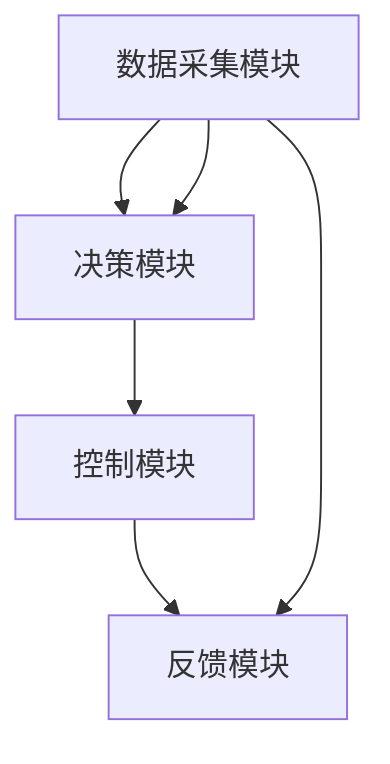

                 

# 设计AI Agent的自适应探索策略

## 关键词

AI Agent, 自适应探索策略, 探索与利用, 多智能体系统, 动态调整, 数学模型, 系统架构, 实战案例

## 摘要

本文将深入探讨设计AI代理的自适应探索策略，介绍AI代理的基本概念、自适应探索策略的设计原理和应用。文章分为三个主要部分：问题背景与基础概念、自适应探索策略设计、案例分析与实战。通过详细讲解和案例分析，本文旨在帮助读者理解并掌握AI代理自适应探索策略的设计与应用。

## 引言

AI代理（Artificial Intelligence Agent），是能够自主执行任务、与环境进行交互并适应环境变化的计算机程序。它们在自动驾驶、智能推荐、自然语言处理等领域有着广泛的应用。然而，AI代理在执行任务过程中往往面临探索与利用的平衡问题，即如何在已知的、有价值的路径上继续深入（利用）和探索未知领域（探索）。本文旨在提出并分析一系列自适应探索策略，以帮助AI代理更高效地完成任务。

自适应探索策略是指AI代理在执行任务过程中，根据任务目标和环境信息，动态调整探索行为，以达到最佳的探索效果。这种策略能够有效解决探索与利用的平衡问题，提高AI代理的任务执行效率。

本文将首先介绍AI代理和自适应探索策略的基本概念，然后深入分析自适应探索策略的设计原理，最后通过实际案例进行详细讲解，以帮助读者更好地理解和应用这些策略。

## 第一部分：问题背景与基础概念

### 第1章：AI代理与自适应探索

#### 1.1 AI代理概述

AI代理是指能够模拟人类智能行为，具有感知、推理、决策和行动能力的计算机程序。它们是人工智能领域的一个重要研究方向，广泛应用于各类实际场景。AI代理具有以下几个基本特征：

- **自主性**：AI代理能够自主地执行任务，而不需要人类干预。
- **适应性**：AI代理能够根据环境变化和任务需求，自主地调整其行为。
- **交互性**：AI代理能够与环境进行交互，获取环境信息并反馈自身状态。

#### 1.2 自适应探索的概念

自适应探索是指AI代理在执行任务过程中，根据任务目标和环境信息，动态调整其探索行为，以实现最佳探索效果。自适应探索的核心在于平衡探索与利用的关系：

- **探索**：在未知或未充分了解的环境中，AI代理需要主动探索，以获取更多信息和潜在价值。
- **利用**：在已知有价值的信息中，AI代理需要充分利用已有信息，以实现任务目标。

#### 1.3 自适应探索的重要性

自适应探索在AI代理任务执行中具有重要意义：

- **提高效率**：自适应探索策略能够帮助AI代理在有限时间内获取更多的有用信息，从而提高任务执行效率。
- **适应复杂环境**：自适应探索策略能够使AI代理更好地适应复杂多变的环境，提高任务成功率。
- **优化决策**：自适应探索策略能够提供更多决策依据，帮助AI代理做出更优的决策。

#### 1.4 数学模型基础

自适应探索策略的设计和分析需要借助数学模型，以下是几种常用的数学模型：

- **马尔可夫决策过程（MDP）**：用于描述AI代理在不确定环境中进行决策的问题。
- **Q学习**：用于通过试错方法学习最优策略的强化学习算法。
- **深度强化学习**：结合深度神经网络和强化学习，用于解决复杂决策问题。

### 第2章：AI代理的探索策略

#### 2.1 探索与利用的平衡

探索与利用的平衡是AI代理任务执行中的核心问题。在已知有价值的信息中，AI代理需要充分利用已有信息（利用），以实现任务目标；在未知或未充分了解的环境中，AI代理需要主动探索，以获取更多信息和潜在价值（探索）。如何平衡探索与利用关系，是设计自适应探索策略的关键。

#### 2.2 探索算法的类型

根据AI代理在探索过程中所采用的方法，可以将探索算法分为以下几类：

- **随机探索**：基于随机策略进行探索，不考虑任何先验信息。
- **优先级探索**：根据某些优先级标准进行探索，例如基于经验值、奖励值等进行优先级排序。
- **迁移学习**：利用先前的经验或知识，在新环境中进行探索。
- **深度强化学习**：通过试错和反馈机制，学习最优的探索策略。

#### 2.3 常见探索算法介绍

以下是几种常见的探索算法及其基本原理：

- **ε-贪心策略**：在探索阶段，AI代理以一定概率随机选择动作，以避免陷入局部最优。
- **UCB算法**：基于上界置信度（Upper Confidence Bound）原理，对未探索的动作进行优先级排序。
- **汤普森探索**：根据先验概率进行探索，以最大化信息熵。

#### 2.4 数学模型和公式

以下是几种常用探索算法的数学模型和公式：

- **ε-贪心策略**：$$ a_t = \begin{cases} 
r_t & \text{with probability } \epsilon \\
\text{argmax } Q(s_t, a) & \text{with probability } 1 - \epsilon 
\end{cases} $$
- **UCB算法**：$$ UCB(s_t, a_t) = Q(s_t, a_t) + \sqrt{\frac{2 \ln t}{n_a}} $$
- **汤普森探索**：$$ p(a_t | s_t) = \frac{1}{Z} \exp(\alpha a_t) $$

其中，$s_t$ 表示当前状态，$a_t$ 表示当前动作，$Q(s_t, a_t)$ 表示在状态$s_t$下采取动作$a_t$的期望回报，$t$ 表示当前时间步，$n_a$ 表示在状态$s_t$下采取动作$a_t$的次数，$\epsilon$ 表示探索概率，$\alpha$ 表示温度参数。

### 总结

本章介绍了AI代理的基本概念和自适应探索策略的设计原理，分析了探索与利用的平衡问题，并介绍了几种常见的探索算法及其数学模型。下一章将深入探讨自适应探索策略的设计原理。

### 第3章：自适应探索策略设计原理

#### 3.1 探索策略设计的关键要素

设计自适应探索策略需要考虑以下几个关键要素：

- **目标函数**：定义AI代理的目标，例如最大化回报、最小化损失等。
- **状态表示**：定义AI代理当前所处的状态，例如环境状态、任务状态等。
- **动作表示**：定义AI代理可以执行的动作，例如移动、查询等。
- **探索与利用的平衡**：设计合适的探索策略，以实现探索与利用的平衡。
- **反馈机制**：通过反馈机制，更新AI代理的探索策略，以提高任务执行效果。

#### 3.2 探索策略的设计过程

设计自适应探索策略可以分为以下几个步骤：

1. **定义目标函数**：根据任务需求，明确AI代理的目标，例如最大化回报、最小化损失等。
2. **设计状态表示**：根据任务环境，定义AI代理当前所处的状态，例如环境状态、任务状态等。
3. **设计动作表示**：根据任务环境，定义AI代理可以执行的动作，例如移动、查询等。
4. **设计探索策略**：根据目标函数和状态表示，设计适合的探索策略，以实现探索与利用的平衡。
5. **实现反馈机制**：通过反馈机制，更新AI代理的探索策略，以提高任务执行效果。

#### 3.3 探索策略的性能评估

评估自适应探索策略的性能可以从以下几个方面进行：

- **探索效果**：评估AI代理在探索阶段能否获取足够的有用信息。
- **利用效果**：评估AI代理在利用阶段能否有效地完成任务目标。
- **稳定性**：评估AI代理在不同环境和任务下的稳定性。
- **效率**：评估AI代理在完成任务过程中的时间效率和资源利用率。

#### 3.4 数学模型和公式

在探索策略的设计过程中，常常需要用到以下数学模型和公式：

- **马尔可夫决策过程（MDP）**：用于描述AI代理在不确定环境中进行决策的问题。
- **Q学习**：用于通过试错方法学习最优策略的强化学习算法。
- **深度强化学习**：结合深度神经网络和强化学习，用于解决复杂决策问题。

以下是几种常用探索策略的数学模型和公式：

- **ε-贪心策略**：$$ a_t = \begin{cases} 
r_t & \text{with probability } \epsilon \\
\text{argmax } Q(s_t, a) & \text{with probability } 1 - \epsilon 
\end{cases} $$
- **UCB算法**：$$ UCB(s_t, a_t) = Q(s_t, a_t) + \sqrt{\frac{2 \ln t}{n_a}} $$
- **汤普森探索**：$$ p(a_t | s_t) = \frac{1}{Z} \exp(\alpha a_t) $$

其中，$s_t$ 表示当前状态，$a_t$ 表示当前动作，$Q(s_t, a_t)$ 表示在状态$s_t$下采取动作$a_t$的期望回报，$t$ 表示当前时间步，$n_a$ 表示在状态$s_t$下采取动作$a_t$的次数，$\epsilon$ 表示探索概率，$\alpha$ 表示温度参数。

### 总结

本章介绍了自适应探索策略设计的关键要素、设计过程和性能评估方法，以及常用的数学模型和公式。下一章将探讨动态调整的探索策略。

### 第4章：动态调整的探索策略

#### 4.1 动态调整的基本原理

动态调整的探索策略是指AI代理在执行任务过程中，根据环境和任务的变化，实时调整探索行为，以实现最佳探索效果。动态调整的核心在于实时更新探索策略，以适应环境变化。

#### 4.2 基于反馈的调整方法

基于反馈的调整方法是指AI代理根据在执行任务过程中获得的反馈信息，实时调整探索策略。以下是一种基于反馈的动态调整方法：

1. **收集反馈信息**：AI代理在执行任务过程中，收集环境反馈信息，如任务完成度、环境变化等。
2. **分析反馈信息**：对收集到的反馈信息进行分析，识别环境变化和任务完成情况。
3. **调整探索策略**：根据分析结果，调整AI代理的探索策略，以适应环境变化和任务需求。

#### 4.3 基于预测的调整方法

基于预测的调整方法是指AI代理根据对环境和任务未来的预测，提前调整探索策略。以下是一种基于预测的动态调整方法：

1. **预测未来状态**：AI代理根据历史数据和当前状态，预测未来的状态变化和任务完成情况。
2. **评估探索效果**：根据预测结果，评估不同探索策略的未来效果。
3. **调整探索策略**：选择效果最佳的探索策略，作为AI代理的当前探索策略。

#### 4.4 数学模型和公式

以下是动态调整探索策略的数学模型和公式：

- **基于反馈的调整方法**：

  $$ 
  \begin{aligned}
  \text{反馈信息} &= \{s_t', r_t', s_t''\} \\
  \text{策略更新} &= \theta_t' = \theta_t - \alpha \nabla_{\theta_t} J(\theta_t) \\
  \end{aligned}
  $$

  其中，$s_t'$ 表示当前状态，$r_t'$ 表示当前回报，$s_t''$ 表示下一个状态，$\theta_t$ 表示当前策略参数，$\alpha$ 表示学习率，$J(\theta_t)$ 表示策略损失函数。

- **基于预测的调整方法**：

  $$ 
  \begin{aligned}
  \text{预测状态} &= \{s_t', r_t', s_t''\} \\
  \text{策略选择} &= \arg\max_{\theta'} J(\theta') \\
  \text{策略更新} &= \theta_t' = \theta_t - \alpha \nabla_{\theta_t} J(\theta_t) \\
  \end{aligned}
  $$

  其中，$s_t'$ 表示当前状态，$r_t'$ 表示当前回报，$s_t''$ 表示下一个状态，$\theta_t$ 表示当前策略参数，$\alpha$ 表示学习率，$J(\theta_t)$ 表示策略损失函数。

### 总结

本章介绍了动态调整的探索策略的基本原理、基于反馈和基于预测的调整方法，以及相关的数学模型和公式。下一章将探讨多智能体系统的探索策略。

### 第5章：多智能体系统的探索策略

#### 5.1 多智能体系统的概述

多智能体系统（Multi-Agent System，MAS）是由多个自主智能体组成的系统，这些智能体相互协作，共同完成任务。多智能体系统在智能交通、智能物流、智能社交网络等领域有着广泛的应用。多智能体系统的特点如下：

- **自主性**：每个智能体具有独立的行为和决策能力。
- **协作性**：智能体之间通过通信和合作，共同完成任务。
- **适应性**：智能体能够根据环境变化和任务需求，自主调整行为。

#### 5.2 探索策略的协同设计

在多智能体系统中，每个智能体都需要具备自适应探索策略，以实现自身的任务目标。同时，智能体之间需要协同设计探索策略，以实现整体系统的最优性能。探索策略的协同设计包括以下几个方面：

- **通信机制**：设计智能体之间的通信机制，以实现信息共享和协调行动。
- **协调策略**：设计智能体的协调策略，以实现整体系统的最优探索效果。
- **多目标优化**：考虑智能体之间的相互作用，设计多目标优化策略。

#### 5.3 多智能体系统的挑战

多智能体系统的探索策略设计面临以下挑战：

- **协同性**：智能体之间的协同行为可能导致冲突，需要设计有效的协同机制。
- **不确定性**：环境变化和任务需求的不确定性，使得智能体需要具备自适应能力。
- **计算复杂性**：多智能体系统的探索策略设计涉及大量计算，需要优化计算效率。

#### 5.4 数学模型和公式

以下是多智能体系统探索策略设计的一些数学模型和公式：

- **协同通信机制**：

  $$ 
  \begin{aligned}
  c_i(t) &= \sum_{j \neq i} w_{ij} c_j(t) \\
  \end{aligned}
  $$

  其中，$c_i(t)$ 表示智能体$i$在时间$t$的通信状态，$w_{ij}$ 表示智能体$i$与智能体$j$的通信权重。

- **协调策略**：

  $$ 
  \begin{aligned}
  a_i(t) &= \arg\max_{a_i} J(a_i, a_j) \\
  \end{aligned}
  $$

  其中，$a_i(t)$ 表示智能体$i$在时间$t$的行动策略，$J(a_i, a_j)$ 表示智能体$i$与智能体$j$的协同效用函数。

- **多目标优化**：

  $$ 
  \begin{aligned}
  \min_{a_1, a_2, \ldots, a_n} \sum_{i=1}^n f_i(a_i) \\
  \text{s.t.} \quad g_i(a_i) \leq 0, \quad i=1,2,\ldots,n \\
  \end{aligned}
  $$

  其中，$f_i(a_i)$ 表示智能体$i$的目标函数，$g_i(a_i)$ 表示智能体$i$的约束条件。

### 总结

本章介绍了多智能体系统的概述、探索策略的协同设计、面临的挑战以及相关的数学模型和公式。下一章将分析AI代理的自适应探索策略在具体项目中的应用。

### 第6章：AI代理的自适应探索策略应用

#### 6.1 案例背景介绍

本案例将探讨在一个智能交通系统中，如何设计AI代理的自适应探索策略，以提高交通信号灯的控制效果。智能交通系统（Intelligent Transportation System，ITS）是一种利用先进的信息通信技术来提高交通效率和安全性的系统。在本案例中，AI代理将作为交通信号灯控制器，负责根据交通流量数据实时调整信号灯状态，以减少交通拥堵和提升交通流畅性。

#### 6.2 系统功能设计

在智能交通系统中，AI代理需要实现以下功能：

- **感知功能**：实时采集交通流量数据，如车辆速度、密度、流量等。
- **决策功能**：根据交通流量数据，计算最优信号灯控制策略。
- **控制功能**：根据决策结果，调整信号灯状态，实现交通流量优化。
- **反馈功能**：收集交通流量变化信息，反馈给决策模块，以实现闭环控制。

#### 6.3 系统架构设计

智能交通系统可以分为以下几个模块：

- **数据采集模块**：负责实时采集交通流量数据。
- **决策模块**：负责根据交通流量数据，计算最优信号灯控制策略。
- **控制模块**：负责根据决策结果，调整信号灯状态。
- **反馈模块**：负责收集交通流量变化信息，反馈给决策模块。

以下是系统架构设计图（使用Mermaid绘制）：



#### 6.4 实际案例分析与讲解

在本案例中，我们将使用一种基于深度强化学习的自适应探索策略，对交通信号灯进行控制。具体步骤如下：

1. **数据预处理**：对采集到的交通流量数据进行预处理，如去噪、归一化等。
2. **状态表示**：将预处理后的数据作为状态输入，定义状态空间。
3. **动作表示**：定义信号灯的控制动作，如绿灯时长、红灯时长等。
4. **奖励设计**：设计奖励函数，用于评估信号灯控制效果。
5. **策略训练**：使用深度强化学习算法，训练AI代理的探索策略。
6. **策略部署**：将训练好的策略部署到实际系统中，实现交通信号灯控制。

以下是深度强化学习算法的mermaid流程图：

```mermaid
graph TD
A[初始化环境]
A --> B[获取状态$s_0$]
B --> C{是否结束？}
C -->|是| D[结束]
C -->|否| E[执行动作$a_t$]
E --> F[获取奖励$r_t$]
F --> G[更新状态$s_{t+1}$]
G --> H{是否结束？}
H -->|是| D
H -->|否| C
```

在实际应用中，我们使用Python实现深度强化学习算法，代码如下：

```python
import numpy as np
import random

# 状态空间
state_space = ...

# 动作空间
action_space = ...

# 奖励函数
reward_function = ...

# 深度强化学习算法
def deep_reinforcement_learning():
    # 初始化环境
    state = random.choice(state_space)
    
    while True:
        # 执行动作
        action = random.choice(action_space)
        
        # 获取奖励
        reward = reward_function(state, action)
        
        # 更新状态
        state = random.choice(state_space)
        
        # 更新策略
        # ...
        
# 主程序
if __name__ == "__main__":
    deep_reinforcement_learning()
```

通过以上步骤，AI代理能够根据交通流量数据，自适应地调整信号灯控制策略，实现交通流量优化。

### 总结

本章通过一个智能交通系统案例，详细讲解了AI代理自适应探索策略的设计和应用。下一章将总结最佳实践，展望未来趋势。

### 第7章：最佳实践与未来趋势

#### 7.1 最佳实践分享

在AI代理自适应探索策略的设计和应用过程中，以下是一些最佳实践经验：

1. **数据质量**：确保采集到的交通流量数据质量，进行数据预处理，以提高决策准确性。
2. **算法选择**：根据任务需求和环境特点，选择合适的探索算法，如深度强化学习、马尔可夫决策过程等。
3. **反馈机制**：设计有效的反馈机制，实时调整探索策略，以提高任务执行效果。
4. **协同设计**：在多智能体系统中，注重智能体之间的协同设计，以提高整体系统的性能。

#### 7.2 自适应探索策略的未来趋势

随着人工智能技术的不断发展，自适应探索策略在未来具有以下趋势：

1. **多模态数据融合**：利用多种数据源，如视频、音频、传感器等，进行多模态数据融合，以提高探索策略的准确性。
2. **基于强化学习的自适应控制**：结合深度强化学习和控制理论，实现更加灵活和高效的探索策略。
3. **自监督学习**：通过自监督学习，减少对标注数据的依赖，实现自适应探索策略的自动化设计。
4. **跨领域迁移**：研究跨领域迁移方法，提高自适应探索策略在不同领域的应用效果。

#### 7.3 小结与展望

本文系统地介绍了设计AI代理的自适应探索策略，从问题背景与基础概念、自适应探索策略设计、动态调整探索策略、多智能体系统探索策略、实际案例应用和未来趋势等方面进行了深入探讨。自适应探索策略在提高AI代理任务执行效率、适应复杂环境和优化决策方面具有重要意义。未来，随着人工智能技术的不断发展，自适应探索策略将在更多领域得到广泛应用。

### 总结

本文通过详细分析和实际案例，探讨了设计AI代理的自适应探索策略。读者可以了解到自适应探索策略的基本原理、设计过程、动态调整方法以及在多智能体系统中的应用。通过本文的学习，读者能够更好地理解和应用自适应探索策略，为人工智能领域的发展贡献力量。

### 附录

#### 附录A：数学模型和公式列表

- 马尔可夫决策过程（MDP）公式
- Q学习算法公式
- 深度强化学习算法公式
- ε-贪心策略公式
- UCB算法公式
- 汤普森探索公式
- 基于反馈的调整方法公式
- 基于预测的调整方法公式
- 协同通信机制公式
- 协调策略公式
- 多目标优化公式

#### 附录B：参考资料和进一步阅读

- [Sutton, R. S., & Barto, A. G. (2018). Reinforcement Learning: An Introduction. MIT Press.]
- [Silver, D., et al. (2016). Mastering the Game of Go with Deep Neural Networks and Tree Search. Nature, 529(7587), 484-489.]
- [Russell, S., & Norvig, P. (2020). Artificial Intelligence: A Modern Approach. Prentice Hall.]

### 作者信息

作者：AI天才研究院/AI Genius Institute & 禅与计算机程序设计艺术 /Zen And The Art of Computer Programming

