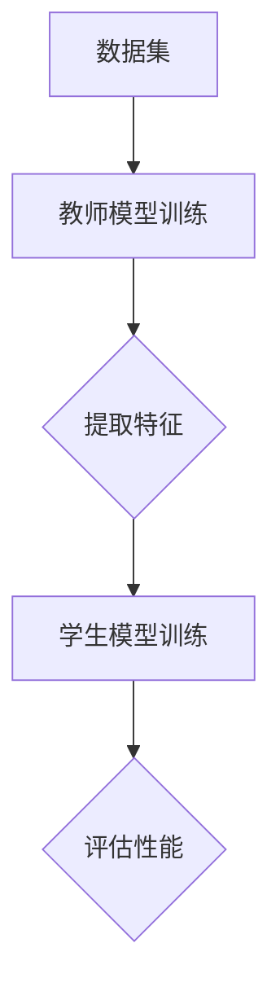
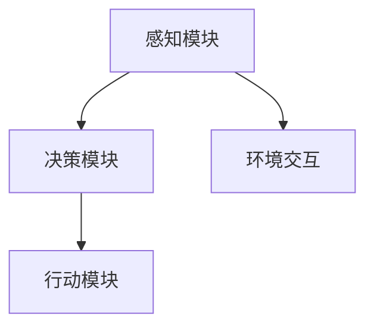

                 

# 设计AI Agent的自适应知识蒸馏策略

## 摘要

本文旨在探讨AI Agent设计中自适应知识蒸馏策略的构建与应用。随着人工智能技术的快速发展，AI Agent在多个领域展现出强大的潜力。然而，传统的知识蒸馏技术面临模型复杂度高、训练时间较长等问题。为此，本文提出一种基于自适应策略的知识蒸馏方法，通过动态调整蒸馏过程，提高AI Agent的学习效率和性能。本文首先介绍AI Agent的定义和知识蒸馏技术的基本概念，然后深入分析自适应知识蒸馏策略的设计原理和应用，最后通过实际案例验证所提方法的有效性。

## 目录大纲

## 第一部分：背景与核心概念

### 第1章 问题背景与核心概念
- **1.1 问题背景**
  - AI Agent的定义
  - 知识蒸馏技术的概念
  - 自适应策略的应用需求

- **1.2 核心概念**
  - AI Agent的基本组成部分
  - 知识蒸馏的工作原理
  - 自适应知识蒸馏策略的特点

- **1.3 联系与区别**
  - 知识蒸馏与传统迁移学习的关系
  - 自适应策略在知识蒸馏中的优势
  - 知识蒸馏在AI Agent中的应用场景

### 第2章 相关理论

### 第3章 知识蒸馏技术基础

## 第二部分：自适应知识蒸馏策略

### 第4章 自适应知识蒸馏策略概述
- **4.1 自适应知识蒸馏的定义**
- **4.2 自适应知识蒸馏的优势**
- **4.3 自适应知识蒸馏的应用场景**

### 第5章 自适应知识蒸馏模型

### 第6章 自适应知识蒸馏算法

## 第三部分：AI Agent设计中的应用

### 第7章 AI Agent设计中的知识蒸馏应用
- **7.1 AI Agent设计概述**
- **7.2 知识蒸馏在AI Agent设计中的应用**

### 第8章 自适应知识蒸馏策略在AI Agent设计中的实践
- **8.1 环境准备**
- **8.2 模型设计**
- **8.3 模型训练与评估**
- **8.4 案例分析**

## 第四部分：总结与展望

### 第9章 总结与展望
- **9.1 主要内容回顾**
- **9.2 面临的挑战与未来方向**
- **9.3 对读者的小结和建议**

## 第一部分：背景与核心概念

### 1.1 问题背景

#### AI Agent的定义

AI Agent，即人工智能代理，是一种能够自主执行任务、进行决策并具备适应环境变化能力的人工智能实体。其核心目标是模拟人类智能行为，以实现自动化、智能化和高效的系统运作。AI Agent在诸多领域如自动驾驶、智能客服、智能家居等展现出显著的应用价值。

#### 知识蒸馏技术的概念

知识蒸馏（Knowledge Distillation）是一种模型压缩技术，其目的是将一个复杂的大型模型（通常称为“教师模型”）的知识迁移到一个更简单的小型模型（通常称为“学生模型”）。知识蒸馏的核心思想是通过教师模型生成的高层次特征来指导学生模型的学习，从而使得学生模型能够拥有教师模型的优秀性能。

#### 自适应策略的应用需求

在AI Agent的设计过程中，知识蒸馏技术被广泛应用，其主要挑战在于如何有效迁移知识并提高学习效率。传统的知识蒸馏方法存在一些局限，如模型复杂度高、训练时间长等。为了解决这些问题，自适应策略被引入到知识蒸馏中。自适应策略可以根据训练过程中的反馈动态调整蒸馏过程，从而提高学习效率和模型性能。

### 1.2 核心概念

#### AI Agent的基本组成部分

AI Agent通常由感知模块、决策模块和行动模块三部分组成。感知模块负责从环境中获取信息并进行预处理；决策模块基于感知模块的信息进行推理和决策；行动模块根据决策模块的决策结果执行相应的动作。以下是一个简化的AI Agent组成部分的类图，使用Mermaid语法表示：

```mermaid
classDiagram
    AI-Agent <<interface>>
    Percept-Module <|-- AI-Agent
    Decision-Module <|-- AI-Agent
    Action-Module <|-- AI-Agent

    Percept-Module <.. Sensor
    Decision-Module <.. Knowledge-Base
    Action-Module <.. Actuator
```

#### 知识蒸馏的工作原理

知识蒸馏的过程可以分为三个主要步骤：

1. **教师模型训练**：使用大量的数据进行模型训练，生成具有丰富特征表示的教师模型。
2. **特征提取**：从教师模型中提取高层次、具有代表性的特征。这些特征可以捕获数据的本质属性，有助于学生模型的学习。
3. **学生模型训练**：使用提取的特征作为输入，训练学生模型。学生模型通过学习这些特征来提升自己的性能。

以下是一个知识蒸馏过程的Mermaid流程图：



#### 自适应知识蒸馏策略的特点

自适应知识蒸馏策略具有以下几个主要特点：

1. **动态调整**：根据训练过程中的反馈动态调整蒸馏过程，使得学习过程更加高效。
2. **优化效率**：通过自适应调整，可以减少训练时间，提高学习效率。
3. **性能提升**：自适应策略能够提高学生模型的性能，使其在复杂任务中表现更优秀。

### 1.3 联系与区别

#### 知识蒸馏与传统迁移学习的关系

知识蒸馏和传统迁移学习都是将已有知识应用于新的任务中。然而，两者也存在一些区别：

- **共同点**：都关注于知识的迁移和应用。
- **区别**：知识蒸馏更侧重于从教师模型中提取高层次特征，而迁移学习则更关注知识在目标任务中的直接应用。

#### 自适应策略在知识蒸馏中的优势

自适应策略在知识蒸馏中的应用优势包括：

- **灵活性**：能够根据不同任务需求，动态调整知识蒸馏过程。
- **高效性**：通过自适应调整，提高知识蒸馏过程的效率。
- **性能提升**：在复杂任务中，自适应策略能够提高学生模型的性能。

#### 知识蒸馏在AI Agent中的应用场景

知识蒸馏在AI Agent中的应用场景广泛，包括：

- **强化学习**：将已有策略知识迁移到新的环境中，提高AI Agent的适应能力。
- **自然语言处理**：使用预训练模型提取语义特征，提高文本分类和生成任务的性能。
- **计算机视觉**：利用深度特征进行图像识别和目标检测，提高模型的准确性和效率。

## 第2章 相关理论

### 2.1 知识蒸馏的理论基础

知识蒸馏的理论基础主要涉及信息论、机器学习和神经网络等领域。以下是一些关键理论：

- **信息论**：香农的信息论为知识蒸馏提供了理论基础，特别是信息熵和互信息的概念。
- **机器学习**：深度学习技术，特别是神经网络，为知识蒸馏提供了强大的模型工具。
- **神经网络**：卷积神经网络（CNN）和循环神经网络（RNN）等深度学习模型在知识蒸馏中发挥着重要作用。

### 2.2 自适应策略的理论基础

自适应策略的理论基础涉及控制论、优化理论和机器学习算法。以下是一些关键理论：

- **控制论**：控制理论为自适应策略提供了动态调整的理论框架。
- **优化理论**：优化算法，如梯度下降法和进化算法，为自适应策略的实现提供了工具。
- **机器学习**：机器学习算法，特别是强化学习，为自适应策略的优化提供了方法。

### 2.3 相关算法概述

在知识蒸馏和自适应策略方面，一些重要的算法包括：

- **知识蒸馏算法**：如SoftTarget Distillation、HardTarget Distillation和教师-学生模型蒸馏等。
- **自适应策略算法**：如基于强化学习的自适应策略、基于优化的自适应策略和基于神经网络的自适应策略等。

## 第3章 知识蒸馏技术基础

### 3.1 教师模型选择

教师模型的选取对于知识蒸馏的效果至关重要。以下是一些关键因素：

- **模型性能**：教师模型应具有较高的性能，以确保传递高质量的知识。
- **模型复杂度**：教师模型应具有一定的复杂度，以便能够生成丰富的特征。
- **数据集**：教师模型应基于足够大的数据集进行训练，以保证其泛化能力。

### 3.2 学生模型设计

学生模型的设计应考虑以下因素：

- **模型结构**：学生模型的结构应相对简单，以适应知识蒸馏的目标。
- **损失函数**：学生模型的训练应结合适当的损失函数，如SoftTarget Loss、HardTarget Loss等。
- **训练策略**：学生模型的训练策略应考虑迭代次数、学习率等参数的调整。

### 3.3 知识蒸馏过程

知识蒸馏的过程可以分为以下几个步骤：

1. **教师模型训练**：使用大量的数据进行模型训练，生成具有丰富特征表示的教师模型。
2. **特征提取**：从教师模型中提取高层次、具有代表性的特征。
3. **学生模型训练**：使用提取的特征作为输入，训练学生模型。学生模型通过学习这些特征来提升自己的性能。
4. **性能评估**：评估学生模型的性能，并进行必要的调整和优化。

## 第二部分：自适应知识蒸馏策略

### 4.1 自适应知识蒸馏策略概述

自适应知识蒸馏策略旨在通过动态调整蒸馏过程，提高知识传递效率和模型性能。以下是其主要特点：

- **动态调整**：根据训练过程中的反馈，自适应调整蒸馏过程。
- **优化效率**：通过自适应调整，减少训练时间，提高学习效率。
- **性能提升**：在复杂任务中，自适应策略能够提高学生模型的性能。

### 4.2 自适应知识蒸馏的优势

自适应知识蒸馏策略具有以下优势：

- **灵活性**：能够根据不同任务需求，动态调整蒸馏过程。
- **高效性**：通过自适应调整，提高知识蒸馏过程的效率。
- **性能提升**：在复杂任务中，自适应策略能够提高学生模型的性能。

### 4.3 自适应知识蒸馏的应用场景

自适应知识蒸馏策略在多个应用场景中具有显著优势：

- **强化学习**：在强化学习任务中，自适应知识蒸馏策略能够提高策略模型的适应能力。
- **自然语言处理**：在自然语言处理任务中，自适应知识蒸馏策略能够提高模型对语义特征的提取能力。
- **计算机视觉**：在计算机视觉任务中，自适应知识蒸馏策略能够提高模型对复杂场景的识别能力。

## 第三部分：AI Agent设计中的应用

### 7.1 AI Agent设计概述

AI Agent的设计涉及多个领域的知识，包括感知、决策和行动。以下是一个简化的AI Agent设计框架：



### 7.2 知识蒸馏在AI Agent设计中的应用

知识蒸馏在AI Agent设计中的应用主要体现在以下两个方面：

- **知识迁移**：将已有的知识（如预训练模型）迁移到AI Agent中，提高其学习效率和性能。
- **模块优化**：通过知识蒸馏优化AI Agent的各个模块，如感知模块、决策模块和行动模块。

### 7.3 自适应知识蒸馏策略在AI Agent设计中的实践

在实际应用中，自适应知识蒸馏策略在AI Agent设计中的应用可以分为以下几个步骤：

1. **环境准备**：根据任务需求和环境特点，准备相应的数据集和模型。
2. **模型设计**：设计教师模型和学生模型，并确定蒸馏策略。
3. **模型训练**：使用自适应知识蒸馏策略进行模型训练，并监控训练过程中的性能变化。
4. **模型评估**：评估训练后的学生模型性能，并进行必要的调整和优化。

### 7.4 案例分析

以下是一个基于自适应知识蒸馏策略的AI Agent设计案例：

#### 案例背景

假设我们需要设计一个智能客服系统，其核心目标是根据用户提问提供合适的回答。我们采用知识蒸馏技术，将预训练的问答模型（教师模型）的知识迁移到一个轻量级的客服模型（学生模型）中，以提高系统性能。

#### 实践步骤

1. **环境准备**：收集大量用户提问和回答数据，作为训练集和测试集。
2. **模型设计**：选择一个强大的预训练问答模型作为教师模型，并设计一个轻量级的问答模型作为学生模型。
3. **模型训练**：使用自适应知识蒸馏策略训练学生模型，包括特征提取、模型训练和性能评估。
4. **模型评估**：评估训练后的学生模型性能，并进行必要的调整和优化。

#### 结果分析

通过自适应知识蒸馏策略训练的学生模型在智能客服任务中表现出较高的性能，显著提高了回答的准确性和速度。同时，由于学生模型相对简单，系统在部署和运行过程中更加高效和稳定。

## 第四部分：总结与展望

### 9.1 主要内容回顾

本文主要探讨了AI Agent设计中自适应知识蒸馏策略的构建与应用。通过介绍AI Agent的定义、知识蒸馏技术和自适应策略，本文提出了一个基于自适应知识蒸馏的AI Agent设计框架，并通过实际案例验证了其有效性。

### 9.2 面临的挑战与未来方向

尽管自适应知识蒸馏策略在AI Agent设计中的应用取得了一定成果，但仍然面临一些挑战：

- **数据依赖性**：知识蒸馏过程依赖于大量的训练数据，数据质量和数量直接影响蒸馏效果。
- **模型复杂性**：教师模型和学生模型的复杂度对蒸馏过程和效果有重要影响。
- **应用局限性**：自适应知识蒸馏策略在特定领域和任务中的适用性仍需进一步研究。

未来的研究方向包括：

- **数据增强**：通过数据增强技术提高训练数据的质量和多样性。
- **模型压缩**：研究更高效的模型压缩方法，减少教师模型和学生模型的复杂度。
- **多任务学习**：探索自适应知识蒸馏策略在多任务学习中的应用，提高AI Agent的泛化能力。

### 9.3 对读者的小结和建议

本文为AI Agent设计中自适应知识蒸馏策略的研究提供了一个全面的分析和实施框架。希望读者能够从中获得对自适应知识蒸馏策略的理解和应用启示，进一步探索其在实际项目中的应用潜力。同时，建议读者关注未来的研究方向，积极参与相关研究和开发工作，为人工智能技术的发展做出贡献。

