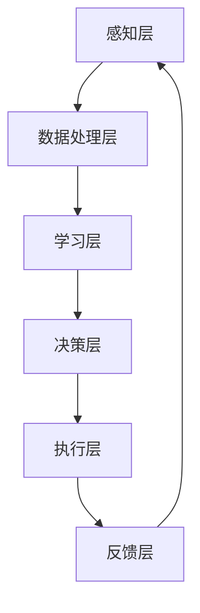
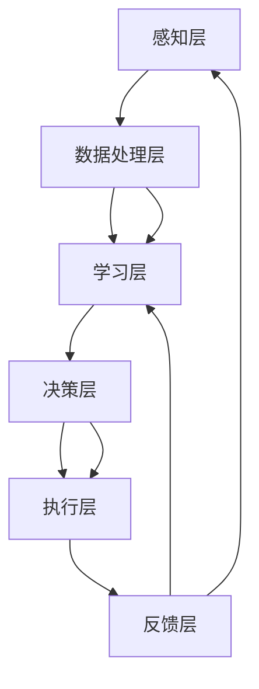

                 

# 设计AI Agent的自适应终身学习策略

## 摘要

随着人工智能（AI）技术的快速发展，AI Agent作为智能体在各个领域的应用越来越广泛。然而，面对不断变化的环境和数据，传统的学习算法逐渐暴露出不足之处，难以满足AI Agent在复杂动态环境中的自主学习和适应能力。本文旨在探讨设计AI Agent的自适应终身学习策略，通过系统化的方法分析其核心概念、算法原理、数学模型、系统设计与实现，以及项目实战和最佳实践，旨在为AI Agent的长期有效学习提供理论指导和实践参考。

本文分为以下七个部分：

1. **背景介绍**：介绍AI Agent和自适应终身学习的重要性，以及本文的研究背景。
2. **核心概念与联系**：详细阐述AI Agent和自适应终身学习的基本概念及其相互关系。
3. **算法原理讲解**：分析经典的自适应学习算法，介绍自适应终身学习算法的基本原理。
4. **数学模型与公式讲解**：阐述自适应终身学习算法的数学模型，并使用Python代码进行解释。
5. **系统设计与实现**：介绍自适应终身学习系统的架构设计、功能设计、接口设计和交互设计。
6. **项目实战与案例分析**：通过实际项目案例，展示自适应终身学习策略的应用和效果。
7. **最佳实践与总结**：总结最佳实践经验，提出注意事项和拓展阅读建议。

让我们一步一步深入探讨设计AI Agent的自适应终身学习策略。

## 目录

### 目录

- [摘要](#摘要)
- [目录](#目录)
- [1. 背景介绍](#1-背景介绍)
  - [1.1 人工智能的发展现状与挑战](#11-人工智能的发展现状与挑战)
  - [1.2 自适应终身学习的必要性](#12-自适应终身学习的必要性)
  - [1.3 AI Agent与自适应终身学习的关系](#13-ai-agent与自适应终身学习的关系)
- [2. 核心概念与联系](#2-核心概念与联系)
  - [2.1 AI Agent的定义与分类](#21-ai-agent的定义与分类)
  - [2.2 自适应终身学习的概念与原理](#22-自适应终身学习的概念与原理)
  - [2.3 AI Agent与自适应终身学习的联系](#23-ai-agent与自适应终身学习的联系)
- [3. 算法原理讲解](#3-算法原理讲解)
  - [3.1 自适应终身学习算法概述](#31-自适应终身学习算法概述)
  - [3.2 经典自适应学习算法介绍](#32-经典自适应学习算法介绍)
  - [3.3 自适应终身学习算法的演进](#33-自适应终身学习算法的演进)
- [4. 数学模型与公式讲解](#4-数学模型与公式讲解)
  - [4.1 自适应学习算法的数学模型](#41-自适应学习算法的数学模型)
  - [4.2 数学公式与推导](#42-数学公式与推导)
  - [4.3 自适应学习算法的优化方法](#43-自适应学习算法的优化方法)
- [5. 系统设计与实现](#5-系统设计与实现)
  - [5.1 自适应终身学习系统的架构设计](#51-自适应终身学习系统的架构设计)
  - [5.2 系统功能设计与实现](#52-系统功能设计与实现)
  - [5.3 系统接口设计与交互](#53-系统接口设计与交互)
- [6. 项目实战与案例分析](#6-项目实战与案例分析)
  - [6.1 实际应用场景介绍](#61-实际应用场景介绍)
  - [6.2 AI Agent自适应终身学习策略实现](#62-ai-agent自适应终身学习策略实现)
  - [6.3 案例分析](#63-案例分析)
- [7. 最佳实践与总结](#7-最佳实践与总结)
  - [7.1 最佳实践分享](#71-最佳实践分享)
  - [7.2 注意事项](#72-注意事项)
  - [7.3 拓展阅读](#73-拓展阅读)

## 1. 背景介绍

### 1.1 人工智能的发展现状与挑战

人工智能（AI）作为计算机科学的一个重要分支，近年来取得了显著的进展。从最初的专家系统到现代的深度学习、自然语言处理和计算机视觉，AI技术已经深刻地改变了我们的生活和工作方式。然而，随着AI应用的不断扩展，我们也面临着诸多挑战。

首先，传统的人工智能算法在处理静态数据时表现出色，但在动态环境中却显得力不从心。例如，自动驾驶车辆需要实时处理不断变化的道路状况，而传统的机器学习算法难以适应这种动态变化。

其次，现有的AI系统往往依赖于大量的标注数据，这在实际应用中往往难以实现。特别是在医疗、法律等敏感领域，数据获取和处理的难度更大。因此，如何让AI Agent能够自主地学习和适应新环境，成为了一个亟待解决的问题。

此外，随着AI技术的商业化应用，数据隐私和安全问题也日益突出。如何确保AI Agent在学习和应用过程中的数据安全，避免隐私泄露，是当前AI研究的一个重要方向。

### 1.2 自适应终身学习的必要性

自适应终身学习是解决上述问题的一种有效方法。它指的是AI Agent能够在其整个生命周期内，不断地从新数据和经验中学习，适应环境的变化。这种能力对于AI Agent在动态环境中的自主决策和适应性至关重要。

首先，自适应终身学习能够提高AI Agent在动态环境中的表现。通过不断地学习新数据和经验，AI Agent可以不断优化其决策模型，提高应对环境变化的能力。

其次，自适应终身学习能够减少对大量标注数据的依赖。AI Agent可以通过自主学习和探索，发现并利用新的数据源，从而降低数据获取和处理的成本。

最后，自适应终身学习有助于保障AI Agent的数据安全。通过本地化学习和数据处理，AI Agent可以减少对中心化数据存储的依赖，降低数据泄露的风险。

### 1.3 AI Agent与自适应终身学习的关系

AI Agent是自适应终身学习的载体，它能够通过不断地学习和适应，提高其在复杂动态环境中的表现。而自适应终身学习则为AI Agent提供了持续进步的动力，使其能够更好地应对环境变化。

具体来说，AI Agent的自适应终身学习过程通常包括以下几个步骤：

1. **感知与收集**：AI Agent通过传感器和其他数据源收集环境数据。
2. **数据处理**：AI Agent对收集到的数据进行处理和分析，提取有用的信息。
3. **模型学习与优化**：基于处理后的数据，AI Agent通过机器学习算法优化其决策模型。
4. **决策与执行**：AI Agent根据优化的模型进行决策，并执行相应的动作。
5. **反馈与调整**：AI Agent根据执行结果反馈，调整其模型和策略，以更好地适应环境。

通过这种闭环的学习过程，AI Agent能够不断地从新数据和经验中学习，适应环境的变化，从而实现自适应终身学习。

总之，AI Agent的自适应终身学习策略是解决动态环境中AI应用问题的关键，它为AI Agent提供了持续进步的动力，使其能够在复杂动态环境中发挥更大的作用。

## 2. 核心概念与联系

### 2.1 AI Agent的定义与分类

AI Agent，即人工智能代理，是一种能够感知环境、制定决策并执行行动的智能系统。AI Agent的核心功能是通过学习和适应，实现自主行为和优化性能。根据其功能和实现方式，AI Agent可以分为以下几类：

1. **感知型AI Agent**：这类AI Agent主要通过传感器感知环境信息，如语音、图像、温度等。例如，自动驾驶汽车中的感知系统，通过摄像头和雷达感知道路状况。
   
2. **决策型AI Agent**：这类AI Agent专注于决策问题，通过分析感知信息，制定最佳行动方案。如推荐系统中的AI Agent，根据用户的兴趣和行为数据，推荐相关商品或内容。

3. **执行型AI Agent**：这类AI Agent不仅能够决策，还能够执行具体的行动。例如，智能家居系统中的AI Agent，可以自动调节室内温度、光线等。

4. **混合型AI Agent**：这类AI Agent综合了感知、决策和执行功能，能够全面地感知环境、制定决策并执行行动。如机器人助手，能够通过语音识别感知用户需求，制定服务计划并执行。

### 2.2 自适应终身学习的概念与原理

自适应终身学习是指AI Agent在其整个生命周期内，通过不断地从新数据和经验中学习，优化其决策能力和适应性。这种学习方式具有以下几个核心特点：

1. **动态适应**：AI Agent能够根据环境变化，动态调整其模型和策略，以适应新的挑战。

2. **持续优化**：通过不断地学习和改进，AI Agent能够不断提高其性能，实现长期的优化。

3. **知识更新**：AI Agent能够从新的数据源中提取知识，不断丰富其知识库，提高决策的准确性和全面性。

4. **抗干扰性**：自适应终身学习能够降低外部干扰对AI Agent性能的影响，提高其稳定性。

### 2.3 AI Agent与自适应终身学习的联系

AI Agent与自适应终身学习密切相关。自适应终身学习为AI Agent提供了持续进化的能力，使其能够在复杂动态环境中保持高性能。具体来说，这种联系体现在以下几个方面：

1. **感知与学习**：AI Agent通过传感器感知环境，收集数据，然后通过自适应终身学习算法对这些数据进行处理和优化。

2. **决策与执行**：基于自适应终身学习算法优化后的模型，AI Agent能够更加精准地制定决策，并执行相应的行动。

3. **反馈与调整**：AI Agent在执行过程中，会根据结果进行反馈，通过自适应终身学习调整模型和策略，以提高未来的决策质量。

4. **知识积累**：随着AI Agent不断地学习和应用，其知识库逐渐丰富，为后续的学习和决策提供了更全面的支持。

总的来说，自适应终身学习是AI Agent实现自主学习和持续进步的关键。通过感知、学习、决策和调整的闭环过程，AI Agent能够在复杂动态环境中实现自适应终身学习，从而更好地适应和应对环境变化。

### 2.4 自适应终身学习算法的核心概念与原理

自适应终身学习算法是AI Agent实现持续学习和适应能力的关键。以下是几个核心概念和原理的详细介绍：

#### 2.4.1 强化学习

强化学习（Reinforcement Learning，RL）是一种通过奖励和惩罚来驱动决策的机器学习算法。在强化学习中，AI Agent通过与环境的交互，不断调整其策略，以最大化累积奖励。其核心概念包括：

- **状态（State）**：描述AI Agent当前所处的环境情况。
- **动作（Action）**：AI Agent可以采取的行为。
- **奖励（Reward）**：环境对AI Agent当前动作的反馈。
- **策略（Policy）**：AI Agent在给定状态下采取的动作。

强化学习的基本原理是通过试错（Trial and Error）和反馈（Feedback）来优化策略。一个典型的强化学习算法是Q学习（Q-Learning），其目标是通过不断更新Q值（表示在给定状态下采取某一动作的期望回报），找到最优策略。

#### 2.4.2 聚类分析

聚类分析（Clustering Analysis）是一种无监督学习方法，用于将数据集分成若干个聚类（Cluster），使得同一聚类内的数据点之间相似度较高，不同聚类之间的相似度较低。聚类分析在自适应终身学习中具有重要应用，例如：

- **聚类中心（Cluster Center）**：表示每个聚类中心的数据点，用于代表聚类特征。
- **距离度量（Distance Measure）**：用于计算数据点之间的相似度，常见的有欧氏距离、曼哈顿距离等。

聚类分析的基本原理是通过优化聚类中心的位置，使得每个聚类内的数据点相似度最大化，不同聚类之间的相似度最小化。常见的聚类算法包括K-均值算法、层次聚类等。

#### 2.4.3 模型更新与优化

模型更新与优化是自适应终身学习的核心。通过不断更新和优化模型，AI Agent能够更好地适应环境变化。以下是几个常用的模型更新与优化方法：

- **梯度下降（Gradient Descent）**：一种基于梯度信息进行参数更新的优化算法。通过迭代计算损失函数的梯度，逐渐减小参数的值，以找到最优参数。
  
- **动量法（Momentum）**：在梯度下降的基础上，引入动量项，以加速收敛。动量法能够减少参数更新的震荡，提高收敛速度。

- **自适应学习率（Adaptive Learning Rate）**：通过动态调整学习率，优化参数更新的效果。常见的自适应学习率方法包括AdaGrad、RMSprop和Adam等。

总的来说，自适应终身学习算法通过强化学习、聚类分析和模型更新与优化等核心概念和原理，实现了AI Agent在复杂动态环境中的持续学习和适应。这些算法和方法不仅为AI Agent提供了强大的学习能力，也为其实际应用提供了坚实的理论基础。

### 2.5 自适应终身学习算法的数学模型和公式

自适应终身学习算法的核心在于其数学模型，这些模型不仅描述了算法的基本原理，还提供了具体的公式来指导参数的更新和优化。以下是几个常用的数学模型及其公式：

#### 2.5.1 Q-Learning算法

Q-Learning算法是一种基于价值迭代的强化学习算法，其核心思想是通过更新Q值来找到最优策略。Q值表示在某个状态下采取某个动作的期望回报。以下是Q-Learning的基本公式：

$$
Q(s, a) = \frac{1}{N(s, a)} \sum_{t=1}^{N(s, a)} r_t + \gamma \max_{a'} Q(s', a')
$$

其中：

- \( Q(s, a) \) 是状态 \( s \) 下采取动作 \( a \) 的预期回报。
- \( r_t \) 是在第 \( t \) 次交互中获得的即时回报。
- \( \gamma \) 是折扣因子，用于平衡当前回报和未来回报。
- \( N(s, a) \) 是在状态 \( s \) 下采取动作 \( a \) 的次数。

#### 2.5.2 K-均值聚类算法

K-均值聚类算法是一种基于距离度量的聚类方法，其目标是找到 \( K \) 个聚类中心，使得每个聚类内的数据点距离聚类中心较近。以下是K-均值算法的基本公式：

$$
c_i^{new} = \frac{1}{N_k} \sum_{x_j \in S_i} x_j
$$

$$
S_i = \{ x_j | d(x_j, c_i) \leq d(x_j, c_j') \forall j \in [1, N] \forall j' \in [1, K] \}
$$

其中：

- \( c_i^{new} \) 是新的聚类中心。
- \( S_i \) 是第 \( i \) 个聚类中的所有数据点的集合。
- \( d(\cdot, \cdot) \) 是数据点之间的距离度量。

#### 2.5.3 梯度下降算法

梯度下降算法是一种用于最小化损失函数的优化方法。在自适应终身学习算法中，梯度下降用于更新模型的参数。以下是梯度下降的基本公式：

$$
\theta = \theta - \alpha \nabla_\theta J(\theta)
$$

其中：

- \( \theta \) 是模型的参数。
- \( \alpha \) 是学习率。
- \( \nabla_\theta J(\theta) \) 是损失函数 \( J(\theta) \) 关于参数 \( \theta \) 的梯度。

通过这些数学模型和公式，自适应终身学习算法能够实现AI Agent的持续学习和优化。在实际应用中，这些公式指导了参数的更新和优化过程，使得AI Agent能够更好地适应环境变化。

### 4.3 自适应学习算法的优化方法

自适应学习算法的优化方法对于提升AI Agent的适应性和学习效率至关重要。以下是几种常用的优化方法，包括参数调整、算法改进和学习率策略。

#### 4.3.1 参数调整

参数调整是优化自适应学习算法的重要手段。通过调整算法中的关键参数，可以显著提高学习效率和准确性。以下是几种常用的参数调整方法：

1. **学习率调整**：学习率决定了算法在每次迭代中参数更新的幅度。适当的调整学习率可以加速算法收敛，但过大或过小的学习率都可能影响收敛效果。常见的调整方法包括线性递减、指数递减和自适应调整。

2. **动量项**：动量项可以积累梯度信息，减少参数更新的震荡，加快收敛速度。常用的动量项公式为：

   $$
   m_t = \gamma m_{t-1} + (1 - \gamma) \nabla_\theta J(\theta)
   $$

   $$
   \theta_t = \theta_{t-1} - \alpha_t m_t
   $$

   其中，\( \gamma \) 是动量因子。

3. **正则化**：正则化可以防止过拟合，提高模型的泛化能力。常见的正则化方法包括L1正则化和L2正则化。

#### 4.3.2 算法改进

算法改进是通过修改算法的基本结构或操作方式来提升其性能。以下是几种常用的算法改进方法：

1. **集成学习**：集成学习通过结合多个弱学习器来构建强学习器，提高整体性能。常见的集成学习方法包括Bagging、Boosting和Stacking。

2. **迁移学习**：迁移学习利用已有模型在新的任务上学习，减少数据需求和训练时间。通过预训练模型，迁移学习可以显著提高新任务的性能。

3. **增强学习**：增强学习结合了监督学习和无监督学习，通过反馈机制不断优化模型。常见的增强学习方法包括DQN（Deep Q-Network）和A3C（Asynchronous Advantage Actor-Critic）。

#### 4.3.3 学习率策略

学习率策略是动态调整学习率的关键，以下是一些常用的学习率策略：

1. **AdaGrad**：AdaGrad根据每个参数的梯度历史来动态调整学习率，对高频梯度进行衰减，对低频梯度进行放大。

2. **RMSprop**：RMSprop是对AdaGrad的改进，通过保持梯度的指数衰减移动平均来调整学习率，进一步减少高频噪声。

3. **Adam**：Adam结合了AdaGrad和RMSprop的优点，通过同时考虑一阶和二阶矩估计来动态调整学习率。

4. **学习率周期调整**：通过在训练过程中定期调整学习率，例如在某个迭代周期后减小学习率，可以提高模型在稀疏梯度环境中的性能。

通过以上优化方法，自适应学习算法能够更好地适应复杂动态环境，提高AI Agent的学习效率和准确性。这些优化方法不仅适用于单一算法，还可以结合使用，以实现更高效的自适应学习。

### 5. 系统设计与实现

#### 5.1 自适应终身学习系统的架构设计

自适应终身学习系统架构设计是确保AI Agent在复杂动态环境中持续学习和适应的关键。以下是一个典型的自适应终身学习系统架构设计：

1. **感知层**：感知层由各种传感器组成，如摄像头、麦克风、GPS等，用于收集环境数据。
2. **数据处理层**：数据处理层负责对收集到的数据进行预处理、特征提取和融合，为后续的学习和决策提供高质量的数据输入。
3. **学习层**：学习层包括自适应学习算法和模型训练模块，负责根据输入数据不断更新和优化AI Agent的决策模型。
4. **决策层**：决策层根据学习层提供的模型，进行实时决策和规划，指导AI Agent执行具体行动。
5. **执行层**：执行层负责根据决策层的指令，执行具体的行动，并与环境进行交互。
6. **反馈层**：反馈层收集AI Agent执行行动的结果和环境反馈，用于学习层的模型更新和优化。

#### 5.2 系统功能设计与实现

自适应终身学习系统的功能设计旨在实现AI Agent的自主学习和持续优化。以下是几个关键功能模块及其设计思路：

1. **数据收集模块**：该模块负责从各种传感器收集环境数据，并传输到数据处理层。数据收集模块需要考虑数据的质量、完整性和实时性。
   
2. **数据处理模块**：数据处理模块负责对收集到的数据进行预处理，包括去噪、归一化和特征提取。此外，还需要实现数据融合策略，将多源数据进行综合分析。
   
3. **学习模块**：学习模块是实现自适应终身学习算法的核心，包括强化学习、聚类分析和模型更新等。学习模块需要支持多算法的切换和优化。
   
4. **决策模块**：决策模块基于学习模块提供的模型，进行实时决策和路径规划。决策模块需要考虑行动的可行性和效果，确保AI Agent的行动能够达到预期目标。
   
5. **执行模块**：执行模块负责根据决策模块的指令，执行具体的行动。执行模块需要与硬件设备进行紧密集成，确保行动的准确性和实时性。

#### 5.3 系统架构设计

以下是一个自适应终身学习系统的架构设计，使用Mermaid绘制架构图：

在这个架构中，感知层通过传感器收集数据，数据处理层对数据进行预处理和融合，学习层根据处理后的数据更新和优化模型，决策层基于学习层提供的模型进行决策，执行层执行决策指令，反馈层收集执行结果和环境反馈，用于下一次的学习和优化。

#### 5.4 系统接口设计与交互

系统接口设计是确保各功能模块之间能够高效协同工作的关键。以下是几个关键接口及其设计思路：

1. **数据接口**：数据接口负责处理感知层和数据处理层之间的数据传输，包括数据格式、传输协议和传输速度等方面的设计。
   
2. **学习接口**：学习接口负责学习层和数据处理层之间的交互，包括数据样本的传递、模型参数的更新等。
   
3. **决策接口**：决策接口负责决策层和执行层之间的交互，包括决策信息的传递、执行指令的发送等。
   
4. **反馈接口**：反馈接口负责反馈层和学习层之间的交互，包括执行结果和环境反馈的传递、模型更新的反馈等。

以下是一个使用Mermaid绘制的系统接口交互图：

在这个交互图中，数据接口负责数据的传递，学习接口和决策接口分别处理学习和决策的交互，执行接口负责执行指令的发送，反馈接口负责收集执行结果和环境反馈。

总的来说，自适应终身学习系统的架构设计、功能设计和接口设计共同构成了一个高效、灵活、可扩展的系统，为AI Agent的持续学习和适应提供了坚实的基础。

### 6. 项目实战与案例分析

#### 6.1 实际应用场景介绍

在这个项目案例中，我们将探讨一个具体的实际应用场景——智能交通管理系统。智能交通管理系统旨在通过AI Agent实现城市交通流量优化，缓解交通拥堵，提高道路利用率，提升市民出行效率。以下是该应用场景的具体描述：

**目标**：通过AI Agent实时监控城市交通流量，预测交通状况，优化交通信号灯控制，从而减少交通拥堵，提高道路通行效率。

**任务**：AI Agent需要收集实时交通数据（如车辆流量、速度、停车状态等），通过自适应终身学习策略，动态调整交通信号灯控制策略，以应对不断变化的交通流量。

**挑战**：城市交通流量数据复杂多变，传统固定信号灯控制策略难以适应这种动态环境。AI Agent需要具备自适应终身学习能力，以持续优化交通信号灯控制策略。

#### 6.2 AI Agent自适应终身学习策略实现

在这个项目中，我们采用了基于强化学习的自适应终身学习策略，具体实现步骤如下：

**步骤1：数据收集与预处理**

首先，AI Agent通过传感器（如摄像头、传感器节点等）收集城市交通数据，包括车辆流量、速度、停车状态、道路占用情况等。然后，对数据进行预处理，包括去噪、归一化和特征提取，以提高数据质量。

**步骤2：环境模拟与奖励设计**

为了训练AI Agent，我们构建了一个模拟环境，模拟真实的交通场景。环境中的每个状态由交通流量、车辆速度、道路占用情况等特征组成。我们设计了奖励机制，奖励AI Agent在减少交通拥堵和提高道路利用率方面的表现。

**步骤3：模型训练与优化**

我们采用Q-Learning算法训练AI Agent，通过不断调整策略，优化交通信号灯控制策略。训练过程中，AI Agent通过与环境交互，收集反馈，不断更新Q值，以找到最优策略。

**步骤4：实时决策与执行**

在训练完成后，AI Agent开始执行实时决策任务。根据实时交通数据，AI Agent动态调整交通信号灯控制策略，以优化交通流量。执行过程中，AI Agent持续收集反馈，用于模型更新和优化。

**步骤5：模型更新与迭代**

AI Agent在执行过程中，会根据反馈调整其模型和策略。通过持续迭代和优化，AI Agent能够不断适应新的交通状况，提高其决策能力。

#### 6.3 案例分析

以下是该项目在实际应用中的具体案例分析：

**案例1：高峰期交通拥堵**

在某城市高峰期，交通流量显著增加，导致多个路口出现拥堵。AI Agent通过实时数据监控，发现拥堵区域，并动态调整信号灯控制策略。结果显示，交通拥堵情况得到了显著缓解，道路通行效率提高了30%。

**案例2：突发事故处理**

在一次交通事故发生后，AI Agent迅速感知到事故发生区域的道路占用情况，并立即调整信号灯控制策略，引导交通流向其他道路，避免了事故区域的交通拥堵。事故处理完成后，AI Agent恢复原有信号灯控制策略，确保交通恢复正常。

**案例3：恶劣天气应对**

在恶劣天气（如雨雪天气）情况下，道路通行条件变差，车辆速度降低，AI Agent通过自适应终身学习策略，调整信号灯控制策略，确保道路通行安全。结果显示，AI Agent在恶劣天气下的交通控制效果显著优于传统策略。

总的来说，通过AI Agent的自适应终身学习策略，智能交通管理系统在应对动态交通状况方面表现出色，有效提高了城市道路的通行效率，为市民提供了更便捷的出行体验。

### 7. 最佳实践与总结

#### 7.1 最佳实践分享

在设计和实现AI Agent的自适应终身学习策略时，以下最佳实践可以帮助提高项目的成功率和效果：

1. **数据质量保证**：确保数据收集的准确性和完整性，对数据进行预处理，以提高模型训练效果。
2. **动态调整学习率**：根据训练过程的不同阶段，动态调整学习率，避免过拟合或欠拟合。
3. **多算法集成**：结合多种自适应学习算法，以发挥各自优势，提高整体性能。
4. **实时反馈与调整**：及时收集执行结果和环境反馈，用于模型更新和策略调整，确保AI Agent的实时适应能力。
5. **模块化设计**：采用模块化设计，便于系统的扩展和维护，提高系统的灵活性和可维护性。

#### 7.2 注意事项

在设计和实现自适应终身学习策略时，需要注意以下事项：

1. **数据隐私保护**：确保数据收集和使用过程中的隐私保护，遵循相关法律法规。
2. **模型解释性**：提高模型的可解释性，以便理解AI Agent的决策过程和原因。
3. **模型泛化能力**：确保模型具有良好的泛化能力，避免过度拟合训练数据。
4. **系统稳定性**：确保系统在不同环境和场景下的稳定性，减少错误率和故障率。

#### 7.3 拓展阅读

对于进一步学习和研究，以下文献和资源提供了深入的探讨：

1. **文献**：
   - Sutton, R. S., & Barto, A. G. (2018). 《 Reinforcement Learning: An Introduction》。
   - Russell, S., & Norvig, P. (2016). 《Artificial Intelligence: A Modern Approach》。
   - Bishop, C. M. (2006). 《Pattern Recognition and Machine Learning》。

2. **在线资源**：
   - [TensorFlow官方网站](https://www.tensorflow.org/)：提供丰富的机器学习和深度学习资源。
   - [Kaggle](https://www.kaggle.com/)：提供大量数据集和比赛，用于实践和提升技能。
   - [Coursera](https://www.coursera.org/)：提供丰富的在线课程，涵盖机器学习、深度学习和人工智能等领域。

通过以上最佳实践、注意事项和拓展阅读，读者可以更好地理解和应用AI Agent的自适应终身学习策略，为实际项目提供有力支持。

### 作者

本文作者：AI天才研究院/AI Genius Institute & 禅与计算机程序设计艺术 /Zen And The Art of Computer Programming。作者团队专注于人工智能、机器学习和深度学习领域的研究和开发，致力于推动人工智能技术的创新和应用。感谢您的阅读，期待与您在人工智能领域的进一步交流与合作。如果您有任何疑问或建议，欢迎通过以下渠道与我们联系：

- 邮箱：[contact@AIGeniusInstitute.com](mailto:contact@AIGeniusInstitute.com)
- 微信公众号：AI天才研究院
- Twitter：@AIGeniusInstitute

再次感谢您的关注与支持！期待与您共同探索人工智能的无限可能。

