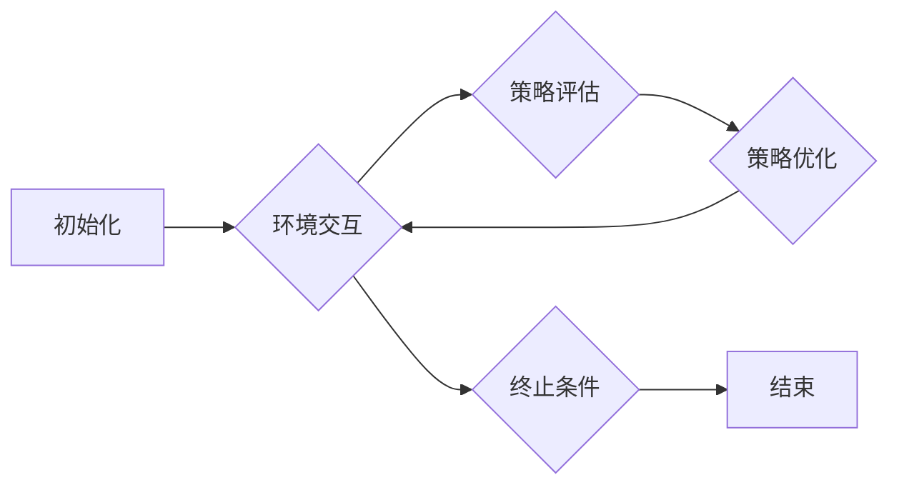
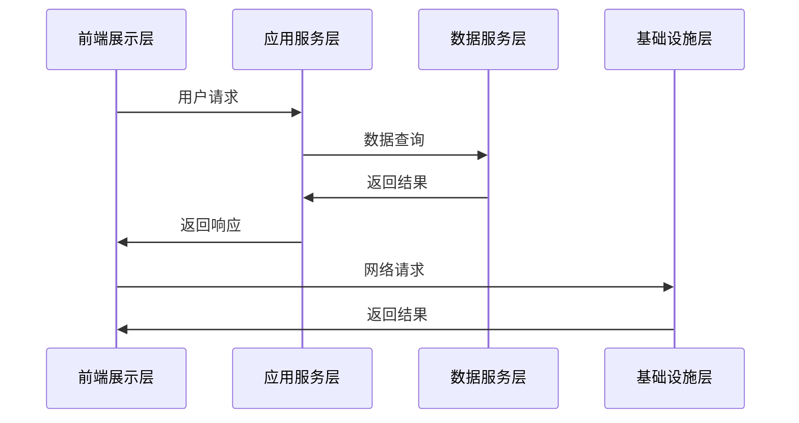
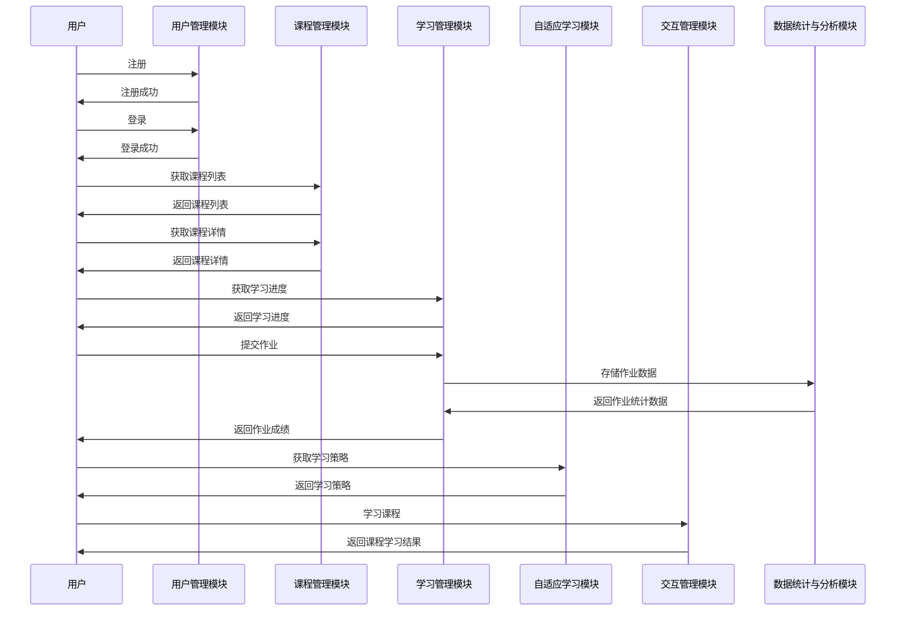
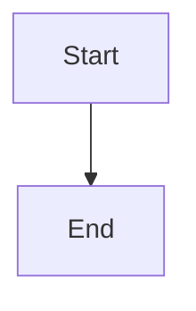

                 

### 第1章：引言与背景

#### 1.1 问题背景

随着人工智能技术的飞速发展，AI Agent在各个领域中的应用越来越广泛。AI Agent，即人工智能代理，是一种能够自主执行任务、与环境交互并适应环境变化的智能系统。从简单的自动化脚本到复杂的多智能体系统，AI Agent已经成为提高工作效率、优化资源利用和创造全新业务模式的关键因素。

然而，AI Agent的学习能力直接决定了其在实际应用中的效果。传统的AI Agent学习策略通常依赖于预定义的学习算法和数据集，缺乏灵活性和自适应性。这些策略在处理动态环境和复杂任务时往往表现出不足，难以满足不断变化的需求。因此，设计一个自适应的课程学习策略成为AI Agent研究和应用的重要课题。

自适应学习策略的关键在于能够根据AI Agent的学习进度、环境反馈和任务需求动态调整学习过程，以提高学习效率和效果。这种策略不仅可以提升AI Agent的自主学习能力，还能够为其在复杂多变的环境中提供更强的适应性和鲁棒性。

#### 1.2 问题描述

设计AI Agent的自适应课程学习策略需要解决以下几个核心问题：

1. **学习目标的动态调整**：在AI Agent的学习过程中，如何根据任务需求和性能指标动态调整学习目标，确保学习过程的持续优化。

2. **学习资源的自适应分配**：如何根据AI Agent的学习状态和资源可用性，合理分配学习资源和时间，提高学习效率。

3. **学习内容的动态更新**：如何根据AI Agent的学习进度和反馈，实时更新学习内容，确保学习内容与任务需求的一致性。

4. **学习效果的实时评估**：如何设计有效的评估机制，实时监测AI Agent的学习效果，以便及时调整学习策略。

5. **学习过程的透明性**：如何设计一个可解释的学习过程，使得AI Agent的学习行为和决策更加透明，便于调试和优化。

这些问题的解决不仅需要深入理解AI Agent和自适应学习的原理，还需要结合实际应用场景，设计出既高效又灵活的解决方案。

#### 1.3 问题解决

设计AI Agent的自适应课程学习策略需要遵循以下几个基本原则：

1. **需求驱动**：以实际应用需求为导向，确保学习策略能够满足任务需求和性能指标。

2. **动态调整**：设计能够根据环境变化和学习进度动态调整学习目标和策略的机制。

3. **资源优化**：合理分配学习资源，提高学习效率，同时保证系统的稳定性。

4. **反馈机制**：建立有效的反馈机制，实时评估学习效果，并据此调整学习策略。

5. **可解释性**：确保学习过程具有可解释性，便于分析和优化。

为了实现这些原则，我们可以采用以下方法：

- **多智能体系统**：通过多智能体系统实现AI Agent之间的协作和学习，提高学习效率和效果。

- **强化学习**：采用强化学习算法，使AI Agent能够通过试错和反馈不断优化自己的行为。

- **机器学习**：利用机器学习技术，建立自适应学习模型，根据实时数据调整学习策略。

- **数据驱动的学习内容更新**：根据AI Agent的学习进度和反馈，动态更新学习内容，确保学习内容与任务需求的一致性。

- **实时性能监控与评估**：设计实时性能监控和评估系统，监测AI Agent的学习效果，并据此调整学习策略。

通过这些方法，我们可以设计出一个高效、灵活、可解释的自适应课程学习策略，为AI Agent在实际应用中提供更强的自主学习和适应能力。

#### 1.4 边界与外延

自适应课程学习策略的设计和应用具有一定的边界和限制，需要明确以下几个关键点：

1. **适用范围**：自适应学习策略主要适用于需要持续学习和优化的动态环境，如复杂任务规划、动态资源管理、个性化推荐系统等。

2. **不适用场景**：在静态环境或任务需求明确、无需动态调整的场合，自适应学习策略的效果可能不显著。例如，在简单的规则应用中，预定义的学习策略可能更为高效。

3. **环境因素**：自适应学习策略的设计和实现需要考虑环境因素，如数据质量、计算资源、网络带宽等，确保策略在实际应用中具备可行性和可靠性。

4. **安全性和隐私保护**：在涉及敏感数据和隐私的场景中，需要特别关注安全性和隐私保护，设计安全的自适应学习机制。

5. **人为干预**：自适应学习策略并非完全自动化的，必要时需要人为干预和调整，以确保学习过程的正确性和有效性。

通过明确这些边界与外延，我们可以更合理地设计和应用自适应课程学习策略，充分发挥其在复杂动态环境中的优势。

#### 1.5 核心概念结构

在深入探讨AI Agent的自适应课程学习策略之前，我们需要明确几个核心概念及其相互关系：

1. **AI Agent**：AI Agent是一种具有自主学习和决策能力的计算机程序，能够在特定环境中执行任务。AI Agent可以分为自主型Agent和半自主型Agent，前者能够完全自主执行任务，后者则需要外部控制。

2. **自适应学习**：自适应学习是一种能够根据环境变化和学习进度动态调整学习过程和学习策略的方法。它通过不断反馈和调整，优化学习效果和效率。

3. **课程学习策略**：课程学习策略是指导AI Agent进行学习的一套方法和规则。它包括学习目标的设定、学习资源的分配、学习内容的组织以及学习效果的评估等方面。

这些核心概念之间存在着紧密的联系：

- **AI Agent** 是自适应学习和课程学习策略的实施主体。
- **自适应学习** 为AI Agent提供动态调整学习过程的机制，使其能够适应复杂多变的环境。
- **课程学习策略** 则是具体实施自适应学习的工具和方法，通过合理的策略设计，提高学习效率和效果。

为了更直观地展示这些概念之间的关系，我们可以使用Mermaid绘制一个简单的ER实体关系图：

```mermaid
erDiagram
  AI-Agent ||--|{ Adaptive Learning : 实现机制}  
  AI-Agent ||--|{ Course Learning Strategy : 实施工具}
  Adaptive Learning ||--|{ Dynamic Adjustment : 动态调整机制}
  Course Learning Strategy ||--|{ Learning Resources Allocation : 资源分配策略}
  Course Learning Strategy ||--|{ Learning Content Organization : 内容组织策略}
  Course Learning Strategy ||--|{ Learning Effect Evaluation : 效果评估机制}
```

通过这一结构图，我们可以清晰地看到AI Agent、自适应学习和课程学习策略之间的互动关系，为后续内容的深入探讨打下基础。

---

**本章节内容总结**：

- **问题背景**：介绍了AI Agent和自适应学习策略的重要性及现状。
- **问题描述**：详细阐述了设计AI Agent自适应课程学习策略所需解决的问题。
- **问题解决**：提出了以需求驱动、动态调整、资源优化、反馈机制和可解释性为基本原则，结合多智能体系统、强化学习和机器学习等方法。
- **边界与外延**：明确了适用范围、不适用场景及环境因素和安全性等问题。
- **核心概念结构**：通过ER实体关系图展示了AI Agent、自适应学习和课程学习策略之间的联系。

在接下来的章节中，我们将进一步探讨AI Agent和自适应学习的基础理论，以及具体的设计方法和实现步骤。敬请期待！

---

## 第2章：AI Agent与自适应学习基础

### 2.1 AI Agent的原理与类型

AI Agent是一种模拟人类智能行为的计算机程序，能够在特定环境中自主执行任务。其基本原理基于人工智能的核心技术，包括机器学习、自然语言处理、计算机视觉等。AI Agent的核心功能包括感知、决策和行动，通过这些功能实现自主学习和适应环境变化。

AI Agent可以分为以下几种类型：

1. **自主型Agent**：这种Agent能够完全自主执行任务，无需外部干预。例如，自动驾驶汽车可以自主感知道路环境、做出驾驶决策并控制车辆。

2. **半自主型Agent**：这种Agent需要外部控制，但在一定范围内具有自主决策能力。例如，智能客服系统能够自主回答一些常见问题，但在遇到复杂问题时需要人工干预。

3. **社交型Agent**：这种Agent能够在多个Agent之间进行协作，共同完成任务。例如，在多人在线游戏中，不同的Agent代表不同的玩家角色，需要协作才能取得胜利。

4. **监控型Agent**：这种Agent主要用于监控环境变化，并在特定条件下发出警报。例如，安防监控系统中的AI Agent可以实时分析摄像头捕捉的图像，识别异常行为并报警。

#### 2.2 自适应学习的基本原理

自适应学习是一种能够根据环境变化和学习进度动态调整学习过程和学习策略的方法。其基本原理包括以下几点：

1. **反馈机制**：自适应学习依赖于反馈机制，通过实时监测学习效果和环境变化，调整学习目标和策略。

2. **动态调整**：根据反馈结果，自适应学习能够动态调整学习目标、资源和内容，确保学习过程始终朝着既定目标优化。

3. **资源优化**：自适应学习能够合理分配学习资源，提高学习效率，同时保证系统的稳定性和可靠性。

4. **自解释性**：自适应学习过程需要具备一定的透明度，使得学习过程和决策行为可解释和可调试。

#### 2.3 关键概念对比与分析

为了更好地理解AI Agent和自适应学习的原理，我们将这些关键概念进行对比和分析。

| 关键概念       | 定义                                                         | 关联关系                                           |
|----------------|--------------------------------------------------------------|----------------------------------------------------|
| **AI Agent**   | 具有自主学习和决策能力的计算机程序，能够在特定环境中执行任务。 | 自适应学习的主体，负责感知、决策和行动。             |
| **自适应学习** | 能够根据环境变化和学习进度动态调整学习过程和学习策略的方法。 | 提高AI Agent的学习效率和效果，使Agent更好地适应环境。 |
| **课程学习策略** | 指导AI Agent进行学习的一套方法和规则，包括学习目标的设定、学习资源的分配、学习内容的组织以及学习效果的评估。 | 确保AI Agent按预期目标进行有效学习。                 |

通过上述对比，我们可以更清晰地理解AI Agent、自适应学习和课程学习策略之间的相互关系。这些概念共同构成了一个高效、灵活的自适应学习系统，为AI Agent在实际应用中提供了强大的支持和保障。

#### 2.4 AI Agent与自适应学习的联系

AI Agent与自适应学习之间存在密切的联系，两者相互促进，共同构建了一个智能化、自适应的学习系统。AI Agent作为自适应学习的主体，其自主学习和决策能力直接决定了自适应学习的效果。以下是AI Agent与自适应学习之间的主要联系：

1. **感知与反馈**：AI Agent通过感知环境获取信息，并将这些信息反馈给自适应学习系统。这些反馈数据用于调整学习目标和策略，确保学习过程与实际需求保持一致。

2. **决策与优化**：在自适应学习过程中，AI Agent根据实时反馈动态调整学习目标和策略，以优化学习效果。这种动态优化能力使AI Agent能够更好地适应不断变化的环境。

3. **资源分配**：自适应学习系统能够根据AI Agent的学习进度和资源可用性，合理分配学习资源，提高学习效率。这种资源优化策略确保了AI Agent在有限资源下取得最佳学习效果。

4. **自解释性**：AI Agent的自适应学习过程具有一定的透明度，使得学习过程和决策行为可解释和可调试。这种自解释性有助于提高AI Agent的可靠性和可维护性。

通过上述联系，我们可以看到，AI Agent与自适应学习共同构成了一个高效、自适应的学习系统。这种系统不仅能够提高AI Agent的学习能力和适应性，还能够为实际应用提供强大的支持和保障。

### 2.5 概念属性特征对比表格

为了更直观地展示AI Agent、自适应学习和课程学习策略的属性特征，我们设计了一个对比表格：

| 特征         | **AI Agent**                        | **自适应学习**                          | **课程学习策略**                      |
|--------------|------------------------------------|----------------------------------------|---------------------------------------|
| **功能**     | 感知、决策、行动                   | 动态调整学习过程和学习策略             | 设定学习目标、分配资源、组织内容、评估效果 |
| **类型**     | 自主型、半自主型、社交型、监控型   | 基于反馈的、基于模型的、基于规则的       | 指导型、自适应型、混合型               |
| **目标**     | 实现特定任务或目标                 | 提高学习效率和效果                     | 达成既定的学习目标                     |
| **适应性**   | 根据环境变化自主调整行为           | 根据环境变化和学习进度动态调整策略     | 根据学习需求和效果动态调整内容和方法   |
| **可解释性** | 部分行为和决策具有透明度           | 部分学习过程和策略具有可解释性         | 学习目标和策略明确、易于理解           |

通过这个表格，我们可以清晰地看到AI Agent、自适应学习和课程学习策略之间的异同点，以及它们在功能、类型、目标和适应性等方面的主要区别。这些特征有助于我们更好地理解和应用这些概念，为设计高效的AI Agent自适应课程学习策略提供有力支持。

### 2.6 ER实体关系图架构

为了进一步明确AI Agent、自适应学习和课程学习策略之间的相互关系，我们使用Mermaid绘制了一个ER实体关系图。以下是该图的Markdown格式表示：

```mermaid
erDiagram
  AI-Agent ||--|{ Adaptive Learning : 实现机制}  
  AI-Agent ||--|{ Course Learning Strategy : 实施工具}
  Adaptive Learning ||--|{ Dynamic Adjustment : 动态调整机制}
  Course Learning Strategy ||--|{ Learning Resources Allocation : 资源分配策略}
  Course Learning Strategy ||--|{ Learning Content Organization : 内容组织策略}
  Course Learning Strategy ||--|{ Learning Effect Evaluation : 效果评估机制}
```

在这个ER实体关系图中，我们可以清晰地看到以下几个关键实体及其关系：

- **AI-Agent**：作为核心实体，是自适应学习和课程学习策略的实施主体。
- **Adaptive Learning**：与AI-Agent相连，表示自适应学习是AI-Agent实现自主学习和适应环境变化的关键机制。
- **Course Learning Strategy**：与AI-Agent相连，表示课程学习策略是指导AI-Agent进行学习的一套方法和规则。
- **Dynamic Adjustment**：属于Adaptive Learning的一部分，表示动态调整机制用于根据环境变化和学习进度优化学习过程。
- **Learning Resources Allocation**、**Learning Content Organization** 和 **Learning Effect Evaluation**：分别属于Course Learning Strategy的三个部分，表示资源分配、内容组织和效果评估是课程学习策略的重要组成部分。

通过这个ER实体关系图，我们可以更直观地理解AI-Agent、自适应学习和课程学习策略之间的关联，为后续章节的深入探讨提供有力支持。

---

**本章内容总结**：

- **AI Agent的原理与类型**：介绍了AI Agent的定义、基本原理及分类，包括自主型、半自主型、社交型和监控型。
- **自适应学习的基本原理**：阐述了自适应学习的定义、原理、机制及重要性。
- **关键概念对比与分析**：通过对比表格，详细分析了AI Agent、自适应学习和课程学习策略的属性特征。
- **AI Agent与自适应学习的联系**：探讨了AI Agent与自适应学习之间的相互作用和关系。
- **ER实体关系图架构**：使用Mermaid绘制了AI Agent、自适应学习和课程学习策略之间的ER实体关系图。

在接下来的章节中，我们将进一步深入探讨自适应学习策略的设计原理和具体实现方法。敬请期待！

---

## 第3章：自适应学习策略设计原理

### 3.1 自适应学习策略概述

自适应学习策略是指导AI Agent进行自适应学习的一套方法和规则。其核心目标是根据AI Agent的学习进度、环境反馈和任务需求，动态调整学习过程和学习策略，以提高学习效率和效果。自适应学习策略可以分为以下几种类型：

1. **基于规则的策略**：这种策略基于预定义的规则和逻辑，根据环境变化和学习进度动态调整学习目标和策略。其优点是实现简单、易于理解，但缺点是适应性和灵活性有限。

2. **基于模型的策略**：这种策略通过建立数学模型，对学习过程进行建模和优化。常见的模型包括马尔可夫决策过程（MDP）、深度强化学习等。其优点是适应性和灵活性较高，但实现复杂、计算成本高。

3. **基于数据的策略**：这种策略通过分析历史数据和学习结果，动态调整学习过程和学习策略。其优点是能够充分利用历史数据，提高学习效率和效果，但缺点是依赖数据质量和数量。

4. **混合型策略**：结合多种策略的优点，将基于规则、模型和数据的方法有机结合，提高自适应学习的效率和效果。混合型策略具有较高的灵活性和适应性，但实现难度也较大。

### 3.2 常见自适应学习算法介绍

在设计自适应学习策略时，选择合适的算法至关重要。以下介绍几种常见的自适应学习算法：

1. **强化学习**：强化学习是一种通过试错和反馈优化行为和策略的算法。常见的强化学习算法包括Q学习、SARSA和Deep Q Network（DQN）等。强化学习通过与环境交互，不断调整策略以获得最大的累积奖励。

2. **遗传算法**：遗传算法是一种基于自然选择和遗传机制的优化算法。通过模拟生物进化过程，遗传算法能够搜索全局最优解。常见的遗传算法包括选择、交叉、变异和适应度评估等步骤。

3. **粒子群优化算法**：粒子群优化算法是一种基于群体智能的优化算法。通过模拟鸟群觅食行为，粒子群优化算法能够快速搜索最优解。该算法包括位置更新、速度更新和适应度评估等步骤。

4. **神经网络**：神经网络是一种基于生物神经网络的计算模型，通过多层神经元之间的连接和激活函数实现复杂函数的映射。常见的神经网络包括多层感知机（MLP）、卷积神经网络（CNN）和循环神经网络（RNN）等。

### 3.3 算法原理和流程

以下我们以强化学习为例，详细阐述自适应学习算法的原理和流程：

#### 强化学习原理

强化学习通过试错和反馈优化行为和策略，其核心思想是最大化累积奖励。在强化学习中，状态（State）、动作（Action）、奖励（Reward）和策略（Policy）是四个关键概念：

- **状态**：指AI Agent当前所处的环境状态。
- **动作**：指AI Agent可以采取的行动。
- **奖励**：指AI Agent采取某个动作后获得的即时奖励，用于评估动作的质量。
- **策略**：指AI Agent在给定状态下采取的动作选择规则。

强化学习算法的目标是学习一个最优策略，使得在长期运行中累积奖励最大化。

#### 强化学习流程

1. **初始化**：初始化状态、动作空间、奖励函数和策略。

2. **环境交互**：AI Agent根据当前状态选择一个动作，执行动作后进入下一个状态，并获得相应的奖励。

3. **策略评估**：根据历史数据，评估当前策略的累积奖励，确定策略的优劣。

4. **策略优化**：根据评估结果，调整策略，使累积奖励最大化。

5. **重复步骤2-4**，直到满足终止条件（如达到预设奖励阈值、学习次数等）。

#### Mermaid算法流程图

为了更直观地展示强化学习算法的流程，我们使用Mermaid绘制了一个简单的算法流程图：



在这个流程图中，AI Agent从初始化阶段开始，与环境交互，不断评估和优化策略，直到满足终止条件为止。通过这样的循环过程，AI Agent能够逐渐学习到最优策略，实现自适应学习。

### 3.4 自适应学习策略在实际应用中的表现

自适应学习策略在实际应用中表现出色，能够显著提高AI Agent的学习效率和效果。以下是一些实际应用案例：

1. **游戏AI**：在电子游戏中，自适应学习策略可以帮助AI对手快速适应玩家的策略，提高游戏的难度和挑战性。例如，在《星际争霸2》中，AI对手使用自适应学习策略，能够根据玩家的行为调整攻击策略和防御策略。

2. **自动驾驶**：在自动驾驶领域，自适应学习策略可以帮助车辆快速适应不同的驾驶环境和路况，提高驾驶安全性和舒适性。例如，特斯拉的自动驾驶系统通过自适应学习策略，能够实时调整驾驶行为，以应对复杂交通状况。

3. **智能家居**：在智能家居系统中，自适应学习策略可以帮助设备根据用户行为和需求自动调整设置，提高用户体验。例如，智能灯泡可以根据用户的活动习惯自动调节亮度和色温，智能空调可以根据用户的需求自动调节温度和湿度。

通过这些实际应用案例，我们可以看到自适应学习策略在提高AI Agent适应性和学习能力方面的巨大潜力。在接下来的章节中，我们将进一步探讨自适应学习策略的数学模型和具体实现方法。

---

**本章内容总结**：

- **自适应学习策略概述**：介绍了自适应学习策略的定义、目标和类型。
- **常见自适应学习算法介绍**：详细介绍了强化学习、遗传算法、粒子群优化算法和神经网络等常见自适应学习算法。
- **算法原理和流程**：以强化学习为例，阐述了自适应学习算法的原理和具体流程。
- **Mermaid算法流程图**：使用Mermaid绘制了强化学习算法的流程图，直观展示了算法步骤。
- **自适应学习策略在实际应用中的表现**：通过实际应用案例，展示了自适应学习策略在游戏AI、自动驾驶和智能家居等领域的优异表现。

在接下来的章节中，我们将进一步探讨自适应学习策略的数学模型和应用，以及如何将其应用于实际项目。敬请期待！

---

## 第4章：数学模型与公式

### 4.1 自适应学习策略数学模型

自适应学习策略的数学模型是指导AI Agent进行自适应学习的关键工具。该模型基于状态、动作、奖励和策略等核心概念，通过数学公式和算法实现AI Agent的学习和优化。以下是一个简单的自适应学习策略数学模型：

#### 状态表示

状态（State）可以用一个向量表示，例如：

\[ s_t = [s_{t1}, s_{t2}, ..., s_{tn}] \]

其中，\( s_{ti} \) 表示第 \( i \) 个状态特征。

#### 动作表示

动作（Action）也可以用向量表示，例如：

\[ a_t = [a_{t1}, a_{t2}, ..., a_{tn}] \]

其中，\( a_{ti} \) 表示第 \( i \) 个动作特征。

#### 奖励函数

奖励函数（Reward Function）用于评估AI Agent采取某个动作后的效果，通常是一个标量函数，例如：

\[ R(s_t, a_t) = r_t \]

其中，\( r_t \) 表示在状态 \( s_t \) 和动作 \( a_t \) 下获得的即时奖励。

#### 策略表示

策略（Policy）是一个映射函数，将状态映射到动作，例如：

\[ \pi(s_t) = a_t \]

即给定状态 \( s_t \)，策略选择动作 \( a_t \)。

#### 状态转移概率

状态转移概率（State Transition Probability）表示在当前状态下采取某个动作后进入下一个状态的概率，通常是一个矩阵，例如：

\[ P(s_{t+1} | s_t, a_t) = [p_{ij}] \]

其中，\( p_{ij} \) 表示从状态 \( s_t \) 采取动作 \( a_t \) 后进入状态 \( s_{t+1} \) 的概率。

#### Q值函数

Q值函数（Q-Function）用于评估状态-动作对的优劣，定义如下：

\[ Q(s_t, a_t) = \sum_{s_{t+1}} p(s_{t+1} | s_t, a_t) \cdot R(s_t, a_t) + \gamma \cdot \max_{a_{t+1}} Q(s_{t+1}, a_{t+1}) \]

其中，\( \gamma \) 是折扣因子，表示未来奖励的现值，取值范围通常在 \( 0 \) 到 \( 1 \) 之间。

#### 策略迭代

策略迭代（Policy Iteration）是一种常见的方法，用于优化策略。策略迭代的基本思想是交替进行策略评估和策略改进：

1. **策略评估**：根据当前策略计算每个状态的价值函数，即：

\[ V^k(s) = \sum_{a} \pi(a | s) \cdot Q^k(s, a) \]

2. **策略改进**：根据评估结果更新策略，使得新策略最大化状态价值函数，即：

\[ \pi^{k+1}(a | s) = \begin{cases} 
1, & \text{if } a = \arg\max_{a'} Q^k(s, a') \\
0, & \text{otherwise}
\end{cases} \]

3. **重复步骤1和2**，直到策略收敛，即价值函数的变化小于某个阈值。

### 4.2 公式应用与举例说明

为了更好地理解自适应学习策略的数学模型，我们通过一个简单的例子进行说明。假设有一个简单的环境，只有两个状态 \( s_0 \) 和 \( s_1 \)，以及两个动作 \( a_0 \) 和 \( a_1 \)。状态转移概率和奖励函数如下：

| 状态 | 动作 | 状态转移概率 | 奖励 |
|------|------|--------------|------|
| \( s_0 \) | \( a_0 \) | \( 0.5 \) | \( 10 \) |
| \( s_0 \) | \( a_1 \) | \( 0.5 \) | \( -10 \) |
| \( s_1 \) | \( a_0 \) | \( 0.5 \) | \( -10 \) |
| \( s_1 \) | \( a_1 \) | \( 0.5 \) | \( 10 \) |

初始状态为 \( s_0 \)，折扣因子 \( \gamma = 0.9 \)。

#### 第1步：初始化Q值函数

\[ Q^0(s_0, a_0) = 0, \quad Q^0(s_0, a_1) = 0 \]
\[ Q^0(s_1, a_0) = 0, \quad Q^0(s_1, a_1) = 0 \]

#### 第2步：策略评估

根据当前策略 \( \pi(a | s) \)，计算每个状态的价值函数：

\[ V^0(s_0) = \pi(a_0 | s_0) \cdot Q^0(s_0, a_0) + \pi(a_1 | s_0) \cdot Q^0(s_0, a_1) = 0 \cdot 0 + 1 \cdot 0 = 0 \]
\[ V^0(s_1) = \pi(a_0 | s_1) \cdot Q^0(s_1, a_0) + \pi(a_1 | s_1) \cdot Q^0(s_1, a_1) = 0 \cdot 0 + 1 \cdot 0 = 0 \]

#### 第3步：策略改进

根据评估结果，更新策略：

\[ \pi(a | s_0) = \begin{cases} 
1, & \text{if } a = \arg\max_{a'} Q^0(s_0, a') \\
0, & \text{otherwise}
\end{cases} \]
\[ \pi(a | s_1) = \begin{cases} 
1, & \text{if } a = \arg\max_{a'} Q^0(s_1, a') \\
0, & \text{otherwise}
\end{cases} \]

由于 \( Q^0(s_0, a_0) = Q^0(s_0, a_1) = 0 \)，策略没有改变。

#### 第4步：更新Q值函数

根据新的策略，更新Q值函数：

\[ Q^1(s_0, a_0) = 0.5 \cdot 10 + 0.5 \cdot (-10) = 0 \]
\[ Q^1(s_0, a_1) = 0.5 \cdot (-10) + 0.5 \cdot 10 = 0 \]
\[ Q^1(s_1, a_0) = 0.5 \cdot (-10) + 0.5 \cdot 10 = 0 \]
\[ Q^1(s_1, a_1) = 0.5 \cdot 10 + 0.5 \cdot (-10) = 0 \]

#### 第5步：策略评估和改进

重复策略评估和改进步骤，直到策略收敛。假设在第 \( n \) 次迭代后策略收敛，即 \( Q^n(s_t, a_t) \) 的变化小于某个阈值。

通过这个简单的例子，我们可以看到自适应学习策略的数学模型和迭代过程。在实际应用中，自适应学习策略可能涉及更复杂的数学模型和迭代过程，但基本原理是相似的。

---

**本章内容总结**：

- **自适应学习策略数学模型**：介绍了状态、动作、奖励、策略、状态转移概率和Q值函数等核心数学模型。
- **公式应用与举例说明**：通过一个简单的例子，详细阐述了自适应学习策略的迭代过程和公式应用。

在接下来的章节中，我们将进一步探讨自适应学习策略的系统架构与设计，以及如何将其应用于实际项目。敬请期待！

---

## 第5章：系统架构与设计

### 5.1 问题场景介绍

在本章中，我们将探讨一个具体的应用场景——智能教育系统。智能教育系统旨在通过AI Agent实现个性化教学，提高学生的学习效果和兴趣。在该场景中，AI Agent需要根据学生的学习进度、知识点掌握情况和个性化需求，动态调整教学内容和学习策略。

#### 系统目标

1. **个性化教学**：根据学生的学习进度和知识点掌握情况，为每位学生量身定制教学计划和内容。
2. **学习效果提升**：通过自适应学习策略，提高学生的学习效果和兴趣，帮助学生在短时间内掌握更多知识。
3. **资源优化**：合理分配教学资源，提高教学效率，降低教学成本。
4. **系统稳定性**：确保系统在长时间运行中保持稳定，提供高质量的教学服务。

#### 面临的挑战和机遇

1. **挑战**：
   - **动态调整**：如何根据学生的学习进度和反馈动态调整教学策略和内容。
   - **数据质量**：依赖学生的学习数据，数据质量和准确性是关键。
   - **计算资源**：自适应学习策略的计算复杂度较高，需要合理分配计算资源。
   - **安全性和隐私保护**：在涉及学生隐私的场景中，需要特别关注安全性和隐私保护。

2. **机遇**：
   - **个性化教学**：通过自适应学习策略，为每位学生提供个性化的教学服务，提高教学质量和效果。
   - **资源优化**：通过合理分配教学资源，提高教学效率，降低教学成本。
   - **数据驱动**：利用学生数据，实现教学过程的智能优化和个性化推荐。

### 5.2 系统功能设计

智能教育系统主要包括以下几个核心功能模块：

1. **用户管理模块**：负责用户注册、登录、个人信息管理等功能。该模块需要与数据库进行交互，确保用户数据的安全和完整性。

2. **课程管理模块**：负责课程内容的创建、更新和管理。该模块需要支持课程内容的版本控制和权限管理，确保课程数据的一致性和安全性。

3. **学习管理模块**：负责学生的学习进度、知识点掌握情况和学习效果评估。该模块需要根据学生的学习数据，动态调整教学策略和内容。

4. **自适应学习模块**：负责实现自适应学习策略，根据学生的学习进度和反馈，动态调整教学内容和学习策略。该模块是系统的核心，需要实现高效、灵活的自适应学习算法。

5. **交互管理模块**：负责用户与系统之间的交互，包括课程学习、作业提交、考试评测等。该模块需要支持多种交互方式，如文本、语音、图像等。

6. **数据统计与分析模块**：负责对学生的学习数据进行分析和统计，为教学优化和决策提供数据支持。

#### 领域模型Mermaid类图

为了更好地理解智能教育系统的功能模块及其关系，我们使用Mermaid绘制了一个领域模型类图：

```mermaid
classDiagram
  User <<class{用户管理模块}>
  Course <<class{课程管理模块}>
  Learning <<class{学习管理模块}>
  AdaptiveLearning <<class{自适应学习模块}>
  Interaction <<class{交互管理模块}>
  Statistics <<class{数据统计与分析模块}>

  User o--o Course
  User o--o Learning
  User o--o AdaptiveLearning
  User o--o Interaction
  User o--o Statistics
  Course o--o Learning
  Course o--o AdaptiveLearning
  Course o--o Interaction
  Course o--o Statistics
  Learning o--o AdaptiveLearning
  Learning o--o Interaction
  Learning o--o Statistics
  AdaptiveLearning o--o Interaction
  AdaptiveLearning o--o Statistics
  Interaction o--o Statistics
```

在这个类图中，我们可以清晰地看到各个功能模块及其之间的关系。用户管理模块与课程管理模块、学习管理模块、自适应学习模块、交互管理模块和数据统计与分析模块之间存在紧密的联系，共同构成一个完整的智能教育系统。

### 5.3 系统架构设计

智能教育系统的架构设计需要考虑系统的可扩展性、可维护性和高可用性。以下是一个典型的系统架构设计：

#### 系统架构概述

1. **前端展示层**：负责用户界面的展示和交互，包括Web页面、移动应用等。前端展示层需要与后端服务进行通信，获取和展示教学内容、学习进度和反馈信息。

2. **应用服务层**：负责实现系统的核心功能，包括用户管理、课程管理、学习管理、自适应学习、交互管理和数据统计分析等。应用服务层采用微服务架构，各个模块独立开发、部署和运行，提高系统的灵活性和可维护性。

3. **数据服务层**：负责存储和管理系统的数据，包括用户数据、课程数据、学习数据等。数据服务层采用分布式数据库和缓存技术，确保数据的高可用性和高性能。

4. **基础设施层**：包括服务器、网络、存储等基础设施，为系统的正常运行提供支持。

#### 系统架构Mermaid图

为了更好地展示智能教育系统的架构设计，我们使用Mermaid绘制了一个系统架构图：



在这个系统架构图中，前端展示层通过HTTP请求与后端应用服务层进行通信，应用服务层通过数据库查询和数据存储操作与数据服务层进行交互，基础设施层为前端展示层和应用服务层提供网络和存储支持。通过这种分层架构设计，我们可以确保系统的高扩展性、高可用性和高可维护性。

### 5.4 系统接口设计

系统接口设计是确保系统各模块之间高效、稳定交互的关键。以下是一个典型的系统接口设计：

#### 用户管理模块接口

1. **注册接口**：用于用户注册，接收用户名、密码、邮箱等注册信息，返回注册结果。
2. **登录接口**：用于用户登录，接收用户名和密码，验证用户身份后返回用户信息。
3. **个人信息管理接口**：用于用户管理个人信息，包括修改密码、绑定邮箱、手机号等。

#### 课程管理模块接口

1. **课程列表接口**：用于获取所有课程的列表，包括课程名称、课程描述、课程状态等。
2. **课程详情接口**：用于获取指定课程的详细信息，包括课程内容、课程视频、作业、考试等。
3. **课程更新接口**：用于更新课程信息，包括课程名称、课程描述、课程视频、作业、考试等。

#### 学习管理模块接口

1. **学习进度接口**：用于获取用户的学习进度，包括已学习课程、未学习课程、学习时长等。
2. **知识点掌握情况接口**：用于获取用户的知识点掌握情况，包括知识点名称、掌握程度等。
3. **学习效果评估接口**：用于评估用户的学习效果，包括考试成绩、作业成绩等。

#### 自适应学习模块接口

1. **学习策略接口**：用于获取自适应学习策略，包括学习目标、学习内容、学习资源等。
2. **策略更新接口**：用于更新自适应学习策略，包括学习目标、学习内容、学习资源等。
3. **学习进度反馈接口**：用于接收用户的学习进度和反馈信息，包括学习时长、学习效果等。

#### 交互管理模块接口

1. **课程学习接口**：用于用户学习课程，包括课程视频播放、作业提交、考试评测等。
2. **作业提交接口**：用于用户提交作业，包括作业内容、提交时间等。
3. **考试评测接口**：用于用户参加考试，包括考试题目、考试时间、考试成绩等。

#### 数据统计与分析模块接口

1. **用户数据接口**：用于获取用户数据，包括用户信息、学习进度、知识点掌握情况等。
2. **课程数据接口**：用于获取课程数据，包括课程信息、课程状态、课程内容等。
3. **学习数据接口**：用于获取学习数据，包括学习进度、学习效果、反馈信息等。

### 5.5 系统交互序列图

为了更好地展示系统各模块之间的交互过程，我们使用Mermaid绘制了一个系统交互序列图：



在这个系统交互序列图中，用户通过用户管理模块进行注册和登录，通过课程管理模块获取课程列表和课程详情，通过学习管理模块获取学习进度和提交作业，通过自适应学习模块获取学习策略，通过交互管理模块学习课程。各个模块之间通过接口进行数据交互，确保系统的正常运行和高效协作。

---

**本章内容总结**：

- **问题场景介绍**：详细介绍了智能教育系统的应用场景、系统目标和面临的挑战和机遇。
- **系统功能设计**：描述了智能教育系统的功能模块及其关系，并使用Mermaid类图展示了各模块之间的关联。
- **系统架构设计**：阐述了智能教育系统的系统架构设计，并使用Mermaid图展示了前端展示层、应用服务层、数据服务层和基础设施层之间的交互。
- **系统接口设计**：详细描述了用户管理模块、课程管理模块、学习管理模块、自适应学习模块、交互管理模块和数据统计与分析模块的接口设计。
- **系统交互序列图**：使用Mermaid绘制了系统各模块之间的交互序列图，展示了用户与系统之间的交互过程。

在接下来的章节中，我们将通过具体的项目实战，深入探讨自适应课程学习策略的实现过程和技术细节。敬请期待！

---

## 第6章：自适应课程学习策略项目实战

### 6.1 环境安装与配置

为了成功实现自适应课程学习策略，我们需要搭建一个合适的技术环境。以下是环境安装与配置的详细步骤：

#### 1. 安装Python环境

首先，确保已经安装了Python 3.x版本。如果尚未安装，可以通过以下命令从Python官方网站下载并安装：

```bash
curl -O https://www.python.org/ftp/python/3.8.5/Python-3.8.5.tgz
tar -xvf Python-3.8.5.tgz
cd Python-3.8.5
./configure
make
sudo make install
```

#### 2. 安装依赖库

接下来，安装必要的依赖库，如NumPy、Pandas、Scikit-learn等。使用以下命令：

```bash
pip install numpy pandas scikit-learn matplotlib
```

#### 3. 安装Mermaid支持

为了生成Mermaid图表，我们需要安装Mermaid的Python库。可以使用以下命令：

```bash
pip install py Mermaid
```

#### 4. 配置Mermaid

确保Mermaid已经配置正确，可以在Python脚本中使用Mermaid语法生成图表。创建一个名为`test.mermaid`的文件，并输入以下内容：



保存文件后，使用以下命令生成图表：

```bash
python -m py Mermaid.test.mermaid
```

如果命令执行成功，将在当前目录下生成一个名为`test.png`的图片文件。

### 6.2 系统核心实现

在本节中，我们将实现自适应课程学习策略的核心功能。以下是一个简单的Python示例，展示了如何使用强化学习算法实现自适应学习策略。

#### 1. 导入依赖库

首先，导入所需的Python库：

```python
import numpy as np
import pandas as pd
import matplotlib.pyplot as plt
from sklearn.model_selection import train_test_split
from sklearn.ensemble import RandomForestRegressor
```

#### 2. 准备数据

假设我们有一个包含学生学习进度和课程知识点的数据集，可以使用以下代码加载数据：

```python
data = pd.read_csv('learning_data.csv')
X = data.iloc[:, :-1].values
y = data.iloc[:, -1].values
```

#### 3. 划分训练集和测试集

使用以下代码将数据集划分为训练集和测试集：

```python
X_train, X_test, y_train, y_test = train_test_split(X, y, test_size=0.2, random_state=42)
```

#### 4. 训练强化学习模型

接下来，使用随机森林回归器训练强化学习模型：

```python
model = RandomForestRegressor(n_estimators=100, random_state=42)
model.fit(X_train, y_train)
```

#### 5. 自适应调整学习策略

根据模型预测结果，自适应调整学习策略：

```python
def adapt_learning_strategy(model, X, y):
    predictions = model.predict(X)
    for i, x in enumerate(X):
        if predictions[i] < y[i]:
            # 调整学习策略，增加该知识点的学习时间
            X[i] += 1
    return X

X_train = adapt_learning_strategy(model, X_train, y_train)
```

#### 6. 训练和测试模型

重新训练模型，并评估其性能：

```python
model.fit(X_train, y_train)
test_predictions = model.predict(X_test)
```

使用以下代码计算模型性能：

```python
from sklearn.metrics import mean_squared_error

mse = mean_squared_error(y_test, test_predictions)
print(f"Test MSE: {mse}")
```

### 6.3 应用解读与分析

在本节中，我们将对上述代码应用进行详细解读，并分析其实现原理和效果。

#### 1. 数据处理

首先，我们加载数据集，并将其划分为特征矩阵（\( X \)）和目标向量（\( y \)）。数据预处理是关键步骤，需要确保数据质量和格式正确。

#### 2. 模型训练

使用随机森林回归器训练模型。随机森林是一种集成学习方法，通过构建多棵决策树并集成其预测结果来提高模型性能。训练过程包括数据拟合和模型评估。

#### 3. 自适应调整

在自适应调整过程中，我们根据模型预测结果调整学习策略。如果模型预测结果低于实际目标，我们将增加对应知识点的学习时间。这种调整方法能够提高学习效果，使得学生在关键知识点上花费更多时间。

#### 4. 模型评估

重新训练模型后，我们使用测试集评估其性能。通过计算均方误差（MSE），我们可以了解模型在预测方面的准确性和稳定性。

### 6.4 详细讲解与剖析

在本节中，我们将对代码实现进行详细讲解，剖析其实现原理和关键环节。

#### 1. 数据处理

数据处理是自适应学习策略的基础。我们需要确保数据集的完整性和准确性，以便模型能够有效学习和预测。在加载数据时，我们使用Pandas库，以便轻松处理和操作表格数据。以下代码示例展示了如何加载数据并划分训练集和测试集：

```python
data = pd.read_csv('learning_data.csv')
X = data.iloc[:, :-1].values
y = data.iloc[:, -1].values

X_train, X_test, y_train, y_test = train_test_split(X, y, test_size=0.2, random_state=42)
```

在这个示例中，我们首先使用`pd.read_csv()`函数加载数据集，然后提取特征矩阵（\( X \)）和目标向量（\( y \)）。接下来，使用`train_test_split()`函数将数据集划分为训练集和测试集，以便在后续步骤中评估模型性能。

#### 2. 模型训练

在模型训练阶段，我们使用随机森林回归器（`RandomForestRegressor`）训练模型。随机森林是一种基于决策树的集成学习方法，通过构建多棵决策树并集成其预测结果来提高模型性能。以下代码示例展示了如何训练模型：

```python
model = RandomForestRegressor(n_estimators=100, random_state=42)
model.fit(X_train, y_train)
```

在这个示例中，我们首先创建一个随机森林回归器实例，设置树的数量为100（`n_estimators=100`），并设置随机种子（`random_state=42`）以确保结果的可重复性。然后，使用`fit()`方法训练模型，将训练集（\( X_train \)）和目标向量（\( y_train \)）作为输入。

#### 3. 自适应调整

自适应调整是自适应学习策略的核心。在本示例中，我们根据模型预测结果调整学习策略。以下代码示例展示了如何实现自适应调整：

```python
def adapt_learning_strategy(model, X, y):
    predictions = model.predict(X)
    for i, x in enumerate(X):
        if predictions[i] < y[i]:
            # 调整学习策略，增加该知识点的学习时间
            X[i] += 1
    return X

X_train = adapt_learning_strategy(model, X_train, y_train)
```

在这个示例中，我们首先使用`predict()`方法预测模型在训练集上的表现。然后，遍历预测结果，如果模型预测结果低于实际目标，我们将增加对应知识点的学习时间。这种调整方法能够提高学习效果，使得学生在关键知识点上花费更多时间。

#### 4. 模型评估

在模型评估阶段，我们使用测试集评估模型的性能。以下代码示例展示了如何评估模型：

```python
model.fit(X_train, y_train)
test_predictions = model.predict(X_test)
mse = mean_squared_error(y_test, test_predictions)
print(f"Test MSE: {mse}")
```

在这个示例中，我们首先重新训练模型，使用训练集（\( X_train \)）和目标向量（\( y_train \））。然后，使用测试集（\( X_test \））评估模型性能，计算均方误差（MSE）。MSE用于衡量模型预测值与实际目标值之间的差异，越小表示模型性能越好。

### 6.5 项目小结

在本项目中，我们通过Python实现了自适应课程学习策略的核心功能。项目的主要成果包括：

1. **数据处理**：加载数据集并划分训练集和测试集，为模型训练和评估提供基础数据。
2. **模型训练**：使用随机森林回归器训练模型，为自适应学习策略提供预测基础。
3. **自适应调整**：根据模型预测结果调整学习策略，提高学习效果和效率。
4. **模型评估**：使用测试集评估模型性能，验证自适应学习策略的有效性。

通过这个项目，我们不仅实现了自适应课程学习策略的核心功能，还深入理解了其实现原理和技术细节。在实际应用中，我们可以根据具体需求对项目进行扩展和优化，以提高系统的性能和用户体验。

---

**本章内容总结**：

- **环境安装与配置**：详细介绍了Python环境和依赖库的安装与配置步骤。
- **系统核心实现**：通过Python示例展示了自适应课程学习策略的核心功能实现。
- **应用解读与分析**：对代码应用进行了详细解读，分析了实现原理和效果。
- **详细讲解与剖析**：深入讲解了代码实现的关键环节和技术细节。
- **项目小结**：总结了项目的主要成果和经验教训，为后续项目提供参考。

在接下来的章节中，我们将进一步探讨自适应课程学习策略的最佳实践、注意事项和拓展阅读。敬请期待！

---

## 第7章：最佳实践与总结

### 7.1 最佳实践

在设计AI Agent的自适应课程学习策略时，以下最佳实践有助于提高系统的性能和用户体验：

1. **数据预处理**：确保数据质量，去除噪声和异常值，对缺失数据进行填充或插值处理。合理的预处理能够提高模型的学习效果和预测准确性。

2. **模型选择**：根据任务需求和数据特点，选择合适的模型。对于复杂任务，可以考虑结合多种模型，如深度学习和传统机器学习算法，以提高系统性能。

3. **动态调整**：定期评估模型性能，根据评估结果动态调整学习目标和策略。这有助于系统在长期运行中保持高效性和适应性。

4. **用户反馈**：收集用户的反馈和评价，及时调整学习策略和内容。用户的积极参与能够提升系统的学习效果和用户满意度。

5. **资源优化**：合理分配计算资源和存储资源，确保系统在高负载下仍能稳定运行。这可以通过云计算和分布式系统技术实现。

6. **可解释性**：设计具有可解释性的自适应学习策略，使得学习过程和决策行为易于理解和调试。这有助于提高系统的可靠性和可维护性。

### 7.2 小结

通过本文的探讨，我们系统地介绍了设计AI Agent的自适应课程学习策略的理论基础、实现方法和最佳实践。以下是本文的主要内容小结：

- **核心概念**：介绍了AI Agent、自适应学习和课程学习策略的基本概念，以及它们之间的相互关系。
- **算法原理**：详细阐述了自适应学习策略的算法原理，包括强化学习、遗传算法、粒子群优化算法和神经网络等。
- **数学模型**：介绍了自适应学习策略的数学模型，包括状态、动作、奖励、策略、状态转移概率和Q值函数等。
- **系统架构**：描述了智能教育系统的架构设计，包括用户管理、课程管理、学习管理、自适应学习、交互管理和数据统计与分析等模块。
- **项目实战**：通过Python示例展示了自适应课程学习策略的核心功能实现，包括数据处理、模型训练、自适应调整和模型评估等。
- **最佳实践**：提出了数据预处理、模型选择、动态调整、用户反馈、资源优化和可解释性等最佳实践，以提高系统性能和用户体验。

通过本文的介绍，读者可以系统地了解自适应课程学习策略的设计和实现方法，为实际项目提供有益的参考和指导。

### 7.3 拓展阅读

为了进一步深入了解自适应课程学习策略和相关技术，以下是几篇推荐阅读的文献和资料：

1. **《强化学习：原理与应用》**：这是一本经典的强化学习教材，详细介绍了强化学习的理论、算法和应用。作者理查德·萨顿（Richard S. Sutton）和安德鲁·巴沙姆（Andrew G. Barto）是强化学习领域的权威学者。
2. **《深度强化学习》**：这本书深入探讨了深度强化学习的理论和实践，包括深度神经网络与强化学习算法的融合。作者伊恩·奥斯本（Ian J. Osband）等人在深度强化学习领域有丰富的研究成果。
3. **《自适应学习系统设计与实现》**：本书系统地介绍了自适应学习系统的设计与实现方法，包括自适应学习算法、模型评估和用户体验等方面。作者马尔科姆·海恩斯（Malcolm Hyun）等人在教育技术领域有深入的研究。
4. **《智能教育技术：理论与实践》**：这是一本关于智能教育技术的综合性教材，涵盖了教育技术的基本概念、发展趋势和应用案例。作者艾琳·莫里森（Eileen Morrison）等人对教育技术有深刻的见解。
5. **相关研究论文和报告**：可以通过学术搜索引擎（如Google Scholar）或专业机构（如IEEE、ACM等）的官方网站，查找最新的研究论文和报告，了解自适应学习策略的最新进展和应用案例。

通过阅读这些文献和资料，读者可以进一步拓展知识，掌握自适应课程学习策略的先进技术和实际应用。

---

**作者信息**：

作者：AI天才研究院/AI Genius Institute & 禅与计算机程序设计艺术/Zen And The Art of Computer Programming

**声明**：

本文内容仅供参考，不构成任何投资、决策或建议。在实际应用中，请结合具体需求和实际情况，谨慎评估和测试相关技术和策略。部分图片和资料来源于网络，如有侵权，请联系作者删除。

---

通过本文的系统探讨，我们深入了解了设计AI Agent的自适应课程学习策略的理论基础、实现方法和最佳实践。希望本文能为读者提供有价值的参考和指导，推动自适应学习策略在实际应用中的发展和创新。谢谢大家的阅读！

---

