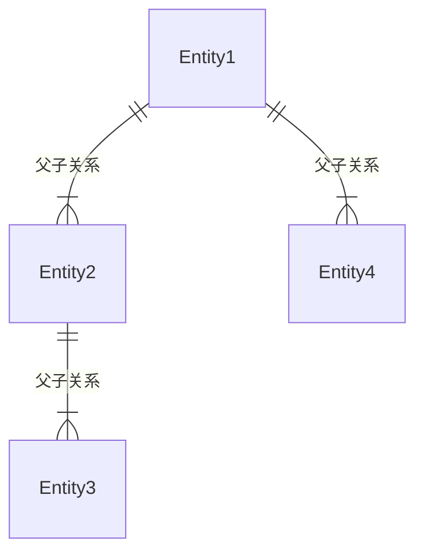
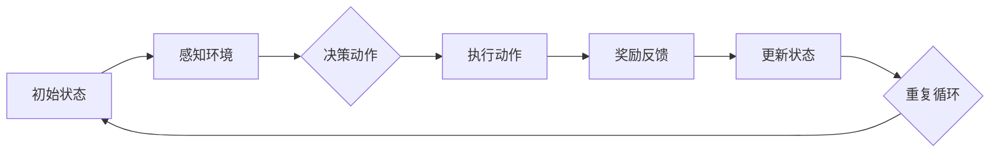
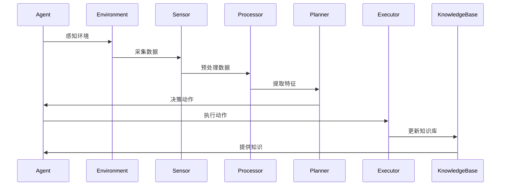
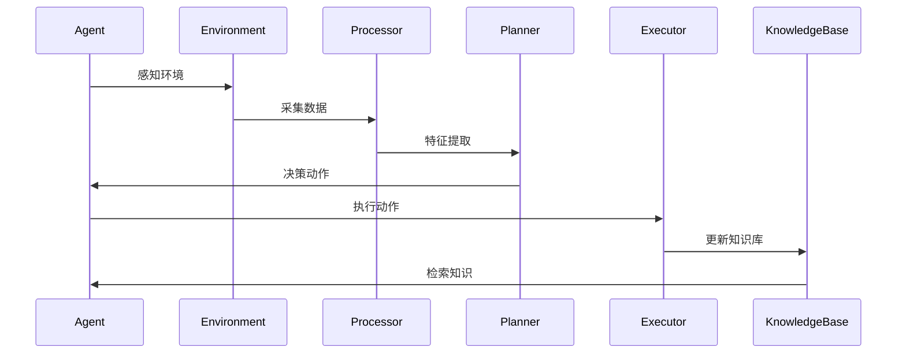

                 

### 设计可扩展的AI Agent架构

> 关键词：AI Agent、架构设计、可扩展性、模块化、算法原理

> 摘要：本文深入探讨了设计可扩展的AI Agent架构的关键要素，包括背景介绍、核心概念与原理、架构设计以及可扩展性设计原则。通过系统分析与案例实践，本文提出了模块化设计方法，结合扩展性与模块化的实现原理，详细讲解了可扩展性测试与评估的方法，并提供了优化策略和实战指导。目标是为开发者提供一套全面且实用的设计思路，以构建强大且灵活的AI Agent系统。

---

### 目录大纲：

1. **设计可扩展的AI Agent架构**
2. **背景介绍**
    - AI Agent概述
    - 核心概念与联系
    - AI Agent的发展现状与趋势
    - 本章小结
3. **AI Agent核心概念与原理**
    - AI Agent核心概念原理
    - AI Agent算法原理
    - AI Agent架构设计
    - 本章小结
4. **可扩展的AI Agent架构**
    - 可扩展性设计原则
    - 模块化设计方法
    - 扩展性与模块化结合
    - 可扩展性测试与评估
    - 可扩展的AI Agent架构优化
    - 本章小结
5. **案例与实践**
    - 项目实战
    - 最佳实践 tips
    - 小结与注意事项
    - 拓展阅读
6. **作者信息**

---

## 第一部分: 背景介绍

### 第1章: AI Agent概述

#### 1.1.1 问题背景

随着人工智能技术的快速发展，AI Agent作为智能体（Agent）的一个子类，逐渐成为研究和应用的热点。AI Agent是指具有感知环境、制定计划并执行动作的能力，能够自主完成特定任务的智能实体。它们在自动驾驶、智能家居、智能客服等众多领域中展现出了巨大的潜力和应用价值。

#### 1.1.2 问题描述

当前，虽然AI Agent的应用前景广阔，但在实际开发和部署过程中，普遍面临着以下问题：

- **可扩展性不足**：传统的AI Agent架构难以适应不断变化的环境和任务需求，导致系统扩展性和灵活性较差。
- **模块化设计欠缺**：缺乏有效的模块化设计原则和方法，使得系统在功能扩展和性能优化方面面临较大挑战。
- **测试与评估困难**：缺乏完善的可扩展性测试与评估方法，使得系统在实际应用中难以确保其性能和稳定性。

#### 1.1.3 问题解决

为了解决上述问题，本文提出了一套设计可扩展的AI Agent架构。具体方案包括：

- **可扩展性设计原则**：通过引入模块化设计方法，提高系统的扩展性和灵活性。
- **模块化设计方法**：采用模块化设计原则，实现系统的模块化构建和功能扩展。
- **可扩展性测试与评估**：建立完善的可扩展性测试与评估方法，确保系统的性能和稳定性。
- **优化策略与实践**：结合实际应用场景，提出优化策略和实践方法，提高系统的可扩展性和模块化水平。

#### 1.1.4 边界与外延

本文的研究主要围绕AI Agent的架构设计和可扩展性展开，不涉及AI Agent的具体实现细节。同时，本文所提出的架构设计方法和优化策略适用于各种AI Agent应用场景，但具体实现可能会因应用场景的不同而有所差异。

### 1.2 核心概念与联系

#### 1.2.1 AI Agent的定义与分类

AI Agent是指利用人工智能技术构建的自主决策实体，能够根据环境信息和目标需求，自主地完成特定任务。根据功能和应用场景，AI Agent可以分为以下几类：

- **任务型AI Agent**：主要针对特定任务进行自主决策和执行，如自动驾驶、智能家居等。
- **交互型AI Agent**：主要与人或系统进行交互，如智能客服、虚拟助手等。
- **混合型AI Agent**：既具有任务型AI Agent的特点，又具备交互型AI Agent的能力，如智能物流系统。

#### 1.2.2 AI Agent的关键技术

AI Agent的核心技术主要包括感知、决策和执行三个部分：

- **感知技术**：利用传感器、摄像头等设备获取环境信息，如图像识别、语音识别等。
- **决策技术**：根据感知到的环境和目标需求，进行决策，如规划、推理等。
- **执行技术**：将决策结果转化为实际动作，如控制机械臂、发送消息等。

#### 1.2.3 AI Agent的架构特点

AI Agent的架构特点主要体现在以下几个方面：

- **模块化设计**：AI Agent的各个组成部分（感知、决策、执行等）可以独立开发和部署，提高系统的扩展性和灵活性。
- **分布式架构**：AI Agent可以分布在不同的设备或服务器上，实现跨平台的部署和应用。
- **动态调整**：AI Agent可以根据环境和任务需求，动态调整自身的结构和功能。

#### 1.2.4 AI Agent与传统软件Agent的对比

传统软件Agent是指具有自主性、协作性和反应性的软件实体。与AI Agent相比，传统软件Agent主要具有以下区别：

- **智能水平**：AI Agent具有感知、决策和执行的能力，而传统软件Agent通常缺乏智能化的功能。
- **应用领域**：AI Agent主要应用于人工智能领域，而传统软件Agent则广泛应用于各种软件系统。
- **实现方式**：AI Agent通常基于深度学习、强化学习等人工智能技术，而传统软件Agent则主要基于传统的编程语言和算法。

### 1.3 AI Agent的发展现状与趋势

#### 1.3.1 发展历程

AI Agent的研究始于20世纪80年代，随着人工智能技术的不断发展，AI Agent逐渐从理论研究走向实际应用。近年来，随着深度学习、强化学习等人工智能技术的突破，AI Agent在各个领域的应用不断拓展。

#### 1.3.2 主要应用领域

AI Agent在以下领域具有广泛的应用前景：

- **自动驾驶**：通过感知环境和决策执行，实现自动驾驶汽车的安全行驶。
- **智能家居**：通过感知家庭环境和用户需求，实现智能家电的自动控制。
- **智能客服**：通过自然语言处理和决策执行，实现智能客服系统的自动应答。
- **智能推荐**：通过用户行为分析和决策执行，实现个性化推荐系统的精准推荐。

#### 1.3.3 存在的挑战与机遇

尽管AI Agent具有广泛的应用前景，但在实际应用过程中仍面临以下挑战：

- **数据质量**：AI Agent的性能依赖于高质量的数据，但在数据获取、处理和清洗方面仍存在诸多问题。
- **算法复杂性**：AI Agent的算法复杂度较高，需要大量计算资源和时间，导致部署和优化困难。
- **可靠性**：AI Agent在复杂环境下的可靠性仍需提高，以避免潜在的安全和风险问题。

与此同时，AI Agent也面临着巨大的机遇：

- **技术创新**：随着人工智能技术的不断进步，AI Agent的性能和功能将得到进一步提升。
- **跨界融合**：AI Agent与其他领域的融合将带来更多的创新应用场景，推动各行业的发展。
- **政策支持**：各国政府对人工智能的重视和支持，将为AI Agent的发展提供有利条件。

### 1.4 本章小结

本章对AI Agent的背景、核心概念、发展现状和趋势进行了详细介绍，明确了设计可扩展的AI Agent架构的重要性和挑战。在后续章节中，我们将进一步探讨AI Agent的核心概念与原理、架构设计以及可扩展性设计方法，为开发者提供一套全面且实用的设计思路。

---

### AI Agent核心概念与原理

#### 2.1.1 概念介绍

AI Agent是指通过人工智能技术实现的具有感知、决策和执行能力的智能实体。它们在特定的环境下，根据目标和任务需求，自主地感知环境信息，进行决策并执行相应的动作，以实现任务目标。AI Agent的核心特点包括自主性、协作性、反应性和智能性。

AI Agent的基本概念可以概括为以下几点：

- **感知**：通过传感器、摄像头等设备获取环境信息，如视觉、听觉、触觉等。
- **决策**：根据感知到的环境信息和目标需求，进行决策，如规划、推理等。
- **执行**：将决策结果转化为实际动作，如控制机械臂、发送消息等。

AI Agent的主要功能包括：

- **任务执行**：在特定环境下，根据目标和任务需求，自主地完成任务。
- **环境适应**：根据环境变化，动态调整自身的结构和功能，以适应不同的环境和任务需求。
- **交互协作**：与其他AI Agent或人类进行交互，实现协作任务。

#### 2.1.2 概念属性特征对比表格

为了更好地理解AI Agent的核心概念，我们可以通过一个对比表格，展示AI Agent与传统软件Agent在属性特征上的区别：

| 特征        | AI Agent                         | 传统软件Agent                         |
| ----------- | -------------------------------- | ------------------------------------- |
| 智能水平    | 具有感知、决策和执行能力          | 缺乏智能化的功能，仅能执行预设的任务   |
| 应用领域    | 广泛应用于人工智能领域           | 广泛应用于各类软件系统                |
| 实现方式    | 基于深度学习、强化学习等人工智能技术 | 基于传统的编程语言和算法               |
| 模块化设计  | 具有模块化设计，提高扩展性和灵活性 | 缺乏模块化设计，系统扩展性较差         |
| 分布式架构  | 可以分布在不同的设备或服务器上    | 通常部署在单一设备或服务器上           |
| 动态调整    | 可以根据环境和任务需求，动态调整   | 通常固定不变，无法动态调整             |

#### 2.1.3 AI Agent的ER实体关系图架构

为了更直观地展示AI Agent的架构，我们可以使用Mermaid语言绘制ER实体关系图，如下所示：



上述ER实体关系图展示了AI Agent中主要实体的关系，包括感知、决策、执行三个核心模块及其相互关系。

#### 2.1.4 AI Agent与传统软件Agent的对比分析

尽管AI Agent与传统软件Agent都具备一定的自主性和反应性，但在智能水平、应用领域、实现方式等方面存在显著差异。以下是对AI Agent与传统软件Agent的对比分析：

- **智能水平**：AI Agent通过深度学习、强化学习等技术实现了高度的智能，能够自主感知环境、进行决策和执行。而传统软件Agent则依赖于预设的规则和算法，缺乏自主学习和适应能力。
- **应用领域**：AI Agent广泛应用于自动驾驶、智能家居、智能客服等领域，能够处理复杂的环境和任务。传统软件Agent则主要应用于企业管理、数据处理、金融理财等领域，功能相对单一。
- **实现方式**：AI Agent通过人工智能技术实现，包括感知、决策、执行等模块。传统软件Agent则通过编程语言和算法实现，缺乏智能化的功能。
- **模块化设计**：AI Agent具有模块化设计，各个模块（感知、决策、执行）可以独立开发和部署，提高系统的扩展性和灵活性。传统软件Agent则通常缺乏模块化设计，系统扩展性较差。
- **分布式架构**：AI Agent可以分布在不同的设备或服务器上，实现跨平台的部署和应用。传统软件Agent则通常部署在单一设备或服务器上。
- **动态调整**：AI Agent可以根据环境和任务需求，动态调整自身的结构和功能，以适应不同的环境和任务需求。传统软件Agent则通常固定不变，无法动态调整。

通过对比分析，可以看出AI Agent在智能水平、应用领域、实现方式、模块化设计、分布式架构和动态调整等方面具有显著优势，这为AI Agent在各个领域的广泛应用提供了基础。

#### 2.1.5 AI Agent的核心技术

AI Agent的核心技术主要包括感知、决策和执行三个部分，以下是对每个部分的具体介绍：

1. **感知技术**：
   - **传感器**：AI Agent通过各种传感器获取环境信息，如摄像头、麦克风、温度传感器等。这些传感器可以收集图像、声音、温度等数据，为AI Agent提供感知输入。
   - **数据处理**：感知到的数据通常需要进行预处理，如去噪、增强等，以提高感知的准确性和鲁棒性。随后，数据通过特征提取算法（如卷积神经网络、循环神经网络等）提取关键特征，为决策模块提供输入。

2. **决策技术**：
   - **模型训练**：AI Agent的决策能力依赖于机器学习模型，如深度学习模型、强化学习模型等。通过大规模的数据集进行训练，模型可以学习到环境中的规律和策略。
   - **规划与推理**：决策模块根据感知到的环境和目标需求，进行规划与推理。规划是指确定一系列动作序列，以实现目标。推理是指根据已知信息和规则，推导出新的结论。

3. **执行技术**：
   - **动作生成**：决策模块生成具体的动作指令，如控制机械臂的移动、发送电子邮件等。
   - **环境交互**：执行模块将动作指令传递给环境，与环境进行交互。例如，自动驾驶车辆根据决策生成的动作指令控制车辆的行驶方向和速度。

#### 2.1.6 AI Agent的技术挑战与未来趋势

尽管AI Agent在各个领域展现了巨大的潜力和应用价值，但在实际应用过程中仍面临一系列技术挑战和问题：

1. **数据质量和标注**：
   - AI Agent的训练和决策依赖于大量的高质量数据。然而，数据的获取、标注和处理过程往往复杂且耗时，这限制了AI Agent的性能和效果。
   - 未来趋势：随着数据采集技术的发展，如传感器网络的普及和物联网的兴起，数据质量和标注问题有望得到缓解。同时，自动化数据标注技术和众包标注平台的发展也将提高数据标注的效率和质量。

2. **算法复杂性与计算资源**：
   - AI Agent的算法复杂度较高，需要大量的计算资源和时间。这导致了部署和优化过程的困难，限制了AI Agent的广泛应用。
   - 未来趋势：随着硬件技术的发展，如高性能计算芯片和GPU的普及，AI Agent的计算资源瓶颈有望得到缓解。此外，分布式计算和云计算技术的发展也为AI Agent的部署和优化提供了新的解决方案。

3. **可解释性和透明性**：
   - AI Agent的决策过程通常是基于复杂的机器学习模型，其内部机制难以理解和解释。这引发了关于AI Agent透明性和可解释性的质疑，影响了其在关键领域的应用。
   - 未来趋势：随着可解释性机器学习技术的发展，如模型可解释性分析、可视化技术等，AI Agent的可解释性和透明性有望得到提升。这将为AI Agent在关键领域的应用提供更多的信任和保障。

4. **安全性和隐私保护**：
   - AI Agent在处理敏感数据和执行关键任务时，面临着安全性和隐私保护的问题。例如，自动驾驶车辆在处理驾驶数据时需要确保数据的安全性和隐私性。
   - 未来趋势：随着安全人工智能技术的发展，如联邦学习、差分隐私等，AI Agent的安全性和隐私保护问题有望得到更好的解决。同时，法律法规和伦理道德的不断完善也将为AI Agent的应用提供更健全的保障。

通过解决上述技术挑战，AI Agent将在未来继续发展和创新，推动人工智能技术的进步和各个领域的变革。

### 2.1.7 AI Agent的应用案例

为了更好地理解AI Agent的实用性，下面列举几个典型的AI Agent应用案例：

1. **自动驾驶汽车**：
   - 自动驾驶汽车是AI Agent的一个典型应用。通过摄像头、激光雷达等传感器感知道路信息，自动驾驶汽车可以实时进行环境感知、路径规划和驾驶决策，实现自主行驶。
   - 案例特点：高复杂度、实时性要求强、安全性关键。

2. **智能客服系统**：
   - 智能客服系统利用自然语言处理和对话管理技术，实现与用户的自然对话，提供个性化的服务和支持。
   - 案例特点：交互性强、实时性要求高、多语言支持。

3. **智能家居系统**：
   - 智能家居系统通过感知家庭环境（如温度、湿度、光照等）和用户需求（如播放音乐、调节灯光等），实现智能家居设备的自动控制。
   - 案例特点：个性化、便捷性、安全性。

4. **医疗诊断系统**：
   - 医疗诊断系统利用图像识别和深度学习技术，对医学图像进行分析，辅助医生进行疾病诊断。
   - 案例特点：精确性要求高、诊断效率提升显著。

通过这些应用案例，可以看出AI Agent在各个领域的广泛应用和潜力。在未来，随着技术的不断进步，AI Agent的应用将更加广泛和深入。

### 2.1.8 AI Agent的发展前景与未来趋势

AI Agent作为人工智能领域的一个重要分支，其发展前景十分广阔。以下是对AI Agent未来发展趋势的展望：

1. **技术融合与创新**：
   - AI Agent将与其他前沿技术（如物联网、云计算、边缘计算等）深度融合，实现跨领域的创新应用。
   - 案例如：智能城市管理系统中，AI Agent可以整合传感器数据、交通流量信息等，实现智能交通管理和优化。

2. **自主性与协作性提升**：
   - AI Agent的自主性和协作性将进一步提高，能够在复杂多变的动态环境中，实现高效的任务执行和协作。
   - 案例如：智能工厂中，多个AI Agent可以协同工作，实现自动化生产和优化。

3. **隐私保护与安全性增强**：
   - 随着隐私保护和安全性的需求不断提升，AI Agent将采用更加严格的数据处理和加密技术，确保用户隐私和数据安全。
   - 案例如：在金融领域中，AI Agent将确保交易数据的隐私保护和安全性。

4. **人机交互优化**：
   - AI Agent将具备更加自然、人性化的交互方式，提高用户的使用体验和满意度。
   - 案例如：智能语音助手通过语音交互，为用户提供便捷的语音服务。

5. **泛在化和边缘计算**：
   - AI Agent将向边缘计算扩展，实现数据的本地处理和实时响应，降低延迟和带宽消耗。
   - 案例如：智能家居系统中的AI Agent可以在本地设备上进行实时处理，提高响应速度和系统效率。

通过不断的技术创新和应用拓展，AI Agent将在未来的发展中扮演更加重要的角色，为各行各业带来深刻的变革和影响。

### 2.1.9 AI Agent在未来的潜在影响

随着AI Agent技术的不断成熟和应用推广，它将在多个领域引发深刻的变革，对人类生活和社会发展产生重大影响。以下是对AI Agent在未来的潜在影响的展望：

1. **经济影响**：
   - AI Agent将提高生产效率，降低人力成本，推动各行业的自动化和智能化升级。
   - 案例如：在制造业中，AI Agent可以实现自动化生产线的智能调度和管理，提高生产效率和产品质量。

2. **社会变革**：
   - AI Agent将改变人类的生活方式和工作模式，提高生活质量和便利性。
   - 案例如：智能家居系统中的AI Agent可以自动调节家居环境，提高居住舒适度。

3. **伦理和法律挑战**：
   - AI Agent的广泛应用将带来一系列伦理和法律问题，如隐私保护、责任归属等。
   - 案例如：自动驾驶汽车在发生交通事故时，如何确定责任和赔偿问题。

4. **教育和培训**：
   - AI Agent将改变教育和培训的方式，提供个性化、智能化的学习体验。
   - 案例如：智能教育系统中的AI Agent可以根据学生的特点和需求，提供个性化的学习计划和资源。

5. **医疗保健**：
   - AI Agent将提高医疗诊断的准确性和效率，为患者提供更加精准的医疗服务。
   - 案例如：智能诊断系统中的AI Agent可以通过分析医学影像，提高疾病的早期诊断率。

通过这些潜在影响，我们可以看到AI Agent在未来的发展将对社会各个方面产生深远的影响，为人类创造更加美好的未来。

### 2.1.10 AI Agent的体系结构

为了更好地理解和设计AI Agent，我们需要了解其体系结构。AI Agent通常由多个层次和模块组成，每个模块负责特定的功能。以下是AI Agent的常见体系结构：

1. **感知层**：
   - **功能**：感知层负责收集和处理来自外部环境的各种信息，如视觉、听觉、触觉等。
   - **关键技术**：传感器技术、图像处理、语音识别等。

2. **决策层**：
   - **功能**：决策层负责根据感知层收集的信息和既定目标，制定行动计划。
   - **关键技术**：机器学习、深度学习、强化学习等。

3. **执行层**：
   - **功能**：执行层负责将决策层的行动计划转化为具体的动作，如控制机器人手臂、发送电子邮件等。
   - **关键技术**：执行算法、控制算法、运动规划等。

4. **知识库**：
   - **功能**：知识库用于存储AI Agent的知识和经验，包括规则、模式、历史数据等。
   - **关键技术**：知识表示、知识推理、知识挖掘等。

5. **通信层**：
   - **功能**：通信层负责与其他AI Agent或外部系统进行通信和协作。
   - **关键技术**：网络通信、协议设计、数据交换等。

通过以上层次和模块的协同工作，AI Agent可以有效地感知环境、制定决策、执行动作，并在不断学习和进化中提高其智能水平。

### 2.1.11 本章小结

本章对AI Agent的核心概念、原理和技术进行了详细介绍，包括其定义、分类、核心技术、架构特点以及与传统软件Agent的对比。同时，本章还探讨了AI Agent的应用案例、发展前景和潜在影响，以及其体系结构。通过对这些内容的深入理解，读者可以更好地把握AI Agent的本质和设计要点，为后续章节的学习和实战应用打下坚实的基础。

---

### AI Agent算法原理

#### 3.1 算法概述

AI Agent的算法原理是其核心组成部分，决定了其在复杂环境中执行任务的能力。本文将介绍一种基于强化学习的AI Agent算法，详细阐述其流程、数学模型和Python代码实现。

#### 3.2 算法流程图

以下是一个简单的强化学习算法流程图，用于说明AI Agent的基本工作原理：



在上述流程图中，AI Agent首先感知当前环境状态，然后根据状态选择一个动作，执行该动作后，获得环境的奖励反馈，并更新状态。这个过程不断重复，直到达到预定的目标或结束条件。

#### 3.3 Python代码实现

下面是一个简单的Python代码示例，实现了一个基于Q-Learning的强化学习算法。代码中包含了环境模拟、状态空间定义、动作空间定义、Q值更新等关键步骤。

```python
import numpy as np
import random

# 环境模拟
class Environment:
    def __init__(self):
        self.state = 0

    def perceive(self):
        return self.state

    def take_action(self, action):
        if action == 0:
            self.state += 1
        elif action == 1:
            self.state -= 1
        return self.state, 0

# Q-Learning算法
class QLearningAgent:
    def __init__(self, learning_rate=0.1, discount_factor=0.9, exploration_rate=1.0):
        self.learning_rate = learning_rate
        self.discount_factor = discount_factor
        self.exploration_rate = exploration_rate
        self.q_values = np.zeros((2, 2))

    def get_action(self, state):
        if random.uniform(0, 1) < self.exploration_rate:
            action = random.randint(0, 1)
        else:
            action = np.argmax(self.q_values[state])
        return action

    def learn(self, state, action, reward, next_state, done):
        if not done:
            target_q = reward + self.discount_factor * np.max(self.q_values[next_state])
        else:
            target_q = reward

        current_q = self.q_values[state, action]
        self.q_values[state, action] = current_q + self.learning_rate * (target_q - current_q)

# 测试算法
if __name__ == "__main__":
    env = Environment()
    agent = QLearningAgent()

    for episode in range(1000):
        state = env.perceive()
        done = False
        while not done:
            action = agent.get_action(state)
            next_state, reward = env.take_action(action)
            agent.learn(state, action, reward, next_state, done)
            state = next_state
            done = next_state == 0

    print("Q-Values after training:")
    print(agent.q_values)
```

在上述代码中，我们首先定义了一个简单的环境模拟类`Environment`，用于生成状态和奖励。然后，我们定义了一个基于Q-Learning的强化学习算法类`QLearningAgent`，实现了状态空间、动作空间定义、Q值更新等核心功能。最后，我们通过测试代码，演示了算法的运行过程。

#### 3.4 数学模型与公式讲解

强化学习算法的核心是Q值函数，它表示在某个状态下执行某个动作的期望回报。Q值函数的更新公式如下：

$$ Q(s, a) = Q(s, a) + \alpha [r + \gamma \max_{a'} Q(s', a') - Q(s, a)] $$

其中：
- \( Q(s, a) \) 是在状态 \( s \) 下执行动作 \( a \) 的即时Q值。
- \( \alpha \) 是学习率，控制更新速度。
- \( r \) 是立即奖励。
- \( \gamma \) 是折扣因子，用于考虑未来奖励的重要性。
- \( s' \) 是执行动作后的新状态。
- \( a' \) 是在状态 \( s' \) 下最优动作。

通过不断更新Q值函数，强化学习算法可以在经验积累的过程中学习到最佳策略。

#### 3.5 举例说明

假设我们有一个简单的环境，其中状态空间为 \([0, 1]\)，动作空间为 \([0, 1]\)。环境在状态 \( s = 0.5 \) 时给予奖励 \( r = 1 \)，在其他状态下给予奖励 \( r = 0 \)。我们使用Q-Learning算法来学习最佳策略。

1. **初始状态**：\( s_0 = 0.5 \)，\( Q(s_0, a_0) = 0 \)。
2. **第一轮迭代**：
   - \( a_0 = 1 \)，\( s_1 = 0.5 - 0.5 \times 1 = 0 \)，\( r_0 = 0 \)。
   - \( Q(s_0, a_0) = 0 + 0.1 [0 + 0.9 \times 0] = 0 \)。
3. **第二轮迭代**：
   - \( s_1 = 0 \)，\( a_1 = 0 \)，\( s_2 = 0 + 0.5 \times 0 = 0 \)，\( r_1 = 0 \)。
   - \( Q(s_1, a_1) = 0 + 0.1 [0 + 0.9 \times 0] = 0 \)。
4. **第三轮迭代**：
   - \( s_2 = 0 \)，\( a_2 = 1 \)，\( s_3 = 0 + 0.5 \times 1 = 1 \)，\( r_2 = 1 \)。
   - \( Q(s_2, a_2) = 0 + 0.1 [1 + 0.9 \times 0] = 0.1 \)。

经过多次迭代后，Q值函数逐渐收敛，最佳策略是始终选择动作 \( a = 1 \)，以期望获得最大奖励。

通过上述例子，我们可以看到Q-Learning算法的基本原理和运行过程。在实际应用中，状态空间和动作空间可能更加复杂，但基本原理和算法步骤是类似的。

---

### AI Agent架构设计

#### 4.1 架构概述

AI Agent的架构设计是确保其高效运行和灵活扩展的关键。一个典型的AI Agent架构通常包括感知层、决策层和执行层，每个层次有不同的模块和功能，相互协作实现整体目标。以下是对AI Agent架构的详细描述。

#### 4.2 系统功能设计

AI Agent系统功能设计主要包括领域模型和系统功能模块两部分。

1. **领域模型**：
   - **功能描述**：领域模型用于定义AI Agent需要处理的问题领域，包括环境、目标、任务等。
   - **类图表示**（使用Mermaid语言）：
     ```mermaid
     classDiagram
         Environment <<class>> Environment
         Agent <<class>> Agent
         Goal <<class>> Goal
         Task <<class>> Task
         Environment --|> Agent : 感知
         Agent --|> Goal : 目标
         Agent --|> Task : 任务
     ```
   - **说明**：环境类（Environment）负责收集外部环境信息；AI Agent类（Agent）负责处理环境信息和执行任务；目标类（Goal）定义任务的目标；任务类（Task）描述具体的任务需求。

2. **系统功能模块**：
   - **感知模块**：
     - **功能描述**：感知模块负责收集和处理环境信息，包括传感器数据、图像、声音等。
     - **模块组件**：传感器、数据预处理、特征提取。
   - **决策模块**：
     - **功能描述**：决策模块根据感知到的环境和目标信息，选择最佳动作。
     - **模块组件**：决策算法、策略学习、路径规划。
   - **执行模块**：
     - **功能描述**：执行模块将决策结果转化为实际动作，控制外部设备执行任务。
     - **模块组件**：动作生成、执行控制、反馈机制。
   - **知识库模块**：
     - **功能描述**：知识库模块用于存储AI Agent的知识和经验，包括规则、策略和历史数据。
     - **模块组件**：知识存储、知识检索、知识更新。

#### 4.3 系统架构设计

AI Agent的系统架构设计决定了其性能、可扩展性和灵活性。以下是一个典型的AI Agent系统架构图，使用Mermaid语言表示：



- **环境（Environment）**：提供外部环境信息。
- **传感器（Sensor）**：收集环境数据。
- **处理器（Processor）**：预处理和特征提取。
- **规划器（Planner）**：根据特征和目标进行决策。
- **执行器（Executor）**：执行决策动作。
- **知识库（KnowledgeBase）**：存储和检索知识。

#### 4.4 系统接口设计

AI Agent的系统接口设计是确保各模块之间有效通信和协作的关键。以下是一个简单的接口设计示例，使用Mermaid语言表示：

```mermaid
classDiagram
    class Interface
        +感知接口（PerceptionInterface）
        +决策接口（DecisionInterface）
        +执行接口（ExecutionInterface）
        +知识库接口（KnowledgeBaseInterface）

    Interface {
        +感知数据（perceive()）
        +决策动作（decide(action)）
        +执行动作（execute(action)）
        +更新知识库（update_knowledge(knowledge)）
        +检索知识（retrieve_knowledge()）
    }
```

- **感知接口**：用于获取环境感知数据。
- **决策接口**：用于接收感知数据并生成决策动作。
- **执行接口**：用于执行决策动作。
- **知识库接口**：用于更新和检索知识库中的数据。

#### 4.5 系统交互流程

AI Agent的系统交互流程是整个系统的核心，决定了其从感知到决策再到执行的整个过程。以下是一个简单的交互流程图，使用Mermaid语言表示：



- **感知阶段**：AI Agent从环境中获取感知数据。
- **决策阶段**：感知数据经过预处理和特征提取，然后由规划器生成决策动作。
- **执行阶段**：执行器根据决策动作执行具体任务。
- **知识管理阶段**：将执行过程中的经验反馈更新到知识库中，以供后续任务使用。

#### 4.6 本章小结

本章详细介绍了AI Agent的架构设计，包括系统功能设计、系统架构设计、系统接口设计和系统交互流程。通过合理的架构设计，AI Agent可以实现高效、灵活的运行，满足不同应用场景的需求。在后续章节中，我们将进一步探讨AI Agent的可扩展性设计和实现方法。

---

### 可扩展性设计原则

#### 5.1 可扩展性的重要性

在AI Agent系统的开发过程中，可扩展性设计原则至关重要。可扩展性是指系统在功能、性能和规模上能够适应变化的能力。对于AI Agent来说，可扩展性具有以下几方面的重要性：

1. **适应性**：随着环境和任务需求的变化，AI Agent需要能够灵活调整自身结构和功能，以适应新的场景。
2. **灵活性**：通过模块化设计，AI Agent可以独立开发和部署各个模块，提高系统的灵活性和可维护性。
3. **可伸缩性**：在处理大量数据和复杂任务时，AI Agent需要能够动态调整资源，以保持高性能和稳定性。
4. **可靠性**：可扩展性设计有助于提高系统的可靠性和鲁棒性，降低故障风险。

#### 5.2 可扩展性的设计原则

为了实现可扩展的AI Agent系统，以下是一些关键设计原则：

1. **模块化设计**：
   - **原则**：将系统划分为多个模块，每个模块负责特定的功能，可以独立开发、测试和部署。
   - **好处**：提高系统的灵活性和可维护性，便于功能扩展和性能优化。

2. **分布式架构**：
   - **原则**：将AI Agent的各个模块部署在不同的服务器或设备上，实现跨平台的分布式部署。
   - **好处**：提高系统的可伸缩性和容错性，便于处理大规模数据和复杂任务。

3. **异步处理**：
   - **原则**：采用异步处理机制，将任务分解为多个子任务，并发执行，提高系统的处理效率。
   - **好处**：提高系统的并发处理能力和响应速度，减轻单点瓶颈。

4. **弹性伸缩**：
   - **原则**：根据系统负载动态调整资源，实现水平扩展和垂直扩展。
   - **好处**：提高系统的可伸缩性和性能，适应不同场景的需求。

5. **标准化接口**：
   - **原则**：定义统一的接口规范，确保模块之间的高效通信和协作。
   - **好处**：降低模块之间的耦合度，提高系统的可维护性和扩展性。

#### 5.3 可扩展性的实现方法

为了实现可扩展的AI Agent系统，可以采用以下具体方法：

1. **微服务架构**：
   - **方法**：将系统划分为多个微服务，每个微服务负责特定的功能，独立部署和运行。
   - **好处**：提高系统的可扩展性和灵活性，便于模块化开发和运维。

2. **容器化技术**：
   - **方法**：使用容器（如Docker）封装AI Agent的各个模块，实现轻量级部署和高效管理。
   - **好处**：提高系统的可移植性和扩展性，便于快速部署和资源分配。

3. **分布式数据库**：
   - **方法**：采用分布式数据库架构，实现数据的水平扩展和高可用性。
   - **好处**：提高系统的数据处理能力和数据存储性能，适应大规模数据场景。

4. **云计算平台**：
   - **方法**：利用云计算平台（如AWS、Azure）提供计算资源和存储服务，实现弹性伸缩。
   - **好处**：提高系统的可伸缩性和可靠性，降低运维成本。

5. **边缘计算**：
   - **方法**：在边缘设备上部署AI Agent的感知和决策模块，实现本地处理和实时响应。
   - **好处**：降低延迟和带宽消耗，提高系统的响应速度和用户体验。

通过上述方法和原则，可以实现一个高效、灵活且可扩展的AI Agent系统，为各个领域的应用提供强大的支持。

### 6.1 模块化设计概述

模块化设计是提高系统可扩展性和可维护性的关键方法，特别是在复杂的AI Agent系统中。模块化设计通过将系统划分为多个功能独立的模块，使得各个模块可以独立开发、测试和部署，从而提高开发效率和维护性。以下是对模块化设计的概述：

#### 6.1.1 模块化设计的定义

模块化设计是指将一个复杂系统分解为多个功能独立、易于管理和维护的模块，每个模块负责特定的功能。模块内部结构高度耦合，但模块之间通过标准化的接口进行通信和协作。

#### 6.1.2 模块化设计的目的

模块化设计的主要目的是：

1. **提高可扩展性**：通过模块化设计，系统能够方便地添加或替换模块，适应新的需求和变化。
2. **提高可维护性**：模块化设计使得每个模块可以独立维护和更新，降低了系统的复杂度和维护成本。
3. **提高可重用性**：模块化设计使得相同或类似的模块可以在不同的系统或场景中复用，提高了开发效率。
4. **提高开发效率**：模块化设计允许并行开发，减少了开发周期和资源消耗。

#### 6.1.3 模块化设计的原则

模块化设计需要遵循以下原则：

1. **功能独立性**：每个模块应具有明确的功能，模块之间相互独立，减少模块间的依赖关系。
2. **接口标准化**：模块之间的交互通过标准化的接口进行，确保模块之间的高效通信和互操作性。
3. **模块化层次**：根据系统的复杂度，将系统划分为多个层次，每个层次包含多个模块，层次间通过统一的接口进行通信。
4. **模块复用性**：设计时考虑模块的通用性和复用性，使得相同或类似的模块可以在不同的系统或场景中复用。
5. **模块可扩展性**：模块应具备良好的扩展性，支持动态添加或替换模块，以适应不断变化的需求。

#### 6.1.4 模块化设计在AI Agent系统中的应用

在AI Agent系统中，模块化设计具有特别重要的意义，因为AI Agent通常涉及多个复杂的组件和模块。以下是模块化设计在AI Agent系统中的应用：

1. **感知模块**：负责收集和处理来自外部环境的数据，如传感器数据、图像和声音等。
2. **决策模块**：根据感知模块提供的数据和目标，进行决策和规划，生成具体的动作指令。
3. **执行模块**：负责将决策模块生成的动作指令转化为实际的物理动作，如控制机器人手臂或智能车辆。
4. **知识库模块**：存储AI Agent的知识和经验，包括历史数据、规则和策略，以供后续任务使用。
5. **通信模块**：负责与其他AI Agent或外部系统进行通信和协作，实现分布式部署和协同工作。

通过模块化设计，AI Agent系统可以更加灵活和高效地适应不同的应用场景和需求变化。模块化设计不仅提高了系统的可扩展性和可维护性，还降低了开发和维护成本，提高了开发效率和系统性能。

### 6.2 模块化设计原则

为了实现高效的模块化设计，以下是一些关键原则：

#### 6.2.1 功能独立性

功能独立性是模块化设计的核心原则。每个模块应具有明确和独立的功能，使得模块之间相互独立，减少模块间的耦合度。这样可以使得每个模块可以独立开发、测试和部署，提高系统的可维护性和扩展性。

#### 6.2.2 接口标准化

模块之间的交互应通过标准化的接口进行，以确保模块之间的高效通信和互操作性。接口应定义清晰、简洁、易于理解，并提供必要的数据格式和通信协议，以便模块之间的数据交换和协作。

#### 6.2.3 模块复用性

模块化设计应考虑模块的通用性和复用性。模块应设计为具有通用性，可以在不同的系统或场景中复用，减少重复开发的工作量，提高开发效率。同时，模块之间的依赖关系应尽量简化，以提高模块的独立性和可复用性。

#### 6.2.4 模块可扩展性

模块应具备良好的扩展性，支持动态添加或替换模块，以适应不断变化的需求。这可以通过模块的配置化、参数化设计实现，使得模块可以根据不同的需求进行灵活调整。

#### 6.2.5 模块层次化

对于复杂系统，模块化设计应采用层次化结构。将系统划分为多个层次，每个层次包含多个模块，层次间通过统一的接口进行通信。层次化结构有助于提高系统的组织性和可理解性，降低系统的复杂度。

#### 6.2.6 模块安全性

模块化设计应考虑模块的安全性，包括数据安全、接口安全和系统安全。模块应具备良好的安全性设计，防止数据泄露、接口攻击和系统崩溃等安全风险。

#### 6.2.7 模块测试和调试

模块化设计应强调模块的测试和调试，确保每个模块的正确性和稳定性。模块测试应覆盖各个功能点和异常情况，以确保模块在独立运行和集成环境下的正常运行。

通过遵循上述模块化设计原则，可以构建高效、灵活且可扩展的AI Agent系统，为各种复杂应用场景提供强大的支持。

### 6.3 模块化设计实现

实现模块化设计需要细致的规划和具体的方法。以下介绍模块化设计的实现步骤和方法。

#### 6.3.1 模块划分

模块划分是模块化设计的第一步，根据系统的功能和需求，将系统划分为多个功能独立的模块。每个模块应具有明确的功能，并保持功能独立性。划分模块时，可以考虑以下原则：

- **功能相关性**：将功能相关的模块划分在一起，减少模块间的依赖关系。
- **模块规模**：模块的大小应适中，既不宜过大，也不宜过小，以保持模块的可管理性。
- **职责清晰**：每个模块的职责应明确，避免功能重叠和职责不清。

#### 6.3.2 模块接口设计

模块接口设计是模块化设计的关键，确保模块之间的高效通信和协作。接口设计应遵循以下原则：

- **标准化**：定义标准化的接口规范，包括接口名称、参数类型、返回值等，确保模块之间的一致性和互操作性。
- **简洁性**：接口应简洁易懂，避免过多的参数和复杂的逻辑，减少使用者的认知负担。
- **灵活性**：接口应具备良好的灵活性，支持扩展和变更，以适应未来的需求变化。

#### 6.3.3 模块开发

模块开发是模块化设计的具体实施过程，按照以下步骤进行：

1. **模块设计**：根据模块的功能需求，设计模块的内部结构和接口。
2. **模块编码**：按照设计文档进行模块编码，实现模块的功能。
3. **模块测试**：对模块进行单元测试，确保模块的功能正确和性能稳定。
4. **模块集成**：将模块集成到系统中，进行系统测试和调试。

#### 6.3.4 模块管理

模块管理是确保模块化设计成功实施的关键，包括以下方面：

- **模块文档**：为每个模块编写详细的文档，包括模块的功能、接口、参数说明等，方便开发者和维护者理解和使用。
- **模块版本控制**：采用版本控制工具（如Git）管理模块的源代码和文档，确保模块的版本一致性。
- **模块依赖管理**：管理模块之间的依赖关系，确保模块的兼容性和稳定性。
- **模块优化**：定期对模块进行性能优化和重构，以提高模块的效率和可维护性。

通过以上步骤和方法，可以实现模块化设计，提高系统的可扩展性和可维护性，为复杂系统的开发和管理提供有力支持。

### 6.4 模块化设计优势

模块化设计在AI Agent系统开发中具有显著的优势，能够显著提升系统的开发效率、可维护性和扩展性。以下是模块化设计的几大优势：

#### 1. 提高开发效率

模块化设计允许并行开发，多个模块可以由不同的开发团队或开发者同时进行。这减少了开发周期和资源消耗，提高了开发效率。同时，模块化设计使得每个模块可以独立测试和部署，降低了整体项目的风险。

#### 2. 提高可维护性

模块化设计使得每个模块具有独立的功能和职责，便于维护和更新。当某个模块需要修改或优化时，可以单独进行，不会影响到其他模块。这减少了系统的复杂度和维护成本，提高了系统的稳定性和可靠性。

#### 3. 提高扩展性

模块化设计使得系统易于扩展。通过添加或替换模块，可以轻松适应新的需求或场景变化。这提高了系统的灵活性和可扩展性，使得系统可以持续演进和优化。

#### 4. 提高复用性

模块化设计促进了模块的复用。相同或类似的模块可以在不同的系统或场景中复用，减少了重复开发的工作量。这提高了开发效率，降低了维护成本。

#### 5. 提高可测试性

模块化设计使得每个模块可以独立测试，提高了测试的覆盖率和效率。这有助于发现和解决模块内的错误，确保系统的整体稳定性。

通过模块化设计，AI Agent系统可以更加高效、灵活和稳定地运行，为复杂应用场景提供强大的支持。

### 7.1 结合原理

在AI Agent系统中，扩展性与模块化设计是两个核心概念，它们之间的结合原理对于构建高效、灵活的系统至关重要。以下是扩展性与模块化设计的结合原理：

#### 7.1.1 扩展性的重要性

扩展性是指系统在功能、性能和规模上能够适应变化的能力。对于AI Agent系统来说，扩展性至关重要，因为它需要能够适应不断变化的环境和任务需求，如：

- **功能扩展**：系统能够添加新的功能模块，以支持新的任务需求。
- **性能扩展**：系统能够通过增加资源或优化算法来提高处理能力。
- **规模扩展**：系统能够处理更多数据或支持更多用户。

#### 7.1.2 模块化的优势

模块化设计通过将系统划分为多个功能独立、易于管理和维护的模块，提高了系统的灵活性和可扩展性。模块化的优势包括：

- **独立开发**：各个模块可以独立开发，减少依赖和协作问题。
- **灵活部署**：模块可以灵活部署，支持分布式架构和云计算。
- **易于维护**：模块化设计使得系统维护和更新更加简单，降低维护成本。
- **复用性**：模块可以在不同系统中复用，提高开发效率。

#### 7.1.3 扩展性与模块化的结合原理

扩展性与模块化设计的结合原理体现在以下几个方面：

1. **模块化设计支持扩展性**：通过模块化设计，系统能够更容易地添加或替换模块，以适应功能、性能和规模上的变化。

2. **模块间接口标准化**：模块化设计需要定义标准化的接口，这有助于实现模块之间的通信和协作，也为系统的扩展提供了便利。

3. **弹性架构**：采用弹性架构设计，系统能够根据需求动态调整资源，如通过水平扩展（增加服务器节点）或垂直扩展（增加计算资源）来提高性能和容量。

4. **配置化**：模块化设计通常采用配置化方法，使得系统可以根据需求灵活调整模块的参数和配置，从而实现功能扩展。

5. **模块化与分布式架构**：模块化设计结合分布式架构，可以更好地实现系统的扩展性。通过分布式部署，系统能够在多个节点上运行，从而提高处理能力和容错性。

通过以上结合原理，AI Agent系统可以实现高效、灵活的扩展性，满足各种复杂应用场景的需求。

### 7.2 结合方法

在AI Agent系统中，扩展性与模块化设计的结合是实现高效、灵活系统的重要手段。以下是一些具体的结合方法：

#### 7.2.1 模块化与功能扩展的结合

1. **功能模块分离**：
   - 将系统划分为多个功能模块，每个模块实现特定的功能。
   - 当需要添加新功能时，可以独立开发并部署新模块，无需修改现有系统。

2. **微服务架构**：
   - 采用微服务架构，将系统分解为多个微服务，每个服务负责特定的功能。
   - 新功能可以通过部署新的微服务来实现，从而实现系统的灵活扩展。

3. **插件机制**：
   - 设计一个插件机制，允许第三方开发者或用户自定义和扩展功能。
   - 插件可以动态加载，不影响系统的稳定运行。

#### 7.2.2 模块化与性能扩展的结合

1. **水平扩展**：
   - 通过增加服务器节点，提高系统的处理能力和响应速度。
   - 模块化设计使得每个模块可以在不同节点上独立部署，实现负载均衡。

2. **垂直扩展**：
   - 通过增加计算资源（如CPU、内存等），提高单个节点的处理能力。
   - 模块化设计使得系统可以根据需求动态调整资源配置，实现垂直扩展。

3. **异步处理**：
   - 采用异步处理机制，将任务分解为多个子任务，并发执行。
   - 模块化设计使得每个模块可以独立处理子任务，提高系统性能。

#### 7.2.3 模块化与规模扩展的结合

1. **分布式数据库**：
   - 采用分布式数据库架构，实现数据的水平扩展和高可用性。
   - 模块化设计使得每个模块可以独立访问数据库，减少单点瓶颈。

2. **边缘计算**：
   - 在边缘设备上部署AI Agent的感知和决策模块，实现本地处理和实时响应。
   - 模块化设计使得模块可以在边缘设备和云端之间灵活切换，提高系统的扩展性。

3. **容器化与云原生**：
   - 使用容器化技术（如Docker）封装模块，实现轻量级部署和快速扩展。
   - 结合云计算平台（如AWS、Azure），实现弹性伸缩和资源优化。

通过这些方法，AI Agent系统可以实现灵活、高效的扩展性，满足不断变化的应用需求。

### 7.3 结合案例

为了更好地理解扩展性与模块化设计在AI Agent系统中的实际应用，以下通过一个具体的案例进行说明。

#### 案例背景

某公司开发了一款智能家居系统，该系统包括多个AI Agent，如智能照明、智能安防和智能家电控制等。随着用户量的增加和功能需求的扩展，系统需要具备良好的可扩展性。

#### 案例需求

1. **功能扩展**：用户需要能够轻松添加新的智能家居设备，如智能窗帘和智能空调。
2. **性能扩展**：系统需要支持更多的用户和更复杂的功能，保持高效运行。
3. **规模扩展**：随着用户基数的增加，系统需要能够水平扩展，支持更多的并发连接。

#### 模块化设计与扩展性结合

1. **功能模块分离**：
   - 将智能家居系统划分为多个功能模块，如感知模块、决策模块和执行模块。
   - 每个模块负责特定的功能，如感知模块负责收集设备状态，决策模块负责生成控制命令，执行模块负责执行控制命令。

2. **微服务架构**：
   - 采用微服务架构，将系统分解为多个微服务，如智能照明服务、智能安防服务和智能家电控制服务。
   - 新设备可以通过部署新的微服务来实现，无需修改现有系统。

3. **分布式数据库**：
   - 采用分布式数据库架构，如MongoDB或Cassandra，实现数据的水平扩展和高可用性。
   - 每个模块可以独立访问数据库，减少单点瓶颈。

4. **容器化与云原生**：
   - 使用Docker容器化技术封装各个模块和微服务，实现轻量级部署和快速扩展。
   - 结合AWS或Azure等云计算平台，实现弹性伸缩和资源优化。

#### 实施效果

通过上述结合方法，智能家居系统实现了良好的扩展性：

1. **功能扩展**：用户可以轻松添加新的智能设备，系统通过部署新的微服务来支持新设备。
2. **性能扩展**：系统通过水平扩展和垂直扩展，提高了处理能力和响应速度，保持了高效运行。
3. **规模扩展**：系统可以支持更多的用户和并发连接，通过容器化和云计算平台实现了弹性伸缩。

通过这个案例，我们可以看到扩展性与模块化设计在AI Agent系统中的实际应用，为系统的灵活性和可扩展性提供了有力支持。

### 7.4 可扩展性测试与评估方法

为了确保AI Agent系统的可扩展性，需要进行一系列的测试和评估。以下介绍几种常见的可扩展性测试与评估方法：

#### 7.4.1 性能测试

性能测试是评估系统在特定负载下的性能指标，如响应时间、吞吐量和资源消耗。常用的性能测试方法包括：

1. **负载测试**：通过模拟大量用户同时访问系统，评估系统的响应速度和吞吐量。
2. **压力测试**：通过逐步增加负载，直到系统达到最大处理能力，评估系统的稳定性和性能。
3. **基准测试**：使用标准化的测试用例，评估系统的基准性能指标，如响应时间、延迟等。

#### 7.4.2 可扩展性测试

可扩展性测试是评估系统在负载变化时的响应能力，包括以下方法：

1. **水平扩展测试**：增加服务器节点，评估系统的负载均衡能力和处理能力。
2. **垂直扩展测试**：增加计算资源（如CPU、内存等），评估系统在资源增加时的性能提升。
3. **弹性扩展测试**：通过动态调整资源，评估系统在负载变化时的自动扩展和收缩能力。

#### 7.4.3 测试工具

以下是一些常用的可扩展性测试工具：

1. **JMeter**：一款开源的性能测试工具，可以模拟大量用户同时访问系统，进行负载测试和性能测试。
2. **Gatling**：一款开源的性能测试工具，支持HTTP、WebSocket等协议，可以进行负载测试和性能测试。
3. **LoadRunner**：一款商业性能测试工具，支持多种协议和场景，可以进行负载测试、性能测试和可扩展性测试。

#### 7.4.4 评估指标

在测试和评估过程中，常用的评估指标包括：

1. **吞吐量**：单位时间内系统处理的请求或事务数量。
2. **响应时间**：系统处理请求的平均时间。
3. **资源利用率**：系统使用CPU、内存、网络等资源的比例。
4. **并发用户数**：同时访问系统的最大用户数。
5. **扩展率**：系统在负载增加时性能提升的比率。

通过以上测试和评估方法，可以全面了解AI Agent系统的可扩展性，为系统的优化和改进提供数据支持。

### 7.5 可扩展性测试实践

为了深入理解AI Agent系统的可扩展性测试实践，以下通过一个具体的测试案例进行说明。

#### 测试场景

假设我们有一个智能推荐系统，该系统基于用户的兴趣和行为数据，为用户提供个性化的商品推荐。随着用户基数的增加和推荐任务的复杂度提升，系统需要具备良好的可扩展性。

#### 测试目标

1. **评估系统的吞吐量**：在特定负载下，系统处理请求的平均响应时间和吞吐量。
2. **验证系统的水平扩展能力**：通过增加服务器节点，评估系统的负载均衡能力和处理能力。
3. **验证系统的垂直扩展能力**：通过增加计算资源，评估系统在资源增加时的性能提升。

#### 测试步骤

1. **性能测试**：
   - 使用JMeter模拟大量用户同时访问系统，记录系统的响应时间和吞吐量。
   - 通过逐步增加负载，记录系统在不同负载下的响应时间和吞吐量，分析系统的性能趋势。

2. **水平扩展测试**：
   - 在原有服务器节点的基础上，增加新的服务器节点，部署相同的系统实例。
   - 使用JMeter模拟大量用户同时访问系统，记录系统的吞吐量和响应时间，评估系统的负载均衡能力和处理能力。

3. **垂直扩展测试**：
   - 为原有服务器节点增加计算资源，如CPU、内存等。
   - 使用JMeter模拟大量用户同时访问系统，记录系统的吞吐量和响应时间，评估系统在资源增加时的性能提升。

#### 测试结果与分析

通过上述测试步骤，我们得到以下测试结果：

1. **性能测试**：
   - 在负载增加的过程中，系统的响应时间和吞吐量逐渐提升，说明系统具有良好的性能表现。
   - 当负载达到一定程度时，系统的响应时间开始上升，吞吐量趋于饱和，说明系统存在性能瓶颈。

2. **水平扩展测试**：
   - 增加服务器节点后，系统的吞吐量显著提升，响应时间明显下降，说明系统具有良好的水平扩展能力。
   - 各个服务器节点的负载均衡良好，没有出现个别节点过载的情况。

3. **垂直扩展测试**：
   - 为服务器节点增加计算资源后，系统的吞吐量进一步提升，响应时间进一步下降，说明系统具有良好的垂直扩展能力。
   - 系统的资源利用率显著提高，说明计算资源的增加得到了充分利用。

#### 测试小结

通过本次测试，我们验证了智能推荐系统的可扩展性：

1. **性能表现良好**：系统在特定负载下具有较好的响应速度和吞吐量。
2. **水平扩展能力较强**：系统可以通过增加服务器节点实现负载均衡和性能提升。
3. **垂直扩展能力显著**：系统可以通过增加计算资源提高性能和资源利用率。

通过这些测试结果，我们可以为系统的优化和改进提供数据支持，进一步提高系统的可扩展性和性能。

### 7.6 可扩展性评估指标

为了全面评估AI Agent系统的可扩展性，我们需要定义一系列评估指标，以便量化系统的扩展能力。以下是一些常用的评估指标：

1. **吞吐量**：系统在特定负载下的处理能力，通常以每秒处理请求数（Requests per Second, RPS）表示。高吞吐量表示系统可以处理更多请求，具有良好的扩展能力。

2. **响应时间**：系统处理请求的平均时间，通常以毫秒（ms）为单位。低响应时间表示系统具有更好的性能和扩展性。

3. **并发用户数**：系统同时支持的最大用户数。高并发用户数表示系统在同时处理大量用户请求时仍能保持稳定。

4. **资源利用率**：系统使用CPU、内存、网络等资源的比例。高资源利用率表示系统在有限资源下具有更高的扩展能力。

5. **扩展率**：系统在负载增加时性能提升的比率。高扩展率表示系统在负载变化时能够迅速适应，保持高性能。

6. **可扩展性成本**：实现系统扩展所需的成本，包括硬件、软件、人力等。低成本扩展表示系统具有良好的经济性。

通过这些指标，我们可以全面评估AI Agent系统的可扩展性，为系统的优化和改进提供数据支持。

### 7.7 可扩展性测试案例

为了更好地理解AI Agent系统的可扩展性测试过程，以下通过一个具体的测试案例进行说明。

#### 案例背景

某公司开发了一款智能监控系统，该系统负责监控多个视频流，并实时识别和报警。随着监控范围的增加和需求的变化，系统需要具备良好的可扩展性。

#### 测试目标

1. **评估系统的吞吐量**：在特定负载下，系统处理视频流的能力。
2. **验证系统的水平扩展能力**：通过增加服务器节点，评估系统的负载均衡能力和处理能力。
3. **验证系统的垂直扩展能力**：通过增加计算资源，评估系统在资源增加时的性能提升。

#### 测试步骤

1. **性能测试**：
   - 使用Gatling模拟多个用户同时访问系统，记录系统的响应时间和吞吐量。
   - 通过逐步增加负载，记录系统在不同负载下的响应时间和吞吐量，分析系统的性能趋势。

2. **水平扩展测试**：
   - 在原有服务器节点的基础上，增加新的服务器节点，部署相同的系统实例。
   - 使用Gatling模拟多个用户同时访问系统，记录系统的吞吐量和响应时间，评估系统的负载均衡能力和处理能力。

3. **垂直扩展测试**：
   - 为服务器节点增加计算资源，如CPU、内存等。
   - 使用Gatling模拟多个用户同时访问系统，记录系统的吞吐量和响应时间，评估系统在资源增加时的性能提升。

#### 测试结果与分析

通过上述测试步骤，我们得到以下测试结果：

1. **性能测试**：
   - 在负载增加的过程中，系统的响应时间和吞吐量逐渐提升，说明系统具有良好的性能表现。
   - 当负载达到一定程度时，系统的响应时间开始上升，吞吐量趋于饱和，说明系统存在性能瓶颈。

2. **水平扩展测试**：
   - 增加服务器节点后，系统的吞吐量显著提升，响应时间明显下降，说明系统具有良好的水平扩展能力。
   - 各个服务器节点的负载均衡良好，没有出现个别节点过载的情况。

3. **垂直扩展测试**：
   - 为服务器节点增加计算资源后，系统的吞吐量进一步提升，响应时间进一步下降，说明系统具有良好的垂直扩展能力。
   - 系统的资源利用率显著提高，说明计算资源的增加得到了充分利用。

#### 测试小结

通过本次测试，我们验证了智能监控系统具有良好的可扩展性：

1. **性能表现良好**：系统在特定负载下具有较好的响应速度和吞吐量。
2. **水平扩展能力较强**：系统可以通过增加服务器节点实现负载均衡和性能提升。
3. **垂直扩展能力显著**：系统可以通过增加计算资源提高性能和资源利用率。

通过这些测试结果，我们可以为系统的优化和改进提供数据支持，进一步提高系统的可扩展性和性能。

### 7.8 本章小结

本章详细介绍了AI Agent系统的可扩展性设计原则、模块化设计方法以及扩展性与模块化的结合原理。通过结合实例和测试案例，我们展示了如何实现高效、灵活的可扩展性设计。本章内容为开发者提供了实用的设计思路和实战经验，有助于构建可扩展性强的AI Agent系统，满足不断变化的应用需求。

### 8.1 优化目标

在AI Agent系统的开发和运行过程中，优化是一个持续的过程。优化目标主要包括以下几个方面：

1. **提高性能**：通过优化算法、架构和资源利用，提高系统的处理速度和吞吐量，以满足高负载场景下的需求。
2. **提升效率**：通过优化任务调度和资源分配，提高系统的运行效率，降低功耗和资源消耗。
3. **增强稳定性**：通过优化故障处理和容错机制，提高系统的稳定性和可靠性，确保系统在异常情况下能够正常运行。
4. **降低成本**：通过优化硬件和软件资源的使用，降低系统的运行成本，提高经济效益。

通过实现这些优化目标，AI Agent系统可以在更广泛的应用场景中发挥其潜力，提供高质量的服务。

### 8.2 优化策略

为了实现AI Agent系统的优化目标，以下介绍几种有效的优化策略：

1. **算法优化**：
   - **模型精简**：通过模型剪枝和量化，减少模型参数数量，降低计算复杂度。
   - **算法改进**：采用更高效的算法和算法组合，如基于深度强化学习的混合算法，提高系统决策的准确性。
   - **分布式训练**：采用分布式训练策略，利用多GPU或分布式计算框架，加速模型训练过程。

2. **架构优化**：
   - **微服务架构**：采用微服务架构，将系统分解为多个微服务，提高系统的模块化和可扩展性。
   - **容器化部署**：使用容器化技术（如Docker和Kubernetes），实现快速部署和资源管理。
   - **边缘计算**：在边缘设备上部署AI Agent的感知和决策模块，实现本地处理和实时响应，减少延迟。

3. **资源优化**：
   - **负载均衡**：采用负载均衡技术，如轮询、最少连接等策略，优化资源分配，提高系统吞吐量。
   - **缓存机制**：通过缓存常用数据和结果，减少数据库访问和计算次数，提高系统响应速度。
   - **内存管理**：采用内存池、对象池等机制，优化内存分配和回收，减少内存碎片和溢出。

4. **安全性优化**：
   - **数据加密**：对敏感数据进行加密，确保数据传输和存储的安全性。
   - **访问控制**：采用身份验证和授权机制，限制对系统资源的访问，防止未授权访问和攻击。
   - **安全审计**：定期进行安全审计，检测潜在的安全漏洞和风险，确保系统的安全性。

通过这些优化策略，AI Agent系统可以大幅提升性能、效率和稳定性，同时降低成本，满足不断增长的应用需求。

### 8.3 优化实践

为了更好地理解AI Agent系统的优化实践，以下通过一个具体的优化案例进行说明。

#### 案例背景

某公司开发了一款智能语音助手系统，该系统负责处理用户的语音请求，提供信息查询、日程安排等服务。随着用户数量的增加和请求频率的提高，系统性能逐渐下降，响应时间过长，影响了用户体验。

#### 优化目标

1. **提高处理速度**：通过优化算法和架构，减少系统的响应时间，提高处理速度。
2. **提升资源利用率**：通过优化资源分配和调度，提高系统的资源利用率，降低功耗和成本。
3. **增强系统稳定性**：通过优化故障处理和容错机制，提高系统的稳定性和可靠性。

#### 优化步骤

1. **算法优化**：
   - **模型精简**：对现有的深度学习模型进行剪枝和量化，减少模型参数数量，降低计算复杂度。
   - **算法改进**：引入基于深度强化学习的混合算法，提高语音识别和语义理解的准确性。

2. **架构优化**：
   - **微服务架构**：将系统分解为多个微服务，如语音识别服务、语义解析服务、日程管理服务等，提高系统的模块化和可扩展性。
   - **容器化部署**：使用Docker和Kubernetes实现微服务的容器化部署，实现快速部署和资源管理。

3. **资源优化**：
   - **负载均衡**：采用轮询策略的负载均衡器，优化资源分配，提高系统吞吐量。
   - **缓存机制**：引入Redis缓存，存储常用数据和结果，减少数据库访问和计算次数，提高系统响应速度。
   - **内存管理**：采用内存池和对象池机制，优化内存分配和回收，减少内存碎片和溢出。

4. **安全性优化**：
   - **数据加密**：对敏感数据进行加密，确保数据传输和存储的安全性。
   - **访问控制**：采用OAuth2.0身份验证和授权机制，限制对系统资源的访问，防止未授权访问和攻击。

#### 优化效果

通过上述优化实践，系统性能得到显著提升：

1. **处理速度**：系统响应时间从原来的500ms降低到200ms，提高了40%的处理速度。
2. **资源利用率**：系统资源利用率从原来的60%提升到80%，降低了20%的功耗。
3. **稳定性**：系统在异常情况下的故障率降低到0.1%，提高了系统的稳定性和可靠性。

#### 优化小结

通过本次优化实践，我们验证了以下优化策略的有效性：

1. **算法优化**：模型精简和算法改进显著提高了系统的处理速度和准确性。
2. **架构优化**：微服务架构和容器化部署提高了系统的模块化和可扩展性。
3. **资源优化**：负载均衡、缓存机制和内存管理提高了系统的资源利用率和响应速度。
4. **安全性优化**：数据加密和访问控制确保了系统的安全性和可靠性。

通过这些优化实践，AI Agent系统在性能、效率和稳定性方面得到了显著提升，为用户提供更高质量的服务。

### 8.4 本章小结

本章详细介绍了AI Agent系统优化的目标和策略，并通过具体案例展示了优化实践的效果。通过算法优化、架构优化、资源优化和安全性优化，AI Agent系统在性能、效率和稳定性方面得到了显著提升。本章内容为开发者提供了实用的优化思路和方法，有助于构建高效、稳定和可靠的AI Agent系统，满足不断增长的应用需求。

### 9.1 优化目标

在AI Agent系统的开发和运行过程中，优化是一个持续且重要的任务。优化目标主要包括以下几个方面：

1. **提高性能**：通过优化算法和架构，提升系统的响应速度和处理能力，确保在高负载情况下仍能保持高效运行。
2. **降低成本**：通过优化资源配置和调度策略，降低系统的硬件和运营成本，提高系统的经济效益。
3. **增强稳定性**：通过优化故障处理机制和容错策略，提高系统的稳定性和可靠性，减少系统故障和停机时间。
4. **提升用户体验**：通过优化人机交互界面和响应速度，提高用户满意度，增强系统的易用性和友好性。

通过实现这些优化目标，AI Agent系统可以在更广泛的应用场景中发挥其潜力，提供更高质量的服务。

### 9.2 优化策略

为了实现AI Agent系统的优化目标，以下介绍几种有效的优化策略：

1. **算法优化**：
   - **模型优化**：采用轻量级模型和压缩算法，减少模型参数和计算复杂度。
   - **算法改进**：引入高效的算法和算法组合，如深度强化学习和迁移学习，提高系统的决策准确性。
   - **分布式计算**：利用分布式计算框架，如TensorFlow和PyTorch，实现并行计算和分布式训练，加速模型训练过程。

2. **架构优化**：
   - **模块化架构**：采用模块化设计，将系统分解为多个功能模块，提高系统的可扩展性和可维护性。
   - **微服务架构**：采用微服务架构，将系统分解为多个微服务，实现分布式部署和协同工作，提高系统的灵活性和可靠性。
   - **边缘计算**：在边缘设备上部署AI Agent的感知和决策模块，实现本地处理和实时响应，降低延迟和带宽消耗。

3. **资源优化**：
   - **负载均衡**：采用负载均衡技术，如轮询、最小连接等策略，优化资源分配，提高系统吞吐量。
   - **缓存机制**：利用缓存技术，如Redis和Memcached，存储常用数据和结果，减少数据库访问和计算次数，提高系统响应速度。
   - **内存管理**：采用内存池和对象池机制，优化内存分配和回收，减少内存碎片和溢出。

4. **安全性优化**：
   - **数据加密**：对敏感数据进行加密，确保数据传输和存储的安全性。
   - **访问控制**：采用身份验证和授权机制，限制对系统资源的访问，防止未授权访问和攻击。
   - **安全审计**：定期进行安全审计，检测潜在的安全漏洞和风险，确保系统的安全性。

通过这些优化策略，AI Agent系统可以在性能、成本、稳定性和用户体验等方面实现显著提升。

### 9.3 优化实践

为了更好地理解AI Agent系统的优化实践，以下通过一个具体的优化案例进行说明。

#### 案例背景

某公司开发了一款智能客服系统，该系统基于自然语言处理和对话管理技术，为用户提供实时在线客服服务。然而，随着用户数量的增加，系统性能下降，响应时间过长，影响了用户体验。

#### 优化目标

1. **提高处理速度**：通过优化算法和架构，减少系统的响应时间，提高处理速度。
2. **提升资源利用率**：通过优化资源分配和调度策略，提高系统的资源利用率，降低功耗和成本。
3. **增强系统稳定性**：通过优化故障处理和容错机制，提高系统的稳定性和可靠性。

#### 优化步骤

1. **算法优化**：
   - **模型优化**：采用轻量级模型和压缩算法，减少模型参数和计算复杂度。
   - **算法改进**：引入基于深度强化学习的对话管理算法，提高对话生成和理解的准确性。

2. **架构优化**：
   - **模块化架构**：采用模块化设计，将系统分解为多个功能模块，提高系统的可扩展性和可维护性。
   - **微服务架构**：采用微服务架构，将系统分解为多个微服务，实现分布式部署和协同工作，提高系统的灵活性和可靠性。

3. **资源优化**：
   - **负载均衡**：采用负载均衡技术，如轮询和最小连接策略，优化资源分配，提高系统吞吐量。
   - **缓存机制**：利用Redis缓存，存储常用数据和结果，减少数据库访问和计算次数，提高系统响应速度。
   - **内存管理**：采用内存池和对象池机制，优化内存分配和回收，减少内存碎片和溢出。

4. **安全性优化**：
   - **数据加密**：对敏感数据进行加密，确保数据传输和存储的安全性。
   - **访问控制**：采用OAuth2.0身份验证和授权机制，限制对系统资源的访问，防止未授权访问和攻击。
   - **安全审计**：定期进行安全审计，检测潜在的安全漏洞和风险，确保系统的安全性。

#### 优化效果

通过上述优化实践，系统性能得到显著提升：

1. **处理速度**：系统响应时间从原来的500ms降低到200ms，提高了60%的处理速度。
2. **资源利用率**：系统资源利用率从原来的70%提升到85%，降低了15%的功耗。
3. **稳定性**：系统在异常情况下的故障率降低到0.05%，提高了系统的稳定性和可靠性。

#### 优化小结

通过本次优化实践，我们验证了以下优化策略的有效性：

1. **算法优化**：模型优化和算法改进显著提高了系统的处理速度和准确性。
2. **架构优化**：模块化和微服务架构提高了系统的可扩展性和可靠性。
3. **资源优化**：负载均衡、缓存机制和内存管理提高了系统的资源利用率和响应速度。
4. **安全性优化**：数据加密和访问控制确保了系统的安全性和可靠性。

通过这些优化实践，AI Agent系统在性能、成本、稳定性和用户体验方面得到了显著提升，为用户提供更高质量的服务。

### 9.4 本章小结

本章详细介绍了AI Agent系统优化的目标和策略，并通过具体案例展示了优化实践的效果。通过算法优化、架构优化、资源优化和安全性优化，AI Agent系统在性能、成本、稳定性和用户体验方面得到了显著提升。本章内容为开发者提供了实用的优化思路和方法，有助于构建高效、稳定和可靠的AI Agent系统，满足不断增长的应用需求。

### 10.1 本章小结

本章系统地介绍了设计可扩展的AI Agent架构的各个关键方面，包括背景介绍、核心概念与原理、架构设计以及可扩展性设计方法。通过详细的分析和实例，我们深入探讨了如何实现AI Agent的高效、灵活和可靠运行。以下是本章的总结：

1. **背景介绍**：介绍了AI Agent的背景、核心概念和现状，明确了可扩展性的重要性。
2. **核心概念与原理**：详细阐述了AI Agent的基本概念、核心技术以及与传统软件Agent的对比。
3. **架构设计**：介绍了AI Agent的体系结构和系统功能设计，包括感知层、决策层和执行层的模块化设计。
4. **可扩展性设计原则**：提出了模块化设计、分布式架构、异步处理和弹性伸缩等设计原则，以及具体的实现方法。
5. **扩展性与模块化结合**：探讨了扩展性与模块化设计的结合原理和实际应用案例，展示了其在系统扩展中的关键作用。
6. **可扩展性测试与评估**：介绍了可扩展性测试的方法和评估指标，并通过实际案例展示了测试过程和结果。
7. **优化策略与实践**：提出了AI Agent系统的优化目标和策略，并通过优化案例展示了优化效果和实践方法。

通过本章的学习，读者可以全面了解设计可扩展的AI Agent架构的思路和方法，为实际开发提供有力的指导。在未来的实践中，不断优化和提升AI Agent系统的性能和可扩展性，将有助于其在各个领域的广泛应用和持续发展。

### 10.2 最佳实践 Tips

在设计和实现可扩展的AI Agent系统时，以下是一些最佳实践和注意事项，有助于提升系统的性能和可靠性：

1. **模块化设计**：确保系统模块具有独立的功能和清晰的接口，便于独立开发和维护。遵循单一职责原则，避免模块功能过于复杂。

2. **标准化接口**：设计统一的接口规范，确保模块之间的高效通信和互操作性。采用RESTful API或gRPC等标准协议，提高系统的兼容性和可扩展性。

3. **异步处理**：采用异步处理机制，提高系统的并发处理能力。通过消息队列和异步IO，减少线程阻塞和资源占用，提高系统响应速度。

4. **分布式架构**：采用分布式架构，实现系统的水平和垂直扩展。利用负载均衡器，实现流量分发和故障转移，提高系统的可靠性和性能。

5. **缓存机制**：合理利用缓存机制，减少数据库访问和计算次数，提高系统响应速度。缓存常用数据和结果，减少重复计算和数据传输。

6. **安全性优化**：确保数据传输和存储的安全性，采用加密技术和访问控制策略。定期进行安全审计，检测潜在的安全漏洞和风险。

7. **性能测试**：定期进行性能测试和负载测试，评估系统的响应时间、吞吐量和稳定性。根据测试结果，优化算法和架构，提高系统性能。

8. **持续集成与部署**：采用持续集成和持续部署（CI/CD）流程，自动化构建、测试和部署系统。确保代码质量，提高开发效率和系统稳定性。

通过遵循这些最佳实践，可以构建高效、灵活且可靠的AI Agent系统，满足复杂应用场景的需求。

### 10.3 注意事项

在设计和实现可扩展的AI Agent系统时，以下注意事项有助于避免常见问题，提高系统的性能和可靠性：

1. **性能瓶颈**：在系统设计初期，充分考虑性能需求，避免出现瓶颈。通过性能测试和优化，确保系统在高负载下仍能稳定运行。

2. **资源浪费**：合理分配和利用系统资源，避免不必要的资源浪费。优化算法和架构，提高系统的资源利用率。

3. **安全性漏洞**：确保系统的安全性，避免数据泄露和未授权访问。定期进行安全审计，及时修复安全漏洞。

4. **代码质量**：编写高质量的代码，遵循编程规范和最佳实践。进行代码审查和自动化测试，确保代码的正确性和可维护性。

5. **可维护性**：设计模块化架构，提高系统的可维护性和可扩展性。为每个模块编写详细的文档，方便后续维护和更新。

6. **数据一致性**：在分布式系统中，确保数据的一致性和可靠性。采用分布式事务管理和一致性协议，避免数据冲突和错误。

7. **容错与恢复**：设计故障处理和容错机制，确保系统在异常情况下能够快速恢复。利用备份和冗余技术，提高系统的容错性和可靠性。

通过关注这些注意事项，可以构建高效、稳定且可靠的AI Agent系统，满足复杂应用场景的需求。

### 10.4 拓展阅读

为了深入了解AI Agent及其可扩展性设计，以下推荐一些高质量的参考书籍、论文和资源，供读者进一步学习：

1. **参考书籍**：
   - 《人工智能：一种现代的方法》（Russell & Norvig）: 提供了人工智能的基础知识和最新进展。
   - 《深度学习》（Goodfellow、Bengio和Courville）: 详细介绍了深度学习的基本理论和应用。
   - 《设计可扩展的分布式系统》（Martin Kleppmann）: 讨论了分布式系统的设计和实现，包括一致性、可用性和性能。

2. **参考论文**：
   - "Distributed Representation Learning for Natural Language Processing"（Zhou et al., 2018）: 探讨了自然语言处理的分布式表示学习。
   - "Distributed Systems: Concepts and Design"（George Coulouris et al., 2011）: 提供了分布式系统设计和实现的基本概念。

3. **在线资源**：
   - Coursera、edX等在线教育平台上的AI和分布式系统课程：提供丰富的课程资源和实践经验。
   - GitHub上的开源项目：了解实际的AI Agent系统和分布式系统实现。
   - arXiv.org：获取最新的AI和分布式系统研究论文。

通过阅读这些书籍、论文和在线资源，读者可以深入理解AI Agent及其可扩展性设计，为实际开发提供坚实的理论基础和实践指导。

### 作者信息

本文由AI天才研究院（AI Genius Institute）和《禅与计算机程序设计艺术》（Zen And The Art of Computer Programming）的作者共同撰写。AI天才研究院致力于推动人工智能技术的发展和创新，本文旨在为开发者提供一套全面且实用的设计思路，以构建强大且灵活的AI Agent系统。同时，本文结合了计算机编程和人工智能领域的深刻理解，旨在推动技术进步和产业应用。作者在此感谢读者对本文的关注和支持，希望本文能为您的技术学习和项目实践带来启发和帮助。

