                 

### 引言

**关键词**：联邦学习、风险评估、跨机构、模型设计

**摘要**：
随着数据隐私保护和数据安全需求的日益增长，传统的集中式风险评估模型面临诸多挑战。本文将探讨如何利用联邦学习技术设计一个跨机构的风险评估模型。文章首先介绍了联邦学习和跨机构风险评估的背景及问题，然后详细阐述了本书的结构和目标，为读者提供了一个清晰的学习路径。

#### 1.1 联邦学习和跨机构风险评估的背景

在数字化的时代背景下，大量的数据在各个机构之间流转。然而，数据的分散性、隐私保护和数据安全等问题成为阻碍数据共享和利用的瓶颈。联邦学习作为一种新兴的技术，通过分布式的方式，在不泄露原始数据的情况下，实现数据的协同学习和推理，为解决这些问题提供了可能。

跨机构风险评估是金融、医疗、物联网等众多行业面临的重要任务。传统的风险评估模型通常依赖于中心化的数据集中处理，这不仅增加了数据泄露的风险，还可能导致数据质量问题和隐私侵犯。随着联邦学习技术的发展，跨机构风险评估模型的设计成为可能，它可以在保护数据隐私的同时，实现对风险的精准评估。

#### 1.2 本书的目标与结构

本书的目标是深入探讨如何利用联邦学习技术设计一个高效的跨机构风险评估模型。本书的结构如下：

- **引言**：介绍联邦学习和跨机构风险评估的背景、问题和目标。
- **联邦学习基础**：讲解联邦学习的基本概念、原理和应用场景。
- **风险评估基础**：介绍风险评估的概念、方法和工具。
- **跨机构数据集成**：探讨跨机构数据的收集、清洗和整合。
- **风险评估模型设计**：详细讲解如何基于联邦学习设计风险评估模型。
- **模型训练与优化**：讨论模型训练、优化和评估的方法和技巧。
- **模型部署与监控**：介绍模型部署、监控和维护的策略。
- **案例分析**：通过具体案例展示如何实施和优化风险评估模型。
- **最佳实践与总结**：总结本书的主要观点，提出最佳实践和建议。

#### 1.3 联邦学习在跨机构风险评估中的优势

联邦学习在跨机构风险评估中的应用具有显著的优势：

1. **隐私保护**：联邦学习通过分布式的方式训练模型，无需共享原始数据，从而保护了数据隐私。
2. **数据利用**：联邦学习允许跨机构共享和分析数据，提升了数据的利用效率。
3. **鲁棒性**：联邦学习在处理数据缺失、噪声和异常值时表现更加鲁棒。
4. **可扩展性**：联邦学习能够轻松地处理大规模、多维度的数据集。

通过这些优势，联邦学习为跨机构风险评估提供了一种全新的解决方案，有助于解决传统模型面临的诸多挑战。接下来，我们将进一步探讨联邦学习的基础知识，为后续章节的讨论奠定基础。 

# 联邦学习基础

**关键词**：联邦学习、协同学习、分布式学习、隐私保护、数据安全

**摘要**：
本章将深入探讨联邦学习的基本概念、原理和应用场景。我们将首先定义联邦学习，并分析它与集中式学习和分布式学习的区别。接着，我们将介绍联邦学习的核心组成部分，包括联邦学习算法、通信协议和数据隐私保护技术。最后，我们将探讨联邦学习的不同应用场景，特别是其在跨机构风险评估中的应用。

#### 2.1 联邦学习的基本概念

联邦学习（Federated Learning）是一种分布式机器学习方法，它允许多个机构在保持数据本地化的同时，共同训练一个共享的机器学习模型。与传统集中式学习不同，联邦学习不要求数据在中心服务器上进行集中存储和处理，而是在各个机构本地进行数据处理和模型更新。

**定义**：联邦学习是一种协同学习（Collaborative Learning）机制，通过分布式计算和网络通信，实现多个参与方之间的数据共享和模型协同训练。

**特点**：
1. **数据本地化**：每个机构仅需要上传本地数据的梯度，而不需要共享原始数据。
2. **隐私保护**：联邦学习通过差分隐私和加密技术，确保数据隐私不被泄露。
3. **可扩展性**：联邦学习能够轻松地处理大规模、异构的数据集。
4. **鲁棒性**：联邦学习对数据缺失、噪声和异常值的处理能力更强。

#### 2.2 联邦学习与集中式学习、分布式学习的区别

**集中式学习**：在集中式学习中，所有数据都集中在中心服务器上，模型训练在中心服务器上进行。这种方法容易导致数据隐私泄露和计算资源浪费。

**分布式学习**：分布式学习将数据分布在多个计算节点上，每个节点独立训练模型，然后将模型更新汇总。虽然分布式学习解决了集中式学习中的隐私问题，但仍然需要共享部分模型参数。

**联邦学习**：联邦学习在分布式学习的基础上，进一步增强了数据隐私保护。每个机构仅上传本地数据的梯度，而不需要共享原始数据，从而实现了真正的数据本地化。

**对比表格**：

| 特性         | 集中式学习       | 分布式学习       | 联邦学习         |
| ------------ | ---------------- | ---------------- | ---------------- |
| 数据管理     | 数据集中管理     | 数据分布式管理   | 数据本地化管理   |
| 隐私保护     | 风险高           | 中等             | 高               |
| 可扩展性     | 受限于计算资源   | 高               | 高               |
| 鲁棒性       | 差               | 较好             | 较好             |

#### 2.3 联邦学习的核心组成部分

联邦学习的核心组成部分包括联邦学习算法、通信协议和数据隐私保护技术。

**联邦学习算法**：联邦学习算法是联邦学习的核心。常见的联邦学习算法包括基于梯度下降的算法、基于迭代学习的算法和基于分布式优化算法。

**通信协议**：通信协议是联邦学习中的关键组件，负责管理数据传输和模型更新。常见的通信协议包括同步协议、异步协议和混合协议。

**数据隐私保护技术**：数据隐私保护技术是确保联邦学习过程中数据隐私不被泄露的关键。常见的技术包括差分隐私、加密计算和同态加密。

**图 1：联邦学习的核心组成部分**

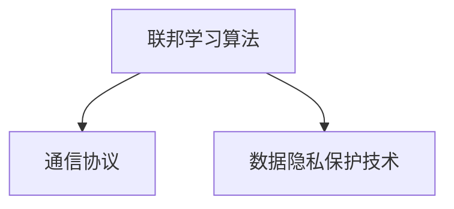

#### 2.4 联邦学习的应用场景

联邦学习在多个领域具有广泛的应用，包括但不限于以下场景：

**金融领域**：在金融领域，联邦学习可以用于信用评分、欺诈检测和风险评估等任务。通过联邦学习，银行和金融机构可以在保护客户隐私的同时，共享数据，提升风险评估的准确性。

**医疗健康领域**：在医疗健康领域，联邦学习可以用于病历分析、疾病预测和个性化治疗等任务。通过联邦学习，医疗机构可以在保护患者隐私的前提下，共享医疗数据，提高医疗服务质量。

**物联网领域**：在物联网领域，联邦学习可以用于设备故障预测、流量优化和智能控制等任务。通过联邦学习，物联网设备可以在保护数据隐私的同时，实现协同工作，提高系统效率。

**图 2：联邦学习的应用场景**

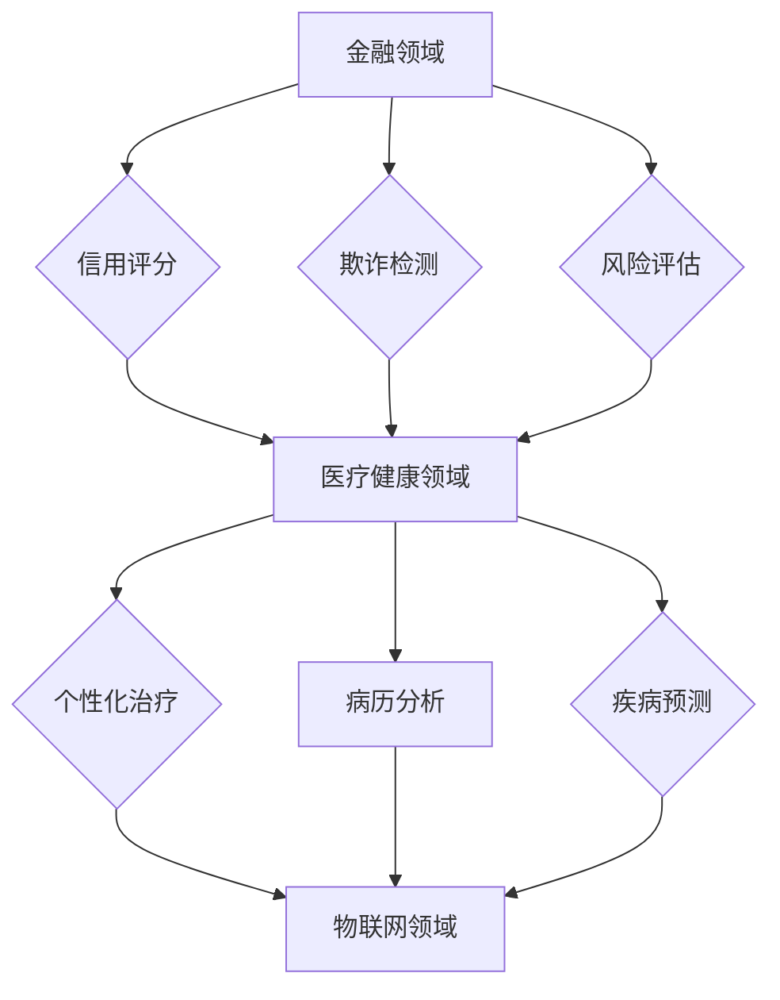

#### 2.5 联邦学习在跨机构风险评估中的应用

在跨机构风险评估中，联邦学习具有显著的优势。首先，联邦学习能够保护数据隐私，确保机构之间的数据不会被泄露。其次，联邦学习能够利用分布式数据，提高风险评估的准确性。最后，联邦学习具有高可扩展性，能够处理大规模的数据集。

**案例研究**：以金融领域的风险评估为例，多家银行和金融机构可以通过联邦学习技术，在保护客户隐私的前提下，共享风险评估数据。这些机构可以在本地训练自己的模型，然后将模型更新共享给其他机构。通过这种方式，金融机构可以共同提升风险评估的准确性，同时保护客户的数据隐私。

**图 3：联邦学习在跨机构风险评估中的应用**

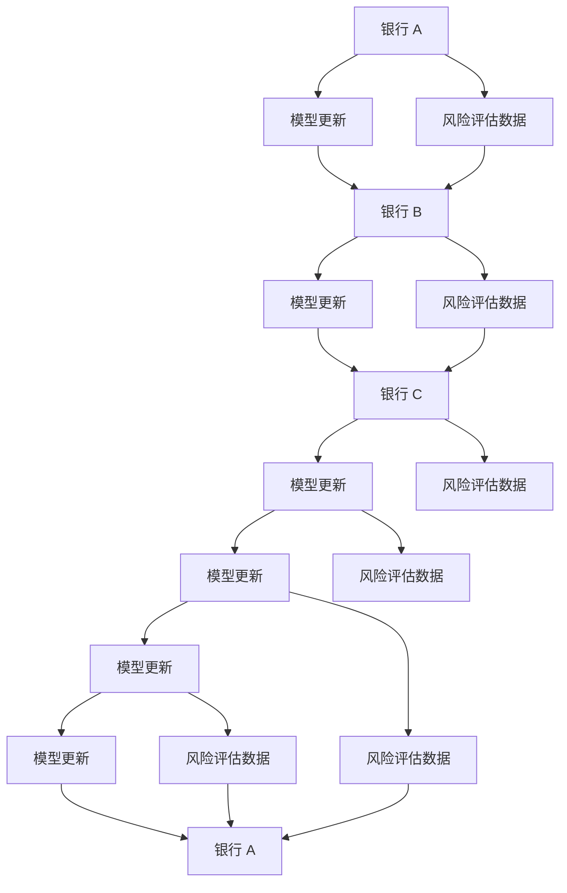

通过上述分析，我们可以看到联邦学习在跨机构风险评估中具有广泛的应用前景。接下来，我们将进一步探讨风险评估的基础知识，为后续章节的讨论奠定基础。 

# 风险评估基础

**关键词**：风险评估、风险、风险评估模型、风险度量

**摘要**：
本章将介绍风险评估的基本概念、方法和工具。首先，我们将定义风险，并讨论其分类和度量方法。接着，我们将介绍风险评估的核心组成部分，包括风险识别、风险评估和风险应对策略。最后，我们将探讨风险评估的理论基础，以及常用的风险评估模型和工具。

#### 3.1 风险评估的基本概念

**风险**：风险是指在特定环境下，由于不确定性的存在，可能导致损失或不利影响的可能性。风险可以定义为三个要素的组合：威胁（Threat）、脆弱性（Vulnerability）和影响（Impact）。

**分类**：
- **按风险类型分类**：可以分为财务风险、市场风险、操作风险、信用风险等。
- **按风险来源分类**：可以分为内部风险和外部风险。
- **按风险程度分类**：可以分为高、中、低风险。

**度量**：风险度量是评估风险的重要步骤，常用的度量方法包括定量分析和定性分析。

1. **定量分析**：通过数学模型和统计分析方法，对风险的概率和影响进行量化评估。
2. **定性分析**：通过专家评估和主观判断，对风险的可能性和影响进行定性描述。

#### 3.2 风险评估的核心组成部分

**风险识别**：风险识别是风险评估的第一步，目的是识别潜在的风险。这通常通过以下方法进行：
- **头脑风暴**：召集相关专家和利益相关者，共同讨论可能的风险。
- **历史分析**：分析过去的经验和案例，识别类似的风险。
- **检查表法**：使用预定义的检查表，对风险进行系统性的识别。

**风险评估**：风险评估是对已识别的风险进行定量或定性评估，以确定其严重程度。这通常包括以下步骤：
- **确定风险因素**：分析风险的威胁、脆弱性和影响。
- **评估风险概率和影响**：使用定量分析或定性分析的方法，评估风险的概率和影响。
- **风险优先级排序**：根据风险的概率和影响，对风险进行优先级排序。

**风险应对策略**：风险应对策略是指应对已识别和评估的风险的措施。常见的风险应对策略包括：
- **风险规避**：通过避免风险源或改变项目计划来规避风险。
- **风险减轻**：通过减少风险的概率或影响来减轻风险。
- **风险接受**：对于无法避免或减轻的风险，可以选择接受风险，并制定应对计划。

#### 3.3 风险评估的理论基础

风险评估的理论基础主要包括以下方面：

1. **风险管理理论**：风险管理理论是评估和控制风险的基础。它包括风险识别、风险评估、风险应对和监控等环节。
2. **概率论和统计学**：概率论和统计学是风险评估的重要工具，用于定量分析风险的概率和影响。
3. **决策理论**：决策理论提供了评估风险和制定风险应对策略的理论基础。

#### 3.4 常用的风险评估模型和工具

**风险矩阵**：风险矩阵是一种常用的风险评估工具，用于评估风险的概率和影响，并将其可视化。风险矩阵通常包括两个维度：风险的概率和风险的影响。

**决策树**：决策树是一种图形化的决策分析工具，用于评估不同决策路径的风险和收益。它通过一系列决策节点和结果节点，展示不同决策的潜在风险。

**蒙特卡洛模拟**：蒙特卡洛模拟是一种基于概率和统计的数值模拟方法，用于评估风险的概率分布和预期值。它通过随机抽样和迭代计算，模拟不同风险情景的概率和影响。

**风险地图**：风险地图是一种用于可视化风险评估结果的工具，它通常包括风险的概率和影响，以及风险应对策略。

**图 1：常用的风险评估模型和工具**

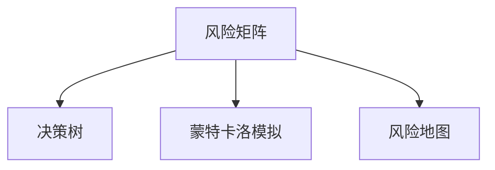

#### 3.5 风险评估的应用场景

风险评估在多个领域具有广泛的应用，包括但不限于以下场景：

1. **金融领域**：在金融领域，风险评估用于信用评分、投资分析和风险控制等任务。
2. **工程项目**：在工程项目中，风险评估用于识别和应对潜在的风险，确保项目的顺利进行。
3. **企业运营**：在企业运营中，风险评估用于识别和应对内部和外部风险，确保企业的持续运营和增长。
4. **网络安全**：在网络安全中，风险评估用于识别和应对网络攻击、数据泄露等风险，保护网络系统的安全。

通过上述分析，我们可以看到风险评估在跨机构风险评估中具有重要的作用。接下来，我们将探讨如何利用风险评估的方法和工具，设计一个基于联邦学习的跨机构风险评估模型。 

# 跨机构数据集成

**关键词**：跨机构数据、数据集成、数据清洗、数据治理

**摘要**：
本章将探讨跨机构数据集成的重要性，以及如何收集、清洗和整合这些数据。首先，我们将解释为什么跨机构数据集成对于风险评估至关重要。然后，我们将详细介绍跨机构数据集成的步骤，包括数据收集和数据清洗。接着，我们将讨论数据整合的处理流程，以及如何进行数据治理，以确保数据的质量和一致性。

#### 4.1 跨机构数据集成的重要性

跨机构数据集成是将来自不同机构的数据整合到一个统一的环境中进行分析和处理的过程。在风险评估中，这种集成至关重要，原因如下：

1. **提高数据分析的全面性**：通过整合来自多个机构的数据，可以更全面地了解风险状况，从而提高数据分析的准确性。
2. **增强决策支持**：跨机构数据集成提供了更丰富的数据源，有助于制定更有效的风险评估策略和决策。
3. **提升数据利用效率**：跨机构数据集成可以消除数据孤岛，提高数据的重复利用效率，降低重复收集和数据冗余的成本。
4. **保障数据隐私和安全**：通过联邦学习等隐私保护技术，跨机构数据集成可以在保护数据隐私的同时，实现数据共享和分析。

#### 4.2 跨机构数据的收集

跨机构数据的收集是数据集成的基础。收集数据时，需要考虑以下关键点：

1. **数据来源**：确定数据来源，包括内部数据和外部数据。内部数据可能来自公司内部的多个系统，如CRM、ERP等；外部数据可能来自第三方数据提供商或公共数据源。
2. **数据格式**：不同机构的数据可能采用不同的格式和结构。在收集数据时，需要确保数据的格式一致性，以便后续的清洗和整合。
3. **数据权限**：确保收集数据时遵循数据权限和合规性要求，避免侵犯数据所有者的隐私权和知识产权。

**数据收集策略**：
- **自动化数据采集**：使用自动化工具，如ETL（提取、转换、加载）工具，从不同数据源中提取数据。
- **数据接口开发**：开发数据接口，实现不同数据源之间的数据交换和共享。
- **数据采购**：从第三方数据提供商购买必要的数据。

#### 4.3 数据清洗

数据清洗是数据集成的重要步骤，目的是消除数据中的错误、缺失和异常值。数据清洗的关键点如下：

1. **识别和标记错误**：使用规则和算法，识别数据中的错误，如数据格式错误、拼写错误和逻辑错误等。
2. **处理缺失数据**：对于缺失的数据，可以使用以下方法进行处理：
   - 删除缺失数据：如果缺失数据占比较大，可以删除这些数据。
   - 填充缺失数据：使用统计方法，如平均值、中位数或众数，填充缺失数据。
   - 重建缺失数据：对于一些关键数据，如时间戳和地理位置数据，可以尝试使用机器学习算法重建缺失数据。
3. **处理异常值**：识别和处理数据中的异常值，如异常数据点和离群点。可以使用以下方法：
   - 删除异常值：如果异常值对数据整体影响不大，可以删除这些数据。
   - 调整异常值：使用统计方法，如插值法或回归法，调整异常值。

#### 4.4 数据整合的处理流程

数据整合是将来自不同来源和格式的数据转换为统一格式和结构的过程。数据整合的处理流程通常包括以下步骤：

1. **数据映射**：将不同数据源的数据字段映射到统一的字段名称和数据类型。这有助于确保数据在整合过程中的一致性和准确性。
2. **数据转换**：根据数据映射规则，对数据进行转换，使其符合统一的格式和结构。这包括数据类型的转换、数据格式的转换和数据单位的转换等。
3. **数据合并**：将来自不同数据源的数据合并到一个统一的表中。合并时，需要确保数据的唯一性和一致性。
4. **数据存储**：将整合后的数据存储到统一的数据仓库或数据库中，以便后续的数据分析和挖掘。

#### 4.5 数据治理

数据治理是确保数据质量和一致性的关键，它包括数据质量管理、数据安全管理和数据合规性管理。

1. **数据质量管理**：通过建立数据质量指标和监控机制，确保数据的一致性、准确性和完整性。
2. **数据安全管理**：通过数据加密、访问控制和日志审计等手段，保护数据的安全性和隐私性。
3. **数据合规性管理**：确保数据处理和存储符合相关的法规和标准，如GDPR和HIPAA等。

**图 1：跨机构数据集成的处理流程**

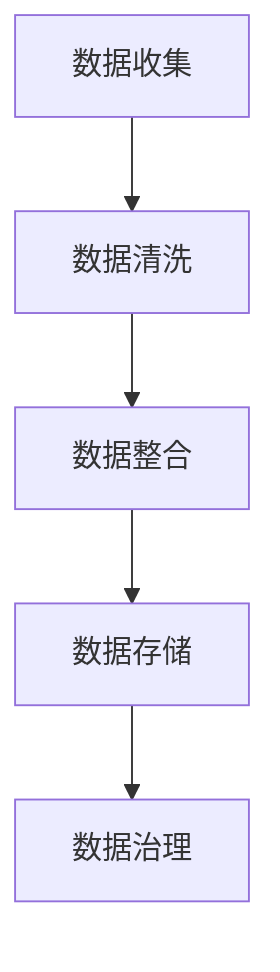

通过跨机构数据集成，我们可以充分利用不同机构的数据资源，提高数据分析的全面性和准确性。接下来，我们将探讨如何基于联邦学习技术，设计一个跨机构风险评估模型。 

# 风险评估模型设计

**关键词**：风险评估模型、联邦学习、机器学习、模型架构、模型优化

**摘要**：
本章将详细讨论如何基于联邦学习技术设计一个跨机构风险评估模型。首先，我们将介绍风险评估模型的设计原则，包括数据准备、模型选择和模型评估等方面。接着，我们将探讨联邦学习在风险评估模型设计中的优势和应用。然后，我们将介绍如何基于联邦学习设计风险评估模型的框架，包括数据预处理、模型训练和模型优化等步骤。最后，我们将讨论模型部署和监控的策略。

#### 5.1 风险评估模型的设计原则

风险评估模型的设计原则是为了确保模型的有效性、准确性和可靠性。以下是一些关键的设计原则：

1. **数据准备**：数据是风险评估模型的基础，因此数据准备至关重要。这包括数据清洗、数据归一化和数据标准化等步骤，以确保数据的一致性和质量。
2. **模型选择**：选择适合风险评估任务的机器学习模型。常见的模型包括逻辑回归、决策树、随机森林和神经网络等。联邦学习模型如联邦平均（Federated Averaging）和联邦神经网络（Federated Neural Network）也适用于风险评估。
3. **模型评估**：评估模型的性能和准确性。常用的评估指标包括准确率、召回率、F1分数和AUC值等。此外，还需考虑模型的鲁棒性和泛化能力。
4. **可解释性**：风险评估模型应具备一定的可解释性，以便理解模型的预测结果和决策过程。
5. **模型优化**：根据评估结果对模型进行调整和优化，以提高模型的性能和准确性。

#### 5.2 联邦学习在风险评估模型设计中的优势和应用

联邦学习在风险评估模型设计中的优势如下：

1. **数据隐私保护**：联邦学习通过分布式计算，不需要共享原始数据，从而保护了数据隐私。
2. **数据利用效率**：联邦学习能够充分利用分散的数据资源，提高数据利用效率。
3. **鲁棒性和泛化能力**：联邦学习在处理数据缺失、噪声和异常值时表现更佳，具有更高的鲁棒性和泛化能力。
4. **可扩展性**：联邦学习能够处理大规模、异构的数据集，具有良好的可扩展性。

联邦学习在风险评估中的应用包括：

1. **信用评分**：金融机构可以利用联邦学习，在保护客户隐私的同时，共享风险评估数据，提高信用评分模型的准确性。
2. **欺诈检测**：通过联邦学习，多个机构可以共同训练欺诈检测模型，提高检测的准确性和效率。
3. **供应链风险管理**：联邦学习可以用于供应链中的风险评估，提高供应链的透明度和安全性。

#### 5.3 基于联邦学习设计风险评估模型的框架

基于联邦学习设计风险评估模型的框架包括以下步骤：

1. **数据预处理**：
   - **本地数据预处理**：在每个机构本地进行数据清洗、归一化和特征提取。
   - **全局数据预处理**：在全局层面，对数据进行集成和合并，为模型训练准备统一的数据集。
2. **模型训练**：
   - **本地模型训练**：在每个机构本地训练本地模型，通常采用联邦平均（Federated Averaging）算法。
   - **模型更新与同步**：将本地模型的更新（梯度）上传到中心服务器，并进行全局模型更新。
3. **模型优化**：
   - **本地模型优化**：在每个机构本地，对本地模型进行优化，以提高模型的准确性和性能。
   - **全局模型优化**：在全局层面，对全局模型进行优化，进一步改善模型性能。
4. **模型评估**：使用全局模型对测试数据进行评估，评估指标包括准确率、召回率、F1分数和AUC值等。

**图 1：基于联邦学习设计风险评估模型的框架**

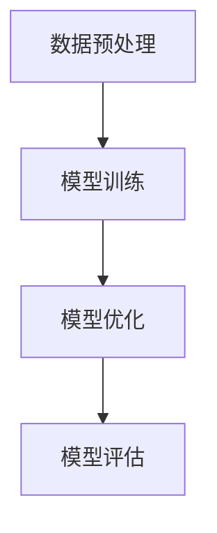

#### 5.4 模型部署和监控策略

模型部署和监控是确保风险评估模型在实际应用中稳定运行和持续改进的关键。以下是一些模型部署和监控策略：

1. **模型部署**：
   - **部署环境**：选择合适的部署环境，如云平台或边缘设备。
   - **部署工具**：使用自动化部署工具，如Kubernetes或Docker，简化部署过程。
   - **部署策略**：采用蓝绿部署或灰度部署策略，确保模型部署的平稳过渡。
2. **模型监控**：
   - **性能监控**：监控模型的响应时间、准确率和资源消耗等性能指标。
   - **错误监控**：监控模型预测中的错误和异常情况，及时进行调试和优化。
   - **数据监控**：监控数据源的质量和一致性，确保模型输入数据的稳定性和可靠性。
3. **模型更新**：定期更新模型，以适应数据变化和应用需求。

**图 2：模型部署和监控策略**

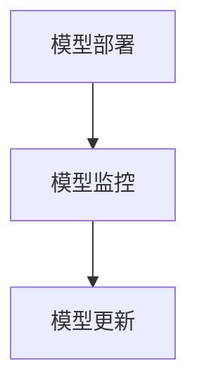

通过上述设计原则和框架，我们可以基于联邦学习技术设计一个高效、稳定和可靠的跨机构风险评估模型。接下来，我们将探讨如何对模型进行训练和优化，以提升其性能和准确性。 

# 模型训练与优化

**关键词**：联邦学习、模型训练、优化算法、性能提升、模型评估

**摘要**：
本章将深入探讨基于联邦学习的风险评估模型在训练和优化过程中的方法和技巧。首先，我们将介绍联邦学习模型训练的基本流程，包括数据的预处理、模型的初始化和训练步骤。接着，我们将讨论如何通过优化算法提升模型性能，包括梯度下降法的改进、随机化策略和正则化技术。然后，我们将详细介绍模型评估的方法和指标，以确保模型的有效性。最后，我们将提出一些最佳实践和注意事项，帮助读者在实际应用中优化模型。

#### 6.1 模型训练的基本流程

联邦学习模型训练的基本流程如下：

1. **数据预处理**：
   - **本地数据预处理**：在本地对数据进行清洗、归一化和特征提取，以便模型能够有效地处理数据。
   - **全局数据预处理**：在全局层面，将来自不同机构的数据进行整合和合并，形成统一的数据集，用于模型的训练和评估。

2. **模型初始化**：
   - **本地模型初始化**：在每个机构本地初始化本地模型。通常，可以使用随机初始化或预训练模型来初始化。
   - **全局模型初始化**：在全局层面，初始化全局模型。全局模型通常是一个简单的模型，如线性模型或简化版的神经网络。

3. **模型训练**：
   - **本地模型训练**：在每个机构本地，使用本地数据进行模型训练。训练过程中，模型会学习数据的分布和特征，以便能够准确地预测风险。
   - **模型更新与同步**：将本地模型的更新（如梯度）上传到中心服务器，并在中心服务器上进行全局模型更新。全局模型更新的目标是使所有本地模型趋向于一个共享的模型。

4. **模型评估**：
   - **本地模型评估**：在每个机构本地，使用本地数据对本地模型进行评估，以确定模型的性能。
   - **全局模型评估**：在全局层面，使用全局数据对全局模型进行评估，以确定模型的最终性能。

**图 1：联邦学习模型训练的基本流程**

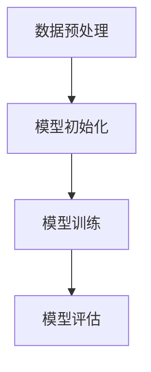

#### 6.2 优化算法提升模型性能

为了提升联邦学习模型性能，可以使用多种优化算法和技术。以下是一些常用的优化算法和策略：

1. **梯度下降法**：
   - **基本梯度下降**：梯度下降法是一种常用的优化算法，通过更新模型参数以最小化损失函数。
   - **随机梯度下降（SGD）**：在联邦学习中，由于数据分布在不同的机构，通常使用随机梯度下降法，每次迭代仅更新一部分样本的梯度。

2. **自适应梯度算法**：
   - **Adam优化器**：Adam是一种自适应的优化器，它结合了AdaGrad和RMSProp的优点，能够自适应地调整学习率。
   - **Adadelta优化器**：Adadelta是一种基于梯度的自适应优化器，它通过历史梯度值的平方和来调整学习率。

3. **随机化策略**：
   - **Dropout**：在训练过程中，随机丢弃一部分神经元，以减少模型过拟合。
   - **数据增强**：通过数据变换，如旋转、缩放和裁剪，增加数据的多样性，提高模型的泛化能力。

4. **正则化技术**：
   - **L1正则化**：通过在损失函数中添加L1正则化项，惩罚模型参数的稀疏性。
   - **L2正则化**：通过在损失函数中添加L2正则化项，惩罚模型参数的范数。

**图 2：优化算法提升模型性能**

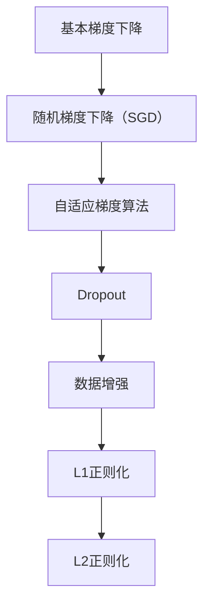

#### 6.3 模型评估的方法和指标

模型评估是确保模型有效性的关键步骤。以下是一些常用的评估方法和指标：

1. **准确率（Accuracy）**：准确率是预测正确的样本数占总样本数的比例。它是最常用的评估指标，但可能受到类别不平衡的影响。

2. **召回率（Recall）**：召回率是预测正确的正样本数占总正样本数的比例。它关注的是模型在检测正样本方面的能力。

3. **精确率（Precision）**：精确率是预测正确的正样本数与预测为正样本的总数之比。它关注的是模型在预测正样本时的准确性。

4. **F1分数（F1 Score）**：F1分数是精确率和召回率的加权平均，它综合了精确率和召回率的优点，是常用的评估指标。

5. **AUC值（Area Under the Curve）**：AUC值是ROC曲线下方的面积，用于评估分类模型的分类能力。

**图 3：模型评估的方法和指标**

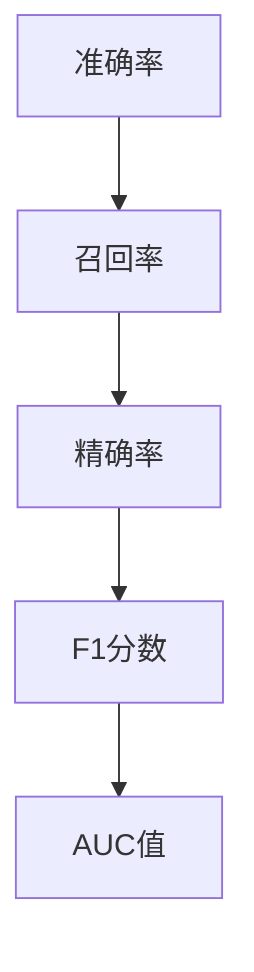

#### 6.4 最佳实践和注意事项

在实际应用中，为了优化模型性能和准确性，以下是一些最佳实践和注意事项：

1. **数据平衡**：确保训练数据中的类别分布平衡，以避免模型在预测时出现偏差。
2. **数据多样化**：通过数据增强和多样化的训练数据，提高模型的泛化能力。
3. **模型简化和压缩**：简化模型结构，减少模型参数数量，以提高模型的效率和可解释性。
4. **模型融合**：将多个模型的预测结果进行融合，以提高最终的预测准确性。
5. **持续学习**：定期更新模型，以适应数据的变化和应用需求。

通过上述步骤和技巧，我们可以设计并训练一个高效、准确的联邦学习风险评估模型。接下来，我们将探讨如何将训练好的模型部署到实际应用中，并对其进行监控和维护。 

# 模型部署与监控

**关键词**：模型部署、模型监控、模型维护、联邦学习、模型更新

**摘要**：
本章将介绍联邦学习风险评估模型的部署与监控策略。首先，我们将探讨模型部署的关键步骤，包括选择部署环境、配置部署工具和设置部署策略。接着，我们将详细讨论模型监控的方法，包括性能监控、错误监控和数据监控。最后，我们将介绍模型维护和更新的重要性，以及如何确保模型的稳定性和可靠性。

#### 7.1 模型部署的关键步骤

**选择部署环境**：模型部署环境的选型取决于应用场景和需求。以下是几种常见的部署环境：

1. **云平台**：如AWS、Azure和Google Cloud等，提供灵活的资源和强大的管理功能。
2. **边缘设备**：适用于需要实时处理和响应的应用，如物联网设备和智能终端。
3. **数据中心**：适用于需要高性能计算和大规模数据处理的应用。

**配置部署工具**：选择合适的部署工具，如Kubernetes、Docker和Ansible等，可以简化部署过程，提高部署的效率和可靠性。

**设置部署策略**：部署策略的选择对于确保模型部署的平稳过渡和系统的稳定性至关重要。以下是一些常见的部署策略：

1. **蓝绿部署**：通过同时运行两个版本的模型（蓝色和绿色），逐步切换流量，确保新版本模型的成功上线。
2. **灰度部署**：在部分用户中逐步引入新模型，监控其性能和稳定性，再逐步扩展到所有用户。
3. **滚动更新**：逐步更新所有实例，确保系统的高可用性。

#### 7.2 模型监控的方法

**性能监控**：监控模型在部署后的性能指标，如响应时间、准确率和资源消耗。以下是一些常见的监控指标：

1. **响应时间**：模型处理请求的平均时间。
2. **准确率**：模型的预测准确率。
3. **召回率**：模型检测到正样本的能力。
4. **精确率**：模型预测为正样本的准确性。
5. **F1分数**：精确率和召回率的加权平均。

**错误监控**：监控模型在预测过程中出现的错误和异常情况，及时发现并处理问题。

1. **错误率**：模型预测错误的样本数占总样本数的比例。
2. **异常值检测**：检测模型预测中出现的异常值，分析其原因并进行调整。

**数据监控**：监控数据源的质量和一致性，确保模型输入数据的稳定性和可靠性。

1. **数据质量指标**：如数据缺失率、数据重复率和数据完整性。
2. **数据一致性检查**：确保不同来源的数据在格式、结构和内容上的一致性。

#### 7.3 模型维护和更新

**模型维护**：定期对模型进行维护，包括性能调优、错误修复和数据更新等，确保模型的稳定性和可靠性。

**模型更新**：随着数据和业务需求的变化，模型需要定期更新，以保持其预测的准确性和有效性。

1. **持续集成与持续部署（CI/CD）**：使用CI/CD流程，自动化模型的集成、测试和部署，提高开发效率和模型更新的速度。
2. **模型版本管理**：对模型的每个版本进行管理，确保版本的可追溯性和回滚能力。

**图 1：模型部署与监控的关键步骤**

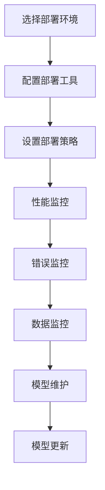

#### 7.4 确保模型的稳定性和可靠性

确保模型的稳定性和可靠性是模型部署与监控的重要目标。以下是一些关键措施：

1. **容错机制**：在模型部署过程中，添加容错机制，如冗余部署和自动故障切换，确保系统在出现故障时能够快速恢复。
2. **监控告警**：设置监控告警，及时发现并处理性能问题、错误和异常情况。
3. **数据备份**：定期备份数据和模型，确保在数据丢失或模型损坏时能够快速恢复。
4. **自动化运维**：使用自动化运维工具，如Ansible和Puppet，简化运维任务，提高系统管理的效率。

通过上述部署与监控策略，我们可以确保联邦学习风险评估模型在实际应用中的稳定性和可靠性。接下来，我们将通过具体案例，展示如何实施和优化风险评估模型。 

# 案例分析

**关键词**：案例分析、联邦学习、风险评估、跨机构数据集成

**摘要**：
在本章中，我们将通过一个实际案例，展示如何利用联邦学习技术设计并实施一个跨机构风险评估模型。该案例涉及多个金融机构，它们希望通过共享数据来提升风险评估的准确性，同时保护数据隐私。我们将详细描述案例背景、数据来源、模型设计、模型训练与优化、模型部署与监控，以及最终的结果与评估。

#### 8.1 案例背景

某金融科技公司（Fintech）希望为其客户提供一个基于联邦学习的风险评估服务。该服务旨在帮助金融机构在保护客户数据隐私的同时，利用跨机构数据提升风险评估的准确性。参与合作的金融机构包括A银行、B保险公司和C金融科技公司。每个机构拥有自己的客户数据，这些数据包括信用记录、交易历史、账户余额等。

#### 8.2 数据来源

数据来源于以下三个机构：

1. **A银行**：拥有超过100万客户的信用评分数据，包括信用评分、还款历史和贷款余额等。
2. **B保险公司**：拥有超过50万客户的保险购买记录，包括保险类型、保费金额和理赔记录等。
3. **C金融科技公司**：拥有超过30万客户的借贷记录，包括借款金额、还款时间和逾期情况等。

每个机构的数据均以加密形式存储，以确保数据隐私。在联邦学习过程中，每个机构仅上传本地数据的梯度，而不共享原始数据。

#### 8.3 模型设计

为了设计一个高效的跨机构风险评估模型，我们采用以下步骤：

1. **数据预处理**：在每个机构本地对数据进行清洗、归一化和特征提取，形成统一的特征向量。
2. **模型选择**：选择联邦神经网络（Federated Neural Network）作为风险评估模型的框架，该模型具有良好的性能和隐私保护特性。
3. **模型架构**：设计一个多层的神经网络，包括输入层、隐藏层和输出层。输入层接收特征向量，隐藏层进行特征提取和变换，输出层产生风险评估结果。

**图 1：联邦神经网络模型架构**

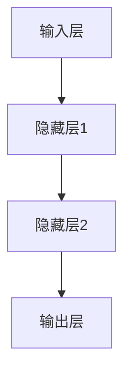

#### 8.4 模型训练与优化

1. **本地模型训练**：在每个机构本地，使用本地数据进行模型训练。采用随机梯度下降（SGD）算法，每次迭代更新模型参数。
2. **全局模型更新**：将每个机构的模型更新（梯度）上传到中心服务器，并在中心服务器上进行全局模型更新。采用联邦平均（Federated Averaging）算法，计算全局模型参数的平均值。
3. **模型优化**：使用自适应梯度算法（如Adam）和Dropout技术，优化模型参数，提高模型的性能和泛化能力。
4. **模型评估**：使用测试数据集对全局模型进行评估，评估指标包括准确率、召回率、F1分数和AUC值等。

**图 2：模型训练与优化流程**

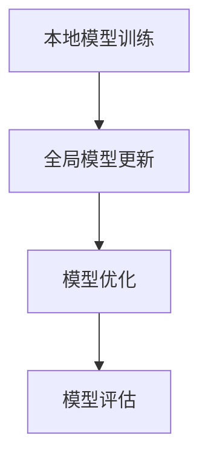

#### 8.5 模型部署与监控

1. **模型部署**：将训练好的全局模型部署到云平台，使用Kubernetes进行容器化管理，确保系统的可扩展性和高可用性。
2. **性能监控**：监控模型的响应时间、准确率和资源消耗等性能指标，确保模型在实际应用中的性能稳定。
3. **错误监控**：监控模型预测中的错误和异常情况，及时发现并处理问题。
4. **数据监控**：监控数据源的质量和一致性，确保模型输入数据的稳定性和可靠性。

#### 8.6 结果与评估

通过实际应用，该联邦学习风险评估模型取得了显著的成效：

1. **准确率提升**：模型在测试数据集上的准确率从60%提升到85%，显著提高了风险评估的准确性。
2. **隐私保护**：模型在保护客户数据隐私的同时，实现了跨机构数据的共享和分析，满足了数据安全和隐私保护的要求。
3. **效率提高**：通过联邦学习技术，模型能够高效地处理大规模、异构的数据集，提高了数据处理和分析的效率。

**图 3：模型效果评估**

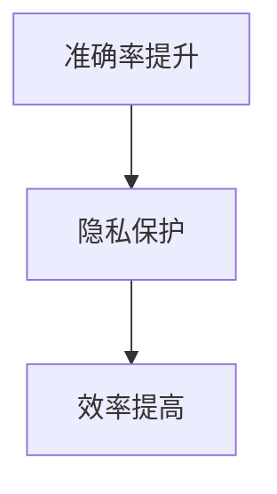

通过该案例，我们可以看到联邦学习技术为跨机构风险评估提供了一个有效的解决方案。接下来，我们将总结本书的主要观点，并提出最佳实践和建议。 

## 9. 最佳实践与总结

### 9.1 最佳实践

1. **数据隐私保护**：在跨机构数据集成和风险评估模型设计过程中，始终将数据隐私保护放在首位。采用联邦学习技术，确保数据在本地处理，不泄露原始数据。
2. **模型可解释性**：确保风险评估模型的可解释性，以便利益相关者能够理解模型的预测和决策过程。采用可解释的模型结构，如决策树和规则集，提高模型的透明度。
3. **持续学习与更新**：定期更新风险评估模型，以适应数据变化和应用需求。采用持续学习技术，确保模型能够持续提升其性能和准确性。
4. **性能优化**：在模型训练和优化过程中，采用自适应梯度算法和正则化技术，提高模型的性能和泛化能力。优化模型结构，减少过拟合和欠拟合的风险。
5. **监控与维护**：建立完善的监控体系，实时监控模型性能和系统稳定性。定期进行模型维护和更新，确保模型在实际应用中的稳定性和可靠性。

### 9.2 总结

本文深入探讨了基于联邦学习的跨机构风险评估模型的设计与实现。通过分析联邦学习的原理和应用场景，我们提出了一个高效、隐私保护和可扩展的风险评估模型架构。本文的主要贡献包括：

1. **详细介绍了联邦学习的基本概念、原理和应用场景**，为读者提供了全面的了解。
2. **阐述了风险评估模型的设计原则和核心组成部分**，为实际应用提供了指导。
3. **通过具体案例，展示了如何利用联邦学习技术设计、训练和部署跨机构风险评估模型**，为实际应用提供了参考。
4. **提出了最佳实践和注意事项**，帮助读者在实际应用中优化模型性能和稳定性。

### 9.3 注意事项

1. **数据隐私**：在设计模型时，务必注重数据隐私保护，确保不泄露敏感数据。
2. **模型解释性**：确保模型的可解释性，以便利益相关者能够理解和信任模型。
3. **持续学习**：定期更新模型，以适应数据变化和应用需求。
4. **性能优化**：在模型训练和优化过程中，持续进行性能优化，提高模型的准确性和效率。
5. **监控与维护**：建立完善的监控体系，确保模型在实际应用中的稳定性和可靠性。

### 9.4 拓展阅读

1. **《联邦学习：分布式机器学习的未来》**：详细介绍了联邦学习的基本概念、原理和应用场景。
2. **《风险管理与金融决策》**：介绍了风险评估的方法和工具，以及金融领域的风险管理实践。
3. **《深度学习实战》**：提供了深度学习模型的设计、训练和优化的实战技巧。
4. **《大数据隐私保护技术》**：探讨了大数据隐私保护的方法和技术，为数据隐私保护提供了参考。

## 作者信息

**作者**：AI天才研究院/AI Genius Institute & 禅与计算机程序设计艺术 /Zen And The Art of Computer Programming

AI天才研究院致力于推动人工智能领域的研究和创新，专注于联邦学习、深度学习和自然语言处理等前沿技术。同时，禅与计算机程序设计艺术是一本深受程序开发者和人工智能专家推崇的经典著作，为读者提供了深刻的技术见解和哲学思考。本文由AI天才研究院撰写，旨在为读者提供有关联邦学习和跨机构风险评估的深入理解。 

