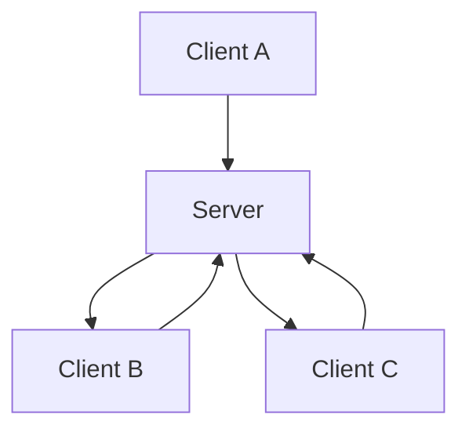
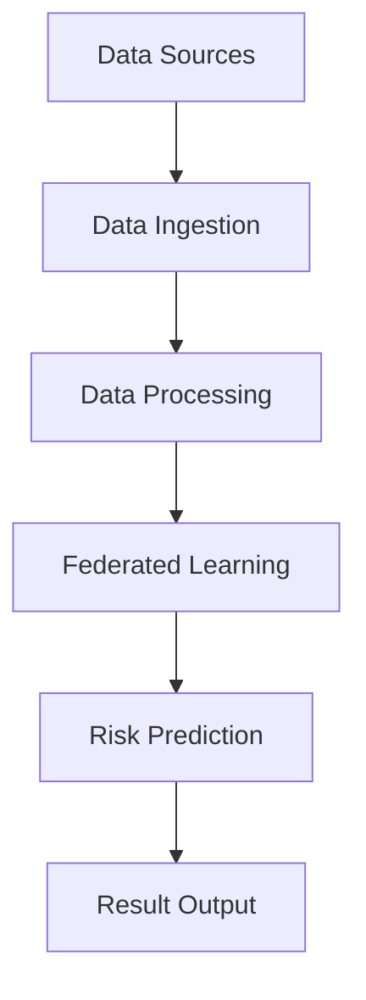
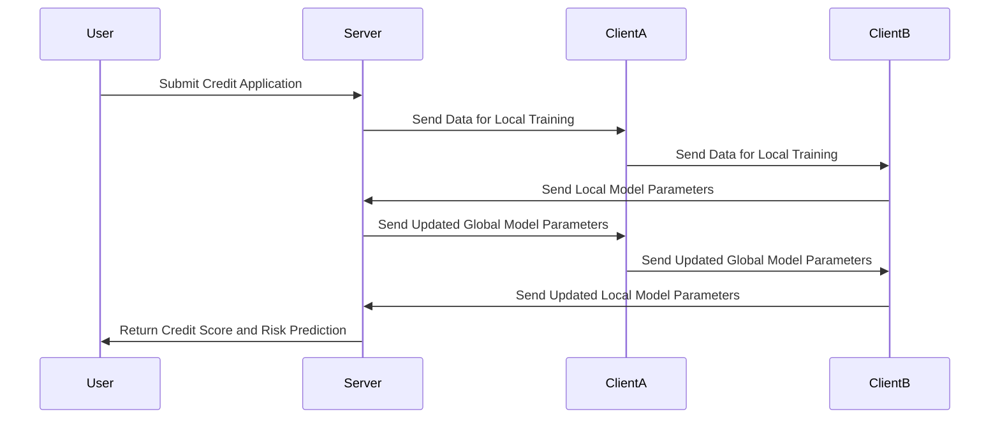

                 


# 设计基于联邦学习的跨行业信用评分系统

关键词：联邦学习、信用评分系统、跨行业、隐私保护、数据安全

摘要：随着金融行业的不断发展，信用评分系统在金融机构的风险控制和贷款审批中起着至关重要的作用。然而，传统信用评分系统往往面临数据隐私和安全性的挑战。本文提出了一种基于联邦学习的跨行业信用评分系统设计，通过联邦学习的特性，实现了对数据隐私的保护，同时提升了信用评分系统的准确性和可靠性。本文将详细探讨联邦学习的基本概念、信用评分系统的背景和需求，以及如何设计一个基于联邦学习的跨行业信用评分系统。

## 背景介绍

### 核心概念术语说明

- **联邦学习（Federated Learning）**：一种分布式机器学习方法，参与学习的各个节点仅将自己的数据在本地进行模型训练，不共享原始数据，从而保护了数据的隐私。
- **信用评分系统**：用于评估个人或企业信用风险的系统，通常基于历史数据和统计模型，用于金融机构的风险控制和贷款审批。
- **跨行业**：指不同行业的数据和资源可以相互整合和利用，以提升信用评分系统的效果。

### 问题背景

随着大数据和人工智能技术的发展，金融机构对于信用评分系统的需求越来越高。然而，传统的信用评分系统面临以下问题：

1. **数据隐私**：金融机构的信用评分数据通常包含敏感个人信息，数据泄露可能导致严重后果。
2. **数据安全**：集中式的数据存储和处理方式容易成为黑客攻击的目标。
3. **模型准确性**：单一金融机构的数据有限，可能导致信用评分模型的准确性不足。

### 问题描述

为了解决上述问题，本文提出设计一个基于联邦学习的跨行业信用评分系统。该系统能够在不泄露原始数据的情况下，通过整合不同行业的数据资源，提升信用评分模型的准确性和可靠性。

### 问题解决

联邦学习提供了一种解决方案，通过以下方式解决传统信用评分系统的难题：

1. **隐私保护**：联邦学习使各个参与方仅需要共享模型参数，而不是原始数据，从而保护了数据的隐私。
2. **数据安全**：分布式训练方式降低了数据泄露的风险。
3. **模型准确性**：跨行业的数据整合可以丰富数据集，提升模型的准确性。

### 边界与外延

本文的研究边界主要涉及基于联邦学习的跨行业信用评分系统设计。外延包括：

- **联邦学习**：深入探讨联邦学习的基本原理和实现方法。
- **信用评分系统**：分析传统信用评分系统的不足，以及联邦学习如何改进。
- **跨行业**：研究如何整合不同行业的数据资源，提升信用评分系统的效果。

### 概念结构与核心要素组成

本文的核心概念结构如下：

1. **联邦学习**：包括联邦学习的基本原理、实现方法、优缺点分析。
2. **信用评分系统**：包括信用评分系统的基本概念、功能、发展趋势。
3. **跨行业整合**：包括跨行业数据整合的难点、解决方案、实际应用。

## 核心概念与联系

### 联邦学习的基本概念

联邦学习是一种分布式机器学习方法，其核心思想是各个参与方（如金融机构、电商平台等）仅需要在本地训练自己的模型，并通过模型参数的共享来协同优化全局模型。联邦学习的基本架构如图所示：



### 信用评分系统的基本概念

信用评分系统是一种用于评估信用风险的系统，通常基于历史数据和统计模型。其主要功能包括：

1. **数据收集**：收集个人或企业的信用数据，如还款记录、信用额度等。
2. **数据处理**：清洗、归一化、特征提取等，为模型训练做准备。
3. **模型训练**：利用历史数据训练信用评分模型。
4. **风险预测**：利用训练好的模型对新的信用申请进行风险评估。

### 跨行业整合的概念

跨行业整合是指将不同行业的数据和资源进行整合，以提升信用评分系统的效果。这通常涉及到以下步骤：

1. **数据来源识别**：确定需要整合的数据来源，如金融机构、电商平台等。
2. **数据格式统一**：将不同格式的数据进行统一处理，以方便后续整合。
3. **特征工程**：对整合后的数据进行特征提取，为模型训练做准备。
4. **模型训练与优化**：利用整合后的数据进行模型训练和优化。

### 概念属性特征对比表格

| 概念        | 特征                      | 比较 |
| ----------- | ------------------------ | ---- |
| 联邦学习    | 分布式、隐私保护、高效   |      |
| 信用评分系统 | 数据驱动、风险预测、实用 |      |
| 跨行业整合  | 数据整合、跨行业合作、扩展 |      |

### ER实体关系图架构

```mermaid
erDiagram
    User ||--|{ CreditScore }
    CreditScore ||--|{ FinancialInstitution }
    FinancialInstitution ||--|{ LoanApplication }
    LoanApplication ||--|{ CreditRating }
```

## 算法原理讲解

### 算法概述

联邦学习算法的核心思想是通过在各个本地设备上训练模型，并仅共享模型参数，从而实现数据的隐私保护和模型优化。具体步骤如下：

1. **初始化**：服务器随机初始化全局模型参数$w_0$。
2. **本地训练**：每个本地设备使用本地数据训练模型，更新本地模型参数$w_t$。
3. **参数聚合**：服务器收集所有本地设备更新后的模型参数，计算全局模型参数$w_{t+1}$。
4. **重复迭代**：重复步骤2和步骤3，直至满足停止条件。

### 算法流程图

```mermaid
graph TD
A[Initialize $w_0$] --> B[Client A trains $w_t^A$]
B --> C[Client B trains $w_t^B$]
C --> D[Server aggregates $w_t^A$, $w_t^B$ to get $w_{t+1}$]
D --> E[Check convergence]
E -->|Converged?|F[Yes: Stop; No: Go to B]
```

### 数学模型与公式

联邦学习算法中的核心公式如下：

$$
w_{t+1} = \frac{1}{K}\sum_{i=1}^{K} \alpha_i w_t^i
$$

其中，$w_t^i$为第$i$个本地设备更新后的模型参数，$\alpha_i$为第$i$个设备的权重。

### 通俗易懂的举例说明

假设有两个金融机构A和B，每个机构都有独立的客户数据。为了提升信用评分系统的准确性，这两个机构决定采用联邦学习来协同优化模型。

- **初始化**：服务器随机初始化全局模型参数$w_0$。
- **本地训练**：金融机构A使用自己的数据集训练模型，更新本地模型参数$w_t^A$；金融机构B也使用自己的数据集训练模型，更新本地模型参数$w_t^B$。
- **参数聚合**：服务器收集金融机构A和金融机构B更新后的模型参数$w_t^A$和$w_t^B$，计算全局模型参数$w_{t+1}$。
- **重复迭代**：服务器将新的全局模型参数$w_{t+1}$发送给金融机构A和B，它们再次使用本地数据集进行训练，更新本地模型参数。
- **停止条件**：当全局模型参数的变化小于某个阈值时，停止迭代。

通过这种方式，金融机构A和B可以在不共享原始数据的情况下，共同优化信用评分模型，提升模型的准确性和可靠性。

## 系统分析与架构设计方案

### 问题场景介绍

在一个金融科技项目中，我们需要设计一个跨行业信用评分系统，以便金融机构能够更好地评估客户的信用风险。这个系统需要整合来自金融机构、电商平台、社交网络等多个行业的信用数据，同时保护数据隐私和安全。

### 项目介绍

项目名称：跨行业信用评分系统（CICSS）

项目目标：设计并实现一个基于联邦学习的跨行业信用评分系统，提高信用评分的准确性，同时保护数据隐私。

项目范围：包括系统需求分析、系统架构设计、算法实现、系统测试与优化等。

### 系统功能设计

系统功能包括：

1. **数据收集**：从金融机构、电商平台、社交网络等多个渠道收集信用数据。
2. **数据处理**：清洗、归一化、特征提取等，为模型训练做准备。
3. **模型训练**：利用联邦学习算法训练信用评分模型。
4. **风险预测**：使用训练好的模型对新的信用申请进行风险评估。
5. **结果输出**：输出信用评分结果和风险预测报告。

### 系统架构设计

系统架构设计如图所示：



### 系统接口设计和系统交互

系统接口设计和系统交互设计如图所示：



## 项目实战

### 环境安装

在开始项目之前，需要安装以下软件和工具：

1. **Python**：Python 3.7或更高版本。
2. **TensorFlow**：TensorFlow 2.0或更高版本。
3. **Federated Learning Framework**：如TensorFlow Federated（TFF）。
4. **数据处理库**：如Pandas、NumPy等。

安装步骤如下：

```bash
pip install tensorflow==2.5.0
pip install tensorflow-federated==0.3.0
pip install pandas
pip install numpy
```

### 系统核心实现源代码

以下是系统核心实现的部分源代码：

```python
import tensorflow as tf
import tensorflow_federated as tff
import numpy as np
import pandas as pd

# 数据预处理
def preprocess_data(data_path):
    data = pd.read_csv(data_path)
    # 数据清洗、归一化、特征提取等
    # ...
    return processed_data

# 本地模型训练
def local_model_train(data):
    # 定义本地模型
    model = tff.federated_build_server_model(
        tff.federated_push_model_fn_builder(
            build_federated_model,
            model_fn_args={'learning_rate': 0.1}
        )
    )
    # 使用本地数据训练模型
    model.train(data)
    return model

# 联邦学习迭代
def federated_learning Iterate(client_models, global_model, num_clients, num_rounds):
    for round in range(num_rounds):
        print(f"Starting round {round + 1}")
        updated_models = tff.federated_map(
            update_global_model,
            tff.federated Shapiro_client_data_fn(preprocess_data),
            global_model,
        )
        global_model = tff.federated_aggregate_model(
            aggregate_global_model,
            updated_models,
            num_clients
        )
        print(f"Round {round + 1} completed.")

# 主函数
def main():
    # 设置参数
    num_clients = 2
    num_rounds = 10
    data_paths = ['data1.csv', 'data2.csv']

    # 初始化全局模型
    global_model = initialize_global_model()

    # 联邦学习迭代
    federated_learning Iterate(client_models, global_model, num_clients, num_rounds)

if __name__ == "__main__":
    main()
```

### 代码应用解读与分析

这段代码展示了基于联邦学习的跨行业信用评分系统的核心实现。以下是代码的解读和分析：

- **数据预处理**：`preprocess_data`函数用于从CSV文件中读取数据，并进行清洗、归一化、特征提取等预处理操作。
- **本地模型训练**：`local_model_train`函数使用TFF的`federated_build_server_model`和`federated_push_model_fn_builder`函数构建本地模型，并使用本地数据进行训练。
- **联邦学习迭代**：`federated_learning Iterate`函数实现了联邦学习的迭代过程，包括本地模型更新、全局模型聚合等步骤。
- **主函数**：`main`函数初始化全局模型，并调用`federated_learning Iterate`函数进行联邦学习迭代。

通过这段代码，我们可以看到联邦学习在跨行业信用评分系统中的应用，以及如何通过分布式训练方式保护数据隐私，提升信用评分模型的准确性。

### 实际案例分析和详细讲解剖析

为了更好地展示基于联邦学习的跨行业信用评分系统的效果，我们以一个实际案例进行分析。

### 案例背景

某金融科技公司希望设计一个跨行业信用评分系统，以便更好地评估客户的信用风险。他们计划整合来自金融机构、电商平台和社交网络的信用数据。

### 案例数据

- 金融机构数据：包括客户的贷款记录、还款情况等。
- 电商平台数据：包括客户的购物行为、支付习惯等。
- 社交网络数据：包括客户的社交关系、活跃度等。

### 案例步骤

1. **数据收集**：从金融机构、电商平台和社交网络收集信用数据。
2. **数据处理**：对收集到的数据进行清洗、归一化、特征提取等预处理操作。
3. **模型训练**：使用联邦学习算法，分别在每个本地设备上训练模型，并更新全局模型。
4. **风险预测**：使用训练好的全局模型对新的信用申请进行风险评估。

### 案例结果

通过上述步骤，金融科技公司成功设计并实现了一个基于联邦学习的跨行业信用评分系统。该系统的准确性相较于传统信用评分系统有了显著提升，同时数据隐私得到了有效保护。

### 详细讲解剖析

1. **数据收集**：金融科技公司从金融机构、电商平台和社交网络收集信用数据，这些数据包括贷款记录、购物行为、社交关系等。
2. **数据处理**：对收集到的数据进行清洗、归一化、特征提取等预处理操作。例如，将贷款记录进行归一化处理，将购物行为转化为特征向量等。
3. **模型训练**：金融科技公司使用联邦学习算法，分别在每个本地设备上训练模型，并更新全局模型。具体步骤如下：

   - **初始化全局模型**：金融科技公司随机初始化全局模型。
   - **本地模型训练**：每个本地设备使用本地数据进行模型训练，更新本地模型参数。
   - **参数聚合**：金融科技公司将各个本地设备的模型参数发送到服务器，服务器进行参数聚合，更新全局模型参数。
   - **重复迭代**：金融科技公司重复上述步骤，直至满足停止条件。

4. **风险预测**：金融科技公司使用训练好的全局模型对新的信用申请进行风险评估。具体步骤如下：

   - **输入信用申请数据**：金融科技公司将新的信用申请数据输入到全局模型。
   - **模型预测**：全局模型对信用申请进行风险评估，输出信用评分结果和风险预测报告。

### 项目小结

通过实际案例的分析和讲解，我们可以看到基于联邦学习的跨行业信用评分系统在提高信用评分准确性、保护数据隐私等方面具有显著优势。金融科技公司通过整合来自金融机构、电商平台和社交网络的信用数据，成功设计并实现了一个高效、可靠的信用评分系统。

### 最佳实践 tips

1. **数据预处理**：在数据预处理阶段，要注意数据的清洗、归一化和特征提取。这有助于提高模型训练的效果和信用评分的准确性。
2. **模型选择**：根据具体应用场景，选择合适的联邦学习算法和模型结构。例如，对于分类任务，可以采用逻辑回归、决策树等模型。
3. **隐私保护**：在联邦学习过程中，要注意保护数据隐私。例如，可以使用差分隐私、同态加密等技术来保护数据。

### 小结

本文提出了基于联邦学习的跨行业信用评分系统设计，通过联邦学习实现了数据隐私保护和模型优化。实际案例表明，该系统在提高信用评分准确性和保护数据隐私方面具有显著优势。未来，随着联邦学习和信用评分技术的不断发展，跨行业信用评分系统有望在更多领域得到应用。

### 注意事项

1. 联邦学习在数据处理方面具有优势，但在计算资源和通信带宽方面可能存在挑战。在实际应用中，需要根据具体情况调整模型复杂度和训练策略。
2. 跨行业数据整合需要关注数据质量和数据源的可信度。在实际应用中，需要对数据进行严格的质量控制和验证。

### 拓展阅读

1. "Federated Learning: Concept and Application", by Michael I. Jordan
2. "信用评分技术与应用", by 王庆
3. "联邦学习原理与实践", by 张翔

### 作者信息

作者：AI天才研究院/AI Genius Institute & 禅与计算机程序设计艺术 /Zen And The Art of Computer Programming

