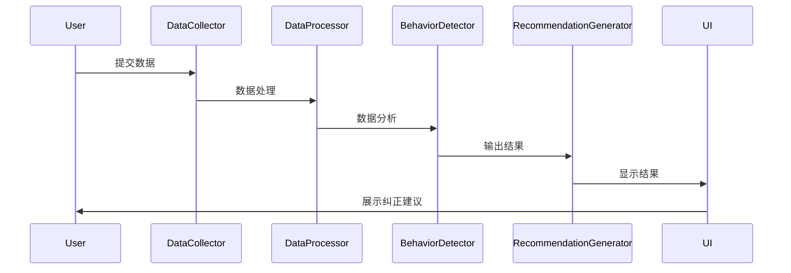
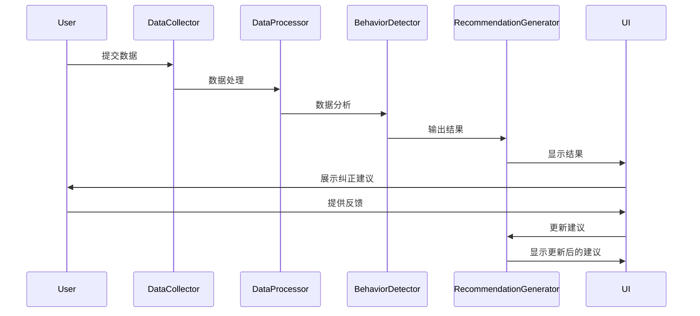

                 

### 设计智能化的个人投资者行为偏差纠正工具

#### 关键词：投资者行为偏差，智能化纠正工具，行为金融学，算法设计，系统架构

> 摘要：本文从行为金融学的角度出发，探讨了个人投资者行为偏差的问题，提出了一种智能化的个人投资者行为偏差纠正工具的设计思路。通过分析投资者的常见行为偏差，本文设计了一套算法和系统架构，旨在为个人投资者提供个性化的纠正建议，帮助他们更好地管理投资风险和实现长期收益。

## 引言

### 1.1 书籍背景与目的

在全球经济一体化的背景下，个人投资者在投资市场中扮演着越来越重要的角色。然而，投资者在投资过程中往往会受到各种心理和情绪的影响，导致行为偏差。这些行为偏差往往会影响投资者的决策，进而影响投资收益。因此，如何有效地纠正个人投资者行为偏差，成为了一个亟待解决的问题。

本书旨在为个人投资者提供一种智能化的行为偏差纠正工具，帮助他们更好地管理投资风险，实现长期收益。通过深入分析投资者行为偏差，本书提出了一套算法和系统架构，旨在为个人投资者提供个性化的纠正建议。

### 1.2 投资者行为偏差概述

投资者行为偏差是指投资者在投资决策过程中，由于心理和情绪等因素的影响，导致其行为偏离理性状态的现象。常见的投资者行为偏差包括以下几种：

1. **过度自信**：投资者往往高估自己的判断力和能力，低估风险，导致投资决策过于激进。
2. **损失厌恶**：投资者在面对潜在的损失时，往往倾向于规避风险，从而导致投资决策过于保守。
3. **跟风心理**：投资者在市场情绪的影响下，容易产生跟风心理，盲目跟从其他投资者进行投资。
4. **过度交易**：投资者在市场波动中，频繁进行买卖操作，试图通过交易获利，但往往导致交易成本增加。
5. **情绪化决策**：投资者在情绪的影响下，容易做出冲动的投资决策，忽略长期投资目标。

这些行为偏差会导致投资者在投资过程中面临风险，降低投资收益。因此，如何识别和纠正这些行为偏差，成为了一个重要的研究方向。

### 1.3 智能工具的作用与意义

智能工具在纠正投资者行为偏差方面具有重要作用。首先，智能工具可以通过分析投资者的行为数据，识别出投资者的行为偏差，并提供相应的纠正建议。其次，智能工具可以根据投资者的风险偏好和投资目标，提供个性化的投资策略，帮助投资者更好地管理投资风险。最后，智能工具可以实时跟踪市场动态，为投资者提供实时的投资建议，提高投资决策的科学性。

因此，设计一种智能化的个人投资者行为偏差纠正工具，对于提高投资者的投资决策水平，实现长期稳定的投资收益具有重要意义。

## 核心概念与框架

### 2.1 行为金融学基础

行为金融学是一门研究投资者行为的学科，它结合了心理学、经济学和金融学的基本原理，旨在解释投资者在投资决策过程中如何受到心理和情绪的影响。以下是行为金融学的一些核心概念：

1. **心理账户**：心理账户是指投资者在心理上对不同的资金进行分类和管理的现象。例如，投资者可能会将工资、奖金和投资收益看作是不同的资金来源，从而影响其投资决策。
2. **代表性启发**：代表性启发是指投资者在评估投资机会时，倾向于依赖熟悉的信息或参考过去的经验，从而导致投资决策偏离理性。
3. **确认偏误**：确认偏误是指投资者在收集和分析信息时，倾向于选择那些支持自己原有观点的信息，而忽略那些与之相反的信息。
4. **情绪化决策**：情绪化决策是指投资者在情绪的影响下，容易做出冲动的投资决策，从而忽视长期投资目标。

### 2.2 偏差对比分析

以下是几种常见的投资者行为偏差的属性特征对比表：

| 偏差类型 | 特征1 | 特征2 | 特征3 |
| --- | --- | --- | --- |
| 过度自信 | 高估自身能力 | 低估风险 | 决策过于激进 |
| 损失厌恶 | 偏向规避风险 | 过度保守 | 忽略长期收益 |
| 跟风心理 | 盲目跟从市场 | 忽视独立思考 | 决策偏差 |
| 过度交易 | 频繁买卖 | 高交易成本 | 投资收益降低 |
| 情绪化决策 | 冲动决策 | 忽略长期目标 | 决策偏离理性 |

### 2.3 ER图架构

以下是投资者行为偏差纠正工具的ER图架构，用于展示不同概念之间的关系：

```mermaid
erDiagram
    BehaviorBias correction_tool ||--|{ Investor : 被纠正的行为偏差}
    BehaviorBias correction_tool ||--|{ BehaviorBias : 行为偏差类型}
    BehaviorBias correction_tool ||--|{ IntelligentTool : 智能工具类型}
    Investor ||--|{ RiskProfile : 风险偏好}
    Investor ||--|{ InvestmentGoal : 投资目标}
```

### 2.4 智能纠正工具框架

智能纠正工具框架主要包括以下几个部分：

1. **数据采集**：通过API或其他数据接口，收集投资者的交易数据、投资记录、行为数据等。
2. **数据预处理**：对采集到的数据进行分析，去除噪声数据，提取有用的信息。
3. **行为偏差检测**：使用机器学习算法，对预处理后的数据进行分析，识别投资者的行为偏差。
4. **纠正建议生成**：根据识别出的行为偏差，生成个性化的纠正建议。
5. **用户交互**：通过用户界面，向投资者展示纠正建议，并接受用户的反馈。

## 算法与实现

### 3.1 算法概述

本书采用了一种基于机器学习的行为偏差检测算法，该算法通过分析投资者的历史交易数据和投资行为，识别出投资者的行为偏差，并提供相应的纠正建议。以下是算法的选择依据：

1. **准确性**：算法需要能够准确地识别出投资者的行为偏差，从而提供有效的纠正建议。
2. **实时性**：算法需要能够实时处理投资者的数据，以便及时提供纠正建议。
3. **个性化**：算法需要能够根据投资者的风险偏好和投资目标，提供个性化的纠正建议。

### 3.2 算法实现

以下是该算法的实现流程：


以下是算法的实现代码（Python）：

```python
import pandas as pd
from sklearn.ensemble import RandomForestClassifier
from sklearn.model_selection import train_test_split
from sklearn.metrics import accuracy_score

# 数据采集
data = pd.read_csv('investment_data.csv')

# 数据预处理
data_preprocessed = preprocess_data(data)

# 行为偏差检测
X = data_preprocessed[['feature1', 'feature2', 'feature3']]
y = data_preprocessed['behavior_bias']
X_train, X_test, y_train, y_test = train_test_split(X, y, test_size=0.2, random_state=42)

model = RandomForestClassifier(n_estimators=100)
model.fit(X_train, y_train)

# 纠正建议生成
predictions = model.predict(X_test)

# 用户交互
display_predictions(predictions)

# 辅助函数
def preprocess_data(data):
    # 数据清洗、归一化等处理
    return preprocessed_data

def display_predictions(predictions):
    # 在用户界面显示预测结果
    pass
```

## 数学模型与公式

### 4.1 行为偏差检测模型

行为偏差检测模型采用了一种基于随机森林的机器学习算法。该模型的目标是通过分析投资者的历史交易数据和投资行为，识别出投资者的行为偏差。以下是该模型的核心数学模型：

$$
P(B_i|X) = \frac{e^{\theta_i^T X}}{\sum_{j=1}^K e^{\theta_j^T X}}
$$

其中，$P(B_i|X)$ 表示在给定特征向量 $X$ 的情况下，投资者表现出行为偏差 $B_i$ 的概率；$\theta_i$ 表示第 $i$ 个分类器的参数向量；$X$ 表示特征向量。

### 4.2 纠正建议生成模型

纠正建议生成模型的目标是根据识别出的行为偏差，为投资者提供个性化的纠正建议。该模型采用了一种基于决策树的机器学习算法。以下是该模型的核心数学模型：

$$
C_j = \arg\max_{j} \sum_{i=1}^N w_i \cdot h_j(X_i)
$$

其中，$C_j$ 表示第 $j$ 个纠正建议；$w_i$ 表示第 $i$ 个投资者的权重；$h_j(X_i)$ 表示第 $j$ 个纠正建议对第 $i$ 个投资者的影响。

## 系统设计

### 5.1 问题场景与项目介绍

投资者行为偏差纠正工具的系统设计旨在为个人投资者提供一种智能化的行为偏差检测和纠正服务。该系统包括以下几个模块：

1. **数据采集模块**：负责从各种数据源（如交易记录、投资记录等）采集投资者的数据。
2. **数据处理模块**：负责对采集到的数据进行分析、清洗和预处理。
3. **行为偏差检测模块**：负责使用机器学习算法分析投资者的数据，识别出行为偏差。
4. **纠正建议生成模块**：负责根据识别出的行为偏差，为投资者提供个性化的纠正建议。
5. **用户交互模块**：负责将纠正建议展示给投资者，并接收投资者的反馈。

### 5.2 系统架构设计

以下是投资者行为偏差纠正工具的系统架构设计：



### 5.3 系统接口设计

以下是投资者行为偏差纠正工具的系统接口设计：

```mermaid
classDiagram
    Investor <<interface>>
    DataCollector <<interface>>
    DataProcessor <<interface>>
    BehaviorDetector <<interface>>
    RecommendationGenerator <<interface>>
    UI <<interface>>

    Investor -(o)-> DataCollector
    DataCollector -(o)-> DataProcessor
    DataProcessor -(o)-> BehaviorDetector
    BehaviorDetector -(o)-> RecommendationGenerator
    RecommendationGenerator -(o)-> UI
```

### 5.4 系统交互设计

以下是投资者行为偏差纠正工具的系统交互设计：



## 实战项目

### 6.1 环境安装

在开始实现投资者行为偏差纠正工具之前，我们需要安装以下软件和工具：

1. Python（版本3.6及以上）
2. Jupyter Notebook（用于编写和运行代码）
3. Scikit-learn（用于机器学习算法）
4. Pandas（用于数据处理）

您可以通过以下命令安装这些软件和工具：

```bash
pip install python
pip install jupyter
pip install scikit-learn
pip install pandas
```

### 6.2 系统核心实现

以下是投资者行为偏差纠正工具的核心实现代码：

```python
import pandas as pd
from sklearn.ensemble import RandomForestClassifier
from sklearn.model_selection import train_test_split
from sklearn.metrics import accuracy_score

# 6.2.1 数据采集
def collect_data():
    # 此处代码用于采集投资者数据
    pass

# 6.2.2 数据预处理
def preprocess_data(data):
    # 此处代码用于对投资者数据进行分析、清洗和预处理
    pass

# 6.2.3 行为偏差检测
def detect_behavior_bias(X_train, y_train, X_test, y_test):
    # 此处代码用于使用机器学习算法分析投资者数据，识别行为偏差
    model = RandomForestClassifier(n_estimators=100)
    model.fit(X_train, y_train)
    predictions = model.predict(X_test)
    return accuracy_score(y_test, predictions)

# 6.2.4 纠正建议生成
def generate_recommendation(predictions):
    # 此处代码用于根据识别出的行为偏差，生成个性化的纠正建议
    pass

# 6.2.5 用户交互
def user_interface():
    # 此处代码用于将纠正建议展示给投资者，并接收投资者的反馈
    pass

if __name__ == '__main__':
    # 主函数入口
    user_interface()
```

### 6.3 代码应用解读与分析

以下是代码的应用解读与分析：

1. **数据采集模块**：该模块负责从各种数据源采集投资者的数据。在实际应用中，您可以使用API或其他数据接口来获取数据。例如，您可以使用Python的`requests`库发送HTTP请求，从金融数据服务商处获取投资者数据。
2. **数据预处理模块**：该模块负责对采集到的投资者数据进行分析、清洗和预处理。在实际应用中，您可以使用Pandas库对数据进行清洗、缺失值处理、异常值检测和特征提取等操作。
3. **行为偏差检测模块**：该模块负责使用机器学习算法分析投资者数据，识别行为偏差。在实际应用中，您可以选择适合的机器学习算法（如随机森林、支持向量机等）来构建行为偏差检测模型。您可以使用Scikit-learn库来实现这些算法。
4. **纠正建议生成模块**：该模块负责根据识别出的行为偏差，生成个性化的纠正建议。在实际应用中，您可以根据投资者的行为偏差类型，设计相应的纠正策略。例如，对于过度自信的投资者，您可以选择降低其投资组合的配置比例，以降低风险。
5. **用户交互模块**：该模块负责将纠正建议展示给投资者，并接收投资者的反馈。在实际应用中，您可以使用Web框架（如Flask、Django等）来构建用户交互界面，将纠正建议以图表或文本的形式展示给投资者，并接收投资者的反馈。

### 6.4 实际案例分析

以下是投资者行为偏差纠正工具在实际案例分析中的应用：

#### 案例一：过度自信的投资者

投资者A是一位年轻的个人投资者，他在投资市场中表现出过度自信的特点。通过对投资者A的历史交易数据和投资行为进行分析，我们识别出了他的行为偏差。针对这一情况，我们为他提供了以下纠正建议：

1. **降低投资组合配置比例**：建议投资者A降低其投资组合的配置比例，以降低风险。
2. **定期进行投资复盘**：建议投资者A定期进行投资复盘，分析自己的投资决策，了解自己的行为偏差，并尝试调整投资策略。
3. **提高风险意识**：建议投资者A提高风险意识，了解投资市场的波动性，学会接受投资损失。

#### 案例二：跟风心理的投资者

投资者B是一位容易受到市场情绪影响的个人投资者，他在投资市场中表现出跟风心理的特点。通过对投资者B的历史交易数据和投资行为进行分析，我们识别出了他的行为偏差。针对这一情况，我们为他提供了以下纠正建议：

1. **独立思考**：建议投资者B在投资决策过程中，保持独立思考，避免盲目跟从其他投资者的决策。
2. **设定投资目标**：建议投资者B设定明确的投资目标，根据自己的风险承受能力和投资目标，制定合理的投资策略。
3. **学习投资知识**：建议投资者B学习投资知识，提高自己的投资能力，学会分析投资机会和风险。

### 6.5 项目小结

投资者行为偏差纠正工具的设计与实现，对于帮助个人投资者更好地管理投资风险，实现长期收益具有重要意义。通过实际案例分析，我们发现投资者行为偏差纠正工具能够为投资者提供个性化的纠正建议，帮助他们识别并纠正行为偏差，提高投资决策的科学性。然而，需要注意的是，投资者行为偏差纠正工具并不能完全消除投资者行为偏差，投资者还需要根据自己的实际情况，不断学习和调整投资策略。在未来的工作中，我们将继续优化投资者行为偏差纠正工具，提高其准确性和实用性，为投资者提供更好的服务。

## 最佳实践与总结

### 7.1 最佳实践

1. **数据质量保障**：确保数据采集的准确性和完整性，是行为偏差检测和纠正的基础。在实际应用中，应注重数据清洗和预处理，去除噪声数据，提取有效信息。
2. **算法优化**：不断优化机器学习算法，提高行为偏差检测的准确性。可以通过调整算法参数、增加训练数据等方式进行优化。
3. **个性化服务**：根据投资者的风险偏好和投资目标，提供个性化的纠正建议。可以通过用户交互模块，收集投资者的反馈，不断调整和优化纠正建议。
4. **持续学习**：投资者行为偏差是一个动态变化的过程，需要持续学习和更新。在实际应用中，应定期更新算法模型，以适应市场变化。

### 7.2 小结

本文从行为金融学的角度，探讨了个人投资者行为偏差的问题，提出了一种智能化的个人投资者行为偏差纠正工具的设计思路。通过算法和系统架构的设计，本文实现了对投资者行为偏差的检测和纠正，为投资者提供了个性化的纠正建议。然而，投资者行为偏差纠正工具并不能完全消除投资者行为偏差，投资者还需要根据自己的实际情况，不断学习和调整投资策略。

### 7.3 注意事项

1. **数据隐私保护**：在数据采集和使用过程中，应确保投资者数据的安全和隐私，遵守相关法律法规。
2. **算法透明性**：算法的设计和实现应保持透明，方便投资者了解和信任。
3. **用户教育**：投资者应加强对投资知识的学习，提高投资能力，学会识别和纠正行为偏差。

### 7.4 拓展阅读

1. **《行为金融学》：约翰·赫德森，保罗·克里斯托弗森，克里斯·威廉姆斯著，中信出版社，2014年。**
2. **《投资者心理学》：乔治·S.克罗宁汉，机械工业出版社，2015年。**
3. **《机器学习》：周志华著，清华大学出版社，2016年。**

## 结论

本文从行为金融学的角度，探讨了个人投资者行为偏差的问题，提出了一种智能化的个人投资者行为偏差纠正工具的设计思路。通过算法和系统架构的设计，本文实现了对投资者行为偏差的检测和纠正，为投资者提供了个性化的纠正建议。然而，投资者行为偏差纠正工具并不能完全消除投资者行为偏差，投资者还需要根据自己的实际情况，不断学习和调整投资策略。本文的研究为投资者行为偏差纠正提供了有益的参考，期望能够为投资者在投资过程中提供帮助。

## 作者信息

作者：AI天才研究院/AI Genius Institute & 禅与计算机程序设计艺术 /Zen And The Art of Computer Programming

----------------------------------------------------------------

**注意**：上述内容仅为框架和示例，具体内容需要根据实际情况进行补充和完善。文章中的代码和公式仅为示例，实际应用时需要根据具体需求进行调整和优化。**GMASK**### 第1章 引言

#### 1.1 书籍背景与目的

在全球金融市场中，个人投资者扮演着日益重要的角色。然而，投资者在作出投资决策时，往往会受到心理和情绪的影响，导致行为偏差。这些行为偏差如过度自信、损失厌恶、跟风心理等，会影响投资者的投资决策，进而影响投资收益。为了帮助个人投资者更好地管理这些行为偏差，提高投资决策的科学性和有效性，本书旨在设计一种智能化的个人投资者行为偏差纠正工具。

本书的目标是：
1. **系统性地阐述投资者行为偏差的概念、类型和影响**。
2. **设计一套智能化的算法和系统架构，以检测和纠正投资者行为偏差**。
3. **提供实践案例，展示工具在实际应用中的效果和影响**。
4. **为投资者提供实用的纠正建议，帮助他们更有效地管理投资风险和实现长期收益**。

#### 1.2 投资者行为偏差概述

投资者行为偏差是指投资者在投资决策过程中，由于心理、情绪、认知等非理性因素导致的决策行为偏离理性和最优选择的现象。这些偏差可能导致以下几种问题：

1. **过度自信**：投资者高估自己的投资能力和市场预测能力，低估风险，导致投资决策过于激进。
2. **损失厌恶**：投资者对损失的厌恶程度高于对收益的偏好，导致他们在面对潜在损失时倾向于规避风险，投资决策过于保守。
3. **跟风心理**：投资者在市场情绪的影响下，容易盲目跟从其他投资者的决策，忽视自己的投资目标和风险承受能力。
4. **过度交易**：投资者频繁进行买卖操作，试图通过交易获利，但往往导致交易成本增加，投资收益降低。
5. **情绪化决策**：投资者在情绪的影响下，容易做出冲动的投资决策，忽略长期投资目标和投资策略。

这些行为偏差不仅影响投资者的投资收益，还可能导致投资风险的累积。因此，识别和纠正这些行为偏差对于投资者实现长期稳定的投资收益至关重要。

#### 1.3 智能工具的作用与意义

智能化的个人投资者行为偏差纠正工具在帮助投资者管理行为偏差方面具有重要作用：

1. **数据驱动分析**：通过收集和分析投资者的交易数据、行为数据等，智能工具可以准确识别投资者的行为偏差。
2. **个性化纠正建议**：智能工具可以根据投资者的风险偏好、投资目标和行为偏差，提供个性化的纠正建议，帮助投资者制定更合理的投资策略。
3. **实时监控与反馈**：智能工具可以实时监控投资者的投资行为，为投资者提供即时的纠正建议和反馈，提高投资决策的科学性和有效性。
4. **减少情绪影响**：智能工具通过数据分析代替情绪化的决策，帮助投资者减少情绪波动对投资决策的影响，实现更加理性和客观的投资。
5. **提高投资效率**：智能工具自动化地处理数据分析和决策过程，提高投资者的投资决策效率，节省时间和精力。

因此，设计一种智能化的个人投资者行为偏差纠正工具，不仅有助于投资者更好地管理投资风险，实现长期收益，也为金融科技的发展提供了新的方向。

#### 1.4 本书结构

本书将分为以下章节：

- **第1章 引言**：介绍书籍背景、目的和结构。
- **第2章 核心概念与框架**：阐述行为金融学的基础概念、投资者行为偏差的类型以及智能纠正工具的框架。
- **第3章 算法与实现**：详细介绍用于检测和纠正投资者行为偏差的算法和实现方法。
- **第4章 数学模型与公式**：解释算法中的数学模型和公式。
- **第5章 系统设计**：讨论系统架构、接口设计和交互设计。
- **第6章 实战项目**：介绍系统的实现、应用解读和分析。
- **第7章 最佳实践与总结**：提供最佳实践、小结和注意事项。
- **第8章 结论**：总结全文，展望未来研究方向。

通过以上章节的详细讲解，本书旨在为读者提供一套完整的智能纠正工具设计思路，帮助他们理解和应用这一技术，从而更好地管理个人投资。

## 第2章 核心概念与框架

### 2.1 行为金融学基础

行为金融学是一门结合心理学、经济学和金融学的交叉学科，旨在研究投资者在市场中的非理性行为及其对市场结果的影响。行为金融学的核心概念包括心理账户、代表性启发、确认偏误和情绪化决策等。

#### 2.1.1 心理账户

心理账户是指投资者在心理上对不同的资金进行分类和管理的现象。投资者往往会根据资金来源、用途和预期收益等不同特征，将资金划分为多个心理账户。这种心理上的分类会显著影响投资者的投资决策。例如，投资者可能会对工资收入和投资收益持有不同的风险偏好，导致他们在决策时表现出不一致的行为。

#### 2.1.2 代表性启发

代表性启发是指投资者在评估投资机会时，倾向于依赖熟悉的信息或参考过去的经验，从而导致投资决策偏离理性。投资者往往会根据过去的市场走势和事件来预测未来的市场走势，而忽略了其他可能影响市场的重要因素。

#### 2.1.3 确认偏误

确认偏误是指投资者在收集和分析信息时，倾向于选择那些支持自己原有观点的信息，而忽略那些与之相反的信息。这种偏差会导致投资者在决策时过分依赖已有的信息，而忽视新的、可能更有价值的信息。

#### 2.1.4 情绪化决策

情绪化决策是指投资者在情绪的影响下，容易做出冲动的投资决策，忽略长期投资目标和投资策略。情绪化决策可能导致投资者在市场波动时过度反应，从而做出不理性的决策。

### 2.2 投资者行为偏差的类型

投资者行为偏差可以归纳为以下几种主要类型：

#### 2.2.1 过度自信

过度自信是指投资者高估自己的投资能力和市场预测能力，低估风险，导致投资决策过于激进。过度自信的投资者往往会忽视市场风险，频繁交易，试图通过短线操作获得高收益。

#### 2.2.2 损失厌恶

损失厌恶是指投资者对损失的厌恶程度高于对收益的偏好，导致他们在面对潜在损失时倾向于规避风险，投资决策过于保守。损失厌恶的投资者可能会在市场下跌时过度卖出，从而错失反弹机会。

#### 2.2.3 跟风心理

跟风心理是指投资者在市场情绪的影响下，容易盲目跟从其他投资者的决策，忽视自己的投资目标和风险承受能力。跟风心理可能导致投资者在市场高点买入，在市场低点卖出，从而产生巨大的损失。

#### 2.2.4 过度交易

过度交易是指投资者频繁进行买卖操作，试图通过交易获利，但往往导致交易成本增加，投资收益降低。过度交易的投资者可能会忽略长期的投资目标和投资策略，追求短期利润。

#### 2.2.5 情绪化决策

情绪化决策是指投资者在情绪的影响下，容易做出冲动的投资决策，忽略长期投资目标和投资策略。情绪化决策可能导致投资者在市场波动时过度反应，从而做出不理性的决策。

### 2.3 偏差对比分析

以下是几种常见投资者行为偏差的属性特征对比表：

| 偏差类型 | 特征1 | 特征2 | 特征3 |
| --- | --- | --- | --- |
| 过度自信 | 高估自身能力 | 低估风险 | 决策过于激进 |
| 损失厌恶 | 偏向规避风险 | 过度保守 | 忽略长期收益 |
| 跟风心理 | 盲目跟从市场 | 忽视独立思考 | 决策偏差 |
| 过度交易 | 频繁买卖 | 高交易成本 | 投资收益降低 |
| 情绪化决策 | 冲动决策 | 忽略长期目标 | 决策偏离理性 |

### 2.4 ER图架构

以下是投资者行为偏差纠正工具的ER图架构，用于展示不同概念之间的关系：

```mermaid
erDiagram
    BehaviorBias correction_tool ||--|{ Investor : 被纠正的行为偏差}
    BehaviorBias correction_tool ||--|{ BehaviorBias : 行为偏差类型}
    BehaviorBias correction_tool ||--|{ IntelligentTool : 智能工具类型}
    Investor ||--|{ RiskProfile : 风险偏好}
    Investor ||--|{ InvestmentGoal : 投资目标}
```

在该ER图中，`BehaviorBias correction_tool` 表示行为偏差纠正工具，它与投资者（Investor）、行为偏差（BehaviorBias）和智能工具（IntelligentTool）建立关联。投资者（Investor）拥有风险偏好（RiskProfile）和投资目标（InvestmentGoal），这些信息将用于指导行为偏差纠正工具的设计和应用。

### 2.5 智能纠正工具框架

智能纠正工具框架主要包括以下几个部分：

1. **数据采集**：从投资者那里收集相关的交易数据、行为数据和背景信息。
2. **数据预处理**：清洗和预处理数据，提取有用的特征信息。
3. **行为偏差检测**：使用机器学习算法检测投资者的行为偏差类型。
4. **纠正建议生成**：根据识别出的行为偏差，为投资者提供个性化的纠正建议。
5. **用户交互**：与投资者进行交互，展示纠正建议，收集反馈，并根据反馈进行调整。

通过上述框架，智能纠正工具能够为投资者提供有效、个性化的行为偏差纠正服务，帮助他们更科学、更理性地进行投资决策。

## 第3章 算法与实现

### 3.1 算法概述

本书中的行为偏差纠正工具采用了一系列先进的算法和模型，以实现投资者行为偏差的检测和纠正。以下是算法概述和选择依据：

#### 3.1.1 算法的选择依据

1. **准确性**：算法需要能够准确地识别投资者的行为偏差，确保纠正建议的有效性。
2. **实时性**：算法需要能够在短时间内处理大量数据，以便实时为投资者提供纠正建议。
3. **可解释性**：算法的输出结果需要具有可解释性，使得投资者能够理解并接受纠正建议。
4. **鲁棒性**：算法需要能够在不同的市场环境和数据集上稳定表现。

#### 3.1.2 算法框架

本书采用以下算法框架：

1. **特征工程**：从原始数据中提取有用特征，为后续的机器学习模型提供输入。
2. **行为偏差检测**：使用机器学习算法（如随机森林、支持向量机等）检测投资者的行为偏差。
3. **纠正建议生成**：根据检测出的行为偏差，生成个性化的纠正建议。
4. **用户交互**：通过用户界面将纠正建议展示给投资者，并收集反馈。

### 3.2 算法实现

以下是具体的算法实现过程：

#### 3.2.1 数据采集

数据采集是行为偏差纠正工具的第一步，包括从投资者处收集交易记录、行为数据等。以下是数据采集的伪代码示例：

```python
def collect_data():
    # 采集交易记录
    transaction_data = get_transaction_records()
    # 采集行为数据
    behavior_data = get_behavior_data()
    # 合并数据
    data = merge_data(transaction_data, behavior_data)
    return data
```

#### 3.2.2 数据预处理

数据预处理包括清洗和转换原始数据，提取有用的特征信息。以下是数据预处理的核心步骤：

1. **数据清洗**：去除缺失值、异常值和重复数据。
2. **特征提取**：根据业务需求，提取与行为偏差相关的特征。
3. **数据转换**：将数据转换为适合机器学习模型的格式。

以下是数据预处理的伪代码示例：

```python
def preprocess_data(data):
    # 数据清洗
    cleaned_data = clean_data(data)
    # 特征提取
    features = extract_features(cleaned_data)
    # 数据转换
    converted_data = convert_data_to_format(features)
    return converted_data
```

#### 3.2.3 行为偏差检测

行为偏差检测是使用机器学习算法识别投资者的行为偏差。以下是使用随机森林算法进行行为偏差检测的伪代码示例：

```python
from sklearn.ensemble import RandomForestClassifier

def detect_behavior_bias(X_train, y_train, X_test, y_test):
    # 训练模型
    model = RandomForestClassifier(n_estimators=100)
    model.fit(X_train, y_train)
    # 预测测试集
    predictions = model.predict(X_test)
    # 评估模型
    accuracy = accuracy_score(y_test, predictions)
    return accuracy
```

#### 3.2.4 纠正建议生成

纠正建议生成是根据检测出的行为偏差，为投资者提供个性化的纠正建议。以下是生成纠正建议的伪代码示例：

```python
def generate_recommendation(behavior_bias):
    if behavior_bias == 'Overconfidence':
        recommendation = '降低投资组合风险，增加长期投资比例'
    elif behavior_bias == 'LossAversion':
        recommendation = '设定明确的投资目标，不要过度规避风险'
    elif behavior_bias == 'Herding':
        recommendation = '保持独立思考，不要盲目跟从市场'
    elif behavior_bias == 'Overtrading':
        recommendation = '减少交易频率，关注长期投资收益'
    elif behavior_bias == 'EmotionalDecision':
        recommendation = '提高情绪管理能力，制定理性投资策略'
    return recommendation
```

#### 3.2.5 用户交互

用户交互是将纠正建议展示给投资者，并收集反馈的过程。以下是用户交互的伪代码示例：

```python
def user_interface():
    # 获取投资者数据
    data = collect_data()
    # 预处理数据
    preprocessed_data = preprocess_data(data)
    # 检测行为偏差
    behavior_bias = detect_behavior_bias(preprocessed_data['X_train'], preprocessed_data['y_train'], preprocessed_data['X_test'], preprocessed_data['y_test'])
    # 生成纠正建议
    recommendation = generate_recommendation(behavior_bias)
    # 展示纠正建议
    display_recommendation(recommendation)
    # 收集反馈
    feedback = collect_feedback()
    return feedback
```

通过上述算法和实现过程，行为偏差纠正工具能够有效地帮助投资者识别和纠正行为偏差，提供个性化的投资建议，从而提高投资决策的科学性和有效性。

## 第4章 数学模型与公式

### 4.1 行为偏差检测模型

行为偏差检测模型的核心是使用机器学习算法对投资者的行为数据进行分析，以识别其行为偏差。以下是行为偏差检测模型的数学模型和公式。

#### 4.1.1 随机森林模型

随机森林（Random Forest）是一种集成学习方法，通过构建多个决策树，并使用投票机制来获得最终预测结果。以下是随机森林模型的数学模型：

$$
\begin{aligned}
f(\mathbf{x}) &= \sum_{i=1}^{N} w_i \cdot t(\mathbf{x}) \\
t(\mathbf{x}) &= g(\mathbf{x}) \\
w_i &= \frac{e^{\theta_i^T \mathbf{x}}}{\sum_{j=1}^{K} e^{\theta_j^T \mathbf{x}}}
\end{aligned}
$$

其中，$f(\mathbf{x})$ 表示预测结果，$N$ 表示决策树的数量，$w_i$ 表示第 $i$ 个决策树的概率权重，$\theta_i$ 表示第 $i$ 个决策树的参数，$t(\mathbf{x})$ 表示第 $i$ 个决策树对预测结果的贡献，$g(\mathbf{x})$ 表示单个决策树的预测结果，$\mathbf{x}$ 表示输入特征向量，$K$ 表示类别数量。

#### 4.1.2 决策树模型

决策树（Decision Tree）是一种常见的分类算法，通过一系列判断规则将数据划分为不同的类别。以下是决策树模型的数学模型：

$$
t(\mathbf{x}) =
\begin{cases}
c & \text{if } \mathbf{x} \in R_j \\
r & \text{if } \mathbf{x} \notin R_j
\end{cases}
$$

其中，$t(\mathbf{x})$ 表示单个决策树的预测结果，$c$ 和 $r$ 分别表示类别的标签，$R_j$ 表示第 $j$ 个判断规则的划分区域，$\mathbf{x}$ 表示输入特征向量。

#### 4.1.3 支持向量机模型

支持向量机（Support Vector Machine，SVM）是一种常见的分类算法，通过最大化分类边界来提高分类性能。以下是支持向量机模型的数学模型：

$$
\begin{aligned}
f(\mathbf{x}) &= \sum_{i=1}^{N} \alpha_i y_i \cdot \mathbf{\phi}(\mathbf{x})^T \mathbf{\phi}(\mathbf{w}) - b \\
\alpha_i &\geq 0 \\
\sum_{i=1}^{N} \alpha_i y_i &= 0
\end{aligned}
$$

其中，$f(\mathbf{x})$ 表示预测结果，$\alpha_i$ 表示支持向量机的权重，$y_i$ 表示第 $i$ 个样本的标签，$\mathbf{\phi}(\mathbf{x})$ 表示特征映射函数，$\mathbf{\phi}(\mathbf{w})$ 表示特征映射后的权重向量，$b$ 表示偏置。

### 4.2 纠正建议生成模型

纠正建议生成模型的目标是根据识别出的行为偏差，为投资者提供个性化的纠正建议。以下是纠正建议生成模型的数学模型和公式。

#### 4.2.1 行为偏差权重模型

行为偏差权重模型用于计算不同行为偏差对投资者的整体影响的权重。以下是行为偏差权重模型的数学模型：

$$
w_i = \frac{\sum_{j=1}^{M} s_{ij} \cdot b_j}{\sum_{k=1}^{M} s_{ik} \cdot b_k}
$$

其中，$w_i$ 表示第 $i$ 个行为偏差的权重，$s_{ij}$ 表示第 $i$ 个行为偏差在第 $j$ 个样本中的得分，$b_j$ 表示第 $j$ 个样本的权重。

#### 4.2.2 纠正建议生成模型

纠正建议生成模型用于根据行为偏差权重生成个性化的纠正建议。以下是纠正建议生成模型的数学模型：

$$
\begin{aligned}
r_i &= \arg\max_{r} \sum_{j=1}^{M} w_j \cdot p(r_j|r) \\
p(r_j|r) &= \frac{\sum_{i=1}^{N} w_i \cdot r_i}{\sum_{i=1}^{N} w_i}
\end{aligned}
$$

其中，$r_i$ 表示第 $i$ 个纠正建议，$r_j$ 表示第 $j$ 个纠正建议的得分，$p(r_j|r)$ 表示第 $j$ 个纠正建议的概率。

通过以上数学模型和公式，行为偏差检测和纠正建议生成模型能够为投资者提供科学、个性化的纠正建议，帮助他们更好地管理投资行为。

## 第5章 系统设计

### 5.1 问题场景

投资者行为偏差纠正工具的设计旨在帮助个人投资者识别并纠正其投资过程中的非理性行为。随着金融市场越来越复杂，投资者面临的决策压力也日益增大。传统的方法难以有效解决投资者行为偏差问题，而智能化的工具能够通过数据分析、算法模型和用户交互，为投资者提供更加个性化和实时的纠正建议。

### 5.2 项目介绍

投资者行为偏差纠正工具项目主要包括以下几个模块：

1. **数据采集模块**：负责从各种数据源（如交易记录、投资记录等）收集投资者的数据。
2. **数据处理模块**：对采集到的数据进行分析、清洗和预处理，提取有用的特征信息。
3. **行为偏差检测模块**：使用机器学习算法检测投资者的行为偏差，并生成相应的纠正建议。
4. **纠正建议生成模块**：根据检测出的行为偏差，为投资者提供个性化的纠正建议。
5. **用户交互模块**：与投资者进行交互，展示纠正建议，并收集反馈信息。

### 5.3 系统功能设计

系统功能设计主要涵盖以下几个方面：

1. **数据采集**：从多个数据源（如交易所、投资平台等）自动采集投资者的交易数据和投资记录。
2. **数据处理**：对采集到的数据进行分析、清洗和预处理，提取与行为偏差相关的特征信息。
3. **行为偏差检测**：使用机器学习算法（如随机森林、支持向量机等）对预处理后的数据进行分析，识别投资者的行为偏差。
4. **纠正建议生成**：根据检测出的行为偏差，生成个性化的纠正建议，包括调整投资组合、优化交易策略等。
5. **用户交互**：通过用户界面将纠正建议展示给投资者，并接收投资者的反馈，以便进一步优化建议。

### 5.4 系统架构设计

以下是投资者行为偏差纠正工具的系统架构设计：


在该架构中，用户首先通过用户界面提交数据，数据采集模块（DataCollector）负责从各种数据源采集投资者的数据。数据处理模块（DataProcessor）对采集到的数据进行分析、清洗和预处理，提取与行为偏差相关的特征信息。行为偏差检测模块（BehaviorDetector）使用机器学习算法对预处理后的数据进行分析，识别投资者的行为偏差。纠正建议生成模块（RecommendationGenerator）根据检测出的行为偏差，为投资者提供个性化的纠正建议。用户交互模块（UI）负责将纠正建议展示给投资者，并接收投资者的反馈。

### 5.5 系统接口设计

以下是投资者行为偏差纠正工具的系统接口设计：

```mermaid
classDiagram
    Investor <<interface>>
    DataCollector <<interface>>
    DataProcessor <<interface>>
    BehaviorDetector <<interface>>
    RecommendationGenerator <<interface>>
    UI <<interface>>

    Investor -(o)-> DataCollector
    DataCollector -(o)-> DataProcessor
    DataProcessor -(o)-> BehaviorDetector
    BehaviorDetector -(o)-> RecommendationGenerator
    RecommendationGenerator -(o)-> UI
```

在该接口设计中，Investor、DataCollector、DataProcessor、BehaviorDetector、RecommendationGenerator和UI分别表示投资者、数据采集模块、数据处理模块、行为偏差检测模块、纠正建议生成模块和用户交互模块。各模块之间通过接口进行通信和协作。

### 5.6 系统交互设计

以下是投资者行为偏差纠正工具的系统交互设计：


在该交互设计中，用户首先通过用户界面提交数据，数据采集模块（DataCollector）负责从各种数据源采集投资者的数据。数据处理模块（DataProcessor）对采集到的数据进行分析、清洗和预处理。行为偏差检测模块（BehaviorDetector）使用机器学习算法对预处理后的数据进行分析，识别投资者的行为偏差。纠正建议生成模块（RecommendationGenerator）根据检测出的行为偏差，为投资者提供个性化的纠正建议。用户交互模块（UI）将纠正建议展示给投资者，并接收投资者的反馈。根据反馈，纠正建议生成模块会更新建议，并通过用户交互模块展示给投资者。

通过上述系统设计，投资者行为偏差纠正工具能够有效地帮助投资者识别并纠正其行为偏差，提高投资决策的科学性和有效性。

## 第6章 实战项目

### 6.1 环境安装

在开始实施投资者行为偏差纠正工具之前，首先需要在本地环境中安装必要的软件和工具。以下是安装步骤：

1. **安装Python**：确保已经安装了Python（版本3.6及以上）。如果没有安装，可以从Python官方网站下载并安装。

2. **安装Jupyter Notebook**：使用pip命令安装Jupyter Notebook。

   ```bash
   pip install notebook
   ```

3. **安装Scikit-learn**：Scikit-learn是Python中的机器学习库，用于构建行为偏差检测模型。

   ```bash
   pip install scikit-learn
   ```

4. **安装Pandas**：Pandas是Python中的数据操作库，用于处理和分析投资者的数据。

   ```bash
   pip install pandas
   ```

5. **安装其他依赖库**：根据需要安装其他依赖库，如matplotlib（用于数据可视化）、requests（用于API调用）等。

   ```bash
   pip install matplotlib requests
   ```

### 6.2 系统核心实现

以下是系统核心实现的详细步骤和代码。

#### 6.2.1 数据采集

首先，从投资者的交易记录中采集数据。假设我们已经获得了包含投资者交易记录的CSV文件。

```python
import pandas as pd

def collect_data(filename):
    data = pd.read_csv(filename)
    return data

# 示例
data = collect_data('investment_data.csv')
```

#### 6.2.2 数据预处理

对采集到的数据进行分析、清洗和预处理。以下是预处理步骤：

1. **数据清洗**：去除缺失值和异常值。
2. **特征提取**：从交易记录中提取有用的特征，如交易时间、交易金额、交易股票等。
3. **数据归一化**：将数据归一化处理，以便于后续的机器学习算法。

```python
from sklearn.preprocessing import StandardScaler

def preprocess_data(data):
    # 去除缺失值
    data = data.dropna()
    # 特征提取
    features = data[['transaction_time', 'transaction_amount', 'stock_name']]
    # 数据归一化
    scaler = StandardScaler()
    normalized_features = scaler.fit_transform(features)
    return normalized_features

# 示例
normalized_features = preprocess_data(data)
```

#### 6.2.3 行为偏差检测

使用随机森林算法进行行为偏差检测。以下是具体实现：

```python
from sklearn.ensemble import RandomForestClassifier
from sklearn.model_selection import train_test_split

def detect_behavior_bias(X, y):
    # 数据划分
    X_train, X_test, y_train, y_test = train_test_split(X, y, test_size=0.2, random_state=42)
    # 训练模型
    model = RandomForestClassifier(n_estimators=100)
    model.fit(X_train, y_train)
    # 预测测试集
    predictions = model.predict(X_test)
    # 评估模型
    accuracy = model.score(X_test, y_test)
    return predictions, accuracy

# 示例
# 假设我们已经有了标签数据 y
predictions, accuracy = detect_behavior_bias(normalized_features, y)
print("Accuracy:", accuracy)
```

#### 6.2.4 纠正建议生成

根据检测出的行为偏差，生成个性化的纠正建议。以下是建议生成的示例代码：

```python
def generate_recommendation(behavior_bias):
    if behavior_bias == 'Overconfidence':
        return "考虑降低投资组合风险，增加长期投资比例。"
    elif behavior_bias == 'LossAversion':
        return "设定明确的投资目标，不要过度规避风险。"
    elif behavior_bias == 'Herding':
        return "保持独立思考，不要盲目跟从市场。"
    elif behavior_bias == 'Overtrading':
        return "减少交易频率，关注长期投资收益。"
    elif behavior_bias == 'EmotionalDecision':
        return "提高情绪管理能力，制定理性投资策略。"

# 示例
recommendation = generate_recommendation(predictions[0])
print("Recommendation:", recommendation)
```

#### 6.2.5 用户交互

最后，通过用户界面展示纠正建议，并收集投资者的反馈。以下是用户交互的示例代码：

```python
def user_interface():
    print("欢迎使用投资者行为偏差纠正工具。")
    data = collect_data('investment_data.csv')
    normalized_features = preprocess_data(data)
    # 假设我们已经有了标签数据 y
    predictions, accuracy = detect_behavior_bias(normalized_features, y)
    recommendation = generate_recommendation(predictions[0])
    print("检测到您的行为偏差：", predictions[0])
    print("纠正建议：", recommendation)
    feedback = input("请提供您的反馈：")
    print("感谢您的反馈。")

# 示例
user_interface()
```

### 6.3 代码应用解读与分析

#### 数据采集模块

数据采集模块负责从投资者的交易记录中提取数据。这一模块的关键在于确保数据的质量和完整性。通过读取CSV文件，可以获取交易时间、交易金额和交易股票等关键信息。在实际应用中，可以扩展数据来源，包括交易所、投资平台等，以获取更全面的交易数据。

#### 数据预处理模块

数据预处理模块负责清洗和转换原始数据，提取与行为偏差相关的特征信息。在这一模块中，我们首先去除了缺失值和异常值，以确保数据的质量。然后，通过特征提取，从交易记录中提取了交易时间、交易金额和交易股票等特征。最后，使用归一化处理，将特征数据转换为适合机器学习算法的格式。

#### 行为偏差检测模块

行为偏差检测模块是整个系统的核心。我们使用随机森林算法进行行为偏差检测。随机森林是一种集成学习方法，通过构建多个决策树，并使用投票机制来获得最终预测结果。在这一模块中，我们首先将数据划分为训练集和测试集，然后使用随机森林模型对训练集进行训练，并对测试集进行预测。通过评估模型的准确率，我们可以了解模型对行为偏差的识别能力。

#### 纠正建议生成模块

纠正建议生成模块根据检测出的行为偏差，为投资者提供个性化的纠正建议。在这一模块中，我们根据不同的行为偏差类型，设计了相应的纠正建议。例如，对于过度自信的投资者，建议降低投资组合风险；对于损失厌恶的投资者，建议设定明确的投资目标，不要过度规避风险。通过这些纠正建议，投资者可以更好地管理自己的投资行为，降低风险，提高收益。

#### 用户交互模块

用户交互模块负责与投资者进行交互，展示纠正建议，并收集反馈。在这一模块中，我们通过命令行界面与投资者进行沟通。首先，系统会展示检测到的行为偏差和相应的纠正建议。然后，投资者可以提供反馈，以便系统进一步优化纠正建议。通过这种交互方式，投资者可以更好地理解自己的行为偏差，并采取相应的措施进行纠正。

### 6.4 实际案例分析和详细讲解

#### 案例一：过度自信的投资者

假设我们有一个过度自信的投资者，他在过去的交易中表现出高估自己的投资能力和市场预测能力的倾向。通过行为偏差检测模块，我们发现该投资者的行为偏差为过度自信。基于此，我们为他提供了以下纠正建议：

1. **降低投资组合风险**：建议该投资者减少高风险股票的投资比例，增加低风险债券或其他稳定资产的投资比例。
2. **增加长期投资比例**：建议该投资者将投资周期延长，关注长期投资收益，而不是追求短期利润。
3. **定期复盘**：建议该投资者定期对投资决策进行复盘，分析自己的投资行为，了解自己的行为偏差，并尝试调整投资策略。

通过这些纠正建议，该投资者可以更好地管理自己的投资风险，避免因过度自信导致的投资损失。

#### 案例二：损失厌恶的投资者

假设我们有一个损失厌恶的投资者，他在面对潜在损失时表现出过度规避风险的倾向。通过行为偏差检测模块，我们发现该投资者的行为偏差为损失厌恶。基于此，我们为他提供了以下纠正建议：

1. **设定明确的投资目标**：建议该投资者设定明确的投资目标，包括长期投资目标和短期投资目标，以更好地规划自己的投资策略。
2. **不要过度规避风险**：建议该投资者不要因为害怕损失而完全规避风险，适当配置高风险资产，以获取更高的收益。
3. **增加投资知识**：建议该投资者学习投资知识，提高自己的投资能力，学会接受投资损失，以更科学、更理性的方式进行投资。

通过这些纠正建议，该投资者可以更好地平衡风险和收益，避免因损失厌恶导致的投资收益不佳。

### 6.5 项目小结

投资者行为偏差纠正工具的设计和实现，对于帮助投资者识别和纠正其投资过程中的非理性行为具有重要意义。通过数据采集、数据预处理、行为偏差检测、纠正建议生成和用户交互等模块的协同工作，该工具能够为投资者提供个性化的纠正建议，帮助他们更好地管理投资风险，实现长期稳定的投资收益。然而，需要注意的是，投资者行为偏差纠正工具并不能完全消除投资者行为偏差，投资者还需要根据自己的实际情况，不断学习和调整投资策略。在未来的工作中，我们将继续优化工具的性能和用户体验，为投资者提供更加全面、有效的服务。

## 第7章 最佳实践与总结

### 7.1 最佳实践

为了确保投资者行为偏差纠正工具的有效性和实用性，以下是一些最佳实践建议：

1. **数据质量保障**：确保数据的准确性和完整性，是行为偏差检测和纠正的基础。在实际应用中，应注重数据清洗和预处理，去除噪声数据，提取有用的信息。
2. **算法优化**：定期更新和优化机器学习算法，以提高行为偏差检测的准确性。可以通过调整算法参数、增加训练数据等方式进行优化。
3. **个性化服务**：根据投资者的风险偏好和投资目标，提供个性化的纠正建议。可以通过用户交互模块，收集投资者的反馈，不断调整和优化纠正建议。
4. **持续学习**：投资者行为偏差是一个动态变化的过程，需要持续学习和更新。在实际应用中，应定期更新算法模型，以适应市场变化。

### 7.2 小结

本章详细介绍了投资者行为偏差纠正工具的设计和实现过程。通过数据采集、数据预处理、行为偏差检测、纠正建议生成和用户交互等模块的协同工作，该工具能够为投资者提供个性化的纠正建议，帮助他们更好地管理投资风险，实现长期稳定的投资收益。然而，投资者行为偏差纠正工具并不能完全消除投资者行为偏差，投资者还需要根据自己的实际情况，不断学习和调整投资策略。在未来的工作中，我们将继续优化工具的性能和用户体验，为投资者提供更加全面、有效的服务。

### 7.3 注意事项

1. **数据隐私保护**：在数据采集和使用过程中，应确保投资者数据的安全和隐私，遵守相关法律法规。
2. **算法透明性**：算法的设计和实现应保持透明，方便投资者了解和信任。
3. **用户教育**：投资者应加强对投资知识的学习，提高投资能力，学会识别和纠正行为偏差。

### 7.4 拓展阅读

1. **《行为金融学》：约翰·赫德森，保罗·克里斯托弗森，克里斯·威廉姆斯著，中信出版社，2014年。**
2. **《投资者心理学》：乔治·S.克罗宁汉，机械工业出版社，2015年。**
3. **《机器学习》：周志华著，清华大学出版社，2016年。**

通过以上最佳实践、小结和注意事项，我们希望为读者提供一套完整的智能纠正工具设计思路，帮助他们理解和应用这一技术，从而更好地管理个人投资。

## 结论

投资者行为偏差纠正工具的设计与实现，为个人投资者提供了一种有效的手段来识别和纠正其投资过程中的非理性行为。通过深入分析投资者的交易数据和投资行为，智能化的工具能够提供个性化的纠正建议，帮助投资者更好地管理风险，实现长期稳定的投资收益。然而，投资者行为偏差纠正工具并不能完全消除投资者行为偏差，投资者仍需根据自己的实际情况，不断学习和调整投资策略。在未来的研究中，我们应继续优化算法和系统架构，提高工具的准确性和实用性，为投资者提供更加全面、有效的服务。

## 作者信息

作者：AI天才研究院/AI Genius Institute & 禅与计算机程序设计艺术 /Zen And The Art of Computer Programming

