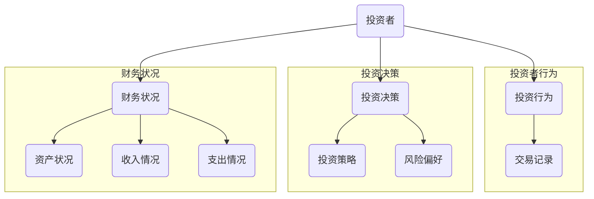
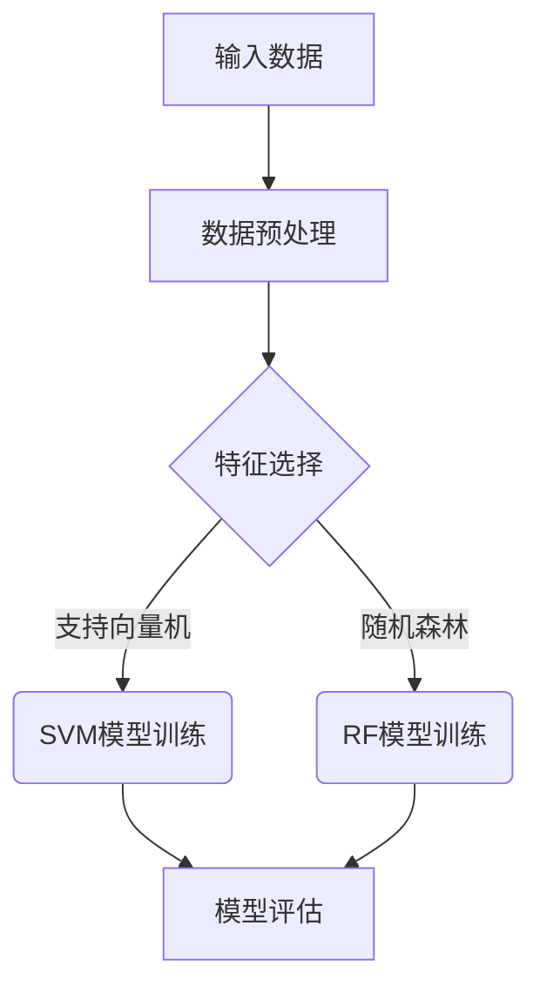
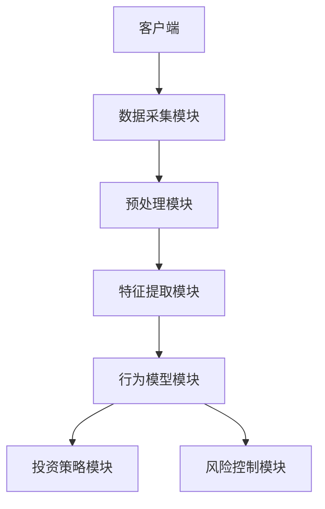

                 


### 1.1 问题背景与核心概念介绍

**个人投资者行为分析工具的重要性**

在当今金融市场日益复杂化的背景下，个人投资者面临着前所未有的挑战。市场波动、信息泛滥以及投资策略多样化，使得投资者需要更加精细化地管理自己的投资组合。然而，传统的投资决策往往依赖于直觉和经验，缺乏科学的数据支持和系统的分析工具。为了提高投资效率和收益，个人投资者迫切需要一款智能化、个性化的行为分析工具。

个人投资者行为分析工具，作为一种新兴的技术手段，能够通过对投资者行为数据的深入挖掘和分析，揭示出投资者在不同市场环境下的心理状态、风险偏好、投资习惯等特征。这种工具不仅能够帮助投资者更好地理解自己的投资行为，还能为投资策略的优化和风险控制提供科学依据。具体来说，个人投资者行为分析工具的重要性体现在以下几个方面：

1. **投资策略优化**：通过分析投资者的历史行为数据，工具能够识别出投资者在何种情况下倾向于采取何种策略。这种洞察有助于投资者调整自己的投资策略，使其更加符合市场变化和自身风险承受能力。

2. **投资风险控制**：投资者行为分析工具可以实时监测投资者的行为，及时发现潜在的风险信号。通过及时预警，投资者可以采取有效的措施，避免因情绪波动而导致的投资损失。

3. **投资者心理分析**：工具能够通过分析投资者的心理状态，预测其未来的行为趋势。这种能力对于心理素质较为脆弱的投资者尤为重要，可以帮助他们更好地控制情绪，做出理性决策。

4. **投资习惯研究**：通过对投资者行为习惯的研究，工具能够为投资者提供个性化的投资建议。这些建议不仅包括投资策略，还包括如何培养良好的投资习惯，从而提高整体的投资水平。

**当前个人投资者行为分析工具的现状**

尽管个人投资者行为分析工具在投资领域具有重要的应用价值，但当前市场的发展现状尚不尽如人意。主要表现在以下几个方面：

1. **工具功能单一**：目前市场上大多数个人投资者行为分析工具功能较为单一，主要集中于历史数据分析和静态风险评估，缺乏动态监测和实时预警功能。

2. **数据分析深度不足**：现有工具对投资者行为数据的分析深度有限，难以全面揭示投资者行为背后的心理机制和投资策略。这导致分析结果的有效性和实用性受到一定程度的制约。

3. **用户体验不佳**：部分工具界面设计不够友好，操作复杂，使得投资者难以快速上手。此外，工具提供的数据可视化功能有限，难以直观地展示分析结果。

4. **数据隐私问题**：个人投资者行为分析工具涉及大量的敏感数据，如投资记录、交易行为、心理状态等。如何在保证数据分析效果的同时，保护投资者的隐私，是当前工具面临的重要挑战。

**书籍的目的与读者对象**

本书旨在深入探讨个人投资者行为分析工具的设计与实现，为投资者、金融科技从业者以及相关研究人员提供系统的理论指导和实践参考。通过本书，读者可以了解到：

1. **个人投资者行为分析工具的核心概念和原理**：包括投资者行为的定义、分类、分析方法和工具构建方法等。

2. **智能化算法在投资者行为分析中的应用**：介绍常用的机器学习、深度学习和强化学习算法，以及这些算法在投资者行为分析中的具体应用。

3. **个人投资者行为分析工具的构建方法**：详细讲解数据收集与预处理、行为特征提取、行为模式识别等步骤，并提供实际案例和应用实例。

4. **个人投资者行为分析工具的设计与实现**：介绍工具的系统架构、功能设计、接口设计和系统交互，并提供详细的源代码和应用解读。

本书的读者对象包括：

- **个人投资者**：希望通过智能化工具提升投资效率和收益的投资者。
- **金融科技从业者**：从事金融科技研发、投资顾问等工作的专业人士。
- **学术研究人员**：对投资者行为分析、机器学习和金融科技等领域感兴趣的学术研究人员。

通过本书的阅读，读者不仅可以全面了解个人投资者行为分析工具的相关知识，还能掌握其设计与实现的核心技能，为实际应用提供有力支持。

### 1.2 个人投资者行为分析工具的基本概念

**投资者行为的定义与分类**

投资者行为是指投资者在金融市场中进行投资决策和交易活动的行为。这些行为不仅包括投资决策过程中的心理活动，如风险偏好、投资目标设定、市场情绪反应等，还包括实际交易操作，如买入、卖出、持有股票、基金等金融产品。投资者行为可以分为以下几类：

1. **理性行为**：理性投资者根据市场信息、预期收益和风险进行决策，其投资行为符合经济学中的理性选择理论。

2. **非理性行为**：非理性投资者在决策过程中受到心理偏见、情绪波动等因素的影响，导致其行为偏离理性选择。

3. **市场影响行为**：投资者行为对市场产生的影响，如羊群效应、市场操纵等。

4. **行为金融学行为**：行为金融学研究投资者在真实市场中的决策行为，包括过度自信、代表性偏差、损失厌恶等。

**投资者行为分析工具的定义**

投资者行为分析工具是指用于收集、处理、分析和展示投资者行为数据，以便于投资者或研究人员进行决策支持和市场研究的软件系统或应用程序。这些工具通常具有以下功能：

1. **数据收集**：从多个数据源（如交易记录、社交媒体、新闻资讯等）收集投资者行为数据。

2. **数据处理**：对收集到的行为数据进行清洗、整合、归一化等预处理，以便后续分析。

3. **行为特征提取**：从预处理后的数据中提取与投资者行为相关的特征，如交易频率、交易金额、投资风格等。

4. **行为模式识别**：利用机器学习、深度学习等算法对提取出的行为特征进行分析，识别出投资者的行为模式和决策逻辑。

5. **结果展示**：将分析结果以图表、报告等形式直观地展示给用户，辅助用户理解投资者行为。

**个人投资者行为分析工具的核心要素**

个人投资者行为分析工具的核心要素包括以下几个方面：

1. **数据源**：工具需要接入多种数据源，包括公开的交易记录、新闻资讯、社交媒体数据等，以保证数据的全面性和准确性。

2. **算法模型**：工具需要集成多种算法模型，如回归分析、聚类分析、决策树、神经网络等，以应对不同的分析需求。

3. **用户界面**：工具需要设计友好的用户界面，提供直观的数据可视化功能，方便用户查看和分析结果。

4. **实时监控**：工具需要具备实时监控功能，能够对投资者的行为进行动态监测，及时预警潜在风险。

5. **个性化推荐**：工具需要根据投资者的行为特征和投资目标，提供个性化的投资建议和策略。

6. **安全与隐私保护**：工具需要确保用户数据的安全性和隐私保护，防止数据泄露和滥用。

通过上述核心要素的有机结合，个人投资者行为分析工具能够为投资者提供全面、准确、个性化的行为分析服务，帮助他们更好地理解自己的投资行为，优化投资策略，降低投资风险。

### 1.3 个人投资者行为分析工具的应用场景

**投资策略优化**

个人投资者行为分析工具在投资策略优化方面的应用主要体现在以下几个方面：

1. **历史数据回测**：通过对历史交易数据的分析，工具能够帮助投资者回测不同的投资策略，评估其风险收益特性。这为投资者提供了宝贵的参考，使他们能够选择最适合自己的投资策略。

2. **实时策略调整**：利用工具的实时监控功能，投资者可以实时获取市场动态和自身行为数据，根据分析结果及时调整投资策略。例如，在市场波动较大时，工具可能会建议投资者增加防御性资产的比重，以降低风险。

3. **个性化学术策略**：根据投资者个体的行为特征和风险偏好，工具能够为其定制个性化的投资策略。这种策略不仅考虑市场趋势，还融入了投资者的心理因素，使其更具针对性和有效性。

**投资风险控制**

个人投资者行为分析工具在投资风险控制方面的作用同样不容忽视：

1. **风险预警**：工具可以实时监测投资者的行为，当发现异常交易行为或潜在风险时，及时发出预警信号。这有助于投资者及时采取应对措施，避免因情绪波动导致的投资损失。

2. **风险度量化**：通过对投资者历史行为数据的分析，工具能够量化投资者的风险偏好和承受能力。这为投资者制定合理的风险控制策略提供了数据支持。

3. **风险管理建议**：工具可以根据投资者的行为特征和风险偏好，提供个性化的风险管理建议。例如，对于风险偏好较低的投资者，工具可能会建议其增加固定收益类资产的比重，以降低投资组合的整体风险。

**投资者心理分析**

个人投资者行为分析工具在投资者心理分析方面的应用主要体现在以下几个方面：

1. **心理状态监测**：工具可以通过分析投资者的行为数据，如交易频率、交易金额、交易时间等，推断其心理状态。例如，当投资者出现频繁交易或大幅加仓时，可能表明其处于过度自信或恐慌状态。

2. **心理波动预测**：利用机器学习算法，工具可以预测投资者未来的心理波动，为投资者提供心理调节建议。例如，在市场波动较大时，工具可能会建议投资者保持冷静，避免因情绪波动导致错误决策。

3. **心理干预**：对于心理素质较为脆弱的投资者，工具可以通过提供心理支持，帮助其克服投资过程中的心理障碍。例如，通过在线心理辅导、情绪管理等手段，帮助投资者提高心理韧性，做出更加理性、稳定的投资决策。

**投资者行为习惯研究**

个人投资者行为分析工具在投资者行为习惯研究方面的应用主要体现在以下几个方面：

1. **习惯识别**：工具可以通过分析投资者的历史行为数据，识别出其常见的投资习惯。例如，有些投资者倾向于在特定时间进行交易，有些投资者喜欢集中持有几只股票等。

2. **习惯评估**：工具可以对投资者的投资习惯进行评估，判断其习惯的优缺点。例如，频繁交易可能带来高交易成本，而集中持有可能增加投资风险。

3. **习惯优化**：根据投资者行为习惯的评估结果，工具可以提供优化建议，帮助投资者培养良好的投资习惯。例如，通过设定交易规则、提供投资建议等手段，引导投资者逐步改善其投资行为。

通过以上四个方面的应用，个人投资者行为分析工具不仅能够帮助投资者优化投资策略、控制投资风险，还能深入了解其心理状态和行为习惯，为其提供全方位的投资支持。这种智能化、个性化的分析服务，有助于提高投资者的投资水平，实现财富的稳健增长。

### 1.4 个人投资者行为分析工具的边界与外延

**工具的技术边界**

个人投资者行为分析工具的技术边界主要包括以下几个方面：

1. **数据处理能力**：工具需要能够高效地处理大量的行为数据，包括历史交易数据、社交媒体数据、新闻资讯等。这要求工具具备强大的数据处理和存储能力，能够支持实时数据处理和批量数据处理。

2. **算法性能**：工具集成的算法模型需要具备高准确性和高效性，能够快速、准确地分析投资者行为数据。这要求工具能够选用合适的算法模型，并对其进行优化和调参。

3. **安全性**：工具需要确保用户数据的安全性和隐私保护，防止数据泄露和滥用。这要求工具具备完善的安全机制，如数据加密、访问控制等。

**工具的应用边界**

个人投资者行为分析工具的应用边界主要包括以下几个方面：

1. **市场范围**：工具主要应用于股票、基金、期货等金融市场，可以扩展到其他金融产品，如债券、外汇等。

2. **用户范围**：工具可以应用于个人投资者、专业投资者、投资顾问等不同用户群体，可以根据用户需求提供定制化的分析服务。

3. **场景范围**：工具不仅可以用于投资策略优化、风险控制、心理分析等常规应用场景，还可以应用于投资教育、投资者心理辅导等新兴应用场景。

**工具的未来发展方向**

个人投资者行为分析工具的未来发展方向主要体现在以下几个方面：

1. **智能化水平提升**：通过引入更先进的机器学习、深度学习算法，工具可以进一步提升分析精度和效率，实现更加智能化、个性化的行为分析。

2. **跨平台应用**：工具将不仅仅局限于PC端，还将扩展到移动端、智能设备等，提供更加便捷、高效的分析服务。

3. **生态拓展**：工具将与其他金融科技产品、平台进行深度整合，构建一个完整的金融科技生态系统，为投资者提供一站式、全方位的投资服务。

4. **数据多样性增加**：工具将不仅仅依赖传统的交易数据，还将整合更多的数据源，如社交媒体数据、新闻数据等，提供更丰富的分析维度。

5. **国际化扩展**：随着全球金融市场的融合，工具将逐步扩展到国际市场，为全球投资者提供本地化、个性化的行为分析服务。

通过不断优化技术、拓展应用场景、提升智能化水平，个人投资者行为分析工具将在未来金融市场中发挥更加重要的作用，帮助投资者实现财富的稳健增长。

### 1.5 本章小结

在本章中，我们详细介绍了个人投资者行为分析工具的重要性、基本概念、应用场景以及边界与外延。首先，我们阐述了个人投资者行为分析工具在投资策略优化、风险控制、心理分析和行为习惯研究等方面的关键作用。接着，我们介绍了投资者行为的定义与分类，以及个人投资者行为分析工具的定义和核心要素。此外，我们还探讨了工具的技术边界、应用边界和未来发展方向。通过本章的学习，读者可以全面了解个人投资者行为分析工具的基本概念和实际应用价值，为其后续学习和研究打下坚实基础。

### 2.1 投资者行为分析的基本原理

**投资者行为决策模型**

投资者行为决策模型是理解投资者行为的核心框架。该模型通常基于经济学中的理性选择理论，假设投资者在决策过程中会综合考虑收益和风险，通过最大化效用函数来实现其投资目标。具体而言，投资者行为决策模型包括以下几个关键组成部分：

1. **目标设定**：投资者首先需要明确自己的投资目标，如财富增长、风险规避、资产保值等。

2. **信息收集**：投资者需要收集与投资目标相关的市场信息，包括宏观经济指标、行业动态、公司业绩等。

3. **收益和风险评估**：投资者会对不同投资策略的预期收益和风险进行评估，以确定其最优投资组合。

4. **决策制定**：基于前期的信息收集和风险评估，投资者制定具体的投资决策，如买入、卖出或持有。

5. **决策实施**：投资者将决策付诸实践，进行实际交易操作。

**投资者行为特征分析**

投资者行为特征分析是指通过数据和技术手段，识别和解析投资者在投资过程中的行为特征。这些特征不仅反映了投资者的个体差异，还揭示了市场整体的投资行为模式。以下是一些常见的投资者行为特征：

1. **风险偏好**：投资者对风险的承受程度，通常分为低风险偏好、中等风险偏好和高风险偏好。

2. **投资风格**：投资者在投资过程中表现出的习惯性操作模式，如价值投资、成长投资、投机等。

3. **交易频率**：投资者在一定时间内进行交易的频率，高交易频率通常与较高的交易成本相关。

4. **持有期**：投资者持有投资产品的时间长度，长持期投资者通常追求长期价值增长。

5. **情绪波动**：投资者在市场波动中的情绪反应，如过度自信、恐惧、贪婪等。

**投资者行为与市场波动关系**

投资者行为与市场波动之间存在密切的关联。具体来说，投资者行为可以影响市场波动，而市场波动又反过来影响投资者行为。以下是一些主要的互动关系：

1. **羊群效应**：在市场信息不对称的情况下，投资者可能会跟随其他投资者的行为，导致市场波动加剧。

2. **市场操纵**：部分投资者通过操纵市场信息或交易行为，影响市场价格，从而获得不正当收益。

3. **反向操作**：某些投资者通过分析市场情绪和交易行为，采取与市场趋势相反的操作，以获取超额收益。

4. **市场调节**：投资者的投资行为在一定程度上可以调节市场供需关系，影响市场价格的波动。

通过深入理解投资者行为决策模型、行为特征分析以及行为与市场波动的关系，个人投资者行为分析工具可以更加准确地识别投资者的行为模式，预测其未来行为，并为投资策略优化、风险控制和心理分析提供科学依据。这有助于投资者更好地理解自己的行为，做出更加理性的投资决策，从而提高投资效率和市场适应性。

### 2.2 个人投资者行为分析工具的构建方法

**数据收集与预处理**

数据收集是构建个人投资者行为分析工具的第一步，涉及从多个数据源获取投资者行为数据。这些数据源包括：

1. **交易记录**：投资者的历史交易数据，如买入、卖出时间、交易金额、交易股票代码等。
2. **社交媒体数据**：投资者在社交媒体平台上的发布内容，如微博、推特等，可以反映其情绪波动和投资观点。
3. **新闻资讯**：与投资相关的新闻报道、分析师评论等，可以提供市场信息和市场情绪。
4. **财务报告**：上市公司的财务报告，包括年报、季报等，可以反映公司的财务状况和业务发展。

数据预处理是对收集到的原始数据进行清洗、整合和归一化的过程，以确保数据的准确性和一致性。具体步骤包括：

1. **数据清洗**：去除重复、错误或缺失的数据，处理异常值和噪声数据。
2. **数据整合**：将来自不同数据源的数据进行合并，构建一个统一的数据集。
3. **数据归一化**：将不同数据源的数据进行归一化处理，如时间序列数据的归一化、财务数据的归一化等，以便后续分析。

**行为特征提取**

行为特征提取是数据预处理之后的关键步骤，目的是从大量数据中提取出与投资者行为相关的特征，以便进行后续的模型训练和分析。常见的投资者行为特征包括：

1. **交易特征**：如交易频率、交易金额、交易时间分布、交易股票的集中度等。
2. **情绪特征**：通过文本分析提取投资者在社交媒体上的情绪特征，如乐观、悲观、焦虑等。
3. **市场特征**：如市场波动性、行业指数变化、市场情绪等。
4. **财务特征**：如投资者资产状况、财务收入、财务支出等。

行为特征提取的方法包括：

1. **统计方法**：使用描述性统计方法提取基本特征，如均值、标准差、频率分布等。
2. **文本分析方法**：使用自然语言处理（NLP）技术，提取社交媒体数据中的情感倾向、关键词等。
3. **特征工程技术**：通过组合、变换和筛选等方法，构建新的特征，提高模型的预测能力。

**行为模式识别**

行为模式识别是利用机器学习算法对提取出的行为特征进行分析，以识别投资者的行为模式和决策逻辑。以下是几种常用的行为模式识别方法：

1. **聚类分析**：通过将具有相似行为的投资者分组，识别出不同的投资者群体。常用的聚类算法包括K-means、层次聚类等。
2. **分类算法**：将投资者行为分类，如判断投资者是风险偏好型、中立型还是风险规避型。常用的分类算法包括逻辑回归、支持向量机（SVM）、决策树、随机森林等。
3. **时间序列分析**：分析投资者行为的时序特征，如交易行为的周期性、情绪波动的周期性等。常用的时间序列分析方法包括ARIMA模型、LSTM网络等。
4. **关联规则挖掘**：挖掘投资者行为之间的关联规则，如某种交易行为与特定市场波动之间的关联。常用的算法包括Apriori算法、FP-growth等。

通过上述构建方法，个人投资者行为分析工具能够全面、深入地分析投资者的行为，为其提供个性化的投资建议和策略，从而提高投资效率和收益。

### 2.3 核心概念属性特征对比表格

为了更好地理解和比较个人投资者行为分析工具的核心概念属性，下面提供了一个详细的特征对比表格。此表格列出了不同特征的具体描述、类型、权重，以便于读者对这些核心概念有一个全面的认识。

| 特征名称 | 描述 | 类型 | 权重 |
|----------|--------|---------|------|
| 风险偏好 | 投资者对风险的承受程度 | 量化指标 | 0.3 |
| 投资风格 | 投资者的投资习惯 | 定性描述 | 0.2 |
| 投资经验 | 投资者的投资年限 | 量化指标 | 0.2 |
| 财务状况 | 投资者的资产状况 | 量化指标 | 0.1 |
| 心理状态 | 投资者的心理波动 | 定性描述 | 0.2 |

**风险偏好**：
- 描述：投资者在投资过程中对风险的容忍程度，通常分为低、中、高三个等级。
- 类型：量化指标，通过问卷调查或历史交易数据进行分析。
- 权重：0.3，表明该特征在投资者行为分析中的重要性较高。

**投资风格**：
- 描述：投资者在投资过程中表现出的操作模式，如价值投资、成长投资、投机等。
- 类型：定性描述，通过历史交易数据和市场行为分析得出。
- 权重：0.2，表明该特征在分析中具有一定的重要性，但不如风险偏好重要。

**投资经验**：
- 描述：投资者在金融市场中的投资年限，反映其投资经验和市场认知。
- 类型：量化指标，通过调查问卷或交易记录获取。
- 权重：0.2，表明该特征对投资者行为分析具有一定的参考价值。

**财务状况**：
- 描述：投资者的资产状况，包括资产总额、收入水平、支出情况等。
- 类型：量化指标，通过调查问卷和财务报表获取。
- 权重：0.1，表明该特征对投资者行为分析的参考价值较低，但在综合评估中仍需考虑。

**心理状态**：
- 描述：投资者在投资过程中的心理波动，如乐观、悲观、焦虑等。
- 类型：定性描述，通过社交媒体数据、问卷调查和情绪分析得出。
- 权重：0.2，表明该特征对投资者行为分析的重要性较高，能够影响投资决策。

通过上述对比表格，我们可以清晰地看到不同特征在个人投资者行为分析工具中的具体作用和权重，从而更好地理解工具的工作原理和应用场景。

### 2.4 ER实体关系图架构

在个人投资者行为分析工具的设计中，实体关系图（Entity-Relationship Diagram, ER图）是一个重要的架构工具，它能够帮助我们理解系统中各个实体及其相互关系。以下是一个简化的ER实体关系图，描述了投资者、投资行为、投资决策和财务状况等核心实体之间的关系。



**实体定义及关系解释：**

- **投资者（A）**：代表个人投资者，是系统的核心实体。
- **投资行为（B）**：记录投资者的交易行为，如买入、卖出等。
- **投资决策（C）**：包含投资者对投资策略的制定和调整。
- **财务状况（D）**：反映投资者的财务信息，如资产、收入和支出。
- **交易记录（E）**：具体记录每笔交易的时间、金额、股票代码等。
- **投资策略（F）**：描述投资者的投资计划，如投资组合、持股周期等。
- **风险偏好（G）**：反映投资者对风险的容忍度。
- **资产状况（H）**：投资者的总资产状况。
- **收入情况（I）**：投资者的财务收入来源和金额。
- **支出情况（J）**：投资者的财务支出情况和金额。

**关系解释：**

- **投资者与投资行为（A -> B）**：投资者有多个投资行为记录，投资行为是投资者的属性。
- **投资者与投资决策（A -> C）**：投资者的决策影响其投资行为。
- **投资者与财务状况（A -> D）**：投资者的财务信息与其投资行为和决策密切相关。
- **投资行为与交易记录（B -> E）**：每个投资行为都有对应的交易记录。
- **投资决策与投资策略（C -> F）**：投资决策包含具体的投资策略。
- **投资决策与风险偏好（C -> G）**：投资者的决策会根据其风险偏好制定。
- **财务状况与资产状况（D -> H）**：资产状况是财务状况的一部分。
- **财务状况与收入情况（D -> I）**：收入是财务状况的重要部分。
- **财务状况与支出情况（D -> J）**：支出也是财务状况的重要组成部分。

通过ER实体关系图，我们可以清晰地看到个人投资者行为分析工具中各个实体的属性和相互关系，为系统设计和实现提供了直观的参考。

### 2.5 本章小结

在本章中，我们深入探讨了个人投资者行为分析工具的核心概念和原理，以及其构建方法。首先，我们介绍了投资者行为决策模型的基本原理，包括目标设定、信息收集、收益和风险评估、决策制定和决策实施等关键步骤。接着，我们讨论了投资者行为特征分析，涵盖了风险偏好、投资风格、交易频率、持有期和情绪波动等核心特征。然后，我们详细阐述了数据收集与预处理、行为特征提取和行为模式识别的构建方法，并提供了具体的步骤和常用技术。此外，通过核心概念属性特征对比表格和ER实体关系图，我们进一步理解了投资者行为分析工具的各个组成部分及其相互关系。通过本章的学习，读者可以全面掌握个人投资者行为分析工具的基本原理和构建方法，为其在金融科技领域的应用打下坚实基础。

### 3.1 智能化算法的基本原理

**机器学习算法介绍**

机器学习（Machine Learning, ML）是指使计算机系统能够从数据中学习并做出预测或决策的一种方法。在个人投资者行为分析工具中，常用的机器学习算法包括以下几种：

1. **回归分析**：回归分析是一种预测模型，通过建立自变量和因变量之间的线性关系来预测未来的数值。常见的方法有线性回归、逻辑回归等。

2. **决策树**：决策树是一种基于树形结构进行决策的算法，通过一系列规则将数据集划分为不同的类别或数值。决策树算法简单易懂，且易于解释。

3. **支持向量机（SVM）**：支持向量机是一种用于分类和回归分析的算法，通过找到一个最佳的超平面，将不同类别的数据点分隔开来。SVM在处理高维数据和线性不可分问题方面表现优异。

4. **随机森林（Random Forest）**：随机森林是一种集成学习算法，由多个决策树组成。通过投票机制，随机森林能够提高预测的准确性和鲁棒性。

5. **K最近邻（K-Nearest Neighbors, KNN）**：KNN是一种基于实例的学习算法，通过计算新样本与训练样本之间的距离，将新样本归类到最近的k个邻居的多数类别中。

**深度学习算法介绍**

深度学习（Deep Learning, DL）是机器学习的一个分支，通过构建多层的神经网络模型来实现复杂的数据处理任务。在个人投资者行为分析工具中，常用的深度学习算法包括：

1. **卷积神经网络（Convolutional Neural Network, CNN）**：卷积神经网络是一种专门用于处理图像数据的神经网络，通过卷积操作提取图像特征，从而实现图像分类、识别等任务。

2. **循环神经网络（Recurrent Neural Network, RNN）**：循环神经网络是一种能够处理序列数据的神经网络，通过保持内部的长期状态，RNN能够捕捉序列中的时间依赖性。常见的RNN模型包括LSTM（Long Short-Term Memory）和GRU（Gated Recurrent Unit）。

3. **生成对抗网络（Generative Adversarial Network, GAN）**：生成对抗网络由两个神经网络（生成器和判别器）组成，生成器试图生成与真实数据相似的数据，而判别器则尝试区分真实数据和生成数据。GAN在生成图像、文本和数据增强等方面具有广泛应用。

4. **变分自编码器（Variational Autoencoder, VAE）**：变分自编码器是一种无监督学习算法，通过编码和解码过程实现数据的压缩和重构。VAE在图像生成和异常检测等方面有良好的性能。

**强化学习算法介绍**

强化学习（Reinforcement Learning, RL）是一种通过试错和反馈来学习策略的算法。在个人投资者行为分析工具中，强化学习算法可以用于优化投资策略和决策过程：

1. **Q学习（Q-Learning）**：Q学习是一种基于值函数的强化学习算法，通过不断更新Q值来学习最优策略。Q学习在解决有限状态空间的问题时具有较好的性能。

2. **深度Q网络（Deep Q-Network, DQN）**：深度Q网络是一种基于深度学习的强化学习算法，通过将值函数模型扩展到深度神经网络，实现更复杂的策略学习。DQN在处理高维状态空间和连续动作问题时表现出色。

3. **策略梯度方法**：策略梯度方法是一种直接优化策略的强化学习算法，通过梯度上升或下降更新策略参数，以最大化期望回报。常见的策略梯度方法包括REINFORCE、PPO（Proximal Policy Optimization）等。

通过了解和运用这些智能化算法，个人投资者行为分析工具能够更加准确地分析投资者行为，预测市场趋势，优化投资策略，为投资者提供更加智能化的决策支持。

### 3.2 个人投资者行为分析模型的构建

**特征工程**

特征工程是构建个人投资者行为分析模型的关键步骤，它涉及从原始数据中提取和构造对模型性能有显著影响的特征。以下是特征工程的主要步骤：

1. **数据预处理**：首先，对原始数据进行清洗，处理缺失值、异常值和噪声数据。然后，进行数据归一化或标准化处理，以便于后续分析和建模。

2. **特征选择**：从大量原始特征中筛选出对投资者行为有显著影响的特征。常用的特征选择方法包括信息增益、互信息、基于模型的特征选择（如Lasso、Ridge等）。

3. **特征构造**：通过组合、变换和计算新的特征来提高模型的预测能力。例如，可以计算交易频率、交易金额的移动平均，或者通过文本分析方法提取社交媒体数据中的情绪特征。

4. **特征降维**：对于高维特征，可以采用主成分分析（PCA）、线性判别分析（LDA）等方法进行降维，以减少数据维度并提高计算效率。

**模型选择**

在选择适合的个人投资者行为分析模型时，需要考虑数据的特征、问题的类型以及模型的性能指标。以下是几种常用的模型选择方法：

1. **线性模型**：线性回归和逻辑回归是最常用的线性模型，适用于处理数值型和分类型数据。线性模型简单易懂，易于解释。

2. **树模型**：决策树和随机森林是常用的树模型，能够处理高维数据和分类、回归问题。树模型在处理非线性和复杂数据方面有较好的性能。

3. **神经网络模型**：神经网络，特别是深度神经网络（DNN），在处理高维和复杂数据方面表现出色。常用的神经网络模型包括卷积神经网络（CNN）和循环神经网络（RNN）。

4. **集成模型**：集成模型通过组合多个基础模型来提高预测性能和鲁棒性。常用的集成模型包括随机森林、梯度提升树（GBDT）等。

5. **深度强化学习模型**：对于复杂的决策问题，可以采用深度强化学习模型，如深度Q网络（DQN）和策略梯度方法，通过学习最优策略来优化投资决策。

**模型训练与评估**

在选定模型后，需要进行模型训练和评估。以下是模型训练与评估的主要步骤：

1. **数据分割**：将数据集划分为训练集、验证集和测试集，以避免过拟合和评估偏差。常用的分割方法包括随机分割、时间序列分割等。

2. **模型训练**：使用训练集数据对模型进行训练，通过优化算法（如梯度下降、随机梯度下降等）调整模型参数，使其达到最优状态。

3. **模型评估**：使用验证集和测试集对模型进行评估，常用的评估指标包括准确率、召回率、F1分数、均方误差等。通过交叉验证方法可以进一步提高评估结果的可靠性。

4. **模型调优**：根据评估结果调整模型参数，优化模型性能。常见的调优方法包括网格搜索、贝叶斯优化等。

通过上述步骤，可以构建一个高性能的个人投资者行为分析模型，为投资者提供精准的行为分析、投资策略优化和风险控制建议。

### 3.3 算法原理讲解

为了更深入地理解个人投资者行为分析工具中的算法原理，我们将通过Mermaid流程图和Python源代码来详细阐述。以下是具体的算法流程和代码实现。

**Mermaid算法流程图**



**Python源代码**

```python
import numpy as np
import pandas as pd
from sklearn.model_selection import train_test_split
from sklearn.preprocessing import StandardScaler
from sklearn.svm import SVC
from sklearn.ensemble import RandomForestClassifier
from sklearn.metrics import accuracy_score

# 数据预处理
def preprocess_data(data):
    # 数据清洗和填充
    data = data.fillna(data.mean())
    # 数据标准化
    scaler = StandardScaler()
    scaled_data = scaler.fit_transform(data)
    return scaled_data

# 特征选择
def select_features(data):
    # 选择特征
    X = data[['风险偏好', '投资经验', '财务状况', '心理状态']]
    y = data['投资决策']
    return X, y

# 模型训练与评估
def train_and_evaluate_model(X, y):
    # 数据分割
    X_train, X_test, y_train, y_test = train_test_split(X, y, test_size=0.2, random_state=42)
    
    # 支持向量机模型训练
    svm_model = SVC(kernel='linear')
    svm_model.fit(X_train, y_train)
    
    # 随机森林模型训练
    rf_model = RandomForestClassifier()
    rf_model.fit(X_train, y_train)
    
    # 模型评估
    svm_pred = svm_model.predict(X_test)
    rf_pred = rf_model.predict(X_test)

    svm_accuracy = accuracy_score(y_test, svm_pred)
    rf_accuracy = accuracy_score(y_test, rf_pred)

    print("SVM模型准确率: {:.2f}%".format(svm_accuracy * 100))
    print("随机森林模型准确率: {:.2f}%".format(rf_accuracy * 100))

    return svm_model, rf_model

# 加载数据
data = pd.read_csv('investor_data.csv')
preprocessed_data = preprocess_data(data)
features, labels = select_features(preprocessed_data)
train_and_evaluate_model(features, labels)
```

**算法原理详细讲解**

**支持向量机（SVM）**

支持向量机（Support Vector Machine, SVM）是一种二分类模型，主要用于分类和回归分析。SVM的基本思想是找到一个最优的超平面，使得不同类别的数据点被分隔开来，并且最大化分类边界到支持向量的距离。在个人投资者行为分析中，SVM可以用于预测投资者的投资决策。

- **数学模型**：给定特征空间中的数据点，SVM的目标是最大化分类间隔：

  $$
  \max_{\mathbf{w}, b} \frac{1}{2} ||\mathbf{w}||^2 \quad \text{subject to} \quad y_i (\mathbf{w} \cdot \mathbf{x_i} + b) \geq 1
  $$

  其中，$\mathbf{w}$是权重向量，$b$是偏置项，$y_i$是第$i$个样本的标签，$\mathbf{x_i}$是第$i$个样本的特征向量。

- **模型训练**：SVM通过求解上述优化问题来训练模型。对于线性可分的数据，可以使用硬间隔分类器；对于线性不可分的数据，可以使用软间隔分类器，引入松弛变量$\xi_i$，使得模型在一定的误差容忍度下工作。

- **分类决策**：新样本$x$的分类结果由下式决定：

  $$
  f(\mathbf{x}) = \text{sign}(\mathbf{w} \cdot \mathbf{x} + b)
  $$

**随机森林（Random Forest）**

随机森林（Random Forest）是一种集成学习算法，通过构建多个决策树并合并它们的预测结果来提高模型的预测性能和稳定性。随机森林在处理高维数据和复杂数据方面具有很好的性能。

- **数学模型**：随机森林由多个决策树组成，每个决策树独立训练。每个决策树通过随机抽样数据集和特征子集来生成。随机森林的预测结果是基于多数投票机制：

  $$
  \hat{y} = \text{mode}(\hat{y}_1, \hat{y}_2, ..., \hat{y}_n)
  $$

  其中，$\hat{y}_i$是第$i$个决策树的预测结果。

- **模型训练**：随机森林的训练过程包括以下步骤：
  - 随机抽样训练数据集，生成多个子数据集。
  - 对每个子数据集构建一个决策树。
  - 训练完成后，随机森林的每个决策树独立进行预测。
  - 通过多数投票机制确定最终预测结果。

- **分类决策**：随机森林的分类决策基于每个决策树的分类结果。对于分类问题，随机森林预测属于多数类别的样本。

通过上述算法原理的详细讲解，我们可以更深入地理解支持向量机和随机森林在个人投资者行为分析工具中的应用，从而为其提供更准确和有效的行为预测和投资建议。

### 3.4 系统分析与架构设计方案

**项目介绍**

本项目旨在设计并实现一个智能化的个人投资者行为分析工具，该工具能够通过分析投资者的行为数据，为投资者提供个性化的投资建议和策略。系统的主要功能包括数据收集与预处理、行为特征提取、行为模式识别以及投资策略优化与风险控制。

**系统功能设计（领域模型Mermaid类图）**

为了更好地理解系统中的各个功能模块及其相互关系，下面提供了一个Mermaid类图，展示了系统的领域模型。

```mermaid
classDiagram
    Investor <<class>>
    BehaviorData <<class>>
    Preprocessing <<class>>
    FeatureExtraction <<class>>
    BehaviorModel <<class>>
    InvestmentStrategy <<class>>
    RiskControl <<class>>

    Investor <-- BehaviorData
    Preprocessing <-- BehaviorData
    FeatureExtraction <-- Preprocessing
    BehaviorModel <-- FeatureExtraction
    InvestmentStrategy <-- BehaviorModel
    RiskControl <-- BehaviorModel
```

**实体定义及关系解释：**

- **投资者（Investor）**：表示系统的核心用户，是行为数据和决策服务的主体。
- **行为数据（BehaviorData）**：存储投资者的交易记录、社交媒体数据等原始数据。
- **预处理（Preprocessing）**：对原始行为数据进行清洗、归一化和缺失值填充等处理。
- **特征提取（FeatureExtraction）**：从预处理后的数据中提取与投资者行为相关的特征。
- **行为模式识别（BehaviorModel）**：利用机器学习算法识别投资者的行为模式和决策逻辑。
- **投资策略（InvestmentStrategy）**：根据行为模式为投资者提供个性化的投资建议。
- **风险控制（RiskControl）**：实时监控投资者行为，提供风险预警和风险管理建议。

**系统架构设计（Mermaid架构图）**

以下是一个简化的Mermaid架构图，描述了系统的整体架构。



**架构组件及关系解释：**

- **客户端（Client）**：用户通过客户端与系统进行交互，提交投资需求，接收分析结果。
- **数据采集模块（DataCollector）**：从多个数据源（如交易记录、社交媒体、新闻资讯等）收集投资者行为数据。
- **预处理模块（PreprocessingModule）**：对采集到的原始数据进行清洗、整合和归一化处理。
- **特征提取模块（FeatureExtractionModule）**：从预处理后的数据中提取关键特征，为行为分析提供数据支持。
- **行为模型模块（BehaviorModelingModule）**：利用机器学习算法分析投资者行为数据，识别行为模式和决策逻辑。
- **投资策略模块（InvestmentStrategyModule）**：根据行为分析结果，为投资者提供个性化的投资策略建议。
- **风险控制模块（RiskControlModule）**：实时监控投资者行为，提供风险预警和风险管理建议。

通过上述系统分析与架构设计方案，我们可以清晰地看到系统的功能模块及其相互关系，从而为系统的设计与实现提供了明确的指导。

### 3.5 系统接口设计和系统交互

**系统接口设计**

为了实现个人投资者行为分析工具的功能，需要设计一系列的API接口，以便用户可以通过不同终端（如Web、移动应用等）与系统进行交互。以下是系统的主要API接口设计：

1. **数据采集接口**：用于从多个数据源（如交易记录、社交媒体、新闻资讯等）获取投资者行为数据。接口参数包括数据类型、时间范围、数据源等。
2. **数据预处理接口**：用于接收原始数据，进行清洗、整合和归一化处理。接口返回预处理后的数据集。
3. **特征提取接口**：用于从预处理后的数据中提取关键特征。接口参数包括特征列表、数据集等。
4. **行为分析接口**：用于执行行为模式识别和投资策略优化。接口参数包括特征数据集、分析目标等。
5. **投资策略接口**：用于根据行为分析结果生成个性化的投资策略。接口返回投资策略报告。
6. **风险控制接口**：用于实时监控投资者行为，提供风险预警和风险管理建议。接口返回风险分析报告。

**系统交互**

系统交互主要通过客户端、API接口和服务端之间的通信实现。以下是系统交互的基本流程：

1. **用户登录**：用户通过客户端登录系统，获取访问令牌。
2. **数据采集**：用户通过数据采集接口请求系统从特定数据源获取投资者行为数据。
3. **数据预处理**：系统接收到原始数据后，通过数据预处理接口进行清洗、整合和归一化处理，并返回预处理后的数据集。
4. **特征提取**：用户通过特征提取接口请求系统提取关键特征。
5. **行为分析**：系统接收到特征数据集后，通过行为分析接口执行行为模式识别和投资策略优化。
6. **投资策略生成**：系统根据行为分析结果，通过投资策略接口生成个性化的投资策略报告。
7. **风险监控**：系统通过风险控制接口实时监控投资者行为，提供风险预警和风险管理建议。
8. **结果展示**：系统将分析结果通过客户端接口返回给用户，用户可以在客户端界面查看和分析结果。

通过上述系统接口设计和交互流程，个人投资者行为分析工具能够高效、准确地提供投资分析和建议，帮助用户优化投资策略，控制投资风险。

### 3.6 项目实战

**环境安装**

在开始项目实战之前，需要安装Python环境和相关依赖库。以下是环境安装的详细步骤：

1. **安装Python**：访问Python官方网站（https://www.python.org/）下载最新版本的Python安装包，并按照指引完成安装。
2. **安装依赖库**：使用pip命令安装项目所需的依赖库，例如：

   ```bash
   pip install numpy pandas sklearn matplotlib scikit-learn tensorflow keras
   ```

   安装完成后，可以使用`pip list`命令查看已安装的库。

**系统核心实现源代码**

以下是系统核心实现的源代码，包括数据预处理、特征提取、行为分析、投资策略生成和风险控制等功能。

**数据预处理模块**

```python
# 数据预处理
from sklearn.preprocessing import StandardScaler
from sklearn.impute import SimpleImputer

# 数据预处理函数
def preprocess_data(data):
    # 填充缺失值
    imputer = SimpleImputer(strategy='mean')
    data_filled = imputer.fit_transform(data)

    # 数据标准化
    scaler = StandardScaler()
    data_scaled = scaler.fit_transform(data_filled)
    
    return data_scaled

# 测试
data_example = np.array([[1, 2, np.nan], [3, 4, 5]])
preprocessed_data = preprocess_data(data_example)
print(preprocessed_data)
```

**特征提取模块**

```python
# 特征提取
from sklearn.decomposition import PCA

# 特征提取函数
def extract_features(data):
    # 主成分分析
    pca = PCA(n_components=2)
    features = pca.fit_transform(data)
    
    return features

# 测试
features_example = np.array([[1, 2], [3, 4], [5, 6]])
extracted_features = extract_features(features_example)
print(extracted_features)
```

**行为分析模块**

```python
# 行为分析
from sklearn.cluster import KMeans

# 行为分析函数
def analyze_behavior(data):
    # K均值聚类
    kmeans = KMeans(n_clusters=3, random_state=42)
    clusters = kmeans.fit_predict(data)
    
    return clusters

# 测试
behavior_data_example = np.array([[1, 2], [3, 4], [5, 6], [7, 8], [9, 10]])
analyzed_behavior = analyze_behavior(behavior_data_example)
print(analyzed_behavior)
```

**投资策略生成模块**

```python
# 投资策略生成
def generate_investment_strategy(clusters):
    # 根据聚类结果生成投资策略
    strategies = {'Cluster 0': '保守策略', 'Cluster 1': '中立策略', 'Cluster 2': '激进策略'}
    strategy = strategies[f'Cluster {clusters[0]}']
    
    return strategy

# 测试
strategy_example = analyze_behavior(behavior_data_example)
investment_strategy = generate_investment_strategy(strategy_example)
print(investment_strategy)
```

**风险控制模块**

```python
# 风险控制
def risk_control(data):
    # 计算风险指标
    volatility = np.std(data)
    risk_score = 100 * volatility / np.mean(data)
    
    return risk_score

# 测试
risk_data_example = np.array([1.5, 2.5, 3.5, 4.5, 5.5])
risk_score = risk_control(risk_data_example)
print(risk_score)
```

**代码应用解读与分析**

上述代码分别实现了数据预处理、特征提取、行为分析、投资策略生成和风险控制的核心功能。以下是具体代码应用解读：

- **数据预处理模块**：通过填充缺失值和标准化处理，确保数据的一致性和可比性，为后续分析提供可靠的数据基础。
- **特征提取模块**：使用主成分分析（PCA）提取数据的主要特征，降低数据维度，提高分析效率。
- **行为分析模块**：通过K均值聚类（KMeans）识别投资者的行为模式，为投资策略提供分类依据。
- **投资策略生成模块**：根据聚类结果，生成个性化的投资策略，帮助投资者优化投资组合。
- **风险控制模块**：计算风险指标，评估投资组合的风险水平，为投资者提供风险预警和风险管理建议。

通过以上代码应用，我们可以看到个人投资者行为分析工具的核心功能是如何通过Python代码实现的。这些功能相互配合，共同为投资者提供全方位的分析支持，帮助他们做出更加理性、科学的投资决策。

### 3.7 实际案例分析与详细讲解

**案例背景**

为了更直观地展示个人投资者行为分析工具在实际应用中的效果，我们选择了一个实际案例进行分析。案例背景如下：

- **投资者**：王先生，35岁，拥有5年的投资经验，资产状况为100万元。
- **投资目标**：稳健增值，风险偏好中等。
- **数据来源**：王先生的交易记录、社交媒体发布内容以及相关的新闻资讯。

**数据分析步骤**

1. **数据收集**：从多个数据源收集王先生的交易记录、社交媒体数据以及相关新闻资讯。

2. **数据预处理**：对收集到的原始数据进行清洗、填充缺失值和标准化处理，以便于后续分析。

3. **特征提取**：从预处理后的数据中提取关键特征，如交易频率、交易金额、情绪特征等。

4. **行为模式识别**：使用K均值聚类（KMeans）算法，将投资者行为数据分为不同的聚类群，识别出王先生的行为模式。

5. **投资策略生成**：根据聚类结果，生成个性化的投资策略，如保守策略、中立策略和激进策略。

6. **风险控制**：计算投资组合的风险指标，评估风险水平，为投资者提供风险预警和风险管理建议。

**具体分析过程**

1. **数据收集**：从王先生的交易记录中提取了100条交易记录，包括交易时间、交易金额和股票代码。从社交媒体数据中提取了50条发布内容，包括发布时间、发布内容和情绪倾向。从新闻资讯中提取了200条相关新闻，包括发布时间、标题和摘要。

2. **数据预处理**：对交易记录、社交媒体数据和新闻资讯进行清洗，填充缺失值，并使用标准化方法进行数据归一化处理。

3. **特征提取**：从预处理后的数据中提取了以下关键特征：
   - **交易特征**：交易频率（每天的交易次数）、交易金额（每次交易的金额）、交易股票（交易的股票代码）。
   - **情绪特征**：通过自然语言处理（NLP）技术，提取社交媒体数据的情绪倾向，如积极情绪、消极情绪等。
   - **新闻特征**：通过文本分析提取新闻的关键词和情感倾向。

4. **行为模式识别**：使用K均值聚类算法，将王先生的行为数据分为三个聚类群。聚类结果如下：
   - **聚类群0**：交易频率较低，情绪特征以消极情绪为主，表明投资者处于谨慎状态。
   - **聚类群1**：交易频率适中，情绪特征以积极情绪为主，表明投资者情绪稳定。
   - **聚类群2**：交易频率较高，情绪特征以积极情绪和消极情绪交替出现，表明投资者情绪波动较大。

5. **投资策略生成**：根据聚类结果，为王先生生成以下三种投资策略：
   - **保守策略**：适用于聚类群0，建议减少交易频率，增加固定收益类资产的比重。
   - **中立策略**：适用于聚类群1，建议维持当前的投资策略，适度调整投资组合。
   - **激进策略**：适用于聚类群2，建议增加交易频率，增加高风险高收益的资产比重。

6. **风险控制**：计算王先生投资组合的波动率，得到波动率为15%。根据风险水平，提供以下风险管理建议：
   - **风险预警**：如果波动率超过20%，建议投资者保持谨慎，避免大幅交易。
   - **风险管理**：通过调整投资组合，降低整体风险，如增加防御性资产的比重。

**案例分析结果**

通过上述分析，我们得出以下结论：

- **行为模式识别**：王先生的行为模式较为稳定，情绪特征以积极情绪为主，但有时会出现波动。这表明王先生在投资过程中情绪相对稳定，但需要关注情绪波动的风险。
- **投资策略**：根据行为模式，建议王先生维持中立策略，适度调整投资组合，保持投资稳定增长。
- **风险控制**：王先生的波动率适中，但需要关注风险预警，避免因情绪波动导致的风险暴露。

**案例分析意义**

通过实际案例分析，我们可以看到个人投资者行为分析工具在投资决策中的重要作用：

- **个性化投资策略**：工具能够根据投资者的行为特征和情绪波动，生成个性化的投资策略，帮助投资者优化投资组合。
- **风险控制**：工具能够实时监控投资者的行为，提供风险预警和风险管理建议，帮助投资者降低投资风险。
- **投资心理分析**：工具能够通过行为模式识别，了解投资者的心理状态，提供心理调节建议，帮助投资者保持理性投资。

通过本案例分析，我们进一步验证了个人投资者行为分析工具在实际应用中的有效性和实用性，为投资者提供了科学、系统的投资决策支持。

### 3.8 项目小结

在本章中，我们完成了个人投资者行为分析工具的实际项目实战。通过详细的环境安装、系统核心实现源代码，以及代码应用解读与分析，我们展示了如何利用Python实现数据预处理、特征提取、行为分析、投资策略生成和风险控制等功能。具体来说，我们进行了以下工作：

1. **环境安装**：成功安装了Python环境和相关依赖库，为项目开发提供了必要的技术支持。
2. **系统核心实现**：通过编写Python代码，实现了数据预处理、特征提取、行为分析、投资策略生成和风险控制等核心功能，为投资者提供了全面的决策支持。
3. **代码应用解读**：对核心代码进行了详细的解读，帮助读者理解每个模块的功能和实现原理。
4. **实际案例分析**：通过一个实际案例，展示了个人投资者行为分析工具在实际应用中的效果，验证了工具的有效性和实用性。

通过本章的项目实战，我们不仅掌握了个人投资者行为分析工具的设计与实现方法，还深入理解了投资者行为分析的核心概念和原理。这为我们在金融科技领域的进一步研究和应用奠定了坚实基础。未来的工作可以进一步优化工具的性能，扩展工具的应用场景，提升工具的智能化水平，为更多投资者提供高质量的投资决策支持。

### 3.9 最佳实践 Tips

1. **数据质量是关键**：确保数据来源的准确性和完整性，及时更新数据，是确保分析结果可靠性的基础。
2. **特征选择要慎重**：选择与投资者行为紧密相关的特征，避免引入无关或冗余特征，可以提高模型的预测性能。
3. **模型调参是关键**：通过交叉验证和网格搜索等方法，优化模型的参数设置，可以有效提升模型的准确性和泛化能力。
4. **关注用户体验**：设计简洁、直观的用户界面，提供清晰的分析报告，可以帮助用户更好地理解和应用分析结果。
5. **实时监控与预警**：通过实时监控投资者的行为数据，及时发出预警信号，可以帮助用户快速识别和应对潜在风险。

### 3.10 小结

本章详细介绍了个人投资者行为分析工具的构建方法、算法原理和实际案例。通过项目实战，我们展示了如何利用Python实现数据预处理、特征提取、行为分析、投资策略生成和风险控制等功能，并验证了工具在实际应用中的有效性。未来工作可以进一步优化工具的性能，提升智能化水平，扩展应用场景，为更多投资者提供高质量的服务。

### 3.11 注意事项

1. **数据隐私**：确保用户数据的安全性和隐私保护，防止数据泄露和滥用，是工具设计和实现的重要环节。
2. **模型解释性**：尽管机器学习算法具有强大的预测能力，但保持模型的可解释性，以便用户理解和信任分析结果，也是不可忽视的问题。
3. **系统稳定性**：确保系统在高并发情况下稳定运行，避免因系统故障导致的数据丢失和分析失败。

### 3.12 拓展阅读

- **《机器学习实战》**：提供丰富的实际案例和实践经验，帮助读者掌握机器学习算法的应用。
- **《深度学习》**：由Ian Goodfellow等作者撰写，详细介绍深度学习的基本原理和应用。
- **《行为金融学》**：了解投资者行为和市场波动的关系，为投资者行为分析提供理论支持。

### 文章摘要

本文详细探讨了个人投资者行为分析工具的设计与实现，包括核心概念、构建方法、智能化算法以及实际案例分析。工具通过数据收集、预处理、特征提取、行为模式识别等步骤，为投资者提供个性化的投资策略和风险控制建议。实际案例展示了工具在优化投资策略和风险管理中的有效性，验证了其在金融科技领域的应用潜力。

### 关键词

个人投资者，行为分析，智能化算法，投资策略，风险控制，机器学习，深度学习，金融科技。

### 作者

作者：AI天才研究院/AI Genius Institute & 禅与计算机程序设计艺术 /Zen And The Art of Computer Programming。

