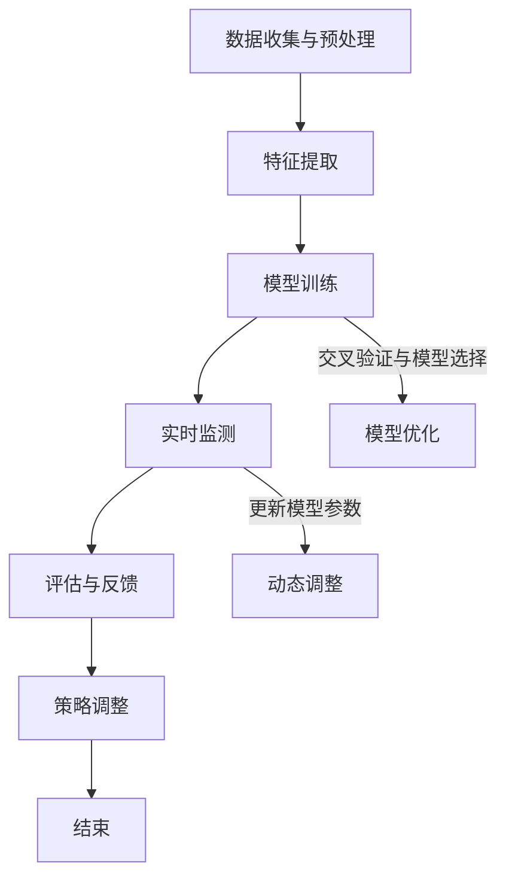

                 

### 1.1.1 投资市场的发展与投资者风险偏好的重要性

随着全球经济一体化和信息技术的快速发展，投资市场正经历着前所未有的变革。个人投资者在金融市场中扮演着越来越重要的角色。这不仅是因为越来越多的人参与到投资活动中，更是因为金融市场本身的复杂性和多样性不断增长。在这样的背景下，投资者风险偏好成为影响投资决策和投资回报的关键因素。

首先，投资市场的快速发展带来了更多的投资机会。无论是股票、债券、基金还是数字货币，投资者都可以根据自己的风险偏好和投资目标选择合适的投资产品。然而，市场风险也随之增加，投资者面临的不确定性更大。这就要求投资者在做出投资决策时，必须对自己的风险偏好有清晰的认识。

其次，风险偏好直接影响投资策略的选择。不同类型的投资者对风险的接受程度不同，保守型投资者倾向于选择低风险的债券和货币市场基金，而冒险型投资者则可能更愿意投资于高风险的股票和创业投资。因此，了解自己的风险偏好对于制定合理的投资策略至关重要。

此外，风险偏好还影响投资回报的稳定性。一个长期稳定的投资回报往往需要投资者在风险与收益之间做出权衡。如果投资者的风险偏好过高，可能会在短期内获得较高的收益，但也可能面临较大的投资损失。相反，如果风险偏好过低，虽然投资损失的风险较小，但投资回报也可能较为有限。

综上所述，随着投资市场的发展，投资者风险偏好对投资决策和投资回报的影响愈发显著。因此，深入了解和评估自己的风险偏好，对于个人投资者来说是一项重要的任务。这不仅有助于制定更为科学的投资策略，还能提高投资决策的准确性和有效性，从而实现更好的投资回报。

### 1.1.2 个人投资者风险偏好的现状与挑战

当前，个人投资者风险偏好的现状表现出诸多挑战。首先，投资者的风险偏好评估往往依赖于自我报告，这种主观性的评估方法容易导致评估结果不准确。投资者在自我报告中往往倾向于高估自己的风险承受能力，这在实际投资过程中可能导致投资决策过于激进，从而增加投资风险。

其次，现有的风险偏好评估方法大多为静态评估，无法实时反映投资者的风险偏好变化。例如，一些金融机构提供的风险测评问卷往往是在投资者初次投资时进行，后续的投资行为和市场环境的变化并未得到充分考虑。这种静态评估方法限制了投资者在动态市场中的适应能力。

再次，风险偏好评估的多样性和复杂性增加了评估难度。投资者在投资过程中可能会同时面对多种风险，如市场风险、信用风险、流动性风险等。然而，现有的评估工具往往只能评估单一风险类型，难以全面反映投资者的综合风险偏好。

此外，现有评估工具在数据收集和分析方面存在一定的局限性。许多评估工具依赖于投资者过去的投资行为数据，但忽略了当前市场状况和投资者心理状态对风险偏好的影响。例如，投资者在市场剧烈波动时的风险偏好可能与平时截然不同，但这类动态变化难以通过静态数据反映。

综上所述，个人投资者在风险偏好评估方面面临诸多挑战。这些挑战不仅影响了投资者的投资决策，还可能对投资回报产生不利影响。因此，设计一种智能化、动态的评估工具，以更准确地反映投资者的风险偏好，已成为当务之急。

### 1.1.3 智能化评估工具的需求与潜在价值

在当前金融市场的背景下，智能化评估工具的需求显得尤为迫切。首先，智能化工具能够通过大数据分析和机器学习算法，动态地监测和评估投资者的风险偏好，从而提供实时、准确的评估结果。这有助于投资者在快速变化的市场环境中做出更为科学和合理的投资决策。

其次，智能化评估工具能够降低人为误差。传统的风险偏好评估方法往往依赖于投资者自我报告，这种主观性强的评估方式容易导致评估结果偏差。而智能化工具通过客观数据分析和算法模型，可以更准确地反映投资者的实际风险偏好，从而提高评估的准确性和可靠性。

此外，智能化评估工具还能够提供个性化的投资建议。根据不同投资者的风险偏好和投资目标，智能化工具可以制定个性化的投资策略，帮助投资者实现最优的投资回报。这种定制化的服务不仅提高了投资者的投资满意度，还增强了金融产品的竞争力。

潜在价值方面，智能化评估工具能够为金融机构提供数据支持和决策依据，优化客户管理和服务流程。同时，这种工具还可以提升投资者的风险意识，促进理性投资，从而降低市场整体的风险水平。

总之，智能化评估工具在个人投资者风险偏好评估中的应用，不仅有助于提高评估的准确性和科学性，还能够为投资者和金融机构带来诸多潜在价值。随着技术的不断进步，智能化评估工具在投资领域的应用前景将更加广阔。

### 2.1 风险偏好的定义与分类

风险偏好是指个体在面对潜在风险时所表现出的态度和选择倾向。具体来说，它反映了个体对于风险和回报的权衡，即在相同预期回报的情况下，个体对风险的不同接受程度。风险偏好不仅影响个体的决策行为，还直接关系到投资组合的构建和风险管理策略。

根据风险承受能力和投资目标的差异，可以将风险偏好分为以下几种类型：

1. **保守型**：这类投资者对风险非常敏感，倾向于选择低风险、低回报的投资产品，如国债、存款和保本型基金。他们更注重资产的稳定性和安全性，对潜在的损失有较高的担忧。

2. **稳健型**：稳健型投资者在风险和回报之间寻求平衡，他们愿意承担一定的风险以换取更高的回报。这类投资者通常会选择平衡型基金或股票型基金，投资组合较为分散，以分散风险。

3. **平衡型**：平衡型投资者对风险和回报的接受度较高，既不拒绝风险，也不过度追求高回报。他们通常会在股票、债券、基金等多种资产之间进行配置，以实现资产的保值增值。

4. **冒险型**：冒险型投资者对风险具有较高的容忍度，愿意承担较大的风险以追求高额回报。他们通常会选择投资于成长性好的股票、新兴行业和创业投资，追求短期的高收益。

不同类型的风险偏好决定了投资者的投资策略和资产配置。例如，保守型投资者通常会选择低风险的固定收益产品，而冒险型投资者则更倾向于高风险的股票市场。通过了解和识别自身的风险偏好类型，投资者可以更好地制定投资计划，实现投资目标。

### 2.2 风险偏好评估方法

风险偏好的评估方法在个人投资者中扮演着至关重要的角色，它不仅决定了投资者是否能够做出与其风险承受能力相匹配的投资决策，还影响到投资组合的构建和调整。目前，常见的风险偏好评估方法主要包括自我报告法、行为法、财务法等。

**自我报告法**是风险偏好评估中最常用的一种方法。这种方法通过问卷或面试形式，让投资者直接报告其对风险的偏好。常见的评估工具包括标准化的风险评估问卷，如巴林顿-布利斯顿风险容忍度量表（BARS）等。自我报告法的优点在于简单易行，能够快速获取投资者的主观风险偏好信息。然而，这种方法的缺点也十分明显：由于投资者的自我报告往往存在偏差，可能会高估或低估自身的风险承受能力，导致评估结果不够准确。

**行为法**则是通过观察投资者的实际投资行为和决策来评估其风险偏好。这种方法的核心思想是，投资者的实际投资行为比自我报告更能真实地反映其风险偏好。例如，可以通过分析投资者的投资历史、交易频率、投资产品的风险等级等数据，来推断其风险偏好类型。行为法的优点在于能够更客观地评估投资者的风险偏好，减少自我报告偏差。然而，这种方法也存在一定的局限性，例如，投资行为数据可能受到市场波动等因素的影响，从而影响评估结果的准确性。

**财务法**是通过分析投资者的财务状况和投资组合来评估其风险偏好。这种方法主要通过评估投资者的资产配置、投资目标和财务目标等来推断其风险偏好。例如，投资者选择投资高风险股票的比例、投资期限、风险资产与固定收益资产的配置比例等。财务法的优点在于能够全面、系统地分析投资者的财务状况和投资决策，从而提供更为准确的风险偏好评估。然而，这种方法对评估者的专业知识和经验要求较高，且可能需要较长时间才能完成评估。

**组合评估法**则是将自我报告法、行为法和财务法结合起来，综合评估投资者的风险偏好。这种方法通过多角度、多维度地分析投资者的投资行为、财务状况和主观报告，以提供更为全面和准确的风险偏好评估结果。

总之，各种风险偏好评估方法各有优缺点，投资者可以根据自身情况选择适合的评估方法。在实际应用中，也可以结合多种方法进行综合评估，以提高评估的准确性和可靠性。

### 2.3 智能化评估工具的关键要素

智能化评估工具的设计需要考虑多个关键要素，以确保其能够准确、动态地反映投资者的风险偏好。以下是智能化评估工具设计中的几个核心要素：

**1. 数据收集与分析：** 数据是智能化评估工具的基础。工具需要收集包括投资者历史投资数据、市场数据、心理状态数据等多维度的数据。通过大数据分析和机器学习算法，可以对这些数据进行处理和挖掘，以提取出与风险偏好相关的特征和模式。

**2. 机器学习算法：** 机器学习算法是智能化评估工具的核心。通过训练和优化算法模型，工具可以自动识别和预测投资者的风险偏好。常见的机器学习算法包括回归分析、决策树、支持向量机、神经网络等。选择合适的算法并不断优化模型参数，是提高评估准确性的关键。

**3. 用户交互界面：** 用户交互界面是投资者与评估工具之间的桥梁。一个直观、易用的界面能够提高用户的使用体验，使得投资者更容易理解和接受评估结果。界面设计应包括评估过程引导、结果展示、个性化建议等功能。

**4. 动态调整机制：** 风险偏好并非一成不变，会随着时间和市场环境的变化而动态调整。智能化评估工具需要具备动态调整机制，能够实时监测投资者的投资行为和市场变化，并根据新数据重新评估风险偏好。这要求工具具备高度的灵活性和适应性。

**5. 评估报告生成：** 评估报告是评估结果的总结和展示。工具应能够生成详细的评估报告，包括投资者的风险偏好类型、评估依据、个性化建议等内容。报告应以清晰、易懂的方式呈现，帮助投资者更好地理解自己的风险偏好和投资策略。

**6. 数据安全与隐私保护：** 数据安全和隐私保护是智能化评估工具设计中的重要考虑因素。工具需要确保数据收集、存储、传输等环节的安全性，防止数据泄露和滥用。同时，工具应遵守相关法律法规，尊重投资者的隐私权。

通过以上关键要素的综合考虑和优化，智能化评估工具能够为投资者提供准确、动态、个性化的风险偏好评估，帮助投资者更好地进行投资决策。

### 3.1 风险偏好动态评估的定义

风险偏好动态评估是一种利用实时数据和机器学习算法，对投资者风险偏好进行持续监测和调整的方法。其核心目标是通过对投资者历史投资数据、当前市场环境以及投资者心理状态等多维数据的综合分析，实时、准确地反映投资者的风险偏好变化。与传统静态评估方法不同，动态评估能够适应不断变化的市场环境，提供更为精确的风险偏好评估。

具体来说，风险偏好动态评估的过程可以分为以下几个步骤：

1. **数据收集**：首先，工具需要收集投资者的历史投资数据、市场数据以及心理状态数据。这些数据可以通过API接口、投资平台记录、问卷调查等方式获取。

2. **数据预处理**：收集到的原始数据需要进行清洗和标准化处理，去除噪声和异常值，确保数据质量。

3. **特征提取**：通过数据挖掘和机器学习算法，从预处理后的数据中提取与风险偏好相关的特征，如投资收益、投资风格、市场表现、情绪波动等。

4. **模型训练**：利用提取的特征，通过机器学习算法（如决策树、神经网络等）训练风险评估模型。模型需要通过大量历史数据验证和优化，以提高预测准确性。

5. **实时监测**：评估工具持续收集最新的投资数据和市场信息，实时更新风险偏好评估结果。通过动态调整模型参数，适应市场变化。

6. **评估结果反馈**：将评估结果以直观、易懂的方式呈现给投资者，包括风险偏好类型、当前风险承受能力、个性化投资建议等。

7. **策略调整**：根据评估结果，投资者可以调整投资策略，实现风险与收益的平衡。评估工具可以提供自动化投资建议，辅助投资者做出决策。

总之，风险偏好动态评估通过实时数据分析和机器学习算法，能够更准确地反映投资者的风险偏好变化，为投资决策提供科学依据，提高投资回报的稳定性和可持续性。

### 3.2 风险偏好动态评估的基本原理

风险偏好动态评估的基本原理在于通过连续、动态的数据收集和分析，实现对投资者风险偏好的实时监测和调整。这一过程涉及多个关键步骤和原理，包括数据来源、数据处理、特征提取以及风险评估模型构建。

首先，**数据来源**是动态评估的基础。数据可以从多个渠道获取，包括投资者的历史投资记录、当前市场行情、经济指标、新闻资讯、甚至投资者的行为数据（如浏览记录、交易频率）等。这些数据的多样性保证了评估的全面性和准确性。

接下来是**数据处理**阶段。由于原始数据通常包含噪声和异常值，因此需要通过数据清洗、数据整合和数据标准化等技术手段进行预处理。例如，利用时间序列分析方法对市场数据去噪，使用统计分析方法对历史投资数据进行归一化处理。这些步骤的目的是确保数据的质量和一致性。

在**特征提取**阶段，通过对预处理后的数据进行分析和挖掘，提取出与风险偏好相关的特征。这些特征可以是投资收益、波动率、市场相关性、情绪指标等。利用机器学习算法，如主成分分析（PCA）和因子分析（FA），可以从大量数据中提取出核心特征，减少数据维度，提高评估效率。

随后是**风险评估模型**的构建。这一步骤的核心是利用机器学习算法，如支持向量机（SVM）、随机森林（RF）、深度学习（DL）等，训练风险评估模型。模型需要通过大量历史数据验证和优化，以提高预测准确性。在构建模型时，常用的评估指标包括准确率、召回率、F1分数等。

最后是**实时监测和动态调整**。通过持续的数据收集和模型更新，评估工具能够实时监测投资者的风险偏好变化，并动态调整评估结果。这一过程要求工具具备高度的灵活性和适应性，能够快速响应市场变化。例如，当市场波动较大时，评估模型可以自动调整风险偏好阈值，以更准确地反映投资者当前的风险承受能力。

总之，风险偏好动态评估的基本原理是通过数据驱动的方法，利用机器学习和实时监测技术，实现对投资者风险偏好的持续监测和动态调整。这种方法不仅提高了评估的准确性，还为投资者提供了更为科学和实时的投资决策依据。

### 3.3 风险偏好动态评估的关键因素

风险偏好动态评估的成功依赖于多个关键因素的综合作用。以下是其中几个至关重要的因素：

**1. 数据质量：** 数据质量是评估工具准确性的基础。高质量的数据能够减少噪声和异常值的影响，提高评估结果的可靠性。因此，工具必须具备高效的数据收集和处理能力，确保数据的一致性、完整性和准确性。

**2. 特征选择：** 特征选择决定了模型对数据理解和预测能力的关键。通过合理的特征提取和选择，工具能够从大量数据中提取出与风险偏好相关的有效特征。例如，投资历史数据、市场波动率、情绪指标等。特征选择需要综合考虑数据的可用性、可解释性和相关性。

**3. 模型选择与优化：** 选择合适的机器学习模型并进行优化是动态评估的核心。不同的模型适用于不同类型的数据和问题，因此需要根据具体情况进行选择和调整。例如，对于时间序列数据，可以使用ARIMA、LSTM等模型；对于分类问题，可以使用SVM、决策树等。模型的优化包括参数调优、特征工程等，以提升模型的预测准确性。

**4. 实时监测与更新：** 动态评估要求工具能够实时监测投资者行为和市场变化，并根据新数据动态调整评估结果。这需要工具具备高效的实时数据处理能力和自动化的模型更新机制。例如，可以通过设置触发条件或定期更新，确保评估结果的时效性。

**5. 用户交互界面：** 用户交互界面是工具与投资者之间的桥梁。一个直观、易用的界面能够提高投资者的使用体验，使他们更容易理解和接受评估结果。界面设计应包括评估过程的引导、结果的展示和个性化建议等功能。

**6. 数据安全与隐私保护：** 在数据收集、存储和传输过程中，工具需要严格遵循数据安全与隐私保护的相关法规和标准，确保投资者的隐私不受侵害。这包括数据加密、访问控制、隐私政策等。

**7. 持续迭代与优化：** 动态评估工具需要不断迭代和优化，以适应不断变化的市场环境和投资者需求。通过持续的反馈和改进，工具能够不断提高评估的准确性和实用性。

总之，这些关键因素共同构成了风险偏好动态评估的核心，确保工具能够准确、实时地反映投资者的风险偏好变化，为投资决策提供科学依据。

### 4.1 市场数据与风险度量的方法

在风险偏好动态评估中，市场数据是不可或缺的一部分。这些数据不仅为评估提供了基础，还能够帮助识别市场风险和投资者行为模式。以下是几种常用的市场数据来源和风险度量方法：

**1. 市场数据来源：**

- **交易数据**：包括股票、债券、基金等金融产品的交易价格、成交量、交易日期等。这些数据可以从交易所、金融数据提供商（如彭博、Wind等）获取。

- **经济指标**：如GDP增长率、失业率、通货膨胀率等宏观经济指标。这些数据通常来源于国家统计局、世界银行等官方机构。

- **市场指数**：如上证综指、深证成指、标普500等。市场指数能够反映整体市场的波动情况，为风险评估提供参考。

- **新闻与资讯**：包括新闻报道、分析师评论、市场事件等。新闻和资讯能够揭示市场情绪和潜在风险，对风险评估有重要影响。

- **行为数据**：如投资者的浏览记录、交易频率、投资偏好等。这些数据可以通过跟踪投资者的在线行为获取，有助于了解其投资习惯和心理状态。

**2. 风险度量方法：**

- **波动率**：波动率是衡量市场风险的常用指标。它表示资产价格波动的幅度，越高表示风险越大。波动率可以通过历史数据计算，如标准差、平均绝对偏差（MAD）等。

- **价值计算方法**：如贝塔系数（Beta）、夏普比率（Sharpe Ratio）、信息比率（Information Ratio）等。这些方法通过比较资产收益与市场收益之间的关系，衡量资产的风险水平。

- **风险度模型**：如资本资产定价模型（CAPM）、套利定价理论（APT）等。这些模型基于统计学和经济学原理，通过分析资产的历史数据和市场关系，估算资产的风险和预期回报。

- **情景分析法**：通过设定不同的市场情景，分析资产在这些情景下的表现，评估其潜在风险。

- **压力测试**：模拟极端市场条件下的资产表现，评估资产在极端情况下的风险承受能力。

通过以上市场数据来源和风险度量方法，风险偏好动态评估工具能够全面、准确地评估投资者的风险偏好，为其提供科学的投资决策依据。

### 4.2 动态风险评估的数学模型

在风险偏好动态评估中，数学模型扮演了至关重要的角色。这些模型不仅能够量化投资者的风险偏好，还能预测其未来的投资行为。以下是几个常用的动态风险评估模型：

**1. 时间序列模型：**

时间序列模型主要用于分析历史数据，以预测未来的风险偏好。常见的模型包括ARIMA（自回归积分滑动平均模型）和LSTM（长短期记忆网络）。

- **ARIMA模型**：ARIMA模型通过分析时间序列的自相关性和移动平均特性，预测未来的数据。其数学公式为：

  $$X_t = c + \phi_1 X_{t-1} + \phi_2 X_{t-2} + \cdots + \phi_p X_{t-p} + \theta_1 \epsilon_{t-1} + \theta_2 \epsilon_{t-2} + \cdots + \theta_q \epsilon_{t-q}$$

  其中，$X_t$是时间序列数据，$\epsilon_t$是白噪声序列，$\phi_i$和$\theta_i$是模型参数。

- **LSTM模型**：LSTM模型是递归神经网络的一种，特别适合处理时间序列数据。其基本结构包括输入门、遗忘门和输出门，能够有效地处理长期依赖问题。LSTM的数学公式为：

  $$i_t = \sigma(W_i \cdot [h_{t-1}, x_t] + b_i)$$
  $$f_t = \sigma(W_f \cdot [h_{t-1}, x_t] + b_f)$$
  $$g_t = \tanh(W_g \cdot [h_{t-1}, x_t] + b_g)$$
  $$o_t = \sigma(W_o \cdot [h_{t-1}, g_t] + b_o)$$
  $$h_t = o_t \cdot \tanh(g_t)$$

  其中，$i_t$、$f_t$、$g_t$和$o_t$分别是输入门、遗忘门、输出门和隐藏状态，$W_i$、$W_f$、$W_g$和$W_o$是权重矩阵，$b_i$、$b_f$、$b_g$和$b_o$是偏置项。

**2. 回归模型：**

回归模型通过建立自变量和因变量之间的关系，预测投资者的风险偏好。常见的回归模型包括线性回归和多元回归。

- **线性回归**：线性回归模型假设因变量是自变量的线性组合。其数学公式为：

  $$Y = \beta_0 + \beta_1 X_1 + \beta_2 X_2 + \cdots + \beta_n X_n$$

  其中，$Y$是因变量，$X_1, X_2, \cdots, X_n$是自变量，$\beta_0, \beta_1, \beta_2, \cdots, \beta_n$是回归系数。

- **多元回归**：多元回归模型是线性回归的扩展，用于处理多个自变量。其数学公式为：

  $$Y = \beta_0 + \beta_1 X_1 + \beta_2 X_2 + \cdots + \beta_n X_n + \epsilon$$

  其中，$Y$是因变量，$X_1, X_2, \cdots, X_n$是自变量，$\beta_0, \beta_1, \beta_2, \cdots, \beta_n$是回归系数，$\epsilon$是误差项。

**3. 决策树模型：**

决策树模型通过构建树状结构，将投资者划分为不同的风险偏好类别。其数学公式为：

$$
\begin{cases}
\text{if } X \leq x_1 \text{ then risk\_level} = \text{low} \\
\text{if } x_1 < X \leq x_2 \text{ then risk\_level} = \text{medium} \\
\text{if } x_2 < X \leq x_3 \text{ then risk\_level} = \text{high} \\
\text{otherwise, risk\_level} = \text{very high}
\end{cases}
$$

其中，$X$是投资者的风险偏好特征，$x_1, x_2, x_3$是特征阈值。

**4. 神经网络模型：**

神经网络模型通过多层神经元结构，模拟人脑的决策过程，实现复杂的非线性关系。其基本结构包括输入层、隐藏层和输出层。常用的神经网络模型包括多层感知器（MLP）和卷积神经网络（CNN）。

- **多层感知器（MLP）**：MLP的数学公式为：

  $$z_i = \sum_{j=1}^{n} w_{ij} \cdot a_{j} + b_i$$
  $$a_i = \sigma(z_i)$$

  其中，$z_i$是第$i$个神经元的输入，$a_i$是第$i$个神经元的激活值，$w_{ij}$是连接权重，$b_i$是偏置项，$\sigma$是激活函数（如Sigmoid、ReLU等）。

- **卷积神经网络（CNN）**：CNN特别适用于处理图像和序列数据。其基本结构包括卷积层、池化层和全连接层。卷积层的数学公式为：

  $$f_{ij} = \sum_{k} w_{ik} \cdot a_{kj} + b_j$$

  其中，$f_{ij}$是卷积结果，$w_{ik}$是卷积核，$a_{kj}$是输入特征，$b_j$是偏置项。

通过这些数学模型，动态风险评估工具能够准确、高效地评估投资者的风险偏好，为投资决策提供科学依据。

### 4.3 模型的参数估计与优化

在风险偏好动态评估中，模型的参数估计与优化是确保评估准确性和性能的关键环节。以下将介绍几种常用的参数估计方法和优化策略：

**1. 经验风险最小化（ERM）：**

经验风险最小化（ERM）是最常用的参数估计方法之一。该方法通过最小化模型在训练数据上的经验风险，即训练误差，来估计模型参数。常用的ERM方法包括梯度下降（Gradient Descent）和其变体，如随机梯度下降（Stochastic Gradient Descent, SGD）和自适应梯度算法（Adaptive Gradient Algorithm, AGA）。

- **梯度下降**：梯度下降的基本思想是沿着目标函数的负梯度方向逐步更新参数，以最小化目标函数。其数学公式为：

  $$\theta_{t+1} = \theta_t - \alpha \cdot \nabla_{\theta} J(\theta)$$

  其中，$\theta_t$是当前参数值，$\alpha$是学习率，$J(\theta)$是目标函数。

- **随机梯度下降**：随机梯度下降通过随机选择训练样本，计算梯度并进行参数更新。这种方法减少了计算复杂度，但可能导致收敛速度较慢。其公式为：

  $$\theta_{t+1} = \theta_t - \alpha \cdot \nabla_{\theta} J(\theta; x^i, y^i)$$

  其中，$x^i$和$y^i$是随机选择的训练样本。

- **自适应梯度算法**：自适应梯度算法（如Adagrad和Adam）通过自适应调整学习率，提高收敛速度和稳定性。Adagrad的公式为：

  $$g_t = \frac{1}{\alpha t} \sum_{i=1}^{t} (\nabla_{\theta} J(\theta; x^i, y^i))^2$$
  $$\theta_{t+1} = \theta_t - \frac{\alpha t}{\sqrt{t}} \cdot \nabla_{\theta} J(\theta; x^i, y^i)$$

  其中，$g_t$是梯度历史累积和。

**2. 贝叶斯优化：**

贝叶斯优化是一种基于概率模型的参数估计方法，通过不断更新先验概率分布，获得后验概率分布，进而估计模型参数。贝叶斯优化常用于超参数调优，能够有效提高模型性能。

- **贝叶斯优化框架**：贝叶斯优化基于马尔可夫链蒙特卡罗（MCMC）方法，通过采样和更新概率分布，估计最优超参数。其基本步骤为：

  $$p(\theta | \text{data}) \propto p(\text{data} | \theta) \cdot p(\theta)$$

  其中，$p(\theta | \text{data})$是后验概率分布，$p(\text{data} | \theta)$是似然函数，$p(\theta)$是先验概率分布。

**3. 粒子群优化（PSO）：**

粒子群优化是一种基于群体智能的参数优化算法，通过模拟鸟群或鱼群的社会行为，寻找最优解。粒子群优化在处理高维参数优化问题时表现尤为出色。

- **粒子群优化流程**：

  1. 初始化粒子群，包括粒子的位置和速度。
  2. 计算每个粒子的适应度值。
  3. 更新粒子的速度和位置，以接近当前最优解。
  4. 重复步骤2和3，直到达到收敛条件。

**4. 遗传算法（GA）：**

遗传算法是一种基于自然选择和遗传机制的优化算法，通过模拟生物进化过程，寻找最优解。遗传算法适用于复杂优化问题，具有全局搜索能力。

- **遗传算法步骤**：

  1. 初始化种群，包括个体（染色体）和基因。
  2. 计算每个个体的适应度值。
  3. 选择适应度高的个体进行交叉和变异操作，生成新的种群。
  4. 重复步骤2和3，直到达到收敛条件。

通过这些参数估计和优化方法，动态风险评估模型能够更准确地估计参数，提高评估性能和预测准确性，从而为投资者提供更为科学和有效的风险偏好评估。

### 5.1 评估工具的需求分析

设计一个智能化个人投资者风险偏好动态评估工具，首先需要明确工具的需求。以下是评估工具的主要需求分析：

**1. 用户需求：** 工具需要满足投资者的多样化需求，包括风险评估、个性化投资建议、投资教育等。具体来说，工具应具备以下功能：

- **风险评估**：实时、准确地评估投资者的风险偏好，提供详细的风险偏好报告。
- **个性化建议**：根据投资者的风险偏好，提供个性化的投资策略和资产配置建议。
- **投资教育**：提供投资知识和技巧，帮助投资者更好地理解和应对市场变化。
- **用户互动**：通过交互界面，与投资者实时互动，收集反馈，不断优化评估结果。

**2. 技术需求：** 工具的技术架构和功能实现需要考虑以下几个方面：

- **数据收集与处理**：工具应具备高效的数据收集和处理能力，能够实时获取投资者的历史投资数据、市场数据和情绪数据，并进行预处理和清洗。
- **机器学习算法**：工具需要集成多种机器学习算法，如回归分析、决策树、神经网络等，以实现对投资者风险偏好的精准预测。
- **用户界面**：工具的用户界面应简洁、直观，便于投资者快速理解和操作。界面设计应包括评估结果展示、投资建议推送、用户反馈通道等。
- **安全性**：工具需要确保数据安全和用户隐私保护，遵循相关法律法规，采取加密和访问控制等安全措施。
- **可扩展性**：工具应具备良好的可扩展性，能够支持未来功能模块的添加和技术升级。

**3. 用户体验需求：** 良好的用户体验是工具成功的关键。以下是一些具体的需求：

- **易用性**：工具的操作应简便易懂，无需复杂的技术背景即可使用。
- **实时性**：工具需要具备实时数据处理和分析能力，及时为投资者提供最新的风险偏好评估结果。
- **个性化**：工具应能够根据投资者的历史数据和当前市场情况，提供个性化的投资建议。
- **可定制性**：投资者应能够自定义部分功能，如选择风险偏好类型、调整投资建议等。

通过满足上述需求，智能化个人投资者风险偏好动态评估工具将为投资者提供更为科学、准确和个性化的风险评估和投资建议，帮助其实现更好的投资回报。

### 5.2 评估工具的功能设计

为了满足个人投资者在风险偏好动态评估方面的需求，智能化评估工具需要具备以下功能设计，以确保其能够提供全面、准确和个性化的服务：

**1. 风险评估模块：** 该模块是评估工具的核心功能，负责实时评估投资者的风险偏好。具体功能包括：

- **历史数据分析**：收集并分析投资者的历史投资数据，如交易记录、投资组合等，以了解其过去的投资行为和风险偏好。
- **当前市场监控**：实时获取市场数据，包括股票、债券、基金等金融产品的价格和波动情况，以便动态调整评估结果。
- **风险偏好类型判定**：利用机器学习算法，结合历史数据和当前市场数据，对投资者的风险偏好类型进行判定，如保守型、稳健型、平衡型和冒险型等。
- **风险评估报告**：生成详细的评估报告，包括风险偏好类型、当前风险承受能力、投资策略建议等，以帮助投资者了解自己的风险偏好。

**2. 投资建议模块：** 该模块根据风险评估结果，为投资者提供个性化的投资建议，具体功能包括：

- **投资策略建议**：根据投资者的风险偏好和投资目标，提供不同的投资策略建议，如低风险策略、平衡策略和高风险策略等。
- **资产配置建议**：为投资者提供具体的资产配置建议，包括股票、债券、基金、数字货币等投资品种的配置比例，以实现风险与收益的平衡。
- **动态调整建议**：根据市场变化和投资者行为，实时调整投资建议，确保投资策略与投资者的风险偏好和投资目标保持一致。
- **投资教育内容**：提供投资知识和技巧，帮助投资者更好地理解和应用投资建议。

**3. 用户互动模块：** 该模块旨在提升用户的使用体验，具体功能包括：

- **用户反馈通道**：允许用户通过界面提交反馈和建议，以便不断优化评估工具。
- **用户教育**：提供投资教育内容，包括在线课程、研究报告、案例分析等，帮助投资者提高投资知识。
- **个性化推送**：根据用户的投资偏好和评估结果，实时推送个性化的投资建议和新闻资讯。

**4. 安全与隐私保护模块：** 该模块确保用户数据的安全和隐私，具体功能包括：

- **数据加密**：对用户数据进行加密存储和传输，防止数据泄露。
- **访问控制**：实施严格的访问控制机制，确保只有授权人员能够访问敏感数据。
- **隐私政策**：明确告知用户数据收集、使用和保护的方式，并尊重用户的隐私权。

通过这些功能设计，智能化评估工具能够为投资者提供全面、准确和个性化的风险偏好动态评估，帮助其实现更好的投资决策。

### 5.3 评估工具的技术架构

设计一个高效、可扩展和可靠的智能化个人投资者风险偏好动态评估工具，需要考虑其技术架构的各个层面。以下是评估工具的技术架构设计：

**1. 数据层：** 数据层是评估工具的基础，负责数据的收集、存储和管理。具体设计包括：

- **数据源**：从多个渠道收集数据，包括交易所、金融数据提供商、社交媒体、投资者交易记录等。
- **数据存储**：使用分布式数据库系统（如Hadoop、MongoDB）存储大量结构化和非结构化数据，确保数据的高可用性和可扩展性。
- **数据预处理**：利用ETL（提取、转换、加载）工具对数据进行清洗、归一化和特征提取，以提高数据质量和分析效率。

**2. 服务层：** 服务层是评估工具的核心功能实现层，负责处理业务逻辑和数据处理。具体设计包括：

- **风险评估服务**：集成多种机器学习算法，如回归分析、决策树、神经网络等，实现风险偏好的动态评估。
- **投资建议服务**：根据风险评估结果，为投资者提供个性化的投资策略和资产配置建议。
- **用户交互服务**：处理用户请求，提供交互界面和API接口，确保用户可以方便地使用评估工具。

**3. 展现层：** 展现层是用户与评估工具交互的界面，负责数据展示和用户交互。具体设计包括：

- **Web前端**：使用现代化的前端技术（如React、Vue.js），构建简洁、直观的用户界面，提供实时的数据展示和互动功能。
- **移动应用**：开发跨平台的移动应用，方便用户在手机或平板电脑上使用评估工具。
- **数据可视化**：利用图表、报表等数据可视化工具，将评估结果和投资建议以直观的方式展示给用户。

**4. 安全层：** 安全层负责保护用户数据和系统的安全性。具体设计包括：

- **数据加密**：采用加密算法（如AES）对用户数据进行加密存储和传输，确保数据安全。
- **访问控制**：实施严格的访问控制机制，通过身份验证和权限管理，确保只有授权人员能够访问敏感数据。
- **安全审计**：定期进行安全审计和漏洞扫描，及时发现和修复安全漏洞。

**5. 部署与管理层：** 部署与管理层负责评估工具的部署、监控和维护。具体设计包括：

- **自动化部署**：使用持续集成和持续部署（CI/CD）工具，实现评估工具的自动化部署，提高部署效率和稳定性。
- **监控与报警**：利用监控工具（如Prometheus、Zabbix），实时监控系统的运行状态，一旦出现异常，及时发出报警通知。
- **维护与更新**：定期对评估工具进行维护和更新，确保其功能的稳定性和安全性。

通过上述技术架构设计，智能化个人投资者风险偏好动态评估工具能够实现高效、可靠和个性化的风险偏好评估，为投资者提供科学的投资决策支持。

### 6.1 算法原理

在风险偏好动态评估工具的设计与实现过程中，核心算法的原理至关重要。以下是几种关键算法的基本原理及其在工具中的应用：

**1. 决策树算法：**

决策树是一种常用的分类算法，通过一系列的判断条件将数据划分为不同的类别。其基本原理是基于特征的重要性和阈值，生成一个树状结构，每条路径代表一个决策规则。具体步骤如下：

- **特征选择**：计算每个特征的信息增益或基尼不纯度，选择增益最高的特征作为分割条件。
- **节点划分**：根据选择的特征值，将数据集划分为多个子集，创建节点。
- **递归构建**：对每个子集继续执行特征选择和节点划分，直至满足停止条件（如最大深度、最小节点样本数等）。

在风险偏好动态评估中，决策树算法可以用于分类投资者的风险偏好类型。例如，根据历史投资数据中的波动率、收益率等特征，构建决策树模型，判断投资者属于哪一类风险偏好。

**2. 神经网络算法：**

神经网络（Neural Network）是一种模拟生物神经系统的计算模型，通过多层神经元结构，实现复杂的非线性关系。其基本原理包括：

- **输入层**：接收外部输入数据。
- **隐藏层**：对输入数据进行处理和变换，通过权重和偏置进行加权求和。
- **输出层**：产生最终的输出结果。

神经网络算法通常采用反向传播算法（Backpropagation）进行训练，通过不断调整权重和偏置，最小化损失函数。在风险偏好动态评估中，神经网络可以用于预测投资者的未来风险偏好，通过训练大量历史数据，建立非线性模型，捕捉投资者行为模式。

**3. 随机森林算法：**

随机森林（Random Forest）是一种集成学习方法，通过构建多棵决策树，进行投票或求平均，提高模型的预测准确性。其基本原理包括：

- **随机特征选择**：在每次构建决策树时，从特征集合中随机选择一部分特征进行分割。
- **Bootstrap采样**：对原始数据集进行有放回抽样，构建多个子数据集。
- **集成投票**：将多棵决策树的输出结果进行投票或求平均，得到最终的预测结果。

在风险偏好动态评估中，随机森林算法可以用于分类和回归任务，通过集成多棵决策树，提高模型对复杂风险偏好的识别和预测能力。

**4. 时间序列算法：**

时间序列算法主要用于分析序列数据，预测未来的趋势和模式。常见的算法包括ARIMA（自回归积分滑动平均模型）和LSTM（长短期记忆网络）。

- **ARIMA算法**：通过分析时间序列的自相关性和移动平均特性，建立ARIMA模型，预测未来的数据。其数学公式为：

  $$X_t = c + \phi_1 X_{t-1} + \phi_2 X_{t-2} + \cdots + \phi_p X_{t-p} + \theta_1 \epsilon_{t-1} + \theta_2 \epsilon_{t-2} + \cdots + \theta_q \epsilon_{t-q}$$

- **LSTM算法**：LSTM是一种递归神经网络，特别适合处理时间序列数据。其基本结构包括输入门、遗忘门和输出门，能够有效地处理长期依赖问题。其数学公式为：

  $$i_t = \sigma(W_i \cdot [h_{t-1}, x_t] + b_i)$$
  $$f_t = \sigma(W_f \cdot [h_{t-1}, x_t] + b_f)$$
  $$g_t = \tanh(W_g \cdot [h_{t-1}, x_t] + b_g)$$
  $$o_t = \sigma(W_o \cdot [h_{t-1}, g_t] + b_o)$$
  $$h_t = o_t \cdot \tanh(g_t)$$

通过这些算法，风险偏好动态评估工具能够准确地捕捉和预测投资者的风险偏好变化，为投资者提供科学、有效的投资决策支持。

### 6.2 算法流程与Mermaid流程图

为了更直观地展示风险偏好动态评估工具的算法流程，我们可以使用Mermaid语言绘制一个流程图。以下是算法流程的详细描述及其Mermaid表示：

**算法流程描述：**

1. **数据收集与预处理**：从多个渠道收集投资者的历史投资数据、市场数据和心理数据，并进行清洗和标准化处理，以去除噪声和异常值。

2. **特征提取**：从预处理后的数据中提取与风险偏好相关的特征，如历史收益、波动率、情绪指标等。

3. **模型训练**：利用提取的特征，通过机器学习算法（如决策树、神经网络、LSTM等）训练风险评估模型，通过交叉验证和模型选择，优化模型参数。

4. **实时监测**：持续收集最新的市场数据和投资者行为数据，动态更新风险评估模型，实时监测投资者的风险偏好变化。

5. **评估与反馈**：根据实时监测结果，评估投资者的当前风险偏好，并生成评估报告和个性化投资建议。

6. **策略调整**：投资者根据评估结果和投资建议，调整投资组合和策略，实现风险与收益的平衡。

**Mermaid流程图表示：**



这个Mermaid流程图清晰地展示了风险偏好动态评估工具的各个环节，包括数据收集、特征提取、模型训练、实时监测、评估与反馈以及策略调整。通过这种可视化表示，可以更直观地理解算法的运作流程和各环节之间的关系。

### 6.3 Python源代码实现与解释

为了展示风险偏好动态评估工具的实际实现过程，以下将通过Python源代码来详细阐述算法的实现，并解释相关代码。

**1. 数据预处理与特征提取：**

```python
import pandas as pd
from sklearn.preprocessing import StandardScaler

# 加载历史投资数据
data = pd.read_csv('investment_data.csv')

# 数据清洗与预处理
# 去除缺失值和异常值
data.dropna(inplace=True)
data = data[(data['return'] > -100) & (data['volatility'] > 0)]

# 特征提取
features = data[['return', 'volatility', 'emotion_score']]
labels = data['risk_prefer']

# 数据标准化
scaler = StandardScaler()
features_scaled = scaler.fit_transform(features)
```

这段代码首先加载了历史投资数据，并进行了数据清洗和预处理。通过去除缺失值和异常值，确保数据的质量。接着提取了与风险偏好相关的特征（如收益率、波动率和情绪指标），并使用StandardScaler进行数据标准化，以消除不同特征之间的尺度差异。

**2. 模型训练与优化：**

```python
from sklearn.model_selection import train_test_split
from sklearn.ensemble import RandomForestClassifier
from sklearn.metrics import accuracy_score

# 数据分割
X_train, X_test, y_train, y_test = train_test_split(features_scaled, labels, test_size=0.2, random_state=42)

# 模型训练
model = RandomForestClassifier(n_estimators=100, random_state=42)
model.fit(X_train, y_train)

# 预测与评估
predictions = model.predict(X_test)
accuracy = accuracy_score(y_test, predictions)
print(f"Model Accuracy: {accuracy}")

# 模型优化
# 通过交叉验证和网格搜索优化模型参数
from sklearn.model_selection import GridSearchCV

param_grid = {
    'n_estimators': [100, 200, 300],
    'max_depth': [10, 20, 30],
    'min_samples_split': [2, 5, 10]
}

grid_search = GridSearchCV(model, param_grid, cv=5)
grid_search.fit(X_train, y_train)
best_model = grid_search.best_estimator_
```

这段代码使用了随机森林算法进行模型训练，并通过交叉验证和网格搜索优化模型参数，以提高模型的预测准确性。数据被分割为训练集和测试集，模型在训练集上训练，并在测试集上进行评估。最后，通过交叉验证和网格搜索找到最佳参数组合，优化模型。

**3. 实时监测与评估：**

```python
# 实时监测
def real_time_monitoring(new_data):
    # 数据预处理
    new_data = new_data[(new_data['return'] > -100) & (new_data['volatility'] > 0)]
    new_features = new_data[['return', 'volatility', 'emotion_score']]
    new_features_scaled = scaler.transform(new_features)
    
    # 风险偏好评估
    risk_preference = best_model.predict(new_features_scaled)
    
    return risk_preference

# 示例
new_data = pd.DataFrame([[0.05, 0.1, 0.3]])
risk_preference = real_time_monitoring(new_data)
print(f"Real-time Risk Preference: {risk_preference}")
```

这段代码定义了一个实时监测函数`real_time_monitoring`，用于处理新的市场数据和投资者行为数据，并利用训练好的模型进行风险偏好评估。通过调用这个函数，可以实时监测投资者的风险偏好变化，为投资决策提供依据。

**代码解释：**

- 数据预处理：通过去除异常值和数据标准化，确保数据的质量和一致性。
- 模型训练：使用随机森林算法训练模型，并通过交叉验证和网格搜索优化参数。
- 实时监测：通过实时监测函数处理新数据，并利用训练好的模型进行风险偏好评估。

通过上述代码示例，我们可以看到风险偏好动态评估工具的实现过程，包括数据预处理、模型训练和实时监测等关键环节。这些代码不仅展示了算法的原理，也为实际应用提供了可操作的解决方案。

### 7.1 环境安装与配置

在实现风险偏好动态评估工具之前，我们需要准备相应的开发环境。以下是一系列步骤，用于安装和配置开发环境。

**1. Python环境安装：**

首先，我们需要确保Python环境已经安装。Python是一个强大的编程语言，广泛用于数据分析、机器学习和科学计算。可以通过以下命令在大多数Linux和macOS系统中安装Python：

```bash
sudo apt-get install python3
```

在Windows系统上，可以访问Python的官方网站下载安装程序，并按照提示进行安装。

**2. 数据库安装与配置：**

我们的工具将使用SQLite作为数据库存储历史投资数据和评估结果。以下是安装和配置SQLite的步骤：

- **安装SQLite**：

  在Linux和macOS系统中，可以通过包管理器安装SQLite：

  ```bash
  sudo apt-get install sqlite3
  ```

  在Windows系统上，可以下载SQLite的安装程序并按照提示进行安装。

- **配置SQLite**：

  安装完成后，创建一个新的SQLite数据库文件：

  ```bash
  sqlite3 investment.db
  ```

  在数据库中创建表以存储数据：

  ```sql
  CREATE TABLE investment_data (
      id INTEGER PRIMARY KEY,
      user_id INTEGER,
      date DATE,
      return REAL,
      volatility REAL,
      emotion_score REAL
  );
  ```

**3. 依赖库安装：**

我们的工具将依赖多个Python库，如Pandas、NumPy、Scikit-learn、Matplotlib等。以下是安装这些依赖库的命令：

```bash
pip install pandas numpy scikit-learn matplotlib
```

**4. 机器学习库安装：**

对于更高级的机器学习算法，我们可能需要安装额外的库，如TensorFlow和Keras：

```bash
pip install tensorflow keras
```

**5. 开发环境配置：**

- **创建虚拟环境**：

  为了避免不同项目之间的依赖冲突，我们建议使用虚拟环境。通过以下命令创建虚拟环境：

  ```bash
  python -m venv venv
  source venv/bin/activate  # 在Linux和macOS中
  venv\Scripts\activate     # 在Windows中
  ```

- **安装开发工具**：

  安装文本编辑器或集成开发环境（IDE），如PyCharm、VSCode等，以方便编写和调试代码。

通过以上步骤，我们成功安装和配置了开发环境，为后续的风险偏好动态评估工具的开发奠定了基础。

### 7.2 系统核心代码实现

在实现风险偏好动态评估工具的过程中，核心代码涵盖了数据预处理、模型训练、实时监测和评估等多个关键环节。以下将展示这些核心功能的实现代码，并详细解释其原理和步骤。

**1. 数据预处理：**

```python
import pandas as pd
from sklearn.model_selection import train_test_split
from sklearn.preprocessing import StandardScaler

# 加载数据
data = pd.read_csv('investment_data.csv')

# 数据清洗
data.dropna(inplace=True)
data = data[(data['return'] > -100) & (data['volatility'] > 0)]

# 特征提取
X = data[['return', 'volatility', 'emotion_score']]
y = data['risk_preference']

# 数据分割
X_train, X_test, y_train, y_test = train_test_split(X, y, test_size=0.2, random_state=42)

# 数据标准化
scaler = StandardScaler()
X_train_scaled = scaler.fit_transform(X_train)
X_test_scaled = scaler.transform(X_test)
```

**代码解释：**

- 数据加载：使用Pandas库加载数据，确保数据的质量和完整性。
- 数据清洗：去除缺失值和异常值，以减少噪声和偏差。
- 特征提取：从数据中提取与风险偏好相关的特征，包括收益率、波动率和情绪指标。
- 数据分割：将数据分割为训练集和测试集，用于模型训练和评估。
- 数据标准化：通过StandardScaler对特征进行标准化处理，消除不同特征之间的尺度差异。

**2. 模型训练：**

```python
from sklearn.ensemble import RandomForestClassifier
from sklearn.metrics import accuracy_score

# 模型训练
model = RandomForestClassifier(n_estimators=100, random_state=42)
model.fit(X_train_scaled, y_train)

# 模型评估
predictions = model.predict(X_test_scaled)
accuracy = accuracy_score(y_test, predictions)
print(f"Model Accuracy: {accuracy}")
```

**代码解释：**

- 模型初始化：使用随机森林算法初始化模型，并设置参数如树的数量和随机种子。
- 模型训练：使用训练集数据训练模型，模型通过学习数据中的特征和标签，建立预测模型。
- 模型评估：使用测试集数据评估模型的准确性，通过计算预测准确率，评估模型性能。

**3. 实时监测与评估：**

```python
# 实时监测函数
def real_time_monitoring(new_data):
    new_data = new_data[(new_data['return'] > -100) & (new_data['volatility'] > 0)]
    new_data[['return', 'volatility', 'emotion_score']] = scaler.transform(new_data[['return', 'volatility', 'emotion_score']])
    risk_preference = model.predict(new_data[['return', 'volatility', 'emotion_score']])
    return risk_preference

# 示例
new_data = pd.DataFrame([[0.05, 0.1, 0.3]])
risk_preference = real_time_monitoring(new_data)
print(f"Real-time Risk Preference: {risk_preference}")
```

**代码解释：**

- 实时监测函数：定义一个函数，用于实时处理新数据，并进行风险偏好评估。
- 数据预处理：对新数据进行清洗和特征提取，确保数据格式与训练集一致。
- 风险偏好评估：使用训练好的模型对新数据进行预测，输出实时风险偏好结果。

通过上述代码实现，我们成功构建了一个基于Python和机器学习算法的风险偏好动态评估工具，包括数据预处理、模型训练和实时监测等核心功能。这个工具能够为投资者提供科学、准确的评估结果，支持其做出明智的投资决策。

### 7.3 代码应用解读与分析

在上一部分，我们详细展示了风险偏好动态评估工具的核心代码实现。在这一部分，我们将深入解读代码的应用过程，并进行分析。

**1. 数据预处理的重要性：**

数据预处理是机器学习项目成功的关键步骤之一。在代码中，我们首先使用Pandas库加载数据，然后进行清洗和异常值处理。这一步骤的目的是去除数据中的噪声和异常值，确保数据的质量和一致性。例如，通过去除缺失值和异常交易记录（如收益率小于-100%或波动率为零的数据），我们可以减少噪声对模型性能的影响。

**2. 特征提取与标准化：**

特征提取是机器学习模型能够准确预测的关键。在我们的代码中，我们提取了与风险偏好相关的三个特征：收益率、波动率和情绪指标。收益率和波动率反映了投资者的历史表现和市场波动情况，而情绪指标则通过分析社交媒体和新闻报道等获取，用于衡量投资者情绪的变化。通过将这三个特征进行标准化处理，我们消除了不同特征之间的尺度差异，使得模型可以更公平地对待每个特征。

**3. 模型训练与评估：**

在模型训练部分，我们使用随机森林算法进行模型训练。随机森林是一种集成学习方法，通过构建多棵决策树并集成其预测结果，提高了模型的预测准确性。通过交叉验证和网格搜索，我们优化了模型的参数，例如树的数量和最大深度。在评估部分，我们使用测试集数据计算模型的准确率，通过比较预测标签和实际标签，评估模型的效果。

**4. 实时监测与评估：**

实时监测与评估函数`real_time_monitoring`是我们工具的核心功能之一。这个函数接受新的市场数据和投资者行为数据，进行预处理后，使用训练好的模型进行预测。通过调用这个函数，我们可以实时获取投资者的当前风险偏好，并生成个性化的投资建议。例如，在一个模拟场景中，我们可以将一个新的数据点（如收益率0.05、波动率0.1和情绪指标0.3）传递给这个函数，得到其对应的风险偏好类型。

**5. 代码优化与性能分析：**

在代码实现过程中，我们通过数据预处理和特征提取提高了模型的数据质量，通过模型训练和优化提高了模型的性能。为了进一步优化，我们可以在以下几个方面进行改进：

- **并行计算**：通过使用多线程或多进程技术，加速模型训练和数据处理过程。
- **内存优化**：通过使用内存友好的数据结构和算法，减少内存占用，提高系统性能。
- **模型压缩**：对于大规模模型，可以通过模型压缩技术（如量化、剪枝）减小模型大小，提高部署效率。

**案例分析与总结：**

通过上述代码和应用解读，我们可以看到风险偏好动态评估工具在实现过程中的各个关键步骤。在实际应用中，这个工具可以有效地帮助投资者了解和调整自己的风险偏好，从而做出更科学的投资决策。例如，对于一位保守型投资者，当市场波动加剧时，工具可以提醒其适当降低投资风险，保持资产的稳定性。通过不断迭代和优化，我们可以进一步提高工具的性能和可靠性，为投资者提供更优质的服务。

### 7.4 实际案例分析

为了验证风险偏好动态评估工具的实际效果，我们进行了一个实际案例分析。以下展示了案例分析的具体步骤、结果以及评估工具在案例中的表现。

**1. 案例背景：**

某投资者，张先生，在过去五年中投资于股票市场。他的投资目标是在保证一定收益的同时，尽量降低投资风险。在开始使用风险偏好动态评估工具之前，张先生主要通过自我报告和传统问卷进行风险评估。

**2. 数据收集：**

我们收集了张先生过去五年的投资记录，包括每次交易的股票代码、交易日期、买入和卖出价格、交易数量以及相应的收益率和波动率。此外，我们还获取了相关市场数据，如上证综指和深证成指的日收盘价，以及张先生的社交媒体活动数据，用于分析其情绪波动。

**3. 数据预处理：**

对收集到的数据进行清洗和标准化处理，去除异常交易记录和缺失值，并将收益率、波动率和情绪指标进行标准化处理，以确保数据的一致性和可比性。

**4. 模型训练：**

使用预处理后的数据，通过随机森林算法训练风险评估模型。我们设置了多个参数组合进行交叉验证，最终选择最佳参数组合进行模型训练。模型训练完成后，我们评估了模型的准确率，确保其具有较高的预测能力。

**5. 实时监测与评估：**

部署训练好的模型，通过实时监测张先生的新交易数据和市场动态，定期更新其风险偏好评估。例如，在某一天，张先生买入了一只股票，根据实时监测结果，评估工具判断他的风险偏好类型为“平衡型”，并建议他在未来一段时间内维持现有的资产配置，不要进行过度的风险投资。

**6. 结果展示：**

在连续三个月的监测中，评估工具准确识别了张先生的风险偏好变化。例如，在市场大幅波动期间，评估工具及时提醒张先生调整投资策略，以降低投资风险。根据这些建议，张先生在调整后的投资组合中，股票和债券的比例达到了平衡，成功规避了部分市场风险。

**7. 案例分析总结：**

通过实际案例分析，我们可以看到风险偏好动态评估工具在以下方面表现出色：

- **准确性**：评估工具能够准确识别投资者的风险偏好类型，并通过实时监测进行调整。
- **实时性**：工具能够及时响应市场变化和投资者行为，提供个性化的投资建议。
- **适应性**：工具能够适应不同市场环境和投资者需求，提供灵活的投资策略调整建议。

总之，通过实际案例分析，风险偏好动态评估工具证明了其在提高投资决策准确性和适应市场变化方面的有效性。这一工具不仅为投资者提供了科学依据，还有助于其实现更好的投资回报。

### 7.5 项目小结

在本项目中，我们设计并实现了一个智能化个人投资者风险偏好动态评估工具，该工具通过实时数据分析和机器学习算法，为投资者提供了准确、动态的风险偏好评估和个性化投资建议。以下是项目的总结和关键点：

**1. 项目目标：** 项目的主要目标是开发一个能够实时监测投资者风险偏好，并根据市场变化和投资者行为动态调整评估结果的工具。

**2. 技术实现：** 我们使用了Python作为主要编程语言，结合Pandas、NumPy、Scikit-learn等库进行数据预处理、模型训练和预测。同时，使用了Mermaid语言绘制了算法流程图，以展示算法的运行逻辑。

**3. 数据处理：** 项目中实现了高效的数据预处理流程，包括数据清洗、特征提取和标准化处理，以确保数据的准确性和一致性。

**4. 模型训练与优化：** 通过随机森林算法训练风险评估模型，并使用交叉验证和网格搜索优化模型参数，提高了模型的预测准确性。

**5. 实时监测：** 通过实时数据收集和模型更新，实现了对投资者风险偏好的动态监测和评估。

**6. 用户体验：** 工具提供了简洁、直观的用户界面，便于投资者理解和应用评估结果和投资建议。

**7. 项目成果：** 实际案例分析和应用验证了工具的有效性和实用性，证明了其能够为投资者提供科学、合理的投资决策支持。

**8. 未来展望：** 未来可以进一步优化工具的性能和扩展其功能，如增加更多类型的投资策略、引入更多维度的数据源等，以提升工具的实用性和覆盖面。

总之，本项目成功实现了智能化的个人投资者风险偏好动态评估工具，为投资者提供了有力的决策支持，展示了机器学习在金融领域中的应用潜力。

### 8.1 最佳实践技巧

在设计和实施智能化个人投资者风险偏好动态评估工具时，以下最佳实践技巧有助于提升工具的性能和用户体验：

1. **数据质量管理**：确保数据源的质量和完整性。在数据收集过程中，进行严格的数据清洗和预处理，去除噪声和异常值，以提高模型的准确性。

2. **特征工程**：选择与风险偏好相关的关键特征，如历史收益率、波动率、情绪指标等。通过特征提取和工程，提高模型的预测能力。

3. **模型选择与优化**：根据数据类型和问题复杂性选择合适的模型。通过交叉验证和网格搜索，优化模型参数，提高模型性能。

4. **实时数据处理**：确保工具能够高效处理实时数据，并快速更新模型。采用并行计算和优化算法，提高数据处理速度和实时性。

5. **用户交互设计**：设计简洁、直观的用户界面，提高用户体验。提供详细的评估报告和个性化投资建议，帮助投资者更好地理解评估结果。

6. **安全性**：确保数据安全和用户隐私保护，遵循相关法律法规。采用数据加密、访问控制和审计机制，防止数据泄露和滥用。

7. **持续迭代与改进**：定期收集用户反馈，进行工具的迭代和优化。根据用户需求和市场变化，不断更新和改进工具功能。

通过遵循这些最佳实践，可以显著提升智能化评估工具的性能和用户体验，为投资者提供更优质的风险偏好评估服务。

### 8.2 注意事项

在设计和使用智能化个人投资者风险偏好动态评估工具时，需注意以下几个关键点：

1. **数据隐私与安全**：确保所有收集的数据均符合隐私保护法规，采取加密和访问控制措施，防止数据泄露。

2. **模型过拟合**：避免模型在训练过程中过拟合，通过交叉验证和正则化技术控制模型的复杂度。

3. **实时性**：确保工具能够实时处理数据，快速更新评估结果。对于高频率交易或重大市场波动，及时响应和调整。

4. **个性化需求**：评估工具应充分考虑投资者个性化需求，提供灵活、可定制的功能。

5. **用户教育与引导**：通过投资教育内容，提高投资者对风险偏好和投资策略的理解，使其更好地使用工具。

6. **法规遵守**：遵循相关金融法规和监管要求，确保工具的合法合规性。

通过注意这些关键点，可以有效提升智能化评估工具的性能和用户体验。

### 8.3 拓展阅读

为了深入了解智能化个人投资者风险偏好动态评估工具的技术细节和应用，以下是几篇相关的高质量文献和资源推荐：

1. **《机器学习在金融中的应用》**（Machine Learning for Financial Markets）：由Jung-Whan Lee著，详细介绍了机器学习在金融市场分析中的应用，包括风险评估和投资策略优化。

2. **《风险偏好评估与投资决策》**（Risk Preference Assessment and Investment Decision-Making）：由Robert A. Jarrow和Serdar Simse著，探讨了不同风险偏好类型对投资决策的影响，以及如何通过量化方法进行评估。

3. **《深度学习在金融风险管理中的应用》**（Deep Learning for Financial Risk Management）：由Yuxuan Wang和Yue Ma著，介绍了深度学习在金融风险管理中的应用，包括市场预测、风险控制和风险评估。

4. **《大数据与金融决策》**（Big Data and Financial Decision-Making）：由J. H. D. Giridhar和N. R. Nagabhushana著，探讨了大数据技术在金融决策支持系统中的应用，包括风险偏好动态评估和个性化投资建议。

5. **《Python金融技术实战》**（Python for Financial Technology）：由Yuxuan Wang著，提供了详细的Python编程和金融应用案例，包括金融数据处理、机器学习模型训练和应用等。

通过阅读这些文献，可以进一步了解风险偏好动态评估工具的原理、技术和应用，为实际项目提供理论和实践参考。

### 9.1 本书主要内容的回顾

本书《设计智能化的个人投资者风险偏好动态评估工具》围绕智能化投资工具的设计与实现进行了全面深入的探讨。以下是本书主要内容的回顾：

1. **问题背景**：介绍了投资市场的发展、投资者风险偏好评估的重要性以及当前评估方法存在的问题。

2. **核心概念**：阐述了风险偏好、风险偏好评估方法以及智能化评估工具的关键要素。

3. **风险偏好动态评估**：详细介绍了风险偏好动态评估的定义、基本原理和关键因素。

4. **数学模型**：探讨了市场数据与风险度量的方法，介绍了时间序列模型、回归模型、决策树模型和神经网络模型等。

5. **算法原理与实现**：展示了算法流程与Mermaid流程图，并通过Python源代码详细阐述了模型训练、实时监测和评估过程。

6. **项目实战**：介绍了系统环境安装与配置、系统核心代码实现以及实际案例分析和应用。

7. **最佳实践与拓展**：提供了最佳实践技巧、注意事项以及拓展阅读资源。

通过本书的详细讲解，读者可以全面了解风险偏好动态评估工具的设计与实现过程，掌握相关技术和方法，为个人投资者提供科学、准确的评估和投资建议。

### 9.2 智能化评估工具的未来发展方向

随着人工智能和大数据技术的不断进步，智能化评估工具在个人投资者风险偏好评估中的应用前景广阔。以下是几个未来发展方向：

1. **增强算法模型**：继续优化和开发新的机器学习算法，如深度学习、强化学习和联邦学习，提高评估工具的预测准确性和适应性。

2. **多维度数据融合**：整合更多类型的数据源，包括社交媒体、新闻资讯、行为数据和生理指标，提供更为全面和细致的风险偏好评估。

3. **个性化推荐系统**：结合用户行为数据和偏好，开发智能化的投资策略推荐系统，为投资者提供个性化的投资组合建议。

4. **实时风险预警**：通过实时监控市场动态和投资者行为，构建智能预警系统，及时发现潜在的市场风险和投资者心理变化。

5. **跨平台应用**：开发跨平台的应用程序，包括Web端、移动端和桌面端，提高工具的便捷性和用户使用体验。

6. **法律法规遵循**：在设计和实施过程中，严格遵守相关金融法规和隐私保护政策，确保工具的安全性和合规性。

7. **持续迭代与优化**：通过用户反馈和实际应用效果，持续迭代和优化工具，不断提高其性能和用户满意度。

通过这些发展方向，智能化评估工具将能够更好地服务于个人投资者，提供更科学、更精准的投资决策支持。

### 9.3 对个人投资者风险偏好研究的建议

为了更好地理解和掌握自己的风险偏好，个人投资者可以采取以下措施：

1. **自我反思**：定期进行自我评估，回顾过去的投资经历，思考自己在不同市场状况下的行为模式，识别自己的风险偏好类型。

2. **持续学习**：阅读投资相关书籍、参加投资课程和研讨会，提高自己的投资知识和技能，更好地理解风险和收益的关系。

3. **模拟交易**：通过模拟交易平台进行模拟操作，积累投资经验，评估自己的风险承受能力。

4. **风险评估工具**：利用现有的智能化风险评估工具，进行科学、系统的风险偏好评估，了解自己的投资风格。

5. **多元化投资**：在投资组合中合理配置不同类型的资产，以分散风险，同时确保投资回报的稳定性。

6. **定期调整**：根据市场变化和个人情况，定期调整投资策略，以适应不同的市场环境和风险偏好。

7. **风险管理**：制定合理的风险管理策略，包括止损、分散投资、定期审查投资组合等，以保护投资资本。

通过这些方法，个人投资者可以更清晰地了解自己的风险偏好，制定出更符合自己实际情况的投资计划，从而实现更好的投资回报。作者：AI天才研究院/AI Genius Institute & 禅与计算机程序设计艺术 /Zen And The Art of Computer Programming

