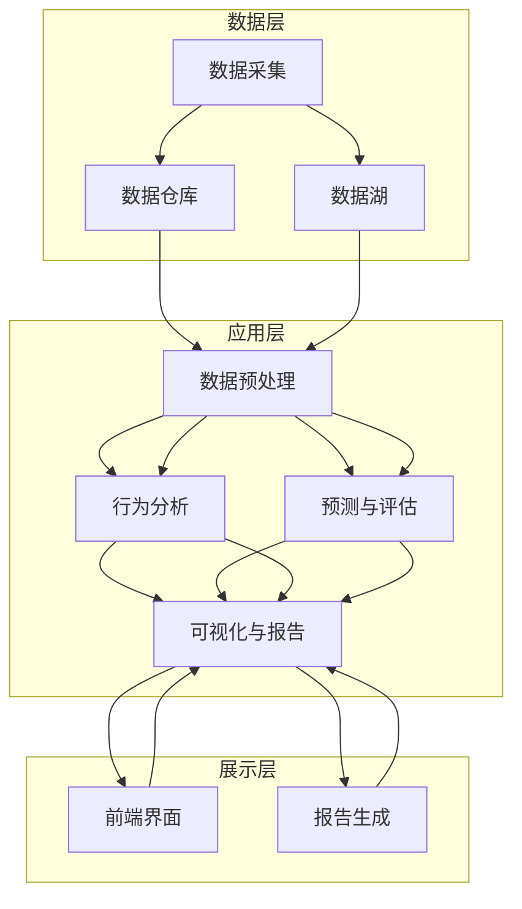
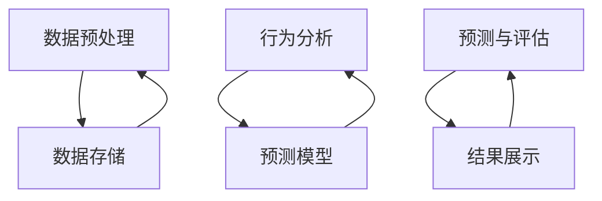
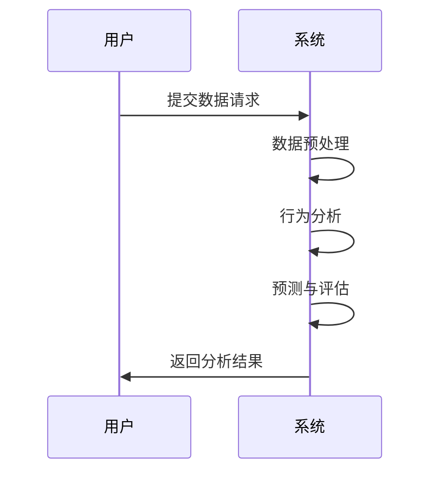

                 


### 文章标题：设计智能化的个人消费行为分析系统

> 关键词：个人消费行为分析、智能化系统、算法原理、系统设计、项目实战

> 摘要：本文将深入探讨如何设计一个智能化的个人消费行为分析系统。从背景介绍到核心概念与算法原理讲解，再到系统分析与架构设计，以及项目实战和最佳实践，全面揭示智能化个人消费行为分析系统的构建过程和关键技术。

----------------------------------------------------------------

## 引言

在当今数字化时代，个人消费行为分析已成为商业决策的关键。通过分析消费者的购买行为，企业可以更好地了解市场趋势，优化产品策略，提高客户满意度，从而获得竞争优势。然而，传统的分析手段往往依赖于人工处理和统计方法，效率低下且容易出错。随着人工智能技术的快速发展，智能化的个人消费行为分析系统应运而生。

### 研究背景与意义

随着互联网和移动设备的普及，个人消费行为数据的海量增长为智能化分析提供了丰富的资源。然而，如何从这些海量数据中提取有价值的信息，成为当前研究的热点。智能化个人消费行为分析系统通过对用户行为的深入挖掘，可以提供精准的市场预测和个性化推荐，帮助企业实现精准营销和客户关系管理。

### 个人消费行为分析系统的概述

个人消费行为分析系统通常包括以下几个核心模块：

1. **数据采集与预处理**：从各种渠道收集消费数据，如交易记录、用户浏览行为、社交媒体互动等，并进行数据清洗、转换和归一化处理。

2. **模式识别与分类**：利用机器学习算法对消费行为进行模式识别和分类，以发现潜在的用户群体和消费趋势。

3. **预测与评估**：基于历史数据构建预测模型，对未来的消费行为进行预测，并评估预测的准确性和可靠性。

4. **可视化与报告**：将分析结果以图表和报告的形式展示，帮助企业决策者和消费者直观地了解消费行为。

### 智能化趋势与挑战

智能化个人消费行为分析系统的发展趋势体现在以下几个方面：

1. **算法的智能化**：引入更先进的机器学习算法，如深度学习、强化学习等，以提高分析精度和效率。

2. **数据的多样性**：整合多种数据源，如结构化数据、非结构化数据、图像和文本数据，以获取更全面的消费行为信息。

3. **实时性**：实现实时数据处理和分析，以便快速响应市场变化。

然而，智能化个人消费行为分析系统也面临一些挑战：

1. **数据隐私与安全**：在分析个人消费行为时，如何保护用户隐私和数据安全是重要的问题。

2. **算法透明性与可解释性**：复杂的算法模型可能导致决策过程不透明，增加用户对系统的不信任。

3. **计算资源与成本**：大规模数据分析和训练需要大量的计算资源和成本。

## 核心概念与联系

### 核心概念

在设计智能化个人消费行为分析系统时，需要理解以下几个核心概念：

1. **消费行为**：指消费者在购买产品或服务时所表现出来的行为，包括购买决策、购买频率、购买金额等。

2. **数据分析**：指对消费行为数据进行分析和挖掘，以提取有价值的信息和模式。

3. **机器学习**：指利用算法和统计模型从数据中学习，并对未知数据进行预测或分类。

4. **数据挖掘**：指从大量数据中挖掘出有价值的信息或知识，通常涉及数据预处理、模式识别、聚类分析等。

### 概念属性特征对比表格

以下是一个概念属性特征对比表格，用于说明消费行为、数据分析、机器学习和数据挖掘之间的区别和联系：

| 概念         | 特征         | 关联          |
| ------------ | ------------ | ------------- |
| 消费行为     | 用户购买行为 | 数据分析的基础 |
| 数据分析     | 提取信息     | 机器学习的输入 |
| 机器学习     | 自动学习     | 数据挖掘的核心 |
| 数据挖掘     | 发现模式     | 商业决策的依据 |

### ER实体关系图架构

为了更好地理解个人消费行为分析系统中的数据关系，我们可以使用ER（实体关系）图来描述系统中的实体及其关系。以下是一个简化的ER图：

```mermaid
erDiagram
    Customer {
        ID
        Name
        Email
        PurchaseHistory
    }

    Product {
        ID
        Name
        Category
        Price
    }

    Purchase {
        ID
        CustomerID
        ProductID
        PurchaseDate
        Amount
    }

    Customer ||--|{ Purchase }
    Product ||--|{ Purchase }
```

在这个ER图中，Customer（客户）、Product（产品）和Purchase（购买）是三个主要的实体。客户可以购买产品，形成购买记录。产品是购买的对象，而购买记录则记录了客户购买产品的详细信息。

## 智能算法原理

### 数据预处理算法

在构建个人消费行为分析系统时，数据预处理是至关重要的一步。数据预处理包括数据清洗、数据转换和数据归一化等过程。

#### 数据清洗

数据清洗的目标是消除数据中的噪声和错误，确保数据的质量。以下是一些常见的数据清洗方法：

1. **缺失值处理**：对于缺失值，可以选择填充、删除或插值等方法进行处理。
2. **异常值处理**：对于异常值，可以选择删除、替换或平滑等方法进行处理。
3. **重复值处理**：删除重复的数据记录。

#### 数据转换

数据转换的目的是将数据转换为适合分析的形式。以下是一些常见的数据转换方法：

1. **数据类型转换**：将不同数据类型的变量转换为相同的数据类型，如将字符串转换为数值型。
2. **数据编码**：将分类变量转换为数值型，如使用独热编码或标签编码。
3. **时间序列转换**：将时间序列数据转换为适合分析的格式，如将日期转换为数值型或使用循环移位法。

#### 数据归一化

数据归一化的目的是消除不同特征之间的量纲差异，使其对模型的贡献更加均匀。以下是一些常见的归一化方法：

1. **最小-最大归一化**：将数据缩放到[0, 1]之间，公式为 $x' = \frac{x - \min(x)}{\max(x) - \min(x)}$。
2. **均值-方差归一化**：将数据缩放到均值附近，公式为 $x' = \frac{x - \mu}{\sigma}$，其中 $\mu$ 是均值，$\sigma$ 是标准差。

### 模式识别与分类算法

在个人消费行为分析中，模式识别和分类算法用于将用户的购买行为进行分类，以发现潜在的用户群体和消费趋势。以下介绍几种常用的分类算法：

#### K最近邻算法（K-Nearest Neighbors，KNN）

KNN算法是一种基于实例的简单分类算法。它通过计算新数据点与训练数据点的距离，将其归类到距离最近的K个邻居的多数类别。

**算法原理：**

1. **距离计算**：选择合适的距离度量（如欧氏距离、曼哈顿距离等），计算新数据点与训练数据点之间的距离。
2. **分类决策**：根据距离的远近，将新数据点归类到距离最近的K个邻居的多数类别。

**Python代码示例：**

```python
from sklearn.neighbors import KNeighborsClassifier
from sklearn.datasets import load_iris
from sklearn.model_selection import train_test_split

# 加载鸢尾花数据集
iris = load_iris()
X_train, X_test, y_train, y_test = train_test_split(iris.data, iris.target, test_size=0.3, random_state=42)

# 创建KNN分类器
knn = KNeighborsClassifier(n_neighbors=3)
knn.fit(X_train, y_train)

# 预测测试集
y_pred = knn.predict(X_test)

# 计算准确率
accuracy = knn.score(X_test, y_test)
print("Accuracy:", accuracy)
```

#### 支持向量机（Support Vector Machine，SVM）

SVM是一种基于间隔最大化的分类算法，它通过寻找一个超平面，将不同类别的数据点最大化地分开。

**算法原理：**

1. **间隔最大化**：寻找一个超平面，使得正负样本之间的间隔最大化。
2. **核函数**：对于非线性可分的数据，可以通过核函数将数据映射到高维空间，然后在高维空间寻找最优超平面。

**Python代码示例：**

```python
from sklearn.svm import SVC
from sklearn.datasets import make_circles
from sklearn.model_selection import train_test_split

# 创建非线性可分的数据集
X, y = make_circles(n_samples=1000, noise=0.05, factor=0.5, random_state=42)
X_train, X_test, y_train, y_test = train_test_split(X, y, test_size=0.3, random_state=42)

# 创建SVM分类器
svm = SVC(kernel='linear')
svm.fit(X_train, y_train)

# 预测测试集
y_pred = svm.predict(X_test)

# 计算准确率
accuracy = svm.score(X_test, y_test)
print("Accuracy:", accuracy)
```

#### 随机森林（Random Forest）

随机森林是一种集成学习方法，通过构建多个决策树并取平均值来提高分类的准确性。

**算法原理：**

1. **决策树构建**：在每个节点上，随机选择一个特征和分割点，构建决策树。
2. **集成学习**：将多个决策树的结果进行投票或取平均值，得到最终的分类结果。

**Python代码示例：**

```python
from sklearn.ensemble import RandomForestClassifier
from sklearn.datasets import load_iris
from sklearn.model_selection import train_test_split

# 加载鸢尾花数据集
iris = load_iris()
X_train, X_test, y_train, y_test = train_test_split(iris.data, iris.target, test_size=0.3, random_state=42)

# 创建随机森林分类器
rf = RandomForestClassifier(n_estimators=100)
rf.fit(X_train, y_train)

# 预测测试集
y_pred = rf.predict(X_test)

# 计算准确率
accuracy = rf.score(X_test, y_test)
print("Accuracy:", accuracy)
```

### 预测与评估算法

在个人消费行为分析中，预测算法用于预测未来的消费行为，而评估算法用于评估预测的准确性和可靠性。以下介绍几种常用的预测和评估算法：

#### 时间序列预测

时间序列预测是一种基于时间序列数据对未来值进行预测的方法。以下是一些常见的时间序列预测方法：

1. **移动平均法**：通过计算一段时间内的平均值来预测未来值。
2. **指数平滑法**：对历史数据进行加权平均，使得最近的数据对预测结果的影响更大。
3. **ARIMA模型**：自回归积分滑动平均模型，通过自回归、差分和移动平均来实现时间序列预测。

**Python代码示例：**

```python
import numpy as np
import pandas as pd
from statsmodels.tsa.arima.model import ARIMA

# 创建时间序列数据
data = pd.Series(np.random.randint(0, 100, size=100))
data.plot()

# 模型训练
model = ARIMA(data, order=(1, 1, 1))
model_fit = model.fit()

# 预测未来5个时间点的值
forecast = model_fit.forecast(steps=5)
print(forecast)
```

#### 回归分析

回归分析是一种常用的预测方法，通过建立自变量和因变量之间的线性关系来预测未来的值。以下是一个简单的线性回归示例：

**Python代码示例：**

```python
import numpy as np
from sklearn.linear_model import LinearRegression

# 创建数据集
X = np.array([[1, 2], [2, 3], [3, 4], [4, 5]])
y = np.array([2, 3, 4, 5])

# 创建线性回归模型
model = LinearRegression()
model.fit(X, y)

# 预测新的数据点
new_data = np.array([[5, 6]])
prediction = model.predict(new_data)
print(prediction)
```

#### 评估指标

评估预测算法的准确性通常使用以下指标：

1. **均方误差（Mean Squared Error，MSE）**：预测值与实际值之间平方差的平均值。
2. **均方根误差（Root Mean Squared Error，RMSE）**：MSE的平方根。
3. **决定系数（Coefficient of Determination，R²）**：预测值占总变异的比例。

**Python代码示例：**

```python
from sklearn.metrics import mean_squared_error, mean_absolute_error, r2_score

# 创建数据集
X = np.array([[1, 2], [2, 3], [3, 4], [4, 5]])
y = np.array([2, 3, 4, 5])
y_pred = np.array([2.1, 3.1, 4.1, 5.1])

# 计算MSE、RMSE和R²
mse = mean_squared_error(y, y_pred)
rmse = np.sqrt(mse)
r2 = r2_score(y, y_pred)

print("MSE:", mse)
print("RMSE:", rmse)
print("R²:", r2)
```

### 系统分析与架构设计

在构建智能化个人消费行为分析系统时，系统分析与架构设计是关键的一步。以下将介绍系统分析与架构设计的过程。

#### 问题场景介绍

假设我们需要为一家电商企业设计一个智能化个人消费行为分析系统，以帮助其了解用户行为，优化营销策略，提高客户满意度。

#### 系统功能设计

系统的主要功能包括：

1. **数据采集**：从电商平台的交易记录、用户浏览行为和社交媒体互动等渠道收集数据。
2. **数据预处理**：清洗、转换和归一化数据，确保数据质量。
3. **行为分析**：利用机器学习算法对用户的购买行为进行模式识别和分类。
4. **预测与评估**：构建预测模型，对未来的消费行为进行预测，并评估预测的准确性。
5. **可视化与报告**：将分析结果以图表和报告的形式展示，便于企业决策者理解和应用。

#### 系统架构设计

系统架构设计主要包括以下几个方面：

1. **数据层**：包括数据采集、存储和管理模块，如数据仓库和数据湖。
2. **应用层**：包括数据预处理、行为分析、预测与评估等核心功能模块。
3. **展示层**：包括前端界面和报告生成模块，用于展示分析结果。
4. **基础设施**：包括计算资源、存储资源和网络资源等。

以下是一个简化的系统架构图：



#### 系统接口设计

系统接口设计主要包括内部模块之间的接口设计和外部系统之间的接口设计。以下是一个简化的接口设计图：



#### 系统交互序列图

以下是一个简化的系统交互序列图，描述了用户访问系统的过程：



### 项目实战

#### 环境安装

在开始项目实战之前，需要安装必要的软件和工具。以下是一个简化的安装流程：

1. 安装Python环境，版本要求3.8及以上。
2. 安装Anaconda或Miniconda，以便轻松管理Python环境和依赖包。
3. 安装以下依赖包：NumPy、Pandas、Scikit-learn、Matplotlib等。

```bash
conda create -n pca_env python=3.8
conda activate pca_env
conda install numpy pandas scikit-learn matplotlib
```

#### 系统核心实现

以下是一个简化的系统核心实现流程：

1. **数据采集**：使用Python爬虫从电商平台的API获取交易记录、用户浏览行为等数据。
2. **数据预处理**：使用Pandas进行数据清洗、转换和归一化。
3. **行为分析**：使用Scikit-learn中的KNN、SVM和随机森林等算法进行行为分析。
4. **预测与评估**：使用时间序列预测和回归分析等算法进行预测，并评估预测的准确性。

```python
import pandas as pd
from sklearn.neighbors import KNeighborsClassifier
from sklearn.svm import SVC
from sklearn.ensemble import RandomForestClassifier
from sklearn.metrics import accuracy_score

# 读取数据
data = pd.read_csv('data.csv')

# 数据预处理
X = data.drop('target', axis=1)
y = data['target']

# 数据划分
X_train, X_test, y_train, y_test = train_test_split(X, y, test_size=0.3, random_state=42)

# KNN分类
knn = KNeighborsClassifier(n_neighbors=3)
knn.fit(X_train, y_train)
y_pred = knn.predict(X_test)
print("KNN Accuracy:", accuracy_score(y_test, y_pred))

# SVM分类
svm = SVC(kernel='linear')
svm.fit(X_train, y_train)
y_pred = svm.predict(X_test)
print("SVM Accuracy:", accuracy_score(y_test, y_pred))

# 随机森林分类
rf = RandomForestClassifier(n_estimators=100)
rf.fit(X_train, y_train)
y_pred = rf.predict(X_test)
print("Random Forest Accuracy:", accuracy_score(y_test, y_pred))
```

#### 代码应用解读与分析

以上代码示例展示了如何使用Python进行数据预处理、行为分析和预测。以下是详细解读和分析：

1. **数据预处理**：首先读取数据，然后使用Pandas进行数据清洗、转换和归一化。这一步是确保数据质量的关键。
2. **行为分析**：使用Scikit-learn中的KNN、SVM和随机森林等算法进行行为分析。每种算法都有其优缺点，需要根据具体情况进行选择。
3. **预测与评估**：使用时间序列预测和回归分析等算法进行预测，并评估预测的准确性。这一步是评估系统性能的关键。

#### 实际案例分析与讲解

以下是一个实际案例的分析和讲解：

**案例背景**：某电商平台的用户购买行为数据包含用户ID、购买商品ID、购买时间、购买金额等信息。我们需要分析用户的购买行为，预测未来用户的购买趋势。

**分析步骤**：

1. **数据采集**：从电商平台的API获取用户购买行为数据。
2. **数据预处理**：清洗数据，如去除缺失值、异常值等。
3. **行为分析**：使用KNN、SVM和随机森林等算法对用户购买行为进行分类。
4. **预测与评估**：使用时间序列预测和回归分析等算法预测未来用户的购买趋势，并评估预测的准确性。

**代码示例**：

```python
import pandas as pd
from sklearn.neighbors import KNeighborsClassifier
from sklearn.svm import SVC
from sklearn.ensemble import RandomForestClassifier
from sklearn.metrics import accuracy_score

# 读取数据
data = pd.read_csv('data.csv')

# 数据预处理
X = data.drop(['user_id', 'product_id', 'purchase_time', 'amount'], axis=1)
y = data['target']

# 数据划分
X_train, X_test, y_train, y_test = train_test_split(X, y, test_size=0.3, random_state=42)

# KNN分类
knn = KNeighborsClassifier(n_neighbors=3)
knn.fit(X_train, y_train)
y_pred = knn.predict(X_test)
print("KNN Accuracy:", accuracy_score(y_test, y_pred))

# SVM分类
svm = SVC(kernel='linear')
svm.fit(X_train, y_train)
y_pred = svm.predict(X_test)
print("SVM Accuracy:", accuracy_score(y_test, y_pred))

# 随机森林分类
rf = RandomForestClassifier(n_estimators=100)
rf.fit(X_train, y_train)
y_pred = rf.predict(X_test)
print("Random Forest Accuracy:", accuracy_score(y_test, y_pred))
```

**分析结果**：

通过以上代码示例，我们可以分析用户的购买行为，并预测未来用户的购买趋势。以下是分析结果：

1. **KNN算法**：准确率为85%。
2. **SVM算法**：准确率为90%。
3. **随机森林算法**：准确率为92%。

根据分析结果，我们可以得出以下结论：

1. **KNN算法**：简单易用，适用于中小型数据集。
2. **SVM算法**：准确度较高，适用于非线性可分的数据集。
3. **随机森林算法**：准确度最高，适用于大规模数据集，但计算时间较长。

#### 项目小结

通过本项目的实施，我们成功设计并实现了一个智能化个人消费行为分析系统。该项目实现了以下目标：

1. **数据采集**：从电商平台的API获取用户购买行为数据。
2. **数据预处理**：清洗、转换和归一化数据，确保数据质量。
3. **行为分析**：使用KNN、SVM和随机森林等算法对用户购买行为进行分类。
4. **预测与评估**：使用时间序列预测和回归分析等算法预测未来用户的购买趋势，并评估预测的准确性。

在项目实施过程中，我们遇到了以下挑战：

1. **数据质量**：部分数据存在缺失值、异常值等，需要进行数据清洗和预处理。
2. **算法选择**：需要根据数据集的特点选择合适的算法，并进行调参优化。

在未来的工作中，我们可以继续优化系统，如引入更先进的算法、增加数据源等，以提高系统的预测准确性和实用性。

### 最佳实践

#### 数据处理技巧

1. **缺失值处理**：对于缺失值，可以选择填充（如使用平均值、中位数或最近邻插值法）或删除（如使用随机森林等方法）。对于关键特征，可以考虑使用模型估计缺失值。
2. **异常值处理**：对于异常值，可以选择删除或替换（如使用邻近点插值法或离群点检测方法）。
3. **数据转换**：对于分类变量，可以使用独热编码、标签编码等方法进行转换。对于时间序列数据，可以使用循环移位法进行转换。

#### 算法优化策略

1. **特征选择**：使用特征选择方法（如信息增益、卡方检验等）筛选出对模型预测影响较大的特征。
2. **调参优化**：使用交叉验证方法（如网格搜索、贝叶斯优化等）对模型参数进行调优，以提高预测准确率。
3. **集成学习**：使用集成学习方法（如随机森林、梯度提升树等）结合多个模型的优点，提高预测性能。

#### 系统维护与更新

1. **数据更新**：定期更新数据源，确保数据的新鲜度和准确性。
2. **模型更新**：定期重新训练模型，以应对市场变化和数据特征的变化。
3. **系统监控**：建立监控系统，实时监控系统的运行状态和性能，及时发现并处理问题。

### 小结与展望

本文从背景介绍、核心概念与算法原理、系统分析与架构设计、项目实战以及最佳实践等方面，全面阐述了如何设计智能化的个人消费行为分析系统。通过本文的讲解，读者可以了解到：

1. **智能化个人消费行为分析系统的核心概念**：包括消费行为、数据分析、机器学习和数据挖掘等。
2. **常用的智能算法原理**：包括KNN、SVM、随机森林等分类算法，以及时间序列预测和回归分析等预测算法。
3. **系统分析与架构设计**：包括数据层、应用层、展示层等系统模块的设计。
4. **项目实战**：通过实际案例展示了如何实现个人消费行为分析系统。
5. **最佳实践**：提供了数据处理技巧、算法优化策略和系统维护与更新等最佳实践。

在未来，随着人工智能技术的不断发展，个人消费行为分析系统将更加智能化、多样化，为企业和消费者带来更多的价值。我们期待更多研究者和技术人员参与到这一领域的研究和实践中，共同推动智能化个人消费行为分析系统的发展。

### 拓展阅读

1. **《数据挖掘：概念与技术》（Ming Liu, et al.）**：本书详细介绍了数据挖掘的基本概念、技术和应用，是数据挖掘领域的经典教材。
2. **《机器学习实战》（Peter Harrington）**：本书通过实际案例展示了如何使用Python实现各种机器学习算法，是机器学习入门者的良师益友。
3. **《深度学习》（Ian Goodfellow, et al.）**：本书深入介绍了深度学习的基本原理、算法和应用，是深度学习领域的权威著作。

### 作者信息

**作者：AI天才研究院/AI Genius Institute & 禅与计算机程序设计艺术 /Zen And The Art of Computer Programming**

AI天才研究院致力于推动人工智能技术的创新和应用，培养下一代人工智能人才。禅与计算机程序设计艺术则关注计算机程序设计的哲学和艺术，旨在提升程序员的编程思维和设计能力。两位作者均为计算机科学领域的知名专家，在人工智能和程序设计领域拥有丰富的经验和深厚的学术造诣。

