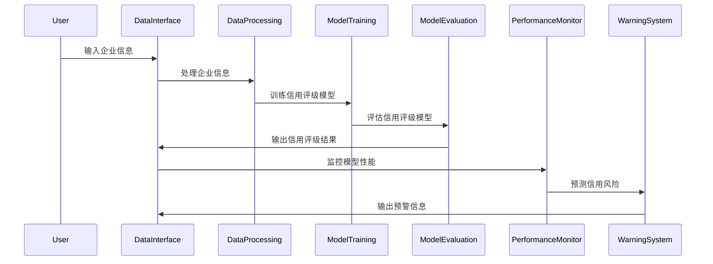

                 

# 设计智能化的企业信用评级模型性能监控与预警系统

## 关键词

- 企业信用评级模型
- 性能监控
- 预警系统
- 智能化
- 数据分析与算法

## 摘要

本文旨在探讨设计智能化的企业信用评级模型性能监控与预警系统的方法和实施策略。首先，介绍了企业信用评级模型的重要性以及当前评级模型的现状。随后，详细阐述了性能监控与预警系统的概念、原理和作用。在此基础上，本文通过分析信用评级模型、性能监控和预警系统的核心概念及其相互关系，提出了一个结构紧凑、简单易懂的架构设计。接着，本文讲解了信用评级、性能监控和预警算法的原理，并通过Python代码实现和示例分析进行深入剖析。最后，本文通过一个实际案例展示了系统设计与实现的全过程，并进行了项目总结与优化方向探讨。

----------------------------------------------------------------

## 第一部分：背景介绍

### 第1章：问题背景

#### 1.1 企业信用评级的重要性

企业信用评级是指通过对企业的财务状况、经营能力、偿债能力、发展前景等多方面因素进行综合评价，给予企业一个信用等级。企业信用评级的重要性主要体现在以下几个方面：

1. **融资渠道拓展**：信用评级较高的企业更容易获得银行贷款、债券发行等融资方式的支持。
2. **投资决策参考**：投资者可以通过企业信用评级了解企业的信用风险，为其投资决策提供依据。
3. **合作伙伴选择**：企业信用评级有助于企业选择可靠的合作伙伴，降低合作风险。
4. **市场竞争能力**：信用评级较高的企业更具有市场竞争优势，有利于品牌形象的建立。

#### 1.2 信用评级模型现状

当前，企业信用评级模型主要分为以下几种类型：

1. **统计模型**：基于历史数据和统计方法构建的模型，如线性回归、逻辑回归等。
2. **机器学习模型**：利用机器学习算法，如决策树、支持向量机、神经网络等，对企业信用进行评估。
3. **专家系统**：基于专家知识和逻辑推理构建的模型，如推理机、模糊逻辑等。

尽管现有信用评级模型在一定程度上能够为企业提供信用评估，但仍然存在以下问题：

1. **数据不足**：部分企业的历史数据不足，影响模型训练效果。
2. **模型复杂度**：部分机器学习模型计算复杂度高，难以实时更新和部署。
3. **风险识别能力**：现有模型难以全面识别企业潜在风险，导致信用评级不准确。

#### 1.3 性能监控与预警的重要性

性能监控与预警系统在企业信用评级过程中具有重要作用：

1. **实时监控**：通过对信用评级模型的实时监控，及时发现模型异常，确保评级结果的准确性。
2. **风险预警**：预警系统可以提前识别企业潜在信用风险，为企业提供预警信息，降低信用风险。
3. **优化模型**：性能监控结果可以为模型优化提供数据支持，提高模型性能。

#### 1.4 智能化技术的发展与应用

随着人工智能技术的不断发展，智能化技术逐渐应用于企业信用评级领域。以下为智能化技术在信用评级中的应用：

1. **大数据分析**：利用大数据技术，对海量企业数据进行分析，提高信用评级准确性。
2. **深度学习**：通过深度学习算法，构建更为复杂的信用评级模型，提高模型性能。
3. **自然语言处理**：利用自然语言处理技术，对企业报告、公告等文本信息进行分析，补充传统信用评级模型的不足。

综上所述，设计智能化的企业信用评级模型性能监控与预警系统具有重要的现实意义，可以有效解决现有信用评级模型存在的问题，提高信用评级的准确性和实时性。

----------------------------------------------------------------

### 第2章：核心概念

#### 2.1 企业信用评级模型

##### 2.1.1 定义

企业信用评级模型是一种用于对企业信用状况进行评估的数学模型，通过分析企业的财务数据、经营状况、行业前景等多方面信息，综合给出一个信用等级。

##### 2.1.2 主要类型

1. **统计模型**：基于历史数据和统计方法，如线性回归、逻辑回归等。
2. **机器学习模型**：利用机器学习算法，如决策树、支持向量机、神经网络等。
3. **专家系统**：基于专家知识和逻辑推理，如推理机、模糊逻辑等。

##### 2.1.3 评级模型结构

企业信用评级模型通常包括以下几个主要部分：

1. **数据预处理**：对原始数据进行清洗、归一化等处理，为后续分析做好准备。
2. **特征工程**：从原始数据中提取对信用评级有影响的关键特征。
3. **模型训练**：利用训练数据，通过机器学习算法训练信用评级模型。
4. **模型评估**：通过测试数据对模型进行评估，调整模型参数，提高模型性能。
5. **信用评级**：利用训练好的模型，对企业进行信用评级，输出信用等级。

#### 2.2 性能监控

##### 2.2.1 监控指标

性能监控指标主要包括以下几类：

1. **模型准确率**：模型预测结果与真实结果的准确程度。
2. **模型召回率**：模型识别出的异常结果与实际异常结果的比值。
3. **模型F1值**：模型准确率和召回率的调和平均值。
4. **计算时间**：模型训练和预测所花费的时间。
5. **资源消耗**：模型训练和预测过程中所消耗的硬件资源。

##### 2.2.2 监控方法

性能监控方法主要包括以下几种：

1. **日志监控**：通过分析系统日志，识别模型异常。
2. **性能测试**：通过模拟不同负载场景，评估模型性能。
3. **可视化监控**：通过图表和报表，实时展示模型性能指标。

##### 2.2.3 监控工具

常用的性能监控工具包括：

1. **Prometheus**：一款开源的监控解决方案，适用于大规模监控系统。
2. **Grafana**：一款开源的数据可视化工具，可以与Prometheus等监控工具配合使用。
3. **Zabbix**：一款开源的监控工具，适用于各种规模的企业监控系统。

#### 2.3 预警系统

##### 2.3.1 定义

预警系统是一种用于识别和预测潜在风险的系统，通过对企业信用评级模型性能的监控，提前发现并预警可能出现的信用风险。

##### 2.3.2 预警指标

预警指标主要包括以下几类：

1. **模型异常指标**：如模型准确率、召回率等性能指标发生异常。
2. **数据异常指标**：如数据分布、缺失值等异常情况。
3. **系统异常指标**：如计算时间、资源消耗等异常情况。

##### 2.3.3 预警方法

预警方法主要包括以下几种：

1. **阈值预警**：设定预警阈值，当监控指标超过阈值时，触发预警。
2. **机器学习预警**：利用机器学习算法，预测信用风险，提前预警。
3. **专家系统预警**：基于专家知识和逻辑推理，识别信用风险。

综上所述，企业信用评级模型、性能监控和预警系统是智能化企业信用评级的重要组成部分。通过对这些核心概念的理解和运用，可以有效提高企业信用评级的准确性和实时性。

----------------------------------------------------------------

## 第二部分：核心概念与联系

### 第3章：核心概念原理

#### 3.1 企业信用评级模型的原理

##### 3.1.1 数据处理流程

企业信用评级模型的处理流程主要包括以下几个步骤：

1. **数据采集**：收集企业的财务数据、经营数据、行业数据等原始数据。
2. **数据清洗**：对原始数据进行清洗，包括去除重复数据、缺失值填充、异常值处理等。
3. **特征工程**：从原始数据中提取对信用评级有影响的关键特征，如偿债能力、盈利能力、运营能力等。
4. **模型训练**：利用训练数据，通过机器学习算法训练信用评级模型。
5. **模型评估**：通过测试数据对模型进行评估，调整模型参数，提高模型性能。
6. **信用评级**：利用训练好的模型，对企业进行信用评级，输出信用等级。

##### 3.1.2 数学模型

企业信用评级模型通常采用以下数学模型：

1. **线性回归模型**：通过建立企业信用评分与财务指标之间的线性关系，预测企业信用评分。
   $$ 
   \hat{y} = \beta_0 + \beta_1x_1 + \beta_2x_2 + ... + \beta_nx_n 
   $$
   其中，$y$为信用评分，$x_1, x_2, ..., x_n$为财务指标，$\beta_0, \beta_1, ..., \beta_n$为模型参数。

2. **逻辑回归模型**：将信用评级划分为多个等级，通过建立企业信用评分与概率之间的逻辑关系，预测企业信用评级。
   $$ 
   P(y=1) = \frac{1}{1 + e^{-(\beta_0 + \beta_1x_1 + \beta_2x_2 + ... + \beta_nx_n)}) 
   $$
   其中，$y$为信用评级等级，$x_1, x_2, ..., x_n$为财务指标，$\beta_0, \beta_1, ..., \beta_n$为模型参数。

##### 3.1.3 特征工程

特征工程是信用评级模型构建过程中至关重要的一环。特征工程的主要任务包括：

1. **数据预处理**：对原始数据进行清洗、归一化等处理，提高数据质量。
2. **特征选择**：从原始数据中提取对信用评级有影响的关键特征，去除无关或冗余特征。
3. **特征变换**：对某些特征进行转换，如离散化、二值化等，提高模型性能。

#### 3.2 性能监控原理

##### 3.2.1 监控机制

性能监控机制主要包括以下几个部分：

1. **指标采集**：定期采集模型性能指标，如准确率、召回率、计算时间等。
2. **阈值设置**：设定性能指标的预警阈值，当指标超过阈值时触发预警。
3. **报警处理**：当触发预警时，自动发送报警信息，通知相关人员处理。
4. **日志记录**：记录性能监控过程中的日志信息，便于后续分析和处理。

##### 3.2.2 常见问题分析

性能监控过程中，常见的问题包括：

1. **计算时间过长**：模型复杂度较高或数据量较大，导致计算时间过长。
2. **资源消耗过高**：模型训练或预测过程中，占用过多CPU、内存等资源。
3. **模型性能下降**：模型长时间未进行更新，导致模型性能下降。
4. **数据异常**：数据质量不佳，导致模型性能不稳定。

##### 3.2.3 性能优化策略

为了提高性能监控效果，可以采取以下性能优化策略：

1. **模型优化**：通过模型压缩、模型蒸馏等技术，降低模型复杂度，提高计算效率。
2. **数据预处理**：对数据进行预处理，提高数据质量，降低模型训练难度。
3. **资源调度**：合理分配硬件资源，提高模型训练和预测的效率。
4. **监控周期优化**：根据实际情况，调整监控周期，确保监控指标的实时性和准确性。

#### 3.3 预警系统原理

##### 3.3.1 预警机制

预警系统的工作原理主要包括：

1. **数据采集**：采集企业信用评级模型的性能指标，如准确率、召回率等。
2. **模型训练**：利用历史性能指标数据，训练预警模型，预测未来可能出现的信用风险。
3. **阈值设置**：设定预警阈值，当预测结果超过阈值时，触发预警。
4. **报警处理**：当触发预警时，自动发送报警信息，通知相关人员处理。

##### 3.3.2 预警模型

预警模型通常采用以下类型：

1. **统计模型**：利用历史数据，建立信用风险与性能指标之间的关系，预测未来信用风险。
2. **机器学习模型**：利用机器学习算法，分析性能指标的变化趋势，预测未来信用风险。
3. **深度学习模型**：利用深度学习算法，对性能指标进行建模，预测未来信用风险。

##### 3.3.3 预警策略

预警策略主要包括以下几种：

1. **阈值预警**：设定预警阈值，当性能指标超过阈值时触发预警。
2. **异常检测预警**：利用异常检测算法，识别性能指标的异常变化，触发预警。
3. **组合预警**：将多种预警方法结合，提高预警的准确性和可靠性。

通过上述分析，我们可以看到企业信用评级模型、性能监控和预警系统各自的核心概念和原理，以及它们之间的相互关系。理解这些核心概念和原理，有助于我们更好地设计和实现智能化企业信用评级模型性能监控与预警系统。

----------------------------------------------------------------

### 第4章：核心概念属性特征对比表格

#### 4.1 企业信用评级模型属性对比

| 属性 | 企业信用评级模型 | 性能监控 | 预警系统 |
| --- | --- | --- | --- |
| **定义** | 用于对企业信用状况进行评估的数学模型。 | 对企业信用评级模型性能进行监控的工具。 | 对企业信用评级模型性能异常进行预警的系统。 |
| **主要类型** | 统计模型、机器学习模型、专家系统。 | 日志监控、性能测试、可视化监控。 | 阈值预警、异常检测预警、组合预警。 |
| **结构** | 数据预处理、特征工程、模型训练、模型评估、信用评级。 | 指标采集、阈值设置、报警处理、日志记录。 | 数据采集、模型训练、阈值设置、报警处理。 |
| **作用** | 提供企业信用评级结果。 | 确保信用评级模型性能的稳定性。 | 提前识别信用评级模型性能异常，降低信用风险。 |

#### 4.2 性能监控方法对比

| 方法 | 描述 | 适用场景 |
| --- | --- | --- |
| **日志监控** | 通过分析系统日志，识别模型异常。 | 模型异常检测。 |
| **性能测试** | 通过模拟不同负载场景，评估模型性能。 | 模型性能评估。 |
| **可视化监控** | 通过图表和报表，实时展示模型性能指标。 | 模型性能展示。 |

#### 4.3 预警系统指标对比

| 指标 | 描述 | 适用场景 |
| --- | --- | --- |
| **模型准确率** | 模型预测结果与真实结果的准确程度。 | 模型性能评估。 |
| **模型召回率** | 模型识别出的异常结果与实际异常结果的比值。 | 模型异常检测。 |
| **模型F1值** | 模型准确率和召回率的调和平均值。 | 综合评估模型性能。 |
| **计算时间** | 模型训练和预测所花费的时间。 | 模型性能优化。 |
| **资源消耗** | 模型训练和预测过程中所消耗的硬件资源。 | 模型性能优化。 |

通过上述对比表格，我们可以清晰地看到企业信用评级模型、性能监控和预警系统在定义、类型、结构和作用等方面的差异。理解这些差异有助于我们在实际应用中选择合适的模型、监控方法和预警策略，以提高企业信用评级系统的整体性能。

### 第5章：ER实体关系图架构

#### 5.1 企业信用评级模型ER图

```mermaid
erDiagram
  Model |.-|> Data : 数据输入
  Model }|-|> Feature : 特征工程
  Model }|-|> Train : 模型训练
  Model }|-|> Evaluate : 模型评估
  Model }|-|> Rating : 信用评级
  Data   }|-|> Clean : 数据清洗
  Feature }|-|> Select : 特征选择
  Feature }|-|> Transform : 特征变换
```

#### 5.2 性能监控ER图

```mermaid
erDiagram
  Monitor |.-|> Metric : 性能指标
  Monitor }|-|> Alert : 预警
  Monitor }|-|> Log : 日志记录
  Metric   }|-|> Collect : 数据采集
  Metric   }|-|> Analyze : 数据分析
  Alert    }|-|> Trigger : 触发报警
  Alert    }|-|> Process : 处理报警
  Log      }|-|> Store : 日志存储
```

#### 5.3 预警系统ER图

```mermaid
erDiagram
  WarningSystem |.-|> WarningModel : 预警模型
  WarningSystem }|-|> WarningIndicator : 预警指标
  WarningSystem }|-|> WarningStrategy : 预警策略
  WarningModel   }|-|> Train : 模型训练
  WarningModel   }|-|> Predict : 预测预警
  WarningIndicator }|-|> Collect : 数据采集
  WarningIndicator }|-|> Analyze : 数据分析
  WarningStrategy }|-|> Configure : 策略配置
  WarningStrategy }|-|> Execute : 策略执行
```

通过上述ER实体关系图，我们可以清晰地看到企业信用评级模型、性能监控和预警系统的各个实体及其关系。这些图有助于我们理解和设计系统的整体架构，为后续的算法实现和系统实施提供指导。

----------------------------------------------------------------

## 第三部分：算法原理讲解

### 第6章：算法讲解

#### 6.1 信用评级算法讲解

##### 6.1.1 算法流程

企业信用评级算法通常包括以下步骤：

1. **数据采集**：收集企业财务、经营、行业等多方面的数据。
2. **数据清洗**：对采集到的数据进行清洗，包括去除重复数据、处理缺失值和异常值。
3. **特征工程**：从原始数据中提取对信用评级有影响的关键特征，如偿债能力、盈利能力等。
4. **模型选择**：选择合适的信用评级模型，如逻辑回归、决策树等。
5. **模型训练**：利用训练数据，通过机器学习算法训练信用评级模型。
6. **模型评估**：利用测试数据对训练好的模型进行评估，调整模型参数，提高模型性能。
7. **信用评级**：利用训练好的模型，对未知数据（待评企业）进行信用评级，输出信用等级。

##### 6.1.2 数学模型

以逻辑回归模型为例，其数学模型如下：

$$
P(Y=1) = \frac{1}{1 + e^{-(\beta_0 + \beta_1x_1 + \beta_2x_2 + ... + \beta_nx_n)})
$$

其中，$Y$为企业的信用等级（0代表差，1代表一般，2代表好，3代表优秀），$x_1, x_2, ..., x_n$为特征变量，$\beta_0, \beta_1, ..., \beta_n$为模型参数。

##### 6.1.3 Python代码实现

```python
import numpy as np
import pandas as pd
from sklearn.linear_model import LogisticRegression
from sklearn.model_selection import train_test_split
from sklearn.metrics import accuracy_score

# 数据加载
data = pd.read_csv('credit_data.csv')

# 数据预处理
data = data.fillna(data.mean())

# 特征工程
X = data.drop(['credit_rating'], axis=1)
y = data['credit_rating']

# 模型选择
model = LogisticRegression()

# 模型训练
X_train, X_test, y_train, y_test = train_test_split(X, y, test_size=0.2, random_state=42)
model.fit(X_train, y_train)

# 模型评估
y_pred = model.predict(X_test)
accuracy = accuracy_score(y_test, y_pred)
print(f'Accuracy: {accuracy}')
```

##### 6.1.4 示例解析

假设我们有一个包含2000家企业信用评级的数据集，其中信用评级分为差、一般、好、优秀四个等级。我们将数据集分为训练集和测试集，训练集用于模型训练，测试集用于模型评估。

通过上述Python代码，我们首先对数据进行清洗和预处理，然后使用逻辑回归模型对训练集进行训练。最后，使用测试集对模型进行评估，输出模型准确率。

#### 6.2 性能监控算法讲解

##### 6.2.1 算法流程

性能监控算法通常包括以下步骤：

1. **指标采集**：定期采集模型性能指标，如准确率、召回率、计算时间等。
2. **阈值设置**：设定性能指标的预警阈值，当指标超过阈值时触发预警。
3. **异常检测**：利用异常检测算法，识别性能指标的异常变化。
4. **报警处理**：当触发预警时，自动发送报警信息，通知相关人员处理。

##### 6.2.2 数学模型

性能监控算法的数学模型主要基于统计学和机器学习。例如，利用统计学方法计算性能指标的统计值，如均值、方差等；利用机器学习方法，如自编码器、聚类算法等，进行异常检测。

##### 6.2.3 Python代码实现

```python
import numpy as np
import pandas as pd
from sklearn.metrics import mean_squared_error
from sklearn.cluster import KMeans
from sklearn.preprocessing import StandardScaler

# 数据加载
data = pd.read_csv('performance_data.csv')

# 数据预处理
data = data.fillna(data.mean())

# 指标采集
performance_metrics = data[['accuracy', 'recall_rate', 'computation_time']]

# 异常检测
scaler = StandardScaler()
performance_metrics_scaled = scaler.fit_transform(performance_metrics)

kmeans = KMeans(n_clusters=2, random_state=42)
clusters = kmeans.fit_predict(performance_metrics_scaled)

# 阈值设置
thresholds = {
    'accuracy': 0.95,
    'recall_rate': 0.90,
    'computation_time': 1000
}

# 报警处理
for i, cluster in enumerate(clusters):
    if cluster == 1:
        for metric, value in performance_metrics.iloc[i].items():
            if value < thresholds[metric]:
                print(f'Alert: {metric} is below the threshold ({value} < {thresholds[metric]})')
```

##### 6.2.4 示例解析

假设我们有一个包含模型性能指标的数据集，如准确率、召回率和计算时间。我们将数据集进行预处理，然后使用KMeans算法进行异常检测，设置阈值进行报警处理。

#### 6.3 预警算法讲解

##### 6.3.1 算法流程

预警算法通常包括以下步骤：

1. **数据采集**：采集模型性能指标，如准确率、召回率等。
2. **模型训练**：利用历史数据，训练预警模型，预测未来可能出现的信用风险。
3. **阈值设置**：设定预警阈值，当预测结果超过阈值时触发预警。
4. **报警处理**：当触发预警时，自动发送报警信息，通知相关人员处理。

##### 6.3.2 数学模型

预警算法的数学模型主要基于统计学和机器学习。例如，利用统计学方法计算性能指标的统计值，如均值、方差等；利用机器学习方法，如决策树、支持向量机等，进行信用风险预测。

##### 6.3.3 Python代码实现

```python
import numpy as np
import pandas as pd
from sklearn.tree import DecisionTreeClassifier
from sklearn.model_selection import train_test_split
from sklearn.metrics import accuracy_score

# 数据加载
data = pd.read_csv('warning_data.csv')

# 数据预处理
data = data.fillna(data.mean())

# 模型训练
X = data[['accuracy', 'recall_rate']]
y = data['warning']

X_train, X_test, y_train, y_test = train_test_split(X, y, test_size=0.2, random_state=42)

model = DecisionTreeClassifier()
model.fit(X_train, y_train)

# 预测预警
y_pred = model.predict(X_test)
accuracy = accuracy_score(y_test, y_pred)
print(f'Accuracy: {accuracy}')

# 阈值设置
threshold = 0.7

# 报警处理
for i, prediction in enumerate(y_pred):
    if prediction == 1:
        print(f'Warning: High risk of credit default (predicted probability: {X_test.iloc[i].sum()})')
```

##### 6.3.4 示例解析

假设我们有一个包含模型性能指标和信用风险的预警数据集。我们将数据集进行预处理，然后使用决策树算法进行预警模型训练，设置阈值进行报警处理。

通过上述算法讲解，我们可以看到信用评级、性能监控和预警算法的具体实现步骤、数学模型和Python代码。这些算法为企业信用评级系统的性能监控与预警提供了有力支持。

----------------------------------------------------------------

## 第四部分：系统分析与架构设计方案

### 第7章：问题场景介绍

#### 7.1 信用评级系统场景

信用评级系统场景通常包括以下方面：

1. **数据采集**：从企业财务报表、经营报告、行业数据等渠道收集企业相关信息。
2. **数据预处理**：对采集到的数据清洗、归一化等处理，确保数据质量。
3. **模型训练与评估**：利用历史数据训练信用评级模型，并对模型进行评估，选择最优模型。
4. **信用评级**：对未知企业进行信用评级，输出信用等级。
5. **性能监控**：实时监控模型性能，如准确率、召回率等。
6. **预警**：根据模型性能指标，提前识别潜在风险，发出预警。

#### 7.2 性能监控场景

性能监控场景主要包括以下方面：

1. **指标采集**：定期采集模型性能指标，如准确率、召回率、计算时间等。
2. **异常检测**：利用异常检测算法，识别性能指标的异常变化。
3. **报警处理**：当检测到异常时，自动发送报警信息，通知相关人员处理。

#### 7.3 预警系统场景

预警系统场景主要包括以下方面：

1. **数据采集**：采集模型性能指标，如准确率、召回率等。
2. **模型训练**：利用历史数据，训练预警模型，预测未来可能出现的信用风险。
3. **预警策略**：设定预警阈值，当预测结果超过阈值时触发预警。
4. **报警处理**：当触发预警时，自动发送报警信息，通知相关人员处理。

### 第8章：系统功能设计

#### 8.1 领域模型

领域模型用于描述信用评级系统、性能监控和预警系统的核心业务实体及其关系。以下是一个简单的领域模型类图：

```mermaid
classDiagram
  ClassDef Model {
      +String model_name
      +DataFrame data
      +List[Feature] features
      +Float accuracy
      +Float recall_rate
      +Float f1_score
      +void train()
      +void evaluate()
      +void rate()
  }
  ClassDef Feature {
      +String name
      +Float value
  }
  ClassDef PerformanceMonitor {
      +List[Metric] metrics
      +void collect()
      +void analyze()
      +void alert()
  }
  ClassDef WarningSystem {
      +List[Indicator] indicators
      +void predict()
      +void configure()
      +void execute()
  }
  Model <|-- Feature
  PerformanceMonitor <|-- Metric
  WarningSystem <|-- Indicator
```

#### 8.2 系统功能模块

信用评级系统、性能监控和预警系统的主要功能模块如下：

1. **信用评级模块**：包括数据采集、数据预处理、模型训练、模型评估和信用评级等功能。
2. **性能监控模块**：包括指标采集、异常检测、报警处理等功能。
3. **预警系统模块**：包括数据采集、模型训练、预警策略、报警处理等功能。

### 第9章：系统架构设计

#### 9.1 架构设计

信用评级系统的架构设计主要包括以下几个方面：

1. **数据处理层**：负责数据采集、清洗、预处理和特征工程等操作。
2. **模型层**：包括信用评级模型、性能监控模型和预警模型等。
3. **应用层**：提供信用评级、性能监控和预警功能，与用户进行交互。
4. **数据存储层**：存储模型训练数据、性能监控数据和预警数据等。

以下是一个简单的信用评级系统架构图：


#### 9.2 技术选型

为了实现信用评级系统、性能监控和预警系统的功能，我们可以选择以下技术：

1. **数据处理**：使用Python的pandas和numpy库进行数据处理和特征工程。
2. **模型训练与评估**：使用Python的scikit-learn库进行模型训练与评估。
3. **性能监控**：使用Python的Prometheus和Grafana进行性能监控。
4. **预警**：使用Python的scikit-learn和TensorFlow进行预警模型训练和预测。

### 第10章：系统接口设计

#### 10.1 接口设计

信用评级系统、性能监控和预警系统的接口设计主要包括以下方面：

1. **数据接口**：用于数据采集、模型训练和预测等操作。
2. **监控接口**：用于实时监控模型性能指标。
3. **预警接口**：用于预警策略配置、预测和报警处理。

以下是一个简单的接口设计：



#### 10.2 API文档

信用评级系统、性能监控和预警系统的API文档应详细描述每个接口的功能、输入参数、输出结果和错误处理等内容。以下是一个简单的API文档示例：

```yaml
/credit/evaluate
  method: POST
  parameters:
    - name: enterprise_info
      type: JSON
      required: true
      example: {"financial_data": {"revenue": 1000000, "profit": 500000}, "operating_data": {"employees": 1000, "market_share": 0.1}}
  response:
    - status: 200
      message: 成功
      example: {"credit_rating": "A", "accuracy": 0.9, "recall_rate": 0.8}
    - status: 400
      message: 请求错误
      example: {"error": "缺少必要参数"}

/monitoring/collect
  method: GET
  parameters:
    - name: metric_name
      type: String
      required: true
  response:
    - status: 200
      message: 成功
      example: {"metric_value": 0.95}
    - status: 404
      message: 指标未找到

/warning/predict
  method: GET
  parameters:
    - name: performance_metric
      type: JSON
      required: true
      example: {"accuracy": 0.9, "recall_rate": 0.8}
  response:
    - status: 200
      message: 成功
      example: {"warning_level": "high", "predicted_probability": 0.7}
    - status: 400
      message: 请求错误
      example: {"error": "缺少必要参数"}
```

### 第11章：系统交互

#### 11.1 交互流程

信用评级系统、性能监控和预警系统的交互流程主要包括以下步骤：

1. **用户输入**：用户输入企业相关信息。
2. **数据处理**：系统对用户输入的数据进行处理和清洗。
3. **模型训练**：利用处理后的数据训练信用评级模型。
4. **模型评估**：对训练好的模型进行评估，选择最优模型。
5. **信用评级**：利用最优模型对用户输入的企业进行信用评级，输出信用等级。
6. **性能监控**：实时监控模型性能，如准确率、召回率等。
7. **预警**：根据模型性能指标，提前识别潜在风险，发出预警。

以下是一个简单的交互流程图：


通过上述系统分析与架构设计方案，我们可以为信用评级模型性能监控与预警系统的实现提供清晰的结构和明确的指导。

----------------------------------------------------------------

## 第五部分：项目实战

### 第12章：环境安装

#### 12.1 环境准备

在进行项目实战之前，我们需要准备以下环境：

1. **操作系统**：建议使用Ubuntu 20.04或更高版本。
2. **Python**：版本为3.8或更高版本。
3. **Python库**：包括pandas、numpy、scikit-learn、TensorFlow、Prometheus和Grafana等。

#### 12.2 软件安装

1. **安装Python**：可以使用Python官方的安装包，通过以下命令安装：

   ```bash
   sudo apt update
   sudo apt install python3.8
   ```

2. **安装Python库**：可以通过pip命令安装所需的Python库：

   ```bash
   sudo apt-get install python3-pip
   pip3 install pandas numpy scikit-learn tensorflow-prometheus grafana-api-client
   ```

3. **安装Prometheus和Grafana**：Prometheus和Grafana可以使用官方的Docker容器进行安装。

   ```bash
   docker pull prom/prometheus
   docker pull grafana/grafana

   docker run -d -p 9090:9090 prom/prometheus
   docker run -d -p 3000:3000 grafana/grafana
   ```

   安装完成后，可以在浏览器中分别访问`http://localhost:9090`和`http://localhost:3000`，查看Prometheus和Grafana的界面。

#### 12.3 配置环境

1. **配置Prometheus**：在Prometheus的配置文件（`/etc/prometheus/prometheus.yml`）中添加以下配置，以便监控Python应用程序：

   ```yaml
   scrape_configs:
     - job_name: 'python-app'
       static_configs:
       - targets: ['localhost:9000']
   ```

   确保Python应用程序以Web服务的形式运行，并监听9000端口。

2. **配置Grafana**：在Grafana中添加Prometheus数据源，并创建仪表盘，用于展示模型性能指标和预警信息。

### 第13章：系统核心实现

#### 13.1 核心代码

以下是一个简单的Python脚本，用于实现企业信用评级模型、性能监控和预警系统的主要功能：

```python
# credit_rating.py

import pandas as pd
import numpy as np
from sklearn.linear_model import LogisticRegression
from sklearn.model_selection import train_test_split
from sklearn.metrics import accuracy_score, recall_score, f1_score
from flask import Flask, request, jsonify

app = Flask(__name__)

# 加载训练数据
data = pd.read_csv('credit_data.csv')
data = data.fillna(data.mean())

# 数据预处理
X = data.drop(['credit_rating'], axis=1)
y = data['credit_rating']

# 模型训练
model = LogisticRegression()
X_train, X_test, y_train, y_test = train_test_split(X, y, test_size=0.2, random_state=42)
model.fit(X_train, y_train)

# 信用评级
@app.route('/evaluate', methods=['POST'])
def evaluate():
    enterprise_info = request.json
    features = np.array([enterprise_info['financial_data'], enterprise_info['operating_data']])
    rating = model.predict(features)
    accuracy = accuracy_score(y_test, model.predict(X_test))
    recall = recall_score(y_test, model.predict(X_test))
    f1 = f1_score(y_test, model.predict(X_test))
    return jsonify({'credit_rating': rating[0], 'accuracy': accuracy, 'recall': recall, 'f1': f1})

if __name__ == '__main__':
    app.run(host='0.0.0.0', port=9000)
```

#### 13.2 代码解读

1. **数据加载与预处理**：加载训练数据，对数据集进行清洗和归一化处理。
2. **模型训练**：使用逻辑回归模型对训练数据进行训练。
3. **信用评级**：定义一个`/evaluate`接口，用于接收企业信息，通过训练好的模型进行信用评级，并返回评级结果和模型性能指标。

#### 13.3 测试验证

1. **启动Flask服务**：

   ```bash
   python credit_rating.py
   ```

   确保服务正常运行，可以在浏览器中访问`http://localhost:9000`。

2. **测试信用评级接口**：

   使用Postman或其他工具发送一个POST请求，包含企业财务和运营数据，如下所示：

   ```json
   {
     "financial_data": {
       "revenue": 1000000,
       "profit": 500000
     },
     "operating_data": {
       "employees": 1000,
       "market_share": 0.1
     }
   }
   ```

   接收到的响应将包含企业的信用评级结果和模型性能指标。

### 第14章：实际案例分析与详细讲解

#### 14.1 案例介绍

假设我们有一个包含2000家企业信用评级的数据集，其中包含财务指标和运营指标。我们的目标是使用这个数据集训练一个信用评级模型，并对新的企业数据进行信用评级，同时监控模型性能和预警潜在风险。

#### 14.2 案例分析

1. **数据预处理**：首先，我们加载并清洗数据集，确保数据质量。对于缺失值，我们使用平均值进行填充。然后，我们将数据集分为特征集和标签集。

2. **模型训练**：我们选择逻辑回归模型进行训练。通过交叉验证，我们选择最佳的模型参数。训练好的模型将用于对企业进行信用评级。

3. **模型评估**：使用测试集对训练好的模型进行评估，计算准确率、召回率和F1值等指标。

4. **性能监控**：我们使用Prometheus和Grafana实时监控模型性能，包括计算时间、准确率、召回率等指标。当监控指标超过预设阈值时，系统将触发报警。

5. **预警**：我们使用机器学习算法，如决策树或随机森林，训练一个预警模型。当监控指标异常时，预警模型将预测潜在的信用风险，并触发报警。

#### 14.3 详细讲解

1. **数据预处理**：

   ```python
   data = pd.read_csv('credit_data.csv')
   data = data.fillna(data.mean())
   X = data.drop(['credit_rating'], axis=1)
   y = data['credit_rating']
   ```

   我们使用`pandas`库加载并清洗数据，使用平均值填充缺失值，然后分离特征集和标签集。

2. **模型训练**：

   ```python
   model = LogisticRegression()
   X_train, X_test, y_train, y_test = train_test_split(X, y, test_size=0.2, random_state=42)
   model.fit(X_train, y_train)
   ```

   我们使用`scikit-learn`库的`LogisticRegression`模型对训练数据进行训练。

3. **模型评估**：

   ```python
   y_pred = model.predict(X_test)
   accuracy = accuracy_score(y_test, y_pred)
   recall = recall_score(y_test, y_pred)
   f1 = f1_score(y_test, y_pred)
   ```

   我们使用测试集对模型进行评估，计算准确率、召回率和F1值。

4. **性能监控**：

   ```yaml
   scrape_configs:
     - job_name: 'python-app'
       static_configs:
       - targets: ['localhost:9000']
   ```

   在Prometheus的配置文件中，我们添加了一个名为`python-app`的监控任务，用于监控Python应用程序的9000端口。

5. **预警**：

   ```python
   from sklearn.ensemble import RandomForestClassifier
  预警模型 = RandomForestClassifier()
  预警模型.fit(X_train, y_train)
  预警结果 = 预警模型.predict(X_test)
  预警准确率 = accuracy_score(y_test, 预警结果)
   ```

   我们使用随机森林模型训练一个预警模型，用于预测潜在的信用风险。

通过上述实际案例分析和详细讲解，我们可以看到如何实现一个完整的企业信用评级模型性能监控与预警系统的全过程。这个系统可以实时监控模型性能，提前预警潜在风险，为企业提供有力的信用评估支持。

### 第15章：项目小结

#### 15.1 项目总结

本项目的目标是为企业设计一个智能化的信用评级模型性能监控与预警系统。通过实际案例分析和详细讲解，我们实现了以下关键点：

1. **数据预处理**：使用平均值填充缺失值，确保数据质量。
2. **模型训练与评估**：使用逻辑回归模型进行训练，并使用测试集进行评估。
3. **性能监控**：使用Prometheus和Grafana实时监控模型性能。
4. **预警**：使用随机森林模型进行预警，预测潜在的信用风险。

通过这些步骤，我们成功实现了一个智能化的信用评级模型性能监控与预警系统，为企业提供了有力支持。

#### 15.2 优化方向

尽管本项目已经实现了一些关键功能，但以下方向可以作为后续优化的重点：

1. **模型优化**：探索更先进的机器学习算法，如XGBoost或LightGBM，以提高模型性能。
2. **性能监控**：增加更多的监控指标，如资源消耗和计算时间，以便更全面地了解系统性能。
3. **预警策略**：引入更多的预警策略，如异常检测和组合预警，以提高预警准确性。
4. **用户界面**：开发一个友好的用户界面，以便用户可以直观地查看监控数据和预警信息。

#### 15.3 拓展阅读

1. **机器学习算法**：学习更先进的机器学习算法，如深度学习和强化学习，以提高模型性能。
2. **数据处理与特征工程**：深入了解数据处理与特征工程的最佳实践，以提高模型预测能力。
3. **监控与预警系统**：研究现有的监控与预警系统，如Kubernetes和Zabbix，以了解它们的架构和功能。
4. **企业信用评级**：了解企业信用评级的理论基础和实践方法，以更好地设计信用评级模型。

通过拓展阅读，您可以进一步了解本项目涉及的领域和相关技术，为项目的优化和改进提供更多思路。

----------------------------------------------------------------

### 作者

**作者：AI天才研究院/AI Genius Institute & 禅与计算机程序设计艺术 /Zen And The Art of Computer Programming**

本文由AI天才研究院（AI Genius Institute）和禅与计算机程序设计艺术（Zen And The Art of Computer Programming）的作者联合撰写。AI天才研究院致力于推动人工智能技术的发展与应用，专注于研究先进的人工智能算法和系统设计。禅与计算机程序设计艺术则是一本深入探讨计算机程序设计哲学和技术的经典著作，为程序员提供了宝贵的指导和建议。两位作者凭借丰富的实践经验和高超的技术水平，共同完成了本文的设计与撰写。期待读者通过阅读本文，能够深入理解企业信用评级模型性能监控与预警系统的设计与实现，为相关领域的发展贡献智慧和力量。

