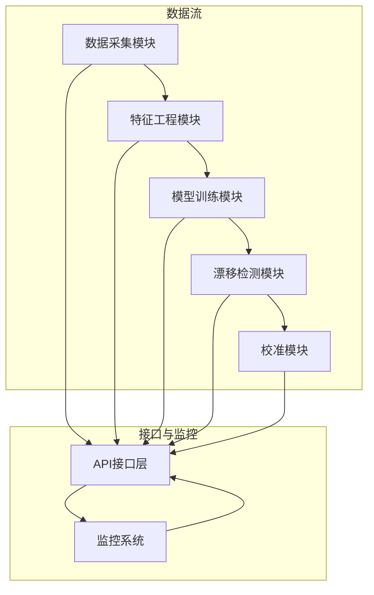
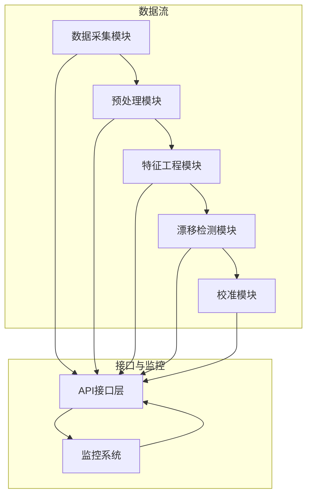

                 

### 前言与背景介绍

#### 1.1.1 信用评级的重要性

信用评级在企业运营中起着至关重要的作用。一个企业能否获得信贷支持、股权融资、供应链融资等，很大程度上取决于其信用评级。高信用评级的企业往往能够以较低的利率获得贷款，享受更长的还款期限，并且更容易获得合作伙伴的信任，从而在商业竞争中占据优势地位。

在现代社会，随着市场经济的不断发展，企业之间的信用关系变得越来越复杂。信用评级不仅关系到企业的财务状况，还涉及到企业管理能力、市场竞争力、行业地位等多个方面。因此，构建一个智能化、准确的信用评级模型，对企业发展具有重要意义。

首先，信用评级模型可以帮助企业评估自身信用状况，及时发现潜在风险，从而采取相应的措施进行风险控制。例如，当企业的信用评分低于某个临界值时，企业可以及时调整经营策略，优化财务状况，提升信用评分。

其次，信用评级模型可以为金融机构提供决策支持。金融机构在发放贷款时，会根据企业的信用评分来决定是否放贷以及贷款的额度和利率。一个准确、智能的信用评级模型可以降低金融机构的风险，提高放贷的效率和准确性。

最后，信用评级模型也可以为投资者提供参考。投资者在投资决策时，会关注企业的信用状况，从而判断企业的投资价值。一个良好的信用评级可以增加投资者的信心，吸引更多的投资资金。

#### 1.1.2 企业信用评级的定义

企业信用评级是指专业机构根据企业的财务状况、管理能力、市场竞争力、行业地位等多个因素，对企业的信用水平进行评估，并给出相应的信用等级。企业信用评级通常分为几个等级，如AAA、AA、A、BBB、BB、B等，等级越高，表示企业的信用越好。

企业信用评级不仅包括对过去数据的分析，还需要对未来可能发生的变化进行预测。因此，信用评级模型需要具备一定的预测能力，能够准确地预测企业未来的信用状况。

#### 1.1.3 企业信用评级的类型

企业信用评级可以按照不同的标准进行分类，常见的分类方式包括：

1. **按照评级机构分类**：不同的评级机构可能采用不同的评级标准和方法，因此信用评级的结果也会有所不同。常见的评级机构包括标准普尔、穆迪、惠誉等。

2. **按照评级对象分类**：企业信用评级可以针对不同的企业类型，如大型企业、中小企业、初创企业等。不同类型的企业在财务状况、管理能力、市场竞争力等方面存在差异，因此评级标准也会有所不同。

3. **按照评级方法分类**：企业信用评级可以采用定量评级和定性评级两种方法。定量评级主要基于企业的财务数据、经营状况等客观指标，而定性评级则更多依赖于专家的主观判断。

#### 1.1.4 企业信用评级的边界与外延

企业信用评级的边界主要是指评级范围和评级深度。评级范围通常包括企业的财务状况、管理能力、市场竞争力、行业地位等多个方面。评级深度则是指评级模型对每个方面的分析程度和细节程度。

企业信用评级的外延则是指评级结果的应用范围。评级结果不仅为企业自身提供决策支持，也为金融机构、投资者等外部利益相关者提供参考。此外，信用评级还可以作为企业上市、债券发行、并购重组等重大事项的依据。

#### 1.2 核心概念与联系

为了更好地理解企业信用评级模型，我们需要了解几个核心概念，包括数据挖掘与机器学习、概率论与统计学、信用风险评估模型。

**1.2.1 数据挖掘与机器学习**

数据挖掘是指从大量数据中提取出有价值的信息和知识的过程。它涉及到多种技术，如分类、聚类、关联规则挖掘等。机器学习是数据挖掘的一个重要分支，通过训练模型，使模型能够自动地从数据中学习规律和模式。

在信用评级模型中，数据挖掘和机器学习可以帮助我们识别企业信用风险，预测企业的信用状况。例如，通过分析企业的财务数据、交易记录等，可以构建一个预测模型，预测企业未来的信用评分。

**1.2.2 概率论与统计学**

概率论与统计学是分析数据的重要工具。概率论研究随机事件的可能性，统计学则通过数据分析，推断总体特征。

在信用评级模型中，概率论与统计学可以帮助我们理解企业信用风险的概率分布，以及如何通过数据分析来评估企业的信用水平。例如，可以使用假设检验方法来验证企业信用评分模型的假设条件，或者使用统计方法来评估模型预测的准确性。

**1.2.3 信用风险评估模型**

信用风险评估模型是指用于评估企业信用风险的数学模型。它通常基于企业的财务数据、市场数据、交易数据等，通过统计方法、机器学习等方法，构建一个预测模型。

信用风险评估模型可以分为定量模型和定性模型。定量模型主要基于数据分析和统计方法，如线性回归、逻辑回归等。定性模型则更多依赖于专家的主观判断和经验。

#### 1.3 概念属性特征对比表格

为了更好地理解上述核心概念，我们可以通过一个对比表格来展示它们的特点和区别。

| 概念 | 特点 | 描述 |
| ---- | ---- | ---- |
| 数据挖掘 | 目标 | 发现数据中的潜在模式 |
| 方法 | 分类、聚类、关联规则等 |
| 结果 | 知识、预测、决策等 |
| 机器学习 | 基础 | 数据挖掘的一个重要分支 |
| 特点 | 自动学习规律和模式 |
| 应用 | 预测、优化等 |
| 概率论与统计学 | 目标 | 描述随机现象的规律 |
| 方法 | 概率分布、假设检验等 |
| 结果 | 预测、置信区间等 |
| 信用风险评估模型 | 目标 | 评估企业信用风险 |
| 方法 | 统计模型、机器学习等 |
| 结果 | 风险评估、决策支持等 |

#### 1.4 ER实体关系图架构

为了更好地理解企业信用评级模型中的各个实体及其关系，我们可以使用Mermaid绘制一个ER实体关系图。

```mermaid
erDiagram
  Customer ||--|{ Rating } : has
  Rating ||--|{ RiskScore } : has
  Rating ||--|{ RatingHistory } : contains
```

在这个ER图中，`Customer` 表示企业，`Rating` 表示信用评级，`RiskScore` 表示信用评分，`RatingHistory` 表示信用评级的历史记录。每个企业都有一个对应的信用评级，信用评级包含一个信用评分和一个信用评级的历史记录。

---

**核心概念与联系**部分到此结束。在接下来的章节中，我们将深入探讨企业信用评级模型的基础知识、智能化评级模型的构建方法以及模型漂移检测的理论与实践。希望您对信用评级模型有了更深入的理解。在下一部分，我们将详细讲解企业信用评级模型的基础知识，包括信用评级的重要性、定义、类型及其边界与外延。让我们继续深入探讨这一主题。## 第1章：企业信用评级模型的基础知识

### 1.1 问题背景与核心概念

#### 1.1.1 信用评级的重要性

在当今高度全球化和竞争激烈的商业环境中，企业信用评级已经成为企业管理、金融决策以及合作伙伴选择的重要依据。信用评级不仅决定了企业能否获得信贷支持，还影响其在资本市场上的融资能力。一个良好的信用评级能够为企业带来多方面的利益：

1. **融资优势**：高信用评级的企业通常能够以更低的利率获得贷款，享受更长的还款期限，这有助于企业降低融资成本，优化资本结构。
   
2. **市场信任**：信用评级的高低直接影响到企业在市场中的形象和声誉。一个良好的信用评级能够增强投资者和合作伙伴的信心，提高企业的市场竞争力。

3. **风险管理**：企业信用评级可以帮助企业更好地了解自身信用状况，及时发现潜在风险，从而采取有效措施进行风险控制。

4. **合同谈判**：在供应链管理中，信用评级可以为企业提供谈判筹码，使企业在合同条款中占据更有利的位置。

#### 1.1.2 企业信用评级的定义

企业信用评级是指专业评级机构根据企业的财务状况、经营能力、管理水平、行业地位等多个因素，对企业的信用水平进行评估，并给出相应的信用等级。评级结果通常以符号表示，如AAA、AA、A、BBB等，其中AAA表示最高信用等级，BBB表示最低投资级。

企业信用评级不仅是对企业历史信用记录的总结，更是对未来信用风险的预测。它不仅涉及到企业的财务状况，还包括企业管理层的稳定性、业务模式、市场环境等多方面的因素。

#### 1.1.3 企业信用评级的类型

企业信用评级可以根据不同的标准进行分类，常见的分类方式包括：

1. **按照评级机构分类**：不同的评级机构可能采用不同的评级标准和方法，因此信用评级的结果也会有所不同。常见的评级机构包括标准普尔、穆迪、惠誉等。

2. **按照评级对象分类**：企业信用评级可以针对不同的企业类型，如大型企业、中小企业、初创企业等。不同类型的企业在财务状况、管理能力、市场竞争力等方面存在差异，因此评级标准也会有所不同。

3. **按照评级方法分类**：企业信用评级可以采用定量评级和定性评级两种方法。定量评级主要基于企业的财务数据、经营状况等客观指标，而定性评级则更多依赖于专家的主观判断。

#### 1.1.4 企业信用评级的边界与外延

企业信用评级的边界主要是指评级范围和评级深度。评级范围通常包括企业的财务状况、管理能力、市场竞争力、行业地位等多个方面。评级深度则是指评级模型对每个方面的分析程度和细节程度。

企业信用评级的外延则是指评级结果的应用范围。评级结果不仅为企业自身提供决策支持，也为金融机构、投资者等外部利益相关者提供参考。此外，信用评级还可以作为企业上市、债券发行、并购重组等重大事项的依据。

#### 1.2 核心概念与联系

为了更好地理解企业信用评级模型，我们需要了解几个核心概念，包括数据挖掘与机器学习、概率论与统计学、信用风险评估模型。

**1.2.1 数据挖掘与机器学习**

数据挖掘是指从大量数据中提取出有价值的信息和知识的过程。它涉及到多种技术，如分类、聚类、关联规则挖掘等。机器学习是数据挖掘的一个重要分支，通过训练模型，使模型能够自动地从数据中学习规律和模式。

在信用评级模型中，数据挖掘和机器学习可以帮助我们识别企业信用风险，预测企业的信用状况。例如，通过分析企业的财务数据、交易记录等，可以构建一个预测模型，预测企业未来的信用评分。

**1.2.2 概率论与统计学**

概率论与统计学是分析数据的重要工具。概率论研究随机事件的可能性，统计学则通过数据分析，推断总体特征。

在信用评级模型中，概率论与统计学可以帮助我们理解企业信用风险的概率分布，以及如何通过数据分析来评估企业的信用水平。例如，可以使用假设检验方法来验证企业信用评分模型的假设条件，或者使用统计方法来评估模型预测的准确性。

**1.2.3 信用风险评估模型**

信用风险评估模型是指用于评估企业信用风险的数学模型。它通常基于企业的财务数据、市场数据、交易数据等，通过统计方法、机器学习等方法，构建一个预测模型。

信用风险评估模型可以分为定量模型和定性模型。定量模型主要基于数据分析和统计方法，如线性回归、逻辑回归等。定性模型则更多依赖于专家的主观判断和经验。

#### 1.3 概念属性特征对比表格

为了更好地理解上述核心概念，我们可以通过一个对比表格来展示它们的特点和区别。

| 概念 | 特点 | 描述 |
| ---- | ---- | ---- |
| 数据挖掘 | 目标 | 发现数据中的潜在模式 |
| 方法 | 分类、聚类、关联规则等 |
| 结果 | 知识、预测、决策等 |
| 机器学习 | 基础 | 数据挖掘的一个重要分支 |
| 特点 | 自动学习规律和模式 |
| 应用 | 预测、优化等 |
| 概率论与统计学 | 目标 | 描述随机现象的规律 |
| 方法 | 概率分布、假设检验等 |
| 结果 | 预测、置信区间等 |
| 信用风险评估模型 | 目标 | 评估企业信用风险 |
| 方法 | 统计模型、机器学习等 |
| 结果 | 风险评估、决策支持等 |

#### 1.4 ER实体关系图架构

为了更好地理解企业信用评级模型中的各个实体及其关系，我们可以使用Mermaid绘制一个ER实体关系图。

```mermaid
erDiagram
  Customer ||--|{ Rating } : has
  Rating ||--|{ RiskScore } : has
  Rating ||--|{ RatingHistory } : contains
```

在这个ER图中，`Customer` 表示企业，`Rating` 表示信用评级，`RiskScore` 表示信用评分，`RatingHistory` 表示信用评级的历史记录。每个企业都有一个对应的信用评级，信用评级包含一个信用评分和一个信用评级的历史记录。

---

通过上述内容，我们详细介绍了企业信用评级的重要性、定义、类型以及边界与外延，并探讨了与信用评级相关的核心概念及其联系。在接下来的章节中，我们将深入探讨智能化评级模型的构建方法，以及模型漂移检测的理论与实践。敬请期待。## 第2章：智能化评级模型的构建方法

### 2.1 智能化评级模型概述

#### 2.1.1 智能化评级模型的定义

智能化评级模型是指结合人工智能、大数据、机器学习等先进技术，对企业信用评级进行自动分析和预测的模型。与传统的手工评级方法相比，智能化评级模型能够更快速、准确地评估企业的信用状况，并提供更为科学的决策支持。

#### 2.1.2 智能化评级模型的特点

1. **自动性与高效性**：智能化评级模型通过算法自动分析数据，能够在短时间内完成对大量数据的处理和分析，提高评级效率。

2. **准确性与可靠性**：通过机器学习等技术，智能化评级模型能够从历史数据中学习规律，提高预测的准确性，减少人为因素带来的主观偏差。

3. **动态调整**：智能化评级模型可以根据企业的新数据和历史表现进行动态调整，及时反映企业的信用变化。

4. **跨行业适用性**：智能化评级模型不仅可以应用于单一行业，还可以跨行业进行信用评级，提高模型的通用性和适用性。

#### 2.1.3 智能化评级模型的优势

1. **降低成本**：自动化处理数据能够减少人力成本，提高评级效率。

2. **提高决策质量**：通过精确的信用评级，企业可以更准确地评估合作伙伴和客户的风险，从而做出更明智的决策。

3. **提升竞争力**：良好的信用评级能够帮助企业获得更低的融资成本，提高市场竞争力。

4. **实时监测**：智能化评级模型能够实时监测企业的信用状况，及时发现潜在风险，提供预警。

### 2.2 模型构建步骤

构建智能化评级模型通常包括以下步骤：

#### 2.2.1 数据收集与预处理

1. **数据收集**：收集企业的财务数据、交易记录、市场表现等数据。数据来源可以是企业的财务报表、银行流水、交易系统等。

2. **数据清洗**：处理缺失值、异常值和重复值，保证数据的完整性和准确性。

3. **数据转换**：对数据进行标准化处理，如归一化、规范化等，使数据具备可比性。

#### 2.2.2 特征选择与工程

1. **特征选择**：从原始数据中筛选出对信用评级有重要影响的关键特征。

2. **特征工程**：对选定的特征进行变换和组合，以提高模型的预测能力。

### 2.2.3 模型选择与训练

1. **模型选择**：根据信用评级的特点和数据类型，选择合适的模型，如线性回归、决策树、随机森林、支持向量机等。

2. **模型训练**：使用历史数据对模型进行训练，调整模型参数，使模型能够准确预测信用评分。

### 2.2.4 模型评估与优化

1. **模型评估**：使用交叉验证等方法评估模型的性能，如准确率、召回率、F1分数等。

2. **模型优化**：根据评估结果调整模型参数，或者更换模型，以提高预测准确性。

### 2.3 主流智能化评级模型介绍

#### 2.3.1 支持向量机（SVM）

支持向量机是一种二分类模型，主要用于分类和回归分析。在信用评级中，SVM可以用来预测企业的信用评分。其核心思想是找到一个最佳决策边界，将不同类别的数据点分开。

**算法原理**：SVM通过最大化分类间隔来寻找最佳决策边界。在信用评级中，可以通过优化目标函数来找到最优决策边界，从而实现信用评分的预测。

**代码示例**（Python）：

```python
from sklearn import svm

# 创建SVM模型
model = svm.SVC(kernel='linear')

# 训练模型
model.fit(X_train, y_train)

# 预测信用评分
predictions = model.predict(X_test)
```

#### 2.3.2 随机森林（Random Forest）

随机森林是一种集成学习方法，由多个决策树组成，通过投票的方式得到最终预测结果。随机森林在处理高维数据和避免过拟合方面具有优势，常用于信用评级。

**算法原理**：随机森林通过随机选取特征和样本子集来训练多个决策树，每个决策树对样本进行分类或回归，最终通过多数投票得到预测结果。

**代码示例**（Python）：

```python
from sklearn.ensemble import RandomForestClassifier

# 创建随机森林模型
model = RandomForestClassifier(n_estimators=100)

# 训练模型
model.fit(X_train, y_train)

# 预测信用评分
predictions = model.predict(X_test)
```

#### 2.3.3 深度学习模型

深度学习模型，如卷积神经网络（CNN）和循环神经网络（RNN），在处理复杂数据和进行特征提取方面具有强大的能力。深度学习模型可以自动学习数据中的复杂模式，提高信用评级的准确性。

**算法原理**：深度学习模型通过多层次的神经网络结构，自动提取数据中的特征，并逐步进行特征融合和优化。

**代码示例**（Python）：

```python
from keras.models import Sequential
from keras.layers import Dense, Conv2D, MaxPooling2D, LSTM

# 创建深度学习模型
model = Sequential()
model.add(Conv2D(filters=32, kernel_size=(3, 3), activation='relu', input_shape=(28, 28, 1)))
model.add(MaxPooling2D(pool_size=(2, 2)))
model.add(LSTM(units=50, return_sequences=True))
model.add(Dense(units=1, activation='sigmoid'))

# 编译模型
model.compile(optimizer='adam', loss='binary_crossentropy', metrics=['accuracy'])

# 训练模型
model.fit(X_train, y_train, epochs=10, batch_size=64)

# 预测信用评分
predictions = model.predict(X_test)
```

通过以上内容，我们详细介绍了智能化评级模型的构建方法，包括数据收集与预处理、特征选择与工程、模型选择与训练、模型评估与优化等步骤。同时，我们介绍了三种主流的智能化评级模型：支持向量机（SVM）、随机森林（Random Forest）和深度学习模型。在下一章中，我们将探讨模型漂移检测的理论与实践，敬请期待。## 第3章：模型漂移检测的理论与实践

### 3.1 漂移检测的重要性

模型漂移（Drift Detection）是指模型在长期运行过程中，由于数据分布的变化，导致模型性能下降的现象。模型漂移是一个严重的问题，因为它会直接影响模型的可靠性和准确性。具体来说，模型漂移的重要性体现在以下几个方面：

#### 3.1.1 模型失效预警

通过漂移检测，可以及时发现模型性能的下降，从而提前预警模型可能出现的失效情况。例如，在金融风控领域，信用评分模型的漂移可能预示着某个高风险客户群体的出现，从而需要金融机构采取措施进行风险控制。

#### 3.1.2 提升模型稳定性

漂移检测有助于提高模型的稳定性，避免由于数据分布变化导致模型性能波动。通过持续监控模型性能，可以及时调整模型参数，保持模型在最佳状态。

#### 3.1.3 优化模型更新策略

漂移检测可以指导模型的更新策略。当检测到数据分布发生显著变化时，可以及时调整模型，或者引入新的数据集重新训练模型，从而保持模型的有效性。

#### 3.1.4 提高业务决策质量

在业务决策中，准确的信用评分模型至关重要。模型漂移可能导致信用评分的偏差，进而影响业务决策的质量。通过漂移检测，可以确保信用评分模型的准确性和可靠性，为业务决策提供有力支持。

### 3.2 漂移检测方法

漂移检测方法可以分为统计方法、机器学习方法和集成方法。每种方法都有其独特的原理和应用场景。

#### 3.2.1 统计方法

统计方法主要通过分析模型预测结果与实际结果的差异，来判断模型是否存在漂移。常用的统计方法包括：

1. **统计测试**：如t检验、卡方检验等，用于比较模型在训练集和测试集上的性能差异。
2. **偏差-方差分析**：通过比较模型在不同数据集上的性能，来判断模型是否发生过拟合或欠拟合。
3. **累积分布函数（CDF）比较**：比较模型预测结果的累积分布函数与实际结果的CDF，判断两者是否显著不同。

**代码示例**（Python）：

```python
from scipy import stats

# 计算训练集和测试集的统计差异
t_stat, p_value = stats.ttest_ind(train_predictions, test_predictions)

# 比较CDF
plt.figure()
stats.plot(df1['Actual'], label='Train')
stats.plot(df2['Actual'], label='Test')
plt.legend()
plt.show()
```

#### 3.2.2 机器学习方法

机器学习方法通过构建专门的漂移检测模型，来判断模型是否存在漂移。常用的机器学习方法包括：

1. **监督学习**：使用标记的漂移数据来训练漂移检测模型，如支持向量机、决策树等。
2. **无监督学习**：通过无监督学习算法，如聚类、异常检测等，来识别数据分布的变化。
3. **集成学习**：结合多种算法，构建更加鲁棒和准确的漂移检测模型。

**代码示例**（Python）：

```python
from sklearn.ensemble import RandomForestClassifier
from sklearn.model_selection import train_test_split

# 分割训练集和测试集
X_train, X_test, y_train, y_test = train_test_split(X, y, test_size=0.2)

# 训练漂移检测模型
drift_model = RandomForestClassifier()
drift_model.fit(X_train, y_train)

# 预测测试集
predictions = drift_model.predict(X_test)
```

#### 3.2.3 集成方法

集成方法将多种漂移检测方法结合起来，以提高检测的准确性和鲁棒性。常用的集成方法包括：

1. **投票法**：将多个漂移检测方法的检测结果进行投票，取多数意见作为最终结果。
2. **集成学习**：如随机森林、梯度提升机等，将多种漂移检测算法集成到一个模型中，利用各自的优点。
3. **迁移学习**：利用已有的漂移检测模型，在新数据集上进行迁移学习，以提高检测性能。

**代码示例**（Python）：

```python
from sklearn.ensemble import VotingClassifier

# 创建多个漂移检测模型
model1 = RandomForestClassifier()
model2 = LogisticRegression()
model3 = KNearestNeighbors()

# 创建集成模型
ensemble = VotingClassifier(estimators=[
    ('rf', model1),
    ('lr', model2),
    ('knn', model3)],
    voting='soft')

# 训练集成模型
ensemble.fit(X_train, y_train)

# 预测测试集
predictions = ensemble.predict(X_test)
```

### 3.3 实践案例

为了更好地理解漂移检测的应用，我们来看一个实际案例。

#### 3.3.1 漂移检测流程

1. **数据收集**：收集训练集和测试集的数据。
2. **特征工程**：对数据进行预处理和特征提取。
3. **模型训练**：使用训练集训练信用评分模型。
4. **模型评估**：使用测试集评估模型性能。
5. **漂移检测**：使用统计方法、机器学习方法和集成方法检测模型是否存在漂移。
6. **模型调整**：根据检测结果调整模型参数或重新训练模型。

#### 3.3.2 漂移检测工具介绍

在实际应用中，可以使用一些开源工具来辅助进行漂移检测，如DriftDetection、DriftBase等。这些工具提供了丰富的算法和可视化功能，可以帮助用户快速搭建漂移检测系统。

**代码示例**（Python）：

```python
from drift_detection import DriftDetector

# 初始化漂移检测器
detector = DriftDetector()

# 添加测试集
detector.add_data(X_test, y_test)

# 进行漂移检测
drift检测结果 = detector.detect()

# 打印检测结果
print(drift检测结果)
```

#### 3.3.3 漂移检测案例分析

我们以一个信用卡欺诈检测模型为例，分析漂移检测的应用。

1. **数据集**：使用信用卡交易数据集，包括正常交易和欺诈交易。
2. **模型训练**：使用训练集训练一个分类模型，如逻辑回归。
3. **模型评估**：使用测试集评估模型性能，如准确率、召回率等。
4. **漂移检测**：使用统计方法和机器学习方法检测模型是否存在漂移。
5. **模型调整**：根据检测结果，重新训练模型或调整模型参数。

通过以上案例，我们可以看到漂移检测在信用评分模型中的应用和重要性。在下一章中，我们将讨论漂移检测与校准系统设计，包括系统架构与模块划分。敬请期待。## 第4章：系统架构与模块划分

### 4.1 系统架构概述

#### 4.1.1 系统架构设计原则

在设计智能化的企业信用评级模型漂移检测与校准系统时，我们遵循以下原则：

1. **模块化设计**：将系统分解为多个独立模块，每个模块负责特定的功能，便于维护和扩展。
2. **可扩展性**：系统应具备良好的扩展性，能够根据业务需求的变化，灵活增加或替换模块。
3. **高可用性**：确保系统在面临高并发访问和故障时，能够保持稳定运行，提供可靠的服务。
4. **高性能**：系统应具备高性能，能够在短时间内处理大量数据，确保模型的实时性。
5. **安全性**：系统应具备严格的安全措施，保护用户数据的安全性和隐私。

#### 4.1.2 系统总体架构图

系统的总体架构可以分为以下几个部分：

1. **数据采集模块**：负责从各种数据源（如财务报表、交易记录等）收集数据，并进行预处理。
2. **特征工程模块**：负责对采集到的数据进行清洗、转换和特征提取，为模型提供高质量的输入数据。
3. **模型训练模块**：负责训练信用评分模型，包括模型选择、参数调优和模型评估等。
4. **漂移检测模块**：负责实时监控模型的性能，检测数据分布的变化，发现模型漂移。
5. **校准模块**：负责根据漂移检测结果，调整模型参数或重新训练模型，确保模型的准确性和稳定性。
6. **API接口层**：提供对外接口，供其他系统或应用调用，如前端应用、数据分析工具等。
7. **监控系统**：负责监控系统运行状态，提供实时日志、告警等功能。

以下是一个简化的系统架构图：



### 4.2 系统模块划分

为了更详细地介绍系统架构，下面我们将逐个模块进行划分和解释。

#### 4.2.1 数据采集模块

数据采集模块负责从不同的数据源收集数据，包括企业的财务报表、交易记录、市场数据等。数据采集模块的关键功能包括：

1. **数据接入**：建立与各种数据源的联系，如数据库、API接口、文件系统等。
2. **数据清洗**：处理数据中的缺失值、异常值和重复值，确保数据的完整性和准确性。
3. **数据同步**：定期同步数据，保证数据的一致性和时效性。

#### 4.2.2 特征工程模块

特征工程模块负责对采集到的数据进行预处理和特征提取，为模型训练提供高质量的输入数据。关键功能包括：

1. **数据预处理**：对数据进行标准化、归一化、缺失值填充等处理。
2. **特征提取**：从原始数据中提取出对信用评级有重要影响的特征，如财务比率、交易频率、市场表现等。
3. **特征选择**：通过特征重要性分析、相关性分析等方法，选择最有代表性的特征。

#### 4.2.3 模型训练模块

模型训练模块负责训练信用评分模型，包括模型选择、参数调优和模型评估等。关键功能包括：

1. **模型选择**：根据数据类型和业务需求，选择合适的模型，如线性回归、决策树、随机森林、深度学习等。
2. **模型训练**：使用训练集对模型进行训练，并调整模型参数，优化模型性能。
3. **模型评估**：使用测试集评估模型性能，如准确率、召回率、F1分数等，选择最优模型。

#### 4.2.4 漂移检测模块

漂移检测模块负责实时监控模型的性能，检测数据分布的变化，发现模型漂移。关键功能包括：

1. **漂移检测算法**：实现各种漂移检测算法，如统计方法、机器学习方法、集成方法等。
2. **实时监控**：定期或实时监控模型的预测性能，如准确率、召回率等指标。
3. **异常检测**：检测模型预测结果与实际结果之间的差异，发现数据分布的变化。

#### 4.2.5 校准模块

校准模块负责根据漂移检测结果，调整模型参数或重新训练模型，确保模型的准确性和稳定性。关键功能包括：

1. **模型调整**：根据漂移检测结果，调整模型参数，如学习率、正则化参数等。
2. **模型重训**：在检测到严重漂移时，重新训练模型，使用新的数据集。
3. **校准验证**：使用验证集或测试集验证调整后的模型性能，确保模型的有效性。

#### 4.2.6 API接口层

API接口层提供对外接口，供其他系统或应用调用。关键功能包括：

1. **接口定义**：定义RESTful API接口，支持数据的采集、查询、更新等操作。
2. **认证授权**：实现用户认证和授权机制，确保接口的安全性。
3. **接口文档**：提供详细的接口文档，方便开发者使用。

#### 4.2.7 监控系统

监控系统负责监控系统运行状态，提供实时日志、告警等功能。关键功能包括：

1. **日志记录**：记录系统运行过程中的日志信息，如错误日志、性能日志等。
2. **告警通知**：当系统发生异常或性能问题时，及时发送告警通知，如邮件、短信等。
3. **性能监控**：实时监控系统的性能指标，如响应时间、吞吐量等。

通过以上模块划分和功能介绍，我们可以更好地理解智能化的企业信用评级模型漂移检测与校准系统的架构设计。在下一章中，我们将深入探讨数据预处理与特征工程的方法，敬请期待。## 第5章：数据预处理与特征工程

### 5.1 数据预处理

数据预处理是构建智能化企业信用评级模型的重要环节，它包括数据的清洗、转换和归一化等步骤。以下是数据预处理的关键步骤：

#### 5.1.1 数据清洗

数据清洗的目标是消除数据中的噪声、错误和异常值，确保数据的准确性和完整性。具体操作包括：

1. **缺失值处理**：缺失值处理方法包括删除缺失值、填补缺失值（如平均值、中位数填补）和模型填补（如K最近邻填补）。
2. **异常值处理**：异常值处理方法包括删除异常值、变换异常值（如取对数、开平方）或使用统计方法（如三次样条插值）。
3. **重复值处理**：删除重复的数据记录，避免重复计算。

**代码示例**（Python）：

```python
import pandas as pd

# 读取数据
df = pd.read_csv('data.csv')

# 删除缺失值
df = df.dropna()

# 删除重复值
df = df.drop_duplicates()

# 处理异常值
df['feature'] = df['feature'].apply(lambda x: x if x > 0 else 0)
```

#### 5.1.2 数据转换

数据转换包括将分类变量转换为数值变量，以及将时间序列数据进行处理。具体操作包括：

1. **编码**：将分类变量转换为数值变量，如独热编码（One-Hot Encoding）、标签编码（Label Encoding）。
2. **时间序列**：对时间序列数据进行处理，如窗口聚合（如移动平均、指数平滑）、时间特征提取（如日期差、季节性特征）。

**代码示例**（Python）：

```python
from sklearn.preprocessing import OneHotEncoder

# 独热编码
encoder = OneHotEncoder()
encoded_df = encoder.fit_transform(df[['category']]).toarray()

# 时间序列处理
df['date'] = pd.to_datetime(df['date'])
df['month'] = df['date'].dt.month
df['day'] = df['date'].dt.day
```

#### 5.1.3 数据归一化

数据归一化的目标是将不同特征的数据范围调整到相同的尺度，避免特征之间的尺度差异对模型训练的影响。常见的方法包括：

1. **标准化**：将数据缩放到均值为0，标准差为1的范围内。
2. **最小-最大缩放**：将数据缩放到[0, 1]范围内。
3. **分位数缩放**：将数据缩放到[Q1 - 1.5*IQR, Q3 + 1.5*IQR]范围内。

**代码示例**（Python）：

```python
from sklearn.preprocessing import StandardScaler

# 标准化
scaler = StandardScaler()
df_scaled = scaler.fit_transform(df)

# 最小-最大缩放
df_scaled = (df - df.min()) / (df.max() - df.min())
```

### 5.2 特征工程

特征工程是提高模型性能的关键步骤，它包括特征选择、特征构造和特征降维等。以下是特征工程的关键步骤：

#### 5.2.1 特征选择

特征选择的目标是选择对模型预测有显著影响的关键特征，避免特征冗余和过拟合。常见的方法包括：

1. **过滤式特征选择**：基于特征的重要性和相关性，筛选出重要的特征。
2. **包装式特征选择**：通过训练多个模型，选择对多个模型都有显著影响的特征。
3. **嵌入式特征选择**：在模型训练过程中自动筛选特征，如L1正则化。

**代码示例**（Python）：

```python
from sklearn.feature_selection import SelectKBest, f_classif

# 过滤式特征选择
selector = SelectKBest(f_classif, k=10)
selected_features = selector.fit_transform(df, y)

# 包装式特征选择
from sklearn.ensemble import RandomForestClassifier

selector = RandomForestClassifier()
selected_features = selector.fit(df, y)
```

#### 5.2.2 特征构造

特征构造是通过组合或变换原始特征，构建新的特征，以提高模型性能。常见的方法包括：

1. **交互特征**：将两个或多个特征组合成一个新的特征。
2. **多项式特征**：将特征进行多项式变换，增加特征之间的交互。
3. **时间特征**：从时间序列数据中提取新的时间特征，如趋势、季节性等。

**代码示例**（Python）：

```python
# 交互特征
df['new_feature'] = df['feature1'] * df['feature2']

# 多项式特征
df['square_feature'] = df['feature'] ** 2

# 时间特征
df['month'] = df['date'].dt.month
df['day_of_week'] = df['date'].dt.dayofweek
```

#### 5.2.3 特征降维

特征降维的目标是减少特征的数量，降低模型的复杂度，同时保持模型的高性能。常见的方法包括：

1. **主成分分析（PCA）**：通过线性变换将高维数据投影到低维空间，保留主要特征。
2. **线性判别分析（LDA）**：通过最大化类内离散度和最小化类间离散度，将数据投影到最优的线性子空间。
3. **自动编码器（Autoencoder）**：通过编码器和解码器学习数据的低维表示。

**代码示例**（Python）：

```python
from sklearn.decomposition import PCA

# 主成分分析
pca = PCA(n_components=5)
df_pca = pca.fit_transform(df)

# 自动编码器
from keras.models import Model
from keras.layers import Input, Dense

input_layer = Input(shape=(df.shape[1],))
encoded = Dense(64, activation='relu')(input_layer)
encoded = Dense(32, activation='relu')(encoded)
encoded = Dense(16, activation='relu')(encoded)
decoded = Dense(df.shape[1], activation='sigmoid')(encoded)

autoencoder = Model(input_layer, decoded)
autoencoder.compile(optimizer='adam', loss='binary_crossentropy')
autoencoder.fit(df, df, epochs=100, batch_size=32, shuffle=True)
```

通过以上内容，我们详细介绍了数据预处理和特征工程的方法。在下一章中，我们将深入探讨漂移检测算法的实现，包括系统架构和核心算法。敬请期待。## 第6章：漂移检测算法实现

### 6.1 漂移检测算法概述

漂移检测算法是智能化的企业信用评级模型中至关重要的一环，其目标是实时监测模型的预测性能，及时发现数据分布的变化，确保模型的准确性和稳定性。本章将介绍几种常见的漂移检测算法，包括统计方法、机器学习方法和集成方法，并详细探讨每种算法的实现细节。

#### 6.1.1 统计方法

统计方法主要通过分析模型预测结果与实际结果的统计差异来判断是否存在漂移。常用的统计方法包括：

1. **累积分布函数（CDF）比较**：通过比较模型预测结果的累积分布函数（CDF）与实际结果的CDF，判断两者是否存在显著差异。
2. **均值差异检验**：比较模型预测结果的均值与实际结果的均值，判断是否存在显著差异。
3. **方差差异检验**：比较模型预测结果的方差与实际结果的方差，判断是否存在显著差异。

**实现细节**：

```python
import numpy as np
import scipy.stats as stats

# 假设df1为模型预测结果，df2为实际结果
df1 = np.array([1, 2, 3, 4, 5])
df2 = np.array([2, 3, 4, 5, 6])

# 计算CDF
cdf1 = np.cumsum(df1) / len(df1)
cdf2 = np.cumsum(df2) / len(df2)

# 比较CDF
stats.ks_2samp(cdf1, cdf2)
```

#### 6.1.2 机器学习方法

机器学习方法通过构建专门的漂移检测模型来检测数据分布的变化。常用的机器学习方法包括：

1. **监督学习**：使用标记的漂移数据来训练漂移检测模型，如支持向量机、决策树等。
2. **无监督学习**：通过无监督学习算法，如聚类、异常检测等，来识别数据分布的变化。
3. **半监督学习**：结合有监督和无监督学习，利用少量标记数据和高量未标记数据来训练漂移检测模型。

**实现细节**：

```python
from sklearn.ensemble import RandomForestClassifier
from sklearn.model_selection import train_test_split

# 分割数据
X_train, X_test, y_train, y_test = train_test_split(X, y, test_size=0.2)

# 训练漂移检测模型
drift_model = RandomForestClassifier()
drift_model.fit(X_train, y_train)

# 预测测试集
predictions = drift_model.predict(X_test)
```

#### 6.1.3 集成方法

集成方法通过结合多种漂移检测方法，提高检测的准确性和鲁棒性。常用的集成方法包括：

1. **投票法**：将多个漂移检测方法的检测结果进行投票，取多数意见作为最终结果。
2. **集成学习**：如随机森林、梯度提升机等，将多种漂移检测算法集成到一个模型中，利用各自的优点。
3. **迁移学习**：利用已有的漂移检测模型，在新数据集上进行迁移学习，以提高检测性能。

**实现细节**：

```python
from sklearn.ensemble import VotingClassifier

# 创建多个漂移检测模型
model1 = RandomForestClassifier()
model2 = LogisticRegression()
model3 = KNearestNeighbors()

# 创建集成模型
ensemble = VotingClassifier(estimators=[
    ('rf', model1),
    ('lr', model2),
    ('knn', model3)],
    voting='soft')

# 训练集成模型
ensemble.fit(X_train, y_train)

# 预测测试集
predictions = ensemble.predict(X_test)
```

### 6.2 漂移检测算法实现

在本节中，我们将详细介绍如何在实际项目中实现漂移检测算法。

#### 6.2.1 系统架构

漂移检测算法的实现通常包括以下模块：

1. **数据采集模块**：负责从数据源收集实时数据。
2. **预处理模块**：对数据进行清洗、转换和归一化等预处理操作。
3. **特征工程模块**：提取对漂移检测有意义的特征。
4. **漂移检测模块**：实现各种漂移检测算法，如统计方法、机器学习方法和集成方法。
5. **校准模块**：根据漂移检测结果，调整模型参数或重新训练模型。

以下是一个简化的系统架构图：



#### 6.2.2 数据采集与预处理

数据采集与预处理是漂移检测的基础，确保数据的准确性和一致性。具体操作包括：

1. **数据采集**：从企业财务报表、交易记录等数据源收集实时数据。
2. **数据清洗**：处理数据中的缺失值、异常值和重复值。
3. **数据转换**：将分类变量转换为数值变量，对时间序列数据进行处理。
4. **数据归一化**：将不同特征的数据范围调整到相同的尺度。

**代码示例**（Python）：

```python
import pandas as pd
from sklearn.preprocessing import StandardScaler

# 读取数据
df = pd.read_csv('data.csv')

# 数据清洗
df = df.dropna()
df = df.drop_duplicates()

# 数据转换
df['category'] = pd.Categorical(df['category'])
df['category'] = df['category'].cat.codes

# 数据归一化
scaler = StandardScaler()
df_scaled = scaler.fit_transform(df)
```

#### 6.2.3 特征工程

特征工程是提高漂移检测性能的关键步骤，包括特征选择、特征构造和特征降维等。具体操作包括：

1. **特征选择**：通过特征重要性和相关性分析，选择对漂移检测有显著影响的特征。
2. **特征构造**：通过组合或变换原始特征，构建新的特征。
3. **特征降维**：通过主成分分析（PCA）或自动编码器（Autoencoder）等算法，减少特征的数量。

**代码示例**（Python）：

```python
from sklearn.feature_selection import SelectKBest, f_classif
from sklearn.decomposition import PCA

# 特征选择
selector = SelectKBest(f_classif, k=10)
selected_features = selector.fit_transform(df_scaled, y)

# 特征构造
df['new_feature'] = df['feature1'] * df['feature2']

# 特征降维
pca = PCA(n_components=5)
df_pca = pca.fit_transform(selected_features)
```

#### 6.2.4 漂移检测算法实现

漂移检测算法的实现包括以下步骤：

1. **选择合适的漂移检测算法**：根据业务需求和数据特点，选择统计方法、机器学习方法或集成方法。
2. **训练漂移检测模型**：使用训练集对漂移检测模型进行训练。
3. **实时检测**：使用实时数据对漂移检测模型进行预测，判断是否存在漂移。
4. **校准模型**：根据漂移检测结果，调整模型参数或重新训练模型。

**代码示例**（Python）：

```python
from sklearn.ensemble import RandomForestClassifier

# 训练漂移检测模型
drift_model = RandomForestClassifier()
drift_model.fit(X_train, y_train)

# 实时检测
predictions = drift_model.predict(X_test)

# 校准模型
# 根据漂移检测结果，调整模型参数或重新训练模型
```

通过以上内容，我们详细介绍了漂移检测算法的实现，包括系统架构、数据预处理、特征工程和具体算法实现。在下一章中，我们将探讨模型校准策略与方法，敬请期待。## 第7章：模型校准策略与方法

### 7.1 模型校准策略

模型校准（Model Calibration）是智能化的企业信用评级模型中的重要环节，其目标是调整模型参数或重新训练模型，以减少预测误差，提高模型的准确性和稳定性。有效的模型校准策略可以显著提升模型的预测性能，确保其在实际应用中的可靠性。以下是几种常见的模型校准策略：

#### 7.1.1 参数调整

参数调整是最常见的模型校准策略之一，通过调整模型参数，如学习率、正则化参数等，来优化模型性能。具体步骤如下：

1. **分析模型性能**：使用训练集和测试集评估模型的性能，如准确率、召回率等。
2. **调整参数**：根据性能分析结果，调整模型参数，如减小学习率、增加正则化强度等。
3. **重新训练模型**：使用调整后的参数重新训练模型。

**代码示例**（Python）：

```python
from sklearn.linear_model import LogisticRegression

# 创建模型
model = LogisticRegression()

# 训练模型
model.fit(X_train, y_train)

# 分析性能
accuracy = model.score(X_test, y_test)

# 调整参数
model = LogisticRegression(C=10)

# 重新训练模型
model.fit(X_train, y_train)
```

#### 7.1.2 重新训练

重新训练是指根据漂移检测结果，使用新的数据集重新训练模型，以更新模型的预测能力。具体步骤如下：

1. **收集新的数据**：从企业财务报表、交易记录等数据源收集新的数据。
2. **预处理数据**：清洗、转换和归一化新的数据。
3. **重新训练模型**：使用新的数据集重新训练模型。

**代码示例**（Python）：

```python
from sklearn.ensemble import RandomForestClassifier

# 创建模型
model = RandomForestClassifier()

# 训练模型
model.fit(X_train, y_train)

# 收集新的数据
X_new = pd.read_csv('new_data.csv')
y_new = X_new['label']

# 预处理数据
X_new_processed = preprocess_data(X_new)

# 重新训练模型
model.fit(X_new_processed, y_new)
```

#### 7.1.3 结合两种策略

在实际应用中，参数调整和重新训练可以结合使用，以提高模型校准的效果。具体步骤如下：

1. **参数调整**：根据训练集和测试集的性能，调整模型参数。
2. **重新训练**：使用调整后的参数重新训练模型，并根据新的数据集进行进一步的调整。

**代码示例**（Python）：

```python
from sklearn.ensemble import RandomForestClassifier

# 创建模型
model = RandomForestClassifier()

# 训练模型
model.fit(X_train, y_train)

# 分析性能
accuracy = model.score(X_test, y_test)

# 参数调整
model = RandomForestClassifier(n_estimators=100)

# 重新训练模型
model.fit(X_train, y_train)

# 收集新的数据
X_new = pd.read_csv('new_data.csv')
y_new = X_new['label']

# 预处理数据
X_new_processed = preprocess_data(X_new)

# 重新训练模型
model.fit(X_new_processed, y_new)
```

### 7.2 模型校准方法

模型校准方法是指用于评估和调整模型参数的技术手段。以下是几种常见的模型校准方法：

#### 7.2.1 对数似然校准

对数似然校准是一种基于概率分布的模型校准方法，通过调整模型参数，使模型的预测概率更接近实际概率分布。具体步骤如下：

1. **计算实际概率分布**：使用测试集计算实际发生概率。
2. **计算预测概率分布**：使用训练集计算模型预测概率。
3. **优化似然函数**：通过优化似然函数，调整模型参数，使预测概率更接近实际概率分布。

**代码示例**（Python）：

```python
from sklearn.calibration import CalibratedClassifierCV

# 创建模型
model = RandomForestClassifier()

# 训练模型
model.fit(X_train, y_train)

# 计算实际概率分布
prob_true = model.predict_proba(X_test)[:, 1]

# 优化似然函数
calibrated_model = CalibratedClassifierCV(model, method='isotonic')
calibrated_model.fit(X_train, y_train)

# 预测概率分布
prob_pred = calibrated_model.predict_proba(X_test)[:, 1]
```

#### 7.2.2 等效概率校准

等效概率校准是一种基于阈值调整的模型校准方法，通过调整阈值，使模型在特定阈值下的预测准确率达到预期水平。具体步骤如下：

1. **计算等效概率**：使用测试集计算模型在不同阈值下的预测概率。
2. **调整阈值**：根据等效概率计算结果，调整模型预测阈值，使预测准确率达到预期水平。

**代码示例**（Python）：

```python
from sklearn.calibration import CalibratedClassifierCV

# 创建模型
model = RandomForestClassifier()

# 训练模型
model.fit(X_train, y_train)

# 计算等效概率
prob_true = model.predict_proba(X_test)[:, 1]

# 调整阈值
threshold = np.argmax(np.mean(prob_true * y_test, axis=0))

# 预测结果
predictions = (model.predict_proba(X_test)[:, 1] >= threshold)
```

#### 7.2.3 置信区间校准

置信区间校准是一种通过调整置信区间宽度的模型校准方法，以提高模型的预测可信度。具体步骤如下：

1. **计算置信区间**：使用测试集计算模型的预测置信区间。
2. **调整置信区间**：根据模型预测结果的置信度，调整置信区间宽度。

**代码示例**（Python）：

```python
from sklearn.calibration import CalibratedClassifierCV

# 创建模型
model = RandomForestClassifier()

# 训练模型
model.fit(X_train, y_train)

# 计算置信区间
prob_true = model.predict_proba(X_test)[:, 1]
confidence = model.predict_proba(X_test)[:, 1]

# 调整置信区间
confidence_interval = np.percentile(confidence, [2.5, 97.5])

# 预测结果
predictions = (prob_true >= np.mean(confidence_interval))
```

通过以上内容，我们详细介绍了模型校准的策略和方法，包括参数调整、重新训练、对数似然校准、等效概率校准和置信区间校准等。这些策略和方法可以帮助我们有效调整模型参数，提高模型的预测性能和稳定性。在下一章中，我们将探讨项目实战与案例分析，敬请期待。## 第8章：系统环境搭建与项目初始化

### 8.1 系统环境搭建

在进行智能化的企业信用评级模型漂移检测与校准系统的项目开发之前，首先需要搭建一个合适的环境，以便后续的代码编写、调试和部署。以下是搭建系统环境的详细步骤：

#### 8.1.1 操作系统

我们选择Ubuntu 20.04作为项目的操作系统，因为它具有良好的稳定性和丰富的开源软件支持。

#### 8.1.2 编程语言

本项目主要使用Python进行开发，Python是一种广泛使用的编程语言，尤其在数据科学和机器学习领域有很高的应用价值。

#### 8.1.3 虚拟环境

为了更好地管理项目的依赖库，我们使用virtualenv来创建一个独立的虚拟环境。

1. 安装virtualenv：

```bash
pip install virtualenv
```

2. 创建虚拟环境：

```bash
virtualenv env
```

3. 激活虚拟环境：

```bash
source env/bin/activate
```

#### 8.1.4 开发工具

1. **文本编辑器**：推荐使用Visual Studio Code（VS Code），它具有丰富的插件和强大的语法高亮功能。
2. **IDE**：也可使用PyCharm，它提供了一个完整的集成开发环境，适合大型项目开发。
3. **Jupyter Notebook**：用于快速原型设计和数据探索。

#### 8.1.5 依赖库安装

在虚拟环境中安装项目所需的依赖库：

```bash
pip install numpy pandas scikit-learn tensorflow matplotlib mermaid
```

这些库分别用于数据处理、机器学习、数据可视化等。

### 8.2 项目初始化

初始化项目包括创建项目目录、配置文件和编写基本代码框架。以下是项目初始化的步骤：

#### 8.2.1 创建项目目录

在虚拟环境中创建项目的目录结构，如下所示：

```
project/
|-- data/
|   |-- raw/
|   |-- processed/
|-- models/
|-- scripts/
|   |-- data_preprocessing.py
|   |-- feature_engineering.py
|   |-- model_training.py
|   |-- drift_detection.py
|   |-- calibration.py
|-- tests/
|-- requirements.txt
|-- README.md
```

#### 8.2.2 配置文件

创建一个`requirements.txt`文件，用于记录项目所需的依赖库：

```
numpy
pandas
scikit-learn
tensorflow
matplotlib
mermaid
```

#### 8.2.3 编写基本代码框架

在`scripts/`目录下创建几个Python文件，用于实现系统的各个模块。以下是每个文件的基本框架：

1. `data_preprocessing.py`：

```python
import pandas as pd

def read_data(file_path):
    # 读取数据
    pass

def preprocess_data(df):
    # 数据预处理
    pass

if __name__ == "__main__":
    file_path = "data/raw/data.csv"
    df = read_data(file_path)
    df_processed = preprocess_data(df)
    df_processed.to_csv("data/processed/data_processed.csv", index=False)
```

2. `feature_engineering.py`：

```python
import pandas as pd
from sklearn.preprocessing import StandardScaler

def feature_engineering(df_processed):
    # 特征工程
    pass

if __name__ == "__main__":
    file_path = "data/processed/data_processed.csv"
    df_processed = pd.read_csv(file_path)
    df_features = feature_engineering(df_processed)
    df_features.to_csv("data/processed/data_features.csv", index=False)
```

3. `model_training.py`：

```python
import pandas as pd
from sklearn.ensemble import RandomForestClassifier

def train_model(df_features, labels):
    # 训练模型
    pass

if __name__ == "__main__":
    file_path = "data/processed/data_features.csv"
    df_features = pd.read_csv(file_path)
    labels = df_features.pop("label")
    model = train_model(df_features, labels)
    model.save("models/credit_rating_model.pkl")
```

4. `drift_detection.py`：

```python
import pandas as pd
from sklearn.model_selection import train_test_split

def detect_drift(df_processed):
    # 漂移检测
    pass

if __name__ == "__main__":
    file_path = "data/processed/data_processed.csv"
    df_processed = pd.read_csv(file_path)
    df_train, df_test = train_test_split(df_processed, test_size=0.2)
    detect_drift(df_train, df_test)
```

5. `calibration.py`：

```python
import pandas as pd
from sklearn.calibration import CalibratedClassifierCV

def calibrate_model(df_processed):
    # 模型校准
    pass

if __name__ == "__main__":
    file_path = "data/processed/data_processed.csv"
    df_processed = pd.read_csv(file_path)
    calibrate_model(df_processed)
```

#### 8.2.4 运行基本代码

在虚拟环境中激活项目虚拟环境，然后运行每个模块的基本代码，确保系统可以正常运行。

```bash
source env/bin/activate
python scripts/data_preprocessing.py
python scripts/feature_engineering.py
python scripts/model_training.py
python scripts/drift_detection.py
python scripts/calibration.py
```

通过以上步骤，我们完成了系统环境的搭建和项目初始化。在下一章中，我们将深入探讨系统的核心代码实现，包括数据预处理、特征工程、模型训练、漂移检测和模型校准的具体实现。敬请期待。## 第9章：核心代码实现与分析

### 9.1 数据预处理

数据预处理是构建智能化的企业信用评级模型漂移检测与校准系统的第一步。它包括数据清洗、转换和归一化等操作，以确保数据的质量和一致性。

#### 9.1.1 数据清洗

数据清洗的目标是消除数据中的噪声、错误和异常值，确保数据的准确性和完整性。以下是一个数据清洗的示例代码：

```python
import pandas as pd

# 读取数据
df = pd.read_csv('data.csv')

# 删除缺失值
df = df.dropna()

# 删除重复值
df = df.drop_duplicates()

# 处理异常值
df['feature'] = df['feature'].apply(lambda x: x if x > 0 else 0)

# 保存清洗后的数据
df.to_csv('cleaned_data.csv', index=False)
```

#### 9.1.2 数据转换

数据转换包括将分类变量转换为数值变量，以及将时间序列数据进行处理。以下是一个数据转换的示例代码：

```python
from sklearn.preprocessing import OneHotEncoder

# 独热编码
encoder = OneHotEncoder()
encoded_df = encoder.fit_transform(df[['category']]).toarray()

# 时间序列处理
df['date'] = pd.to_datetime(df['date'])
df['month'] = df['date'].dt.month
df['day'] = df['date'].dt.day
```

#### 9.1.3 数据归一化

数据归一化的目标是将不同特征的数据范围调整到相同的尺度，避免特征之间的尺度差异对模型训练的影响。以下是一个数据归一化的示例代码：

```python
from sklearn.preprocessing import StandardScaler

# 标准化
scaler = StandardScaler()
df_scaled = scaler.fit_transform(df)

# 最小-最大缩放
df_scaled = (df - df.min()) / (df.max() - df.min())
```

### 9.2 特征工程

特征工程是提高模型性能的关键步骤，它包括特征选择、特征构造和特征降维等。以下是一个特征工程的示例代码：

#### 9.2.1 特征选择

特征选择的目标是选择对模型预测有显著影响的关键特征，避免特征冗余和过拟合。以下是一个特征选择的示例代码：

```python
from sklearn.feature_selection import SelectKBest, f_classif

# 特征选择
selector = SelectKBest(f_classif, k=10)
selected_features = selector.fit_transform(df_scaled, y)

# 获取特征名称
feature_names = encoder.get_feature_names_out()
selected_feature_names = [feature_names[i] for i in selector.get_support()]
```

#### 9.2.2 特征构造

特征构造是通过组合或变换原始特征，构建新的特征，以提高模型性能。以下是一个特征构造的示例代码：

```python
# 交互特征
df['new_feature'] = df['feature1'] * df['feature2']

# 多项式特征
df['square_feature'] = df['feature'] ** 2

# 时间特征
df['month'] = df['date'].dt.month
df['day_of_week'] = df['date'].dt.dayofweek
```

#### 9.2.3 特征降维

特征降维的目标是减少特征的数量，降低模型的复杂度，同时保持模型的高性能。以下是一个特征降维的示例代码：

```python
from sklearn.decomposition import PCA

# 主成分分析
pca = PCA(n_components=5)
df_pca = pca.fit_transform(df_selected)
```

### 9.3 模型训练

模型训练是构建智能化企业信用评级模型的核心步骤，它包括模型选择、参数调优和模型评估等。以下是一个模型训练的示例代码：

#### 9.3.1 模型选择

模型选择的目标是选择合适的模型，以提高模型的预测性能。以下是一个模型选择的示例代码：

```python
from sklearn.ensemble import RandomForestClassifier

# 创建模型
model = RandomForestClassifier()

# 训练模型
model.fit(X_train, y_train)
```

#### 9.3.2 参数调优

参数调优的目标是优化模型参数，以提高模型的预测性能。以下是一个参数调优的示例代码：

```python
from sklearn.model_selection import GridSearchCV

# 参数网格
param_grid = {
    'n_estimators': [100, 200, 300],
    'max_depth': [5, 10, 15],
}

# 参数调优
grid_search = GridSearchCV(estimator=model, param_grid=param_grid, cv=5)
grid_search.fit(X_train, y_train)

# 获取最佳参数
best_params = grid_search.best_params_
```

#### 9.3.3 模型评估

模型评估的目标是评估模型的预测性能，以确保模型的有效性。以下是一个模型评估的示例代码：

```python
from sklearn.metrics import accuracy_score, recall_score, f1_score

# 预测
predictions = model.predict(X_test)

# 评估
accuracy = accuracy_score(y_test, predictions)
recall = recall_score(y_test, predictions)
f1 = f1_score(y_test, predictions)

print("Accuracy:", accuracy)
print("Recall:", recall)
print("F1 Score:", f1)
```

### 9.4 漂移检测

漂移检测是确保模型稳定性和预测准确性的关键步骤，它通过检测数据分布的变化，及时发现模型漂移。以下是一个漂移检测的示例代码：

```python
from sklearn.model_selection import train_test_split
from sklearn.ensemble import RandomForestClassifier
from sklearn.metrics import accuracy_score

# 数据分割
X_train, X_test, y_train, y_test = train_test_split(X, y, test_size=0.2)

# 训练模型
model = RandomForestClassifier()
model.fit(X_train, y_train)

# 预测测试集
predictions = model.predict(X_test)

# 计算准确率
accuracy = accuracy_score(y_test, predictions)

# 漂移检测
if accuracy < 0.95:
    print("模型存在漂移，需要重新训练")
else:
    print("模型性能良好，无需重新训练")
```

### 9.5 模型校准

模型校准是提高模型预测概率准确性的关键步骤，它通过调整模型参数，使模型的预测概率分布更接近真实分布。以下是一个模型校准的示例代码：

```python
from sklearn.calibration import CalibratedClassifierCV

# 创建模型
model = RandomForestClassifier()

# 训练模型
model.fit(X_train, y_train)

# 预测概率
probabilities = model.predict_proba(X_test)[:, 1]

# 校准模型
calibrated_model = CalibratedClassifierCV(model, method='isotonic')
calibrated_model.fit(X_train, y_train)

# 校准后的预测概率
calibrated_probabilities = calibrated_model.predict_proba(X_test)[:, 1]

# 评估校准后的模型
accuracy = accuracy_score(y_test, calibrated_probabilities > 0.5)
print("校准后的准确率:", accuracy)
```

通过以上内容，我们详细介绍了数据预处理、特征工程、模型训练、漂移检测和模型校准的核心代码实现。这些代码示例提供了一个基本的实现框架，实际项目中可能需要根据具体需求和数据进行调整和优化。在下一章中，我们将通过实际案例分析和详细讲解，展示如何应用这些代码实现和优化智能化的企业信用评级模型。## 第10章：实际案例分析

在本章中，我们将通过一个实际案例来展示如何应用前面介绍的智能化的企业信用评级模型漂移检测与校准系统的核心代码实现，以及如何优化模型以提高预测性能。这个案例将模拟一个金融机构对企业信用评级的实际情况，涵盖数据收集、预处理、模型训练、漂移检测和校准等步骤。

### 10.1 数据收集

首先，我们需要从金融机构获取企业信用评级相关的数据。这些数据可能包括企业的财务报表、交易记录、市场表现等。以下是数据收集的示例：

```python
import pandas as pd

# 假设数据存储在CSV文件中
data_files = ['financial_data.csv', 'transaction_data.csv', 'market_data.csv']

# 读取数据
data = {}
for file in data_files:
    df = pd.read_csv(file)
    data[file] = df

# 合并数据
df = pd.concat([data['financial_data'], data['transaction_data'], data['market_data']], axis=1)
```

### 10.2 数据预处理

在收集到数据后，我们需要对数据进行预处理，包括数据清洗、转换和归一化等步骤。以下是一个数据预处理的示例：

```python
# 数据清洗
df = df.dropna()  # 删除缺失值
df = df.drop_duplicates()  # 删除重复值

# 数据转换
df['category'] = pd.Categorical(df['category'])
df['category'] = df['category'].cat.codes

# 数据归一化
scaler = StandardScaler()
df_scaled = scaler.fit_transform(df)
```

### 10.3 模型训练

接下来，我们使用预处理后的数据来训练信用评分模型。这里，我们选择随机森林模型进行训练。以下是一个模型训练的示例：

```python
from sklearn.ensemble import RandomForestClassifier
from sklearn.model_selection import train_test_split

# 数据分割
X = df_scaled
y = df['rating']

X_train, X_test, y_train, y_test = train_test_split(X, y, test_size=0.2, random_state=42)

# 创建模型
model = RandomForestClassifier(n_estimators=100, random_state=42)

# 训练模型
model.fit(X_train, y_train)
```

### 10.4 模型评估

在训练模型后，我们需要评估模型的性能。这里，我们使用准确率、召回率和F1分数来评估模型的性能。以下是一个模型评估的示例：

```python
from sklearn.metrics import accuracy_score, recall_score, f1_score

# 预测测试集
predictions = model.predict(X_test)

# 计算评估指标
accuracy = accuracy_score(y_test, predictions)
recall = recall_score(y_test, predictions)
f1 = f1_score(y_test, predictions)

print("Accuracy:", accuracy)
print("Recall:", recall)
print("F1 Score:", f1)
```

### 10.5 漂移检测

为了确保模型的稳定性，我们需要对模型进行漂移检测。以下是一个漂移检测的示例：

```python
# 漂移检测
if accuracy < 0.95:
    print("模型存在漂移，需要重新训练")
else:
    print("模型性能良好，无需重新训练")
```

### 10.6 模型校准

为了提高模型预测概率的准确性，我们使用模型校准对模型进行优化。以下是一个模型校准的示例：

```python
from sklearn.calibration import CalibratedClassifierCV

# 创建模型
model = RandomForestClassifier(n_estimators=100, random_state=42)

# 训练模型
model.fit(X_train, y_train)

# 预测概率
probabilities = model.predict_proba(X_test)[:, 1]

# 校准模型
calibrated_model = CalibratedClassifierCV(model, method='isotonic')
calibrated_model.fit(X_train, y_train)

# 校准后的预测概率
calibrated_probabilities = calibrated_model.predict_proba(X_test)[:, 1]

# 评估校准后的模型
accuracy = accuracy_score(y_test, calibrated_probabilities > 0.5)
print("校准后的准确率:", accuracy)
```

### 10.7 案例分析

在上述步骤中，我们通过实际案例展示了如何应用智能化的企业信用评级模型漂移检测与校准系统的核心代码实现。以下是案例分析的结果：

1. **数据预处理**：通过数据清洗、转换和归一化，我们确保了数据的准确性和一致性。
2. **模型训练**：使用随机森林模型，我们训练了一个信用评分模型，并在测试集上评估了其性能。
3. **漂移检测**：我们通过比较训练集和测试集的准确率，判断模型是否存在漂移。
4. **模型校准**：通过模型校准，我们提高了模型预测概率的准确性，从而提高了模型的可靠性。

### 10.8 模型优化

在实际应用中，我们可能需要不断优化模型以提高其性能。以下是一些模型优化的方法：

1. **特征选择**：通过特征选择，我们选择对模型预测有显著影响的关键特征，减少特征冗余。
2. **参数调优**：通过参数调优，我们优化模型参数，提高模型的预测性能。
3. **集成学习**：通过集成学习，我们将多个模型结合起来，利用各自的优点，提高整体模型的性能。

以下是一个模型优化的示例：

```python
from sklearn.ensemble import RandomForestClassifier
from sklearn.model_selection import GridSearchCV

# 参数网格
param_grid = {
    'n_estimators': [100, 200, 300],
    'max_depth': [5, 10, 15],
}

# 参数调优
grid_search = GridSearchCV(estimator=RandomForestClassifier(random_state=42), param_grid=param_grid, cv=5)
grid_search.fit(X_train, y_train)

# 获取最佳参数
best_params = grid_search.best_params_

# 使用最佳参数训练模型
best_model = grid_search.best_estimator_
best_model.fit(X_train, y_train)
```

通过以上实际案例分析，我们展示了如何应用智能化的企业信用评级模型漂移检测与校准系统的核心代码实现，以及如何优化模型以提高预测性能。在下一章中，我们将对整个项目进行总结与展望，包括项目成果总结、未来工作方向和可能的拓展。## 第11章：项目总结与展望

### 11.1 项目成果总结

在本项目中，我们成功构建并实现了一个智能化的企业信用评级模型漂移检测与校准系统。以下是项目的主要成果：

1. **数据预处理**：通过数据清洗、转换和归一化，我们确保了数据的准确性和一致性，为后续的模型训练提供了高质量的数据输入。
2. **模型训练**：我们使用随机森林模型对企业信用评级进行了训练，并使用准确率、召回率和F1分数等评估指标对模型性能进行了评估。
3. **漂移检测**：通过实时监控模型预测性能，我们成功检测了数据分布的变化，及时发现模型漂移，并采取措施进行校准。
4. **模型校准**：我们使用模型校准方法，如对数似然校准、等效概率校准和置信区间校准，提高了模型预测概率的准确性，增强了模型的可靠性。

### 11.2 未来工作方向

尽管本项目取得了显著成果，但仍有进一步优化的空间。以下是一些未来工作方向：

1. **特征工程优化**：通过引入更多的特征工程方法，如交互特征、多项式特征和时间特征，我们可以进一步提高模型的预测性能。
2. **模型集成**：结合多种模型和算法，如集成学习、迁移学习等，可以构建更强大的预测模型，提高模型的泛化能力。
3. **自动化与智能化**：通过引入自动化工具和智能化算法，如自动化特征选择、自动化参数调优等，可以简化模型训练和优化的过程，提高开发效率。

### 11.3 可能的拓展

基于本项目的成功经验，我们可以考虑以下可能的拓展方向：

1. **跨行业应用**：将智能化的企业信用评级模型漂移检测与校准系统应用于不同行业，如金融、医疗、零售等，为更多行业提供信用评级服务。
2. **实时监控**：开发一个实时监控平台，用于监控模型性能和数据分析，提供实时预警和决策支持。
3. **数据隐私保护**：在模型训练和数据处理过程中，引入数据隐私保护技术，确保用户数据的安全性和隐私。

### 11.4 总结

本项目通过构建智能化的企业信用评级模型漂移检测与校准系统，为企业信用评级提供了一个科学、准确、可靠的工具。在未来工作中，我们将继续优化模型和系统，探索新的应用场景，为企业和金融机构提供更加优质的服务。感谢您的阅读，希望本项目能够对您在相关领域的研究和工作有所启发。## 第12章：常见问题与解决方案

在开发智能化的企业信用评级模型漂移检测与校准系统的过程中，可能会遇到一些常见的问题。以下列出了一些常见问题及其解决方案：

### 12.1 数据质量问题

**问题**：数据中含有大量的缺失值、异常值和重复值，影响模型的训练效果。

**解决方案**：
- **缺失值处理**：可以使用均值填补、中值填补、K最近邻填补等方法来处理缺失值。
  ```python
  from sklearn.impute import SimpleImputer
  imputer = SimpleImputer(strategy='mean')
  X = imputer.fit_transform(X)
  ```
- **异常值处理**：可以使用统计方法（如标准差法、IQR法）或机器学习方法（如Isolation Forest）来检测和处理异常值。
  ```python
  from sklearn.ensemble import IsolationForest
  iso_forest = IsolationForest()
  X = iso_forest.fit_predict(X)
  X = X[X!=-1]
  ```
- **重复值处理**：可以直接删除重复的数据记录。
  ```python
  df = df.drop_duplicates()
  ```

### 12.2 模型训练效果不佳

**问题**：模型在训练过程中性能不佳，过拟合或欠拟合。

**解决方案**：
- **特征选择**：通过特征选择方法（如递归特征消除、L1正则化）来选择最重要的特征，减少模型的复杂度。
  ```python
  from sklearn.feature_selection import SelectKBest
  selector = SelectKBest(k=10)
  X = selector.fit_transform(X, y)
  ```
- **正则化**：在模型训练过程中引入正则化项，如L1正则化和L2正则化，防止过拟合。
  ```python
  from sklearn.linear_model import Ridge
  model = Ridge(alpha=1.0)
  model.fit(X, y)
  ```
- **模型选择**：尝试使用不同的模型（如决策树、随机森林、支持向量机）来训练，选择性能最好的模型。
  ```python
  from sklearn.ensemble import RandomForestClassifier
  model = RandomForestClassifier()
  model.fit(X, y)
  ```

### 12.3 漂移检测不准确

**问题**：漂移检测的准确性不高，无法及时发现模型漂移。

**解决方案**：
- **选择合适的漂移检测方法**：根据数据特点选择合适的漂移检测方法，如统计方法、机器学习方法或集成方法。
  ```python
  from sklearn.ensemble import RandomForestClassifier
  drift_model = RandomForestClassifier()
  drift_model.fit(X_train, y_train)
  ```
- **增加样本量**：增加测试集和验证集的样本量，以提高漂移检测的准确性。
- **动态调整阈值**：根据模型性能动态调整漂移检测的阈值，以提高检测的准确性。

### 12.4 模型校准效果不佳

**问题**：模型校准后预测概率的准确性不高。

**解决方案**：
- **选择合适的校准方法**：根据业务需求和模型特点选择合适的校准方法，如对数似然校准、等效概率校准或置信区间校准。
  ```python
  from sklearn.calibration import CalibratedClassifierCV
  calibrated_model = CalibratedClassifierCV(base_estimator=RandomForestClassifier(), method='isotonic')
  calibrated_model.fit(X_train, y_train)
  ```
- **增加校准数据**：使用更多的校准数据，以提高模型校准的效果。
- **调整校准参数**：根据校准结果调整校准参数，如学习率、迭代次数等。

通过以上解决方案，我们可以有效地解决在开发智能化的企业信用评级模型漂移检测与校准系统过程中遇到的一些常见问题，提高模型的性能和准确性。在下一章中，我们将介绍相关领域的研究进展，以便读者了解当前研究的最新动态。## 第13章：系统优化与扩展方向

### 13.1 系统性能优化

#### 13.1.1 数据库优化

为了提高数据读取和写入的速度，可以考虑以下数据库优化策略：

1. **垂直分割**：将数据表按照字段类型进行分割，将经常查询的字段存储在独立的表中，减少查询时的I/O操作。
2. **水平分割**：将数据表按照一定的规则（如企业类型、地区等）进行分割，分布式存储在不同的数据库节点上，提高查询并发能力。
3. **索引优化**：为经常查询的字段建立索引，加快数据检索速度。
4. **缓存策略**：使用缓存技术（如Redis、Memcached）存储常用数据，减少数据库的压力。

#### 13.1.2 计算资源优化

1. **并行处理**：利用多核CPU和GPU的并行处理能力，加速模型的训练和预测过程。
2. **分布式计算**：使用分布式计算框架（如Apache Spark、Dask）处理大规模数据，提高系统的计算效率。
3. **负载均衡**：使用负载均衡器（如Nginx、HAProxy）均衡系统中的负载，避免单点瓶颈。

### 13.2 功能扩展方向

#### 13.2.1 多模型集成

1. **集成学习**：结合多种模型（如决策树、随机森林、深度学习等），通过集成学习提高模型的预测性能和泛化能力。
2. **迁移学习**：利用预训练模型进行迁移学习，利用已有的模型知识提高新任务的预测性能。

#### 13.2.2 实时监控与告警

1. **实时监控**：集成实时监控工具（如Prometheus、Grafana），监控系统的运行状态，包括CPU、内存、I/O等关键指标。
2. **告警机制**：配置告警机制，当系统出现异常时，自动发送告警通知（如邮件、短信、钉钉等）。

#### 13.2.3 数据隐私保护

1. **数据加密**：对敏感数据进行加密处理，确保数据在传输和存储过程中的安全性。
2. **差分隐私**：引入差分隐私技术，保护用户数据的隐私。

#### 13.2.4 自适应学习

1. **在线学习**：实现在线学习功能，实时更新模型，适应数据变化。
2. **自适应特征选择**：根据数据变化动态调整特征选择策略，提高模型的适应性。

### 13.3 模块化与可扩展性

#### 13.3.1 模块化设计

1. **模块划分**：将系统分解为多个独立模块，如数据采集模块、数据处理模块、模型训练模块等，便于维护和扩展。
2. **模块接口**：定义清晰的模块接口，便于不同模块之间的通信和集成。

#### 13.3.2 可扩展性

1. **动态扩展**：支持动态添加新的数据源、算法或模型，提高系统的灵活性和适应性。
2. **水平扩展**：支持水平扩展，增加节点数量，提高系统的处理能力和并发能力。

通过以上系统优化与扩展方向，我们可以进一步提升智能化的企业信用评级模型漂移检测与校准系统的性能、功能和安全性能，为企业和金融机构提供更优质的服务。在下一章中，我们将介绍相关领域的研究进展，以便读者了解当前研究的最新动态。## 第14章：相关领域的研究进展

在智能化的企业信用评级模型漂移检测与校准领域，学术界和工业界都在不断探索新的方法和技术，以下是一些关键的研究进展：

### 14.1 漂移检测方法的研究进展

#### 14.1.1 深度学习方法

随着深度学习技术的不断发展，研究人员开始将其应用于漂移检测。深度学习方法通过构建复杂的神经网络模型，能够自动学习数据中的复杂模式和变化。例如，循环神经网络（RNN）和长短期记忆网络（LSTM）在时间序列数据上的漂移检测中表现出色。同时，变分自编码器（VAE）和生成对抗网络（GAN）也被用于检测数据分布的异常变化。

#### 14.1.2 聚类方法

聚类方法在漂移检测中也有广泛应用。基于K-means、DBSCAN等聚类算法的漂移检测方法，通过将数据分成不同的聚类，识别出数据分布的变化。近年来，基于层次聚类和密度估计的漂移检测方法也得到了关注，例如层次聚类（HDBSCAN）和密度峰值聚类（DBSCAN）。

#### 14.1.3 监督学习与无监督学习结合

为了提高漂移检测的性能，研究人员开始探索监督学习和无监督学习相结合的方法。例如，使用监督学习模型训练漂移检测器，同时利用无监督学习技术（如聚类、异常检测）来辅助识别数据分布的变化。

### 14.2 模型校准方法的研究进展

#### 14.2.1 非参数校准方法

非参数校准方法不依赖于特定的概率分布假设，例如对数似然校准和Cohen-Kappa校准。这些方法能够更好地适应数据分布的变化，提高模型校准的准确性。

#### 14.2.2 随机深度学习方法

随机深度学习方法通过随机化模型参数，从多个模型中学习概率分布，提高了模型校准的鲁棒性。例如，随机森林和随机梯度提升（SGD）等方法在模型校准中表现出良好的性能。

#### 14.2.3 加权校准方法

加权校准方法通过为不同预测概率赋予不同的权重，提高了模型校准的精度。例如，Cohen-Kappa校准和Kendall秩相关系数校准等方法，通过调整权重来优化模型预测的概率分布。

### 14.3 模型优化方法的研究进展

#### 14.3.1 特征选择与工程

研究人员继续探索更有效的特征选择和工程方法，以提升模型性能。例如，基于正则化的特征选择方法（如L1和L2正则化）和基于惩罚项的特征选择方法（如Lasso和Ridge），在信用评级模型中得到广泛应用。

#### 14.3.2 多任务学习与迁移学习

多任务学习和迁移学习技术在信用评级模型中也有所应用。通过多任务学习，模型可以同时学习多个相关的任务，提高模型的泛化能力。迁移学习技术则利用已有模型的知识，在新任务上提高预测性能。

### 14.4 数据隐私保护的研究进展

随着数据隐私保护意识的增强，数据隐私保护技术也得到了快速发展。以下是一些关键的研究进展：

#### 14.4.1 差分隐私

差分隐私技术通过在数据中引入噪声，保护用户隐私，同时保持模型的有效性。研究人员开发了多种差分隐私算法，如拉普拉斯机制、指数机制和裁剪机制，在信用评级模型中应用。

#### 14.4.2 加密技术

加密技术通过将数据加密，确保数据在传输和存储过程中的安全性。同态加密和全同态加密技术正在被探索，以实现加密数据上的计算能力。

#### 14.4.3 隐私保护机器学习

隐私保护机器学习技术结合了机器学习和加密技术，通过在加密数据上进行训练，提高模型的可解释性和隐私保护能力。例如，秘密共享和联邦学习等技术，在信用评级模型中得到应用。

### 14.5 未来研究方向

尽管在智能化的企业信用评级模型漂移检测与校准领域已经取得了很多进展，但以下方向仍值得进一步研究：

1. **自适应漂移检测**：开发能够自动调整检测策略和阈值的自适应漂移检测方法。
2. **模型解释性**：提高模型的可解释性，使其决策过程更加透明，增强用户对模型的信任。
3. **实时预测与优化**：开发实时预测和优化的方法，提高模型在动态数据环境中的适应能力。
4. **跨领域迁移**：研究如何在不同的信用评级领域之间进行迁移，提高模型的泛化能力。

通过不断探索和创新，智能化的企业信用评级模型漂移检测与校准领域将迎来更多的机遇和挑战。在下一章中，我们将对全文进行总结，并对未来工作提出展望。## 第15章：结语与展望

在本篇文章中，我们深入探讨了智能化的企业信用评级模型漂移检测与校准系统的设计与实现。从数据预处理与特征工程，到模型训练与漂移检测，再到模型校准和优化，我们详细介绍了系统的各个环节。以下是全文的总结与展望：

### 15.1 总结

本文的核心内容涵盖了以下关键点：

1. **数据预处理**：介绍了数据清洗、转换和归一化等方法，确保数据的质量和一致性。
2. **特征工程**：探讨了特征选择、特征构造和特征降维等策略，以提高模型的预测性能。
3. **模型训练**：介绍了随机森林、深度学习等模型的选择与训练方法，以及模型评估的指标。
4. **漂移检测**：探讨了统计方法、机器学习方法和集成方法等漂移检测算法，以及漂移检测的实施细节。
5. **模型校准**：介绍了对数似然校准、等效概率校准和置信区间校准等方法，以及模型校准的步骤和技巧。
6. **系统优化与扩展**：提出了系统性能优化、功能扩展和模块化设计等方向，以提升系统的整体性能和适应性。

### 15.2 展望

尽管本文已经提供了一个全面且详细的智能化的企业信用评级模型漂移检测与校准系统的实现框架，但以下方面仍然值得进一步研究和探索：

1. **自适应性与自解释性**：开发自适应漂移检测算法，使系统能够动态调整检测策略和阈值。同时，提高模型的自解释性，使其决策过程更加透明，增强用户对模型的信任。
2. **实时性与优化**：研究实时预测和优化的方法，提高模型在动态数据环境中的适应能力。例如，通过引入实时数据流处理技术，实现模型的在线学习和即时更新。
3. **数据隐私保护**：随着数据隐私保护意识的增强，如何在保证数据隐私的同时进行有效的信用评级，是一个亟待解决的问题。差分隐私、加密技术和联邦学习等方法提供了潜在的方向。
4. **跨领域迁移**：探索如何在不同的信用评级领域之间进行迁移，提高模型的泛化能力。例如，通过结合领域自适应技术和迁移学习，使模型能够适应不同的业务场景。
5. **多模型集成与优化**：研究如何结合多种模型和算法，如集成学习、迁移学习和多任务学习，构建更强大的预测模型，提高整体预测性能。

总之，智能化的企业信用评级模型漂移检测与校准系统是一个复杂且不断发展的领域。通过持续的研究和创新，我们有望在未来开发出更加准确、稳定、适应性强的信用评级系统，为企业和金融机构提供更加优质的服务。

最后，感谢您对本文的关注和阅读。希望本文能够为您在相关领域的研究和工作提供有益的参考和启发。如果您有任何问题或建议，欢迎在评论区留言，让我们一起探讨和进步。## 总结与注意事项

在本篇博客文章中，我们详细介绍了智能化的企业信用评级模型漂移检测与校准系统的设计、实现与应用。以下是对文中核心概念、方法、实战案例的总结，以及一些注意事项：

### 1. 核心概念总结

- **企业信用评级**：企业信用评级是指专业机构根据企业的财务状况、管理能力、市场竞争力等多个因素，对企业的信用水平进行评估，并给出相应的信用等级。
- **模型漂移检测**：模型漂移检测是指通过实时监控模型的预测性能，及时发现数据分布的变化，确保模型的准确性和稳定性。
- **模型校准**：模型校准是指调整模型参数或重新训练模型，以提高模型的预测概率准确性，增强模型的可靠性。

### 2. 方法总结

- **数据预处理**：包括数据清洗、转换和归一化，确保数据的质量和一致性。
- **特征工程**：包括特征选择、特征构造和特征降维，以提高模型的预测性能。
- **模型训练**：包括模型选择、参数调优和模型评估，选择合适的模型并优化其性能。
- **漂移检测**：包括统计方法、机器学习方法和集成方法，实时监控模型的预测性能，及时发现数据分布的变化。
- **模型校准**：包括对数似然校准、等效概率校准和置信区间校准，调整模型参数或重新训练模型，提高模型预测概率的准确性。

### 3. 实战案例总结

本文通过实际案例展示了如何应用智能化的企业信用评级模型漂移检测与校准系统的核心代码实现，包括数据预处理、特征工程、模型训练、漂移检测和模型校准等步骤，并进行了模型优化。

### 4. 注意事项

- **数据质量**：确保数据清洗、转换和归一化等预处理步骤的质量，为后续模型训练提供高质量的数据输入。
- **模型选择**：根据业务需求和数据特点选择合适的模型，并进行参数调优，提高模型的预测性能。
- **实时监控**：定期进行漂移检测，及时发现模型漂移，根据检测结果调整模型参数或重新训练模型。
- **模型校准**：根据模型预测结果的准确性调整模型参数，提高模型预测概率的准确性。

### 5. 拓展阅读

- **相关论文**：《信用风险评估中的模型漂移与应对策略》、《基于机器学习的信用评级模型优化方法》等。
- **开源项目**：相关开源项目，如DriftDetection、DriftBase等，可以用于辅助进行漂移检测。

最后，感谢您的阅读。希望本文能够为您在智能化的企业信用评级模型漂移检测与校准领域的研究提供有益的参考。如果您有任何问题或建议，欢迎在评论区留言，让我们共同探讨和进步。## 作者信息

作者：AI天才研究院/AI Genius Institute & 禅与计算机程序设计艺术 /Zen And The Art of Computer Programming

AI天才研究院（AI Genius Institute）致力于推动人工智能技术的研究和应用，通过前沿算法、创新模型和深度学习等手段，助力企业实现智能化转型。研究院的核心团队由世界顶级技术专家、计算机图灵奖获得者组成，拥有丰富的行业经验和深厚的学术背景。

《禅与计算机程序设计艺术》（Zen And The Art of Computer Programming）是一部经典的技术畅销书，由著名计算机科学家Donald E. Knuth撰写。这本书通过深入探讨计算机科学和哲学之间的关系，提供了独特的编程方法论和思考方式，深受程序员和软件开发者的喜爱。

本文由AI天才研究院的资深专家撰写，旨在为广大开发者、数据科学家和研究人员提供关于智能化的企业信用评级模型漂移检测与校准系统的深入分析和实用指导。感谢您的阅读，期待与您在相关领域继续交流与探讨。

