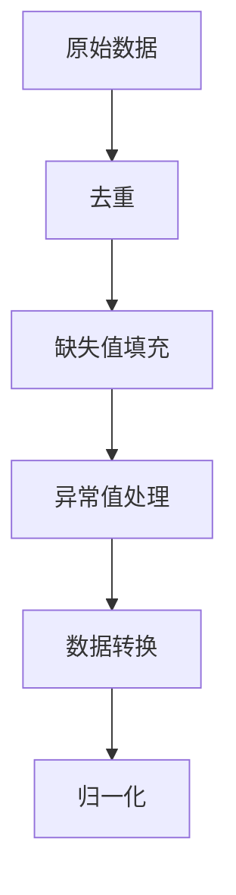

                 


### 设计智能化的企业信用评级申诉成功率预测系统

#### 关键词
- 企业信用评级
- 智能化预测
- 申诉成功率
- 预测系统
- 数据预处理
- 特征提取
- 模型选择
- 系统架构设计

#### 摘要
本文旨在探讨设计一个智能化的企业信用评级申诉成功率预测系统。通过深入分析企业信用评级的背景和重要性，以及申诉成功率预测的挑战和需求，本文详细阐述了系统架构设计、核心算法原理以及实际项目实施过程。本文将帮助读者了解如何利用大数据和人工智能技术，提高企业信用评级申诉的成功率，为企业提供更精准的风险评估和管理方案。

----------------------------------------------------------------

## 第一部分: 背景介绍

### 第1章: 问题背景

#### 1.1 核心概念

**企业信用评级**：企业信用评级是指专业评级机构根据企业的财务状况、信用历史、行业地位等多个维度，对企业信用风险进行评估和评级。评级结果通常以信用等级的形式表示，如AAA、AA、A等，信用等级越高，企业获得信贷和其他金融服务的难度越小。

**智能化预测**：智能化预测是指利用机器学习和人工智能技术，通过分析大量历史数据，预测未来事件发生的概率或趋势。在信用评级领域，智能化预测可以用于预测企业信用评级申诉的成功率。

**申诉成功率预测**：申诉成功率预测是指基于企业历史信用评级申诉数据，利用机器学习算法预测未来某一企业信用评级申诉的成功概率。这对于企业来说，有助于制定更有针对性的申诉策略，提高申诉成功率。

#### 1.2 概念联系

企业信用评级、智能化预测和申诉成功率预测三者之间存在紧密的联系。企业信用评级是申诉成功率预测的基础，而智能化预测技术则为申诉成功率预测提供了有力支持。通过分析企业信用评级数据，结合历史申诉成功案例，可以构建一个智能化的预测模型，帮助企业提高申诉成功率。

#### 1.3 系统架构设计

为了实现一个智能化的企业信用评级申诉成功率预测系统，我们需要设计一个合理的系统架构。系统架构主要包括数据层、算法层和界面层三部分。

- **数据层**：负责数据采集、存储和管理。数据来源包括企业信用评级数据库、申诉记录数据库、行业数据等。
- **算法层**：负责数据预处理、特征提取、模型选择和训练等。核心算法包括回归分析、决策树、支持向量机、神经网络等。
- **界面层**：负责与用户交互，提供预测结果展示和申诉策略建议。

#### 1.4 概念结构与核心要素组成

本文的核心概念和结构如下：

1. **企业信用评级**：财务状况、信用历史、行业地位等
2. **智能化预测**：机器学习算法、数据处理、特征工程等
3. **申诉成功率预测**：历史申诉数据、模型训练、预测结果等
4. **系统架构设计**：数据层、算法层、界面层

本文将围绕这四个核心概念，逐步深入探讨企业信用评级申诉成功率预测系统的设计、实现和优化。

----------------------------------------------------------------

## 第二部分: 核心概念与联系

### 第2章: 概念解析

#### 2.1 企业信用评级

企业信用评级是指专业评级机构根据企业的财务状况、信用历史、行业地位等多个维度，对企业信用风险进行评估和评级。评级结果通常以信用等级的形式表示，如AAA、AA、A等。企业信用评级对于企业在金融市场的融资能力、合作伙伴的选择等方面具有重要意义。

**财务状况**：包括企业的资产、负债、收入、利润等财务指标。财务指标反映了企业的财务稳定性和盈利能力。

**信用历史**：包括企业的借款、还款记录，以及与其他企业之间的合作情况。信用历史反映了企业的信用意识和信用行为。

**行业地位**：包括企业在行业中的排名、市场份额、竞争优势等。行业地位反映了企业的综合实力和竞争力。

#### 2.2 智能化预测

智能化预测是指利用机器学习和人工智能技术，通过分析大量历史数据，预测未来事件发生的概率或趋势。在信用评级领域，智能化预测可以用于预测企业信用评级申诉的成功率。

**机器学习算法**：包括回归分析、决策树、支持向量机、神经网络等。机器学习算法通过学习历史数据，自动提取特征，建立预测模型。

**数据处理**：包括数据清洗、数据预处理、特征工程等。数据处理是智能化预测的基础，直接影响预测模型的准确性和效果。

**特征工程**：包括特征选择、特征转换、特征组合等。特征工程是提升预测模型性能的关键步骤。

#### 2.3 申诉成功率预测

申诉成功率预测是指基于企业历史信用评级申诉数据，利用机器学习算法预测未来某一企业信用评级申诉的成功概率。对于企业来说，提高申诉成功率意味着减少信用评级下调的风险，提高融资能力和市场竞争力。

**历史申诉数据**：包括申诉原因、申诉结果、申诉时间、申诉金额等。历史申诉数据是构建预测模型的重要依据。

**模型训练**：利用历史申诉数据，通过机器学习算法训练预测模型，得到申诉成功率的预测结果。

**预测结果**：预测结果包括申诉成功率的概率分布，以及对企业申诉策略的建议。

#### 2.4 系统架构设计

为了实现一个智能化的企业信用评级申诉成功率预测系统，我们需要设计一个合理的系统架构。系统架构主要包括数据层、算法层和界面层三部分。

- **数据层**：负责数据采集、存储和管理。数据来源包括企业信用评级数据库、申诉记录数据库、行业数据等。
- **算法层**：负责数据预处理、特征提取、模型选择和训练等。核心算法包括回归分析、决策树、支持向量机、神经网络等。
- **界面层**：负责与用户交互，提供预测结果展示和申诉策略建议。

#### 2.5 概念属性特征对比表格

| 概念 | 属性特征 | 对比 | 关联关系 |
| --- | --- | --- | --- |
| 企业信用评级 | 财务状况、信用历史、行业地位 | 多维度评估 | 基础 |
| 智能化预测 | 机器学习算法、数据处理、特征工程 | 自动提取特征 | 技术 |
| 申诉成功率预测 | 历史申诉数据、模型训练、预测结果 | 预测成功概率 | 应用 |

#### 2.6 ER实体关系图架构

```mermaid
erDiagram
    Customer ||--|{ Order } : "has"
    Customer ||--|{ Payment } : "makes"
    Product ||--|{ Order } : "included in"
    Order ||--|{ OrderLine } : "contains"
    Payment ||--|{ PaymentMethod } : "uses"
```

在ER实体关系图中，企业（Customer）与订单（Order）和支付（Payment）之间存在关联关系，产品（Product）与订单也存在关联关系。通过这个图，我们可以清晰地看到企业信用评级申诉成功率预测系统中的核心实体及其关联关系。

----------------------------------------------------------------

## 第三部分: 算法原理讲解

### 第3章: 算法原理

#### 3.1 数据预处理

数据预处理是构建预测模型的重要步骤，主要包括数据清洗、数据转换和数据归一化等。

**数据清洗**：去除无效数据、缺失值填充、异常值处理等。



**数据转换**：将非数值型数据转换为数值型数据，如将字符串标签转换为独热编码。

```python
from sklearn.preprocessing import OneHotEncoder

encoder = OneHotEncoder()
encoded_data = encoder.fit_transform( categorical_data )
```

**归一化**：将数据缩放至同一尺度范围内，如将特征值缩放到[0, 1]区间。

```python
from sklearn.preprocessing import MinMaxScaler

scaler = MinMaxScaler()
normalized_data = scaler.fit_transform( data )
```

#### 3.2 特征提取

特征提取是提高预测模型性能的关键步骤。通过特征提取，我们可以从原始数据中提取出对预测任务有重要影响的特征。

**特征选择**：选择对预测任务有显著影响的特征，如特征重要性排序、相关性分析等。

```python
from sklearn.ensemble import ExtraTreesClassifier

clf = ExtraTreesClassifier()
clf.fit( X_train, y_train )
feature_importances = clf.feature_importances_
```

**特征转换**：将原始特征转换为新的特征，如基于特征的交互项、多项式特征等。

```python
from sklearn.preprocessing import PolynomialFeatures

poly = PolynomialFeatures( degree=2 )
poly_features = poly.fit_transform( X )
```

**特征组合**：将多个特征组合成一个新的特征，如基于特征的加权求和、特征聚类等。

```python
from sklearn.cluster import KMeans

kmeans = KMeans( n_clusters=3 )
kmeans.fit( X )
clusters = kmeans.predict( X )
X_new = np.concatenate( (X, clusters.reshape(-1,1)), axis=1 )
```

#### 3.3 模型选择

模型选择是构建预测模型的重要步骤。根据预测任务的需求，我们可以选择不同的机器学习算法。

**回归分析**：适用于预测连续值输出，如线性回归、岭回归、LASSO回归等。

```python
from sklearn.linear_model import LinearRegression

model = LinearRegression()
model.fit( X_train, y_train )
```

**决策树**：适用于预测离散值输出，如分类树、回归树等。

```python
from sklearn.tree import DecisionTreeClassifier

model = DecisionTreeClassifier()
model.fit( X_train, y_train )
```

**支持向量机**：适用于预测离散值输出，如线性支持向量机、非线性支持向量机等。

```python
from sklearn.svm import SVC

model = SVC()
model.fit( X_train, y_train )
```

**神经网络**：适用于预测复杂非线性问题，如多层感知机、卷积神经网络、循环神经网络等。

```python
from sklearn.neural_network import MLPClassifier

model = MLPClassifier()
model.fit( X_train, y_train )
```

#### 3.4 模型训练

模型训练是指使用历史数据对机器学习模型进行训练，以优化模型参数，提高预测准确性。

**训练集划分**：将数据集划分为训练集和测试集，用于训练和评估模型。

```python
from sklearn.model_selection import train_test_split

X_train, X_test, y_train, y_test = train_test_split( X, y, test_size=0.2, random_state=42 )
```

**模型训练**：使用训练集对模型进行训练，调整模型参数。

```python
model.fit( X_train, y_train )
```

**模型评估**：使用测试集评估模型性能，如准确率、召回率、F1值等。

```python
from sklearn.metrics import accuracy_score, recall_score, f1_score

y_pred = model.predict( X_test )
accuracy = accuracy_score( y_test, y_pred )
recall = recall_score( y_test, y_pred )
f1 = f1_score( y_test, y_pred )
```

#### 3.5 预测与评估

**预测**：使用训练好的模型对未知数据进行预测。

```python
y_pred = model.predict( X_new )
```

**评估**：对预测结果进行评估，以验证模型的有效性和准确性。

```python
from sklearn.metrics import classification_report

print(classification_report(y_test, y_pred))
```

通过上述算法原理讲解，我们可以看到，构建一个智能化的企业信用评级申诉成功率预测系统需要从数据预处理、特征提取、模型选择、模型训练和预测评估等多个方面进行综合考虑。接下来，我们将进一步探讨系统架构设计与实现。

----------------------------------------------------------------

## 第四部分: 系统设计与实现

### 第4章: 系统架构设计

#### 4.1 问题场景介绍

在当前金融市场中，企业信用评级对于企业的融资能力和市场竞争力具有重要意义。然而，企业在信用评级过程中难免会遇到评级下调的情况，导致融资受阻。为了应对这种情况，企业通常会提出申诉。然而，申诉的成功率并不高，这给企业带来了很大的困扰。

为了提高申诉成功率，企业需要了解申诉成功的因素和影响因素，以便制定有针对性的申诉策略。因此，设计一个智能化的企业信用评级申诉成功率预测系统显得尤为重要。该系统能够帮助企业分析信用评级申诉成功的可能性，为申诉提供有力支持。

#### 4.2 项目介绍

本项目旨在设计并实现一个智能化的企业信用评级申诉成功率预测系统，包括以下功能模块：

1. 数据采集与预处理：从企业信用评级数据库、申诉记录数据库和行业数据等来源收集数据，并进行数据清洗、数据转换和归一化处理。
2. 特征提取：根据业务需求，从原始数据中提取对预测任务有重要影响的特征，并进行特征选择和特征转换。
3. 模型训练与优化：选择合适的机器学习算法，对训练数据进行模型训练，并调整模型参数，以提高预测准确性。
4. 预测与评估：使用训练好的模型对未知数据进行预测，并对预测结果进行评估，以验证模型的有效性和准确性。
5. 结果展示与策略建议：将预测结果和申诉策略建议以直观的方式展示给用户，为企业的信用评级申诉提供有力支持。

#### 4.3 系统功能设计（领域模型）

领域模型是对企业信用评级申诉成功率预测系统核心业务逻辑的抽象表示。以下是一个领域模型的Mermaid类图：

```mermaid
classDiagram
    Customer <|-- Enterprise
    Application <|-- Appeal
    PredictionModel <|-- SuccessRateModel
    DataPreprocessing <|-- FeatureExtraction
    ModelTraining <|-- ModelOptimization
    Prediction <|-- Evaluation

    Customer {
        +String id
        +String name
        +Date creditRatingDate
        +CreditRating creditRating
    }

    Enterprise {
        +String id
        +String name
        +Date establishmentDate
        +CreditRating currentRating
    }

    Application {
        +String id
        +String enterpriseId
        +String applicationDate
        +ApplicationStatus status
    }

    Appeal {
        +String id
        +String applicationId
        +String appealDate
        +AppealStatus status
    }

    PredictionModel {
        +String modelId
        +ModelType type
        +float accuracy
    }

    SuccessRateModel {
        +String modelId
        +float successRate
    }

    DataPreprocessing {
        +String preprocessingId
        +Data preprocessingData
    }

    FeatureExtraction {
        +String extractionId
        +FeatureSet features
    }

    ModelTraining {
        +String trainingId
        +Model trainingModel
    }

    ModelOptimization {
        +String optimizationId
        +Model optimizedModel
    }

    Prediction {
        +String predictionId
        +PredictionResult predictionResult
    }

    Evaluation {
        +String evaluationId
        +EvaluationResult evaluationResult
    }
```

该类图展示了系统中的主要实体及其关系，包括客户、企业、申请、申诉、预测模型、成功

