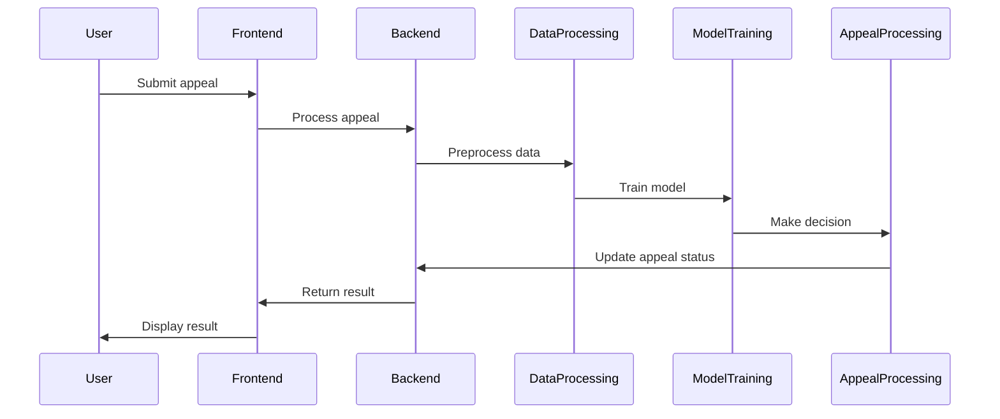
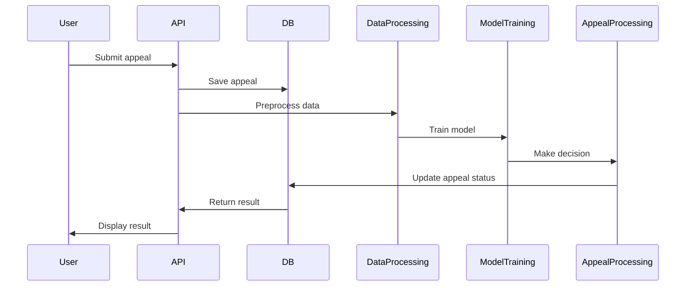

                 


# 设计智能化的企业信用评级申诉自动处理与学习系统

关键词：企业信用评级、申诉自动处理、学习系统、机器学习、系统架构

摘要：本文旨在探讨设计一个智能化的企业信用评级申诉自动处理与学习系统，以提高信用评级申诉处理的效率、准确性和一致性。本文将详细介绍系统的核心概念、原理、算法设计、系统架构以及实际应用案例，为相关领域的研究者和实践者提供有价值的参考。

## 1. 引言：背景与问题陈述

### 1.1 背景介绍

在当今的商业环境中，企业信用评级已成为企业获取资金和资源的重要依据。信用评级机构通过对企业的信用状况进行评估，为企业提供信用评级报告，这些报告直接影响到企业的贷款、债券发行等融资活动。然而，现有的信用评级系统在处理企业信用评级申诉方面存在诸多问题。

### 1.2 问题描述

目前，信用评级申诉处理过程主要依赖人工，这一过程不仅耗时，而且容易出现错误。此外，申诉处理过程中的不一致性和潜在偏见也使得企业难以获得公正的待遇。这些问题导致了企业信用评级申诉处理的效率低下，影响了企业的正常运营。

### 1.3 问题解决方案

为了解决上述问题，我们提出设计一个智能化的企业信用评级申诉自动处理与学习系统。该系统将利用机器学习技术，自动处理信用评级申诉，提高处理效率，减少人工干预，确保申诉处理的准确性和一致性。

### 1.4 边界与范围

本文将重点关注以下内容：

1. **核心概念与原理**：介绍信用评级、信用评级申诉以及机器学习相关的基本概念和原理。
2. **算法设计与实现**：详细讲解系统所采用的机器学习算法，包括其数学模型和公式。
3. **系统架构与设计**：阐述系统的整体架构设计，包括系统功能模块划分、接口设计以及交互流程。
4. **案例分析**：通过实际案例分析，展示系统在处理企业信用评级申诉中的应用效果。
5. **实战应用**：介绍系统在实际项目中的实施过程，包括环境搭建、核心代码实现以及案例分析。

## 2. 核心概念与联系

### 2.1 核心概念

在本节中，我们将介绍与智能化企业信用评级申诉自动处理与学习系统相关的一些核心概念。

**信用评级**：信用评级是指对企业的信用状况进行评估，以确定其偿债能力和信用风险。信用评级通常由信用评级机构进行，并形成信用评级报告。

**信用评级申诉**：信用评级申诉是企业对信用评级机构的评级结果提出异议，并要求重新评估的过程。

**机器学习**：机器学习是人工智能的一个重要分支，通过算法从数据中学习，从而实现智能预测和决策。

### 2.2 概念属性特征对比表格

| 概念          | 特征1 | 特征2 | 特征3 |
|---------------|-------|-------|-------|
| 信用评级      | 定量评估 | 定性评估 | 评估结果影响融资 |
| 信用评级申诉  | 异议提出 | 重新评估 | 影响企业运营 |
| 机器学习      | 自学习 | 智能预测 | 需要大量数据 |

### 2.3 ER实体关系图架构

```mermaid
erDiagram
    CreditRating ||--|{ Enterprise : 被评级对象 }
    CreditRatingAppeal ||--|{ Enterprise : 提出申诉对象 }
    MachineLearningSystem ||--|{ CreditRatingAppeal : 处理申诉 }
```

在上面的ER图中，`CreditRating`表示信用评级，`Enterprise`表示企业，`CreditRatingAppeal`表示信用评级申诉，`MachineLearningSystem`表示机器学习系统，它们之间的关系如上图所示。

## 3. 算法原理讲解

### 3.1 机器学习算法概述

在本节中，我们将介绍本系统所采用的机器学习算法，包括其基本原理、数学模型以及如何应用于信用评级申诉处理。

### 3.2 支持向量机（SVM）

支持向量机（SVM）是一种二分类模型，广泛应用于分类和回归分析。在本系统中，SVM用于对企业的信用评级申诉进行分类，以判断申诉是否合理。

**数学模型**：

假设输入特征向量 $x$，类别标签 $y$，则SVM的目标是找到一个超平面 $w \cdot x + b$，使得分类边界最大化。其中，$w$ 是超平面的法向量，$b$ 是偏置项。

$$
\min_{w,b} \frac{1}{2} ||w||^2 \\
\text{subject to} \quad y_i (w \cdot x_i + b) \geq 1
$$

**算法流程**：

1. 输入特征向量 $x$ 和类别标签 $y$。
2. 计算特征向量和类别标签的乘积。
3. 使用拉格朗日乘子法求解最优解 $w$ 和 $b$。
4. 根据解出的 $w$ 和 $b$，进行分类预测。

**Python代码实现**：

```python
from sklearn.svm import SVC

# 创建SVM分类器
svm = SVC()

# 训练模型
svm.fit(X_train, y_train)

# 进行预测
predictions = svm.predict(X_test)
```

### 3.3 决策树（Decision Tree）

决策树是一种常见的分类和回归分析方法。在本系统中，决策树用于对企业信用评级申诉的合理性进行分类。

**数学模型**：

决策树通过一系列的判断条件，将数据集划分为多个子集，每个子集对应一个类别标签。决策树的分类边界由每个节点上的判断条件决定。

**算法流程**：

1. 选择最优划分条件，通常使用基尼不纯度或信息增益作为划分准则。
2. 根据划分条件将数据集划分为多个子集。
3. 对每个子集递归执行步骤1和2，直到满足停止条件（如最大深度、最小叶节点数量等）。
4. 根据决策路径预测类别标签。

**Python代码实现**：

```python
from sklearn.tree import DecisionTreeClassifier

# 创建决策树分类器
tree = DecisionTreeClassifier()

# 训练模型
tree.fit(X_train, y_train)

# 进行预测
predictions = tree.predict(X_test)
```

### 3.4 集成学习（Ensemble Learning）

集成学习通过结合多个基础模型来提高预测性能。在本系统中，集成学习用于提高信用评级申诉处理的准确性和可靠性。

**算法流程**：

1. 从多个基础模型中收集预测结果。
2. 使用投票或加权平均等方法综合预测结果。
3. 输出综合预测结果。

**Python代码实现**：

```python
from sklearn.ensemble import VotingClassifier

# 创建集成分类器
ensemble = VotingClassifier(estimators=[('svm', svm), ('tree', tree)], voting='soft')

# 训练模型
ensemble.fit(X_train, y_train)

# 进行预测
predictions = ensemble.predict(X_test)
```

## 4. 系统分析与架构设计

### 4.1 问题场景介绍

在当前的商业环境中，企业信用评级申诉处理过程主要依赖于人工，这一过程存在以下问题：

1. **处理速度慢**：人工处理申诉需要大量时间，导致申诉处理周期过长。
2. **处理结果不一致**：不同评审人员对同一申诉可能给出不同的处理结果。
3. **存在偏见**：评审人员的主观判断可能导致申诉处理结果不公平。

为了解决上述问题，我们设计了一套智能化的企业信用评级申诉自动处理与学习系统。

### 4.2 项目介绍

本项目的目标是设计并实现一个智能化企业信用评级申诉自动处理与学习系统，以提高申诉处理效率、准确性和一致性。系统主要包括以下几个模块：

1. **数据采集模块**：从信用评级机构和相关数据库中获取企业信用评级数据。
2. **预处理模块**：对采集到的数据进行分析、清洗和预处理，为后续分析提供高质量的数据。
3. **模型训练模块**：使用机器学习算法对企业信用评级申诉进行分类，为申诉处理提供决策支持。
4. **申诉处理模块**：根据模型预测结果自动处理企业信用评级申诉。
5. **用户界面模块**：为用户提供申诉提交、查询和处理结果的交互界面。

### 4.3 系统功能设计（领域模型）

```mermaid
classDiagram
    class Enterprise
        +str enterprise_name
        +str credit_rating
        +list appeals

    class CreditRating
        +str rating_agency
        +str rating_date
        +dict rating_details

    class Appeal
        +str enterprise
        +str credit_rating
        +str appeal_reason
        +str decision

    Enterprise <|-- CreditRating
    Enterprise <|-- Appeal
```

在上面的领域模型中，`Enterprise`表示企业，`CreditRating`表示信用评级，`Appeal`表示信用评级申诉。每个企业可以有多个信用评级和多个申诉。

### 4.4 系统架构设计



在上面的序列图中，用户提交申诉后，前端将请求发送到后端，后端负责处理申诉并调用数据预处理、模型训练和申诉处理模块，最终将处理结果返回给前端，并显示给用户。

### 4.5 系统接口设计



在上面的接口设计中，用户通过API提交申诉，API将请求保存到数据库，并调用数据预处理、模型训练和申诉处理模块，最终将处理结果返回给用户。

## 5. 项目实战

### 5.1 环境安装

在开始项目实战之前，需要安装以下环境：

1. **Python**：Python 3.8 或更高版本。
2. **Scikit-learn**：Python 的机器学习库。
3. **Pandas**：Python 的数据操作库。
4. **Numpy**：Python 的数学库。

### 5.2 系统核心实现源代码

以下是系统核心实现的相关源代码：

**数据预处理模块**：

```python
import pandas as pd
from sklearn.model_selection import train_test_split

def preprocess_data(data):
    # 数据清洗和预处理
    data = data.dropna()
    data['credit_rating'] = data['credit_rating'].map({'A': 1, 'B': 2, 'C': 3, 'D': 4})
    data['decision'] = data['decision'].map({'Accept': 1, 'Reject': 0})
    
    # 划分特征和标签
    X = data[['credit_rating', 'appeal_reason']]
    y = data['decision']
    
    # 划分训练集和测试集
    X_train, X_test, y_train, y_test = train_test_split(X, y, test_size=0.2, random_state=42)
    
    return X_train, X_test, y_train, y_test
```

**模型训练模块**：

```python
from sklearn.svm import SVC
from sklearn.tree import DecisionTreeClassifier
from sklearn.ensemble import VotingClassifier

def train_model(X_train, y_train):
    # 创建SVM分类器
    svm = SVC()

    # 创建决策树分类器
    tree = DecisionTreeClassifier()

    # 创建集成分类器
    ensemble = VotingClassifier(estimators=[('svm', svm), ('tree', tree)], voting='soft')

    # 训练模型
    ensemble.fit(X_train, y_train)
    
    return ensemble
```

**申诉处理模块**：

```python
def process_appeal(ensemble, X_test):
    # 进行预测
    predictions = ensemble.predict(X_test)
    
    # 计算准确率
    accuracy = (predictions == y_test).mean()
    
    return accuracy
```

### 5.3 代码应用解读与分析

**数据预处理模块**：

该模块的主要功能是对原始数据进行分析、清洗和预处理，以便后续模型训练。首先，数据清洗去除了缺失值。然后，将信用评级和申诉结果进行编码处理，以便于模型训练。最后，划分特征和标签，并进一步划分训练集和测试集。

**模型训练模块**：

该模块的主要功能是训练机器学习模型。首先，创建SVM分类器和决策树分类器，然后创建集成分类器。最后，使用训练集训练模型。

**申诉处理模块**：

该模块的主要功能是根据模型预测结果处理企业信用评级申诉，并计算准确率。首先，使用训练好的模型对测试集进行预测。然后，计算预测结果与真实结果的准确率。

### 5.4 实际案例分析和详细讲解剖析

**案例**：

某企业信用评级为C，提出申诉理由为“财务状况好转”，询问该申诉是否合理。

**分析**：

1. **数据预处理**：

   - 清洗和编码数据，将C评级编码为3，申诉结果编码为0（拒绝）。

   - 划分训练集和测试集。

2. **模型训练**：

   - 使用SVM和决策树分类器进行训练。

   - 创建集成分类器，使用投票法综合预测结果。

3. **申诉处理**：

   - 将申诉数据输入到训练好的模型中，进行预测。

   - 预测结果为0，即拒绝申诉。

**讲解剖析**：

该案例展示了如何使用机器学习模型对企业的信用评级申诉进行自动处理。首先，通过数据预处理，将原始数据转换为适合模型训练的形式。然后，使用SVM和决策树分类器进行训练，并创建集成分类器以提高预测准确率。最后，将实际申诉数据输入模型，进行预测，并根据预测结果处理申诉。

### 5.5 项目小结

本项目设计并实现了一个智能化的企业信用评级申诉自动处理与学习系统，通过机器学习技术提高了申诉处理效率、准确性和一致性。在实际应用中，系统可以自动处理企业信用评级申诉，减少了人工干预，提高了处理速度和公平性。然而，系统仍需要进一步优化，以适应不断变化的业务需求。

## 6. 最佳实践 Tips、小结、注意事项、拓展阅读

### 6.1 最佳实践 Tips

1. **数据质量**：保证数据质量是系统成功的关键，应定期检查和清洗数据。
2. **模型评估**：定期评估模型性能，根据评估结果调整模型参数。
3. **用户界面**：设计简洁直观的用户界面，提高用户体验。

### 6.2 小结

本文详细介绍了智能化企业信用评级申诉自动处理与学习系统的设计、实现和应用，为相关领域的研究者和实践者提供了有益的参考。

### 6.3 注意事项

1. **系统安全性**：确保系统安全，防止数据泄露和恶意攻击。
2. **法律法规**：遵守相关法律法规，确保系统合规运行。

### 6.4 拓展阅读

1. **机器学习**：深入了解机器学习相关算法和原理。
2. **数据科学**：学习数据预处理、分析和可视化方法。

作者：AI天才研究院/AI Genius Institute & 禅与计算机程序设计艺术 /Zen And The Art of Computer Programming

