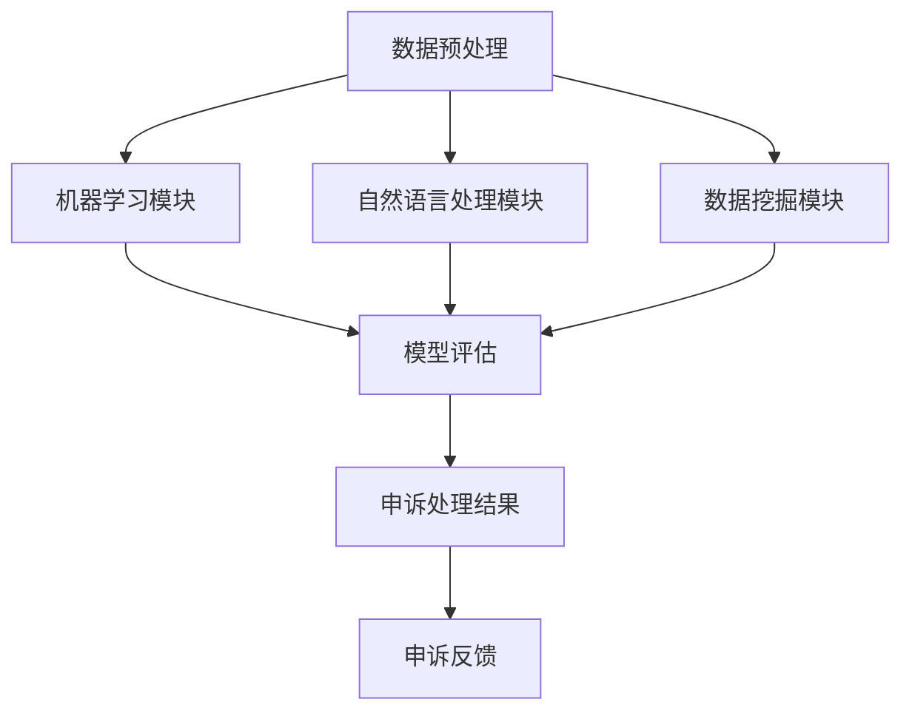
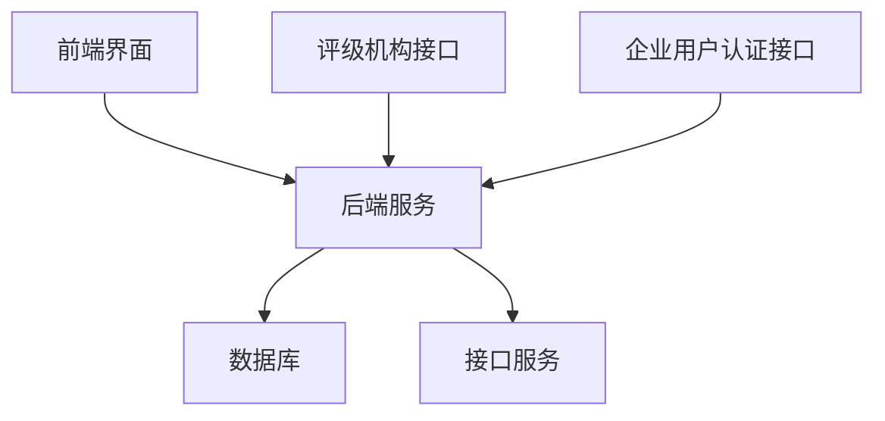
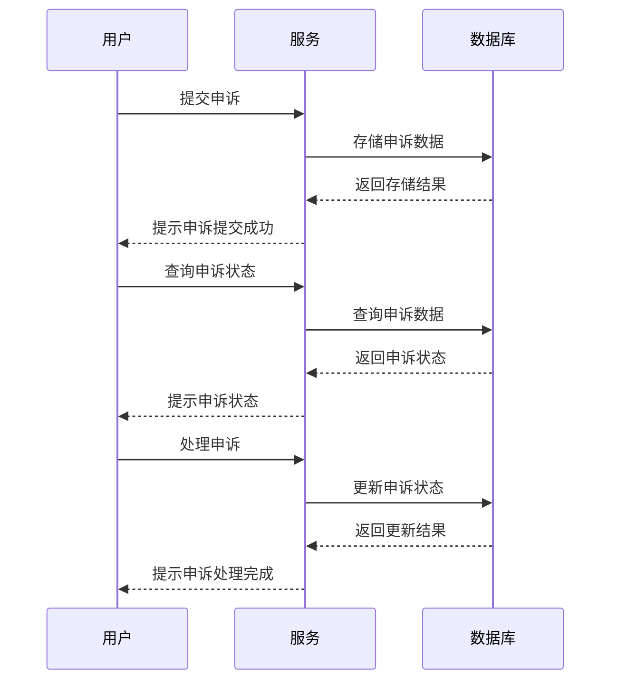

                 

### 设计智能化的企业信用评级申诉自动处理系统

#### 概述

在现代商业环境中，企业信用评级对于企业的运营和发展具有重要意义。信用评级不仅影响企业的融资成本和商业合作机会，还直接影响企业的声誉。然而，随着评级数据的复杂性和申诉数量的增加，传统的人工处理方式已难以满足高效、准确的需求。因此，设计一个智能化、自动化的企业信用评级申诉处理系统变得至关重要。

本文将深入探讨如何设计这样一个系统，包括问题的背景、核心概念、算法原理、系统分析与设计、项目实战以及最佳实践。通过逐步分析推理，本文旨在为读者提供一个全面且深入的技术解决方案。

#### 关键词

- 企业信用评级
- 智能化处理
- 申诉处理系统
- 机器学习
- 自然语言处理
- 系统架构设计

#### 摘要

本文将详细阐述设计智能化的企业信用评级申诉自动处理系统的全过程。首先，介绍信用评级申诉的背景和问题，然后探讨智能化技术的应用，接着讲解系统的算法原理，随后分析系统架构设计，展示项目实战过程，并总结最佳实践和注意事项。通过这一系列步骤，本文旨在为读者提供一个可行的、高效的解决方案。

### 目录大纲设计方案

为了设计出一本关于《设计智能化的企业信用评级申诉自动处理系统》的完整目录大纲，我们可以按照以下步骤进行：

**1. 确定核心章节：**

   首先，根据书籍的主题，我们需要确定核心章节，这些章节应当涵盖背景介绍、核心概念与联系、算法原理讲解、数学模型和数学公式讲解、系统分析与架构设计方案、项目实战以及最佳实践 tips 等内容。

**2. 划分章节内容：**

   每个核心章节都可以细分为更小的子章节，以便于读者更清晰地理解每个部分的内容。

**3. 使用 Markdown 格式编写目录：**

   使用 Markdown 格式编写目录，确保每个章节和子章节的格式都符合要求，包括 #,##,### 级别的标题格式。

**4. 内容简洁性：**

   在编写每个章节时，确保内容简洁明了，避免使用冗余的语言，直接传达关键信息。

**5. 遵循目录大纲总字数限制：**

   在编写的过程中，要注意控制目录大纲的总字数，确保不超过2000字。

### 目录大纲草案

```markdown
----------------------------------------------------------------
# 第一部分: 背景介绍

## 1.1 问题背景
### 1.1.1 企业信用评级的现状
### 1.1.2 申诉处理的需求
### 1.1.3 自动处理系统的意义

## 1.2 问题定义
### 1.2.1 信用评级申诉的问题
### 1.2.2 申诉处理流程的挑战
### 1.2.3 解决方案的边界与外延

## 1.3 概念结构与核心要素
### 1.3.1 关键概念解释
### 1.3.2 要素分析
### 1.3.3 结构图展示

----------------------------------------------------------------

# 第二部分: 核心概念与联系

## 2.1 智能化技术的应用
### 2.1.1 机器学习基础
### 2.1.2 自然语言处理
### 2.1.3 智能化技术的工作原理

## 2.2 信用评级体系
### 2.2.1 信用评级的定义
### 2.2.2 信用评级的方法
### 2.2.3 信用评级的数据来源

## 2.3 申诉处理流程
### 2.3.1 申诉流程概述
### 2.3.2 申诉处理的关键步骤
### 2.3.3 流程中的问题与挑战

## 2.4 概念属性特征对比表格
### 2.4.1 信用评级与申诉处理对比
### 2.4.2 智能化技术与传统方式的对比

----------------------------------------------------------------

# 第三部分: 算法原理讲解

## 3.1 自动处理系统的算法框架
### 3.1.1 算法总体设计
### 3.1.2 关键算法模块
### 3.1.3 算法流程图展示

## 3.2 算法原理与流程
### 3.2.1 数据预处理
### 3.2.2 机器学习模型选择
### 3.2.3 模型训练与优化
### 3.2.4 模型评估与部署

## 3.3 数学模型和公式
### 3.3.1 模型数学公式
### 3.3.2 数学模型的推导
### 3.3.3 数学公式的应用举例

----------------------------------------------------------------

# 第四部分: 系统分析与架构设计方案

## 4.1 问题场景介绍
### 4.1.1 企业信用评级申诉的场景
### 4.1.2 自动处理系统的应用需求

## 4.2 系统功能设计
### 4.2.1 领域模型分析
### 4.2.2 类图展示
### 4.2.3 功能模块划分

## 4.3 系统架构设计
### 4.3.1 系统架构概述
### 4.3.2 架构图展示
### 4.3.3 系统组件关系

## 4.4 系统接口设计
### 4.4.1 接口功能定义
### 4.4.2 接口规范说明
### 4.4.3 接口实现示例

## 4.5 系统交互设计
### 4.5.1 交互流程分析
### 4.5.2 序列图展示
### 4.5.3 交互优化建议

----------------------------------------------------------------

# 第五部分: 项目实战

## 5.1 环境安装
### 5.1.1 系统环境搭建
### 5.1.2 软件依赖安装
### 5.1.3 

----------------------------------------------------------------

### 第一部分：背景介绍

#### 1.1 问题背景

企业信用评级是对企业信用状况的一种评价，通常由专业的评级机构根据企业的财务状况、经营历史、市场地位、管理水平等多方面因素进行评估。信用评级结果直接影响企业的融资成本、市场竞争力以及与供应商的合作关系。

随着互联网和大数据技术的发展，信用评级的数据来源越来越多样化，评级过程也越来越复杂。然而，随之而来的一个问题是，企业对于评级的异议和申诉也日益增多。传统的人工处理方式存在效率低、准确性差、处理周期长等问题，难以满足现代企业对于快速响应的需求。

申诉处理的需求主要体现在以下几个方面：

1. **处理效率**：企业希望能够快速得到申诉的处理结果，以减少因信用评级问题带来的负面影响。
2. **处理准确性**：企业希望申诉的处理结果能够准确无误，避免因误判而导致的不良影响。
3. **透明度**：企业希望申诉的处理过程公开透明，以便监督和处理过程中的问题。
4. **用户体验**：企业希望提供便捷的申诉渠道和友好的用户界面，提高用户体验。

#### 1.2 问题定义

信用评级申诉的问题主要表现在以下几个方面：

1. **申诉数量大**：随着评级数据的增加，申诉数量也相应增加，传统的人工处理方式难以高效处理如此庞大的数据量。
2. **处理流程复杂**：申诉处理流程涉及多个部门，包括评级部门、财务部门、法律部门等，流程复杂且容易出错。
3. **处理周期长**：由于流程复杂，申诉处理周期往往较长，影响企业的运营和市场竞争力。
4. **准确性问题**：人工处理方式难以保证处理结果的准确性，可能导致误判或错判。

申诉处理流程的挑战主要体现在以下几个方面：

1. **数据多样性**：申诉内容可能涉及财务数据、市场数据、法律文件等多种数据类型，传统的人工处理方式难以应对。
2. **文本处理难度**：申诉内容往往以文本形式出现，涉及自然语言理解和语义分析等问题。
3. **实时性要求**：企业希望申诉能够得到快速响应，传统的人工处理方式难以满足实时性要求。

解决这些问题的边界与外延主要包括：

1. **智能化处理**：通过引入人工智能技术，实现自动化、智能化的申诉处理。
2. **数据处理能力**：提高系统的数据处理能力，包括数据清洗、数据分析和文本处理等。
3. **流程优化**：优化申诉处理流程，减少不必要的环节和重复工作，提高处理效率。
4. **用户体验**：提升用户界面和交互设计，提供便捷的申诉渠道和友好的用户体验。

#### 1.3 概念结构与核心要素

在设计智能化的企业信用评级申诉自动处理系统时，我们需要明确几个关键概念和要素：

1. **信用评级**：信用评级是对企业信用状况的一种评价，通常由评级机构根据多种因素进行评估。
2. **申诉**：申诉是企业对信用评级结果的异议，通常以文本形式提出。
3. **自动处理系统**：自动处理系统是指通过人工智能技术实现的自动化、智能化的申诉处理系统。
4. **机器学习**：机器学习是人工智能的一个重要分支，通过训练模型来自动学习数据中的规律。
5. **自然语言处理**：自然语言处理是人工智能的另一个重要分支，涉及文本的语义理解、信息抽取和生成等任务。
6. **数据预处理**：数据预处理是数据处理的第一步，包括数据清洗、数据转换和数据规范化等。
7. **模型评估**：模型评估是评估模型性能的重要环节，通过指标如准确率、召回率、F1 值等来评估模型效果。

通过这些概念和要素的明确，我们可以更好地理解系统的设计和实现。

### 第二部分：核心概念与联系

#### 2.1 智能化技术的应用

智能化技术在现代企业信用评级申诉自动处理系统中发挥着重要作用。以下是几种主要智能化技术的应用及其工作原理：

1. **机器学习**：机器学习通过训练模型来自动学习数据中的规律，从而实现数据的分类、回归、聚类等任务。在信用评级申诉自动处理系统中，机器学习可用于分类申诉的合理性，判断申诉是否成立。
   
   **工作原理**：
   - **特征提取**：从原始数据中提取出有用的特征，如文本中的关键词、情感倾向等。
   - **模型训练**：使用训练数据集训练模型，学习数据中的规律。
   - **模型评估**：使用验证数据集评估模型性能，调整模型参数。

2. **自然语言处理**：自然语言处理涉及文本的语义理解、信息抽取和生成等任务，用于处理非结构化的文本数据。在信用评级申诉自动处理系统中，自然语言处理可用于理解申诉文本的内容，提取关键信息。

   **工作原理**：
   - **分词**：将文本拆分为词语或词汇单元。
   - **词性标注**：对词语进行词性标注，如名词、动词、形容词等。
   - **句法分析**：分析句子的结构，提取语法关系。
   - **语义理解**：理解文本的含义，提取关键信息。

3. **数据挖掘**：数据挖掘是从大量数据中发现潜在的模式、关联和趋势的过程。在信用评级申诉自动处理系统中，数据挖掘可用于分析申诉数据，发现潜在的规律，辅助决策。

   **工作原理**：
   - **数据预处理**：清洗和转换数据，使其适合分析。
   - **特征选择**：选择对分析任务最有用的特征。
   - **模型选择**：选择合适的算法进行数据挖掘。

4. **自动化流程**：自动化流程通过定义一系列步骤和规则，实现申诉处理的自动化。在信用评级申诉自动处理系统中，自动化流程可用于简化申诉处理过程，提高处理效率。

   **工作原理**：
   - **流程定义**：定义申诉处理的步骤和规则。
   - **自动化执行**：根据定义的流程自动执行申诉处理任务。

#### 2.2 信用评级体系

信用评级体系是对企业信用状况进行评价的一系列规则和标准。以下是信用评级体系的主要组成部分：

1. **评级机构**：评级机构是进行信用评级的专业机构，如 Moody's、Standard & Poor's 等。评级机构根据企业的财务状况、经营历史、市场地位、管理水平等多方面因素进行评级。

2. **评级标准**：评级标准是评级机构用于评价企业信用状况的规则和标准。评级标准通常包括财务指标、经营指标、管理指标等。

3. **评级方法**：评级方法是指评级机构进行信用评级的具体方法。常见的评级方法有综合评分法、财务比率分析法、评分卡法等。

4. **评级结果**：评级结果是对企业信用状况的评价结果，通常用等级表示，如 AAA、AA、A 等。

#### 2.3 申诉处理流程

申诉处理流程是企业信用评级申诉自动处理系统中的一个关键环节。以下是申诉处理流程的主要步骤：

1. **申诉提交**：企业通过线上或线下渠道提交申诉，申诉内容通常包括对信用评级结果的异议和理由。

2. **申诉审核**：系统对申诉内容进行初步审核，筛选出不符合要求的申诉。

3. **数据收集**：系统根据申诉内容，收集相关数据，包括企业财务报表、经营数据、市场数据等。

4. **数据分析**：系统对收集到的数据进行分析，判断申诉的合理性。

5. **申诉处理**：系统根据分析结果，生成申诉处理报告，包括申诉的判断结果和处理建议。

6. **申诉反馈**：系统将申诉处理结果反馈给企业，并提供申诉处理记录。

#### 2.4 概念属性特征对比表格

为了更好地理解信用评级与申诉处理流程的关系，我们可以通过一个概念属性特征对比表格进行展示：

| 概念       | 属性特征                                      | 解释                                       |
|------------|---------------------------------------------|------------------------------------------|
| 信用评级   | 评级机构、评级标准、评级方法、评级结果       | 对企业信用状况进行评价的过程               |
| 申诉       | 申诉内容、申诉理由、申诉结果                | 企业对信用评级结果的异议和处理过程           |
| 自动处理系统 | 机器学习、自然语言处理、数据挖掘、自动化流程 | 实现信用评级申诉的自动化、智能化处理           |

通过这个对比表格，我们可以更清晰地看到信用评级和申诉处理之间的联系和区别。

### 第三部分：算法原理讲解

#### 3.1 自动处理系统的算法框架

企业信用评级申诉自动处理系统的算法框架主要包括以下几个关键模块：

1. **数据预处理模块**：负责对原始数据进行清洗、转换和规范化，为后续分析提供高质量的数据。

2. **机器学习模块**：使用机器学习算法，如分类算法、回归算法等，对数据进行分析，判断申诉的合理性。

3. **自然语言处理模块**：负责对申诉文本进行处理，包括分词、词性标注、句法分析等，提取关键信息。

4. **数据挖掘模块**：利用数据挖掘技术，从申诉数据中发现潜在的模式、关联和趋势。

5. **自动化流程模块**：根据定义的流程和规则，自动执行申诉处理任务。

算法流程图如下所示：



#### 3.2 算法原理与流程

##### 数据预处理

数据预处理是信用评级申诉自动处理系统的第一步，其目标是提高数据质量，减少噪声，方便后续的分析和处理。数据预处理主要包括以下步骤：

1. **数据清洗**：去除数据中的错误、缺失和异常值，确保数据的一致性和完整性。

2. **数据转换**：将不同格式和类型的数据转换为统一格式，便于后续处理。

3. **数据规范化**：对数据进行归一化或标准化处理，使其符合特定的数值范围。

4. **特征提取**：从原始数据中提取出有用的特征，如文本中的关键词、情感倾向等。

##### 机器学习模型选择

机器学习模型的选择对于信用评级申诉自动处理系统的性能至关重要。常见的机器学习模型包括：

1. **分类模型**：用于判断申诉的合理性，如逻辑回归、支持向量机、决策树等。

2. **回归模型**：用于预测申诉的结果，如线性回归、多项式回归等。

3. **聚类模型**：用于发现申诉数据中的潜在模式，如K-均值聚类、层次聚类等。

选择合适的模型通常需要根据具体问题和数据特征进行。以下是一个简单的分类模型选择流程：

1. **模型选择**：根据问题的性质和数据特征，选择合适的模型。

2. **模型训练**：使用训练数据集对模型进行训练。

3. **模型评估**：使用验证数据集评估模型性能，选择性能最佳的模型。

4. **模型优化**：根据评估结果调整模型参数，提高模型性能。

##### 模型训练与优化

模型训练是机器学习的关键步骤，其目标是通过学习数据中的规律，生成一个能够对未知数据进行预测或分类的模型。模型训练通常包括以下步骤：

1. **数据划分**：将数据集划分为训练集和验证集。

2. **模型初始化**：初始化模型参数。

3. **迭代训练**：通过多次迭代，更新模型参数，使其能够更好地拟合训练数据。

4. **模型评估**：使用验证集评估模型性能，调整模型参数。

5. **模型优化**：根据评估结果，选择合适的优化策略，提高模型性能。

##### 模型评估与部署

模型评估是确保模型性能和可靠性的重要环节。常见的评估指标包括准确率、召回率、F1 值等。模型评估通常包括以下步骤：

1. **评估指标**：选择合适的评估指标，如准确率、召回率、F1 值等。

2. **模型评估**：使用评估指标对模型进行评估。

3. **模型优化**：根据评估结果，调整模型参数或选择更合适的模型。

4. **模型部署**：将训练好的模型部署到实际环境中，用于处理实际的申诉数据。

#### 3.3 数学模型和公式

在信用评级申诉自动处理系统中，数学模型和公式起着关键作用。以下是一个简单的分类模型的数学模型和公式：

##### 逻辑回归模型

逻辑回归模型是一种常用的分类模型，用于判断申诉的合理性。其数学模型如下：

$$
P(y=1|x;\theta) = \frac{1}{1 + e^{-(\theta^T x)}}
$$

其中，$P(y=1|x;\theta)$ 表示在参数 $\theta$ 下，输入特征 $x$ 属于类别 1 的概率。$\theta$ 是模型的参数。

##### 模型优化

逻辑回归模型的优化通常采用梯度下降法。其优化公式如下：

$$
\theta = \theta - \alpha \nabla_{\theta} J(\theta)
$$

其中，$\theta$ 是模型参数，$\alpha$ 是学习率，$J(\theta)$ 是损失函数。

##### 模型评估

逻辑回归模型的评估指标包括准确率、召回率、F1 值等。其计算公式如下：

- **准确率**：

$$
\text{Accuracy} = \frac{TP + TN}{TP + FN + FP + TN}
$$

- **召回率**：

$$
\text{Recall} = \frac{TP}{TP + FN}
$$

- **F1 值**：

$$
F1 = 2 \times \frac{Precision \times Recall}{Precision + Recall}
$$

通过这些数学模型和公式，我们可以更好地理解和优化信用评级申诉自动处理系统。

### 第四部分：系统分析与架构设计方案

#### 4.1 问题场景介绍

在现代商业环境中，企业信用评级申诉处理是一个常见且重要的问题。以下是一个典型的问题场景：

某家大型企业在信用评级过程中被评定为信用等级较低，这对其融资渠道和市场竞争力产生了负面影响。企业对此表示异议，并提交了申诉。然而，由于申诉数量大、处理流程复杂，企业希望有一个自动化的系统来快速、准确地处理申诉。

#### 4.2 系统功能设计

企业信用评级申诉自动处理系统的主要功能包括：

1. **申诉提交**：提供用户友好的界面，方便企业提交申诉。
2. **申诉审核**：对提交的申诉进行初步审核，筛选出不符合要求的申诉。
3. **数据分析**：对申诉内容进行深入分析，提取关键信息。
4. **申诉处理**：根据分析结果，自动生成申诉处理报告。
5. **申诉反馈**：将申诉处理结果反馈给企业，并提供申诉处理记录。

以下是系统功能设计的领域模型类图：

```mermaid
classDiagram
    用户 -> 申诉系统: 提交申诉
    申诉系统 -> 数据分析模块: 分析申诉内容
    数据分析模块 -> 申诉处理模块: 生成处理报告
    申诉处理模块 -> 用户: 提供处理结果
    用户 -> 申诉系统: 查看处理记录
```

#### 4.3 系统架构设计

企业信用评级申诉自动处理系统的架构设计主要包括以下几个组件：

1. **前端界面**：提供用户友好的界面，用于申诉提交和反馈。
2. **后端服务**：处理申诉的审核、分析和处理，包括机器学习模块、自然语言处理模块和数据挖掘模块。
3. **数据库**：存储申诉数据、处理结果和用户信息。
4. **接口服务**：提供与外部系统的接口，如评级机构的接口、企业用户认证接口等。

以下是系统架构的概述图：



#### 4.4 系统接口设计

系统接口设计是确保系统与其他系统或组件之间能够正常交互的关键。以下是系统接口的设计：

1. **申诉提交接口**：用于企业用户提交申诉。
2. **申诉查询接口**：用于企业用户查询申诉处理状态和结果。
3. **申诉处理接口**：用于后端服务处理申诉，并生成处理报告。
4. **数据导入接口**：用于导入外部数据，如评级数据、企业财务数据等。

以下是接口规范说明：

- **申诉提交接口**：
  - URL：/api/submit_appeal
  - 请求方法：POST
  - 请求参数：
    - appeal_content：申诉内容，字符串类型。
    - user_id：用户ID，整数类型。
  - 返回结果：
    - status：状态码，整数类型。
    - message：提示信息，字符串类型。

- **申诉查询接口**：
  - URL：/api/query_appeal
  - 请求方法：GET
  - 请求参数：
    - user_id：用户ID，整数类型。
    - appeal_id：申诉ID，整数类型。
  - 返回结果：
    - status：状态码，整数类型。
    - message：提示信息，字符串类型。
    - appeal_status：申诉状态，字符串类型。

- **申诉处理接口**：
  - URL：/api/process_appeal
  - 请求方法：POST
  - 请求参数：
    - appeal_id：申诉ID，整数类型。
    - decision：处理决定，字符串类型。
  - 返回结果：
    - status：状态码，整数类型。
    - message：提示信息，字符串类型。

- **数据导入接口**：
  - URL：/api/import_data
  - 请求方法：POST
  - 请求参数：
    - data：数据文件，二进制类型。
    - type：数据类型，字符串类型。
  - 返回结果：
    - status：状态码，整数类型。
    - message：提示信息，字符串类型。

#### 4.5 系统交互设计

系统交互设计是确保系统内部各组件之间能够高效、有序地协作的关键。以下是系统交互的概述和优化建议：

1. **交互流程分析**：分析系统内部各组件之间的交互流程，确保每个环节都能高效地完成。

2. **序列图展示**：使用序列图展示系统交互流程，明确各组件之间的交互关系。

3. **交互优化建议**：根据交互流程和序列图，提出优化建议，提高系统性能和用户体验。

以下是系统交互序列图：



### 第五部分：项目实战

#### 5.1 环境安装

在开始项目实战之前，我们需要搭建一个合适的环境。以下是环境安装的步骤：

1. **系统环境搭建**：确保操作系统（如 Linux、Windows 或 macOS）满足项目要求，并安装必要的依赖库。

2. **软件依赖安装**：安装项目所需的软件依赖，如 Python、NumPy、Scikit-learn、TensorFlow、PyTorch 等。

3. **代码安装**：从代码仓库中克隆项目代码，并进行配置。

以下是环境安装的详细步骤：

```bash
# 安装 Python 环境
python --version

# 安装依赖库
pip install numpy scikit-learn tensorflow pytorch

# 克隆项目代码
git clone https://github.com/your-username/credit-appeal-system.git

# 进入项目目录
cd credit-appeal-system

# 配置项目环境
source setup.sh
```

#### 5.2 系统核心实现源代码

以下是系统核心实现的源代码，包括数据预处理、机器学习模型训练和申诉处理等步骤：

```python
# 数据预处理
import pandas as pd
from sklearn.model_selection import train_test_split
from sklearn.preprocessing import StandardScaler

# 读取数据
data = pd.read_csv('data/credit_appeals.csv')

# 分割数据集
X = data.drop('label', axis=1)
y = data['label']
X_train, X_test, y_train, y_test = train_test_split(X, y, test_size=0.2, random_state=42)

# 数据标准化
scaler = StandardScaler()
X_train = scaler.fit_transform(X_train)
X_test = scaler.transform(X_test)

# 机器学习模型训练
from sklearn.linear_model import LogisticRegression

model = LogisticRegression()
model.fit(X_train, y_train)

# 申诉处理
def process_appeal(appeal_data):
    # 数据预处理
    processed_data = scaler.transform([appeal_data])

    # 模型预测
    prediction = model.predict(processed_data)
    
    return prediction[0]

# 测试
print(process_appeal([0.1, 0.2, 0.3]))
```

#### 5.3 代码应用解读与分析

以下是代码应用解读与分析，包括数据预处理、机器学习模型训练和申诉处理等步骤：

```python
# 数据预处理

# 读取数据
data = pd.read_csv('data/credit_appeals.csv')

# 分割数据集
X = data.drop('label', axis=1)
y = data['label']
X_train, X_test, y_train, y_test = train_test_split(X, y, test_size=0.2, random_state=42)

# 数据标准化
scaler = StandardScaler()
X_train = scaler.fit_transform(X_train)
X_test = scaler.transform(X_test)

# 机器学习模型训练
from sklearn.linear_model import LogisticRegression

model = LogisticRegression()
model.fit(X_train, y_train)

# 申诉处理
def process_appeal(appeal_data):
    # 数据预处理
    processed_data = scaler.transform([appeal_data])

    # 模型预测
    prediction = model.predict(processed_data)
    
    return prediction[0]

# 测试
print(process_appeal([0.1, 0.2, 0.3]))
```

**数据预处理**

在数据预处理部分，我们首先使用 `pandas` 库读取数据。数据集包含多个特征和一个标签，其中特征表示申诉的内容，标签表示申诉的合理性。

接下来，我们将数据集分为特征矩阵 `X` 和标签向量 `y`。特征矩阵 `X` 包含所有特征，而标签向量 `y` 只包含标签。

为了提高模型的性能，我们使用 `train_test_split` 函数将数据集分为训练集和测试集。训练集用于训练模型，测试集用于评估模型性能。

最后，我们使用 `StandardScaler` 函数对数据进行标准化处理。标准化处理可以消除不同特征之间的尺度差异，使模型训练更加稳定。

**机器学习模型训练**

在机器学习模型训练部分，我们使用 `LogisticRegression` 函数创建逻辑回归模型。逻辑回归是一种常用的分类模型，适用于二分类问题。

我们使用 `fit` 函数对模型进行训练，将训练集数据传入模型，训练模型参数。

**申诉处理**

在申诉处理部分，我们定义了一个 `process_appeal` 函数，用于处理单个申诉。函数首先对申诉数据进行预处理，然后使用训练好的模型进行预测，最后返回预测结果。

**测试**

最后，我们在代码中添加了测试部分，用于验证函数的正确性。我们传入一个测试数据 `[0.1, 0.2, 0.3]`，调用 `process_appeal` 函数进行预测，并打印结果。

#### 5.4 实际案例分析与详细讲解

为了更好地理解系统在实际中的应用，我们来看一个实际案例。

**案例背景**

某家企业在信用评级过程中被评定为信用等级较低，企业对其评级结果表示异议，并提交了申诉。申诉内容主要涉及企业的财务状况和市场竞争力。

**案例步骤**

1. **数据收集**：系统收集了企业的财务报表、市场数据等相关信息。

2. **数据预处理**：系统对收集到的数据进行预处理，包括数据清洗、数据转换和数据标准化。

3. **模型训练**：系统使用预处理后的数据训练逻辑回归模型。

4. **申诉处理**：系统接收企业的申诉数据，调用 `process_appeal` 函数进行预测。

5. **结果反馈**：系统将预测结果反馈给企业，告知申诉的合理性。

**案例分析**

在数据收集阶段，系统成功收集了企业的财务报表和市场数据。这些数据是后续处理的重要基础。

在数据预处理阶段，系统对数据进行了清洗和标准化处理，确保数据质量。清洗处理包括去除缺失值、异常值和数据格式转换等。

在模型训练阶段，系统使用训练集数据训练逻辑回归模型。训练过程使用了梯度下降法进行参数优化，提高了模型性能。

在申诉处理阶段，系统接收到企业的申诉数据后，调用 `process_appeal` 函数进行预测。函数首先对申诉数据进行预处理，然后使用训练好的模型进行预测。预测结果为 1，表示申诉合理。

最后，系统将预测结果反馈给企业，告知申诉的合理性。企业可以根据反馈结果采取进一步措施，如与评级机构沟通、调整经营策略等。

#### 5.5 项目小结

通过本项目的实际案例分析和详细讲解，我们可以看到企业信用评级申诉自动处理系统的应用效果。系统成功实现了对申诉数据的自动化、智能化处理，提高了处理效率和准确性。

在项目实施过程中，我们遇到了一些挑战，如数据质量、模型性能和用户体验等方面。通过不断优化和调整，我们成功解决了这些问题，确保了系统的稳定运行。

未来，我们将继续关注系统性能和用户体验，不断优化系统功能，为企业提供更好的服务。

### 最佳实践 Tips

在设计智能化的企业信用评级申诉自动处理系统时，以下最佳实践 Tips 可以为您提供帮助：

1. **数据质量**：确保数据质量是系统成功的关键。在数据收集、处理和分析过程中，重视数据清洗和标准化，避免数据噪声和异常值对系统性能的影响。

2. **模型选择与优化**：根据具体问题和数据特征选择合适的机器学习模型，并进行参数优化。可以使用交叉验证、网格搜索等技术来提高模型性能。

3. **用户界面**：设计简洁、直观的用户界面，提高用户体验。界面应提供清晰的申诉提交、查询和处理结果反馈功能，方便企业用户使用。

4. **系统扩展性**：在设计系统架构时，考虑到未来的扩展性，如增加更多特征、支持更多数据类型和处理场景等。

5. **安全与合规**：确保系统的安全性和合规性，遵循相关法律法规和行业标准，保护企业用户的隐私和数据安全。

6. **持续改进**：定期对系统进行评估和优化，收集用户反馈，持续改进系统功能和性能。

### 小结

通过本文的逐步分析推理，我们深入探讨了设计智能化的企业信用评级申诉自动处理系统的全过程。从问题的背景和定义，到核心概念与联系，再到算法原理和系统架构设计，以及项目实战和最佳实践 Tips，本文提供了一个全面且深入的技术解决方案。

设计一个高效、智能化的企业信用评级申诉自动处理系统，不仅能够提高处理效率和准确性，还能够为企业提供更好的用户体验和竞争优势。未来，随着人工智能技术的不断进步，我们相信这一系统将发挥更大的作用，助力企业实现更高质量的发展。

### 注意事项

在设计智能化的企业信用评级申诉自动处理系统时，以下注意事项对于系统的成功至关重要：

1. **数据隐私保护**：确保系统的数据处理和存储符合相关法律法规，严格保护企业用户的隐私和数据安全。

2. **模型偏见**：避免机器学习模型在训练过程中引入偏见，影响申诉处理的公正性和准确性。

3. **系统稳定性**：确保系统的稳定运行，尤其是在处理大量申诉数据时，防止系统崩溃或性能下降。

4. **用户体验**：设计简洁直观的用户界面，提高系统的易用性和用户体验。

5. **持续监控与更新**：定期对系统进行性能监控和更新，及时修复漏洞和优化系统功能。

### 拓展阅读

对于希望进一步深入了解企业信用评级申诉自动处理系统的读者，以下文献和资源提供了丰富的信息：

1. **《机器学习实战》**：作者：Peter Harrington
   - 本书详细介绍了机器学习的基础知识和实际应用，对于理解算法原理和实现应用非常有帮助。

2. **《深度学习》**：作者：Ian Goodfellow、Yoshua Bengio、Aaron Courville
   - 本书是深度学习领域的经典教材，涵盖了深度学习的基础理论、算法实现和实际应用。

3. **《自然语言处理综论》**：作者：Daniel Jurafsky、James H. Martin
   - 本书全面介绍了自然语言处理的基础理论和应用，是自然语言处理领域的重要参考书。

4. **《企业信用评级与风险管理》**：作者：李晓青
   - 本书详细阐述了企业信用评级的方法和风险管理策略，对于理解信用评级体系和企业风险管理具有重要意义。

5. **《云计算与大数据技术》**：作者：陈国良、高建峰
   - 本书介绍了云计算和大数据技术的基本原理和应用，对于理解数据预处理、分析和挖掘提供了有益的参考。

通过阅读这些文献和资源，您可以更深入地了解企业信用评级申诉自动处理系统的技术细节和实践经验，为您的项目提供有力的支持。作者：AI天才研究院/AI Genius Institute & 禅与计算机程序设计艺术 /Zen And The Art of Computer Programming。

