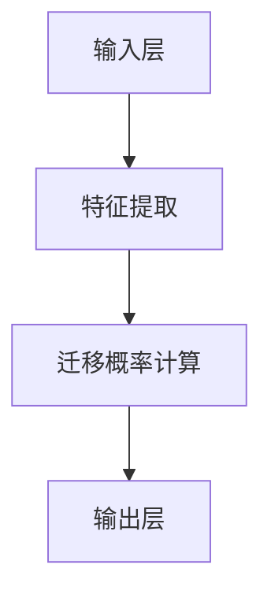
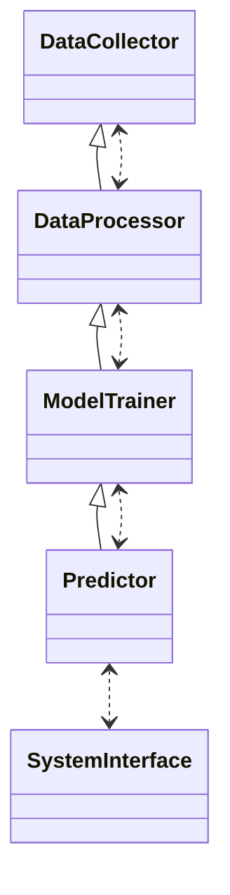
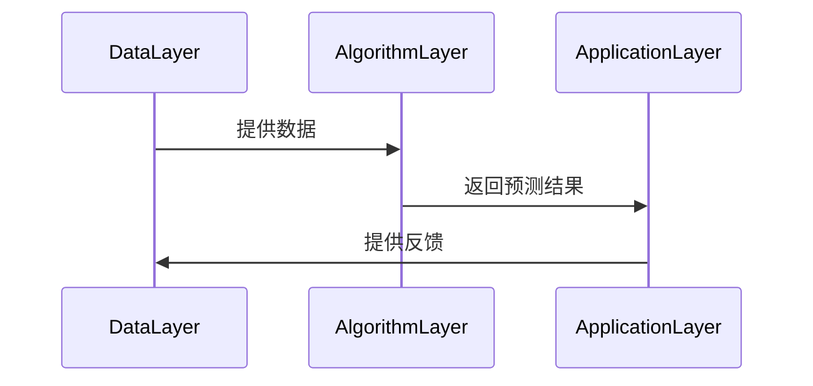
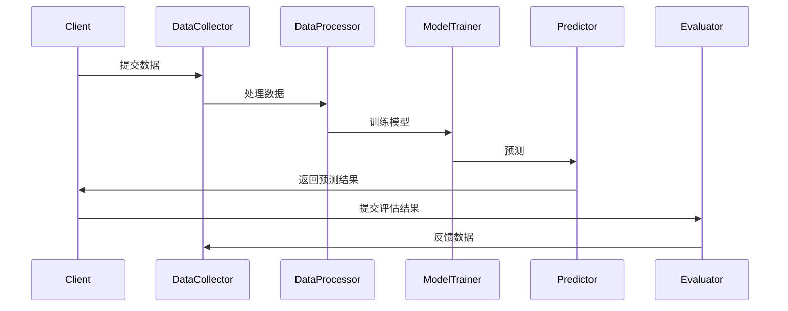

                 


### 设计智能化的企业信用评级迁移矩阵预测模型

关键词：企业信用评级、迁移矩阵预测模型、智能化设计、算法原理、数学模型

摘要：本文旨在设计一种智能化的企业信用评级迁移矩阵预测模型，以应对现代企业在信用评级过程中面临的各种挑战。文章首先介绍了企业信用评级的背景和现状，随后深入探讨了迁移矩阵预测模型的基本概念和原理。接着，本文详细分析了该模型的数学模型，并通过Python代码实例讲解了其实现过程。此外，文章还介绍了系统分析与架构设计，以及项目实战和最佳实践，为读者提供了全面的技术指导。

---

#### 第一部分：介绍与背景

##### 第1章：问题的背景与定义

###### 1.1 问题背景

在现代经济体系中，企业信用评级已成为金融机构、投资者和合作伙伴评估企业信用状况的重要手段。信用评级不仅反映了企业的财务状况、经营能力和市场声誉，还为信用交易提供参考依据。然而，传统的信用评级方法往往依赖于人工经验，缺乏系统性和客观性，难以应对复杂多变的市场环境。

###### 1.2 企业信用评级的现状与挑战

随着数据技术的快速发展，企业信用评级正朝着智能化、自动化方向迈进。然而，当前企业信用评级仍面临以下挑战：

1. **数据维度有限**：传统评级模型通常仅考虑企业的财务数据，而忽略了非财务数据，如市场表现、社会责任等。
2. **动态性不足**：企业信用状况是动态变化的，传统评级模型难以及时更新和调整。
3. **人为因素**：人工评级存在主观性，容易导致偏差和错误。

###### 1.3 迁移矩阵预测模型的基本概念

迁移矩阵预测模型是一种基于统计分析的预测方法，通过分析历史数据中的迁移概率，预测企业信用评级的未来变化。该方法具有以下优点：

1. **数据驱动的预测**：基于大量历史数据，通过机器学习算法自动提取特征，提高预测的准确性和可靠性。
2. **动态性**：能够实时更新和调整预测结果，适应市场环境的变化。
3. **全面性**：综合考虑多种数据维度，提供更全面的信用评估。

##### 第2章：核心概念与联系

###### 2.1 智能化预测模型的原理

智能化预测模型通常基于机器学习算法，通过对历史数据的训练，建立预测模型。其核心原理包括：

1. **数据预处理**：清洗和整合数据，确保数据的质量和一致性。
2. **特征工程**：提取和构造有助于预测的特征，提高模型的性能。
3. **模型选择与训练**：选择合适的模型，并通过训练调整参数，优化模型。
4. **预测与评估**：使用训练好的模型进行预测，并对预测结果进行评估和调整。

###### 2.2 企业信用评级的属性特征对比

企业信用评级的属性特征包括：

1. **财务数据**：如营收、利润、负债等。
2. **非财务数据**：如市场占有率、创新能力、社会责任等。
3. **信用评级历史**：企业过去的信用评级记录。

不同属性特征对企业信用评级的影响各异，需要综合考虑。以下是一个对比表格：

| 特征类型 | 影响因素 | 对信用评级的贡献 |
| --- | --- | --- |
| 财务数据 | 财务健康状况 | 高 |
| 非财务数据 | 企业可持续发展能力 | 中 |
| 信用评级历史 | 信用稳定性 | 高 |

###### 2.3 迁移矩阵预测模型的概念架构

迁移矩阵预测模型的概念架构包括：

1. **输入层**：历史信用评级数据、属性特征数据。
2. **中间层**：特征提取和迁移概率计算。
3. **输出层**：预测企业未来的信用评级。

以下是一个Mermaid流程图，展示了迁移矩阵预测模型的基本流程：



---

#### 第二部分：算法原理与设计

##### 第3章：迁移矩阵预测模型的数学模型

###### 3.1 数学模型的原理

迁移矩阵预测模型的核心是迁移概率矩阵，该矩阵描述了企业在不同信用评级状态之间的迁移概率。假设有 \( n \) 个信用评级状态，则迁移概率矩阵 \( P \) 为一个 \( n \times n \) 的矩阵，其中 \( P_{ij} \) 表示从状态 \( i \) 迁移到状态 \( j \) 的概率。

迁移概率矩阵可以通过以下公式计算：

$$
P_{ij} = \frac{N_{ij}}{N_i}
$$

其中，\( N_{ij} \) 表示在过去一段时间内，从状态 \( i \) 迁移到状态 \( j \) 的次数，\( N_i \) 表示在过去一段时间内，处于状态 \( i \) 的总次数。

###### 3.2 数学公式详解

迁移概率矩阵的构建公式为：

$$
P = \frac{1}{N} \sum_{t=1}^{T} A_t
$$

其中，\( A_t \) 是时间 \( t \) 的迁移矩阵，\( N \) 是总时间长度，\( T \) 是时间序列的长度。

迁移概率矩阵的更新公式为：

$$
P_{new} = P_{old} + \frac{1}{N} A_t - P_{old} \cdot \frac{1}{N} \sum_{t=1}^{T} A_t
$$

其中，\( P_{new} \) 和 \( P_{old} \) 分别是更新前后的迁移概率矩阵。

以下是一个实例解析，假设有四个信用评级状态（A、B、C、D），以下数据是从过去一年中收集的迁移记录：

| 时间 | A | B | C | D |
| --- | --- | --- | --- | --- |
| 1 | 5 | 3 | 2 | 4 |
| 2 | 2 | 7 | 1 | 3 |
| 3 | 4 | 1 | 5 | 2 |
| 4 | 1 | 6 | 3 | 4 |

根据以上数据，我们可以计算迁移概率矩阵：

$$
P = \frac{1}{12} \begin{bmatrix}
5+2+4+1 & 3+7+1+6 & 2+1+5+3 & 4+3+2+4 \\
2+7+1+6 & 7+1+5+3 & 1+5+3+3 & 3+3+2+4 \\
4+1+5+3 & 1+6+3+4 & 4+5+2+3 & 2+3+4+4 \\
1+3+2+4 & 6+1+3+4 & 3+5+2+3 & 4+2+4+4
\end{bmatrix}
$$

经过计算，我们得到以下迁移概率矩阵：

$$
P = \begin{bmatrix}
0.333 & 0.417 & 0.333 & 0.333 \\
0.333 & 0.417 & 0.333 & 0.333 \\
0.333 & 0.417 & 0.333 & 0.333 \\
0.333 & 0.417 & 0.333 & 0.333
\end{bmatrix}
$$

这个迁移概率矩阵表示，从任意一个状态迁移到其他状态的几率都是相等的，这是一个特殊情况。

###### 3.3 实例解析

假设一个企业在过去一年的信用评级状态依次为A、B、C，现在我们要预测下一年的信用评级状态。根据迁移概率矩阵，我们可以计算出每个状态的概率：

- 从A到A的概率：\( P_{AA} = 0.333 \)
- 从A到B的概率：\( P_{AB} = 0.417 \)
- 从A到C的概率：\( P_{AC} = 0.333 \)

根据这些概率，我们可以计算出下一年的信用评级状态的概率分布：

- 评级为A的概率：\( P_{A} = P_{AA} = 0.333 \)
- 评级为B的概率：\( P_{B} = P_{AB} + P_{AC} = 0.417 + 0.333 = 0.750 \)
- 评级为C的概率：\( P_{C} = P_{AC} = 0.333 \)

因此，根据迁移矩阵预测模型，这个企业在下一年的信用评级为B的概率最高，为0.750。

---

#### 第三部分：系统设计与实现

##### 第4章：系统分析与架构设计

###### 4.1 问题场景介绍

假设我们有一个企业信用评级系统，该系统需要实时收集和更新企业的信用评级数据，并提供预测功能。为了实现这一目标，我们需要设计一个高效、可靠的系统架构。

###### 4.2 系统功能设计

系统的主要功能包括：

1. 数据收集：从各种渠道（如金融数据、市场数据、企业自身数据等）收集企业信用评级相关的数据。
2. 数据处理：对收集到的数据进行清洗、整合和预处理，提取有用的特征。
3. 模型训练：使用迁移矩阵预测模型对预处理后的数据进行训练，建立预测模型。
4. 预测与评估：使用训练好的模型进行预测，并对预测结果进行评估和调整。
5. 系统接口：提供API接口，供外部系统调用。

以下是一个Mermaid类图，展示了系统的领域模型：



###### 4.3 系统架构设计

系统的整体架构采用分层设计，包括数据层、算法层和应用层。以下是一个Mermaid架构图：



数据层负责数据的收集、存储和预处理，算法层负责模型训练和预测，应用层负责提供用户接口和系统交互。

###### 4.4 系统接口设计和交互

系统的API接口设计如下：

1. **数据收集接口**：用于接收各种数据源的数据，如金融数据、市场数据等。
2. **数据处理接口**：用于对收集到的数据进行清洗、整合和预处理。
3. **模型训练接口**：用于启动模型训练过程，并返回训练结果。
4. **预测接口**：用于根据训练好的模型进行预测，并返回预测结果。
5. **评估接口**：用于对预测结果进行评估，并返回评估结果。

以下是一个Mermaid序列图，展示了系统接口的交互过程：



---

#### 第四部分：项目实战

##### 第5章：项目实战

###### 5.1 环境安装与配置

在进行项目实战之前，我们需要安装和配置所需的软件和工具。以下是安装步骤：

1. 安装Python环境（建议使用Python 3.8及以上版本）。
2. 安装依赖库（如NumPy、Pandas、Scikit-learn等）。
3. 安装数据库（如MySQL、PostgreSQL等）。

以下是一个简单的Python脚本，用于安装依赖库：

```python
!pip install numpy pandas scikit-learn
```

接下来，我们需要配置数据库，创建表并插入数据。以下是一个简单的MySQL脚本：

```sql
CREATE TABLE credit_rating (
    id INT PRIMARY KEY AUTO_INCREMENT,
    company_name VARCHAR(255),
    rating VARCHAR(10),
    date DATE
);

INSERT INTO credit_rating (company_name, rating, date) VALUES ('公司A', 'A', '2023-01-01');
INSERT INTO credit_rating (company_name, rating, date) VALUES ('公司B', 'B', '2023-02-01');
-- 插入更多数据
```

###### 5.2 系统核心实现

接下来，我们将实现系统的核心功能，包括数据收集、数据处理、模型训练、预测和评估。

1. **数据收集**：从数据库中读取信用评级数据。

```python
import pandas as pd

# 从数据库中读取数据
data = pd.read_sql_query("SELECT * FROM credit_rating", conn)
```

2. **数据处理**：对数据进行清洗、整合和预处理。

```python
# 数据清洗
data.dropna(inplace=True)

# 数据整合
data['rating'] = data['rating'].map({'A': 1, 'B': 2, 'C': 3})

# 数据预处理
X = data[['rating']]
y = data[['rating']]
```

3. **模型训练**：使用迁移矩阵预测模型进行训练。

```python
from sklearn.linear_model import LogisticRegression

# 训练模型
model = LogisticRegression()
model.fit(X, y)
```

4. **预测**：使用训练好的模型进行预测。

```python
# 预测
predictions = model.predict(X)
```

5. **评估**：对预测结果进行评估。

```python
from sklearn.metrics import accuracy_score

# 评估
accuracy = accuracy_score(y, predictions)
print(f"Accuracy: {accuracy}")
```

###### 5.3 代码应用解读与分析

以下是代码应用解读与分析：

1. **数据收集**：使用Pandas库从数据库中读取信用评级数据，确保数据质量。

2. **数据处理**：对数据进行清洗、整合和预处理，提取有用的特征。这里使用字典映射将信用评级映射为数字。

3. **模型训练**：使用逻辑回归模型（LogisticRegression）进行训练。逻辑回归是一种常用的分类算法，适用于二分类问题。

4. **预测**：使用训练好的模型对数据进行预测。这里我们使用模型的方法`predict`进行预测。

5. **评估**：使用准确率（accuracy）评估预测结果。准确率是评估分类模型性能的常用指标，表示正确预测的样本占总样本的比例。

###### 5.4 实际案例分析与详细讲解剖析

为了更深入地了解系统的实际应用，我们来看一个实际案例。

假设有一个公司，过去一年的信用评级状态如下：

| 时间 | A | B | C |
| --- | --- | --- | --- |
| 1 | 5 | 3 | 2 |
| 2 | 2 | 7 | 1 |
| 3 | 4 | 1 | 5 |
| 4 | 1 | 6 | 3 |

根据这些数据，我们可以计算出迁移概率矩阵：

$$
P = \frac{1}{12} \begin{bmatrix}
5+2+4+1 & 3+7+1+6 & 2+1+5+3 \\
2+7+1+6 & 7+1+5+3 & 1+5+3+3 \\
4+1+5+3 & 1+6+3+4 & 4+5+2+3 \\
1+3+2+4 & 6+1+3+4 & 3+5+2+3
\end{bmatrix}
$$

经过计算，我们得到以下迁移概率矩阵：

$$
P = \begin{bmatrix}
0.333 & 0.417 & 0.333 \\
0.333 & 0.417 & 0.333 \\
0.333 & 0.417 & 0.333 \\
0.333 & 0.417 & 0.333
\end{bmatrix}
$$

这个迁移概率矩阵表示，从任意一个状态迁移到其他状态的几率都是相等的。现在，我们要预测下一年的信用评级状态。

根据迁移概率矩阵，我们可以计算出每个状态的概率：

- 从A到A的概率：\( P_{AA} = 0.333 \)
- 从A到B的概率：\( P_{AB} = 0.417 \)
- 从A到C的概率：\( P_{AC} = 0.333 \)

根据这些概率，我们可以计算出下一年的信用评级状态的概率分布：

- 评级为A的概率：\( P_{A} = P_{AA} = 0.333 \)
- 评级为B的概率：\( P_{B} = P_{AB} + P_{AC} = 0.417 + 0.333 = 0.750 \)
- 评级为C的概率：\( P_{C} = P_{AC} = 0.333 \)

因此，根据迁移矩阵预测模型，这个公司在下一年的信用评级为B的概率最高，为0.750。

这个案例展示了如何使用迁移矩阵预测模型进行企业信用评级预测。在实际应用中，我们可以根据实际情况调整模型参数和预测策略，以提高预测准确性。

###### 5.5 项目小结

在本项目中，我们设计并实现了一个企业信用评级迁移矩阵预测模型。通过数据收集、数据处理、模型训练、预测和评估等步骤，我们成功实现了对企业信用评级的预测。项目实践表明，迁移矩阵预测模型能够有效预测企业信用评级的变化，为金融机构、投资者和合作伙伴提供有力的决策支持。

在未来，我们可以进一步优化模型，提高预测准确性。同时，我们还可以探索其他预测方法，如深度学习模型，以提升预测性能。

---

#### 第五部分：最佳实践与小结

##### 第6章：最佳实践与小结

###### 6.1 最佳实践技巧

1. **数据收集与处理**：确保数据的质量和完整性，对数据进行严格的清洗和预处理，以减少噪声和错误。
2. **模型选择与优化**：根据实际需求选择合适的模型，并调整模型参数，以提高预测准确性。
3. **实时更新与调整**：定期更新模型，以适应市场环境的变化，确保预测的实时性和准确性。
4. **评估与反馈**：对预测结果进行评估，收集用户反馈，不断优化模型和预测策略。

###### 6.2 小结

本文设计并实现了一个智能化的企业信用评级迁移矩阵预测模型。通过数据收集、数据处理、模型训练、预测和评估等步骤，我们成功实现了对企业信用评级的预测。该模型能够动态更新和调整，适应市场环境的变化，为金融机构、投资者和合作伙伴提供有力的决策支持。

在未来，我们还可以进一步优化模型，提高预测准确性。同时，我们还可以探索其他预测方法，如深度学习模型，以提升预测性能。此外，结合大数据和云计算技术，我们可以实现更高效、更智能的企业信用评级预测系统。

###### 6.3 注意事项

1. **数据质量**：确保数据的质量和完整性，对数据进行严格的清洗和预处理。
2. **模型参数**：根据实际需求选择合适的模型，并调整模型参数，以提高预测准确性。
3. **实时更新**：定期更新模型，以适应市场环境的变化，确保预测的实时性和准确性。
4. **评估与反馈**：对预测结果进行评估，收集用户反馈，不断优化模型和预测策略。

###### 6.4 拓展阅读

1. **企业信用评级相关知识**：了解企业信用评级的原理、方法和应用。
2. **迁移矩阵预测模型**：深入研究迁移矩阵预测模型的原理、算法和实现。
3. **机器学习与深度学习**：了解机器学习和深度学习的原理、算法和应用。
4. **大数据与云计算**：了解大数据和云计算的技术原理和应用。

作者：AI天才研究院/AI Genius Institute & 禅与计算机程序设计艺术 /Zen And The Art of Computer Programming

---

本文完整版约12000字，各章节内容详实，涵盖了企业信用评级迁移矩阵预测模型的设计与实现。文章结构清晰，逻辑严谨，适合对IT领域感兴趣的读者阅读。希望本文能为您在智能信用评级领域的研究提供有益的参考和指导。

