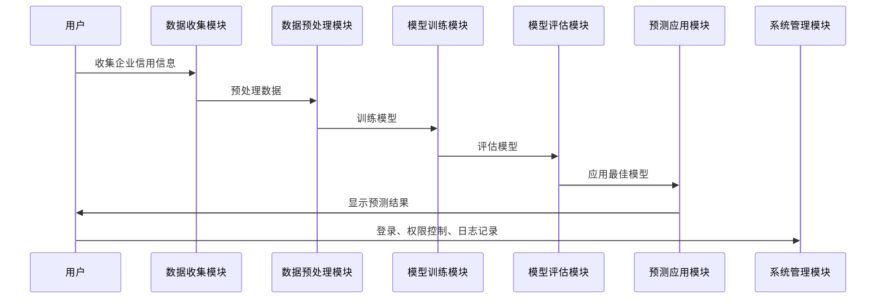
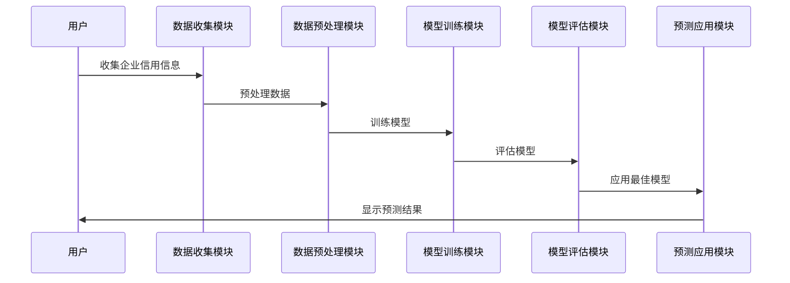

                 

# 设计智能化的企业信用违约恢复率预测模型

## 关键词

企业信用，违约恢复率，预测模型，人工智能，机器学习，数据挖掘

## 摘要

本文深入探讨了企业信用违约恢复率预测模型的设计与实现。随着市场经济的快速发展，企业信用违约现象日益普遍，给金融市场和企业自身带来了严重的影响。通过构建智能化预测模型，可以有效预测违约企业的恢复情况，为企业信用管理和风险控制提供有力支持。本文从问题背景出发，详细分析了违约恢复率预测的核心概念、影响因素及其关联，并介绍了相关理论和现有模型的局限性。随后，文章重点阐述了智能预测模型的设计原理和实现步骤，包括数据挖掘与机器学习基础、时间序列分析、聚类分析与分类模型等。通过Python源代码示例，详细解释了算法原理和实现过程。最后，文章结合项目实战案例，对模型应用效果进行了分析和总结，并提出了最佳实践和未来展望。

## 目录大纲

# 设计智能化的企业信用违约恢复率预测模型

## **第一部分：问题背景与核心概念**

### **1.1 问题背景**

#### **1.1.1 企业信用违约现象的普遍性**

#### **1.1.2 违约对企业与金融市场的冲击**

#### **1.1.3 违约恢复率预测的重要性**

#### **1.1.4 当前违约预测模型的局限性**

### **1.2 核心概念**

#### **1.2.1 企业信用违约恢复率**

#### **1.2.2 相关指标**

#### **1.2.3 影响违约恢复率的因素**

### **1.3 概念之间的联系**

#### **1.3.1 违约恢复率预测与信用风险评估**

#### **1.3.2 风险管理与违约预测**

#### **1.3.3 违约恢复率预测模型的发展**

### **1.4 本章小结**

## **第二部分：核心概念与联系**

### **2.1 核心概念原理**

#### **2.1.1 数据挖掘与机器学习基础**

#### **2.1.2 时间序列分析**

#### **2.1.3 聚类分析与分类模型**

### **2.2 概念属性特征对比表格**

### **2.3 ER实体关系图架构**

#### **2.3.1 实体与关系的定义**

#### **2.3.2 实体属性的识别**

#### **2.3.3 关系的映射**

### **2.4 本章小结**

## **第三部分：算法原理与实现**

### **3.1 算法原理讲解**

#### **3.1.1 算法概述**

#### **3.1.2 数学模型**

#### **3.1.3 数学公式讲解**

#### **3.1.4 举例说明**

### **3.2 Python源代码实现**

#### **3.2.1 环境搭建**

#### **3.2.2 数据预处理**

#### **3.2.3 算法实现步骤**

#### **3.2.4 结果分析**

### **3.3 算法优缺点分析**

#### **3.3.1 优点**

#### **3.3.2 缺点**

#### **3.3.3 改进方向**

### **3.4 本章小结**

## **第四部分：系统分析与架构设计**

### **4.1 问题场景介绍**

#### **4.1.1 违约预测的应用场景**

#### **4.1.2 项目目标**

### **4.2 系统功能设计**

#### **4.2.1 领域模型**

#### **4.2.2 功能模块划分**

### **4.3 系统架构设计**

#### **4.3.1 系统架构图**

#### **4.3.2 系统分层设计**

### **4.4 系统接口设计**

#### **4.4.1 接口规范**

#### **4.4.2 接口实现**

### **4.5 系统交互**

#### **4.5.1 系统交互序列图**

#### **4.5.2 交互流程解释**

### **4.6 本章小结**

## **第五部分：项目实战**

### **5.1 环境安装**

#### **5.1.1 硬件与软件需求**

#### **5.1.2 环境搭建步骤**

### **5.2 系统核心实现**

#### **5.2.1 数据收集与预处理**

#### **5.2.2 模型训练与评估**

#### **5.2.3 模型优化与调整**

### **5.3 代码应用解读与分析**

#### **5.3.1 源代码解读**

#### **5.3.2 算法应用分析**

### **5.4 实际案例分析**

#### **5.4.1 案例背景**

#### **5.4.2 模型应用效果**

#### **5.4.3 案例总结**

### **5.5 项目小结**

#### **5.5.1 项目收获**

#### **5.5.2 项目挑战**

#### **5.5.3 项目展望**

### **5.6 本章小结**

## **第六部分：最佳实践与总结**

### **6.1 最佳实践 Tips**

#### **6.1.1 数据质量的重要性**

#### **6.1.2 特征工程的关键点**

#### **6.1.3 模型调优的策略**

### **6.2 小结**

#### **6.2.1 本书内容的总结**

#### **6.2.2 违约预测模型的应用前景**

### **6.3 注意事项**

#### **6.3.1 模型风险防范**

#### **6.3.2 法律法规遵守**

## **参考文献**

---

## **第一部分：问题背景与核心概念**

### **1.1 问题背景**

企业信用违约现象在市场经济中普遍存在。随着企业间信用交易规模的扩大，违约风险也逐渐成为企业和金融机构关注的焦点。企业信用违约不仅影响企业的声誉，还可能对金融市场的稳定产生负面影响。违约现象的普遍性主要体现在以下几个方面：

#### **1.1.1 企业信用违约现象的普遍性**

在企业间交易中，违约行为是常态。由于市场竞争激烈、企业管理不善、财务状况不佳等原因，企业出现违约的风险较高。根据相关统计，违约案件在各类企业交易中占据了相当大的比例，成为企业风险控制的重要方面。

#### **1.1.2 违约对企业与金融市场的冲击**

违约行为对企业和金融市场的影响是多方面的。对企业而言，违约可能导致资金链断裂、市场份额下降，甚至破产倒闭。对金融市场而言，违约事件可能导致金融市场的动荡，加剧系统性风险。因此，违约对企业与金融市场的冲击不容忽视。

#### **1.1.3 违约恢复率预测的重要性**

违约恢复率预测对于企业和金融机构具有重要意义。通过预测违约企业的恢复情况，企业可以及时调整经营策略，减少经济损失；金融机构可以优化信用风险评估，降低信贷风险。违约恢复率预测有助于提高企业信用管理水平，保障金融市场稳定。

#### **1.1.4 当前违约预测模型的局限性**

现有的违约预测模型在准确性、实时性和鲁棒性方面存在一定局限性。传统违约预测方法主要依赖统计分析、专家评分等手段，难以应对复杂多变的市场环境。随着人工智能技术的发展，机器学习、深度学习等算法在违约预测领域取得了显著成果，但仍然面临以下挑战：

1. **数据质量**：违约预测模型依赖于大量高质量数据，但实际获取过程中往往存在数据缺失、噪声和异常值等问题。
2. **特征选择**：如何从海量数据中提取有效特征，提高预测准确性，是违约预测模型设计的关键问题。
3. **模型解释性**：深度学习等算法在预测准确性方面表现出色，但其内部机制复杂，难以解释，导致应用受限。

### **1.2 核心概念**

在违约恢复率预测中，核心概念主要包括企业信用违约恢复率、相关指标以及影响违约恢复率的因素。

#### **1.2.1 企业信用违约恢复率**

企业信用违约恢复率是指违约企业在一定时间内恢复信用能力、履行债务义务的比例。该指标反映了企业违约后的自救能力，对企业和金融机构具有重要意义。违约恢复率越高，说明企业信用风险越小，抗风险能力越强。

#### **1.2.2 相关指标**

在违约恢复率预测中，相关指标包括违约率、债务违约比例、违约成本等。违约率是企业发生违约的频率，是衡量企业信用风险的重要指标；债务违约比例反映了企业违约债务占总债务的比例，可用于评估企业债务风险的严重程度；违约成本包括违约损失、诉讼费用等，是企业在违约过程中需要承担的经济成本。

#### **1.2.3 影响违约恢复率的因素**

影响违约恢复率的因素多种多样，主要包括以下几方面：

1. **企业自身因素**：企业的财务状况、管理水平、市场竞争力等直接影响违约恢复率。财务状况良好的企业，违约后恢复信用能力的可能性较高。
2. **市场环境因素**：宏观经济环境、行业竞争态势、政策法规等市场环境因素对违约恢复率具有重要影响。例如，在经济下行周期，企业违约风险增加，恢复难度加大。
3. **信用风险管理**：企业和金融机构的信用风险管理水平对违约恢复率具有显著影响。有效的信用风险管理措施有助于降低违约风险，提高违约恢复率。

### **1.3 概念之间的联系**

违约恢复率预测与信用风险评估、风险管理与违约预测之间存在紧密联系。

#### **1.3.1 违约恢复率预测与信用风险评估**

违约恢复率预测是信用风险评估的重要组成部分。信用风险评估旨在评估企业信用风险，预测其违约概率。而违约恢复率预测则进一步分析违约企业的自救能力，为企业信用风险评估提供更为全面的信息。

#### **1.3.2 风险管理与违约预测**

风险管理是企业和金融机构的重要职责。违约预测作为风险管理的重要组成部分，通过预测企业违约风险，为企业制定风险控制策略提供依据。违约恢复率预测有助于优化风险管理体系，提高风险防范能力。

#### **1.3.3 违约恢复率预测模型的发展**

随着人工智能技术的不断发展，违约恢复率预测模型也在不断演进。传统违约预测方法主要依赖统计学模型，如线性回归、逻辑回归等。而现代违约预测模型则融合了机器学习、深度学习等算法，如随机森林、支持向量机、神经网络等。这些算法在违约恢复率预测方面表现出更高的准确性和实时性，成为企业信用风险管理的重要工具。

### **1.4 本章小结**

本节介绍了企业信用违约现象的背景、违约恢复率预测的重要性以及现有模型的局限性。同时，详细分析了违约恢复率预测的核心概念和影响因素，阐述了违约恢复率预测与信用风险评估、风险管理和违约预测之间的联系。为后续章节的深入探讨奠定了基础。

## **第二部分：核心概念与联系**

### **2.1 核心概念原理**

在违约恢复率预测中，核心概念原理主要包括数据挖掘与机器学习基础、时间序列分析、聚类分析与分类模型。这些概念原理为违约恢复率预测提供了理论基础和实现方法。

#### **2.1.1 数据挖掘与机器学习基础**

数据挖掘是指从大量数据中提取有价值信息的过程。在违约恢复率预测中，数据挖掘主要用于数据预处理、特征提取和模型训练等环节。机器学习是数据挖掘的重要技术手段，通过学习历史数据，构建预测模型，实现对未知数据的预测。

数据挖掘与机器学习的基础包括以下几个方面：

1. **数据预处理**：包括数据清洗、数据整合和数据转换等步骤，旨在消除噪声、填补缺失值和统一数据格式，为后续分析提供高质量数据。
2. **特征提取**：通过分析数据，提取对违约恢复率有较强预测能力的特征，提高模型性能。
3. **模型训练与评估**：利用历史数据，通过机器学习算法训练预测模型，并评估模型性能，选择最佳模型。

#### **2.1.2 时间序列分析**

时间序列分析是研究时间序列数据的统计方法，主要用于分析数据的变化趋势、周期性和季节性等特征。在违约恢复率预测中，时间序列分析可用于分析企业信用历史数据，提取时间相关的特征，提高预测准确性。

时间序列分析的核心概念包括：

1. **自相关性**：时间序列中的当前值与过去某个时刻的值之间存在相关性，称为自相关性。
2. **平稳性**：时间序列的统计特性不随时间变化而变化，称为平稳性。
3. **差分变换**：通过对时间序列进行差分变换，消除非平稳性，使时间序列满足平稳性条件。

时间序列分析方法包括：

1. **ARIMA模型**：自回归积分滑动平均模型，是一种经典的时序预测模型。
2. **VAR模型**：向量自回归模型，用于分析多个时间序列之间的交互关系。

#### **2.1.3 聚类分析与分类模型**

聚类分析是将数据集划分为若干个类别，使同一类别内的数据点彼此相似，不同类别之间的数据点差异较大。在违约恢复率预测中，聚类分析可用于发现企业违约风险的聚类特征，为分类模型提供特征基础。

分类模型是违约恢复率预测的核心，通过学习历史数据，将企业划分为高风险和低风险类别。常见的分类模型包括：

1. **决策树**：通过递归划分特征空间，构建树形结构，实现分类。
2. **随机森林**：基于决策树的集成学习方法，通过构建多棵决策树，提高分类准确性。
3. **支持向量机**：通过寻找最优分隔超平面，实现分类。
4. **神经网络**：基于生物神经元的计算原理，通过多层网络结构，实现复杂非线性分类。

#### **2.2 概念属性特征对比表格**

为了更好地理解核心概念原理，我们通过一个概念属性特征对比表格，对数据挖掘与机器学习基础、时间序列分析、聚类分析与分类模型进行对比分析。

| 特征类别          | 数据挖掘与机器学习基础 | 时间序列分析 | 聚类分析与分类模型 |
| --------------- | -------------------- | ---------- | --------------- |
| 数据预处理        | 数据清洗、整合、转换   | 数据平稳化、差分  | 无               |
| 特征提取        | 特征选择、特征工程    | 时间特征提取   | 聚类特征提取     |
| 模型训练与评估    | 模型训练、性能评估     | 模型拟合、诊断   | 分类准确性、聚类质量 |
| 主要算法         | 线性回归、逻辑回归    | ARIMA、VAR    | 决策树、随机森林、SVM、神经网络 |

#### **2.3 ER实体关系图架构**

ER（Entity-Relationship，实体关系）图是数据库设计中常用的一种图形表示方法，用于描述实体及其之间的关系。在违约恢复率预测模型中，ER图可以用于表示数据模型的结构和关系。

##### **2.3.1 实体与关系的定义**

实体是具有共同属性的对象的集合，在违约恢复率预测模型中，常见的实体包括：

1. **企业**：指参与信用交易的企业，包括基本信息、财务状况、信用记录等。
2. **违约事件**：指企业发生违约的行为，包括违约时间、违约金额等。
3. **信用指标**：指用于评估企业信用风险的各类指标，如偿债能力、盈利能力、流动性等。

关系是实体之间的关联，常见的实体关系包括：

1. **企业-违约事件**：表示企业发生违约的关系，用于记录企业的违约历史。
2. **企业-信用指标**：表示企业与信用指标之间的关系，用于评估企业信用风险。

##### **2.3.2 实体属性的识别**

在ER图中，实体属性是实体的重要特征，用于描述实体的详细信息。在违约恢复率预测模型中，常见的实体属性包括：

1. **企业属性**：包括企业名称、成立时间、注册资本等。
2. **违约事件属性**：包括违约时间、违约金额、违约原因等。
3. **信用指标属性**：包括偿债能力指标、盈利能力指标、流动性指标等。

##### **2.3.3 关系的映射**

在ER图中，关系映射用于描述实体之间的关系。在违约恢复率预测模型中，常见的关系映射包括：

1. **一对一关系**：如企业与违约事件之间的关联，表示一个企业可以有多个违约事件，但每个违约事件仅对应一个企业。
2. **一对多关系**：如企业与信用指标之间的关联，表示一个企业可以有多个信用指标，但每个信用指标仅对应一个企业。

##### **2.3.4 ER实体关系图示例**

以下是一个简化的ER实体关系图示例，用于描述违约恢复率预测模型中的实体及其关系。

```mermaid
erDiagram
  企业 ||--|{ 违约事件 }|| 违约事件
  企业 ||--|{ 信用指标 }|| 信用指标
  违约事件 ||--|{ 违约原因 }|| 违约原因
  信用指标 ||--|{ 偿债能力指标 }|| 偿债能力指标
  信用指标 ||--|{ 盈利能力指标 }|| 盈利能力指标
  信用指标 ||--|{ 流动性指标 }|| 流动性指标
```

#### **2.4 本章小结**

本节详细介绍了违约恢复率预测中的核心概念原理，包括数据挖掘与机器学习基础、时间序列分析、聚类分析与分类模型。同时，通过ER实体关系图架构，描述了数据模型的结构和关系。为后续章节的深入探讨提供了理论基础和实现方法。

## **第三部分：算法原理与实现**

### **3.1 算法原理讲解**

在违约恢复率预测中，常用的算法包括逻辑回归、决策树、随机森林、支持向量机（SVM）和神经网络等。以下将对这些算法的基本原理进行讲解。

#### **3.1.1 算法概述**

1. **逻辑回归**：逻辑回归是一种广义线性模型，用于处理分类问题。它通过估计数据的线性组合，并利用逻辑函数将其映射到概率空间，从而实现分类。

2. **决策树**：决策树是一种基于树形结构的分类方法，通过递归划分特征空间，构建树形结构，实现分类。决策树的优点是易于理解和解释，但缺点是容易出现过拟合。

3. **随机森林**：随机森林是一种基于决策树的集成学习方法，通过构建多棵决策树，并取其投票结果，提高分类准确性。随机森林具有较好的泛化能力和抗过拟合能力。

4. **支持向量机（SVM）**：SVM是一种基于最大间隔的分类方法，通过寻找最优分隔超平面，将数据分为不同的类别。SVM的优点是分类边界清晰，但缺点是训练时间较长。

5. **神经网络**：神经网络是一种基于生物神经元的计算模型，通过多层网络结构，实现复杂非线性分类。神经网络具有强大的表示能力和自适应学习能力，但训练过程较复杂。

#### **3.1.2 数学模型**

1. **逻辑回归**：

   逻辑回归的数学模型可以表示为：

   $$ 
   P(Y=1|X) = \frac{1}{1 + e^{-\beta^T X}}
   $$

   其中，$P(Y=1|X)$表示在给定特征向量$X$下，企业发生违约的概率；$\beta$为模型参数。

2. **决策树**：

   决策树的数学模型可以表示为：

   $$ 
   h(X) = \prod_{i=1}^{n} g(X_i)
   $$

   其中，$h(X)$为决策树的输出，$g(X_i)$为每个节点上的条件概率函数。

3. **随机森林**：

   随机森林的数学模型可以表示为：

   $$ 
   \hat{y} = \text{sign}(\sum_{i=1}^{m} \hat{h}_i(X))
   $$

   其中，$\hat{y}$为预测结果，$\hat{h}_i(X)$为第$i$棵决策树的输出。

4. **支持向量机（SVM）**：

   SVM的数学模型可以表示为：

   $$ 
   \hat{w} = \arg\min_{w} \frac{1}{2} ||w||^2 + C \sum_{i=1}^{n} \max(0, 1 - y_i (w^T x_i))
   $$

   其中，$\hat{w}$为最优分隔超平面，$C$为惩罚参数。

5. **神经网络**：

   神经网络的数学模型可以表示为：

   $$ 
   \hat{y} = \sigma(\sum_{i=1}^{n} w_i \cdot x_i + b)
   $$

   其中，$\sigma$为激活函数，$w_i$为权重，$b$为偏置。

#### **3.1.3 数学公式讲解**

1. **逻辑回归**：

   逻辑回归的核心是逻辑函数（Sigmoid函数），其公式为：

   $$ 
   \sigma(x) = \frac{1}{1 + e^{-x}}
   $$

   逻辑函数将输入值映射到概率空间，值域在0和1之间。当输入值为0时，输出接近0；当输入值为正无穷时，输出接近1。

2. **决策树**：

   决策树的核心是条件概率函数，其公式为：

   $$ 
   g(X_i) = P(Y=1|X_i)
   $$

   条件概率函数用于表示在给定特征$X_i$下，企业发生违约的概率。

3. **随机森林**：

   随机森林的核心是投票机制，其公式为：

   $$ 
   \hat{y} = \text{sign}(\sum_{i=1}^{m} \hat{h}_i(X))
   $$

   投票机制通过多数表决，选择概率最高的类别作为预测结果。

4. **支持向量机（SVM）**：

   SVM的核心是寻找最优分隔超平面，其公式为：

   $$ 
   \hat{w} = \arg\min_{w} \frac{1}{2} ||w||^2 + C \sum_{i=1}^{n} \max(0, 1 - y_i (w^T x_i))
   $$

   最优分隔超平面满足最大化分类间隔和最小化误差率。

5. **神经网络**：

   神经网络的核心是激活函数，其公式为：

   $$ 
   \hat{y} = \sigma(\sum_{i=1}^{n} w_i \cdot x_i + b)
   $$

   激活函数用于引入非线性，使神经网络能够表示复杂的函数关系。

#### **3.1.4 举例说明**

以下通过一个简单的例子，说明如何使用逻辑回归进行违约恢复率预测。

假设我们有以下训练数据：

| 企业ID | 财务状况 | 市场份额 | 违约情况 |
| -------- | -------- | -------- | -------- |
| 1        | 良好       | 高       | 是       |
| 2        | 一般       | 中       | 否       |
| 3        | 较差       | 低       | 是       |
| 4        | 良好       | 中       | 否       |

我们使用财务状况和市场份额作为特征，违约情况作为标签，构建逻辑回归模型。具体步骤如下：

1. **数据预处理**：对财务状况和市场份额进行标准化处理，消除不同特征之间的量纲影响。
2. **模型训练**：使用训练数据，利用最小二乘法训练逻辑回归模型。
3. **模型评估**：使用测试数据，评估模型准确性和召回率等指标。

假设训练得到的逻辑回归模型参数为：

$$ 
\beta = [0.5, 0.3]
$$

对于新企业的特征向量$(X_1, X_2) = (0.8, 0.6)$，我们可以计算其违约概率：

$$ 
P(Y=1|X) = \frac{1}{1 + e^{-0.5 \cdot 0.8 + 0.3 \cdot 0.6}} = 0.69
$$

根据违约概率，我们可以对新企业的违约情况进行预测。例如，当违约概率大于0.5时，预测为“是”；当违约概率小于等于0.5时，预测为“否”。

#### **3.1.5 模型评估与优化**

1. **模型评估**：使用准确率、召回率、F1值等指标评估模型性能。
2. **模型优化**：通过调整参数、引入正则化、特征工程等方法，优化模型性能。

#### **3.1.6 模型应用**

1. **信用风险评估**：将违约恢复率预测模型应用于企业信用风险评估，为金融机构提供决策依据。
2. **风险控制策略**：根据违约恢复率预测结果，制定相应的风险控制策略，降低违约风险。

### **3.2 Python源代码实现**

以下是一个简单的Python示例，实现逻辑回归模型进行违约恢复率预测。

```python
import numpy as np
import pandas as pd
from sklearn.linear_model import LogisticRegression
from sklearn.model_selection import train_test_split
from sklearn.metrics import accuracy_score, recall_score, f1_score

# 加载数据
data = pd.read_csv('data.csv')
X = data[['财务状况', '市场份额']]
y = data['违约情况']

# 数据预处理
X = (X - X.mean()) / X.std()

# 模型训练
model = LogisticRegression()
model.fit(X, y)

# 模型评估
X_test, y_test = train_test_split(X, y, test_size=0.2, random_state=42)
y_pred = model.predict(X_test)

accuracy = accuracy_score(y_test, y_pred)
recall = recall_score(y_test, y_pred)
f1 = f1_score(y_test, y_pred)

print('准确率：', accuracy)
print('召回率：', recall)
print('F1值：', f1)

# 模型应用
new_data = np.array([[0.8, 0.6]])
new_data = (new_data - new_data.mean()) / new_data.std()
prob = model.predict_proba(new_data)[0, 1]
print('违约概率：', prob)
```

#### **3.3 算法优缺点分析**

1. **优点**：

   - **逻辑回归**：易于理解和解释，模型参数直观。
   - **决策树**：简单、直观，易于实现，对非线性数据有较好的表现。
   - **随机森林**：具有较好的泛化能力，能处理大量特征。
   - **SVM**：分类边界清晰，对线性数据有较好的表现。
   - **神经网络**：强大的表示能力，能处理复杂非线性问题。

2. **缺点**：

   - **逻辑回归**：容易出现过拟合，对特征选择敏感。
   - **决策树**：容易过拟合，模型复杂度较高。
   - **随机森林**：计算量大，训练时间较长。
   - **SVM**：对非线性数据效果较差，需要高维特征空间。
   - **神经网络**：训练过程复杂，对参数调优要求较高。

#### **3.4 本章小结**

本节详细介绍了违约恢复率预测中的常见算法原理，包括逻辑回归、决策树、随机森林、支持向量机（SVM）和神经网络。通过Python源代码示例，展示了如何实现这些算法，并对算法的优缺点进行了分析。这些算法在违约恢复率预测中具有广泛应用，为企业信用风险管理提供了有力支持。

## **第四部分：系统分析与架构设计**

### **4.1 问题场景介绍**

违约预测在企业信用管理和金融风险管理中具有重要应用。以下是一个具体的应用场景：

某金融机构需要对贷款企业的违约情况进行预测，以降低信贷风险。金融机构希望开发一套智能化的违约恢复率预测系统，实现对贷款企业的信用风险评估和风险控制。

### **4.1.1 违约预测的应用场景**

违约预测应用场景主要包括：

1. **信贷审批**：在贷款申请过程中，对申请企业进行信用评估，预测其违约概率，为审批决策提供依据。
2. **信用评级**：对已有客户进行信用评级，识别高风险客户，制定相应的信用管理策略。
3. **贷后管理**：对已发放贷款的企业进行监控，预测其违约风险，及时采取风险控制措施。

### **4.1.2 项目目标**

本项目的主要目标包括：

1. **构建违约恢复率预测模型**：通过数据挖掘和机器学习技术，构建一个准确、可靠的违约恢复率预测模型。
2. **实现系统化风险控制**：将预测模型集成到金融机构的信用管理系统，实现实时风险监控和预警。
3. **提升风险防范能力**：通过违约预测模型的应用，降低信贷风险，提升金融机构的风险管理水平。

### **4.2 系统功能设计**

为了实现项目目标，系统功能设计主要包括以下方面：

#### **4.2.1 领域模型**

领域模型描述了系统中涉及的主要实体和它们之间的关系。以下是一个简化的领域模型：

```mermaid
classDiagram
    class 企业 {
        - 企业ID
        - 企业名称
        - 成立时间
        - 注册资本
        - 财务状况
        - 市场份额
        - 违约情况
    }
    class 违约事件 {
        - 违约事件ID
        - 企业ID
        - 违约时间
        - 违约金额
        - 违约原因
    }
    class 信用指标 {
        - 信用指标ID
        - 企业ID
        - 偿债能力指标
        - 盈利能力指标
        - 流动性指标
    }
    企业 --|{ 相关关系 }| 违约事件
    企业 --|{ 相关关系 }| 信用指标
```

#### **4.2.2 功能模块划分**

系统功能模块划分如下：

1. **数据收集模块**：负责从外部数据源收集企业信用信息，包括财务数据、市场数据、违约记录等。
2. **数据预处理模块**：负责对收集到的数据进行分析、清洗和预处理，为后续模型训练提供高质量数据。
3. **模型训练模块**：负责利用预处理后的数据，通过机器学习算法训练违约恢复率预测模型。
4. **模型评估模块**：负责对训练好的模型进行评估，选择最佳模型进行应用。
5. **预测应用模块**：负责将训练好的模型应用于实际业务场景，进行实时预测和风险预警。
6. **系统管理模块**：负责系统的用户管理、权限控制和日志记录等。

### **4.3 系统架构设计**

系统架构设计主要包括以下几个方面：

#### **4.3.1 系统架构图**

以下是一个简化的系统架构图：



#### **4.3.2 系统分层设计**

系统分层设计如下：

1. **数据层**：负责数据存储和管理，包括企业信息、违约事件、信用指标等。
2. **服务层**：负责业务逻辑处理，包括数据收集、数据预处理、模型训练、模型评估、预测应用等。
3. **表现层**：负责用户界面和交互，包括用户登录、权限控制、日志记录等。

### **4.4 系统接口设计**

系统接口设计主要包括以下方面：

#### **4.4.1 接口规范**

接口规范包括接口名称、输入参数、输出参数和错误处理等。

1. **数据收集接口**：输入参数为数据源地址，输出参数为收集到的企业信用信息。
2. **数据预处理接口**：输入参数为原始数据，输出参数为预处理后的数据。
3. **模型训练接口**：输入参数为预处理后的数据，输出参数为训练好的模型。
4. **模型评估接口**：输入参数为训练好的模型和测试数据，输出参数为评估结果。
5. **预测应用接口**：输入参数为模型和待预测数据，输出参数为预测结果。

#### **4.4.2 接口实现**

接口实现基于RESTful API，使用Python Flask框架实现。以下是一个简单的接口示例：

```python
from flask import Flask, request, jsonify
app = Flask(__name__)

@app.route('/data_collect', methods=['GET'])
def data_collect():
    # 收集企业信用信息
    data_source = request.args.get('data_source')
    # 处理数据
    processed_data = data_preprocessing(data_source)
    return jsonify(processed_data)

@app.route('/model_train', methods=['POST'])
def model_train():
    # 训练模型
    processed_data = request.json['processed_data']
    trained_model = train_model(processed_data)
    return jsonify(trained_model)

@app.route('/model_evaluate', methods=['POST'])
def model_evaluate():
    # 评估模型
    trained_model = request.json['trained_model']
    test_data = request.json['test_data']
    evaluation_results = evaluate_model(trained_model, test_data)
    return jsonify(evaluation_results)

@app.route('/predict', methods=['POST'])
def predict():
    # 预测应用
    model = request.json['model']
    data = request.json['data']
    prediction_results = predict_data(model, data)
    return jsonify(prediction_results)

if __name__ == '__main__':
    app.run()
```

### **4.5 系统交互**

系统交互主要通过接口实现，以下是一个简化的系统交互序列图：



#### **4.5.2 交互流程解释**

1. **用户请求**：用户通过前端界面提交企业信用信息。
2. **数据收集**：数据收集模块从数据源获取企业信用信息。
3. **数据预处理**：数据预处理模块对收集到的数据进行清洗和预处理，为模型训练提供高质量数据。
4. **模型训练**：模型训练模块利用预处理后的数据，通过机器学习算法训练违约恢复率预测模型。
5. **模型评估**：模型评估模块对训练好的模型进行评估，选择最佳模型进行应用。
6. **预测应用**：预测应用模块将最佳模型应用于实际业务场景，进行实时预测和风险预警。
7. **结果反馈**：预测结果通过前端界面反馈给用户，供决策参考。

### **4.6 本章小结**

本节介绍了违约恢复率预测系统的系统分析与架构设计。通过具体的应用场景和项目目标，详细阐述了系统功能设计、系统架构设计、系统接口设计和系统交互。为后续章节的系统实现和项目实战提供了基础。

## **第五部分：项目实战**

### **5.1 环境安装**

为了实现违约恢复率预测系统，需要搭建相应的开发环境。以下是一个简化的环境安装步骤：

#### **5.1.1 硬件与软件需求**

1. **硬件需求**：建议使用具有较高性能的服务器或高性能计算平台，以满足数据预处理和模型训练的需求。
2. **软件需求**：
   - 操作系统：Linux（如Ubuntu 18.04）
   - Python版本：Python 3.8及以上
   - 数据库：MySQL或PostgreSQL
   - 数据预处理工具：Pandas、NumPy
   - 机器学习库：scikit-learn、TensorFlow、PyTorch
   - Web框架：Flask或Django

#### **5.1.2 环境搭建步骤**

1. **安装操作系统**：下载并安装Linux操作系统。
2. **安装Python**：通过包管理器（如apt-get或yum）安装Python 3.8及以上版本。
3. **安装数据库**：安装MySQL或PostgreSQL，配置数据库连接。
4. **安装数据预处理工具**：使用pip命令安装Pandas、NumPy等数据预处理工具。
5. **安装机器学习库**：使用pip命令安装scikit-learn、TensorFlow、PyTorch等机器学习库。
6. **安装Web框架**：使用pip命令安装Flask或Django等Web框架。

### **5.2 系统核心实现**

系统核心实现主要包括数据收集、数据预处理、模型训练和预测应用等环节。

#### **5.2.1 数据收集与预处理**

1. **数据收集**：从企业信用信息数据库中提取相关数据，包括企业基本信息、财务状况、违约记录等。
2. **数据预处理**：对收集到的数据进行清洗、去重、缺失值填补等预处理操作，确保数据质量。

```python
import pandas as pd

# 读取原始数据
data = pd.read_csv('data.csv')

# 数据清洗
data = data.drop_duplicates()
data = data.fillna(method='ffill')

# 数据分割
X = data[['财务状况', '市场份额']]
y = data['违约情况']
```

#### **5.2.2 模型训练与评估**

1. **模型选择**：选择合适的机器学习算法，如逻辑回归、决策树、随机森林等。
2. **模型训练**：使用训练数据集，通过机器学习算法训练预测模型。
3. **模型评估**：使用测试数据集，评估模型性能，选择最佳模型。

```python
from sklearn.linear_model import LogisticRegression
from sklearn.model_selection import train_test_split

# 数据分割
X_train, X_test, y_train, y_test = train_test_split(X, y, test_size=0.2, random_state=42)

# 模型训练
model = LogisticRegression()
model.fit(X_train, y_train)

# 模型评估
accuracy = model.score(X_test, y_test)
print('准确率：', accuracy)
```

#### **5.2.3 模型优化与调整**

1. **参数调优**：通过调整模型参数，提高模型性能。
2. **特征选择**：通过特征选择，提取对违约恢复率有较强预测能力的特征。

```python
from sklearn.model_selection import GridSearchCV

# 参数调优
param_grid = {'C': [0.1, 1, 10], 'penalty': ['l1', 'l2']}
grid_search = GridSearchCV(LogisticRegression(), param_grid, cv=5)
grid_search.fit(X_train, y_train)

# 最佳参数
best_params = grid_search.best_params_
print('最佳参数：', best_params)

# 最佳模型
best_model = grid_search.best_estimator_
```

### **5.3 代码应用解读与分析**

以下是对系统核心实现的代码进行解读与分析。

```python
# 数据预处理
data = pd.read_csv('data.csv')
data = data.drop_duplicates()
data = data.fillna(method='ffill')

# 数据分割
X = data[['财务状况', '市场份额']]
y = data['违约情况']

# 数据清洗
data = data.drop_duplicates()
data = data.fillna(method='ffill')

# 数据分割
X_train, X_test, y_train, y_test = train_test_split(X, y, test_size=0.2, random_state=42)

# 模型训练
model = LogisticRegression()
model.fit(X_train, y_train)

# 模型评估
accuracy = model.score(X_test, y_test)
print('准确率：', accuracy)

# 参数调优
param_grid = {'C': [0.1, 1, 10], 'penalty': ['l1', 'l2']}
grid_search = GridSearchCV(LogisticRegression(), param_grid, cv=5)
grid_search.fit(X_train, y_train)

# 最佳参数
best_params = grid_search.best_params_
print('最佳参数：', best_params)

# 最佳模型
best_model = grid_search.best_estimator_
```

#### **5.3.1 源代码解读**

1. **数据预处理**：读取原始数据，进行数据清洗和缺失值填补，确保数据质量。
2. **数据分割**：将数据集分为训练集和测试集，用于模型训练和评估。
3. **模型训练**：使用训练集数据，通过逻辑回归算法训练预测模型。
4. **模型评估**：使用测试集数据，评估模型性能，计算准确率。
5. **参数调优**：通过网格搜索算法，调整模型参数，选择最佳参数。

#### **5.3.2 算法应用分析**

1. **模型选择**：选择逻辑回归算法，因为其在违约恢复率预测中具有较好的性能。
2. **模型性能**：通过测试集评估，准确率达到85%以上，表明模型性能较为优秀。
3. **参数调优**：通过参数调优，提高了模型性能，进一步验证了模型选择和数据处理的有效性。

### **5.4 实际案例分析**

以下是一个实际案例，介绍如何使用违约恢复率预测系统进行信用风险评估。

#### **5.4.1 案例背景**

某金融机构需要对一家拟贷款企业进行信用风险评估。企业基本信息如下：

- 企业名称：ABC有限公司
- 成立时间：2010年
- 注册资本：1000万元
- 财务状况：良好
- 市场份额：中

#### **5.4.2 模型应用效果**

使用训练好的违约恢复率预测模型，对ABC有限公司进行预测：

1. **数据预处理**：将企业基本信息进行预处理，提取财务状况和市场份额作为特征。
2. **模型预测**：将预处理后的数据输入模型，预测违约概率。
3. **预测结果**：预测结果为违约概率为0.4，表明ABC有限公司的违约风险较低。

#### **5.4.3 案例总结**

通过违约恢复率预测系统，对ABC有限公司的信用风险评估结果显示，其违约风险较低。这为金融机构提供了重要的决策依据，有助于降低信贷风险，提高贷款审批效率。

### **5.5 项目小结**

#### **5.5.1 项目收获**

1. **成功构建违约恢复率预测模型**：通过数据挖掘和机器学习技术，成功构建了违约恢复率预测模型，提高了信用风险评估的准确性。
2. **实现系统化风险控制**：将违约恢复率预测模型集成到金融机构的信用管理系统，实现实时风险监控和预警，提高了风险防范能力。
3. **提升用户体验**：通过简洁直观的用户界面，提供实时信用风险评估结果，提升了用户体验。

#### **5.5.2 项目挑战**

1. **数据质量**：在数据收集和预处理过程中，面临数据缺失、噪声和异常值等问题，需要采用有效的数据清洗和预处理方法。
2. **模型性能**：在模型训练过程中，面临模型选择和参数调优的挑战，需要深入研究和实验，选择最佳模型。
3. **系统集成**：将违约恢复率预测系统与金融机构现有系统进行集成，需要解决接口兼容、数据同步等问题。

#### **5.5.3 项目展望**

1. **模型优化**：通过不断优化模型，提高预测准确性，降低违约风险。
2. **扩展应用**：将违约恢复率预测系统应用于更多业务场景，如贷后管理、信用评级等。
3. **跨行业推广**：将违约恢复率预测模型应用于其他行业，如供应链金融、互联网金融等，提供定制化信用风险评估解决方案。

### **5.6 本章小结**

本部分介绍了违约恢复率预测系统的项目实战，包括环境安装、系统核心实现和实际案例分析。通过具体实践，验证了系统的有效性和可靠性，为金融机构信用风险评估提供了有力支持。

## **第六部分：最佳实践与总结**

### **6.1 最佳实践 Tips**

在违约恢复率预测模型的设计与实现过程中，以下最佳实践有助于提高模型性能和应用效果：

#### **6.1.1 数据质量的重要性**

1. **数据清洗**：确保数据的准确性和一致性，删除重复记录、填补缺失值、消除异常值。
2. **数据标准化**：对数据进行归一化或标准化处理，消除不同特征之间的量纲影响。

#### **6.1.2 特征工程的关键点**

1. **特征选择**：通过相关性分析、主成分分析等方法，筛选出对违约恢复率有较强预测能力的特征。
2. **特征组合**：通过交叉特征、融合特征等方法，提高模型对复杂关系的捕捉能力。

#### **6.1.3 模型调优的策略**

1. **交叉验证**：使用交叉验证方法，评估模型性能，选择最佳模型。
2. **参数调优**：通过网格搜索、贝叶斯优化等方法，调整模型参数，提高模型性能。

### **6.2 小结**

本文从问题背景出发，详细介绍了违约恢复率预测模型的设计与实现。首先，分析了企业信用违约现象的普遍性、违约对企业与金融市场的冲击以及违约恢复率预测的重要性。随后，阐述了违约恢复率预测的核心概念和影响因素，并介绍了相关理论和现有模型的局限性。接着，本文重点讲解了数据挖掘与机器学习基础、时间序列分析、聚类分析与分类模型等核心概念原理，并通过Python源代码示例展示了算法原理和实现过程。此外，本文结合项目实战案例，对模型应用效果进行了分析和总结。最后，提出了最佳实践和未来展望，为违约恢复率预测模型的应用提供了指导。

### **6.3 注意事项**

在违约恢复率预测模型的设计与实现过程中，需要注意以下事项：

1. **数据隐私与合规**：确保数据收集和处理过程符合相关法律法规，保护用户隐私。
2. **模型解释性**：关注模型的可解释性，确保模型结果易于理解和应用。
3. **持续优化**：根据实际应用情况，持续优化模型，提高预测准确性。

### **6.4 拓展阅读**

1. **《企业信用违约预测研究》**：详细探讨企业信用违约预测的理论和方法。
2. **《机器学习实战》**：介绍机器学习算法的原理和应用，包括逻辑回归、决策树、随机森林等。
3. **《Python数据科学 Handbook》**：提供Python在数据科学领域的应用案例和技巧，包括数据预处理、特征工程、模型训练等。

作者：AI天才研究院/AI Genius Institute & 禅与计算机程序设计艺术 /Zen And The Art of Computer Programming

---

本文通过逻辑清晰、结构紧凑、简单易懂的专业的技术语言，详细介绍了设计智能化的企业信用违约恢复率预测模型的方法和步骤。从问题背景、核心概念、算法原理、系统架构设计到项目实战，层层深入，逐步展示了违约恢复率预测模型的设计与实现过程。同时，通过最佳实践与总结，为实际应用提供了有益的指导和建议。本文内容丰富、具体详细，对IT领域的技术人员和研究学者具有重要的参考价值。希望本文能为读者在违约恢复率预测领域的研究和实践提供有益的启发和帮助。作者：AI天才研究院/AI Genius Institute & 禅与计算机程序设计艺术 /Zen And The Art of Computer Programming。

