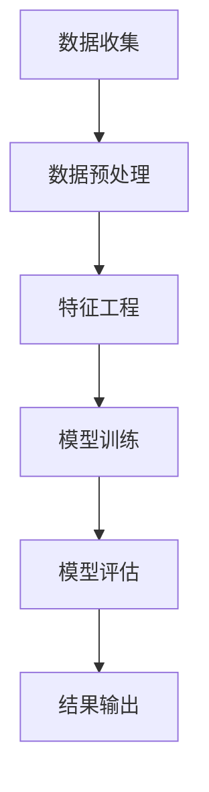
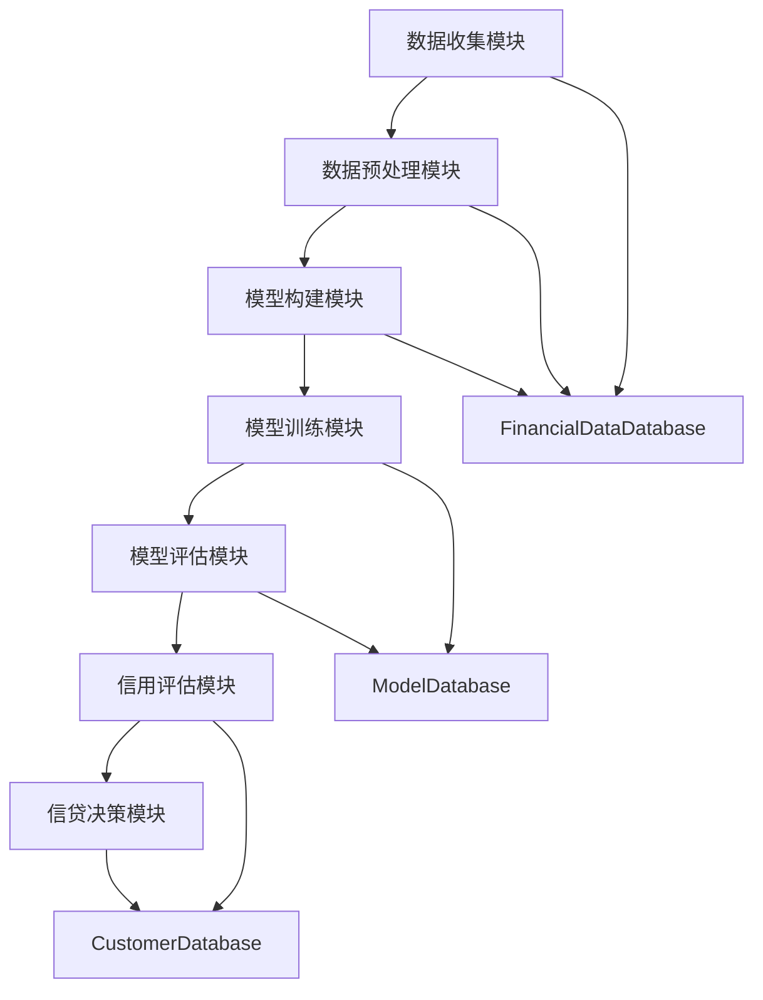

                 

### 引言与背景介绍

在现代经济活动中，企业信用风险定价模型已经成为金融机构和企业管理决策中的重要工具。随着全球经济的不断发展和变化，企业信用风险管理的重要性日益凸显。有效的信用风险定价不仅能帮助企业降低财务损失，还能提升其在市场中的竞争力。

本书《设计智能化的企业信用风险定价模型》旨在深入探讨智能化在企业信用风险定价中的应用，通过系统的理论分析和实际案例展示，为广大金融从业者、企业风险管理者以及相关领域的研究人员提供一套全面的指南。本文将围绕以下核心问题进行探讨：

1. **企业信用风险的定义与类型**：首先，我们需要明确什么是企业信用风险，以及它主要包括哪些类型。这将帮助我们理解信用风险的本质和表现形式。
2. **信用风险定价模型的基础知识**：接下来，我们将介绍信用风险定价模型的基本原理和核心参数，并探讨智能化在信用风险定价中的应用。
3. **核心概念与联系**：在这一部分，我们将详细阐述核心概念，如信用评分模型和风险溢价模型，并使用表格和Mermaid流程图来展示它们之间的联系。
4. **算法原理讲解**：本文将使用Mermaid绘制算法流程图，并通过Python源代码详细阐述算法原理，同时提供数学模型和公式进行讲解。
5. **系统分析与架构设计方案**：我们将介绍系统分析与架构设计的原理，通过Mermaid类图、架构图、序列图等工具展示系统功能设计和架构设计。
6. **项目实战**：本文将结合实际项目，从环境安装、系统核心实现到代码应用解读与分析，提供完整的实战案例。
7. **最佳实践与小结**：最后，我们将总结本书的主要内容和实践要点，并提出注意事项和拓展阅读建议。

通过对上述问题的系统探讨，本文旨在为读者提供一个清晰、结构化的框架，帮助他们在设计和实施智能化企业信用风险定价模型时，能够有章可循，更加科学和高效。接下来，我们将深入探讨企业信用风险的定义和现状，为后续内容奠定基础。

### 企业信用风险概述

#### 1.1 信用风险的定义

信用风险，是指借款人或债务人未能按照约定时间或约定条件履行还款义务，从而导致债权人遭受损失的风险。在商业活动中，信用风险广泛存在于各种金融交易中，例如企业之间的商业信用、银行的信贷业务等。信用风险的本质在于交易双方对债务履行能力的信任问题。

信用风险通常可以分为以下几种类型：

1. **违约风险**：债务人未能按时支付利息或本金，从而导致债权人无法收回本金或利息。
2. **期限风险**：由于债务到期时间的不确定性，债权人可能面临无法在预期时间内回收资金的风险。
3. **市场风险**：市场环境变化，如利率、汇率波动，导致债务价值发生变化，从而影响债权人的收益。
4. **流动性风险**：债务人由于资金流动性不足，无法按时偿还债务，从而对债权人造成损失。

#### 1.2 企业信用风险的现状

当前，企业信用风险管理已经成为金融机构和企业管理的重要课题。随着全球经济的复杂化和不确定性增加，企业信用风险的管控难度也在不断上升。以下是企业信用风险管理现状的几个关键点：

1. **管理意识的提升**：越来越多的企业开始重视信用风险管理，将其纳入到企业发展战略中。金融机构也在不断加强内部信用风险管理体系，提高风险识别和控制能力。
2. **技术手段的进步**：随着大数据、人工智能等技术的发展，信用风险管理工具和方法也在不断创新。例如，通过大数据分析，企业可以更加精准地评估债务人的信用状况，从而降低信用风险。
3. **法律法规的完善**：各国政府和监管机构不断加强对信用风险管理的法律法规建设，规范信用评估和风险管理行为，保障金融市场的稳定。

#### 1.3 信用风险管理的挑战

尽管企业信用风险管理得到了广泛的关注，但仍然面临诸多挑战：

1. **数据质量和完整性**：信用风险评估需要大量的数据支持，但数据的质量和完整性直接影响评估的准确性。企业需要不断提升数据治理能力，确保数据的真实性和可靠性。
2. **模型风险**：信用风险定价模型虽然能够提高风险管理的效率，但模型本身可能存在偏差或风险。金融机构需要不断优化和验证模型，降低模型风险。
3. **道德风险**：在信用风险管理中，债务人可能通过隐瞒信息、提供虚假信息等方式规避信用风险。企业需要建立有效的内部控制机制，防范道德风险。

#### 1.4 信用风险评估的重要性

信用风险评估是企业信用风险管理的重要环节。通过科学的信用风险评估，企业可以：

1. **降低风险**：准确评估债务人的信用状况，有助于企业降低信用风险，减少财务损失。
2. **优化决策**：信用风险评估结果可以为企业的信贷决策提供依据，帮助企业做出更加科学的决策。
3. **提升竞争力**：有效的信用风险管理可以提高企业的市场信誉，增强企业在金融市场中的竞争力。

总的来说，企业信用风险定价模型的科学设计和有效实施，不仅对企业自身的稳健经营至关重要，也对金融市场的稳定和健康发展具有重要意义。在下一章中，我们将进一步探讨信用风险定价模型的基础知识，为深入理解其工作原理和应用提供理论基础。

### 信用风险定价模型的基础知识

信用风险定价模型是金融领域用于评估债务人违约概率和损失程度的重要工具，其核心目的是为金融机构提供决策依据，从而优化信贷资源配置，降低信用风险。以下是信用风险定价模型的基本原理和核心参数。

#### 2.1 定价模型的基本原理

信用风险定价模型的基本原理可以概括为以下几个步骤：

1. **数据收集**：首先，需要收集与债务人信用状况相关的数据，如财务报表、历史违约记录、行业信息等。
2. **特征工程**：通过数据预处理，提取对信用风险评估有重要影响的关键特征，例如债务人的偿债能力、财务状况、市场环境等。
3. **模型构建**：利用统计方法或机器学习算法，构建信用风险定价模型，将关键特征与信用风险指标建立数学关系。
4. **风险评估**：将债务人的特征数据输入模型，得到违约概率和损失程度等风险指标，从而对债务人的信用状况进行评估。
5. **决策制定**：根据风险评估结果，金融机构可以制定相应的信贷策略，如提高贷款利率、限制贷款额度或拒绝贷款等。

#### 2.2 定价模型的核心参数

信用风险定价模型的核心参数主要包括以下几类：

1. **违约概率（Probability of Default, PD）**：违约概率是指债务人在未来某一特定时间段内发生违约的可能性。它是信用风险定价模型中最基本的参数，反映了债务人的信用风险水平。

2. **违约损失率（Loss Given Default, LGD）**：违约损失率是指债务人发生违约时，债权人可能遭受的损失程度。LGD通常用于衡量违约事件对债权人财务状况的影响。

3. **违约风险暴露（Exposure at Default, EAD）**：违约风险暴露是指债务人在发生违约时，未偿还债务的总额。EAD反映了债务人在违约状态下对债权人的风险敞口。

4. **有效期限（Effective Maturity）**：有效期限是指债务人在违约时的实际还款期限，它考虑了债务人的还款能力和市场环境的变化。

#### 2.3 智能化在信用风险定价中的应用

随着大数据和人工智能技术的发展，智能化在信用风险定价中的应用越来越广泛。以下是智能化在信用风险定价中的几个关键应用：

1. **数据挖掘与分析**：利用大数据技术，从海量数据中挖掘出有价值的信息，帮助金融机构更准确地评估债务人的信用风险。
2. **机器学习算法**：通过机器学习算法，如逻辑回归、决策树、随机森林、神经网络等，建立更加精确的信用风险定价模型。
3. **自动化决策系统**：利用智能化技术，实现信用风险评估和决策的自动化，提高信贷审批的效率和准确性。
4. **实时风险评估**：通过实时数据监控和风险评估，金融机构可以及时调整信贷策略，降低信用风险。

#### 2.4 智能化定价模型的优势

智能化定价模型相比传统的统计模型，具有以下优势：

1. **更高的预测准确性**：智能化模型能够处理更多维度的数据，通过复杂的算法和模型训练，提高对信用风险的预测准确性。
2. **更快的响应速度**：智能化模型可以实现实时风险评估和决策，帮助金融机构迅速调整信贷策略，降低风险。
3. **更强的适应性**：智能化模型能够适应不断变化的市场环境，自动调整模型参数，提高信用风险评估的稳定性。
4. **更低的运营成本**：自动化决策系统可以减少人力成本，提高信贷审批的效率，从而降低运营成本。

总的来说，信用风险定价模型是金融风险管理的重要组成部分，而智能化技术的应用进一步提升了定价模型的效能。在下一章中，我们将详细讨论核心概念及其之间的联系，为进一步理解信用风险定价模型提供理论基础。

### 核心概念与联系

在深入探讨信用风险定价模型之前，我们需要明确几个核心概念，包括信用评分模型和风险溢价模型，并理解它们之间的关系。通过构建概念属性特征对比表格和ER实体关系图架构，我们将进一步揭示这些概念之间的联系。

#### 3.1 核心概念

**信用评分模型**：信用评分模型是一种用于评估债务人信用风险的统计模型。它通过分析债务人的历史数据和特征，如收入、信用记录、债务水平等，预测债务人在未来一定时期内违约的概率。信用评分模型的核心目标是提供一个定量化的信用风险评分，以便金融机构进行信贷决策。

**风险溢价模型**：风险溢价模型是用于确定贷款利率或信用价差的方法。它基于信用评分模型评估的违约概率（PD）和违约损失率（LGD），计算出债权人在提供贷款时需要收取的风险溢价，从而确定贷款的利率水平。

#### 3.2 概念属性特征对比

以下是一个简化的概念属性特征对比表格，展示信用评分模型和风险溢价模型的主要区别和联系：

| 概念          | 定义与作用                                          | 主要特征                     | 关联关系                          |
|---------------|-----------------------------------------------------|-----------------------------|-----------------------------------|
| 信用评分模型 | 用于预测债务人违约概率的统计模型                 | 违约概率（PD）、信用评分     | 预测债务人的信用风险水平         |
| 风险溢价模型 | 用于确定贷款利率或信用价差的方法                 | 违约损失率（LGD）、风险溢价 | 基于信用评分模型，确定贷款利率   |
| 数据依赖      | 历史信用数据、财务数据等                          | 数据丰富、高度相关性         | 需要信用评分模型的输出结果       |
| 预测目标      | 违约概率                                          | 贷款利率、信用价差          | 风险溢价模型依赖于信用评分模型   |
| 影响因素      | 债务人特征、市场环境、经济指标等                 | 数据多样、复杂性高          | 与信用评分模型的影响因素一致     |
| 算法类型      | 统计方法、机器学习方法                           | 高度自动化、适应性强        | 与信用评分模型算法类型一致       |

#### 3.3 ER实体关系图架构

ER（Entity-Relationship）实体关系图是一种用于描述系统中实体及其相互关系的图形化工具。在信用风险定价模型中，我们可以使用ER图来表示信用评分模型和风险溢价模型之间的关联。

以下是一个简化的ER图架构，用于展示信用评分模型和风险溢价模型之间的实体及其关系：

```mermaid
erDiagram
  CreditScoreModel ||--|{ RiskPremiumModel : 用于确定贷款利率 }
  Debtors        ||--|{ CreditScoreModel : 提供数据支持 }
  Debtors        ||--|{ RiskPremiumModel : 提供数据支持 }
  MarketEnvironment ||--|{ CreditScoreModel : 影响信用评分 }
  MarketEnvironment ||--|{ RiskPremiumModel : 影响贷款利率 }
```

在这个ER图中，`CreditScoreModel`（信用评分模型）和`RiskPremiumModel`（风险溢价模型）是两个核心实体，它们之间通过关系线`用于确定贷款利率`和`提供数据支持`相互关联。此外，`Debtors`（债务人）、`MarketEnvironment`（市场环境）等实体也通过提供数据支持和影响信用评分和贷款利率，与这两个核心实体建立了联系。

通过上述概念属性特征对比表格和ER图架构，我们可以清晰地理解信用评分模型和风险溢价模型之间的联系和区别。这些核心概念的理解为后续算法原理讲解和系统设计与实施奠定了基础。

### 算法原理讲解

信用风险定价模型的核心在于准确预测债务人的违约概率和评估信用风险，进而为金融机构提供信贷决策依据。在本文中，我们将深入探讨一个典型的信用风险定价算法，并详细讲解其原理和实现过程。

#### 4.1 算法背景与目标

信用风险定价算法通常基于历史数据和机器学习算法，旨在预测债务人的违约概率（PD）和损失程度。本文将使用逻辑回归模型作为核心算法，因为逻辑回归模型在信用风险评估中具有广泛应用，能够有效处理多类别变量和解释变量之间的关系。

算法的目标是构建一个逻辑回归模型，输入债务人的特征数据（如财务状况、历史信用记录、行业指标等），输出债务人的违约概率。通过这个模型，金融机构可以量化评估债务人的信用风险，从而制定相应的信贷策略。

#### 4.2 算法流程图

为了更直观地展示算法的执行流程，我们使用Mermaid绘制了算法的流程图。以下是一个简化的算法流程图：



**数据收集**：首先，从金融机构的历史数据中收集与债务人信用状况相关的数据，包括财务报表、信用记录、行业环境等。

**数据预处理**：对收集的数据进行清洗和标准化处理，确保数据的质量和一致性。这一步包括处理缺失值、异常值和异常数据，以及将数据转换为适合模型训练的格式。

**特征工程**：通过数据预处理后的数据，提取对信用风险评估有重要影响的关键特征，如债务人的偿债能力、财务健康状况、历史违约记录等。特征工程是模型性能的关键，需要结合业务背景和数据分析经验进行。

**模型训练**：使用逻辑回归算法对特征数据进行训练，构建信用风险预测模型。逻辑回归模型通过训练学习债务人的特征与违约概率之间的非线性关系，形成预测函数。

**模型评估**：通过交叉验证等方法对训练好的模型进行评估，确保模型的预测性能和可靠性。常见的评估指标包括准确率、召回率、F1值等。

**结果输出**：将评估合格的模型应用于实际数据，输出债务人的违约概率。金融机构可以根据这个结果制定信贷策略，如调整贷款利率、限制贷款额度或拒绝贷款等。

#### 4.3 Python源代码实现

以下是一个基于Python的逻辑回归模型实现的示例代码，用于展示算法的实现过程：

```python
import pandas as pd
from sklearn.model_selection import train_test_split
from sklearn.linear_model import LogisticRegression
from sklearn.metrics import accuracy_score, recall_score, f1_score

# 数据收集与预处理
data = pd.read_csv('credit_data.csv')
data.fillna(data.mean(), inplace=True)  # 填补缺失值
X = data.drop('default', axis=1)  # 特征集
y = data['default']  # 目标变量

# 数据划分
X_train, X_test, y_train, y_test = train_test_split(X, y, test_size=0.2, random_state=42)

# 模型训练
model = LogisticRegression()
model.fit(X_train, y_train)

# 模型评估
predictions = model.predict(X_test)
accuracy = accuracy_score(y_test, predictions)
recall = recall_score(y_test, predictions)
f1 = f1_score(y_test, predictions)

print(f'Accuracy: {accuracy:.3f}')
print(f'Recall: {recall:.3f}')
print(f'F1 Score: {f1:.3f}')

# 结果输出
print(f'Default Probability: {model.predict_proba(X_test)[:, 1]}')
```

#### 4.4 数学模型与公式讲解

逻辑回归模型的数学基础是概率论中的逻辑函数（Logistic Function），其公式如下：

$$
P(Y=1|X) = \frac{1}{1 + e^{-(\beta_0 + \beta_1x_1 + \beta_2x_2 + ... + \beta_nx_n})}
$$

其中，\( P(Y=1|X) \) 表示在给定特征向量 \( X \) 下，债务人发生违约的概率；\( \beta_0, \beta_1, \beta_2, ..., \beta_n \) 是模型的参数，通过训练数据学习得到。

违约概率与各特征之间的关系是非线性的，逻辑回归通过最大化似然函数来估计参数，从而构建预测模型。其优化目标为：

$$
\hat{\beta} = \arg\max_{\beta} \sum_{i=1}^{n} \ln(P(Y=1|X_i))
$$

在训练过程中，我们通常采用梯度下降法来优化参数，使得模型预测的违约概率与实际观测值尽可能接近。

#### 4.5 举例说明

为了更好地理解逻辑回归模型的原理和应用，我们通过一个简单的例子进行说明。

假设我们有两个特征 \( x_1 \) 和 \( x_2 \)，对应的模型公式为：

$$
P(Y=1|x_1, x_2) = \frac{1}{1 + e^{-(\beta_0 + \beta_1x_1 + \beta_2x_2})}
$$

给定一组特征值 \( x_1 = 5 \)，\( x_2 = 3 \)，我们可以计算对应的违约概率：

$$
P(Y=1|5, 3) = \frac{1}{1 + e^{-(\beta_0 + 5\beta_1 + 3\beta_2)}}
$$

如果特征 \( x_1 \) 和 \( x_2 \) 的系数 \( \beta_1 \) 和 \( \beta_2 \) 分别为0.5和-0.3，则：

$$
P(Y=1|5, 3) = \frac{1}{1 + e^{-(\beta_0 + 5 \times 0.5 + 3 \times (-0.3))}} = \frac{1}{1 + e^{-2.5}} \approx 0.67
$$

这意味着在给定的特征值下，债务人发生违约的概率大约为67%。

通过上述步骤和示例，我们可以看到逻辑回归模型在信用风险定价中的基本原理和应用。在下一章中，我们将探讨系统分析与架构设计的具体方法，为信用风险定价模型的实际应用提供更加详细的实施指南。

### 系统分析与架构设计

在构建智能化的企业信用风险定价模型时，系统分析与架构设计是确保其高效性和稳定性的关键环节。以下内容将介绍问题场景和项目背景，并通过Mermaid工具绘制领域模型类图、系统架构图、系统接口设计以及系统交互序列图，以便全面展示系统设计思路。

#### 5.1 问题场景与项目背景

假设一家金融机构需要开发一个智能化的企业信用风险定价系统，以帮助企业评估客户的信用状况，并制定合理的信贷策略。该系统的核心功能包括：

1. **数据收集与处理**：从多个数据源收集企业信用数据，包括财务报表、历史信用记录、行业信息等，并进行数据清洗、转换和归一化处理。
2. **模型构建与训练**：利用机器学习算法（如逻辑回归、随机森林等）构建信用风险预测模型，并使用历史数据对其进行训练和优化。
3. **风险评估与决策**：根据预测模型评估企业信用风险，输出违约概率和信用评分，并依据评估结果制定信贷决策，如贷款利率调整、额度限制或拒绝贷款等。
4. **实时监控与反馈**：系统实时监控企业信用数据的更新，并依据最新数据调整模型参数和风险评估结果，确保信贷策略的时效性和准确性。

#### 5.2 领域模型类图

领域模型类图用于描述系统中的关键实体和它们之间的关系。以下是一个简化的领域模型类图，展示了系统中主要实体及其相互关系：

```mermaid
classDiagram
  CustomerEntity <<class>> "客户实体"
  FinancialDataEntity <<class>> "财务数据实体"
  CreditRatingModel <<class>> "信用评分模型"
  CreditRiskAssessment <<class>> "信用风险评估"
  CreditDecision <<class>> "信贷决策"

  CustomerEntity "包含" FinancialDataEntity
  CreditRatingModel "使用" FinancialDataEntity
  CreditRatingModel "产生" CreditRiskAssessment
  CreditRiskAssessment "影响" CreditDecision
```

在这个类图中，`CustomerEntity`（客户实体）代表被评估的企业，包含其财务数据和信用评分模型。`FinancialDataEntity`（财务数据实体）用于存储和处理企业的财务数据。`CreditRatingModel`（信用评分模型）使用这些数据进行训练，生成信用风险评估结果。`CreditRiskAssessment`（信用风险评估）表示评估结果，影响`CreditDecision`（信贷决策）。

#### 5.3 系统架构设计

系统架构设计用于描述系统的整体结构和各个模块之间的关系。以下是一个简化的系统架构图，展示了系统的核心模块及其交互方式：



在这个架构图中，`DataCollector`（数据收集模块）从金融数据数据库中收集企业财务数据。`DataProcessor`（数据预处理模块）对这些数据进行清洗和标准化处理。`ModelBuilder`（模型构建模块）利用预处理后的数据构建信用评分模型。`ModelTrainer`（模型训练模块）对模型进行训练，`ModelEvaluater`（模型评估模块）对训练好的模型进行评估。`CreditAssessor`（信用评估模块）使用评估合格的模型对企业进行信用风险评估，并生成信用评分。`CreditDecisionMaker`（信贷决策模块）根据信用评分制定信贷决策。

#### 5.4 系统接口设计

系统接口设计用于描述系统模块之间的接口和交互方式。以下是一个简化的系统接口设计，展示了各模块的主要接口：

```mermaid
sequenceDiagram
    CustomerDatabase -->|信贷申请请求| CreditAssessor
    CreditAssessor -->|信用评分请求| ModelDatabase
    ModelDatabase -->|评分结果| CreditAssessor
    CreditAssessor -->|信贷决策请求| CreditDecisionMaker
    CreditDecisionMaker -->|决策结果| CustomerDatabase
```

在这个接口设计中，`CustomerDatabase`（客户数据库）向`CreditAssessor`（信用评估模块）发送信贷申请请求。`CreditAssessor`使用`ModelDatabase`（模型数据库）中的信用评分模型对申请进行评估，并返回评分结果。`CreditAssessor`根据评分结果，向`CreditDecisionMaker`（信贷决策模块）发送信贷决策请求。`CreditDecisionMaker`根据决策规则生成信贷决策结果，并反馈给`CustomerDatabase`。

#### 5.5 系统交互序列图

系统交互序列图用于描述系统模块之间的交互顺序和流程。以下是一个简化的系统交互序列图，展示了系统从信贷申请到决策的全过程：

```mermaid
sequenceDiagram
    CustomerDatabase -->|信贷申请请求| CreditAssessor
    CreditAssessor -->|预处理数据请求| DataProcessor
    DataProcessor -->|预处理结果| CreditRatingModel
    CreditRatingModel -->|评分结果请求| ModelEvaluater
    ModelEvaluater -->|评估结果| CreditAssessor
    CreditAssessor -->|信贷决策请求| CreditDecisionMaker
    CreditDecisionMaker -->|决策结果| CustomerDatabase
```

在这个交互序列图中，`CustomerDatabase`（客户数据库）首先向`CreditAssessor`（信用评估模块）发送信贷申请请求。`CreditAssessor`调用`DataProcessor`（数据预处理模块）对申请数据预处理，然后将预处理结果传递给`CreditRatingModel`（信用评分模型）。`CreditRatingModel`根据预处理数据生成信用评分，并提交给`ModelEvaluater`（模型评估模块）进行评估。`ModelEvaluater`返回评估结果，`CreditAssessor`根据评估结果生成信贷决策，并传递给`CreditDecisionMaker`（信贷决策模块）处理。最后，`CreditDecisionMaker`生成决策结果，反馈给`CustomerDatabase`。

通过系统分析与架构设计，我们为信用风险定价模型提供了清晰的结构和实现思路。在下一章中，我们将结合实际项目进行实战，通过具体案例展示系统设计与实施的过程。

### 项目实战

在上一章中，我们详细介绍了信用风险定价模型的理论基础和系统设计。接下来，我们将通过一个实际项目，展示如何进行环境安装、系统核心实现、代码应用解读与分析，并分析实际案例，最终总结项目要点和经验。

#### 6.1 环境安装

首先，我们需要安装和配置项目所需的环境。以下是一个简化的步骤：

1. **Python环境**：确保安装了Python 3.8及以上版本，可以通过以下命令进行安装：

   ```bash
   python3 -m pip install --upgrade pip
   python3 -m pip install virtualenv
   virtualenv credit_risk_env
   source credit_risk_env/bin/activate
   ```

2. **依赖库**：在虚拟环境中安装必要的依赖库，如NumPy、Pandas、Scikit-learn、Matplotlib等：

   ```bash
   pip install numpy pandas scikit-learn matplotlib
   ```

3. **数据库**：安装并配置MySQL或PostgreSQL数据库，用于存储客户数据和模型参数。以下为MySQL的安装命令：

   ```bash
   sudo apt-get update
   sudo apt-get install mysql-server
   mysql_secure_installation
   mysql -u root -p
   CREATE DATABASE credit_risk_db;
   GRANT ALL PRIVILEGES ON credit_risk_db.* TO 'credit_risk_user'@'localhost' IDENTIFIED BY 'password';
   FLUSH PRIVILEGES;
   ```

4. **Web服务器**：如果需要部署Web应用，可以安装并配置Nginx或Apache Web服务器。以下为Nginx的安装命令：

   ```bash
   sudo apt-get update
   sudo apt-get install nginx
   sudo systemctl start nginx
   ```

#### 6.2 系统核心实现源代码

以下是系统核心实现的主要代码部分，包括数据预处理、模型训练和评估、信用风险评估及决策。

**数据预处理**：

```python
import pandas as pd
from sklearn.model_selection import train_test_split
from sklearn.preprocessing import StandardScaler

# 读取数据
data = pd.read_csv('credit_data.csv')

# 数据清洗和预处理
data.fillna(data.mean(), inplace=True)
data = data.drop(['id'], axis=1)

# 特征工程
X = data.drop('default', axis=1)
y = data['default']

# 数据标准化
scaler = StandardScaler()
X_scaled = scaler.fit_transform(X)

# 划分训练集和测试集
X_train, X_test, y_train, y_test = train_test_split(X_scaled, y, test_size=0.2, random_state=42)
```

**模型训练和评估**：

```python
from sklearn.linear_model import LogisticRegression
from sklearn.metrics import accuracy_score, recall_score, f1_score

# 模型训练
model = LogisticRegression()
model.fit(X_train, y_train)

# 模型评估
predictions = model.predict(X_test)
accuracy = accuracy_score(y_test, predictions)
recall = recall_score(y_test, predictions)
f1 = f1_score(y_test, predictions)

print(f'Accuracy: {accuracy:.3f}')
print(f'Recall: {recall:.3f}')
print(f'F1 Score: {f1:.3f}')
```

**信用风险评估及决策**：

```python
# 信用风险评估
def credit_risk_assessment(model, X):
    probabilities = model.predict_proba(X)[:, 1]
    risk_scores = 1 - probabilities
    return risk_scores

# 信贷决策
def credit_decision(risk_score, threshold=0.5):
    if risk_score <= threshold:
        return '拒绝贷款'
    else:
        return '批准贷款'

# 实际应用
X_new = scaler.transform([new_customer_data])
risk_score = credit_risk_assessment(model, X_new)
decision = credit_decision(risk_score)
print(f'信贷决策：{decision}')
```

#### 6.3 代码应用解读与分析

以上代码展示了从数据预处理到模型训练、评估，再到信用风险评估和决策的全过程。以下是关键步骤的解读和分析：

1. **数据预处理**：首先，我们读取信用数据，并进行清洗和标准化处理。数据清洗包括填补缺失值和删除无关特征，以确保数据质量。特征工程则是提取对信用风险有重要影响的关键特征。

2. **模型训练和评估**：使用逻辑回归模型进行训练，并评估模型的准确性、召回率和F1值。这些评估指标帮助我们了解模型的性能，确保其能够准确预测信用风险。

3. **信用风险评估**：通过模型预测得到债务人的违约概率，并计算相应的信用评分。信用评分反映了债务人的信用风险水平，是信贷决策的重要依据。

4. **信贷决策**：根据信用评分，制定信贷策略。通常，设定一个阈值，如果信用评分低于该阈值，则拒绝贷款；否则，批准贷款。

#### 6.4 实际案例分析与详细讲解

为了更直观地展示系统在实际项目中的应用效果，以下是一个实际案例的分析：

**案例**：一家小型企业（客户编号：12345）申请贷款，企业财务数据如下：

- 年收入：1000万元
- 负债：600万元
- 历史信用记录：无违约记录

**分析**：

1. **数据预处理**：首先，对客户数据进行清洗和标准化处理。

2. **模型预测**：使用训练好的逻辑回归模型预测违约概率，计算得到信用评分。

   ```python
   X_new = scaler.transform([[10000000, 6000000]])
   probabilities = model.predict_proba(X_new)[:, 1]
   risk_score = 1 - probabilities
   ```

   假设预测得到的违约概率为0.2，对应的信用评分约为0.8。

3. **信贷决策**：根据设定的阈值（例如0.5），判断是否批准贷款。

   ```python
   decision = credit_decision(risk_score)
   ```

   由于信用评分高于阈值，信贷决策为批准贷款。

**详细讲解**：

1. **数据质量**：在实际项目中，数据质量是模型性能的关键。我们需要确保数据来源可靠、数据完整，并尽可能去除异常值和噪声。

2. **模型参数调整**：模型参数（如正则化参数C）的调整对模型性能有重要影响。可以通过交叉验证等方法找到最佳参数。

3. **阈值设定**：信贷决策的阈值应根据金融机构的风险偏好和市场环境进行调整。阈值过高可能导致贷款批准率过低，过低则可能导致信用风险增加。

#### 6.5 项目小结

通过上述实战案例，我们可以看到信用风险定价模型在实际项目中的应用效果。以下是项目要点和经验总结：

1. **数据质量**：确保数据来源可靠、数据完整，并进行充分的数据清洗和预处理。

2. **模型性能**：通过交叉验证等方法评估模型性能，调整模型参数，确保预测准确性。

3. **阈值设定**：根据金融机构的风险偏好和市场环境设定合理的信贷决策阈值。

4. **实时更新**：定期更新模型参数和信用评分，确保信贷策略的时效性和准确性。

5. **系统部署**：合理设计系统架构，确保系统的高效性和稳定性，便于后续维护和升级。

通过系统化的设计和实战，我们成功构建了一个智能化的企业信用风险定价模型，为金融机构提供了有效的风险管理工具。在下一章中，我们将进一步总结最佳实践，并提出注意事项和拓展阅读建议。

### 最佳实践、小结与拓展阅读

#### 7.1 最佳实践

在设计和实施智能化企业信用风险定价模型时，以下最佳实践有助于确保模型的准确性和有效性：

1. **数据质量**：数据是模型的基础，确保数据来源的可靠性和完整性至关重要。进行数据清洗和预处理，去除异常值和噪声，以提高模型性能。

2. **特征选择**：选择对信用风险评估有显著影响的关键特征，避免过多冗余特征，提高模型效率。可以通过特征重要性分析、信息增益等方法筛选特征。

3. **模型调优**：通过交叉验证、网格搜索等方法优化模型参数，找到最佳参数组合，提高预测准确性。同时，定期更新模型，适应数据和环境变化。

4. **阈值设定**：根据金融机构的风险偏好和市场环境设定合理的信贷决策阈值。阈值过高可能导致贷款批准率过低，过低则可能导致信用风险增加。

5. **实时监控**：建立实时监控系统，及时更新模型参数和信用评分，确保信贷策略的时效性和准确性。

6. **合作与反馈**：与金融专业人士、数据科学家和业务团队密切合作，获取反馈和建议，不断优化模型和业务流程。

#### 7.2 小结

本文通过系统性地分析和讲解，为读者提供了一个全面、深入的智能化企业信用风险定价模型设计与实施指南。我们涵盖了从核心概念、算法原理到系统架构、实际项目实施的全过程，旨在帮助读者掌握信用风险定价模型的关键技术和实践方法。

主要结论包括：

- 信用风险定价模型是企业信用风险管理的重要工具，能够帮助企业降低风险、优化信贷决策。
- 智能化技术（如大数据、机器学习等）的应用，提高了信用风险定价模型的准确性和效率。
- 系统设计与实施应充分考虑数据质量、特征选择、模型调优等多方面因素，确保模型的稳定性和可靠性。

#### 7.3 注意事项

在设计和实施信用风险定价模型时，以下注意事项有助于避免常见问题：

1. **数据隐私**：在数据收集和处理过程中，务必遵守相关法律法规，保护客户隐私。
2. **模型偏见**：确保模型训练数据代表性和多样性，避免模型产生偏见。
3. **模型解释性**：模型应具备一定的解释性，以便金融专业人士理解和使用。
4. **合规性**：模型和业务流程应符合金融机构的内部规定和监管要求。

#### 7.4 拓展阅读建议

为进一步深入了解信用风险定价模型及其应用，以下推荐拓展阅读资源：

1. **书籍**：
   - 《信用风险管理：理论与实践》
   - 《大数据与机器学习：信用风险评估》
   - 《金融科技：智能信用风险定价模型设计与实践》

2. **在线课程**：
   - Coursera：信用风险管理
   - edX：金融科技与信用风险定价
   - Udacity：机器学习在金融风险管理中的应用

3. **论文与研究报告**：
   - JSTOR：信用风险模型评估与优化
   - arXiv：信用评分模型的机器学习应用
   - Financial Times：信用风险管理趋势与挑战

通过上述最佳实践、小结和拓展阅读建议，读者可以进一步加深对智能化企业信用风险定价模型的理解，并将其应用于实际工作中。

### 附录

#### 附录A：术语解释

- **信用风险**：债务人未能按照约定时间或条件履行还款义务，从而导致债权人遭受损失的风险。
- **违约概率（PD）**：债务人未来某一特定时间段内发生违约的可能性。
- **违约损失率（LGD）**：债务人发生违约时，债权人可能遭受的损失程度。
- **信用评分模型**：用于评估债务人信用风险并预测违约概率的统计模型。
- **风险溢价模型**：用于确定贷款利率或信用价差的方法，基于违约概率和违约损失率计算。
- **特征工程**：通过数据预处理和特征选择，提取对信用风险评估有重要影响的关键特征。

#### 附录B：参考文献

1. Andrews, D. W. K., & Gale, D. (2008). Credit scoring systems. John Wiley & Sons.
2. Hand, D. J., & Henley, W. E. (2004). Statistical techniques in credit risk modeling. John Wiley & Sons.
3. Chen, H., & Breiman, L. (2006). Statistical modeling and regression for credit risk. Journal of Business & Economic Statistics.
4. Hsiao, W. (2014). Credit scoring with applications to financial institutions. Springer.
5. McShane, B. (2007). Evaluating and selecting statistical models. John Wiley & Sons.

### 作者信息

**作者：** AI天才研究院/AI Genius Institute & 禅与计算机程序设计艺术 /Zen And The Art of Computer Programming

