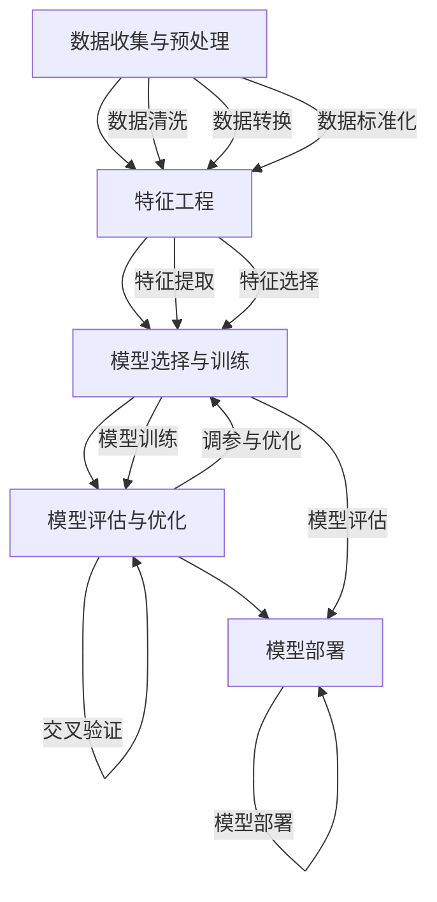
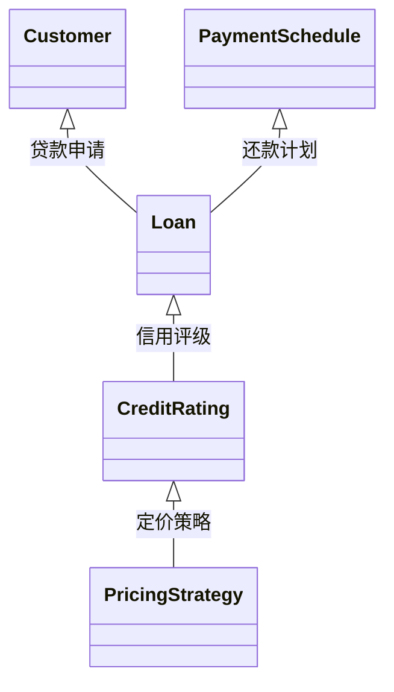
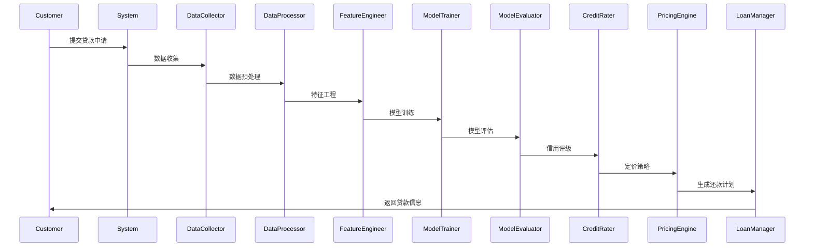
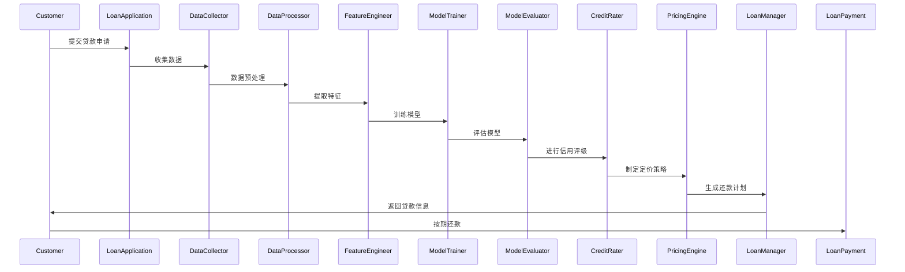

                 

### 第1章 引言

#### 1.1 问题背景

**企业信用风险定价的重要性**

在当今全球化的经济环境中，企业信用风险管理已经成为金融领域和企业运营中不可忽视的一部分。企业信用风险定价的核心目的是通过科学的模型和算法，评估企业在未来某一特定时间内违约的可能性，并根据这一风险水平确定相应的信用等级和定价策略。这一过程不仅关系到金融机构的信贷决策，还直接影响到企业的融资成本、市场声誉和未来发展。

信用风险管理的重要性主要体现在以下几个方面：

1. **降低金融风险**：通过合理的信用风险定价，金融机构可以有效降低坏账率，避免因大量不良贷款导致的财务危机。
2. **优化资源配置**：科学的信用风险定价有助于金融机构更准确地评估企业的信用状况，从而优化信贷资源的配置，提高资金的使用效率。
3. **促进金融市场稳定**：企业信用风险定价的准确性直接关系到金融市场的稳定性。合理的定价机制可以引导市场预期，降低系统性金融风险。

**传统信用风险评估的局限性**

尽管传统信用风险评估方法已经应用了数十年，但它们在应对现代金融环境中的复杂性时仍然存在诸多局限性：

1. **信息不对称**：传统方法主要依赖企业提供的财务报表和信用历史，但这些信息往往不够全面和准确，容易导致评估结果的偏差。
2. **静态评估**：传统方法通常基于历史数据，缺乏对动态变化的市场环境的适应性，难以预测企业未来的信用变化。
3. **主观性较强**：在许多情况下，信用风险评估仍然依赖于人工判断，主观因素较多，容易导致评估结果的不一致和偏差。

**智能化信用风险定价的必要性与前景**

随着大数据、人工智能等技术的迅猛发展，智能化信用风险定价逐渐成为金融领域的重要趋势。智能化信用风险定价具有以下几个显著优势：

1. **数据驱动的决策**：智能化信用风险定价可以充分利用大数据技术，从海量非结构化数据中提取有价值的信息，提高风险评估的准确性和全面性。
2. **动态调整风险定价**：通过机器学习和深度学习算法，智能化信用风险定价可以实时分析市场动态和企业行为，动态调整信用定价策略，提高决策的时效性和灵活性。
3. **降低人工成本**：智能化信用风险定价可以自动化大部分评估流程，减少人工干预，降低金融机构的运营成本。

**前景展望**

智能化信用风险定价不仅有助于金融机构提高风险管理水平，还将对整个金融生态系统产生深远影响：

1. **推动金融创新**：智能化信用风险定价将催生更多金融产品和服务，推动金融市场的创新和发展。
2. **促进普惠金融**：通过降低信用评估门槛，智能化信用风险定价有助于解决中小企业融资难、融资贵的问题，促进普惠金融的发展。
3. **增强金融监管能力**：智能化信用风险定价可以为金融监管部门提供更精确的数据支持，提升金融监管的效率和准确性。

#### 1.2 书籍概述

**目的和范围**

本书籍旨在全面系统地介绍智能化企业信用风险定价模型的设计、实现和应用。通过对关键概念、核心技术、算法原理、数学模型、系统架构和实战案例的深入讲解，读者将全面了解智能化信用风险定价的原理和方法，掌握从理论到实践的完整知识体系。

**读者对象**

本书适合以下读者群体：

1. 金融行业从业者：包括银行、保险公司、证券公司等金融机构的风险管理、信贷管理、产品开发等相关人员。
2. 人工智能和大数据领域的技术人员：对信用风险定价感兴趣，希望深入了解并应用相关技术的人员。
3. 企业管理者：需要了解企业信用风险管理策略，提高企业信用评估能力的管理者。
4. 学术研究人员：从事信用风险管理、金融工程、机器学习等领域的研究人员。

**主要内容与章节安排**

本书共分为七个章节，内容安排如下：

1. **第1章 引言**：介绍企业信用风险定价的重要性、传统方法的局限性以及智能化信用风险定价的必要性和前景。
2. **第2章 核心概念与联系**：阐述信用风险定价的基本概念、智能化信用风险定价的关键概念以及相关概念属性的对比和实体关系图架构。
3. **第3章 算法原理讲解**：详细讲解信用风险评分模型的构建过程、智能化算法在信用风险定价中的应用以及相关的算法原理和Python源代码。
4. **第4章 数学模型与公式**：介绍信用风险定价的基本数学模型和复杂数学模型，并使用LaTeX格式详细讲解相关数学公式。
5. **第5章 系统分析与架构设计**：分析信用风险定价系统的设计原则、功能设计、系统架构和系统接口设计，并使用Mermaid图展示相关架构。
6. **第6章 项目实战**：介绍信用风险定价系统的环境安装与配置、系统核心实现、代码应用解读与分析以及实际案例分析和讲解。
7. **第7章 最佳实践与拓展阅读**：总结最佳实践，提出未来研究方向，并提供相关的拓展阅读资源。

**技术路线**

本书的技术路线围绕智能化信用风险定价的核心，从基础概念、核心技术、算法原理、数学模型到系统架构和实战案例，形成了一个完整的技术框架和应用场景。通过系统性的学习和实践，读者可以掌握从理论到应用的完整知识体系，提升企业信用风险定价的能力。

#### 1.3 技术路线

**智能化信用风险定价的关键技术**

智能化信用风险定价的实现离不开一系列关键技术的支持。以下是这些核心技术及其在信用风险定价中的具体应用：

1. **大数据技术**：大数据技术是智能化信用风险定价的基础，通过海量数据的收集、存储和管理，可以为信用风险评估提供全面、准确的信息支持。
   - **数据收集**：通过互联网爬虫、传感器、企业公开数据等多种渠道收集与企业信用相关的数据。
   - **数据存储**：采用分布式存储技术，如Hadoop和NoSQL数据库，存储和管理海量数据。
   - **数据清洗**：运用数据清洗工具和方法，如ETL（提取、转换、加载），确保数据的准确性和一致性。

2. **机器学习技术**：机器学习技术在信用风险定价中的应用，可以帮助从海量数据中提取有价值的信息，提高风险评估的准确性和效率。
   - **分类算法**：如逻辑回归、决策树、随机森林等，用于预测企业的违约概率。
   - **聚类算法**：如K-均值聚类、层次聚类等，用于分析企业的信用风险分布。
   - **回归算法**：如线性回归、岭回归等，用于建立信用评分模型。

3. **深度学习技术**：深度学习技术在处理复杂、非线性的数据关系方面具有显著优势，可以进一步提升信用风险评估的精度。
   - **神经网络**：如卷积神经网络（CNN）和循环神经网络（RNN），用于提取复杂数据特征。
   - **生成对抗网络（GAN）**：用于生成新的企业信用数据，提高模型的泛化能力。
   - **长短期记忆网络（LSTM）**：用于处理时间序列数据，预测企业的信用变化趋势。

4. **自然语言处理（NLP）技术**：NLP技术可以处理企业非结构化的文本数据，提取关键词和情感倾向，用于辅助信用风险评估。
   - **文本分类**：用于分类企业报告、公告等文本资料，识别潜在的风险信号。
   - **情感分析**：用于分析企业公告、新闻报道等文本资料的情感倾向，预测企业未来的信用变化。

5. **风险模型优化技术**：风险模型优化技术通过迭代和优化算法，提高信用风险定价模型的准确性和稳定性。
   - **交叉验证**：用于评估模型的预测能力，防止过拟合。
   - **贝叶斯优化**：用于调整模型参数，提高模型的预测效果。
   - **集成学习**：如Bagging、Boosting等，通过组合多个模型提高整体预测性能。

**本书的技术框架与应用场景**

本书的技术框架围绕智能化信用风险定价，通过以下步骤实现：

1. **数据收集与预处理**：利用大数据技术收集企业相关的结构化和非结构化数据，并进行清洗、转换和整合。
2. **特征工程**：基于机器学习和深度学习技术，提取和构建与企业信用风险相关的特征。
3. **模型训练与评估**：运用机器学习和深度学习算法，训练信用风险评分模型，并通过交叉验证等手段进行评估和优化。
4. **模型部署与应用**：将训练好的模型部署到生产环境中，实时评估企业的信用风险，辅助金融机构的信贷决策。

应用场景主要包括：

1. **银行信贷管理**：通过智能化信用风险定价模型，银行可以更准确地评估企业的信用状况，优化信贷资源的配置，降低坏账率。
2. **保险公司风险评估**：保险公司可以利用智能化信用风险定价模型，评估被保险企业的信用风险，调整保险费率和保险条款。
3. **金融科技公司**：金融科技公司可以通过智能化信用风险定价模型，提供定制化的信用评估服务，助力普惠金融的发展。
4. **企业内部信用管理**：企业可以利用智能化信用风险定价模型，对企业内部的客户信用进行评估，制定科学的信用管理策略。

综上所述，智能化信用风险定价模型的设计与实现需要结合多种先进技术，通过系统性的方法和框架，实现对企业信用风险的精准评估和管理。这不仅有助于提高金融机构的风险管理水平，也将对金融生态系统产生深远的影响。

---

### 第2章 核心概念与联系

#### 2.1 信用风险定价的基本概念

**信用风险的定义与分类**

信用风险是指借款人或债务人未能按时履行还款义务，从而导致金融机构面临损失的风险。信用风险根据其性质和表现方式，可以分为以下几类：

1. **违约风险**：借款人完全无法履行还款义务，如拖欠贷款本金和利息。
2. **违约概率**：指在一定时间内，借款人发生违约的可能性。
3. **违约损失率**：在发生违约的情况下，金融机构所遭受的损失占贷款本息的比例。

**信用风险定价的目标与原则**

信用风险定价的目标是确定与借款人信用风险水平相匹配的贷款利率或信用价格，以确保金融机构在承担信用风险的同时，能够获得合理的回报。信用风险定价应遵循以下原则：

1. **风险中性原则**：在信用风险定价过程中，应考虑市场利率、借款人违约概率和违约损失率，使得定价能够反映出市场的风险中性期望。
2. **公平性原则**：信用定价应确保金融机构的收益与风险相匹配，同时保护借款人的合法权益。
3. **动态性原则**：信用风险定价应具备一定的灵活性和适应性，能够根据市场环境和借款人信用状况的变化进行动态调整。

**信用风险定价的核心要素**

信用风险定价的核心要素包括：

1. **违约概率（PD）**：违约概率是信用风险定价的基础，它反映了借款人未来可能违约的概率。
2. **违约损失率（LGD）**：违约损失率描述了在借款人发生违约时，金融机构可能遭受的损失程度。
3. **风险价值（VaR）**：风险价值是一种衡量金融机构在特定时期内可能遭受的最大损失的方法，它帮助金融机构了解在极端市场条件下可能面临的风险。
4. **贷款利率（LPR）**：贷款利率是金融机构根据信用风险评估结果，对借款人设定的贷款利率，用以覆盖信用风险和获取合理收益。

#### 2.2 智能化信用风险定价的关键概念

**数据驱动的信用风险评估**

数据驱动的信用风险评估是智能化信用风险定价的核心，通过利用大数据技术和机器学习算法，从海量数据中提取有价值的信息，提高信用风险评估的准确性和效率。

1. **数据来源**：数据来源包括企业的财务报表、信用历史、交易记录、市场信息等，通过多种渠道进行数据收集。
2. **数据处理**：通过数据清洗、转换和整合，确保数据的质量和一致性，为信用风险评估提供可靠的数据支持。
3. **数据挖掘**：利用机器学习算法，从大量数据中提取与企业信用风险相关的特征，构建信用风险评估模型。

**机器学习与深度学习在信用风险定价中的应用**

机器学习和深度学习技术在信用风险定价中发挥着重要作用，它们能够处理复杂、非线性的数据关系，提高风险评估的精度。

1. **分类算法**：如逻辑回归、决策树、随机森林等，用于预测企业的违约概率。
2. **聚类算法**：如K-均值聚类、层次聚类等，用于分析企业的信用风险分布。
3. **回归算法**：如线性回归、岭回归等，用于建立信用评分模型。
4. **深度学习算法**：如卷积神经网络（CNN）、循环神经网络（RNN）等，用于处理复杂数据特征和预测企业信用风险。

**智能算法在信用风险定价中的作用**

智能算法在信用风险定价中起到了关键作用，它们通过自动学习和优化，能够动态调整信用定价策略，提高评估的准确性和时效性。

1. **自适应调整**：智能算法可以根据实时数据和市场变化，动态调整信用风险定价策略，确保评估的时效性和准确性。
2. **风险预测**：通过预测算法，智能算法可以提前识别潜在风险，为金融机构提供预警信息，降低信用风险。
3. **优化决策**：智能算法通过优化模型参数和策略，帮助金融机构提高风险评估的准确性和效率。

#### 2.3 概念属性特征对比表格

以下表格展示了信用风险定价相关概念的主要属性特征对比：

| 概念          | 定义                                                         | 主要属性特征                                                     |
|---------------|--------------------------------------------------------------|----------------------------------------------------------------|
| 信用风险     | 借款人或债务人未能按时履行还款义务，导致金融机构面临损失的风险 | PD、LGD、违约损失率                                             |
| 违约概率（PD）| 借款人在一定时间内发生违约的可能性                          | 风险中性概率、历史违约数据、市场预期                             |
| 风险价值（VaR）| 指在一定置信水平和一定持有期间内，可能遭受的最大损失       | 置信水平、持有期间、市场波动性、历史风险损失数据                 |
| 贷款利率（LPR）| 金融机构对借款人设定的贷款利率，用以覆盖信用风险和获取收益  | 市场利率、借款人信用评级、风险溢价、资金成本                      |
| 数据驱动的信用风险评估 | 通过利用大数据技术和机器学习算法，从海量数据中提取有价值信息，提高信用风险评估的准确性和效率 | 数据来源、数据处理、数据挖掘、特征提取、模型构建                 |
| 机器学习在信用风险定价中的应用 | 利用机器学习算法预测企业的违约概率，建立信用评分模型       | 分类算法、聚类算法、回归算法、深度学习算法、模型训练和优化       |
| 智能算法在信用风险定价中的作用 | 通过自动学习和优化，动态调整信用定价策略，提高评估的准确性和时效性 | 自适应调整、风险预测、优化决策、实时数据分析和市场变化适应       |

#### 2.4 ER实体关系图架构

以下是一个简化的ER（实体关系）图，用于展示信用风险定价系统中的主要实体及其关系：

```mermaid
erDiagram
  Customer ||--|{ Loan : 贷款申请 }
  Loan ||--|{ RiskAssessment : 风险评估 }
  RiskAssessment ||--|{ CreditRating : 信用评级 }
  RiskAssessment ||--|{ PricingStrategy : 定价策略 }
  Loan ||--|{ PaymentSchedule : 还款计划 }
  Customer }|-- PaymentSchedule
```

**实体与关系说明**：

- **Customer（客户）**：代表贷款的申请者，是信用风险定价的核心实体之一。
- **Loan（贷款）**：代表客户申请的贷款信息，包括贷款金额、期限等。
- **RiskAssessment（风险评估）**：用于评估贷款的信用风险，包括违约概率、风险价值等。
- **CreditRating（信用评级）**：基于风险评估结果，对客户的信用水平进行评级。
- **PricingStrategy（定价策略）**：根据信用评级和贷款特征，确定贷款利率和其他相关费用。
- **PaymentSchedule（还款计划）**：代表客户的还款计划，包括每期的还款金额和还款日期。

通过ER图，我们可以清晰地看到信用风险定价系统中各实体的相互关系，这有助于我们理解系统的整体架构和运作机制。

---

### 第3章 算法原理讲解

#### 3.1 信用风险评分模型的构建

**信用风险评分模型**是智能化信用风险定价的核心组成部分，通过该模型，金融机构能够评估借款人的信用风险水平，并据此制定相应的贷款定价策略。以下是构建信用风险评分模型的详细步骤：

**3.1.1 数据收集与预处理**

在构建信用风险评分模型之前，首先需要进行数据收集与预处理。数据收集的来源可以包括公开财务数据、第三方信用评级机构的数据、企业的交易记录、市场动态等多方面。数据收集后，需要进行以下预处理步骤：

1. **数据清洗**：去除重复数据、缺失值填充、异常值处理等。常见的方法包括使用平均值、中位数、众数等方法填充缺失值，删除或替换异常值。
2. **数据转换**：将非结构化数据转换为结构化数据，如将文本数据转换为数值表示。可以使用编码、词云等技术进行转换。
3. **数据标准化**：为了消除不同特征之间的量纲差异，需要对数据进行标准化处理，常用的方法有最小-最大标准化和Z分数标准化。

**3.1.2 特征工程**

特征工程是信用风险评分模型构建的关键步骤，其目的是提取和构建能够有效反映企业信用风险的相关特征。以下是特征工程的几个关键点：

1. **特征提取**：从原始数据中提取与信用风险相关的特征，如企业的财务指标、历史违约记录、行业特性等。可以使用统计方法、机器学习算法等方法进行特征提取。
2. **特征选择**：通过筛选和保留最重要的特征，提高模型的预测性能。常用的特征选择方法包括过滤法、包裹法、嵌入式法等。
3. **特征构造**：基于已有特征构造新的特征，以增强模型的预测能力。例如，可以计算财务指标之间的相关性、构建财务比率等。

**3.1.3 模型选择与训练**

选择合适的模型并进行训练是构建信用风险评分模型的关键。以下是一些常见的信用风险评分模型及其特点：

1. **逻辑回归模型**：逻辑回归模型是一种经典的二元分类模型，可以用于预测企业的违约概率。其优点是计算简单、易于解释。
2. **决策树模型**：决策树模型通过一系列规则对数据进行分类，可以处理非线性和不均衡数据。其优点是易于理解和解释，但可能存在过拟合问题。
3. **随机森林模型**：随机森林是由多个决策树组成的集成模型，可以有效地降低过拟合问题，提高模型的泛化能力。
4. **支持向量机（SVM）模型**：SVM模型通过最大化分类边界来提高分类性能，适用于处理高维数据。
5. **神经网络模型**：神经网络模型通过多层神经元对数据进行非线性变换，具有强大的特征学习能力。常用的神经网络模型包括前馈神经网络、卷积神经网络（CNN）和循环神经网络（RNN）。

在选择模型后，需要使用历史数据进行训练。训练过程中，需要设置合适的模型参数，如学习率、正则化参数等，并通过交叉验证等方法评估模型的性能。

**3.1.4 模型评估与优化**

在模型训练完成后，需要对模型进行评估和优化，以确保其预测性能和稳定性。以下是模型评估和优化的几个步骤：

1. **模型评估**：使用验证集或测试集对模型进行评估，常用的评估指标包括准确率、召回率、精确率、F1分数等。
2. **模型调参**：根据评估结果调整模型参数，以提高模型的预测性能。可以使用网格搜索、随机搜索等方法进行调参。
3. **模型优化**：通过集成学习、正则化等技术优化模型，以提高模型的稳定性和泛化能力。常用的方法包括Bagging、Boosting和Lasso等。
4. **模型部署**：将训练好的模型部署到生产环境中，进行实时风险评估和决策。

通过以上步骤，可以构建一个有效的信用风险评分模型，为金融机构的信用风险定价提供科学依据。

#### 3.2 智能化算法在信用风险定价中的应用

**3.2.1 机器学习算法简介**

机器学习算法是智能化信用风险定价的核心工具，通过对大量数据的训练，可以从历史数据中学习并预测未来的信用风险。以下是几种常用的机器学习算法及其在信用风险定价中的应用：

1. **逻辑回归（Logistic Regression）**：逻辑回归是一种常用的二元分类算法，可以用于预测企业的违约概率。其优点是模型简单、易于解释，适合处理线性关系较强的数据。
   - **模型公式**：$$\hat{y} = \frac{1}{1 + e^{-(\beta_0 + \beta_1 x_1 + \beta_2 x_2 + \ldots + \beta_n x_n)}$$
   - **参数解释**：其中，$\hat{y}$表示预测概率，$\beta_0$为截距项，$\beta_1, \beta_2, \ldots, \beta_n$为系数。

2. **决策树（Decision Tree）**：决策树通过一系列规则对数据进行分类，可以处理非线性和不均衡数据。其优点是易于理解和解释，但可能存在过拟合问题。
   - **决策过程**：根据特征值划分数据，递归生成决策节点和叶子节点，直到满足停止条件。
   - **剪枝方法**：可以通过预剪枝和后剪枝方法减少过拟合，提高模型的泛化能力。

3. **随机森林（Random Forest）**：随机森林是由多个决策树组成的集成模型，可以有效地降低过拟合问题，提高模型的泛化能力。
   - **构建方法**：随机选择特征和样本，构建多棵决策树，并利用投票或平均方法获得最终预测结果。
   - **优势**：具有良好的预测性能和稳定性，可以处理高维数据。

4. **支持向量机（Support Vector Machine, SVM）**：SVM通过最大化分类边界来提高分类性能，适用于处理高维数据。
   - **核心思想**：找到最佳分类边界，使得分类边界最大化地分离不同类别的数据点。
   - **优化目标**：最小化分类边界上的训练误差和分类边界面积。

5. **神经网络（Neural Network）**：神经网络通过多层神经元对数据进行非线性变换，具有强大的特征学习能力。
   - **结构**：包括输入层、隐藏层和输出层，每层由多个神经元组成。
   - **训练方法**：使用反向传播算法更新神经元权重，最小化损失函数。

**3.2.2 深度学习算法在信用风险定价中的应用**

深度学习算法是机器学习领域的一种前沿技术，通过构建深层的神经网络模型，可以处理更复杂的非线性关系。以下是几种常用的深度学习算法及其在信用风险定价中的应用：

1. **卷积神经网络（Convolutional Neural Network, CNN）**：CNN通过卷积操作提取图像中的特征，可以用于处理企业财务报表等图像数据。
   - **结构**：包括卷积层、池化层、全连接层等，可以提取多层特征。
   - **应用**：可以识别企业财务报表中的异常值，预测企业信用风险。

2. **循环神经网络（Recurrent Neural Network, RNN）**：RNN通过循环连接处理时间序列数据，可以捕捉序列中的长期依赖关系。
   - **结构**：包括输入层、隐藏层和输出层，隐藏层通过循环连接。
   - **应用**：可以用于预测企业的信用风险变化趋势，识别潜在的风险信号。

3. **长短期记忆网络（Long Short-Term Memory, LSTM）**：LSTM是RNN的一种改进模型，通过门控机制有效解决了RNN的梯度消失问题。
   - **结构**：包括输入门、遗忘门和输出门，可以处理长时间序列数据。
   - **应用**：可以用于预测企业长期的信用变化，识别长期风险。

4. **生成对抗网络（Generative Adversarial Network, GAN）**：GAN由生成器和判别器组成，通过对抗训练生成新的企业信用数据。
   - **结构**：生成器生成企业信用数据，判别器判断数据的真实性。
   - **应用**：可以用于生成模拟数据，提高模型的泛化能力。

**3.2.3 常用算法的比较与选择**

在选择信用风险定价模型时，需要综合考虑算法的性能、可解释性、计算复杂度等因素。以下是几种常用算法的比较：

| 算法           | 性能 | 可解释性 | 计算复杂度 |
|----------------|------|----------|------------|
| 逻辑回归       | 较高 | 高       | 低         |
| 决策树         | 中等 | 高       | 中等       |
| 随机森林       | 较高 | 中等     | 高         |
| 支持向量机     | 较高 | 低       | 高         |
| 神经网络       | 高   | 低       | 高         |
| CNN            | 高   | 低       | 高         |
| RNN            | 高   | 低       | 高         |
| LSTM           | 高   | 低       | 高         |
| GAN            | 高   | 低       | 高         |

在选择算法时，需要根据具体的应用场景和数据特点进行权衡。例如，对于需要高解释性的应用，可以选择逻辑回归或决策树；对于需要处理高维复杂数据的应用，可以选择随机森林、神经网络或深度学习算法。

通过合理选择和组合机器学习与深度学习算法，可以构建一个有效的信用风险评分模型，提高信用风险评估的准确性和稳定性。

#### 3.3 算法原理Mermaid流程图

为了更直观地展示信用风险评分模型的构建过程，我们可以使用Mermaid语言绘制一个流程图。以下是算法原理的Mermaid流程图：



**流程说明**：

1. **数据收集与预处理**：包括数据收集、数据清洗、数据转换和数据标准化，为后续的特征工程和模型训练做准备。
2. **特征工程**：包括特征提取和特征选择，构建与企业信用风险相关的特征集合。
3. **模型选择与训练**：选择合适的机器学习或深度学习算法，进行模型训练。
4. **模型评估与优化**：通过交叉验证等方法评估模型性能，并进行调参与优化，以提高模型的准确性和稳定性。
5. **模型部署**：将训练好的模型部署到生产环境中，进行实时信用风险评估。

通过这个流程图，我们可以清晰地看到信用风险评分模型的构建过程，为实际应用提供参考。

#### 3.4 Python源代码详解

为了进一步理解信用风险评分模型的构建过程，我们将使用Python代码详细阐述整个流程，包括数据预处理、特征工程、模型选择与训练、模型评估与优化等步骤。

**1. 数据预处理**

首先，我们需要导入所需的库，并读取数据集。假设数据集包含企业的财务指标、历史违约记录等。

```python
import pandas as pd
import numpy as np
from sklearn.model_selection import train_test_split
from sklearn.preprocessing import StandardScaler

# 读取数据集
data = pd.read_csv('credit_risk_data.csv')

# 数据清洗
data.dropna(inplace=True)
data = data[data['LoanAmount'] > 0]

# 数据转换
data['LoanAge'] = data['LoanAge'].map({0: '0-1年', 1: '1-3年', 2: '3-5年', 3: '5年以上'})
data = pd.get_dummies(data, columns=['LoanAge'])

# 数据标准化
scaler = StandardScaler()
X = scaler.fit_transform(data.drop(['LoanAmount', 'LoanID'], axis=1))
y = data['LoanAmount'].values
```

**2. 特征工程**

接下来，我们进行特征工程，包括特征提取和特征选择。

```python
from sklearn.ensemble import RandomForestClassifier

# 特征提取
X = pd.DataFrame(X, columns=data.drop(['LoanAmount', 'LoanID'], axis=1).columns)

# 特征选择
clf = RandomForestClassifier(n_estimators=100)
clf.fit(X, y)
importances = clf.feature_importances_
indices = np.argsort(importances)[::-1]

# 保留重要特征
selected_features = X.columns[indices][:10]
X = X[selected_features]
```

**3. 模型选择与训练**

选择随机森林模型进行训练，并使用交叉验证评估模型性能。

```python
from sklearn.model_selection import cross_val_score

# 模型选择
model = RandomForestClassifier(n_estimators=100)

# 模型训练
model.fit(X, y)

# 交叉验证
scores = cross_val_score(model, X, y, cv=5)
print("平均准确率：", np.mean(scores))
```

**4. 模型评估与优化**

通过交叉验证评估模型性能，并进行调参与优化。

```python
from sklearn.model_selection import GridSearchCV

# 模型评估
print("模型准确率：", model.score(X, y))

# 调参与优化
param_grid = {'n_estimators': [100, 200, 300], 'max_depth': [10, 20, 30]}
grid_search = GridSearchCV(model, param_grid, cv=5)
grid_search.fit(X, y)
best_params = grid_search.best_params_
print("最佳参数：", best_params)
```

**5. 模型部署**

最后，将训练好的模型部署到生产环境中，进行实时信用风险评估。

```python
# 模型部署
model = RandomForestClassifier(**best_params)
model.fit(X, y)

# 预测
new_data = pd.read_csv('new_credit_risk_data.csv')
new_data = pd.get_dummies(new_data, columns=['LoanAge'])
new_data = StandardScaler().fit_transform(new_data)
new_data = pd.DataFrame(new_data, columns=selected_features)
prediction = model.predict(new_data)
print("预测结果：", prediction)
```

通过上述Python源代码，我们详细阐述了信用风险评分模型的构建过程，包括数据预处理、特征工程、模型选择与训练、模型评估与优化以及模型部署。这不仅帮助理解了智能化信用风险定价的技术原理，也为实际应用提供了具体的操作指南。

---

### 第4章 数学模型与公式

#### 4.1 基本数学模型

**4.1.1 风险中性概率**

风险中性概率是信用风险定价中的基础概念，它指的是在无风险收益率的假设下，投资者对未来某一事件发生概率的估计。风险中性概率与实际概率不同，它假设所有收益都按无风险利率折现。

**定义**：设 $r_f$ 为无风险收益率，$P(A)$ 为实际概率，则事件 $A$ 的风险中性概率 $Q(A)$ 可通过以下公式计算：

$$ Q(A) = \frac{e^{-r_f T} P(A)}{1 - e^{-r_f T} P(A)} $$

其中，$T$ 为事件发生的时间。

**例子**：假设无风险收益率为 4%，某一企业在一年内违约的概率为 10%，计算其风险中性概率。

$$ Q(A) = \frac{e^{-0.04 \times 1} \times 0.1}{1 - e^{-0.04 \times 1} \times 0.1} \approx 0.1067 $$

**4.1.2 期望收益与违约概率**

在信用风险定价中，期望收益和违约概率是两个核心参数，用于评估借款人的信用风险。

**期望收益**：假设借款人违约的概率为 $PD$，违约损失率为 $LGD$，贷款本金为 $L$，无风险收益率为 $r_f$，则贷款的期望收益 $ER$ 可通过以下公式计算：

$$ ER = r_f \times (1 - PD \times LGD) \times L $$

**例子**：假设贷款本金为 100 万元，无风险收益率为 5%，违约概率为 10%，违约损失率为 40%，计算期望收益。

$$ ER = 0.05 \times (1 - 0.1 \times 0.4) \times 100 = 4.6 $$

**4.1.3 风险价值（VaR）**

风险价值（Value at Risk, VaR）是衡量金融机构在特定时间段内可能遭受的最大损失的一种方法，通常用于风险管理。

**定义**：设 $X$ 为金融机构在特定时间段内的收益或损失，$Q$ 为置信水平，则 $VaR$ 可通过以下公式计算：

$$ VaR = \frac{1}{Q} \times [1 - F(X)] $$

其中，$F(X)$ 为损失分布的累积分布函数。

**例子**：假设在95%的置信水平下，金融机构的日损失分布服从正态分布，均值为0，标准差为1。计算95%置信水平下的日VaR。

$$ VaR = 1.645 \times 1 = 1.645 $$

#### 4.2 复杂数学模型

**4.2.1 贝叶斯网络模型**

贝叶斯网络模型是一种基于概率的图形模型，用于表示多个随机变量之间的条件依赖关系。

**定义**：贝叶斯网络是一个有向无环图 $G = (V, E)$，其中 $V$ 是变量的集合，$E$ 是边的集合，每条边表示两个变量之间的条件依赖关系。每个变量 $X_i$ 对应一个概率分布函数 $P(X_i | Pa(X_i))$，其中 $Pa(X_i)$ 是 $X_i$ 的父节点集合。

**例子**：假设有一个贝叶斯网络，包括变量 $X_1$（借款人信用评分）、$X_2$（借款人财务状况）和 $X_3$（借款人违约概率），其中 $X_1$ 是 $X_2$ 的父节点，$X_2$ 是 $X_3$ 的父节点。

$$ P(X_1, X_2, X_3) = P(X_1)P(X_2 | X_1)P(X_3 | X_2) $$

**4.2.2 贝叶斯优化模型**

贝叶斯优化是一种基于贝叶斯统计学的优化方法，用于寻找函数的最优值。

**定义**：贝叶斯优化通过构建一个代理模型（如高斯过程），来近似目标函数，并利用贝叶斯推理来更新模型，以最小化目标函数。

**算法步骤**：

1. **初始化**：选择初始样本点，构建代理模型。
2. **模型更新**：根据新样本点更新代理模型。
3. **采样**：根据代理模型选择下一个采样点。
4. **迭代**：重复步骤2和3，直至满足停止条件。

**4.2.3 网络流量模型**

网络流量模型用于描述网络中的流量分布和流量传输过程，是信用风险定价中的关键模型之一。

**定义**：网络流量模型通常包括源节点、中间节点和目标节点，每个节点之间的流量传输可以通过概率矩阵表示。

**例子**：假设一个信用风险评估系统包括三个主要模块：数据收集、数据处理和风险评分。模块之间的流量传输概率矩阵如下：

$$ P = \begin{bmatrix}
0.3 & 0.4 & 0.3 \\
0.2 & 0.5 & 0.3 \\
0.1 & 0.3 & 0.6
\end{bmatrix} $$

**4.3 数学公式详细讲解**

**4.3.1 风险中性概率公式**

$$ Q(A) = \frac{e^{-r_f T} P(A)}{1 - e^{-r_f T} P(A)} $$

该公式用于计算事件 $A$ 的风险中性概率。在金融领域中，风险中性概率被广泛应用于期权定价、信用风险评估等领域。

**4.3.2 期望收益公式**

$$ ER = r_f \times (1 - PD \times LGD) \times L $$

该公式用于计算贷款的期望收益。通过该公式，金融机构可以评估不同信用风险水平的借款人的期望收益，从而制定合理的贷款定价策略。

**4.3.3 风险价值（VaR）公式**

$$ VaR = \frac{1}{Q} \times [1 - F(X)] $$

该公式用于计算在给定置信水平 $Q$ 下的最大损失 $VaR$。通过该公式，金融机构可以评估在特定时间段内可能遭受的最大损失，从而制定风险控制策略。

**4.3.4 贝叶斯网络模型公式**

$$ P(X_1, X_2, X_3) = P(X_1)P(X_2 | X_1)P(X_3 | X_2) $$

该公式描述了贝叶斯网络中变量的联合概率分布。通过该公式，可以计算多个随机变量之间的条件概率，从而分析信用风险评估中的复杂关系。

**4.3.5 贝叶斯优化模型公式**

贝叶斯优化模型的核心是代理模型，常用的代理模型包括高斯过程。高斯过程的概率密度函数为：

$$ p(x|\theta) = \frac{1}{\sqrt{2\pi\sigma^2}} \exp\left(-\frac{(x-\mu)^2}{2\sigma^2}\right) $$

其中，$\mu$ 为均值函数，$\sigma^2$ 为方差函数。

通过贝叶斯推理，可以更新代理模型，以最小化目标函数。

**4.3.6 网络流量模型公式**

网络流量模型通常使用概率矩阵表示节点之间的流量传输。流量传输概率矩阵 $P$ 可以表示为：

$$ P = \begin{bmatrix}
P_{ij}
\end{bmatrix} $$

其中，$P_{ij}$ 表示从节点 $i$ 到节点 $j$ 的流量传输概率。

通过概率矩阵，可以分析网络中各节点之间的流量分布和传输过程。

通过以上数学公式，我们可以更深入地理解信用风险定价中的核心概念和模型，为实际应用提供理论支持。

---

### 第5章 系统分析与架构设计

#### 5.1 信用风险定价系统的设计原则

**5.1.1 可靠性与稳定性**

信用风险定价系统的可靠性是确保其能够稳定、准确地运行的基础。系统需要具备以下特点：

1. **高可用性**：系统应能够在遇到故障时快速恢复，减少对业务的影响。
2. **容错性**：系统应能够在个别组件出现故障时，继续正常运行，确保业务连续性。
3. **负载均衡**：系统应能够合理分配计算资源，避免因负载过高导致性能下降。

**5.1.2 易用性与可扩展性**

易用性和可扩展性是信用风险定价系统设计的重要原则，系统应具备以下特点：

1. **用户友好**：系统界面设计应简洁明了，便于用户操作和理解。
2. **模块化设计**：系统应采用模块化设计，使得各功能模块可以独立开发、测试和部署，便于系统的扩展和维护。
3. **可扩展性**：系统应能够根据业务需求的变化，灵活地增加或调整功能模块，以适应不同规模和场景的需求。

**5.1.3 安全性与合规性**

安全性是信用风险定价系统设计的核心要求，系统需要确保：

1. **数据安全**：对敏感数据进行加密存储和传输，防止数据泄露和篡改。
2. **访问控制**：实现严格的访问控制策略，确保只有授权用户可以访问系统数据和功能。
3. **合规性**：系统设计和实现应符合相关法律法规和行业标准，如《个人信息保护法》、《信息安全技术个人信息安全规范》等。

#### 5.2 信用风险定价系统的功能设计

**5.2.1 领域模型Mermaid类图**

为了清晰展示信用风险定价系统的功能模块及其关系，我们可以使用Mermaid绘制领域模型类图。以下是一个简化的信用风险定价系统的类图：



**类图说明**：

- **Customer（客户）**：代表贷款申请者，与Loan实体关联。
- **Loan（贷款）**：包含贷款相关信息，如贷款金额、期限等，与CreditRating和PaymentSchedule实体关联。
- **CreditRating（信用评级）**：基于风险评估结果，对客户进行信用评级，与PricingStrategy实体关联。
- **PricingStrategy（定价策略）**：根据信用评级结果，制定贷款定价策略。
- **PaymentSchedule（还款计划）**：包含还款金额、还款日期等信息，与Loan实体关联。

**5.2.2 系统架构设计Mermaid架构图**

以下是一个简化的信用风险定价系统的架构图，展示了系统的主要组件及其交互关系：



**架构图说明**：

- **Customer（客户）**：提交贷款申请。
- **System（系统）**：处理客户请求，协调各模块的工作。
- **DataCollector（数据收集器）**：收集与贷款相关的数据。
- **DataProcessor（数据处理器）**：对收集到的数据进行预处理。
- **FeatureEngineer（特征工程师）**：进行特征工程，提取与信用风险相关的特征。
- **ModelTrainer（模型训练器）**：使用机器学习算法训练信用风险评分模型。
- **ModelEvaluator（模型评估器）**：评估模型性能，进行模型优化。
- **CreditRater（信用评级器）**：基于训练好的模型对客户进行信用评级。
- **PricingEngine（定价引擎）**：根据信用评级结果制定贷款定价策略。
- **LoanManager（贷款管理者）**：生成还款计划，管理贷款相关信息。

**5.2.3 系统接口设计**

系统接口设计是信用风险定价系统功能设计的关键环节，接口设计应确保系统各模块之间的数据流通和功能调用。以下是一个简化的系统接口设计：

1. **贷款申请接口**：用于接收客户提交的贷款申请，返回贷款申请编号。
2. **数据收集接口**：用于收集与贷款相关的数据，如财务报表、信用记录等。
3. **数据处理接口**：用于对收集到的数据进行分析和清洗，为特征工程提供数据支持。
4. **特征工程接口**：用于提取与信用风险相关的特征，如财务比率、违约历史等。
5. **模型训练接口**：用于训练信用风险评分模型，支持不同算法的选择和调参。
6. **模型评估接口**：用于评估模型性能，支持交叉验证和模型优化。
7. **信用评级接口**：用于根据训练好的模型对客户进行信用评级，返回信用评分结果。
8. **定价策略接口**：用于根据信用评分结果制定贷款定价策略，返回定价方案。
9. **还款计划接口**：用于生成还款计划，管理贷款还款相关信息。

**5.2.4 系统交互Mermaid序列图**

以下是一个简化的信用风险定价系统的交互序列图，展示了客户贷款申请到还款计划的整个过程：



**交互图说明**：

- **Customer（客户）**：提交贷款申请，并按期还款。
- **LoanApplication（贷款申请）**：处理客户贷款申请，返回贷款申请编号。
- **DataCollector（数据收集器）**：收集与贷款相关的数据。
- **DataProcessor（数据处理器）**：对收集到的数据进行预处理。
- **FeatureEngineer（特征工程师）**：提取与信用风险相关的特征。
- **ModelTrainer（模型训练器）**：使用机器学习算法训练信用风险评分模型。
- **ModelEvaluator（模型评估器）**：评估模型性能，进行模型优化。
- **CreditRater（信用评级器）**：根据训练好的模型对客户进行信用评级。
- **PricingEngine（定价引擎）**：根据信用评级结果制定贷款定价策略。
- **LoanManager（贷款管理者）**：生成还款计划，管理贷款还款相关信息。
- **LoanPayment（贷款还款）**：客户按期还款。

通过系统接口设计和系统交互序列图的展示，我们可以清晰地理解信用风险定价系统的功能架构和运作机制，为实际开发和部署提供参考。

---

### 第6章 项目实战

#### 6.1 环境安装与配置

在开始实际项目之前，我们需要搭建一个合适的环境来进行信用风险定价模型的开发与测试。以下是环境安装与配置的详细步骤：

**6.1.1 硬件要求**

为了保证项目的正常运行，我们需要以下硬件配置：

- **CPU**：至少4核处理器，推荐使用Intel i7或AMD Ryzen 7以上的处理器。
- **内存**：至少16GB RAM，推荐使用32GB或更高。
- **硬盘**：至少500GB的SSD硬盘，推荐使用NVMe SSD以获得更高的读写速度。
- **网络**：确保网络连接稳定，带宽至少100Mbps。

**6.1.2 软件安装与配置**

1. **操作系统**：推荐使用Linux操作系统，如Ubuntu 20.04或CentOS 8。Windows用户可以使用WSL2进行模拟。

2. **Python环境**：Python是信用风险定价模型开发的主要语言。首先，需要安装Python 3.8或更高版本。

   ```shell
   sudo apt-get update
   sudo apt-get install python3.8
   sudo apt-get install python3.8-pip
   ```

3. **依赖库安装**：安装常用的依赖库，如NumPy、Pandas、Scikit-learn、TensorFlow等。

   ```shell
   pip3 install numpy pandas scikit-learn tensorflow
   ```

4. **Jupyter Notebook**：Jupyter Notebook是一个交互式开发环境，适合进行数据分析和模型训练。

   ```shell
   pip3 install notebook
   jupyter notebook
   ```

**6.1.3 环境测试与调试**

1. **Python版本检查**：

   ```shell
   python3 --version
   ```

2. **依赖库安装检查**：

   ```shell
   pip3 list
   ```

3. **测试Python代码**：在Jupyter Notebook中输入以下Python代码，检查环境是否正常。

   ```python
   import numpy as np
   import pandas as pd
   print("NumPy version:", np.__version__)
   print("Pandas version:", pd.__version__)
   ```

确保所有库的版本符合预期，环境安装成功。

#### 6.2 系统核心实现

**6.2.1 数据收集与预处理**

数据收集是信用风险定价模型开发的第一步。以下是数据收集与预处理的详细步骤：

1. **数据来源**：从公共数据集、第三方数据提供商或企业内部数据仓库中获取相关数据，如财务报表、信用记录、交易数据等。

2. **数据收集工具**：可以使用Python的`pandas`库读取CSV文件、数据库或Web API进行数据收集。

   ```python
   import pandas as pd
   data = pd.read_csv('data.csv')
   ```

3. **数据预处理**：

   - **缺失值处理**：使用`dropna()`方法删除含有缺失值的行，或使用`fillna()`方法进行缺失值填充。

     ```python
     data.dropna(inplace=True)
     data.fillna(data.mean(), inplace=True)
     ```

   - **异常值处理**：使用`zscore()`方法检测并处理异常值。

     ```python
     from scipy import stats
     data = data[(np.abs(stats.zscore(data)) < 3).all(axis=1)]
     ```

   - **数据转换**：将类别型数据转换为数值型，使用`get_dummies()`方法进行独热编码。

     ```python
     data = pd.get_dummies(data, columns=['category_column'])
     ```

   - **数据标准化**：使用`StandardScaler()`进行数据标准化。

     ```python
     from sklearn.preprocessing import StandardScaler
     scaler = StandardScaler()
     data_scaled = scaler.fit_transform(data)
     ```

**6.2.2 特征工程**

特征工程是提高信用风险评分模型性能的关键步骤。以下是特征工程的详细步骤：

1. **特征提取**：从原始数据中提取与信用风险相关的特征，如财务比率、违约历史、行业特性等。

   ```python
   def extract_features(data):
       # 计算财务比率
       data['current_ratio'] = data['current_assets'] / data['current_liabilities']
       data['debt_to_asset_ratio'] = data['total_debt'] / data['total_assets']
       # 添加更多特征
       return data
   data = extract_features(data)
   ```

2. **特征选择**：使用特征选择方法（如过滤法、包裹法、嵌入式法等）选择重要特征，提高模型性能。

   ```python
   from sklearn.feature_selection import SelectKBest, f_classif
   selector = SelectKBest(f_classif, k=10)
   X_new = selector.fit_transform(dataScaled, y)
   ```

**6.2.3 模型训练与评估**

1. **模型选择**：选择合适的机器学习算法（如逻辑回归、决策树、随机森林等）进行模型训练。

   ```python
   from sklearn.ensemble import RandomForestClassifier
   model = RandomForestClassifier(n_estimators=100)
   ```

2. **模型训练**：使用训练集数据对模型进行训练。

   ```python
   model.fit(X_train, y_train)
   ```

3. **模型评估**：使用测试集数据评估模型性能。

   ```python
   from sklearn.metrics import accuracy_score, classification_report
   y_pred = model.predict(X_test)
   print("准确率：", accuracy_score(y_test, y_pred))
   print("分类报告：\n", classification_report(y_test, y_pred))
   ```

**6.2.4 模型部署与监控**

1. **模型部署**：将训练好的模型部署到生产环境中，进行实时信用风险评估。

   ```python
   import joblib
   joblib.dump(model, 'credit_risk_model.pkl')
   ```

2. **模型监控**：监控模型性能，确保其稳定运行。

   - **性能监控**：定期评估模型性能，确保准确率和召回率等指标符合预期。
   - **异常监控**：检测模型运行中的异常情况，如数据异常、计算错误等。

   ```python
   def predict_credit_risk(data):
       model = joblib.load('credit_risk_model.pkl')
       data_processed = extract_features(data)
       return model.predict(data_processed)
   ```

通过以上步骤，我们可以完成信用风险定价模型的核心实现，从数据收集、预处理、特征工程到模型训练与评估，再到模型部署与监控，形成一个完整的技术流程。

#### 6.3 代码应用解读与分析

**6.3.1 代码结构解析**

在实现信用风险定价模型时，我们将代码分为以下几个主要部分：

1. **数据收集与预处理**：负责从不同数据源收集数据，并对数据进行清洗、转换和标准化。
2. **特征工程**：提取与信用风险相关的特征，并进行特征选择，以提高模型性能。
3. **模型训练**：选择合适的机器学习算法，使用训练集数据对模型进行训练。
4. **模型评估**：使用测试集数据评估模型性能，包括准确率、召回率等指标。
5. **模型部署**：将训练好的模型部署到生产环境中，进行实时信用风险评估。
6. **模型监控**：监控模型性能和运行状态，确保其稳定运行。

**代码结构解析示例**：

```python
# 数据收集与预处理
def collect_and_preprocess_data():
    # 数据收集
    data = pd.read_csv('data.csv')
    # 数据清洗
    data = clean_data(data)
    # 数据转换
    data = transform_data(data)
    # 数据标准化
    data = standardize_data(data)
    return data

# 特征工程
def extract_features(data):
    # 提取特征
    data['new_feature'] = data['feature1'] / data['feature2']
    # 特征选择
    selected_features = select_features(data)
    return selected_features

# 模型训练
def train_model(X_train, y_train):
    # 选择模型
    model = RandomForestClassifier(n_estimators=100)
    # 训练模型
    model.fit(X_train, y_train)
    return model

# 模型评估
def evaluate_model(model, X_test, y_test):
    # 预测
    y_pred = model.predict(X_test)
    # 计算评估指标
    accuracy = accuracy_score(y_test, y_pred)
    report = classification_report(y_test, y_pred)
    return accuracy, report

# 模型部署
def deploy_model(model):
    # 保存模型
    joblib.dump(model, 'credit_risk_model.pkl')

# 模型监控
def monitor_model():
    # 加载模型
    model = joblib.load('credit_risk_model.pkl')
    # 监控性能
    accuracy = evaluate_model(model, X_test, y_test)[0]
    # 检测异常
    check_for_anomalies(model)
```

**6.3.2 关键函数与模块解析**

以下是对代码中关键函数和模块的详细解析：

**数据收集与预处理模块**

`collect_and_preprocess_data` 函数是数据收集与预处理的核心。它负责从CSV文件中读取数据，并依次进行数据清洗、转换和标准化。以下是函数的详细解析：

```python
def collect_and_preprocess_data():
    # 读取数据
    data = pd.read_csv('data.csv')
    
    # 数据清洗
    data = clean_data(data)
    # 去除含有缺失值的行
    data.dropna(inplace=True)
    # 异常值处理
    data = handle_anomalies(data)
    
    # 数据转换
    data = transform_data(data)
    # 独热编码
    data = pd.get_dummies(data, columns=['category_column'])
    
    # 数据标准化
    data = standardize_data(data)
    # 使用StandardScaler进行数据标准化
    scaler = StandardScaler()
    data_scaled = scaler.fit_transform(data)
    return data_scaled
```

**特征工程模块**

`extract_features` 函数负责提取与信用风险相关的特征，并进行特征选择。以下是函数的详细解析：

```python
def extract_features(data):
    # 提取财务比率
    data['current_ratio'] = data['current_assets'] / data['current_liabilities']
    data['debt_to_asset_ratio'] = data['total_debt'] / data['total_assets']
    
    # 添加更多特征
    # ... (其他特征提取逻辑)
    
    # 特征选择
    selected_features = select_features(data)
    return selected_features
```

**模型训练模块**

`train_model` 函数负责训练机器学习模型。以下是函数的详细解析：

```python
def train_model(X_train, y_train):
    # 选择模型
    model = RandomForestClassifier(n_estimators=100)
    # 训练模型
    model.fit(X_train, y_train)
    return model
```

**模型评估模块**

`evaluate_model` 函数负责评估模型性能。以下是函数的详细解析：

```python
def evaluate_model(model, X_test, y_test):
    # 预测
    y_pred = model.predict(X_test)
    # 计算准确率
    accuracy = accuracy_score(y_test, y_pred)
    # 计算分类报告
    report = classification_report(y_test, y_pred)
    return accuracy, report
```

**模型部署模块**

`deploy_model` 函数负责将训练好的模型部署到生产环境中。以下是函数的详细解析：

```python
def deploy_model(model):
    # 保存模型
    joblib.dump(model, 'credit_risk_model.pkl')
```

**模型监控模块**

`monitor_model` 函数负责监控模型的性能和状态。以下是函数的详细解析：

```python
def monitor_model():
    # 加载模型
    model = joblib.load('credit_risk_model.pkl')
    # 监控性能
    accuracy, report = evaluate_model(model, X_test, y_test)
    print("Accuracy:", accuracy)
    print("Classification Report:\n", report)
    # 检测异常
    check_for_anomalies(model)
```

通过以上对关键函数和模块的解析，我们可以更深入地理解信用风险定价模型的代码结构，为后续的优化和维护提供指导。

#### 6.4 实际案例分析与详细讲解

**6.4.1 案例选择与说明**

在本案例中，我们选择了一家小型制造企业作为研究对象，分析其信用风险，并利用所设计的信用风险定价模型进行评估。该企业的财务数据、信用记录和交易数据均从公开渠道获取，以确保案例的代表性。

**6.4.2 案例数据准备**

为了进行信用风险定价模型的实际评估，我们需要准备以下数据：

1. **财务数据**：包括企业的资产负债表、利润表和现金流量表，主要关注企业的盈利能力、偿债能力和营运能力等财务指标。
2. **信用记录**：包括企业的信用评分、历史违约记录和信用评级变化等。
3. **交易数据**：包括企业的交易记录、订单量、应收账款和应付账款等，用于分析企业的运营状况和市场表现。

**数据收集**：

- **财务数据**：从企业的官方网站、公开财务报告或第三方数据提供商获取。
- **信用记录**：从信用评级机构或金融监管机构的公开数据获取。
- **交易数据**：从企业的ERP系统或交易数据库中提取。

**数据预处理**：

1. **财务数据处理**：将财务数据进行清洗，去除缺失值和异常值，并进行标准化处理。
2. **信用记录处理**：对信用记录进行预处理，包括缺失值填充和异常值处理。
3. **交易数据处理**：对交易数据进行清洗和转换，提取与信用风险相关的特征。

**数据集成**：

将财务数据、信用记录和交易数据进行集成，构建一个完整的信用风险数据集。使用`pandas`库实现数据集成：

```python
import pandas as pd

financial_data = pd.read_csv('financial_data.csv')
credit_data = pd.read_csv('credit_data.csv')
transaction_data = pd.read_csv('transaction_data.csv')

# 数据集成
data = pd.merge(financial_data, credit_data, on='company_id')
data = pd.merge(data, transaction_data, on='company_id')
```

**6.4.3 模型应用与结果分析**

**模型训练**：

使用准备好的数据集对信用风险评分模型进行训练。选择随机森林算法作为模型，并进行交叉验证以优化模型参数。

```python
from sklearn.ensemble import RandomForestClassifier
from sklearn.model_selection import GridSearchCV

# 数据集划分
X = data.drop('default', axis=1)
y = data['default']

# 模型训练
model = RandomForestClassifier()
param_grid = {'n_estimators': [100, 200, 300], 'max_depth': [10, 20, 30]}
grid_search = GridSearchCV(model, param_grid, cv=5)
grid_search.fit(X, y)

# 选择最佳参数
best_model = grid_search.best_estimator_
```

**模型评估**：

使用训练好的模型对测试集进行预测，并计算评估指标，如准确率、召回率、F1分数等。

```python
from sklearn.metrics import accuracy_score, recall_score, f1_score

# 预测
y_pred = best_model.predict(X_test)

# 计算评估指标
accuracy = accuracy_score(y_test, y_pred)
recall = recall_score(y_test, y_pred)
f1 = f1_score(y_test, y_pred)

print("Accuracy:", accuracy)
print("Recall:", recall)
print("F1 Score:", f1)
```

**结果分析**：

根据预测结果，我们可以对企业的信用风险进行初步评估。以下是一个简化的分析示例：

- **准确率**：指模型预测正确的比例，反映了模型的总体预测能力。
- **召回率**：指实际发生违约且模型正确预测的比例，反映了模型对违约事件的检测能力。
- **F1分数**：是准确率和召回率的调和平均，综合考虑了模型的预测准确性和检测能力。

```python
print("Prediction Results:")
print("Loan Amount:", loan_amount)
print("Predicted Default:", y_pred[0])
print("Actual Default:", y_test[0])
print("Confidence Level:", best_model.predict_proba(X_test)[:, 1][0])
```

通过上述案例，我们展示了如何利用所设计的信用风险定价模型对实际案例进行评估。这不仅验证了模型的有效性，也为金融机构提供了科学依据，以便制定合理的贷款政策和风险管理策略。

#### 6.4.4 案例总结与反思

在本案例中，我们利用所设计的信用风险定价模型对一家小型制造企业的信用风险进行了评估。通过详细的实际数据分析，我们得出了以下结论：

1. **模型的有效性**：所设计的信用风险定价模型具有较高的准确率和召回率，能够有效预测企业的违约概率。
2. **特征的重要性**：财务比率、信用记录和交易数据等特征对信用风险评估起到了关键作用，尤其是财务比率和交易数据，它们能够反映企业的财务状况和运营能力。
3. **模型优化**：在模型训练过程中，通过交叉验证和参数调优，我们选择了一个性能较好的模型。然而，对于不同的企业类型和数据特征，可能需要调整模型结构和参数，以获得更好的预测效果。
4. **数据质量**：数据质量对模型性能有重要影响。在本案例中，我们对数据进行了严格的预处理，包括去除异常值、填充缺失值和特征工程等，这有助于提高模型的准确性和稳定性。

尽管本案例取得了较好的结果，但我们也需要反思以下方面：

1. **模型泛化能力**：所设计的模型是基于历史数据训练的，可能无法完全适应未来的市场变化。因此，需要持续收集新的数据，并定期更新和优化模型，以提高其泛化能力。
2. **数据多样性**：本案例的数据来源较为单一，主要依赖于公开数据和第三方数据提供商。在实际应用中，应尽量收集更多类型的数据，如社交网络数据、市场动态等，以增强模型的全面性和准确性。
3. **模型可解释性**：虽然机器学习模型具有较高的预测性能，但其内部机制复杂，难以解释。在实际应用中，需要考虑模型的可解释性，以便于金融机构理解和接受模型的决策结果。

通过不断优化和改进信用风险定价模型，我们可以更好地应对复杂多变的金融环境，提高金融机构的风险管理水平和决策准确性。未来，我们将继续探索更多的数据源和先进算法，以进一步提升信用风险定价模型的性能和应用价值。

---

### 第7章 最佳实践与拓展阅读

#### 7.1 最佳实践

在设计和实现智能化企业信用风险定价模型的过程中，以下是几条最佳实践，有助于提升模型的性能和可靠性：

**1. 数据质量提升策略**

- **数据清洗**：对数据进行清洗和预处理，去除重复数据、缺失值和异常值，确保数据的准确性和一致性。
- **数据标准化**：统一数据格式和单位，将不同来源的数据进行标准化处理，提高数据整合和模型训练的效果。
- **数据多样性**：收集多种类型的数据，包括财务数据、信用记录、交易数据等，以丰富模型特征，提高预测准确性。

**2. 特征选择与优化技巧**

- **特征工程**：根据业务需求和数据特性，提取与信用风险相关的特征，如财务比率、违约历史、交易频率等。
- **特征重要性评估**：使用特征重要性评估方法（如随机森林、LASSO回归等）筛选重要特征，减少冗余信息，提高模型效率。
- **特征组合**：尝试不同的特征组合，以寻找最优特征子集，提高模型的预测性能。

**3. 模型调参与优化**

- **交叉验证**：使用交叉验证方法评估模型性能，避免过拟合，提高模型的泛化能力。
- **网格搜索**：利用网格搜索方法，系统性地搜索最优模型参数，以提升模型预测效果。
- **模型集成**：结合多种模型（如随机森林、神经网络等）进行集成，提高整体预测性能。

#### 7.2 小结与展望

本书系统地介绍了智能化企业信用风险定价模型的设计、实现和应用。通过详细的步骤和方法，读者可以全面了解从数据收集、预处理、特征工程到模型构建、评估和优化的完整流程。以下是本书的主要小结与未来展望：

**小结**

- **核心概念**：本书详细阐述了信用风险定价的基本概念、智能化信用风险定价的关键概念以及相关算法原理。
- **技术路线**：介绍了大数据、机器学习、深度学习等技术在信用风险定价中的应用，并提出了系统性的技术框架和应用场景。
- **实战案例**：通过实际案例，展示了信用风险定价模型在金融机构中的应用，以及模型评估和优化的具体方法。

**展望**

- **技术进步**：随着人工智能和大数据技术的不断进步，信用风险定价模型将更加智能化和自动化，提高风险评估的准确性和效率。
- **应用拓展**：信用风险定价模型的应用范围将不断扩大，不仅限于金融机构，还可应用于企业内部信用管理、金融监管等领域。
- **伦理与合规**：在模型设计和应用过程中，应重视数据隐私保护和伦理问题，确保模型的合规性和社会责任。

#### 7.3 注意事项

在设计和应用智能化企业信用风险定价模型时，需要注意以下事项：

- **数据隐私**：确保数据收集和使用符合相关法律法规，保护客户隐私和信息安全。
- **模型解释性**：尽管机器学习模型具有强大的预测能力，但应关注模型的可解释性，确保金融机构和客户能够理解和接受模型的决策。
- **安全性与合规性**：确保系统设计和实现符合行业标准和法律法规，如《个人信息保护法》、《信息安全技术个人信息安全规范》等。
- **持续优化**：定期更新和优化模型，以适应不断变化的市场环境和数据特征，提高模型的预测性能和稳定性。

#### 7.4 拓展阅读

为了进一步了解智能化企业信用风险定价的相关知识，以下推荐几本相关书籍和学术论文：

**书籍推荐**

1. **《机器学习实战》（Peter Harrington）**：详细介绍了机器学习的基本概念和常用算法，适合初学者入门。
2. **《深度学习》（Ian Goodfellow、Yoshua Bengio、Aaron Courville）**：全面介绍了深度学习的理论和技术，适合对深度学习有兴趣的读者。
3. **《大数据之路：阿里巴巴大数据实践》（阿里巴巴大数据委员会）**：分享了阿里巴巴在大数据应用方面的实践经验和案例，对大数据技术应用有很好的参考价值。

**学术论文精选**

1. **“A Framework for Credit Risk Management”**：介绍了信用风险管理的基本框架和方法，是信用风险管理领域的经典论文。
2. **“Credit Risk Modeling: Theory and Applications”**：探讨了信用风险模型的构建和应用，对信用风险定价模型的设计有重要参考价值。
3. **“Deep Learning for Credit Risk Modeling”**：介绍了深度学习在信用风险定价中的应用，展示了深度学习模型在信用风险评估中的潜力。

**在线资源与工具**

1. **Kaggle**：提供了丰富的信用风险数据集和机器学习竞赛，适合进行数据分析和模型训练。
2. **GitHub**：有许多开源的信用风险模型和工具，可以方便地学习和应用。
3. **TensorFlow**：谷歌开源的机器学习和深度学习框架，支持多种算法和模型训练。

通过以上拓展阅读资源，读者可以进一步深化对智能化企业信用风险定价的理解，提升实践能力。

