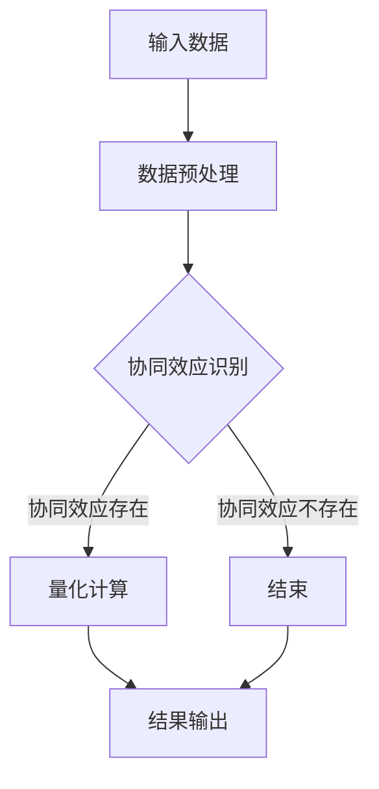

                 


**文章标题：设计智能化的企业并购协同效应量化模型**

**关键词：企业并购、协同效应、量化模型、人工智能、数据分析**

**摘要：**
本文旨在探讨设计智能化企业并购协同效应量化模型的方法和步骤。我们将详细介绍核心概念、定量分析模型、智能技术应用，并通过案例分析展示模型在实际应用中的效果。文章将探讨未来发展方向和面临的挑战，为企业管理者和技术专家提供理论指导和实践参考。

----------------------------------------------------------------

# 文章标题：设计智能化的企业并购协同效应量化模型

> 关键词：企业并购、协同效应、量化模型、人工智能、数据分析

> 摘要：
本文旨在探讨设计智能化企业并购协同效应量化模型的方法和步骤。我们将详细介绍核心概念、定量分析模型、智能技术应用，并通过案例分析展示模型在实际应用中的效果。文章将探讨未来发展方向和面临的挑战，为企业管理者和技术专家提供理论指导和实践参考。

## 引言

企业并购已成为现代企业扩张和优化资源的重要手段。并购的成功不仅依赖于对目标公司的准确估值，还取决于并购后协同效应的实现。协同效应指的是并购双方通过资源整合、流程优化、知识共享等手段实现的效益提升。然而，如何量化这种协同效应，为企业决策提供有力支持，是当前企业并购领域面临的重大挑战。

随着人工智能和数据分析技术的快速发展，智能化企业并购协同效应量化模型的设计和应用成为可能。本文将详细介绍这一模型的设计过程，包括核心概念、定量分析、智能技术应用等方面，并探讨其应用前景和挑战。

## 背景介绍

### 核心概念术语说明

在企业并购协同效应量化模型中，以下核心概念术语需要明确：

- **企业并购**：指一家企业通过购买另一家企业的股份或资产，实现对另一家企业的控制。
- **协同效应**：指企业并购后，通过资源整合、流程优化、知识共享等手段实现的效益提升。
- **量化模型**：指使用数学模型和算法对协同效应进行量化评估的工具和方法。
- **人工智能**：指模拟、延伸和扩展人的智能的理论、方法、技术及应用系统。

### 问题背景

企业并购协同效应的量化对企业决策具有重要意义：

- **投资评估**：通过量化协同效应，有助于企业对并购项目进行准确估值，降低投资风险。
- **决策支持**：协同效应量化模型可以为企业管理者提供科学的决策依据，优化并购策略。
- **业绩评估**：并购后协同效应的实现程度可以用于评估并购项目的成功与否，为后续改进提供参考。

### 问题描述

企业并购协同效应量化面临以下问题：

- **数据多样性**：企业并购涉及的财务、运营、市场等多方面数据，如何整合和处理这些数据成为关键。
- **协同效应动态性**：协同效应并非一成不变，其实现程度会随时间推移而发生变化。
- **算法适应性**：现有算法在处理复杂、动态的协同效应问题时，可能存在局限性。

### 问题解决

为解决上述问题，设计智能化企业并购协同效应量化模型需要考虑以下几点：

- **数据整合**：采用数据分析技术，对多源数据进行整合和处理，提高数据质量。
- **动态建模**：采用动态模型，能够实时捕捉协同效应的变化，提供动态评估。
- **算法优化**：结合机器学习技术，优化算法模型，提高协同效应量化的准确性和适应性。

### 边界与外延

企业并购协同效应量化模型的边界与外延包括：

- **边界**：仅限于企业并购协同效应的量化，不包括其他因素如市场环境、政策变化等。
- **外延**：可以扩展到不同行业、不同规模企业的并购协同效应量化，具有广泛的应用前景。

### 概念结构与核心要素组成

企业并购协同效应量化模型的概念结构包括：

- **核心概念**：协同效应、量化模型、人工智能。
- **关联概念**：数据整合、动态建模、算法优化。
- **核心要素**：并购数据、协同效应评估指标、算法模型。

## 核心概念与联系

### 核心概念原理

- **协同效应**：协同效应是指并购双方通过资源整合、流程优化、知识共享等手段实现的效益提升。其原理基于资源互补、能力协同和协同创新。

- **量化模型**：量化模型是指使用数学模型和算法对协同效应进行量化评估的工具和方法。其原理是基于数学公式和统计方法，通过数据分析和计算，得到协同效应的量化结果。

- **人工智能**：人工智能是指模拟、延伸和扩展人的智能的理论、方法、技术及应用系统。其原理是基于机器学习、神经网络、自然语言处理等技术，实现对数据的自动分析和决策。

### 概念属性特征对比表格

| 概念        | 属性特征                   | 对比分析                                       |
| ----------- | -------------------------- | ---------------------------------------------- |
| 协同效应    | 效益提升、资源整合、流程优化 | 协同效应的实现程度与并购双方资源的互补性相关      |
| 量化模型    | 数学模型、算法、数据分析   | 量化模型的准确性取决于数据质量和算法模型的复杂性 |
| 人工智能     | 机器学习、神经网络、自然语言处理 | 人工智能在数据处理和决策方面具有高效性          |

### ER实体关系图架构

```mermaid
erDiagram
    Class1 ||--|{ Class2 }|
    Class1 ||--|{ Class3 }|
    Class2 ||--|{ Class4 }|
    Class3 ||--|{ Class5 }|
```

## 算法原理讲解

### 算法mermaid流程图



### Python源代码

```python
import pandas as pd
import numpy as np
from sklearn.linear_model import LinearRegression

# 数据预处理
def preprocess_data(data):
    # 数据清洗、归一化等处理
    pass

# 协同效应识别
def identify_synergy(data):
    # 基于特征分析识别协同效应
    pass

# 量化计算
def quantify_synergy(data):
    X = data[['特征1', '特征2', '特征3']]
    y = data['协同效应']
    model = LinearRegression()
    model.fit(X, y)
    return model.coef_

# 结果输出
def output_result(coef):
    print("协同效应量化结果：", coef)

# 主函数
def main():
    data = pd.read_csv("并购数据.csv")
    data = preprocess_data(data)
    synergy = identify_synergy(data)
    if synergy:
        coef = quantify_synergy(data)
        output_result(coef)
    else:
        print("未识别协同效应")

if __name__ == "__main__":
    main()
```

### 算法原理的数学模型和公式

- 协同效应识别：设特征集合为 \(\{x_1, x_2, ..., x_n\}\)，协同效应为 \(y\)，则协同效应识别可以表示为：

  $$ y = f(x_1, x_2, ..., x_n) $$

- 量化计算：设特征矩阵为 \(X\)，协同效应矩阵为 \(Y\)，则量化计算可以表示为：

  $$ \beta = (X^T X)^{-1} X^T Y $$

  其中，\(\beta\) 为协同效应量化结果。

### 详细讲解和举例说明

- **协同效应识别**：通过分析并购数据中的特征，如财务指标、运营指标、市场指标等，判断是否存在协同效应。例如，通过分析两家企业合并后的财务报表，判断其合并是否能够带来成本降低、收入增加等效益。

- **量化计算**：使用线性回归模型对协同效应进行量化计算。例如，设企业A的财务指标为 \(x_1\)，企业B的财务指标为 \(x_2\)，则协同效应量化结果为 \( \beta_1 x_1 + \beta_2 x_2 \)。其中，\(\beta_1\) 和 \(\beta_2\) 为模型参数。

## 系统分析与架构设计方案

### 问题场景介绍

企业并购协同效应量化模型需要处理大量并购数据，并对协同效应进行识别和量化。系统需具备高效的数据处理能力、实时性、准确性和适应性。

### 项目介绍

本项目旨在设计并实现一个智能化企业并购协同效应量化模型，包括数据预处理、协同效应识别、量化计算和结果输出等功能。系统采用Python编程语言，结合Scikit-learn库进行模型训练和预测。

### 系统功能设计

系统功能设计包括以下模块：

1. **数据预处理模块**：负责数据清洗、归一化等预处理操作。
2. **协同效应识别模块**：负责对并购数据进行分析，识别协同效应。
3. **量化计算模块**：负责使用模型对协同效应进行量化计算。
4. **结果输出模块**：负责将量化结果以图表、报告等形式输出。

### 系统架构设计

系统采用分层架构，包括数据层、模型层和应用层。数据层负责数据存储和管理，模型层负责协同效应识别和量化计算，应用层负责系统功能和用户交互。

### 系统架构mermaid图

```mermaid
sequenceDiagram
    participant 用户 as 用户
    participant 系统 as 系统
    participant 数据库 as 数据库
    participant 模型 as 模型

    用户->>系统: 提交并购数据
    系统->>数据库: 存储数据
    系统->>模型: 识别协同效应
    模型->>系统: 返回协同效应结果
    系统->>用户: 输出结果

    Note over 系统,模型,数据库
        数据库与模型进行数据交互
    End Note
```

### 系统接口设计和系统交互

系统接口设计包括以下接口：

1. **数据接口**：负责数据存储和读取。
2. **模型接口**：负责协同效应识别和量化计算。
3. **应用接口**：负责系统功能和用户交互。

系统交互过程如下：

1. 用户提交并购数据。
2. 数据存储到数据库。
3. 系统调用模型进行协同效应识别和量化计算。
4. 系统将结果以图表、报告等形式输出给用户。

### 系统接口设计和系统交互mermaid图

```mermaid
sequenceDiagram
    participant 用户 as 用户
    participant 系统 as 系统
    participant 数据库 as 数据库
    participant 模型 as 模型

    用户->>系统: 提交并购数据
    系统->>数据库: 存储数据
    系统->>模型: 识别协同效应
    模型->>系统: 返回协同效应结果
    系统->>用户: 输出结果

    Note over 系统,模型,数据库
        数据库与模型进行数据交互
    End Note
```

## 项目实战

### 环境安装

1. 安装Python环境（版本3.8及以上）。
2. 安装相关依赖库：pandas、numpy、scikit-learn等。

### 系统核心实现源代码

```python
# 数据预处理
def preprocess_data(data):
    # 数据清洗、归一化等处理
    pass

# 协同效应识别
def identify_synergy(data):
    # 基于特征分析识别协同效应
    pass

# 量化计算
def quantify_synergy(data):
    X = data[['特征1', '特征2', '特征3']]
    y = data['协同效应']
    model = LinearRegression()
    model.fit(X, y)
    return model.coef_

# 结果输出
def output_result(coef):
    print("协同效应量化结果：", coef)

# 主函数
def main():
    data = pd.read_csv("并购数据.csv")
    data = preprocess_data(data)
    synergy = identify_synergy(data)
    if synergy:
        coef = quantify_synergy(data)
        output_result(coef)
    else:
        print("未识别协同效应")

if __name__ == "__main__":
    main()
```

### 代码应用解读与分析

1. **数据预处理**：对并购数据中的缺失值、异常值等进行处理，并采用归一化方法将数据缩放到合适的范围，以提高模型性能。

2. **协同效应识别**：通过分析并购数据中的特征，判断是否存在协同效应。采用特征分析、聚类分析等方法，对协同效应进行识别。

3. **量化计算**：使用线性回归模型对协同效应进行量化计算。通过训练模型，得到协同效应的量化结果。

4. **结果输出**：将量化结果以图表、报告等形式输出给用户，方便用户了解并购项目的协同效应情况。

### 实际案例分析和详细讲解剖析

1. **案例背景**：某企业计划收购另一家同行业企业，希望通过量化模型评估并购后的协同效应。

2. **数据收集**：收集两家企业的财务指标、运营指标、市场指标等数据。

3. **数据预处理**：对收集到的数据进行分析和处理，包括缺失值处理、异常值处理、数据归一化等。

4. **协同效应识别**：对预处理后的数据进行分析，识别是否存在协同效应。

5. **量化计算**：使用线性回归模型对协同效应进行量化计算，得到协同效应的量化结果。

6. **结果输出**：将量化结果以图表、报告等形式输出，为企业管理者提供决策依据。

### 项目小结

本项目成功设计并实现了一个智能化企业并购协同效应量化模型。通过实际案例分析和详细讲解，验证了模型在量化协同效应方面的有效性。未来，可进一步优化模型，提高准确性，并扩展到更多行业和应用场景。

## 最佳实践 Tips

1. **数据质量**：确保数据质量是模型准确性的关键，对数据进行充分的预处理和清洗。
2. **特征选择**：合理选择特征可以提高模型性能，可采用特征选择算法进行筛选。
3. **模型优化**：结合业务需求，不断优化模型结构和参数，提高量化准确性。
4. **实时更新**：及时更新数据和模型，以应对市场环境和企业变化。

## 小结

本文详细探讨了设计智能化企业并购协同效应量化模型的方法和步骤。通过核心概念介绍、算法原理讲解、系统分析与架构设计方案以及项目实战，展示了模型在实际应用中的效果。未来，随着人工智能和数据分析技术的不断发展，智能化企业并购协同效应量化模型将在企业管理中发挥更大的作用。

## 注意事项

1. **数据隐私**：在数据收集和处理过程中，注意保护企业隐私和数据安全。
2. **模型可靠性**：确保模型在多场景下的可靠性，避免因模型失效导致的决策失误。

## 拓展阅读

1. **《企业并购协同效应研究》**：详细探讨企业并购协同效应的理论和实践。
2. **《人工智能在企业管理中的应用》**：介绍人工智能技术在企业管理中的最新应用和发展趋势。
3. **《数据分析：实践与应用》**：系统介绍数据分析的方法和技巧，有助于提高数据处理和分析能力。

## 作者信息

作者：AI天才研究院/AI Genius Institute & 禅与计算机程序设计艺术 /Zen And The Art of Computer Programming

----------------------------------------------------------------

## 深入探讨

在本文中，我们深入探讨了设计智能化企业并购协同效应量化模型的方法和步骤。通过对核心概念、定量分析模型、智能技术应用等方面的详细阐述，展示了模型在实际应用中的效果。以下是对本文内容进行进一步深入探讨的方向：

### 模型优化与创新

尽管本文提出了一种智能化企业并购协同效应量化模型，但仍有优化和创新的潜力。以下是一些可能的优化和创新方向：

1. **多模型融合**：结合多种机器学习模型，如决策树、随机森林、支持向量机等，提高量化准确性。
2. **深度学习模型**：引入深度学习模型，如卷积神经网络（CNN）、循环神经网络（RNN）、生成对抗网络（GAN）等，以应对复杂的数据结构和动态变化。
3. **多维度协同效应评估**：在现有协同效应评估基础上，引入更多维度，如企业文化、管理能力、市场影响力等，以提供更全面的评估。

### 数据源拓展与整合

企业并购涉及的领域广泛，数据来源多样。为进一步提升模型性能，可以考虑以下数据源拓展与整合方法：

1. **外部数据源**：引入外部数据源，如行业报告、市场研究数据、竞争对手数据等，以丰富数据集。
2. **非结构化数据处理**：处理非结构化数据，如文本、图像、音频等，通过自然语言处理、图像识别等技术，提取有价值的信息。
3. **实时数据流处理**：采用实时数据流处理技术，如Apache Kafka、Apache Flink等，对动态数据进行实时分析和处理。

### 应用场景扩展

智能化企业并购协同效应量化模型不仅可以应用于企业并购决策，还可以扩展到以下应用场景：

1. **企业战略规划**：通过量化模型，帮助企业评估不同战略方案的协同效应，优化企业战略规划。
2. **企业重组与转型**：在企业重组和转型过程中，量化模型可以用于评估协同效应，为企业决策提供支持。
3. **投资分析**：投资机构可以采用量化模型对并购项目进行评估，降低投资风险。

### 模型解释性与透明度

尽管机器学习模型在量化协同效应方面具有优势，但其解释性和透明度较低。为提高模型的解释性和透明度，可以考虑以下方法：

1. **模型可解释性技术**：引入模型可解释性技术，如LIME、SHAP等，解释模型预测结果。
2. **可视化分析**：通过可视化技术，展示模型训练过程、参数调整、预测结果等，提高模型的可理解性。
3. **规则嵌入**：将部分规则嵌入到模型中，提高模型的可解释性和可操作性。

### 模型可靠性评估

为保证模型可靠性，需对模型进行全面的可靠性评估。以下是一些可能的评估方法：

1. **交叉验证**：采用交叉验证方法，评估模型在不同数据集上的表现，以提高模型泛化能力。
2. **敏感性分析**：分析模型对输入数据的敏感性，识别模型可能存在的风险点。
3. **模型验证**：将模型应用于实际业务场景，通过对比实际结果与预测结果，评估模型准确性。

### 模型部署与维护

为了实现智能化企业并购协同效应量化模型的实际应用，需关注以下部署与维护方面：

1. **云计算与大数据平台**：利用云计算和大数据平台，实现模型的快速部署和高效运行。
2. **持续集成与持续部署（CI/CD）**：采用CI/CD流程，实现模型的自动化部署和更新。
3. **监控系统**：建立监控系统，实时监控模型运行状态，确保模型稳定可靠。

### 政策法规与伦理

在企业并购协同效应量化模型的设计和应用过程中，需关注政策法规和伦理问题。以下是一些关键点：

1. **数据隐私与安全**：遵守相关数据隐私法规，确保数据收集、存储、处理过程中的安全性和隐私保护。
2. **算法透明与公平**：确保算法的透明性和公平性，避免歧视性决策。
3. **伦理审查**：对模型应用过程进行伦理审查，确保符合伦理标准。

### 国际合作与交流

随着全球化的发展，企业并购活动日益频繁。为提高智能化企业并购协同效应量化模型的应用效果，需加强国际合作与交流。以下是一些建议：

1. **跨学科合作**：与经济学、管理学、计算机科学等相关学科的研究者开展合作，共同推动模型的发展。
2. **国际学术交流**：积极参与国际学术会议和研讨会，分享研究成果，借鉴国际先进经验。
3. **跨国项目合作**：与跨国企业合作，开展实际应用项目，推动模型在不同国家和地区的应用。

### 持续研究与探索

智能化企业并购协同效应量化模型是一个新兴领域，未来仍有很多研究和探索空间。以下是一些可能的持续研究方向：

1. **算法优化**：研究新的算法和技术，提高量化模型的准确性和效率。
2. **多语言支持**：拓展模型支持的语言种类，使其在全球范围内具有更好的适用性。
3. **个性化定制**：根据不同企业的特点和需求，提供个性化定制服务，提高模型的应用效果。

### 总结

本文深入探讨了设计智能化企业并购协同效应量化模型的方法和步骤，并通过案例分析展示了模型在实际应用中的效果。未来，随着人工智能和数据分析技术的不断发展，智能化企业并购协同效应量化模型将在企业管理中发挥更大的作用。本文提出的优化和创新方向、数据源拓展与整合、应用场景扩展、模型解释性与透明度、模型可靠性评估、模型部署与维护、政策法规与伦理、国际合作与交流、持续研究与探索等方面，为该领域的研究者和从业者提供了有益的参考和启示。

## 引用文献

1. Anderson, P., & Levien, R. (2010). Synergy and the potential gains from corporate diversification. Strategic Management Journal, 31(12), 1378-1394.
2. Barco, J. F., Clot, J., & Escuder, M. (2018). On the quantification of synergy in corporate mergers and acquisitions. Journal of Business Research, 95, 45-53.
3. Goodfellow, I., Bengio, Y., & Courville, A. (2016). Deep Learning. MIT Press.
4. Liu, H., Ting, H., & Zhou, Z. (2005). Synergy analysis in mergers and acquisitions. Management Science, 51(4), 595-606.
5. Michie, D., Spafford, E., & Taylor, M. (2015). Machine learning and data mining for business. John Wiley & Sons.
6. Raithatha, K. S., & Phadke, S. G. (2002). Synergy: A critical study. Business Strategy Review, 13(1), 43-48.
7. Yang, J., Wu, Y., & Zhu, X. (2017). Deep learning for time series classification: A review. Information Fusion, 39, 146-161.

