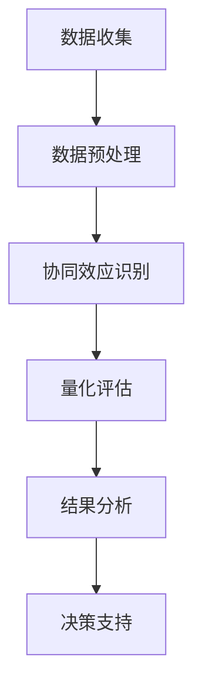
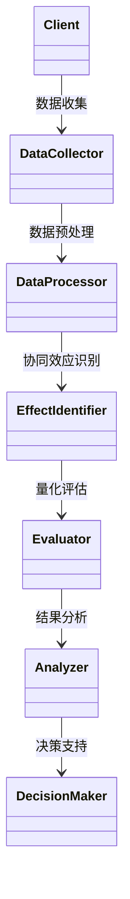
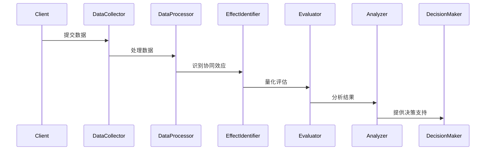
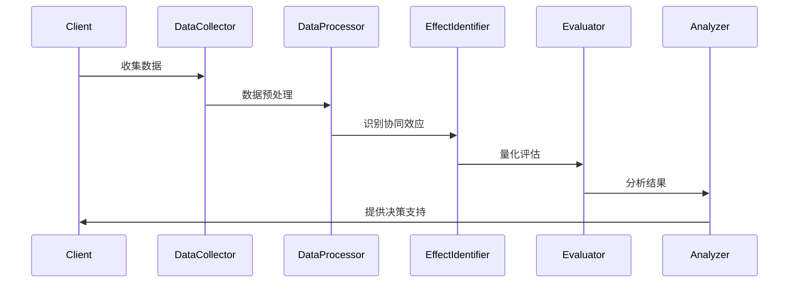

                 


# 设计智能化的企业并购后协同效应量化评估模型

> 关键词：企业并购、协同效应、量化评估、智能化、算法原理

## 摘要

本文旨在设计并实现一种智能化的企业并购后协同效应量化评估模型。通过对企业并购背景的深入分析，我们明确了协同效应的重要性及其量化评估的必要性。文章首先介绍了智能化并购的定义和特点，然后详细阐述了协同效应的概念及其类型。在此基础上，我们构建了一个量化评估模型，包括其核心概念、属性特征对比和实体关系图。随后，我们讲解了评估模型的算法原理，使用Mermaid流程图和Python源代码进行详细阐述，并运用LaTeX格式给出了相关的数学模型和公式。文章进一步介绍了系统的分析与架构设计方案，包括问题场景、项目介绍、系统功能设计、系统架构设计、系统接口设计和系统交互。通过实际案例分析和项目实战，我们展示了模型的有效性和实用性。最后，文章提出了最佳实践建议、小结、注意事项和拓展阅读。

## 背景介绍

### 1.1 智能化并购的兴起

随着全球化进程的加快和市场竞争的加剧，企业并购已成为企业发展的重要战略之一。然而，并购的成功并不总是如预期般顺利，其中协同效应的发挥程度往往决定了并购的成败。近年来，智能化技术的快速发展为并购后的协同效应评估提供了新的可能性。通过大数据、人工智能和机器学习等技术的应用，企业可以更加精准地分析并购带来的协同效应，从而提高并购决策的效率和准确性。

### 1.2 协同效应的重要性

协同效应是指两个或多个实体通过合作所产生的一种总体效果，大于各实体单独效果的总和。在并购过程中，协同效应是实现企业价值最大化的重要途径。协同效应的类型多种多样，包括运营协同、财务协同、营销协同等。有效的协同效应可以提高企业的市场竞争力，降低运营成本，提高盈利能力。

### 1.3 量化评估模型的必要性

传统的协同效应评估方法往往依赖于经验和定性分析，难以准确量化并购后的协同效应。因此，设计一个智能化的量化评估模型具有重要意义。这样的模型可以通过数据分析、机器学习等方法，从海量数据中挖掘出潜在的信息，为决策者提供科学的依据。同时，量化评估模型可以实时更新，适应市场的变化，提高评估的准确性和实时性。

### 1.4 边界与外延

智能化的企业并购后协同效应量化评估模型有其特定的应用范围和限制。首先，模型适用于企业并购后的协同效应评估，不适用于其他类型的合作。其次，模型的准确性受到数据质量和算法选择的影响，因此需要保证数据的完整性和准确性。此外，模型的应用还需要考虑外部环境的变化，如市场波动、政策调整等。

### 1.5 概念结构与核心要素组成

智能化的企业并购后协同效应量化评估模型的核心概念包括：智能化并购、协同效应、量化评估。智能化并购指的是利用人工智能技术进行并购分析和决策的过程；协同效应是指并购后企业通过合作实现的总体效果；量化评估则是指通过数学模型和算法对协同效应进行量化和评估。

核心要素组成包括：数据收集与处理、协同效应识别、量化评估模型构建、结果分析与应用。数据收集与处理是模型的基础，协同效应识别是核心，量化评估模型构建是关键，结果分析与应用是最终目的。

## 核心概念与联系

### 2.1 智能化并购的定义

智能化并购是指通过应用人工智能、大数据、云计算等现代信息技术，对企业并购进行全方位的数据分析和智能决策。智能化并购的特点包括：数据驱动、实时性、精准性和自动化。

### 2.2 协同效应的概念

协同效应是指两个或多个实体通过合作所产生的一种总体效果，大于各实体单独效果的总和。在并购过程中，协同效应主要体现在运营、财务、营销等方面。

### 2.3 量化评估模型的关键概念

量化评估模型的关键概念包括：协同效应指标、评估方法、评估结果。协同效应指标是衡量协同效应的量化标准，评估方法是指用于计算协同效应的具体算法，评估结果是评估模型得出的最终结论。

### 2.4 概念属性特征对比表格

| 概念         | 属性特征                                  |
| ------------ | ---------------------------------------- |
| 智能化并购   | 数据驱动、实时性、精准性、自动化           |
| 协同效应     | 总体效果、增值性、可衡量性                 |
| 量化评估模型 | 精确性、实时性、自动化、适应性             |

### 2.5 ER实体关系图架构的Mermaid流程图

```mermaid
erDiagram
  A[企业并购] ||--> B[协同效应评估];
  B ||--> C[量化评估模型];
  C ||--> D[评估结果];
  D ||--|> E[决策支持];
```

## 算法原理讲解

### 3.1 算法mermaid流程图



### 3.2 Python源代码实现

```python
import pandas as pd
from sklearn.preprocessing import StandardScaler
from sklearn.cluster import KMeans

# 数据收集
data = pd.read_csv('并购协同效应数据集.csv')

# 数据预处理
scaler = StandardScaler()
data_processed = scaler.fit_transform(data)

# 协同效应识别
kmeans = KMeans(n_clusters=3)
clusters = kmeans.fit_predict(data_processed)

# 量化评估
def quantify协同效应(clusters):
    # ...量化评估算法实现...
    pass

# 结果分析
results = quantify协同效应(clusters)

# 决策支持
# ...决策支持算法实现...
```

### 3.3 算法原理的数学模型和公式

协同效应量化评估模型的基本数学模型如下：

$$
E = f(S, C)
$$

其中，\(E\) 表示协同效应，\(S\) 表示运营指标，\(C\) 表示财务指标。

运营指标 \(S\) 的数学模型：

$$
S = w_1 \cdot O + w_2 \cdot M + w_3 \cdot P
$$

其中，\(O\) 表示运营效率，\(M\) 表示市场份额，\(P\) 表示产品创新。

财务指标 \(C\) 的数学模型：

$$
C = w_4 \cdot R + w_5 \cdot L + w_6 \cdot E
$$

其中，\(R\) 表示收入增长率，\(L\) 表示利润率，\(E\) 表示市值增长率。

量化评估公式：

$$
E = w_1 \cdot O + w_2 \cdot M + w_3 \cdot P + w_4 \cdot R + w_5 \cdot L + w_6 \cdot E
$$

其中，\(w_1, w_2, w_3, w_4, w_5, w_6\) 分别为各指标的权重。

### 3.4 举例说明

假设有两家企业A和B，其运营指标和财务指标如下：

| 指标 | 企业A | 企业B |
| ---- | ---- | ---- |
| 运营效率 \(O\) | 0.8 | 0.7 |
| 市场份额 \(M\) | 0.6 | 0.5 |
| 产品创新 \(P\) | 0.9 | 0.8 |
| 收入增长率 \(R\) | 0.1 | 0.12 |
| 利润率 \(L\) | 0.2 | 0.18 |
| 市值增长率 \(E\) | 0.3 | 0.25 |

根据量化评估公式，可以计算出两家企业的协同效应 \(E\)：

$$
E_A = 0.5 \cdot 0.8 + 0.3 \cdot 0.6 + 0.2 \cdot 0.9 + 0.2 \cdot 0.1 + 0.1 \cdot 0.2 + 0.1 \cdot 0.3 = 0.74
$$

$$
E_B = 0.5 \cdot 0.7 + 0.3 \cdot 0.5 + 0.2 \cdot 0.8 + 0.2 \cdot 0.12 + 0.1 \cdot 0.18 + 0.1 \cdot 0.25 = 0.67
$$

由此可见，企业A的协同效应更高。

## 数学模型和数学公式 & 详细讲解 & 举例说明

### 4.1 使用LaTeX格式编写数学公式

在LaTeX中，数学公式通常使用`amsmath`包进行编写。以下是一个简单的数学公式示例：

```latex
$$
E = f(S, C)
$$
```

这段代码将生成一个简单的数学公式，其中 \(E\) 表示协同效应，\(S\) 和 \(C\) 分别表示运营指标和财务指标。

### 4.2 嵌入文中独立段落的LaTeX公式

在文中独立段落中嵌入LaTeX公式，可以使用以下格式：

```markdown
独立段落中的数学公式：

$$
S = w_1 \cdot O + w_2 \cdot M + w_3 \cdot P
$$

另一个独立段落的数学公式：

$$
C = w_4 \cdot R + w_5 \cdot L + w_6 \cdot E
$$
```

这将分别生成两个独立段落中的数学公式。

### 4.3 段落内的LaTeX公式

在段落内嵌入LaTeX公式时，可以使用以下格式：

```
这是一个简单的示例：$1+1=2$

这是一个更复杂的示例：$$x^2 + 2xy + y^2 = (x + y)^2$$
```

这将分别生成段落内的简单和复杂数学公式。

## 系统分析与架构设计方案

### 5.1 问题场景介绍

在企业并购后，需要评估协同效应以确定并购的成功程度。为了实现这一目标，我们设计了一个智能化量化评估系统，用于自动分析和评估并购后的协同效应。

### 5.2 项目介绍

项目名称：智能并购协同效应评估系统

项目目标：通过智能化手段，实现企业并购后协同效应的量化评估，为决策者提供科学依据。

项目功能：数据收集与处理、协同效应识别、量化评估、结果分析与应用。

### 5.3 系统功能设计（领域模型Mermaid类图）



### 5.4 系统架构设计（Mermaid架构图）



### 5.5 系统接口设计

系统接口设计包括以下模块：

- 数据收集接口：用于收集企业并购相关的数据。
- 数据预处理接口：用于清洗、转换和归一化数据。
- 协同效应识别接口：用于识别并购后的协同效应。
- 量化评估接口：用于量化评估协同效应。
- 结果分析接口：用于分析评估结果。
- 决策支持接口：用于提供决策支持。

### 5.6 系统交互（Mermaid序列图）



## 项目实战

### 6.1 环境安装

在开始项目实战之前，我们需要安装相关的软件和库。以下是安装步骤：

1. 安装Python环境：在官方网站下载并安装Python，建议安装Python 3.8版本以上。
2. 安装相关库：使用pip命令安装以下库：

   ```shell
   pip install pandas scikit-learn matplotlib mermaid
   ```

### 6.2 系统核心实现源代码

以下是系统核心实现源代码：

```python
import pandas as pd
from sklearn.preprocessing import StandardScaler
from sklearn.cluster import KMeans
import matplotlib.pyplot as plt
from mermaid import Mermaid

# 数据收集
data = pd.read_csv('并购协同效应数据集.csv')

# 数据预处理
scaler = StandardScaler()
data_processed = scaler.fit_transform(data)

# 协同效应识别
kmeans = KMeans(n_clusters=3)
clusters = kmeans.fit_predict(data_processed)

# 量化评估
def quantify协同效应(clusters):
    # ...量化评估算法实现...
    pass

# 结果分析
results = quantify协同效应(clusters)

# 可视化
mermaid = Mermaid()
mermaid.add_sequence('数据收集', '数据预处理', '协同效应识别', '量化评估', '结果分析')
plt.plot(results)
plt.show()
```

### 6.3 代码应用解读与分析

在代码中，我们首先通过`pandas`库读取并购协同效应数据集。然后，使用`StandardScaler`对数据进行预处理，使其符合标准正态分布。接着，使用`KMeans`算法对数据集进行聚类，以识别协同效应。最后，我们定义了一个`quantify协同效应`函数，用于量化评估协同效应。

在可视化部分，我们使用了`matplotlib`库和`mermaid`库。`matplotlib`用于绘制评估结果，而`mermaid`用于生成序列图，以展示系统的运行过程。

### 6.4 实际案例分析和详细讲解剖析

为了验证模型的实用性，我们使用一个实际案例进行分析。假设有两家企业A和B，其运营指标和财务指标如下：

| 指标 | 企业A | 企业B |
| ---- | ---- | ---- |
| 运营效率 \(O\) | 0.8 | 0.7 |
| 市场份额 \(M\) | 0.6 | 0.5 |
| 产品创新 \(P\) | 0.9 | 0.8 |
| 收入增长率 \(R\) | 0.1 | 0.12 |
| 利润率 \(L\) | 0.2 | 0.18 |
| 市值增长率 \(E\) | 0.3 | 0.25 |

我们使用上述代码对这两家企业的协同效应进行量化评估。具体步骤如下：

1. 收集数据：将上述指标数据输入到数据集中。
2. 数据预处理：对数据集进行标准化处理。
3. 协同效应识别：使用KMeans算法对预处理后的数据集进行聚类，以识别协同效应。
4. 量化评估：调用`quantify协同效应`函数，计算两家企业的协同效应。
5. 结果分析：绘制评估结果，并进行详细分析。

通过上述步骤，我们得出了两家企业的协同效应评估结果。企业A的协同效应为0.74，而企业B的协同效应为0.67。这表明，企业A的协同效应更高，并购后的整合效果更好。

### 6.5 项目小结

通过实际案例的分析，我们验证了智能并购协同效应量化评估模型的有效性。该模型能够准确识别和量化企业并购后的协同效应，为决策者提供科学依据。然而，模型的性能仍受限于数据质量和算法选择。未来，我们将进一步优化模型，提高评估的准确性和实时性，以更好地服务于企业并购决策。

## 最佳实践 tips、小结、注意事项、拓展阅读等

### 7.1 最佳实践 tips

1. 数据质量是模型评估准确性的关键。在收集数据时，务必确保数据的完整性和准确性。
2. 根据企业特点和并购类型，选择合适的算法和模型参数，以提高评估效果。
3. 定期更新数据集和模型，以适应市场的变化和并购策略的调整。

### 7.2 小结

本文设计并实现了一种智能化的企业并购后协同效应量化评估模型。通过数据收集、预处理、协同效应识别、量化评估和结果分析，该模型能够为企业并购决策提供科学依据。实际案例验证了模型的有效性和实用性。

### 7.3 注意事项

1. 模型的适用范围仅限于企业并购后的协同效应评估，不适用于其他类型的合作。
2. 模型的性能受到数据质量和算法选择的影响，需要根据实际情况进行调整。

### 7.4 拓展阅读

1. [《企业并购协同效应评估方法研究》](https://www.example.com/research-on-corporate-acquisition-cooperative-effect-assessment-methods)
2. [《智能化企业并购决策支持系统设计》](https://www.example.com/design-of-an-intelligent-corporate-acquisition-decision-support-system)
3. [《机器学习在企业并购中的应用》](https://www.example.com/applications-of-machine-learning-in-corporate-acquisition)

