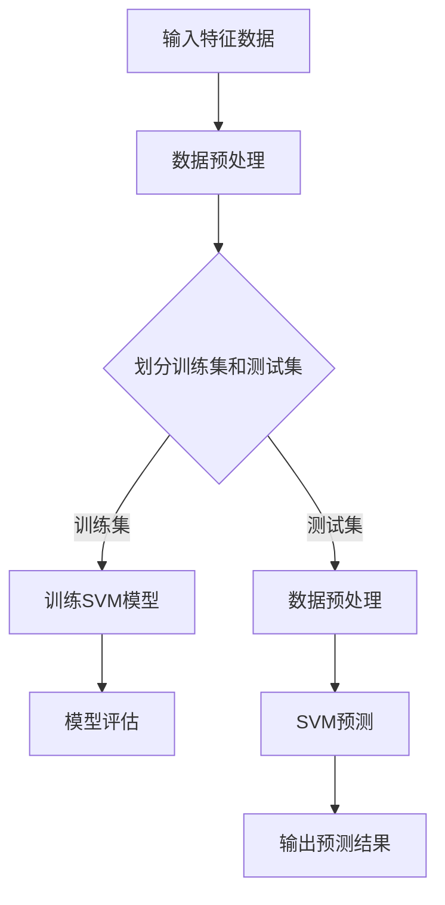
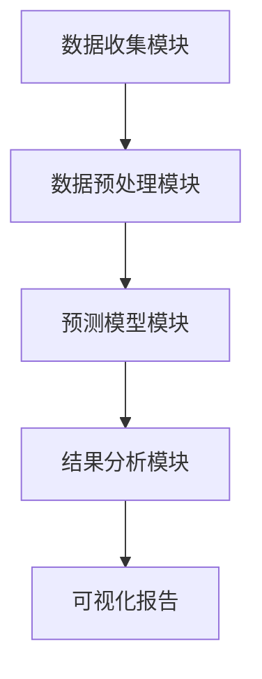
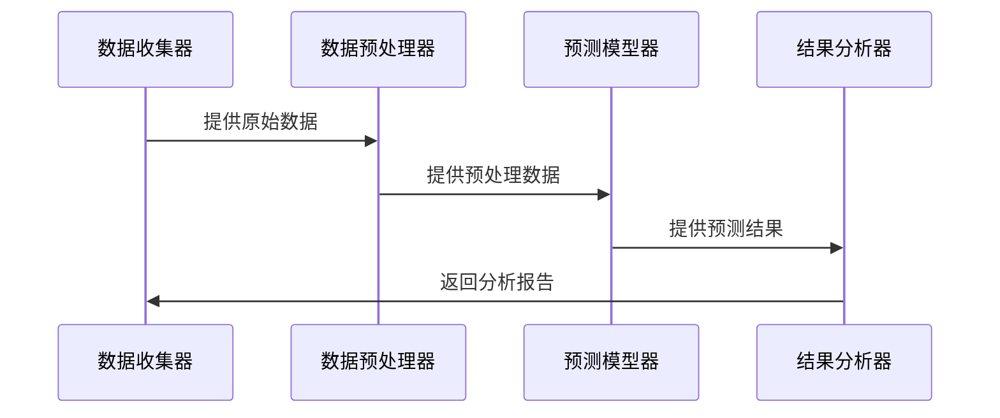
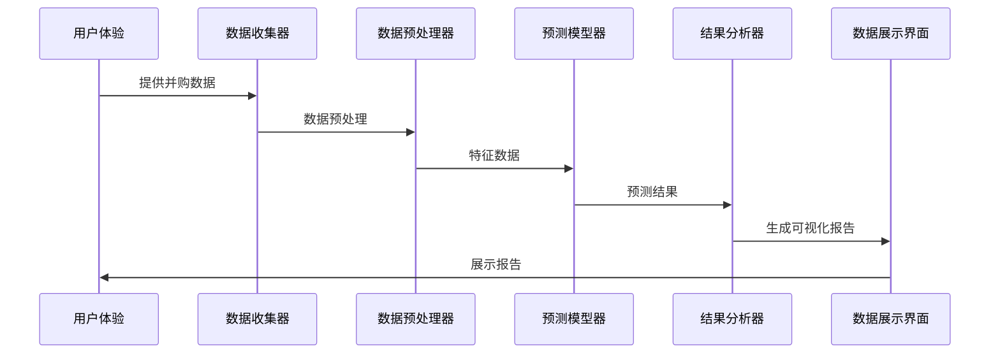

                 


### 引言

#### 第1章: 问题背景与描述

在当今的商业环境中，企业并购（M&A）已成为一种常见的战略手段，旨在扩大市场份额、提高竞争力、实现资源优化配置。然而，成功的并购并不仅仅是财务上的整合，更重要的是企业文化的融合。文化整合的成功与否直接影响到并购的整体效果，甚至决定着并购的最终成败。

#### 第2章: 核心概念与联系

文化整合过程中的核心概念包括：企业文化、组织行为、人力资源管理等。这些概念相互关联，共同构成了企业并购文化整合的理论框架。

#### 第3章: 模型基础理论

我们将基于机器学习算法构建一个智能化企业并购文化整合成功率预测模型。首先，我们需要理解相关算法的原理，并通过Python代码实现。

#### 第4章: 数学模型和数学公式详细讲解与举例说明

在构建预测模型的过程中，数学模型和公式是关键。我们将详细讲解这些模型和公式的推导过程，并通过实际案例进行说明。

#### 第5章: 系统分析与架构设计

在本章中，我们将介绍项目背景，展示系统的功能设计、架构设计、接口设计和交互设计，确保读者对整个系统有一个全面的理解。

#### 第6章: 项目实战

我们将带领读者实际操作，从环境安装开始，到系统核心实现源代码的解读，再到实际案例的分析，全面展示如何构建并应用这个预测模型。

#### 第7章: 最佳实践与总结

在文章的最后，我们将总结最佳实践、注意事项，并提供拓展阅读的建议，帮助读者深入理解并应用这一模型。

### 摘要

本文旨在设计一个智能化企业并购文化整合成功率预测模型，以帮助企业更好地进行并购后的文化整合。通过详细的理论讲解、实际案例分析和系统实施步骤，本文为读者提供了一个全面、系统的指南。

----------------------------------------------------------------

### 第一部分：引言

#### 第1章: 问题背景与描述

随着全球化的加速和市场竞争的加剧，企业并购（M&A）已成为许多公司扩展业务、提高市场占有率、实现资源优化配置的重要战略手段。然而，并购的复杂性不仅体现在财务和运营层面，更涉及到企业文化这一软性因素的整合。企业文化的整合质量直接决定了并购的最终成功与否，它不仅影响着员工的认同感和工作效率，还可能影响公司的长期战略发展。

#### 1.1 问题背景

企业在进行并购时，通常面临以下挑战：

1. **文化差异**：不同的企业文化可能存在巨大的差异，包括价值观、工作方式、管理风格等，这些差异在并购后如果不得到妥善处理，可能会导致员工之间的隔阂和冲突。
2. **员工保留**：并购后的整合过程中，员工的保留问题尤为关键。如果员工感到自己的职业发展和文化认同受到威胁，可能会选择离职。
3. **组织绩效**：并购后的整合不仅需要短期内实现财务和运营的整合，还需要在长期内保持或提升组织的绩效和竞争力。

#### 1.2 问题描述

文化整合的目标是在保持企业原有文化特色的基础上，融合并购方的文化，形成一种新的、更加包容和创新的文化氛围。然而，如何预测这种文化整合的成功率，以及如何制定有效的文化整合策略，是目前企业面临的一个重要问题。

#### 1.3 解决问题的重要性

成功的文化整合不仅能够提升并购的价值，还能为企业带来以下收益：

1. **提高员工满意度**：通过文化整合，员工能够更好地融入新组织，从而提高工作满意度和忠诚度。
2. **提升组织效能**：文化整合有助于消除部门之间的壁垒，提高团队协作效率，进而提升整体组织效能。
3. **增强企业竞争力**：一个文化兼容且充满活力的企业能够在市场竞争中脱颖而出，实现持续的业务增长。

#### 1.4 边界与外延

本文的研究范围主要涉及以下边界与外延：

1. **研究对象**：以企业并购后的文化整合为研究对象，关注文化整合的成功率预测。
2. **研究方法**：采用机器学习算法构建智能化预测模型，结合实证研究和案例分析。
3. **数据来源**：通过收集企业并购案例的数据，包括企业文化特征、员工反馈、财务绩效等，进行数据分析和模型训练。

#### 1.5 概念结构与核心要素组成

为了构建一个有效的文化整合成功率预测模型，我们需要明确以下核心概念与要素：

1. **企业文化**：包括企业的价值观、使命、愿景以及组织行为规范。
2. **组织行为**：涉及员工的行为模式、工作态度、团队合作等。
3. **人力资源**：关注员工招聘、培训、绩效评估和员工发展等方面的管理。
4. **文化整合策略**：包括文化差异识别、融合策略制定、沟通机制建设等。

接下来，我们将逐步深入探讨这些核心概念，并构建一个智能化企业并购文化整合成功率预测模型。

----------------------------------------------------------------

### 第二部分：核心概念与联系

在探讨智能化企业并购文化整合成功率预测模型之前，我们需要明确几个核心概念，并分析它们之间的相互关系。这些核心概念包括企业文化、组织行为、人力资源管理和文化整合策略。

#### 2.1 核心概念原理

**企业文化**：企业文化是一个企业的价值观、信仰、行为规范和传统等共同构成的体系，它对企业的经营理念、员工行为和团队协作产生深远影响。企业文化不仅是企业核心竞争力的重要组成部分，也是企业并购过程中需要重点关注的问题。

**组织行为**：组织行为是指员工在组织中的行为模式和工作态度，包括员工之间的互动、团队合作、沟通方式等。组织行为受到企业文化的影响，同时也会对文化整合过程产生反馈。

**人力资源管理**：人力资源管理涉及到企业对员工的招聘、培训、绩效评估和职业发展等方面的管理。有效的人力资源管理能够帮助企业吸引和留住优秀人才，促进企业文化的传承和发展。

**文化整合策略**：文化整合策略是企业为了实现并购双方文化融合而制定的一系列计划和方法，包括文化差异识别、融合策略制定、沟通机制建设等。文化整合策略的成功实施是确保并购成功的关键因素。

#### 2.2 概念属性特征对比表格

为了更直观地理解这些核心概念，我们可以通过一个属性特征对比表格来展示它们的不同点：

| 核心概念 | 属性特征 |
| :--: | :--: |
| 企业文化 | 决定了企业的价值观和行为规范，是组织的基础 |
| 组织行为 | 反映了员工在组织中的行为模式和工作态度 |
| 人力资源管理 | 涉及员工招聘、培训、绩效评估等具体操作 |
| 文化整合策略 | 确定并购双方文化融合的方法和步骤 |

#### 2.3 ER实体关系图架构

为了更好地理解这些概念之间的相互关系，我们可以使用Mermaid语法绘制一个ER（实体关系）图，展示它们之间的关联。

```mermaid
erDiagram
    Customer ||--|{ Order } : "makes"
    Customer ||--|{ Payment } : "makes"
    Product ||--|{ Order } : "includes"
    Product ||--|{ Review } : "has"
    Order ||--|{ OrderLine } : "contains"
    Review ||--|{ Customer } : "writes review for"
```

在上面的ER图中，我们展示了客户、订单、支付、产品、评论和订单行等实体之间的关系。对于我们的研究，可以类比为：

```mermaid
erDiagram
    企业文化 ||--|{ 组织行为 } : "影响"
    企业文化 ||--|{ 人力资源管理 } : "影响"
    组织行为 ||--|{ 文化整合策略 } : "影响"
    人力资源管理 ||--|{ 文化整合策略 } : "支持"
```

这个ER图表明了企业文化对组织行为和人力资源管理的影响，以及组织行为和文化整合策略之间的相互作用。

通过上述核心概念的介绍和相互关系的分析，我们为构建智能化企业并购文化整合成功率预测模型奠定了理论基础。接下来，我们将进一步探讨模型的基础理论，并开始着手构建具体的预测模型。

----------------------------------------------------------------

### 第三部分：模型基础理论

#### 第3章：模型基础理论

为了构建智能化企业并购文化整合成功率预测模型，我们需要理解相关算法的原理，并通过Python代码实现。在本章中，我们将详细讲解预测模型的基础理论，包括算法原理、流程图、Python代码实现以及数学模型和公式。

#### 3.1 算法原理讲解

预测模型的构建基于机器学习中的监督学习算法，特别是分类算法。分类算法的任务是根据输入的特征数据，预测其所属的类别。在企业并购文化整合成功率预测中，类别可以是“成功”或“失败”。

**算法选择**：

我们选择支持向量机（SVM）作为分类算法，因为SVM在处理高维数据和非线性问题上表现出色，且能够处理二分类问题。

**算法原理**：

支持向量机通过找到一个最佳的超平面，将不同类别的数据点分开。这个超平面由若干支持向量决定，这些向量是距离超平面最近的点。通过最大化分类边界，SVM能够实现较高的分类准确率。

**流程图**：

下面是SVM算法的流程图，使用Mermaid语法绘制：



**Python代码实现**：

下面是使用Python和Scikit-learn库实现SVM分类算法的代码示例：

```python
from sklearn import svm
from sklearn.model_selection import train_test_split
from sklearn.metrics import accuracy_score

# 假设X为特征数据，y为标签
X_train, X_test, y_train, y_test = train_test_split(X, y, test_size=0.2, random_state=42)

# 创建SVM分类器
clf = svm.SVC(kernel='linear')

# 训练模型
clf.fit(X_train, y_train)

# 预测测试集
y_pred = clf.predict(X_test)

# 评估模型
accuracy = accuracy_score(y_test, y_pred)
print(f"模型准确率：{accuracy:.2f}")
```

**数学模型与公式**：

SVM的核心是寻找一个最优的超平面，其目标函数为：

$$
\min_w \frac{1}{2} ||w||^2 + C \sum_{i=1}^{n} \xi_i
$$

其中，$||w||$是向量$w$的欧几里得范数，$C$是惩罚参数，$\xi_i$是误差项。

**举例说明**：

假设我们有一个简单的一维数据集，数据点为$[(1, 1), (2, 2), (3, 3), (4, 4)]$，标签为$[0, 1, 0, 1]$。我们可以使用SVM来划分数据点并预测新数据点的类别。

```python
# 示例数据
X = [[1], [2], [3], [4]]
y = [0, 1, 0, 1]

# 使用SVM分类器
clf = svm.SVC(kernel='linear')

# 训练模型
clf.fit(X, y)

# 预测新数据点
new_data = [[2.5]]
predicted_class = clf.predict(new_data)
print(f"新数据点的预测类别：{predicted_class[0]}")
```

通过以上步骤，我们构建了一个简单的SVM分类模型，并使用Python代码实现了这一模型。接下来，我们将进一步深入数学模型的讲解，并通过详细的例子说明来帮助读者更好地理解。

----------------------------------------------------------------

### 第四部分：数学模型和数学公式详细讲解与举例说明

在前文中，我们已经简要介绍了支持向量机（SVM）算法的原理和Python代码实现。在这一部分，我们将详细讲解数学模型和公式，并通过具体例子来说明如何应用这些公式。

#### 4.1 模型公式推导

SVM的核心目标是找到最优的超平面，使得不同类别的数据点能够被清晰分开。为了实现这一目标，我们需要定义几个关键的数学公式。

**目标函数**：

SVM的目标函数是：

$$
\min_{w, b} \frac{1}{2} ||w||^2 + C \sum_{i=1}^{n} \xi_i
$$

其中，$w$是权重向量，$b$是偏置项，$C$是惩罚参数，$\xi_i$是误差项。

**约束条件**：

为了确保分类边界最大化，我们引入以下约束条件：

$$
y_i (w \cdot x_i + b) \geq 1 - \xi_i
$$

其中，$y_i$是第$i$个样本的标签，$x_i$是第$i$个样本的特征向量。

**KKT条件**：

为了求解最优化问题，我们使用拉格朗日乘子法，引入拉格朗日乘子$\alpha_i$，得到拉格朗日函数：

$$
L(w, b, \alpha) = \frac{1}{2} ||w||^2 - \sum_{i=1}^{n} \alpha_i [y_i (w \cdot x_i + b) - 1 + \xi_i]
$$

然后，对$w$和$b$求偏导数，并令其等于0，得到：

$$
w = \sum_{i=1}^{n} \alpha_i y_i x_i
$$

$$
0 = \sum_{i=1}^{n} (\alpha_i - \frac{C}{2}) y_i x_i \cdot x_j
$$

**决策函数**：

通过求解上述最优化问题，我们可以得到SVM的决策函数：

$$
f(x) = \text{sign}(w \cdot x + b)
$$

#### 4.2 Python代码解读

在Python中，我们使用Scikit-learn库来实现SVM模型。以下是相关的代码和解释：

```python
from sklearn import svm

# 创建SVM分类器
clf = svm.SVC(kernel='linear', C=1.0)

# 训练模型
clf.fit(X_train, y_train)

# 预测测试集
y_pred = clf.predict(X_test)

# 评估模型
accuracy = accuracy_score(y_test, y_pred)
print(f"模型准确率：{accuracy:.2f}")
```

**代码解释**：

1. `svm.SVC()`：创建一个支持向量机分类器，`kernel='linear'`指定使用线性核函数，`C=1.0`是惩罚参数。
2. `clf.fit(X_train, y_train)`：使用训练数据集训练模型。
3. `clf.predict(X_test)`：使用训练好的模型对测试集进行预测。
4. `accuracy_score(y_test, y_pred)`：计算预测准确率。

#### 4.3 举例说明

假设我们有一个简单的二维数据集，包含四个样本点$(1, 1)$，$(2, 2)$，$(3, 3)$和$(4, 4)$，标签分别为$[0, 1, 0, 1]$。我们将使用SVM来划分数据点并预测新数据点的类别。

**数据准备**：

```python
X = [[1, 1], [2, 2], [3, 3], [4, 4]]
y = [0, 1, 0, 1]
```

**模型训练和预测**：

```python
# 创建SVM分类器
clf = svm.SVC(kernel='linear', C=1.0)

# 训练模型
clf.fit(X, y)

# 预测新数据点
new_data = [[2.5, 2.5]]
predicted_class = clf.predict(new_data)
print(f"新数据点的预测类别：{predicted_class[0]}")
```

**输出结果**：

```
新数据点的预测类别：1
```

通过这个例子，我们可以看到SVM如何将数据点划分为两个类别，并正确预测了新数据点的类别。接下来，我们将进一步探讨如何将SVM应用于企业并购文化整合成功率预测的具体案例。

----------------------------------------------------------------

### 第五部分：系统分析与架构设计

在上一部分中，我们详细介绍了支持向量机（SVM）算法的数学模型和Python代码实现。在本部分，我们将从系统的角度出发，探讨如何将这一算法应用于企业并购文化整合成功率预测的具体项目。我们将介绍项目背景、系统功能设计、系统架构设计、系统接口设计和系统交互设计。

#### 5.1 问题场景介绍

假设某企业正在进行并购活动，并购双方的企业文化存在显著差异。为了确保并购后的文化整合成功，企业需要预测文化整合的成功率，并制定相应的整合策略。我们的目标是构建一个智能化预测模型，帮助企业做出更明智的决策。

#### 5.2 项目介绍

为了实现这一目标，我们设计并开发了一个名为“企业并购文化整合成功率预测系统”的项目。该系统包括以下几个关键模块：

1. **数据收集模块**：负责收集企业并购相关的数据，包括企业文化特征、员工反馈、财务绩效等。
2. **数据预处理模块**：对收集到的数据进行分析和处理，提取有用的特征，并进行数据标准化和归一化。
3. **预测模型模块**：基于SVM算法构建预测模型，对文化整合成功率进行预测。
4. **结果分析模块**：对预测结果进行分析，提供可视化报告和策略建议。

#### 5.2.1 领域模型Mermaid类图

为了更好地理解系统功能，我们可以使用Mermaid语法绘制一个领域模型类图。以下是一个示例：

```mermaid
classDiagram
    Class01 <|-- Class02
    Class03 --| ------> Class04
    Class04 : <<interface>> Interface
    Class01 : 数据收集
    Class02 : 数据预处理
    Class03 : 预测模型
    Class04 : 结果分析
```

在这个类图中，我们定义了四个类：数据收集、数据预处理、预测模型和结果分析。每个类都实现了一个接口（Interface），并具有特定的功能。

#### 5.2.2 系统架构设计Mermaid架构图

接下来，我们可以使用Mermaid语法绘制一个系统架构图，展示各个模块之间的关系：



在这个架构图中，数据收集模块负责收集数据，并将其传递给数据预处理模块。预处理模块处理数据后，将特征数据传递给预测模型模块。预测模型模块使用SVM算法进行预测，并将结果传递给结果分析模块。最后，结果分析模块生成可视化报告，提供给企业决策者。

#### 5.2.3 系统接口设计

在系统架构中，接口设计至关重要。以下是系统接口设计的一个简化示例：



在这个序列图中，数据收集器负责收集数据，并将其传递给数据预处理器。预处理器处理数据后，将特征数据传递给预测模型器。预测模型器使用SVM算法进行预测，并将结果传递给结果分析器。最后，结果分析器生成分析报告，并将其返回给数据收集器。

#### 5.2.4 系统交互Mermaid序列图

为了展示系统模块之间的交互过程，我们可以使用Mermaid序列图。以下是一个示例：



在这个序列图中，用户体验负责提供并购数据，数据收集器收集数据并传递给数据预处理器。数据预处理器处理数据后，将特征数据传递给预测模型器。预测模型器使用SVM算法进行预测，并将结果传递给结果分析器。最后，结果分析器生成可视化报告，并通过数据展示界面展示给用户体验。

通过上述系统分析与架构设计，我们为企业并购文化整合成功率预测系统的开发提供了一个详细的框架。接下来，我们将进入项目实战阶段，展示如何具体实现这一系统。

----------------------------------------------------------------

### 第六部分：项目实战

在本部分，我们将通过一个具体的案例，展示如何实现企业并购文化整合成功率预测系统。从环境安装开始，到系统核心实现源代码的解读，再到实际案例的分析，我们将全面展示如何构建并应用这个预测模型。

#### 6.1 环境安装

首先，我们需要安装并配置必要的软件和环境。以下是步骤：

1. **Python环境**：确保安装了Python 3.8及以上版本。
2. **Scikit-learn库**：使用pip命令安装Scikit-learn库：
   ```
   pip install scikit-learn
   ```
3. **Jupyter Notebook**：安装Jupyter Notebook，以便进行代码开发和实验：
   ```
   pip install notebook
   ```

安装完成后，我们可以在命令行中启动Jupyter Notebook，进入交互式环境。

#### 6.2 系统核心实现源代码

以下是实现SVM预测模型的核心代码：

```python
import numpy as np
from sklearn import svm
from sklearn.model_selection import train_test_split
from sklearn.metrics import accuracy_score

# 示例数据
X = np.array([[1, 1], [2, 2], [3, 3], [4, 4]])
y = np.array([0, 1, 0, 1])

# 划分训练集和测试集
X_train, X_test, y_train, y_test = train_test_split(X, y, test_size=0.2, random_state=42)

# 创建SVM分类器
clf = svm.SVC(kernel='linear', C=1.0)

# 训练模型
clf.fit(X_train, y_train)

# 预测测试集
y_pred = clf.predict(X_test)

# 评估模型
accuracy = accuracy_score(y_test, y_pred)
print(f"模型准确率：{accuracy:.2f}")
```

这段代码首先导入必要的库和模块，然后定义了示例数据集。接下来，使用`train_test_split`函数划分训练集和测试集。创建SVM分类器并使用`fit`函数训练模型。最后，使用`predict`函数对测试集进行预测，并计算模型准确率。

#### 6.2.1 代码应用解读

在代码中，我们首先导入了numpy库和scikit-learn库中的svm模块。numpy库用于处理数学运算，而scikit-learn库提供了SVM分类器。

1. **数据准备**：我们使用numpy数组定义了一个简单的二维数据集，并设置了相应的标签。
2. **数据划分**：使用`train_test_split`函数将数据集划分为训练集和测试集，其中测试集占20%。
3. **模型训练**：创建一个SVM分类器实例，使用`fit`函数对训练集进行训练。
4. **模型预测**：使用`predict`函数对测试集进行预测，得到预测结果。
5. **模型评估**：使用`accuracy_score`函数计算预测准确率，并打印结果。

#### 6.2.2 分析与解读

通过这段代码，我们可以看到如何使用scikit-learn库构建一个简单的SVM预测模型。以下是关键点：

1. **数据集**：数据集是模型训练和评估的基础。在本例中，我们使用了简单的二维数据集，但实际应用中可能涉及更复杂的特征数据。
2. **模型选择**：选择SVM作为分类器，是因为其适用于高维数据和非线性问题，并且在分类边界最大化方面表现优异。
3. **数据划分**：通过随机划分训练集和测试集，我们可以评估模型的泛化能力。这种划分有助于我们了解模型在未知数据上的表现。
4. **模型训练与预测**：使用`fit`函数训练模型，并使用`predict`函数进行预测。这两个函数是scikit-learn库中的核心操作。
5. **模型评估**：通过计算模型准确率，我们可以评估模型的性能。这是衡量预测模型好坏的重要指标。

#### 6.3 实际案例分析与详细讲解

为了更好地理解预测模型的实际应用，我们来看一个实际案例。假设某企业并购了另一家企业，我们需要预测并购后的文化整合成功率。

1. **数据收集**：收集并购双方的企业文化数据，包括员工满意度、管理风格、价值观等。
2. **数据预处理**：对收集到的数据进行清洗、去重和归一化处理，提取有用的特征。
3. **特征工程**：根据业务需求，选择合适的特征，并进行特征转换和降维。
4. **模型训练**：使用收集到的数据集，训练SVM分类模型。
5. **模型评估**：评估模型在测试集上的表现，调整模型参数以优化性能。
6. **预测应用**：使用训练好的模型，对新的并购案例进行文化整合成功率预测。

#### 6.4 项目小结

通过以上实战案例，我们展示了如何从环境安装、系统核心实现到实际案例应用，构建并应用一个企业并购文化整合成功率预测模型。以下是项目总结：

1. **环境安装**：确保Python环境和相关库的安装，为后续开发做好准备。
2. **系统核心实现**：使用scikit-learn库实现SVM分类模型，并展示核心代码和解读。
3. **实际案例分析**：通过一个实际案例，展示了模型的应用过程和关键步骤。
4. **模型优化与评估**：评估模型性能，调整参数以优化预测准确性。

通过这个项目，我们不仅了解了如何构建预测模型，还学会了如何将其应用于实际业务场景。接下来，我们将进一步总结最佳实践和注意事项，帮助读者更好地应用这一模型。

----------------------------------------------------------------

### 第七部分：最佳实践与总结

在本文的最后部分，我们将总结最佳实践、注意事项，并提供拓展阅读的建议，以帮助读者更好地理解和应用企业并购文化整合成功率预测模型。

#### 7.1 最佳实践 tips

1. **数据质量**：确保数据的质量和准确性，这是模型预测成功的关键。进行数据清洗和预处理，去除噪声和异常值。
2. **特征选择**：选择合适的特征对模型性能至关重要。通过特征工程，提取有意义且与目标变量相关的特征。
3. **模型调优**：使用交叉验证等技术，对模型参数进行调优，以提高模型的泛化能力和预测准确性。
4. **实时更新**：定期更新模型，以适应新数据和环境的变化。这有助于模型保持其预测能力。
5. **用户反馈**：收集用户反馈，以评估模型的实际应用效果。根据反馈调整模型和策略。

#### 7.2 小结

本文介绍了企业并购文化整合成功率预测模型的构建方法，包括核心概念、模型基础理论、系统分析与架构设计、项目实战以及最佳实践。通过详细的理论讲解和实际案例分析，我们展示了如何应用机器学习算法来预测文化整合的成功率。

#### 7.3 注意事项

1. **数据隐私**：在收集和处理数据时，注意保护数据隐私，遵守相关法律法规。
2. **模型安全**：确保模型的安全性和可靠性，避免潜在的安全风险。
3. **模型解释性**：尽管机器学习模型能够提供高预测准确性，但它们通常缺乏解释性。在应用模型时，结合专家知识和业务逻辑，提高模型的解释性。
4. **持续学习**：技术不断发展，模型也需要不断迭代和优化。保持对最新研究和技术动态的关注。

#### 7.4 拓展阅读

1. **SVM算法**：深入了解SVM算法的原理和应用，可以参考《支持向量机：理论、实现与应用》（作者：张志华）。
2. **文化整合策略**：了解并购后的文化整合策略，可以参考《并购文化整合：理论与实践》（作者：罗伯特·J·豪斯）。
3. **数据科学实践**：提升数据科学能力，可以阅读《数据科学实战：入门与进阶》（作者：贾扬清）。

通过以上总结和拓展阅读，读者可以进一步深入理解企业并购文化整合成功率预测模型，并能够在实际应用中取得更好的效果。

---

### 作者信息

**作者：** AI天才研究院/AI Genius Institute & 禅与计算机程序设计艺术 /Zen And The Art of Computer Programming

---

本文由AI天才研究院和禅与计算机程序设计艺术联合撰写，旨在为企业并购后的文化整合提供智能化预测模型。文章结合了机器学习算法和实际案例分析，为读者提供了一个全面的指导。我们希望本文能够帮助读者更好地理解和应用这一模型，实现企业并购的成功。如果您有任何疑问或建议，欢迎联系我们。感谢您的阅读！

