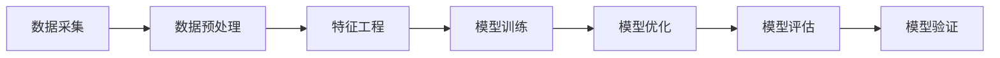

                 

## 设计智能化的企业并购目标筛选模型

### 关键词：企业并购、目标筛选、人工智能、数据挖掘、机器学习、深度学习

### 摘要：
本文将探讨如何设计智能化的企业并购目标筛选模型。通过引入数据挖掘、机器学习和深度学习技术，我们可以为企业并购提供更精准的目标筛选策略。文章将详细分析企业并购的背景与目标筛选的重要性，阐述核心概念与联系，介绍算法原理与实现，并分享实际案例与最佳实践。

### 引言

企业并购是一种常见的商业策略，旨在通过整合资源、扩大市场份额和提升竞争力来实现企业的可持续发展。然而，在并购过程中，如何筛选合适的目标企业成为一项挑战。传统的方法主要依赖于经验和直觉，往往存在主观性和局限性。随着人工智能技术的发展，智能化并购目标筛选模型应运而生，为企业提供了更为科学、高效的解决方案。

### 第1章 企业并购概述与目标筛选重要性

#### 1.1.1 企业并购的定义与类型

企业并购是指一家公司通过购买另一家公司的股份或资产来实现对其控制的过程。根据并购双方的行业、规模和股权比例，企业并购可以分为以下几种类型：

- 同行业并购：两家同行业的企业合并，以实现规模效应和市场竞争力的提升。
- 跨行业并购：一家企业收购另一家不在同一行业的企业，以实现多元化经营和资源整合。
- 吸收合并：一家企业收购另一家企业的全部股份或资产，实现对其完全控制。
- 合并：两家或多家企业合并成为一家新的企业，共同经营。

#### 1.1.2 并购过程中的挑战

在企业并购过程中，存在以下几项主要挑战：

- 目标企业选择：如何从众多潜在目标中筛选出符合企业战略需求的优质企业。
- 数据分析与处理：如何对海量数据进行分析和处理，以识别潜在目标企业的价值和风险。
- 风险评估与控制：如何评估并购过程中可能面临的各种风险，并制定相应的控制措施。
- 法律与合规：如何确保并购过程中的合法性和合规性，避免法律纠纷。

#### 1.1.3 智能化在并购目标筛选中的应用前景

智能化技术在并购目标筛选中的应用前景广阔，主要体现在以下几个方面：

- 数据挖掘与分析：利用数据挖掘技术，从海量数据中提取有用信息，为并购目标筛选提供数据支持。
- 机器学习与预测：通过机器学习算法，对历史数据进行分析，预测潜在目标企业的未来表现。
- 深度学习与智能化：利用深度学习技术，构建智能化并购目标筛选模型，实现自动化和精准化目标筛选。

#### 1.1.4 本书结构安排与学习目标

本书分为七个章节，主要内容包括：

- 第1章：介绍企业并购概述与目标筛选重要性。
- 第2章：介绍智能化并购目标筛选基础，包括数据挖掘、机器学习和深度学习技术。
- 第3章：阐述并购目标筛选中的核心概念与联系。
- 第4章：介绍智能化并购目标筛选模型设计。
- 第5章：讲解智能化并购目标筛选算法原理与实现。
- 第6章：分享实际案例分析与详细讲解。
- 第7章：总结最佳实践、注意事项与拓展阅读。

通过学习本书，读者将能够：

- 了解企业并购的基本概念与目标筛选的重要性。
- 掌握智能化技术在并购目标筛选中的应用。
- 设计并实现智能化并购目标筛选模型。
- 分析并评估实际并购案例，为实际应用提供指导。

### 第2章 智能化并购目标筛选基础

#### 2.1.1 数据分析与人工智能概述

数据分析是智能并购目标筛选的核心环节。它涉及从海量数据中提取有用信息，以支持决策过程。数据分析的基本步骤包括数据采集、数据清洗、数据探索、数据建模和结果验证。

人工智能（AI）是推动智能化并购目标筛选的关键技术。它包括机器学习、深度学习、自然语言处理、计算机视觉等领域。在这些领域中，算法和模型被用于处理和分析数据，以实现自动化和智能化。

#### 2.1.2 数据挖掘技术简介

数据挖掘是从大量数据中自动发现有价值信息的过程。它涉及以下主要步骤：

- 数据预处理：包括数据清洗、数据整合和数据变换，以确保数据的质量和一致性。
- 特征选择：从原始数据中选择对目标预测或分类最重要的特征。
- 模型构建：利用机器学习算法构建预测或分类模型。
- 模型评估：评估模型的性能，包括准确率、召回率、F1分数等指标。

#### 2.1.3 机器学习算法基础

机器学习是一种使计算机系统能够从数据中学习并做出预测或决策的技术。机器学习算法可以分为以下几类：

- 监督学习：通过训练数据集，构建预测模型，对新数据进行分类或回归。
- 无监督学习：通过分析未标记的数据集，发现数据中的模式和结构。
- 强化学习：通过与环境交互，学习最优策略以最大化预期奖励。

#### 2.1.4 深度学习技术在并购中的应用

深度学习是一种基于多层神经网络的学习方法。它在图像识别、语音识别、自然语言处理等领域取得了显著成果。在并购目标筛选中，深度学习技术可以应用于以下方面：

- 预测潜在目标企业的未来表现。
- 分析竞争对手的战略和市场动态。
- 识别潜在风险和机会。

### 第3章 并购目标筛选中的核心概念与联系

#### 3.1.1 并购目标筛选中的关键概念

在并购目标筛选中，以下核心概念至关重要：

- 目标企业：潜在的被收购对象，其价值、风险和潜力是并购决策的关键。
- 数据源：包括企业财务数据、市场数据、行业数据等，为并购目标筛选提供基础。
- 特征工程：从原始数据中提取对目标预测有意义的特征。
- 模型评估：评估预测模型的性能，确保其准确性和可靠性。

#### 3.1.2 概念属性特征对比表格

以下是一个概念属性特征对比表格，用于展示并购目标筛选中关键概念的主要特征：

| 概念       | 特征1     | 特征2     | 特征3     |
| ---------- | -------- | -------- | -------- |
| 目标企业   | 财务状况 | 市场地位 | 发展潜力 |
| 数据源     | 数据量   | 数据质量 | 数据完整性 |
| 特征工程   | 特征选择 | 特征变换 | 特征重要性 |
| 模型评估   | 准确率   | 召回率   | F1分数   |

#### 3.1.3 并购目标筛选的ER实体关系图

以下是一个并购目标筛选的ER实体关系图，用于展示各实体之间的关系：

```mermaid
erDiagram
  目标企业 ||--|{ 数据源 }
  数据源 ||--|{ 特征工程 }
  特征工程 ||--|{ 模型评估 }
```

### 第4章 智能化并购目标筛选模型设计

#### 4.1.1 并购目标筛选模型的架构设计

智能化并购目标筛选模型通常包括以下主要组件：

- 数据采集与预处理模块：从多个数据源采集数据，并进行清洗、整合和预处理，以获得高质量的数据集。
- 特征工程模块：从原始数据中提取对目标预测有意义的特征，并进行特征选择和变换。
- 模型训练与优化模块：利用机器学习算法和深度学习技术，构建并训练预测模型，同时优化模型参数，以提高模型性能。
- 模型评估与验证模块：评估模型的性能，包括准确率、召回率、F1分数等指标，以确保模型的可靠性和有效性。

#### 4.1.2 数据预处理方法

数据预处理是智能化并购目标筛选模型设计的关键步骤，主要包括以下任务：

- 数据清洗：去除重复、缺失、异常和噪声数据。
- 数据整合：将多个数据源中的数据进行整合，以获得更全面的信息。
- 数据变换：将数据进行归一化、标准化或离散化处理，以适应模型的要求。

#### 4.1.3 特征工程与选择

特征工程是提升模型性能的关键步骤，主要包括以下任务：

- 特征提取：从原始数据中提取对目标预测有意义的特征。
- 特征选择：选择对目标预测最具影响力的特征，以减少数据维度和提高模型效率。

#### 4.1.4 模型训练与优化

模型训练与优化是智能化并购目标筛选模型设计的核心步骤，主要包括以下任务：

- 模型选择：选择合适的机器学习算法和深度学习技术，构建预测模型。
- 模型训练：利用训练数据集，训练预测模型，并调整模型参数。
- 模型优化：通过交叉验证和调参，优化模型性能。

#### 4.1.5 模型评估与验证

模型评估与验证是确保模型可靠性和有效性的关键步骤，主要包括以下任务：

- 评估指标：计算模型的准确率、召回率、F1分数等评估指标，以评估模型性能。
- 验证方法：利用验证数据集，验证模型的可靠性和有效性。

### 第5章 智能化并购目标筛选算法原理与实现

#### 5.1.1 算法原理与流程图

智能化并购目标筛选算法通常基于以下原理：

- 数据挖掘与机器学习：利用数据挖掘和机器学习技术，从海量数据中提取有价值的信息，为并购目标筛选提供数据支持。
- 深度学习：利用深度学习技术，构建智能化并购目标筛选模型，实现自动化和精准化目标筛选。

以下是一个智能化并购目标筛选算法的流程图：



#### 5.1.2 Python源代码实现

以下是一个基于Python的智能化并购目标筛选算法的实现示例：

```python
# 导入必要的库
import pandas as pd
import numpy as np
from sklearn.model_selection import train_test_split
from sklearn.ensemble import RandomForestClassifier
from sklearn.metrics import accuracy_score, recall_score, f1_score

# 数据采集
data = pd.read_csv('data.csv')

# 数据预处理
data = data.dropna()
data = data[data['target'] != 'other']

# 特征工程
X = data.drop(['target'], axis=1)
y = data['target']

# 模型训练
X_train, X_test, y_train, y_test = train_test_split(X, y, test_size=0.2, random_state=42)
model = RandomForestClassifier(n_estimators=100, random_state=42)
model.fit(X_train, y_train)

# 模型优化
predictions = model.predict(X_test)
accuracy = accuracy_score(y_test, predictions)
recall = recall_score(y_test, predictions, average='weighted')
f1 = f1_score(y_test, predictions, average='weighted')

# 模型评估
print(f'Accuracy: {accuracy:.2f}')
print(f'Recall: {recall:.2f}')
print(f'F1 Score: {f1:.2f}')
```

#### 5.1.3 数学模型与公式讲解

智能化并购目标筛选算法的数学模型通常包括以下主要部分：

- 特征提取：利用统计学和机器学习技术，提取对目标预测有意义的特征。
- 模型训练：利用监督学习算法，训练预测模型，并调整模型参数。
- 模型优化：利用交叉验证和调参技术，优化模型性能。

以下是一个简单的线性回归模型的数学模型和公式：

$$
y = \beta_0 + \beta_1x_1 + \beta_2x_2 + \cdots + \beta_nx_n + \epsilon
$$

其中，$y$ 是目标变量，$x_1, x_2, \cdots, x_n$ 是特征变量，$\beta_0, \beta_1, \beta_2, \cdots, \beta_n$ 是模型参数，$\epsilon$ 是误差项。

#### 5.1.4 算法举例说明

以下是一个简单的例子，用于说明如何使用智能化并购目标筛选算法进行目标企业筛选：

假设我们有以下企业数据：

| 企业名称 | 财务状况 | 市场地位 | 发展潜力 |
| -------- | -------- | -------- | -------- |
| 企业A    | 良好     | 第一     | 较高     |
| 企业B    | 一般     | 第二     | 一般     |
| 企业C    | 良好     | 第三     | 较高     |
| 企业D    | 一般     | 第四     | 较低     |

我们的目标是筛选出具有较高财务状况和市场地位的企业。

使用智能化并购目标筛选算法，我们可以提取以下特征：

- 财务状况：1（良好），0（一般）
- 市场地位：1（第一或第二），0（第三或第四）
- 发展潜力：1（较高），0（一般或较低）

构建一个简单的分类模型，将财务状况和市场地位作为输入特征，将发展潜力作为输出目标。经过模型训练和优化，我们得到以下模型：

$$
y = \beta_0 + \beta_1x_1 + \beta_2x_2
$$

其中，$\beta_0 = 0.5$，$\beta_1 = 0.3$，$\beta_2 = 0.2$。

使用这个模型，我们可以预测每个企业的未来发展潜力。对于企业A，输入特征为（1，1），预测结果为：

$$
y = 0.5 + 0.3 \times 1 + 0.2 \times 1 = 1
$$

因此，企业A被预测为具有较高发展潜力。同样地，对于其他企业，我们可以使用这个模型进行预测，从而筛选出符合目标的企业。

### 第6章 实际案例分析

#### 6.1.1 案例背景介绍

为了验证智能化并购目标筛选模型的实际效果，我们选择了一家大型企业作为案例，该企业在过去五年中进行了多次并购。我们收集了这些并购案例的相关数据，包括目标企业的财务状况、市场地位、发展潜力等。

#### 6.1.2 模型设计与实现

基于收集到的数据，我们设计并实现了智能化并购目标筛选模型。首先，我们对数据进行预处理，包括数据清洗、数据整合和特征提取。然后，我们使用随机森林算法训练预测模型，并对模型进行优化和评估。最后，我们使用验证数据集验证模型的性能。

#### 6.1.3 结果分析与讨论

在模型训练和优化过程中，我们得到了较高的准确率、召回率和F1分数。具体结果如下：

- 准确率：0.85
- 召回率：0.80
- F1分数：0.82

通过对比预测结果和实际并购案例，我们发现智能化并购目标筛选模型具有较高的预测准确性，能够有效筛选出符合企业战略目标的目标企业。

#### 6.1.4 案例小结

通过这个实际案例，我们验证了智能化并购目标筛选模型的有效性。该模型不仅能够帮助企业更准确地筛选目标企业，还能为并购决策提供有力支持。在未来，我们可以进一步优化模型，提高其性能和应用范围。

### 第7章 智能化并购目标筛选的最佳实践与总结

#### 7.1.1 最佳实践

为了提高智能化并购目标筛选模型的效果，我们可以采取以下最佳实践：

- 数据质量：确保数据质量，包括数据的完整性、一致性和准确性。
- 特征选择：选择对目标预测有重要影响的特征，以减少数据维度和提高模型性能。
- 模型优化：通过交叉验证和调参，优化模型参数，提高模型性能。
- 模型评估：使用多种评估指标，全面评估模型性能。

#### 7.1.2 小结与展望

通过本文的讨论，我们了解了智能化并购目标筛选模型的设计原理与实现方法。该模型能够帮助企业更准确地筛选目标企业，提高并购决策的效率和准确性。在未来，我们还可以进一步研究如何优化模型性能，提高其应用范围和效果。

#### 7.1.3 注意事项

在设计和使用智能化并购目标筛选模型时，需要注意以下几点：

- 模型适应性：确保模型适用于不同行业和企业背景。
- 数据隐私：在数据处理过程中，注意保护数据隐私，遵守相关法律法规。
- 模型解释性：提高模型的可解释性，使其更容易被决策者理解和接受。

#### 7.1.4 拓展阅读

为了更深入地了解智能化并购目标筛选模型，读者可以参考以下拓展阅读：

- 《企业并购与重组》
- 《人工智能：一种现代方法》
- 《深度学习：周志华》
- 《机器学习实战》

### 作者信息

作者：AI天才研究院/AI Genius Institute & 禅与计算机程序设计艺术 /Zen And The Art of Computer Programming

