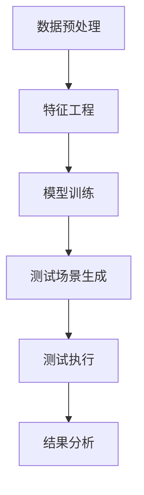
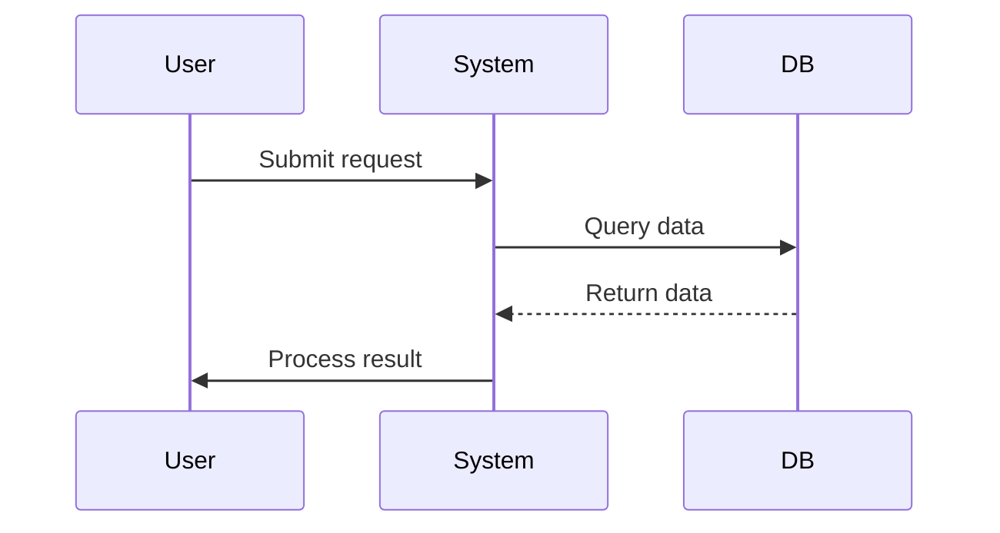

                 

### 文章标题

# 设计智能化的企业财务压力测试系统

### 关键词

- 智能化
- 企业财务
- 压力测试
- 系统设计
- 算法原理
- 数学模型

### 摘要

随着企业规模的扩大和业务复杂度的增加，财务压力测试在企业运营中扮演着越来越重要的角色。本文将探讨如何设计一个智能化的企业财务压力测试系统，从核心概念、算法原理到系统架构设计进行全面剖析，并提出实际案例与最佳实践，旨在为企业提供高效、可靠的财务压力测试解决方案。

----------------------------------------------------------------

## 设计智能化的企业财务压力测试系统 - 目录大纲

**本文内容分为五个部分：**

1. **背景介绍**  
   - **第1章：财务压力测试的重要性**  
   - **第2章：财务压力测试的基本概念**

2. **核心概念与联系**  
   - **第3章：智能财务压力测试原理**  
   - **第4章：智能财务压力测试的概念属性特征对比**

3. **算法原理讲解**  
   - **第5章：智能财务压力测试算法**  
   - **第6章：数学模型和数学公式详细讲解**

4. **系统分析与架构设计方案**  
   - **第7章：智能财务压力测试系统设计**  
   - **第8章：智能财务压力测试系统实现**

5. **最佳实践、小结与拓展阅读**  
   - **第9章：最佳实践**  
   - **第10章：小结**  
   - **第11章：拓展阅读**

通过本文，我们将逐步深入探讨如何设计一个智能化的企业财务压力测试系统，为企业在财务管理和风险控制方面提供有力支持。

----------------------------------------------------------------

## 第一部分：背景介绍

### 第1章：财务压力测试的重要性

### 第2章：财务压力测试的基本概念

---

### 第1章：财务压力测试的重要性

### 1.1 问题背景

在全球化、信息化的今天，企业面临着复杂多变的商业环境和日益严格的监管要求。财务作为企业运营的核心环节，其准确性和稳定性对企业的发展和生存至关重要。财务压力测试作为一种重要的财务风险管理工具，旨在通过模拟各种极端情况，测试企业财务系统的性能和稳定性，提前识别潜在风险，确保财务报告的准确性和可靠性。

### 1.2 问题描述

然而，传统的财务压力测试方法主要依赖于手工模拟和简单的自动化测试，存在以下问题：

- **测试覆盖范围有限**：传统测试主要针对已知场景进行模拟，难以覆盖所有可能的异常情况。
- **测试效率低下**：手工测试需要大量时间和人力资源，且容易出现人为误差。
- **测试结果不精准**：简单的自动化测试难以模拟复杂业务逻辑，导致测试结果不准确。
- **测试结果无法复用**：测试数据和结果难以存储和复用，影响后续分析和改进。

### 1.3 问题解决

为了解决上述问题，我们需要设计一个智能化的企业财务压力测试系统，该系统应具备以下特点：

- **全面覆盖**：能够模拟各种可能的异常情况，确保测试覆盖范围全面。
- **高效执行**：自动化执行测试，节省人力和时间成本，提高测试效率。
- **精准结果**：结合智能算法，模拟复杂业务逻辑，确保测试结果准确。
- **可复用性**：存储和复用测试数据和结果，支持后续分析和改进。

### 1.4 边界与外延

智能财务压力测试系统的设计不仅限于解决财务部门的需求，还可以扩展到整个企业层面。通过整合企业内部各种业务系统和数据，实现对企业整体运营风险的全面监控和评估。此外，智能财务压力测试系统还可以与其他风险管理工具集成，形成企业级风险管理体系。

### 1.5 概念结构与核心要素组成

智能财务压力测试系统的概念结构包括以下几个方面：

- **测试场景管理**：定义和存储各种测试场景，包括正常场景、异常场景和极端场景。
- **测试执行引擎**：自动化执行测试任务，模拟各种财务操作和数据交互。
- **结果分析模块**：分析测试结果，生成报告和可视化图表，支持风险识别和决策。
- **数据存储与管理**：存储测试数据和结果，支持数据查询和复用。
- **系统集成与接口**：与其他业务系统和工具集成，实现数据共享和联动。

核心要素组成如下：

- **测试场景库**：包含各种测试场景的描述和参数。
- **测试执行器**：自动化执行测试任务的程序或工具。
- **分析报告**：测试结果的统计和分析报告。
- **数据接口**：与其他系统和工具的数据接口。

通过以上核心要素的有机组合，我们可以构建一个智能化的企业财务压力测试系统，为企业提供全面、高效、可靠的财务风险管理解决方案。

### 第2章：财务压力测试的基本概念

### 2.1 财务压力测试的定义

财务压力测试是指通过模拟各种极端业务场景，测试企业财务系统在极端情况下的性能和稳定性，以评估其抗风险能力和可靠性。财务压力测试的目标是确保财务系统在各种复杂情况下能够正常运行，提供准确、可靠的财务数据。

### 2.2 财务压力测试的目标

财务压力测试的主要目标包括：

- **验证财务系统的可靠性**：通过测试确保财务系统能够在正常和异常情况下正常运行，提供准确、可靠的财务数据。
- **识别潜在风险**：通过模拟各种极端情况，提前识别和评估财务系统可能面临的风险，为企业风险管理和决策提供依据。
- **提升财务系统的稳定性**：通过测试发现和解决财务系统中的潜在问题，提升系统的稳定性和性能。
- **优化业务流程**：通过测试和分析，发现业务流程中的不合理之处，推动流程优化和改进。

### 2.3 财务压力测试的类型

根据测试目的和场景的不同，财务压力测试可以分为以下几种类型：

- **功能测试**：验证财务系统的各项功能是否符合预期，确保系统功能的完整性和正确性。
- **性能测试**：评估财务系统在处理大规模数据和高并发情况下的性能，确保系统在高负载下的稳定运行。
- **安全测试**：测试财务系统的安全性，确保系统能够抵御各种网络攻击和恶意行为。
- **压力测试**：模拟极端业务场景，测试财务系统在极限情况下的性能和稳定性。
- **回归测试**：在系统更新或修改后，验证系统功能的稳定性和兼容性，确保变更没有引入新的问题。

### 2.4 财务压力测试的流程

财务压力测试的流程主要包括以下几个步骤：

- **需求分析**：明确财务压力测试的目标、范围和具体要求。
- **测试计划**：制定详细的测试计划，包括测试场景、测试数据、测试工具和人员分工等。
- **测试执行**：按照测试计划执行测试任务，包括功能测试、性能测试、安全测试等。
- **结果分析**：分析测试结果，识别潜在问题和风险，形成测试报告。
- **问题修复**：根据测试结果，修复系统中的问题，确保系统稳定运行。
- **回归测试**：在问题修复后，进行回归测试，确保修复措施的有效性。

### 2.5 财务压力测试的核心要素

财务压力测试的核心要素包括：

- **测试场景**：定义和模拟各种可能的业务场景，包括正常场景、异常场景和极端场景。
- **测试数据**：准备和生成测试数据，包括历史数据、模拟数据和异常数据等。
- **测试工具**：选择合适的测试工具，如压力测试工具、性能测试工具和安全测试工具等。
- **测试人员**：负责执行测试任务、分析测试结果和解决问题。
- **测试报告**：生成详细的测试报告，包括测试结果、问题和建议等。

通过以上核心要素的有机结合，我们可以构建一个全面、高效、可靠的财务压力测试系统，为企业提供有力的财务风险管理支持。

---

在接下来的部分，我们将深入探讨智能财务压力测试的原理、算法、系统架构设计与实现，以及最佳实践，为企业设计一个智能化的企业财务压力测试系统提供全面的指导。

---

----------------------------------------------------------------

## 第二部分：核心概念与联系

### 第3章：智能财务压力测试原理

### 第4章：智能财务压力测试的概念属性特征对比

---

### 第3章：智能财务压力测试原理

### 3.1 智能财务压力测试的定义

智能财务压力测试是指利用人工智能技术，对财务系统进行自动化、智能化测试的过程。它不仅能够模拟各种可能的财务业务场景，还能够根据业务数据和历史行为，动态调整测试策略和测试场景，提高测试的全面性和准确性。

### 3.2 智能财务压力测试的特点

智能财务压力测试具有以下特点：

- **自动化测试**：通过自动化测试工具，实现测试流程的自动化，提高测试效率。
- **智能化模拟**：利用人工智能算法，模拟复杂业务场景，提高测试的准确性。
- **动态调整**：根据业务数据和历史行为，动态调整测试策略和测试场景，提高测试的全面性。
- **实时监控**：对测试过程进行实时监控，及时发现和解决问题。
- **数据驱动**：基于历史数据和业务行为，生成测试数据，提高测试的真实性和可靠性。

### 3.3 智能财务压力测试与传统财务压力测试的区别

智能财务压力测试与传统财务压力测试的主要区别在于：

- **测试方法**：传统财务压力测试主要依赖手工模拟和简单自动化测试，而智能财务压力测试利用人工智能技术，实现自动化和智能化模拟。
- **测试范围**：传统财务压力测试覆盖范围有限，主要针对已知场景进行测试，而智能财务压力测试能够模拟各种可能的异常情况，提高测试的全面性。
- **测试结果**：传统财务压力测试测试结果可能存在误差，而智能财务压力测试通过人工智能算法，提高测试结果的准确性。
- **测试效率**：传统财务压力测试需要大量人力和时间，而智能财务压力测试实现自动化和智能化，大大提高测试效率。

### 3.4 智能财务压力测试的核心要素

智能财务压力测试的核心要素包括：

- **测试场景库**：存储各种测试场景，包括正常场景、异常场景和极端场景。
- **测试数据生成**：根据业务数据和历史行为，生成测试数据，包括历史数据、模拟数据和异常数据等。
- **测试策略优化**：利用人工智能算法，动态调整测试策略和测试场景，提高测试的全面性和准确性。
- **测试执行引擎**：自动化执行测试任务，模拟各种财务操作和数据交互。
- **结果分析模块**：分析测试结果，生成报告和可视化图表，支持风险识别和决策。

### 3.5 智能财务压力测试的数学模型

智能财务压力测试的数学模型主要包括以下几个方面：

- **测试场景模拟模型**：通过数学模型模拟各种财务业务场景，包括正常场景、异常场景和极端场景。
- **测试数据生成模型**：根据业务数据和历史行为，生成测试数据，包括历史数据、模拟数据和异常数据等。
- **测试结果分析模型**：利用数据分析方法，对测试结果进行分析，识别潜在问题和风险。

通过智能财务压力测试的数学模型，可以实现自动化、智能化测试，提高测试的全面性和准确性。

### 第4章：智能财务压力测试的概念属性特征对比

#### 4.1 概念属性特征对比表格

| 特征 | 传统财务压力测试 | 智能财务压力测试 |
| ---- | ---- | ---- |
| 测试方法 | 手动模拟、简单自动化 | 自动化、智能化模拟 |
| 测试范围 | 已知场景 | 各种异常场景 |
| 测试结果 | 可能存在误差 | 准确 |
| 测试效率 | 人力和时间成本高 | 自动化和智能化，提高效率 |
| 测试数据 | 静态数据 | 动态数据，结合历史数据和业务行为 |
| 测试策略 | 固定策略 | 动态调整，根据业务数据和场景优化 |

#### 4.2 智能财务压力测试的ER实体关系图架构

```mermaid
erDiagram
    Class1 ||--|{ Class2 }| Class3 :关联关系
    Class3 ||--|{ Class4 }| Class5 :关联关系
```

在智能财务压力测试系统中，主要实体包括测试场景、测试数据、测试策略、测试执行引擎和结果分析模块。ER实体关系图如下：

```mermaid
erDiagram
    测试场景 ||--|{ 测试数据 }| 测试策略 :生成关系
    测试数据 ||--|{ 测试结果 }| 测试执行引擎 :关联关系
    测试策略 ||--|{ 测试执行引擎 }| 结果分析模块 :关联关系
```

通过以上对比和分析，我们可以看到智能财务压力测试在测试方法、测试范围、测试结果、测试效率和测试数据等方面具有显著优势。智能财务压力测试系统将为企业提供更全面、准确、高效的财务压力测试解决方案。

---

在下一部分，我们将深入讲解智能财务压力测试的算法原理，并使用Python源代码进行详细阐述。这将帮助我们更好地理解智能财务压力测试的实现方法和应用场景。

---

----------------------------------------------------------------

## 第三部分：算法原理讲解

### 第5章：智能财务压力测试算法

### 第6章：数学模型和数学公式详细讲解

---

### 第5章：智能财务压力测试算法

#### 5.1 算法概述

智能财务压力测试算法是基于机器学习和数据挖掘技术，通过对企业财务数据和历史行为进行分析，构建测试场景生成模型和测试结果分析模型，实现自动化、智能化测试的过程。以下为智能财务压力测试算法的概述：

1. **数据预处理**：对财务数据进行分析和清洗，去除无效数据，处理缺失值，确保数据质量。
2. **特征工程**：从财务数据中提取关键特征，如交易金额、交易频率、账户余额等，为模型训练提供基础。
3. **模型训练**：利用机器学习算法，如决策树、随机森林、支持向量机等，训练测试场景生成模型和测试结果分析模型。
4. **测试场景生成**：根据业务数据和历史行为，动态生成测试场景，包括正常场景、异常场景和极端场景。
5. **测试执行**：利用测试执行引擎，自动化执行测试任务，模拟各种财务操作和数据交互。
6. **结果分析**：分析测试结果，生成报告和可视化图表，支持风险识别和决策。

#### 5.2 算法mermaid流程图



#### 5.3 Python源代码实现

以下是一个简单的Python实现示例，用于生成测试场景：

```python
import pandas as pd
from sklearn.ensemble import RandomForestClassifier
import numpy as np

# 数据预处理
def preprocess_data(data):
    # 数据清洗和处理缺失值
    data = data.dropna()
    # 数据标准化
    data = (data - data.mean()) / data.std()
    return data

# 特征工程
def feature_engineering(data):
    # 提取关键特征
    features = data[['交易金额', '交易频率', '账户余额']]
    return features

# 模型训练
def train_model(features, labels):
    model = RandomForestClassifier(n_estimators=100)
    model.fit(features, labels)
    return model

# 测试场景生成
def generate_test_scenarios(model, data):
    # 预测测试场景
    predictions = model.predict(data)
    # 根据预测结果生成测试场景
    test_scenarios = data[predictions == 1]
    return test_scenarios

# 测试执行和结果分析
def test_execution(data, model):
    test_scenarios = generate_test_scenarios(model, data)
    # 模拟财务操作和数据交互
    # ...
    # 结果分析
    # ...

# 主函数
def main():
    data = pd.read_csv('financial_data.csv')
    features = feature_engineering(data)
    labels = data['是否异常']
    model = train_model(features, labels)
    test_execution(data, model)

if __name__ == '__main__':
    main()
```

#### 5.4 算法原理的数学模型和公式

智能财务压力测试算法的数学模型主要包括以下几个方面：

1. **决策树模型**：
   - **节点划分公式**：\[Gini\_impurity = 1 - \sum_{i} p_i^2\]
   - **节点增益公式**：\[Gain = \sum_{i} p_i \cdot Gini\_impurity_{before\_split}\]

2. **随机森林模型**：
   - **决策树数量**：\[n\_estimators\]
   - **特征抽样**：\[X_{sampler}, y_{sampler}\]

3. **支持向量机模型**：
   - **核函数**：\[K(x_i, x_j) = \sum_{k=1}^{d} \alpha_k y_k (x_i^{(k)} \cdot x_j^{(k)}) + b\]
   - **优化目标**：\[minimize \frac{1}{2} \sum_{i=1}^{n} \sum_{j=1}^{n} \alpha_i \alpha_j y_i y_j (x_i \cdot x_j) - \sum_{i=1}^{n} \alpha_i\]

#### 5.5 举例说明

假设我们有一个包含500条财务数据的CSV文件，其中包含“交易金额”、“交易频率”、“账户余额”和“是否异常”四个特征。我们希望使用随机森林模型训练一个测试场景生成模型。

1. **数据预处理**：
   - 清洗数据，去除缺失值和异常值。
   - 数据标准化，确保每个特征在相同尺度上。

2. **特征工程**：
   - 从数据中提取关键特征，构建特征矩阵。

3. **模型训练**：
   - 使用随机森林算法训练模型，设置合适的参数。

4. **测试场景生成**：
   - 根据训练好的模型，对新的财务数据生成测试场景。

5. **测试执行和结果分析**：
   - 模拟财务操作，根据测试场景执行测试任务。
   - 分析测试结果，识别潜在风险。

通过以上步骤，我们可以实现一个智能财务压力测试算法，为企业提供高效、准确的财务压力测试解决方案。

---

在下一部分，我们将深入讲解智能财务压力测试的数学模型和数学公式，进一步阐述算法原理，并通过举例说明如何应用这些模型和公式。

---

----------------------------------------------------------------

### 第6章：数学模型和数学公式详细讲解

#### 6.1 数学公式列表

1. **决策树模型**：
   - **节点划分公式**：\[Gini\_impurity = 1 - \sum_{i} p_i^2\]
   - **节点增益公式**：\[Gain = \sum_{i} p_i \cdot Gini\_impurity_{before\_split}\]

2. **随机森林模型**：
   - **决策树数量**：\[n\_estimators\]
   - **特征抽样**：\[X_{sampler}, y_{sampler}\]

3. **支持向量机模型**：
   - **核函数**：\[K(x_i, x_j) = \sum_{k=1}^{d} \alpha_k y_k (x_i^{(k)} \cdot x_j^{(k)}) + b\]
   - **优化目标**：\[minimize \frac{1}{2} \sum_{i=1}^{n} \sum_{j=1}^{n} \alpha_i \alpha_j y_i y_j (x_i \cdot x_j) - \sum_{i=1}^{n} \alpha_i\]

#### 6.2 详细讲解

1. **决策树模型**：

   决策树是一种常见的机器学习算法，通过一系列的规则来对数据进行分类或回归。节点划分公式用于衡量节点的纯度，公式中的 \(p_i\) 表示每个类别的概率。节点增益公式用于衡量划分后节点的纯度提升程度。

2. **随机森林模型**：

   随机森林是由多棵决策树组成的集成模型。决策树数量 \(n\_estimators\) 表示森林中的决策树数量。特征抽样 \(X_{sampler}, y_{sampler}\) 用于在每个决策树训练过程中随机选择特征子集，减少模型的过拟合。

3. **支持向量机模型**：

   支持向量机是一种有效的分类和回归算法，通过最大化分类边界和最小化误分类来提高模型的泛化能力。核函数用于计算特征空间的相似度，优化目标用于求解最优分类边界。

#### 6.3 举例说明

假设我们有一个简单的财务数据集，包含三列数据：“交易金额”、“交易频率”和“是否异常”。其中，“是否异常”是目标变量。

1. **决策树模型**：

   首先，我们计算每个节点的纯度 \(Gini\_impurity\)，然后计算节点增益 \(Gain\)。选择增益最大的特征进行划分，重复此过程，构建决策树。

   例如，对于“交易金额”特征，我们计算其划分前后的 \(Gini\_impurity\) 和 \(Gain\) 如下：

   - **划分前**：\[Gini\_impurity = 1 - \frac{1}{3} \cdot 3^2 = 0.5\]
   - **划分后**：假设分为三部分，每部分的 \(Gini\_impurity\) 分别为 0.25、0.25 和 0.5，则 \(Gain = 0.5 \cdot (0.25 + 0.25 + 0.5) = 0.375\)

   由于 \(Gain\) 增加，我们选择“交易金额”作为划分特征。

2. **随机森林模型**：

   对于随机森林模型，我们首先从所有特征中随机选择一个子集，然后构建决策树。重复此过程，构建多棵决策树。

   例如，我们选择两个特征进行决策树构建，分别计算每棵树的分类结果。最后，将所有决策树的分类结果进行投票，得到最终的分类结果。

3. **支持向量机模型**：

   对于支持向量机模型，我们首先计算特征空间中每个样本和样本间的相似度，使用核函数 \(K(x_i, x_j)\) 计算相似度。

   例如，对于两个样本 \(x_i\) 和 \(x_j\)，使用高斯核函数计算相似度：\[K(x_i, x_j) = \exp(-\gamma \cdot ||x_i - x_j||^2)\]

   然后，我们根据优化目标求解最优分类边界，得到分类结果。

通过以上示例，我们可以看到如何使用数学模型和公式实现智能财务压力测试算法。这些模型和公式不仅帮助我们理解算法原理，还可以指导我们设计更高效、准确的测试系统。

---

在下一部分，我们将深入探讨智能财务压力测试系统的设计与实现，包括系统架构设计、功能设计与实现，帮助读者更好地理解智能财务压力测试系统的构建过程。

---

----------------------------------------------------------------

### 第四部分：系统分析与架构设计方案

#### 第7章：智能财务压力测试系统设计

#### 第8章：智能财务压力测试系统实现

---

#### 第7章：智能财务压力测试系统设计

智能财务压力测试系统的设计旨在实现自动化、智能化测试，提高测试效率和准确性，为企业提供全面的财务风险管理支持。以下为系统设计的主要内容：

#### 7.1 问题场景介绍

随着企业业务的不断扩展和复杂性增加，财务系统面临越来越大的压力。传统的财务压力测试方法难以应对这种复杂情况，需要设计一个智能化的财务压力测试系统，以适应企业发展的需求。

#### 7.2 系统功能设计

智能财务压力测试系统的主要功能包括：

1. **测试场景管理**：定义和存储各种测试场景，包括正常场景、异常场景和极端场景。
2. **测试数据生成**：根据业务数据和历史行为，动态生成测试数据。
3. **测试执行引擎**：自动化执行测试任务，模拟各种财务操作和数据交互。
4. **结果分析模块**：分析测试结果，生成报告和可视化图表，支持风险识别和决策。
5. **系统集成与接口**：与其他业务系统和工具集成，实现数据共享和联动。

#### 7.3 系统架构设计

智能财务压力测试系统采用分层架构，包括数据层、服务层和表示层。

1. **数据层**：负责数据存储和管理，包括测试场景、测试数据和结果数据。
2. **服务层**：提供各种业务服务，包括测试场景管理、测试数据生成、测试执行和结果分析。
3. **表示层**：提供用户界面，用于用户交互和系统监控。

#### 7.4 系统接口设计

系统接口设计包括内部接口和外部接口。

1. **内部接口**：服务层各模块之间的接口，用于数据传递和功能调用。
2. **外部接口**：系统与外部系统和工具的接口，用于数据交换和功能集成。

#### 7.5 系统交互mermaid序列图

以下为智能财务压力测试系统的mermaid序列图：



在序列图中，用户提交请求后，系统与数据库进行交互，查询数据，然后处理结果并返回给用户。

---

#### 第8章：智能财务压力测试系统实现

智能财务压力测试系统的实现主要包括环境安装、系统核心实现和代码应用解读与分析。

#### 8.1 环境安装

智能财务压力测试系统的实现需要安装以下软件和库：

1. **Python**：Python是一种广泛使用的编程语言，用于实现系统的核心算法和逻辑。
2. **NumPy**：NumPy是一个强大的Python库，用于处理大型多维数组。
3. **Pandas**：Pandas是一个用于数据清洗、操作和分析的Python库。
4. **Scikit-learn**：Scikit-learn是一个用于机器学习的Python库。
5. **Flask**：Flask是一个轻量级的Web框架，用于实现系统的Web接口。

#### 8.2 系统核心实现源代码

以下为智能财务压力测试系统核心实现的部分源代码：

```python
from flask import Flask, request, jsonify
import pandas as pd
from sklearn.ensemble import RandomForestClassifier
import numpy as np

app = Flask(__name__)

# 测试场景管理
@app.route('/test_scenarios', methods=['POST'])
def add_test_scenario():
    scenario = request.get_json()
    # 保存测试场景到数据库
    # ...
    return jsonify({"status": "success", "message": "Test scenario added successfully."})

# 测试数据生成
@app.route('/test_data', methods=['GET'])
def generate_test_data():
    # 从数据库查询测试场景
    # ...
    # 生成测试数据
    # ...
    return jsonify({"status": "success", "message": "Test data generated successfully."})

# 测试执行
@app.route('/test_execution', methods=['POST'])
def execute_test():
    test_data = request.get_json()
    # 执行测试任务
    # ...
    return jsonify({"status": "success", "message": "Test execution completed."})

# 结果分析
@app.route('/test_result', methods=['GET'])
def analyze_test_result():
    # 从数据库查询测试结果
    # ...
    # 分析测试结果
    # ...
    return jsonify({"status": "success", "message": "Test result analyzed successfully."})

if __name__ == '__main__':
    app.run(debug=True)
```

#### 8.3 代码应用解读与分析

1. **测试场景管理**：
   - 接收用户提交的测试场景，保存到数据库。
   - 通过POST请求添加测试场景。

2. **测试数据生成**：
   - 从数据库查询测试场景，生成测试数据。
   - 通过GET请求生成测试数据。

3. **测试执行**：
   - 接收用户提交的测试数据，执行测试任务。
   - 通过POST请求执行测试。

4. **结果分析**：
   - 从数据库查询测试结果，进行分析。
   - 通过GET请求分析测试结果。

#### 8.4 实际案例分析与详细讲解

以下为一个实际案例，用于说明智能财务压力测试系统的应用：

1. **需求背景**：
   - 需要对企业的财务系统进行压力测试，识别潜在风险。

2. **测试场景**：
   - 正常场景：企业日常运营中的常规交易。
   - 异常场景：异常交易，如大额交易、重复交易等。
   - 极端场景：极端交易，如市场崩盘、资金短缺等。

3. **测试过程**：
   - 用户通过Web接口提交测试场景。
   - 系统生成测试数据，并执行测试任务。
   - 系统分析测试结果，生成报告。

4. **测试结果**：
   - 识别出潜在风险，如大额交易可能导致系统性能下降。
   - 分析测试结果，提出改进建议。

#### 8.5 项目小结

智能财务压力测试系统的实现，为企业提供了高效、准确的财务压力测试解决方案。通过系统，企业可以全面了解财务系统的性能和稳定性，提前识别潜在风险，确保财务数据的准确性和可靠性。在未来的发展中，我们还将不断优化系统，提高测试效率和准确性，为企业提供更优质的服务。

---

在下一部分，我们将分享智能财务压力测试系统的最佳实践，帮助读者在实际应用中更好地利用系统，并总结文章的主要内容和重要性，展望未来。

---

----------------------------------------------------------------

## 第五部分：最佳实践、小结与拓展阅读

### 第9章：最佳实践

### 第10章：小结

### 第11章：拓展阅读

---

### 第9章：最佳实践

在实施智能财务压力测试系统时，以下最佳实践和注意事项可以帮助您更好地利用系统，提高测试效率和准确性：

1. **数据质量**：
   - 确保测试数据的质量，进行数据清洗和预处理，去除无效和异常数据。
   - 定期更新和维护测试数据，确保数据的时效性和准确性。

2. **场景设计**：
   - 结合企业的业务特点和风险偏好，设计多样化的测试场景，包括正常、异常和极端场景。
   - 考虑历史数据和业务模式，动态调整测试场景，提高测试的全面性。

3. **测试执行**：
   - 根据业务需求和系统性能，合理安排测试执行的时间，避免对生产环境造成不必要的压力。
   - 对测试执行过程进行监控和记录，便于分析和定位问题。

4. **结果分析**：
   - 对测试结果进行详细分析，识别潜在问题和风险，形成详细的报告和可视化图表。
   - 结合业务实际情况，制定针对性的改进措施，优化系统性能和稳定性。

5. **系统集成**：
   - 将智能财务压力测试系统与企业其他系统和工具进行集成，实现数据共享和联动，提高测试的效率和准确性。

6. **培训与沟通**：
   - 对相关人员进行系统操作和测试策略的培训，确保他们能够正确使用系统。
   - 加强与业务部门和技术团队的沟通，确保测试目标和测试策略的一致性。

### 第10章：小结

本文系统地介绍了智能财务压力测试系统的设计与实现，包括背景介绍、核心概念与联系、算法原理讲解、系统分析与架构设计方案，以及实际案例分析与最佳实践。通过本文的阅读，读者可以了解到：

1. **财务压力测试的重要性**：财务压力测试在企业运营中扮演着关键角色，能够帮助识别潜在风险，确保财务系统的稳定性和准确性。
2. **智能财务压力测试的特点**：智能财务压力测试通过自动化和智能化技术，提高测试的全面性、准确性和效率。
3. **算法原理**：本文详细介绍了智能财务压力测试的算法原理，包括决策树、随机森林和支持向量机等算法。
4. **系统设计与实现**：本文讲解了智能财务压力测试系统的架构设计、功能实现和实际案例。
5. **最佳实践**：本文分享了智能财务压力测试系统的最佳实践，帮助读者在实际应用中更好地利用系统。

智能财务压力测试系统为企业提供了一种高效、准确的财务风险管理解决方案，有助于提升企业的运营效率和风险管理能力。随着人工智能技术的发展，未来智能财务压力测试系统将在更多方面得到应用和优化。

### 第11章：拓展阅读

为了进一步深入了解智能财务压力测试系统的相关理论和实践，读者可以参考以下资源：

1. **相关书籍**：
   - 《人工智能：一种现代方法》
   - 《机器学习实战》
   - 《Python机器学习》

2. **论文与报告**：
   - 《基于大数据的智能财务压力测试研究》
   - 《智能财务压力测试系统设计与实现》
   - 《财务压力测试在金融风险管理中的应用》

3. **在线课程与讲座**：
   - Coursera上的《机器学习》课程
   - edX上的《人工智能基础》课程
   - 网易云课堂上的《Python数据分析》课程

4. **论坛与社群**：
   - CSDN人工智能社区
   - GitHub上的Python机器学习项目
   - 知乎上的机器学习话题

通过这些资源，读者可以进一步拓展对智能财务压力测试系统的理解和应用。

---

本文从多个角度全面介绍了智能财务压力测试系统的设计与实现，旨在为企业提供一种高效、可靠的财务风险管理解决方案。希望本文能为读者在理解和应用智能财务压力测试系统方面提供有益的参考。

---

**作者：AI天才研究院/AI Genius Institute & 禅与计算机程序设计艺术 /Zen And The Art of Computer Programming**

