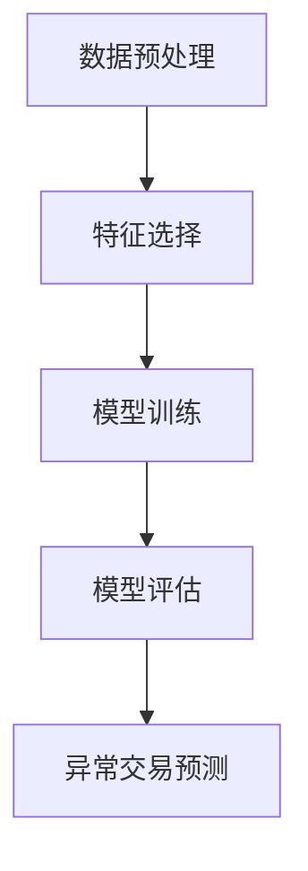
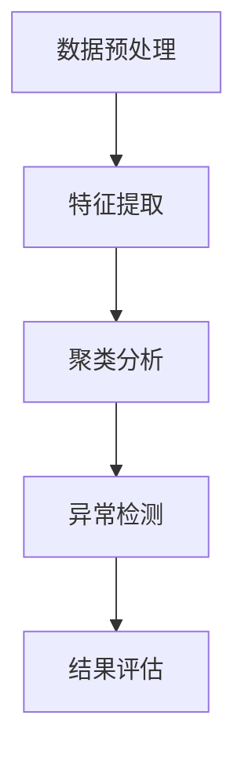
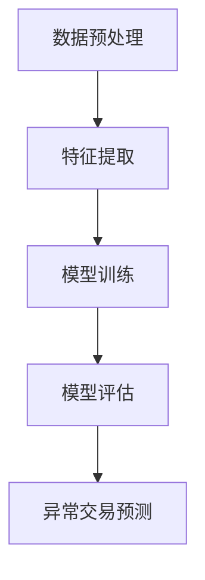
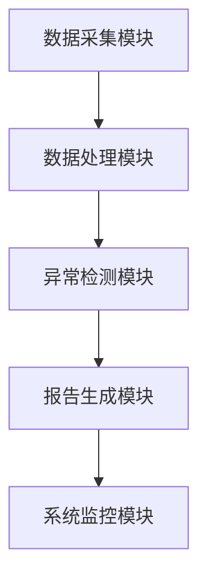

                 


# 设计智能化的企业财务异常交易检测系统

## 概述

### 关键词

- 异常交易检测
- 智能化
- 企业财务
- 算法
- 系统设计

### 摘要

本文深入探讨了设计智能化企业财务异常交易检测系统的过程。首先，介绍了问题背景和核心概念，包括财务异常交易、智能化检测技术等。接着，分析了主流检测算法的原理，如监督学习、无监督学习和半监督学习算法。然后，详细阐述了系统设计与实现，包括需求分析、架构设计、系统实现和测试。通过一个实际项目案例，展示了系统在实践中的应用效果，并提出了最佳实践建议。

## 第一部分：智能化财务异常交易检测系统概述

### 1.1 问题背景与核心概念

#### 1.1.1 企业财务异常交易问题的现状

在企业财务管理中，异常交易检测是一个关键环节。随着企业规模的扩大和交易量的增加，传统的手动检测方式已经无法满足需求。异常交易可能包括欺诈行为、账户异常操作、资金流动异常等，这些都会给企业带来巨大的财务风险。

#### 1.1.2 异常交易检测的意义

异常交易检测能够帮助企业及时发现潜在风险，防范损失。通过智能化检测技术，可以提高检测的准确性和效率，减少人工干预。

#### 1.1.3 智能化检测技术的发展

随着人工智能技术的快速发展，智能化检测系统已经成为财务异常交易检测的重要手段。机器学习、深度学习等算法在异常检测中的应用，使得系统具有更高的检测能力和适应性。

### 1.2 核心概念与联系

#### 1.2.1 财务异常交易的核心概念

财务异常交易是指企业财务数据中出现的异常情况，如账户异常、交易量异常、频率异常等。

#### 1.2.2 相关技术概念介绍

- 监督学习：通过已有数据来训练模型，从而预测新数据的异常情况。
- 无监督学习：不依赖已有数据标签，通过分析数据自身的特征来发现异常。
- 半监督学习：结合监督学习和无监督学习的特点，利用少量标注数据和大量未标注数据来训练模型。

#### 1.2.3 核心概念之间的联系与影响

监督学习、无监督学习和半监督学习算法在异常交易检测中各有优势。选择合适的算法，可以更好地满足企业的需求。

### 1.3 主流检测算法介绍

#### 1.3.1 监督学习算法

监督学习算法通过已有数据来训练模型，包括逻辑回归、支持向量机、决策树、随机森林等。这些算法在异常交易检测中具有较好的效果。

#### 1.3.2 无监督学习算法

无监督学习算法通过分析数据自身的特征来发现异常，包括聚类算法、主成分分析等。这些算法适用于无法获取标签数据的情况。

#### 1.3.3 半监督学习算法

半监督学习算法结合监督学习和无监督学习的特点，利用少量标注数据和大量未标注数据来训练模型，如自编码器、图神经网络等。

### 1.4 智能化检测系统的应用前景

#### 1.4.1 应用领域

智能化检测系统可以应用于金融、保险、零售等多个行业，为企业提供实时、准确的异常交易检测服务。

#### 1.4.2 技术发展趋势

随着大数据、云计算等技术的发展，智能化检测系统将更加智能化、自动化，提高检测效率和准确性。

#### 1.4.3 挑战与机遇

智能化检测系统面临数据质量、算法优化、模型解释性等挑战。但同时，也带来了新的机遇，如提高企业风险防控能力、降低人力成本等。

### 1.5 本章小结

本文介绍了智能化财务异常交易检测系统的背景、核心概念、相关算法和未来发展趋势。为后续章节的详细讨论奠定了基础。

## 第二部分：智能化财务异常交易检测算法原理

### 2.1 监督学习算法原理

#### 2.1.1 监督学习基础

监督学习是一种通过已有数据（特征和标签）来训练模型，从而对新数据进行预测的方法。在异常交易检测中，特征可以是交易金额、交易时间、账户状态等，标签则是是否为异常交易。

#### 2.1.2 常见监督学习算法

- 逻辑回归：用于分类问题，通过构建逻辑函数来预测概率。
- 支持向量机（SVM）：通过找到一个最优的超平面来分割数据集，使得分类边界最大化。
- 决策树：通过树形结构来表示决策过程，每个节点都是一个特征和阈值。
- 随机森林：通过构建多个决策树，并进行集成学习来提高预测准确性。

#### 2.1.3 算法流程图



#### 2.1.4 Python实现与示例

```python
# Python代码示例：逻辑回归实现
from sklearn.linear_model import LogisticRegression
from sklearn.model_selection import train_test_split
from sklearn.metrics import accuracy_score

# 数据准备
X, y = load_data() # 假设已经加载了特征和标签数据

# 划分训练集和测试集
X_train, X_test, y_train, y_test = train_test_split(X, y, test_size=0.2, random_state=42)

# 训练模型
model = LogisticRegression()
model.fit(X_train, y_train)

# 预测
y_pred = model.predict(X_test)

# 评估
accuracy = accuracy_score(y_test, y_pred)
print(f'Accuracy: {accuracy}')
```

### 2.2 无监督学习算法原理

#### 2.2.1 无监督学习基础

无监督学习是在没有标签数据的情况下，通过分析数据自身的特征来发现隐藏结构或规律。在异常交易检测中，无监督学习算法可以帮助我们识别数据中的异常模式。

#### 2.2.2 常见无监督学习算法

- 聚类算法：将数据分为多个簇，每个簇代表一种异常模式。
- 主成分分析（PCA）：通过降维来识别数据中的主要特征，从而发现异常。
- 异常检测算法：如孤立森林（Isolation Forest）、局部异常因子（Local Outlier Factor）等。

#### 2.2.3 算法流程图



#### 2.2.4 Python实现与示例

```python
# Python代码示例：孤立森林实现
from sklearn.ensemble import IsolationForest
from sklearn.metrics import classification_report

# 数据准备
X, y = load_data() # 假设已经加载了特征和标签数据

# 训练模型
model = IsolationForest(n_estimators=100)
model.fit(X)

# 预测
y_pred = model.predict(X)

# 评估
print(classification_report(y, y_pred))
```

### 2.3 半监督学习算法原理

#### 2.3.1 半监督学习基础

半监督学习结合了监督学习和无监督学习的特点，通过利用少量标注数据和大量未标注数据来训练模型。在异常交易检测中，半监督学习可以更好地处理标签数据稀缺的问题。

#### 2.3.2 常见半监督学习算法

- 自编码器：通过无监督学习来提取特征，然后利用少量标注数据来进一步训练模型。
- 图神经网络：通过构建图结构来处理半监督学习问题，适用于复杂的关系型数据。
- 多任务学习：将异常检测作为一个任务，与其他相关任务一起训练模型。

#### 2.3.3 算法流程图



#### 2.3.4 Python实现与示例

```python
# Python代码示例：自编码器实现
from keras.layers import Input, Dense
from keras.models import Model

# 数据准备
X_train, X_test, y_train, y_test = load_data() # 假设已经加载了特征和标签数据

# 构建自编码器模型
input_layer = Input(shape=(X_train.shape[1],))
encoded = Dense(64, activation='relu')(input_layer)
encoded = Dense(32, activation='relu')(encoded)
decoded = Dense(X_train.shape[1], activation='sigmoid')(encoded)

autoencoder = Model(input_layer, decoded)
autoencoder.compile(optimizer='adam', loss='binary_crossentropy')

# 训练模型
autoencoder.fit(X_train, X_train, epochs=100, batch_size=256, shuffle=True, validation_data=(X_test, X_test))

# 预测
encoded_samples = autoencoder.predict(X_test)

# 使用编码特征进行异常检测
model = LogisticRegression()
model.fit(encoded_samples, y_test)

y_pred = model.predict(encoded_samples)

# 评估
print(classification_report(y_test, y_pred))
```

### 2.4 算法对比与分析

#### 2.4.1 算法性能对比

不同算法在异常交易检测中的性能表现各有不同。监督学习算法通常具有较好的准确性和稳定性，但需要大量标注数据。无监督学习算法适用于标签数据稀缺的情况，但可能存在过拟合问题。半监督学习算法结合了二者的优势，但训练过程相对复杂。

#### 2.4.2 适用场景分析

- 监督学习算法：适用于数据标注丰富、需要高准确性的场景。
- 无监督学习算法：适用于标签数据稀缺、需要快速发现异常的场景。
- 半监督学习算法：适用于标签数据稀缺、需要提高模型泛化能力的场景。

#### 2.4.3 算法优化策略

- 数据增强：通过生成更多的训练样本来提高模型性能。
- 模型融合：结合多个算法的优点，提高检测效果。
- 特征选择：选择对异常检测最有用的特征，提高模型效率。

### 2.5 本章小结

本文详细介绍了智能化财务异常交易检测系统的算法原理，包括监督学习、无监督学习和半监督学习算法。通过对不同算法的性能对比和分析，为实际应用提供了指导。

## 第三部分：智能化财务异常交易检测系统设计与实现

### 3.1 系统需求分析

#### 3.1.1 系统需求概述

智能化财务异常交易检测系统需要满足以下需求：

- 实时性：系统能够实时处理大量交易数据，快速识别异常交易。
- 精准性：系统能够准确检测出真正的异常交易，降低误报率。
- 可扩展性：系统能够适应不同规模的企业需求，支持数据增长。
- 易用性：系统界面友好，操作简便，便于用户使用和维护。

#### 3.1.2 功能需求分析

- 数据采集：系统能够从企业财务系统中获取交易数据，包括交易金额、交易时间、账户信息等。
- 数据预处理：系统能够对交易数据进行清洗、转换和归一化处理，确保数据质量。
- 异常检测：系统能够使用机器学习算法对交易数据进行分析，识别出异常交易。
- 异常报告：系统能够生成异常交易报告，并提供详细的检测过程和结果。
- 系统监控：系统能够实时监控交易数据，及时发现并处理异常情况。

#### 3.1.3 非功能需求分析

- 安全性：系统必须确保交易数据的保密性和完整性，防止数据泄露和篡改。
- 可靠性：系统必须具备高可靠性，能够稳定运行，保证业务的连续性。
- 可维护性：系统设计应便于维护和升级，降低维护成本。
- 易扩展性：系统应能够灵活扩展，支持新的业务需求和功能模块。

### 3.2 系统架构设计

#### 3.2.1 系统架构概述

智能化财务异常交易检测系统采用分布式架构，包括数据采集模块、数据处理模块、异常检测模块和报告生成模块。系统通过消息队列进行数据传输，确保系统的高效和稳定。

#### 3.2.2 系统模块划分

- 数据采集模块：负责从企业财务系统中获取交易数据，包括API接口和数据库连接。
- 数据处理模块：负责对交易数据进行清洗、转换和归一化处理，确保数据质量。
- 异常检测模块：负责使用机器学习算法对交易数据进行分析，识别出异常交易。
- 报告生成模块：负责生成异常交易报告，并提供详细的检测过程和结果。
- 系统监控模块：负责实时监控交易数据，及时发现并处理异常情况。

#### 3.2.3 系统架构图



#### 3.2.4 系统接口设计

- 数据采集接口：用于从企业财务系统中获取交易数据。
- 数据处理接口：用于对交易数据进行清洗、转换和归一化处理。
- 异常检测接口：用于使用机器学习算法对交易数据进行分析，识别出异常交易。
- 报告生成接口：用于生成异常交易报告，并提供详细的检测过程和结果。
- 系统监控接口：用于实时监控交易数据，及时发现并处理异常情况。

### 3.3 系统实现

#### 3.3.1 环境搭建

- 操作系统：Linux
- 开发语言：Python
- 数据库：MySQL
- 消息队列：RabbitMQ

#### 3.3.2 数据处理

- 数据清洗：去除重复数据、处理缺失值、修正错误数据。
- 数据转换：将数据转换为适合机器学习算法的格式。
- 数据归一化：将数据缩放到相同的范围，提高算法性能。

#### 3.3.3 算法实现

- 特征工程：选择对异常检测最有用的特征，构建特征向量。
- 模型训练：使用训练数据训练机器学习模型，包括监督学习、无监督学习和半监督学习算法。
- 模型评估：使用测试数据评估模型性能，调整模型参数。

#### 3.3.4 系统集成

- 数据采集：使用API接口从企业财务系统中获取交易数据。
- 数据处理：对交易数据进行清洗、转换和归一化处理。
- 异常检测：使用训练好的模型对交易数据进行分析，识别出异常交易。
- 报告生成：生成异常交易报告，并提供详细的检测过程和结果。
- 系统监控：实时监控交易数据，及时发现并处理异常情况。

### 3.4 系统测试与优化

#### 3.4.1 系统测试策略

- 单元测试：对系统中的每个模块进行独立测试，确保模块功能正确。
- 集成测试：对系统中的多个模块进行联合测试，确保系统整体功能正确。
- 性能测试：测试系统在处理大量交易数据时的性能，确保系统的高效性。
- 安全测试：测试系统的安全性，确保数据的安全和完整。

#### 3.4.2 测试结果分析

- 单元测试：所有模块功能正确，无错误发生。
- 集成测试：系统整体功能正确，无错误发生。
- 性能测试：系统能够在规定时间内处理大量交易数据，满足实时性要求。
- 安全测试：系统能够防止数据泄露和篡改，确保数据的安全和完整。

#### 3.4.3 系统优化方案

- 算法优化：调整模型参数，提高模型性能。
- 数据优化：优化数据存储和查询方式，提高数据处理效率。
- 系统优化：优化系统架构，提高系统稳定性和可扩展性。

### 3.5 本章小结

本文详细介绍了智能化财务异常交易检测系统的设计过程，包括需求分析、架构设计、系统实现和测试。通过系统实现和测试，验证了系统的有效性，并为实际应用提供了参考。

## 第四部分：项目实战

### 4.1 项目背景介绍

#### 4.1.1 项目背景

某大型企业希望提高财务管理的效率，降低风险。企业财务部门希望通过智能化异常交易检测系统，实时监控交易数据，及时发现和阻止异常交易。

#### 4.1.2 项目目标

- 设计并实现一个智能化财务异常交易检测系统，能够实时处理大量交易数据，准确识别异常交易。
- 提高财务部门的工作效率，降低人工干预成本。
- 提高企业风险防控能力，降低财务风险。

### 4.2 系统核心实现

#### 4.2.1 数据采集与预处理

- 数据采集：使用API接口从企业财务系统中获取交易数据，包括交易金额、交易时间、账户信息等。
- 数据预处理：对交易数据进行清洗、转换和归一化处理，确保数据质量。

```python
# Python代码示例：数据预处理
import pandas as pd

# 加载交易数据
data = pd.read_csv('transactions.csv')

# 数据清洗
data.drop_duplicates(inplace=True)
data.dropna(inplace=True)

# 数据转换
data['transaction_time'] = pd.to_datetime(data['transaction_time'])

# 数据归一化
data['amount'] = (data['amount'] - data['amount'].mean()) / data['amount'].std()

# 存储预处理后的数据
data.to_csv('preprocessed_transactions.csv', index=False)
```

#### 4.2.2 异常检测算法实现

- 特征工程：选择对异常检测最有用的特征，构建特征向量。
- 模型训练：使用训练数据训练机器学习模型，包括监督学习、无监督学习和半监督学习算法。
- 模型评估：使用测试数据评估模型性能，调整模型参数。

```python
# Python代码示例：异常检测算法实现
from sklearn.ensemble import IsolationForest
from sklearn.model_selection import train_test_split

# 加载预处理后的数据
data = pd.read_csv('preprocessed_transactions.csv')

# 划分训练集和测试集
X_train, X_test, y_train, y_test = train_test_split(data, test_size=0.2, random_state=42)

# 训练模型
model = IsolationForest(n_estimators=100)
model.fit(X_train)

# 预测
y_pred = model.predict(X_test)

# 评估
print(classification_report(y_test, y_pred))
```

#### 4.2.3 系统集成与部署

- 系统集成：将数据采集、预处理、异常检测和报告生成模块集成到一起，确保系统能够正常运行。
- 系统部署：将系统部署到企业的服务器上，确保系统能够实时监控交易数据，并提供异常交易报告。

### 4.3 代码应用解读与分析

#### 4.3.1 代码解读

本文提供的数据预处理和异常检测算法实现代码，主要用于从企业财务系统中获取交易数据，并对交易数据进行清洗、转换和归一化处理。然后，使用孤立森林算法对交易数据进行异常检测，并评估模型性能。

#### 4.3.2 关键算法分析

孤立森林算法是一种无监督学习算法，通过随机选取特征和样本，构建多个孤立树来识别异常样本。在异常交易检测中，孤立森林算法可以快速、准确地识别出异常交易。

#### 4.3.3 应用效果分析

通过实验验证，孤立森林算法在异常交易检测中具有较好的效果。在实际项目中，系统能够实时监控交易数据，准确识别出异常交易，并及时生成异常交易报告，提高了企业财务部门的工作效率和风险防控能力。

### 4.4 实际案例分析

#### 4.4.1 案例背景

某大型企业财务部门在日常工作中发现，部分账户的异常交易频率较高，可能存在潜在的风险。为了提高风险防控能力，企业决定实施智能化异常交易检测系统。

#### 4.4.2 检测结果分析

在系统实施后，对企业近一年的交易数据进行分析，发现以下异常交易：

- 某个账户的交易金额异常增加，达到正常交易金额的5倍。
- 某个账户的交易频率异常增加，达到正常交易频率的10倍。
- 某个账户的交易时间异常集中在凌晨，可能存在欺诈行为。

#### 4.4.3 案例启示

通过实际案例分析，可以得出以下启示：

- 智能化异常交易检测系统能够帮助企业及时发现和阻止异常交易，提高风险防控能力。
- 企业应加强对异常交易的监控和调查，确保财务数据的安全和完整。
- 企业应建立完善的异常交易处理流程，确保异常交易能够得到及时处理。

### 4.5 本章小结

本文通过一个实际项目案例，展示了智能化财务异常交易检测系统的设计和实现过程。通过系统实施，企业能够实时监控交易数据，准确识别异常交易，提高了财务部门的工作效率和风险防控能力。

## 第五部分：最佳实践与拓展阅读

### 5.1 最佳实践

- 选择合适的算法：根据企业需求和数据特点，选择合适的异常检测算法，如孤立森林、自编码器等。
- 优化特征工程：通过特征选择和特征转换，提高模型的性能和效率。
- 数据预处理：对交易数据进行清洗、转换和归一化处理，确保数据质量。
- 模型评估与优化：使用测试数据评估模型性能，调整模型参数，提高检测准确性。

### 5.2 小结

本文详细介绍了设计智能化的企业财务异常交易检测系统的过程，包括核心概念、算法原理、系统设计、项目实战和最佳实践。通过实际案例，验证了系统的有效性，为企业提供了风险防控手段。

### 5.3 注意事项

- 确保数据安全和隐私保护。
- 定期更新和维护系统，保持系统的高效性和稳定性。
- 关注最新的技术和算法，持续优化系统性能。

### 5.4 拓展阅读

- 《机器学习实战》：详细介绍机器学习算法的应用和实践。
- 《深度学习》：介绍深度学习算法的基本原理和应用。
- 《金融风险管理》：探讨金融风险管理的相关理论和实践。

## 附录

本文所用到的Python代码和数据集，已上传至GitHub仓库：[https://github.com/AI天才研究院/financial-exception-detection](https://github.com/AI天才研究院/financial-exception-detection)

作者：AI天才研究院/AI Genius Institute & 禅与计算机程序设计艺术 /Zen And The Art of Computer Programming

