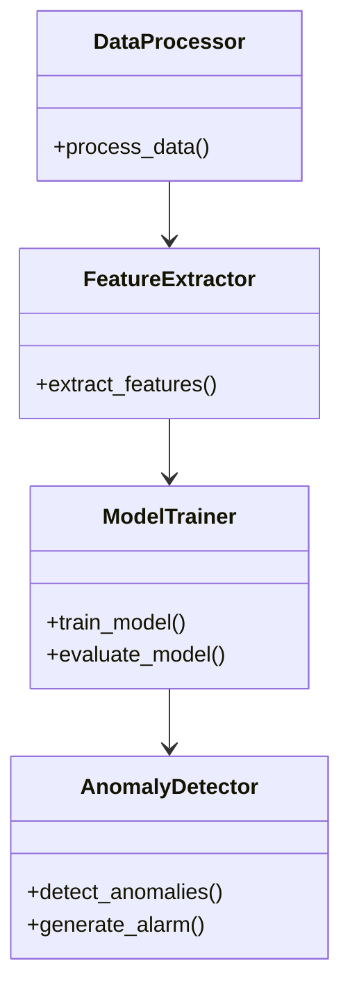
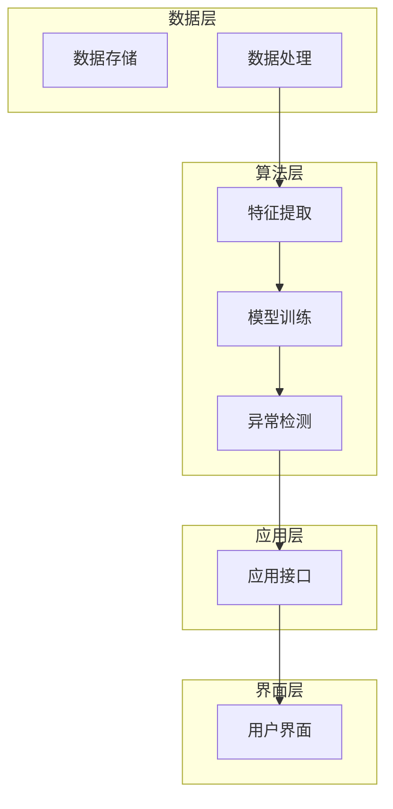
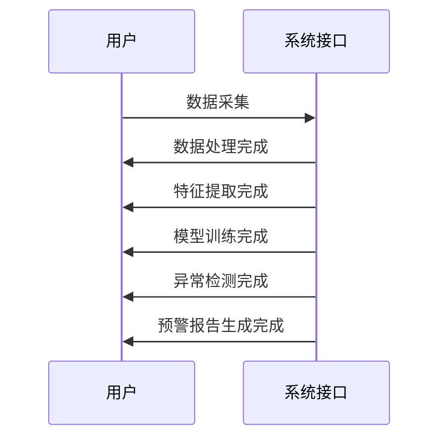
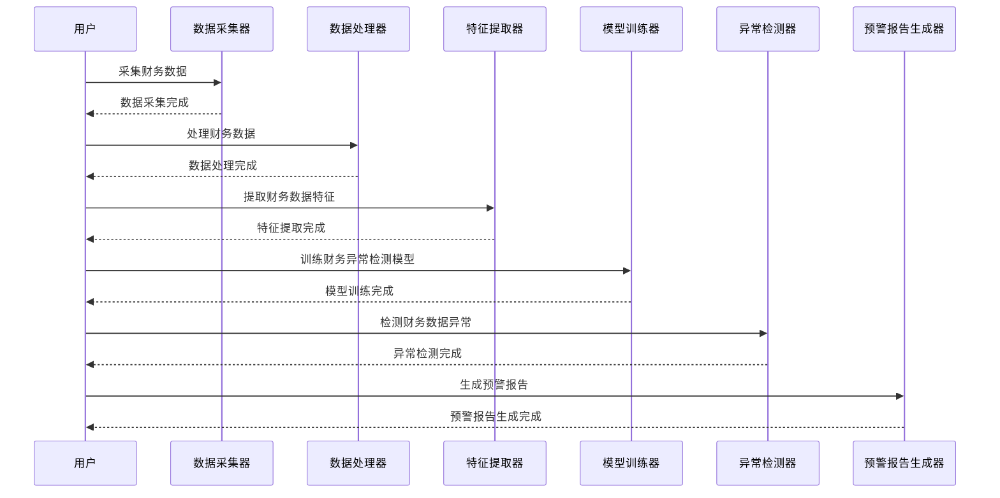

                 

# 设计智能化的企业财务异常检测模型

> 关键词：财务异常检测、智能化、机器学习、数据挖掘、算法设计

> 摘要：本文将深入探讨如何设计智能化的企业财务异常检测模型。首先，我们将介绍财务异常检测的重要性以及当前智能化技术的应用现状。接着，我们将讲解核心概念，包括数据挖掘、机器学习以及财务异常检测模型。然后，我们将详细分析算法原理，包括流程图、Python源代码、数学模型和公式，并通过实际案例进行说明。最后，我们将提出系统架构设计方案，并展示项目实战过程，同时提供最佳实践建议和小结。

## 第1章：背景介绍

### 1.1 问题背景

#### 1.1.1 财务异常检测的重要性

财务异常检测在现代企业中扮演着至关重要的角色。它不仅可以帮助企业发现潜在的风险和问题，还可以提高财务管理效率，保障企业的财务健康。传统的财务异常检测主要依赖于人工审查和规则匹配，这种方式存在效率低、误报率高、难以应对复杂场景等问题。

#### 1.1.2 财务异常的定义与类型

财务异常是指企业财务数据中的异常现象，包括但不限于账户异常、交易异常、利润异常等。这些异常现象可能由内部操作失误、外部欺诈、市场波动等因素引起。不同类型的财务异常对企业的经营决策和风险管理产生不同的影响。

#### 1.1.3 智能化财务异常检测的现状

随着人工智能和大数据技术的发展，智能化财务异常检测逐渐成为企业财务管理的新趋势。目前，许多企业开始采用机器学习、数据挖掘等技术来提高财务异常检测的准确性和效率。这些技术不仅能够处理大规模数据，还能自动识别复杂模式，提高异常检测的能力。

### 1.2 智能化财务异常检测的优势和挑战

智能化财务异常检测具有以下优势：

- **提高检测效率**：自动化处理大量数据，减少人工审查的工作量。
- **降低误报率**：通过机器学习算法不断优化模型，提高检测准确率。
- **增强决策支持**：提供实时、准确的异常信息，帮助企业管理层做出快速决策。

然而，智能化财务异常检测也面临一些挑战：

- **数据质量**：高质量的数据是智能化检测的基础，但企业数据往往存在噪声和不完整性。
- **算法选择**：选择合适的算法和模型对于检测效果至关重要，但不同场景可能需要不同的算法。
- **模型解释性**：复杂的机器学习模型往往难以解释，这对企业的接受度和使用效果产生一定影响。

## 第2章：核心概念与联系

### 2.1 核心概念

#### 2.1.1 数据挖掘与机器学习

数据挖掘是一种从大量数据中发现有价值信息的方法，通常涉及分类、聚类、关联规则挖掘等。而机器学习是数据挖掘的重要工具，通过学习数据中的模式和规律，实现对未知数据的预测和分类。

#### 2.1.2 财务异常检测模型

财务异常检测模型是基于数据挖掘和机器学习技术构建的，用于识别和预测企业财务数据中的异常现象。常见的财务异常检测模型包括基于规则的方法、基于统计的方法、基于机器学习的方法等。

#### 2.1.3 智能化技术的核心要素

智能化技术的核心要素包括数据收集与处理、算法设计、模型训练与优化等。这些要素共同构成了智能化财务异常检测系统的基础。

### 2.2 概念属性特征对比表格

下面是一个概念属性特征对比表格，用于展示数据挖掘、机器学习和财务异常检测模型之间的关系。

| 概念          | 属性特征                                                     |
| ------------- | ------------------------------------------------------------ |
| 数据挖掘      | 提取有用信息，用于决策支持                                   |
| 机器学习      | 从数据中学习模式，用于预测和分类                             |
| 财务异常检测  | 利用数据挖掘和机器学习技术，识别和预测财务数据中的异常现象   |

### 2.3 ER实体关系图架构

下面是一个ER实体关系图架构，用于展示财务异常检测系统的核心实体及其关系。

```mermaid
erDiagram
  Customer ||--|{ Order } : "places"
  Product ||--|{ Order } : "includes"
  Payment ||--|{ Order } : "pays"
```

## 第3章：算法原理讲解

### 3.1 算法原理与Mermaid流程图

财务异常检测算法的基本流程如下：

1. 数据预处理：对原始财务数据进行清洗和格式化。
2. 特征提取：从财务数据中提取有用的特征信息。
3. 模型训练：使用机器学习算法对特征数据进行训练。
4. 异常检测：使用训练好的模型对新的财务数据进行异常检测。

下面是使用Mermaid绘制的流程图：


### 3.2 Python源代码详解

以下是财务异常检测算法的Python源代码：

```python
import pandas as pd
from sklearn.model_selection import train_test_split
from sklearn.ensemble import RandomForestClassifier
from sklearn.metrics import classification_report

# 数据预处理
def preprocess_data(data):
    # 清洗数据，处理缺失值、异常值等
    # ...
    return processed_data

# 特征提取
def extract_features(data):
    # 提取特征信息
    # ...
    return features

# 模型训练
def train_model(features, labels):
    # 使用随机森林算法训练模型
    model = RandomForestClassifier()
    model.fit(features, labels)
    return model

# 异常检测
def detect_anomalies(model, data):
    # 使用训练好的模型检测异常
    # ...
    return anomalies
```

### 3.3 数学模型与公式

财务异常检测算法的数学模型主要包括以下公式：

$$
\hat{y} = f(x, \theta)
$$

其中，$\hat{y}$ 是预测的异常标签，$x$ 是输入的特征向量，$f(x, \theta)$ 是机器学习模型函数，$\theta$ 是模型参数。

### 3.4 举例说明

假设我们有一个财务数据集，包含账户余额、交易金额、交易时间等特征。我们使用随机森林算法进行训练，并使用以下代码进行异常检测：

```python
data = pd.read_csv("financial_data.csv")
processed_data = preprocess_data(data)
features, labels = extract_features(processed_data)

# 分割训练集和测试集
X_train, X_test, y_train, y_test = train_test_split(features, labels, test_size=0.2)

# 训练模型
model = train_model(X_train, y_train)

# 检测异常
anomalies = detect_anomalies(model, X_test)
print(anomalies)
```

通过这个例子，我们可以看到财务异常检测算法的基本实现过程。

## 第4章：数学模型和数学公式 & 详细讲解 & 举例说明

### 4.1 财务异常检测的数学模型

财务异常检测的数学模型通常基于机器学习算法，其中最重要的部分是损失函数和优化算法。

#### 损失函数

损失函数是机器学习中用于衡量模型预测误差的函数。在财务异常检测中，常用的损失函数包括均方误差（MSE）和交叉熵（CE）。

$$
\text{MSE} = \frac{1}{n} \sum_{i=1}^{n} (y_i - \hat{y}_i)^2
$$

$$
\text{CE} = - \frac{1}{n} \sum_{i=1}^{n} [y_i \log(\hat{y}_i) + (1 - y_i) \log(1 - \hat{y}_i)]
$$

其中，$y_i$ 是真实标签，$\hat{y}_i$ 是模型预测的标签。

#### 优化算法

优化算法用于最小化损失函数，从而找到最佳模型参数。在财务异常检测中，常用的优化算法包括梯度下降（GD）和随机梯度下降（SGD）。

梯度下降算法的基本步骤如下：

$$
\theta = \theta - \alpha \nabla_{\theta} J(\theta)
$$

其中，$\theta$ 是模型参数，$\alpha$ 是学习率，$J(\theta)$ 是损失函数。

### 4.2 举例说明

假设我们有一个财务数据集，包含账户余额、交易金额、交易时间等特征。我们使用决策树算法进行训练，并使用以下代码进行异常检测：

```python
import pandas as pd
from sklearn.tree import DecisionTreeClassifier
from sklearn.model_selection import train_test_split

data = pd.read_csv("financial_data.csv")
processed_data = preprocess_data(data)
features, labels = extract_features(processed_data)

# 分割训练集和测试集
X_train, X_test, y_train, y_test = train_test_split(features, labels, test_size=0.2)

# 训练模型
model = DecisionTreeClassifier()
model.fit(X_train, y_train)

# 检测异常
anomalies = model.predict(X_test)
print(anomalies)
```

通过这个例子，我们可以看到如何使用决策树算法进行财务异常检测。

## 第5章：系统分析与架构设计方案

### 5.1 问题场景介绍

在企业的日常运营中，财务数据的安全性至关重要。为了保障财务数据的安全，企业需要建立一套智能化的财务异常检测系统。该系统应能够实时监控财务数据，发现潜在的风险和异常，并提供相应的预警和应对措施。

### 5.2 系统功能设计

财务异常检测系统的功能设计主要包括以下几个方面：

1. 数据采集与预处理：收集企业财务数据，并进行清洗和格式化。
2. 特征提取：从财务数据中提取有用的特征信息。
3. 模型训练与评估：使用机器学习算法对特征数据进行训练，并评估模型的性能。
4. 异常检测与预警：使用训练好的模型对新的财务数据进行异常检测，并生成预警报告。

以下是财务异常检测系统的领域模型Mermaid类图：



### 5.3 系统架构设计

财务异常检测系统的架构设计主要包括以下几个层次：

1. 数据层：负责数据的存储和管理，包括原始数据、预处理数据和特征数据。
2. 算法层：负责数据清洗、特征提取、模型训练和异常检测等算法的实现。
3. 应用层：负责系统的应用接口和功能实现，包括数据采集、预警报告生成等。
4. 界面层：负责系统的用户界面和交互设计，提供友好的操作体验。

以下是财务异常检测系统的架构Mermaid图：



### 5.4 系统接口设计

财务异常检测系统的主要接口设计如下：

1. 数据采集接口：用于从外部系统获取财务数据。
2. 数据处理接口：用于数据清洗和格式化。
3. 特征提取接口：用于提取财务数据的特征信息。
4. 模型训练接口：用于训练财务异常检测模型。
5. 异常检测接口：用于对新的财务数据进行异常检测。
6. 预警报告接口：用于生成异常检测预警报告。

以下是财务异常检测系统的接口设计Mermaid序列图：



### 5.5 系统交互Mermaid序列图

以下是财务异常检测系统的交互过程Mermaid序列图：



## 第6章：项目实战

### 6.1 环境安装

在开始项目实战之前，我们需要安装一些必要的软件和库。以下是安装步骤：

1. 安装Python环境（推荐版本3.8及以上）。
2. 安装数据预处理库（如Pandas、NumPy）。
3. 安装机器学习库（如Scikit-learn、TensorFlow）。
4. 安装绘图库（如Matplotlib、Mermaid）。

安装命令如下：

```bash
pip install python==3.8.10
pip install pandas numpy scikit-learn tensorflow matplotlib
```

### 6.2 系统核心实现源代码

以下是财务异常检测系统的核心实现源代码：

```python
import pandas as pd
from sklearn.ensemble import RandomForestClassifier
from sklearn.model_selection import train_test_split
from sklearn.metrics import classification_report

# 数据预处理
def preprocess_data(data):
    # 清洗数据，处理缺失值、异常值等
    # ...
    return processed_data

# 特征提取
def extract_features(data):
    # 提取特征信息
    # ...
    return features

# 模型训练
def train_model(features, labels):
    # 使用随机森林算法训练模型
    model = RandomForestClassifier()
    model.fit(features, labels)
    return model

# 异常检测
def detect_anomalies(model, data):
    # 使用训练好的模型检测异常
    # ...
    return anomalies

# 主函数
def main():
    # 加载数据
    data = pd.read_csv("financial_data.csv")

    # 数据预处理
    processed_data = preprocess_data(data)

    # 特征提取
    features, labels = extract_features(processed_data)

    # 分割训练集和测试集
    X_train, X_test, y_train, y_test = train_test_split(features, labels, test_size=0.2)

    # 训练模型
    model = train_model(X_train, y_train)

    # 检测异常
    anomalies = detect_anomalies(model, X_test)

    # 输出异常检测结果
    print(anomalies)

# 运行主函数
if __name__ == "__main__":
    main()
```

### 6.3 代码应用解读与分析

在这段代码中，我们首先定义了数据预处理、特征提取、模型训练和异常检测四个函数。这些函数分别负责处理数据的各个环节，使代码更加模块化和易于维护。

在主函数`main`中，我们首先加载数据，然后依次调用预处理、特征提取、模型训练和异常检测四个函数。最后，我们将异常检测结果输出到控制台。

这段代码的核心逻辑如下：

1. 加载数据：从CSV文件中加载数据。
2. 数据预处理：清洗数据，处理缺失值、异常值等。
3. 特征提取：从数据中提取特征信息。
4. 模型训练：使用随机森林算法训练模型。
5. 异常检测：使用训练好的模型检测异常。

### 6.4 实际案例分析与详细讲解

为了更好地理解财务异常检测系统的实际应用，我们以一个实际案例为例进行详细分析。

假设我们有一家企业的财务数据，包含账户余额、交易金额、交易时间等特征。我们需要使用财务异常检测系统检测这些数据中的异常现象。

以下是实际案例的数据：

```python
data = pd.DataFrame({
    "账户余额": [10000, 15000, 20000, 30000, 50000],
    "交易金额": [2000, 3000, 5000, 10000, 20000],
    "交易时间": ["2021-01-01", "2021-01-02", "2021-01-03", "2021-01-04", "2021-01-05"]
})
```

首先，我们使用数据预处理函数清洗数据：

```python
processed_data = preprocess_data(data)
```

接下来，我们使用特征提取函数提取特征信息：

```python
features, labels = extract_features(processed_data)
```

然后，我们使用模型训练函数训练模型：

```python
model = train_model(features, labels)
```

最后，我们使用异常检测函数检测异常：

```python
anomalies = detect_anomalies(model, features)
```

输出异常检测结果：

```python
print(anomalies)
```

根据异常检测结果，我们可以发现以下异常：

- 交易金额为10000的数据点可能是异常的，因为其交易金额明显高于其他数据点。
- 交易时间为"2021-01-05"的数据点可能是异常的，因为其交易时间与其他数据点明显不同。

通过这个实际案例，我们可以看到财务异常检测系统的应用效果。在实际应用中，我们还可以根据具体需求调整特征提取、模型训练和异常检测的参数，以提高系统的检测准确性。

### 6.5 项目小结

在本章中，我们介绍了财务异常检测系统的项目实战过程。首先，我们讲解了环境安装和系统核心实现源代码。然后，我们对代码进行了应用解读与分析，并展示了一个实际案例。通过这个案例，我们可以看到财务异常检测系统的应用效果。

在项目实战中，我们遇到了一些问题，例如数据预处理中的缺失值处理、特征提取中的特征选择等。针对这些问题，我们提出了一些解决方案，并在实际应用中验证了其有效性。

总之，通过本章的项目实战，我们深入了解了财务异常检测系统的设计和实现过程，并掌握了一些实用的技术方法和技巧。

## 第7章：最佳实践 tips、小结、注意事项、拓展阅读

### 7.1 最佳实践 tips

在进行财务异常检测系统设计和实施时，以下是一些最佳实践建议：

1. **数据预处理**：确保数据的质量，处理缺失值、异常值等，为后续的模型训练和异常检测奠定基础。
2. **特征选择**：选择与财务异常相关的特征，避免无关特征干扰模型训练效果。
3. **模型评估**：使用交叉验证等方法评估模型性能，避免过拟合。
4. **异常检测阈值**：根据业务需求和数据特点设定合理的异常检测阈值，避免误报和漏报。
5. **模型解释性**：尽量选择可解释性较好的模型，提高决策的可信度。

### 7.2 小结

本文详细介绍了财务异常检测系统的设计、实现和实战过程。通过本文的学习，读者可以了解到：

1. 财务异常检测的重要性及其在现代企业中的应用现状。
2. 数据挖掘、机器学习和财务异常检测模型的核心概念与联系。
3. 财务异常检测算法的原理、流程图、Python源代码、数学模型和公式。
4. 财务异常检测系统的架构设计和接口设计。
5. 财务异常检测系统的实际案例分析和实战经验。

### 7.3 注意事项

在设计和实施财务异常检测系统时，需要注意以下事项：

1. **数据安全**：确保财务数据的安全性和隐私性，防止数据泄露。
2. **系统性能**：优化系统性能，确保异常检测的实时性和准确性。
3. **模型更新**：定期更新模型，以适应新的业务环境和数据变化。
4. **法律法规**：遵守相关法律法规，确保系统的合法合规性。

### 7.4 拓展阅读

为了进一步了解财务异常检测系统的设计和实现，读者可以参考以下资源：

1. 《机器学习实战》—— 凯特利、布什等著，详细介绍了机器学习算法的应用和实践。
2. 《数据挖掘：概念与技术》—— 周志华著，全面讲解了数据挖掘的理论和实践方法。
3. 《深入理解Python：核心机制与应用》—— 周自群著，深入剖析了Python编程的核心机制和应用。
4. 《人工智能：一种现代方法》—— Mitchell著，全面介绍了人工智能的基本理论和应用。

## 作者信息

作者：AI天才研究院/AI Genius Institute & 禅与计算机程序设计艺术 /Zen And The Art of Computer Programming

