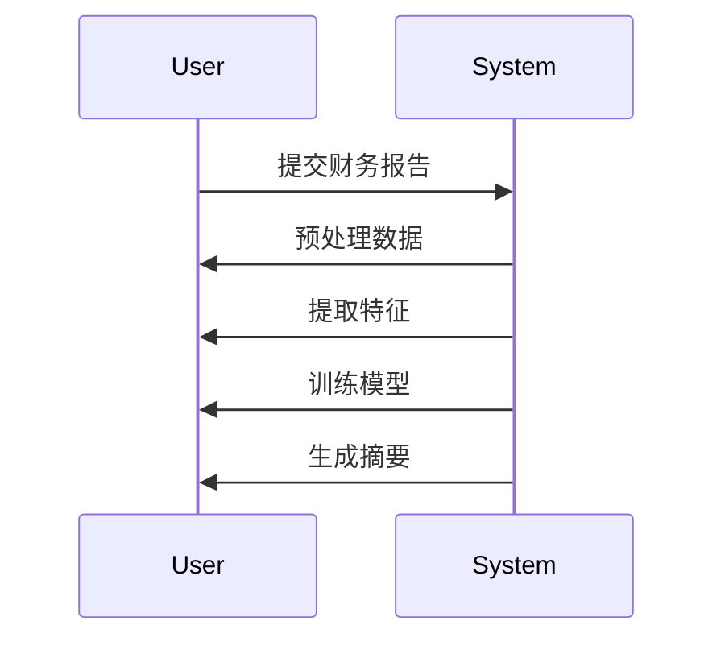
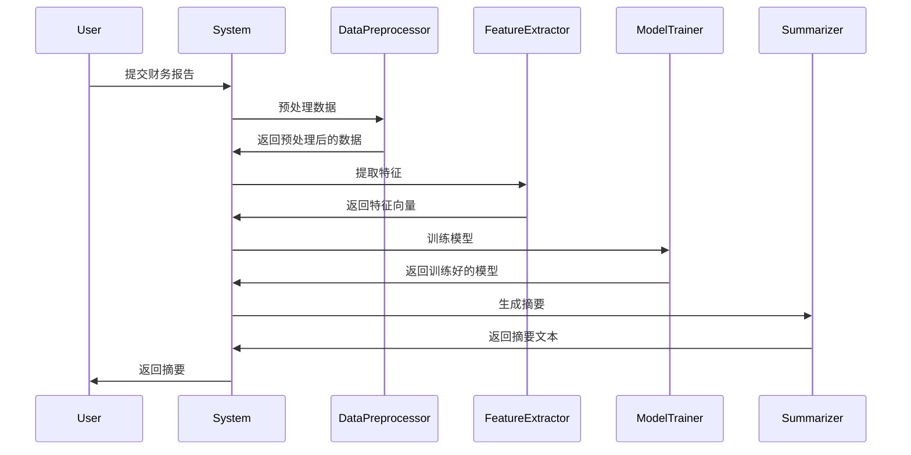

                 


### 设计智能化的企业财务报告可读性增强与自动摘要模型

#### 摘要

企业财务报告作为企业运营的重要信息载体，对于投资者、管理层和监管机构等各方具有重要意义。然而，传统的财务报告存在可读性差、信息提取困难等问题，限制了其应用效果。本文旨在探讨如何通过设计智能化的财务报告可读性增强与自动摘要模型，解决上述问题。我们将从问题背景出发，介绍智能化与自动摘要模型的核心概念，详细讲解相关算法原理，并设计一个系统架构，最终通过实际案例展示模型的可行性与有效性。

#### 目录大纲

----------------------------------------------------------------

## 第一部分：背景介绍与核心概念

### 第1章：问题背景与定义

#### 1.1 财务报告的挑战与需求

- **问题背景**：随着企业经营规模的扩大，财务报告的数据量呈现指数级增长。
- **问题描述**：传统财务报告通常存在信息冗长、复杂难懂、难以快速提取关键信息等问题。
- **问题解决**：提高财务报告的可读性和易理解性，使其能够快速传达关键信息。
- **边界与外延**：财务报告的范围包括资产负债表、利润表、现金流量表等。
- **核心要素组成**：财务报告的核心要素包括财务指标、注释、摘要等。

#### 1.2 智能化与自动摘要模型概述

- **智能化**：利用计算机技术自动处理和分析财务数据，提供智能化的决策支持。
- **自动摘要模型**：通过算法自动生成财务报告的摘要，简化报告内容。

#### 1.3 核心概念与联系

- **数据挖掘与分析**：从大量财务数据中提取有价值的信息。
- **自然语言处理**：对文本数据进行处理和理解，使其更易于阅读。
- **机器学习与深度学习**：使用大量数据进行模型训练，提高算法的准确性。

### 第2章：核心概念原理与特征

#### 2.1 财务报告智能化的概念原理

- **数据挖掘与分析**：使用算法从财务数据中提取有用信息。
- **自然语言处理**：使财务报告更易于阅读和理解。
- **机器学习与深度学习**：通过模型训练实现自动化摘要生成。

#### 2.2 自动摘要模型的属性特征对比

| 特性 | 传统方法 | 智能化方法 |
| --- | --- | --- |
| **效率** | 低效率，人工处理 | 高效率，自动化处理 |
| **准确性** | 容易出错 | 高准确性 |
| **可读性** | 难以理解 | 易于理解 |

#### 2.3 财务报告智能化的ER实体关系图

```mermaid
erDiagram
    Customer ||--|{ Order }|
    Product ||--|{ Order }|
    Order ||--|{ OrderDetail }|
```

## 第二部分：算法原理讲解

### 第3章：算法原理详解

#### 3.1 智能化算法的基本原理

- **数据预处理**：清洗和转换财务数据，使其适合算法处理。
- **特征提取**：从原始数据中提取有价值的特征。
- **模型训练**：使用机器学习算法训练模型。
- **模型评估与优化**：评估模型性能，并进行优化。

#### 3.2 自动摘要算法的数学模型

$$
\text{摘要} = \text{f}(\text{数据集}, \text{模型参数})
$$

#### 3.3 自动摘要算法的Python实现

```python
import pandas as pd
from sklearn.feature_extraction.text import TfidfVectorizer
from sklearn.naive_bayes import MultinomialNB

# 数据预处理
data = pd.read_csv('financial_data.csv')
data['cleaned_text'] = data['text'].apply(lambda x: clean_text(x))

# 特征提取
vectorizer = TfidfVectorizer()
X = vectorizer.fit_transform(data['cleaned_text'])

# 模型训练
model = MultinomialNB()
model.fit(X, data['label'])

# 模型评估
score = model.score(X, data['label'])
print(f'Model accuracy: {score:.2f}')
```

## 第三部分：系统分析与架构设计

### 第4章：系统功能设计

#### 4.1 问题场景介绍

- **项目介绍**：开发一个智能化的财务报告摘要系统。
- **系统功能设计**：包括数据预处理、特征提取、模型训练、摘要生成等功能。

#### 4.2 系统架构设计



### 第5章：系统交互设计

#### 5.1 系统交互设计



## 第四部分：项目实战

### 第6章：环境安装与系统实现

#### 6.1 环境安装

- **安装Python环境**：确保Python版本在3.6及以上。
- **安装相关库**：如pandas、sklearn、nltk等。

#### 6.2 系统核心实现

- **源代码**：实现数据预处理、特征提取、模型训练和摘要生成等核心功能。

```python
# 数据预处理
def clean_text(text):
    # ...清洗文本的逻辑...
    return cleaned_text

# 特征提取
def extract_features(texts):
    # ...特征提取的逻辑...
    return features

# 模型训练
def train_model(features, labels):
    # ...模型训练的逻辑...
    return model

# 摘要生成
def generate_summary(text, model):
    # ...摘要生成的逻辑...
    return summary
```

### 第7章：实际案例分析与讲解

#### 7.1 实际案例

- **案例分析**：使用某公司的财务报告数据作为案例。

#### 7.2 详细讲解

- **数据预处理**：清洗数据，去除无关信息。
- **特征提取**：提取文本特征，如词频、词向量等。
- **模型训练**：使用机器学习算法训练模型。
- **摘要生成**：生成摘要文本，简化报告内容。

### 第8章：项目小结

#### 8.1 小结

- **项目总结**：项目实现了财务报告的智能化摘要功能。
- **最佳实践**：提供了一些实用的建议，如数据清洗、特征选择等。

#### 8.2 注意事项

- **数据质量**：保证数据质量是模型准确性的关键。
- **模型调优**：根据实际需求调整模型参数。

#### 8.3 拓展阅读

- **相关文献**：推荐一些关于财务报告智能化和自动摘要的学术论文。

作者：AI天才研究院/AI Genius Institute & 禅与计算机程序设计艺术 /Zen And The Art of Computer Programming

