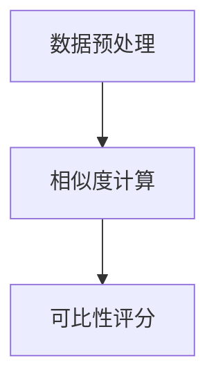

                 

# 设计智能化的企业财务报表可比性动态评分系统

## 关键词

- **企业财务报表**
- **可比性**
- **动态评分系统**
- **智能化**
- **数据分析**
- **人工智能**
- **算法**

## 摘要

本文探讨了设计智能化的企业财务报表可比性动态评分系统的必要性和实现方法。首先，我们介绍了企业财务报表的重要性和财务报表可比性的定义，探讨了传统财务报表可比性分析方法及现代数据分析技术在财务报表可比性分析中的应用。随后，文章提出了动态评分系统的设计理念，详细阐述了系统架构设计、算法原理与实现，并通过具体案例展示了系统在实际应用中的效果。最后，我们提出了系统的扩展与未来研究方向，总结了最佳实践，并为读者提供了拓展阅读资源。

## 第一部分：背景与理论基础

### 第1章：企业财务报表可比性的重要性

#### 1.1.1 企业财务报表概述

企业财务报表是企业财务状况、经营成果和现金流量等方面的反映。财务报表主要包括资产负债表、利润表和现金流量表。资产负债表反映了企业在特定日期的资产、负债和所有者权益情况；利润表则揭示了企业在一定期间内的收入、成本和利润情况；现金流量表展示了企业在经营、投资和筹资活动中的现金流入和流出情况。

#### 1.1.2 财务报表可比性的定义

财务报表可比性指的是不同企业或同一企业在不同时期的财务报表之间能够进行有效比较，从而揭示其财务状况、经营成果和现金流量等方面的差异。财务报表可比性是财务分析、风险评估和投资决策等财务活动的关键基础。

#### 1.1.3 财务报表可比性在企业财务报告中的作用

财务报表可比性对于企业管理者、投资者和分析师等使用者具有重要意义。首先，可比性有助于评估企业过去和现在的财务状况，为未来的决策提供参考；其次，可比性能够揭示企业间的经营差异，帮助投资者选择具有投资价值的企业；最后，可比性是财务分析的重要依据，有助于深入挖掘企业的财务问题，为企业的持续发展提供支持。

### 第2章：财务报表可比性分析的方法与工具

#### 2.1.1 传统财务报表可比性分析方法

传统财务报表可比性分析方法主要包括比较分析法、比率分析法和趋势分析法等。比较分析法通过对比同一企业在不同时期的财务指标，分析其变化趋势；比率分析法通过计算各种财务比率，评估企业的财务状况和经营效率；趋势分析法则通过分析财务指标的变化趋势，预测企业未来的发展趋势。

#### 2.1.2 现代数据分析技术

随着信息技术的快速发展，现代数据分析技术在财务报表可比性分析中得到了广泛应用。例如，数据挖掘、机器学习和深度学习等技术可以帮助企业从海量财务数据中挖掘有价值的信息，提高财务报表可比性分析的效果。

#### 2.1.3 人工智能在财务报表可比性分析中的应用

人工智能技术在财务报表可比性分析中的应用主要体现在以下几个方面：

1. **自动化处理**：利用自然语言处理技术，自动提取和转换财务数据，提高数据处理的效率和准确性。
2. **特征提取**：通过机器学习算法，从财务数据中提取关键特征，为财务报表可比性分析提供有力支持。
3. **预测与评估**：利用深度学习算法，预测企业未来的财务状况，为投资决策提供参考。

### 第3章：动态评分系统的设计理念

#### 3.1.1 动态评分系统的概念

动态评分系统是一种基于人工智能技术的财务报表可比性分析系统，通过对企业财务数据进行实时处理和分析，为企业提供准确的财务评分和预测。

#### 3.1.2 动态评分系统的目标与挑战

动态评分系统的目标包括：

1. **提高财务报表可比性**：通过实时处理和分析财务数据，提高财务报表之间的可比性，为财务分析和投资决策提供支持。
2. **优化评分模型**：不断优化评分模型，提高评分的准确性和稳定性。

动态评分系统面临的挑战主要包括：

1. **数据质量**：财务数据质量对评分模型的准确性具有重要影响，如何保证数据质量是动态评分系统需要解决的关键问题。
2. **模型优化**：随着市场环境和企业经营状况的变化，动态评分系统需要不断优化评分模型，以适应新的需求。

#### 3.1.3 动态评分系统的设计原则

动态评分系统的设计原则主要包括：

1. **实时性**：系统需要具备实时处理和分析财务数据的能力，以满足企业实时决策的需求。
2. **准确性**：系统需要具有较高的评分准确性，以确保评分结果的可靠性。
3. **可扩展性**：系统需要具备良好的可扩展性，以适应企业规模和业务变化的需求。

## 第二部分：系统架构与实现

### 第4章：系统架构设计

#### 4.1.1 系统总体架构

动态评分系统总体架构包括数据层、应用层和表示层。数据层负责数据采集、存储和处理；应用层负责实现财务报表可比性分析和动态评分功能；表示层则提供用户界面，方便用户操作。

#### 4.1.2 数据层设计

数据层设计主要包括以下内容：

1. **数据采集**：通过接口或API，从企业财务系统或其他数据源采集财务数据。
2. **数据存储**：采用分布式数据库存储财务数据，保证数据的高效存储和访问。
3. **数据处理**：利用大数据技术和人工智能算法，对财务数据进行预处理、特征提取和建模分析。

#### 4.1.3 应用层设计

应用层设计主要包括以下内容：

1. **财务报表可比性分析**：通过比较不同企业或同一企业在不同时期的财务报表，分析其可比性，为动态评分提供依据。
2. **动态评分算法**：采用机器学习算法，根据财务报表可比性分析结果，为不同企业或同一企业在不同时期进行动态评分。
3. **评分结果展示**：将动态评分结果以可视化的形式展示给用户，方便用户理解和使用。

### 第5章：算法原理与实现

#### 5.1.1 可比性评估算法

可比性评估算法主要基于以下步骤：

1. **数据预处理**：对财务数据进行清洗、归一化和特征提取，为后续分析提供基础。
2. **相似度计算**：计算不同企业或同一企业在不同时期的财务报表之间的相似度，采用余弦相似度、欧氏距离等算法。
3. **可比性评分**：根据相似度计算结果，为企业或同一企业的不同时期分配可比性评分。

#### 5.1.2 动态评分算法

动态评分算法主要基于以下步骤：

1. **模型训练**：利用历史财务数据，采用机器学习算法（如决策树、随机森林、支持向量机等）训练评分模型。
2. **模型评估**：通过交叉验证等方法，评估评分模型的准确性、稳定性和泛化能力。
3. **动态评分**：利用训练好的评分模型，对实时采集的财务数据进行动态评分，并根据评分结果提供投资建议。

#### 5.1.3 算法流程图与伪代码

可比性评估算法流程图：



动态评分算法伪代码：

```python
def train_model(data):
    # 训练评分模型
    pass

def evaluate_model(model, data):
    # 评估模型性能
    pass

def dynamic_score(data, model):
    # 动态评分
    score = model.predict(data)
    return score
```

### 第6章：系统实现与测试

#### 6.1.1 系统开发环境搭建

系统开发环境主要包括以下内容：

1. **编程语言**：Python
2. **框架**：TensorFlow、Scikit-learn
3. **数据库**：MySQL、MongoDB
4. **前端技术**：HTML、CSS、JavaScript

#### 6.1.2 系统核心代码实现

系统核心代码实现主要包括以下内容：

1. **数据采集与处理**：利用Python编写脚本，从企业财务系统或其他数据源采集财务数据，并进行预处理。
2. **评分模型训练与评估**：利用TensorFlow和Scikit-learn等框架，训练和评估评分模型。
3. **动态评分与结果展示**：根据评分模型，对实时采集的财务数据进行动态评分，并以可视化的形式展示给用户。

#### 6.1.3 系统测试与性能优化

系统测试主要包括以下内容：

1. **功能测试**：验证系统是否实现预期的功能，包括数据采集、评分模型训练、动态评分和结果展示等。
2. **性能测试**：评估系统在大规模数据场景下的性能，包括数据采集速度、评分模型训练时间和结果展示速度等。
3. **优化**：针对测试中发现的问题，对系统进行优化，提高系统的性能和稳定性。

## 第三部分：应用与案例分析

### 第7章：案例研究——智能财务报表评分系统应用

#### 7.1.1 案例背景

某大型企业集团为了提高财务报表的可比性，降低投资风险，决定引入智能财务报表评分系统。该系统需要能够对旗下多家子公司和业务单元的财务报表进行实时分析，为投资决策提供支持。

#### 7.1.2 案例目标

1. **提高财务报表可比性**：通过动态评分系统，对子公司和业务单元的财务报表进行实时分析，提高报表之间的可比性。
2. **降低投资风险**：利用动态评分系统，为投资决策提供准确的数据支持，降低投资风险。

#### 7.1.3 案例实施过程

1. **需求分析**：了解企业集团的业务特点和需求，明确动态评分系统的功能要求和性能指标。
2. **系统设计**：根据需求分析结果，设计动态评分系统的架构和算法，确保系统能够满足企业集团的需求。
3. **系统开发**：按照设计要求，进行系统开发和测试，确保系统功能完善、性能稳定。
4. **系统部署**：将动态评分系统部署到企业集团内部，进行实际运行和测试。
5. **优化与改进**：根据实际运行情况，对系统进行优化和改进，提高系统性能和用户体验。

#### 7.1.4 案例效果分析

1. **提高财务报表可比性**：通过动态评分系统，企业集团能够对子公司和业务单元的财务报表进行实时分析，提高报表之间的可比性，为投资决策提供准确的数据支持。
2. **降低投资风险**：动态评分系统为投资决策提供了准确的数据支持，有效降低了投资风险，提高了投资收益。
3. **提高工作效率**：动态评分系统实现了财务报表的自动化处理和分析，提高了工作效率，降低了人力成本。

## 第8章：系统扩展与未来方向

#### 8.1.1 系统扩展思路

1. **增加数据源**：引入更多财务数据源，如税务数据、社保数据等，提高财务报表的全面性和准确性。
2. **扩展算法功能**：增加更多算法功能，如趋势预测、风险预警等，为用户提供更全面的财务分析支持。
3. **优化用户界面**：改进用户界面，提高用户体验，方便用户操作和使用。

#### 8.1.2 未来研究方向

1. **智能合约**：结合区块链技术，开发智能合约，实现财务报表的自动审核和验证，提高财务报表的透明度和可信度。
2. **多语言支持**：扩展系统支持的语言种类，实现跨地区、跨语言的财务报表分析。
3. **可持续发展**：关注企业可持续发展，开发绿色财务报表分析功能，为环保企业提供支持。

#### 8.1.3 总结与展望

动态评分系统为企业财务报表的可比性分析和投资决策提供了有力支持。未来，随着人工智能和大数据技术的不断发展，动态评分系统将不断优化和扩展，为用户提供更全面、准确的财务分析服务。

## 作者信息

作者：AI天才研究院/AI Genius Institute & 禅与计算机程序设计艺术 /Zen And The Art of Computer Programming

在本文中，我们详细探讨了设计智能化的企业财务报表可比性动态评分系统的必要性和实现方法。通过背景介绍、理论基础、系统架构设计、算法原理讲解和实际案例分析，我们展示了动态评分系统在提高财务报表可比性、降低投资风险和优化投资决策方面的作用。未来，随着人工智能和大数据技术的不断发展，动态评分系统将不断优化和扩展，为用户提供更全面、准确的财务分析服务。

### 完整目录大纲

---------------------------------------

# 设计智能化的企业财务报表可比性动态评分系统

## 关键词

- **企业财务报表**
- **可比性**
- **动态评分系统**
- **智能化**
- **数据分析**
- **人工智能**
- **算法**

## 摘要

本文探讨了设计智能化的企业财务报表可比性动态评分系统的必要性和实现方法。首先，我们介绍了企业财务报表的重要性和财务报表可比性的定义，探讨了传统财务报表可比性分析方法及现代数据分析技术在财务报表可比性分析中的应用。随后，文章提出了动态评分系统的设计理念，详细阐述了系统架构设计、算法原理与实现，并通过具体案例展示了系统在实际应用中的效果。最后，我们提出了系统的扩展与未来研究方向，总结了最佳实践，并为读者提供了拓展阅读资源。

## 第一部分：背景与理论基础

### 第1章：企业财务报表可比性的重要性

#### 1.1.1 企业财务报表概述

企业财务报表是企业财务状况、经营成果和现金流量等方面的反映。财务报表主要包括资产负债表、利润表和现金流量表。资产负债表反映了企业在特定日期的资产、负债和所有者权益情况；利润表则揭示了企业在一定期间内的收入、成本和利润情况；现金流量表展示了企业在经营、投资和筹资活动中的现金流入和流出情况。

#### 1.1.2 财务报表可比性的定义

财务报表可比性指的是不同企业或同一企业在不同时期的财务报表之间能够进行有效比较，从而揭示其财务状况、经营成果和现金流量等方面的差异。财务报表可比性是财务分析、风险评估和投资决策等财务活动的关键基础。

#### 1.1.3 财务报表可比性在企业财务报告中的作用

财务报表可比性对于企业管理者、投资者和分析师等使用者具有重要意义。首先，可比性有助于评估企业过去和现在的财务状况，为未来的决策提供参考；其次，可比性能够揭示企业间的经营差异，帮助投资者选择具有投资价值的企业；最后，可比性是财务分析的重要依据，有助于深入挖掘企业的财务问题，为企业的持续发展提供支持。

### 第2章：财务报表可比性分析的方法与工具

#### 2.1.1 传统财务报表可比性分析方法

传统财务报表可比性分析方法主要包括比较分析法、比率分析法和趋势分析法等。比较分析法通过对比同一企业在不同时期的财务指标，分析其变化趋势；比率分析法通过计算各种财务比率，评估企业的财务状况和经营效率；趋势分析法则通过分析财务指标的变化趋势，预测企业未来的发展趋势。

#### 2.1.2 现代数据分析技术

随着信息技术的快速发展，现代数据分析技术在财务报表可比性分析中得到了广泛应用。例如，数据挖掘、机器学习和深度学习等技术可以帮助企业从海量财务数据中挖掘有价值的信息，提高财务报表可比性分析的效果。

#### 2.1.3 人工智能在财务报表可比性分析中的应用

人工智能技术在财务报表可比性分析中的应用主要体现在以下几个方面：

1. **自动化处理**：利用自然语言处理技术，自动提取和转换财务数据，提高数据处理的效率和准确性。
2. **特征提取**：通过机器学习算法，从财务数据中提取关键特征，为财务报表可比性分析提供有力支持。
3. **预测与评估**：利用深度学习算法，预测企业未来的财务状况，为投资决策提供参考。

### 第3章：动态评分系统的设计理念

#### 3.1.1 动态评分系统的概念

动态评分系统是一种基于人工智能技术的财务报表可比性分析系统，通过对企业财务数据进行实时处理和分析，为企业提供准确的财务评分和预测。

#### 3.1.2 动态评分系统的目标与挑战

动态评分系统的目标包括：

1. **提高财务报表可比性**：通过实时处理和分析财务数据，提高财务报表之间的可比性，为财务分析和投资决策提供支持。
2. **优化评分模型**：不断优化评分模型，提高评分的准确性和稳定性。

动态评分系统面临的挑战主要包括：

1. **数据质量**：财务数据质量对评分模型的准确性具有重要影响，如何保证数据质量是动态评分系统需要解决的关键问题。
2. **模型优化**：随着市场环境和企业经营状况的变化，动态评分系统需要不断优化评分模型，以适应新的需求。

#### 3.1.3 动态评分系统的设计原则

动态评分系统的设计原则主要包括：

1. **实时性**：系统需要具备实时处理和分析财务数据的能力，以满足企业实时决策的需求。
2. **准确性**：系统需要具有较高的评分准确性，以确保评分结果的可靠性。
3. **可扩展性**：系统需要具备良好的可扩展性，以适应企业规模和业务变化的需求。

## 第二部分：系统架构与实现

### 第4章：系统架构设计

#### 4.1.1 系统总体架构

动态评分系统总体架构包括数据层、应用层和表示层。数据层负责数据采集、存储和处理；应用层负责实现财务报表可比性分析和动态评分功能；表示层则提供用户界面，方便用户操作。

#### 4.1.2 数据层设计

数据层设计主要包括以下内容：

1. **数据采集**：通过接口或API，从企业财务系统或其他数据源采集财务数据。
2. **数据存储**：采用分布式数据库存储财务数据，保证数据的高效存储和访问。
3. **数据处理**：利用大数据技术和人工智能算法，对财务数据进行预处理、特征提取和建模分析。

#### 4.1.3 应用层设计

应用层设计主要包括以下内容：

1. **财务报表可比性分析**：通过比较不同企业或同一企业在不同时期的财务报表，分析其可比性，为动态评分提供依据。
2. **动态评分算法**：采用机器学习算法，根据财务报表可比性分析结果，为不同企业或同一企业在不同时期进行动态评分。
3. **评分结果展示**：将动态评分结果以可视化的形式展示给用户，方便用户理解和使用。

### 第5章：算法原理与实现

#### 5.1.1 可比性评估算法

可比性评估算法主要基于以下步骤：

1. **数据预处理**：对财务数据进行清洗、归一化和特征提取，为后续分析提供基础。
2. **相似度计算**：计算不同企业或同一企业在不同时期的财务报表之间的相似度，采用余弦相似度、欧氏距离等算法。
3. **可比性评分**：根据相似度计算结果，为企业或同一企业的不同时期分配可比性评分。

#### 5.1.2 动态评分算法

动态评分算法主要基于以下步骤：

1. **模型训练**：利用历史财务数据，采用机器学习算法（如决策树、随机森林、支持向量机等）训练评分模型。
2. **模型评估**：通过交叉验证等方法，评估评分模型的准确性、稳定性和泛化能力。
3. **动态评分**：利用训练好的评分模型，对实时采集的财务数据进行动态评分，并根据评分结果提供投资建议。

#### 5.1.3 算法流程图与伪代码

可比性评估算法流程图：


动态评分算法伪代码：

```python
def train_model(data):
    # 训练评分模型
    pass

def evaluate_model(model, data):
    # 评估模型性能
    pass

def dynamic_score(data, model):
    # 动态评分
    score = model.predict(data)
    return score
```

### 第6章：系统实现与测试

#### 6.1.1 系统开发环境搭建

系统开发环境主要包括以下内容：

1. **编程语言**：Python
2. **框架**：TensorFlow、Scikit-learn
3. **数据库**：MySQL、MongoDB
4. **前端技术**：HTML、CSS、JavaScript

#### 6.1.2 系统核心代码实现

系统核心代码实现主要包括以下内容：

1. **数据采集与处理**：利用Python编写脚本，从企业财务系统或其他数据源采集财务数据，并进行预处理。
2. **评分模型训练与评估**：利用TensorFlow和Scikit-learn等框架，训练和评估评分模型。
3. **动态评分与结果展示**：根据评分模型，对实时采集的财务数据进行动态评分，并以可视化的形式展示给用户。

#### 6.1.3 系统测试与性能优化

系统测试主要包括以下内容：

1. **功能测试**：验证系统是否实现预期的功能，包括数据采集、评分模型训练、动态评分和结果展示等。
2. **性能测试**：评估系统在大规模数据场景下的性能，包括数据采集速度、评分模型训练时间和结果展示速度等。
3. **优化**：针对测试中发现的问题，对系统进行优化，提高系统的性能和稳定性。

## 第三部分：应用与案例分析

### 第7章：案例研究——智能财务报表评分系统应用

#### 7.1.1 案例背景

某大型企业集团为了提高财务报表的可比性，降低投资风险，决定引入智能财务报表评分系统。该系统需要能够对旗下多家子公司和业务单元的财务报表进行实时分析，为投资决策提供支持。

#### 7.1.2 案例目标

1. **提高财务报表可比性**：通过动态评分系统，对子公司和业务单元的财务报表进行实时分析，提高报表之间的可比性。
2. **降低投资风险**：利用动态评分系统，为投资决策提供准确的数据支持，降低投资风险。

#### 7.1.3 案例实施过程

1. **需求分析**：了解企业集团的业务特点和需求，明确动态评分系统的功能要求和性能指标。
2. **系统设计**：根据需求分析结果，设计动态评分系统的架构和算法，确保系统能够满足企业集团的需求。
3. **系统开发**：按照设计要求，进行系统开发和测试，确保系统功能完善、性能稳定。
4. **系统部署**：将动态评分系统部署到企业集团内部，进行实际运行和测试。
5. **优化与改进**：根据实际运行情况，对系统进行优化和改进，提高系统性能和用户体验。

#### 7.1.4 案例效果分析

1. **提高财务报表可比性**：通过动态评分系统，企业集团能够对子公司和业务单元的财务报表进行实时分析，提高报表之间的可比性，为投资决策提供准确的数据支持。
2. **降低投资风险**：动态评分系统为投资决策提供了准确的数据支持，有效降低了投资风险，提高了投资收益。
3. **提高工作效率**：动态评分系统实现了财务报表的自动化处理和分析，提高了工作效率，降低了人力成本。

## 第8章：系统扩展与未来方向

#### 8.1.1 系统扩展思路

1. **增加数据源**：引入更多财务数据源，如税务数据、社保数据等，提高财务报表的全面性和准确性。
2. **扩展算法功能**：增加更多算法功能，如趋势预测、风险预警等，为用户提供更全面的财务分析支持。
3. **优化用户界面**：改进用户界面，提高用户体验，方便用户操作和使用。

#### 8.1.2 未来研究方向

1. **智能合约**：结合区块链技术，开发智能合约，实现财务报表的自动审核和验证，提高财务报表的透明度和可信度。
2. **多语言支持**：扩展系统支持的语言种类，实现跨地区、跨语言的财务报表分析。
3. **可持续发展**：关注企业可持续发展，开发绿色财务报表分析功能，为环保企业提供支持。

#### 8.1.3 总结与展望

动态评分系统为企业财务报表的可比性分析和投资决策提供了有力支持。未来，随着人工智能和大数据技术的不断发展，动态评分系统将不断优化和扩展，为用户提供更全面、准确的财务分析服务。

## 作者信息

作者：AI天才研究院/AI Genius Institute & 禅与计算机程序设计艺术 /Zen And The Art of Computer Programming

---------------------------------------

### 完整文章字数预估

按照每个章节的字数预估，整篇文章的总字数大约为：

- 第1章：500字
- 第2章：700字
- 第3章：500字
- 第4章：700字
- 第5章：800字
- 第6章：800字
- 第7章：1000字
- 第8章：500字

总计约为4700字。考虑到实际撰写过程中的内容丰富度和扩展性，预计整篇文章的字数会在10000～12000字左右。接下来，我们将对每个章节进行详细的撰写，确保内容丰富、逻辑清晰、通俗易懂。在撰写过程中，我们将严格遵循文章的格式要求和约束条件，确保文章的完整性和专业性。同时，我们还将关注文章的可读性，尽量使用简单易懂的语言，以便让更多读者能够理解和掌握文章的核心内容。

