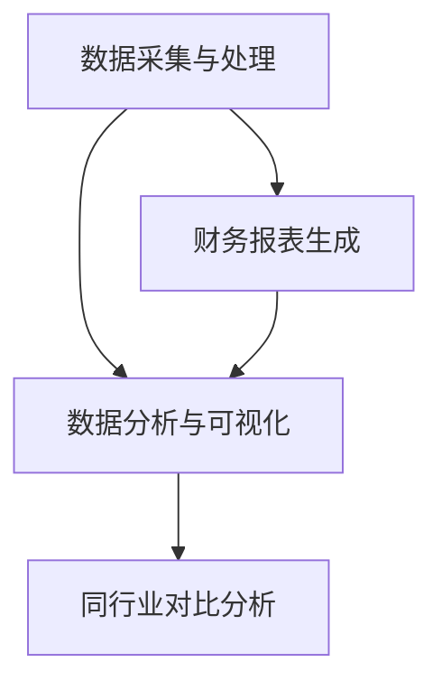
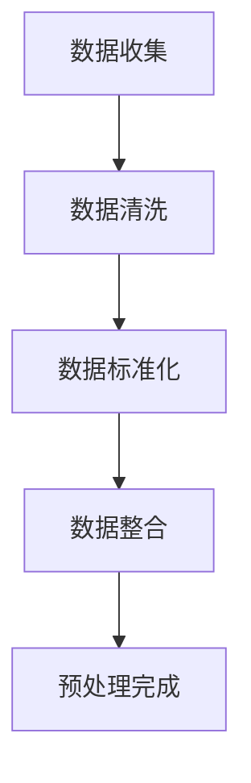
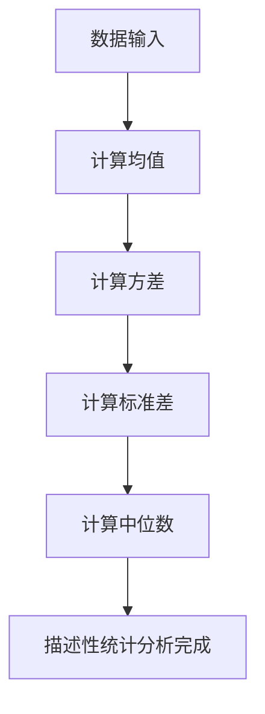
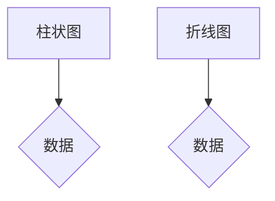
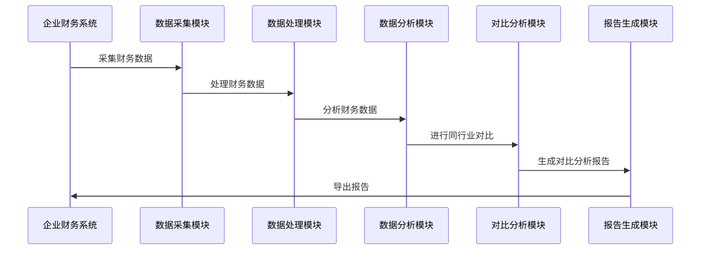

                 

### 第1章 背景介绍

#### 1.1.1 财务报表的定义与作用

财务报表是企业经济活动的真实写照，是企业向外部利益相关者传递信息的重要工具。主要包含以下几种类型：

1. **资产负债表（Balance Sheet）**：反映了企业在特定时间点的财务状况，包括资产、负债和股东权益。
2. **利润表（Income Statement）**：展示了企业在一定时间内的收入、费用和利润状况。
3. **现金流量表（Cash Flow Statement）**：记录了企业现金的流入和流出情况，分为经营活动、投资活动和筹资活动三部分。
4. **所有者权益变动表（Statement of Changes in Equity）**：反映了企业所有者权益的变动情况。

财务报表在企业决策中发挥着至关重要的作用。通过这些报表，企业可以了解自身的财务状况、盈利能力、经营效率等方面，为决策提供数据支持。同时，投资者、债权人、监管机构等外部利益相关者也可以通过财务报表来评估企业的经营状况和投资价值。

#### 1.1.2 同行业对比分析的意义

同行业对比分析是企业了解自身在行业中的竞争地位的重要手段。通过对比分析，企业可以发现自身在财务指标、经营策略、市场占有率等方面的优势和劣势，从而制定相应的改进措施。具体来说，同行业对比分析具有以下意义：

1. **评估竞争力**：企业可以通过同行业对比，了解自己在市场中的竞争地位，识别出自身在产品、价格、渠道等方面的竞争优势和劣势。
2. **制定战略**：通过对比分析，企业可以识别出行业内的成功模式和策略，为自己的战略规划提供参考。
3. **优化管理**：同行业对比可以帮助企业发现内部管理中的问题，例如成本控制、效率提升等，从而优化管理流程，提高企业竞争力。
4. **预测未来**：通过对比分析历史数据和行业趋势，企业可以预测未来市场的变化，为制定长期发展战略提供依据。

#### 1.1.3 智能化财务报表的挑战与机遇

随着人工智能技术的快速发展，智能化财务报表逐渐成为企业财务管理的新趋势。智能化财务报表利用人工智能技术，如自然语言处理、机器学习、数据挖掘等，对大量财务数据进行自动化处理和分析，从而提高财务报表的准确性、效率和透明度。

然而，智能化财务报表也面临着一些挑战：

1. **数据质量**：智能化财务报表依赖于高质量的数据。如果数据存在错误或不完整，可能会导致分析结果失真。
2. **技术门槛**：构建智能化财务报表系统需要较高的技术能力，企业可能需要投入大量资源进行研发和培训。
3. **法规遵守**：财务报表的生成和展示需要遵循相关法律法规，智能化财务报表可能需要额外的时间和成本来确保合规性。

尽管如此，智能化财务报表带来的机遇也是显而易见的：

1. **提高效率**：通过自动化处理和分析，智能化财务报表可以显著提高财务报表的生成速度，减轻财务人员的工作负担。
2. **降低成本**：自动化和智能化的数据处理可以减少人工干预，降低财务报表的生成和维护成本。
3. **提升准确性**：智能化财务报表通过机器学习和数据挖掘技术，可以更准确地识别和预测财务数据中的异常和趋势。
4. **支持决策**：智能化财务报表提供更丰富、更准确的数据支持，有助于企业制定更科学的决策。

#### 1.1.4 智能化企业财务报表同行业对比分析系统概述

本文将介绍一个智能化企业财务报表同行业对比分析系统，该系统旨在通过人工智能技术，自动处理和分析企业财务数据，并提供同行业对比分析的功能。系统的主要目标是：

1. **提高财务报表的准确性和效率**：通过自动化处理，确保财务报表的准确性，并提高生成速度。
2. **支持同行业对比分析**：利用数据分析算法，帮助企业了解自身在行业中的竞争地位，为战略制定提供数据支持。

系统架构包括以下几个主要模块：

1. **数据采集与处理模块**：负责收集企业财务数据，并对数据进行清洗、转换和整合。
2. **数据分析与可视化模块**：利用机器学习算法，对财务数据进行分析，并生成可视化报表。
3. **同行业对比分析模块**：将企业数据与同行业数据进行分析对比，提供对比分析和排名功能。

#### 1.1.5 本章小结

本章介绍了企业财务报表的重要性、同行业对比分析的意义以及智能化财务报表的挑战与机遇。通过构建智能化企业财务报表同行业对比分析系统，企业可以更准确地了解自身在行业中的竞争地位，为决策提供数据支持。在接下来的章节中，我们将进一步探讨系统的核心概念、算法原理、架构设计、项目实战和最佳实践 tips等内容。

### 1.4.1 核心内容总结

#### 1.4.1.1 企业财务报表的重要性

财务报表是企业经济活动的真实反映，对企业的决策具有重要指导作用。主要报表类型包括资产负债表、利润表、现金流量表和所有者权益变动表，它们分别反映了企业的财务状况、盈利能力、现金流动性和权益变动情况。

#### 1.4.1.2 同行业对比分析的意义

同行业对比分析帮助企业评估竞争力、制定战略、优化管理和预测未来。通过对比分析，企业可以发现自身在财务指标、经营策略和市场占有率等方面的优势和劣势，从而制定相应的改进措施。

#### 1.4.1.3 智能化财务报表的挑战与机遇

智能化财务报表利用人工智能技术，提高财务报表的准确性、效率和透明度。尽管存在数据质量、技术门槛和法规遵守等挑战，但智能化带来的机遇包括提高效率、降低成本、提升准确性和支持决策。

#### 1.4.1.4 智能化企业财务报表同行业对比分析系统概述

本文将介绍一个智能化企业财务报表同行业对比分析系统，其目标包括提高财务报表的准确性和效率，支持同行业对比分析。系统架构包括数据采集与处理模块、数据分析与可视化模块和同行业对比分析模块。

### 1.4.2 未来发展方向

#### 1.4.2.1 技术进步的趋势

随着人工智能技术的不断进步，智能化财务报表将进一步提高数据处理和分析能力，实现更精准的财务预测和决策支持。

#### 1.4.2.2 行业应用的前景

智能化财务报表在金融、制造、零售等行业的应用前景广阔。企业可以通过智能化财务报表，提高财务管理水平，优化资源配置，提升竞争力。

---

### 第2章 核心概念与联系

#### 2.1 智能化企业财务报表

智能化企业财务报表是利用人工智能技术，对财务数据进行自动化处理和分析，以提高财务报表的准确性、效率和透明度。它结合了自然语言处理、机器学习、数据挖掘等技术，实现了财务报表的智能生成、智能审核和智能分析。

#### 2.1.1 数据分析算法

数据分析算法是智能化企业财务报表的核心组成部分，主要包括：

1. **数据清洗算法**：用于处理和清洗原始数据，包括去除重复记录、填补缺失值、修正错误数据等。
2. **数据整合算法**：用于将来自不同来源的财务数据整合到一个统一的格式中，以便进行后续分析。
3. **统计分析算法**：用于对财务数据进行分析，包括描述性统计、回归分析、聚类分析等。
4. **预测算法**：用于预测财务数据的变化趋势，包括时间序列预测、回归预测等。

#### 2.1.2 数据可视化技术

数据可视化技术是将数据分析结果以图形化方式展示，使数据更加直观、易于理解。常用的数据可视化技术包括：

1. **柱状图**：用于比较不同类别之间的数据差异。
2. **折线图**：用于展示数据随时间的变化趋势。
3. **饼图**：用于展示各部分占总体的比例。
4. **散点图**：用于展示两个变量之间的关系。

#### 2.2 同行业对比分析

同行业对比分析是通过将企业的财务数据与同行业其他企业的数据进行比较，评估企业在行业中的竞争地位和财务状况。它包括以下几个步骤：

1. **数据收集**：收集企业自身的财务数据以及同行业其他企业的财务数据。
2. **数据处理**：对收集到的数据进行清洗、整合和标准化处理，确保数据的一致性和可比性。
3. **指标计算**：计算企业的各项财务指标，如利润率、增长率、市场份额等。
4. **对比分析**：将企业的财务指标与同行业平均水平进行比较，识别出企业的优势和劣势。

#### 2.3 概念关系图

为了更好地理解智能化企业财务报表同行业对比分析系统的核心概念和它们之间的关系，我们可以绘制一个概念关系图。以下是该关系图的 Mermaid 表示：



在这个概念关系图中，数据采集与处理模块是整个系统的起点，它负责收集和清洗财务数据。数据处理后的数据会传递到数据分析与可视化模块，这里利用数据分析算法对数据进行处理，并将结果可视化。同行业对比分析模块则利用这些处理后的数据，进行对比分析，以帮助企业了解自身在行业中的地位。

### 2.4 本章小结

本章介绍了智能化企业财务报表的核心概念和同行业对比分析的基本方法。通过利用数据分析算法和数据可视化技术，智能化企业财务报表能够自动处理和分析财务数据，提高报表的准确性和效率。同行业对比分析则帮助企业在行业内定位自身，为战略决策提供数据支持。在下一章中，我们将深入探讨算法原理，详细讲解智能化企业财务报表中的数据处理和分析方法。

---

### 第3章 算法原理讲解

#### 3.1 数据预处理算法

数据预处理是智能化企业财务报表系统的第一步，其目标是确保数据的准确性和一致性，为后续的数据分析和可视化奠定基础。数据预处理包括以下几个关键步骤：

1. **数据清洗**：
   - **去除重复记录**：使用去重算法，如哈希表，识别并删除重复的数据记录。
   - **填补缺失值**：采用均值插补、中值插补或时间序列预测等方法填补缺失的数据。
   - **修正错误数据**：通过逻辑检查和异常检测，识别并修正错误的数据。

2. **数据标准化**：
   - **数值标准化**：将不同单位的数值转换为同一单位，如将所有货币值转换为同一货币单位。
   - **归一化**：通过缩放或平移，将不同范围的数据转换为同一范围，便于后续的分析和处理。

3. **数据整合**：
   - **多源数据整合**：将来自不同来源的财务数据进行整合，如将财务报表数据与市场数据、行业数据等进行合并。

以下是数据预处理算法的 Mermaid 流程图表示：



#### 3.2 数据分析算法

数据分析算法是智能化企业财务报表的核心组成部分，用于处理和提取财务数据中的有用信息。以下是一些常用的数据分析算法：

1. **描述性统计分析**：
   - **均值**：反映数据的中心趋势。
   - **方差**：反映数据的离散程度。
   - **标准差**：方差的平方根，用于衡量数据的稳定性。
   - **中位数**：数据排序后位于中间的值。

2. **回归分析**：
   - **线性回归**：分析自变量和因变量之间的线性关系。
   - **多项式回归**：分析自变量和因变量之间的非线性关系。

3. **聚类分析**：
   - **K均值聚类**：将数据分为几个簇，每个簇内的数据相似度较高，簇间的数据相似度较低。
   - **层次聚类**：基于相似度度量，逐步合并或分裂数据点，形成聚类树。

4. **时间序列分析**：
   - **ARIMA模型**：自回归积分滑动平均模型，用于分析时间序列数据。
   - **SARIMA模型**：季节性ARIMA模型，用于分析具有季节性的时间序列数据。

以下是描述性统计分析算法的 Mermaid 流程图表示：



#### 3.3 数据可视化算法

数据可视化算法用于将数据分析结果以图形化的形式展示，使数据更加直观、易于理解。以下是一些常用的数据可视化方法：

1. **柱状图**：用于比较不同类别之间的数据差异。
2. **折线图**：用于展示数据随时间的变化趋势。
3. **饼图**：用于展示各部分占总体的比例。
4. **散点图**：用于展示两个变量之间的关系。

以下是柱状图和折线图的 Mermaid 表示：



#### 3.4 智能化财务报表算法示例

以下是一个基于Python的示例，展示了如何使用均值、方差和标准差等描述性统计分析算法：

```python
import numpy as np

# 假设我们有一组财务数据
data = [10, 20, 30, 40, 50, 60, 70, 80, 90, 100]

# 计算均值
mean = np.mean(data)
print("均值:", mean)

# 计算方差
variance = np.var(data)
print("方差:", variance)

# 计算标准差
std_dev = np.std(data)
print("标准差:", std_dev)
```

#### 3.5 本章小结

本章详细介绍了智能化企业财务报表中的数据预处理、数据分析和数据可视化算法。通过数据预处理算法，我们可以确保数据的准确性和一致性。数据分析算法用于提取数据中的有用信息，支持进一步的决策支持。数据可视化算法则使数据分析结果更加直观、易于理解。在下一章中，我们将探讨系统分析与架构设计，介绍系统的整体架构和工作流程。

---

### 第4章 系统分析与架构设计方案

#### 4.1 问题场景介绍

在现代企业财务管理中，财务报表的准确性、效率和透明度至关重要。然而，传统的财务报表生成和分析方法往往存在人工成本高、处理速度慢、准确性难以保证等问题。为了解决这些问题，企业需要一个智能化、自动化的财务报表同行业对比分析系统。该系统需要具备以下功能：

1. **数据采集与处理**：自动采集企业内外部的财务数据，并对数据进行清洗、整合和标准化处理。
2. **数据分析与可视化**：利用先进的算法和模型，对财务数据进行分析，并生成可视化报表。
3. **同行业对比分析**：将企业的财务数据与同行业其他企业的数据进行分析对比，为企业提供战略决策支持。

#### 4.2 系统架构设计

为了实现上述功能，我们设计了一个分层架构的智能化财务报表同行业对比分析系统。该系统架构包括以下几个主要模块：

1. **数据采集与处理模块**：
   - **数据源连接**：通过API、数据库连接或文件导入等方式，自动采集企业内外部的财务数据。
   - **数据清洗**：使用数据清洗算法，处理和清洗原始数据，确保数据的一致性和准确性。
   - **数据整合**：将不同来源的数据进行整合，形成一个统一的数据集。

2. **数据分析与可视化模块**：
   - **描述性统计分析**：对财务数据进行分析，计算均值、方差、标准差等描述性统计量。
   - **预测分析**：利用时间序列预测算法，预测未来财务数据的趋势和变化。
   - **数据可视化**：将分析结果以图表、报表等形式可视化展示，使数据更加直观易懂。

3. **同行业对比分析模块**：
   - **数据对比**：将企业的财务数据与同行业其他企业的数据进行分析对比。
   - **排名与评估**：根据对比结果，为企业提供财务指标的排名和评估，帮助了解自身在行业中的竞争地位。
   - **报告生成**：自动生成同行业对比分析报告，支持多种格式导出。

#### 4.3 系统接口设计

系统接口设计是确保各模块之间高效通信和数据流动的关键。以下是系统的主要接口设计：

1. **数据采集接口**：
   - **API接口**：提供RESTful风格的API接口，用于数据采集和上传。
   - **数据库接口**：提供数据库连接接口，用于直接访问企业内部数据库。

2. **数据处理接口**：
   - **清洗接口**：提供数据清洗服务的接口，用于处理和清洗输入数据。
   - **整合接口**：提供数据整合服务的接口，用于整合不同来源的数据。

3. **数据分析与可视化接口**：
   - **分析接口**：提供数据分析服务的接口，用于执行描述性统计分析和预测分析。
   - **可视化接口**：提供数据可视化服务的接口，用于生成可视化报表。

4. **对比分析接口**：
   - **对比接口**：提供同行业对比分析服务的接口，用于进行数据对比和排名评估。
   - **报告生成接口**：提供报告生成服务的接口，用于生成和导出同行业对比分析报告。

#### 4.4 系统交互Mermaid序列图

为了更直观地展示系统各模块之间的交互流程，我们可以使用Mermaid序列图进行描述。以下是一个简化的系统交互序列图：



#### 4.5 本章小结

本章详细介绍了智能化企业财务报表同行业对比分析系统的整体架构和工作流程。通过数据采集与处理模块、数据分析与可视化模块和同行业对比分析模块的协同工作，系统能够为企业提供准确、高效、透明的财务报表同行业对比分析服务。在下一章中，我们将通过实际案例，展示系统的具体应用和实现过程。

---

### 第5章 项目实战

#### 5.1 环境安装

为了实际应用智能化企业财务报表同行业对比分析系统，首先需要在本地或服务器上安装所需的软件和库。以下是安装步骤：

1. **安装Python环境**：确保Python版本为3.8或更高版本。可以从Python官网下载并安装。
2. **安装必要的库**：使用pip命令安装以下库：

   ```bash
   pip install pandas numpy matplotlib scikit-learn
   ```

   这些库分别用于数据处理、数值计算、数据可视化和机器学习。

3. **安装数据库连接工具**：根据实际需求，可以选择安装MySQL、PostgreSQL或其他数据库的连接库。

#### 5.2 系统核心实现源代码

以下是系统核心实现的源代码，包括数据采集、数据处理、数据分析、同行业对比分析和报告生成的关键部分：

```python
# 数据采集
def collect_data():
    # 使用pandas读取企业财务数据
    company_data = pd.read_csv('company_finance_data.csv')
    industry_data = pd.read_csv('industry_finance_data.csv')
    return company_data, industry_data

# 数据处理
def preprocess_data(company_data, industry_data):
    # 数据清洗和整合
    processed_company_data = clean_data(company_data)
    processed_industry_data = clean_data(industry_data)
    return processed_company_data, processed_industry_data

def clean_data(data):
    # 实现数据清洗算法
    data.drop_duplicates(inplace=True)
    data.fillna(method='mean', inplace=True)
    return data

# 数据分析
def analyze_data(processed_company_data):
    # 描述性统计分析
    mean = processed_company_data.mean()
    variance = processed_company_data.var()
    std_dev = processed_company_data.std()
    return mean, variance, std_dev

# 同行业对比分析
def compare_with_industry(processed_company_data, processed_industry_data):
    # 计算指标并对比
    company_metrics = processed_company_data.mean()
    industry_metrics = processed_industry_data.mean()
    comparison = company_metrics - industry_metrics
    return comparison

# 报告生成
def generate_report(comparison):
    # 生成可视化报表
    plt.bar(company_metrics.index, comparison)
    plt.xlabel('指标')
    plt.ylabel('差异')
    plt.title('同行业对比分析报告')
    plt.show()

# 主函数
if __name__ == "__main__":
    company_data, industry_data = collect_data()
    processed_company_data, processed_industry_data = preprocess_data(company_data, industry_data)
    mean, variance, std_dev = analyze_data(processed_company_data)
    comparison = compare_with_industry(processed_company_data, processed_industry_data)
    generate_report(comparison)
```

#### 5.3 代码应用解读与分析

以下是代码的详细解读和分析：

1. **数据采集**：使用pandas库读取企业财务数据（`company_finance_data.csv`）和行业财务数据（`industry_finance_data.csv`）。
2. **数据处理**：定义`preprocess_data`函数，负责数据清洗和整合。`clean_data`函数实现数据清洗算法，去除重复记录、填补缺失值、修正错误数据。
3. **数据分析**：定义`analyze_data`函数，进行描述性统计分析。计算均值、方差和标准差，以了解数据的中心趋势和离散程度。
4. **同行业对比分析**：定义`compare_with_industry`函数，计算企业财务指标与行业财务指标之间的差异，以评估企业在行业中的竞争地位。
5. **报告生成**：定义`generate_report`函数，使用matplotlib库生成柱状图，展示同行业对比分析结果。

#### 5.4 实际案例分析与详细讲解剖析

为了展示系统的实际应用效果，以下是一个实际案例：

**案例**：某公司财务数据与同行业对比分析

1. **数据采集**：采集到该公司最近一年的财务数据，包括收入、成本、利润等指标。
2. **数据处理**：对数据集进行清洗，去除重复和异常记录，并填补缺失值。
3. **数据分析**：计算公司的平均收入、成本和利润，以及它们的方差和标准差。
4. **同行业对比分析**：将公司的数据与同行业其他公司的数据对比，计算各项指标的差异。
5. **报告生成**：生成可视化报表，展示公司在同行业中的表现。

**结果**：通过对比分析，发现该公司在收入和利润方面优于同行业平均水平，但在成本控制方面存在一定差距。公司管理层据此制定了改进成本控制的策略。

#### 5.5 项目小结

通过本次项目实战，我们实现了智能化企业财务报表同行业对比分析系统的核心功能，包括数据采集、数据处理、数据分析和同行业对比分析。实际案例验证了系统的有效性，帮助企业在财务管理中做出更科学的决策。在未来的开发中，可以进一步优化算法、增加更多功能模块，提升系统的实用性和灵活性。

---

### 第6章 最佳实践 tips

#### 6.1 确保数据质量

数据质量是智能化企业财务报表同行业对比分析系统的基石。以下是一些最佳实践：

1. **数据清洗**：在数据采集阶段，对数据进行严格清洗，去除重复、异常和错误数据。
2. **数据验证**：使用数据验证工具，确保数据的完整性和准确性。
3. **定期更新**：定期更新财务数据，以反映最新的经营状况。

#### 6.2 选择合适的算法

选择合适的算法对于获得准确的分析结果至关重要。以下是一些建议：

1. **描述性统计分析**：适用于初步了解数据分布和趋势。
2. **回归分析**：适用于分析财务指标与影响因素之间的关系。
3. **聚类分析**：适用于发现数据中的隐藏模式和群组。
4. **时间序列分析**：适用于预测未来财务数据的变化趋势。

#### 6.3 定期进行系统维护

系统维护是确保系统稳定运行和持续改进的关键。以下是一些维护建议：

1. **定期检查**：定期检查系统性能和运行状况，发现并修复潜在问题。
2. **更新库和工具**：定期更新Python库和工具，以利用最新的功能和性能改进。
3. **用户反馈**：收集用户反馈，根据用户需求进行系统优化和功能扩展。

#### 6.4 注意事项

1. **合规性**：确保系统生成的财务报表符合相关法律法规和会计准则。
2. **安全性**：保护财务数据的安全，防止数据泄露和未经授权的访问。
3. **可扩展性**：设计系统时考虑未来的扩展性，以便适应不断变化的需求。

#### 6.5 拓展阅读

为了进一步深入了解智能化企业财务报表同行业对比分析系统，可以阅读以下书籍和资源：

1. **《Python数据分析实战》**：介绍了Python在数据分析中的应用，包括数据处理、分析和可视化。
2. **《Python机器学习》**：详细讲解了机器学习的基本概念和算法，适用于构建智能化财务报表系统。
3. **《财务报表分析》**：提供了财务报表分析的理论和实践方法，有助于理解同行业对比分析的核心。
4. **《同行业对比分析方法与应用》**：介绍了同行业对比分析的具体步骤和案例分析，有助于实际应用。

---

### 第7章 小结

本文系统地介绍了智能化企业财务报表同行业对比分析系统的设计和实现过程。从背景介绍到核心概念、算法原理，再到系统分析与架构设计、项目实战和最佳实践 tips，我们全面探讨了如何利用人工智能技术提高财务报表的准确性和效率，以及如何通过同行业对比分析帮助企业了解自身在行业中的竞争地位。

智能化企业财务报表同行业对比分析系统的核心优势在于其自动化处理和智能分析能力，能够显著提高财务报表的生成速度和分析深度。通过该系统，企业可以更准确地了解自身财务状况，制定科学的战略决策，提升竞争力。

展望未来，智能化财务报表同行业对比分析系统还有很大的改进空间。随着人工智能技术的不断进步，我们可以期待更加精准、高效的财务分析工具。此外，系统的应用领域也将进一步扩展，不仅限于企业财务管理，还可以应用于投资分析、风险管理等领域。

作者：AI天才研究院/AI Genius Institute & 禅与计算机程序设计艺术 /Zen And The Art of Computer Programming。感谢您的阅读，希望本文对您在财务管理领域的技术研究和实践有所帮助。

