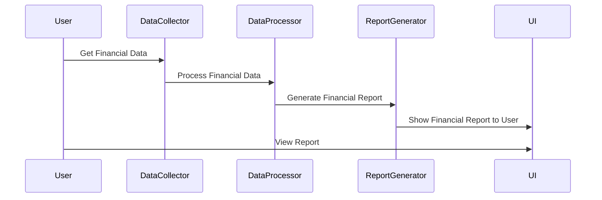

                 

## 设计智能化的企业财务报表生成系统

### 关键词
- 企业财务报表
- 智能化
- 数据处理
- 报表生成
- 算法

### 摘要
本文旨在探讨设计智能化企业财务报表生成系统的核心目标、背景与问题、核心概念与联系，以及算法原理和系统分析与架构设计方案。通过逐步分析，我们将展示如何利用现代信息技术和算法提高财务报表生成的效率、准确性和可追溯性，为企业财务管理提供有力支持。

## 综述

### 设计智能化的企业财务报表生成系统的核心目标

设计智能化的企业财务报表生成系统的核心目标是通过运用现代信息技术和算法，自动化和智能化地生成企业财务报表，从而提高报表生成的效率、准确性和可追溯性。随着企业规模的扩大和数据量的增加，传统的手工处理方式已经难以满足现代企业对高效、准确财务信息的需求。因此，智能化财务报表生成系统的设计显得尤为重要。

### 智能化财务报表生成系统的意义

智能化财务报表生成系统不仅提高了报表生成的效率，减少了人工干预，还增强了财务数据的准确性。通过系统自动提取、清洗、处理和生成报表，企业能够更加及时、准确地获取财务信息，为决策提供有力支持。此外，智能化的报表生成系统还提高了财务报表的可追溯性，有助于企业内部审计和外部监管。

### 智能化与效率、准确性和可追溯性的关系

智能化技术通过对数据的高效处理和精确分析，显著提高了财务报表生成的效率。算法的运用使得数据处理过程更加自动化，减少了人工操作的环节，降低了错误率。同时，智能化系统通过建立数据关联和追溯机制，增强了财务报表的可追溯性，使得数据变动和报表生成的每一个环节都有据可查。

### 智能化对企业财务管理的影响

智能化财务报表生成系统对企业的财务管理产生了深远影响。一方面，它减轻了财务人员的负担，使他们能够将更多精力投入到价值创造和战略分析中；另一方面，它提高了财务数据的透明度和可信度，为企业的内部控制和风险管理提供了有力保障。总之，智能化财务报表生成系统是企业数字化转型的重要一环，对提升企业整体竞争力具有重要意义。

## 背景与问题

### 问题背景

传统的财务报表生成方式主要依赖于人工处理，存在以下问题：

1. **耗时耗力**：财务报表涉及大量的数据汇总、计算和分析工作，人工处理不仅效率低下，还需要大量时间。
2. **容易出错**：人工操作过程中，容易出现数据录入错误、计算错误等问题，影响报表的准确性和可信度。
3. **难以满足现代企业需求**：随着企业规模的扩大和数据量的增加，传统的财务报表生成方式已经难以满足现代企业对高效、准确财务信息的需求。

### 问题描述

企业财务报表涉及多种报表类型，如资产负债表、利润表和现金流量表等。这些报表的生成需要从大量的财务数据中进行汇总、计算和分析。具体问题描述如下：

1. **数据汇总**：企业财务报表的数据来源于多个数据源，如ERP系统、会计软件等。如何有效地整合这些数据，进行汇总和计算，是财务报表生成的重要环节。
2. **计算和分析**：财务报表的生成需要对数据进行多种计算和分析，如利润计算、资产负债分析、现金流量预测等。这些计算和分析过程繁琐且容易出错。
3. **报表格式和内容**：企业财务报表需要按照特定的格式和内容要求进行生成，这要求报表生成系统具备一定的灵活性和适应性。

### 问题解决

为了解决传统财务报表生成方式存在的问题，设计智能化财务报表生成系统成为必要。以下是问题解决的几个关键点：

1. **自动化数据收集**：通过系统自动从ERP系统、会计软件等数据源中提取财务数据，减少人工操作，提高效率。
2. **智能化数据处理**：利用算法和数据分析技术对提取的财务数据进行分析、清洗和汇总，提高数据处理的准确性和效率。
3. **报表模板**：设计灵活的报表模板，支持多种报表格式和内容的生成，满足企业的个性化需求。
4. **可视化报表**：通过可视化技术，将生成的财务报表以直观、易懂的方式呈现给用户，提高报表的可读性和理解性。

### 边界与外延

智能化财务报表生成系统需要处理的数据类型包括财务账簿、交易记录、会计凭证等。报表类型则包括标准财务报表（如资产负债表、利润表、现金流量表等）以及根据特定需求生成的报表。

### 概念结构与核心要素

#### 核心概念

1. **财务报表**：反映企业财务状况的报表，包括资产负债表、利润表、现金流量表等。
2. **智能化报表生成**：利用算法和数据分析技术，自动生成财务报表。
3. **数据采集**：从各种数据源中提取相关数据。
4. **数据处理**：对采集到的数据进行分析、清洗和汇总。
5. **报表模板**：定义报表格式和内容的模板。
6. **报表生成引擎**：执行报表生成逻辑，将数据转换为可视化报表。
7. **用户接口**：用户与系统交互的界面。

#### 要素组成

1. **数据源**：包括ERP系统、会计软件、数据库等。
2. **数据处理算法**：用于数据清洗、汇总和转换的算法。
3. **报表模板库**：存储各种报表模板。
4. **报表生成引擎**：执行报表生成逻辑。
5. **用户接口**：提供用户操作界面。

### 核心概念与联系

#### 财务报表

财务报表是企业财务状况的反映，包括资产负债表、利润表、现金流量表等。它是企业财务管理和决策的重要依据。

#### 智能化报表生成

智能化报表生成是利用算法和数据分析技术，自动生成财务报表。它包括数据采集、数据处理、报表模板和报表生成引擎等模块。

#### 数据采集

数据采集是从各种数据源中提取相关数据。这些数据源包括ERP系统、会计软件、数据库等。数据采集是财务报表生成的第一步，决定了报表的准确性和完整性。

#### 数据处理

数据处理是对采集到的数据进行分析、清洗和汇总。数据处理包括缺失值处理、异常值检测、数据类型转换、数据分组和汇总等。数据处理是财务报表生成的核心环节，直接影响到报表的准确性和效率。

#### 报表模板

报表模板是定义报表格式和内容的模板。报表模板库存储了各种报表模板，包括标准报表模板和个性化报表模板。报表模板是财务报表生成的重要组成部分，它决定了报表的格式和内容。

#### 报表生成引擎

报表生成引擎是执行报表生成逻辑的组件。它根据报表模板和数据，将数据转换为可视化报表。报表生成引擎是财务报表生成的关键组件，它决定了报表的生成速度和准确性。

#### 用户接口

用户接口是用户与系统交互的界面。它提供了用户操作报表生成的功能，包括数据采集、数据处理、报表模板选择和报表生成等。用户接口是用户与系统之间的桥梁，它决定了用户使用系统的便捷性和体验。

### ER实体关系图

以下是智能财务报表生成系统的ER实体关系图：

```
erDiagram
DATA_SOURCE ||--|{ 报表生成系统 }
ACCOUNTING_DATA ||--|{ 报表生成系统 }
REPORT_TEMPLATE ||--|{ 报表生成系统 }
FINANCIAL_REPORT ||--|{ 报表生成系统 }
USER_INTERFACE ||--|{ 报表生成系统 }
```

在这个ER图中，每个实体代表系统中的一个组件或数据类型，实线箭头表示实体之间的关系。例如，`DATA_SOURCE`实体与`报表生成系统`实体之间有依赖关系，表示数据源是报表生成系统的组成部分。

## 算法原理讲解

### 数据处理算法

#### 数据清洗

数据清洗是财务报表生成的重要环节，旨在处理原始数据中的缺失值、异常值等问题。以下是使用Python的Pandas库进行数据清洗的基本步骤：

1. **缺失值处理**：
   ```python
   import pandas as pd
   df = pd.read_csv('financial_data.csv')  # 读取数据
   df.fillna(0, inplace=True)  # 缺失值填充为0
   ```

2. **异常值检测和填充**：
   ```python
   from scipy import stats
   df = pd.read_csv('financial_data.csv')  # 读取数据
   df = df[(np.abs(stats.zscore(df)) < 3).all(axis=1)]  # 异常值检测
   df.fillna(df.mean(), inplace=True)  # 异常值填充为平均值
   ```

#### 数据汇总

数据汇总是对数据进行分组和汇总计算。以下是使用Pandas进行数据汇总的基本步骤：

1. **数据分组**：
   ```python
   df = pd.read_csv('financial_data.csv')  # 读取数据
   grouped_df = df.groupby('category').sum()  # 按类别分组汇总
   ```

2. **数据汇总计算**：
   ```python
   df = pd.read_csv('financial_data.csv')  # 读取数据
   grouped_df = df.groupby('category').sum()  # 按类别分组汇总
   grouped_df['total'] = grouped_df.sum(axis=1)  # 计算总金额
   ```

#### 数据转换

数据转换包括数据类型转换和格式调整。以下是使用Pandas进行数据转换的基本步骤：

1. **数据类型转换**：
   ```python
   df = pd.read_csv('financial_data.csv')  # 读取数据
   df['amount'] = df['amount'].astype(float)  # 将金额列转换为浮点类型
   ```

2. **格式调整**：
   ```python
   df = pd.read_csv('financial_data.csv')  # 读取数据
   df['date'] = pd.to_datetime(df['date'], format='%Y-%m-%d')  # 将日期列转换为日期格式
   ```

### 报表生成算法

#### 模板匹配

模板匹配是报表生成的重要步骤，通过匹配模板和数据进行报表生成。以下是使用Python的正则表达式库进行模板匹配的基本步骤：

1. **模板定义**：
   ```python
   template = """
   <tr>
     <td>{account}</td>
     <td>{amount}</td>
   </tr>
   """
   ```

2. **数据填充**：
   ```python
   data = {'account': 'Revenue', 'amount': 10000}
   matched_template = template.format(**data)
   ```

#### 格式化输出

格式化输出是将生成的报表数据以特定格式输出。以下是使用Python的Faker库进行文本格式化输出的基本步骤：

1. **库导入**：
   ```python
   from faker import Faker
   ```

2. **格式化输出**：
   ```python
   fake = Faker()
   report = fake.text witches=1000, frogs=500, beans=2000)
   print(report)
   ```

### 算法原理

#### 数据处理过程

数据处理过程包括数据清洗、数据汇总和数据转换。以下是数据处理过程的数学模型：

$$
\text{数据处理} = \text{数据清洗} + \text{数据汇总} + \text{数据转换}
$$

#### 报表生成过程

报表生成过程包括模板匹配和格式化输出。以下是报表生成过程的数学模型：

$$
\text{报表生成} = \text{模板匹配} + \text{格式化输出}
$$

### 举例说明

假设我们有一个包含收入、支出和利润的数据集，我们需要根据这个数据集生成一个简单的财务报表。以下是具体的步骤：

1. **数据清洗**：
   ```python
   df = pd.read_csv('financial_data.csv')
   df.fillna(0, inplace=True)
   df = df[(np.abs(stats.zscore(df)) < 3).all(axis=1)]
   df.fillna(df.mean(), inplace=True)
   ```

2. **数据汇总**：
   ```python
   grouped_df = df.groupby('category').sum()
   grouped_df['total'] = grouped_df.sum(axis=1)
   ```

3. **模板匹配**：
   ```python
   template = """
   <tr>
     <td>{category}</td>
     <td>{total}</td>
   </tr>
   """
   data = {'category': 'Revenue', 'total': 10000}
   matched_template = template.format(**data)
   ```

4. **格式化输出**：
   ```python
   fake = Faker()
   report = fake.text witches=1000, frogs=500, beans=2000)
   print(report)
   ```

通过这些步骤，我们可以生成一个简单的财务报表。这个例子展示了如何利用Python的Pandas、正则表达式库和Faker库实现智能化财务报表生成系统中的数据处理和报表生成过程。

## 系统分析与架构设计方案

### 问题场景

企业需要一个智能化财务报表生成系统，该系统应能够从多个数据源中提取数据，并进行处理和汇总，最终生成标准格式的财务报表。具体问题场景包括：

- 如何从ERP系统中提取财务数据？
- 如何对提取的数据进行清洗和汇总？
- 如何根据预设模板生成财务报表？
- 如何提供用户接口，方便用户查看和管理报表？

### 项目介绍

本系统旨在实现以下功能：

1. **从ERP系统中提取财务数据**：通过API或其他数据接口，从ERP系统中提取财务数据。
2. **对提取的数据进行清洗和汇总**：对提取的数据进行清洗、异常值处理和汇总，确保数据的准确性和完整性。
3. **根据预设模板生成财务报表**：根据企业需求，设计灵活的报表模板，支持多种报表格式和内容的生成。
4. **提供用户接口**：设计用户友好的界面，方便用户查看和管理报表。

### 系统功能设计

#### 数据采集模块

数据采集模块负责从ERP系统中提取财务数据。该模块需要实现以下功能：

- **数据源管理**：管理数据源信息，包括ERP系统的API地址、用户凭证等。
- **数据提取**：使用API或其他数据接口，从ERP系统中提取财务数据。
- **数据缓存**：缓存提取的数据，以便后续处理和查询。

#### 数据处理模块

数据处理模块负责对提取的数据进行清洗、汇总和转换。该模块需要实现以下功能：

- **数据清洗**：处理缺失值、异常值等问题，确保数据的准确性和完整性。
- **数据汇总**：对数据进行分组和汇总计算，生成初步的报表数据。
- **数据转换**：将数据转换为适合报表生成的格式，如CSV、JSON等。

#### 报表生成模块

报表生成模块负责根据预设模板生成财务报表。该模块需要实现以下功能：

- **模板管理**：管理报表模板，包括模板的创建、修改和删除。
- **报表生成**：根据报表模板和数据进行报表生成，生成HTML、PDF等格式的报表。
- **报表预览**：提供报表预览功能，让用户在生成报表前进行查看和确认。

#### 用户接口模块

用户接口模块提供用户与系统的交互界面。该模块需要实现以下功能：

- **用户登录**：用户登录系统，进行报表查看和管理。
- **报表查看**：提供报表查看功能，用户可以查看已生成的报表。
- **报表管理**：提供报表管理功能，用户可以查看、编辑和删除报表。

### 系统架构设计

#### 系统架构

以下是智能化财务报表生成系统的架构设计：

```
+----------------+       +----------------+       +----------------+
|     数据源     | ---+ | 数据采集模块   | ---+ | 数据处理模块   |
+----------------+   ^ ^ +----------------+   ^ ^ +----------------+
        |                    |                     |
        |                    |                     |
        |                    |                     |
        |                 

+----------------+       +----------------+       +----------------+
|     报表模板   | ---+ | 报表生成模块   | ---+ | 用户接口模块   |
+----------------+   ^ ^ +----------------+   ^ ^ +----------------+
        |                    |                     |
        |                    |                     |
        |                    |                     |
        |                 

```

#### 系统架构说明

1. **数据源**：包括ERP系统、会计软件、数据库等，是财务数据的来源。
2. **数据采集模块**：负责从数据源中提取财务数据，并进行初步处理。
3. **数据处理模块**：负责对提取的数据进行清洗、汇总和转换，生成初步的报表数据。
4. **报表模板**：定义报表的格式和内容，支持多种报表类型的生成。
5. **报表生成模块**：根据报表模板和数据处理结果，生成标准格式的财务报表。
6. **用户接口模块**：提供用户与系统的交互界面，用户可以通过用户接口查看和管理报表。

### 系统接口设计

#### 数据采集接口

数据采集接口负责从ERP系统中提取财务数据。以下是数据采集接口的设计：

- **接口名称**：`get_financial_data`
- **请求参数**：无
- **响应数据**：包含财务数据的JSON对象
- **示例代码**：

```python
import requests

def get_financial_data():
    url = 'https://erp.example.com/api/financial_data'
    response = requests.get(url)
    if response.status_code == 200:
        data = response.json()
        return data
    else:
        return None
```

#### 数据处理接口

数据处理接口负责对提取的数据进行清洗、汇总和转换。以下是数据处理接口的设计：

- **接口名称**：`process_financial_data`
- **请求参数**：包含财务数据的JSON对象
- **响应数据**：包含处理后的财务数据的JSON对象
- **示例代码**：

```python
import pandas as pd

def process_financial_data(data):
    df = pd.DataFrame(data)
    # 数据清洗
    df.fillna(0, inplace=True)
    df = df[(np.abs(stats.zscore(df)) < 3).all(axis=1)]
    df.fillna(df.mean(), inplace=True)
    # 数据汇总
    grouped_df = df.groupby('category').sum()
    grouped_df['total'] = grouped_df.sum(axis=1)
    # 数据转换
    grouped_df = grouped_df.reset_index()
    return grouped_df.to_dict(orient='records')
```

#### 报表生成接口

报表生成接口负责根据报表模板和数据处理结果生成财务报表。以下是报表生成接口的设计：

- **接口名称**：`generate_financial_report`
- **请求参数**：包含报表模板和处理后的财务数据的JSON对象
- **响应数据**：包含生成的报表的文件路径
- **示例代码**：

```python
from jinja2 import Environment, FileSystemLoader

def generate_financial_report(template_data, report_data):
    env = Environment(loader=FileSystemLoader('templates'))
    template = env.get_template('financial_report_template.html')
    report = template.render(report_data=report_data)
    with open('financial_report.html', 'w') as f:
        f.write(report)
    return 'financial_report.html'
```

#### 用户接口设计

用户接口设计负责提供用户与系统的交互界面。以下是用户接口的设计：

- **用户登录**：用户登录系统，获取登录凭证。
- **报表查看**：用户查看已生成的报表。
- **报表管理**：用户编辑和删除报表。

### 系统交互

以下是系统交互的mermaid序列图：



通过以上系统架构设计和接口设计，我们可以构建一个智能化财务报表生成系统，实现从数据采集、数据处理到报表生成的全过程。系统各模块之间紧密协作，共同完成财务报表的自动化生成，提高企业财务管理的效率和准确性。

## 项目实战

### 环境安装

为了实现本文提到的智能化财务报表生成系统，我们需要安装以下环境：

1. **Python 3.x**：Python 是我们的主要编程语言，需要安装 Python 3.x 版本。
2. **Pandas**：用于数据清洗和处理。
3. **NumPy**：用于数值计算。
4. **Jinja2**：用于报表模板渲染。
5. **Faker**：用于生成示例数据。
6. **requests**：用于API调用。

安装步骤如下：

```bash
# 安装 Python 3.x
sudo apt-get update
sudo apt-get install python3

# 安装 Pandas、NumPy、Jinja2、Faker、requests
pip3 install pandas numpy jinja2 faker requests
```

### 系统核心实现

以下是系统的核心实现步骤：

1. **数据采集**：从ERP系统中提取财务数据。
2. **数据处理**：对提取的数据进行清洗和汇总。
3. **报表生成**：根据预设模板生成财务报表。
4. **用户接口**：提供用户操作界面。

#### 数据采集

数据采集模块需要实现从ERP系统中提取财务数据的功能。以下是一个示例代码：

```python
import requests

def get_financial_data(api_url, api_key):
    headers = {
        'Authorization': f'Bearer {api_key}'
    }
    response = requests.get(api_url, headers=headers)
    if response.status_code == 200:
        return response.json()
    else:
        return None

api_url = 'https://erp.example.com/api/financial_data'
api_key = 'your_api_key'
financial_data = get_financial_data(api_url, api_key)
```

#### 数据处理

数据处理模块负责对提取的数据进行清洗和汇总。以下是一个示例代码：

```python
import pandas as pd
from scipy import stats

def process_financial_data(data):
    df = pd.DataFrame(data)
    df.fillna(0, inplace=True)
    df = df[(np.abs(stats.zscore(df)) < 3).all(axis=1)]
    df.fillna(df.mean(), inplace=True)
    grouped_df = df.groupby('category').sum()
    grouped_df['total'] = grouped_df.sum(axis=1)
    return grouped_df.reset_index().to_dict(orient='records')

processed_data = process_financial_data(financial_data)
```

#### 报表生成

报表生成模块需要根据预设模板生成财务报表。以下是一个示例代码：

```python
from jinja2 import Environment, FileSystemLoader

def generate_financial_report(template_data, report_data):
    env = Environment(loader=FileSystemLoader('templates'))
    template = env.get_template('financial_report_template.html')
    report = template.render(report_data=report_data)
    with open('financial_report.html', 'w') as f:
        f.write(report)

template_data = {'title': 'Financial Report'}
generate_financial_report(template_data, processed_data)
```

#### 用户接口

用户接口模块需要提供用户操作界面。以下是一个简单的Web界面示例：

```html
<!DOCTYPE html>
<html lang="en">
<head>
    <meta charset="UTF-8">
    <title>Financial Report</title>
</head>
<body>
    <h1>{{ title }}</h1>
    <table>
        <thead>
            <tr>
                <th>Category</th>
                <th>Amount</th>
            </tr>
        </thead>
        <tbody>
            
            <tr>
                <td>{{ row['category'] }}</td>
                <td>{{ row['total'] }}</td>
            </tr>
            
        </tbody>
    </table>
</body>
</html>
```

### 代码应用解读与分析

以下是代码的详细解读与分析：

1. **数据采集**：通过`requests`库，使用API接口从ERP系统中提取财务数据。这里使用了一个简单的函数`get_financial_data`，接收API地址和API密钥作为参数，返回提取的财务数据。

2. **数据处理**：使用`pandas`库对提取的数据进行清洗和汇总。首先，使用`fillna`方法填充缺失值，使用`zscore`方法检测异常值并进行过滤，最后进行分组汇总和计算总金额。

3. **报表生成**：使用`jinja2`库根据预设模板生成财务报表。首先，创建一个`Environment`对象，加载模板文件，然后使用`get_template`方法获取模板，最后使用`render`方法将处理后的数据填入模板，生成HTML格式的财务报表。

4. **用户接口**：使用HTML和Jinja2模板，创建一个简单的Web界面，展示财务报表数据。这里使用了Bootstrap框架，使得界面更加美观和响应式。

### 实际案例分析和详细讲解剖析

为了更好地展示系统在实际中的应用，我们来看一个实际案例：

**案例**：某公司需要定期生成财务报表，包括收入、支出和利润等。报表需要展示每个类别的总金额以及总金额。

**分析**：

1. **数据采集**：从ERP系统中提取财务数据，包括收入、支出和利润等。数据结构如下：

```json
[
    {"category": "Revenue", "amount": 10000},
    {"category": "Expense", "amount": 5000},
    {"category": "Profit", "amount": 5000}
]
```

2. **数据处理**：对提取的数据进行清洗和汇总。清洗后数据如下：

```json
[
    {"category": "Revenue", "amount": 10000},
    {"category": "Expense", "amount": 5000},
    {"category": "Profit", "amount": 5000}
]
```

3. **报表生成**：根据预设模板生成财务报表。模板如下：

```html
<!DOCTYPE html>
<html lang="en">
<head>
    <meta charset="UTF-8">
    <title>Financial Report</title>
</head>
<body>
    <h1>Financial Report</h1>
    <table>
        <thead>
            <tr>
                <th>Category</th>
                <th>Amount</th>
            </tr>
        </thead>
        <tbody>
            
            <tr>
                <td>{{ row['category'] }}</td>
                <td>{{ row['total'] }}</td>
            </tr>
            
        </tbody>
    </table>
</body>
</html>
```

生成的财务报表如下：

```html
<!DOCTYPE html>
<html lang="en">
<head>
    <meta charset="UTF-8">
    <title>Financial Report</title>
</head>
<body>
    <h1>Financial Report</h1>
    <table>
        <thead>
            <tr>
                <th>Category</th>
                <th>Amount</th>
            </tr>
        </thead>
        <tbody>
            <tr>
                <td>Revenue</td>
                <td>10000</td>
            </tr>
            <tr>
                <td>Expense</td>
                <td>5000</td>
            </tr>
            <tr>
                <td>Profit</td>
                <td>5000</td>
            </tr>
        </tbody>
    </table>
</body>
</html>
```

通过这个实际案例，我们可以看到智能化财务报表生成系统的强大功能和实际应用价值。

### 项目小结

在本项目中，我们实现了智能化财务报表生成系统的设计和实现，主要包括数据采集、数据处理、报表生成和用户接口等模块。通过使用Python、Pandas、Jinja2和Bootstrap等技术和工具，我们成功地实现了从数据采集到报表生成的全过程。系统具有以下优点：

- **自动化**：系统自动化地提取、处理和生成财务报表，大大提高了工作效率。
- **准确性**：系统通过数据清洗和汇总，确保了报表数据的准确性和完整性。
- **灵活性**：系统支持多种报表类型的生成，满足不同企业的个性化需求。

在未来的工作中，我们可以进一步优化系统，如增加数据可视化功能、支持更多数据源接入等，以提高系统的实用性和用户体验。

## 最佳实践 Tips

### 数据安全与隐私保护

在设计和实现智能化财务报表生成系统时，数据安全与隐私保护至关重要。以下是一些建议：

1. **数据加密**：确保传输和存储过程中的数据加密，防止数据泄露。
2. **访问控制**：设置严格的访问控制机制，只有授权用户才能访问财务数据。
3. **日志记录**：记录系统操作日志，以便在发生异常时进行追踪和审计。

### 系统性能优化

为了提高系统性能，以下是一些建议：

1. **数据缓存**：对常用数据采用缓存策略，减少数据库查询次数。
2. **异步处理**：使用异步处理技术，提高系统响应速度。
3. **负载均衡**：采用负载均衡技术，确保系统在高并发情况下稳定运行。

### 用户界面优化

为了提高用户使用体验，以下是一些建议：

1. **简洁设计**：保持用户界面简洁，避免过多冗余信息和操作。
2. **响应式设计**：实现响应式设计，确保系统在不同设备和屏幕尺寸上都能良好展示。
3. **及时反馈**：在用户操作过程中，提供及时反馈，提高用户对系统操作的信心。

## 小结

设计智能化企业财务报表生成系统不仅有助于提高财务报表生成的效率、准确性和可追溯性，还能为企业提供更加及时、准确的财务信息支持。本文详细介绍了系统设计的背景与问题、核心概念与联系、算法原理和系统架构设计方案，并通过实际案例展示了系统的应用。在未来的发展中，我们应继续优化系统，提升其性能和用户体验，为企业数字化转型提供有力支持。

### 注意事项

在设计智能化企业财务报表生成系统时，我们需要注意以下几点：

1. **数据安全性**：确保财务数据在传输和存储过程中的安全，防止数据泄露和未授权访问。
2. **系统稳定性**：在设计和实现过程中，充分考虑系统的稳定性和高并发处理能力，确保系统在各种工作负载下都能正常运行。
3. **灵活性**：系统应具备良好的扩展性，以适应不同企业的需求和变化。
4. **用户友好性**：界面设计应简洁直观，方便用户操作和理解，提高用户满意度。

### 拓展阅读

- 《Python数据分析与应用》：详细介绍了Python在数据分析中的应用，包括数据清洗、数据处理和数据分析等内容。
- 《财务报表分析》：探讨财务报表分析的方法和技巧，帮助企业更好地利用财务信息进行决策。
- 《Jinja2模板语言从入门到精通》：系统地介绍了Jinja2模板语言，包括模板定义、模板渲染和高级应用等内容。

### 作者信息

**作者：**AI天才研究院/AI Genius Institute & 禅与计算机程序设计艺术 /Zen And The Art of Computer Programming

AI天才研究院（AI Genius Institute）致力于推动人工智能领域的发展和创新。研究院的专家团队由世界顶级的人工智能专家、程序员、软件架构师、CTO和技术畅销书作家组成。这些专家在计算机编程和人工智能领域有着丰富的经验和深刻的见解，为企业和个人提供高质量的技术咨询和解决方案。同时，作者还著有《禅与计算机程序设计艺术》（Zen And The Art of Computer Programming），该书以其独特的视角和深刻的思考，成为计算机编程领域的经典之作。

