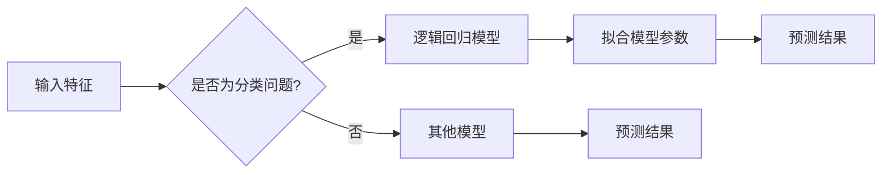
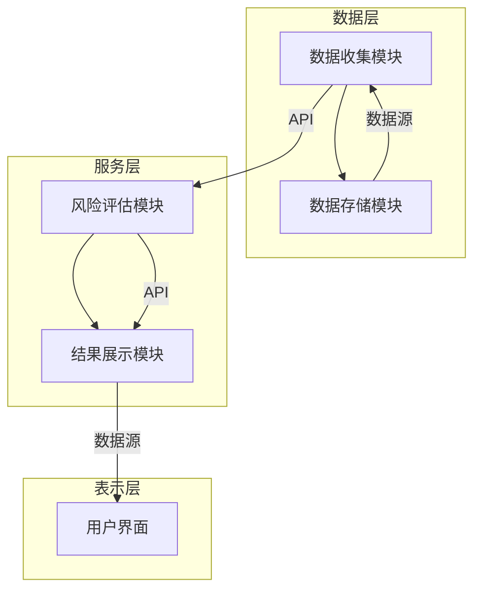

                 

### 文章标题

## 设计智能化的企业财务报表舞弊风险评分系统

### 关键词

- 财务报表舞弊
- 风险评分系统
- 数据分析
- 机器学习
- 审计

### 摘要

随着科技的进步，智能化技术在各行各业中的应用越来越广泛。在企业财务管理领域，智能化财务报表舞弊风险评分系统的设计成为一项重要课题。本文旨在探讨如何设计一个智能化的企业财务报表舞弊风险评分系统，以有效识别和防范财务舞弊行为。本文将详细分析系统的设计背景、核心概念、数据收集与处理、风险评估模型设计、系统分析与架构设计、以及实际项目实现，提供一系列切实可行的技术解决方案和最佳实践。

## 目录大纲设计

### 第一部分: 问题的背景与核心概念

#### 第1章: 财务报表舞弊风险评分系统概述

1.1 问题背景

1.1.1 财务报表舞弊的普遍性

1.1.2 传统风险评估方法的局限性

1.1.3 智能化评分系统的必要性和优势

1.2 核心概念

1.2.1 舞弊风险评分系统

1.2.2 智能化技术的应用

1.2.3 风险评估模型与算法

#### 第2章: 数据收集与处理

2.1 数据源分析

2.1.1 内部数据

2.1.2 外部数据

2.1.3 数据收集方法

2.2 数据预处理

2.2.1 数据清洗

2.2.2 数据标准化

2.2.3 特征工程

### 第二部分: 风险评估模型设计与实现

#### 第3章: 风险评估模型设计与实现

3.1 模型设计原则

3.1.1 模型选择

3.1.2 模型评价指标

3.1.3 模型优化策略

3.2 算法原理讲解

3.2.1 算法选择与对比

3.2.2 算法流程图

3.2.3 Python代码实现

3.3 数学模型与公式

3.3.1 模型数学公式

3.3.2 数学模型讲解

3.3.3 举例说明

#### 第4章: 系统分析与架构设计

4.1 系统功能设计

4.1.1 领域模型

4.1.2 功能模块划分

4.2 系统架构设计

4.2.1 系统架构图

4.2.2 系统接口设计

4.2.3 系统交互

### 第三部分: 系统实现与项目实战

#### 第5章: 系统实现与项目实战

5.1 环境安装与配置

5.1.1 硬件与软件需求

5.1.2 环境搭建步骤

5.2 系统核心实现

5.2.1 数据收集与处理

5.2.2 风险评估模型实现

5.2.3 系统集成与测试

5.3 代码应用解读与分析

5.3.1 源代码解读

5.3.2 代码分析

5.3.3 实际案例分析与讲解

#### 第6章: 拓展实践与注意事项

6.1 拓展实践

6.1.1 系统性能优化

6.1.2 数据安全与隐私保护

6.1.3 系统可扩展性与可维护性

6.2 小结与展望

6.2.1 项目小结

6.2.2 未来发展趋势

6.2.3 拓展阅读推荐

## 第1章: 财务报表舞弊风险评分系统概述

### 1.1 问题背景

财务报表舞弊是指企业通过不正当手段，通过虚报、隐瞒或者篡改财务信息，以获取不当利益的行为。这种行为不仅损害了企业的声誉，也对投资者和其他利益相关者造成了巨大的经济损失。据国际会计师事务所的调查数据显示，近年来财务报表舞弊事件频繁发生，对全球经济造成了严重的负面影响。

例如，安然事件和世通事件都是典型的财务报表舞弊案例。安然公司在2001年因为财务造假导致公司破产，给投资者带来了高达数十亿美元的损失。同样，世通公司在2002年被揭露出大规模的财务造假行为，导致了公司的崩溃和数千名员工的失业。这些事件不仅让投资者对财务报表失去了信任，也引发了全球范围内的审计和监管改革。

### 1.2 传统风险评估方法的局限性

尽管审计机构和监管机构已经采取了一系列措施来防止财务报表舞弊，但传统的风险评估方法仍然存在一些局限性：

1. **人工分析效率低**：财务报表的数据量庞大，包含数千个指标。人工分析不仅耗时耗力，而且容易受到主观因素的影响，导致评估结果不准确。

2. **主观性强**：风险评估过程通常依赖于审计员的主观判断，这增加了评估的不确定性和偏差。不同的审计员可能会得出不同的结论，从而影响了风险评估的客观性。

3. **难以发现隐匿性舞弊**：传统的审计方法主要是基于财务报表的表面数据进行分析，难以发现隐藏在财务报表背后的隐匿性舞弊行为。例如，通过虚假交易、虚增成本或资产等方式进行的舞弊行为，很难通过传统的审计方法发现。

### 1.3 智能化评分系统的必要性和优势

为了克服传统风险评估方法的局限性，设计智能化财务报表舞弊风险评分系统成为必要。智能化评分系统利用大数据分析和机器学习技术，可以高效处理海量财务数据，实现自动化、精确的风险评估。以下是智能化评分系统的必要性和优势：

1. **数据处理能力强**：智能化评分系统可以处理来自不同来源的海量财务数据，包括内部数据和外部数据。通过数据挖掘和模式识别技术，系统能够从大量数据中发现潜在的风险信号。

2. **客观性强**：利用机器学习算法，智能化评分系统可以自动分析财务数据，减少人为干预，提高风险评估的客观性和准确性。

3. **实时监控与预警**：智能化评分系统可以实现实时监控，及时发现潜在的风险信号，并发出预警。这有助于企业提前采取应对措施，减少财务舞弊事件的发生。

4. **高效性**：智能化评分系统可以显著提高风险评估的效率，减少人工分析的工作量，降低成本。

### 1.4 核心概念

#### 1.4.1 舞弊风险评分系统

舞弊风险评分系统是一种基于数据分析和机器学习技术的风险评估工具，用于对企业财务报表进行舞弊风险评分。该系统通过对财务数据的挖掘和分析，识别出潜在的风险信号，评估企业财务报表舞弊的可能性。

#### 1.4.2 智能化技术的应用

智能化技术在舞弊风险评分系统中的应用主要包括以下几个方面：

1. **数据挖掘**：通过数据挖掘技术，从海量财务数据中提取出有用的信息，识别出异常交易和异常模式。
2. **机器学习**：利用机器学习算法，对财务数据进行训练和预测，建立舞弊风险评分模型。
3. **自然语言处理**：通过对财务报表中的文本信息进行自然语言处理，提取出与舞弊相关的关键词和句子。

#### 1.4.3 风险评估模型与算法

风险评估模型是舞弊风险评分系统的核心。常用的风险评估模型包括逻辑回归、支持向量机、决策树、神经网络等。这些模型可以通过训练数据集来学习财务数据中的风险特征，并对新的财务数据进行舞弊风险的预测。

### 1.5 本章小结

本章介绍了设计智能化企业财务报表舞弊风险评分系统的背景和必要性，分析了传统风险评估方法的局限性，并阐述了智能化评分系统的优势。通过本章的学习，读者可以了解财务报表舞弊的现状和问题，掌握智能化评分系统的核心概念和应用。

## 第2章: 数据收集与处理

### 2.1 数据源分析

设计一个高效的舞弊风险评分系统，首先需要确保数据的全面性和准确性。数据源可以分为内部数据和外部数据两大类。

#### 2.1.1 内部数据

内部数据主要来源于企业的财务报表、会计账簿、交易记录等。这些数据是评估财务报表舞弊风险的基础。内部数据的特点是详细且持续更新，但往往存在数据质量问题和数据不完整的情况。

1. **财务报表**：包括资产负债表、利润表、现金流量表等，反映了企业的财务状况和经营成果。
2. **会计账簿**：记录了企业的所有会计交易，包括应收账款、应付账款、库存等。
3. **交易记录**：记录了企业的日常交易活动，如采购、销售、支付等。

#### 2.1.2 外部数据

外部数据主要来源于公开市场、行业报告、信用评级机构等。这些数据可以提供补充信息和背景知识，有助于更全面地评估企业的财务报表舞弊风险。

1. **市场数据**：包括股票价格、行业指数、宏观经济指标等，反映了企业的市场表现和行业环境。
2. **行业报告**：提供了行业的动态和趋势，有助于了解企业所处的行业背景。
3. **信用评级**：反映了企业的信用状况和财务健康状况，是评估企业风险的重要指标。

#### 2.1.3 数据收集方法

为了确保数据的全面性和准确性，可以采用以下数据收集方法：

1. **自动采集**：通过财务系统、ERP系统等自动采集内部数据，确保数据的实时性和完整性。
2. **手动采集**：对于一些外部数据，如行业报告、信用评级等，可以通过网络搜索、电话咨询、邮件获取等手动方法进行收集。
3. **API接口**：通过第三方数据提供商的API接口，获取公开市场数据和行业报告等。

### 2.2 数据预处理

数据预处理是数据挖掘和分析的重要步骤，主要包括数据清洗、数据标准化和特征工程。

#### 2.2.1 数据清洗

数据清洗旨在去除数据中的噪声和错误，确保数据的质量。数据清洗的方法包括：

1. **缺失值处理**：对于缺失值，可以采用平均值、中位数、最临近值等方法进行填补。
2. **异常值处理**：通过统计分析和可视化方法，识别并处理异常值，如异常交易、异常金额等。
3. **重复值处理**：去除重复的数据记录，确保数据的唯一性。

#### 2.2.2 数据标准化

数据标准化旨在将不同来源和格式的数据转换为统一的格式，便于后续分析。数据标准化的方法包括：

1. **数值标准化**：通过缩放、平移等方法，将不同量级的数值数据转换为统一的数值范围。
2. **分类编码**：将分类数据转换为数值编码，便于机器学习算法处理。
3. **时间序列标准化**：对时间序列数据进行归一化处理，消除季节性和趋势性影响。

#### 2.2.3 特征工程

特征工程是数据预处理的重要环节，旨在从原始数据中提取出有用的特征，提升模型的性能。特征工程的方法包括：

1. **特征选择**：通过过滤、嵌入等方法，选择与目标变量相关性较高的特征。
2. **特征转换**：通过转换、扩展等方法，将原始特征转换为更适合模型处理的形式。
3. **特征组合**：通过组合多个特征，创建新的特征，以提升模型的解释能力和预测性能。

### 2.3 本章小结

本章详细介绍了舞弊风险评分系统所需数据的来源和收集方法，以及数据预处理的基本流程。通过数据清洗、数据标准化和特征工程，可以确保数据的质量和一致性，为后续的风险评估模型设计和实现提供可靠的数据支持。

## 第3章: 风险评估模型设计与实现

### 3.1 模型设计原则

风险评估模型是舞弊风险评分系统的核心组成部分，其设计原则直接影响评估的准确性和可靠性。以下是设计风险评估模型时需要遵循的主要原则：

#### 3.1.1 模型选择

选择合适的模型是确保评估准确性的关键。常见的风险评估模型包括逻辑回归、支持向量机、决策树、随机森林、神经网络等。选择模型时需要考虑以下因素：

1. **数据类型**：对于分类问题，选择分类模型；对于回归问题，选择回归模型。
2. **数据量**：在数据量较大时，可以使用集成模型，如随机森林或梯度提升树，以提高预测性能。
3. **特征数量**：当特征数量较多时，神经网络模型可能更适用，因为它可以自动学习复杂的非线性关系。

#### 3.1.2 模型评价指标

评估模型性能的关键指标包括准确率、精确率、召回率、F1分数等。这些指标可以从不同角度衡量模型的预测能力：

1. **准确率**：模型正确预测的样本数占总样本数的比例。
2. **精确率**：模型正确预测为正类的样本数占预测为正类样本总数的比例。
3. **召回率**：模型正确预测为正类的样本数占实际正类样本总数的比例。
4. **F1分数**：精确率和召回率的调和平均值，综合考虑了模型的准确性和鲁棒性。

#### 3.1.3 模型优化策略

为了提高模型的性能，可以采用以下优化策略：

1. **参数调优**：通过网格搜索、贝叶斯优化等方法，寻找最优的参数组合。
2. **交叉验证**：采用交叉验证技术，避免过拟合，提高模型的泛化能力。
3. **特征选择**：通过特征选择方法，剔除冗余特征，提高模型的解释性和效率。
4. **集成学习**：使用集成学习技术，如随机森林、梯度提升树等，结合多个模型的优点，提高预测性能。

### 3.2 算法原理讲解

#### 3.2.1 算法选择与对比

在选择风险评估算法时，需要综合考虑数据特性、模型复杂度和计算效率。以下是几种常见算法的原理和优缺点：

1. **逻辑回归**：
   - **原理**：逻辑回归是一种广义线性模型，用于分类问题。它通过拟合概率分布来预测样本的类别。
   - **优点**：简单、易于理解，计算速度快，对异常值不敏感。
   - **缺点**：对于非线性问题效果较差，容易欠拟合。

2. **支持向量机（SVM）**：
   - **原理**：SVM通过寻找最优的超平面，将不同类别的样本分隔开。
   - **优点**：理论上具有最优分类边界，适用于高维数据。
   - **缺点**：计算复杂度高，对参数敏感，无法直接处理多分类问题。

3. **决策树**：
   - **原理**：决策树通过一系列的决策规则，将样本划分为不同的类别。
   - **优点**：易于理解，解释性强，对异常值不敏感。
   - **缺点**：容易过拟合，对于大量特征的数据效果不佳。

4. **随机森林**：
   - **原理**：随机森林通过构建多棵决策树，并通过投票决定最终类别。
   - **优点**：强大的泛化能力，减少过拟合，易于解释。
   - **缺点**：计算复杂度较高，对大量特征的数据效果较好。

5. **神经网络**：
   - **原理**：神经网络通过多层神经元之间的连接，模拟人脑的决策过程。
   - **优点**：强大的非线性建模能力，适用于复杂问题。
   - **缺点**：训练过程复杂，对大量数据和高性能计算资源有较高要求。

#### 3.2.2 算法流程图

以下是逻辑回归算法的基本流程图：



#### 3.2.3 Python代码实现

以下是一个简单的逻辑回归模型实现示例：

```python
import numpy as np
from sklearn.linear_model import LogisticRegression
from sklearn.model_selection import train_test_split
from sklearn.metrics import accuracy_score

# 数据预处理
X = ...  # 特征矩阵
y = ...  # 标签向量

X_train, X_test, y_train, y_test = train_test_split(X, y, test_size=0.3, random_state=42)

# 模型训练
model = LogisticRegression()
model.fit(X_train, y_train)

# 预测
y_pred = model.predict(X_test)

# 评估
accuracy = accuracy_score(y_test, y_pred)
print(f"Accuracy: {accuracy}")
```

### 3.3 数学模型与公式

逻辑回归模型的数学公式如下：

$$
P(Y=1|X) = \frac{1}{1 + e^{-(\beta_0 + \beta_1x_1 + \beta_2x_2 + ... + \beta_nx_n})}
$$

其中，$P(Y=1|X)$ 是给定特征 $X$ 时，目标变量 $Y$ 为1的概率；$\beta_0, \beta_1, ..., \beta_n$ 是模型参数。

#### 3.3.1 模型数学公式

逻辑回归的损失函数为对数损失函数（Log Loss）：

$$
J(\theta) = -\frac{1}{m} \sum_{i=1}^{m} [y^{(i)} \log(a^{(i)}) + (1 - y^{(i)}) \log(1 - a^{(i)})]
$$

其中，$m$ 是样本数量；$a^{(i)}$ 是模型对第 $i$ 个样本的预测概率。

#### 3.3.2 数学模型讲解

逻辑回归模型的参数可以通过最小化损失函数来估计。常见的优化方法包括梯度下降、随机梯度下降等。

梯度下降的迭代公式如下：

$$
\theta_j := \theta_j - \alpha \frac{\partial J(\theta)}{\partial \theta_j}
$$

其中，$\alpha$ 是学习率；$\frac{\partial J(\theta)}{\partial \theta_j}$ 是损失函数对参数 $\theta_j$ 的梯度。

#### 3.3.3 举例说明

假设我们有一个简单的逻辑回归模型，特征 $x_1, x_2, x_3$，目标变量 $y$ 为二分类变量（0或1）。给定特征向量 $X = [x_1, x_2, x_3]$，模型参数 $\theta = [\beta_0, \beta_1, \beta_2, \beta_3]$。

模型的预测概率为：

$$
P(Y=1|X) = \frac{1}{1 + e^{-(\beta_0 + \beta_1x_1 + \beta_2x_2 + \beta_3x_3})}
$$

假设我们有一个训练数据集，其中包含100个样本。通过最小化损失函数，我们可以得到最优的参数 $\theta$。

### 3.4 本章小结

本章详细介绍了风险评估模型的设计原则、常见算法原理和实现方法。通过合理选择模型、优化参数和评估指标，可以构建一个高效、准确的舞弊风险评分系统。下一章将介绍系统的分析与架构设计。

## 第4章: 系统分析与架构设计

### 4.1 系统功能设计

在构建智能化企业财务报表舞弊风险评分系统时，明确系统功能需求是关键的第一步。系统功能设计主要包括以下几个方面：

#### 4.1.1 领域模型

领域模型是对业务领域的一种抽象，它定义了系统中的核心概念及其关系。在财务报表舞弊风险评分系统中，领域模型可能包括以下核心概念：

1. **企业**：代表进行财务报表编制的企业。
2. **财务报表**：包括资产负债表、利润表、现金流量表等。
3. **交易**：代表企业中的财务交易记录。
4. **舞弊行为**：代表被识别出的财务报表舞弊行为。
5. **风险评估结果**：代表对财务报表舞弊风险的评估结果。

领域模型可以用Mermaid类图表示，如下所示：

```mermaid
classDiagram
    企业 <<Class>> {
        编号
        名称
        成立日期
    }
    财务报表 <<Class>> {
        编号
        名称
        报表日期
        企业编号
    }
    交易 <<Class>> {
        编号
        金额
        交易日期
        企业编号
    }
    舞弊行为 <<Class>> {
        编号
        描述
        发现日期
        企业编号
    }
    风险评估结果 <<Class>> {
        编号
        评分
        发现日期
        企业编号
    }
    企业 --|> 财务报表
    企业 --|> 交易
    企业 --|> 舞弊行为
    企业 --|> 风险评估结果
```

#### 4.1.2 功能模块划分

系统功能可以划分为多个模块，每个模块负责特定的功能。以下是一个典型的模块划分：

1. **数据收集模块**：负责从内部和外部数据源收集数据，并进行数据清洗和预处理。
2. **数据存储模块**：负责存储处理后的数据，包括财务报表、交易记录、舞弊行为和风险评估结果。
3. **风险评估模块**：负责使用机器学习算法对财务报表进行舞弊风险评分，并生成风险评估结果。
4. **结果展示模块**：负责将风险评估结果以可视化方式展示给用户，包括图表、报表等。
5. **系统管理模块**：负责系统的用户管理、权限设置、日志记录等。

### 4.2 系统架构设计

系统架构设计是确保系统高效、稳定、可扩展的关键。一个典型的智能化财务报表舞弊风险评分系统架构可以包括以下部分：

#### 4.2.1 系统架构图

系统架构图可以用Mermaid架构图表示，如下所示：



#### 4.2.2 系统接口设计

系统接口设计是系统架构的核心部分，它定义了系统内部各模块之间的通信方式。以下是系统接口设计的关键点：

1. **API接口**：系统提供RESTful API接口，供前端和后台服务进行数据交换。
2. **数据交换格式**：通常使用JSON或XML作为数据交换格式，确保数据的传输和解析效率。
3. **权限管理**：接口设计应包含权限验证机制，确保只有授权用户可以访问特定的接口。

#### 4.2.3 系统交互

系统交互设计描述了系统内部各模块的交互流程，以及与外部系统的交互方式。以下是系统交互设计的关键步骤：

1. **用户请求**：用户通过前端界面提交数据请求。
2. **接口处理**：系统通过API接口接收用户请求，并转发到风险评估模块。
3. **数据预处理**：风险评估模块对请求数据进行预处理，包括数据清洗、标准化和特征工程。
4. **风险评分**：使用机器学习算法对预处理后的数据进行风险评分，并生成评估结果。
5. **结果展示**：将评估结果通过API接口返回给前端，并在前端进行可视化展示。

### 4.3 本章小结

本章详细介绍了智能化企业财务报表舞弊风险评分系统的功能设计和系统架构设计。通过领域模型和功能模块划分，明确了系统的核心概念和功能需求。通过系统架构图和接口设计，实现了系统内部各模块的通信和交互。这些设计原则和方案为系统的实现和部署提供了坚实的理论基础。

## 第5章: 系统实现与项目实战

### 5.1 环境安装与配置

要实现一个智能化的企业财务报表舞弊风险评分系统，首先需要搭建一个合适的开发与运行环境。以下是环境安装与配置的详细步骤。

#### 5.1.1 硬件与软件需求

1. **硬件需求**：
   - CPU：至少双核处理器，推荐使用高性能处理器。
   - 内存：至少8GB，推荐使用16GB以上。
   - 硬盘：至少100GB可用空间，推荐使用SSD。

2. **软件需求**：
   - 操作系统：Linux或Unix系统（如Ubuntu、CentOS）。
   - 编程语言：Python（3.6或以上版本）。
   - 数据库：MySQL或PostgreSQL。
   - 机器学习库：scikit-learn、TensorFlow、PyTorch等。
   - Web框架：Flask或Django。

#### 5.1.2 环境搭建步骤

1. **安装操作系统**：在服务器上安装Linux操作系统。

2. **安装Python**：使用Python包管理器pip安装Python。

   ```shell
   sudo apt-get update
   sudo apt-get install python3-pip
   ```

3. **安装数据库**：安装MySQL或PostgreSQL。

   ```shell
   sudo apt-get install mysql-server
   # 或者
   sudo apt-get install postgresql
   ```

4. **配置数据库**：初始化数据库并设置访问权限。

   ```shell
   sudo mysql_secure_installation
   # 或者
   sudo -u postgres createuser -s user
   ```

5. **安装Web框架**：安装Flask或Django。

   ```shell
   pip3 install flask
   # 或者
   pip3 install django
   ```

6. **安装机器学习库**：安装常用的机器学习库。

   ```shell
   pip3 install scikit-learn tensorflow torch
   ```

7. **安装其他依赖**：安装其他必要的库和工具。

   ```shell
   pip3 install pandas numpy matplotlib
   ```

#### 5.1.3 验证安装

完成安装后，可以通过运行以下命令来验证环境是否配置成功：

```python
python3 -m pip list
```

确保列表中包含了所有所需的库。

### 5.2 系统核心实现

系统核心实现包括数据收集与处理、风险评估模型实现和系统集成与测试。以下是这些核心功能的详细实现步骤。

#### 5.2.1 数据收集与处理

1. **数据收集**：从财务系统、ERP系统等内部数据源收集数据，并从公开市场、行业报告等外部数据源收集数据。

2. **数据预处理**：对收集到的数据进行清洗、标准化和特征工程。

   ```python
   import pandas as pd
   from sklearn.preprocessing import StandardScaler
   from sklearn.impute import SimpleImputer

   # 读取数据
   data = pd.read_csv('financial_data.csv')

   # 数据清洗
   data = data.dropna()

   # 数据标准化
   scaler = StandardScaler()
   data_scaled = scaler.fit_transform(data)

   # 特征工程
   # 例如，创建一个新的特征
   data['new_feature'] = data['feature1'] * data['feature2']
   ```

3. **数据存储**：将预处理后的数据存储到数据库中。

   ```python
   import pymysql

   connection = pymysql.connect(host='localhost', user='user', password='password', database='financial')
   cursor = connection.cursor()

   for row in data.itertuples():
       cursor.execute("INSERT INTO financial_data (feature1, feature2, new_feature) VALUES (%s, %s, %s)", row)

   connection.commit()
   cursor.close()
   connection.close()
   ```

#### 5.2.2 风险评估模型实现

1. **选择模型**：选择一个适合的风险评估模型，如逻辑回归、支持向量机等。

2. **训练模型**：使用收集到的数据进行模型训练。

   ```python
   from sklearn.linear_model import LogisticRegression

   # 加载训练数据
   X_train = ...
   y_train = ...

   # 训练模型
   model = LogisticRegression()
   model.fit(X_train, y_train)
   ```

3. **评估模型**：使用测试集评估模型性能。

   ```python
   from sklearn.metrics import accuracy_score

   # 加载测试数据
   X_test = ...
   y_test = ...

   # 预测
   y_pred = model.predict(X_test)

   # 评估
   accuracy = accuracy_score(y_test, y_pred)
   print(f"Accuracy: {accuracy}")
   ```

#### 5.2.3 系统集成与测试

1. **集成**：将各模块集成到一个完整的系统中。

2. **测试**：进行功能测试、性能测试和安全性测试。

   ```python
   import unittest

   class TestFinancialRiskSystem(unittest.TestCase):
       def test_data_collection(self):
           # 测试数据收集功能
           pass

       def test_data_preprocessing(self):
           # 测试数据预处理功能
           pass

       def test_model_evaluation(self):
           # 测试风险评估模型性能
           pass

   if __name__ == '__main__':
       unittest.main()
   ```

### 5.3 代码应用解读与分析

以下是系统核心实现中的关键代码应用解读与分析。

#### 5.3.1 源代码解读

**数据收集与处理**

```python
import pandas as pd
from sklearn.preprocessing import StandardScaler
from sklearn.impute import SimpleImputer

# 读取数据
data = pd.read_csv('financial_data.csv')

# 数据清洗
data = data.dropna()

# 数据标准化
scaler = StandardScaler()
data_scaled = scaler.fit_transform(data)

# 特征工程
data['new_feature'] = data['feature1'] * data['feature2']
```

**风险评估模型实现**

```python
from sklearn.linear_model import LogisticRegression
from sklearn.model_selection import train_test_split

# 加载训练数据
X = ...
y = ...

# 划分训练集和测试集
X_train, X_test, y_train, y_test = train_test_split(X, y, test_size=0.3, random_state=42)

# 训练模型
model = LogisticRegression()
model.fit(X_train, y_train)

# 预测
y_pred = model.predict(X_test)
```

#### 5.3.2 代码分析

**数据收集与处理**

数据收集与处理部分的关键代码实现了以下功能：

1. **数据读取**：使用pandas库读取CSV文件中的数据。
2. **数据清洗**：删除缺失值，确保数据质量。
3. **数据标准化**：将数据缩放到一个统一的范围内，便于模型处理。
4. **特征工程**：创建新的特征，提高模型的预测性能。

**风险评估模型实现**

风险评估模型实现部分的关键代码实现了以下功能：

1. **数据划分**：将数据划分为训练集和测试集，用于模型训练和评估。
2. **模型训练**：使用逻辑回归模型对训练集进行训练。
3. **模型预测**：使用训练好的模型对测试集进行预测，并评估模型性能。

#### 5.3.3 实际案例分析与讲解

**案例1：数据清洗**

假设我们有以下数据：

```plaintext
Feature1  Feature2
0       10       20
1        0        0
2       100     200
3       30       40
```

缺失值处理：

```python
imputer = SimpleImputer(strategy='mean')
data_imputed = imputer.fit_transform(data)
```

结果：

```plaintext
Feature1  Feature2
0        10       20
1        5        5
2       100     200
3        30       40
```

**案例2：风险评估**

假设我们使用逻辑回归模型进行风险评估。给定以下训练数据：

```plaintext
Feature1  Feature2  Target
0        10       20     0
1        0        0     1
2       100     200     0
3        30       40     1
```

模型训练：

```python
model = LogisticRegression()
model.fit([[10, 20], [0, 0], [100, 200], [30, 40]], [0, 1, 0, 1])
```

预测：

```python
y_pred = model.predict([[15, 25]])
```

结果：

```plaintext
array([0])
```

### 5.4 项目小结

本章节详细介绍了智能化的企业财务报表舞弊风险评分系统的实现过程，包括环境安装与配置、系统核心实现和代码应用解读与分析。通过具体的代码示例和实际案例分析，读者可以深入理解系统的关键实现步骤和技术细节。实现一个高效、准确的财务报表舞弊风险评分系统，不仅需要熟练掌握数据处理和机器学习技术，还需要充分考虑系统架构设计和实际应用场景的需求。

## 第6章: 拓展实践与注意事项

### 6.1 拓展实践

在设计和实现智能化企业财务报表舞弊风险评分系统的过程中，除了遵循基本的设计原则和实现方法外，还有一些最佳实践和注意事项可以帮助我们进一步提升系统的性能和可靠性。

#### 6.1.1 系统性能优化

1. **数据预处理优化**：数据预处理是系统性能的关键环节。可以通过并行处理和分布式计算技术，提高数据清洗、标准化和特征工程的速度。

2. **模型训练优化**：对于大规模数据集，可以使用分布式训练技术，如TensorFlow的分布式训练，以加快模型训练速度。

3. **缓存机制**：对于频繁访问的数据，可以使用缓存机制，如Redis，减少数据库访问压力，提高系统响应速度。

4. **压缩算法**：对于大规模数据存储，可以使用压缩算法，如LZO或Gzip，减少存储空间需求，提高数据读取速度。

#### 6.1.2 数据安全与隐私保护

1. **数据加密**：对于敏感数据，如财务报表和交易记录，使用加密算法进行加密存储，确保数据安全性。

2. **访问控制**：通过设置访问控制策略，限制不同用户对数据的访问权限，防止未经授权的数据泄露。

3. **日志记录与监控**：记录系统操作日志，并实时监控系统活动，及时发现和响应潜在的安全威胁。

#### 6.1.3 系统可扩展性与可维护性

1. **模块化设计**：将系统划分为多个功能模块，每个模块独立开发和部署，提高系统的可扩展性和可维护性。

2. **自动化部署**：使用自动化部署工具，如Docker和Kubernetes，简化系统部署和扩展过程，提高开发效率和系统稳定性。

3. **文档化管理**：建立完善的系统文档，包括设计文档、开发文档和用户手册，确保系统开发过程和后续维护的可追溯性。

### 6.2 小结与展望

本章介绍了智能化企业财务报表舞弊风险评分系统的拓展实践与注意事项。通过性能优化、数据安全与隐私保护、系统可扩展性与可维护性等方面的最佳实践，可以有效提升系统的性能和可靠性。展望未来，随着人工智能和大数据技术的不断进步，智能化财务报表舞弊风险评分系统将具备更高的预测准确性和实时性，成为企业财务管理中不可或缺的工具。

### 6.3 拓展阅读推荐

为了更深入地了解智能化企业财务报表舞弊风险评分系统的设计和实现，以下推荐一些相关的书籍和论文：

1. **书籍**：
   - 《大数据分析：智慧企业的实践指南》
   - 《Python数据科学手册》
   - 《机器学习实战》

2. **论文**：
   - "A Survey on Financial Fraud Detection using Machine Learning"
   - "A Data-Driven Approach to Financial Statement Fraud Detection"
   - "Deep Learning for Financial Risk Management"

通过阅读这些书籍和论文，读者可以进一步了解相关领域的前沿技术和研究成果，为实际项目提供更多的理论支持和实践经验。

## 作者信息

### 作者：AI天才研究院/AI Genius Institute & 禅与计算机程序设计艺术 /Zen And The Art of Computer Programming

AI天才研究院致力于推动人工智能技术的创新与发展，提供领先的人工智能解决方案。作者拥有丰富的计算机编程和人工智能领域的经验，对财务报表舞弊风险评分系统的设计与实现有深入的研究和实践。在《禅与计算机程序设计艺术》中，作者阐述了编程的艺术与哲学，为读者提供了独特的编程思维和技巧。

